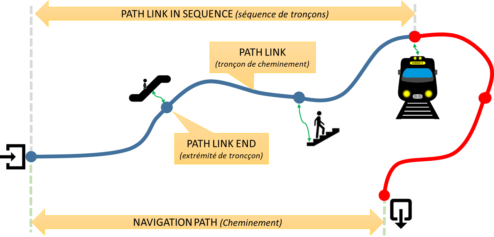
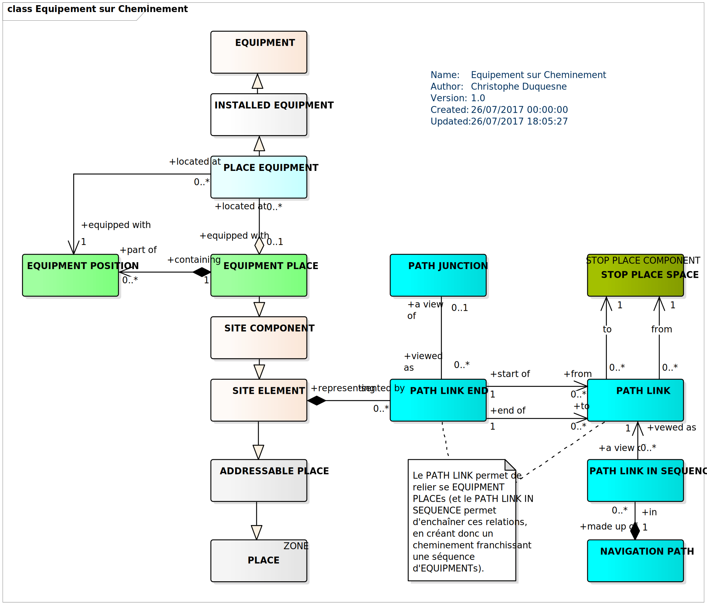
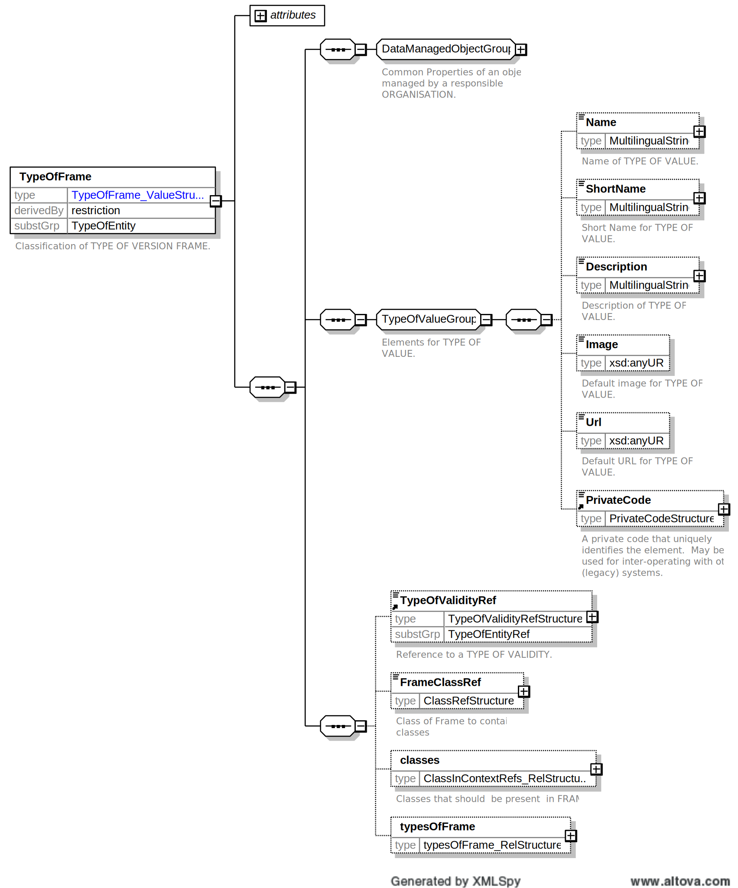

**Avant-propos**

L’harmonisation des pratiques dans l’échange des données relatives aux
offres de transport est essentielle :

- pour l’usager, aux fins d’une présentation homogène et compréhensible de
l’offre de transport et de l’engagement sous-jacent des organisateurs
(autorités organisatrices et opérateurs de transports) ;

- pour les AOT, de manière à fédérer des informations homogènes venant de
chacun des opérateurs de transports qui travaillent pour elles.
L’harmonisation des échanges, et en particulier le présent profil,
pourra le cas échéant être imposée par voie contractuelle. Cette
homogénéité des formats d’information permet d’envisager la mise en
place de systèmes d’information multimodaux, produisant une information
globale de l’offre de transports sur un secteur donné, et garantir le
fonctionnement des services d’information, en particulier des
calculateurs d’itinéraires, et la cohérence des résultats, que ces
services soient directement intégrés dans ces systèmes d’information
multimodaux ou qu’ils puisent leurs informations sur des bases de
données réparties ;

- pour les opérateurs, qui pourront utiliser ce format d’échange pour
leurs systèmes de planification, les systèmes d’aide à l’exploitation,
leurs systèmes billettiques et leurs systèmes d’information voyageur
(information planifiée et information temps réel) ;

- pour les industriels et développeurs pour pérenniser et fiabiliser leurs
investissements sur les formats d’échanges implémentés par les systèmes
qu’ils réalisent, tout en limitant fortement l’effort de spécification
lié aux formats d’échange.

Ce document est le fruit de la collaboration entre les différents
partenaires des autorités organisatrices de transports, opérateurs,
industriels, développeurs de solutions et de systèmes informatiques, et
associations d'usagers ayant pour objet l’aide à l’exploitation du
transport public et l’information des voyageurs. Il a pour objet de
présenter le profil d’échange Profil NeTEx Accessibilité: "format de
référence pour l'échange de données de description de l'accessibilité
des réseaux de transport en commun" (issu des travaux *NeTEx* et
*Transmodel)* qui aujourd’hui fait consensus dans les groupes de
normalisation (CN03/GT7 – Transport public / information voyageur).

**Introduction**

Le présent format d’échange est un profil de NeTEx.

NeTEx (CEN TS 16614-1, 16614-2 et 16614-3) propose un format et des
services d'échange de données de description de l'offre de transport
planifiée, basé sur Transmodel (EN 12896) et l’ancienne norme IFOPT (EN
28701). NeTEx permet non seulement d'assurer les échanges pour les
systèmes d'information voyageur mais traite aussi l’ensemble des
concepts nécessaires en entrée et sortie des systèmes de planification
de l'offre (graphiquage, etc.) et des SAE (Systèmes d’Aide à
l’Exploitation).

NeTEx se décompose en trois parties:

-   Partie 1 : topologie des réseaux (les réseaux, les lignes, les
    parcours commerciaux les missions commerciales, les arrêts et lieux
    d’arrêts, les correspondances et les éléments géographiques en se
    limitant au strict minimum pour l’information voyageur)

-   Partie 2 : horaires théoriques (les courses commerciales, les heures
    de passage graphiquées, les jours types associés ainsi que les
    versions des horaires)

-   Partie 3 : information tarifaire (uniquement à vocation
    d’information voyageur)

NeTEx a été développé dans le cadre du CEN/TC 278/WG 3/SG 9 piloté par
la France. Les parties 1 et 2 ont été publiées en tant que spécification
technique début 2014. Les travaux pour la partie 3, quant à eux, se
termineront courant 2014sont terminés en 2016.

Il faut noter que NeTEx a été l'occasion de renforcer les liens du
CEN/TC278/WG3 avec le secteur ferrovaire, en particulier grâce à la
participation de l'ERA (Agence Européen du Rail, qui a intégré NeTEx
dans la directive Européenne 454/2011 TAP-TSI) et de l'UIC (Union
International des Chemins de fer).

Les normes, dans leur définition même, sont des « documents établis par
consensus ». Celles du CEN/TC278 sont de plus établies à un niveau
européen, en prenant donc en compte des exigences qui dépassent souvent
le périmètre national.

Il en résulte des normes qui sont relativement volumineuses et dont le
périmètre dépasse souvent largement les besoins d'une utilisation
donnée. Ainsi, à titre d'exemple, SIRI propose toute une série d'options
ou de mécanismes dont la vocation est d'assurer la compatibilité avec
les systèmes développés en Allemagne dans le contexte des VDV 453/454.
De même, SIRI propose des services dédiés à la gestion des
correspondances garanties, services qui, s'ils sont dès aujourd'hui
pertinents en Suisse ou en Allemagne, sont pratiquement inexistants en
France.

De plus, un certain nombre de spécificités locales ou nationales peuvent
amener à préciser l'usage ou la codification qui sera utilisée pour
certaines informations. Par exemple, les Anglais disposant d'un
référentiel national d'identification des points d'arrêts (NaPTAN), ils
imposeront naturellement que cette codification soit utilisée dans les
échanges SIRI, ce que ne feront pas les autres pays européens.

Enfin, certains éléments proposés par ces normes sont facultatifs et il
convient, lors d'une implémentation, de décider si ces éléments seront
ou non implémentés.

L'utilisation des normes liées à l'implémentation de l'interopérabilité
pour le transport en commun passe donc systématiquement par la
définition d'un profil (local agreement, en anglais). Concrètement, le
profil est un document complémentaire à la norme et qui en précise les
règles de mise en œuvre dans un contexte donné. Le profil contient donc
des informations comme :

-   détail des services utilisés,

-   détails des objets utilisés dans un échange,

-   précisions sur les options proposées par la norme,

-   précision sur les éléments facultatifs,

-   précision sur les codifications à utiliser,

-   etc.

Les principaux profils actuellement utilisés en France sont NEPTUNE
(profil de TRIDENT) et le profil de SIRI défini par le CEREMA et
Île-de-France Mobilités. Ces deux profils ont une vocation nationale. Le
groupe de travail GT7 (AFNOR BNTRA/CN 03/GT 7) a élaboré une sélection
des concepts Transmodel nécessaire à la description des horaires en
France (à vocation d'information voyageur essentiellement). C'est sur la
base de cette sélection qu'est élaboré le présent profil.

D'autre profils de NeTEx sont disponibles (arrêt, réseau, tarif). Ils
sont tous complémentaires les uns des autres (sans recouvrement) et
s'appuient tous sur un document partagé: **NeTEx - Profil Français de
NETEx: éléments communs.** Il conviendra de se référer à ce document
pour tous les éléments utilisés dans le présent document, et dont la
structure n'est pas détaillée.

Ce profil d’échange a pour objectif de décrire et de structurer
précisément les éléments nécessaires à une bonne information de
description des horaires de transport public de façon :

-   à pouvoir les présenter d’une manière homogène et compréhensible à
    l’usager des transports publics sur des supports différents (papier
    ou Internet),

-   à pouvoir les échanger entre systèmes d’information (systèmes
    d’information voyageurs et systèmes d’information multimodale,
    systèmes d’aide à l’exploitation, systèmes de planification,
    systèmes billettiques, etc.).

Les éléments présentés ci-dessous couvrent donc l’ensemble des concepts
propres à la description des horaires.

**NOTE IMPORTANTE** Ce document étant un profil d'échange de NeTEx, il
ne se substitue en aucun cas à NeTEx, et un minimum de connaissance de
NeTEx sera nécessaire à sa bonne compréhension.

# Domaine d'application

Le présent document est un profil de la spécification technique NeTEx CEN/TS 16614 pour
l'échange de données de description de l'accessibilité des réseaux en
France. Il permet de décrire et de structurer l'information pour des
échanges entre systèmes d'information ainsi que pour en proposer des
présentations aux voyageurs.

Ce document se positionne en complément des profils existants (Éléments
Communs, Arrêts, Réseaux et Horaires) qui ont déjà introduit les notions
de base de l'accessibilité via les concepts d'**ACCESSIBILITÉ**
(ACCESSIBILITY ASSEMENT) et de **LIMITATION D'ACCESSIBILITÉ**
(ACCESSIBILITY LIMITATION), détaillées dans le profil Éléments Communs
et utilisées par tous les autres. On notera aussi que le profil Réseaux
propose une vue très limitée du CHEMINEMENT (NAVIGATION PATH) dont la
vocation est de porter les ***AccessFeatureList*** (types
d'équipement rencontrés sur un cheminement) pour les correspondances
entre sites.

Cette première approche de l'accessibilité se voulait minimale et le
présent document l'aborde de façon beaucoup plus détaillée.

Ce document a été élaboré sur la base des réflexions et échanges
intervenus dans le cadre du GT7 ainsi qu'en utilisant les conclusions de
l'étude CAMERA.

Ce document a également été enrichi à l'aide du standard d’échange de
données sur l’accessibilité des déplacements pour les personnes en
situation de handicap produit par le groupe de travail CNIG sur
l'Accessibilité. Ce modèle a pour but de décrire l'accessibilité
des cheminements extérieurs en voirie, typiquement des trottoirs
reliant un arrêt de transport en commun à l’entrée d’un ERP.

Des compléments permettant d'assurer la mise en relation avec l'ontologie
 du projet OpenStreetMap ont également été apportés au document.
 OpenStreetMap (OSM) est un projet collaboratif de cartographie
 proposant une base de données géographiques libre du monde
entier.

Si la première motivation pour la définition de ce profil est bien
l'accessibilité, cet objet n'est en aucun cas limitatif et les
informations contenues (en particulier concernant les équipements et les
cheminements) ont été généralisées pour un usage de type information
voyageur sans restriction particulière à l'accessibilité (ce qui
correspond bien à l'approche de NeTEx).

# Références normatives

Les documents de référence suivants sont indispensables pour
l'application du présent document. Pour les références datées, seule
l'édition citée s'applique. Pour les références non datées, la dernière
édition du document de référence s'applique (y compris les éventuels
amendements).

TS 16614-1, Network and Timetable Exchange (NeTEx) — Part 1: Public
transport network topology exchange format

TS 16614-2, Network and Timetable Exchange (NeTEx) — Part 2: Public
transport scheduled timetables exchange format

EN 12896, Public transport - Reference data model (Transmodel)

# Termes et définitions

NOTE Pour les besoins du présent document, les termes et définitions
suivants s'appliquent. Ils sont directement issus de la traduction
française de Transmodel et NeTEx (on notera que
certaines traductions sont un peu « étonnantes », toutefois il a été
jugé préférable de rester cohérent avec la traduction officielle). Il
conviendra souvent de se référer au corps du document car certaines
traductions officielles peuvent amener à une totale incompréhension des
concepts.

Pour une information complète, il conviendra toutefois de se référer au
document normatif.

**ACCESSIBILITY ASSESSMENT (ÉVALUATION D'ACCESSIBILITÉ)**

Caractéristiques d'accessibilité d'une entité utilisée par les
passagers, telles qu'un LIEU D’ARRET ou un COMPOSANT DE LIEU D’ARRET.
Décrites par LIMITES D'ACCESSIBILITÉ et / ou un ensemble de d’APTITUDEs
(pour l’accessibilité).

**ACCESSIBILITY LIMITATION (LIMITE D'ACCESSIBILITÉ)**

Catégorisation des caractéristiques d'accessibilité d'un SITE (p. ex. :
LIEU D'ARRÊT ou COMPOSANT DE LIEU D'ARRÊT) pour indiquer son
utilisabilité par les passagers ayant des besoins spécifiques, notamment
ceux nécessitant un accès par fauteuil roulant, un accès sans marche ou
ceux voulant éviter les espaces confinés tels que les ascenseurs.
Quelques catégories bien définies sont utilisées, choisies pour
permettre la saisie efficace des données et le calcul efficace
d'itinéraires pour les différentes classes d'usager.

**ACCESS (ACCÈS)**

Possibilité matérielle (spatiale) pour un usager d'accéder à un système
de transports publics ou de le quitter. Ce tronçon peut être utilisé
pendant un déplacement pour permettre au voyageur d'effectuer : - le
trajet à pied d'un LIEU (origine du déplacement) vers un POINT D'ARRÊT
PLANIFIÉ (origine du DÉPLACEMENT SUR RÉSEAU), ou - le trajet à pied
depuis un POINT D'ARRÊT PLANIFIÉ (destination du DÉPLACEMENT SUR RÉSEAU)
vers un LIEU (destination du déplacement).

**ACCESS END (FIN D'ACCÈS)**

Origine ou destination d'un tronçon d'ACCÈS. Peut indiquer un POINT
et/ou un LIEU.

**ACCESS MODE (MODE D'ACCÈS)**

Caractérisation du trajet d'un passager lorsqu'il emprunte un moyen de
transport autre que les transports publics (p. ex : à pied, à vélo, etc.).

**ACCOMODATION (HÉBERGEMENT)**

Combinaison de caractéristiques d'hébergement disponibles sur un service
(p. ex : "Couchette première classe douche/2 lits").

**ACTUAL VEHICLE EQUIPMENT (ÉQUIPEMENT VÉHICULE RÉEL)**

Équipement d'un type particulier sur un VÉHICULE donné.

**ASSISTANCE SERVICE (SERVICE D'ASSISTANCE)**

SERVICE LOCAL spécialisé dans l'ASSISTANCE, fournissant des informations
telles que la langue, le personnel formé à l'accessibilité, etc.

**CATERING SERVICE (SERVICE DE RESTAURATION)**

Spécialisation de SERVICE LOCAL dédiée aux services de restauration.

**COMMUNICATION SERVICE (SERVICE DE COMMUNICATIONS)**

Spécialisation de SERVICE LOCAL dédiée aux services de communications.

**COMPLAINTS SERVICE (SERVICE DE RÉCLAMATIONS)**

Spécialisation du SERVICE CLIENT pour les RÉCLAMATIONS.

**CROSSING EQUIPMENT (ÉQUIPEMENT DE CROISEMENT)**

ÉQUIPEMENT D'ACCÈS À LA PLACE spécialisé pour ÉQUIPEMENTS DE
FRANCHISSEMENT (passages piétons, éclairage piétons, dispositif
acoustique, capteurs, bandes de guidage tactiles, etc.).

**CUSTOMER SERVICE (SERVICE CLIENT)**

SERVICE LOCAL générique spécial pour SERVICE CLIENT (objets perdus,
point de rencontre, réclamations, etc.).

**CYCLE STORAGE EQUIPMENT (ÉQUIPEMENT DE STOCKAGE DE CYCLE)**

Spécialisation de l'ÉQUIPEMENT DE PLACE décrivant les équipements de
parc pour deux-roues.

**ENCUMBRANCE NEED (BESOIN DE TRANSPORT DE BAGAGES)**

BESOIN D'USAGER spécifique, à savoir une exigence d'un passager
voyageant avec des bagages, un animal ou tout autre objet, et qui
nécessite donc des dispositions particulières pour accéder aux
transports publics.

**ENTRANCE EQUIPMENT (ÉQUIPEMENT D'ENTRÉE)**

Spécialisation d'ÉQUIPEMENT D'ACCÈS À LA PLACE pour ENTRÉES (portes,
barrières, portes tournantes, etc.)

**EQUIPMENT (ÉQUIPEMENT)**

Équipement installé de manière fixe (ÉQUIPEMENT DE LIEU) ou à bord des
véhicules (ÉQUIPEMENT VÉHICULE). Un service (SERVICE LOCAL de type
CONSIGNE, SERVICE DE BILLETTERIE) est considéré comme un équipement
immatériel.

**EQUIPMENT PLACE (LIEU DES EQUIPEMENTS)**

COMPOSANT DE SITE comprenant un ÉQUIPEMENT

**EQUIPMENT POSITION (POSITION DES EQUIPEMENTS)**

La place précise au sein d'un LIEU DES ÉQUIPEMENTS d'équipements
particuliers.

**ESCALATOR EQUIPMENT (ÉQUIPEMENT D'ESCALIER ROULANT)**

Spécialisation de l'ÉQUIPEMENT D'ESCALIER pour des ESCALIERS ROULANTS.

**FACILITY (INSTALLATION)** 

*note : la traduction SERVICE aurait probablement été plus appropriée*

Commodité nommée mise à la disposition du public sur un SITE ou un
SERVICE. Une prestation ne possède pas d'autres propriétés qu'un nom. Un
ÉQUIPEMENT ou SERVICE LOCAL est utilisé pour décrire les autres
propriétés fournies dans le cadre d'une prestation particulière.

**FACILITY SET (ENSEMBLE D'INSTALLATIONS)**

Ensemble d'INSTALLATIONS disponibles pour une COURSE COMMERCIALE ou un
MORCEAU DE COURSE. L'ensemble peut être disponible uniquement pour un
TYPE DE VÉHICULE spécifique du SERVICE (p. ex : voiture équipée d'un
plancher surbaissé).

**GENERAL SIGN (SIGNALISATION GÉNÉRALE)**

Spécialisation d'ÉQUIPEMENT DE SIGNALISATION différent des INDICATIONS
DE DIRECTION et de LIEU.

**HEADING SIGN (SIGNALISATION DE TITRE)** 

*note : GIROUETTE aurait été une traduction plus appropriée*

Spécialisation d'ÉQUIPEMENT DE SIGNALISATION indiquant le nom d'une
direction, d'une ligne, etc.

**HIRE SERVICE (SERVICE DE LOCATION)**

Spécialisation de SERVICE LOCAL dédiée aux services de location (cycles,
voitures).

**INSTALLED EQUIPMENT (ÉQUIPEMENT INSTALLÉ)**

Équipement installé de manière fixe (ÉQUIPEMENT DE LIEU) ou embarqué
(associé à des véhicules). Cet équipement est matérialisé par opposition
à un service (SERVICE LOCAL), considéré comme un équipement immatériel.

**LEFT LUGGAGE SERVICE (SERVICE DE CONSIGNE)**

Spécialisation du SERVICE CLIENTÈLE pour les consignes à bagages
(casiers en libre-service, gratuits, etc.).

**LIFT EQUIPMENT (ÉQUIPEMENT D'ASCENSEUR)**

Spécialisation d'ÉQUIPEMENT D'ACCÈS À LA PLACE pour ASCENSEURS (indique
des caractéristiques telles que la profondeur, la charge maximale,
etc.).

**LOCAL SERVICE (SERVICE LOCAL)**

Service identifié en fonction de l'utilisation du SITE ou des services
de transport à un lieu particulier (p. ex :porteur, assistance aux
usagers handicapés, bureaux de réservation). Le service peut posséder
une CONDITION DE VALIDITÉ qui lui est associée. Un SERVICE LOCAL est
traité comme une forme d'ÉQUIPEMENT immatériel.

**LOST PROPERTY SERVICE (SERVICE DES OBJETS TROUVÉS)**

Spécialisation du SERVICE CLIENTÈLE pour les objets trouvés.

**LUGGAGE SERVICE (SERVICE BAGAGES)**

Spécialisation du SERVICE CLIENTÈLE pour les bagages
(installations/équipements et caractéristiques telles que les chariots à
bagages, l'utilisation gratuite, etc.).

**LUGGAGE LOCKER EQUIPMENT (ÉQUIPEMENT DE CONSIGNE À BAGAGES)**

Spécialisation de l'ÉQUIPEMENT DE POINT D'ARRÊT pour les consignes à
bagages.

**MEDICAL NEED (BESOIN MÉDICAL)**

BESOIN D'USAGER spécifique, à savoir une exigence d'un passager en ce
qui concerne une contrainte médicale (p. ex : allergie) pour accéder aux
transports publics.

**MEETING POINT SERVICE (SERVICE DE POINT DE RENCONTRE)**

Spécialisation du SERVICE CLIENT pour les points de rencontre
(caractéristiques telles que la description, le libellé, etc.).

**MOBILITY NEED (BESOIN DE MOBILITÉ)**

BESOIN D'USAGER spécifique, à savoir une contrainte d'un passager en ce
qui concerne sa mobilité (p. ex : fauteuil roulant, fauteuil roulant
motorisé).

**MONEY SERVICE (SERVICE DE CHANGE)**

Spécialisation de SERVICE LOCAL dédiée aux services d'argent.

**NAVIGATION PATH (CHEMINEMENT USAGER)**

Un tronçon désigné entre deux endroits. Peut inclure une séquence triée
de TRONÇONS DE CHEMINEMENT.

**NAVIGATION PATH ASSIGNMENT (AFFECTATION DE CHEMINEMENT DE NAVIGATION)**

Affectation d'un CHEMINEMENT USAGER à une AFFECTATION DE POINT D'ARRÊT
spécifique, par exemple, pour indiquer le chemin à prendre pour établir
une CONNEXION.

**ONBOARD STAY (SÉJOUR À BORD)**

Permission d'embarquer avant la course ou de rester à bord après la
course.

**PASSENGER EQUIPMENT (ÉQUIPEMENT USAGER)**

Équipement d'un type particulier réellement disponible au niveau d'un
LIEU ou d'un VÉHICULE.

**PASSENGER INFORMATION EQUIPMENT (ÉQUIPEMENT D'INFORMATIONS AUX PASSAGERS)**

Un équipement destiné à fournir des informations sur les transports en
commun, tels que des terminaux (dans la rue, aux guichets ou reliés à un
central, etc.) ou des supports papier (affichettes aux points d'arrêt,
fascicules, etc.).

**PASSENGER SAFETY EQUIPMENT (ÉQUIPEMENT DE SÉCURITÉ DES PASSAGERS)**

Spécialisation ÉQUIPEMENT PASSAGER pour la sécurité des passagers.

**PATH JUNCTION (NŒUD DE CHEMINEMENT)**

Un point précis, à l'intérieur ou à l'extérieur d'un LIEU D'ARRÊT ou
d'un POINT D'INTERÊT, au niveau duquel deux TRONÇONS DE CHEMINEMENTS
peuvent se connecter

**PATH LINK (TRONÇON DE CHEMINEMENT)**

Un tronçon dans un LIEU ou entre plusieurs LIEUX (par exemple, LIEUX
D'ARRÊT, ESPACES D'ACCÈS ou QUAIS, POINTS D'EMBARQUEMENT, POINTS
D'INTÉRÊT, etc., NŒUDS DE CHEMINEMENT), qui représente une étape d'un
itinéraire possible pour les piétons, les cyclistes ou les autres
passagers non véhiculés au sein d'un LIEU ou entre des LIEUX.

NOTE Il est possible, mais pas obligatoire, qu'un TRONÇON DE CHEMINEMENT
projette sur un ensemble d'infrastructures ou de tronçons de mapping
plus détaillés qui tracent l'itinéraire dans l'espace, ce qui permet de
le représenter sur des plans et des systèmes de suivi.

**PATH LINK END (FIN DE TRONÇON DE CHEMINEMENT)**

SITE de départ ou d'arrivée d'un TRONÇON DE CHEMINEMENT. Il peut être
lié à un NIVEAU spécifique du SITE.

**PATH LINK IN SEQUENCE (TRONÇON DE CHEMINEMENT EN SÉQUENCE)**

Étape d'un CHEMINEMENT USAGER indiquant la traversée d'un TRONÇON DE
CHEMINEMENT particulier au sein d'un itinéraire recommandé.

**PLACE ACCESS EQUIPMENT (ÉQUIPEMENT D'ACCÈS À LA PLACE)**

Spécialisation d'ÉQUIPEMENT DE LIEU dédiée à l'accès (ascenseurs,
entrées, escaliers, rampes, etc.).

**PLACE EQUIPMENT (ÉQUIPEMENT DE LIEU)**

Équipement d'un type particulier réellement disponible au niveau d'un
LIEU.

**PLACE IN SEQUENCE (LIEUX ACCESSIBLES EN SEQUENCE)**

Point traversé par un CHEMINEMENT USAGER en séquence, connecté par un
TRONÇON DE CHEMINEMENT jusqu'au point suivant. Il peut s'agir d'un lieu,
d'un NŒUD ou d'un POINT.

**PLACE LIGHTING (ÉCLAIRAGE DE LA PLACE)**

Spécialisation de l'ÉQUIPEMENT DE LIEU pour ÉQUIPEMENT D'ÉCLAIRAGE (par
ex., réverbère).

**PLACE SIGN (SIGNALISATION DE PLACE)**

Panneau portant le nom d'un LIEU.

**POINT OF INTEREST (POINTS D'INTÉRÊT)**

Type de LIEU vers ou à travers lequel les passagers peuvent souhaiter
circuler au cours de leur course et qui est modélisé en détail par les
calculateurs d'itinéraire.

**PSYCHOSENSORY NEED (BESOIN PSYCHOSENSORIEL)**

BESOIN D'USAGER spécifique, à savoir une contrainte d'un passager
relative à un handicap psychosensoriel (p. ex : troubles visuels ou
auditifs, aversion pour les espaces confinés).

**QUEUING EQUIPMENT (ÉQUIPEMENT DE FILE D'ATTENTE)**

Spécialisation d'ÉQUIPEMENT D'ACCÈS AU LIEU dédiée aux files d'attente.

**RAMP EQUIPMENT (ÉQUIPEMENT DE RAMPE)**

Spécialisation d'ÉQUIPEMENT D'ACCÈS AU LIEU pour rampes (indique des
caractéristiques telles que la profondeur, la pente, etc.).

**RETAIL SERVICE (SERVICE DE DÉTAIL)**

Spécialisation de SERVICE LOCAL dédiée aux services de distribution.

**ROUGH SURFACE (SURFACE RUGUEUSE)**

Spécialisation de l'ÉQUIPEMENT DE LIEU pour surfaces rugueuses, qui
indique la texture des surfaces, principalement pour informer les
personnes handicapées.

**RUBBISH DISPOSAL (ÉLIMINATION DES DÉCHETS)**

Spécialisation des ÉQUIPEMENTS pour évacuation des déchets, indiquant
les types de déchets, etc.

**SANITARY EQUIPMENT (ÉQUIPEMENT SANITAIRE)**

Spécialisation ÉQUIPEMENT PASSAGER pour les installations sanitaires.

**SEATING EQUIPMENT (ÉQUIPEMENT DE SIÈGES)**

Spécialisation de l'ÉQUIPEMENT DE LIEU décrivant les propriétés des
sièges

**SERVICE FACILITY SET (ENSEMBLE D'INSTALLATIONS DE SERVICE)**

Ensemble d'INSTALLATIONS disponibles pour un TYPE DE VÉHICULE spécifique
(p. ex : voiture équipée d'un plancher surbaissé), éventuellement pour
un service uniquement (ou pour une COURSE ou une COURSE COMMERCIALE).

**SHELTER EQUIPMENT (ÉQUIPEMENT D'ABRIS)**

Spécialisation de l'ÉQUIPEMENT D'ATTENTE pour un abri.

**SIGN EQUIPMENT (ÉQUIPEMENT DE SIGNALISATION)**

Spécialisation de l'ÉQUIPEMENT DE LIEU pour la signalisation
(directions, etc.).

**SITE EQUIPMENT (ÉQUIPEMENT DE SITE)**

Spécialisation d'ÉQUIPEMENT DE LIEU pour SITES (CASIER À BAGAGES,
ÉQUIPEMENT D'ATTENTE, STAND DE CHARIOTS, etc.)

**SITE FACILITY SET (ENSEMBLE D'INSTALLATIONS SUR SITE)**

Ensemble d'INSTALLATIONS disponibles pour un ÉLÉMENT DE SITE.

**STAIR EQUIPMENT (ÉQUIPEMENT D'ESCALIER)**

Specialisation of ACCESS EQUIPMENT for stairs (stair, escalator,
staircase, etc.).

**STAIRCASE EQUIPMENT (ÉQUIPEMENT D'ESCALIER)**

Spécialisation d'ÉQUIPEMENT D'ACCÈS AU LIEU pour escaliers (escalier,
escalier mécanique, cage d'escalier, etc.).

**SUITABILITY (APPROPRIATION)**

Déclaration stipulant si un BESOIN D'USAGER particulier peut être
satisfait. Elle peut être utilisée pour indiquer si un SITE est
accessible par un passager ayant un BESOIN particulier.

**TICKET VALIDATOR EQUIPMENT (ÉQUIPEMENT DE VALIDATION DE TITRES DE TRANSPORT)**

Spécialisation de l'ÉQUIPEMENT PASSAGER (ÉQUIPEMENT DE LIEU) décrivant
les contrôleurs de billets.

**TICKETING EQUIPMENT (ÉQUIPEMENT DE DISTRIBUTION DE TITRES DE TRANSPORT)**

Spécialisation de l'ÉQUIPEMENT PASSAGER pour la billetterie.

**TICKETING SERVICE (SERVICE DE DISTRIBUTION DE TITRES DE TRANSPORT)**

Spécialisation de SERVICE LOCAL pour billetterie, fournissant des
informations sur les guichets de billetterie et les achats en ligne,
également associée à la méthode de paiement et au TYPE DE BILLET.

**TRAVELATOR EQUIPMENT (ÉQUIPEMENT DE TAPIS ROULANT)**

Spécialisation d'ÉQUIPEMENT D'ACCÈS AU LIEU pour tapis roulants
(propriétés telles que la vitesse, etc.).

**TROLLEY STAND EQUIPMENT (ÉQUIPEMENT DE STANDS DE CHARIOTS)**

Spécialisation de l'ÉQUIPEMENT DE POINT D'ARRÊT pour les stands de
chariots.

**TYPE OF ACCESSIBILITY TOOLS (TYPE D'OUTILS D'ACCESSIBILITÉ)**

Classification des OUTILS D'ACCESSIBILITÉ utilisés ou mis à disposition
par le SERVICE D'ASSISTANCE (fauteuils roulants, cannes, navigateurs
audio, navigateurs visuels, etc.).

**TYPE OF ASSISTANCE SERVICE (SERVICE DE TYPE D'ASSISTANCE)**

Classification de SERVICE D'ASSISTANCE (assistance à l'embarquement, à
bord, portage, langues étrangères, traduction en langage des signes,
etc.).

**TYPE OF EMERGENCY SERVICE (SERVICE DE TYPE D'URGENCE)**

Typologie des services d'urgence (police, premiers secours, borne
d'appel, vidéosurveillance).

**TYPE OF GENDER LIMITATION (SERVICE DE LIMITATION DE SEXE)** 

*Note le
traducteur officiel aurait peut-être pu se relire ici !!* 

Classification des LIMITATIONS SELON LE GENRE (principalement pour
ÉQUIPEMENTS SANITAIRES, par ex., réservé aux hommes/femmes, ou les
deux).

**TYPE OF HANDRAIL (TYPE DE MAIN COURANTE)**

Classification de MAIN COURANTE (un côté, deux côtés).

**TYPE OF SANITARY FACILITY (SERVICE D'INSTALLATION SANITAIRE)**

Classification d'ÉQUIPEMENT SANITAIRE (toilettes, toilettes pour
handicapés, douches, table à langer, table à langer pour handicapés)

**TYPE OF STAFFING (TYPE DE PERSONNEL)**

Classification de disponibilité du PERSONNEL associé à un SERVICE
D'ASSISTANCE (plein temps, temps partiel)

**TYPE OF USER NEED (TYPE DE BESOIN D'USAGER)**

Classification des BESOINS D'USAGERS.

**USER NEED (BESOIN D'USAGER)**

Besoin d'un usager exigeant une APPROPRIATION particulière.

**VEHICLE ACCESS EQUIPMENT (ÉQUIPEMENT D'ACCÈS AU VÉHICULE)**

Spécialisation de l'ÉQUIPEMENT VÉHICULE permettant l'accès aux
véhicules, qui fournit différentes

informations (p. ex : plancher surbaissé, rampe, dimensions de la zone
d'accès).

**VEHICLE CHARGING EQUIPMENT (ÉQUIPEMENT DE RECHARGE DE VÉHICULE)**

Spécialisation de l'ÉQUIPEMENT DE PLACE pour la recharge de véhicule.

**WAITING EQUIPMENT (ÉQUIPEMENT D'ATTENTE)**

Spécialisation de l'ÉQUIPEMENT DE LIEU D'ARRÊT pour ÉQUIPEMENTS
D'ATTENTE (abri, salle d'attente, etc.).

**WAITING ROOM EQUIPMENT (ÉQUIPEMENT DE SALLE D'ATTENTE)**

Spécialisation de l'ÉQUIPEMENT D'ATTENTE pour salle d'attente, classée
par TYPE DE SALLE D'ATTENTE.

**WHEELCHAIR VEHICLE EQUIPMENT (ÉQUIPEMENT VÉHICULE POUR FAUTEUILS ROULANTS)**

Spécialisation de l'ÉQUIPEMENT VÉHICULE permettant l'accès des fauteuils
roulants à bord d'un VÉHICULE, qui fournit différentes informations (p.
ex : nombre de places pour fauteuils roulants et dimensions de l'accès).

# Symboles et abréviations

AO

Autorité Organisatrice de Transports

CNIG

Conseil National de l'Information Géographique

OSM

OpenStreetMap

PMR

Personne à Mobilité Réduite

# Exigences minimum liées à la LOM et la règlementation Européenne

La LOI n° 2019-1428 du 24 décembre 2019 d'orientation des mobilités
(LOM :
<https://www.legifrance.gouv.fr/dossierlegislatif/JORFDOLE000037646678>)
et, au niveau Européen, le règlement délégué (UE) 2024/493 de la
Commission du 29 novembre 2023 modifiant le règlement délégué 2017/1926, dit 
« règlement MMTIS », (complétant la directive 2010/40/UE du
Parlement européen et du Conseil en ce qui concerne la mise à
disposition, dans l'ensemble de l'Union, de services d'informations sur
les déplacements multimodaux) rendent obligatoire la mise à disposition,
quand elles existent, de certains types de données.

Le tableau ci-dessous résulte de l’analyse de la LOM et du règlement
délégué et fournit la liste des concepts concernés dans le présent
profil. Il sera donc nécessaire de fournir ces données pour être
conforme aux obligations ussues de la réglemenation et de la législation.
Celles-ci indiquent la disposition de toutes les données existantes dans les SI 
transport, et pour les données d'accessibilité, de les créer, c'est-à-dire de les collecter
et de les échanger selon le profil NeTEx accessibilité France.

Les exigences techniques en matière d’accessibilité de la voirie, des espaces publics 
et des équipements associés (arrêts de bus, information voyageur…) à respecter sont 
celles de l’arrêté du 15 janvier 2007 (modifié) relatif l'accessibilité de la voirie 
et des espaces publics. Pour les établissements recevant du public et les équipements de
type sanitaires, se référer à l’arrêté du 20 avril 2017 relatif à l’accessibilité des
établissements recevant du public (dits « ERP »).

Ainsi, les critères proposés dans le Profil Accessibilité sont marqués « oui », 
uniquement s’ils sont conformes à la réglementation en vigueur. Ainsi, par exemple, 
pour que l’arrêt de bus bénéficie de « Oui » au critère « accessible en fauteuil roulant »,
les exigences précisées aux trois premiers alinéas du 12° de l’article 1 de l’arrêté du 15
janvier 2007 doivent être satisfaites. Afin de fournir une information détaillée aux 
usagers, il est recommandé de compléter directement les éléments du niveau 3 du profil
accessibilité, lorsqu'ils sont disponibles.

En effet, le profil accessibilité propose 3 niveaux d’information, du
plus basique au plus complet : 
- les informations de base (voir 6.2), évaluation basée au minimum sur le respect
 des exigences d'accessibilité définies par la réglementation en vigueur mais pouvant
 également être déduite par le renseignement du niveau 3 (6.5, 6.6 et Annexes) ;
- un niveau intermédiaire décrivant les services disponibles (voir 6.4) ;
- et un niveau complet qui permet de détailler les cheminements et les équipements
 (voir 6.5, 6.6 et Annexe) et donc de fournir, à terme, l’information nécessaire
 aux usagers pour leur permettre de construire les trajets accessibles selon
 leur profil et leurs besoins, permettant ainsi aux calculateurs d’itinéraires de
 fournir un service public non discriminatoire.

L’arrêté du 28 mai 2024 relatif aux dispositions de la collecte des données 
« accessibilité » dans les transports et en voirie pour les déplacements des personnes
handicapées ou à mobilité réduite pris en application des articles L. 1115-6, L. 1115-7, 
D. 1115-9 et D. 1115-10 du code des transports, des articles L. 141-13 et R. 121-24 du 
code de la voirie routière (https://www.legifrance.gouv.fr/loda/id/JORFTEXT000049642987/) 
définit les éléments obligatoires pour la description de
l’accessibilité, à savoir tous les éléments de base.

Notez que les concepts présents dans les tableaux sont les ceux qui sont
directement référencés par l’annexe du règlement européen
(<https://eur-lex.europa.eu/legal-content/FR/TXT/HTML/?uri=CELEX:02017R1926-20240304>),
mais que pour beaucoup d’entre eux, cela impliquera d’autres concepts
(soit par héritage soit par relation, au sens UML des termes). Ces
éléments d’héritage et de relations sont présentés dans les profils,
mais pas dans ce tableau.

De plus, les noms des catégories (colonnes Catégorie et Détail) ont été
conservés dans la langue originale du document (l’anglais) pour éviter
tout risque de confusion. Pour la même raison, les noms des concepts
concernés sont ceux de la version originale de Transmodel.

Pour certaines catégories de données, il peut arriver que les concepts
correspondants soient multiples, mais aussi qu’ils soient différents
suivant le niveau de précision porté par la donnée. La colonne
« Concepts à minima » correspond alors au minimum à fournir pour
répondre à la catégorie en question et les colonnes « Autres concepts »
décrit des informations complémentaires qui, si elles sont utiles, ne
sont pas indispensables pour répondre à cette catégorie (notez que dans
certains cas, ces concepts additionnels peuvent relever d’autres
profils : ceci est précisé dans le tableau quand c’est le cas). Il faut
toutefois garder à l’esprit que toute information existante est supposée
être mise à disposition (que cela relève de la première ou de la seconde
colonne).

Dans le contexte spécifique de l’accessibilité, les concepts eux-mêmes
(arrêts, véhicules, lignes, etc.) sont majoritairement définis dans les
autres profils (Arrêt, Horaire, Réseau et Parking) le profil
accessibilité vient compléter ces informations : on aura donc très
régulièrement plusieurs profils impliqués.

Concernant le cas spécifique du rail, la STI PMR
(<https://eur-lex.europa.eu/legal-content/FR/TXT/PDF/?uri=CELEX:32019R0772&from=FR>)
exige un « inventaire des actifs » ayant pour objet :  « de recenser les obstacles et
entraves existants à l’accessibilité », et de « fournir des informations pratiques aux
usagers ». Ces données doivent être fournies selon un profil Transmodel spécifique
harmonisé. En tout état de cause, comme indiqué précédemment, le strict minimum reste de
fournir les informations de base décrites en 6.2, et celles rendues obligatoires par
l’arrêté du 28 mai 2024 relatif aux dispositions de la collecte des données 
« accessibilité » dans les transports et en voirie pour les déplacements des personnes handicapées ou à mobilité réduite.

Note : sur ce point, une synchronisation avec le profil NeTEx STI PMR à
venir sera peut-être à envisager à l’avenir.

La première colonne reprend la notion de *niveau* tel qu’il est décrit
et utilisé par le règlement européen et a notamment une incidence sur le
calendrier de mise à disposition de la donnée (voir le règlement pour
plus de détails).

Les différents concepts présentés ne sont bien sûr pas détaillés dans ce
tableau, mais dans le profil lui-même. C’est aussi dans la description
du profil que l’on trouvera les détails concernant les attributs
(obligatoire/facultatif, règles de remplissage, codification, etc.).
Pour ce qui est des attributs facultatifs, la règle reste que, pour les
objets ci-dessous, toute information disponible est supposée être
fournie. Notez aussi que, pour l’accessibilité, la LOM impose qu’un
certain nombre d’informations soient collectées (Obligation précisée aux articles 
L. 1115-6 et L. 1115-7 et D. 1115-9 et D. 1115-10 du code des transports ainsi qu’à
l’article R. 141-24 du code de la voirie routière pris en application du L. 141-13 
du code de la voirie routière),voir le texte lui-même pour plus de détails.

Concepts relatifs à la LOM et à la Règlementation Européenne

<table>
<colgroup>
<col style="width: 9%" />
<col style="width: 15%" />
<col style="width: 23%" />
<col style="width: 13%" />
<col style="width: 16%" />
<col style="width: 21%" />
</colgroup>
<thead>
<tr class="header">
<th><strong>Niveau</strong></th>
<th><strong>Catégorie</strong></th>
<th><strong>Détail</strong></th>
<th><strong>Concepts à minima</strong></th>
<th>
<strong>Autres</strong>

<strong>concepts</strong>
</th>
<th><strong>Commentaire</strong></th>
</tr>
</thead>
<tbody>
<tr class="odd">
<td>1</td>
<td><em><strong>Trip plan computation — scheduled modes transport</strong></em></td>
<td>Stop facilities access nodes (including platform information, help desks/information points, ticket booths, lifts/stairs, entrances and exit locations)</td>
<td>
<strong>FACILITIES</strong>

<em>(Profil Arrêt)</em>

<strong>STOP PLACE</strong>
</td>
<td><strong>EQUIPMENT</strong></td>
<td>Voir 6.2 et 6.4 pour le minimum à fournir</td>
</tr>
<tr class="even">
<td><strong>1</strong></td>
<td><em><strong>Trip plan computation — scheduled modes transport</strong></em></td>
<td>Accessibility of access nodes, and paths within an interchange (such as existence of lifts, escalators)</td>
<td>
<strong>FACILITIES</strong>

<em>(Profil Arrêt)</em>

<strong>STOP PLACE</strong>
</td>
<td><strong>EQUIPMENT 
NAVIGATION PATH 
</strong></td>
<td>Voir 6.2 et 6.4 pour le minimum à fournir</td>
</tr>
<tr class="odd">
<td>1</td>
<td><em><strong>Trip plan computation — scheduled modes transport</strong></em></td>
<td>Existence of assistance services (such as existence of on-site assistance)</td>
<td>
<strong>FACILITIES</strong>

<em>(Profil Arrêt)</em>

<strong>STOP PLACE</strong>
</td>
<td><strong>LOCAL SERVICE 
</strong></td>
<td>Voir 6.2 et 6.4 pour le minimum à fournir</td>
</tr>
<tr class="even">
<td>1</td>
<td><em><strong>Trip plan computation — scheduled modes transport</strong></em></td>
<td>Vehicles (low floor; wheelchair accessible.)</td>
<td>
<strong>FACILITIES</strong>

<em>(Profil Horaires)</em>

<strong>VEHICLE TYPE</strong>
</td>
<td><strong>EQUIPMENT</strong></td>
<td>Voir 6.2 et 6.4 pour le minimum à fournir</td>
</tr>
<tr class="odd">
<td>1</td>
<td><em><strong>Trip plan computation — road transport (for personal modes)</strong></em></td>
<td>Pedestrian network and accessibility facilities</td>
<td></td>
<td><strong>NAVIGATION PATH 
</strong></td>
<td>Le profil Accessibilité peut caractériser l'accessibilité des infrastructures mais pas fournir la topologie nécessaire à un calculateur d'itinéraire 
INSPIRE (en partie seulement), OSM et DGF sont les principales sources potentielles pour ces informations</td>
</tr>
<tr class="even">
<td>1</td>
<td><em><strong>Passing times, trip plans and auxiliary information</strong></em></td>
<td>Status of access node features (including dynamic platform information, operational lifts/escalators, closed entrances and exit locations — all scheduled modes)</td>
<td>
<em>(Profil SIRI)</em>

<strong>General Message</strong>
</td>
<td>
<em>(Profil SIRI)</em>

<strong>Situation Exchange 
Facility Monitoring</strong>
</td>
<td></td>
</tr>
<tr class="odd">
<td>3</td>
<td><em><strong>Detailed common standard and special fare query (all scheduled modes)</strong></em></td>
<td>Passenger classes (classes of user such as adult, child, student, veteran, impaired access and qualifying conditions and classes of travel such as 1st, 2nd.)</td>
<td>
<em>(Profil Tarif)</em>

<strong>ACCESS RIGHT PARAMETER ASSIGNMENT</strong>
</td>
<td></td>
<td>À associer au FARE PRODUCT en priorité, ou aux FARE OFFER PACKAGEs et FARE STRUCTURE ELEMENTs (nécessite donc une description de l’offre tarifaitre).</td>
</tr>
<tr class="even">
<td>
<em>Cas</em>

<em>particulier</em>
</td>
<td>
<strong>Parking</strong>

<strong>REGULATION (EU) 2015/962</strong> et

<strong>REGULATION (EU) 2017/1926</strong>
</td>
<td>Informations sur les parkings (tous modes confondus)</td>
<td>
<em>(Profil Parking 
à venir)</em>

<strong>PARKING</strong>

<strong>PARKING AREA</strong>

<strong>PARKING BAY</strong>
</td>
<td><strong>EQUIPMENT 
NAVIGATION PATH 
</strong></td>
<td>Note : le règlement Européen ne réclame pas explicitement les informations d’accessibilité des parkings, mais la LOM va plus loin que le règlement sur ce point.</td>
</tr>
</tbody>
</table>

# Description du profil d’échange

## Conventions de représentation

NOTE les choix de conventions présentés ici ont pour vocation d'être
cohérents avec ceux réalisés dans le cadre du profil SIRI. De plus tous
les profils NeTEx partagent les mêmes conventions.

Les messages constituant ce profil d'échange sont décrits ci-dessous
selon un double formalisme: une description sous forme de diagrammes XSD
(leur compréhension nécessite une connaissance préalable de XSD : XML
Schema Definition) et une description sous forme tabulaire. Les tableaux
proposent ces colonnes:

| **Classifi­cation** | **Nom** | **Type** | **Cardin­alité** | **Description** |
|---------------------|---------|----------|------------------|-----------------|

-   **Classification** : permet de catégoriser l'attribut. Les
    principales catégories sont:

    -   PK (Public Key) que l'on peut interpréter comme Identifiant
        Unique: il permet à lui seul d'identifier l'objet, de façon
        unique, pérenne et non ambiguë. C'est l'identifiant qui sera
        utilisé pour référencer l'objet dans les relations.

    

    -   AK (Alternate Key) est un identifiant secondaire, généralement
        utilisé pour la communication, mais qui ne sera pas utilisé dans
        les relations.

    

    -   FK (Foreign Key) indique que l'attribut contient l'identifiant
        unique (PK) d'un autre objet avec lequel il est en relation.

    

    -   GROUP est un groupe XML nommé (ensemble d'attributs utilisables
        dans différents contextes) (cf:
        <http://www.w3.org/TR/2001/REC-xmlschema-0-20010502/#AttrGroups>
        )

    

    -   «cntd» (contained) indique un structure, un ensemble d'éléments,
        contenus dans l'objet décrit: on n'en donne alors que 
        l'intitulé et non le détail de façon à éviter de surcharger le
        tableau.

-   **Nom** : nom de l'élément ou attribut XSD

-   **Type** : type de l'élément ou attribut XSD (pour certains d'entre
    eux, il conviendra de se référer à la XSD NeTEx)

-   **Cardinalité** : cardinalité de l'élément ou attribut XSD exprimée
    sous la forme "***minimum:maximum***" ("0:1" pour au plus une
    occurrence; "1:\*" au moins une occurrence et sans limites de nombre
    maximal; "1:1" une et une seule occurrence; etc.).

-   Description : texte de description de l'élément ou attribut XSD
    (seul les attributs retenus par le profil ont un texte en français;
    les textes surlignés en jaune indiquent une spécificité du profil
    par rapport à NeTEx).

Les textes surlignés en Jaune sont ceux
présentant une particularité (spécialisation) par rapport à NeTEx : une
codification particulière, une restriction d'usage, etc.

Les attributs et éléments rendus obligatoires dans le cadre de ce profil
restent facultatifs dans l'XSD (le contrôle de cardinalité devra donc
être réalisé applicativement).

Dans les schémas UML, les objets présentés en gris clair (ou crème)
correspondent à des objets intermédiaires de la chaine d'héritage mais
qui ne seront pas utilisés en tant que tel (soit qu'ils sont "abstraits"
soit qu'ils ne sont pas retenus par le profil). Ils restent
toutefois présents dans les schémas car ils sont indispensables à la
bonne compréhension des schémas.

<!--- if you need to explicitely choose image size, you can do it this way
the empty  makes the figure autonumbering work.
--->

*Exemple de classe abstraite ou non retenue*

De plus les schémas UML conserve les noms des classes en anglais (non
traduit) car c'est sous cette dénomination que les objets présentés se
retrouveront dans le modèle XSD et donc dans les tags XML utilisés dans
l'implémentation et les échanges.

## Éléments d'accessibilité de base partagés par tous les profils

Les profils précédents (Éléments Communs, Arrêts, Réseaux et Horaires)
proposent déjà une information de base sur l'accessibilité en utilisant 
les ÉVALUATIONs D’ACCESSIBILITÉ (ACCESSIBILITY ASSESSMENT) :

- *WheelchairAccess* : on peut s’y déplacer en fauteuil roulant
- *StepFreeAccess* : on peut s’y déplacer sans franchir de marche ou d'escalier
- *EscalatorFreeAccess* : on peut s’y déplacer sans utiliser d'escalator
- *LiftFreeAccess* : on peut s’y déplacer sans utiliser d'ascenseur
- *AudibleSignalsAvailable* : une information sonore ou une signalétique auditive
 est disponible
- *VisualSignsAvailable* : une information visuelle ou une signalétique visuelle
 est disponible*

Les valeurs potentiellement portées par chacun de ces indicateurs sont:
***Oui***, ***Non***, ***Partiel*** ou ***Inconnu***.

"***Oui***" signifie que les exigences réglementaires sont remplies
 (principalement l’arrêté du 15 janvier 2007 relatif à l’accessibilité de la voirie
 et des espaces publics et l’arrêté du 20 avril 2017 relatif à l’accessibilité des ERPs).

"***Partiel***" peut vouloir dire plusieurs choses :

* partiel au niveau temporel (par exemple : pas toujours accessible
UFR si le service d'accompagnement est limité aux jours de semaine)

* partiel au niveau de l'objet/géographique (par exemple: pour une
gare, accès possibles pour les UFR uniquement sur certains quais)

* partiel par rapport à l'étendu du service (par exemple:
signalétique auditive en cas de perturbations mais pas d'annonces pour
les prochains passages)

Dans le cadre du profil il est convenu, lorsque
"***Partiel***" est
utilisé, de systématiquement remplir le champ "***ValidityCondition->Description***"
pour préciser comment l'information doit être interprétée. Il est à noter
que seul le champ ***ValidityCondition***
 permet de contenir une description textuelle, sous forme d'un
texte libre susceptible d'être présenté au public en complément des
indicateurs ci-dessus.

*Accessibilité des profils précédents*

Toutefois, cela correspond à une information globale et synthétique,
mais qui dans de nombreuses situations manquera de précisions, d'une
part vis-à-vis des besoins d'accessibilité et d'autre part en terme de
précision sur les équipements et cheminements rencontrés.

## Adéquation aux besoins

L'adéquation aux besoins n'est pas retenue dans le
cadre du profill accessibilité.

## Les services disponibles

Les SERVICES DISPONIBLES (FACILITY SET) permettent de décrire, pour une
COURSE, un TYPE DE VÉHICULE ou un SITE, l'ensemble des services
disponibles mais sans en préciser les caractéristiques détaillées, ni le
nombre, ni la localisation. Il sera ainsi possible d'indiquer qu'un site
dispose de toilettes (*toilet*), de toilettes accessibles en fauteuil
roulant (*wheelChairAccessToilet*), ou si un véhicule dispose
d'équipement audio (*visualDisplays*) et si cet équipement a été conçu
pour un handicap visuel (*displaysForVisuallyImpaired*).

On peut voir la liste de ces services comme la façon répondre à la prise
en compte des besoins (ADÉQUATION AU BESOIN (SUITABILITY)) présentée
ci-dessus. Mais on peut aussi y voir une certaine redondance.

La description des services disponibles est retenue dans le cadre du
profil pour l'accessibilité, mais uniquement avec un sous-ensemble des
codes disponibles, et ne devra être utilisée que par les acteurs ne
disposant pas de la possibilité de décrire les équipements disponibles.

*SERVICES DISPONIBLES*

SERVICES DISPONIBLES (FACILITY SET) contient une liste de services et
peut se spécialiser en SERVICES SUR SITE (SITE FACILITY SET) et SERVICES
À BORD (SERVICE FACILITY) qui lui-même se spécialise en SERVICE
D'INSTALLATION (ACCOMODATION, qui décrit le type de siège, couchette,
etc.) et POSSIBILITÉ DE RESTER À BORD (ONBOARD STAY).

*SERVICES DISPONIBLES – détail des énumérations*

FacilitySet – Élément

| **Classifi­cation** | **Nom** | **Type** | **Cardin­alité** | **Description** |
|--|--|--|--|--|
| ::> | ::> | *DataManagedObject* | ::> | FACILITY SET hérite de DATA MANAGED OBJECT. |
| «PK» | id | FacilitySetIdType | 1:1 | Identifiant du FACILITY SET. |
| | ***ProvidedByRef*** | OrganisationRef | 1:0 | ORGANISATIOMN en charge de proposer le FACILITY SET. |
| | Description | MultilingualString | 0:1 | Description du FACILITY SET. |
| «cntd» | (CommonFacilityGroup) | xxxFacilitList | 0:\* | FACILITIEs sont définies comme des listes de valeurs énumérées de types fixes qui sont communes à tous les FACILITY SETs. Il existe d'autres FACILITIEs spécifiques aux SERVICE FACILITY SET et SITE FACILITY SET. |

ServiceFacilitySet – Élément

| **Classifi­cation** | **Nom** | **Type** | **Cardin­alité** | **Description** |
|-|-|-|-|-|
| ::> | ::> | *FacilitySet* | ::> | SERVICE FACILITY SET hérite de FACILITY SET. |
| «PK» | id | *ServiceFacilitySetIdType* | 1:1 | Identifiant du SERVICE FACILITY SET. |
| «cntd» | ***ServiceFacility­Group*** | xxx*FacilityList* | 0:\* | SERVICE FACILITies au sein d’un SERVICE FACILITY SET défini en tant que listes de valeurs énumérées. Il existe des spécificités pour le SERVICE FACILITY SET. |
| «cntd» | ***accommodations*** | *accommodations* | 0:1 | Accommodations (couchette, etc.) disponibles. |
| «cntd» | ***onboardStays*** | *onboardStays* | 0:1 | Autorisations de rester à bord. |

SiteFacilitySet – Élément

| **Classifi­cation** | **Nom** | | **Type**  | **Cardin­alité** | **Description**  |
|-|-|-|-|-|-|
| ::> | ::>  | | *FacilitySet* | ::>  | SITE FACILITY SET hérite de FACILITY SET.  |
| «PK»  | id | SiteFacilitySetIdType | | 1:1  | Identifiant du SITE FACILITY SET.  |
| «cntd»  | *SiteFacility­Group* | xxxFacilityList | | 0:\* | SITE FACILITies dans SITE FACILITY SET défini en tant que listes de valeurs énumérées. Il existe des spécificités pour le SITE FACILITY SET. |

Accommodation – Élément

| **Classifi­cation** | **Nom** | **Type** | **Cardin­alité** | **Description** |
|-|-|-|-|-|
| | ***Name*** | *MultilingualString* | 0:1  | Nom de l’accomodation |
| | Accommodation­Facility | AccommodationFacility­Enum | 0:1  | Type d'accommodation  |
| | ToiletFacility | SanitaryFacilityEnum | 0:1  | Type de toilette pour l’ACCOMMODATION. |
| | ***PassengerCommsFacilityList*** | *PassengerCommsFacilityListOfEnumerations* | 0:1  | Listes des services de communication. |

Les SERVICES DISPONIBLES communs à toutes ces spécialisations et retenus dans le cadre du profil sont les suivants :

***<u>-Information d'accessibilité</u>***

* *audioInformation (information audio)*

* *audioForHearingImpaired (information audio adaptée pour le
malentendants)*

* *visualDisplays (écran d’affichage)*

* *displaysForVisuallyImpaired (écran d’affichage adapté pour les mal
voyants)*

* *largePrintTimetables (grand panneau d’affichage)*

***<u>-Assistance</u>***

* *personalAssistance (assistance personnalisée)*

* *boardingAssistance (assistance à l’embarquement)*

* *wheechairAssistance (assistance pour les fauteuils roulants)*

* *unaccompaniedMinorAssistance (assistance pour les mineurs non
accompagnés)*

* *conductor (chef de train ou de station disponible)*

* *information (information disponible)*

***<u>-A disposition pour l'accessibilité</u>***

* *wheelchair (fauteuils roulants disponibles)*

* *walkingstick (cannes disponibles)*

* *audioNavigator (navigateurs audios disponibles)*

* *visualNavigator (navigateurs visuels disponibles)*

* *passengerCart (caddies disponibles)*

* *pushchair (poussettes disponibles)*

* *umbrella (parapluies disponibles)*

***<u>-Famille</u>***

* *servicesForChildren (services et activités pour les enfants)*

* *nurseryService (service de garderie)*

***<u>-Mobilité/Accessibilité</u>***

* *lowFloor (plancher bas)*

* *stepFreeAccess (accès sans marches)*

* *suitableForWheelchairs (adapté aux fauteuils roulants)*

* *suitableForHeavilyDisabled (adapté aux handicaps lourds ; 
note : prendre contact avec le gestionnaire pour plus de précisions)*

* *boardingAssistance (assistance à l’embarquement)*

* *onboardAssistance (assistance à bord)*

* *tactilePlatformEdges (marquage podotactile sur le bord des quais)*

* *tactileGuidingStrips (bandes de guidage podotactiles)*

***<u>-Loisir</u>***

* *freeWifi (Wifi gratuit)*

* *publicWifi (Wifi public)*

* *internet (accès Internet disponible)*

***<u>-Information Voyageur</u>***

* *informationDesk (comptoir d’information voyageur)*

* *realTimeDepartures (horaires de départ temps-réel)*

**<u>-Dispositif d'information voyageur</u>***

* *nextStopIndicator (indicateur des prochains arrêts)*

* *stopAnnouncements (annonce des arrêts)*

* *passengerInformationDisplay (affichage pour l’information voyageur)*

* *realTimeConnections (information temps-réel sur les correspondances)*

***<u>-Sanitaire</u>***

* *None* *(pas de sanitaires)*

* *toilet (toilettes)*

* *wheelChairAccessToilet (toilettes accessible pour les fauteuils
roulants)*

* *shower (douches)*

* *washingAndChangeFacilities (espace pour se laver et se changer)*

* *babyChange (espace bébé)*

* *wheelchairBabyChange (espace bébé accessible en fauteuil roulant)*

***<u>-Billet et Billettique</u>***

* *ticketMachines (machine de vente de billet)*

* *ticketOffice (guichet de vente de billet)*

* *ticketOnDemandMachines (machine d’impression de billet acheté en
ligne)*

* *mobileTicketing (billettique mobile – sur smartphone)*

Les SERVICES DISPONIBLES de type Service (sans redondance des catégories
précédentes) retenus dans le cadre du profil sont les
suivants :

***<u>-Services Réservés</u>***

* *wheelchairOnlyReservations (service réservé pour fauteuil roulant, sur
réservation)*

***<u>-Accès à la place</u>***

* *standing (debout)*

***<u>-Bagages</u>***

* *extraLargeLuggageRacks (espace pour les bagages très larges – incluant
les fauteuils roulants notamment)*

* *cyclesAllowed (vélos autorisés en bagage)*

Les SERVICES DISPONIBLES spécifiques aux lieux (sans redondance des
catégories précédentes) retenus dans le cadre du profil
sont les suivants :

***<u>-Urgence</u>***

* *police (police)*

* *fire (incendie)*

* *firstAid (premiers secours)*

* *sosPoint (point SOS, appel d’urgence)*

***<u>-Service Bagage</u>***

* *porterage (porteur)*

* *collectAndDeliverToStation (service de collecte et livraison en
station)*

***<u>-Parking</u>***

* *carPark (parking auto)*

* *cyclePark (parking vélo)*

***<u>-Personnel</u>***

* *fullTime (personne présente en permanence)*

* *partTime (personne présente à temps partiel)*

* *unmanned (sans personnel)*

Les SERVICES DISPONIBLES disponible au niveau de la place, lors du
voyage (sans redondance des catégories précédentes) retenus dans le cadre du profil sont les suivants :

***<u>Installation</u>***

* *specialSleeper (couchettes spéciales/adaptées)*

* *specialSeating (sièges spéciaux/adaptés)*

## Les Équipements

Un ÉQUIPEMENT est un matériel particulier installé, soit fixe
(ÉQUIPEMENT DE LIEU) ou à bord de véhicules (EQUIPEMENT DE VÉHICULE).
C'est une notion qu'il faut considérer de façon générale et un service
(SERVICE LOCAL tel qu’OBJETS TROUVÉS, BILLETTERIE) est également
considéré comme un ÉQUIPEMENT.

Dans le cadre du profil pour l'accessibilité, la
description des équipements est recommandée à chaque fois que cela est
possible (et que l'information est disponible). La description des
ÉQUIPEMENTs est donc préférée à la description des services
disponibles.

### Équipements localisés

Le schéma UML ci-dessous présente la structure des ÉQUIPEMENTs. Il
propose deux spécialisations : SERVICE LOCAL (LOCAL SERVICE) et
ÉQUIPEMENT INSTALLÉ (INSTALLED EQUIPMENT).

*Structure générique des ÉQUIPEMENT*

L'ÉQUIPEMENT INSTALLÉ (INSTALLED EQUIPMENT) peut lui-même être
spécialisé en ÉQUIPEMENT DE LIEU (PLACE EQUIPMENT), ÉQUIPEMENT POUR
PASSAGER (PASSENGER EQUIPMENT) ou ÉQUIPEMENT DE VÉHICULE (ACTUAL VEHICLE
EQUIPMENT). On notera que l'ÉQUIPEMENT POUR PASSAGER est particulier car
il peut soit être localisé dans un lieu (LIEU D'ARRÊT) soit dans un
VÉHICULE (par exemple pour des équipements sanitaires comme les toilettes
que le trouvera aussi bien en station que dans une rame de TGV).

Equipment – Élément

<table>
<colgroup>
<col style="width: 8%" />
<col style="width: 19%" />
<col style="width: 23%" />
<col style="width: 7%" />
<col style="width: 41%" />
</colgroup>
<tbody>
<tr class="odd">
<td><strong>Classifi­cation</strong></td>
<td><strong>Nom</strong></td>
<td><strong>Type</strong></td>
<td><strong>Cardin­alité</strong></td>
<td><strong>Description</strong></td>
</tr>
<tr class="even">
<td>::></td>
<td>::></td>
<td><em>DataManagedObject</em></td>
<td>::></td>
<td>EQUIPEMENT hérite de DATA MANAGED OBJECT.</td>
</tr>
<tr class="odd">
<td>«PK»</td>
<td>id</td>
<td>EquipmentIdType</td>
<td>1:1</td>
<td>Identifiant de l’EQUIPEMENT.</td>
</tr>
<tr class="even">
<td></td>
<td>Name</td>
<td>MultilingualString</td>
<td>0:1</td>
<td>Nom de l’EQUIPEMENT.</td>
</tr>
<tr class="odd">
<td>«AK»</td>
<td>PrivateCode</td>
<td><em>PrivateCode</em></td>
<td>0:1</td>
<td>Identifiant alternatif de l’EQUIPEMENT.</td>
</tr>
<tr class="even">
<td></td>
<td><em><strong>PublicCode</strong></em></td>
<td><em>PublicCode</em></td>
<td>0:1</td>
<td>
Code public de l’équipement, et qui figure généralement sur l’équipement, typiquement sous la forme d’une étiquette.

Pourra contenir des codes comme, par exemple, les codes MIR de la RATP

Notez que ce code doit être accessible/préhensible sur l'équipement (notament en vue d'utilisation pour du crowd-sourcing et de la signalisation d'anomalie, etc.)
</td>
</tr>
<tr class="odd">
<td></td>
<td>Image</td>
<td>xsd:anyURI</td>
<td>0:1</td>
<td>
Image de l’EQUIPEMENT.

Pourra aussi référencer des documents audio, des pages web, etc
</td>
</tr>
<tr class="even">
<td>«FK»</td>
<td>TypeOfEquipment­Ref</td>
<td>TypeOfEquipmentRef</td>
<td>0:1</td>
<td>Référence du type l’EQUIPEMENT.</td>
</tr>
<tr class="odd">
<td></td>
<td>Description</td>
<td>MultilingualString</td>
<td>0:1</td>
<td>Description de l’EQUIPEMENT. 
Doit pouvoir être présenté au public</td>
</tr>
<tr class="even">
<td></td>
<td>Note</td>
<td>MultilingualString</td>
<td>0:1</td>
<td>Note concernat l’EQUIPEMENT. 
Doit pouvoir être présenté au public</td>
</tr>
<tr class="odd">
<td></td>
<td><em><strong>OutOfService</strong></em></td>
<td>boolean</td>
<td>0:1</td>
<td>
Indique si l’équipement est hors service pour une durée prolongée. Une veritable information de disponibilité en temps réel pourra être fournie avec le service SIRI Facility Monitoring.

Quand <em><strong>OutOfService</strong></em> est utilisé, l'utilisation du ValidityCondition devient obligatoire pour, en particulier, indiquer la période prévue d'indisponibilité (et donc la date prévue de retour en fonctionnement)
</td>
</tr>
</tbody>
</table>

TypeOfEquipment – Élément

|                     |                    |                       |                  |                                               |
|---------------------|--------------------|-----------------------|------------------|-----------------------------------------------|
| **Classifi­cation** | **Nom**           | **Type**              | **Cardin­alité** | **Description**                               |
| ::>                 | ::>                | *TypeOfEntity*        | ::>              | TYPE OF EQUIPMENT hérite de TYPE OF ENTITY. |
| «PK»                | id                 | TypeOfEquipmentIdType | 1:1              | Identifiant du TYPE OF EQUIPMENT.              |
|                     | Functional­Purpose | MultilingualString    | 1:1              | Objectif fonctionnel du TYPE OF EQUIPMENT.    |

PlaceEquipment – Élément

|                     |          |                     |                  |                                                  |
|---------------------|----------|---------------------|------------------|--------------------------------------------------|
| **Classifi­cation** | **Nom** | **Type**            | **Cardin­alité** | **Description**                                  |
| ::>                 | ::>      | *DataManagedObject* | ::>              | PLACE EQUIPMENT hérite de DATA MANAGED OBJECT. |

Le LIEUX D'ARRÊT contient des espaces dédiés pour positionner les
équipements : ce sont les LIEUX D'ÉQUIPEMENT (ce sont de COMPOSANTS DE
SITE). Un LIEUX D'ÉQUIPEMENT peut contenir de nombreux ÉQUIPEMENTs (qui
peuvent être de types différents et caractéristiques) : chaque ÉQUIPEMENT
aura un POSITION D'ÉQUIPEMENT au sein du LIEUX D'ÉQUIPEMENT.

On aura donc, par exemple, dans une gare, un espace où l'on trouvera des
équipements de vente de titre grande ligne, des équipements de vente de
titre banlieue et un distributeur de boisson. Chaque ÉQUIPEMENT aura sa
position et ses caractéristiques propres.

EquipmentPlace – Élément

|                     |                           |                   |                  |                                                                                                                                 |
|---------------------|---------------------------|-------------------|------------------|---------------------------------------------------------------------------------------------------------------------------------|
| **Classifi­cation** | **Nom**                  | **Type**          | **Cardin­alité** | **Description**                                                                                                                 |
| ::>                 | ::>                       | *Place*           | ::>              | EQUIPMENT PLACE hérite de PLACE.                                                                                              |
| «PK»                | id                        | EquipmentPlaceId  | 0:1              | Identifiant de l’EQUIPMENT PLACE.                                                                                               |
| «cntd»              | ***equipment­Positions*** | EquipmentPosition | 0:\*             | EQUIPMENT POSITIONs au sein EQUIPMENT PLACE (notez que plusieurs équipement peuvent être placés dans un même lieu d’équipement) |
|                     | ***placeEquipments***     | Equipment         | 0:\*             | Liste des EQUIPMENTs au sein de l’EQUIPMENT PLACE.                                                                              |

10 — *EquipmentPosition – Élément*

|                     |                          |                         |                  |                                                                                                                                                                                                                                                                                                                             |
|---------------------|--------------------------|-------------------------|------------------|-----------------------------------------------------------------------------------------------------------------------------------------------------------------------------------------------------------------------------------------------------------------------------------------------------------------------------|
| **Classifi­cation** | **Nom**                 | **Type**                | **Cardin­alité** | **Description**                                                                                                                                                                                                                                                                                                             |
| ::>                 | ::>                      | *DataManagedObject*     | ::>              | EQUIPMENT POSITION hérite de DATA MANAGED OBJECT.                                                                                                                                                                                                                                                                          |
| «PK»                | id                       | EquipmentPositionIdType | 0:1              | Identifiant de l’EQUIPMENT POSITION.                                                                                                                                                                                                                                                                                        |
|                     | ***EquipmentRef***       | *EquipmentRef*          | 1:1              | Référence à l’EQUIPMENT dont on fournit la position.                                                                                                                                                                                                                                                                        |
|                     | Description              | MultilingualString      | 0:1              | Description de la postion de l'équipement.                                                                                                                                                                                                                                                                                  |
|                     | ***Location***           | *Location*              | 0:1              | Position de l’EQUIPMENT (position géographique).                                                                                                                                                                                                                                                                             |
| «FK»                | ***ReferencePoint­Ref*** | *PointRef*              | 0:1              | Point de référence pour un positionnement relatif de l’équipement (réalisé par les 2 attributs suivants : XOffset et YOffset). S’il est absent on utilisera le coin supérieur gauche de l’EQUIPMENT PLACE. S’il est présent, il correspondra à une entrée ou un élément facilement identifiable au sein de l’EQUIPMENT PLACE. |
|                     | ***XOffset***            | *LengthType*            | 0:1              | Position nord/sud ou décalage vertical par rapport au point de référence                                                                                                                                                                                                                                                    |
|                     | ***YOffset***            | *LengthType*            | 0:1              | Position est/ouest ou décalage horizontal par rapport au point de référence                                                                                                                                                                                                                                                 |

La figure ci-dessous regroupe en une seule fois tous les équipements
disponibles: il faut la voir comme un panorama, mais le grand nombre
d'ÉQUIPEMENT rend le résultat très dense. Aussi il est détaillé dans les
figures suivantes.

*NOTE : Dans cette figure et celles qui suivent, les objets encadrés en
bleu foncé (comme RAMP EQUIPMENT) sont ceux qui ont été spécifiquement
retenus par le projet CAMERA avec pour vocation de répondre à la
réglementation en terme d'information sur l'accessibilité. Pour mémoire,
l'étude CAMERA porte uniquement sur les modes de surface et ne couvre
donc pas tous les besoins du profil.*

Toutefois, les tableaux d'attributs des équipements ne sont fournis qu'en
annexe pour ne pas trop alourdir le document.

*Liste détaillée des ÉQUIPEMENTs*

Parmi tous ces équipements, certains sont plus particulièrement dédiés à
l'accessibilité. Dans le cadre du présent profil pour l'accessibilité,
le tableau ci-dessous identifie les principaux types d'équipement
correspondant, mais cette liste n'est bien sûr qu'indicative et d'une
part ces équipement peuvent avoir un usage en dehors des contraintes
d'accessibilité et d'autre part d'autres équipements peuvent aussi
assurer un rôle dans l'accessibilité.

Résumé des principaux équipements dédiés à l'accessibilité

| **Groupe**        | **Sous-groupe**     | **Équipement**                                                             | **Principaux attributs relatifs à l’accessibilité**                                                        |
|-------------------|---------------------|----------------------------------------------------------------------------|------------------------------------------------------------------------------------------------------------|
| Place­Equipment   | Access­Equipment    | ***RoughSurface** (surface accidentée)*                                    | Type de surface                                                                                            |
|                   |                     | ***EntranceEquipment** (entrée)*                                           | Dimensions, franchissable en fauteuil roulant, modes d’ouverture, capteur acoustique, automatique.         |
|                   |                     | ***StairEquipment** (escalier)*                                            | Rampe, hauteur de la rampe, hauteur des marches, nombre de marches.                                        |
|                   |                     | ***LiftEquipment** (ascenseur)*                                            | Dimensions, acccessible en fauteuil roulant, rayon de braquage (pour fauteuil roulant).                    |
|                   |                     | ***EscalatorEquipment** (escalator)*                                       | Largeur, dénivelé                                                                                          |
|                   |                     | ***TravelatorEquipment** (tapis roulant)*                                  | Largeur, longueur.                                                                                         |
|                   |                     | ***RampEquipment** (rampe)*                                                | Dimensions, pente, rampe et main courante, bande de guidage/interception.                                  |
|                   |                     | ***QueuingEquipment** (gestion de queue)*                                  |                                                                                                            |
|                   |                     | ***CrossingEquipment** (passage piéton et croisement)*                     | Bande podotactile, information sonore, capteurs, aide acoustique, bateau.                                  |
|                   | SignEquipment       | ***PlaceSign** (signalétique dans un lieu)*                               | Information sur le nom de l’arrêt                                                                          |
|                   |                     | ***HeadingSign** (girouette de véhicule)*                                  |                                                                                                            |
|                   |                     | ***GeneralSign** (signalétique générale)*                                  |                                                                                                            |
|                   | Ticketing           | ***TicketingEquipment** (équipement billettique)*                          | Comptoir abaissé                                                                                           |
|                   |                     | ***TicketValidatorEquipment** (validateur billettique)*                    |                                                                                                            |
|                   | StopPlace           | ***LuggageLockerEquipment** (consigne et casiers)*                         |                                                                                                            |
|                   |                     | ***ShelterEquipment** (abris)*                                             | Nombre de sièges, dimensions, présence de marches, largeur et profondeur de l’espace pour fauteuil roulant. |
|                   |                     | ***TrolleyStandEquipment** (emplacement pour chariots et caddies)*         |                                                                                                            |
|                   |                     | ***WaitingRoomEquipment** (salle d’attente)*                               | Nombre de sièges, dimensions, présence de marches, largeur et profondeur de l’espace pour fauteuil roulant. |
|                   | Passenger­Equipment | ***PassengerInfoEquipment** (équipement d’information voyageur)*           | Informations d’accessibilité                                                                               |
|                   |                     | ***PassengerSafetyEquipment** (équipement pour la sécurité des voyageurs)* | Caméras, bouton d’urgence, téléphone d’ugence, hauteur des appareils d’urgence, annonces sonores.          |
|                   |                     | ***SanitaryEquipment** (sanitaires)*                                       | Genre, type de sanitaires, rayon de braquage pour fauteuil roulant.                                        |
| **Local Service** | Customer            | ***AssistanceService** (service d’assistance)*                             | Aide à l’embarquement et autres aides disponibles.                                                          |
|                   |                     | ***MeetingpointService** (point de rendez-vous)*                           |                                                                                                            |

*ÉQUIPEMENTs de lieux*

Les ÉQUIPEMENTs DE LIEU sont les suivants (voir en annexe pour la
sélection du profil) :

-   Équipement de gestion de queue (QUEING EQUIPMENT)

-   Passage piéton (CROSSING EQUIPMENT)

-   Équipement d'entrée (ENTRANCE EQUIPMENT)

-   Surfaces au sol spéciales (ROUGH EQUIPMENT)

-   Escalier (STAIRCASE EQUIPMENT)

-   Escalator (ESCALATOR EQUIPMENT)

-   Éclairage (PLACE LIGHTING)

-   Rampe d'accès (RAMP EQUIPMENT)

-   Ascenseur (LIFT EQUIPMENT)

-   Tapis roulant (TRAVELATOR EQUIPMENT)

Quand nécessaire, la description d'une rampe (escalier, etc.) peut être
associée à l'équipement.

*ÉQUIPEMENTs pour les passagers, de site et de signalisation*

Les ÉQUIPEMENTs proposés par NeTEx pour les passagers sont les suivants
(voir en annexe pour la sélection du profil) :

-   Valideur de billet (TICKET VALIDATOR EQUIPMENT)

-   Équipement billettique (TICKETING EQUIPMENT)

-   Équipement de sécurité (PASSENGER SAFETY EQUIPMENT) comme des
    caméras vidéo ou des boutons d'appel

-   <u>Équipement d'information voyageur (PASSENGER INFORMATION
    EQUIPMENT) comme un afficheur ou un indicateur d'arrêt suivent,
    etc.</u>

-   Poubelle (RUBBISH DISPOSAL)

-   Équipement sanitaire (SANITARY EQUIPMENT)

Les ÉQUIPEMENTs sur site sont les suivants (voir en annexe pour la
sélection du profil) :

-   Consigne à bagages (LUGGAGE LOCKER EQUIPMENT)

-   Point pour chariots à bagage (TROLLEY STAND EQUIPMENT)

-   Abris (SHELTER EQUIPMENT)

-   Siège (SEATING EQUIPMENT)

-   Salle d'attente (WAITING ROOM EQUIPMENT)

Les ÉQUIPEMENTs de signalétique sont les suivants (voir en annexe pour
la sélection du profil) :

-   Poteau ou indication du nom du lieu (PLACE SIGN)

-   Panneau de guidage (HEADING SIGN)

-   Affichage et indicateurs (GENERAL SIGN)

*SERVICE LOCAL*

Les SERVICE LOCAUX sont les suivants (voir en annexe pour la sélection
du profil) :

-   Service d'assistance (ASSISTANCE SERVICE), précisant les équipements
    mis à disposition (fauteuil roulant, etc.), le personnel
    d'assistance, le type de service et le cas échéant le type de
    service d'urgence

-   Les services de billetterie (TICKETING SERVICE)

-   Les services liés aux bagages (LUGGAGE SERVICE)

-   Les services liés aux bagages perdus (LEFT LUGGAGE SERVICE)

-   Les services de réclamation (COMPLAINTS SERVICE)

-   Les services d'objets perdus (LOST PROPERTY SERVICE)

-   Les services de rendez-vous (MEETING POINT SERVICE)

-   Les services de communication (COMMUNICATION SERVICE)

-   Les services de restauration (CATERING SERVICE)

-   Les services de vente de détail (RETAIL SERVICE)

-   Les services financiers (MONEY SERVICE)

-   Les services de location (HIRE SERVICE)

### Équipements non localisés

NeTEx offre la possibilité de décrire des équipements sans les
localiser : cela permet de décrire l'équipement et ses caractéristiques,
et permet d'indiquer que cet équipement est disponible en station mais
sans en dire plus (voir l'élément ***unlocalisedEquipment*** dans
***StopPlace*** dans le profil Arrêts). N'importe lequel des équipements
décrit ci-dessus peut être référencé comme non localisé (on ne passera
donc plus par les LIEUx D’ÉQUIPEMENT (EQUIPMENT PLACE) et POSITION
D’ÉQUIPEMENT (EQUIPMENT LOCATION)). Le reste reste inchangé.

## Les Cheminements

Les CHEMINEMENTs (NAVIGATION PATH) décrivent des chemins physiques pour
aller d'un point à un autre en marchant. Ils peuvent se situer au sein
de LIEU D'ARRÊT mais aussi à l'extérieur en cas de correspondance en
particulier (on peut même définir un CHEMINEMENT entre deux lieux dont
aucun n'est un LIEU D'ARRÊT).

Les constituants de base de CHEMINEMENT sont de TRONÇONs DE CHEMINEMENT.
Aux extrémités de ces tronçons (PATH LINK END) on peut associer des
éléments de site (zone d'embarquement, salle d'échange, lieu
d'équipement, etc.). Les tronçons sont assemblés en SEQUENCES DE
TRONÇONS qui elles-mêmes s'assemblent en CHEMINEMENTs (la séparation en
deux niveaux d'assemblage permet d'éviter les redéfinitions et de
partager des SEQUENCES DE TRONÇONS entre plusieurs CHEMINEMENTs).

La figure ci-dessous en donne une illustration.

*vue schématiques des CHEMINEMENTs*

Le schéma UML ci-dessous décrit la structure des cheminements dans NeTEx
(et Transmodel).

*Structure générique des CHEMINEMENTs*

On notera, en plus des concepts introduits plus haut, la notion de
JONCTION DE TRONÇON (PATH JUNCTION) qui permet de créer de "carrefours"
où plusieurs TRONÇONs DE CHEMINEMENT se rejoignent. Les EXTRÉMITÉs DE
TRONÇON, en plus de pouvoir être associés à un ÉLÉMENT DE SITE peuvent
être associés à un niveau (pour notifier un changement d'étage par
exemple) est aussi plus explicitement à une entrée du SITE ou du LIEU
D'ARRÊT.

*Liens entre CHEMINEMENTs et ÉQUIPEMENTs*

Le schéma ci-dessus reprend le précédent et se concentre sur la relation
entre les CHEMINEMENTs et les ÉQUIPEMENTs : cette relation est en effet
cruciale dans le contexte de l'accessibilité et permet de bien situer
les différents ÉQUIPEMENTs sur le parcours du voyageur. Cette relation
passe là aussi par l'ÉLÉMÉNT DE SITE.

*CHEMINEMENTs pour les correspondances*

Enfin, le schéma ci-dessus montre comment les CHEMINEMENTs sont affectés
aux correspondances : deux solutions sont possibles dans NeTEx, mais le
profil pour l'accessibilité ne retiendra que la possibilité de lier un
TRANSFER et un NAVIGATION PATH (relation *traversedWith* sur la figure,
c'est en effet la solution la plus générique), implémentée au travers du
champ ***Transfers*** du NAVIGATION PATH (voir plus bas).

Il est important de prendre en compte le fait que les PathLink décrits
ci-dessous peuvent être segmentés autant que nécessaire : ainsi si la
nature su cheminement évolue et que l'on souhaite le renseigner au
travers d'un changement des attributs portés par le PathLink (par
exemple un changement d'éclairage, un changement de pente, etc.), il
suffit de le "couper" à partir de l'endroit où l'on souhaite faire
apparaître les nouvelles informations. Il n'y a pas de limite minimale à
la taille que peut représenter un PathLink, mais il reste toutefois
recommandé de ne pas trop les subdiviser (et donc de ne pas les faire
trop petits) pour éviter de surcharger l'utilisateur en information et
aussi pour limiter le volume d'information à gérer par les systèmes.

À noter qu’en présence de bandes de guidage, il est obligatoire de créer un 
ou plusieurs objets SitePathLink pour les modéliser avec l'attribut *TactileGuidingStrip* dûment renseigné. 
Sa définition détaillée est en Table 11 plus bas. 

SitePathLink – Élément

<table style="width:100%;">
<colgroup>
<col style="width: 8%" />
<col style="width: 20%" />
<col style="width: 21%" />
<col style="width: 6%" />
<col style="width: 43%" />
</colgroup>
<tbody>
<tr class="odd">
<td><strong>Classifi­cation</strong></td>
<td><strong>Nom</strong></td>
<td><strong>Type</strong></td>
<td><strong>Cardinalité</strong></td>
<td><strong>Description</strong></td>
</tr>
<tr class="even">
<td><em>::></em></td>
<td><em>::></em></td>
<td><em>Link</em></td>
<td><em>::></em></td>
<td>PATH LINK hérite de LINK.</td>
</tr>
<tr class="odd">
<td>«PK»</td>
<td>id</td>
<td>PathLinkIdType</td>
<td>1:1</td>
<td>Identifiant du PATH LINK.</td>
</tr>
<tr class="even">
<td></td>
<td>Distance</td>
<td>DistanceType</td>
<td>
0:1

1:1
</td>
<td>
Longueur du tronçon de cheminement.

L'attribut Distance, hérité de LINK, est rendu obligatoire pour les tronçons de cheminement par le profil pour l'accessibilité. Il s'agit de la distance parcourue le long du tronçon de cheminement et non de la distance à vol d'oiseau entre les points de départ et d'arrivée.
</td>
</tr>
<tr class="odd">
<td>«cntd»</td>
<td>LineString</td>
<td>gmlLineString</td>
<td>
0:1

1:1
</td>
<td>
Géométrie du tronçon de cheminement.

Dans le contexte du profil pour l'accessibilité, la géométrie des PATH LINKs sera systématiquement décrite avec l'attribut <em><strong>LineString</strong></em> (GML) hérité de LINK. Il est important de bien noter que cette géométrie peut être différente, notament au niveau des extrémités, des centroïdes des objets référencés par <em><strong>From</strong></em> et <em><strong>To</strong></em> (qui sont généralement des centroïdes de zone, relativement imprécis). De plus les extrémités du LineString devront coincider avec ceux des autres PATH LINK connectés dans le cadre d'un NAVIGATION PATH.
</td>
</tr>
<tr class="even">
<td>«FK»</td>
<td>From</td>
<td>PathLinkEnd</td>
<td>1:1</td>
<td>Point ou lieu de départ du PATH LINK. Voir tableau suivant</td>
</tr>
<tr class="odd">
<td>«FK»</td>
<td>To</td>
<td>PathLinkEnd</td>
<td>1:1</td>
<td>
Point ou lieu de fin du PATH LINK. Voir tableau suivant

<em><strong>From</strong></em> et <em><strong>To</strong></em> peuvent référencer le même espace, mais avec des <em><strong>LineString </strong>(voir ci-dessus)</em> différentes. On utilisera notament cette particularité pour traverser des équipements long (comme un tapis roulant) situés dans un EQUIPMENT PLACE (ZONE).
</td>
</tr>
<tr class="even">
<td></td>
<td>Description</td>
<td>MultilingualString</td>
<td>0:1</td>
<td>Description du PATH LINK.</td>
</tr>
<tr class="odd">
<td>«cntd»</td>
<td>Accessibility­Assesment</td>
<td>AccessibilityAssesment</td>
<td>0:1</td>
<td>
ACCESSIBILITY du PATH LINK.

Voir le détail en Annexe.
</td>
</tr>
<tr class="odd">
<td></td>
<td>PublicUse</td>
<td>xsd:boolean</td>
<td>0:1</td>
<td>
Indique si le cheminement est ouvert au public.

Public (true) par défaut (si l'attribut n'est pas fourni)
</td>
</tr>
<tr class="even">
<td></td>
<td>Covered</td>
<td>CoveredEnum</td>
<td>0:1</td>
<td>Type de couverture.

La valeur <em>mixed</em> est déconseillée dans le cadre du profil pour l'accessibilité : il convient dans ce cas de segmenter en plusieurs SitePathLink avec chacun un type de couverture propre.
</td>
</tr>
<tr class="odd">
<td></td>
<td>Gated</td>
<td>GatedEnum</td>
<td>0:1</td>
<td>Type de porte ou portillon d’accès</td>
</tr>
<tr class="even">
<td></td>
<td>Lighting</td>
<td>LightingEnum</td>
<td>0:1</td>
<td>
Nature de l’éclairage

<ul>
<li>
<em>wellLit</em> : adapté pour les déficients visuels
</li>
<li>
<em>poorlyLit</em> : éclairé mais non adapté pour les déficients visuels
</li>
<li>
<em>unlit</em> : non éclairé
</li>
<li>
<em>unknown</em> : information non disponible
</li>
</ul></td>
</tr>
<tr class="odd">
<td></td>
<td>AllAreasWheelchair</td>
<td>xsd:boolean</td>
<td>0:1</td>
<td>Indique si le cheminement est pratiquable en fauteuil roulant.</td>
</tr>
<tr class="odd">
<td>«cntd»</td>
<td>facilities</td>
<td>SiteFacilitySet</td>
<td>0:*</td>
<td>FACILITIES associées au PATH LINK.</td>
</tr>
<tr class="even">
<td></td>
<td>Towards</td>
<td>MultilingualString</td>
<td>0:1</td>
<td>Direction indiquée quand le cheminement est effectué dans le sens FROM vers TO (sens direct).</td>
</tr>
<tr class="odd">
<td></td>
<td>Back</td>
<td>MultilingualString</td>
<td>0:1</td>
<td>Direction indiquée quand le cheminement est effectué dans le sens TO vers FROM.</td>
</tr>
<tr class="even">
<td></td>
<td>NumberOfSteps</td>
<td>xsd:integer</td>
<td>0:1</td>
<td>Nombre de marches rencontrées sur le cheminement.

Il s'agit du nombre de marches total de l'escalier si le tronçon de cheminement correspond à un escalier, ou du nombre de ressauts ou marches isolées sinon.
</td>
</tr>
<tr class="odd">
<td></td>
<td>MinimumWidth</td>
<td>LengthType</td>
<td>0:1</td>
<td>
Largeur minimale du cheminement

La largeur renseignée doit tenir compte des éventuels obstacles présents le long du tronçon de cheminement.

Cet élément est rendu obligatoire par l'arrêté du 28 mai 2024 pour les ascenseurs et trottoirs.
    
</tr>
<tr class="odd">
<td></td>
<td>AllowedUse</td>
<td>DirectionOfUseEnum</td>
<td>0:1</td>
<td>Indique si le cheminement est empruntable dans les deux sens.</td>
</tr>
<tr class="even">
<td></td>
<td>Transition</td>
<td>TransitionEnum</td>
<td>0:1</td>
<td>
Type de transition du cheminement :

<ul>
<li>
<em>up (montée)</em>
</li>
<li>
<em>down (descente)</em>
</li>
<li>
<em>level (pas de changement de niveau)</em>
</li>
</ul>
Les valeurs <em>upAndDown</em> (montée puis descente) et <em>downAndUp</em> (descente puis montée) sont déconseillées dans le cadre du profil pour l'accessibilité : il convient dans ces cas de segmenter en plusieurs SitePathLink avec chacun un type de transition propre.
</td>
</tr>
<tr class="odd">
<td></td>
<td>Gradient</td>
<td>xsd:integer</td>
<td>0:1</td>
<td>
Pente en degrés (dans le sens direct, from/to, du cheminement)

Cet élément est rendu obligatoire par l'arrêté du 28 mai 2024 pour les trottoirs.
   
</td>
</tr>
<tr class="odd">
<td></td>
<td>TiltAngle</td>
<td>xsd:integer</td>
<td>0:1</td>
<td>
Dévers (inclinaison latérale) de +20 a -20 degrés (dans le sens direct, from/to, du cheminement)

Cet élément est rendu obligatoire par l'arrêté du 28 mai 2024 pour les trottoirs.
   
</td>
</tr>
<tr class="even">
<td></td>
<td>TiltType</td>
<td>TiltTypeEnum</td>
<td>0:1</td>
<td>
Valeur codée du dévers

<ul>
<li>
<em>strongLeftTilt (dévers fort à gauche)</em>
</li>
<li>
<em>mediumLeftTilt (dévers moyen à gauche)</em>
</li>
<li>
<em>nearlyFlat (preque plat)</em>
</li>
<li>
<em>mediumRightTilt (dévers moyen à droite)</em>
</li>
<li>
<em>strongRightTilt (dévers fort à droite)</em>
</li>
</ul></td>
</tr>
<tr class="odd">
<td></td>
<td>AccessFeatureType</td>
<td>AccessFeatureEnum</td>
<td>0:1</td>
<td>
Type de caractéristique associée au PATH LINK:

<ul>
<li>
<em>lift (ascenceur)</em>
</li>
<li>
<em>escalator (escalator)</em>
</li>
<li>
<em>freightElevator (monte charge)</em>
</li>
<li>
<em>travelator (tapis roulant)</em>
</li>
<li>
<em>ramp (rampe)</em>
</li>
<li>
<em>stairs (escalier)</em>
</li>
<li>
<em>seriesOfStairs (série d’escalier)</em>
</li>
<li>
<em>shuttle (navette)</em>
</li>
<li>
<em>crossing (passge piéton, carrefour)</em>
</li>
<li>
<em>barrier (barrière)</em>
</li>
<li>
<em>narrowEntrance (passage étroit)</em>
</li>
<li>
<em>hall (hall)</em>
</li>
<li>
<em>concourse (hall, convergence de couloirs et accès)</em>
</li>
<li>
<em>confinedSpace (espace confiné)</em>
</li>
<li>
<em>queueManagement (gestion de queue)</em>
</li>
<li>
<em>openSpace (espace ouvert)</em>
</li>
<li>
<em>street (rue)</em>
</li>
<li>
<em>pavement (trottoir)</em>
</li>
<li>
<em>footpath (chemin piéton)</em>
</li>
<li>
<em>passage (passage)</em>
</li>
</ul></td>
</tr>
<tr class="even">
<td></td>
<td>PassageType</td>
<td>PassageTypeEnum</td>
<td>0:1</td>
<td>
Précision du type de caractéristique associée au PATH LINK:

:

<ul>
<li>
<em>pathway (sentier, en surface)</em>
</li>
<li>
<em>corridor (couloir)</em>
</li>
<li>
<em>overpass (passerelle, pont)</em>
</li>
<li>
<em>underpass (passage sous-terrain)</em>
</li>
<li>
<em>tunnel (tunnel)</em>
</li>
</ul></td>
</tr>
<tr class="even">
<td></td>
<td>FlooringType</td>
<td>FlooringTypeEnum</td>
<td>0:1</td>
<td>
Type de surface au sol

<ul>
<li>
<em>Carpet (tapis)</em>
</li>
<li>
<em>Concrete (béton)</em>
</li>
<li>
<em>Asphalt (asphalte)</em>
</li>
<li>
<em>Cork (liège)</em>
</li>
<li>
<em>FibreglassGrating (taillebotis en fibre de verre)</em>
</li>
<li>
<em>GlazedCeramicTiles (carreaux de céramique émaillés)</em>
</li>
<li>
<em>PlasticMatting (matière plastique)</em>
</li>
<li>
<em>CeramicTiles (carrelage)</em>
</li>
<li>
<em>Rubber (caoutchouc)</em>
</li>
<li>
<em>SteelPlate (plaques métalique)</em>
</li>
<li>
<em>Vinyl (vinyle)</em>
</li>
<li>
<em>Wood (bois)</em>
</li>
<li>
<em>Stone (pierre)</em>
</li>
<li>
<em>Grass (gazon)</em>
</li>
<li>
<em>Earth (terre)</em>
</li>
<li>
<em>Gravel (graviers)</em>
</li>
<li>
<em>Uneven (inégal)</em>
</li>
<li>
<em>Unknown (inconnu)</em>
</li>
<li>
<em>Other (autre)</em>
</li>
</ul>
</tr>
<tr class="odd">
<td></td>
<td><em>RightSideBorder</em></td>
<td><em>BorderTypeEnum</em></td>
<td>0:1</td>
<td>
Type de bordure sur le côté droit (dans le sens direct, from/to, du cheminement)

<ul>
<li>
<em>Wall (mur)</em>
</li>
<li>
<em>Grass (gazon)</em>
</li>
<li>
<em>Dirt (terre)</em>
</li>
<li>
<em>Barrier (barière)</em>
</li>
<li>
<em>Road (route)</em>
</li>
<li>
<em>CyclingLane (piste cyclable)</em>
</li>
<li>
<em>Step (marche)</em>
</li>
<li>
<em>Rail (rail)</em>
</li>
<li>
<em>Plants (plantes)</em>
</li>
<li>
<em>Trees (arbres)</em>
</li>
<li>
<em>Mud (boue)</em>
</li>
<li>
<em>SolidEdge (bord solide)</em>
</li>
<li>
<em>Water (eau)</em>
</li>
<li>
<em>Gravel (gravier)</em>
</li>
<li>
<em>NoPhysicalBorder (pas de bordure matérialisée)</em>
</li>
<li>
<em>OtherPhysicalBorder (autre type de bordure)</em>
</li>
<li>
<em>Unknown (inconnu)</em>
</li>
</ul></td>
</tr>
<tr class="even">
<td></td>
<td><em>LeftSideBorder</em></td>
<td><em>BorderTypeEnum</em></td>
<td>0:1</td>
<td>Type de bordure sur le côté droit (dans le sens direct, from/to, du cheminement)</td>
</tr>
<tr class="even">
<td></td>
<td><em>TactileWarningStrip</em></td>
<td><em>TactileWarningEnum</em></td>
<td>0:1</td>
<td>
Indique s’il y a des bandes d’interception podotactiles (dans le sens direct, from/to, du cheminement) :

<ul>
<li>
<em>TactileStripAtBeginning (bande au depart)</em>
</li>
<li>
<em>TactileStripAtEnd (bande à l’arrivée)</em>
</li>
<li>
<em>TactileStripAtBothEnds (bandes aux deux extrémités)</em>
</li>
<li>
<em>noTactileStrip (pas de bandes d’interception)</em>
</li>
<li>
<em>unknown (inconnu)</em>
</li>
</ul>

Cet élément est rendu obligatoire par l'arrêté du 28 mai 2024 pour les escaliers et passages piétons.
   
</td>
</tr>
<tr class="odd">
<td></td>
<td><em>TactileGuidingStrip</em></td>
<td>xsd:boolean</td>
<td>0:1</td>
<td>
Indique s’il y a des bandes de guidage podotactiles.

En cas de présence de bandes de guidage podotactiles, il 
est obligatoire de renseigner les tronçons de cheminement correspondants.
</td>
</tr>
<tr class="even">
<td>«cntd»</td>
<td>TransferDuration</td>
<td>TransferDuration</td>
<td>0:1</td>
<td>
Temps moyens pour franchir le cheminement (4 valeurs disponibles) :

<ul>
<li>
<em>DefaultDuration (durée moyenne)</em>
</li>
<li>
<em>FrequentTravellerDuration (durée pour un voyageur habitué)</em>
</li>
<li>
<em>OccasionalTravellerDuration (durée pour un voyageur occasionel)</em>
</li>
<li>
<em>MobilityRestrictedTravellerDuration (durée pour un voyageur à mobilité réduite)</em>
</li>
</ul></td>
</tr>
<tr class="odd">
<td></td>
<td><em>placeEquipments</em></td>
<td>Equipment</td>
<td>0:1</td>
<td>Liste des AccessEquipment (équipements d’accès) dont dépend le tronçon de cheminement.</td>
</tr>
</tbody>
</table>

PathLinkEnd – Élément

|                     |             |                    |                  |                                                          |
|---------------------|-------------|--------------------|------------------|----------------------------------------------------------|
| **Classifi­cation** | **Nom**    | **Type**           | **Cardin­alité** | **Description**                                          |
| «FK»                | PlaceRef    | PlaceOrJunctionRef | 1:1              | Point ou lieu à l’extrémité du PATH LINK.                |
| «FK»                | LevelRef    | LevelRef           | 0:1              | Niveau auquel le PATH LINKse connecte.                  |
| «FK»                | EntranceRef | EntranceRef        | 0:1              | Entrée (ou sortie) associée à l’extrémité du PATH LINK. |

PathJunction (croisement/jonction de cheminement) – Element

<table>
<colgroup>
<col style="width: 8%" />
<col style="width: 19%" />
<col style="width: 18%" />
<col style="width: 8%" />
<col style="width: 45%" />
</colgroup>
<tbody>
<tr class="odd">
<td><strong>Classifi­cation</strong></td>
<td><strong>Nom</strong></td>
<td><strong>Type</strong></td>
<td><strong>Cardin­alité</strong></td>
<td><strong>Description</strong></td>
</tr>
<tr class="even">
<td><em>::></em></td>
<td><em>::></em></td>
<td><em>Point</em></td>
<td><em>::></em></td>
<td>PATH JUNCTION hérite de POINT.</td>
</tr>
<tr class="odd">
<td>«PK»</td>
<td>id</td>
<td>PathJunctionIdType</td>
<td>1:1</td>
<td>Identifiant du PATH JUNCTION.</td>
</tr>

<tr class="odd">
<td></td>
<td>PublicUse</td>
<td>PublicUseEnum</td>
<td>0:1</td>
<td>Indique si le PATH JUNCTION est accessible au public</td>
</tr>
<tr class="even">
<td></td>
<td>Covered</td>
<td>CoveredEnum</td>
<td>0:1</td>
<td>Type de couverture</td>
</tr>
<tr class="odd">
<td></td>
<td>Gated</td>
<td>GatedEnum</td>
<td>0:1</td>
<td>Type de porte ou portillon d’accès</td>
</tr>
<tr class="even">
<td></td>
<td>Lighting</td>
<td>LightingEnum</td>
<td>0:1</td>
<td>
Nature de l’éclairage

<ul>
<li>
<em>wellLit</em> : adapté pour les déficients visuels
</li>
<li>
<em>poorlyLit</em> : éclairé mais non adapté pour les déficients visuels
</li>
<li>
<em>unlit</em> : non éclairé
</li>
<li>
<em>unknown</em> : information non disponible
</li>
</ul></td>
</tr>
<tr class="odd">
<td></td>
<td>AllAreasWheelchair</td>
<td>xsd:boolean</td>
<td>0:1</td>
<td>Indique si le cheminement est pratiquable en fauteuil roulant.</td>
</tr>

<tr class="odd">
<td>«cntd»</td>
<td>facilities</td>
<td>SiteFacilitySet</td>
<td>0:*</td>
<td>FACILITIES associées au PATH JUNCTION.</td>
</tr>
<tr class="even">
<td></td>
<td><em><strong>Label</strong></em></td>
<td><em>MultilingualString</em></td>
<td>0:1</td>
<td>Label additionel associé au PATH JUNCTION.</td>
</tr>
<tr class="odd">
<td></td>
<td><em><strong>SiteComponentRef</strong></em></td>
<td><em>SiteComponentRef</em></td>
<td>0:1</td>
<td>Le PATH JUNCTION se situe au sein du SITE COMPONENT référencé.</td>
</tr>
</tbody>
</table>

PathLinkInSequence – Élément

|                     |                   |                      |                  |                                                                                                                                                             |
|---------------------|-------------------|----------------------|------------------|-------------------------------------------------------------------------------------------------------------------------------------------------------------|
| **Classifi­cation** | **Nom**          | **Type**             | **Cardin­alité** | **Description**                                                                                                                                             |
| *::>*               | *::>*             | *VersionedChild*     | *::>*            | PATH LINK IN SEQUENCE hérite de VERSIONED CHILD                                                                                                             |
| «PK»                | id                | LinkInSequenceIdType | 1:1              | Identifiant du PATH LINK IN SEQUENCE.                                                                                                                       |
| «FK»                | PathLinkRef       | PathLinkRef          | 1:1              | Référence à un PATH LINK.                                                                                                                                   |
|                     |                   |                      |                  |                                                                                                                                                             |
|                     | ***Reverse***     | xsd:boolean          | 0:1              | Indique si, dans le cadre de la séquence, on emprunte le cheminent en sens inverse (de *To* vers *From*). La valeur par défault est *false* (sens direct). |
|                     |                   |                      |                  |                                                                                                                                                             |
|                     |                   |                      |                  |                                                                                                                                                             |
|                     | ***Instruction*** | *MultilingualString* | 0:1              | Instruction de guidage sur le cheminement.                                                                                                                  |
|                     | Label             | MultilingualString   | 0:1              | Label associé au PATH LINK IN SEQUENCE.                                                                                                                     |
|                     |                   |                      |                  |                                                                                                                                                             |

NavigationPath – Élément

<table>
<colgroup>
<col style="width: 8%" />
<col style="width: 17%" />
<col style="width: 22%" />
<col style="width: 8%" />
<col style="width: 43%" />
</colgroup>
<tbody>
<tr class="odd">
<td><strong>Classifi­cation</strong></td>
<td><strong>Nom</strong></td>
<td><strong>Type</strong></td>
<td><strong>Cardin­alité</strong></td>
<td><strong>Description</strong></td>
</tr>
<tr class="even">
<td><em>::></em></td>
<td><em>::></em></td>
<td><em>LinkSequence</em></td>
<td><em>::></em></td>
<td>NAVIGATION PATH hérite de LINK SEQUENCE.</td>
</tr>
<tr class="odd">
<td>«PK»</td>
<td>id</td>
<td>NavigationPathIdType</td>
<td>1:1</td>
<td>Identifiant du NAVIGATION PATH.</td>
</tr>
<tr class="even">
<td></td>
<td>From</td>
<td>PathLinkEnd</td>
<td>0:1</td>
<td>Point de départ du NAVIGATION PATH. Obligatoire si le détail des PATH LINKs n’est pas fourni.</td>
</tr>
<tr class="odd">
<td></td>
<td>To</td>
<td>PathLinkEnd</td>
<td>0:1</td>
<td>Destination du NAVIGATION PATH. Obligatoire si le détail des PATH LINKs n’est pas fourni.</td>
</tr>

<tr class="even">
<td></td>
<td>NavigationType</td>
<td>NavigationTypeEnum</td>
<td>0:1</td>
<td>
Type de NAVIGATION PATH:

<ul>
<li><blockquote>

<em>hallToQuay (hall vers quai)</em>

</blockquote></li>
<li><blockquote>

<em>hallToStreet (hall vers rue)</em>

</blockquote></li>
<li><blockquote>

<em>quayToHall (quai vers hall)</em>

</blockquote></li>
<li><blockquote>

<em>quayToQuay (quai vers quai)</em>

</blockquote></li>
<li><blockquote>

<em>quayToStreet (qui vers rue)</em>

</blockquote></li>
<li><blockquote>

<em>streetToHall (rue vers hal)</em>

</blockquote></li>
<li><blockquote>

<em>streetToQuay (rue vers quai)</em>

</blockquote></li>
<li><blockquote>

<em>streetToSpace (rue vers espace/esplanade)</em>

</blockquote></li>
<li><blockquote>

<em>spaceToStreet (vers esplanade vers rue)</em>

</blockquote></li>
<li><blockquote>

<em>spaceToHall (vers esplanade vers hall)</em>

</blockquote></li>
<li><blockquote>

<em>hallToSpace (hall vers vers esplanade)</em>

</blockquote></li>
<li>
<em>spaceToSpace</em> (<em>esplanade vers esplanade)</em>
</li>
</ul></td>
</tr>

<tr class="even">
<td>«cntd»</td>
<td>pathLinksIn­Sequence</td>
<td>PathLinkInSequence</td>
<td>0:*</td>
<td>PATH LINKs faisant partie du NAVIGATION PATH.</td>
</tr>
<tr class="odd">
<td>«cntd»</td>
<td>transfers</td>
<td>TransferRef</td>
<td>0:*</td>
<td>TRANSFERs (correspondance) et ACCESS LINKs correspondant au NAVIGATION PATH et dont il décrit le cheminement détaillé (voir Profil Réseaux pour les TRANSFERs et ACCESS LINKs).</td>
</tr>
</tbody>
</table>

# Entêtes NeTEx

*Note : les entêtes NeTEx sont présentés dans le document éléments
communs. Seules les spécificités du profile NETEX_ACCESSIBILITY sont
présentées ici.*

Une unique FRAME est proposée ici pour échanger la description de
l'accessibilité: la FRAME **NETEX_ACCESSIBILITY**.

## TypeOfFrame : type spécifique *NETEX\_ ACCESSIBILITE*

Le présent profil utilise un *TypeOfFrame* spécifique, identifié
***NETEX\_* *ACCESSIBILITE***.

TypeOfFrame – Élément

<table>
<colgroup>
<col style="width: 9%" />
<col style="width: 17%" />
<col style="width: 19%" />
<col style="width: 12%" />
<col style="width: 41%" />
</colgroup>
<thead>
<tr class="header">
<th><strong>Classifi­cation</strong></th>
<th><strong>Nom</strong></th>
<th><strong>Type</strong></th>
<th></th>
<th><strong>Description</strong></th>
</tr>
</thead>
<tbody>
<tr class="odd">
<td>::></td>
<td>::></td>
<td><em>TypeOfValueDataManagedObject</em></td>
<td><em>::>::></em></td>
<td>
TYPE OF FRAME hérite de TYPE OF VALUE.

L'Id est imposé à NETEX_ ACCESSIBILITE
</td>
</tr>

<tr class="even">
<td>«cntd»</td>
<td><em><strong>classes</strong></em></td>
<td><em>ClassInContextRef</em></td>
<td>0:*</td>
<td>
Liste des classes pouvant être contenues dans ce TYPE OF FRAME.

La liste est fixe pour NETEX_ ACCESSIBILITE:

<ul>
<li>
L'ensemble se classe du TYPE OF FRAME NETEX_ARRET (STOP PLACE, QUAY, TOPOGRAPHIC PLACE, STOP PLACE ENTRANCE, GENERAL GROUP OF ENTITIES)
</li>
</ul>
<ul>
<li>
PATH LINK
</li>
</ul>
<ul>
<li>
NAVIGATION PATH
</li>
</ul>
<ul>
<li>
PATH JUNCTION
</li>
</ul>
<ul>
<li>
SITE FACILITY SET
</li>
</ul>

Notez que les EQUIPMENTs sont sous la hiérarchie de STOP PLACE.
</td>
</tr>

</tbody>
</table>

TypeOfValue (pour le TypeOfFrame NETEX\_ ACCESSIBILITE) –

Élément

<table>
<colgroup>
<col style="width: 6%" />
<col style="width: 12%" />
<col style="width: 14%" />
<col style="width: 8%" />
<col style="width: 29%" />
<col style="width: 29%" />
</colgroup>
<thead>
<tr class="header">
<th><strong>Classifi­cation</strong></th>
<th><strong>Nom</strong></th>
<th><strong>Type</strong></th>
<th></th>
<th><strong>Description</strong></th>
<th></th>
</tr>
</thead>
<tbody>
<tr class="odd">
<td>::></td>
<td>::></td>
<td><em>DataManagedObject</em></td>
<td>::></td>
<td>
TYPE OF VALUE hérite de <em><strong>DataManagedObject</strong></em>.

L’attribut <em><strong>version</strong></em> portera la version du profil

L'Identifiant du TYPE OF VALUE est imposé à NETEX_<em><strong> </strong></em>ACCESSIBILITE
</td>
<td></td>
</tr>
<tr class="even">
<td></td>
<td><em><strong>Name</strong></em></td>
<td><em>MultilingualString</em></td>
<td>1:1</td>
<td>
Nom du TYPE OF VALUE.

Imposé à « NETEX_<em><strong> </strong></em>ACCESSIBILITE».
</td>
<td></td>
</tr>
<tr class="odd">
<td></td>
<td></td>
<td></td>
<td></td>
<td></td>
<td></td>
</tr>
<tr class="even">
<td></td>
<td><em><strong>Description</strong></em></td>
<td><em>MultilingualString</em></td>
<td>1:1</td>
<td>
Description du TYPE OF VALUE.

Imposé à « Profil d’échange français NETEX ACCESSIBILITY ».
</td>
<td></td>
</tr>
<tr class="odd">
<td></td>
<td></td>
<td></td>
<td></td>
<td></td>
<td></td>
</tr>
<tr class="even">
<td></td>
<td></td>
<td></td>
<td></td>
<td></td>
<td></td>
</tr>
<tr class="odd">
<td></td>
<td></td>
<td></td>
<td></td>
<td></td>
<td></td>
</tr>
</tbody>
</table>

*TypeOfFrame – XSD*

# Annexe (normative) - Détail des équipements

Les tableaux ci-dessous fournissent les détails des attributs propres à
chaque type d'équipement.

Dans un certain nombre de cas, des attributs complémentaires ont été
demandés pour le profil accessibilité. Pour répondre à cette demande, on
utilise le mécanisme d'extension par clef-valeur proposé par NeTEx (KeyList, voir
le profil Éléments Commun pour plus de détail sur ce mécanisme). Les
tableaux contenants ces extensions sont présentées à la suite des
descriptions des objets qu'ils complètent.

## Passenger Service Equipment

PassengerEquipment (équipement pour les passagers) –

Élément

| **Classifi­cation** | **Nom**             | **Type**         | **Cardin­alité** | **Description**                        |
| --------------- | ------------- | ---------------------- | ------------ | --------------------------------------------- |
| ::>                | ::>      | *Equipment*   | ::>             | PASSENGER EQUIPMENT hérite de EQUIPMENT.                                                           |
|                    | Fixed    | *xsd:*boolean | 0:1             | Indique si l’EQUIPMENT est fixe au sein d’une PLACE ou s’il est à bord d’un VEHICLE (donc mobile). |

PassengerSafetyEquipment (équipement pour la sécurité des

passagers)* *–* Élément

<table>
<colgroup>
<col style="width: 7%" />
<col style="width: 19%" />
<col style="width: 20%" />
<col style="width: 6%" />
<col style="width: 45%" />
</colgroup>
<tbody>
<tr class="odd">
<td><strong>Classifi­cation</strong></td>
<td><strong>Nom</strong></td>
<td><strong>Type</strong></td>
<td><strong>Cardin­alité</strong></td>
<td><strong>Description</strong></td>
</tr>
<tr class="even">
<td><em>::></em></td>
<td><em>::></em></td>
<td><em>PassengerEquipment</em></td>
<td><em>::></em></td>
<td>PASSENGER SAFETY EQUIPMENT hérite de PASSENGER EQUIPMENT.</td>
</tr>
<tr class="odd">
<td>«PK»</td>
<td>id</td>
<td>PassengerSafet­y­FacilityIdType</td>
<td>1:1</td>
<td>Identifiant du PASSENGER SAFETY EQUIPMENT.</td>
</tr>

<tr class="even">
<td></td>
<td><em><strong>PanicButton</strong></em></td>
<td>xsd:boolean</td>
<td>0:1</td>
<td>Indique si un bouton « panic » est disponible</td>
</tr>
<tr class="odd">
<td></td>
<td><em><strong>SosPanel</strong></em></td>
<td>xsd:boolean</td>
<td>0:1</td>
<td>Indique si un dispositif d’appel d’urgence est disponible</td>
</tr>
<tr class="even">
<td></td>
<td><em><strong>HeightOfSosPanel</strong></em></td>
<td>LengthType</td>
<td>0:1</td>
<td>Hauteur du dispositif d’appel d’urgence</td>
</tr>
<tr class="odd">
<td></td>
<td><em><strong>Lighting</strong></em></td>
<td><em>LightingEnum</em></td>
<td>0:1</td>
<td>
Type d’éclairage.

<ul>
<li>
<em>wellLit</em> : adapté pour les déficients visuels
</li>
<li>
<em>poorlyLit</em> : éclairé mais non adapté pour les déficients visuels
</li>
<li>
<em>unlit</em> : non éclairé
</li>
<li>
<em>unknown</em> : information non disponible
</li>
</ul></td>
</tr>
<tr class="even">
<td></td>
<td><em><strong>Acoustic­Announcements</strong></em></td>
<td>xsd:boolean</td>
<td>0:1</td>
<td>Indique s’il y a des annonces acoustiques</td>
</tr>
<tr class="odd">
<td></td>
<td><em><strong>Acoustic­AnnouncementsTrigger</strong></em></td>
<td>AcousticAnnouncementsTriggerEnum</td>
<td>0:1</td>
<td>
Mode de déclenchement des annonces acoustiques

<ul>
<li>
<em>onDemand</em> (à la demande)
</li>
<li>
<em>automatic</em> (automatique)
</li>
</ul></td>
</tr>
<tr class="even">
<td></td>
<td><em><strong>AnnouncementsTriggeringMethod</strong></em></td>
<td>AnnouncementsTriggeringMethodEnum</td>
<td>0:1</td>
<td>
Méthode de déclenchement des annonces acoustiques

<ul>
<li>
<em>presenceDetector</em> (détecteur de présence)
</li>
<li>
<em>app</em> (application sur smartphone)
</li>
<li>
<em>internetPage</em> (Page internet via <em><strong>Image</strong>-xsd:anyURI</em> hérité de EQUIPMENT)
</li>
<li>
<em>specificDevice (</em>télécommande<em>)</em>
</li>
<li>
<em>pushButton </em>(bouton poussoir)
</li>
</ul></td>
</tr>
</tbody>
</table>

SanitaryEquipment (sanitaires) – Élément

<table>
<colgroup>
<col style="width: 8%" />
<col style="width: 17%" />
<col style="width: 22%" />
<col style="width: 8%" />
<col style="width: 43%" />
</colgroup>
<tbody>
<tr class="odd">
<td><strong>Classifi­cation</strong></td>
<td><strong>Nom</strong></td>
<td><strong>Type</strong></td>
<td><strong>Cardin­alité</strong></td>
<td><strong>Description</strong></td>
</tr>
<tr class="even">
<td><em>::></em></td>
<td><em>::></em></td>
<td><em>PassengerEquipment</em></td>
<td><em>::></em></td>
<td>SANITARY EQUIPMENT hérite de PASSENGER EQUIPMENT.</td>
</tr>
<tr class="odd">
<td>«PK»</td>
<td>id</td>
<td>SanitaryEquipmentIdType</td>
<td>1:1</td>
<td>Identifiant du SANITARY EQUIPMENT.</td>
</tr>
<tr class="even">
<td></td>
<td><em><strong>AccessibilityAssessment</strong></em></td>
<td><em>AccessibilityAssessment</em></td>
<td>0:1</td>
<td>
Caractéristiques d’accessibilité des sanitaires.

Voir le détail en Annexe.
</td>
</tr>
<tr class="odd">
<td></td>
<td>Gender</td>
<td>GenderLimitationEnum</td>
<td>0:1</td>
<td>Limitation de genre (homme/femme) pour l’utilisation des sanitaires.</td>
</tr>
<tr class="even">
<td></td>
<td>SanitaryFacilityList</td>
<td>SanitaryFacilityEnum</td>
<td>0:*</td>
<td>
Type de sanitaire

<ul>
<li>
<em>toilet</em> (toilettes)
</li>
<li>
<em>wheelChairAccessToilet</em> (toilettes accessibles en fauteuil roulant)
</li>
<li>
<em>shower</em> (douche)
</li>
<li>
<em>washingAndChangeFacilities</em> (espace pour se nettoyer et se changer)
</li>
<li>
<em>babyChange</em> (espace bébé)
</li>
<li>
<em>wheelchairBabyChange</em> (espace bébé accessible en fauteuil roulant)
</li>
</ul></td>
</tr>
<tr class="odd">
<td></td>
<td>Wheelchair­TurningCircle</td>
<td>LengthType</td>
<td>0:1</td>
<td>Rayon de braquage pour les fauteuils roulants</td>
</tr>
<tr class="even">
<td></td>
<td><em><strong>SharpsDisposal</strong></em></td>
<td>xsd:boolean</td>
<td>0:1</td>
<td>Disponibilité d’une poubelle pour objets tranchants</td>
</tr>
<tr class="odd">
<td></td>
<td>Staffing</td>
<td>StaffingEnum</td>
<td>0:1</td>
<td>Présence de personnel</td>
</tr>
<tr class="even">
<td></td>
<td><em><strong>KeyScheme</strong></em></td>
<td>xsd:normalizedString</td>
<td>0:1</td>
<td>Texte libre décrivant les conditions d'accessibilité : peut notamment compléter les informations comme 
- Espaces usage, barres de transfert, position du cercle de retournement, lave main (présence, hauteur), position du papier toilette, etc.</td>
</tr>
<tr class="odd">
<td></td>
<td><em><strong>CallButtonAvailable</strong></em></td>
<td>xsd:boolean</td>
<td>0:1</td>
<td>Présence d’un bouton d’appel</td>
</tr>
<tr class="even">
<td></td>
<td><em><strong>SupportBarHeigth</strong></em></td>
<td>xsd:decimal</td>
<td>0:1</td>
<td>Hauteur de la barre de support (quand il y en a une)</td>
</tr>
<tr class="odd">
<td></td>
<td><em><strong>LockedAccess</strong></em></td>
<td>xsd:boolean</td>
<td>0:1</td>
<td>Indique si les toilettes peuvent être verrouillées et donc une clé (ou un outil équivalent) est nécessaire pour y accéder.</td>
</tr>
</tbody>
</table>

RubbishDisposalEquipment (poubelles) – Élément

| **Classifi­cation** | **Nom**             | **Type**         | **Cardin­alité** | **Description**                        |
| --------------- | ------------- | ---------------------- | ------------ | --------------------------------------------- |
| *::>*               | *::>*                | *PassengerEquipment*            | *::>*            | RUBBISH DISPOSAL EQUIPMENT hérite de PASSENGER EQUIPMENT |
| «PK»                | id                   | RubbishDisposal­EquipmentIdType | 1:1              | Identifiant du RUBBISH DISPOSAL EQUIPMENT.                   |
|                     | ***SharpsDisposal*** | xsd:boolean                     | 0:\*             | Disponibilité d’une poubelle pour objets tranchants          |

## Waiting Equipment

LuggageLockerEquipment (casiers à bagages) – Élément

<table>
<colgroup>
<col style="width: 8%" />
<col style="width: 17%" />
<col style="width: 22%" />
<col style="width: 8%" />
<col style="width: 43%" />
</colgroup>
<tbody>
<tr class="odd">
<td><strong>Classifi­cation</strong></td>
<td><strong>Nom</strong></td>
<td><strong>Type</strong></td>
<td><strong>Cardin­alité</strong></td>
<td><strong>Description</strong></td>
</tr>
<tr class="even">
<td><em>::></em></td>
<td><em>::></em></td>
<td><em>SiteEquipment</em></td>
<td><em>::></em></td>
<td>LUGGAGE LOCKER EQUIPMENT hérite de SITE EQUIPMENT</td>
</tr>
<tr class="odd">
<td>«PK»</td>
<td>id</td>
<td>LockerEquipmentIdType</td>
<td>1:1</td>
<td>Identifiant du LOCKER EQUIPMENT.</td>
</tr>
<tr class="even">
<td></td>
<td>NumberOfLockers</td>
<td>xsd:integer</td>
<td>0:1</td>
<td>Nombre de casiers</td>
</tr>
<tr class="odd">
<td></td>
<td>LockerWidth</td>
<td>LengthType</td>
<td>0:1</td>
<td>Largeur des casiers</td>
</tr>
<tr class="even">
<td></td>
<td>LockerHeight</td>
<td>LengthType</td>
<td>0:1</td>
<td>Hauteur des casiers</td>
</tr>
<tr class="odd">
<td></td>
<td>LockerDepth</td>
<td>LengthType</td>
<td>0:1</td>
<td>Profondeur des casiers</td>
</tr>
<tr class="even">
<td></td>
<td><em><strong>LockerType</strong></em></td>
<td>LuggageLockerEnum</td>
<td>0:1</td>
<td>
Type de casier à bagages

<ul>
<li>
<em>leftLuggageOffice</em> (consigne)
</li>
<li>
<em>lockers</em> (casier)
</li>
<li>
<em>bikeRack</em> (porte vélo)
</li>
<li>
<em>bikeCarriage</em> (garage à vélos)
</li>
<li>
<em>other</em> (autre)
</li>
</ul></td>
</tr>
<tr class="odd">
<td></td>
<td><em><strong>WheelcahairAccepted</strong></em></td>
<td><em>xsd:boolean</em></td>
<td>0:1</td>
<td>Signale si le casier/emplacement peut contenir un fauteuil roulant</td>
</tr>
<tr class="even">
<td></td>
<td><em><strong>LockingType</strong></em></td>
<td><em>LockingTypeEnum</em></td>
<td>0:1</td>
<td>
Type de verrou :

<ul>
<li>
<em>key</em> (clé)
</li>
<li>
<em>keyboard</em> (clavier)
</li>
<li>
<em>mechanicalNumbering</em> (numérotation mécanique)
</li>
<li>
<em>contactless</em> (sans contact)
</li>
<li>
<em>phoneApp</em> (application sur téléphone)
</li>
</ul></td>
</tr>
<tr class="odd">
<td></td>
<td><em><strong>BlindAccessible</strong></em></td>
<td><em>xsd:boolean</em></td>
<td>0:1</td>
<td>Indique si une personne malvoyante peut utiliser le mécanisme</td>
</tr>
</tbody>
</table>

TrolleyStandEquipment (stand de charriots) – Élément

| **Classifi­cation** | **Nom**             | **Type**         | **Cardin­alité** | **Description**                        |
| --------------- | ------------- | ---------------------- | ------------ | --------------------------------------------- |
| *::>*               | *::>*     | *SiteEquipment*        | *::>*            | TROLLEY STAND EQUIPMENT hérite de SITE EQUIPMENT. |
| «PK»                | id        | TrolleyEquipmentIdType | 1:1              | Identifiant du TROLLEY STAND EQUIPMENT.           |
|                     | FreeToUse | xsd:boolean            | 0:1              | Indique si le charriot et libre d’accès           |

WaitingEquipment (espace d’attente) – Élément

| **Classifi­cation** | **Nom**             | **Type**         | **Cardin­alité** | **Description**                        |
| --------------- | ------------- | ---------------------- | ------------ | --------------------------------------------- |
| *::>*               | *::>*                 | *SiteEquipment* | *::>*            | WAITING EQUIPMENT hérite de SITE EQUIPMENT.               |
|                     | Seats                 | xsd:integer     | 0:1              | Nombre de sièges dans la zone                             |
|                     | Width                 | LengthType      | 0:1              | Largeur de l’espace d’attente                             |
|                     | Length                | LengthType      | 0:1              | Largeur de l’espace d’attente                             |
|                     | StepFree              | xsd:boolean     | 0:1              | Signale si l’espace d’attente contient des marches ou non |
|                     | WheelchairAreaWidth   | LengthType      | 0:1              | Largeur de l’espace dédié aux fauteuils roulants          |
|                     | WheelchairArea­Length | LengthType      | 0:1              | Longueur de l’espace dédié aux fauteuils roulants         |
|                     | SmokingAllowed        | xsd:boolean     | 0:1              | Signale s’il est autorisé de fumer ou non                 |
|                     | ***Heated***          | xsd:boolean     | 0:1              | Signale s’il l’espace est chauffé                         |
|                     | ***AirConditioned***  | xsd:boolean     | 0:1              | Signale s’il l’espace est climatisé                       |

SeatingEquipment (sièges) – Élément

| **Classifi­cation** | **Nom**             | **Type**         | **Cardin­alité** | **Description**                        |
| --------------- | ------------- | ---------------------- | ------------ | --------------------------------------------- |
| *::>*           | *::>*         | *WaitingEquipment*     | *::>*        | SEATING EQUIPMENT hérite de WAITING EQUIPMENT |
| «PK»            | id            | SeatingEquipmentIdType | 1:1          | Identifiant du SEATING EQUIPMENT.             |
|                 | Armrest       | xsd:boolean            | 0:1          | Signale si le siège dispose d’un accoudoir    |
|                 | SeatingHeight | xsd:decimal            | 0:1          | Hauteur de l’assise en cm                     |

ShelterEquipment (abris) – Élément

| **Classifi­cation** | **Nom**             | **Type**         | **Cardin­alité** | **Description**                        |
| --------------- | ------------- | ---------------------- | ------------ | --------------------------------------------- |
| *::>*               | *::>*                          | *WaitingEquipment*     | *::>*            | SHELTER EQUIPMENT hérite de WAITING EQUIPMENT.               |
| «PK»                | id                             | ShelterEquipmentIdType | 1:1              | Identifiant du SHELTER EQUIPMENT.                            |
|                     | Enclosed                       | xsd:boolean            | 0:1              | Whether shelter is enclosed for protection from weather etc. |
|                     | ***DistanceFrom­NearestKerb*** | LengthType             | 0:1              | Distance of shelter from kerb.                               |

WaitingRoomEquipment (salles d’attente) – Élément

| **Classifi­cation** | **Nom**             | **Type**         | **Cardin­alité** | **Description**                        |
| --------------- | ------------- | ---------------------- | ------------ | --------------------------------------------- |
| *::>*               | *::>*           | *WaitingEquipment*          | *::>*            | WAITING ROOM EQUIPMENT hérite de WAITING EQUIPMENT            |
| «PK»                | id              | WaitingRoom­EquipmentIdType | 1:1              | Identifiant du WAITING ROOM EQUIPMENT.                        |
|                     | TypeOfFareClass | FareClassEnum               | 1:1              | Classe tarifaire nécessaire pour utilisaer la salle d’attente |
|                     |                 |                             |                  |                                                               |
|                     | Facilities      | SanitaryEquipment           | 0:1              | Sanitaires disponibles dans la salle                          |
|                     |                 |                             |                  |                                                               |

## Access Equipment

Dans le cas des entrées de gare, l'attribut *Width* est rendu obligatoire par l'arrêté du 28 mai 2024. Voir le détail dans la table ci-après.

AccessEquipment (équipement d’accès) – Élément

| **Classifi­cation** | **Nom**             | **Type**         | **Cardin­alité** | **Description**                        |
| --------------- | ------------- | ---------------------- | ------------ | --------------------------------------------- |
| *::>*               | *::>*                 | *PlaceEquipment*           | *::>*            | ACCESS EQUIPMENT hérite de PLACE EQUIPMENT.                             |
| «PK»                | id                    | PlaceAccessEquipmentIdType | 1:1              | Identifiant du ACCESS EQUIPMENT.                                        |
|                     | ***Width***           | meters                     | 0:1              | Largeur de la porte our l’espace d’entrée                               |
|                     | ***DirectionOfUse***  | DirectionOfUseEnum         | 0:1              | Direction dans laquelle on peut emprunter l’accès (les deux par defaut) |
|                     | ***SafeForGuideDog*** | *xsd:boolean*              | 0:1              | Signale si l’accès est sans risqué pour un chien guide.                 |

En cas de présence de bandes d’interception podotactiles, il est
obligatoire renseigner l’attribut *TactileWarningStrip* dans tout *CrossingEquipment*. 
Voir la table ci-après pour la description de cet élément.

CrossingEquipment (croisements et traversées) – Élément

<table>
<colgroup>
<col style="width: 8%" />
<col style="width: 19%" />
<col style="width: 20%" />
<col style="width: 8%" />
<col style="width: 43%" />
</colgroup>
<tbody>
<tr class="odd">
<td><strong>Classifi­cation</strong></td>
<td><strong>Nom</strong></td>
<td><strong>Type</strong></td>
<td><strong>Cardin­alité</strong></td>
<td><strong>Description</strong></td>
</tr>
<tr class="even">
<td><em>::></em></td>
<td><em>::></em></td>
<td><em>PlaceAccessEquipment</em></td>
<td><em>::></em></td>
<td>CROSSING hérite de ACCESS EQUIPMENT.</td>
</tr>
<tr class="odd">
<td>«PK»</td>
<td>id</td>
<td>CrossingIdType</td>
<td>1:1</td>
<td>Identifiant du CROSSING.</td>
</tr>
<tr class="even">
<td></td>
<td><em>CrossingType</em></td>
<td>CrossingTypeEnum</td>
<td>0:1</td>
<td>
Type de CROSSING:

<ul>
<li>
<em>levelCrossing</em> (passage à niveau)
</li>
<li>
<em>barrowCrossing</em> (passage à niveau sans barrière)
</li>
<li>
<em>roadCrossing</em> (passage piéton, traversée de route)
</li>
<li>
<em>roadCrossingWithIsland</em> (passage piéton avec îlot en centre de voirie)
</li>
<li>
<em>other</em> (autre)
</li>
</ul></td>
</tr>
<tr class="odd">
<td></td>
<td><em>ZebraCrossing</em></td>
<td>xsd:boolean</td>
<td>0:1</td>
<td>Signale la présence de zebras</td>
</tr>
<tr class="even">
<td></td>
<td><em>PedestrianLights</em></td>
<td>xsd:boolean</td>
<td>0:1</td>
<td>Signale la présence de feu pour les piétons</td>
</tr>
<tr class="odd">
<td></td>
<td><em>AcousticDeviceSensors</em></td>
<td>xsd:boolean</td>
<td>0:1</td>
<td>Signale la présence de capteurs de signaux</td>
</tr>
<tr class="even">
<td></td>
<td><em>AcousticCrossingAids</em></td>
<td>xsd:boolean</td>
<td>0:1</td>
<td>
Signale la présence d’une aide acoustique à la traversée

Cet élément est rendu obligatoire par l'arrêté du 28 mai 2024 pour les passages piétons.
 
</td>
</tr>
<tr class="odd">
<td></td>
<td><em>TactileGuidanceStrips</em></td>
<td>xsd:boolean</td>
<td>0:1</td>
<td>Signale la présence de bandes de guidage podotactiles</td>
</tr>
<tr class="even">
<td></td>
<td><em>VisualGuidanceBands</em></td>
<td>xsd:boolean</td>
<td>0:1</td>
<td>Signale la présence de bandes de guidage visuel</td>
</tr>
<tr class="odd">
<td></td>
<td><em>DroppedKerb</em></td>
<td>xsd:boolean</td>
<td>0:1</td>
<td>Signale la présence de bateaux (abaissement du trottoir) des deux côtés.</td>
</tr>
<tr class="odd">
<td></td>
<td><em>TactileWarningStrip</em></td>
<td><em>TactileWarningEnum</em></td>
<td>0:1</td>
<td>
Signale la présence de bandes d’interception podotactiles (dans le sens du PATHLINK associé) :

<ul>
<li>
<em>TactileStripAtBeginning</em> (bande d’interception au début)
</li>
<li>
<em>TactileStripAtEnd</em> (bande d’interception à la fin)
</li>
<li>
<em>TactileStripAtBothEnds</em> (bandes d’interception des deux côtés)
</li>
<li>
<em>noTactileStrip</em> (pas de bande d’interception)
</li>
<li>
<em>unknown</em> (inconnu)
</li>
</ul>

Cet élément est rendu obligatoire par l'arrêté du 28 mai 2024 pour les passages piétons.
 
</td>
</tr>
</tbody>
</table>

Il faudra porter une attention toute particulière aux éléments de
description des *EntranceEquipment* (entrées), notamment sur le détail des types de porte 
et plus particulièrement les attributs *RevolvingDoor*, *AutomaticDoor*,
*NecessaryForceToOpen* détaillés dans la table ci-après.

EntranceEquipment (entrées) – Élément

<table style="width:100%;">
<colgroup>
<col style="width: 8%" />
<col style="width: 23%" />
<col style="width: 18%" />
<col style="width: 6%" />
<col style="width: 43%" />
</colgroup>
<tbody>
<tr class="odd">
<td><strong>Classifi­cation</strong></td>
<td><strong>Nom</strong></td>
<td><strong>Type</strong></td>
<td><strong>Cardin­alité</strong></td>
<td><strong>Description</strong></td>
</tr>
<tr class="even">
<td><em>::></em></td>
<td><em>::></em></td>
<td><em>PlaceAccess­Equipment</em></td>
<td><em>::></em></td>
<td>ENTRANCE EQUIPMENT hérite de ACCESS EQUIPMENT.</td>
</tr>
<tr class="odd">
<td>«PK»</td>
<td><em>id</em></td>
<td>EntranceEquipment­IdType</td>
<td>1:1</td>
<td>Identifiant du ENTRANCE EQUIPMENT.</td>
</tr>
<tr class="even">
<td></td>
<td><em>Door</em></td>
<td>xsd:boolean</td>
<td>0:1</td>
<td>Signale la présence d’une porte (<em>false</em> indique qu’il n’y a pas de porte)</td>
</tr>
<tr class="odd">
<td></td>
<td><em>KeptOpen</em></td>
<td>xsd:boolean</td>
<td>0:1</td>
<td>Signale si la porte est conservée en position ouverte (pendant les heures d’ouverture)</td>
</tr>
<tr class="even">
<td></td>
<td><em>RevolvingDoor</em></td>
<td>xsd:boolean</td>
<td>0:1</td>
<td>Signale une porte tambour (en complément de <em><strong>Door</strong></em>)</td>
</tr>
<tr class="odd">
<td></td>
<td>Barrier</td>
<td>xsd:boolean</td>
<td>0:1</td>
<td>Signale la présence d’une barrière physique pour le franchissement de la porte</td>
</tr>
<tr class="even">
<td></td>
<td><em>NumberOfGates</em></td>
<td>xsd:integer</td>
<td>0:1</td>
<td>Nombre de portes (ou passages)</td>
</tr>
<tr class="odd">
<td></td>
<td>Staffing</td>
<td>xsd:boolean</td>
<td>0:1</td>
<td>Signale la présence d’agents du personnel à l’entrée</td>
</tr>
<tr class="even">
<td></td>
<td><em>EntranceRequires­Staffing</em></td>
<td>xsd:boolean</td>
<td>0:1</td>
<td>Signale que le passage requiert la présence d’agents du personnel</td>
</tr>
<tr class="odd">
<td></td>
<td><em>EntranceRequiresTicket</em></td>
<td>xsd:boolean</td>
<td>0:1</td>
<td>Signale que le passage requiert un ticket</td>
</tr>
<tr class="odd">
<td></td>
<td><em>AcousticSensor</em></td>
<td>xsd:boolean</td>
<td>0:1</td>
<td>Signale la présence de capteurs acoustiques</td>
</tr>
<tr class="even">
<td></td>
<td><em>AutomaticDoor</em></td>
<td>xsd:boolean</td>
<td>0:1</td>
<td>
Signale que la porte est à ouverture/fermeture automatique

Cet élément est rendu obligatoire par l'arrêté du 28 mai 2024 pour les entrées de gare.

</td>
</tr>
<tr class="odd">
<td></td>
<td><em>DropKerbOutside</em></td>
<td>xsd:boolean</td>
<td>0:1</td>
<td>Signale la présence de bateaux (abaissement du trottoir) au franchissement du passage</td>
</tr>
<tr class="even">
<td></td>
<td>GlassDoor</td>
<td>xsd:boolean</td>
<td>0:1</td>
<td>Signale la présence d’une porte vitrée</td>
</tr>
<tr class="odd">
<td></td>
<td><em>WheelchairPassable</em></td>
<td>xsd:boolean</td>
<td>0:1</td>
<td>Signale la possibilité de franchissement en fauteuil roulant.</td>
</tr>
<tr class="even">
<td></td>
<td>WheelchairUnaided</td>
<td>xsd:boolean</td>
<td>0:1</td>
<td>Signale la possibilité de franchissement en fauteuil roulant sans aide.</td>
</tr>
<tr class="odd">
<td></td>
<td>EntranceAttention</td>
<td>EntranceAttention­Enum</td>
<td>0:1</td>
<td>
Nature de la sonnette ou du signal d’appel

<ul>
<li>
<em>doorbell</em> (sonnette)
</li>
<li>
<em>helpPoint</em> (point d’aide)
</li>
<li>
<em>intercom</em> (intercom)
</li>
<li>
<em>none</em> (aucun)
</li>
<li>
<em>other</em> (autre)
</li>
</ul></td>
</tr>
<tr class="odd">
<td></td>
<td><em>AudioOrVideoIntercom</em></td>
<td>xsd:boolean</td>
<td>0:1</td>
<td>Signale la necessité d’une communication audio ou vidéo pour pouvoir entrer</td>
</tr>
<tr class="even">
<td></td>
<td><em>Airlock</em></td>
<td>xsd:boolean</td>
<td>0:1</td>
<td>Signale la présence d’un sas</td>
</tr>
<tr class="odd">
<td></td>
<td><em>DoorstepMark</em></td>
<td>xsd:boolean</td>
<td>0:1</td>
<td>Signale la présente d’une marque de seuil (de franchissement) podotactile.</td>
</tr>
<tr class="even">
<td></td>
<td><em>AudioPassthroughIndicator</em></td>
<td>xsd:boolean</td>
<td>0:1</td>
<td>Signale la présente d’un signal sonore de franchissement.</td>
</tr>
<tr class="odd">
<td></td>
<td><em>NecessaryForceToOpen</em></td>
<td>NecessaryForceEnum</td>
<td>0:1</td>
<td>
Force nécessaire pour l’ouverture de la porte

<ul>
<li>
<em>noForce</em> (aucune force nécessaire)
</li>
<li>
<em>lightForce</em> (force légère)
</li>
<li>
<em>mediumForce</em> (force moyenne)
</li>
<li>
<em>heavyForce</em> (force importante)
</li>
<li>
<em>unknown</em> (inconnu)
</li>
</ul>

Cet élément est rendu obligatoire par l'arrêté du 28 mai 2024 pour les entrées de gare.
 
</td>
</tr>
</tbody>
</table>

QueueingEquipment (gestion de queue) – Élément

| **Classifi­cation** | **Nom**             | **Type**         | **Cardin­alité** | **Description**                        |
| --------------- | ------------- | ---------------------- | ------------ | --------------------------------------------- |
| *::>*               | *::>*                       | *PlaceAccessEquipment* | *::>*            | QUEUING EQUIPMENT hérite de ACCESS EQUIPMENT                                               |
| «PK»                | id                          | QueuingEqupmentIdType  | 0:1              | Identifiant du QUEUING EQUIPMENT.                                                          |
|                     | RailedQueue                 | xsd:boolean            | 0:1              | Indique que la queue est guidée par unr barrière ou une rampe                              |
|                     | TicketedQueue               | xsd:boolean            | 0:1              | Indique que l’odre dans queue est géré par un système de tickets                           |
|                     | ***DisabledPriority***      | xsd:boolean            | 0:1              | Indique une priorité d’accès aux personnes handicapées (et généralement femmes enceintes). |
|                     | ***QueuingSeatedPossible*** | xsd:boolean            | 0:1              | Indique la possibilité d’être assis en faisant la queue                                    |

RampEquipment (rampes) – Élément

<table>
<colgroup>
<col style="width: 8%" />
<col style="width: 19%" />
<col style="width: 20%" />
<col style="width: 8%" />
<col style="width: 43%" />
</colgroup>
<tbody>
<tr class="odd">
<td><strong>Classifi­cation</strong></td>
<td><strong>Nom</strong></td>
<td><strong>Type</strong></td>
<td><strong>Cardin­alité</strong></td>
<td><strong>Description</strong></td>
</tr>
<tr class="even">
<td><em>::></em></td>
<td><em>::></em></td>
<td><em>PlaceAccessEquipment</em></td>
<td><em>::></em></td>
<td>RAMP hérite de ACCESS EQUIPMENT</td>
</tr>
<tr class="odd">
<td>«PK»</td>
<td><em>id</em></td>
<td>RampIdType</td>
<td>0:1</td>
<td>Identifiant du RAMP.</td>
</tr>
<tr class="even">
<td></td>
<td><em>Length</em></td>
<td>LengthType</td>
<td>0:1</td>
<td>Longueur de la rampe</td>
</tr>
<tr class="odd">
<td></td>
<td><em>Gradient</em></td>
<td>xsd:integer</td>
<td>0:1</td>
<td>Inclinaison de la rampe</td>
</tr>
<tr class="even">
<td></td>
<td><em>GradientType</em></td>
<td><em>GradientType</em></td>
<td>0:1</td>
<td>
Inclinaison de la rampe en valeurs codées :

<ul>
<li>
<em>verySteep</em> (très pentu)
</li>
<li>
<em>steep</em> (pentu)
</li>
<li>
<em>medium</em> (pente moyenne)
</li>
<li>
<em>gentle</em> (pente légère)
</li>
<li>
<em>level</em> (plat)
</li>
</ul></td>
</tr>
<tr class="odd">
<td></td>
<td><em>Pedestal</em></td>
<td>xsd:boolean</td>
<td>0:1</td>
<td>Indique si la rampe repose sur un pied central</td>
</tr>
<tr class="even">
<td></td>
<td><em>HandrailHeight</em></td>
<td>LengthType</td>
<td>0:1</td>
<td>Hauteur de la main courante</td>
</tr>
<tr class="even">
<td>«FK»</td>
<td><em>HandrailType</em></td>
<td><em>HandrailEnumeration</em></td>
<td>0:1</td>
<td>
Type de main courante :

<ul>
<li>
<em>none</em> (aucune)
</li>
<li>
<em>oneSide</em> (d’un côté uniquement)
</li>
<li>
<em>bothSides</em> (des deux côtés)
</li>
</ul></td>
</tr>
<tr class="odd">
<td></td>
<td><em>TactileGuidance­Strips</em></td>
<td>xsd:boolean</td>
<td>0:1</td>
<td>Indique si la rampe dispose d’une bande de guidage podotactile</td>
</tr>
<tr class="even">
<td></td>
<td><em>VisualGuidance­Bands</em></td>
<td>xsd:boolean</td>
<td>0:1</td>
<td>Indique si la rampe dispose de bandes de guidage visuelles</td>
</tr>
<tr class="odd">
<td></td>
<td><em>Temporary</em></td>
<td>xsd:boolean</td>
<td>0:1</td>
<td>Signale que la rampe est temporaire</td>
</tr>
</tbody>
</table>

PlaceLighting (éclairage) – Élément

<table>
<colgroup>
<col style="width: 8%" />
<col style="width: 17%" />
<col style="width: 22%" />
<col style="width: 8%" />
<col style="width: 43%" />
</colgroup>
<tbody>
<tr class="odd">
<td><strong>Classifi­cation</strong></td>
<td><strong>Nom</strong></td>
<td><strong>Type</strong></td>
<td><strong>Cardin­alité</strong></td>
<td><strong>Description</strong></td>
</tr>
<tr class="even">
<td><em>::></em></td>
<td><em>::></em></td>
<td><em>PlaceEquipment</em></td>
<td><em>::></em></td>
<td>PLACE LIGHTING hérite de PLACE EQUIPMENT</td>
</tr>
<tr class="odd">
<td>«PK»</td>
<td>id</td>
<td>PlaceLightingIdType</td>
<td>1:1</td>
<td>Identifiant du PLACE LIGHTING.</td>
</tr>
<tr class="even">
<td></td>
<td>Lighting</td>
<td><em>LightingEnum</em></td>
<td>0:1</td>
<td>
Type d’éclairage

<ul>
<li>
<em>wellLit</em> : adapté pour les déficients visuels
</li>
<li>
<em>poorlyLit</em> : éclairé mais non adapté pour les déficients visuels
</li>
<li>
<em>unlit</em> : non éclairé
</li>
<li>
<em>unknown</em> : information non disponible
</li>
</ul></td>
</tr>
<tr class="odd">
<td></td>
<td>AlwaysLit</td>
<td>xsd:boolean</td>
<td>0:1</td>
<td>Indique si le lieu est éclairé en permanence.</td>
</tr>
<tr class="even">
<td></td>
<td><em><strong>LightingMethod</strong></em></td>
<td><em>LightingMethodEnum</em></td>
<td>0:1</td>
<td>
Méthode d’activation de l’éclairage :

<ul>
<li>
<em>movementDetector</em> (détecteur de movements)
</li>
<li>
<em>stepingDetector</em> (capteur au sol)
</li>
<li>
<em>switchOnTheWall</em> (interrupteur sur le mur)
</li>
<li>
<em>atDoorOpening</em> (à l’ouverture de la porte)
</li>
<li>
<em>onlyAtNight</em> (seulement la nuit, activation automatique)
</li>
<li>
<em>other</em> (autre)
</li>
</ul></td>
</tr>
</tbody>
</table>

RoughSurface (surface irrégulière) – Élément

<table>
<colgroup>
<col style="width: 8%" />
<col style="width: 17%" />
<col style="width: 22%" />
<col style="width: 8%" />
<col style="width: 43%" />
</colgroup>
<tbody>
<tr class="odd">
<td><strong>Classifi­cation</strong></td>
<td><strong>Nom</strong></td>
<td><strong>Type</strong></td>
<td><strong>Cardin­alité</strong></td>
<td><strong>Description</strong></td>
</tr>
<tr class="even">
<td><em>::></em></td>
<td><em>::></em></td>
<td><em>PlaceEquipment</em></td>
<td><em>::></em></td>
<td>ROUGH SURFACE hérite de PLACE EQUIPMENT.</td>
</tr>
<tr class="odd">
<td>«PK»</td>
<td>id</td>
<td>SurfaceIdType</td>
<td>1:1</td>
<td>Identifiant du ROUGH SURFACE.</td>
</tr>
<tr class="even">
<td></td>
<td>SurfaceType</td>
<td>SurfaceEnum</td>
<td>1:1</td>
<td>
Type of Surface.

<ul>
<li>
<em>asphalt</em> (asphalte)
</li>
<li>
<em>bricks</em> (brique)
</li>
<li>
<em>cobbles</em> (pavés)
</li>
<li>
<em>earth</em> (terre)
</li>
<li>
<em>grass</em> (gazon)
</li>
<li>
<em>looseSurface</em> (surface instable)
</li>
<li>
<em>pavingStones</em> (pierres)
</li>
<li>
<em>roughSurface</em> (surface irrégulière)
</li>
<li>
<em>smooth</em> (lisse)
</li>
<li>
<em>other</em> (autre)
</li>
</ul></td>
</tr>

</tbody>
</table>

StaircaseEquipment (escalier) – Élément 

<table>
<colgroup>
<col style="width: 8%" />
<col style="width: 20%" />
<col style="width: 19%" />
<col style="width: 8%" />
<col style="width: 43%" />
</colgroup>
<tbody>
<tr class="odd">
<td><strong>Classifi­cation</strong></td>
<td><strong>Nom</strong></td>
<td><strong>Type</strong></td>
<td><strong>Cardin­alité</strong></td>
<td><strong>Description</strong></td>
</tr>
<tr class="even">
<td><em>::></em></td>
<td><em>::></em></td>
<td><em>StairEquipment</em></td>
<td><em>::></em></td>
<td>STAIRCASE hérite de STAIR EQUIPMENT (qui hérite de ACCESS EQUIPMENT).</td>
</tr>
<tr class="odd">
<td>«PK»</td>
<td>id</td>
<td>StaircaseIdType</td>
<td>1:1</td>
<td>Identifiant du STAIRCASE.</td>
</tr>
<tr class="even">
<td rowspan="7">StairGroup</td>
<td>Depth</td>
<td>LengthType</td>
<td>0:1</td>
<td>Hauteur (profondeur) de l’escalier</td>
</tr>
<tr class="odd">
<td>NumberOfSteps</td>
<td>xsd:integer</td>
<td>0:1</td>
<td>Nombre de marches</td>
</tr>
<tr class="even">
<td>StepHeight</td>
<td>LengthType</td>
<td>0:1</td>
<td>Hauteur des marches (individuellement)</td>
</tr>
<tr class="odd">
<td>StepColourContrast</td>
<td>xsd:boolean</td>
<td>0:1</td>
<td>
Indique la présence d'une bande visuellement contrastée permettant de bien distinguer le bord des marches.

Les bandes doivent être présentes sur chaque marche, sur l'intégralité de la largeur des marches et d'une profondeur de 2 cm.

</td>
</tr>
<tr class="even">
<td>HandrailType</td>
<td><em>HandrailEnum</em></td>
<td>0:1</td>
<td>
Type de main courante

<ul>
<li>
<em>none</em> (aucun)
</li>
<li>
<em>oneSide</em> (d’un côté seulement)
</li>
<li>
<em>bothSides</em> (des deux côtés)
</li>
</ul></td>
</tr>
<tr class="odd">
<td>HandrailHeight</td>
<td>LengthType</td>
<td>0:1</td>
<td>Hauteur de la main courante (à partir de la marche)</td>
</tr>
<tr class="even">
<td>LowerHandrailHeight</td>
<td>LengthType</td>
<td>0:1</td>
<td>Hauteur d’une éventuelle seconde main courante abaissée</td>
</tr>
<tr class="odd">
<td>«cntd»</td>
<td>TopEnd</td>
<td>StairEnd</td>
<td>0:1</td>
<td>
Caractérisation de l’extrémité haute de l’escalier

Cet élément est rendu obligatoire par l'arrêté du 28 mai 2024 pour les bandes d'éveil de vigilance en haut des escaliers.

</td>
</tr>
<tr class="even">
<td>«cntd»</td>
<td>BottomEnd</td>
<td>StairEnd</td>
<td>0:1</td>
<td>Caractérisation de l’extrémité basse de l’escalier</td>
</tr>
<tr class="odd">
<td></td>
<td>Continuous­Handrail</td>
<td>xsd:boolean</td>
<td>0:1</td>
<td>Indique si la main courante est continue et sans rupture sur toute la longueur de l’escalier, y compris entre les volées de marches</td>
</tr>
<tr class="even">
<td></td>
<td>WithoutRiser</td>
<td>xsd:boolean</td>
<td>0:1</td>
<td>Signale des marches ouvertes (pas de contremarches)</td>
</tr>
<tr class="odd">
<td></td>
<td>SpiralStair</td>
<td>xsd:boolean</td>
<td>0:1</td>
<td>Signale un escalier en spirale</td>
</tr>
<tr class="even">
<td></td>
<td>NumberOfFlights</td>
<td>xsd:integer</td>
<td>0:1</td>
<td>Nombre de volées de marches</td>
</tr>
<tr class="odd">
<td>«cntd»</td>
<td>flights</td>
<td>StairFlight</td>
<td>0:\*</td>
<td>Description des volées de marches constituant l’escalier</td>
</tr>
</tbody>
</table>

StairEnd (extrémités d’escaliers) – Élément

| **Classifi­cation** | **Nom**             | **Type**         | **Cardin­alité** | **Description**                        |
| --------------- | ------------- | ---------------------- | ------------ | --------------------------------------------- |
|                     | Continuing­Handrail | xsd:boolean | 0:1              | Indique si la main courante de l'escalier se prolonge au-delà des marches.   La prolongation doit être au moins égale à la largeur d'une marche.                                                                                                            |
|                     | TexturedSurface     | xsd:boolean | 0:1              | Signale une surface au sol texturée.   On indiquera ainsi la présence d'une bande d'éveil à la vigilance (BEV).                                                                                                                                             |
|                     | VisualContrast      | xsd:boolean | 0:1              | Indique un signalement (du début ou de la fin de l’escalier suivant le cas) par contraste de couleur.    On indiquera ainsi par exemple la présence de contremarches d'une couleur différente du reste de l'escalier pour la première et la dernière marche. |

StairFlight (volées de marche d’escalier) – Élément

| Classifi­cation  | Nom           | Type                   | Cardin­alité  | Description                                   |
| --------------- | ------------- | ---------------------- | ------------ | --------------------------------------------- |
| «PK»                | id                  | StairFlightIdType | 1:1              | Identifiant du STAIR FLIGHT.                                            |
|                     | Continuing­Handrail | xsd:boolean       | 0:1              | Signale une main courante continue avec la volées de marches précédente |

EscalatorEquipment (escalator) – Élément

| **Classifi­cation** | **Nom**             | **Type**         | **Cardin­alité** | **Description**                                                                                                              |
| ------------------- | -------------------- | ---------------- | ---------------- | ---------------------------------------------------------------------------------------------------------------------------- |
| *::>*               | *::>*                | *StairEquipment* | *::>*            | ESCALATOR hérite de STAIR EQUIPMENT                                                                                          |
| «PK»                | id                   | EscalatorIdtype  | 1:1              | Identifiant de l'ESCALATOR.                                                                                                  |
|                     | TactileActuators     | xsd:boolean      | 0:1              | Signale une mise en marche par détecteur (tactile ou autre)                                                                  |
|                     | EnergySaving         | xsd:boolean      | 0:1              | Signale un escalator à économie d’énergie (ralentissement ou arrêt quand il n’est pas utilisé)                               |
|                     | DogsMustBeCarried    | xsd:boolean      | 0:1              | Signale si les chiens doivent être pris dans les bras (ou transportés d’une autre manière) pour pouvoir franchir l’escalator |
|                     | EscalatorWithLanding | xsd:boolean      | 0:1              | Signale un escalator avec une zone plate au début ou à la fin                                                                |

TravelatorEquipment (tapis roulant) – Élément

| **Classification** | **Nom**                 | **Type**               | **Cardinalité** | **Description**                                                                                    |
| ------------------ | ------------------------ | ---------------------- | --------------- | -------------------------------------------------------------------------------------------------- |
| *::>*              | *::>*                    | *PlaceAccessEquipment* | *::>*           | TRAVELATOR hérite de ACCESS EQUIPMENT                                                              |
| «PK»               | id                       | TravelatorIdtype       | 1:1             | Identifiant du TRAVELATOR.                                                                         |
|                    | TactileActuators         | xsd:boolean            | 0:1             | Signale une mise en marche par détecteur (tactile ou autre)                                        |
|                    | EnergySaving             | xsd:boolean            | 0:1             | Signale un tapis roulant à économie d’énergie (ralentissement ou arrêt quand il n’est pas utilisé) |
|                    | Speed                    | SpeedType              | 0:1             | Vitesse du tapis roulant                                                                           |
|                    | Length                   | LengthType             | 0:1             | Longueur du tapis roulant                                                                          |
|                    | Gradient                 | xsd:Integer            | 0:1             | Pente (en degrés entiers) du tapis roulant                                                         |
|                    | IntegrateAnEscalatorPart | xsd:boolean            | 0:1             | Signale la présence d’une partie en escalator                                                      |

LiftEquipment (ascenseur) – Élément

<table style="width:100%;">
<colgroup>
<col style="width: 8%" />
<col style="width: 23%" />
<col style="width: 18%" />
<col style="width: 6%" />
<col style="width: 43%" />
</colgroup>
<tbody>
<tr class="odd">
<td><strong>Classifi­cation</strong></td>
<td><strong>Nom</strong></td>
<td><strong>Type</strong></td>
<td><strong>Cardin­alité</strong></td>
<td><strong>Description</strong></td>
</tr>
<tr class="even">
<td><em>::></em></td>
<td><em>::></em></td>
<td><em>PlaceAccessEquipment</em></td>
<td><em>::></em></td>
<td>LIFT hérite de ACCESS EQUIPMENT.</td>
</tr>
<tr class="odd">
<td>«PK»</td>
<td>id</td>
<td>LiftIdType</td>
<td>1:1</td>
<td>Identifiant du LIFT.</td>
</tr>
<tr class="even">
<td></td>
<td>Depth</td>
<td>LengthType</td>
<td>0:1</td>
<td>
Profondeur de l’ascenseur

Cet élément est rendu obligatoire par l'arrêté du 28 mai 2024 pour les ascenseurs.
   
</td>
</tr>
<tr class="odd">
<td></td>
<td>MaximumLoad</td>
<td>WeightType</td>
<td>0:1</td>
<td>Charge maximale</td>
</tr>
<tr class="even">
<td></td>
<td>WheelchairPassable</td>
<td>xsd:boolean</td>
<td>0:1</td>
<td>Signale si l’utilisation en fauteuil roulant est possible</td>
</tr>
<tr class="odd">
<td></td>
<td>WheelchairTurningCircle</td>
<td>LengthType</td>
<td>0:1</td>
<td>Rayon de braquage pour les fauteuils roulants dans l’ascenceur</td>
</tr>
<tr class="even">
<td></td>
<td>InternalWidth</td>
<td>LengthType</td>
<td>0:1</td>
<td>Profondeur à l’intérieur</td>
</tr>
<tr class="odd">
<td></td>
<td>HandrailType</td>
<td><em>Handrail­Enum</em></td>
<td>0:1</td>
<td>
Type de main courante

<ul>
<li>
<em>none</em> (aucun)
</li>
<li>
<em>oneSide</em> (d’un côté seulement)
</li>
<li>
<em>bothSides</em> (des deux côtés)
</li>
</ul></td>
</tr>
<tr class="even">
<td></td>
<td>HandrailHeight</td>
<td>LengthType</td>
<td>0:1</td>
<td>Hauteur de la main courante</td>
</tr>
<tr class="odd">
<td></td>
<td>CallButtonHeight</td>
<td>LengthType</td>
<td>0:1</td>
<td>Hauteur du bouton d’appel de l’ascenseur (à partir du sol)</td>
</tr>
<tr class="even">
<td></td>
<td>DirectionButtonHeight</td>
<td>LengthType</td>
<td>0:1</td>
<td>Hauteur des boutons d’appel directionels de l’ascenseur (à partir du sol), valeur la plus haute</td>
</tr>
<tr class="odd">
<td></td>
<td>LowerHandrailHeight</td>
<td>LengthType</td>
<td>0:1</td>
<td>Hauteur de la main courante (à partir du sol)</td>
</tr>
<tr class="even">
<td></td>
<td>RaisedButtons</td>
<td>xsd:boolean</td>
<td>0:1</td>
<td>Signale si les boutons sont en relief</td>
</tr>
<tr class="odd">
<td></td>
<td>BrailleButtons</td>
<td>xsd:boolean</td>
<td>0:1</td>
<td>
Signale si les boutons sont marqués en braille

A utiliser aussi pour les marques tactiles (non braille)
</td>
</tr>
<tr class="odd">
<td></td>
<td>MirrorOnOppositeSide</td>
<td>xsd:boolean</td>
<td>0:1</td>
<td>Signale la présence d’un miroir en face de l’ascenceur</td>
</tr>
<tr class="even">
<td></td>
<td>Attendant</td>
<td>xsd:boolean</td>
<td>0:1</td>
<td>Signale s’il y a un préposé à l’ascenseur</td>
</tr>
<tr class="odd">
<td></td>
<td>Automatic</td>
<td>xsd:boolean</td>
<td>0:1</td>
<td>Signale s’il s’agit d’un ascenseur automatique</td>
</tr>
<tr class="even">
<td></td>
<td>AlarmButton</td>
<td>xsd:boolean</td>
<td>0:1</td>
<td>Signale si l’ascenseur dispose d’un bouton d’alarme</td>
</tr>
<tr class="odd">
<td></td>
<td>TactileActuators</td>
<td>xsd:boolean</td>
<td>0:1</td>
<td>Signale si l'ascenseur a des actionneurs tactiles.</td>
</tr>
<tr class="even">
<td></td>
<td>AcousticAnnouncements</td>
<td>xsd:boolean</td>
<td>0:1</td>
<td>Signale si l'ascenseur dispose d’un mécanisme d’annonces sonores</td>
</tr>
<tr class="odd">
<td></td>
<td>SignageToLift</td>
<td>xsd:boolean</td>
<td>0:1</td>
<td>Signale si l’accès à l'ascenseur est fléché/signalé</td>
</tr>
<tr class="odd">
<td></td>
<td><em>MagneticInductionLoop</em></td>
<td>xsd:boolean</td>
<td>0:1</td>
<td>Signale la presence d’une boucle d’induction magnétique</td>
</tr>
<tr class="even">
<td></td>
<td><em>TactileGroundFloorButton</em></td>
<td>xsd:boolean</td>
<td>0:1</td>
<td>Signale la presence d’une marque tactile spécifique sur le bouton du rez-de-chaussée</td>
</tr>
<tr class="odd">
<td></td>
<td><em>ExternalFloorSelection</em></td>
<td>xsd:boolean</td>
<td>0:1</td>
<td>Signale que la sélection de l’étage de destination se fait à l’extérieur de l’ascenceur</td>
</tr>
<tr class="even">
<td></td>
<td><em>ButtonsHeigt</em></td>
<td><em>LengthType</em></td>
<td>0:1</td>
<td>Hauteur (taille) des boutons (en cm)</td>
</tr>
<tr class="odd">
<td></td>
<td><em>GroundMarkalignedWithButton</em></td>
<td>xsd:boolean</td>
<td>0:1</td>
<td>Signale la présence de marquage podotactile pour repérer les boutons</td>
</tr>
</tbody>
</table>

## Sign Equipment

SignEquipment (signalétique) – Élément

<table>
<colgroup>
<col style="width: 8%" />
<col style="width: 17%" />
<col style="width: 22%" />
<col style="width: 8%" />
<col style="width: 43%" />
</colgroup>
<tbody>
<tr class="odd">
<td><strong>Classifi­cation</strong></td>
<td><strong>Naom</strong></td>
<td><strong>Type</strong></td>
<td><strong>Cardin­alité</strong></td>
<td><strong>Description</strong></td>
</tr>
<tr class="even">
<td><em>::></em></td>
<td><em>::></em></td>
<td><em>PlaceEquipment</em></td>
<td><em>::></em></td>
<td>SIGN hérite de PLACE EQUIPMENT.</td>
</tr>
<tr class="odd">
<td>«PK»</td>
<td>id</td>
<td>SignIdType</td>
<td>1:1</td>
<td>Identifiant du SIGN.</td>
</tr>
<tr class="even">
<td></td>
<td>AsBraille</td>
<td>xsd:boolean</td>
<td>0:1</td>
<td>Indique la présence d’une inscription en braille</td>
</tr>
<tr class="odd">
<td></td>
<td>Height</td>
<td>LengthType</td>
<td>0:1</td>
<td>Hauteur (dimension) du panneau ou signe.</td>
</tr>
<tr class="even">
<td></td>
<td>Width</td>
<td>LengthType</td>
<td>0:1</td>
<td>Largeur (dimension) du panneau ou signe.</td>
</tr>
<tr class="odd">
<td></td>
<td>HeightFromFloor</td>
<td>LengthType</td>
<td>0:1</td>
<td>Hauteur à laquelle le panneau ou signe se situe (depuis le sol)</td>
</tr>
<tr class="even">
<td></td>
<td>Placement</td>
<td>xsd:string</td>
<td>0:1</td>
<td>Description textuelle de la position du panneau ou signe.</td>
</tr>
<tr class="odd">
<td></td>
<td>BrandGraphic</td>
<td>xsd:anyUrl</td>
<td>0:1</td>
<td>URL d’information sur la marque associée au panneau ou au signe.</td>
</tr>
<tr class="even">
<td></td>
<td>SignGraphic</td>
<td>xsd:anyUrl</td>
<td>0:1</td>
<td>
URL associée d’information associée au panneau ou au signe.

Doit être conforme à l'accessibilité RGAA
</td>
</tr>
<tr class="odd">
<td></td>
<td>MachineReadable</td>
<td>xsd:boolean</td>
<td>0:1</td>
<td>Signale si la signalétique peut être lue par un machine (smartphne, tablette, etc.)</td>
</tr>
<tr class="even">
<td></td>
<td><em><strong>AudioAnnoucementType</strong></em></td>
<td><em>AudioAnnoucementTypeEnum _</em></td>
<td>0:1</td>
<td>
Signale si la signalétique est ou peut être lue par un dispositif audio :

<ul>
<li>
<em>cyclicReading</em> (lecture automatique à intervalles réguliers)
</li>
<li>
<em>whenSomebodyIsDetected</em> (lecture automatique quand une présence est détectée)
</li>
<li>
<em>throughAnApp</em> (via une app)
</li>
<li>
<em>throughASpecificDevice</em> (via un terminal spécifique)
</li>
</ul></td>
</tr>
<tr class="odd">
<td></td>
<td><em><strong>FontSize</strong></em></td>
<td><em>FontSizeEnum</em></td>
<td>0:1</td>
<td>
Taille de la police de caractères :

<ul>
<li>
<em>verySmall</em> (très petite)
</li>
<li>
<em>Small</em> (petite)
</li>
<li>
<em>Meduim</em> (moyenne)
</li>
<li>
<em>Big</em> (grande)
</li>
<li>
<em>VeryBig</em> (très grande)
</li>
</ul></td>
</tr>
<tr class="even">
<td></td>
<td><em><strong>Contrast</strong></em></td>
<td><em>PercentageType</em></td>
<td>0:1</td>
<td>Différence de luminosité entre le fond et les caractères (un ratio d’au moins 3 est attendu)</td>
</tr>
</tbody>
</table>

HeadingSign (panneau de direction) – Élément

| **Classifi­cation** | **Nom**             | **Type**         | **Cardin­alité** | **Description**                        |
| --------------- | ------------- | ---------------------- | ------------ | --------------------------------------------- |
| *::>*               | *::>*                 | *SignEquipment*    | *::>*            | HEADING SIGN hérite de SIGN EQUIPMENT.                                   |
| «PK»                | id                    | HeadingSignIdType  | 1:1              | Identifiant du HEADING SIGN.                                             |
|                     | PlaceName             | MultilingualString | 0:1              | Nom du lieu indiqué sur le paneau                                        |
|                     | LineName              | MultilingualString | 0:1              | Nom de la ligne de transporte en commun concernée par le panneau         |
|                     | DirectionName         | MultilingualString | 0:1              | Direction que le paneau indique (texte)                                  |
| «FK»                | DestinationDisplayRef | LineRef            | 0:1              | DESTINATION DISPLAY referencée par le HEADING SIGN (référence technique) |

GeneralSign (affichage générique) – Élément

<table>
<colgroup>
<col style="width: 8%" />
<col style="width: 17%" />
<col style="width: 22%" />
<col style="width: 8%" />
<col style="width: 43%" />
</colgroup>
<tbody>
<tr class="odd">
<td><strong>Classifi­cation</strong></td>
<td><strong>Nom</strong></td>
<td><strong>Type</strong></td>
<td><strong>Cardin­alité</strong></td>
<td><strong>Description</strong></td>
</tr>
<tr class="even">
<td><em>::></em></td>
<td><em>::></em></td>
<td><em>SignEquipment</em></td>
<td><em>::></em></td>
<td>GENERAL SIGN hérite de SIGN EQUIPMENT.</td>
</tr>
<tr class="odd">
<td>«PK»</td>
<td>id</td>
<td>GeneralSignIdType</td>
<td>1:1</td>
<td>Identifiant du GENERAL SIGN.</td>
</tr>
<tr class="even">
<td></td>
<td>Content</td>
<td>MultilingualString</td>
<td>0:1</td>
<td>Contenu textuel de l’affichage</td>
</tr>
<tr class="odd">
<td></td>
<td><em><strong>SignContentType</strong></em></td>
<td><em>SignContentEnum</em></td>
<td>0:1</td>
<td>
Type of contenu :

<ul>
<li>
<em>Entrance</em> (entrée)
</li>
<li>
<em>exit</em> (sortie)
</li>
<li>
<em>emergencyExit</em> (sortie de secours)
</li>
<li>
<em>transportMode</em> (mode de transport)
</li>
<li>
<em>noSmoking</em> (interdictin de fumer)
</li>
<li>
<em>tickets</em> (billets)
</li>
<li>
<em>assistance</em> (assistance)
</li>
<li>
<em>sosPhone</em> (téléphone de secours)
</li>
<li>
<em>touchPoint</em> (point de contact)
</li>
<li>
<em>meetingPoint</em> (point de rendez-vous)
</li>
<li>
<em>TransportModePoint</em> (point associé à une mode de transport)
</li>
<li>
<em>Other</em> (autre)
</li>
</ul></td>
</tr>
</tbody>
</table>

PlaceSign (panneau d’indication de lieu) – Élément

| **Classifi­cation** | **Nom**             | **Type**         | **Cardin­alité** | **Description**                        |
| --------------- | ------------- | ---------------------- | ------------ | --------------------------------------------- |
| *::>*               | *::>*     | *SignEquipment*    | *::>*            | PLACE SIGN hérite de SIGN EQUIPMENT. |
| «PK»                | id        | SignIdType         | 1:1              | Identifiant du PLACE SIGN.           |
|                     | PlaceName | MultilingualString | 1:1              | Nom du lieu indiqué                  |

## Ticketing Equipment

TicketValidatorEquipment (validateur) – Élément

| **Classifi­cation** | **Nom**             | **Type**         | **Cardin­alité** | **Description**                        |
| --------------- | ------------- | ---------------------- | ------------ | --------------------------------------------- |
| *::>*               | *::>*                           | *PassengerEquipment*  | *::>*            | TICKET VALIDATOR EQUIPMENT hérite de PASSENGER EQUIPMENT                                                         |
| «PK»                | id                              | TicketValidatorIdType | 1:1              | Identifiant du TICKET VALIDATOR EQUIPMENT.                                                                       |
|                     | ValidatorList                   | TicketValidatorEnum   | 0:\*             | Type of TICKET VALIDATOR.                                                                                        |
|                     | ***AudioValidationFeedback***   | xsd:boolean           | 0:1              | Indique s’il y a une confirmation audio de la validation du titre                                                |
|                     | ***VisualValidationFeedback***  | xsd:boolean           | 0:1              | Indique s’il y a une confirmation visuelle de la validation du titre                                             |
|                     | ***TactileValidationFeedback*** | xsd:boolean           | 0:1              | Indique s’il y a une confirmation tactile de la validation du titre                                              |
|                     | ***ValidationGuidance***        | MultilingualString    | 0:1              | Texte libre décrivant les modalités de validation (comment valider le titre, comment trouver le valideur, etc.). |

TicketingEquipment (équipement billettique) – Élément

| **Classifi­cation** | **Nom**             | **Type**         | **Cardin­alité** | **Description**                        |
| --------------- | ------------- | ---------------------- | ------------ | --------------------------------------------- |
| *::>*               | *::>*                           | *PassengerEquipment*     | *::>*            | TICKETING EQUIPMENT hérite de PASSENGER EQUIPMENT.                              |
| «PK»                | id                              | TicketingEquipmentIdType | 1:1              | Identifiant du TICKETING EQUIPMENT.                                             |
|                     | TicketMachines                  | xsd:boolean              | 0:1              | Signale la disponibilité de machines de vente de titres de transport            |
|                     | NumberOfMachines                | xsd:integer              | 0:1              | Nombre de machines                                                              |
|                     | HeightOfMachine­Interface       | LengthType               | 0:1              | Hauteur a laquelle se trouve l’interface de la machine                          |
|                     | ***TicketCounter***             | xsd:boolean              | 0:1              | Signale la disponibilité d’un guichet                                           |
|                     | InductionLoops                  | xsd:boolean              | 0:1              | Signale la présence d’un détecteur à boucle d’induction                         |
|                     | LowCounterAccess                | xsd:boolean              | 0:1              | Signale la présence d’un comptoir abaissé pour l’accessibilité                  |
|                     | HeightOfLow­Counter             | LengthType               | 0:1              | Hauteur du comptoir (comptoir abaissé pour l’accessibilité)                     |
|                     | ***TactileInterfaceAvailable*** | xsd:boolean              | 0:1              | Signale la disponibilité d’une interface tactile                                |
|                     | ***AudioInterfaceAvailable***   | xsd:boolean              | 0:1              | Signale la disponibilité d’une interface audio (permettant un usage en aveugle) |
|                     | ***DisabledPriority***          | xsd:boolean              | 0:1              | Signale la une priorité handicapés (sans faire la queue)                        |
|                     | ***WheelchairSuitable***        | xsd:boolean              | 0:1              | Signale la possibilité d’être utilise à partir d’un fauteuil roulant            |

## Local Service

AssistanceService (service d’assistance) – Élément

<table>
<colgroup>
<col style="width: 8%" />
<col style="width: 17%" />
<col style="width: 22%" />
<col style="width: 8%" />
<col style="width: 43%" />
</colgroup>
<tbody>
<tr class="odd">
<td><strong>Classifi­cation</strong></td>
<td><strong>Nom</strong></td>
<td><strong>Type</strong></td>
<td><strong>Cardin­alité</strong></td>
<td><strong>Description</strong></td>
</tr>
<tr class="even">
<td><em>::></em></td>
<td><em>::></em></td>
<td><em>LocalService</em></td>
<td><em>::></em></td>
<td>ASSISTANCE SERVICE hérite de LOCAL SERVICE.</td>
</tr>
<tr class="odd">
<td>«PK»</td>
<td>id</td>
<td>AssistanceServiceIdType</td>
<td>1:1</td>
<td>Identifiant du ASSISTANCE SERVICE.</td>
</tr>
<tr class="even">
<td></td>
<td><em><strong>AssistanceFacilityList</strong></em></td>
<td><em>AssistanceFacilityEnume</em></td>
<td>0:*</td>
<td>
Type of assistance fournie :

<ul>
<li>
<em>personalAssistance</em> (personnel d’assistance)
</li>
<li>
<em>boardingAssistance (le champ Description sera utilisé pour préciser l'assistant à l'embarquement/débarquement, notament dans le cas des correspondances multimodales)</em>
</li>
<li>
<em>wheechairAssistance</em> (assistance pour les fauteuils roulants)
</li>
<li>
<em>unaccompaniedMinorAssistance</em> (assistance pour les mineurs non accompagnés)
</li>
<li>
<em>wheelchairUse</em> (utilisation de fauteil roulant)
</li>
<li>
<em>conductor</em> (controleur)
</li>
<li>
<em>information</em> (information)
</li>
</ul></td>
</tr>
<tr class="odd">
<td></td>
<td><em><strong>AssistanceAvailability</strong></em></td>
<td><em>AssistanceAvailabilityEnum</em></td>
<td>0:1</td>
<td>
Disponibilité du service d’assistance

<ul>
<li>
<em>none :</em> pas d’assistance disponible
</li>
<li>
<em>available :</em> assistance normalement disponible
</li>
<li>
<em>availableIfBooked :</em> assistance disponible sur réservation
</li>
<li>
<em>availableAtCertainTimes :</em> assistance disponible à certaines heures seulement.
</li>
<li>
<em>unknown :</em> inconnu.
</li>
</ul></td>
</tr>
<tr class="even">
<td></td>
<td>Staffing</td>
<td>StaffingEnum</td>
<td>0:1</td>
<td>
Signale si le personnel est disponible

<ul>
<li>
<em>fullTime</em> (à plein temps)
</li>
<li>
<em>partTime</em> (à temps partiel)
</li>
</ul></td>
</tr>
<tr class="odd">
<td></td>
<td>AccessibilityTools</td>
<td>AccessibilityToolEnum</td>
<td>0:*</td>
<td>
Dispositif et équipement d’accessibilité disponibles

<ul>
<li>
<em>wheelchair </em>: fauteuil roulant
</li>
<li>
<em>walkingstick </em>: canne
</li>
<li>
<em>audioNavigator</em> : navigateur audio
</li>
<li>
<em>visualNavigator</em> navigateur visuel
</li>
<li>
<em>passengerCart </em>: chariot
</li>
<li>
<em>pushchair</em> : poussette
</li>
<li>
<em>umbrella </em>: parapluie
</li>
<li>
<em>buggy</em> : voiturette
</li>
</ul></td>
</tr>
<tr class="odd">
<td></td>
<td>Accessibility­Trained­Staff</td>
<td>xsd:boolean</td>
<td>0:1</td>
<td>Indique que le personnel a été formé à la prise en donc des problèmatiques d’accessibilité</td>
</tr>
<tr class="even">
<td></td>
<td>Emergency­Services</td>
<td>EmergencyServicesEnum</td>
<td>0:*</td>
<td>
Services d’urgence disponibles

<ul>
<li>
<em>police</em> : police
</li>
<li>
<em>fire<u> </u></em>: incendie/pompiers
</li>
<li>
<em>firstAid</em> : premiers secours
</li>
<li>
<em>sosPoint</em> : point SOS (appel d’urgence)
</li>
<li>
<em>other</em><u> </u>: autre
</li>
</ul></td>
</tr>
<tr class="odd">
<td></td>
<td><em><strong>SafetyFacilityList</strong></em></td>
<td><em>SafetyFacilityList</em></td>
<td>0:1</td>
<td>
Dispositifs de sécurité disponibles

<ul>
<li>
<em>ccTv</em> : caméras
</li>
<li>
<em>mobileCoverage</em> : couverture télépone portable
</li>
<li>
<em>sosPoints</em> : point SOS (appel d’urgence)
</li>
<li>
<em>staffed</em> : personel
</li>
</ul></td>
</tr>
</tbody>
</table>

LuggageService (service de bagages) – Élément

| **Classifi­cation** | **Nom**             | **Type**         | **Cardin­alité** | **Description**                        |
| --------------- | ------------- | ---------------------- | ------------ | --------------------------------------------- |
| *::>*               | *::>*                      | *LocalService*       | *::>*            | LUGGAGE SERVICE hérite de LOCAL SERVICE.                                                        |
| «PK»                | id                         | LuggageServiceIdType | 1:1              | Identifiant du LUGGAGE SERVICE.                                                                 |
|                     | LuggageTrolleys            | xsd:boolean          | 0:1              | Signale si des chariots à bagage sont disponibles                                               |
|                     | Wheelchair­LuggageTrolleys | xsd:boolean          | 0:1              | Signale si des chariots à bagage adapté pour les personnes en fauteuil roulant sont disponibles |
|                     | ***MaximumBagWidth***      | *LengthType*         | 0:1              | Largeur maximale des bagages                                                                    |
|                     | ***MaximumBagHeight***     | *LengthType*         | 0:1              | Hauteur maximale des bagages                                                                    |
|                     | ***MaximumBagDepth***      | *LengthType*         | 0:1              | Profondeur maximale des bagages                                                                 |
|                     | ***LuggageMaximalWeigth*** | *xsd:decimal*        | 0:1              | Poid maximal des bagages                                                                        |

CustomerService (service clientèle) – Élément

| **Classifi­cation** | **Nom**             | **Type**         | **Cardin­alité** | **Description**                        |
| --------------- | ------------- | ---------------------- | ------------ | --------------------------------------------- |
| *::>*               | *::>*    | *LocalService*   | *::>*            | CUSTOMER SERVICE hérite de LOCAL SERVICE |
|                     | Email    | EmailAddressType | 0:1              | Email du service client                  |
|                     | Phone    | PhoneNumberType  | 0:1              | Téléphone du service client              |
|                     | InfoLink | InfoLink         | 0:1              | Lien URL pour accèder au service client  |

LostPropertyService (objets trouvés) – Élément

| **Classifi­cation** | **Nom**             | **Type**         | **Cardin­alité** | **Description**                        |
| --------------- | ------------- | ---------------------- | ------------ | --------------------------------------------- |
| *::>*               | *::>*    | *LocalService*            | *::>*            | LOST PROPERTY SERVICE hérite de CUSTOMER SERVICE. |
|                     | id       | LostPropertyServiceIdType | 1:1              | Identifiant du LOST PROPERTY SERVICE.             |

MeetingPoint (point rencontre et rendez-vous) – Élément

<table>
<colgroup>
<col style="width: 8%" />
<col style="width: 17%" />
<col style="width: 22%" />
<col style="width: 8%" />
<col style="width: 43%" />
</colgroup>
<tbody>
<tr class="odd">
<td><strong>Classifi­cation</strong></td>
<td><strong>Nom</strong></td>
<td><strong>Type</strong></td>
<td><strong>Cardin­alité</strong></td>
<td><strong>Description</strong></td>
</tr>
<tr class="even">
<td><em>::></em></td>
<td><em>::></em></td>
<td><em>LocalService</em></td>
<td><em>::></em></td>
<td>MEETING POINT SERVICE hérite de CUSTOMER SERVICE</td>
</tr>
<tr class="odd">
<td>«PK»</td>
<td>id</td>
<td>MeetingServiceIdType</td>
<td>1:1</td>
<td>Identifiant du MEETING POINT SERVICE.</td>
</tr>
<tr class="even">
<td></td>
<td>MeetingPointType</td>
<td>MeetingPointEnum</td>
<td>1:1</td>
<td>
Type de point de rendez-vous

<ul>
<li>
<em>meetingPoint</em> : point de rendez-vous
</li>
<li>
<em>groupMeeting</em> : point de rendez-vous pour les groupes
</li>
<li>
<em>schoolMeetingPoint</em> : point de rendez-vous pour les scolaires
</li>
<li>
<em>other</em> : autre
</li>
</ul></td>
</tr>
<tr class="odd">
<td></td>
<td><em><strong>Label</strong></em></td>
<td>MultilingualString</td>
<td>0:1</td>
<td>Lable (texte) permettant d’identifier le point de rendez-vous</td>
</tr>
</tbody>
</table>

TicketingService (service de vente de billets) – Élément

| **Classifi­cation** | **Nom**             | **Type**         | **Cardin­alité** | **Description**                        |
| --------------- | ------------- | ---------------------- | ------------ | --------------------------------------------- |
| *::>*               | *::>*                 | *LocalService*         | *::>*            | TICKETING SERVICE hérite de LOCAL SERVICE.                       |
| «PK»                | id                    | TicketingServiceIdType | 1:1              | Identifiant du TICKETING SERVICE.                                |
|                     | TicketCounter­Service | xsd:boolean            | 0:1              | Signale la possibilité d’achat de titre de transport au comptoir |
|                     | OnboardPurchase       | xsd:boolean            | 0:1              | Signale la possibilité d’achat de titre à bord                   |
|                     | MobileDevice­Tickets  | xsd:boolean            | 0:1              | Signale la possibilité d’achat de titre sur smartphone           |

## Commercial Service

HireService (service de location) – Élément

<table>
<colgroup>
<col style="width: 8%" />
<col style="width: 17%" />
<col style="width: 22%" />
<col style="width: 8%" />
<col style="width: 43%" />
</colgroup>
<tbody>
<tr class="odd">
<td><strong>Classifi­cation</strong></td>
<td><strong>Nom</strong></td>
<td><strong>Type</strong></td>
<td><strong>Cardin­alité</strong></td>
<td><strong>Description</strong></td>
</tr>
<tr class="even">
<td><em>::></em></td>
<td><em>::></em></td>
<td><em>LocalService</em></td>
<td><em>::></em></td>
<td>HIRE SERVICE hérite de LOCAL SERVICE</td>
</tr>
<tr class="odd">
<td></td>
<td>TypeOfService</td>
<td>HireFacilityEnum</td>
<td>1:*</td>
<td>
Classifications des services de location:

<ul>
<li>
<em>Unknown</em> : inconnu
</li>
<li>
<em>carHire</em> : location de chariots
</li>
<li>
<em>motorCycleHire</em> : location de cycles motorisés
</li>
<li>
<em>cycleHire</em> : location de cycles
</li>
<li>
<em>taxi</em> : taxi
</li>
<li>
<em>recreationDeviceHire</em> : location pour les loisirs
</li>
</ul></td>
</tr>
</tbody>
</table>

## Parking Equipment

Notez que les parkings automobiles sont décrits en tant que tels et
indépendament des équipements.

CycleParkingEquipment (parcs à vélos) – Élément

| **Classifi­cation** | **Nom**             | **Type**         | **Cardin­alité** | **Description**                        |
| --------------- | ------------- | ---------------------- | ------------ | --------------------------------------------- |
| *::>*               | *::>*          | *PlaceEquipment*   | *::>*            | CYCLE PARKING EQUIPMENT hérite de PLACE EQUIPMENT. |
| «PK»                | id             | CycleParkingIdType | 1:1              | Identifiant du CYCLE PARKING EQUIPMENT.            |
|                     | NumberOfSpaces | xsd:integer        | 0:1              | Nombre de places maximal disponible                |

# Annexe (informative) - Détail des évaluations d'accessibilité (AccessibilityAssessment)

Il n’existait pas encore de critères unifiés au niveau national pour les évaluations d’accessibilité. 
Voici une proposition de définition aidant à choisir entre les valeurs disponibles (oui/non/partiel) 
dans chaque cas. En cas de doute, se référer systématiquement à la règlementation en vigueur 
(principalement l’arrêté du 15 janvier 2007 modifié) relatif l'accessibilité de la voirie et des espaces 
publics et l’arrêté du 20 avril 2017 relatif à l’accessibilité des établissements recevant du public (ERP).

## Définition des *AccessibilityLimitation* retenus pour le TRONÇON DE CHEMINEMENT (SITE PATH LINK)

**WheelchairAccess** : le sol est plat, de revêtement lisse et stable ; l’espace est assez large 
et sans obstacle permanent bloquant.

En particulier :
- lisse et stable signifie que le revêtement ne cause pas de secousse ou de risques de s’enfoncer ;
- on utilisera les valeurs de références suivantes pour la valeur true : dévers de moins de 2%,
 pente de moins de 5% et largeur d’au moins 1,40m ;
- si le dévers est de moins de 5%, ou la pente de moins de 8%, ou la largeur d’au moins 90 cm,
 on pourra utiliser *partial* ;
- •	on pourra également utiliser *partial* pour qualifier une rampe conforme à la réglementation
 française mais pas à cette définition ;
- *false* sera systématiquement utilisé pour les *AccessFeatureType* suivants :
* stairs
* seriesOfStairs
* escalator
* travelator

**AllAreasWheelchairAccessible** vaudra *true* si **WheelchairAccess** vaut *true*, 
et *false* si **WheelchairAccess** est *false*.
Pour plus de détails, renseigner aussi :
- TiltAngle, TiltType
- Gradient, GradientType
- FlooringType
- MinimumWidth

On utilisera la définition suivante pour **AccessFeatureType** valant *lift* : 
L’ascenseur dispose d’une profondeur d’au moins 1,25m et de portes coulissantes 
d’une largeur de passage d’au moins 80cm.
**LiftEquipment/WheelchairPassable** vaudra *true* si **WheelchairAccess** vaut *true*, 
et *false* si **WheelchairAccess** est *false*.
Pour plus de détails, renseigner aussi :
- LiftEquipment/Depth
- LiftEquipment/InternalWidth
- LiftEquipment/WheelchairTurningCircle

**StreFreeAccess** : il n’y a pas de marche infranchissable.
En particulier, ça sera 
- *true* s’il n’y a pas de marche ou s’il y a une marche de moins de 2 cm
- *partial* s’il y a une marche de moins de 4 cm
- *false* s’il y a une marche de plus de 4cm

Pour **AccessFeatureType** valant *crossing*, on considèrera les éventuelles marches 
à toutes les extrémités. 
**StepFreeAccess** prendra la valeur *false* pour les **AccessFeatureType** suivants :
- stairs
- seriesOfStairs

**StepFreeAccess** prendra la valeur *true* pour les **AccessFeatureType** suivants :
- escalator
- travelator
- lift
- ramp

**NumberOfSteps** vaudra 0 si **StepFreeAccess** vaut *true*.
**CrossingEquipment/DroppedKerb** vaudra *true* si **StepFreeAccess** vaut *true*, 
et *false* si **WheelchairAccess** est *false*.

**EscalatorFreeAccess** : ce n'est pas un escalator.
En particulier, **EscalatorFreeAccess** prendra la valeur *false* pour **AccessFeatureType** valant *escalator*, 
et la valeur *true* dans tous les autres cas. 
En d'autres termes, si le SitePathLink est un escalator, la valeur vaut **true** ; sinon elle vaut **false**.

**LiftFreeAccess** : ce n'est pas un ascenseur.
En particulier, **LiftFreeAccess** prendra la valeur *false* pour **AccessFeatureType** valant *lift*, 
et la valeur true dans tous les autres cas. 
En d'autres termes, si le SitePathLink est un ascenseur, la valeur vaut **true** ; sinon elle vaut **false**.

**AudibleSignalsAvailable**
- Pour les **AccessFeatureType** valant *hall* ou *concourse* : il existe un système de guidage 
 sonore en bon état de fonctionnement le long de ce cheminement.
- Pour les **AccessFeatureType** valant *crossing* : il y a des feux sonores d’aide à la
 traversée en bon état en marche
- Pour les **AccessFeatureType** valant *lift* : l’ascenseur est équipé d’un mécanisme
 d’annonces sonores de l’étage en bon état de marche

**CrossingEquipment/AcousticCrossingAids** et **LiftEquipment/AudioAnnouncements** vaudra *true* 
si **AudibleSignalsAvailable** vaut *true*, et *false* si **AudibleSignalsAvailable** est *false*.

**VisualSignsAvailable**
- Pour les **AccessFeatureType** valant *hall* ou *concourse* : il existe des panneaux
 directionnels le long de ce cheminement
- Pour les **AccessFeatureType** valant *crossing* : il y a un marquage au sol en bon état de
 type zébra guidant la traversée 
- Pour les **AccessFeatureType** valant *lift* : l’ascenseur est équipé d’un panneau
 d’affichage en cabine indiquant l’étage.

**CrossingEquipment/ZebraCrossing** vaudra *true* si **VisualSignsAvailable** vaut *true*, 
et *false* si **VisualSignsAvailable** est *false*.

## Définition des AccessibilityLimitation retenus pour les sanitaires (SANITARY EQUIPMENT)

**WheelchairAccess** : un usager en fauteuil roulant peut se positionner sur la cuvette 
et atteindre et utiliser tous les équipements (lumière, lave-main, etc.)
Cela signifie notamment qu’il faut un espace d’au moins 1,50 m à côté de la cuvette, 
une barre d’appui, un lave-main accessible, etc.

# Annexe (informative) - Structure des Parkings

*
Les informations sur les parkings sont fournies ici à
titre indicatif, mais des travaux de rapprochement entre les modèles
Transmodel/NeTEx et DATEX-II, impliquant aussi la FNMS (Féderation
Nationale des Metiers de Stationnement) et APDS (Alliance for Parking
Data Standards). L'issue de ces travaux sera à considérer pour toute
utlisation des informations relatives aux parkings.

En complément, la loi d’orientation des mobilités impose la fourniture 
d’information sur les caractéristiques des places équipées de bornes 
de recharge électrique (localisation, puissance, accessibilité…).
*

*La section ci-desous n’est volontairement pas traduite et donc
disponible en anglais.*

Designated locations for leaving vehicles such as cars, motorcycles and
bicycles.

NOTE : en tant que SiteComponent les parking et leur composants disposent
d'information d**'AccessibilityAssessment**.

Parking – Element

<table>
<colgroup>
<col style="width: 8%" />
<col style="width: 26%" />
<col style="width: 20%" />
<col style="width: 8%" />
<col style="width: 37%" />
</colgroup>
<tbody>
<tr class="odd">
<td><strong>Classification</strong></td>
<td><strong>Name</strong></td>
<td><strong>Type</strong></td>
<td><strong>Cardinality</strong></td>
<td><strong>Description</strong></td>
</tr>
<tr class="even">
<td><em>::></em></td>
<td><em>::></em></td>
<td><em>Site</em></td>
<td><em>::></em></td>
<td>PARKING hérite de SITE.</td>
</tr>
<tr class="odd">
<td>«PK»</td>
<td>id</td>
<td>ParkingIdType</td>
<td>1:1</td>
<td>Identifiant du PARKING.</td>
</tr>
<tr class="even">
<td>«cntd»</td>
<td>(<em>SiteAccessGroup</em>)</td>
<td><em>SiteAccessGroup</em></td>
<td>0:1</td>
<td>See 0:1</td>
</tr>
<tr class="odd">
<td>«AK»</td>
<td>PublicCode</td>
<td>StopPlaceCodeType</td>
<td>0:1</td>
<td>Public Code of PARKING.</td>
</tr>
<tr class="even">
<td></td>
<td><em><strong>Label</strong></em></td>
<td>MultilingualString</td>
<td></td>
<td>Additional Label of PARKING.</td>
</tr>
<tr class="odd">
<td></td>
<td>ParkingType</td>
<td>ParkingTypeEnum</td>
<td>0:*</td>
<td>Nature of PARKING.</td>
</tr>
<tr class="even">
<td></td>
<td>ParkingVehicleTypes</td>
<td>VehicleTypeList</td>
<td>0:*</td>
<td>
Types of Vehicle allowed in PARKING.

<ul>
<li>
<em>pedalCycle</em>
</li>
<li>
<em>moped</em>
</li>
<li>
<em>motorcycle</em>
</li>
<li>
<em>motorcycleWithSidecar</em>
</li>
<li>
<em>motorScooter</em>
</li>
<li>
<em>twoWheeledVehicle</em>
</li>
<li>
<em>threeWheeledVehicle</em>
</li>
<li>
<em>car</em>
</li>
<li>
<em>smallCar</em>
</li>
<li>
<em>passengerCar</em>
</li>
<li>
<em>largeCar</em>
</li>
<li>
<em>fourWheelDrive</em>
</li>
<li>
<em>taxi</em>
</li>
<li>
<em>camperCar</em>
</li>
<li>
<em>carWithTrailer</em>
</li>
<li>
<em>carWithCaravan</em>
</li>
<li>
<em>minibus</em>
</li>
<li>
<em>bus</em>
</li>
<li>
<em>van</em>
</li>
<li>
<em>largeVan</em>
</li>
<li>
<em>highSidedVehicle</em>
</li>
<li>
<em>lightGoodsVehicle</em>
</li>
<li>
<em>heavyGoodsVehicle</em>
</li>
<li>
<em>agriculturalVehicle</em>
</li>
<li>
<em>tanker</em>
</li>
<li>
<em>truck</em>
</li>
<li>
<em>tram</em>
</li>
<li>
<em>articulatedVehicle</em>
</li>
<li>
<em>vehicleWithTrailer</em>
</li>
<li>
<em>lightGoodsVehicleWithTrailer</em>
</li>
<li>
<em>heavyGoodsVehicleWithTrailer</em>
</li>
<li>
<em>undefined</em>
</li>
<li>
<em>other</em>
</li>
<li>
<em>allPassengerVehicles</em>
</li>
</ul></td>
</tr>
<tr class="odd">
<td></td>
<td>ParkingLayout</td>
<td>ParkingLayoutEnum</td>
<td>0:1</td>
<td>
Layout type of PARKING.

<ul>
<li>
<em>covered</em>
</li>
<li>
<em>openSpace</em>
</li>
<li>
<em>multistorey</em>
</li>
<li>
<em>underground</em>
</li>
<li>
<em>roadside</em>
</li>
<li>
<em>undefined</em>
</li>
<li>
<em>other</em>
</li>
<li>
<em>cycleHire</em>
</li>
</ul></td>
</tr>
<tr class="even">
<td></td>
<td><em><strong>NumberOfParkingLevels</strong></em></td>
<td>xsd:nonNegativeInteger</td>
<td>0:1</td>
<td>Total number of levels.</td>
</tr>
<tr class="odd">
<td></td>
<td>PrincipalCapacity</td>
<td>NumberOfSpaces</td>
<td>0:1</td>
<td>Principal Capacity of PARKING.</td>
</tr>
<tr class="even">
<td></td>
<td>TotalCapacity</td>
<td>NumberOfSpaces</td>
<td>0:1</td>
<td>Total Capacity of PARKING.</td>
</tr>
<tr class="odd">
<td></td>
<td>OvernightParkingPermitted</td>
<td>xsd:boolean</td>
<td>0:1</td>
<td>Whether overnight PARKING is allowed.</td>
</tr>
<tr class="even">
<td></td>
<td>ProhibitedForHazardousMaterials</td>
<td>xsd:boolean</td>
<td>0:1</td>
<td>Whether PARKING is prohibited for any Hazardous material.</td>
</tr>
<tr class="odd">
<td></td>
<td><em><strong>RechargingAvailable</strong></em></td>
<td>xsd:boolean</td>
<td>0:1</td>
<td>Whether car park has recharging points.</td>
</tr>
<tr class="even">
<td></td>
<td><em><strong>Secure</strong></em></td>
<td>xsd:boolean</td>
<td>0:1</td>
<td>Whether Parking is offered as secure.</td>
</tr>
<tr class="odd">
<td></td>
<td>RealTimeOccupancyAvailable</td>
<td>xsd:boolean</td>
<td>0:1</td>
<td>Whether there is real-time occupancy data for PARKING.</td>
</tr>
<tr class="even">
<td></td>
<td>ParkingPaymentProcess</td>
<td>PaymentProcessEnum</td>
<td>0:1</td>
<td>How to pay for PARKING.</td>
</tr>
<tr class="odd">
<td></td>
<td><em><strong>PaymentMethods</strong></em></td>
<td><em>PaymentMethodList</em></td>
<td>0:1</td>
<td>Method of Payment for use of PARKING.</td>
</tr>
<tr class="even">
<td></td>
<td><em><strong>DefaultCurrency</strong></em></td>
<td><em>CurrencyType</em></td>
<td>0:1</td>
<td>Default Currency for payment.</td>
</tr>
<tr class="odd">
<td></td>
<td><em><strong>CurrenciesAccepted</strong></em></td>
<td><em>CurrencyList</em></td>
<td>0:1</td>
<td>Currencies accepted.</td>
</tr>
<tr class="even">
<td></td>
<td><em><strong>CardsAccepted</strong></em></td>
<td>xsd:NMTOKENS</td>
<td>0:1</td>
<td>Payment Cards that are accepted</td>
</tr>
<tr class="odd">
<td></td>
<td>ParkingReservations</td>
<td>ParkingReservationEnum</td>
<td>0:1</td>
<td>How to reserve for PARKING.</td>
</tr>
<tr class="even">
<td></td>
<td><em><strong>BookingUrl</strong></em></td>
<td><em>xsd:anUri</em></td>
<td></td>
<td>URL to make booking.</td>
</tr>
<tr class="odd">
<td>ntd»</td>
<td><em><strong>PaymentByMobile</strong></em></td>
<td><em>PaymentByMobile</em></td>
<td>0:1</td>
<td>How to make payment by phone.</td>
</tr>
<tr class="even">
<td>« »</td>
<td><em><strong>FreeParkingOutOfHours</strong></em></td>
<td>xsd:boolean</td>
<td>0:1</td>
<td>hether there is free parking out of hours..</td>
</tr>
<tr class="odd">
<td>«cntd»</td>
<td>parkingProperties</td>
<td>ParkingProperties</td>
<td>0:*</td>
<td>PARKING PROPERTies of PARKING.</td>
</tr>
<tr class="even">
<td>«cntd»</td>
<td>parkingAreas</td>
<td>ParkingArea</td>
<td>0:*</td>
<td>PARKING AREAs within PARKING.</td>
</tr>
<tr class="odd">
<td>«cntd»</td>
<td>entrances</td>
<td>StopPlaceEntrance</td>
<td>0:*</td>
<td>Pedestrian Entrances for PARKING.</td>
</tr>
</tbody>
</table>

ParkingArea – Element

| **Classification** | **Name**                             | **Type**             | **Cardinality** | **Description**                                                     |
|--------------------|--------------------------------------|----------------------|-----------------|---------------------------------------------------------------------|
| *::>*              | *::>*                                | *SiteComponentGroup* | *::>*           | PARKING AREA hérite de SITE COMPONENT.                              |
| «PK»               | id                                   | ParkingAreaIdType    | 1:1             | Identifiant du PARKING AREA.                                        |
|                    | TotalCapacity                        | NumberOfSpaces       | 0:1             | Total Capacity of PARKING AREA.                                     |
|                    | ***NumberOfBaysWithWIthRecharging*** | NumberOfSpaces       | 0:1             | Total number of bays with electric charging points in PARKING AREA. |
| «cntd»             | **ParkingPropertiesproperties**      | ParkingProperties    | 0:1             | Properties of PARKING AREA.                                         |
| «cntd»             | bays                                 | ParkingBay           | 0:\*            | Bays within PARKING AREA.                                           |
| «cntd»             | entrances                            | SiteEntrance         | 0:\*            | ENTRANCEs of PARKING COMPONENT.                                     |

A place to park an individual vehicle.

ParkingBay – Element

| **Classification** | **Name**           | **Type**           | **Cardinality** | **Description**                                 |
|--------------------|--------------------|--------------------|-----------------|-------------------------------------------------|
| *::>*              | *::>*              | *SiteComponent*    | *::>*           | PARKING BAY hérite de SITE COMPONENT.           |
| «PK»               | id                 | ParkingBayIdType   | 1:1             | Identifiant du PARKING BAY.                     |
| «FK»               | ParkingAreaRef     | ParkingAreaRef     | 0:1             | PARKING AREA within which PARKING BAY is found. |
|                    | ParkingVehicleType | ParkingVehicleEnum | 0:1             | TYPEs of VEHICLE that may use PARKING BAY.      |

An entrance for vehicles to the PARKING from the road.

ParkingEntranceForVehicle – Element

| **Classification** | **Name**       | **Type**                | **Cardinality** | **Description**                                           |
|--------------------|----------------|-------------------------|-----------------|-----------------------------------------------------------|
| *::>*              | *::>*          | *SiteEntrance*          | *::>*           | PARKING VEHICLE ENTRANCE hérite de ENTRANCE.              |
| «PK»               | id             | *VehicleEntranceIdType* | 1:1             | Identifiant du PARKING VEHICLE ENTRANCE.                  |
| «FK»               | ParkingAreaRef | ParkingAreaRef          | 0:1             | PARKING AREA of which this is a PARKING VEHICLE ENTRANCE. |

An entrance to the PARKING for passengers on foot or other
out-of-vehicle mode, such as wheelchair.

ParkingPassengerEntrance – Element

| **Classification** | **Name**       | **Type**                  | **Cardinality** | **Description**                                             |
|--------------------|----------------|---------------------------|-----------------|-------------------------------------------------------------|
| *::>*              | *::>*          | *Entrance*                | *::>*           | PARKING PASSENGER ENTRANCE hérite de ENTRANCE.              |
| «PK»               | id             | *PassengerEntranceIdType* | 1:1             | Identifiant du PARKING PASSENGER ENTRANCE.                  |
| «FK»               | ParkingAreaRef | ParkingAreaRef            | 0:1             | PARKING AREA of which this is a PARKING PASSENGER ENTRANCE. |

PARKING specific properties other than its CAPACITY.

ParkingProperties – Element

<table>
<colgroup>
<col style="width: 8%" />
<col style="width: 17%" />
<col style="width: 22%" />
<col style="width: 8%" />
<col style="width: 43%" />
</colgroup>
<tbody>
<tr class="odd">
<td><strong>Classification</strong></td>
<td><strong>Name</strong></td>
<td><strong>Type</strong></td>
<td><strong>Cardinality</strong></td>
<td><strong>Description</strong></td>
</tr>
<tr class="even">
<td><em>::></em></td>
<td><em>::></em></td>
<td><em>VersionedChild</em></td>
<td><em>::></em></td>
<td>PARKING PROPERTies hérite de VERSIONED CHILD.</td>
</tr>
<tr class="odd">
<td>«PK»</td>
<td>id</td>
<td>ParkingPropertiesIdType</td>
<td>1:1</td>
<td>Identifiant du PARKING PROPERTies.</td>
</tr>
<tr class="even">
<td></td>
<td>ParkingUserType</td>
<td>ParkingUserEnum</td>
<td>0:1</td>
<td>
Types of users of PARKING PROPERTies.

<ul>
<li>
<em>allUsers</em>
</li>
<li>
<em>staff</em>
</li>
<li>
<em>visitors</em>
</li>
<li>
<em>registeredDisabled</em>
</li>
<li>
<em>registered</em>
</li>
<li>
<em>rental</em>
</li>
<li>
<em>doctors</em>
</li>
<li>
<em>residentsWithPermits</em>
</li>
<li>
<em>reservationHolders</em>
</li>
<li>
<em>emergencyServices</em>
</li>
<li>
<em>other</em>
</li>
<li>
<em>all</em>
</li>
</ul></td>
</tr>
<tr class="odd">
<td></td>
<td>MaximumStay</td>
<td>xsd:duration</td>
<td>0:1</td>
<td>Maximum stay specified by this PARKING PROPERTies.</td>
</tr>
<tr class="even">
<td></td>
<td>ParkingStayType</td>
<td>ParkingTermEnum</td>
<td>0:1</td>
<td>Type of stay specified by this PARKING PROPERTies.</td>
</tr>
<tr class="odd">
<td></td>
<td>PaymentMethod</td>
<td>PaymentMethodEnum</td>
<td>0:*</td>
<td>Payment method for PARKING.</td>
</tr>
<tr class="even">
<td>«FK»</td>
<td>ParentRef</td>
<td>SiteElementRef</td>
<td>0:1</td>
<td>PARKING or PARKING component associated with PARKING PROPERTies.</td>
</tr>
<tr class="odd">
<td>«contents»</td>
<td>spaces</td>
<td>ParkingCapacity</td>
<td>0:*</td>
<td>Number of spaces specified by this PARKING PROPERTies.</td>
</tr>
<tr class="even">
<td>«contents»</td>
<td>charges</td>
<td>ParkingTariff</td>
<td>0:*</td>
<td>PARKING TARIFF specified by this PARKING PROPERTies.</td>
</tr>
</tbody>
</table>

# Bibliographie

EN 15531-1, Public transport - Service interface for real-time
information relating to public transport operations - Part 1: Context
and framework

EN 15531-2, Public transport - Service interface for real-time
information relating to public transport operations - Part 2:
Communications infrastructure3

EN 15531-3, Public transport - Service interface for real-time
information relating to public transport operations - Part 3: Functional
service interfaces4

CEN/TS 15531-4, Public transport - Service interface for real-time
information relating to public transport operations - Part 4: Functional
service interfaces: Facility Monitoring

CEN/TS 15531-5, Public transport - Service interface for real-time
information relating to public transport operations - Part 5: Functional
service interfaces - Situation Exchange

Etude CAMERA:
<http://www.predim.org/IMG/pdf/rapport_etude_camera_2015.pdf> *(note:
cette étude ne porte que sur les modes de surface)*

EN 28701, Intelligent transport systems - Public transport -
Identification of Fixed Objects in Public Transport (IFOPT)

Standard CNIG Accessibilité du cheminement en voirie : 
http://cnig.gouv.fr/IMG/documents_wordpress/2022/05/220504_Standard_CNIG_Accessibilite_v2022-05.pdf 
(v2021-10 rev. 2022-05)

Documentation collaborative sur la cartographie des cheminements piétons
et de l'accessibilité dans OpenStreetMap : 
https://wiki.openstreetmap.org/wiki/FR:Cheminements_pi%C3%A9tons

Règles de conversion vers le présent profil, depuis OpenStreetMap et depuis le standard CNIG Accessibilité :
https://doc.transport.data.gouv.fr/documentation/normes-europeennes/accessibilite
