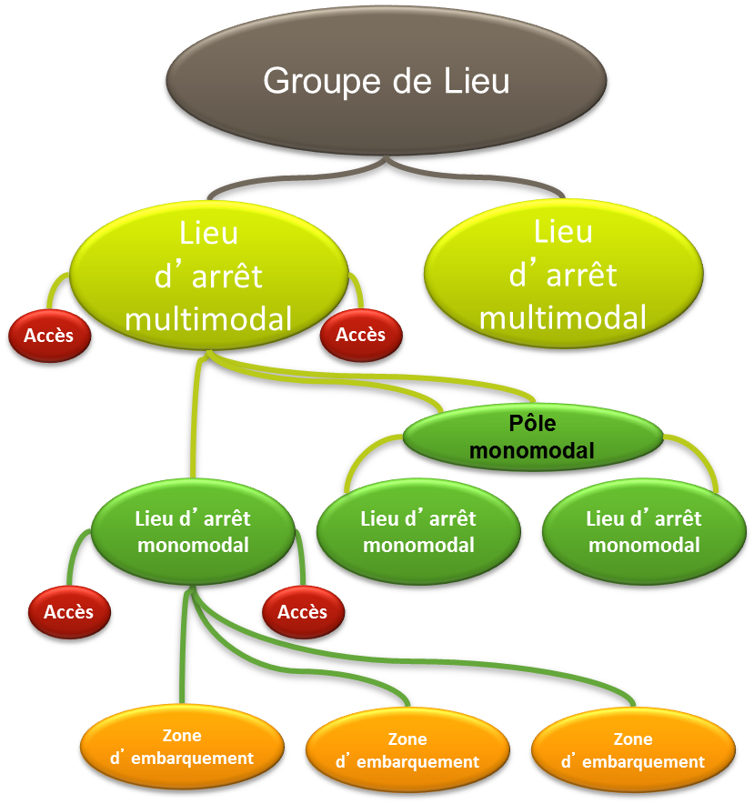
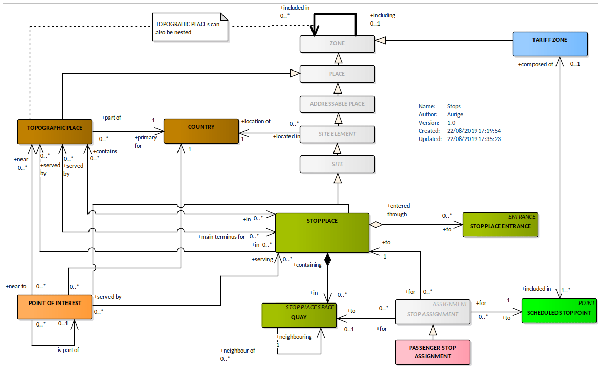

**Avant-propos**

L’harmonisation des pratiques dans l’échange des données relatives aux
offres de transport est essentielle :

-   pour l’usager, aux fins d’une présentation homogène et
    compréhensible de l’offre de transport et de l’engagement
    sous-jacent des organisateurs (autorités organisatrices et
    opérateurs de transports) ;

-   pour les AO, de manière à fédérer des informations homogènes venant
    de chacun des opérateurs de transports qui travaillent pour elle.
    L’harmonisation des échanges, et en particulier le présent profil,
    pourra le cas échéant être imposé par voie contractuelle. Cette
    homogénéité des formats d’information permet d’envisager la mise en
    place de systèmes d’information multimodaux, produisant une
    information globale de l’offre de transports sur un secteur donné,
    et garantir le fonctionnement des services d’information, en
    particulier des calculateurs d’itinéraires, et la cohérence des
    résultats, que ces services soient directement intégrés dans ces
    systèmes d’information multimodaux ou qu’ils puisent leurs
    informations sur des bases de données réparties ;

-   pour les opérateurs, qui pourront utiliser ce format d’échange pour
    leurs systèmes de planification, les systèmes d’aide à
    l’exploitation, leurs systèmes billettiques et leurs systèmes
    d’information voyageur (information planifiée et information temps
    réel)

-   pour les industriels et développeurs pour pérenniser et fiabiliser
    leurs investissements sur les formats d’échanges implémentés par les
    systèmes qu’ils réalisent, tout en limitant fortement l’effort de
    spécification lié aux formats d’échange

Ce document est le fruit de la collaboration entre les différents
partenaires des autorités organisatrices de transports, opérateurs,
industriels et développeurs de solutions et de systèmes informatiques
ayant pour objet l’aide à l’exploitation du transport public et
l’information des voyageurs. Il a pour objet de présenter le profil
d’échange Profil NeTEx Arrêts : "format de référence pour l'échange de
données de description des arrêts" (issu des travaux *NeTEx,
Transmodel)* qui aujourd’hui fait consensus dans les groupes de
normalisation (CN03/GT7 – Transport public / information voyageur).

**Introduction**

Le présent format d’échange est un profil de NeTEx.

NeTEx (CEN TS 16614-1, 16614-2 et 16614-3) propose un format et des
services d'échange de données de description de l'offre de transport
planifiée, basé sur Transmodel (EN 12896). NeTEx permet non seulement
d'assurer les échanges pour les systèmes d'information voyageur mais
traite aussi l’ensemble des concepts nécessaires en entrée et sortie des
systèmes de planification de l'offre (graphiquage, etc.) et des SAE
(Systèmes d’Aide à l’Exploitation).

NeTEx se décompose en trois parties:

-   Partie 1 : topologie des réseaux (les réseaux, les lignes, les
    parcours commerciaux les missions commerciales, les arrêts et lieux
    d’arrêts, les correspondances et les éléments géographiques en se
    limitant au strict minimum pour l’information voyageur)

-   Partie 2 : horaires théoriques (les courses commerciales, les heures
    de passage graphiquées, les jours types associés ainsi que les
    versions des horaires)

-   Partie 3 : information tarifaire (uniquement à vocation
    d’information voyageur)

NeTEx a été développé dans le cadre du CEN/TC278/WG3/SG9 piloté par la
France. Les parties 1 et 2 ont été publiées en tant que spécification
technique début 2014. Les travaux pour la partie 3, quant à eux, se sont
terminés en 2016.

Il faut noter que NeTEx a été l'occasion de renforcer les liens du
CEN/TC278/WG3 avec le secteur ferrovaire, en particulier grâce à la
participation de l'ERA (Agence Européen du Rail, qui a intégré NeTEx
dans la directive Européenne 454/2011 TAP-TSI ) et de l'UIC (Union
International des Chemins de fer).

Les normes, dans leur définition même, sont des « documents établis par
consensus ». Celles du CEN/TC278 sont de plus établies à un niveau
européen, en prenant donc en compte des exigences qui dépassent souvent
le périmètre national.

Il en résulte des normes qui sont relativement volumineuses et dont le
périmètre dépasse souvent largement les besoins d'une utilisation
donnée. Ainsi, à titre d'exemple, SIRI propose toute une série d'options
ou de mécanismes dont la vocation est d'assurer la compatibilité avec
les systèmes développés en Allemagne dans le contexte des VDV453/454. De
même, SIRI propose des services dédiés à la gestion des correspondances
garanties, services qui, s'ils sont dès aujourd'hui pertinents en Suisse
ou en Allemagne, sont pratiquement inexistants en France.

De plus, un certain nombre de spécificités locales ou nationales peuvent
amener à préciser l'usage ou la codification qui sera utilisée pour
certaines informations. Par exemple, les Anglais disposant d'un
référentiel national d'identification des points d'arrêts (NaPTAN), ils
imposeront naturellement que cette codification soit utilisée dans les
échanges SIRI, ce que ne feront pas les autres pays européens.

Enfin, certains éléments proposés par ces normes sont facultatifs et il
convient, lors d'une implémentation, de décider si ces éléments seront
ou non implémentés.

L'utilisation des normes liées à l'implémentation de l'interopérabilité
pour le transport en commun passe donc systématiquement par la
définition d'un profil (local agreement, en anglais). Concrètement, le
profil est un document complémentaire à la norme et qui en précise les
règles de mise en œuvre dans un contexte donné. Le profil contient donc
des informations comme :

-   détail des services utilisés,

-   détails des objets utilisés dans un échange,

-   précisions sur les options proposées par la norme,

-   précision sur les éléments facultatifs,

-   précision sur les codifications à utiliser,

-   etc.

Les principaux profils actuellement utilisés en France sont NEPTUNE
(profil de TRIDENT) et le profil de SIRI défini par le CEREMA et le
STIF. Ces deux profils ont une vocation nationale.

Le groupe de travail Qualité des données de l’AFIMB (Agence Française
pour l’Information Multimodale et la Billettique) a engagé une démarche
pour définir, sous la forme d’un « référentiel », les caractéristiques
et exigences de qualité des données transport à recommander. Ces travaux
ont, entre autres, permis d’élaborer un modèle d’arrêt partagé à partir
du cadre fixé par les documents de normalisation (Transmodel et NeTEx).
Ce modèle permet notamment de :

-   Proposer une structuration et une hiérarchisation des arrêts
    (clarifier les concepts de lieu d’arrêt, arrêt physique, arrêt
    commercial, etc.) ;

-   Décrire les caractéristiques souhaitées pour les arrêts de ce modèle
    et les exigences de qualité pour ces caractéristiques ;

Le profil présenté dans ce document permet d’échanger l’intégralité des
informations qui ont été retenues dans le cadre de ce modèle d’arrêt
partagé.

D'autre profils de NeTEx sont disponibles (réseau, horaire, tarif). Ils
sont tous complémentaires les uns des autres (sans recouvrement) et
s'appuient tous sur le document: **NeTEx - Profil Français de NETEx:
éléments communs.** Il conviendra de se référer à ce document pour tous
les éléments utilisés dans le présent document, et dont la structure
n'est pas détaillée.

Ce profil d’échange a pour objectif de décrire et de structurer
précisément les éléments nécessaires à une bonne information de
description des arrêts de transport public de façon :

-   à pouvoir les présenter d’une manière homogène et compréhensible à
    l’usager des transports publics sur des supports différents (papier
    ou Internet),

-   à pouvoir les échanger entre systèmes d’information (systèmes
    d’information voyageurs et systèmes d’information multimodale,
    systèmes d’aide à l’exploitation, systèmes de planification,
    systèmes billettiques, etc.).

Les éléments présentés ci-dessous couvrent donc l’ensemble des concepts
propres à la description des arrêts.

**NOTE IMPORTANTE** : Ce document étant un profil d'échange de NeTEx, il
ne se substitue en aucun cas à NeTEx, et un minimum de connaissance de
NeTEx sera nécessaire à sa bonne compréhension.

# Domaine d'application

Le présent document constitue le profil de la CEN/TS 16614 (NeTEx) pour
l'échange de données de description d'arrêt en France. Il permet de
décrire les arrêts de transports publics et la manière dont ils pourront
être structurés pour des échanges entre systèmes d'information ainsi que
pour leur présentation aux voyageurs.

C'est la structure de l'arrêt lui-même (ses composants, ses attributs et
sa géographie) qui est prise en compte dans ce contexte, et non son
insertion dans le contexte de l'offre de transport (pas de références
aux lignes, aux horaires, etc.).

# Références normatives

Les documents de référence suivants sont indispensables pour
l'application du présent document. Pour les références datées, seule
l'édition citée s'applique. Pour les références non datées, la dernière
édition du document de référence s'applique (y compris les éventuels
amendements).

CEN/TS 16614-1, Network and Timetable Exchange (NeTEx) — Part 1: Public
transport network topology exchange format

CEN/TS 16614-2, Network and Timetable Exchange (NeTEx) — Part 2: Public
transport scheduled timetables exchange format

EN 12896, Road transport and traffic telematics - Public transport -
Reference data model (Transmodel)

# Termes et définitions

Pour les besoins du présent document, les termes et définitions suivants
s'appliquent. Une grande partie d’entre eux est directement issue de
Transmodel et NeTEx.

NOTE Les termes spécifiquement introduits par le profil d’arrêt sont
signalés par le mot *(profil)*, en italique et entre parenthèses. Les
définitions ci-dessous sont des traductions littérales du document
normatif.

NOTE Les définitions ci-dessus sont des traductions littérales du
document normatif.

## ACCÈS DE LIEU D'ARRÊT (STOP PLACE ENTRANCE)

*(Transmodel)*

Un ACCÈS DE LIEU D'ARRÊT est un accès physique à un LIEU D’ARRÊT (entrée
ou sortie). Il peut comporter une porte, une barrière, un portillon ou
tout autre signe distinctif d’un accès.

## ACCÈS DE SITE (ENTRANCE)

*(Transmodel)*

Un ACCÈS DE SITE est un accès physique à un SITE (entrée ou sortie). Il
peut comporter une porte, une barrière, un portillon ou tout autre signe
distinctif d’un accès.

## ADRESSE (ADDRESS)

*(Transmodel)*

Adresse d'un lieu (postale et/ou sur voirie)

## ADRESSE POSTALE (POSTAL ADDRESS)

*(Transmodel)*

Spécification d'une ADRESSE sur la base des attributs
conventionnellement utilisés par les services postaux. Cela comprend
diverses identifications du bâtiment, le nom de la rue, le code postal
et d'autres descripteurs.

## ADRESSE SUR VOIRIE (ROAD ADDRESS)

*(Transmodel)*

Spécification d'une ADRESSE sur la base des attributs permettant
d’identifier sa position sur la voirie, comme les numéros, types et nom
de voies, et les éléments de positionnement le long de la voie.

## COMPOSANT DE LIEU D'ARRÊT (STOP PLACE COMPONENT)

*(Transmodel)*

Un COMPOSANT DE LIEU D'ARRÊT est un constituant d'un LIEU D'ARRÊT qui en
décrit une partie de la structure. Les COMPOSANTs DE LIEU D'ARRÊT
partagent avec le LIEU D'ARRÊT lui-même un certain nombre de propriétés
pour la gestion des données, l'accessibilité et diverses autres
caractéristiques.

## COMPOSANT DE SITE (SITE COMPONENT)

*(Transmodel)*

Un COMPOSANT DE LIEU est un constituant d'un SITE qui en décrit une
partie de la structure. Les COMPOSANTs DE LIEU partagent avec le LIEU
lui-même un certain nombre de propriétés pour la gestion des données,
l'accessibilité et diverses autres caractéristiques.

## ÉLÉMENT DE SITE (SITE ELEMENT)

*(Transmodel)*

Type de LIEU définissant des propriétés communes pour les SITEs et
COMPOSANTs DE SITES auxquels il correspond, incluant l’ACCESSIBILITÉ.

## ESPACE DE LIEU D'ARRÊT (STOP PLACE SPACE)

*(Transmodel)*

Espace (physique) au sein d'un LIEU D'ARRÊT, par exemple une ZONE
D'EMBARQUEMENT, un POINT D'EMBARQUEMENT, un LIEU D'ÉQUIPEMENT, etc.

## GROUPE DE LIEUX D’ARRÊT (GROUP OF STOP PLACE)

*(Transmodel)*

Il correspond à une spécialisation de la notion normalisée TRANSMODEL de
GROUPE D’ENTITÉs (GROUP OF ENTITIES en anglais).

## LIEU (PLACE)

*(Transmodel<u>)</u>*

Zone géographique d'un quelconque type qui peut être utilisé comme point
de départ ou d'arrivée d'un déplacement. Un lieu peut être de dimension
0 (POINT), 1 (comme une route par exemple) ou 2 (ZONE).

## LIEU D’ARRÊT Monomodal

*(profil)*

Il correspond à une spécialisation de la notion normalisée de LIEU
D'ARRÊT (STOP PLACE en anglais) dédiant le LIEU et ses COMPOSANT à un
unique MODE.

## LIEU D’ARRÊT Multimodal

*(profil)*

Il correspond aussi à une spécialisation de la notion normalisée de LIEU
D'ARRÊT (STOP PLACE en anglais) : un LIEU D’ARRÊT Multimodal n’est
composé que de LIEUx D’ARRÊT Monomodaux et Pôles Monomodaux de modes
différents.

## LIEU D'ARRÊT (STOP PLACE)

*(Transmodel)*

Lieu comprenant un ou plusieurs emplacements où les véhicules peuvent
s’arrêter et où les voyageurs peuvent monter à bord ou descendre des
véhicules ou préparer leur déplacement.

## LIEU TOPOGRAPHIQUE (TOPOGRAPHICAL PLACE)

*(Transmodel)*

Espace géographique offrant un contexte topographique lors de la
recherche ou de la présentation d'itinéraire (par exemple pour l'origine
ou la destination du déplacement). Cet espace peut être de toute taille
(pays, ville, village, etc.) et correspondre à des périmètres très
variés (Greater London, London, West End, Westminster, St James s,
etc.).

Un LIEU TOPOGRAPHIQUE doit toujours disposer d'un nom officiel. Il peut
être utile/nécessaire de définir une relation hiérarchique entre les
LIEUx TOPOGRAPHIQUEs de façon à les distinguer de façon non ambigüe, en
particulier en cas d'identité de nom.

## MODE DE TRANSPORT (VEHICLE MODE)

*(Transmodel)*

Le MODE DE TRANSPORT est une caractérisation du transport public
correspondant au moyen (véhicule) de transport (bus, tram, métro, train,
ferry, bateau, etc.).

## Pôle Monomodal

*(profil)*

Le Pôle Monomodal correspond à une spécialisation de la notion
normalisée de LIEU D'ARRÊT (STOP PLACE en anglais) : un Pôle Monomodal
n’est composé que de LIEUx D’ARRÊT Monomodaux de modes identiques mais
de noms différents.

## POSITION D'EMBARQUEMENT (BOARDING POSITION)

*(Transmodel)*

Emplacement au sein d'une ZONE D'EMBARQUEMENT à partir desquels les
passagers peuvent embarquer, ou vers lequel ils peuvent débarquer du
VÉHICULE.

## SITE (SITE)

*(Transmodel)*

Type de LIEU (comme un LIEU D'ARRÊT, un POINT D'INTÉRÊT, etc.) vers ou à
partir duquel un voyageur peut souhaiter vouloir voyager. Un SITE peut
avoir des ENTRÉEs qui en constituent les points d'accès (correspondant
éventuellement à des besoins utilisateurs particuliers: PMR, etc.).

## SUITE DE TRONÇON (LINK SEQUENCE)

*(Transmodel)*

Une suite ordonnée de POINTs ou TRONÇONs définissant un chemin à travers
le réseau.

## ZONE D’EMBARQUEMENT (QUAY)

*(Transmodel)*

Lieu tel qu’une plateforme, zone, quai ou voie à quai où les voyageurs
peuvent accéder aux véhicules de transport public, taxis, cars ou tout
autre mode de transport.

## ZONE TARIFAIRE (TARIFF ZONE)

*(Transmodel)*

Une ZONE utilisée dans un système de tarification zonale.

# Symboles et abréviations

AO

Autorité Organisatrice de Transports

PMR

Personne à Mobilité Réduite

# Rappel sur la structuration des arrêts

La structure proposée est représentée par la figure ci-dessous. C'est
une structure d'imbrication hiérarchique forte, qui s'appuie sur une
base modale.

*Structuration des arrêts*

Le typage proposé de chaque niveau (voir les définitions) est
suffisamment fort pour que cette structure soit très systématique dans
sa mise en œuvre: l’objectif est de toujours savoir comment réaliser le
groupement et la hiérarchisation face à une situation donnée.

Il est aussi important de noter qu'il n'y a pas de récurrence des
niveaux : chaque élément d'un niveau peut contenir des éléments du
niveau directement inférieur, mais il ne contiendra jamais des éléments
du même niveau, ou des niveaux supérieurs.

Les différents acteurs pourront naturellement utiliser tout ou partie de
cette structure en fonction de leur besoin et des données dont ils
disposent. On pourra toutefois, afin de faciliter l'interopérabilité et
les échanges, envisager d'«imposer» la disponibilité du niveau Lieu
d’Arrêt Monomodal (arrêt commercial) : ce niveau (et uniquement
celui-là) semble pouvoir en effet être rendu disponible par tous les
acteurs.

Quatre niveaux hiérarchiques d’arrêt sont disponibles :

-   Groupe de Lieux

-   Lieu d’arrêt multimodal

-   Lieu d’arrêt monomodal et pôle monomodal

-   Zone d’embarquement (Quai de train, voie à quai, poteau de Bus, de
    Tram …. )

La figure ci-dessous fournit une vue arborescente de cette
structuration, et y fait de plus apparaître la notion d'accès.

*Structuration des arrêts: vue hiérarchique complète*

L'accès de lieux peut être rattaché uniquement aux Lieux d’arrêt
monomodaux ou aux Lieux d’arrêt multimodaux (voir sa définition
ci-dessous).

# Exigences minimales liées au code des transports et la règlementation européenne

La mise à disposition des données, quand elles existent, est obligatoire et se conforme aux exigences :
- Au niveau européen, du règlement délégué (UE) 2017/1926 de la Commission du 31 mai 2017 modifié par le
  règlement délégué (UE) 2024/490 de la Commission du 29 novembre 2023 (<https://eur-lex.europa.eu/eli/reg_del/2017/1926/2024-03-04>), dit "règlement MMTIS" ;
- Au niveau français, des articles L. 1115-1 à L. 1115-7 , D. 1115-1, R. 1115-2 à R. 1115-8 et D. 1115-9 à D. 1115-11 du code du transports,
  notamment créés ou modifiés par les articles 25 et 27 de loi n° 2019-1428 du 24 décembre 2019 d’orientation des mobilités, dites loi « LOM ».
  Ces mêmes articles de la LOM précise le calendrier de mise à disposition des données.

Le tableau ci-dessous résulte de l’analyse du code des transports et du règlement
MMTIS et fournit la liste des concepts concernés dans le présent
profil correspondant aux données mentionnées dans l’annexe du règlement. Il sera donc nécessaire de fournir ces données pour être
conforme au cadre réglementaire (il s’agit bien de mettre à disposition toutes
les données existantes dans les SI transport, et non de créer des
données qui n’existeraient pas encore sous forme informatique).

Notez que  beaucoup de concepts dépendent des concepts issus de Transmodel/NeTEx et sont liés entre eux, soit par héritage, 
soit par relation au sens UML des termes. Par ailleurs, certains concepts additionnels peuvent relever d’autres parties
du profil France, précisés dans le tableau le cas échéant.

De plus, les noms des catégories (colonnes Catégorie et Détail) ont été
conservés dans la langue originale du document (l’anglais) pour éviter
tout risque de confusion. Pour la même raison, les noms des concepts
concernés sont ceux de la version originale de Transmodel.

Pour certaines catégories de données, il peut arriver que les concepts
correspondants soient multiples, mais aussi qu’ils soient différents
suivant le niveau de précision porté par la donnée. La colonne
« Concepts à minima » correspond alors au minimum à fournir pour
répondre à la catégorie en question et les colonnes « Autres concepts »
décrit des informations complémentaires qui, si elles sont utiles, ne
sont pas indispensables pour répondre à cette catégorie (notez que dans
certains cas, ces concepts additionnels peuvent relever d’autres
profils : ceci est précisé dans le tableau quand c’est le cas). Il faut
toutefois garder à l’esprit que toute information existante est supposée
être mise à disposition (que cela relève de la première ou de la seconde
colonne).

La première colonne reprend la notion de *niveau* tel qu’il est décrit
et utilisé par le règlement européen et a notamment une incidence sur le
calendrier de mise à disposition de la donnée (voir le règlement pour
plus de détails).

Les différents concepts présentés ne sont bien sûr pas détaillés dans ce
tableau, mais dans le profil lui-même. C’est aussi dans la description
du profil que l’on trouvera les détails concernant les attributs
(obligatoire/facultatif, règles de remplissage, codification, etc.).
Pour ce qui est des attributs facultatifs, la règle reste que, pour les
objets ci-dessous, toute information disponible est supposée être
fournie (mais on ne crée pas d’information si elle n’est pas
disponible).

Concepts relatifs à la LOM et à la Règlementation Européenne

<table>
<colgroup>
<col style="width: 7%" />
<col style="width: 15%" />
<col style="width: 17%" />
<col style="width: 14%" />
<col style="width: 23%" />
<col style="width: 22%" />
</colgroup>
<thead>
<tr class="header">
<th><strong>Niveau</strong></th>
<th><strong>Catégorie</strong></th>
<th><strong>Détail</strong></th>
<th><strong>Concepts à minima</strong></th>
<th>
<strong>Autres</strong>

<strong>concepts</strong>
</th>
<th><strong>Commentaire</strong></th>
</tr>
</thead>
<tbody>
<tr class="odd">
<td><strong>1</strong></td>
<td><em><strong>Location search (origin/ destination)</strong></em></td>
<td>Address identifiers (building number, street name, postcode)</td>
<td>Tous les objets héritant d'<strong>ADRESSABLE PLACE</strong></td>
<td><strong>ENTRANCE 
QUAI 
POI 
PARKING</strong></td>
<td>L’Adresse est incluse dans tous les objets héritant d'ADRESSABLE PLACE 
Au-delà du Profil Arrêt, les informations d’adresse sont donc attendues pour tous les objets susceptible d’en porter.</td>
</tr>
<tr class="even">
<td><strong>1</strong></td>
<td><em><strong>Location search (origin/ destination)</strong></em></td>
<td>Topographic places (city, town, village, suburb, administrative unit)</td>
<td><strong>TOPOGRAPHIC PLACE</strong></td>
<td></td>
<td></td>
</tr>
<tr class="odd">
<td><strong>1</strong></td>
<td><em><strong>Location search (access nodes)</strong></em></td>
<td>Identified access nodes (all scheduled modes)</td>
<td><strong>STOP PLACE</strong></td>
<td>
<strong>QUAY 
</strong>

<em>(profil réseau)</em>

<strong>SCHEDULED STOP POINT 
PASSENGER STOP ASSIGNMENT</strong>
</td>
<td></td>
</tr>
<tr class="even">
<td><strong>1</strong></td>
<td><em><strong>Location search (access nodes)</strong></em></td>
<td>Geometry/map layout structure of access nodes (all scheduled modes)</td>
<td><strong>STOP PLACE</strong></td>
<td><strong>QUAY</strong></td>
<td></td>
</tr>
<tr class="odd">
<td><strong>1</strong></td>
<td><em><strong>Trip plan computation — scheduled modes transport</strong></em></td>
<td>Stop facilities access nodes (including platform information, help desks/information points, ticket booths, lifts/stairs, entrances and exit locations)</td>
<td><strong>STOP PLACE's FACILITIES</strong></td>
<td>
(profil Accessibilité)

<strong>EQUIPMENT</strong>
</td>
<td></td>
</tr>
<tr class="even">
<td><strong>1</strong></td>
<td><em><strong>Trip plan computation — scheduled modes transport</strong></em></td>
<td>Accessibility of access nodes, and paths within an interchange (such as existence of lifts, escalators)</td>
<td><strong>STOP PLACE's FACILITIES</strong></td>
<td>
<em>(profil Accessibilité)</em>

<strong>EQUIPMENT 
NAVIGATION PATH 
</strong>
</td>
<td></td>
</tr>
<tr class="odd">
<td><strong>1</strong></td>
<td><em><strong>Trip plan computation — scheduled modes transport</strong></em></td>
<td>Existence of assistance services (such as existence of on-site assistance)</td>
<td><strong>STOP PLACE's FACILITIES</strong></td>
<td>
(profil Accessibilité)

<strong>LOCAL SERVICE</strong>
</td>
<td></td>
</tr>
</tbody>
</table>

# Description du profil d’échange

## Conventions de représentation

### Tableaux d’attributs

NOTE les choix de conventions présentées ici ont pour vocation d'être
cohérents avec celle réalisée dans le cadre du profil SIRI (STIF et
CEREMA). De plus tous les profils NeTEx partagent les mêmes conventions.

Les messages constituant ce profil d'échange sont décrits ci-dessous
selon un double formalisme: une description sous forme de diagrammes XSD
(leur compréhension nécessite une connaissance préalable de XSD: XML
Schema Definition) et une description sous forme tabulaire. Les tableaux
proposent ces colonnes:

|                    |         |          |                 |                 |
|--------------------|---------|----------|-----------------|-----------------|
| **Classification** | **Nom** | **Type** | **Cardinalité** | **Description** |

-   **Classification** : permet de catégoriser l'attribut. Les
    principales catégories sont:

    -   PK (Public Key) que l'on peut interpréter comme Identifiant
        Unique: il permet à lui seul d'identifier l'objet, de façon
        unique, pérenne et non ambiguë. C'est l'identifiant qui sera
        utilisé pour référencer l'objet dans les relations.

    

    -   AK (Alternate Key) est un identifiant secondaire, généralement
        utilisé pour la communication, mais qui ne sera pas utilisé dans
        les relations.

    

    -   FK (Foreign Key) indique que l'attribut contient l'identifiant
        unique (PK) d'un autre objet avec lequel il est en relation.

    

    -   GROUP est un groupe XML nommé (ensemble d'attributs utilisables
        dans différents contextes) (voir
        <http://www.w3.org/TR/2001/REC-xmlschema-0-20010502/#AttrGroups>
        )

-   **Nom** : nom de l'élément ou attribut XSD

-   **Type** : type de l'élément ou attribut XSD (pour certains d'entre
    eux, il conviendra de se référer à la XSD NeTEx)

-   **Cardinalité** : cardinalité de l'élément ou attribut XSD exprimée
    sous la forme "***minimum:maximum***" ("0:1" pour au plus une
    occurrence; "1:\*" au moins une occurrence et sans limites de nombre
    maximal; "1:1" une et une seule occurrence; etc.).

-   Description : texte de description de l'élément ou attribut XSD
    (seul les attributs retenus par le profil ont un texte en français;
    les textes surlignés en jaune indiquent une spécificité du profil
    par rapport à NeTEx).

Les textes surlignés en jaune sont ceux
présentant une particularité (spécialisation) par rapport à NeTEx: une
codification particulière, une restriction d'usage, etc.

La description XSD utilisée est strictement celle de NeTEx, sans aucune
modification (ceci explique notamment que tous les commentaires soient
en anglais).

Les attributs et éléments rendus obligatoires dans le cadre de ce profil
restent facultatifs dans l'XSD (le contrôle de cardinalité devra donc
être réalisé applicativement).

###  Valeurs de code de profil

Dans la mesure du possible, le profil sélectionne les valeurs de code à
utiliser pour caractériser des éléments et les limite à un ensemble de
valeurs documentées. NETEX propose plusieurs mécanismes différents pour
spécifier les valeurs de code autorisées :

-   des énumérations fixes définies dans le cadre du schéma XSD NeTEx.
    Le profil impose alors un sous-ensemble des codes NeTEx.

-   des spécialisations de TYPE OF VALUE, utilisées pour définir des
    ensembles de codes ouverts pouvant être ajoutés au fil du temps sans
    modifier le schéma, par exemple, pour enregistrer des
    classifications d'entités héritées. Le profil lui-même utilise le
    mécanisme TYPE OF VALUE dans quelques cas pour spécifier des codes
    normalisés supplémentaires : ceux-ci sont affectés à un CODESPACE
    «FR_IV_metadata» (https://netex-cen.eu/FR_IV) indiqué par un préfixe
    «FR_IV». (par exemple, «FR_IV: monomodal».

-   des instances TypeOfFrame: le profil utilise plusieurs TYPES DE
    FRAME pour spécifier l'utilisation de VERSION FRAME dans le profil.

### Indication des classes abstraites

NeTEx et Transmodel utilisent largement l'héritage de classe; cela
simplifie considérablement la spécification en évitant les répétitions
puisque les attributs partagés sont déclarés par une superclasse et que
des sous-classes viennent ensuite les spécialiser sans avoir à répéter
ces attributs et en n’ajoutant que ceux qui lui sont spécifiques. La
plupart des superclasses sont «abstraites» - c’est-à-dire qu’il n’existe
aucune instance concrète; seules les sous-classes terminales sont
«concrètes».

Un inconvénient de l'héritage est que si l'on veut comprendre les
propriétés d'une classe concrète unique, il faut également examiner
toutes ses super-classes. Pour cette raison, le profil inclut les
classes abstraites nécessaires pour comprendre les classes concrètes,
même si ces classes concrètes ne sont jamais directement instanciées
dans un document NeTEx.

-   Les super-classes sont signalées dans les en-têtes par le suffixe
    «*(abstrait)*»

-   Dans les diagrammes UML (comme pour NeTEx et Transmodel), les noms
    des classes abstraites sont indiqués en italique et les classes
    abstraites sont de couleur gris clair.

-   Certaines super-classes ne sont techniquement pas abstraites dans
    NeTEx, mais ne sont pas utilisées comme classes concrètes dans le
    profil : elles sont signalées avec la même convention que les
    classes abstraites.

### Classes de sous-composants

Un certain nombre de classes ont des sous-composants qui constituent
leur définition. Celles-ci fournissent des détails auxiliaires (par
exemple, AlternativeText, AlternativeName, TrainComponent) et sont
signalées dans les en-têtes par le suffixe « *(objet inclus)*».

## Lieux d'arrêt (monomodal, multimodal et pôle monomodal)

### LIEU D’ARRÊT Monomodal

Il correspond à une spécialisation de la notion normalisée de LIEU
D'ARRÊT (STOP PLACE en anglais): Lieu comprenant un ou plusieurs
emplacements où les véhicules peuvent s’arrêter et où les voyageurs
peuvent monter à bord ou descendre des véhicules ou préparer leur
déplacement.

Ce type de lieu ne contiendra que des possibilités d’accès à des
véhicules d’une même catégorie de mode (le mode desservi sera donc l’un
de ses attributs). Il correspond à ce qui est souvent appelé arrêt
commercial (mais les vocabulaires varient…).

Il peut contenir des ZONEs D’EMBARQUEMENT. S’il en contient, c’est un
regroupement des ZONEs D’EMBARQUEMENT dédiées à un même mode. Si
toutefois l’information n’est pas disponible, le LIEU D’ARRÊT Monomodal
pourra ne pas référencer de ZONE D’EMBARQUEMENT.

Toutes les ZONEs D’EMBARQUEMENT d’un LIEU D’ARRÊT Monomodal doivent être
de même type (voir l’attribut Type de ZONE D’EMBARQUEMENT, ou de types
« compatibles » cette compatibilité se limitant à permettre un
groupement de quais et de poteaux. Le tableau ci-dessous présente les
types de ZONE D’EMBARQUEMENT et la façon dont on peut les associer au
sein d’un même LIEU D’ARRÊT Monomodal.

NOTE : le mode d’une ZONE D’EMBARQUEMENT est son mode principal, elle
peut donc être desservie par différents modes « compatibles » (colonne
de droite du tableau).

Types de ZONE D’EMBARQUEMENT et compatibilité des modes

<table>
<colgroup>
<col style="width: 33%" />
<col style="width: 33%" />
<col style="width: 33%" />
</colgroup>
<thead>
<tr class="header">
<th>Type de ZONE D’EMBARQUEMENT</th>
<th>Autres types de ZONE D’EMBARQUEMENT « compatibles »</th>
<th>Mode de transport possible</th>
</tr>
</thead>
<tbody>
<tr class="odd">
<td>Quai de gare (ferré)</td>
<td><em>aucun</em></td>
<td>
<ul>
    <li>Ferré</li>
    <li><em>(inclus sous mode Tram-Train (inclus sous mode Tram-Train à interpréter Train-Tram dans ce cas-là))</em></li>
</ul>
</td>
</tr>
<tr class="even">
<td>Quai de métro</td>
<td><em>aucun</em></td>
<td>
<ul>
    <li>Métro</li>
    <li>Funiculaire</li>
</ul>
</td>
</tr>
<tr class="odd">
<td>Quai de tram</td>
<td>Arrêt de tram</td>
<td>
<ul>
    <li>Tram</li>
    <li><em>(inclus sous mode Tram-Train)</em></li>
</ul>
</td>
</tr>
<tr class="even">
<td>Arrêt de tram (poteau)</td>
<td>Quai de tram</td>
<td>
<ul>
    <li>Tram</li>
</ul>
</td>
</tr>
<tr class="odd">
<td>Arrêt de bus, autocar ou trolley (généralement poteau, sans matérialisation de quai)</td>
<td>Quai de bus, autocar ou trolley</td>
<td>
<ul>
    <li>Bus</li>
    <li>Car</li>
    <li>Trolley</li>
</ul>
</td>
</tr>
<tr class="even">
<td>Quai de bus, autocar ou trolley</td>
<td>Arrêt de bus, autocar ou trolley</td>
<td>
<ul>
    <li>Bus</li>
    <li>Car</li>
    <li>Trolley</li>
</ul>
</td>
</tr>
<tr class="odd">
<td>Quai de bateau</td>
<td>Accostage de ferry</td>
<td>
<ul>
    <li>Maritime ou Fluvial</li>
</ul>
</td>
</tr>
<tr class="even">
<td>Accostage de ferry</td>
<td>Quai de bateau</td>
<td>
<ul>
    <li>Maritime ou Fluvial</li>
</ul>
</td>
</tr>
<tr class="odd">
<td>Quai de téléphérique</td>
<td><em>aucun</em></td>
<td>
<ul>
    <li>Transport par câble (télécabine, etc.)</li>
</ul>
</td>
</tr>
<tr class="even">
<td>Porte d'aéroport</td>
<td><em>aucun</em></td>
<td>
<ul>
    <li>Aérien</li>
</ul>
</td>
</tr>
</tbody>
</table>

Le LIEU D’ARRÊT Monomodal, en plus de la contrainte de catégorie de
mode, porte une contrainte de nom: toutes les zones d’embarquement d’un
LIEU D’ARRÊT Monomodal portent le même nom (si ce n’est pas le cas, on
définit plusieurs LIEU D’ARRÊT Monomodaux que l'on regroupe au sein d'un
Pôle Monomodal). Notez que dans le cas des trains, l’éventuel nom de
voie (« A », « 2B », « 2 » , etc.) est précisé par un PublicCode et non
par le nom.

Le LIEU D’ARRÊT Monomodal ne peut pas contenir d’autre LIEU D’ARRÊT.

La notion de correspondance est implicite au sein d'un LIEU D’ARRÊT
Monomodal.

Une ZONE D’EMBARQUEMENT n’appartient qu’à un seul LIEU D’ARRÊT
Monomodal.

Le LIEU D’ARRÊT Monomodal peut être typé (attribut ***StopPlaceType***).
En plus de son mode principal, elle dispose des types présentés en
7.2.10.1. Ces types, quand ils sont utilisés pour un LIEU D’ARRÊT
Monomodal ont aussi une portée d'information complémentaire :

-   Pour tous les types, autres que les trois ci-dessous (arrêts
    commerciaux au sens large): le LIEU D’ARRÊT Monomodal contient
    obligatoirement des ZONEs D’EMBARQUEMENT portant le même nom et
    correspondant généralement (mais pas obligatoirement) à l’aller et
    au retour d’une ou plusieurs lignes.

-   Gare: station ferrée (n’a pas l’obligation de référencer de ZONEs
    D’EMBARQUEMENT)

-   Aéroport: dédié à l’aérien (n’a pas l’obligation de référencer de
    ZONEs D’EMBARQUEMENT)

-   Port: dédié au maritime ou au fluvial (n’a pas l’obligation de
    référencer de ZONEs D’EMBARQUEMENT)

### Pôle Monomodal

Il correspond aussi à une spécialisation de la notion normalisée
Transmodel de LIEU D'ARRÊT (STOP PLACE en anglais).

Dans un certain nombre de cas, on trouve des LIEUx D’ARRÊT Monomodaux de
même mode et portant des noms différents, mais que l’on souhaite grouper
ensemble (pour des raisons de proximité et de correspondance): on
utilise alors un Pôle Monomodal.

Ce type de lieu contiendra au moins deux LIEUx D’ARRÊT Monomodaux.

Il ne contient pas de ZONE D’EMBARQUEMENT (plus précisément, il contient
des LIEUx D’ARRÊT Monomodaux qui eux peuvent contenir des ZONEs
D’EMBARQUEMENT).

La notion de correspondance est implicite au sein d'un Pôle Monomodal.
Cela signifie qu'une correspondance est possible (en termes de distance)
entre n'importe quel couple de ZONE D’EMBARQUEMENT des LIEUx D’ARRÊT
Monomodaux constituant le Pôle Monomodal. Toutefois cela n'implique pas
nécessairement la mise en cohérence des horaires de passage des lignes
desservant le Pôle.

### LIEU D’ARRÊT Multimodal

Il correspond aussi à une spécialisation de la notion normalisée
Transmodel de LIEU D'ARRÊT (STOP PLACE en anglais).

Ce type de lieu contiendra impérativement des possibilités d’accès à des
véhicules de plusieurs modes.

Il contiendra au moins deux objets fils (de type LIEUx D’ARRÊT Monomodal
ou Pôle Monomodal).

Il ne contient pas de ZONE D’EMBARQUEMENT (plus précisément, il contient
des LIEUx D’ARRÊT Monomodaux, éventuellement en passant par des Pôles
Monomodaux, qui eux peuvent contenir des ZONEs D’EMBARQUEMENT).

La notion de correspondance est implicite au sein d'un LIEU D’ARRÊT
Multimodal. Là encore cela signifie qu'une correspondance est possible
(en terme de distance) entre n'importe quel couple de ZONE
D’EMBARQUEMENT des LIEUx D’ARRÊT Monomodaux contenus dans le LIEU
D’ARRÊT Multimodal, et n'implique pas nécessairement la mise en
cohérence des horaires de passage des lignes desservant le LIEU.

Le LIEU D’ARRÊT Multimodal dispose d’un attribut indiquant son mode « de
plus haut niveau » : la hiérarchisation des modes suivante est proposée

1.  Aérien

2.  Maritime/Fluvial

3.  Ferré

4.  Métro

5.  Tram

6.  Funiculaire/Câble

7.  Bus/Car/Trolley

### Modèle de données

*STOP PLACE – Modèle conceptuel*

L'objet le plus haut dans l'arbre d'héritage est la ZONE, décrivant un
objet générique à deux dimensions. Une ZONE peut être définie par un
GROUPE DE POINTS appartenant à la ZONE, et peut également être définie
comme une zone géométrique, bordée d'un polygone.

Une ZONE peut contenir d'autres ZONEs plus petites. Ceci est exprimé par
la relation réflexive sur ZONE (donc une STOP PLACE peut inclure
d'autres STOP PLACE comme tous les objets qui héritent de la ZONE).

Une ZONE peut être représentée par un seul POINT (par l'attribut
**Centroïd*) ***qui peut être utilisé comme une référence ponctuelle à
la ZONE elle-même. Ceci est utile pour représenter les systèmes de
transport flexibles (où un arrêt est souvent un ZONE).

Le deuxième niveau de la hiérarchie est la PLACE, qui représente
n'importe quel endroit significatif qu'un modèle de transport peut
vouloir décrire, et pour lequel la possibilité de voyage peut exister
(départ, arrivée ou point de passage). Une PLACE peut être spécialisée
de diverses manières, notamment une TOPOGRAPHIC PLACE (une ville, un
département ou une région nommée), ou une ADDRESSABLE PLACE spécifique
ayant un ADRESS qui est soit un ROAD ADDRESS, soit un POSTAL ADDRESS.

L’élément de site spécialisé ADDRESSABLE PLACE peut être utilisé pour
ajouter l'accessibilité (voir ACCESSIBILITY ASSESMENT) et d'autres
propriétés communes à tout lieu pouvant être parcouru par un passager.
Le SITE spécialise l’ELEMENT DE SITE pour fournir une description
générale des propriétés communes d'un lieu, tel qu'une station ou un
point d'intérêt, y compris ses entrées, niveaux, équipements,
cheminements, propriétés d'accessibilité, etc. Le SITE est lui-même
spécialisé en STOP PLACE, POINT D'INTERET, PARKING, etc.

La STOP PLACE décrit différents aspects d’un point d’accès physique au
transport, comme un arrêt ou une gare. Pour un lieu complexe, tel qu'une
station, cela inclut toutes les zones composant la station: les entrées,
les halls, les plates-formes, les niveaux sur lesquels elles se
trouvent, etc.

il est à noter qu'un lieu d'arrêt est un concept distinct de la
représentation de l'arrêt dans une table horaire- SCHEDULED STOP POINT.
Les deux peuvent être liés à l'aide d'un STOP ASSIGNMENT. Physiquement,
le SCHEDULED STOP POINT peut correspondre soit à un STOP PLACE entier,
soit à un QUAY spécifique

Puisqu'ils héritent aussi d'une relation d'inclusion de la ZONE, les
QUAY peuvent être imbriqués. Cela permet de représenter des
plates-formes composites à deux côtés ou plus ou à des sections nommées.

### Attributs du LIEU D’ARRÊT (StopPlace)

StopPlace

<table>
<colgroup>
<col style="width: 11%" />
<col style="width: 20%" />
<col style="width: 20%" />
<col style="width: 4%" />
<col style="width: 43%" />
</colgroup>
<tbody>
<tr class="odd">
<td><strong>Classifi­cation</strong></td>
<td><strong>Nom</strong></td>
<td><strong>Type</strong></td>
<td></td>
<td><strong>Description</strong></td>
</tr>
<tr class="even">
<td><em>::></em></td>
<td><em>::></em></td>
<td><em>Site</em></td>
<td><em>::></em></td>
<td>
STOP PLACE hérite de SITE.

NOTE L'identification du STOP PLACE a pour vocation à être codifiée. Sa codification est décrite le document <strong>éléments communs.</strong>
</td>
</tr>
<tr class="odd">
<td>«AK»</td>
<td><em><strong>PublicCode</strong></em></td>
<td><em>StopPlaceCodeType</em></td>
<td>0:1</td>
<td>Code court connu du public pour identifier le LIEU D'ARRÊT (utilisé par exemple pour les services SMS, etc.)</td>
</tr>
<tr class="even">
<td rowspan="5">STOP PLACE COMP­ONENT GROUP</td>
<td><em><strong>TransportMode</strong></em></td>
<td><em>VehicleModeEnum</em></td>
<td>1:1</td>
<td>Mode de transport principal pour le LIEU. La liste des modes est présentée en 6.17 dans le Profil Éléments Communs.</td>
</tr>
<tr class="odd">
<td><em>(Choice)</em></td>
<td>
<em>AirSubmode</em>

<em>BusSubmode</em>

<em>CoachSubmode</em>

<em>FunicularSubmode</em>

<em>MetroSubmode</em>

<em>TramSubmode</em>

<em>TelecabinSubmode</em>

<em>RailSubmode</em>

<em>WaterSubmode</em>
</td>
<td>0:1</td>
<td>
Sous mode associé au mode (caractérise le type d’exploitation). Les sous modes sont une énumération dont les valeurs sont présentées en 7.2.10.

Il faut noter le cas particulier du Tram-Train qui, bien qu'étant classé en sous-mode du TRAM, peut aussi être utilisé en sous-mode du Ferré.
</td>
</tr>
<tr class="even">
<td>submode</td>
<td>TransportSubmodeEnum</td>
<td>0:1</td>
<td>Sous-Mode associé au mode</td>
</tr>
<tr class="odd">
<td><em><strong>OtherTransport­Modes</strong></em></td>
<td><em>VehicleModeEnum</em></td>
<td>0:*</td>
<td>Liste des autres modes de transport desservant le LIEU D'ARRÊT.</td>
</tr>
<tr class="even">
<td><em><strong>tariffZones</strong></em></td>
<td><em>TariffZoneRef</em></td>
<td>0:*</td>
<td>
Identifiant de la zone tarifaire (ou section selon les cas). Cet identifiant est, dans le cadre de ce profil, le code ou nom de la zone (typiquement "1", "2", etc.)

Si la zone tarifaire n'est pas précisée (le champ étant facultatif) mais que la <em><strong>StopPlace</strong></em> est inclue dans une autre (LIEU D'ARRÊT MONOMODAL dans une LIEU D'ARRÊT MULTIMODAL par exemple) qui lui a une <em><strong>tarrifZone</strong></em>, alors la zone tarifaire du <em><strong>StopPlace</strong></em> parent s'applique.
</td>
</tr>
<tr class="odd">
<td>STOP PLACE PROPERTY GROUP</td>
<td><em><strong>StopPlaceType</strong></em></td>
<td><em>StopPlaceTypeEnum</em></td>
<td>1:1</td>
<td>Type du LIEU D'ARRÊT (voir les définitions en 7.2.10.1 ).</td>
</tr>
<tr class="even">
<td></td>
<td><em><strong>BorderCrossing</strong></em></td>
<td><em>xsd:boolean</em></td>
<td>0:1</td>
<td>Indique s’il y a un passage de frontière à ce Lieu d’Arrêt.</td>
</tr>
<tr class="odd">
<td></td>
<td>Weighting</td>
<td>InterchangeUseEnum</td>
<td>0:1</td>
<td>
Qualification de la possibilité de correspondance au sein du lieu d’arrêt

<ul>
<li>
<em><strong>noInterchange</strong></em>
</li>
<li>
<em><strong>interchangeAllowed</strong> (valeur par défaut si le champ n’est pas renseigné)</em>
</li>
<li>
<em>preferredInterchange</em> (indique que le Lieu d’Arrêt est spécialement conçu pour faciliter les échanges, avec des chemins de guidage de chemin, un chemin de promenade facile, sécurisé et court, etc.).
</li>
</ul></td>
</tr>
<tr class="even">
<td></td>
<td><em><strong>StopPlaceWeight</strong></em></td>
<td><em>StopPlaceWeightEnum</em></td>
<td>0:1</td>
<td>
Les lieux d'arrêt peuvent être classés en fonction de leur importance relative (le « rayonnement » de la gare et le type de réseau auquelle elle donne accès).

<ul>
<li>
<em><strong>international</strong></em>
</li>
<li>
<em><strong>national</strong></em>
</li>
<li>
<em><strong>regional</strong></em>
</li>
<li>
<em><strong>local</strong></em>
</li>
</ul></td>
</tr>
<tr class="odd">
<td>STOP PLACE PASS­ENGER GROUP</td>
<td><em><strong>quays</strong></em></td>
<td><em>Quay</em></td>
<td>0:*</td>
<td>Liste des identifiants (le profil fait le choix de définir les ZONEs D’EMBARQUEMENT indépendaemment et de les référencer) des ZONEs D'EMBARQUEMENT contenues dans le LIEU (exclusivement pour les LIEUx D'ARRÊT de type LIEUX D'ARRÊT MONOMODAL).</td>
</tr>
</tbody>
</table>

### Attributs de Place

Place – Element (abstrait)

<table>
<colgroup>
<col style="width: 9%" />
<col style="width: 17%" />
<col style="width: 21%" />
<col style="width: 9%" />
<col style="width: 42%" />
</colgroup>
<tbody>
<tr class="odd">
<td><strong>Classifi­cation</strong></td>
<td><strong>Name</strong></td>
<td><strong>Type</strong></td>
<td></td>
<td><strong>Description</strong></td>
</tr>
<tr class="even">
<td>::></td>
<td>::></td>
<td><em>Zone</em></td>
<td>::></td>
<td>PLACE hérite de ZONE <em>(voir le document éléments communs)</em>.</td>
</tr>
<tr class="odd">
<td>«cntd»</td>
<td><em><strong>placeTypes</strong></em></td>
<td><em>TypeOfPlaceRef</em></td>
<td>
0:*

<strong>0:1</strong>

<em><strong>spécial</strong></em>
</td>
<td>
Cet attribut n'est utilisé que pour les LIEUx D'ARRÊT et les zones administratives (TOPOGRAPHIC PLACE), et il est alors obligatoire, et sa cardinalité est alors 1:1.

Pour le LIEU D'ARRET Codification permettant de distinguer les:

<ul>
<li>

LIEU D'ARRÊT MONOMODAL  
valeur: monomodalStopPlace

</li>
<li>

PÔLE MONOMODAL 
valeur: monomodalHub

</li>
<li>

LIEU D'ARRÊT MULTIMODAL 
valeur: multimodalStopPlace

</li>
</ul>

Type de zones administratives françaises (TOPOGRAPHIC PLACE), qui doit être cohérent avec les Topographic-PlaceType (voir ):

<ul>
<li>

RÉGION  
valeur: region

</li>
<li>

DÉPARTEMENT  
valeur: department

</li>
<li>

GROUPEMENT DE COMMUNES  
valeur: urbanCommunity

</li>
<li>

VILLE  
valeur: town

</li>
<li>

ARRONDISSEMENT  
valeur: <em><strong>district</strong></em>

</li>
</ul></td>
</tr>
</tbody>
</table>

EXEMPLE À titre d'exemple, le type de LIEU D'ARRÊT peut être décrit de
la façon suivante:

\<placeTypes>\<TypeOfPlaceRef ref="monomodalStopPlace"/>\</placeTypes>

### Attributs du AddressablePlace

AddressablePlace – Element (abstrait)

| **Classifi­cation** | **Nom**             | **Type**              |       | **Description**                    |
|---------------------|---------------------|-----------------------|-------|------------------------------------|
| *::>*               | *::>*               | *ADDRESSABLE* *PLACE* | *::>* | ADDRESSABLE PLACE hérite de PLACE. |
|                     | ***Url***           | *xsd:anyURI*          | 0:1   | Url d'information associée au lieu |
|                     | ***Image***         | *xsd:anyURI*          | 0:1   | Image et photo du lieu (en ligne)  |
|                     | ***PostalAddress*** | *PostalAddress*       | 0:1   | Adresse postale                    |
|                     | ***RoadAddress***   | *RoadAddress*         | 0:1   | Adresse sur voirie                 |

### Attributs du SiteElement

SiteElement – Element (abstrait)

<table>
<colgroup>
<col style="width: 8%" />
<col style="width: 17%" />
<col style="width: 22%" />
<col style="width: 4%" />
<col style="width: 47%" />
</colgroup>
<tbody>
<tr class="odd">
<td><strong>Classifi­cation</strong></td>
<td><strong>Nom</strong></td>
<td><strong>Type</strong></td>
<td></td>
<td><strong>Description</strong></td>
</tr>
<tr class="even">
<td><em>::></em></td>
<td><em>::></em></td>
<td><em>PLACE</em></td>
<td><em>::></em></td>
<td>SITE ÉLÉMENT hérite de ADDRESSABLE PLACE.</td>
</tr>
<tr class="odd">
<td>«cntd»</td>
<td><em><strong>AccessibilityAssessment</strong></em></td>
<td><em>AccessibilityAssessment</em></td>
<td>0:1</td>
<td>
Information globale précisant le niveau d'accessibilité du LIEU D'ARRÊT, de la ZONE D'EMBARQUEMENT ou de l'ACCÈS.

Voir le détail ci-dessous.
</td>
</tr>
<tr class="even">
<td>«cntd»</td>
<td><em><strong>AccessModes</strong></em></td>
<td><em>AccessModeEnum</em></td>
<td>0:*</td>
<td>
Liste des modes utilisables (il peut donc y en avoir plusieurs) pour accéder à ce LIEU D'ARRÊT (renseigné uniquement pour les LIEUx D'ARRÊT):

<ul>
<li>

<em><strong>foot</strong></em>: À pied

</li>
<li>

<em><strong>bicycle</strong></em> : En vélo (il y a un garage à vélo ou une station de vélos partagés)

</li>
<li>

<em><strong>boat</strong></em> : Bateau

</li>
<li>

<em><strong>car</strong></em> : Voiture (il y a un parking, ou une station d'auto partagée)

</li>
<li>

<em><strong>taxi</strong></em> : Taxi (il y a une borne taxi)

</li>
<li>

<em><strong>shuttle</strong></em> : Navette (une navette dessert le lieu)

</li>
</ul>

Note: ne pas confondre avec le mode principal du LIEU D'ARRÊT (on qualifie ici les façons possibles de se rendre au LIEU D'ARRÊT, par exemple "<em>je peux me rendre à la gare en vélo…</em>" sous-entendu, "<em>il y a bien un parking à vélo</em>"…)
</td>
</tr>

<tr class="even">
<td>«cntd»</td>
<td><em><strong>alternativeNames</strong></em></td>
<td><em>AlternativeName</em></td>
<td>0:*</td>
<td>
Nom(s) alternatif(s) (potentiellement multiple) du LIEU D'ARRÊT, de la ZONE D'EMBARQUEMENT ou de l'ACCÈS.

Voir le détail dans le profil Éléments Communs.
</td>
</tr>
<tr class="odd">
<td rowspan="2"></td>
<td><em><strong>CrossRoad</strong></em></td>
<td><em>MultilingualString</em></td>
<td>0:1</td>
<td>Identification du croisement (nom des rues de l'intersection) où se situe le LIEU D'ARRÊT, la ZONE D'EMBARQUEMENT ou l'ACCÈS..</td>
</tr>
<tr class="even">
<td><em><strong>Landmark</strong></em></td>
<td><em>MultilingualString</em></td>
<td>0:1</td>
<td>Nom d'un repère proche du LIEU D'ARRÊT, de la ZONE D'EMBARQUEMENT ou de l'ACCÈS (par exemple "en face du café XXX", "juste après la bouche d'incendie", etc.).</td>
</tr>
<tr class="odd">
<td></td>
<td><em><strong>SiteElement­PropertiesGroup</strong></em></td>
<td><em>Element­PropertiesGroup</em></td>
<td>0:1</td>
<td>Propriétés complémentaires de l’élément, voir ci-dessous..</td>
</tr>
</tbody>
</table>

SiteElementPropertiesGroup – Group (objet inclus)

<table>
<colgroup>
<col style="width: 8%" />
<col style="width: 17%" />
<col style="width: 22%" />
<col style="width: 8%" />
<col style="width: 43%" />
</colgroup>
<tbody>
<tr class="odd">
<td><strong>Classifi­cation</strong></td>
<td><strong>Name</strong></td>
<td><strong>Type</strong></td>
<td></td>
<td><strong>Description</strong></td>
</tr>
<tr class="even">
<td></td>
<td><em><strong>PublicUse</strong></em></td>
<td><em>PublicUseEnum</em></td>
<td>0:1</td>
<td>
Indique par quel public le lieu est utilisable:

<ul>
<li>

<em><strong>disabledPubicOnly</strong></em>: Personnes handicapées uniquement

</li>
<li>

<em><strong>authorisedPublicOnly</strong></em>: Personnes autorisées uniquement

</li>
<li>

<em><strong>staffOnly</strong></em>: Réservé au personnel

</li>
<li>

<em><strong>publicOnly</strong></em>: Réservé au public

</li>
<li>

<em><strong>all</strong></em>: Tout public

</li>
</ul></td>
</tr>
<tr class="odd">
<td></td>
<td><em><strong>Covered</strong></em></td>
<td><em>CoveredEnum</em></td>
<td>0:1</td>
<td>
Indique si le lieu est couvert

<ul>
<li>
<em><strong>indoors</strong></em>: Intérieur
</li>
<li>
<em><strong>outdoors</strong></em>: Extérieur
</li>
<li>
<em><strong>covered</strong></em>: Couvert (extérieur)
</li>
<li>
<em><strong>mixed</strong></em>: Mixte
</li>
<li>
<em><strong>unknown</strong></em>: Information non connue
</li>
</ul></td>
</tr>
<tr class="even">
<td></td>
<td><em><strong>Gated</strong></em></td>
<td><em>GatedEnum</em></td>
<td>0:1</td>
<td>
Indique si l'on accède au lieu par des portes :

<ul>
<li>
<em><strong>openArea</strong></em>: Accès ouvert
</li>
<li>
<em><strong>gatedArea</strong></em>: Accès par porte
</li>
<li>
<em><strong>unknown</strong></em>: Information non connue
</li>
</ul></td>
</tr>
<tr class="odd">
<td></td>
<td><em><strong>Lighting</strong></em></td>
<td><em>LightingEnum</em></td>
<td>0:1</td>
<td>
Indique si le lieu est éclairé :

<ul>
<li>
<em><strong>wellLit</strong></em>: Bien éclairé
</li>
<li>
<em><strong>poorLit</strong></em>: Faiblement éclairé
</li>
<li>
<em><strong>unlit</strong></em>: Non éclairé
</li>
<li>
<em><strong>unknown</strong></em>: Information non connue
</li>
</ul></td>
</tr>

</tbody>
</table>

### Attributs du Site

Site – Element (abstrait)

<table>
<colgroup>
<col style="width: 8%" />
<col style="width: 17%" />
<col style="width: 22%" />
<col style="width: 4%" />
<col style="width: 47%" />
</colgroup>
<tbody>
<tr class="odd">
<td><strong>Classifi­cation</strong></td>
<td><strong>Nom</strong></td>
<td><strong>Type</strong></td>
<td></td>
<td><strong>Description</strong></td>
</tr>
<tr class="even">
<td><em>::></em></td>
<td><em>::></em></td>
<td><em>SiteElement</em></td>
<td><em>::></em></td>
<td>SITE hérite de SITE ÉLÉMENT.</td>
</tr>

<tr class="even">
<td>«FK»</td>
<td><em><strong>TopographicPlaceRef</strong></em></td>
<td><em>TopographicPlaceRef</em></td>
<td>0:1</td>
<td>Référence à la zone administrative à laquelle appartient le LIEU D'ARRÊT, la ZONE D'EMBARQUEMENT ou l'ACCÈS (il s'agira ici uniquement d'une zone administrative de type Ville ou Arrondissement: c'est la structure administrative elle-même qui décrira les inclusions dans les zones administratives "supérieures").</td>
</tr>
<tr class="odd">
<td></td>
<td><em><strong>additionalTopographicPlaces</strong></em></td>
<td><em>topographicPlaceRefs</em></td>
<td>0 :*</td>
<td>
Un LIEU D'ARRÊT peut avoir des composants dans plusieurs communes d’où la cardinalité : ce champ permet de référencer toutes ces zones administratives (la précédente étant la principale).

Cet attribut n'est utilisé que pour les LIEUx D'ARRÊT
</td>
</tr>

<tr class="odd">
<td></td>
<td><em><strong>Locale</strong></em></td>
<td><em>Locale</em></td>
<td>0:1</td>
<td>
Information locales liées au LIEU D'ARRÊT, ZONE D'EMBARQUEMENT ou ACCÈS comme le fuseau horaire, la langue, etc.

Voir Profil Éléments Communs.
</td>
</tr>
<tr class="even">
<td>«FK»</td>
<td><em><strong>OrganisationRef</strong></em></td>
<td><em>OrganisationRef</em></td>
<td>0:1</td>
<td>Identifiant de l'exploitant du LIEU (référence une INSTITUTION).</td>
</tr>
<tr class="odd">
<td>«FK»</td>
<td><em><strong>ParentSiteRef</strong></em></td>
<td><em>SiteRef</em></td>
<td>0:1</td>
<td>
Référence au LIEU D'ARRÊT "contenant" le présent LIEU. Cette liaison est contrainte en fonction de la spécialisation du LIEU D'ARRÊT:

<ul>
<li>
LIEU D'ARRET MONOMODAL : parent= LIEU D'ARRÊT MULTIMODAL ou POLE MONOMODAL
</li>
<li>
POLE MONOMODAL : parent= LIEU D'ARRÊT MULTIMODAL
</li>
<li>
LIEU D'ARRÊT MULTIMODAL = pas de parent

Cet attribut n'est utilisé que pour les LIEUx D'ARRÊT
</li>
</ul></td>
</tr>

<tr class="even">
<td>«cntd»</td>
<td><em><strong>levels</strong></em></td>
<td><em>Level</em></td>
<td>0:*</td>
<td>
Liste des niveaux (étages) du lieu d'arrêt. Ils sont identifiés par leur nom : cela peut être "1", "A", "Banlieue", etc.

On aura par exemple:

<levels>

<levelRef ref="Banlieue"/>

<levelRef ref="GrandeLigne"/>

</levels>

Cet attribut n'est utilisé que pour les LIEUx D'ARRÊT
</td>
</tr>
<tr class="odd">
<td>«cntd»</td>
<td><em><strong>entrances</strong></em></td>
<td><em>Entrance</em></td>
<td>0:*</td>
<td>
Lien vers les entrées du LIEU (référence des ACCÈS)

Cet attribut n'est utilisé que pour les LIEUx D'ARRÊT
</td>
</tr>

</tbody>
</table>

### Enumérations pour les LIEUx D’ARRÊT

#### Les type de LIEU D'ARRÊT

types de LIEU D'ARRÊT.

| Value                        | Description                                                   |
|------------------------------|---------------------------------------------------------------|
| ***onstreetBus***            | Arrêt de bus sur la voirie                                    |
| ***busStation***             | Gare routière                                                 |
| ***coachStation***           | Station d'autocars                                            |
| ***onstreetTram***           | Arrêt de TRAM sur la voirie                                   |
| ***tramStation***            | Station de TRAM                                               |
| ***railStation***            | Station ferrée                                                |
| ***vehicleRailInterchange*** | Station ferrée d'embarquement ou de débarquement de véhicules |
| ***metroStation***           | Station de métro                                              |
| ***Airport***                | Aéroport                                                      |
| ***ferryPort***              | Port Ferry                                                    |
| ***harbourPort***            | Port                                                          |
| ***ferryStop***              | Arrêt simple de Ferry                                         |
| ***liftStation***            | Station de téléphérique                                       |
| ***Other***                  | Autre                                                         |

Le tableau ci-dessous présente les types de LIEU D'ARRÊT, les types de
ZONE D'EMBARQUEMENT qu'ils peuvent contenir et la liste des modes
correspondants.

Types de LIEU D'ARRÊT, Types de ZONE D’EMBARQUEMENT et modes

<table>
<colgroup>
<col style="width: 29%" />
<col style="width: 34%" />
<col style="width: 35%" />
</colgroup>
<thead>
<tr class="header">
<th><strong>Types de LIEU D'ARRÊT</strong></th>
<th><strong>Type de ZONE D’EMBARQUEMENT</strong></th>
<th><strong>Mode de transport possible</strong></th>
</tr>
</thead>
<tbody>
<tr class="odd">
<td>Station ferrée</td>
<td>
Quai de gare (ferré)

ou

zone d'embarquement de véhicules
</td>
<td>

Ferré

<em>(inclus sous mode Tram-Train à interpréter Train-Tram dans ce cas-là)</em>

</td>
</tr>
<tr class="even">
<td>Station de métro</td>
<td>Quai de métro</td>
<td>

Métro

Funiculaire

</td>
</tr>
<tr class="odd">
<td>
Arrêt de TRAM sur la voirie

<em>ou</em>

Station de TRAM
</td>
<td>Quai de tram</td>
<td>

Tram

<em>(inclus sous mode Tram-Train)</em>

</td>
</tr>
<tr class="even">
<td>
Arrêt de TRAM sur la voirie

<em>ou</em>

Station de TRAM
</td>
<td>Arrêt de tram (poteau)</td>
<td>

Tram

</td>
</tr>
<tr class="odd">
<td>
Arrêt de bus sur la voirie

<em>ou</em>

Gare routière
</td>
<td>
Arrêt de bus, autocar ou trolley (généralement poteau, sans matérialisation de quai)

<em>ou</em>

Quai de bus, autocar ou trolley
</td>
<td>

Bus

Car

Trolley

</td>
</tr>
<tr class="even">
<td>Station d'autocars</td>
<td>
Arrêt d'autocar

<em>ou</em>

Quai d'autocar
</td>
<td>

Car

</td>
</tr>
<tr class="odd">
<td>Port</td>
<td>Quai de bateau</td>
<td>

Maritime ou Fluvial

</td>
</tr>
<tr class="even">
<td>
Port Ferry

<em>ou</em>

Arrêt simple de Ferry
</td>
<td>Accostage de ferry</td>
<td>

Maritime ou Fluvial

</td>
</tr>
<tr class="odd">
<td>Station de téléphérique</td>
<td>Quai de téléphérique</td>
<td>

Transport par câble (télécabine, etc.)

</td>
</tr>
<tr class="even">
<td>Aéroport</td>
<td>Porte d'aéroport</td>
<td>

Aérien

</td>
</tr>
</tbody>
</table>

## Groupe de lieux

GroupOfStopPlaces - Element

| **Classifi­cation** | **Name**               | **Type**                  | **Cardin­alité** | **Description**                                                              |
|---------------------|------------------------|---------------------------|------------------|------------------------------------------------------------------------------|
| ::>                 | ::>                    | *<u>GroupOfEntities</u>*  | ::>              | ***GroupOfStopPlaces*** hérite de ***GroupOfEntities***                      |
| «PK»                | ***id***               | *GroupOfStopPlacesIdType* | 1:1              | Identifiant du GROUP of STOP PLACEs.                                         |
| «cntd»              | ***members***          | *StopPlaceRef*            | 0:\*             | STOP PLACEs composant le GROUP of STOP PLACEs.                               |
| «enum»              | ***TransportMode***    | *VehicleModeEnum*         | 0:1              | Principal MODE de transport pour ce groupe Voir STOP PLACE pour les valeurs. |
| «enum»              | ***TransportSubmode*** | *SubmodeEnum*             | 0:1              | Principal SOUS MODE de transport pour ce groupe                              |

Note : de façon à assurer la compatibilité avec les
travaux d’Île-de-France Mobilité, on conserve temporairement la
possibilité de décrire le groupe de lieux, avec un GroupOfEntities dont
le champ **PurposeofGroupingRef** sera
instancié avec "**groupOfStopPlace**" et dont
***members***
contient la liste des identifiants des membres des GROUPEs DE LIEUX
D'ARRÊT (ce sont donc exclusivement des identifiants de LIEU D'ARRÊT).
Cette possibilité n’est valable que pour les données produite en
Île-de-France.

## Zone d'embarquement

La ZONE D'EMBARQUEMENT, présenté si dessous, est en partie bâtie sur la
base de groupes XSD déjà présentés dans le document: **NeTEx - Profil
Français de NETEx: éléments communs**:

-   DataManagedObject

-   GroupOfEntities

-   Zone

    Et d'autres présenté dans les paragraphes précédents

-   Place: 7.2.6

-   SiteElement: 7.2.8

Quay (traduit pas ZONE D'EMBARQUEMENT en français) –

Element

<table>
<colgroup>
<col style="width: 8%" />
<col style="width: 17%" />
<col style="width: 22%" />
<col style="width: 4%" />
<col style="width: 47%" />
</colgroup>
<tbody>
<tr class="odd">
<td><strong>Classifi­cation</strong></td>
<td><strong>Nom</strong></td>
<td><strong>Type</strong></td>
<td></td>
<td><strong>Description</strong></td>
</tr>
<tr class="even">
<td><em>::></em></td>
<td><em>::></em></td>
<td><em>StopPlaceSpace</em></td>
<td><em>::></em></td>
<td>
QUAY hérite de STOP PLACE SPACE et STOP PLACE COMPONENT.

NOTE Pour les ZONE D'EMBARQUEMENT l'identification a pour vocation à être codifiée: voir Éléments Communs.
</td>
</tr>
<tr class="odd">
<td>QUAY IDENTIFIER GROUP</td>
<td><em><strong>PublicCode</strong></em></td>
<td><em>xsd:normalizedString</em></td>
<td>0:1</td>
<td>
Code court connu du public pour identifier le LIEU D'ARRÊT (utilisé par exemple pour les services SMS, etc.)

Dans le cas des trains, en particulier, le nom des voies (« Voie A », « Voix 2B », « Voix 1 », etc.) est à mettre dans ce <em><strong>PublicCode</strong></em> et non dans le <em><strong>Name</strong></em> (qui contiendra le nom de l’arrêt, « Versailles Chantier » par exemple, de façon à ce qu’un service d’information voyageur puis indique « descendez à Versailles Chantier » et précise « Voie 2B » et ne se contente pas de dire « descendez voix 2B »…)
</td>
</tr>
<tr class="even">
<td></td>
<td><em><strong>PlateCode</strong></em></td>
<td><em>xsd:normalizedString</em></td>
<td>0:1</td>
<td>Code inscrit sur la plaquette ou le sticker de l'arrêt</td>
</tr>

<tr class="odd">
<td>QUAY DESCRIPTOR GROUP</td>
<td><em><strong>CompassBearing</strong></em></td>
<td><em>CompassBearingType</em></td>
<td>0:1</td>
<td>Orientation de la voie, en degrés (au niveau de la ZONE D'EMBARQUEMENT).</td>
</tr>

<tr class="odd">
<td></td>
<td><em><strong>QuayType</strong></em></td>
<td><em>QuayTypeEnum</em></td>
<td>0:1</td>
<td>
Type codifié de ZONE D'EMBARQUEMENT:

<ul>
<li>
<em><strong>airlineGate</strong></em>: Porte d'aéroport
</li>
<li>
<em><strong>railPlatform</strong></em>: Quai de gare (ferré)
</li>
<li>
<em><strong>vehicleLoadingPlace</strong></em>: zone d'embarquement de véhicules (ferré)
</li>
<li>
<em><strong>metroPlatform</strong></em>: Quai de métro
</li>
<li>
<em><strong>busStop</strong></em>: Arrêt de bus, autocar ou trolley (généralement poteau, sans matérialisation de quai)
</li>
<li>
<em><strong>busBay</strong></em>: Quai de bus, autocar ou trolley
</li>
<li>
<em><strong>coachStop</strong></em>: peut être utilisé au lieu de busStop si la ZONE D'EMBARQUEMENT est réservée aux autocars
</li>
<li>
<em><strong>tramPlatform</strong></em>: Quai de tram
</li>
<li>
<em><strong>tramStop</strong></em>: Arrêt de tram (poteau)
</li>
<li>
<em><strong>boatQuay</strong></em>: Quai de bateau
</li>
<li>
<em><strong>ferryLanding</strong></em>: Accostage de ferry
</li>
<li>
<em><strong>telecabinePlatform</strong></em>: Quai de téléphérique
</li>
</ul>

NOTE NeTEx propose aussi <em><strong>taxiStand</strong></em>, <em><strong>setDownPlace</strong></em> et <em><strong>other </strong></em>mais ces valeurs ne sont pas retenues dans le cadre du présent profil.
</td>
</tr>
<tr class="even">
<td>«FK»</td>
<td><em><strong>ParentQuayRef</strong></em></td>
<td><em>QuayRef</em></td>
<td>0:1</td>
<td>Référence au parent de QUAY qui le contient entièrement. (permet de subdiviser les quais et de gérer les relations quai-voies à quai par exemple).</td>
</tr>

</tbody>
</table>

Espace de Lieu d’Arrêt – Element (abstrait)

| **Classification** | **Name** | **Type**               | **Cardinality** | **Description**                            |
|--------------------|----------|------------------------|-----------------|--------------------------------------------|
| *::>*              | *::>*    | *<u>SiteComponent</u>* | *::>*           | STOP PLACE SPACE hérite de SITE COMPONENT. |
|                    | Label    | xsd:normalizedString   | 0:1             | Label associé à l’espace                   |

### Attributs SiteComponent

SiteComponent – Element (abstrait)

<table>
<colgroup>
<col style="width: 11%" />
<col style="width: 17%" />
<col style="width: 21%" />
<col style="width: 6%" />
<col style="width: 43%" />
</colgroup>
<tbody>
<tr class="odd">
<td><strong>Classifi­cation</strong></td>
<td><strong>Nom</strong></td>
<td><strong>Type</strong></td>
<td></td>
<td><strong>Description</strong></td>
</tr>
<tr class="even">
<td><em>::></em></td>
<td><em>::></em></td>
<td><em>SiteElement</em></td>
<td><em>::></em></td>
<td>SITE COMPONENT hérite de SITE ÉLÉMENT.</td>
</tr>
<tr class="odd">
<td>«FK»</td>
<td><em><strong>SiteRef</strong></em></td>
<td><em>SiteRef</em></td>
<td>
0:1

1:1
</td>
<td>
Pour une ZONE D'EMBARQUEMENT, il s'agit de l'identifiant du LIEU D'ARRÊT MONOMODAL dont dépend la ZONE D'EMBARQUEMENT.

Pour un ACCÈS il s'agit de l'identifiant du LIEU D'ARRÊT MONOMODAL, POLE MONOMODAL ou LIEU D'ARRÊT MULTIMODAL auquel mène l'ACCÈS.

Cet attribut est obligatoire dans le cadre du profil.

Note : de plus, notament pour faciliter les conversions vers le profil Européen, on systématisera l’includion XML des <em><strong>SiteComponents</strong></em> dans les <em><strong>Sites.</strong></em>
</td>
</tr>
<tr class="even">
<td>«FK»</td>
<td><em><strong>LevelRef</strong></em></td>
<td><em>LevelRef</em></td>
<td>0:1</td>
<td>Niveau (étages) du lieu d'arrêt auquel se situe la ZONE D'EMBARQUEMENT ou l'ACCÈS. Il est identifié par son nom : cela peut être "<strong>1</strong>", "<strong>A</strong>", "<strong>Banlieue</strong>", etc.</td>
</tr>

</tbody>
</table>

### Attributs de StopPlaceComponent

StopPlaceComponent – Element (abstrait)

<table>
<colgroup>
<col style="width: 8%" />
<col style="width: 17%" />
<col style="width: 22%" />
<col style="width: 4%" />
<col style="width: 47%" />
</colgroup>
<tbody>
<tr class="odd">
<td><strong>Classifi­cation</strong></td>
<td><strong>Nom</strong></td>
<td><strong>Type</strong></td>
<td></td>
<td><strong>Description</strong></td>
</tr>
<tr class="even">
<td></td>
<td><em><strong>TransportMode</strong></em></td>
<td><em>VehicleModeEnum</em></td>
<td>
0:1

1:1
</td>
<td>
Mode de transport principal pour la ZONE D'EMBARQUEMENT. La liste des modes est présentée en 5.15 dans le Profil Éléments Communs.

Cet attribut est obligatoire dans le cadre du profil.
</td>
</tr>
<tr class="odd">
<td></td>
<td><em>(Choice)</em></td>
<td>
<em>AirSubmode</em>

<em>BusSubmode</em>

<em>CoachSubmode</em>

<em>FunicularSubmode</em>

<em>MetroSubmode</em>

<em>TramSubmode</em>

<em>TelecabinSubmode</em>

<em>RailSubmode</em>

<em>WaterSubmode</em>
</td>
<td>0:1</td>
<td>
Sous mode associé au mode (caractérise le type d’exploitation). Les sous modes sont des énumérés dont les valeurs sont présentées en 7.2.10.

Il faut noter le cas particulier du Tram-Train qui, bien qu'étant classé en sous-mode du TRAM, peut aussi être utilisé en sous-mode du Ferré.
</td>
</tr>

<tr class="odd">
<td></td>
<td><em><strong>tariffZones</strong></em></td>
<td><em>TariffZoneRef</em></td>
<td>0:*</td>
<td>Identifiant de la zone tarifaire (ou section selon les cas). Cet identifiant est, dans le cadre de ce profil, le code ou nom de la zone (typiquement "1", "2", etc.)</td>
</tr>
</tbody>
</table>

## Accès

StopPlaceEntrance – Element

<table>
<colgroup>
<col style="width: 8%" />
<col style="width: 17%" />
<col style="width: 22%" />
<col style="width: 8%" />
<col style="width: 43%" />
</colgroup>
<tbody>
<tr class="odd">
<td><strong>Classifi­cation</strong></td>
<td><strong>Nom</strong></td>
<td><strong>Type</strong></td>
<td></td>
<td><strong>Description</strong></td>
</tr>
<tr class="even">
<td><em>::></em></td>
<td><em>::></em></td>
<td><em>Entrance</em></td>
<td><em>::></em></td>
<td>
STOP PLACE ENTRANCE. hérite de SITE ENTRANCE.

NOTE <em><strong>StopPlaceEntrance</strong></em> n'utilise pas le <em><strong>placeGroup</strong></em> dans le cadre du profil .
</td>
</tr>
<tr class="odd">
<td>GROUP</td>
<td><strong>S<em>topPlace­ComponenGroup</em></strong></td>
<td><em>StopPlaceComponent­PropertyGroup</em></td>
<td>0:1</td>
<td>Propriétés communes avec le COMPOSANT DE LIEU D'ARRÊT (voir <em>7.4.2-Attributs de StopPlaceComponent</em> plus haut).</td>
</tr>
</tbody>
</table>

Entrance – Element

<table>
<colgroup>
<col style="width: 12%" />
<col style="width: 17%" />
<col style="width: 20%" />
<col style="width: 6%" />
<col style="width: 43%" />
</colgroup>
<tbody>
<tr class="odd">
<td><strong>Classifi­cation</strong></td>
<td><strong>Nom</strong></td>
<td><strong>Type</strong></td>
<td></td>
<td><strong>Description</strong></td>
</tr>
<tr class="even">
<td><em>::></em></td>
<td><em>::></em></td>
<td><em>SiteComponent</em></td>
<td><em>::></em></td>
<td>ENTRANCE hérite de SITE COMPONENT.</td>
</tr>
<tr class="odd">
<td rowspan="8">SITE COMP­ONENT GROUP</td>
<td><em><strong>PublicCode</strong></em></td>
<td><em>xsd:normalizedString</em></td>
<td>0:1</td>
<td>Code de l'accès connu du public (généralement un numéro ou une lettre)</td>
</tr>
<tr class="even">
<td><em><strong>Label</strong></em></td>
<td><em>xsd:normalizedString</em></td>
<td>0:1</td>
<td>Label associé à l’entrée (généralement lettre ou numéro).</td>
</tr>
<tr class="odd">
<td><em><strong>EntranceType</strong></em></td>
<td><em>EntranceTypeEnum</em></td>
<td>0:1</td>
<td>
Type codifié de l'accès :

<ul>
<li>
<em><strong>opening</strong></em>: Ouvert
</li>
<li>
<em><strong>openDoor</strong></em>: Porte Ouverte
</li>
<li>
<em><strong>door</strong></em>: Porte
</li>
<li>
<em><strong>swingDoor</strong></em>: Porte battante
</li>
<li>
<em><strong>revolvingDoor</strong></em>: Porte à tambour
</li>
<li>
<em><strong>automaticDoor</strong></em> Porte automatique
</li>
<li>
<em><strong>ticketBarrier</strong></em>: Portillon à ticket
</li>
<li>
<em><strong>gate</strong></em>: Barrière
</li>
<li>
<em><strong>other</strong></em>: autre
</li>
</ul></td>
</tr>
<tr class="even">
<td><em><strong>IsExternal</strong></em></td>
<td><em>xsd:boolean</em></td>
<td>0:1</td>
<td>Indique s'il s'agit d'un ACCÈS extérieur ou intérieur (via un centre commercial par exemple)</td>
</tr>
<tr class="odd">
<td><em><strong>IsEntry</strong></em></td>
<td><em>xsd:boolean</em></td>
<td>0:1</td>
<td>Indique que c'est une entrée</td>
</tr>
<tr class="even">
<td><em><strong>IsExit</strong></em></td>
<td><em>xsd:boolean</em></td>
<td>0:1</td>
<td>Indique que c'est une sortie</td>
</tr>
<tr class="odd">
<td><em><strong>Width</strong></em></td>
<td><em>LengthType</em></td>
<td>0:1</td>
<td>Largeur de l’entrèe.</td>
</tr>
<tr class="even">
<td><em><strong>Height</strong></em></td>
<td><em>LengthType</em></td>
<td>0:1</td>
<td>Hauteur de l’entrée.</td>
</tr>
<tr class="odd">
<td>EXTERNAL ENTRANCE GROUP</td>
<td><em><strong>DroppedKerb­Outside</strong></em></td>
<td><em>xsd:boolean</em></td>
<td>0:1</td>
<td>Marche abaissée à l’entrée (à mettre à false pour indiquer une marche)</td>
</tr>

</tbody>
</table>

## Zone administrative

Aucun champ spécifique utilisé

TopographicPlace – Element

<table>
<colgroup>
<col style="width: 8%" />
<col style="width: 17%" />
<col style="width: 23%" />
<col style="width: 8%" />
<col style="width: 41%" />
</colgroup>
<tbody>
<tr class="odd">
<td><strong>Classifi­cation</strong></td>
<td><strong>Nom</strong></td>
<td><strong>Type</strong></td>
<td></td>
<td><strong>Description</strong></td>
</tr>
<tr class="even">
<td>::></td>
<td>::></td>
<td><em>Place</em></td>
<td>::></td>
<td>TOPOGRAPHIC PLACE hérite de PLACE.</td>
</tr>
<tr class="odd">
<td></td>
<td><em><strong>IsoCode</strong></em></td>
<td><em>IsoSubdvisionCodeType</em></td>
<td>0:1</td>
<td>
Code ISO 3166-2 permettant d'identifier un pays et ses subdivisions (voir <a href="http://fr.wikipedia.org/wiki/ISO_3166-2:FR">http://fr.wikipedia.org/wiki/ISO_3166-2:FR</a> )

Par exemple :

FR-Q = Haute-Normandie (région)

FR-15 = Cantal (département)
</td>
</tr>
<tr class="even">
<td></td>
<td><em><strong>Descriptor</strong></em></td>
<td><em>Descriptor</em></td>
<td>1:1</td>
<td>
Description de la TOPOGRAPHIC PLACE.

Le nom de la Zone Administrative est un des attributs de cette structure, ce qui explique son caractère obligatoire.

<em>Note: le nom peut aussi apparaître dans l'attribut <strong>name</strong> hérité de <strong>GroupOfEntities</strong> où il n'est pas obligatoire. Si les deux noms sont renseignés, ils doivent naturellement être identiques (si ce n'était pas le cas, celui obligatoire du <strong>Descriptor</strong> prévaut)</em>
</td>
</tr>

<tr class="even">
<td></td>
<td><em><strong>Topographic­PlaceType</strong></em></td>
<td><em>TopographicTypeEnum</em></td>
<td>0:1</td>
<td>
Classification de la zone administrative:

<ul>
<li>

<em><strong>region</strong></em> (RÉGION)

</li>
<li>

<em><strong>area</strong></em> (utilisé pour DÉPARTEMENT en France)

</li>
<li>

<em><strong>conurbation</strong></em> (utilisé pour GROUPEMENT DE COMMUNE)

</li>
<li>

<em><strong>city</strong></em> (VILLE)

</li>
<li>

<em><strong>quarter</strong></em> (niveau ARRONDISSEMENT)

</li>
<li>

<em><strong>suburb</strong></em> (niveau VILLE)

</li>
<li>

<em><strong>town</strong></em> (niveau VILLE)

</li>
<li>

<em><strong>district</strong></em> (niveau ARRONDISSEMENT)

</li>
<li>

<em><strong>village</strong></em> (niveau VILLE)

</li>
<li>

<em><strong>hamlet</strong></em> (niveau VILLE)

</li>
<li>

<em><strong>urbanCenter</strong></em> (niveau ARRONDISSEMENT)

</li>
<li>

<em><strong>placeOfInterest</strong></em> (niveau ARRONDISSEMENT)

</li>
<li>

<em><strong>other</strong></em>

</li>
<li>

<em><strong>unrecorded</strong></em>

</li>
</ul></td>
</tr>

<tr class="even">
<td></td>
<td><em><strong>PostCode</strong></em></td>
<td><em>xsd:normalizedString</em></td>
<td>0:1</td>
<td>Code postal associé à la Zone Administrative (peut avoir une valeur spécifique à la zone et différente de celle de la commune d’appartenance).</td>
</tr>
<tr class="odd">
<td>«FK»</td>
<td><em><strong>CountryRef</strong></em></td>
<td><em>CountryEnum</em></td>
<td>0:1</td>
<td>
Identifiant du Pays en respectant la norme ISO 3166-1 (voir: <a href="http://www.iso.org/iso/country_codes/iso_3166_code_lists.htm">www.iso.org/iso/country_codes/iso_3166_code_lists.htm</a> ).

C'est le code Alpha-2 sur 2 caractères qui est utilisé ici.
</td>
</tr>
<tr class="even">
<td></td>
<td><em><strong>otherCountries</strong></em></td>
<td>CountryRef</td>
<td>0:*</td>
<td>Pour les Zone Administrative à cheval sur plusieurs pays</td>
</tr>
<tr class="odd">
<td>«FK»</td>
<td><em><strong>ParentTopo­graphic­PlaceRef</strong></em></td>
<td><em>TopographicPlaceRef</em></td>
<td>0:1</td>
<td>
Référence la zone administrative dans laquelle est incluse celle-ci. Ce champ doit respecter les règles suivantes :

• une RÉGION n'a pas de parent (voir CountryRef)

• un DÉPARTEMENT est contenu dans une RÉGION

• un GROUPEMENT DE COMMUNES est contenu dans un DÉPARTEMENT (ou éventuellement une région s'il est à cheval sur plusieurs DEPARTEMENTs)

• une VILLE est contenue dans un DÉPARTEMENT (et PAS dans GROUPEMENT DE COMMUNES: voir containedIn plus bas)

• un ARRONDISSEMENT est contenu dans VILLE
</td>
</tr>

<tr class="odd">
<td></td>
<td><em><strong>containedIn</strong></em></td>
<td><em>TopographicPlaceRef</em></td>
<td>0:*</td>
<td>Ce champs est utilisé pour les VILLEs uniquement et permet d'indiquer que la VILLE fait aussi partie d'un GROUPEMENT DE COMMUNES).</td>
</tr>

</tbody>
</table>

Une Zone Administrative doit toujours avoir un nom, mais il n’est pas
rare qu’il existe plusieurs lieux du même nom dans un pays (par exemple,
il existe douze lieux appelées «Hausen» en Allemagne, et huit «Newports»
au Royaume-Uni, etc.) ou dans des pays différents (il existe également
plusieurs «Hausen» en Suisse et même «Paris, Texas»).

Afin de distinguer les différentes instances de manière cohérente, un
nom de qualificatif peut être spécifié pour une Zone Administrative en
utilisant un élément ***TopographicPlaceDescriptor*** (par exemple,
«Newport, Gwent», «Newport, Salop», etc.).

TopographicPlaceDescriptor – Element

<table>
<colgroup>
<col style="width: 8%" />
<col style="width: 17%" />
<col style="width: 23%" />
<col style="width: 8%" />
<col style="width: 41%" />
</colgroup>
<tbody>
<tr class="odd">
<td><strong>Classification</strong></td>
<td><strong>Name</strong></td>
<td><strong>Type</strong></td>
<td><strong>Cardinality</strong></td>
<td><strong>Description</strong></td>
</tr>
<tr class="even">
<td>::></td>
<td>::></td>
<td><em><u>VersionedChild</u></em></td>
<td>::></td>
<td>TOPOGRAPHIC PLACE DESCRIPTOR hérite de VERSIONED CHILD.</td>
</tr>

<tr class="even">
<td></td>
<td>Name</td>
<td>MultilingualString</td>
<td>1:1</td>
<td>Nom du descripteur</td>
</tr>

<tr class="even">
<td></td>
<td><em><strong>QualifierName</strong></em></td>
<td>MultilingualString</td>
<td>0:1</td>
<td>
Nom utilisé pour distinguer le TOPOGRAPHIC PLACE d’autres lieux similaires portant le même nom. Ce texte ne doit pas être inclus dans le nom mais peut être ajouté par les applications en fonction du contexte.

Le qualificatif doit être dans la même langue que le nom (Français pour le profil)
</td>
</tr>

</tbody>
</table>

## Zone tarifaire

TariffZone– Element

| **Classification** | **Name**           | **Type**              | **Cardinality** | **Description**                                         |
|--------------------|--------------------|-----------------------|-----------------|---------------------------------------------------------|
| ::>                | ::>                | *<u>Zone</u>*         | ::>             | ZONE TARIFAIRE.hérite de ZONE.                          |
|                    | id                 | TariffZoneIdType      | 1:1             | Identifiand de la ZONE TARIFAIRE.                       |
| «cntd»             | ***Presentation*** | *<u>Presentation</u>* | 0:1             | Informations de présentation associées (couleurs, etc.) |

# Entêtes NeTEx

*Note: les entêtes NeTEx sont présentés dans le document éléments
communs. Seules les spécificités du profil NETEX_ARRET sont présentées
ici.*

## TypeOfFrame : type spécifique *NETEX_ARRET*

Le présent profil utilise un *TypeOfFrame* spécifique, identifié
***NETEX_ARRET*** . Il apparaitra systématiquement et explicitement dans
les éléments ***members*** du ***GeneralFrame***.

TypeOfFrame – Element (objet inclus)

<table>
<colgroup>
<col style="width: 9%" />
<col style="width: 17%" />
<col style="width: 19%" />
<col style="width: 12%" />
<col style="width: 41%" />
</colgroup>
<thead>
<tr class="header">
<th><strong>Classifi­cation</strong></th>
<th><strong>Nom</strong></th>
<th><strong>Type</strong></th>
<th></th>
<th><strong>Description</strong></th>
</tr>
</thead>
<tbody>
<tr class="odd">
<td>::></td>
<td>::></td>
<td><em>TypeOfValueDataManagedObject</em></td>
<td><em>::>::></em></td>
<td>
TYPE OF FRAME hérite de TYPE OF VALUE.

L'Id est imposé à NETEX_ARRET
</td>
</tr>

<tr class="even">
<td>«cntd»</td>
<td><em><strong>classes</strong></em></td>
<td><em>ClassInContextRef</em></td>
<td>0:*</td>
<td>
Liste des classes pouvant être contenu dans ce TYPE OF FRAME.

La liste est fixe pour NETEX_ARRET :

<ul>
<li>
STOP PLACE
</li>
</ul>
<ul>
<li>
QUAY
</li>
</ul>
<ul>
<li>
TOPOGRAPHIC PLACE
</li>
</ul>
<ul>
<li>
STOP PLACE ENTRANCE
</li>
</ul>
<ul>
<li>
GENERAL GROUP OF ENTITIES
</li>
</ul></td>
</tr>

</tbody>
</table>

TypeOfValue (pour le TypeOfFrame NETEX_ARRET) – Element

<table>
<colgroup>
<col style="width: 6%" />
<col style="width: 12%" />
<col style="width: 14%" />
<col style="width: 8%" />
<col style="width: 29%" />
<col style="width: 29%" />
</colgroup>
<thead>
<tr class="header">
<th><strong>Classifi­cation</strong></th>
<th><strong>Name</strong></th>
<th><strong>Type</strong></th>
<th></th>
<th><strong>Description</strong></th>
<th></th>
</tr>
</thead>
<tbody>
<tr class="odd">
<td>::></td>
<td>::></td>
<td><em>DataManagedObject</em></td>
<td>::></td>
<td>
TYPE OF VALUE hérite de DATA MANAGED OBJECT.

L’attribut version portera la version du profil

L'Identifiant du TYPE OF VALUE est imposé à NETEX_ARRET
</td>
<td></td>
</tr>
<tr class="even">
<td></td>
<td><em><strong>Name</strong></em></td>
<td><em>MultilingualString</em></td>
<td>1:1</td>
<td>
Nom du TYPE OF VALUE.

Imposé à « NETEX ARRET ».
</td>
<td></td>
</tr>
<tr class="even">
<td></td>
<td><em><strong>Description</strong></em></td>
<td><em>MultilingualString</em></td>
<td>1:1</td>
<td>
Description du TYPE OF VALUE.

Imposé à « Profil d’échange français NETEX ARRET».
</td>
<td></td>
</tr>
</tbody>
</table>

Bibliographie

AFIMB - groupe de travail Qualité des Données - Modèle d'arrêts partagé
- Version 1.5

EN 15531-1, Public transport - Service interface for real-time
information relating to public transport operations - Part 1: Context
and framework

EN 15531-2, Public transport - Service interface for real-time
information relating to public transport operations - Part 2:
Communications infrastructure3

EN 15531-3, Public transport - Service interface for real-time
information relating to public transport operations - Part 3: Functional
service interfaces4

CEN/TS 15531-4, Public transport - Service interface for real-time
information relating to public transport operations - Part 4: Functional
service interfaces: Facility Monitoring

CEN/TS 15531-5, Public transport - Service interface for real-time
information relating to public transport operations - Part 5: Functional
service interfaces - Situation Exchange
