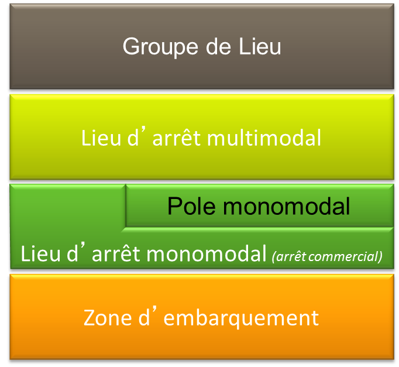
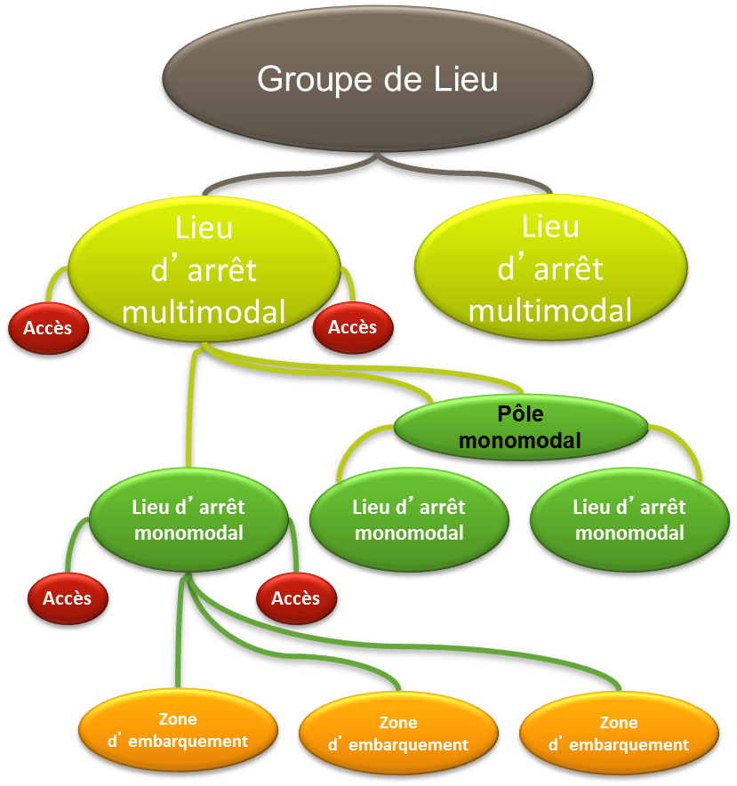
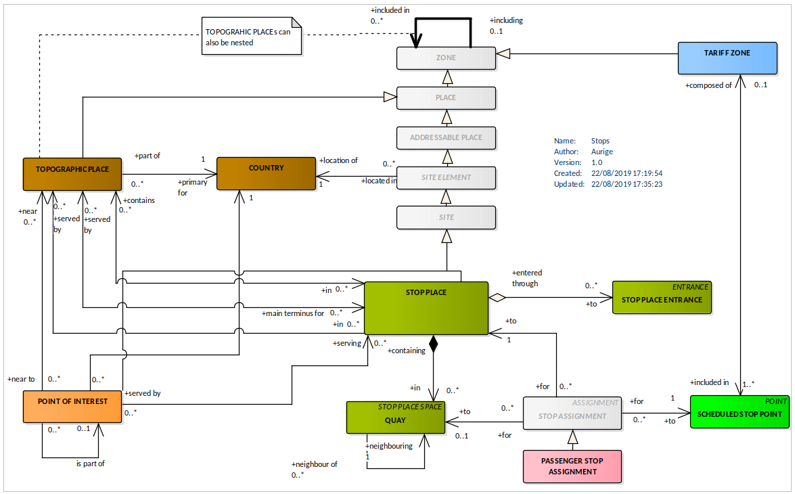

**Avant-propos**

L’harmonisation des pratiques dans l’échange des données relatives aux
offres de transport est essentielle :

- pour l’usager, aux fins d’une présentation homogène et
  compréhensible de l’offre de transport et de l’engagement
  sous-jacent des organisateurs (autorités organisatrices et
  opérateurs de transports) ;

- pour les AO, de manière à fédérer des informations homogènes venant
  de chacun des opérateurs de transports qui travaillent pour elle.
  L’harmonisation des échanges, et en particulier le présent profil,
  pourra le cas échéant être imposé par voie contractuelle. Cette
  homogénéité des formats d’information permet d’envisager la mise en
  place de systèmes d’information multimodaux, produisant une
  information globale de l’offre de transports sur un secteur donné,
  et garantir le fonctionnement des services d’information, en
  particulier des calculateurs d’itinéraires, et la cohérence des
  résultats, que ces services soient directement intégrés dans ces
  systèmes d’information multimodaux ou qu’ils puisent leurs
  informations sur des bases de données réparties ;

- pour les opérateurs, qui pourront utiliser ce format d’échange pour
  leurs systèmes de planification, les systèmes d’aide à
  l’exploitation, leurs systèmes billettiques et leurs systèmes
  d’information voyageur (information planifiée et information temps
  réel)

- pour les industriels et développeurs pour pérenniser et fiabiliser
  leurs investissements sur les formats d’échanges implémentés par les
  systèmes qu’ils réalisent, tout en limitant fortement l’effort de
  spécification lié aux formats d’échange

Ce document est le fruit de la collaboration entre les différents
partenaires des autorités organisatrices de transports, opérateurs,
industriels et développeurs de solutions et de systèmes informatiques
ayant pour objet l’aide à l’exploitation du transport public et
l’information des voyageurs. Il a pour objet de présenter la partie Arrêts du
Profil France de NeTEx : "format de référence pour l'échange de
données de description des arrêts" (issu des travaux *NeTEx,
Transmodel)* qui aujourd’hui fait consensus dans les groupes de
normalisation (CN03/GT7 – Transport public / information voyageur).

Ce document a été validé et publié comme suit :

- travaux de révision : 2024-2025
- date de validation en CN03 : 19 décembre 2025
- date de publication : 6 mars 2026

**Introduction**

Le présent document fait partie du profil France de NeTEx.

NeTEx (CEN/TS 16614 series) propose un format et des
services d'échange de données de description de l'offre de transport
planifiée, basé sur Transmodel (EN 12896 series). NeTEx permet non seulement
d'assurer les échanges pour les systèmes d'information voyageur mais
traite aussi l’ensemble des concepts nécessaires en entrée et sortie des
systèmes de planification de l'offre (graphiquage, etc.) et des SAE
(Systèmes d’Aide à l’Exploitation).

NeTEx se décompose en six parties:

- Partie 1 : topologie des réseaux (les réseaux, les lignes, les
  parcours commerciaux les missions commerciales, les arrêts et lieux
  d’arrêts, les correspondances et les éléments géographiques en se
  limitant au strict minimum pour l’information voyageur)

- Partie 2 : horaires théoriques (les courses commerciales, les heures
  de passage graphiquées, les jours types associés ainsi que les
  versions des horaires)

- Partie 3 : information tarifaire (uniquement à vocation
  d’information voyageur)

- Partie 4 : profil européen pour l'information voyageur (EPIP)

- Partie 5: nouveaux modes (les véhicules partagés en libre service, les courses
  partagées, etc.)

- Partie 6: profil européen pour l'information voyageur en lien avec
  l'accessibilité (EPIAP)

NeTEx a été développé dans le cadre du CEN/TC278/WG3/SG9 piloté par la France.
Les premières publications de NeTEx datent de 2014 et les plus récentes de mars
2026.

Il faut noter que NeTEx a été l'occasion de renforcer les liens du
CEN/TC278/WG3 avec le secteur ferrovaire, en particulier grâce à la
participation de l'ERA (Agence Européen du Rail, qui a intégré NeTEx
dans la directive Européenne 454/2011 TAP-TSI ) et de l'UIC (Union
International des Chemins de fer).

Les normes, dans leur définition même, sont des « documents établis par
consensus ». Celles du CEN/TC278 sont de plus établies à un niveau
européen, en prenant donc en compte des exigences qui dépassent souvent
le périmètre national.

Il en résulte des normes qui sont relativement volumineuses et dont le
périmètre dépasse souvent largement les besoins d'une utilisation
donnée. Ainsi, à titre d'exemple, SIRI propose toute une série d'options
ou de mécanismes dont la vocation est d'assurer la compatibilité avec
les systèmes développés en Allemagne dans le contexte des VDV453/454. De
même, SIRI propose des services dédiés à la gestion des correspondances
garanties, services qui, s'ils sont dès aujourd'hui pertinents en Suisse
ou en Allemagne, sont pratiquement inexistants en France.

De plus, un certain nombre de spécificités locales ou nationales peuvent
amener à préciser l'usage ou la codification qui sera utilisée pour
certaines informations. Par exemple, les Anglais disposant d'un
référentiel national d'identification des points d'arrêts (NaPTAN), ils
imposeront naturellement que cette codification soit utilisée dans les
échanges SIRI, ce que ne feront pas les autres pays européens.

Enfin, certains éléments proposés par ces normes sont facultatifs et il
convient, lors d'une implémentation, de décider si ces éléments seront
ou non implémentés.

L'utilisation des normes liées à l'implémentation de l'interopérabilité
pour le transport en commun passe donc systématiquement par la
définition d'un profil (local agreement, en anglais). Concrètement, le
profil est un document complémentaire à la norme et qui en précise les
règles de mise en œuvre dans un contexte donné. Le profil contient donc
des informations comme :

- détail des services utilisés,

- détails des objets utilisés dans un échange,

- précisions sur les options proposées par la norme,

- précision sur les éléments facultatifs,

- précision sur les codifications à utiliser,

- etc.

Ce document présente la partie Arrêts du profil France de NeTEx, tel que défini
par le Groupe de Travail dédié à l'information voyageur et à l'exploitation des
services de mobilité (GT7) au sein de la Commission Nationale de normalisation
pour le transport public (CN03).

D'autres parties du profil France de NeTEx sont disponibles (réseau, horaire,
tarif, accessibilité, parking). Ils sont tous complémentaires les uns des autres
(sans recouvrement) et s'appuient tous sur le document:
**NeTEx - Profil France - Éléments communs.** Il conviendra de se référer à ce
document pour tous les éléments utilisés dans le présent document, et dont la
structure n'est pas détaillée.

Cette partie du profil d’échange a pour objectif de décrire et de structurer
précisément les éléments nécessaires à une bonne information de
description des arrêts de transport public de façon :

- à pouvoir les présenter d’une manière homogène et compréhensible à
  l’usager des transports publics sur des supports différents (papier
  ou Internet),

- à pouvoir les échanger entre systèmes d’information (systèmes
  d’information voyageurs et systèmes d’information multimodale,
  systèmes d’aide à l’exploitation, systèmes de planification,
  systèmes billettiques, etc.).

Les éléments présentés ci-dessous couvrent donc l’ensemble des concepts
propres à la description des arrêts.

**NOTE IMPORTANTE** : Ce document étant un profil d'échange de NeTEx, il
ne se substitue en aucun cas à NeTEx, et un minimum de connaissance de
NeTEx sera nécessaire à sa bonne compréhension.

# Domaine d'application

Le présent document constitue la partie du profil France de la CEN/TS 16614
(NeTEx) pour l'échange de données de description d'arrêt en France. Il permet de
décrire les arrêts de transports publics et la manière dont ils pourront être
structurés pour des échanges entre systèmes d'information ainsi que pour leur
présentation aux voyageurs.

C'est la structure de l'arrêt lui-même (ses composants, ses attributs et
sa géographie) qui est prise en compte dans ce contexte, et non son
insertion dans le contexte de l'offre de transport (pas de références
aux lignes, aux horaires, etc.).

# Références normatives

Les documents de référence suivants sont indispensables pour
l'application du présent document. Pour les références datées, seule
l'édition citée s'applique. Pour les références non datées, la dernière
édition du document de référence s'applique (y compris les éventuels
amendements).

CEN/TS 16614-1, Network and Timetable Exchange (NeTEx) — Part 1: Public
transport network topology exchange format

CEN/TS 16614-2, Network and Timetable Exchange (NeTEx) — Part 2: Public
transport scheduled timetables exchange format

EN 12896, Road transport and traffic telematics - Public transport -
Reference data model (Transmodel)

# Termes et définitions

Pour les besoins du présent document, les termes et définitions suivants
s'appliquent. Une grande partie d’entre eux est directement issue de
Transmodel et NeTEx.

NOTE Les termes spécifiquement introduits par le profil d’arrêt sont
signalés par le mot *(profil)*, en italique et entre parenthèses. Les
définitions ci-dessous sont des traductions littérales du document
normatif.

NOTE Les définitions ci-dessus sont des traductions littérales du
document normatif.

## ACCÈS DE LIEU D'ARRÊT (STOP PLACE ENTRANCE)

<div class="Definition">

*(Transmodel)*

</div>

<div class="Definition">

Un ACCÈS DE LIEU D'ARRÊT est un accès physique à un LIEU D’ARRÊT (entrée
ou sortie). Il peut comporter une porte, une barrière, un portillon ou
tout autre signe distinctif d’un accès.

</div>

## ACCÈS DE SITE (ENTRANCE)

<div class="Definition">

*(Transmodel)*

</div>

<div class="Definition">

Un ACCÈS DE SITE est un accès physique à un SITE (entrée ou sortie). Il
peut comporter une porte, une barrière, un portillon ou tout autre signe
distinctif d’un accès.

</div>

## ADRESSE (ADDRESS)

<div class="Definition">

*(Transmodel)*

</div>

<div class="Definition">

Adresse d'un lieu (postale et/ou sur voirie)

</div>

## ADRESSE POSTALE (POSTAL ADDRESS)

<div class="Definition">

*(Transmodel)*

</div>

<div class="Definition">

Spécification d'une ADRESSE sur la base des attributs
conventionnellement utilisés par les services postaux. Cela comprend
diverses identifications du bâtiment, le nom de la rue, le code postal
et d'autres descripteurs.

</div>

## ADRESSE SUR VOIRIE (ROAD ADDRESS)

<div class="Definition">

*(Transmodel)*

</div>

<div class="Definition">

Spécification d'une ADRESSE sur la base des attributs permettant
d’identifier sa position sur la voirie, comme les numéros, types et nom
de voies, et les éléments de positionnement le long de la voie.

</div>

## COMPOSANT DE LIEU D'ARRÊT (STOP PLACE COMPONENT)

<div class="Definition">

*(Transmodel)*

</div>

<div class="Definition">

Un COMPOSANT DE LIEU D'ARRÊT est un constituant d'un LIEU D'ARRÊT qui en
décrit une partie de la structure. Les COMPOSANTs DE LIEU D'ARRÊT
partagent avec le LIEU D'ARRÊT lui-même un certain nombre de propriétés
pour la gestion des données, l'accessibilité et diverses autres
caractéristiques.

</div>

## COMPOSANT DE SITE (SITE COMPONENT)

<div class="Definition">

*(Transmodel)*

</div>

<div class="Definition">

Un COMPOSANT DE LIEU est un constituant d'un SITE qui en décrit une
partie de la structure. Les COMPOSANTs DE LIEU partagent avec le LIEU
lui-même un certain nombre de propriétés pour la gestion des données,
l'accessibilité et diverses autres caractéristiques.

</div>

## ÉLÉMENT DE SITE (SITE ELEMENT)

<div class="Definition">

*(Transmodel)*

</div>

<div class="Definition">

Type de LIEU définissant des propriétés communes pour les SITEs et
COMPOSANTs DE SITES auxquels il correspond, incluant l’ACCESSIBILITÉ.

</div>

## ESPACE DE LIEU D'ARRÊT (STOP PLACE SPACE)

<div class="Definition">

*(Transmodel)*

</div>

<div class="Definition">

Espace (physique) au sein d'un LIEU D'ARRÊT, par exemple une ZONE
D'EMBARQUEMENT, un POINT D'EMBARQUEMENT, un LIEU D'ÉQUIPEMENT, etc.

</div>

## GROUPE DE LIEUX D’ARRÊT (GROUP OF STOP PLACE)

<div class="Definition">

*(Transmodel)*

</div>

<div class="Definition">

Il correspond à une spécialisation de la notion normalisée TRANSMODEL de
GROUPE D’ENTITÉs (GROUP OF ENTITIES en anglais).

</div>

## LIEU (PLACE)

<div class="Definition">

*(Transmodel<u>)</u>*

</div>

<div class="Definition">

Zone géographique d'un quelconque type qui peut être utilisé comme point
de départ ou d'arrivée d'un déplacement. Un lieu peut être de dimension
0 (POINT), 1 (comme une route par exemple) ou 2 (ZONE).

</div>

## LIEU D’ARRÊT Monomodal

<div class="Definition">

*(profil)*

</div>

<div class="Definition">

Il correspond à une spécialisation de la notion normalisée de LIEU
D'ARRÊT (STOP PLACE en anglais) dédiant le LIEU et ses COMPOSANT à un
unique MODE.

</div>

## LIEU D’ARRÊT Multimodal

<div class="Definition">

*(profil)*

</div>

<div class="Definition">

Il correspond aussi à une spécialisation de la notion normalisée de LIEU
D'ARRÊT (STOP PLACE en anglais) : un LIEU D’ARRÊT Multimodal n’est
composé que de LIEUx D’ARRÊT Monomodaux et Pôles Monomodaux de modes
différents.

</div>

## LIEU D'ARRÊT (STOP PLACE)

<div class="Definition">

*(Transmodel)*

</div>

<div class="Definition">

Lieu comprenant un ou plusieurs emplacements où les véhicules peuvent
s’arrêter et où les voyageurs peuvent monter à bord ou descendre des
véhicules ou préparer leur déplacement.

</div>

## LIEU TOPOGRAPHIQUE (TOPOGRAPHICAL PLACE)

<div class="Definition">

*(Transmodel)*

</div>

<div class="Definition">

Espace géographique offrant un contexte topographique lors de la
recherche ou de la présentation d'itinéraire (par exemple pour l'origine
ou la destination du déplacement). Cet espace peut être de toute taille
(pays, ville, village, etc.) et correspondre à des périmètres très
variés (Greater London, London, West End, Westminster, St James s,
etc.).

</div>

<div class="Definition">

Un LIEU TOPOGRAPHIQUE doit toujours disposer d'un nom officiel. Il peut
être utile/nécessaire de définir une relation hiérarchique entre les
LIEUx TOPOGRAPHIQUEs de façon à les distinguer de façon non ambigüe, en
particulier en cas d'identité de nom.

</div>

## MODE DE TRANSPORT (VEHICLE MODE)

<div class="Definition">

*(Transmodel)*

</div>

<div class="Definition">

Le MODE DE TRANSPORT est une caractérisation du transport public
correspondant au moyen (véhicule) de transport (bus, tram, métro, train,
ferry, bateau, etc.).

</div>

## Pôle Monomodal

<div class="Definition">

*(profil)*

</div>

<div class="Definition">

Le Pôle Monomodal correspond à une spécialisation de la notion
normalisée de LIEU D'ARRÊT (STOP PLACE en anglais) : un Pôle Monomodal
n’est composé que de LIEUx D’ARRÊT Monomodaux de modes identiques mais
de noms différents.

</div>

## POSITION D'EMBARQUEMENT (BOARDING POSITION)

<div class="Definition">

*(Transmodel)*

</div>

<div class="Definition">

Emplacement au sein d'une ZONE D'EMBARQUEMENT à partir desquels les
passagers peuvent embarquer, ou vers lequel ils peuvent débarquer du
VÉHICULE.

</div>

## SITE (SITE)

<div class="Definition">

*(Transmodel)*

</div>

<div class="Definition">

Type de LIEU (comme un LIEU D'ARRÊT, un POINT D'INTÉRÊT, etc.) vers ou à
partir duquel un voyageur peut souhaiter vouloir voyager. Un SITE peut
avoir des ENTRÉEs qui en constituent les points d'accès (correspondant
éventuellement à des besoins utilisateurs particuliers: PMR, etc.).

</div>

## SUITE DE TRONÇON (LINK SEQUENCE)

<div class="Definition">

*(Transmodel)*

</div>

<div class="Definition">

Une suite ordonnée de POINTs ou TRONÇONs définissant un chemin à travers
le réseau.

</div>

## ZONE D’EMBARQUEMENT (QUAY)

<div class="Definition">

*(Transmodel)*

</div>

<div class="Definition">

Lieu tel qu’une plateforme, zone, quai ou voie à quai où les voyageurs
peuvent accéder aux véhicules de transport public, taxis, cars ou tout
autre mode de transport.

</div>

## ZONE TARIFAIRE (TARIFF ZONE)

<div class="Definition">

*(Transmodel)*

</div>

<div class="Definition">

Une ZONE utilisée dans un système de tarification zonale.

</div>

# Symboles et abréviations

AO

<div class="Definition">

Autorité Organisatrice de Transports

</div>

PMR

<div class="Definition">

Personne à Mobilité Réduite

</div>

# Rappel sur la structuration des arrêts

La structure proposée est représentée par la figure ci-dessous. C'est
une structure d'imbrication hiérarchique forte, qui s'appuie sur une
base modale.


*Structuration des arrêts*

Le typage proposé de chaque niveau (voir les définitions) est
suffisamment fort pour que cette structure soit très systématique dans
sa mise en œuvre: l’objectif est de toujours savoir comment réaliser le
groupement et la hiérarchisation face à une situation donnée.

Il est aussi important de noter qu'il n'y a pas de récurrence des
niveaux : chaque élément d'un niveau peut contenir des éléments du
niveau directement inférieur, mais il ne contiendra jamais des éléments
du même niveau, ou des niveaux supérieurs.

Les différents acteurs pourront naturellement utiliser tout ou partie de
cette structure en fonction de leur besoin et des données dont ils
disposent. On pourra toutefois, afin de faciliter l'interopérabilité et
les échanges, envisager d'«imposer» la disponibilité du niveau Lieu
d’Arrêt Monomodal (arrêt commercial) : ce niveau (et uniquement
celui-là) semble pouvoir en effet être rendu disponible par tous les
acteurs.

Quatre niveaux hiérarchiques d’arrêt sont disponibles :

- Groupe de Lieux

- Lieu d’arrêt multimodal

- Lieu d’arrêt monomodal et pôle monomodal

- Zone d’embarquement (Quai de train, voie à quai, poteau de Bus, de
  Tram …. )

La figure ci-dessous fournit une vue arborescente de cette
structuration, et y fait de plus apparaître la notion d'accès.


*Structuration des arrêts: vue hiérarchique complète*

L'accès de lieux peut être rattaché uniquement aux Lieux d’arrêt
monomodaux ou aux Lieux d’arrêt multimodaux (voir sa définition
ci-dessous).

# Exigences minimales liées au code des transports et la règlementation européenne

La mise à disposition des données, quand elles existent, est obligatoire et se
conforme aux exigences:

- Au niveau européen, du règlement délégué (UE) 2017/1926 de la Commission du 31
  mai 2017 modifié par le règlement délégué (UE) 2024/490 de la Commission du 29
  novembre 2023 (<https://eur-lex.europa.eu/eli/reg_del/2017/1926/2024-03-04>),
  dit "règlement MMTIS";
- Au niveau français, des articles L. 1115-1 à L. 1115-7, D. 1115-1, R. 1115-2 à
  R. 1115-8 et D. 1115-9 à D. 1115-11 du code du transports, notamment créés ou
  modifiés par les articles 25 et 27 de loi n° 2019-1428 du 24 décembre 2019
  d’orientation des mobilités, dites loi « LOM ». Ces mêmes articles de la LOM
  précise le calendrier de mise à disposition des données.

Le tableau ci-dessous résulte de l’analyse du code des transports et du
règlement MMTIS et fournit la liste des concepts concernés dans le présent
profil correspondant aux données mentionnées dans l’annexe du règlement. Il sera
donc nécessaire de fournir ces données pour être conforme au cadre réglementaire
(il s’agit bien de mettre à disposition toutes les données existantes dans les
SI transport, et non de créer des données qui n’existeraient pas encore sous
forme informatique).

Notez que beaucoup de concepts dépendent des concepts issus de Transmodel/NeTEx
et sont liés entre eux, soit par héritage, soit par relation au sens UML des
termes. Par ailleurs, certains concepts additionnels peuvent relever d’autres
parties du profil France, précisés dans le tableau le cas échéant.

De plus, les noms des catégories (colonnes Catégorie et Détail) ont été
conservés dans la langue originale du document (l’anglais) pour éviter
tout risque de confusion. Pour la même raison, les noms des concepts
concernés sont ceux de la version originale de Transmodel.

Pour certaines catégories de données, il peut arriver que les concepts
correspondants soient multiples, mais aussi qu’ils soient différents
suivant le niveau de précision porté par la donnée. La colonne
« Concepts à minima » correspond alors au minimum à fournir pour
répondre à la catégorie en question et les colonnes « Autres concepts »
décrit des informations complémentaires qui, si elles sont utiles, ne
sont pas indispensables pour répondre à cette catégorie (notez que dans
certains cas, ces concepts additionnels peuvent relever d’autres
profils : ceci est précisé dans le tableau quand c’est le cas). Il faut
toutefois garder à l’esprit que toute information existante est supposée
être mise à disposition (que cela relève de la première ou de la seconde
colonne).

La première colonne reprend la notion de *niveau* tel qu’il est décrit
et utilisé par le règlement européen et a notamment une incidence sur le
calendrier de mise à disposition de la donnée (voir le règlement pour
plus de détails).

Les différents concepts présentés ne sont bien sûr pas détaillés dans ce
tableau, mais dans le profil lui-même. C’est aussi dans la description
du profil que l’on trouvera les détails concernant les attributs
(obligatoire/facultatif, règles de remplissage, codification, etc.).
Pour ce qui est des attributs facultatifs, la règle reste que, pour les
objets ci-dessous, toute information disponible est supposée être
fournie (mais on ne crée pas d’information si elle n’est pas
disponible).

<div class="table-title">Concepts relatifs à la LOM et à la Règlementation Européenne</div>

| Niveau | Catégorie                                               | Détail                                                                                                                                                  | Concepts à minima                               | Autres concepts                                                                                   | Commentaire                                                                                                                                                                                     |
| ------ | ------------------------------------------------------- | ------------------------------------------------------------------------------------------------------------------------------------------------------- | ----------------------------------------------- | ------------------------------------------------------------------------------------------------- | ----------------------------------------------------------------------------------------------------------------------------------------------------------------------------------------------- |
| 1      | ***Location search (origin/ destination)***             | Address identifiers (building number, street name, postcode)                                                                                            | Tous les objets héritant d'**ADRESSABLE PLACE** | **ENTRANCE<br>QUAI<br>POI<br>PARKING**                                                            | L’Adresse est incluse dans tous les objets héritant d'ADRESSABLE PLACE<br>Au-delà du Profil Arrêt, les informations d’adresse sont donc attendues pour tous les objets susceptible d’en porter. |
| 1      | ***Location search (origin/ destination)***             | Topographic places (city, town, village, suburb, administrative unit)                                                                                   | **TOPOGRAPHIC PLACE**                           |                                                                                                   |                                                                                                                                                                                                 |
| 1      | ***Location search (access nodes)***                    | Identified access nodes (all scheduled modes)                                                                                                           | **STOP PLACE**                                  | <p>**QUAY**</p><p>(partie réseau)</p><p>**SCHEDULED STOP POINT<br>PASSENGER STOP ASSIGNMENT**</p> |                                                                                                                                                                                                 |
| 1      | ***Location search (access nodes)***                    | Geometry/map layout structure of access nodes (all scheduled modes)                                                                                     | **STOP PLACE**                                  | **QUAY**                                                                                          |                                                                                                                                                                                                 |
| 1      | ***Trip plan computation — scheduled modes transport*** | Stop facilities access nodes (including platform information, help desks/information points, ticket booths, lifts/stairs, entrances and exit locations) | **STOP PLACE's FACILITIES**                     | <p>(partie Accessibilité)</p><p>**EQUIPMENT**</p>                                                 |                                                                                                                                                                                                 |
| 1      | ***Trip plan computation — scheduled modes transport*** | Accessibility of access nodes, and paths within an interchange (such as existence of lifts, escalators)                                                 | **STOP PLACE's FACILITIES**                     | <p>(partie Accessibilité)</p><p>**EQUIPMENT<br>NAVIGATION PATH**</p>                              |                                                                                                                                                                                                 |
| 1      | ***Trip plan computation — scheduled modes transport*** | Existence of assistance services (such as existence of on-site assistance)                                                                              | **STOP PLACE's FACILITIES**                     | <p>(partie Accessibilité)</p><p>**LOCAL SERVICE**</p>                                             |                                                                                                                                                                                                 |

# Description du profil d’échange

## Conventions de représentation

### Tableaux d’attributs

NOTE les choix de conventions présentées ici ont pour vocation d'être
cohérents avec celle réalisée dans le cadre du profil SIRI (STIF et
CEREMA). De plus tous les profils NeTEx partagent les mêmes conventions.

Les messages constituant ce profil d'échange sont décrits ci-dessous
selon un double formalisme: une description sous forme de diagrammes XSD
(leur compréhension nécessite une connaissance préalable de XSD: XML
Schema Definition) et une description sous forme tabulaire. Les tableaux
proposent ces colonnes:

|                    |         |          |                 |                 |
| ------------------ | ------- | -------- | --------------- | --------------- |
| **Classification** | **Nom** | **Type** | **Cardinalité** | **Description** |

- **Classification** : permet de catégoriser l'attribut. Les
  principales catégories sont:

  - PK (Public Key) que l'on peut interpréter comme Identifiant
    Unique: il permet à lui seul d'identifier l'objet, de façon
    unique, pérenne et non ambiguë. C'est l'identifiant qui sera
    utilisé pour référencer l'objet dans les relations.

  - AK (Alternate Key) est un identifiant secondaire, généralement
    utilisé pour la communication, mais qui ne sera pas utilisé dans
    les relations.

  - FK (Foreign Key) indique que l'attribut contient l'identifiant
    unique (PK) d'un autre objet avec lequel il est en relation.

  - GROUP est un groupe XML nommé (ensemble d'attributs utilisables
    dans différents contextes) (voir
    <http://www.w3.org/TR/2001/REC-xmlschema-0-20010502/#AttrGroups>
    )

- **Nom** : nom de l'élément ou attribut XSD

- **Type** : type de l'élément ou attribut XSD (pour certains d'entre
  eux, il conviendra de se référer à la XSD NeTEx)

- **Cardinalité** : cardinalité de l'élément ou attribut XSD exprimée
  sous la forme "***minimum:maximum***" ("0:1" pour au plus une
  occurrence; "1:\*" au moins une occurrence et sans limites de nombre
  maximal; "1:1" une et une seule occurrence; etc.).

- Description : texte de description de l'élément ou attribut XSD
  (seul les attributs retenus par le profil ont un texte en français;
  les textes surlignés en jaune indiquent une spécificité du profil
  par rapport à NeTEx).

Les textes surlignés en <mark>jaune</mark> sont ceux
présentant une particularité (spécialisation) par rapport à NeTEx: une
codification particulière, une restriction d'usage, etc.

La description XSD utilisée est strictement celle de NeTEx, sans aucune
modification (ceci explique notamment que tous les commentaires soient
en anglais).

Les attributs et éléments rendus obligatoires dans le cadre de ce profil
restent facultatifs dans l'XSD (le contrôle de cardinalité devra donc
être réalisé applicativement).

### Valeurs de code de profil

Dans la mesure du possible, le profil sélectionne les valeurs de code à
utiliser pour caractériser des éléments et les limite à un ensemble de
valeurs documentées. NETEX propose plusieurs mécanismes différents pour
spécifier les valeurs de code autorisées :

- des énumérations fixes définies dans le cadre du schéma XSD NeTEx.
  Le profil impose alors un sous-ensemble des codes NeTEx.

- des spécialisations de TYPE OF VALUE, utilisées pour définir des
  ensembles de codes ouverts pouvant être ajoutés au fil du temps sans
  modifier le schéma, par exemple, pour enregistrer des
  classifications d'entités héritées. Le profil lui-même utilise le
  mécanisme TYPE OF VALUE dans quelques cas pour spécifier des codes
  normalisés supplémentaires : ceux-ci sont affectés à un CODESPACE
  «FR_IV_metadata» (<https://netex-cen.eu/FR_IV>) indiqué par un préfixe
  «FR_IV». (par exemple, «FR_IV: monomodal».)

- des instances TypeOfFrame: le profil utilise plusieurs TYPES DE
  FRAME pour spécifier l'utilisation de VERSION FRAME dans le profil.

### Indication des classes abstraites

NeTEx et Transmodel utilisent largement l'héritage de classe; cela
simplifie considérablement la spécification en évitant les répétitions
puisque les attributs partagés sont déclarés par une superclasse et que
des sous-classes viennent ensuite les spécialiser sans avoir à répéter
ces attributs et en n’ajoutant que ceux qui lui sont spécifiques. La
plupart des superclasses sont «abstraites» - c’est-à-dire qu’il n’existe
aucune instance concrète; seules les sous-classes terminales sont
«concrètes».

Un inconvénient de l'héritage est que si l'on veut comprendre les
propriétés d'une classe concrète unique, il faut également examiner
toutes ses super-classes. Pour cette raison, le profil inclut les
classes abstraites nécessaires pour comprendre les classes concrètes,
même si ces classes concrètes ne sont jamais directement instanciées
dans un document NeTEx.

- Les super-classes sont signalées dans les en-têtes par le suffixe
  «*(abstrait)*»

- Dans les diagrammes UML (comme pour NeTEx et Transmodel), les noms
  des classes abstraites sont indiqués en italique et les classes
  abstraites sont de couleur gris clair.

- Certaines super-classes ne sont techniquement pas abstraites dans
  NeTEx, mais ne sont pas utilisées comme classes concrètes dans le
  profil : elles sont signalées avec la même convention que les
  classes abstraites.

### Classes de sous-composants

Un certain nombre de classes ont des sous-composants qui constituent
leur définition. Celles-ci fournissent des détails auxiliaires (par
exemple, AlternativeText, AlternativeName, TrainComponent) et sont
signalées dans les en-têtes par le suffixe « *(objet inclus)*».

## Lieux d'arrêt (monomodal, multimodal et pôle monomodal)

### LIEU D’ARRÊT Monomodal

Il correspond à une spécialisation de la notion normalisée de LIEU
D'ARRÊT (STOP PLACE en anglais): Lieu comprenant un ou plusieurs
emplacements où les véhicules peuvent s’arrêter et où les voyageurs
peuvent monter à bord ou descendre des véhicules ou préparer leur
déplacement.

Ce type de lieu ne contiendra que des possibilités d’accès à des
véhicules d’une même catégorie de mode (le mode desservi sera donc l’un
de ses attributs). Il correspond à ce qui est souvent appelé arrêt
commercial (mais les vocabulaires varient…).

Il peut contenir des ZONEs D’EMBARQUEMENT. S’il en contient, c’est un
regroupement des ZONEs D’EMBARQUEMENT dédiées à un même mode. Si
toutefois l’information n’est pas disponible, le LIEU D’ARRÊT Monomodal
pourra ne pas référencer de ZONE D’EMBARQUEMENT.

Toutes les ZONEs D’EMBARQUEMENT d’un LIEU D’ARRÊT Monomodal doivent être
de même type (voir l’attribut Type de ZONE D’EMBARQUEMENT, ou de types
« compatibles » cette compatibilité se limitant à permettre un
groupement de quais et de poteaux. Le tableau ci-dessous présente les
types de ZONE D’EMBARQUEMENT et la façon dont on peut les associer au
sein d’un même LIEU D’ARRÊT Monomodal.

NOTE : le mode d’une ZONE D’EMBARQUEMENT est son mode principal, elle
peut donc être desservie par différents modes « compatibles » (colonne
de droite du tableau).

<div class="table-title">Types de ZONE D’EMBARQUEMENT et compatibilité des modes</div>

| Type de ZONE D’EMBARQUEMENT                                                          | Autres types de ZONE D’EMBARQUEMENT «&nbsp;compatibles&nbsp;» | Mode de transport possible                                                                                                            |
| ------------------------------------------------------------------------------------ | ------------------------------------------------------------- | ------------------------------------------------------------------------------------------------------------------------------------- |
| Quai de gare (ferré)                                                                 | *aucun*                                                       | <ul><li>Ferré</li><li>*(inclus sous mode Tram-Train (inclus sous mode Tram-Train à interpréter Train-Tram dans ce cas-là))*</li></ul> |
| Quai de métro                                                                        | *aucun*                                                       | <ul><li>Métro</li><li>Funiculaire</li></ul>                                                                                           |
| Quai de tram                                                                         | Arrêt de tram                                                 | <ul><li>Tram</li><li>*(inclus sous mode Tram-Train)*</li></ul>                                                                        |
| Arrêt de tram (poteau)                                                               | Quai de tram                                                  | <ul><li>Tram</li></ul>                                                                                                                |
| Arrêt de bus, autocar ou trolley (généralement poteau, sans matérialisation de quai) | Quai de bus, autocar ou trolley                               | <ul><li>Bus</li><li>Car</li><li>Trolley</li></ul>                                                                                     |
| Quai de bus, autocar ou trolley                                                      | Arrêt de bus, autocar ou trolley                              | <ul><li>Bus</li><li>Car</li><li>Trolley</li></ul>                                                                                     |
| Quai de bateau                                                                       | Accostage de ferry                                            | <ul><li>Maritime ou Fluvial</li></ul>                                                                                                 |
| Accostage de ferry                                                                   | Quai de bateau                                                | <ul><li>Maritime ou Fluvial</li></ul>                                                                                                 |
| Quai de téléphérique                                                                 | *aucun*                                                       | <ul><li>Transport par câble (télécabine, etc.)</li></ul>                                                                              |
| Porte d'aéroport                                                                     | *aucun*                                                       | <ul><li>Aérien</li></ul>                                                                                                              |

Le LIEU D’ARRÊT Monomodal, en plus de la contrainte de catégorie de
mode, porte une contrainte de nom: toutes les zones d’embarquement d’un
LIEU D’ARRÊT Monomodal portent le même nom (si ce n’est pas le cas, on
définit plusieurs LIEU D’ARRÊT Monomodaux que l'on regroupe au sein d'un
Pôle Monomodal). Notez que dans le cas des trains, l’éventuel nom de
voie (« A », « 2B », « 2 » , etc.) est précisé par un PublicCode et non
par le nom.

Le LIEU D’ARRÊT Monomodal ne peut pas contenir d’autre LIEU D’ARRÊT.

La notion de correspondance est implicite au sein d'un LIEU D’ARRÊT
Monomodal.

Une ZONE D’EMBARQUEMENT n’appartient qu’à un seul LIEU D’ARRÊT
Monomodal.

Le LIEU D’ARRÊT Monomodal peut être typé (attribut ***StopPlaceType***).
En plus de son mode principal, elle dispose des types présentés en
7.2.10.1. Ces types, quand ils sont utilisés pour un LIEU D’ARRÊT
Monomodal ont aussi une portée d'information complémentaire :

- Pour tous les types, autres que les trois ci-dessous (arrêts
  commerciaux au sens large): le LIEU D’ARRÊT Monomodal contient
  obligatoirement des ZONEs D’EMBARQUEMENT portant le même nom et
  correspondant généralement (mais pas obligatoirement) à l’aller et
  au retour d’une ou plusieurs lignes.

- Gare: station ferrée (n’a pas l’obligation de référencer de ZONEs
  D’EMBARQUEMENT)

- Aéroport: dédié à l’aérien (n’a pas l’obligation de référencer de
  ZONEs D’EMBARQUEMENT)

- Port: dédié au maritime ou au fluvial (n’a pas l’obligation de
  référencer de ZONEs D’EMBARQUEMENT)

### Pôle Monomodal

Il correspond aussi à une spécialisation de la notion normalisée
Transmodel de LIEU D'ARRÊT (STOP PLACE en anglais).

Dans un certain nombre de cas, on trouve des LIEUx D’ARRÊT Monomodaux de
même mode et portant des noms différents, mais que l’on souhaite grouper
ensemble (pour des raisons de proximité et de correspondance): on
utilise alors un Pôle Monomodal.

Ce type de lieu contiendra au moins deux LIEUx D’ARRÊT Monomodaux.

Il ne contient pas de ZONE D’EMBARQUEMENT (plus précisément, il contient
des LIEUx D’ARRÊT Monomodaux qui eux peuvent contenir des ZONEs
D’EMBARQUEMENT).

La notion de correspondance est implicite au sein d'un Pôle Monomodal.
Cela signifie qu'une correspondance est possible (en termes de distance)
entre n'importe quel couple de ZONE D’EMBARQUEMENT des LIEUx D’ARRÊT
Monomodaux constituant le Pôle Monomodal. Toutefois cela n'implique pas
nécessairement la mise en cohérence des horaires de passage des lignes
desservant le Pôle.

### LIEU D’ARRÊT Multimodal

Il correspond aussi à une spécialisation de la notion normalisée
Transmodel de LIEU D'ARRÊT (STOP PLACE en anglais).

Ce type de lieu contiendra impérativement des possibilités d’accès à des
véhicules de plusieurs modes.

Il contiendra au moins deux objets fils (de type LIEUx D’ARRÊT Monomodal
ou Pôle Monomodal).

Il ne contient pas de ZONE D’EMBARQUEMENT (plus précisément, il contient
des LIEUx D’ARRÊT Monomodaux, éventuellement en passant par des Pôles
Monomodaux, qui eux peuvent contenir des ZONEs D’EMBARQUEMENT).

La notion de correspondance est implicite au sein d'un LIEU D’ARRÊT
Multimodal. Là encore cela signifie qu'une correspondance est possible
(en terme de distance) entre n'importe quel couple de ZONE
D’EMBARQUEMENT des LIEUx D’ARRÊT Monomodaux contenus dans le LIEU
D’ARRÊT Multimodal, et n'implique pas nécessairement la mise en
cohérence des horaires de passage des lignes desservant le LIEU.

Le LIEU D’ARRÊT Multimodal dispose d’un attribut indiquant son mode « de
plus haut niveau » : la hiérarchisation des modes suivante est proposée

1. Aérien

2. Maritime/Fluvial

3. Ferré

4. Métro

5. Tram

6. Funiculaire/Câble

7. Bus/Car/Trolley

### Modèle de données


*STOP PLACE – Modèle conceptuel*

L'objet le plus haut dans l'arbre d'héritage est la ZONE, décrivant un
objet générique à deux dimensions. Une ZONE peut être définie par un
GROUPE DE POINTS appartenant à la ZONE, et peut également être définie
comme une zone géométrique, bordée d'un polygone.

Une ZONE peut contenir d'autres ZONEs plus petites. Ceci est exprimé par
la relation réflexive sur ZONE (donc une STOP PLACE peut inclure
d'autres STOP PLACE comme tous les objets qui héritent de la ZONE).

Une ZONE peut être représentée par un seul POINT (par l'attribut
**Centroïd*) ***qui peut être utilisé comme une référence ponctuelle à
la ZONE elle-même. Ceci est utile pour représenter les systèmes de
transport flexibles (où un arrêt est souvent un ZONE).

Le deuxième niveau de la hiérarchie est la PLACE, qui représente
n'importe quel endroit significatif qu'un modèle de transport peut
vouloir décrire, et pour lequel la possibilité de voyage peut exister
(départ, arrivée ou point de passage). Une PLACE peut être spécialisée
de diverses manières, notamment une TOPOGRAPHIC PLACE (une ville, un
département ou une région nommée), ou une ADDRESSABLE PLACE spécifique
ayant un ADRESS qui est soit un ROAD ADDRESS, soit un POSTAL ADDRESS.

L’élément de site spécialisé ADDRESSABLE PLACE peut être utilisé pour
ajouter l'accessibilité (voir ACCESSIBILITY ASSESMENT) et d'autres
propriétés communes à tout lieu pouvant être parcouru par un passager.
Le SITE spécialise l’ELEMENT DE SITE pour fournir une description
générale des propriétés communes d'un lieu, tel qu'une station ou un
point d'intérêt, y compris ses entrées, niveaux, équipements,
cheminements, propriétés d'accessibilité, etc. Le SITE est lui-même
spécialisé en STOP PLACE, POINT D'INTERET, PARKING, etc.

La STOP PLACE décrit différents aspects d’un point d’accès physique au
transport, comme un arrêt ou une gare. Pour un lieu complexe, tel qu'une
station, cela inclut toutes les zones composant la station: les entrées,
les halls, les plates-formes, les niveaux sur lesquels elles se
trouvent, etc.

il est à noter qu'un lieu d'arrêt est un concept distinct de la
représentation de l'arrêt dans une table horaire- SCHEDULED STOP POINT.
Les deux peuvent être liés à l'aide d'un STOP ASSIGNMENT. Physiquement,
le SCHEDULED STOP POINT peut correspondre soit à un STOP PLACE entier,
soit à un QUAY spécifique

Puisqu'ils héritent aussi d'une relation d'inclusion de la ZONE, les
QUAY peuvent être imbriqués. Cela permet de représenter des
plates-formes composites à deux côtés ou plus ou à des sections nommées.

### Attributs du LIEU D’ARRÊT (StopPlace)

<div class="table-title">StopPlace</div>

| Classification             | Nom                       | Type                   |     | Description                                                                                                                                                                                                                                                                                                                                                                                                                                                                                                                                                                                                            |
| -------------------------- | ------------------------- | ---------------------- | --- | ---------------------------------------------------------------------------------------------------------------------------------------------------------------------------------------------------------------------------------------------------------------------------------------------------------------------------------------------------------------------------------------------------------------------------------------------------------------------------------------------------------------------------------------------------------------------------------------------------------------------- |
| ::>                        | ::>                       | *Site*                 | ::> | <p>STOP PLACE hérite de SITE.</p><p><mark>NOTE : L'identification du STOP PLACE a pour vocation à être codifiée. Sa codification est décrite dans le document **éléments communs**.</mark></p>                                                                                                                                                                                                                                                                                                                                                                                                                         |
| «AK»                       | ***PublicCode***          | *StopPlaceCodeType*    | 0:1 | Code court connu du public pour identifier le LIEU D'ARRÊT (utilisé par exemple pour les services SMS, etc.)                                                                                                                                                                                                                                                                                                                                                                                                                                                                                                           |
| STOP PLACE COMPONENT GROUP | ***TransportMode***       | *VehicleModeEnum*      | 1:1 | Mode de transport principal pour le LIEU. La liste des modes est présentée en 6.17 dans le Profil Éléments Communs.                                                                                                                                                                                                                                                                                                                                                                                                                                                                                                    |
|                            | ***submode***             | *TransportSubmodeEnum* | 0:1 | <p>Sous mode associé au mode (caractérise le type d’exploitation). Les sous modes sont une énumération dont les valeurs sont présentées en 7.2.10.</p><p><mark>Il faut noter le cas particulier du Tram-Train qui, bien qu'étant classé en sous-mode du TRAM, peut aussi être utilisé en sous-mode du Ferré.</mark></p><ul><li>*AirSubmode*</li><li>*BusSubmode*</li><li>*CoachSubmode*</li><li>*FunicularSubmode*</li><li>*MetroSubmode*</li><li>*TramSubmode*</li><li>*TelecabinSubmode*</li><li>*RailSubmode*</li><li>*WaterSubmode*</li></ul>                                                                      |
|                            | ***OtherTransportModes*** | *VehicleModeEnum*      | 0:* | Liste des autres modes de transport desservant le LIEU D'ARRÊT.                                                                                                                                                                                                                                                                                                                                                                                                                                                                                                                                                        |
|                            | ***tariffZones***         | *FareZoneRef*          | 0:* | <p>Identifiant de la zone tarifaire (ou section selon les cas) précisé dans le fichier `fare.xml`.</p><p>Si la zone tarifaire n'est pas précisée (le champ étant facultatif) mais que la ***StopPlace*** est incluse dans une autre <mark>(LIEU D'ARRÊT MONOMODAL dans une LIEU D'ARRÊT MULTIMODAL par exemple)</mark> qui lui a une ***FareZone***, alors la ou les zones tarifaires du ***StopPlace*** parent s'appliquent.</p><p>Le profil France fait une restriction de la norme NeTEx en demandant explicitement une FareZoneRef, alors que NeTEx indique TariffZone (dont FareZone est une spécialisation).</p> |
| STOP PLACE PROPERTY GROUP  | ***StopPlaceType***       | *StopPlaceTypeEnum*    | 1:1 | Type du LIEU D'ARRÊT (voir les définitions en 7.2.10.1 ).                                                                                                                                                                                                                                                                                                                                                                                                                                                                                                                                                              |
|                            | ***BorderCrossing***      | *xsd:boolean*          | 0:1 | Indique s’il y a un passage de frontière à ce Lieu d’Arrêt.                                                                                                                                                                                                                                                                                                                                                                                                                                                                                                                                                            |
|                            | ***Weighting***           | *InterchangeUseEnum*   | 0:1 | Qualification de la possibilité de correspondance au sein du lieu d’arrêt <ul><li>***noInterchange***</li><li>***interchangeAllowed*** <mark>(valeur par défaut si le champ n’est pas renseigné)</mark></li><li>***preferredInterchange*** (indique que le Lieu d’Arrêt est spécialement conçu pour faciliter les échanges, avec des chemins de guidage de chemin, un chemin de promenade facile, sécurisé et court, etc.).</li></ul>                                                                                                                                                                                  |
|                            | ***StopPlaceWeight***     | *StopPlaceWeightEnum*  | 0:1 | Les lieux d'arrêt peuvent être classés en fonction de leur importance relative (le « rayonnement » de la gare et le type de réseau auquelle elle donne accès). <ul><li>***international***</li><li>***national***</li><li>***regional***</li><li>***local***</li></ul>                                                                                                                                                                                                                                                                                                                                                 |
| STOP PLACE PASSENGER GROUP | ***quays***               | *Quay*                 | 0:* | Liste des identifiants <mark>(le profil fait le choix de définir les ZONEs D’EMBARQUEMENT indépendemment et de les référencer)</mark> des ZONEs D'EMBARQUEMENT contenues dans le LIEU <mark>(exclusivement pour les LIEUx D'ARRÊT de type LIEUX D'ARRÊT MONOMODAL)</mark>.                                                                                                                                                                                                                                                                                                                                             |

<mark>**NOTE IMPORTANTE**: Le profil France rend obligatoire l'attribut
*Location* du STOP PLACE</mark>

### Attributs de Place

<div class="table-title">Place – Element (abstrait)</div>

| Classification | Nom              | Type             |                                                                                   | Description                                                                                                                                                                                                                                                                                                                                                                                                                                                                                                                                                                                                                                                                                                                                                                                                                                                                                                                                               |
| -------------- | ---------------- | ---------------- | --------------------------------------------------------------------------------- | --------------------------------------------------------------------------------------------------------------------------------------------------------------------------------------------------------------------------------------------------------------------------------------------------------------------------------------------------------------------------------------------------------------------------------------------------------------------------------------------------------------------------------------------------------------------------------------------------------------------------------------------------------------------------------------------------------------------------------------------------------------------------------------------------------------------------------------------------------------------------------------------------------------------------------------------------------- |
| ::>            | ::>              | *Zone*           | ::>                                                                               | PLACE hérite de ZONE (voir le document éléments communs).                                                                                                                                                                                                                                                                                                                                                                                                                                                                                                                                                                                                                                                                                                                                                                                                                                                                                                 |
| «cntd»         | ***placeTypes*** | *TypeOfPlaceRef* | <p><del>0:*</del></p><p><mark>**0:1**</mark></p><p><mark>***spécial***</mark></p> | <p>Cet attribut n'est utilisé que pour les LIEUx D'ARRÊT et les zones administratives (TOPOGRAPHIC PLACE), et il est alors obligatoire, et sa cardinalité est alors 1:1.</p>Pour le LIEU D'ARRET Codification permettant de distinguer les : <ul><li><mark>LIEU D'ARRÊT MONOMODAL<br>valeur : ***monomodalStopPlace***</mark></li><li><mark>PÔLE MONOMODAL<br>valeur : ***monomodalHub***</mark></li><li><mark>LIEU D'ARRÊT MULTIMODAL<br>valeur : ***multimodalStopPlace***</mark></li></ul><br>Type de zones administratives françaises (TOPOGRAPHIC PLACE), qui doit être cohérent avec les Topographic-PlaceType (voir ) : <ul><li><mark>RÉGION<br>valeur : ***region***</mark></li><li><mark>DÉPARTEMENT<br>valeur : ***department***</mark></li><li><mark>GROUPEMENT DE COMMUNES<br>valeur : ***urbanCommunity***</mark></li><li><mark>VILLE<br>valeur : ***town***</mark></li><li><mark>ARRONDISSEMENT<br>valeur : ***district***</mark></li></ul> |

EXEMPLE À titre d'exemple, le type de LIEU D'ARRÊT peut être décrit de
la façon suivante :

```xml
<placeTypes>
  <TypeOfPlaceRef ref="monomodalStopPlace"/>
</placeTypes>
```

### Attributs du AddressablePlace

<div class="table-title">AddressablePlace – Element (abstrait)</div>

|     | Nom                 | Type                |     | Description                        |
| --- | ------------------- | ------------------- | --- | ---------------------------------- |
| ::> | ::>                 | *ADDRESSABLE PLACE* | ::> | ADDRESSABLE PLACE hérite de PLACE. |
|     | ***Url***           | *xsd:anyURI*        | 0:1 | Url d'information associée au lieu |
|     | ***Image***         | *xsd:anyURI*        | 0:1 | Image et photo du lieu (en ligne)  |
|     | ***PostalAddress*** | *PostalAddress*     | 0:1 | Adresse postale                    |
|     | ***RoadAddress***   | *RoadAddress*       | 0:1 | Adresse sur voirie                 |

### Attributs du SiteElement

<div class="table-title">SiteElement – Element (abstrait)</div>

|        | Nom                              | Type                      |     | Description                                                                                                                                                                                                                                                                                                                                                                                                                                                                                                                                                                                                                                                                                                                                                              |
| ------ | -------------------------------- | ------------------------- | --- | ------------------------------------------------------------------------------------------------------------------------------------------------------------------------------------------------------------------------------------------------------------------------------------------------------------------------------------------------------------------------------------------------------------------------------------------------------------------------------------------------------------------------------------------------------------------------------------------------------------------------------------------------------------------------------------------------------------------------------------------------------------------------ |
| ::>    | ::>                              | *PLACE*                   | ::> | SITE ÉLÉMENT hérite de ADDRESSABLE PLACE.                                                                                                                                                                                                                                                                                                                                                                                                                                                                                                                                                                                                                                                                                                                                |
| «cntd» | ***AccessibilityAssessment***    | *AccessibilityAssessment* | 0:1 | <p>Information globale précisant le niveau d'accessibilité du <mark>LIEU D'ARRÊT, de la ZONE D'EMBARQUEMENT ou de l'ACCÈS</mark>.</p><p>Voir le détail dans l'annexe 9 du profil Accessibilité.</p>                                                                                                                                                                                                                                                                                                                                                                                                                                                                                                                                                                      |
| «cntd» | ***AccessModes***                | *AccessModeEnum*          | 0:* | Liste des modes utilisables (il peut donc y en avoir plusieurs) pour accéder à ce <mark>LIEU D'ARRÊT (renseigné uniquement pour les LIEUx D'ARRÊT)</mark> : <ul><li>***foot*** : À pied</li><li>***bicycle*** : En vélo (il y a un garage à vélo ou une station de vélos partagés)</li><li>***boat*** : Bateau</li><li>***car*** : Voiture (il y a un parking, ou une station d'auto partagée)</li><li>***taxi*** : Taxi (il y a une borne taxi)</li><li>***shuttle*** : Navette (une navette dessert le lieu)</li></ul><br><p>Note : ne pas confondre avec le mode principal du LIEU D'ARRÊT (on qualifie ici les façons possibles de se rendre au LIEU D'ARRÊT, par exemple "je peux me rendre à la gare en vélo…" sous-entendu, "il y a bien un parking à vélo"…)</p> |
| «cntd» | ***alternativeNames***           | *AlternativeName*         | 0:* | <p>Nom(s) alternatif(s) (potentiellement multiple) <mark>du LIEU D'ARRÊT, de la ZONE D'EMBARQUEMENT ou de l'ACCÈS</mark>.</p><p>Voir le détail dans le profil Éléments Communs.</p>                                                                                                                                                                                                                                                                                                                                                                                                                                                                                                                                                                                      |
|        | ***CrossRoad***                  | *MultilingualString*      | 0:1 | Identification du croisement (nom des rues de l'intersection) où se situe <mark>le LIEU D'ARRÊT, la ZONE D'EMBARQUEMENT ou l'ACCÈS</mark>.                                                                                                                                                                                                                                                                                                                                                                                                                                                                                                                                                                                                                               |
|        | ***Landmark***                   | *MultilingualString*      | 0:1 | Nom d'un repère proche <mark>du LIEU D'ARRÊT, de la ZONE D'EMBARQUEMENT ou de l'ACCÈS</mark> (par exemple "en face du café XXX", "juste après la bouche d'incendie", etc.).                                                                                                                                                                                                                                                                                                                                                                                                                                                                                                                                                                                              |
|        | ***SiteElementPropertiesGroup*** | *ElementPropertiesGroup*  | 0:1 | Propriétés complémentaires de l’élément, voir ci-dessous..                                                                                                                                                                                                                                                                                                                                                                                                                                                                                                                                                                                                                                                                                                               |

<div class="table-title">SiteElementPropertiesGroup – Group (objet inclus)</div>

| Classification | Nom             | Type            |     | Description                                                                                                                                                                                                                                                                                                                   |
| -------------- | --------------- | --------------- | --- | ----------------------------------------------------------------------------------------------------------------------------------------------------------------------------------------------------------------------------------------------------------------------------------------------------------------------------- |
|                | ***PublicUse*** | *PublicUseEnum* | 0:1 | Indique par quel public le lieu est utilisable :<ul><li>***disabledPubicOnly*** : Personnes handicapées uniquement</li><li>***authorisedPublicOnly*** : Personnes autorisées uniquement</li><li>***staffOnly*** : Réservé au personnel</li><li>***publicOnly*** : Réservé au public</li><li>***all*** : Tout public</li></ul> |
|                | ***Covered***   | *CoveredEnum*   | 0:1 | Indique si le lieu est couvert :<ul><li>***indoors*** : Intérieur</li><li>***outdoors*** : Extérieur</li><li>***covered*** : Couvert (extérieur)</li><li>***mixed*** : Mixte</li><li>***unknown*** : Information non connue</li></ul>                                                                                         |
|                | ***Gated***     | *GatedEnum*     | 0:1 | Indique si l'on accède au lieu par des portes : <ul><li>***openArea*** : Accès ouvert</li><li>***gatedArea*** : Accès par porte</li><li>***unknown*** : Information non connue</li></ul>                                                                                                                                      |
|                | ***Lighting***  | *LightingEnum*  | 0:1 | Indique si le lieu est éclairé : <ul><li>***wellLit*** : Bien éclairé</li><li>***poorLit*** : Faiblement éclairé</li><li>***unlit*** : Non éclairé</li><li>***unknown*** : Information non connue</li></ul>                                                                                                                   |

### Attributs du Site

<div class="table-title">Site – Element (abstrait)</div>

|        | Nom                               | Type                   |      | Description                                                                                                                                                                                                                                                                                                                                                                                                                                               |
| ------ | --------------------------------- | ---------------------- | ---- | --------------------------------------------------------------------------------------------------------------------------------------------------------------------------------------------------------------------------------------------------------------------------------------------------------------------------------------------------------------------------------------------------------------------------------------------------------- |
| ::>    | ::>                               | *SiteElement*          | ::>  | SITE hérite de SITE ÉLÉMENT.                                                                                                                                                                                                                                                                                                                                                                                                                              |
| «FK»   | ***TopographicPlaceRef***         | *TopographicPlaceRef*  | 0:1  | Référence à la zone administrative à laquelle appartient le <mark>LIEU D'ARRÊT, la ZONE D'EMBARQUEMENT ou l'ACCÈS</mark> (il s'agira ici uniquement d'une zone administrative de type Ville ou Arrondissement : c'est la structure administrative elle-même qui décrira les inclusions dans les zones administratives "supérieures").                                                                                                                     |
|        | ***additionalTopographicPlaces*** | *topographicPlaceRefs* | 0 :* | <p>Un <mark>LIEU D'ARRÊT</mark> peut avoir des composants dans plusieurs communes d’où la cardinalité : ce champ permet de référencer toutes ces zones administratives (la précédente étant la principale).</p><p><mark>Cet attribut n'est utilisé que pour les LIEUx D'ARRÊT.</mark></p>                                                                                                                                                                 |
|        | ***Locale***                      | *Locale*               | 0:1  | <p>Information locales liées au <mark>LIEU D'ARRÊT, ZONE D'EMBARQUEMENT ou ACCÈS</mark> comme le fuseau horaire, la langue, etc.</p><p>Voir Profil Éléments Communs.</p>                                                                                                                                                                                                                                                                                  |
| «FK»   | ***OrganisationRef***             | *OrganisationRef*      | 0:1  | Identifiant de l'exploitant du LIEU (référence une INSTITUTION).                                                                                                                                                                                                                                                                                                                                                                                          |
| «FK»   | ***ParentSiteRef***               | *SiteRef*              | 0:1  | <mark>Référence au LIEU D'ARRÊT "contenant" le présent LIEU. Cette liaison est contrainte en fonction de la spécialisation du LIEU D'ARRÊT :<mark><ul><li><mark>LIEU D'ARRET MONOMODAL : parent ≡ LIEU D'ARRÊT MULTIMODAL ou POLE MONOMODAL</mark></li><li><mark>POLE MONOMODAL : parent ≡ LIEU D'ARRÊT MULTIMODAL</mark></li><li><mark>LIEU D'ARRÊT MULTIMODAL ≡ pas de parent<br>Cet attribut n'est utilisé que pour les LIEUx D'ARRÊT</mark></li></ul> |
| «cntd» | ***levels***                      | *Level*                | 0:*  | <p>Liste des niveaux (étages) du lieu d'arrêt. Ils sont identifiés par leur nom : cela peut être "1", "A", "Banlieue", etc.</p><p>On aura par exemple :</p><p><mark>Cet attribut n'est utilisé que pour les LIEUx D'ARRÊT.</mark></p>                                                                                                                                                                                                                     |
| «cntd» | ***entrances***                   | *Entrance*             | 0:*  | <p>Lien vers les entrées du LIEU (référence des ACCÈS).</p><p><mark>Cet attribut n'est utilisé que pour les LIEUx D'ARRÊT.</mark></p>                                                                                                                                                                                                                                                                                                                     |

### Enumérations pour les LIEUx D’ARRÊT

#### Les type de LIEU D'ARRÊT

<div class="table-title">types de LIEU D'ARRÊT.</div>

| Value                        | Description                                                   |
| ---------------------------- | ------------------------------------------------------------- |
| ***onstreetBus***            | Arrêt de bus sur la voirie                                    |
| ***busStation***             | Gare routière                                                 |
| ***coachStation***           | Station d'autocars                                            |
| ***onstreetTram***           | Arrêt de TRAM sur la voirie                                   |
| ***tramStation***            | Station de TRAM                                               |
| ***railStation***            | Station ferrée                                                |
| ***vehicleRailInterchange*** | Station ferrée d'embarquement ou de débarquement de véhicules |
| ***metroStation***           | Station de métro                                              |
| ***Airport***                | Aéroport                                                      |
| ***ferryPort***              | Port Ferry                                                    |
| ***harbourPort***            | Port                                                          |
| ***ferryStop***              | Arrêt simple de Ferry                                         |
| ***liftStation***            | Station de téléphérique                                       |
| ***Other***                  | Autre                                                         |

Le tableau ci-dessous présente les types de LIEU D'ARRÊT, les types de
ZONE D'EMBARQUEMENT qu'ils peuvent contenir et la liste des modes
correspondants.

<div class="table-title">Types de LIEU D'ARRÊT, Types de ZONE D’EMBARQUEMENT et modes</div>

| Types de LIEU D'ARRÊT                                  | Type de ZONE D’EMBARQUEMENT                                                                                                        | Mode de transport possible                                                                         |
| ------------------------------------------------------ | ---------------------------------------------------------------------------------------------------------------------------------- | -------------------------------------------------------------------------------------------------- |
| Station ferrée                                         | Quai de gare (ferré)<br>*ou*<br>Zone d'embarquement de véhicules                                                                   | <ul><li>Ferré</li></ul><br>*(inclus sous mode Tram-Train à interpréter Train-Tram dans ce cas-là)* |
| Station de métro                                       | Quai de métro                                                                                                                      | <ul><li>Métro</li><li>Funiculaire</li></ul>                                                        |
| Arrêt de TRAM sur la voirie<br>*ou*<br>Station de TRAM | Quai de tram                                                                                                                       | <ul><li>Tram</li></ul><br>*(inclus sous mode Tram-Train)*                                          |
| Arrêt de TRAM sur la voirie<br>*ou*<br>Station de TRAM | Arrêt de tram (poteau)                                                                                                             | <ul><li>Tram</li></ul>                                                                             |
| Arrêt de bus sur la voirie<br>*ou*<br>Gare routière    | Arrêt de bus, autocar ou trolley<br>(généralement poteau, sans matérialisation de quai)<br>*ou*<br>Quai de bus, autocar ou trolley | <ul><li>Bus</li><li>Car</li><li>Trolley</li></ul>                                                  |
| Station d'autocars                                     | Arrêt d'autocar<br>*ou*<br>Quai d'autocar                                                                                          | <ul><li>Car</li></ul>                                                                              |
| Port                                                   | Quai de bateau                                                                                                                     | <ul><li>Maritime ou Fluvial</li></ul>                                                              |
| Port Ferry<br>*ou*<br>Arrêt simple de Ferry            | Accostage de ferry                                                                                                                 | <ul><li>Maritime ou Fluvial</li></ul>                                                              |
| Station de téléphérique                                | Quai de téléphérique                                                                                                               | <ul><li>Transport par câble (télécabine, etc.)</li></ul>                                           |
| Aéroport                                               | Porte d'aéroport                                                                                                                   | <ul><li>Aérien</li></ul>                                                                           |

## Groupe de lieux

<div class="table-title">GroupOfStopPlaces - Element</div>

| Classification | Name                   | Type                      | Cardinalité | Description                                                                  |
| -------------- | ---------------------- | ------------------------- | ----------- | ---------------------------------------------------------------------------- |
| ::>            | ::>                    | *<u>GroupOfEntities</u>*  | ::>         | ***GroupOfStopPlaces*** hérite de ***GroupOfEntities***                      |
| «PK»           | ***id***               | *GroupOfStopPlacesIdType* | 1:1         | Identifiant du GROUP of STOP PLACEs.                                         |
| «cntd»         | ***members***          | *StopPlaceRef*            | 0:\*        | STOP PLACEs composant le GROUP of STOP PLACEs.                               |
| «enum»         | ***TransportMode***    | *VehicleModeEnum*         | 0:1         | Principal MODE de transport pour ce groupe Voir STOP PLACE pour les valeurs. |
| «enum»         | ***TransportSubmode*** | *SubmodeEnum*             | 0:1         | Principal SOUS MODE de transport pour ce groupe                              |

<mark>Note : de façon à assurer la compatibilité avec les
travaux d’Île-de-France Mobilité, on conserve temporairement la
possibilité de décrire le groupe de lieux, avec un GroupOfEntities dont
le champ **PurposeofGroupingRef** sera instancié avec **"groupOfStopPlace"** et
dont ***members*** contient la liste des identifiants des membres des
GROUPEs DE LIEUX D'ARRÊT (ce sont donc exclusivement des identifiants de
LIEU D'ARRÊT). Cette possibilité n’est valable que pour les données produites en
Île-de-France.</mark>

## Zone d'embarquement

La ZONE D'EMBARQUEMENT, présenté si dessous, est en partie bâtie sur la
base de groupes XSD déjà présentés dans le document: **NeTEx - Profil
Français de NETEx: éléments communs**:

- DataManagedObject

- GroupOfEntities

- Zone

    Et d'autres présenté dans les paragraphes précédents

- Place: 7.2.6

- SiteElement: 7.2.8

<div class="table-title">Quay (traduit par ZONE D'EMBARQUEMENT en français) – Element</div>

|                       | Nom                  | Type                   |     | Description                                                                                                                                                                                                                                                                                                                                                                                                                                                                                                                                                                                                                                                                                                                                                                                                                                                                                                                                                                          |
| --------------------- | -------------------- | ---------------------- | --- | ------------------------------------------------------------------------------------------------------------------------------------------------------------------------------------------------------------------------------------------------------------------------------------------------------------------------------------------------------------------------------------------------------------------------------------------------------------------------------------------------------------------------------------------------------------------------------------------------------------------------------------------------------------------------------------------------------------------------------------------------------------------------------------------------------------------------------------------------------------------------------------------------------------------------------------------------------------------------------------ |
| ::>                   | ::>                  | *StopPlaceSpace*       | ::> | <p>QUAY hérite de STOP PLACE SPACE et STOP PLACE COMPONENT.</p><p><mark>NOTE : Pour les ZONE D'EMBARQUEMENT l'identification a pour vocation à être codifiée : voir Éléments Communs.</mark></p>                                                                                                                                                                                                                                                                                                                                                                                                                                                                                                                                                                                                                                                                                                                                                                                     |
| QUAY IDENTIFIER GROUP | ***PublicCode***     | *xsd:normalizedString* | 0:1 | <p>Code court connu du public pour identifier le LIEU D'ARRÊT (utilisé par exemple pour les services SMS, etc.)</p><p><mark>Dans le cas des trains, en particulier, le nom des voies (« Voie A », « Voix 2B », « Voix 1 », etc.) est à mettre dans ce ***PublicCode*** et non dans le ***Name*** (qui contiendra le nom de l’arrêt, « Versailles Chantier » par exemple, de façon à ce qu’un service d’information voyageur puis indique « descendez à Versailles Chantier » et précise « Voie 2B » et ne se contente pas de dire « descendez voix 2B »…).</mark></p>                                                                                                                                                                                                                                                                                                                                                                                                                |
|                       | ***PlateCode***      | *xsd:normalizedString* | 0:1 | Code inscrit sur la plaquette ou le sticker de l'arrêt                                                                                                                                                                                                                                                                                                                                                                                                                                                                                                                                                                                                                                                                                                                                                                                                                                                                                                                               |
| QUAY DESCRIPTOR GROUP | ***CompassBearing*** | *CompassBearingType*   | 0:1 | Orientation de la voie, en degrés (au niveau de la ZONE D'EMBARQUEMENT).                                                                                                                                                                                                                                                                                                                                                                                                                                                                                                                                                                                                                                                                                                                                                                                                                                                                                                             |
|                       | ***QuayType***       | *QuayTypeEnum*         | 0:1 | Type codifié de ZONE D'EMBARQUEMENT : <ul><li>***airlineGate*** : Porte d'aéroport</li><li>***railPlatform*** : Quai de gare (ferré)</li><li>***vehicleLoadingPlace*** : zone d'embarquement de véhicules (ferré)</li><li>***metroPlatform*** : Quai de métro</li><li>***busStop*** : Arrêt de bus, autocar ou trolley (généralement poteau, sans matérialisation de quai)</li><li>***busBay*** : Quai de bus, autocar ou trolley</li><li>***coachStop*** : peut être utilisé au lieu de busStop si la ZONE D'EMBARQUEMENT est réservée aux autocars</li><li>***tramPlatform*** : Quai de tram</li><li>***tramStop*** : Arrêt de tram (poteau)</li><li>***boatQuay*** : Quai de bateau</li><li>***ferryLanding*** : Accostage de ferry</li><li>***telecabinePlatform*** : Quai de téléphérique</li></ul><br><p><mark>NOTE : NeTEx propose aussi ***taxiStand***, ***setDownPlace*** et ***other*** mais ces valeurs ne sont pas retenues dans le cadre du présent profil.</mark></p> |
| «FK»                  | ***ParentQuayRef***  | *QuayRef*              | 0:1 | Référence au parent de QUAY qui le contient entièrement. (permet de subdiviser les quais et de gérer les relations quai-voies à quai par exemple).                                                                                                                                                                                                                                                                                                                                                                                                                                                                                                                                                                                                                                                                                                                                                                                                                                   |

<mark>**NOTE IMPORTANTE**: Le profil France rend obligatoire l'attribut
*Location* du QUAY</mark>

<div class="table-title">Espace de Lieu d’Arrêt – Element (abstrait)</div>

| Classification | Nom  | Type                   | Cardinalité | Description                                |
| -------------- | ----- | ---------------------- | ----------- | ------------------------------------------ |
| *::>*          | *::>* | *<u>SiteComponent</u>* | *::>*       | STOP PLACE SPACE hérite de SITE COMPONENT. |
|                | Label | xsd:normalizedString   | 0:1         | Label associé à l’espace                   |

### Attributs SiteComponent

<div class="table-title">SiteComponent – Element (abstrait)</div>

|      | Name           | Type          |                                    | Description                                                                                                                                                                                                                                                                                                                                                                                                                                                                                                                                                   |
| ---- | -------------- | ------------- | ---------------------------------- | ------------------------------------------------------------------------------------------------------------------------------------------------------------------------------------------------------------------------------------------------------------------------------------------------------------------------------------------------------------------------------------------------------------------------------------------------------------------------------------------------------------------------------------------------------------- |
| ::>  | ::>            | *SiteElement* | ::>                                | SITE COMPONENT hérite de SITE ÉLÉMENT.                                                                                                                                                                                                                                                                                                                                                                                                                                                                                                                        |
| «FK» | ***SiteRef***  | *SiteRef*     | <del>0:1</del><br><mark>1:1</mark> | <p><mark>Pour une ZONE D'EMBARQUEMENT, il s'agit de l'identifiant du LIEU D'ARRÊT MONOMODAL dont dépend la ZONE D'EMBARQUEMENT.</mark></p><p><mark>Pour un ACCÈS il s'agit de l'identifiant du LIEU D'ARRÊT MONOMODAL, POLE MONOMODAL ou LIEU D'ARRÊT MULTIMODAL auquel mène l'ACCÈS.</mark></p><p><mark>Cet attribut est obligatoire dans le cadre du profil.</mark></p><p><mark>Note : de plus, notament pour faciliter les conversions vers le profil Européen, on systématisera l’inclusion XML des ***SiteComponents*** dans les ***Sites***.</mark></p> |
| «FK» | ***LevelRef*** | *LevelRef*    | 0:1                                | Niveau (étages) du lieu d'arrêt auquel se situe la ZONE D'EMBARQUEMENT ou l'ACCÈS. Il est identifié par son nom : cela peut être `"1"`, `"A"`, `"Banlieue"`, etc.                                                                                                                                                                                                                                                                                                                                                                                             |

### Attributs de StopPlaceComponent

<div class="table-title">StopPlaceComponent – Element (abstrait)</div>

|   | Nom                | Type                                                                                                                                                                                                                       |                                    | Description                                                                                                                                                                                                                                                                                                          |
| - | ------------------- | -------------------------------------------------------------------------------------------------------------------------------------------------------------------------------------------------------------------------- | ---------------------------------- | -------------------------------------------------------------------------------------------------------------------------------------------------------------------------------------------------------------------------------------------------------------------------------------------------------------------- |
|   | ***TransportMode*** | *VehicleModeEnum*                                                                                                                                                                                                          | <del>0:1</del><br><mark>1:1</mark> | <p>Mode de transport principal pour la <mark>ZONE D'EMBARQUEMENT</mark>. La liste des modes est présentée en 5.15 dans le Profil Éléments Communs.</p><p><mark>Cet attribut est obligatoire dans le cadre du profil.</mark></p>                                                                                      |
|   | *(Choice)*          | <ul><li>*AirSubmode*</li><li>*BusSubmode*</li><li>*CoachSubmode*</li><li>*FunicularSubmode*</li><li>*MetroSubmode*</li><li>*TramSubmode*</li><li>*TelecabinSubmode*</li><li>*RailSubmode*</li><li>*WaterSubmode*</li></ul> | 0:1                                | <p>Sous mode associé au mode (caractérise le type d’exploitation). Les sous modes sont des énumérés dont les valeurs sont présentées en 7.2.10.</p><p><mark>Il faut noter le cas particulier du Tram-Train qui, bien qu'étant classé en sous-mode du TRAM, peut aussi être utilisé en sous-mode du Ferré.</mark></p> |
|   | ***tariffZones***   | *FareZoneRef*                                                                                                                                                                                                              | 0:*                                | Identifiant de la zone tarifaire (ou section selon les cas) précisé dans le fichier `fare.xml`. Voir la desciption du champ ***tariffZones*** de l'objet ***StopPlace*** pour les précisions sur l'héritage.                                                                                                         |

## Accès

<div class="table-title">StopPlaceEntrance – Element</div>

| Classification | Nom                          | Type                              |     | Description                                                                                                                                                       |
| -------------- | ----------------------------- | --------------------------------- | --- | ----------------------------------------------------------------------------------------------------------------------------------------------------------------- |
| ::>            | ::>                           | *Entrance*                        | ::> | <p>STOP PLACE ENTRANCE. hérite de SITE ENTRANCE.</p><p><mark>NOTE : ***StopPlaceEntrance*** n'utilise pas le ***placeGroup*** dans le cadre du profil.</mark></p> |
| GROUP          | ***StopPlaceComponentGroup*** | *StopPlaceComponentPropertyGroup* | 0:1 | Propriétés communes avec le COMPOSANT DE LIEU D'ARRÊT (voir 7.4.2-Attributs de StopPlaceComponent plus haut).                                                     |

<div class="table-title">Entrance – Element</div>

| Classification          | Nom                     | Type                   |     | Description                                                                                                                                                                                                                                                                                                                                                                            |
| ----------------------- | ------------------------ | ---------------------- | --- | -------------------------------------------------------------------------------------------------------------------------------------------------------------------------------------------------------------------------------------------------------------------------------------------------------------------------------------------------------------------------------------- |
| ::>                     | ::>                      | *SiteComponent*        | ::> | ENTRANCE hérite de SITE COMPONENT.                                                                                                                                                                                                                                                                                                                                                     |
| SITE COMPONENT GROUP    | ***PublicCode***         | *xsd:normalizedString* | 0:1 | Code de l'accès connu du public (généralement un numéro ou une lettre)                                                                                                                                                                                                                                                                                                                 |
|                         | ***Label***              | *xsd:normalizedString* | 0:1 | Label associé à l’entrée (généralement lettre ou numéro).                                                                                                                                                                                                                                                                                                                              |
|                         | ***EntranceType***       | *EntranceTypeEnum*     | 0:1 | Type codifié de l'accès : <ul><li>***opening*** : Ouvert</li><li>***openDoor*** : Porte Ouverte</li><li>***door*** : Porte</li><li>***swingDoor*** : Porte battante</li><li>***revolvingDoor*** : Porte à tambour</li><li>***automaticDoor*** : Porte automatique</li><li>***ticketBarrier*** : Portillon à ticket</li <li>***gate*** : Barrière</li><li>***other*** : autre</li></ul> |
|                         | ***IsExternal***         | *xsd:boolean*          | 0:1 | Indique s'il s'agit d'un ACCÈS extérieur ou intérieur (via un centre commercial par exemple)                                                                                                                                                                                                                                                                                           |
|                         | ***IsEntry***            | *xsd:boolean*          | 0:1 | Indique que c'est une entrée                                                                                                                                                                                                                                                                                                                                                           |
|                         | ***IsExit***             | *xsd:boolean*          | 0:1 | Indique que c'est une sortie                                                                                                                                                                                                                                                                                                                                                           |
|                         | ***Width***              | *LengthType*           | 0:1 | Largeur de l’entrèe.                                                                                                                                                                                                                                                                                                                                                                   |
|                         | ***Height***             | *LengthType*           | 0:1 | Hauteur de l’entrée.                                                                                                                                                                                                                                                                                                                                                                   |
| EXTERNAL ENTRANCE GROUP | ***DroppedKerbOutside*** | *xsd:boolean*          | 0:1 | Marche abaissée à l’entrée (à mettre à false pour indiquer une marche)                                                                                                                                                                                                                                                                                                                 |

## Zone administrative

Aucun champ spécifique utilisé

<div class="table-title">TopographicPlace – Element</div>

| Classification | Name                            | Type                    |     | Description                                                                                                                                                                                                                                                                                                                                                                                                                                                                                                                                                                                                                            |
| -------------- | ------------------------------- | ----------------------- | --- | -------------------------------------------------------------------------------------------------------------------------------------------------------------------------------------------------------------------------------------------------------------------------------------------------------------------------------------------------------------------------------------------------------------------------------------------------------------------------------------------------------------------------------------------------------------------------------------------------------------------------------------- |
| ::>            | ::>                             | *Place*                 | ::> | TOPOGRAPHIC PLACE hérite de PLACE.                                                                                                                                                                                                                                                                                                                                                                                                                                                                                                                                                                                                     |
|                | ***IsoCode***                   | *IsoSubdvisionCodeType* | 0:1 | <p>Code ISO 3166-2 permettant d'identifier un pays et ses subdivisions (voir <https://fr.wikipedia.org/wiki/ISO_3166-2:FR>)</p> Par exemple : <ul><li>`FR-Q` = Haute-Normandie (région)</li><li>`FR-15` = Cantal (département)</li></ul>                                                                                                                                                                                                                                                                                                                                                                                               |
|                | ***Descriptor***                | *Descriptor*            | 1:1 | <p>Description de la TOPOGRAPHIC PLACE.</p><p>Le nom de la Zone Administrative est un des attributs de cette structure, ce qui explique son caractère obligatoire.</p><p><mark>*Note : le nom peut aussi apparaître dans l'attribut ***name*** hérité de ***GroupOfEntities*** où il n'est pas obligatoire. Si les deux noms sont renseignés, ils doivent naturellement être identiques (si ce n'était pas le cas, celui obligatoire du ***Descriptor*** prévaut).*</mark></p>                                                                                                                                                         |
|                | ***TopographicPlaceType***      | *TopographicTypeEnum*   | 0:1 | Classification de la zone administrative : <ul><li>***region*** : RÉGION</li><li>***area*** : utilisé pour DÉPARTEMENT en France</li><li>***conurbation*** : utilisé pour GROUPEMENT DE COMMUNE</li><li>***city*** : VILLE</li><li>***quarter*** : niveau ARRONDISSEMENT</li><li>***suburb*** : niveau VILLE</li><li>***town*** : niveau VILLE</li><li>***district*** : niveau ARRONDISSEMENT</li><li>***village*** : niveau VILLE</li><li>***hamlet*** : niveau VILLE</li><li>***urbanCenter*** : niveau ARRONDISSEMENT</li><li>***placeOfInterest*** : niveau ARRONDISSEMENT</li><li>***other***</li><li>***unrecorded***</li></ul>  |
|                | ***PostCode***                  | *xsd:normalizedString*  | 0:1 | Code postal associé à la Zone Administrative (peut avoir une valeur spécifique à la zone et différente de celle de la commune d’appartenance).                                                                                                                                                                                                                                                                                                                                                                                                                                                                                         |
| «FK»           | ***CountryRef***                | *CountryEnum*           | 0:1 | <p>Identifiant du Pays en respectant la norme ISO 3166-1 (voir : <https://www.iso.org/iso/country_codes/iso_3166_code_lists.htm>).</p><p>C'est le code Alpha-2 sur 2 caractères qui est utilisé ici.</p>                                                                                                                                                                                                                                                                                                                                                                                                                               |
|                | ***otherCountries***            | *CountryRef*            | 0:* | Pour les Zone Administrative à cheval sur plusieurs pays                                                                                                                                                                                                                                                                                                                                                                                                                                                                                                                                                                               |
| «FK»           | ***ParentTopographicPlaceRef*** | *TopographicPlaceRef*   | 0:1 | Référence la zone administrative dans laquelle est incluse celle-ci. <mark>Ce champ doit respecter les règles suivantes :</mark><ul><li><mark>une RÉGION n'a pas de parent (voir CountryRef)</mark></li><li><mark>un DÉPARTEMENT est contenu dans une RÉGION</mark></li><li><mark>un GROUPEMENT DE COMMUNES est contenu dans un DÉPARTEMENT (ou éventuellement une région s'il est à cheval sur plusieurs DEPARTEMENTs)</mark></li><li><mark>une VILLE est contenue dans un DÉPARTEMENT (et PAS dans GROUPEMENT DE COMMUNES: voir containedIn plus bas)</mark></li><li><mark>un ARRONDISSEMENT est contenu dans VILLE</mark></li></ul> |
|                | ***containedIn***               | *TopographicPlaceRef*   | 0:* | <p><mark>Ce champ est utilisé pour les VILLEs uniquement et permet d'indiquer que la VILLE fait aussi partie d'un GROUPEMENT DE COMMUNES).</mark></p>                                                                                                                                                                                                                                                                                                                                                                                                                                                                                  |

Une Zone Administrative doit toujours avoir un nom, mais il n’est pas
rare qu’il existe plusieurs lieux du même nom dans un pays (par exemple,
il existe douze lieux appelées «Hausen» en Allemagne, et huit «Newports»
au Royaume-Uni, etc.) ou dans des pays différents (il existe également
plusieurs «Hausen» en Suisse et même «Paris, Texas»).

Afin de distinguer les différentes instances de manière cohérente, un
nom de qualificatif peut être spécifié pour une Zone Administrative en
utilisant un élément ***TopographicPlaceDescriptor*** (par exemple,
«Newport, Gwent», «Newport, Salop», etc.).

<div class="table-title">TopographicPlaceDescriptor – Element</div>

|     | Name                | Type                    |     | Description                                                                                                                                                                                                                                                                                                                   |
| --- | ------------------- | ----------------------- | --- | ----------------------------------------------------------------------------------------------------------------------------------------------------------------------------------------------------------------------------------------------------------------------------------------------------------------------------- |
| ::> | ::>                 | *<u>VersionedChild</u>* | ::> | TOPOGRAPHIC PLACE DESCRIPTOR hérite de VERSIONED CHILD.                                                                                                                                                                                                                                                                       |
|     | ***Name***          | *MultilingualString*    | 1:1 | Nom du descripteur                                                                                                                                                                                                                                                                                                            |
|     | ***QualifierName*** | *MultilingualString*    | 0:1 | <p>Nom utilisé pour distinguer le TOPOGRAPHIC PLACE d’autres lieux similaires portant le même nom. Ce texte ne doit pas être inclus dans le nom mais peut être ajouté par les applications en fonction du contexte.</p><p>Le qualificatif doit être dans la même langue que le nom <mark>(Français pour le profil)</mark></p> |

## Zone tarifaire

<div class="table-title">TariffZone– Element</div>

| Classification | Name               | Type                  | Cardinalité | Description                                             |
| -------------- | ------------------ | --------------------- | ----------- | ------------------------------------------------------- |
| ::>            | ::>                | *<u>Zone</u>*         | ::>         | ZONE TARIFAIRE.hérite de ZONE.                          |
|                | id                 | TariffZoneIdType      | 1:1         | Identifiand de la ZONE TARIFAIRE.                       |
| «cntd»         | ***Presentation*** | *<u>Presentation</u>* | 0:1         | Informations de présentation associées (couleurs, etc.) |

# Entêtes NeTEx

*Note: les entêtes NeTEx sont présentés dans le document éléments communs.
Seules les spécificités de la partie "description des arrêts" sont présentées
ici.*

Pour rappel, la liste des fichiers d'un export NeTEx profil France est décrite
dans Éléments Communs.

Une GeneralFrame de type **NETEX_ARRET** est utilisée pour échanger la
description des arrêts dans le fichier `stop.xml`.

## TypeOfFrame : type spécifique *NETEX_ARRET*

Lorsqu'une FRAME a pour TypeOfFrame la valeur `NETEX_ARRET`, seuls les objets de
premier niveau suivants sont autorisés:

- StopPlace
- FlexibleStopPlace
- Quay
- TopographicPlace
- StopPlaceEntrance
- Entrance
- AccessSpace

Voici un exemple de cadre du fichier `stop.xml` :

```xml
<?xml version="1.0" encoding="utf-8"?>
<PublicationDelivery xmlns="http://www.netex.org.uk/netex" version="2.0:FR-NETEX-2.4">
  <PublicationTimestamp>2023-01-01T00:00:00.0Z</PublicationTimestamp>
  <ParticipantRef>Exemple</ParticipantRef>
  <dataObjects>
    <GeneralFrame id="exemple:GeneralFrame:NETEX_ARRET:" version="2.0:FR-NETEX-2.4">
      <TypeOfFrameRef ref="FR:TypeOfFrame:NETEX_ARRET:" />
      <members>
        <!--
          STOP PLACE
          FLEXIBLE STOP PLACE
          QUAY
          TOPOGRAPHIC PLACE
          STOP PLACE ENTRANCE
          ENTRANCE
          GROUP OF STOP PLACES
          ACCESS SPACE
          -->
      </members>
    </GeneralFrame>
  </dataObjects>                  
</PublicationDelivery>
```

Bibliographie

AFIMB - groupe de travail Qualité des Données - Modèle d'arrêts partagé

- Version 1.5

EN 15531-1, Public transport - Service interface for real-time
information relating to public transport operations - Part 1: Context
and framework

EN 15531-2, Public transport - Service interface for real-time
information relating to public transport operations - Part 2:
Communications infrastructure3

EN 15531-3, Public transport - Service interface for real-time
information relating to public transport operations - Part 3: Functional
service interfaces4

CEN/TS 15531-4, Public transport - Service interface for real-time
information relating to public transport operations - Part 4: Functional
service interfaces: Facility Monitoring

CEN/TS 15531-5, Public transport - Service interface for real-time
information relating to public transport operations - Part 5: Functional
service interfaces - Situation Exchange
