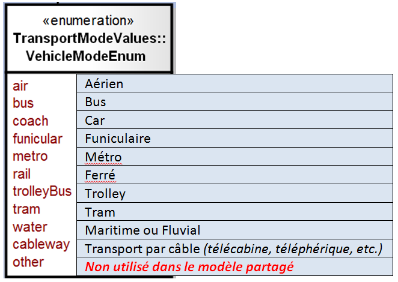
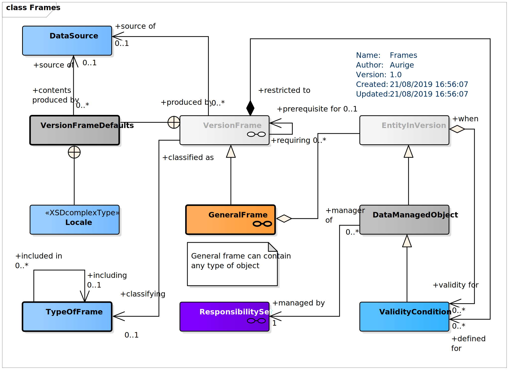
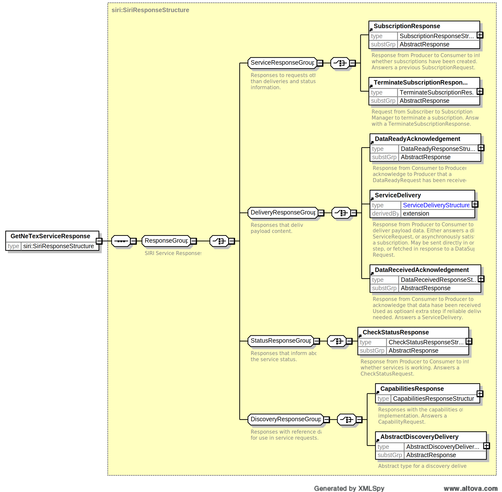
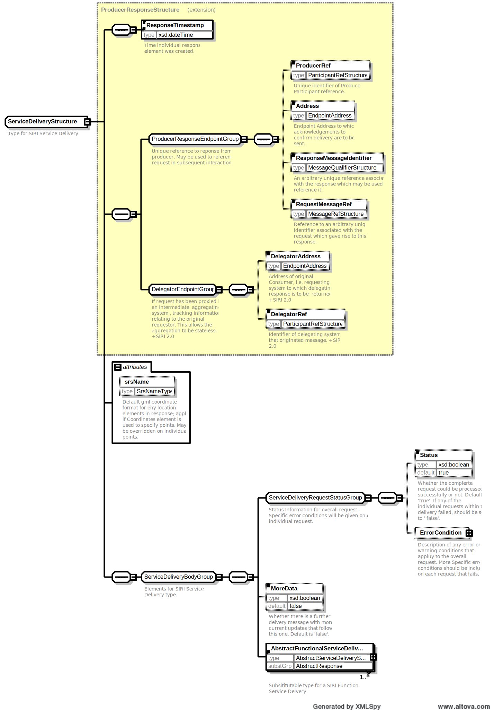

**Avant-propos**

L’harmonisation des pratiques dans l’échange des données relatives aux
offres de transport est essentielle :

-   pour l’usager, aux fins d’une présentation homogène et
    compréhensible de l’offre de transport et de l’engagement
    sous-jacent des organisateurs (autorités organisatrices et
    opérateurs de transports) ;

-   pour les AO, de manière à fédérer des informations homogènes venant
    de chacun des opérateurs de transports qui travaillent pour elle.
    L’harmonisation des échanges, et en particulier le présent profil,
    pourra le cas échéant être imposé par voie contractuelle. Cette
    homogénéité des formats d’information permet d’envisager la mise en
    place de systèmes d’information multimodaux, produisant une
    information globale de l’offre de transports sur un secteur donné,
    et garantir le fonctionnement des services d’information, en
    particulier des calculateurs d’itinéraires, et la cohérence des
    résultats, que ces services soient directement intégrés dans ces
    systèmes d’information multimodaux ou qu’ils puisent leurs
    informations sur des bases de données réparties ;

-   pour les opérateurs, qui pourront utiliser ce format d’échange pour
    leurs systèmes de planification, les systèmes d’aide à
    l’exploitation, leurs systèmes billettiques et leurs systèmes
    d’information voyageur (information planifiée et information temps
    réel)

-   pour les industriels et développeurs pour pérenniser et fiabiliser
    leurs investissements sur les formats d’échanges implémentés par les
    systèmes qu’ils réalisent, tout en limitant fortement l’effort de
    spécification lié aux formats d’échange

Ce document est le fruit de la collaboration entre les différents
partenaires des autorités organisatrices de transports, opérateurs,
industriels et développeurs de solutions et de systèmes informatiques
ayant pour objet l’aide à l’exploitation du transport public et
l’information des voyageurs. Il a pour objet de présenter les éléments
communs aux différents Profil de NeTEx: "format de référence pour
l'échange de données de description des arrêts" (issu des travaux
*NeTEx, Transmodel et IFOPT)* qui aujourd’hui fait consensus dans les
groupes de normalisation (CN03/GT7 – Transport public / information
voyageur).

**Introduction**

Le présent format d’échange est un profil de NeTEx.

NeTEx (CEN/TS 16614-1, 16614-2 et 16614-3) propose un format et des
services d'échange de données de description de l'offre de transport
planifiée, basé sur Transmodel (EN 12896) et l’ancienne normeIFOPT (EN
28701). NeTEx permet non seulement d'assurer les échanges pour les
systèmes d'information voyageur mais traite aussi l’ensemble des
concepts nécessaires en entrée et sortie des systèmes de planification
de l'offre (graphiquage, etc.) et des SAE (Systèmes d’Aide à
l’Exploitation).

NeTEx se décompose en trois parties:

-   Partie 1 : topologie des réseaux (les réseaux, les lignes, les
    parcours commerciaux les missions commerciales, les arrêts et lieux
    d’arrêts, les correspondances et les éléments géographiques en se
    limitant au strict minimum pour l’information voyageur)


-   Partie 2 : horaires théoriques (les courses commerciales, les heures
    de passage graphiquées, les jours types associés ainsi que les
    versions des horaires)


-   Partie 3 : information tarifaire (uniquement à vocation
    d’information voyageur)

NeTEx a été développé dans le cadre du CEN/TC 278/WG 3/SG 9 piloté par
la France. Les parties 1 et 2 ont été publiées en tant que spécification
technique début 2014. Les travaux pour la partie 3, quant à eux, se sont
terminés en 2016.

Il faut noter que NeTEx a été l'occasion de renforcer les liens du
CEN/TC 278/WG 3 avec le secteur ferrovaire, en particulier grâce à la
participation de l'ERA (Agence Européen du Rail, qui a intégré NeTEx
dans la directive Européenne 454/2011 TAP-TSI ) et de l'UIC (Union
International des Chemins de fer).

Les normes, dans leur définition même, sont des « documents établis par
consensus ». Celles du CEN/TC278 sont de plus établies à un niveau
européen, en prenant donc en compte des exigences qui dépassent souvent
le périmètre national.

Il en résulte des normes qui sont relativement volumineuses et dont le
périmètre dépasse souvent largement les besoins d'une utilisation
donnée. Ainsi, à titre d'exemple, SIRI propose toute une série d'options
ou de mécanismes dont la vocation est d'assurer la compatibilité avec
les systèmes développés en Allemagne dans le contexte des VDV 453/454.
De même, SIRI propose des services dédiés à la gestion des
correspondances garanties, services qui, s'ils sont dès aujourd'hui
pertinents en Suisse ou en Allemagne, sont pratiquement inexistants en
France.

De plus, un certain nombre de spécificités locales ou nationales peuvent
amener à préciser l'usage ou la codification qui sera utilisée pour
certaines informations. Par exemple, les Anglais disposant d'un
référentiel national d'identification des points d'arrêts (NaPTAN), ils
imposeront naturellement que cette codification soit utilisée dans les
échanges SIRI, ce que ne feront pas les autres pays européens.

Enfin, certains éléments proposés par ces normes sont facultatifs et il
convient, lors d'une implémentation, de décider si ces éléments seront
ou non implémentés.

L'utilisation des normes liées à l'implémentation de l'interopérabilité
pour le transport en commun passe donc systématiquement par la
définition d'un profil (local agreement, en anglais). Concrètement, le
profil est un document complémentaire à la norme et qui en précise les
règles de mise en œuvre dans un contexte donné. Le profil contient donc
des informations comme :

-   détail des services utilisés,


-   détails des objets utilisés dans un échange,


-   précisions sur les options proposées par la norme,


-   précision sur les éléments facultatifs,


-   précision sur les codifications à utiliser,


-   etc.

Les principaux profils actuellement utilisés en France sont NEPTUNE
(profil de TRIDENT) et le profil de SIRI défini par le CEREMA et le
STIF. Ces deux profils ont une vocation nationale.

Il est envisagé de produire différents profils de NeTEx avec des
objectif métiers et fonctionnels spécialisés. Il est en particulier
prévu :

-   un profil pour les arrêts,


-   un profil pour les réseaux et leur topologie,


-   un profil pour les horaire (distinguant horaires et calendriers),


-   un profil pour les tarifs,


-   un profil complémentaire pour les arrêts (parking, cheminements,
    équipements, détail de l’accessibilité),

Tous ces profils utiliseront toutefois tous certains concepts génériques
mis à disposition par NeTEx (ENTITÉ, VERSION, etc.). Ce document a pour
vocation de regrouper tous ces éléments communs afin d’en éviter de
multiples descriptions.

Ce document sera donc naturellement référencé par tous les autres
profils.

**NOTE** : Ce document étant un profil d'échange de NeTEx, il ne se substitue
en aucun cas à NeTEx, et un minumm de connaissance de NeTEx sera
nécessaire à sa bonne compréhension.

# Domaine d'application

Le profil français de la CEN/ TS 16614 (NeTEx) pour les éléments communs
à l’ensemble des profils décrit les concepts génériques mis à
disposition par NeTEx dont il est fait usage dans plusieurs des profils
spécialisés.

Il contient essentiellement des objets techniques (ENTITÉ, VERSION,
etc.) mais aussi quelques objets fonctionnels utilisés par plusieurs
profils (MODE DE TRANSPORT, INSTITUTION, information de CONTACT, etc.).

# Références normatives

Les documents de référence suivants sont indispensables pour
l'application du présent document. Pour les références datées, seule
l'édition citée s'applique. Pour les références non datées, la dernière
édition du document de référence s'applique (y compris les éventuels
amendements).

CEN/ TS 16614-1, Network and Timetable Exchange (NeTEx) — Part 1: Public
transport network topology exchange format

EN 12896, Road transport and traffic telematics - Public transport -
Reference data model (Transmodel)

# Termes et définitions

Pour les besoins du présent document, les termes et définitions suivants
s'appliquent. Une grande partie d’entre eux est directement issue de
Transmodel, IFOPT et NeTEx.

NOTE Les définitions ci-dessus sont des traductions littérales du
document normatif.

## AFFECTATION DE NOTE (NOTICE ASSIGNEMENT)

<div class="Definition">

*(TRANSMODEL)*

</div>

Affectation d'une NOTE à un objet pour signaler une exception sur une
COURSE, un PARCOURS. L'AFFECTATION DE NOTE permet de préciser les points
ou les sections d'un parcours concerné par la NOTE

## AFFECTATION DE RÔLE (RESPONSIBILITY ROLE ASSIGNMENT)

<div class="Definition">

*(NeTEx)*

</div>

<div class="Definition">

Affectation d'un ou plusieurs RÔLEs à une INSTITUTION (ou une de ses
sous-organisation) vis-à-vis des responsabilités à assurer concernant
une donnée spécifique (comme la propriété, la planification, etc.) et de
la gestion de cette donnée (diffusion, mise à jour, etc.).

</div>

## ALIAS (ALTERNATIVE NAME)

<div class="Definition">

*(NeTEx)*

</div>

<div class="Definition">

Nom alternatif pour un objet.

</div>

## ACCESSIBILITÉ (ACCESSIBILITY ASSESSMENT)

<div class="Definition">

*(IFOPT)*

</div>

<div class="Definition">

L'ACCESSIBILITÉ représente les caractéristiques d'accessibilité, pour
les passagers, d'un SITE (comme un LIEU D'ARRÊT, un COMPOSANT DE LIEU
D'ARRÊT, etc.). Elle est décrite par des limitations d'ACCESSIBILITÉ
et/ou un ensemble de prise en compte d'exigences d'accessibilités.

</div>

## CONDITION DE VALIDITÉ (VALIDITY CONDITION)

<div class="Definition">

*(TRANSMODEL)*

</div>

<div class="Definition">

Condition concourant à caractériser une VERSION donnée appartenant à un
CADRE DE VERSIONS. Une CONDITION DE VALIDITÉ est constituée d’un
paramètre (ex : une certaine date, un certain événement déclencheur,
etc.) et de son type d’application (Ex : « pour », « depuis »,
« jusqu’à », etc.).

</div>

## CONTACT (CONTACT DETAILS)

<div class="Definition">

*(NeTEx)*

</div>

<div class="Definition">

Information des contacts permettant au public de joindre une INSTITUTION
(téléphone, mail, etc.).

</div>

## DÉCLENCHEMENT DE VALIDITÉ (VALIDITY TRIGGER)

<div class="Definition">

*(TRANSMODEL)*

</div>

<div class="Definition">

Un événement extérieur définissant une CONDITION DE VALIDITÉ. Par
exemple : crue exceptionelle, mauvais temps, route barrée pour travaux.

</div>

## ENTITE (ENTITY)

<div class="Definition">

*(TRANSMODEL)*

</div>

<div class="Definition">

Une occurrence d'entité qui est gérée par un système de gestion de
versions. Quand des données de sources différentes coexistent dans un
système (multimodal ou multi-opérateur), une ENTITÉ doit être associée à
un SYSTÈME DE DONNÉES particulier qui l'a définie.

</div>

## ENTITÉ PAR VERSION (ENTITY IN VERSION)

<div class="Definition">

*(TRANSMODEL)*

</div>

<div class="Definition">

Les ENTITÉs associées à une VERSION spécifique.

</div>

## FINALITÉ DE GROUPEMENT (PURPOSE OF GROUPING)

<div class="Definition">

*(TRANSMODEL)*

</div>

<div class="Definition">

Un but fonctionnel pour lequel des GROUPEMENTs d'éléments sont définis.
La FINALITÉ DE GROUPEMENT peut être limitée à un ou plusieurs types d'un
objet donné.

</div>

## GROUPE D'ENTITES (GROUP OF ENTITIES)

<div class="Definition">

*(TRANSMODEL)*

</div>

<div class="Definition">

Un regroupement d'ENTITÉs, connu souvent des usagers par un nom
spécifique ou un numéro.

</div>

## INSTITUTION (ORGANISATION)

<div class="Definition">

*(NeTEx)*

</div>

<div class="Definition">

Une instance légale impliquée dans certains aspects du transport public.

</div>

## MODE DE TRANSPORT (VEHICLE MODE)

<div class="Definition">

*(TRANSMODEL)*

</div>

<div class="Definition">

Le MODE DE TRANSPORT est une caractérisation du transport public
correspondant au moyen (véhicule) de transport (bus, tram, métro, train,
ferry, bateau, etc.).

</div>

## NOTE (NOTICE)

<div class="Definition">

*(TRANSMODEL)*

</div>

Un texte à vocation informationnelle, en général concernant des
exceptions d'utilisation (sans que cela ne soit une limitation), et
rattaché à une LIGNE, un PARCOURS, etc*.*

## POINT

<div class="Definition">

*(TRANSMODEL)*

</div>

<div class="Definition">

Un nœud de dimension 0 servant à la description spatiale du réseau. Les
POINTs peuvent être localisés par la LOCALISATION dans un SYSTÈME DE
LOCALISATION donné.

</div>

## SOURCE DE DONNEES (DATA SOURCE)

<div class="Definition">

*(TRANSMODEL)*

</div>

<div class="Definition">

La SOURCE DE DONNEES identifie le système qui a produit la donnée. La
connaissance de la SOURCE DE DONNÉES est particulièrement utile dans le
contexte de l'interopérabilité des systèmes d'information.

</div>

## SOUS MODE (SUB-MODE)

<div class="Definition">

*(NeTEx)*

</div>

<div class="Definition">

Le SOUS MODE est un complément d'information au MODE DE TRANSPORT,
permettant généralement de caractériser le type d'exploitation (par
exemple "bus interurbain" dans le cas d'un MODE DE TRANSPORT "bus").

</div>

## SUITE DE TRONÇON (LINK SEQUENCE)

<div class="Definition">

*(TRANSMODEL)*

</div>

<div class="Definition">

Une suite ordonnée de POINTs ou TRONÇONs définissant un chemin à travers
le réseau.

</div>

## TRONÇON (LINK)

<div class="Definition">

*(TRANSMODEL)*

</div>

<div class="Definition">

Un objet défini dans l'espace, orienté et de dimension 1, utilisé pour
décrire la structure du réseau, définissant la connexion entre deux
POINTs.

</div>

## VARIANTE DE DIFFUSION (DELIVERY VARIANT)

<div class="Definition">

*(TRANSMODEL)*

</div>

Variante d'une NOTE pour une utilisation sur un média spécifique (texte
lu, imprimé, etc.).

## VERSION (VERSION)

<div class="Definition">

*(TRANSMODEL)*

</div>

<div class="Definition">

Un ensemble de données opérationnelles qui sont caractérisées par les
mêmes CONDITIONs DE VALIDITÉ. Une version appartient à un seul CADRE DE
VERSIONS et est caractérisée par un unique TYPE DE VERSION, par exemple
VERSION du réseau pour la ligne 12 à partir du 01-01-2000.

</div>

## ZONE (ZONE)

<div class="Definition">

*(TRANSMODEL<u>)</u>*

</div>

<div class="Definition">

Espace de dimension 2 (surface) au sein de la zone de couverture d'un
opérateur de transport public (zone administrative, zone tarifaire, zone
d'accès, etc.).

</div>

# Symboles et abréviations

* **AO** : Autorité Organisatrice de Transports

* **PMR** : Personne à Mobilité Réduite

# Exigences minimum liées à la LOM et la réglementation Européenne

La LOI n° 2019-1428 du 24 décembre 2019 d'orientation des mobilités
(LOM :
<https://www.legifrance.gouv.fr/dossierlegislatif/JORFDOLE000037646678>)
et, au niveau Européen, le Règlement Délégué (UE) 2017/1926 De La
Commission du 31 mai 2017 (complétant la directive 2010/40/UE du
Parlement européen et du Conseil en ce qui concerne la mise à
disposition, dans l'ensemble de l'Union, de services d'informations sur
les déplacements multimodaux) rendent obligatoire la mise à disposition,
quand elles existent, de certains types de données.

Le tableau ci-dessous résulte de l’analyse de la LOM et du règlement
délégué et fournit la liste des concepts concernés dans le présent
profil. Il sera donc nécessaire de fournir ces données pour être
conforme à la législation (il s’agit bien de mettre à disposition toutes
les données existantes dans les SI transport, et non de créer des
données qui n’existeraient pas encore sous forme informatique).

Notez que les concepts présents dans les tableaux sont les ceux qui sont
directement référencés par l’annexe du règlement européen
(<https://eur-lex.europa.eu/legal-content/FR/TXT/HTML/?uri=CELEX:32017R1926&from=FR>),
mais que pour beaucoup d’entre eux, cela impliquera d’autres concepts
(soit par héritage soit par relation, au s sens UML des termes). Ces
éléments d’héritage et de relations sont présentés dans les profils,
mais pas dans ce tableau.

Le profil Élément Commun n’est naturellement pas le premier concerné par
la réglementation, car, contrairement aux autres profils qui sont plus
métier, il propose essentiellement des éléments de construction (qui
seront référencés par héritage ou par relation par les autres profils).
Toutefois il décrit certains éléments réutilisables directement visés
par la réglementation : ce sont ces éléments qui présentés dans le
tableau ci-dessous.

Les noms des catégories (colonnes Catégorie et Détail) ont été conservés
dans la langue originale du document (l’anglais) pour éviter tout risque
de confusion. Pour la même raison, les noms des concepts concernés sont
ceux de la version originale de Transmodel.

Pour certaines catégories de données, il peut arriver que les concepts
correspondants soient multiples, mais aussi qu’ils soient différents
suivant le niveau de précision porté par la donnée. La colonne
« Concepts à minima » correspond alors au minimum à fournir pour
répondre à la catégorie en question et les colonnes « Autres concepts »
décrit des informations complémentaires qui, si elles sont utiles, ne
sont pas indispensables pour répondre à cette catégorie (notez que dans
certains cas, ces concepts additionnels peuvent relever d’autres
profils : ceci est précisé dans le tableau quand c’est le cas). Il faut
toutefois garder à l’esprit que toute information existante est supposée
être mise à disposition (que cela relève de la première ou de la seconde
colonne).

La première colonne reprend la notion de *niveau* tel qu’il est décrit
et utilisé par le règlement européen et a notamment une incidence sur le
calendrier de mise à disposition de la donnée (voir le règlement pour
plus de détails).

Les différents concepts présentés ne sont bien sûr pas détaillés dans ce
tableau, mais dans le profil lui-même. C’est aussi dans la description
du profil que l’on trouvera les détails concernant les attributs
(obligatoire/facultatif, règles de remplissage, codification, etc.).
Pour ce qui est des attributs facultatifs, la règle reste que, pour les
objets ci-dessous, toute information disponible est supposée être
fournie (mais on ne crée pas d’information si elle n’est pas
disponible).

<div class="table-title">Concepts relatifs à la LOM et à la Règlementation Européenne</div>

<table>
<colgroup>
<col style="width: 7%" />
<col style="width: 13%" />
<col style="width: 15%" />
<col style="width: 19%" />
<col style="width: 22%" />
<col style="width: 21%" />
</colgroup>
<thead>
<tr class="header">
<th><strong>Niveau</strong></th>
<th><strong>Catégorie</strong></th>
<th><strong>Détail</strong></th>
<th><strong>Concepts à minima</strong></th>
<th><p><strong>Autres</strong></p>
<p><strong>concepts</strong></p></th>
<th><strong>Commentaire</strong></th>
</tr>
</thead>
<tbody>
<tr class="odd">
<td>1</td>
<td><em><strong>Trip plans</strong></em></td>
<td>Operational Calendar, mapping day types to calendar dates</td>
<td><strong>UicOperatingPeriod<br />
DAY TYPE</strong></td>
<td><strong>SERVICE CALENDAR<br />
OPERATING DAY<br />
DAY TYPE ASSIGNMENT<br />
PROPERTY OF DAY<br />
OPERATING PERIOD</strong></td>
<td> </td>
</tr>
<tr class="even">
<td><strong>1</strong></td>
<td><em><strong>Trip plan computation — scheduled modes transport</strong></em></td>
<td>Transport operators</td>
<td><strong>OPERATOR</strong></td>
<td><strong>ORGANISATION<br />
GROUP OF OPERATORS<br />
AUTHORITY</strong></td>
<td> </td>
</tr>
<tr class="odd">
<td><strong>1</strong></td>
<td><em><strong>Trip plan computation — scheduled modes transport</strong></em></td>
<td>Hours of operation</td>
<td><p><strong>AVAILABILITY CONDITIONS</strong></p>
<p><em>(Profil Horaire)</em></p>
<p><strong>SERVICE JOURNEY<br />
TIMETABLE PASSING TIME</strong></p></td>
<td><strong> </strong></td>
<td> </td>
</tr>
</tbody>
</table>

# Description des éléments communs des profils d’échange

## Conventions de représentation

### Tableaux d’attributs

NOTE les choix de conventions présentées ici ont pour vocation d'être
cohérents avec celles réalisées dans le cadre du profil SIRI (STIF et
CEREMA). De plus tous les profils NeTEx partagent les mêmes conventions.

Les messages constituant ce profil d'échange sont décrits ci-dessous
selon un double formalisme: une description sous forme de diagrammes XSD
(leur compréhension nécessite une connaissance préalable de XSD: XML
Schema Definition) et une description sous forme tabulaire. Les tableaux
proposent ces colonnes:

| **Classifi­cation** | **Nom** | **Type** | **Cardin­alité** | **Description** |
|---------------------|---------|----------|------------------|-----------------|

-   **Classification** : permet de catégoriser l'attribut. Les
    principales catégories sont:

    -   **PK** (Public Key) que l'on peut interpréter comme Identifiant
        Unique: il permet à lui seul d'identifier l'objet, de façon
        unique, pérenne et non ambiguë. C'est l'identifiant qui sera
        utilisé pour référencer l'objet dans les relations.

    

    -   **AK** (Alternate Key) est un identifiant secondaire,
        généralement utilisé pour la communication, mais qui ne sera pas
        utilisé dans les relations.

    

    -   **FK** (Foreign Key) indique que l'attribut contient
        l'identifiant unique (PK) d'un autre objet avec lequel il est en
        relation.

    

    -   **GROUP** est un groupe XML nommé (ensemble d'attributs
        utilisables dans différents contextes) (cf:
        )## 


-   **Nom** : nom de l'élément ou attribut XSD


-   **Type** : type de l'élément ou attribut XSD (pour certains d'entre
    eux, il conviendra de se référer à la XSD NeTEx)


-   **Cardinalité** : cardinalité de l'élément ou attribut XSD exprimée
    sous la forme "***minimum:maximum***" ("0:1" pour au plus une
    occurrence; "1:\*" au moins une occurrence et sans limites de nombre
    maximal; "1:1" une et une seule occurrence; etc.).


-   Description : texte de description de l'élément ou attribut XSD
    (seul les attributs retenus par le profil ont un texte en français;
    les textes surlignés en jaune indiquent une spécificité du profil
    par rapport à NeTEx).

Les textes surlignés en <span class="hl">Jaune</span> sont ceux
présentant une particularité (spécialisation) par rapport à NeTEx: une
codification particulière, une restriction d'usage, etc.

La description XSD utilisée est strictement celle de NeTEx, sans aucune
modification (ceci explique notamment que tous les commentaires soient
en anglais).

### Les attributs et éléments rendus obligatoires dans le cadre de ce profil restent facultatifs dans l'XSD (le contrôle de cardinalité devra donc être réalisé applicativement). Valeurs de code de profil

Dans la mesure du possible, le profil sélectionne les valeurs de code à
utiliser pour caractériser des éléments et les limite à un ensemble de
valeurs documentées. NETEX propose plusieurs mécanismes différents pour
spécifier les valeurs de code autorisées;

-   Une énumérations fixes définies dans le cadre du schéma XSD NeTEx.
    Le profil impose alors un sous-ensemble des codes NeTEx.

-   Spécialisations de TYPE OF VALUE, utilisées pour définir des
    ensembles de codes ouverts pouvant être ajoutés au fil du temps sans
    modifier le schéma, par exemple, pour enregistrer des
    classifications d'entités héritées. Le profil lui-même utilise le
    mécanisme TYPE OF VALUE dans quelques cas pour spécifier des codes
    normalisés supplémentaires : ceux-ci sont affectés à un CODESPACE
    «FR_IV_metadata» (https://netex-cen.eu/FR_IV) indiqué par un préfixe
    «FR_IV». (par exemple, «FR_IV: monomodal».

-   Instances TypeOfFrame: le profil utilise plusieurs TYPES DE FRAME
    pour spécifier l'utilisation de VERSION FRAME dans le profil.

### Indication des classes abstraites

NeTEx, et Transmodel, utilisent largement l'héritage de classe; cela
simplifie considérablement la spécification en évitant les répétitions
puisque les attributs partagés sont déclarés par une superclasse et que
des sous-classes viennent ensuite les spécialiser sans avoir à répéter
ces attributs et en n’ajoutant que ceux qui lui sont spécifiques. La
plupart des superclasses sont «abstraites» - c’est-à-dire qu’il n’en
existe aucune instance concrète; seules les sous-classes terminales sont
«concrètes».

Un inconvénient de l'héritage est que si l'on veut comprendre les
propriétés d'une classe concrète unique, il faut également examiner
toutes ses super-classes. Pour cette raison, le profil EPIP inclut les
classes abstraites nécessaires pour comprendre les classes concrètes,
même si ces classes concrètes ne sont jamais directement instanciées
dans un document NeTEx.

-   Les super-classes sont signalées dans les en-têtes par le suffixe
    «*(abstrait)*»

-   Dans les diagrammes UML (comme pour NeTEx et Transmodel), les noms
    des classes abstraites sont indiqués en italique et les classes
    abstraites sont de couleur gris clair.

-   Certaines super-classes ne sont techniquement pas abstraites dans
    NeTEx, mais ne sont pas utilisées comme classes concrètes dans le
    profil : elles sont signalées avec la même convention que les
    classes abstraites.

### Classes de sous-composants

Un certain nombre de classes ont des sous-composants qui constituent
leur définition. Celles-ci fournissent des détails auxiliaires (par
exemple, AlternativeText, AlternativeName, TrainComponent) et sont
signalées dans les en-têtes par le suffixe «*(objet inclus)*».

## DataManagedObject

***DataManagedObject*** est le type d’objet générique de NeTEx, dont
tous les autres objets héritent : il est défini par un type XSD
abstrait, et ne peut être instancié que dans un contexte d’héritage.

Le ***DataManagedObject*** est l’implémention des ***EntityInVersion***,
***Version*** (plus le lien avec les ***Codespace***) directement issus
de Transmodel.


*Entity et Version – Modèle conceptuel*

Dans Transmodel, une ENTITY représente un objet réel dont une instance
est présente dans un ensemble de données échangées. Plusieurs versions,
généralement successives, d'une ENTITY peuvent être définies ;
normalement un ensemble de données donné contiendra une version
particulière (mais il est également possible d'avoir plusieurs versions
présentes dans le même ensemble de données si nécessaire).

Les données exportées vers un document XML à partir d'un référentiel
représentent un instantané de l'état d'une version particulière des
données à un moment donné dans le temps. N<u>eTEx s'intéresse
principalement aux ENTITY IN VERSION de Transmodel</u>***.***
C'est-à-dire que les éléments de données d'un document XML NeTEx
représentent une version particulière de chaque ENTITY. Même si une base
de données ne contient généralement qu'une unique représentation de
l'état actuel d'une ENTITY (plutôt que de tout son historique de
versions), chaque fois qu'elle effectue un export, elle crée en fait une
ENTITY IN VERSION correspondant à l’état courant : si la version est
modifiée, deux exports successifs donneront lieu à des états différents,
c'est-à-dire à différentes ENTITY IN VERSION.

L'EntityInVersion est spécialisé sous le nom de ***DataManagedObject***
qui reunit également certains autres concepts Transmodel distincts en
une seule classe abstraite XML. Il fournit un moyen pratique de réunir
les caractéristiques communes de version, de responsabilité et de
condition de validité de Transmodel, uniforme pour tous les objets NeTEx
et est donc plus simple à mettre en œuvre.

NeTEx utilise les ***Codespaces*** pour s'assurer que les identifiants
des instances d'éléments dans un document XML sont uniques, même s'ils
proviennent de nombreuses sources différentes – voir ***7.3 -***
***<u>CODESPACE et codification des identifiants-.</u>***

Une ***condition* de validité** est utilisée pour indiquer la période ou
les circonstances dans lesquelles un objet peut être utilisé (par
exemple « En hiver » ou entre deux dates spécifiées). Par le biais des
VERSION FRAMEs (voir plus loin), les ***conditions* de validité**
peuvent être associées à des ensembles d'objets.

Le ***DataManagedObject*** permet l'attribution d'une ***version***, des
informations de responsabilité (et rôles associés) à une
***EntityInVersion*** ainsi qu'une ou plusieurs instances de
***ValidityCondition*.**

<div class="table-title">DataManagedObject – Element (Abstrait)</div>

<table>
<colgroup>
<col style="width: 9%" />
<col style="width: 17%" />
<col style="width: 22%" />
<col style="width: 5%" />
<col style="width: 44%" />
</colgroup>
<tbody>
<tr class="odd">
<td><strong>Classifi­cation</strong></td>
<td><strong>Nom</strong></td>
<td><strong>Type</strong></td>
<td></td>
<td><strong>Description</strong></td>
</tr>
<tr class="even">
<td>::></td>
<td>::></td>
<td><em>EntityInVersion</em></td>
<td>::></td>
<td>DATA MANAGED OBJECT hérite de ENTITY IN VERSION.</td>
</tr>
<tr class="odd">
<td>«FK»</td>
<td><em><strong>responsibilitySetRef</strong></em></td>
<td><em>ResponsibilitySetIdType</em></td>
<td>1:1</td>
<td>Pointe les roles et responsabilités associés au LIEU D'ARRÊT, à la ZONE D'EMBARQUEMENT ou à l'ACCÈS (généralisable à tous les objets, voir le modèle en <em><strong>6.18</strong></em>).</td>
</tr>
<tr class="even">
<td></td>
<td><em><strong>KeyList</strong></em></td>
<td><em>KeyList</em></td>
<td>0:1</td>
<td><p><span class="hl">Ensemble de couples clé-valeur utilisé pour décrire les identifiants secondaires de l'objet (LIGNE, LIEU D'ARRÊT, ZONE D'EMBARQUEMENT, POINT D’ARRET PLANIFIÉ, COURSE, etc.): c’est-à-dire tel qu'il peut être identifié dans des systèmes tiers: billettique, information voyageur, etc. La clé permet de nommer l'identifiant (et donc de faire référence au système tiers), la valeur étant l'identifiant lui-même.</span></p>
<p><span class="hl">Cette identification servira principalement d'identification croisée, permettant au fournisseur de retrouver facilement, dans ses systèmes, l'origine de l'objet. </span></p>
<p><span class="hl">La liste des identifiants secondaires est spécifique à chaque fournisseur.</span></p>
<p><span class="hl">Voir aussi </span><em><strong><span class="hl">PrivateCode</span></strong></em><span class="hl"> du </span><strong><span class="hl">GroupOfEntities</span></strong><span class="hl"> pour les identifiants alternatifs: les KeyList ne sont à utiliser que s'il y a plusieurs identifiants alternatifs, et si elles sont utilisées, le </span><em><strong><span class="hl">PrivateCode</span></strong></em><span class="hl"> doit impérativement être aussi renseigné.</span></p>
<p><span class="hl">Il est interdit, dans le profil, d’utiliser le système de clé/valeur pour décrire des informations qui pourraient être fournies avec des attributs NeTEx existants (même s’ils ne sont pas retenus par le profil).</span></p></td>
</tr>

<tr class="even">
<td></td>
<td><em><strong>BrandingRef</strong></em></td>
<td><em>BrandingRefStructure</em></td>
<td>0:1</td>
<td>Référence à une marque (comme par exemple Navigo, Destineo, OùRA, etc.).</td>
</tr>
<tr class="odd">
<td></td>
<td><em><strong>alternativeTexts</strong></em></td>
<td><em><u>AlternativeText</u></em></td>
<td>0:*</td>
<td>Additional Translations of text elements.</td>
</tr>
</tbody>
</table>

<div class="table-title">Entity – Element (Abstrait)</div>

<table>
<colgroup>
<col style="width: 9%" />
<col style="width: 20%" />
<col style="width: 22%" />
<col style="width: 6%" />
<col style="width: 41%" />
</colgroup>
<tbody>
<tr class="odd">
<td><strong>Classifi­cation</strong></td>
<td><strong>Nom</strong></td>
<td><strong>Type</strong></td>
<td></td>
<td><strong>Description</strong></td>
</tr>
<tr class="even">
<td></td>
<td><em><strong>NameOfClass</strong></em></td>
<td><em>NameOfClass</em></td>
<td><em>::></em></td>
<td>Nom de la classe de l'ENTITÉ.</td>
</tr>
<tr class="odd">
<td>«PK»</td>
<td><em><strong>id</strong></em></td>
<td><em>ObjectIdType</em></td>
<td>1:1</td>
<td><p>Identifiant unique (et pérenne autant que possible) de l'objet.</p>
<p><span class="hl">Tous les objets métiers "racine" (c’est-à-dire les objets situés au niveau </span><em><strong><span class="hl">members</span></strong></em><span class="hl"> des FRAME: voir ) doivent impérativement être identifiés. Par contre les objets inclus (au sens XML) dans un un autre objet ne seront généralement pas identifiés (l'identification n'est toutefois pas interdite).</span></p>
<p><strong><span class="hl">Cette remarque est valable pour la totalité des attributs du DataManagedObject (version, validité, etc. ne sont nécessaires que pour les objets racines).</span></strong></p></td>
</tr>
</tbody>
</table>

<div class="table-title">EntityInVersion – Element (Abstrait)</div>

<table>
<colgroup>
<col style="width: 9%" />
<col style="width: 20%" />
<col style="width: 22%" />
<col style="width: 6%" />
<col style="width: 41%" />
</colgroup>
<tbody>
<tr class="odd">
<td><strong>Classifi­cation</strong></td>
<td><strong>Nom</strong></td>
<td><strong>Type</strong></td>
<td></td>
<td><strong>Description</strong></td>
</tr>
<tr class="even">
<td>::></td>
<td>::></td>
<td><em>Entity</em></td>
<td><em>::></em></td>
<td>ENTITY ON VERSION hérite de ENTITY.</td>
</tr>
<tr class="odd">
<td>«FK»</td>
<td><em><strong>dataSourceRef</strong></em></td>
<td><em>DataSourceIdType</em></td>
<td>0:1</td>
<td>Identifiant de la source des données (voir INSTITUTION pour la description détaillée d'une source).</td>
</tr>
<tr class="even">
<td></td>
<td><em><strong>created</strong></em></td>
<td><em>xsd:dateTime</em></td>
<td>0:1</td>
<td>Date et heure de création de l'ENTITÉ</td>
</tr>
<tr class="odd">
<td></td>
<td><em><strong>changed</strong></em></td>
<td><em>xsd:dateTime</em></td>
<td>0:1</td>
<td>Date et heure de la dernière modification de l'ENTITÉ</td>
</tr>
<tr class="even">
<td></td>
<td><em><strong>modification</strong></em></td>
<td><em>ModificationEnum</em></td>
<td>0:1</td>
<td><p>Nature de la dernière modification:</p>
<p>• <strong>new</strong> (création)</p>
<p>• <strong>revise</strong> (mise à jour)</p>
<p>• <strong>delete</strong> (suppression)</p></td>
</tr>
<tr class="odd">
<td>«PK»</td>
<td><em><strong>version</strong></em></td>
<td><em>VersionIdType</em></td>
<td>0:1</td>
<td>Identifiant de version (généralement un numéro)</td>
</tr>
<tr class="even">
<td></td>
<td><em><strong>status</strong></em></td>
<td><em>VersionStatusEnum</em></td>
<td>0:1</td>
<td><p>Statut de la version:</p>
<p>• <strong>active</strong> (objet actif)</p>
<p>• <strong>inactive</strong> (objet non actif, de façon à pouvoir "désactiver" un objet pendant un certain temps sans pour autant le supprimer, par exemple pour un arrêt qui ne sera plus utilisé pendant quelques mois).</p></td>
</tr>
<tr class="odd">
<td>«FK»</td>
<td><em><strong>derivedFromObjectRef</strong></em></td>
<td><em>ObjectIdType</em></td>
<td>0:1</td>
<td><p>Identifiant d'une ENTITÉ dont celle-ci est dérivée.</p>
<p><span class="hl">Dans le contexte du profil, ce champ est utilisé </span><strong><span class="hl">uniquement</span></strong><span class="hl"> pour lier des objets pour lesquels on a réalisé une variante fonctionnelle. Typiquement, dans le cas d'une ligne de substitution (voir Profil Réseau) on pourra utiliser le </span><em><strong><span class="hl">derivedFromObjectRef </span></strong></em><span class="hl"> pour la relier à la ligne qu'elle remplace temporairement.</span></p></td>
</tr>
<tr class="even">
<td>«FK»</td>
<td><em><strong>compatibleWith­VersionRef</strong></em></td>
<td><em>VersionIdType</em></td>
<td>0:1</td>
<td><p><span class="hl">Cet attribut est utilisé uniquement pour les CADREs DE VERSION (VERSION FRAME).</span></p>
<p>Indique alors la version de l'instance de CADRE DE VERSION avec laquelle cette version d'objet est compatible. Ce CADRE DE VERSION porte le même identifiant que celui du cadre impliqué dans l'échange courant, mais avec un numero de version différent.</p></td>
</tr>

<tr class="even">
<td rowspan="2">(choice)</td>
<td><em><strong>validityConditions</strong></em></td>
<td><em>ValidityCondition</em></td>
<td>0:*</td>
<td>CONDITIONs DE VALIDITÉ de l’ENTITÉ.</td>
</tr>
<tr class="odd">
<td><em><strong>ValidBetween</strong></em></td>
<td><em>ValidBetweenStructure</em></td>
<td>0:*</td>
<td><em>Optimisation :</em> version simplifiée de CONDITIONs DE VALIDITÉ (simple période entre deux dates)</td>
</tr>
</tbody>
</table>

<div class="table-title">KeyList – Element (Abstrait)</div>

<table>
<colgroup>
<col style="width: 9%" />
<col style="width: 17%" />
<col style="width: 25%" />
<col style="width: 6%" />
<col style="width: 41%" />
</colgroup>
<tbody>
<tr class="odd">
<td><strong>Classifi­cation</strong></td>
<td><strong>Nom</strong></td>
<td><strong>Type</strong></td>
<td></td>
<td><strong>Description</strong></td>
</tr>
<tr class="even">
<td></td>
<td><em><strong>typeOfKey</strong></em></td>
<td><em>xsd:normalizedString</em></td>
<td>0:1</td>
<td><p>Type de clé.</p>
<p><span class="hl">Seule la valeur "ALTERNATE_IDENTIFIER" est reconnue dans le cadre du profil. Tout autre type de type de clé devra être ignoré (sans toutefois générer d'erreur).</span></p></td>
</tr>
<tr class="odd">
<td></td>
<td><em><strong>Key</strong></em></td>
<td><em>xsd:normalizedString</em></td>
<td>1:1</td>
<td>Nom de la clé .</td>
</tr>
<tr class="even">
<td></td>
<td><em><strong>Value</strong></em></td>
<td><em>xsd:normalizedString</em></td>
<td>1:1</td>
<td>Valeur associée à la clé</td>
</tr>
</tbody>
</table>

## Attributs de GroupOfEntities

***GroupOfEntities*** est défini par un type XSD abstrait, et ne peut
être instancié que dans un contexte d’héritage. Il existe toutefois une
version concrète du ***GroupOfEntities*** : le
***GeneralGroupOfEntities*** qui a pour vocation de permettre la
formation de groupe avec n’importe quels types d’objets, en particulier
ceux pour lesquels des spécialisations n’ont pas été prévues.

<div class="table-title">GroupOfEntities – Element (Abstrait)</div>

<table>
<colgroup>
<col style="width: 8%" />
<col style="width: 21%" />
<col style="width: 22%" />
<col style="width: 6%" />
<col style="width: 41%" />
</colgroup>
<tbody>
<tr class="odd">
<td><strong>Classifi­cation</strong></td>
<td><strong>Nom</strong></td>
<td><strong>Type</strong></td>
<td></td>
<td><strong>Description</strong></td>
</tr>
<tr class="even">
<td>::></td>
<td>::></td>
<td><em>DataManagedObject</em></td>
<td>::></td>
<td>GROUP OF ENTITies hérite de DATA MANAGED OBJECT.</td>
</tr>
<tr class="odd">
<td></td>
<td>Name</td>
<td><em>MultilingualString</em></td>
<td><p>0:1</p>
<p><span class="hl">1:1</span></p></td>
<td><p>Nom du groupe d'entité <span class="hl">(du LIEU D'ARRÊT, de la ZONE D'EMBARQUEMENT, de l'ACCÈS, etc.)</span></p>
<p><span class="hl">Attribut rendu obligatoire dans le cadre de ce profil</span></p></td>
</tr>
<tr class="even">
<td></td>
<td><em><strong>ShortName</strong></em></td>
<td><em>MultilingualString</em></td>
<td>0:1</td>
<td>Nom court du groupe d'entité <span class="hl">(du LIEU D'ARRÊT, de la ZONE D'EMBARQUEMENT, de l'ACCÈS, etc.)</span></td>
</tr>
<tr class="odd">
<td></td>
<td><em><strong>Description</strong></em></td>
<td><em>MultilingualString</em></td>
<td>0:1</td>
<td>Texte libre de description</td>
</tr>
<tr class="even">
<td>«FK»</td>
<td><em><strong>PurposeOfGroupingRef</strong></em></td>
<td><em>PurposeOfGroupingRef</em></td>
<td>0:1</td>
<td><p>But fonctionnel pour lequel des GROUPEMENTs d'éléments sont définis. La FINALITÉ DE GROUPEMENT peut être limitée à un ou plusieurs types d'un objet donné.</p>
<p><span class="hl">Le champ PurposeofGroupingRef devra systématiquement valoir "groupOfStopPlace" pour les GROUPEs DE LIEUX D'ARRÊT. </span></p>
<p><span class="hl">Dans le cas des groupes de lignes (GROUP OF LINES, voir Profil Réseau) le </span><em><strong><span class="hl">PurposeofGroupingRef</span></strong></em><span class="hl"> pourra être utilisé pour qualifier les lignes administratives en utilisant la valeur "</span><em><strong><span class="hl">administrativeLine</span></strong></em><span class="hl">"</span></p></td>
</tr>
<tr class="odd">
<td>«AK»</td>
<td><em><strong>PrivateCode</strong></em></td>
<td><em>PrivateCode</em></td>
<td>0:1</td>
<td><p>Code "privé" permettant de gérer une identification spécifique indépendante de l'identification partagée<span class="hl">. Si plusieurs identifiants alternatifs sont nécessaires, on pourra recourir au keyList de DataManagedObject, mais dans cette hypothèse le champ PrivateCode devra impérativement être aussi renseigné (avec l'un des identifiants alternatifs).</span></p>
<p><span class="hl">Ce champ est utilisé de différente façon suivant le contexte. C'est un simple identifiant alternatif pour les LIEU D'ARRÊT, ZONE D'EMBARQUEMENT, GROUPE DE LIEU et ACCÈS.</span></p>
<p><span class="hl">Dans le cadre des zones administratives (LIEU TOPOGRAPHIQUE) ce code est utilisé de la façon suivante:</span></p>
<ul>
<li><blockquote>
<p><span class="hl">Région : code NUTS</span></p>
</blockquote></li>
<li><blockquote>
<p><span class="hl">Département : code NUTS</span></p>
</blockquote></li>
<li><blockquote>
<p><span class="hl">Groupement de communes: code Postal</span></p>
</blockquote></li>
<li><blockquote>
<p><span class="hl">Ville : code INSEE</span></p>
</blockquote></li>
<li><blockquote>
<p><span class="hl">Arrondissement : code INSEE</span></p>
</blockquote></li>
</ul>
<p><span class="hl">Note: les codes NUTS peuvent être trouvés <a href="https://eur-lex.europa.eu/eli/reg/2003/1059/2018-01-18">ici</a>.</span></p></td>
</tr>
<tr class="even">
<td>«ctd»</td>
<td><em><strong>(members)</strong></em></td>
<td><em>VersionOfObjectRef | GroupMember</em></td>
<td><p>0:1</p>
<p><em><strong><span class="hl">spécial</span></strong></em></p></td>
<td><p><strong><span class="hl">Ce champ est apporté par GeneralGroupOfEntities et n'est utilisé que dans certains cas particuliers :</span></strong></p>
<ul>
<li><p><strong><span class="hl">Dans le cadre des GROUPEs DE LIEUX D'ARRÊT, et il est alors obligatoire. Il contient la liste des identifiants des membres des GROUPEs DE LIEUX D'ARRÊT (ce sont donc des identifiants de LIEU D'ARRÊT)</span></strong> </p></li>
</ul></td>
</tr>
</tbody>
</table>

## Attributs de Zone

<div class="table-title">Zone – Element (Abstrait)</div>

<table>
<colgroup>
<col style="width: 11%" />
<col style="width: 17%" />
<col style="width: 22%" />
<col style="width: 6%" />
<col style="width: 41%" />
</colgroup>
<tbody>
<tr class="odd">
<td><strong>Classifi­cation</strong></td>
<td><strong>Nom</strong></td>
<td><strong>Type</strong></td>
<td></td>
<td><strong>Description</strong></td>
</tr>
<tr class="even">
<td>::></td>
<td>::></td>
<td><em>GroupOfPoints</em></td>
<td>::></td>
<td><p>ZONE hérite de GROUP OF POINTs (note : le <em><strong>GroupOfPoint</strong></em> n’apporte pas d’autres ajouts au <em><strong>GroupOfEntities</strong></em> que l’attribut <em><strong>members</strong></em> spécialisé pour ne référencer que des points).</p>
<p><span class="hl">Le champ </span><em><strong><span class="hl"> members </span></strong></em><span class="hl">n’est utilisé que dans le cas particulier du transport à la demande, pour permettre d’identifier les arrêts (POINT D’ARRÊT PLANIFIÉs) d’une zone dans le cas de TAD zonal avec arrêt.</span></p></td>
</tr>
<tr class="odd">
<td>«cntd»</td>
<td><em><strong>members</strong></em></td>
<td><em>PointRef</em></td>
<td>0:*</td>
<td>Liste des POINT contenus dans la ZONE.</td>
</tr>
<tr class="odd">
<td>«cntd»</td>
<td><em><strong>Centroid</strong></em></td>
<td><em>Point</em></td>
<td>0:1</td>
<td><p>Point représentatif de la ZONE (<span class="hl">LIEU D'ARRÊT, ZONE D'EMBARQUEMENT, LIEU TOPOGRAPHIQUE, ACCES, POINT D’ARRÊT PLANIFIÉ, etc.</span>).</p>
<p>Ce point n'a pas à être le centre, ou le barycentre, de la zone, mais un point qui la localisera de façon satisfaisante (sur un fond de carte par exemple).</p></td>
</tr>
<tr class="even">
<td></td>
<td><em><strong>Gml:Polygon</strong></em></td>
<td><em>gml:Polygon</em></td>
<td>0:*</td>
<td><p>Polygone de contour de la zone.</p>
<p>C'est une séquence ordonnée de points représentant une surface fermée et permettant de décrire le contour géographique de la ZONE.</p></td>
</tr>
<tr class="odd">
<td>«cntd»</td>
<td><em><strong>projections</strong></em></td>
<td><em>Projection</em></td>
<td>0:*</td>
<td><p>Liste des PROJECTIONs de la ZONE.</p>
<p><span class="hl">La PROJECTION n’est utilisée que pour permettre de mettre en lien l’offre de transport en commun et une description de l’infrastructure (route, rail, etc.). On référencera donc typiquement un jeu de données OSM, NavTeQ Here, etc.</span></p></td>
</tr>

</tbody>
</table>

## Attributs de Point

<div class="table-title">Point – Element (Abstrait)</div>

<table>
<colgroup>
<col style="width: 8%" />
<col style="width: 17%" />
<col style="width: 23%" />
<col style="width: 8%" />
<col style="width: 41%" />
</colgroup>
<tbody>
<tr class="odd">
<td><strong>Classifi­cation</strong></td>
<td><strong>Nom</strong></td>
<td><strong>Type</strong></td>
<td><strong>Cardinalité</strong></td>
<td><strong>Description</strong></td>
</tr>
<tr class="even">
<td>::></td>
<td>::></td>
<td><em>DataManagedObject</em></td>
<td>::></td>
<td>POINT hérite de DATA MANAGED OBJECT.</td>
</tr>
<tr class="odd">
<td></td>
<td>Name</td>
<td><em>MultilingualString</em></td>
<td>0:1</td>
<td>Nom du POINT.</td>
</tr>
<tr class="even">
<td></td>
<td><em><strong>Location</strong></em></td>
<td><em>Location</em></td>
<td><p>0:1</p>
<p><strong><span class="hl">1 :1</span></strong></p></td>
<td>Localisation du POINT <span class="hl">(obligatoire dans le profil)</span></td>
</tr>
<tr class="odd">
<td>«»</td>
<td><em><strong>PointNumber</strong></em></td>
<td><em>xsd:normalizedString</em></td>
<td>0:1</td>
<td><p>Identifiant alternatif du point POINT.</p>
<p><span class="hl">On utilisera le champ PointNumber pour ordonner des points (par exemple les POINTs D’ARRÊT PLANIFIÉs d’une ligne que l’on veut ordonner sur une fiche horaire), avec la convention suivante :</span></p>
<ul>
<li><p><span class="hl">On privilégiera une valeur purement numérique pour ce champ (avec un classement classique du plus petit au plus grand)</span></p></li>
<li><p><span class="hl">Si ce n’était pas le cas le classement sera réalisé de façon alphanumérique (et non alphabétique), aussi appelé classement naturel, en intégrant donc une reconnaissance de l’éventuelle partie numérique. (voir </span><a href="http://rosettacode.org/wiki/Natural_sorting"><span class="hl">http://rosettacode.org/wiki/Natural_sorting</span></a><span class="hl"> par exemple)</span></p></li>
</ul></td>
</tr>

<tr class="odd">
<td>«cntd»</td>
<td><em><strong>projections</strong></em></td>
<td><em>Projection</em></td>
<td>0:*</td>
<td><p>Projections du POINT.</p>
<p><span class="hl">La PROJECTION n’est utilisée que pour permettre de mettre en lien l’offre de transport en commun et une description de l’infrastructure (route, rail, etc.). On référencera donc typiquement un jeu de données OSM, NavTeQ Here, etc.</span></p></td>
</tr>

</tbody>
</table>

## Attributs de Tronçon

***Link*** est défini par un type XSD abstrait, et ne peut être
instancié que dans un contexte d’héritage. De plus, les spécialisations
concrètes de ***Link*** ajoutent systématiquement les attributs
***FromPointRef*** et ***ToPointRef*** (avec des types de point
spécialisés et adaptés : par exemple des ***RoutePoints*** pour les
***RouteLink***).

<div class="table-title">Link – Element (Abstrait)</div>

<table>
<colgroup>
<col style="width: 8%" />
<col style="width: 3%" />
<col style="width: 14%" />
<col style="width: 23%" />
<col style="width: 8%" />
<col style="width: 41%" />
</colgroup>
<tbody>
<tr class="odd">
<td><strong>Classifi­cation</strong></td>
<td colspan="2"><strong>Nom</strong></td>
<td><strong>Type</strong></td>
<td><strong>Cardinalité</strong></td>
<td><strong>Description</strong></td>
</tr>
<tr class="even">
<td>::></td>
<td colspan="2">::></td>
<td><em>DataManagedObject</em></td>
<td>::></td>
<td>LINK hérite de DATA MANAGED OBJECT.</td>
</tr>
<tr class="odd">
<td></td>
<td colspan="2">Name</td>
<td><em>MultilingualString</em></td>
<td>0:1</td>
<td>Nom du TRONÇON.</td>
</tr>
<tr class="even">
<td></td>
<td colspan="2"><em><strong>Distance</strong></em></td>
<td><em>DistanceType</em></td>
<td>0:1</td>
<td><p>Longueur du TRONÇON (unité en cohérence avec l’unité par défaut des frames, en mètre pour la France naturellement).</p>
<p><span class="hl">Il ne s'agit pas de la simple distance "à vol d'oiseau" entre les deux extrémités, mais de la distance opérationnelle que l'on souhaite faire porter au TRONÇON, comme la distance qui sera parcourue par un véhicule sur ce TRONÇON par exemple.</span></p></td>
</tr>

<tr class="even">
<td>«cntd»</td>
<td colspan="2"><em><strong>LineString</strong></em></td>
<td><em>gmlLineString</em></td>
<td>0:1</td>
<td>Géométrie du TRONÇON sous forme d’une <em>linestring</em> GML (la géométrie d’un TRONÇON n’est donc pas limitée à un simple couple de point, mais est décrite par une séquence de points).</td>
</tr>
<tr class="odd">
<td>«cntd»</td>
<td colspan="2"><em><strong><del><span class="hl">projections</span></del></strong></em></td>
<td></td>
<td></td>
<td><p><span class="hl">La PROJECTION n’est utilisée que pour permettre de mettre en lien l’offre de transport en commun et une description de l’infrastructure (route, rail, etc.). On référencera donc typiquement un jeu de données OSM, NavTeQ Here, etc.</span></p>
<p><span class="hl">Dans le cas des TRONÇONs la projection n’est généralement pas simple un TRONÇON ne se projetant généralement pas sur un unique autre TRONÇON (on aura presque systématiquement un TRONÇON TC à cheval sur N tronçon routier, ou encore l’inverse) : il a donc été fait le choix de ne projeter que les point extrémités du TRONÇON (ces point peuvent se projeter sur un autre point, ou sur un segment, voir ).</span></p></td>
</tr>
<tr class="even">
<td>«cntd»</td>
<td colspan="2"><em><strong><span class="hl">passingThrough</span></strong></em></td>
<td></td>
<td></td>
<td><span class="hl">Le besoin de points intermédiaires est lié soit à une géométrie complexe (on utilisera alors l’attribut </span><em><strong><span class="hl">LineString</span></strong></em><span class="hl">) soit au fait que, par exemple, un TRONÇON sur un PARCOURS passe par un arrêt sans s’y arrêter, mais on utilisera dans ce cas les éléments du PARCOURS dédiés à la description de cette situation.</span></td>
</tr>
<tr class="odd">
<td colspan="2" rowspan="2">uniquement dans les spécialisations concrètes de <em><strong>Link</strong></em></td>
<td><em><strong>FromPointRef</strong></em></td>
<td><em>xxxPoint (spécialisation de Point)</em></td>
<td>1:1</td>
<td>Point de depart du segment (uniquement dans les spécialisations concrètes de <em><strong>Link</strong></em>)</td>
</tr>
<tr class="even">
<td><em><strong>ToPointRef</strong></em></td>
<td><em>xxxPoint (spécialisation de Point)</em></td>
<td>1:1</td>
<td>Point de fin du segment (uniquement dans les spécialisations concrètes de <em><strong>Link</strong></em>)</td>
</tr>
</tbody>
</table>

## Attributs des Séquences de Tronçons

Les SÉQUENCEs DE TRONÇONS sont des éléments de base pour la construction
d'objets plus complexes comme les ITINÉRAIREs (voir Profil Réseau).

<div class="table-title">LinkSequence – Element (Abstrait)</div>

| **Classifi­cation** | **Name**       | **Type**             | **Cardin­ality** | **Description**                                       |
|---------------------|----------------|----------------------|------------------|-------------------------------------------------------|
| ::>                 | ::>            | *DataManagedObject*  | ::>              | LINK SEQUENCE hérite de ***DataManagedObject***.      |
|                     | ***Name***     | *MultilingualString* | 0:1              | Nom de la SÉQUENCE DE TRONÇON.                        |
|                     | ***Distance*** | *DistanceType*       | 1:1              | Longueur totale (en mètre) de la SÉQUENCE DE TRONÇON. |

## Attributs des Points d’une Séquence de Tronçons

Les POINTs DE SÉQUENCE DE TRONÇONS (POINT IN LINK SEQUENCE) permettent
essentiellement d’indiquer les numéros d’ordre des POINTs au sein d’une
SÉQUENCE DE TRONÇONS.

<div class="table-title">PointInLinkSequence – Element (Abstrait)</div>

| **Classification** | **Name**          | **Type**                | **Cardinality** | **Description**                                                                                                                   |
|--------------------|-------------------|-------------------------|-----------------|-----------------------------------------------------------------------------------------------------------------------------------|
| ::>                | ::>               | *<u>VersionedChild</u>* | ::>             | POINT IN LINK SEQUENCE hérite de VERSIONED CHILD.                                                                                 |
| «atr»              | order             | *xsd:*positiveInteger   | 1:1             | Ordre du POINT au sein de la séquence (la valeur de début est sans importance seules comptent les valeurs relatives entre elles). |
| «FK»               | LinkSequenceRef   | LinkSequenceRef         | 1:1             | Référence de la LINK SEQUENCE contenant le POINT IN LINK SEQUENCE.                                                                |
|                    | ***Description*** | MultilingualString      | 0:1             | Description du POINT in LINK SEQUENCE. +v1.1                                                                                      |

## Conditions de validité

La validité se définit comme la période pendant laquelle, ou les
conditions en fonction desquelles l'ENTITÉ peut être utilisée par les
voyageurs.

NOTE : le LIEU D'ARRÊT ou l'ACCÈS peut aussi être sujet à des heures
d'ouverture, mais ces plages d'ouverture sont potentiellement multiples
au sein d'une journée, et variable selon le type de jour : même si les
AVAILABILITY CONDITIONs (voir plus bas) permettent de modéliser cette
information, il a été décidé de ne pas retenir ce niveau de finesse dans
ce profil (on ne conserve donc que de simples date de début et fin de
validité). Une NOTE pourra éventuellement être utilisée pour ce type de
situation (associée au LIEU D'ARRÊT ou à l'ACCÈS dans ce cas).

La figure ci-dessous montre que les conditions de validité peuvent être
exprimées de façon simplifiée au travers du ***ValidBetween*** ou de
façon détaillée : c’est, autant que possible, la version simplifiée du
***ValidBetween*** qui sera préférée.

<div class="table-title">ValidBetween – Element (objet inclus)</div>

<table>
<colgroup>
<col style="width: 9%" />
<col style="width: 17%" />
<col style="width: 24%" />
<col style="width: 7%" />
<col style="width: 41%" />
</colgroup>
<tbody>
<tr class="odd">
<td><strong>Classifi­cation</strong></td>
<td><strong>Nom</strong></td>
<td><strong>Type</strong></td>
<td></td>
<td><strong>Description</strong></td>
</tr>
<tr class="even">
<td></td>
<td><em><strong>FromDate</strong></em></td>
<td><em>xsd:dateTime</em></td>
<td>0:1</td>
<td>Date et heure de début de validité (inclusif)<br />
<span class="hl">Le </span><em><strong><span class="hl">FromDate</span></strong></em><span class="hl"> est obligatoire dans le cadre du profil (le </span><em><strong><span class="hl">ToDate</span></strong></em><span class="hl"> ne l’est pas, et s’il n’est pas rempli, la validété débute au </span><em><strong><span class="hl">FromDate</span></strong></em><span class="hl"> sans limite de fin.</span></td>
</tr>
<tr class="odd">
<td></td>
<td><em><strong>ToDate</strong></em></td>
<td><em>xsd:dateTime</em></td>
<td>0:1</td>
<td>Date et heure de fin de validité (inclusif)</td>
</tr>
</tbody>
</table>

<div class="table-title">ValidityCondition – Element (objet inclus)</div>

<table>
<colgroup>
<col style="width: 9%" />
<col style="width: 20%" />
<col style="width: 21%" />
<col style="width: 8%" />
<col style="width: 40%" />
</colgroup>
<tbody>
<tr class="odd">
<td><strong>Classifi­cation</strong></td>
<td><strong>Nom</strong></td>
<td><strong>Type</strong></td>
<td><strong>Cardinalité</strong></td>
<td><strong>Description</strong></td>
</tr>
<tr class="even">
<td>::></td>
<td>::></td>
<td><em>DataManagedObject</em></td>
<td><em>::></em></td>
<td><p>Inherits from DATA MANAGED OBJECT.</p>
<p><span class="hl">L’héritage reste naturellement valable, mais aucun des attributs qu’il apporte ne sera utilisé.</span></p></td>
</tr>


<tr class="odd">
<td>«FK»</td>
<td><em><strong>ConditionedObjectRef</strong></em></td>
<td>ObjectRef</td>
<td>0:1</td>
<td><p>Référence de l’objet sur lequel porte la CONDITION DE VALIDITÉ.</p>
<p><span class="hl">Cet attribut n’est utilisé que si la condition de validité est fournie comme un objet indépendant au sein d’une FRAME (voir ). Dans tous les autre cas (la CONDITION DE VALIDITÉ est dans l’arborescence XML d’un objet) c’est le contexte qui fournit cette information, et ce champ sera ignoré.</span> <span class="hl">On n’utilisera les conditions de validité comme un objet indépendant que pour pouvoir les référencer avec un </span><em><strong><span class="hl">WithConditionRef </span></strong></em><span class="hl">(champ suivant)</span></p></td>
</tr>
<tr class="even">
<td>«FK»</td>
<td><em><strong>WithConditionRef</strong></em></td>
<td>ValidityConditionRef</td>
<td>0:1</td>
<td><p>Cet attribut permet de chaîner plusieurs CONDITIONs DE VALIDITÉ qui seront alors logiquement combinées par l’opérateur logique ET.</p>
<p><span class="hl">On pourra ainsi gérer une période combinée à des exclusions, combiner des périodes et des évènements déclencheurs, etc.</span></p>
<p><span class="hl">Pour la gestion des exceptions, on exprimera toujours une CONDITION DE VALIDITÉ « principale » et on y associera des exceptions par </span><em><strong><span class="hl">WithConditionRef</span></strong></em><span class="hl"> et non l’inverse. Pour toutes les combinaisons on procédera de même si une CONDITION DE VALIDITÉ « principale » peut être identifiée.</span></p></td>
</tr>
</tbody>
</table>

Deux spécialisations des conditions de validité sont utilisées dans le
cadre des profils NeTEx : les conditions de disponibilité qui sont les
conditions temporelles, et les déclencheurs de validité qui sont des
événements rendant l’ENTITÉ disponibles (pour, par exemple, les
itinéraires en cas de crue, la modification de service ou d’ouverture en
cas de match ou d’évènement sportif autour d’un lieu comme un stade,
etc.)

<div class="table-title">AvailabilityCondition – Element (objet inclus)</div>

<table>
<colgroup>
<col style="width: 9%" />
<col style="width: 17%" />
<col style="width: 22%" />
<col style="width: 9%" />
<col style="width: 41%" />
</colgroup>
<tbody>
<tr class="odd">
<td><strong>Classifi­cation</strong></td>
<td><strong>Nom</strong></td>
<td><strong>Type</strong></td>
<td><strong>Cardinalité</strong></td>
<td><strong>Description</strong></td>
</tr>
<tr class="even">
<td>::></td>
<td>::></td>
<td><em>ValidityCondition</em></td>
<td>::></td>
<td>AVAILABILITY CONDITION hérite de VALIDITY CONDITION.</td>
</tr>
<tr class="odd">
<td></td>
<td>FromDate</td>
<td>xsd:dateTime</td>
<td>0:1</td>
<td>Date et heure de début de validité (inclusif)</td>
</tr>
<tr class="even">
<td></td>
<td>ToDate</td>
<td>xsd:dateTime</td>
<td>0:1</td>
<td>Date et heure de fin de validité (inclusif)</td>
</tr>
<tr class="odd">
<td></td>
<td>IsAvailable</td>
<td>xsd:boolean</td>
<td>1:1</td>
<td><p>Indique si la CONDITION DE VALIDITÉ correspond à une disponibilité (VRAI) ou une indisponibilité (FAUX).</p>
<p>Ce champ sert principalement à exprimer les exceptions (par exemple : sauf le 1<sup>er</sup> avril) par combinaison de CONDITIONs DE VALIDITÉ avec <em><strong>WithConditionRef</strong></em> (voir plus haut).</p></td>
</tr>
<tr class="even">
<td>«FK»</td>
<td>dayTypes</td>
<td>DayTypeRef</td>
<td>0:*</td>
<td><p>TYPE DE JOUR pendant lesquels la CONDITIONs DE VALIDITÉ s’applique.</p>
<p><span class="hl">On n’utilisera pas simultanément et </span><em><strong><span class="hl">operatingDays</span></strong></em><span class="hl"> dans une même CONDITION DE VALIDITÉ.</span></p></td>
</tr>

<tr class="even">
<td>«cntd»</td>
<td>timeBands</td>
<td>TimeBand</td>
<td>0:*</td>
<td><p>TRANCHEs HORAIREs pendant lesquelles la CONDITIONs DE VALIDITÉ s’applique.</p>
<p><span class="hl">Permet essentiellement d’exprimer les heures d’ouverture.</span></p></td>
</tr>
<tr class="odd">
<td>«cntd»</td>
<td><em><strong>operatingDays</strong></em></td>
<td><em>OperatingDay</em></td>
<td>0:*</td>
<td><p>Jours d’exploitation pendant lesquels la CONDITIONs DE VALIDITÉ s’applique.</p>
<p><span class="hl">On n’utilisera pas simultanément et </span><em><strong><span class="hl">operatingDays</span></strong></em><span class="hl"> dans une même CONDITION DE VALIDITÉ.</span></p></td>
</tr>
</tbody>
</table>

<div class="table-title">ValidityTrigger – Element (objet inclus)</div>

<table>
<colgroup>
<col style="width: 9%" />
<col style="width: 17%" />
<col style="width: 19%" />
<col style="width: 12%" />
<col style="width: 41%" />
</colgroup>
<tbody>
<tr class="odd">
<td><strong>Classifi­cation</strong></td>
<td><strong>Nom</strong></td>
<td><strong>Type</strong></td>
<td><strong>Cardinalité</strong></td>
<td><strong>Description</strong></td>
</tr>
<tr class="even">
<td>::></td>
<td>::></td>
<td><em>ValidityCondition</em></td>
<td>::></td>
<td>VALIDITY TRIGGER hérite de VALIDITY CONDITION.</td>
</tr>
<tr class="odd">
<td>«FK»</td>
<td>TriggerObjectRef</td>
<td>ObjectRef</td>
<td>0:1</td>
<td><p>Référence (identifiant) de l’objet déclencheur de la validité.</p>
<p><span class="hl">De façon pratique, plutôt que de réel identifiant d’objet, on utilisera ici des valeurs codifiées dont les valeurs possibles seront précisées dans les spécifications d’interface du système producteur. Par convention on utilisera autant que possible les codes </span><em><strong><span class="hl">reason</span></strong></em><span class="hl">, </span><em><strong><span class="hl">subreason</span></strong></em><span class="hl"> et </span><em><strong><span class="hl">PublicEvent</span></strong></em><span class="hl"> proposés par le service SIRI Situation Exchange.</span></p></td>
</tr>

</tbody>
</table>

## Accessibilité

Les informations concernant l'ACCESSIBILITÉ sont utilisées de la même
façon pour les LIEUx D'ARRÊT, les LIGNEs et les COURSEs. L’information
d’accessibilité présentée correspond à une information minimale : le
profil NeTEx pour l’accessibilité propose une version beaucoup plus
détaillée de cette information (incluant les cheminements, les
équipements, etc.).

<div class="table-title">AccessibilityAssessment – Element (objet inclus)</div>

<table>
<colgroup>
<col style="width: 9%" />
<col style="width: 20%" />
<col style="width: 20%" />
<col style="width: 8%" />
<col style="width: 41%" />
</colgroup>
<tbody>
<tr class="odd">
<td><strong>Classifi­cation</strong></td>
<td><strong>Nom</strong></td>
<td><strong>Type</strong></td>
<td><strong>Cardinalité</strong></td>
<td><strong>Description</strong></td>
</tr>
<tr class="even">
<td>::></td>
<td>::></td>
<td><em>DataManagedObject</em></td>
<td>::></td>
<td>ACCESSIBILITY ASSESSMENT hérite de DATA MANAGED OBJECT.</td>
</tr>
<tr class="odd">
<td></td>
<td>MobilityImpaired­Access</td>
<td><em>Accessibility­Enumeration</em></td>
<td>1:1</td>
<td><p>Indication globale d'accessibilité (de la LIGNE ou du LIEU).</p>
<p>Il peut valoir <em>true</em> (accessible), <em>false</em> (non accessible), <em>partial</em> ou <em>unknown</em></p></td>
</tr>
<tr class="even">
<td>«cntd»</td>
<td>limitations</td>
<td>AccessibilityLimitation</td>
<td>0:1</td>
<td>Limitations d'accessibilité</td>
</tr>

<tr class="even">
<td></td>
<td><em><strong>Comment</strong></em></td>
<td><em>MultilingualString</em></td>
<td>0:1</td>
<td><p>Commentaire complémentaire sur l'accessibilité.</p>
<p><span class="hl">Ce champ a pour vocation à compléter, en termes d'information voyageur, l'information générale de la structure . Il a donc pour vocation à être affiché avec les informations d'accessibilité.</span></p></td>
</tr>
</tbody>
</table>

NOTE L'attribut ***MobilityImpairedAccess*** n'a pas été retenu dans le
cadre des travaux sur le modèle d'arrêt partagé (car considéré comme
trop générique). Toutefois, ce champ étant obligatoire dans NeTEx, il
devra être présent dans les échanges. Les valeurs qu'il peut prendre
étant ***true***/***false***/***unknow***/***partial***, il est
recommandé (pour des raisons de cohérence) que sa valeur soit:

-   ***true*** si tous les champs de ***AccessibilityLimitation*** sont
    à ***true***

-   ***false*** si tous les champs de ***AccessibilityLimitation*** sont
    à ***false***

-   ***partial*** si seulement certains champs de
    ***AccessibilityLimitation*** sont à ***true***

-   ***unknow*** dans tous les autres cas

<div class="table-title">AccessibilityLimitation – Element (objet inclus)</div>

|                     |                             |                        |     |                                                                                                                                                 |
|---------------------|-----------------------------|------------------------|-----|-------------------------------------------------------------------------------------------------------------------------------------------------|
| **Classifi­cation** | **Nom**                     | **Type**               |     | **Description**                                                                                                                                 |
|                     | ***WheelchairAccess***      | *LimitationStatusEnum* | 1:1 | Indique si l'accès est possible sans fauteuil roulant (codification: ***true***/***false***/***unknow***/***partial***).                        |
|                     | ***StepFreeAccess***        | *LimitationStatusEnum* | 0:1 | Indique si l'accès est possible sans franchissement de marche ou d'escalier (codification: ***true***/***false***/ ***unknow***/***partial***). |
|                     | ***EscalatorFreeAccess***   | *LimitationStatusEnum* | 0:1 | Indique si l'accès est possible sans utiliser d'escalator (codification: ***true***/***false***/***unknow***/ ***partial***).                   |
|                     | ***LiftFreeAccess***        | *LimitationStatusEnum* | 0:1 | Indique si l'accès est possible sans utiliser d'ascenseur (codification: ***true***/***false***/***unknow***/ ***partial***).                   |
|                     | ***AudibleSignsAvailable*** | *LimitationStatusEnum* | 0:1 | Indique si une signalétique auditive est disponible (codification: ***true***/***false***/***unknow***/***partial***).                          |
|                     | ***VisualSignsAvailable***  | *LimitationStatusEnum* | 0:1 | Indique si une signalétique visuelle est disponible (codification: ***true***/***false***/***unknow***/***partial***).                          |

<span class="hl">Chaque fois que pour </span>***<span
class="hl">LimitationStatus</span>***<span class="hl"> la valeur
"partial" est utilisée, une "</span>***<span
class="hl">ValidityCondition-> Description</span>***<span class="hl">"
(dans l’objet </span>***<span
class="hl">AccessibilityAssessment</span>***<span class="hl">) doit
être fournie en conséquence pour expliquer pourquoi l'accessibilité
n'est que partielle (notez que seule la </span>***<span
class="hl">Description</span>***<span class="hl"> de la
</span>***<span class="hl">ValidityCondition</span>***<span
class="hl"> peut être remplie). Les informations textuelles contenues
doivent pouvoir être présentées au public sans autre
modification.</span>

## Nom alternatif

<div class="table-title">AlternativeName – Element</div>

<table>
<colgroup>
<col style="width: 8%" />
<col style="width: 17%" />
<col style="width: 18%" />
<col style="width: 7%" />
<col style="width: 48%" />
</colgroup>
<tbody>
<tr class="odd">
<td><strong>Classifi­cation</strong></td>
<td><strong>Nom</strong></td>
<td><strong>Type</strong></td>
<td></td>
<td><strong>Description</strong></td>
</tr>

<tr class="odd">
<td>«FK»</td>
<td><em><strong>NamedObjectRef</strong></em></td>
<td><em>VersionOfObjectRef</em></td>
<td>0:1</td>
<td><p>Référence de l’objet pour lequel on fourni un nom alternatif.</p>
<p><span class="hl">Cet attribut n’est utilisé que si le nom alternatif est fourni comme un objet indépendant au sein d’une FRAME (voir ). Dans tous les autre cas (le NOM ALTERNATIF est dans l’arborescence XML d’un objet) c’est le contexte qui fournit cette information, et ce champ sera ignoré.</span></p></td>
</tr>
<tr class="even">
<td></td>
<td><em><strong>Lang</strong></em></td>
<td><em>Language</em></td>
<td>0:1</td>
<td>Langue utilisée pour ces alias (codification RFC 1766)</td>
</tr>
<tr class="odd">
<td></td>
<td><em><strong>NameType</strong></em></td>
<td><em>NameTypeEnum</em></td>
<td>0:1</td>
<td><p>Type de nom alternatif:</p>
<ul>
<li><p><em><strong>alias</strong></em>: Alias</p></li>
<li><p><em><strong>translation</strong></em>: Traduction</p></li>
<li><p><em><strong>other</strong></em>: Autre</p></li>
</ul>
<p>Il existe deux autres possibilités qui ne sont pas utilisées dans le cadre du profil: <em><strong>copy</strong></em> et <em><strong>label</strong></em></p></td>
</tr>
<tr class="even">
<td></td>
<td><em><strong>TypeOfName</strong></em></td>
<td><em>NormalizedString</em></td>
<td>0:1</td>
<td>Description de type de nom (ex: " <em>Libellé de la synthèse vocale</em> ")</td>
</tr>
<tr class="odd">
<td></td>
<td><em><strong>Name</strong></em></td>
<td><em>MultilingualString</em></td>
<td>1:1</td>
<td>Texte du nom alternatif</td>
</tr>
<tr class="even">
<td></td>
<td><em><strong>ShortName</strong></em></td>
<td><em>MultilingualString</em></td>
<td>0:1</td>
<td>Version courte du nom alternatif</td>
</tr>
<tr class="odd">
<td></td>
<td><em><strong>Abbreviation</strong></em></td>
<td><em>MultilingualString</em></td>
<td>0:1</td>
<td>Abréviation du nom alternatif</td>
</tr>
<tr class="even">
<td></td>
<td><em><strong>QualifierName</strong></em></td>
<td><em>MultilingualString</em></td>
<td>0:1</td>
<td>Texte utilisé pour qualifier le nom ("gare de", "mairie de", etc.)</td>
</tr>
</tbody>
</table>

## Texte Alternatif (AlternativeText)

Il est parfois nécessaire de fournir plusieurs variantes d’un nom ou un
autre texte descriptif, en particulier si les informations sont requises
dans plusieurs langues. **AlternativeText** est un moyen générique de
fournir de telles variantes pour tout attribut textuel d'un
**DataManagedObject**. Il peut être considéré comme un complément au
mécanisme **AlternativeName** (décrit plus ci-dessus) et peut être
utilisé pour n’importe quel nom, description ou autre texte.

Note: l’élément ***AlternativeName (***en comparaison à
***AlternativeText***) sera préféré pour les alias de nom propre (par
exemple *“Bercy”; POPB*”, ”AccorHotels Arena”, ”Palais omnisports de
Paris-Bercy”), alors qu’***AlternativeText*** servira essentiellement
pour les traductions (par exemple. “en.London”, “fr.Londres”,
“it.Londra”, “cn.倫敦”, “ge.ლონდონი”, etc).

<span class="hl">Dans le profil, </span>**<span
class="hl">AlternativeText </span>**<span class="hl">sera toujours
utilisé comme balise incluse (et non comme élément racine).</span>

1.  *AlternativeText – XML Element*

<table>
<colgroup>
<col style="width: 8%" />
<col style="width: 17%" />
<col style="width: 22%" />
<col style="width: 8%" />
<col style="width: 43%" />
</colgroup>
<tbody>
<tr class="odd">
<td><strong>Classification</strong></td>
<td><strong>Nom</strong></td>
<td><strong>Type</strong></td>
<td></td>
<td><strong>Description</strong></td>
</tr>
<tr class="even">
<td>::></td>
<td>::></td>
<td><em><u>VersionedChild</u></em></td>
<td>::></td>
<td><strong>AlternativeText</strong> hérite de VERSIONED CHILD.</td>
</tr>
<tr class="odd">
<td>«PK»</td>
<td><em><strong>attributeName</strong></em></td>
<td><em>xsd:NCName</em></td>
<td><u>0:1</u></td>
<td>Nom de l'attribut de texte pour lequel il s'agit du texte de remplacement. Doit être un nom d'attribut existant.</td>
</tr>
<tr class="even">
<td>«PK»</td>
<td><em><strong>useForLanguage</strong></em></td>
<td><em>xsd:language</em></td>
<td><u>0:1</u></td>
<td><p>Langage utilisé pour cette variante</p>
<p><span class="hl">« fr » n’est pas accepté dans le profil, </span><strong><span class="hl">AlternativeText</span></strong><span class="hl"> étant réservé aux traductions.</span></p></td>
</tr>


<tr class="odd">
<td></td>
<td>Text</td>
<td>MultilingualString (Language + Text)</td>
<td>1:1</td>
<td>Variante du texte original, dans le langage spécifié</td>
</tr>
</tbody>
</table>

## Localisation (Location)

<div class="table-title">Location – Element (abstrait)</div>

<table>
<colgroup>
<col style="width: 7%" />
<col style="width: 13%" />
<col style="width: 29%" />
<col style="width: 5%" />
<col style="width: 43%" />
</colgroup>
<tbody>
<tr class="odd">
<td><strong>Classifi­cation</strong></td>
<td><strong>Nom</strong></td>
<td><strong>Type</strong></td>
<td></td>
<td><strong>Description</strong></td>
</tr>
<tr class="even">
<td>«FK»</td>
<td><em><strong>srsName</strong></em></td>
<td><em>LocatingSystemNameType</em></td>
<td>0:1</td>
<td><p>Référentiel géographique: il s'appliquera aux Latitude et Longitude (permettant ainsi d'utiliser d'autres référentiels géodésiques que WGS84).</p>
<p>À utiliser au format GML (ex urn:ogc:def:crs:EPSG::4326 pour WGS84, voir <a href="http://www.epsg.org/">http://www.epsg.org</a> et <a href="http://www.opengeospatial.org/ogcUrnPolicy">http://www.opengeospatial.org/ogcUrnPolicy</a> )</p></td>
</tr>
<tr class="odd">
<td></td>
<td><em><strong>Longitude</strong></em></td>
<td><em>LongitudeType</em></td>
<td>1:1</td>
<td>Latitude du centroïd (point "central" du lieu d'arrêt) – WGS84 par défaut (-180 à +180)</td>
</tr>
<tr class="even">
<td></td>
<td><em><strong>Latitude</strong></em></td>
<td><em>LatitudeType</em></td>
<td>1:1</td>
<td>Longitude du centroïd (point "central" du lieu d'arrêt) – WGS84 par défaut (-90 à +90)</td>
</tr>
<tr class="odd">
<td></td>
<td><em><strong>Altitude</strong></em></td>
<td><em>AltitudeType</em></td>
<td>0:1</td>
<td>Altitude du centroïd (mètres au-dessus du niveau de la mer)</td>
</tr>
<tr class="even">
<td></td>
<td><em><strong>Coordinates</strong></em></td>
<td><em>CoordinateString</em> <em><strong>gml:pos</strong></em></td>
<td>0:1</td>
<td><p>Localisation dans un référentiel géographique quelconque (format ISO/OGC) exprimé sous forme d'une chaine de caractère, contenant éventuellement le référentiel de projection (si différent du champ suivant SrsName).</p>
<p>Exemple: <gml:pos srsName="urn:ogc:def:crs:EPSG::4326">-59.478340 -52.226578</gml:pos></p></td>
</tr>
<tr class="odd">
<td></td>
<td><em><strong>Precision</strong></em></td>
<td><em>xsd:decimal</em></td>
<td>0:1</td>
<td>Précision de localisation (en mètres).</td>
</tr>
</tbody>
</table>

### Cas des surfaces

Les ZONEs, en plus d'être géolocalisés par un point représentatif
(centroïd) peuvent être représentées par une surface d'emprise. Cette
surface s'exprime sous la forme d'un polygone dont la structure est
décrite ci-dessous (il s’agit de la structure GML permettant de décrire
les polygones *gml :PolygonType*).


*Polygon – XSD*

Seul le contour extérieur de ce polygone (***exterior***) est retenu
dans le cadre du présent profil.

EXEMPLE un polygone de contour de LIEU D'ARRÊT pourra donc, par exemple,
prendre la forme ci-dessous

```
<gml:Polygon gml:id="12323">
<gml:exterior>
<gml:LinearRing>
<gml:pos>-120.000000 65.588264\</gml:pos>
<gml:pos>-120.003571 65.590782\</gml:pos>
<gml:pos>-120.011292 65.590965\</gml:pos>
<gml:pos>-120.022491 65.595215\</gml:pos>
<gml:pos>-120.031212 65.592880\</gml:pos>
<gml:pos>-120.019363 65.586121\</gml:pos>
<gml:pos>-120.030350 65.585365\</gml:pos>
</gml:LinearRing>
</gml:exterior>
</gml:Polygon>
```

## Attributs d'Addresse

<div class="table-title">Address – Element (objet inclus)</div>

| **Classifi­cation** | **Nom**           | **Type**             |     | **Description**                         |
|---------------------|-------------------|----------------------|-----|-----------------------------------------|
| «FK»                | ***CountryRef***  | *CountryEnum*        | 0:1 | Code ISO 3166 du pays (deux caractères) |
|                     | ***CountryName*** | *MultilingualString* | 0:1 | Nom du pays                             |

<div class="table-title">PostalAddress – Element (objet inclus)</div>

<table style="width:100%;">
<colgroup>
<col style="width: 8%" />
<col style="width: 18%" />
<col style="width: 23%" />
<col style="width: 5%" />
<col style="width: 44%" />
</colgroup>
<tbody>
<tr class="odd">
<td><strong>Classifi­cation</strong></td>
<td><strong>Nom</strong></td>
<td><strong>Type</strong></td>
<td></td>
<td><strong>Description</strong></td>
</tr>
<tr class="even">
<td>::></td>
<td>::></td>
<td><em>Address</em></td>
<td>::></td>
<td><p>POSTAL ADDRESS hérite de ADDRESS.</p>
<p>NOTE : les éléments hérités au dessus d’ADDRESS ne sont pas à prendre en compte dans le profil (en particulier le nom hérité de GroupOfEntities n’est pas obligatoire)</p></td>
</tr>
<tr class="odd">
<td></td>
<td><em><strong>HouseNumber</strong></em></td>
<td><em>xsd:normalizedString</em></td>
<td>0:1</td>
<td>Numéro du bâtiment sur la voie</td>
</tr>
<tr class="even">
<td></td>
<td><em><strong>BuildingName</strong></em></td>
<td><em>xsd:normalizedString</em></td>
<td>0:1</td>
<td>Nom du bâtiment</td>
</tr>
<tr class="odd">
<td></td>
<td><em><strong>AddressLine1</strong></em></td>
<td><em>xsd:normalizedString</em></td>
<td>0:1</td>
<td>Complément d'adresse hors numéro, type et nom de voie.</td>
</tr>

<tr class="odd">
<td></td>
<td><em><strong>Street</strong></em></td>
<td><em>xsd:normalizedString</em></td>
<td>0:1</td>
<td>Nom et type de voie</td>
</tr>
<tr class="even">
<td></td>
<td><em><strong>Town</strong></em></td>
<td><em>xsd:normalizedString</em></td>
<td>0:1</td>
<td>Nom de la ville.</td>
</tr>

<tr class="even">
<td></td>
<td><em><strong>PostCode</strong></em></td>
<td><em>PostCodeType</em></td>
<td>0:1</td>
<td>Code Postal</td>
</tr>
<tr class="odd">
<td></td>
<td><em><strong>PostCode­Extension</strong></em></td>
<td><em>xsd:normalizedString</em></td>
<td>0:1</td>
<td>Extension du code postal (avec éventuel cedex ou boite postale)</td>
</tr>
<tr class="even">
<td></td>
<td><em><strong>PostalRegion</strong></em></td>
<td><em>xsd:normalizedString</em></td>
<td>0:1</td>
<td><p><span class="hl">Code INSEE</span></p>
<p>NOTE <span class="hl">le code INSEE permet aussi de faire la liaison avec la ville ou l'arrondissement (en tant que zone administrative) d'appartenance.</span></p>
<p>NOTE <span class="hl">si l'on souhaite mieux formaliser la relation à la commune, l'Adresse Postale, la ZONE NeTEx dispose du "ParentZoneRef" que l'on peut utiliser à cet effet.</span></p></td>
</tr>


</tbody>
</table>

<div class="table-title">RoadAddress – Element (objet inclus)</div>

<table>
<colgroup>
<col style="width: 8%" />
<col style="width: 18%" />
<col style="width: 24%" />
<col style="width: 4%" />
<col style="width: 44%" />
</colgroup>
<tbody>
<tr class="odd">
<td><strong>Classifi­cation</strong></td>
<td><strong>Nom</strong></td>
<td><strong>Type</strong></td>
<td></td>
<td><strong>Description</strong></td>
</tr>
<tr class="even">
<td>::></td>
<td>::></td>
<td><em>Address</em></td>
<td>::></td>
<td>ROAD ADDRESS hérite de ADDRESS.</td>
</tr>
<tr class="odd">
<td></td>
<td><em><strong>GisFeatureRef</strong></em></td>
<td><em>normalizedString</em></td>
<td></td>
<td><p><span class="hl">Identification de l'objet correspondant à la voie dans une base spatiale (type PostGIS par exemple) ou dans un SIG.</span></p>
<p><span class="hl">Cet attribut permettra par exemple d'établir le lien avec une base IGN, Open Street Map, NavTeq, Teleatlas, etc.</span></p></td>
</tr>
<tr class="even">
<td></td>
<td><em><strong>RoadNumber</strong></em></td>
<td><em>xsd:normalizedString</em></td>
<td>0:1</td>
<td>Nom de la voie sous forme codifiée (exemple: N20, A1, E11, D75, etc.)</td>
</tr>
<tr class="odd">
<td></td>
<td><em><strong>RoadName</strong></em></td>
<td><em>xsd:normalizedString</em></td>
<td>0:1</td>
<td>Nom de la voie.</td>
</tr>

<tr class="odd">
<td></td>
<td><em><strong>BearingDegrees</strong></em></td>
<td><em>xsd:integer</em></td>
<td>0:1</td>
<td>Orientation de la voie, en degrés (au niveau du LIEU d'ARRÊT, de la ZONE D'EMBARQUEMENT ou de l'ACCÈS).</td>
</tr>
<tr class="even">
<td></td>
<td><em><strong>OddNumber­Range</strong></em></td>
<td><em>xsd:normalizedString</em></td>
<td>0:1</td>
<td>Plage de numéros impairs dans laquelle se situe le LIEU</td>
</tr>
<tr class="odd">
<td></td>
<td><em><strong>EvenNumber­Range</strong></em></td>
<td><em>xsd:normalizedString</em></td>
<td>0:1</td>
<td><p>Plage de numéros pairs dans laquelle se situe le LIEU</p>
<p>NOTE si la parité, droite-gauche, n'est pas respectée, c'est la zone paire qui sera renseignée.</p></td>
</tr>
</tbody>
</table>

## Locale (contexte local du lieu)

Si cette information peut être portée par chaque objet, il est
généralement plus pertinent de l'utiliser de façon générique au niveau
***Frame*** (voir ***FrameDefaults*** en *7-Entêtes NeTEx*) ce qui en
évite la répétition. Si elle est présente au niveau ***Frame*** et sur
un objet particulier, la version de l'objet particulier sera utilisée
pour celui-ci.

<div class="table-title">Locale – Type (objet inclus)</div>

| **Classifi­cation** | **Nom**                    | **Type**         |      | **Description**                                                                     |
|---------------------|----------------------------|------------------|------|-------------------------------------------------------------------------------------|
|                     | ***TimeZoneOffset***       | *TimeZoneOffset* | 0:1  | Décalage horaire (positif ou négatif) par rapport à l'heure GMT                     |
|                     | ***TimeZone***             | *TimeZoneOffset* | 0:1  | Nom de la zone horaire                                                              |
|                     | ***SummerTimeZoneOffset*** | *TimeZoneOffset* | 0:1  | Décalage horaire (positif ou négatif) par rapport à l'heure GMT, pour l'heure d'été |
|                     | ***DefaultLanguage***      | *xsd:language*   | 1:1  | Langue principale (codification RFC 1766)                                           |
|                     | ***languages***            | *LanguageUsage*  | 0:\* | Autres langues utilisées (codification RFC 1766)                                    |

## Projections

Les projections sont exclusivement utilisées pour projeter les objets du
transport public sur leur infrastructure (voirie, rail, voies navigables
et câbles).

Les attributs de la structure abstraite de projection (présentés par la
figure ci-dessous), ne sont pas retenus dans les profils NeTEx : seuls
certains attributs proposés par les spécialisations (voir ci-dessous)
seront utilisés.

Seules les ***PointProjection*** (projection d’un Point sur un point ou
un tronçon) et les ***ZoneProjection*** (projection de zone sur une zone
ou un point) sont retenues. La projection de tronçon n’est pas retenue,
car difficile à mettre en œuvre opérationnellement (on doit généralement
faire face à des projections 1-N ou N-1, et la gestion de plusieurs
tronçons peut induire des difficultés de reconstruction topologique ; en
particulier dans le cas de cible disposant de structure non topologique
ou spaghetti :
<http://www.gitta.info/DigitModel/fr/html/Topologies_learningObject1.html>).
Pour projeter un tronçon on se cantonnera donc à en projeter les points
extrémités (qui eux peuvent être projetés sur des tronçons).

Les projections, telles qu'utilisées dans le contexte du profil, feront
des références vers des données externes (OSM, Nokia Here (ex Navteq),
Tomtom TeleAtlas, IGN, INSPIRE, etc.). Pour réaliser ces références de
façon non ambiguë, on utilisera conjointement deux mécanismes proposés
par NeTEx: les CODESPACE (voir 7.3) et les attributs associés aux
références.

Le CODESPACE permettra de référencer le jeu de données, par exemple en
décrivant un jeu de données OSM comme ci-dessous

```
<Codespace id="*osm*">
<Xmlns>*osm*\</Xmlns>
<XmlnsUrl> *http://planet.openstreetmap.org/planet/2014/*\</XmlnsUrl>
<Description>Open Street Map through Planet OSM\</Description>
</Codespace>
```

Une référence à un objet OSM pourra alors avoir la forme `ref=osm:4701234567`

Mais cela ne sera souvent pas suffisant et il faudra compléter cette
référence par d'éventuelles informations de classe, de version et de
date proposé par le mécanisme de référence de NeTEx.

<div class="table-title">Attributs pour les références externes (objet inclus)</div>

<table>
<colgroup>
<col style="width: 9%" />
<col style="width: 17%" />
<col style="width: 24%" />
<col style="width: 8%" />
<col style="width: 41%" />
</colgroup>
<tbody>
<tr class="odd">
<td><strong>Classifi­cation</strong></td>
<td><strong>Nom</strong></td>
<td><strong>Type</strong></td>
<td><strong>Cardinalité</strong></td>
<td><strong>Description</strong></td>
</tr>
<tr class="even">
<td></td>
<td><em><strong>NameOfRefClass</strong></em></td>
<td>NameOfClass</td>
<td>0:1</td>
<td>Nom de la classe de l'objet référencé</td>
</tr>
<tr class="odd">
<td></td>
<td><em><strong>created</strong></em></td>
<td><em>xsd:dateTime</em></td>
<td>0:1</td>
<td><span class="hl">Date à laquelle la référence a été créée: ATTENTION il ne s'agit pas ici de la date de création de l'objet, mais bien de la </span><strong><span class="hl">date à laquelle la référence a été créée</span></strong><span class="hl">. Cela permettra, en cas d'absence de mécanisme de version, de retrouver la version de l'objet considérée (dernière version à la date du…).</span></td>
</tr>

<tr class="odd">
<td>«FK»</td>
<td>version</td>
<td>VersionRef</td>
<td>0:1</td>
<td><p>Version de l'objet référencé.</p>
<p><span class="hl">Si les objets n'ont pas de version, mais que le jeu de donnée en a, on utilisera le CODESPACE en prefixe (ainsi </span><span class="hl">versionRef='TeleAtlas:MapMarker_USA_v04_Data/USA_TPT_2014_09</span><span class="hl">' pourra référer un jeu de données TeleAtlas (en ayant pris soin de créer le CODESPACE TeleAtlas au préalable, sur le principe indiqué ci-dessus).</span></p>
<p><span class="hl">Le référencement de la version de l'objet n'est naturellement pas obligatoire: si elle est absente on considère qu'il s'agit de la version courante.</span></p>
<p>Pour les références externe, on procèdera comme indiqué en <em><strong>7.5 -</strong></em> <em><strong>Version des objets et références</strong></em> en precisant la version pointée grace à l’attribut versionRef (par exemple <TypeOfFrameRef ref="FR:TypeOfFrame:NETEX_COMMUN" <strong>versionRef="1.01:FR-NETEX_COMMUN-1.0</strong>">)</p></td>
</tr>
<tr class="even">
<td>«FK»</td>
<td><strong>ref</strong></td>
<td>ObjectRefObjectIdType</td>
<td>1:1</td>
<td>Identifiant de l'objet référencé <span class="hl">précédé de son CODESPACE.</span></td>
</tr>
</tbody>
</table>

<div class="table-title">PointProjection – Element</div>

<table>
<colgroup>
<col style="width: 8%" />
<col style="width: 18%" />
<col style="width: 23%" />
<col style="width: 8%" />
<col style="width: 41%" />
</colgroup>
<tbody>
<tr class="odd">
<td><strong>Classifi­cation</strong></td>
<td><strong>Nom</strong></td>
<td><strong>Type</strong></td>
<td><strong>Cardinalité</strong></td>
<td><strong>Description</strong></td>
</tr>

<tr class="odd">
<td>«FK»</td>
<td>ProjectedPointRef</td>
<td>PointRef</td>
<td>0:1</td>
<td><p>POINT projeté.</p>
<p><span class="hl">Cet attribut n’est utile que si la projection est fournie comme un objet indépendant au sein d’une FRAME (voir ). Dans tous les autres cas (la PROJECTION est dans l’arborescence XML d’un objet) c’est le contexte qui fournit cette information, et ce champ sera ignoré.</span></p></td>
</tr>
<tr class="even">
<td>«FK»</td>
<td>ProjectToPointRef</td>
<td>PointRef</td>
<td>0:1</td>
<td><p>POINT sur lequel on se projette.</p>
<p><span class="hl">Dans le contexte des profils NeTEx, il s'agit là d'une référence vers une donnée externe (OSM, Nokia Here (ex Navteq), Tomtom TeleAtlas, IGN, INSPIRE, etc.)</span>.</p>
<p><span class="hl">La codification respectera les règles décrites ci-dessus pour les références externes.</span></p></td>
</tr>
<tr class="odd">
<td>«FK»</td>
<td>ProjectToLinkRef</td>
<td>LinkRef</td>
<td>0:1</td>
<td>TRONÇON sur lequel on se projette (un POINT peut être projeté sur un TRONÇON).</td>
</tr>
<tr class="even">
<td></td>
<td>Distance</td>
<td>LengthType</td>
<td>1:1</td>
<td>Distance entre le POINT projeté et le début du TRONÇON (ce champ n'est renseigné que si le précédent l'est aussi).</td>
</tr>
</tbody>
</table>

<div class="table-title">ZoneProjection – Element</div>

<table>
<colgroup>
<col style="width: 8%" />
<col style="width: 17%" />
<col style="width: 19%" />
<col style="width: 7%" />
<col style="width: 46%" />
</colgroup>
<tbody>
<tr class="odd">
<td><strong>Classifi­cation</strong></td>
<td><strong>Nom</strong></td>
<td><strong>Type</strong></td>
<td><strong>Cardinalité</strong></td>
<td><strong>Description</strong></td>
</tr>

<tr class="odd">
<td>«FK»</td>
<td>ProjectedZoneRef</td>
<td>ZoneRef</td>
<td>0:1</td>
<td><p>ZONE that is being projected.</p>
<p><span class="hl">Cet attribut n’est utile que si la projection est fournie comme un objet indépendant au sein d’une FRAME (voir ). Dans tous les autre cas (la PROJECTION est dans l’arborescence XML d’un objet) c’est le contexte qui fournit cette information, et ce champ sera ignoré.</span></p></td>
</tr>
<tr class="even">
<td>«FK»</td>
<td>ProjectedToZoneRef</td>
<td>ZoneRef</td>
<td>0:1</td>
<td><p>ZONE sur lequel on se projette.</p>
<p><span class="hl">Dans le contexte des profils NeTEx, il s'agit là d'une référence vers une donnée externe (OSM, Nokia Here (ex Navteq), Tomtom TeleAtlas, IGN, INSPIRE, etc.)</span>.</p>
<p><span class="hl">La codification respectera les règles décrites ci-dessus pour les références externes.</span></p></td>
</tr>
<tr class="odd">
<td>«FK»</td>
<td>ProjectToPoint­Ref</td>
<td>LinkRef</td>
<td>0:1</td>
<td>POINT sur lequel on se projette (une ZONE peut être projeté sur un POINT: centroïde de ZONE, pictogramme, etc.).</td>
</tr>

</tbody>
</table>

## Enumérations pour les modes et sous-modes

### Les modes

La liste des modes utilisés est la suivante (version anglaise d'origine
et traduction):


*Modes*

### Les sous modes

Le mode peut de plus être complété d'une caractéristique appelée "sous
mode" qui, plus que le type du véhicule, caractérise le type
d'exploitation qui est mis en place (navette, train régional, etc.). La
figure ci-dessous présente l'ensemble des modes normalisés.


*Sous modes*

Par souci de clarté, les sous-modes ont été classés en relation avec un
mode, toutefois le sous-mode "***tramTrain***" peut être utilisé
indifféremment avec un mode Tram ou un mode Train (Ferré, auquel cas il
faut l'interprété "trainTram").

<div class="table-title">BusSubmodeEnum</div>

| **Nom**                         | **Description**                  |
|---------------------------------|----------------------------------|
| ***localBus***                  | Bus local                        |
| ***regionalBus***               | Bus régional                     |
| ***expressBus***                | Bus express                      |
| ***nightBus***                  | Bus de nuit                      |
| ***specialNeedsBus***           | Bus pour besoins spéciaux        |
| ***mobilityBus***               | Bus pour handicapé               |
| ***sightseeingBus***            | Bus panoramique                  |
| ***shuttleBus***                | Bus navette                      |
| ***highFrequencyBus***          | Bus à haute fréquence            |
| ***dedicatedLaneBus***          | Bus en site propre               |
| ***schoolBus***                 | Bus scolaire                     |
| ***schoolAndPublicServiceBus*** | Bus scolaire et service régulier |
| ***railReplacementBus***        | Bus de substitution              |
| ***demandAndResponseBus***      | Bus transport à la demande       |
| ***airportLinkBus***            | Bus de terminal aéroportuaire    |

<div class="table-title">CoachSubmodeEnum</div>

| **Nom**                  | **Description**   |
|--------------------------|-------------------|
| ***internationalCoach*** | Car international |
| ***nationalCoach***      | Car national      |
| ***shuttleCoach***       | Navette           |
| ***regionalCoach***      | Car régional      |
| ***touristCoach***       | Car touristique   |

<div class="table-title">MetroSubmodeEnum</div>

| **Nom**     | **Description** |
|-------------|-----------------|
| ***metro*** | Métro           |

<div class="table-title">RailSubmodeEnum</div>

<table>
<colgroup>
<col style="width: 20%" />
<col style="width: 79%" />
</colgroup>
<tbody>
<tr class="odd">
<td><strong>Nom</strong></td>
<td><strong>Description</strong></td>
</tr>
<tr class="even">
<td><em><strong>local</strong></em></td>
<td>Train locall</td>
</tr>
<tr class="odd">
<td><em><strong>highSpeedRail</strong></em></td>
<td><p>Train à grande vitesseTrain à grande vitesse</p>
<p><em>Voir ERA B.4.7009 - 8 high speed train: Long distance train formed by a unit capable for high speed running on high speed or normal lines most modern train unit.</em></p></td>
</tr>
<tr class="even">
<td><em><strong>suburbanRailway</strong></em></td>
<td><p>Train de banlieue</p>
<p><em>Voir ERA B.4.7009 - 12 subUrban: Regional train organised by the regional government public transport in and around cities, running on its own freeways underground or overground, operational running with signals.</em></p></td>
</tr>
<tr class="odd">
<td><em><strong>regionalRail</strong></em></td>
<td><p>Train régional</p>
<p>See ERA B.4.7009 - 11 Regional: Regional train organised by the regional government even if formed by a unit capable for high speed running on high speed lines.</p></td>
</tr>
<tr class="even">
<td><em><strong>interregionalRail</strong></em></td>
<td><p>Train interrégional</p>
<p><em>Voir ERA B.4.7009 - 10 Interregional: Regional train running in more than one region.</em></p></td>
</tr>
<tr class="odd">
<td><em><strong>longDistance</strong></em></td>
<td><p>Train longue distance</p>
<p><em>See ERA B.4.7009 - 9 Intercity: Long distance train formed by a unit capable for high speed or not running on high speed or normal lines modern train unit high quality service restricted stopping pattern</em>.</p></td>
</tr>
<tr class="even">
<td><em><strong>intermational</strong></em></td>
<td>Train international</td>
</tr>
<tr class="odd">
<td><em><strong>nightTrain</strong></em></td>
<td><p>Train de nuit</p>
<p><em>Voir ERA B.4.7009 - 13 Night train: Long distance train running overnight offering sleeping facilities (beds and or couchettes).</em></p></td>
</tr>
<tr class="even">
<td><em><strong>sleeperRailService</strong></em></td>
<td>Service de train couchette</td>
</tr>
<tr class="odd">
<td><em><strong>carTransportRailService</strong></em></td>
<td><p>Service de train de transport de voiture</p>
<p><em>Voir ERA B.4.7009 - 14 Motor rail: Service transporting passenger's motor vehicle passengers are admitted either with vehicle only or with or without vehicle. Service mode</em>.</p></td>
</tr>
<tr class="even">
<td><em><strong>touristRailway</strong></em></td>
<td><p>Train touristique</p>
<p>Voir ERA B.4.7009 - 16 Historic train.</p></td>
</tr>
<tr class="odd">
<td><em><strong>railShuttle</strong></em></td>
<td>Train navette</td>
</tr>
<tr class="odd">
<td><em><strong>rackAndPinionRailway</strong></em></td>
<td><p>Train à crémallière</p>
<p><em>Voir ERA B.4.7009 - 15 Mountain train: Local train adapted for running in mountain railway lines</em>.</p></td>
</tr>
</tbody>
</table>

<div class="table-title">TramSubmodeEnum</div>

| **Nom**               | **Description**                                                                                                                          |
|-----------------------|------------------------------------------------------------------------------------------------------------------------------------------|
| ***cityTram***        | Tram urbain                                                                                                                              |
| ***localTram***       | Tram local                                                                                                                               |
| ***sightseeingTram*** | Tram panoramique                                                                                                                         |
| ***shuttleTram***     | Tram navette                                                                                                                             |
| ***tramTrain***       | TramTrain: Tram pouvant circuler d'un réseau de tramway urbain vers des voies de chemin de fer partagées avec des trains conventionnels. |

<div class="table-title">TelecabinSubmodeEnum</div>

| **Nom**         | **Description** |
|-----------------|-----------------|
| ***telecabin*** | Télécabine      |
| ***cableCar***  | Téléphérique    |

<div class="table-title">FunicularSubmodeEnum</div>

| **Nom**         | **Description** |
|-----------------|-----------------|
| ***funicular*** | Funiculaire     |

<div class="table-title">AirSubmodeEnum</div>

| **Nom**                      | **Description**      |
|------------------------------|----------------------|
| ***internationalFlight***    | Vol international    |
| ***domesticFlight***         | Vol national         |
| ***intercontinentalFlight*** | Vol intercontinental |

<div class="table-title">WaterSubmodeEnum</div>

| **Nom**                           | **Description**                                                   |
|-----------------------------------|-------------------------------------------------------------------|
| ***internationalCarFerry***       | Ferry international                                               |
| ***nationalCarFerry***            | Ferry national                                                    |
| ***regionalCarFerry***            | Ferry régional                                                    |
| ***localCarFerry***               | Ferry local                                                       |
| ***internationalPassengerFerry*** | Ferry de transport de passager international *(pas de véhicules)* |
| ***nationalPassengerFerry***      | Ferry de transport de passager national *(pas de véhicules)*      |
| ***regionalPassengerFerry***      | Ferry de transport de passagers régional *(pas de véhicules)*     |
| ***localPassengerFerry***         | Ferry de transport de passagers local                             |
| ***riverBus***                    | Bateaubus sur fleuve ou rivière                                   |

## Institutions

L'INSTITUTION (ORGANISATION) représente une entreprise impliquée dans la
planification, la collecte ou la fourniture d'informations sur les
transporet en commun. Par exemple, une entreprise fournissant un service
d'informations sur les transports publics, une autorité, un opérateur ou
une entreprise fournissant un service de collecte d'informations.

Dans le profil elle est essentiellment utile en tant que superclass
d'OPÉRATEUR et d'AUTORITÉ.


*ORGANISATIONs et responsabilité – Modèle conceptuel*

<div class="table-title">Organisation – Element</div>

<table>
<colgroup>
<col style="width: 8%" />
<col style="width: 3%" />
<col style="width: 14%" />
<col style="width: 23%" />
<col style="width: 5%" />
<col style="width: 44%" />
</colgroup>
<tbody>
<tr class="odd">
<td><strong>Classifi­cation</strong></td>
<td colspan="2"><strong>Nom</strong></td>
<td><strong>Type</strong></td>
<td></td>
<td><strong>Description</strong></td>
</tr>
<tr class="even">
<td>::></td>
<td colspan="2">::></td>
<td><em>DataManagedObject</em></td>
<td>::></td>
<td>ORGANISATION hérite de DATA MANAGED OBJECT.</td>
</tr>
<tr class="odd">
<td>«AK»</td>
<td colspan="2"><em><strong>PublicCode</strong></em></td>
<td><em>xsd:normalizedString</em></td>
<td>0:1</td>
<td>Identifiant (code) public de l'INSTITUTION (exemples: STIF, SNCF, etc.)</td>
</tr>

<tr class="odd">
<td>«AK»</td>
<td colspan="2"><em><strong>CompanyNumber</strong></em></td>
<td><em>xsd:normalizedString</em></td>
<td>0:1</td>
<td>Numéro d'enregistrement de l'institution <span class="hl">(type code transporteur affecté par l'AO, NAO de la norme 99-502 pour les AOT, etc.)</span></td>
</tr>

<tr class="odd">
<td></td>
<td colspan="2"><em><strong>Name</strong></em></td>
<td><em>xsd:normalizedString</em></td>
<td>0:1</td>
<td>Nom de l'organisation</td>
</tr>
<tr class="even">
<td></td>
<td colspan="2"><em><strong>ShortName</strong></em></td>
<td><em>MultilingualString</em></td>
<td>0:1</td>
<td>Nom court de l'ORGANISATION</td>
</tr>
<tr class="odd">
<td></td>
<td colspan="2"><em><strong>LegalName</strong></em></td>
<td><em>MultilingualString</em></td>
<td>0:1</td>
<td>Nom légal de l'ORGANISATION</td>
</tr>

<tr class="odd">
<td>«cntd»</td>
<td colspan="2"><em><strong>alternativeNames</strong></em></td>
<td><em><u>AlternativeName</u></em></td>
<td>0:*</td>
<td><p>Nom alternative pour l’ORGANISATION.</p>
<p>Note: les éventuelles traductions utiliseront <strong>AlternativeText</strong> et non <strong>alternativeNames</strong>.</p></td>
</tr>
<tr class="even">
<td></td>
<td colspan="2"><em><strong>Description</strong></em></td>
<td><em>MultilingualString</em></td>
<td>0:1</td>
<td>Texte descriptif associé à l'INSTITUTION.</td>
</tr>


<tr class="odd">
<td></td>
<td colspan="2"><em><strong>ContactDetails</strong></em></td>
<td><em>ContactDetails</em></td>
<td>0:1</td>
<td>Contact details for ORGANISATION for public use.</td>
</tr>

<tr class="odd">
<td>«FK»</td>
<td colspan="2"><em><strong>OrganisationType</strong></em></td>
<td><em>TypeOfOrganisationEnum</em></td>
<td><p>0:1</p>
<p><span class="hl">1:1</span></p></td>
<td><p>Type d'organisation codifié:</p>
<ul>
<li><p><em><strong>authority</strong></em> : Autorité organisatrice</p></li>
<li><p><em><strong>operator</strong></em> : Exploitant</p></li>
<li><p><em><strong>railOperator</strong></em> : Exploitant Ferré</p></li>
<li><p><em><strong>railFreightOperator</strong></em> : Exploitant fret</p></li>
<li><p><em><strong>statutoryBody</strong></em> : Collectivité</p></li>
<li><p><em><strong>facilityOperator</strong></em> : Société de service</p></li>
<li><p><em><strong>travelAgent</strong></em> : Agence de voyage</p></li>
<li><p><em><strong>servicedOrganisation</strong></em> : Etablissement de service public</p></li>
<li><p><em><strong>other</strong></em> : Autre</p></li>
</ul></td>
</tr>


<tr class="odd">
<td>«cntd»</td>
<td colspan="2"><em><strong>parts</strong></em></td>
<td><em>OrganisationPart</em></td>
<td>0:*</td>
<td><p>Ensemble des entités constituant ou faisant partie de l'INSTITUTION (UNITÉ ORGANISATIONELLE ou DÉPARTEMENT).</p>
<p><span class="hl">Seules les UNITÉs ORGANISATIONELLEs seront utilisées dans le cadre des profils NeTEx.</span></p></td>
</tr>
</tbody>
</table>

<div class="table-title">ContactDetails – Element (objet inclus)</div>

| **Classifi­cation** | **Nom**              | **Type**               |     | **Description**                      |
|---------------------|----------------------|------------------------|-----|--------------------------------------|
|                     | ***ContactPerson***  | *xsd:normalizedString* | 0:1 | Nom de la personne de contact.       |
|                     | ***Email***          | *EmailAddressType*     | 0:1 | Email de contact au format ISO.      |
|                     | ***Phone***          | *PhoneNumberType*      | 0:1 | Numéro de téléphone de contact       |
|                     | ***Fax***            | *PhoneNumberType*      | 0:1 | Numéro de fax                        |
|                     | ***Url***            | *xsd:anyURI*           | 0:1 | Site web de contact et d'information |
|                     | ***FurtherDetails*** | *xsd:string*           | 0:1 | Information en texte libre           |

### Unités organisationnelles

Une unité organisationnelle est un sous ensemble d’une Institution à
laquelle est attribué un ensemble de responsabilités de planification et
de contrôle.

<div class="table-title">OrganisationalUnit – Element</div>

| **Classifi­cation** | **Name** | **Type**           | **Cardin­ality** | **Description**                                  |
|---------------------|----------|--------------------|------------------|--------------------------------------------------|
| ::>                 | ::>      | *OrganisationPart* | ::>              | ORGANISATIONAL UNIT hérite de ORGANISATION PART. |

<div class="table-title">OrganisationPart – Element (abstrait pour le profil)</div>

<table>
<colgroup>
<col style="width: 11%" />
<col style="width: 16%" />
<col style="width: 23%" />
<col style="width: 7%" />
<col style="width: 40%" />
</colgroup>
<tbody>
<tr class="odd">
<td><strong>Classifi­cation</strong></td>
<td><strong>Name</strong></td>
<td><strong>Type</strong></td>
<td><strong>Cardin­ality</strong></td>
<td><strong>Description</strong></td>
</tr>
<tr class="even">
<td>::></td>
<td>::></td>
<td><em>DataManagedObject</em></td>
<td>::></td>
<td>ORGANISATION PART hérite de DATA MANAGED OBJECT.</td>
</tr>
<tr class="odd">
<td></td>
<td><em><strong>Name</strong></em></td>
<td><em>MultilingualString</em></td>
<td>0:1</td>
<td>Nom du SOUS ENSEMBLE ORGANISATIONEL</td>
</tr>

<tr class="odd">
<td></td>
<td><em><strong>Description</strong></em></td>
<td><em>MultilingualString</em></td>
<td>0:1</td>
<td>Description du SOUS ENSEMBLE ORGANISATIONEL.</td>
</tr>


<tr class="even">
<td></td>
<td><em><strong>ContactDetails</strong></em></td>
<td><em>ContactDetails</em></td>
<td>0:1</td>
<td>Informations de contact du SOUS ENSEMBLE ORGANISATIONEL.</td>
</tr>
<tr class="odd">
<td>«cntd»</td>
<td><em><strong>Location</strong></em></td>
<td><em>Location</em></td>
<td>0:1</td>
<td>Localisation du SOUS ENSEMBLE ORGANISATIONEL.</td>
</tr>
<tr class="even">
<td>«FK»</td>
<td><em><strong>OrganisationRef</strong></em></td>
<td><em>OrganisationRef</em></td>
<td>0:1</td>
<td>INSTITUTION à laquelle appartient le SOUS ENSEMBLE ORGANISATIONEL.</td>
</tr>
<tr class="odd">
<td>«FK»</td>
<td><em><strong>Typeof­OrganisationPartRef</strong></em></td>
<td><em>TypeOfOrganisation­PartRef</em></td>
<td>0:1</td>
<td><p>Référence le type d'UNITÉ ORGANISATIONNELLE.</p>
<p><span class="hl">On utilisera la reference comme type, mais sans obligation de créer le TYPE DE VALEUR correspondant.</span></p></td>
</tr>
<tr class="even">
<td>«cntd»</td>
<td><em><strong><del><span class="hl">Administrative­Zones</span></del></strong></em></td>
<td></td>
<td></td>
<td><span class="hl">On passera par le ResponsibilityRoleAssignment si une ZONE ADMINISTRATIVE doit être référencée.</span></td>
</tr>
</tbody>
</table>

### Exploitants

L'OPÉRATEUR hérite de l'INSTITUTION, on utilisera un champ
***OrganisationType*** instancié avec ***operator*** ou
***railOperator***.

<div class="table-title">Operator – Element</div>

| **Classifi­cation** | **Name**                                        | **Type**        | **Cardin­ality** | **Description**                                                |
|---------------------|-------------------------------------------------|-----------------|------------------|----------------------------------------------------------------|
| ::>                 | ::>                                             | *Organisation*  | ::>              | OPERATOR hérite ORGANISATION.                                  |
|                     | ***CountryRef***                                | CountryRef      | 0:1              | Code ISO 3166-1 correspondant à la nationalité de l’exploitant |
|                     | Address                                         | PostalAddress   | 0:1              | Postal ADDRESS of ORGANISATION.                                |
|                     | PrimaryMode                                     | VehicleModeEnum | 0:1              | Mode de tranport principal de l'opérateur (s'il en a un)       |
|                     | CustomerService­ContactDetails                  |                 |                  | <span class="hl">Voir ContactDetails d'ORGANISATION.</span>  |
|                     | ***~~<span class="hl">departments</span>~~*** |                 |                  | <span class="hl">Voir Parts d'ORGANISATION.</span>           |

### Autorités

De même pour décrire une AUTORITÉ ORGANISATRICE, on utilisera une
INSTITUTION avec un champ ***OrganisationType*** instancié avec
***authority***.

### Groupes d'operateurs 

Les GROUPEMENTs D'OPÉRATEURS sont aussi des objets à décrire. Toutefois,
le GROUPEMENT D'OPÉRATEURS n'apporte aucun attribut spécifique par
rapport au GROUP OF ENTITIES, on se réfèrera donc à ce dernier pour le
détail des attributs.

## Rôles et affectation de responsabilités

Un ensemble de responsabilités peut être spécifié pour un objet
***DataManagedObject***, notament afin de spécifier les institutions
responsables de différents rôles de gestion des données, telles que la
création, la maintenance, la distribution ou l'octroi de licence aux
données.

Dans le profil, un ***ResponsibilitySet*** est normalement utilisé au
niveau VERSION FRAME pour s’appliquer à tous les éléments du cadre,
plutôt qu’à des objets individuels (bien que cela reste possible).

Un ***ResponsibilitySet*** est composé d'une ou de plusieurs instances
de ***ResponsibilityRoleAssignment***. Chaque attribution de rôle de
responsabilité attribue un ou plusieurs rôles à une organisation ou à
une partie d'organisation, en ce qui concerne la responsabilité qui lui
incombe relativement aux objjets décrits (propriété, planification,
exploitation, etc.) ou la gestion de ces données (distribution, mises à
jour, etc.).

<div class="table-title">ResponsibilitySet – Element</div>

| **Classifi­cation** | **Name**    | **Type**                       | **Cardin­ality** | **Description**                                                |
|---------------------|-------------|--------------------------------|------------------|----------------------------------------------------------------|
| ::>                 | ::>         | *DataManagedObject*            | ::>              | RESPONSIBILITY SET hérite de DATA MANAGED OBJECT.              |
| «cntd»              | ***roles*** | *ResponsibilityRoleAssignment* | 1:\*             | AFFECTATIONs de ROLE constituant l'ENSEMBLE DE RESPONSABILITÉ. |

<div class="table-title">ResponsibilityRoleAssignment – Element (objet inclus)</div>

<table>
<colgroup>
<col style="width: 8%" />
<col style="width: 21%" />
<col style="width: 25%" />
<col style="width: 4%" />
<col style="width: 40%" />
</colgroup>
<tbody>
<tr class="odd">
<td><strong>Classifi­cation</strong></td>
<td><strong>Nom</strong></td>
<td><strong>Type</strong></td>
<td></td>
<td><strong>Description</strong></td>
</tr>
<tr class="even">
<td>::></td>
<td>::></td>
<td><em>VersionedChild</em></td>
<td></td>
<td><p>RESPONSIBILITY ROLE hérite de VERSIONED CHILD.</p>
<p><span class="hl">Non utilisé quand inclus comme roles de </span><em><strong><span class="hl">ResponsabilitySet</span></strong><span class="hl"> (l’inclusion est la solution retenue par le profil)</span></em></p></td>
</tr>

<tr class="even">
<td></td>
<td><em><strong>Description</strong></em></td>
<td><em>MultilingualString</em></td>
<td>0:1</td>
<td>Description textuelle du rôle</td>
</tr>
<tr class="odd">
<td>«PK»</td>
<td><em><strong>DataRoleType</strong></em></td>
<td><em>DataRoleTypeEnum</em></td>
<td>0:1</td>
<td><p>Rôle(s) attribué(s) dans la gestion des données. Les valeurs possibles sont :</p>
<p>• <em><strong>collects</strong></em></p>
<p>• <em><strong>validates</strong></em></p>
<p>• <em><strong>aggregates</strong></em></p>
<p>• <em><strong>distributes</strong></em></p>
<p>• <em><strong>redistributes</strong></em></p>
<p>• <em><strong>creates</strong></em></p></td>
</tr>
<tr class="even">
<td>«PK»</td>
<td><em><strong>StakeholderRoleType</strong></em></td>
<td><em>StakeholderRoleTypeEnum</em></td>
<td>0:1</td>
<td><p>Rôle(s) opérationel(s) attribué(s). Les valeurs possibles sont :</p>
<p>• <em><strong>planning</strong></em></p>
<p>• <em><strong>operation</strong></em></p>
<p>• <em><strong>control</strong></em></p>
<p>• <em><strong>reservation</strong></em></p>
<p>• <em><strong>entityLegalOwnership</strong></em></p>
<p>• <em><strong>fareManagement</strong></em></p>
<p>• <em><strong>securityManagement</strong></em></p>
<p>• <em><strong>dataRegistrar</strong></em></p>
<p>• <em><strong>other</strong></em></p></td>
</tr>
<tr class="odd">
<td></td>
<td><em><strong>TypeOfResponsibilityRoleRef</strong></em></td>
<td><em>TypeOfResponsibility RoleRef</em></td>
<td></td>
<td><p>Référence à un type de responsabilité.</p>
<p><span class="hl">On utilisera notamment ce champ pour référencer un type de contrat quand cela est nécessaire.</span></p></td>
</tr>
<tr class="even">
<td>«FK»</td>
<td><em><strong>Responsible­OrganisationRef</strong></em></td>
<td><em>OrganisationRef</em></td>
<td>0:1</td>
<td>Référence l'institution concernée</td>
</tr>

<tr class="even">
<td>«FK»</td>
<td><em><strong>ResponsibleAreaRef</strong></em></td>
<td><em>AdministrativeZoneRef</em></td>
<td>0:1</td>
<td>Référence la zone administrative concernée</td>
</tr>
</tbody>
</table>

## Notes (*NOTICEs*)

<div class="table-title">Notice – Element</div>

<table>
<colgroup>
<col style="width: 8%" />
<col style="width: 17%" />
<col style="width: 22%" />
<col style="width: 8%" />
<col style="width: 43%" />
</colgroup>
<tbody>
<tr class="odd">
<td><strong>Classifi­cation</strong></td>
<td><strong>Nom</strong></td>
<td><strong>Type</strong></td>
<td><strong>Cardinalité</strong></td>
<td><strong>Description</strong></td>
</tr>
<tr class="even">
<td>::></td>
<td>::></td>
<td><em>DataManagedObject</em></td>
<td>::></td>
<td>NOTICE hérite de DATA MANAGED OBJECT.</td>
</tr>
<tr class="odd">
<td></td>
<td><em><strong>Name</strong></em></td>
<td><em>MultilingualString</em></td>
<td>0:1</td>
<td>Nom de la NOTE.</td>
</tr>
<tr class="even">
<td></td>
<td><em><strong>Text</strong></em></td>
<td><em>MultilingualString</em></td>
<td>0:1</td>
<td>Texte de la NOTE</td>
</tr>
<tr class="odd">
<td>«AK»</td>
<td><em><strong>PublicCode</strong></em></td>
<td><em>xsd:normalizedString</em></td>
<td>1:1</td>
<td>Code publique de la NOTE <span class="hl">(numéro de renvoi sur la fiche horaire par exemple)</span></td>
</tr>


<tr class="even">
<td>«FK»</td>
<td><em><strong>TypeOfNoticeRef</strong></em></td>
<td><em>TypeOfNoticeRef</em></td>
<td>1:1</td>
<td><p>Type de NOTE.</p>
<p><span class="hl">On pourra ainsi catégoriser les NOTEs, par exemple:</span></p>
<ul>
<li><p><span class="hl">Exception de circulation (sauf…)</span></p></li>
<li><p><span class="hl">Restriction de circulation (ne circule que …..)</span></p></li>
<li><p><span class="hl">Etc.</span></p></li>
</ul>
<p><span class="hl">Ces codes sont ouverts et sont définis par le producteur des données qui en précisera les valeurs possibles dans sa spécification d'interface</span>.</p></td>
</tr>
<tr class="odd">
<td></td>
<td><em><strong><del><span class="hl">CanBeAdvertised</span></del></strong></em></td>
<td></td>
<td></td>
<td><span class="hl">Dans le cadre des profils NeTEx, toutes les notes sont à vocation d'information voyageur et donc publiques. </span></td>
</tr>

<tr class="odd">
<td>«cntd»</td>
<td><em><strong>variants</strong></em></td>
<td><em>DeliveryVariant</em></td>
<td>0:*</td>
<td>VARIANTEs DE DIFFUSION pour la note (rédaction adaptée à différents type de médias).</td>
</tr>
</tbody>
</table>

<div class="table-title">DeliveryVariant – Element (objet inclus)</div>

<table>
<colgroup>
<col style="width: 8%" />
<col style="width: 23%" />
<col style="width: 18%" />
<col style="width: 6%" />
<col style="width: 43%" />
</colgroup>
<tbody>
<tr class="odd">
<td><strong>Classifi­cation</strong></td>
<td><strong>Nom</strong></td>
<td><strong>Type</strong></td>
<td><strong>Cardinalité</strong></td>
<td><strong>Description</strong></td>
</tr>
<tr class="even">
<td>::></td>
<td>::></td>
<td><em>DataManagedObject</em></td>
<td>::></td>
<td>DELIVERY VARIANT hérite de DATA MANAGED OBJECT.</td>
</tr>
<tr class="odd">
<td>«FK»</td>
<td>ParentRef</td>
<td></td>
<td></td>
<td><span class="hl">Les variantes seront toujours exprimées au sein de la NOTE elle-même.</span></td>
</tr>
<tr class="even">
<td></td>
<td>DeliveryVariant­MediaType</td>
<td>DeliveryMediaEnum</td>
<td>1:1</td>
<td><p>Type de média donnant lieu à la VARIANTE DE DIFFUSION de la NOTE. Les valeurs possibles sont:</p>
<ul>
<li><p><em><strong>printed</strong></em></p></li>
<li><p><em><strong>textToSpeech</strong></em></p></li>
<li><p><em><strong>web</strong></em></p></li>
<li><p><em><strong>mobile</strong></em></p></li>
<li><p><em><strong>other</strong></em></p></li>
</ul></td>
</tr>

<tr class="even">
<td></td>
<td>VariantText</td>
<td>MultilingualString</td>
<td>0:1</td>
<td>Texte de la VARIANTE DE DIFFUSION (qui remplacera donc la NOTE pour les médias indiqués).</td>
</tr>
</tbody>
</table>

Le tableau ci-dessous présente l'affectation de NOTE: seul les deux
attributs retenus y sont présentés (l'affectation est très paramétrable,
mais la grande majorité des attributs ne sont pas retenus dans le
profil).

<span class="hl">Les NoticeAssignments doivent être intégré en ligne à
l'élément annoté et non placé séparément. Ils peuvent faire référence à
une NOTICE déjà défini dans un NOTICE ASSIGNMENT antérieur</span><span
class="hl">.</span>

<div class="table-title">Notice Assignment – Element</div>

<table>
<colgroup>
<col style="width: 8%" />
<col style="width: 3%" />
<col style="width: 17%" />
<col style="width: 20%" />
<col style="width: 6%" />
<col style="width: 43%" />
</colgroup>
<thead>
<tr class="header">
<th><strong>Classification</strong></th>
<th colspan="2"><strong>Name</strong></th>
<th><strong>Type</strong></th>
<th><strong>Cardinality</strong></th>
<th><strong>Description</strong></th>
</tr>
</thead>
<tbody>
<tr class="odd">
<td>::></td>
<td colspan="2">::></td>
<td><em><u>DataManagedObject</u></em></td>
<td>::></td>
<td>NOTICE ASSIGNMENT inherits from DATA MANAGED OBJECT.</td>
</tr>
<tr class="even">
<td>«PK»</td>
<td colspan="2"><em><strong>id</strong></em></td>
<td><em>TypeOfNotice­AssignmentIdType</em></td>
<td>1:1</td>
<td>Identifiant du NOTICE ASSIGNMENT.</td>
</tr>
<tr class="odd">
<td rowspan="2"></td>
<td colspan="2"></td>
<td></td>
<td></td>
<td></td>
</tr>
<tr class="even">
<td colspan="2"></td>
<td></td>
<td></td>
<td></td>
</tr>
<tr class="odd">
<td>«FK»</td>
<td><em><strong>a</strong></em></td>
<td><em><strong>NoticeRef</strong></em></td>
<td><em>NoticeRef</em></td>
<td>0:1</td>
<td>Reference à une NOTE</td>
</tr>

<tr class="odd">
<td></td>
<td><em><strong>c</strong></em></td>
<td><em><strong>Notice</strong></em></td>
<td><em><u>Notice</u></em></td>
<td>0:1</td>
<td><p>Description de la NOTE elle même.</p>
<p><span class="hl">On préférera toujours </span><em><strong><span class="hl">Notice</span></strong></em><span class="hl"> à </span><em><strong><span class="hl">NoticeRef</span></strong></em><span class="hl"> (utilisez uniquement </span><em><strong><span class="hl">NoticeRef</span></strong></em><span class="hl"> pour les NOTEs partagés).</span></p></td>
</tr>
<tr class="even">
<td>«FK»</td>
<td colspan="2"><em><strong>NoticedObjectRef</strong></em></td>
<td><em>VersionOfObjectRef</em></td>
<td>0:1</td>
<td>Objet auquel la NOTE est associée. Si donné par le contexte peut être omis.</td>
</tr>


<tr class="odd">
<td>«FK»</td>
<td colspan="2"><em><strong>StartPointInPatternRef</strong></em></td>
<td><em>PointInSequenceRef</em></td>
<td>0:1</td>
<td>POINT à partir duquel la NOTE devient applicatble (dans un PARCOURS).</td>
</tr>
<tr class="even">
<td>«FK»</td>
<td colspan="2"><em><strong>EndPointInPatternRef</strong></em></td>
<td><em>PointInSequenceRef</em></td>
<td>0:1</td>
<td>POINT à partir duquel la NOTE n’est plus applicatble (dans un PARCOURS).</td>
</tr>


</tbody>
</table>

## Jour d’exploitation


*OPERATING DAY et DAY TYPE – Model conceptuel*

<div class="table-title">OperatingDay – Element</div>

<table>
<colgroup>
<col style="width: 9%" />
<col style="width: 17%" />
<col style="width: 19%" />
<col style="width: 12%" />
<col style="width: 41%" />
</colgroup>
<tbody>
<tr class="odd">
<td><strong>Classifi­cation</strong></td>
<td><strong>Nom</strong></td>
<td><strong>Type</strong></td>
<td><strong>Cardinalité</strong></td>
<td><strong>Description</strong></td>
</tr>
<tr class="even">
<td>::></td>
<td>::></td>
<td><em>DataManagedObject</em></td>
<td>::></td>
<td>OPERATING DAY hérite de DATA MANAGED OBJECT.</td>
</tr>
<tr class="odd">
<td></td>
<td>CalendarDate</td>
<td>xsd:date</td>
<td>1:1</td>
<td><p>Date calendaire de la JOURNÉE D'EXPLOITATION.</p>
<p><span class="hl">Il s'agit ici du jour calendaire où démarre la JOURNÉE D'EXPLOITATION, l'heure de début et la durée de la journée étant précisées par les autres paramètres.</span></p></td>
</tr>
<tr class="even">
<td>«FK»</td>
<td>ServiceCalendar­Ref</td>
<td>CalendarRef</td>
<td>0:1</td>
<td><p>CALENDRIER DE SERVICE auquel appartient la JOURNÉE D'EXPLOITATION.</p>
<p><span class="hl">Note: une même journée calendaire peut être couverte par différentes JOURNÉE D'EXPLOITATION (pour différents exploitants, ou différentes modalités d'exploitation, comme par exemple NOCTILIEN (bus de nuit à Paris) et bus RATP). On recommandera toutefois dans ce cas d'affecter ces jours "redondants" à différents CALENDRIERs DE SERVICE.</span></p></td>
</tr>
<tr class="odd">
<td></td>
<td>Name</td>
<td>MultilingualString</td>
<td>0:1</td>
<td>Nom de la JOURNÉE D'EXPLOITATION</td>
</tr>


<tr class="odd">
<td></td>
<td>EarliestTime</td>
<td>xsd:time</td>
<td>1:1</td>
<td>Heure de début de la JOURNÉE D'EXPLOITATION</td>
</tr>
<tr class="even">
<td></td>
<td>DayLength</td>
<td>xsd:duration</td>
<td>1:1</td>
<td><p>Durée de la JOURNÉE D'EXPLOITATION.</p>
<p><span class="hl">Une JOURNÉE D'EXPLOITATION peut durer plus de 24h (pas de limite supérieure).</span></p></td>
</tr>
</tbody>
</table>

## Type de Jour

Lorsqu'un DayType est référencé par un objet, il est recommandé très fortement
une association du `DayType` à un `DayTypeAssignment` de manière à préciser les bornes 
d'application. L'utilisation de *ValidBetween* (*FromDate*, *ToDate*) disponible au travers de son héritage de *DataManagedObject*
à cette fin n'est pas retenue.

L'implémentation standard est donc la déclaration d'un calendrier de circulation avec
1 DayType, 1 DayTypeAssignement et 1 UicOperatingPeriod.


<div class="table-title">DayType – Model Element</div>

<table>
<colgroup>
<col style="width: 9%" />
<col style="width: 17%" />
<col style="width: 19%" />
<col style="width: 12%" />
<col style="width: 41%" />
</colgroup>
<tbody>
<tr class="odd">
<td><strong>Classifi­cation</strong></td>
<td><strong>Nom</strong></td>
<td><strong>Type</strong></td>
<td><strong>Cardinalité</strong></td>
<td><strong>Description</strong></td>
</tr>
<tr class="even">
<td>::></td>
<td>::></td>
<td><em>DataManagedObject</em></td>
<td>::></td>
<td><p>DAY TYPE hérite de DATA MANAGED OBJECT.</p></td>
</tr>
<tr class="odd">
<td></td>
<td>Name</td>
<td>MultilingualString</td>
<td>0:1</td>
<td>Nom du TYPE DE JOUR.</td>
</tr>

<tr class="odd">
<td></td>
<td>Description</td>
<td>MultilingualString</td>
<td>0:1</td>
<td>Description du TYPE DE JOUR.</td>
</tr>

<tr class="odd">
<td></td>
<td>EarliestTime</td>
<td>xsd:time</td>
<td>0:1</td>
<td><p>Heure de début de validité dans le TYPE DE JOUR.</p>
<p><span class="hl">Excusif avec *timebands*</span></p></td>
</tr>
<tr class="even">
<td></td>
<td>DayLength</td>
<td>xsd:duration</td>
<td>0:1</td>
<td><p>Durée du TYPE DE JOUR.</p>
<p><span class="hl">Excusif avec *timebands*</span></p></td>
</tr>
<tr class="odd">
<td>«cntd»</td>
<td>properties</td>
<td>PropertyOfDay</td>
<td>0:*</td>
<td><p>PROPRIÉTÉ du TYPE DE JOUR.</p>
<p>Note: sous un même PropertyOfDay les caracterisques s'associent par un ET, sinon elles s'associent par un OU.</p>
<p>Ainsi pour désigner l'été et les samedis, on utilise 2 PropertyOfDay. Mais pour désigner les samedis d'été, on utilise 1 PropertyOfDay contenant les 2 critères.</p>
</td>
</tr>
<tr class="even">
<td>«cntd»</td>
<td>timebands</td>
<td>Timeband</td>
<td>0:*</td>
<td><p>TRANCHEs HORAIREs du TYPE DE JOUR</p>
<p><span class="hl">On utilisera ces TRANCHEs HORAIREs uniquement si elles sont multiples (par exemple "</span><em><span class="hl">de 9h à 12h30 et de 14h à 18h30</span></em><span class="hl">") sinon on utilisera les *EarliestTime* et *DayLength*. Si l'information *timebands* est fournie alors *EarliestTime* et *DayLength* ne seront pas remplis.</span></p></td>
</tr>
</tbody>
</table>

<div class="table-title">PropertyOfDay – Element (objet inclus)</div>

<table>
<colgroup>
<col style="width: 9%" />
<col style="width: 17%" />
<col style="width: 19%" />
<col style="width: 12%" />
<col style="width: 41%" />
</colgroup>
<tbody>
<tr class="odd">
<td><strong>Classifi­cation</strong></td>
<td><strong>Nom</strong></td>
<td><strong>Type</strong></td>
<td><strong>Cardinalité</strong></td>
<td><strong>Description</strong></td>
</tr>
<tr class="even">
<td></td>
<td>Name</td>
<td>MultilingualString</td>
<td>0:1</td>
<td>Nom de la PROPRIÉTÉ DE JOUR.</td>
</tr>
<tr class="odd">
<td></td>
<td>Description</td>
<td>MultilingualString</td>
<td>0:1</td>
<td>Description de la PROPRIÉTÉ DE JOUR.</td>
</tr>
<tr class="even">
<td>«FK»</td>
<td>DaysOfWeek</td>
<td><em>DayOfWeekEnum</em></td>
<td>0:7</td>
<td><p>Jours de la semaine affectés à la PROPRIÉTÉ DE JOUR.</p>
<p>Tous les jours par défaut.</p></td>
</tr>
<tr class="odd">
<td></td>
<td>WeeksOfMonth</td>
<td>WeekOfMonthEnum</td>
<td>0:5</td>
<td><p>Numéros de semaine dans le mois (1-5) affectés à PROPRIÉTÉ DE JOUR.</p>
<p>Toutes les semaines par défaut.</p></td>
</tr>
<tr class="even">
<td rowspan="2">Choice</td>
<td>Month<em><strong>OfYear</strong></em></td>
<td>month</td>
<td>0:1</td>
<td>Mois de la PROPRIÉTÉ DE JOUR.</td>
</tr>
<tr class="odd">
<td>DayOfYear</td>
<td>monthDay</td>
<td>0:1</td>
<td>Jour dans l'année affecté à la PROPRIÉTÉ DE JOUR (par exemple "tous les 1<sup>er</sup> avril")</td>
</tr>
<tr class="even">
<td></td>
<td>CountryRef</td>
<td>CountryEnum</td>
<td>0:*</td>
<td>Pays pour lequel les jours de vacances doivent-être considérés.</td>
</tr>
<tr class="odd">
<td></td>
<td>HolidayType<strong>s</strong></td>
<td>HolidayTypeEnum</td>
<td>0:5</td>
<td>Type de vacance de la PROPRIÉTÉ DE JOUR (voir liste ci-dessous).</td>
</tr>
<tr class="even">
<td></td>
<td>Season<strong>s</strong></td>
<td>SeasonEnum</td>
<td>0:4</td>
<td>Saison de la PROPRIÉTÉ DE JOUR.</td>
</tr>
<tr class="odd">
<td></td>
<td>Tide<strong>s</strong></td>
<td>TideEnum</td>
<td>0:4</td>
<td><p>Type de marée de la PROPRIÉTÉ DE JOUR.</p>
<p><span class="hl">Attention, cette classification restreint à une partie de la journée (marée haute, etc.).</span></p></td>
</tr>
<tr class="even">
<td></td>
<td><em><strong>DayEvent</strong></em></td>
<td><em><u>DayEventEnumeration</u></em></td>
<td>0:1</td>
<td>Événement particulier associé à la PROPRIÉTÉ DE JOUR. .</td>
</tr>
<tr class="odd">
<td></td>
<td><em><strong>Crowding</strong></em></td>
<td><em><u>CrowdingEnumeration</u></em></td>
<td>0:1</td>
<td><p>Niveau de charge pour le jour concerné :</p>
<ul>
<li><p><em>veryQuiet</em></p></li>
<li><p><em>quiet</em></p></li>
<li><p><em>normal</em></p></li>
<li><p><em>busy</em></p></li>
<li><p><em>veryBusy</em></p></li>
</ul></td>
</tr>
</tbody>
</table>

Les énumérations correspondantes sont les suivante (noter que l'on
n'utilisera pas les valeurs ***anyXxx*** ou ***everyXxx***, qui sont les
valeurs par défaut quand le champ est absent).

<div class="table-title">DayOfWeekEnum – valeurs autorisée</div>

| **Nom**   | **Description** |
|-----------|-----------------|
| Monday    | Lundi           |
| Tuesday   | Mardi           |
| Wednesday | Mercredi        |
| Thursday  | Jeudi           |
| Friday    | Vendredi        |
| Saturday  | Samedi          |
| Sunday    | Dimanche        |

<div class="table-title">WeekOfMonthEnum – valeurs autorisée</div>

| **Nom** | **Description**           |
|---------|---------------------------|
| 1       | Première semaine du mois  |
| 2       | Seconde semaine du mois   |
| 3       | Troisième semaine du mois |
| 4       | Quatrième semaine du mois |
| 5       | Cinquième semaine du mois |

<div class="table-title">HolidayTypeEnum – valeurs autorisée</div>

| **Nom**                      | **Description**                           |
|------------------------------|-------------------------------------------|
| ***SchoolDay***              | Jour d'école                              |
| NotHoliday                   | Jour hors vacances                        |
| AnyHoliday                   | N'importe quel type de jour de vancances. |
| LocalHoliday                 | Jour de vancance local                    |
| NationalHoliday              | Jour de vancance national                 |
| ***RegionalHoliday***        | Jour de vancance régional                 |
| ***HolidayDisplacementDay*** | Jour de départ ou retour en vacances      |
| ***EveOfHoliday***           | Veille de vacances                        |

<div class="table-title">SeasonEnum – valeurs autorisée</div>

| **Nom** | **Description** |
|---------|-----------------|
| Spring  | Printemps       |
| Summer  | Été             |
| Autumn  | Automne.        |
| Winter  | Hiver.          |

<div class="table-title">TideEnum – AllowedValues</div>

| **Nom**  | **Description** |
|----------|-----------------|
| HighTide | Marée haute     |
| LowTide  | Marée basse     |
| NeapTide | Grande marée    |

<div class="table-title">DayEventEnumeration – valeurs autorisée</div>

| **Nom**         | **Description**                                                 |
|-----------------|-----------------------------------------------------------------|
| ***marketDay*** | Jour de marché                                                  |
| ***matchDay***  | Jour de match (ou évènement sportif)                            |
| ***eventDay***  | Jour d'évènement (préciser dans la description du type de jour) |

Dans un certain nombre de situation, les PROPRIÉTÉ DE JOUR ne permettent
pas de décrire précisément un TYPE DE JOUR, qui en final ne sera défini
que par un ensemble de JOURs D'EXPLOITATION: on réalise alors une
affectation entre le TYPE DE JOUR et les JOURs D'EXPLOITATION
correspondants.

<div class="table-title">DayTypeAssignment – Element</div>

<table>
<colgroup>
<col style="width: 9%" />
<col style="width: 8%" />
<col style="width: 8%" />
<col style="width: 22%" />
<col style="width: 9%" />
<col style="width: 41%" />
</colgroup>
<tbody>
<tr class="odd">
<td><strong>Classifi­cation</strong></td>
<td colspan="2"><strong>Nom</strong></td>
<td><strong>Type</strong></td>
<td><strong>Cardinalité</strong></td>
<td><strong>Description</strong></td>
</tr>
<tr class="even">
<td>::></td>
<td colspan="2">::></td>
<td><em>VersionedChild</em></td>
<td>::></td>
<td>DAY TYPE ASSIGNMENT hérite de VERSIONED CHILD.</td>
</tr>


<tr class="odd">
<td>«FK»</td>
<td colspan="2">ServiceCalendarRef</td>
<td>CalendarRef</td>
<td>0:1</td>
<td>CALENDRIER DE SERVICE auquel l'affectation de TYPE DE JOUR appartient. </td>
</tr>
<tr class="even">
<td>«FK»</td>
<td rowspan="3"><p>Choice</p>
<p><em>(seul un de ces éléments est obligatoire)</em></p></td>
<td>OperatingPeriodRef</td>
<td>OperatingDayRef</td>
<td>1:1</td>
<td>Référence à une PÉRIODE D'EXPLOITATION assignée: noter que tous les jours de la période s'applique (de ce fait on l'utilisera le plus souvent pour les exclusions de périodes en combinaison avec le champ <em><strong>isAvailable=false</strong></em>)</td>
</tr>
<tr class="odd">
<td>«FK»</td>
<td>OperatingDayRef</td>
<td>OperatingDayRef</td>
<td>1:1</td>
<td>Référence au JOUR D'EXPLOITATION correspondant.</td>
</tr>
<tr class="even">
<td></td>
<td>Date</td>
<td><em>xsd:</em>date</td>
<td>1:1</td>
<td>Une date calendaire peut être utilisée à la place du JOUR D'EXPLOITATION correspondant (si l'on n'utilise aucune caractéristique propre au jour d'exploitation)</td>
</tr>
<tr class="odd">
<td>«FK»</td>
<td colspan="2">DayTypeRef</td>
<td>DayTypeRef</td>
<td>1:1</td>
<td>Référence le TYPE DE JOUR concerné</td>
</tr>

<tr class="odd">
<td></td>
<td colspan="2"><em><strong>isAvailable</strong></em></td>
<td>boolean</td>
<td>0:1</td>
<td>Vrai (disponible par défaut) : cet attribut permet d'exprimer les exceptions (sauf le 1<sup>er</sup> avril…).</td>
</tr>
</tbody>
</table>

Le CALENDIER DE SERVICE permet de grouper des JOURs D'EXPLOITATION et
des AFFECTATIONs DE JOUR d'exploitation. On pourra ainsi, en conservant
le même TYPE DE JOUR, faire des mises à jour de calendrier en
transmettant uniquement une mise à jour du CALENDRIER DE SERVICE (ou un
nouveau CALENDRIER DE SERVICE).

<div class="table-title">ServiceCalendar – Element</div>

| **Classifi­cation** | **Nom**            | **Type**            | **Cardinalité** | **Description**                                                    |
|---------------------|--------------------|---------------------|-----------------|--------------------------------------------------------------------|
| ::>                 | ::>                | *DataManagedObject* | ::>             | SERVICE CALENDAR hérite de DATA MANAGED OBJECT.                    |
|                     | Name               | MultilingualString  | 0:1             | Nom du CALENDRIER DE SERVICE.                                      |
|                     | ***FromDate***     | xsd:date            | 0:1             | Date (inclusive) du début du CALENDRIER DE SERVICE.                |
|                     | ***ToDate***       | xsd:date            | 0:1             | Date (inclusive) de fin du CALENDRIER DE SERVICE.                  |
| «cntd»              | dayTypes           | DayType             | 0:\*            | TYPEs DE JOURs du CALENDRIER DE SERVICE.                           |
| «cntd»              | operatingDays      | *OperatingDay*      | 0:\*            | TYPEs DE JOUR. du CALENDRIER DE SERVICE.                           |
| «cntd»              | operatingPeriods   | *OperatingPeriod*   | 0:\*            | AFFECTATIONs des PÉRIODEs D'EXPLOITATION du CALENDRIER DE SERVICE. |
| «cntd»              | dayTypeAssignments | DayTypeAssignment   | 0:\*            | AFFECTATIONs DE JOUR du CALENDRIER DE SERVICE.                     |

<div class="table-title">OperatingPeriod – Element</div>

| **Classifi­cation** | **Nom**             | **Type**            | **Cardinalité** | **Description**                                     |
|---------------------|--------------------|---------------------|-----------------|-----------------------------------------------------|
| ::>                 | ::>                | *DataManagedObject* | ::>             | OPERATING PERIOD hérite de DATA MANAGED OBJECT.     |
| «FK»                | ServiceCalendar­Ref | CalendarRef         | 0:1             | CALENDRIER DE SERVICE auquel la période appartient. |
|                     | Name               | MultilingualString  |                 | Champ non retenu dans le profil.                    |
|                     | ShortName          | MultilingualString  |                 | Champ non retenu dans le profil.                    |
|                     |  ***FromDate***    | dateTime            | 1:1             | Date calendaire de début. Le profil France fait le choix d'utiliser *FromDate* systématiquement. |
|                     |  ***ToDate***      | dateTime            | 1:1             | Date calendaire de fin. Le profil France fait le choix d'utiliser *ToDate* systématiquement.   |

<span class="hl">Note : </span>***<span class="hl">UicOperatingPeriod</span>***<span class="hl"> sera toujours
utilisé dans le contexte du profil, afin de rendre le ValidDayBits
obligatoire (chaîne de bits, une pour chaque jour de la période: qu'elle
soit valide ou non le jour).</span>

<div class="table-title">UicOperatingPeriod – Element</div>

| **Classification** | **Name**           | **Type**                 | **Cardinality** | **Description**                                                                                                                                                                                                           |
|--------------------|--------------------|--------------------------|-----------------|---------------------------------------------------------------------------------------------------------------------------------------------------------------------------------------------------------------------------|
| ::>                | ::>                | *<u>OperatingPeriod</u>* | ::>             | UIC OPERATING PERIOD hérite de OPERATING PERIOD.                                                                                                                                                                      |
|                    | ***ValidDayBits*** | *xsd:normalizedString*   | 1:1             | Chaine de bits (caractères "0" et "1"), un caractère pour chaque jour de la periode définie, le premier caractère correspondant au premier jour de la periode. Tous les jours doivent être représentés, en y appliquant les informations spécifiées au niveau du DayType associé par le DayTypeAssignement correspondant. |
|                    | ***DaysOfWeek***   |                          |                 | Champ non retenu dans le profil                       |


**Précisions sur l'utilisation du UicOperatingPeriod :** 
Comme indiqué plus haut au niveau du DayType, il est fortement recommandé ne n'utiliser que des associations 
1 DayType, 1 DayTypeAssignement et 1 UicOperatingPeriod.
Dans le cas où un échange implique plusieurs DayTypeAssignement sur un DayType, les règles suivantes seront utilisées pour la lecture : 
- Tous les jours indiqués comme "actifs" par les DayTypeAssignement "isAvailable=true" sont ajoutés par des `ET` logiques
- Sur les jours "actifs" ainsi définis sont ensuite retirés tous les jours correspondants aux DayTypeAssignement "isAvailable=false" afin de gérer les exceptions de circulation (par exemple "sauf le 1er mai")


## Tranche horaire

<div class="table-title">Timeband – Element (objet inclus)</div>

<table>
<colgroup>
<col style="width: 9%" />
<col style="width: 17%" />
<col style="width: 19%" />
<col style="width: 12%" />
<col style="width: 41%" />
</colgroup>
<tbody>
<tr class="odd">
<td><strong>Classifi­cation</strong></td>
<td><strong>Nom</strong></td>
<td><strong>Type</strong></td>
<td><strong>Cardinalité</strong></td>
<td><strong>Description</strong></td>
</tr>
<tr class="even">
<td>::></td>
<td>::></td>
<td><em>DataManagedObject</em></td>
<td>::></td>
<td>TIME BAND hérite de DATA MANAGED OBJECT.</td>
</tr>

<tr class="even">
<td></td>
<td>StartTime</td>
<td><em>xsd:</em>time</td>
<td>1:1</td>
<td>heure de début (inclusif).</td>
</tr>
<tr class="odd">
<td></td>
<td>EndTime</td>
<td><em>xsd:</em>time</td>
<td>1:1</td>
<td>heure de fin (inclusif).</td>
</tr>
<tr class="even">
<td></td>
<td>DayOffset</td>
<td><em>xsd:</em>integer</td>
<td>0:*</td>
<td><p>Décalage de jour si l'heure de fin n'est pas le même jour que l'heure de début (1=le lendemain, 2=le surlendemain, etc.)</p>
<p>Valeur par défaut: 0.</p></td>
</tr>

</tbody>
</table>

## Type de Valeur

Les types de valeur sont utiles pour préciser et personnaliser toutes
les codifications ouvertes (TypeOfXxxxx, comme les ***TypeOfNoticeRef***
par exemple).

<div class="table-title">TypeOfValue – Element (abstrait)</div>

| **Classifi­cation** | **Nom**           | **Type**             |     | **Description**                              |
|---------------------|-------------------|----------------------|-----|----------------------------------------------|
| ::>                 | ::>               | *DataManagedObject*  | ::> | TYPE OF VALUE hérite de DATA MANAGED OBJECT. |
|                     | ***Name***        | *MultilingualString* | 0:1 | Nom du TYPE DE VALEUR.                       |
|                     | ***Description*** | *MultilingualString* | 0:1 | Description du TYPE OF VALUE.                |
|                     | ***Image***       | *anyURI*             | 0:1 | Image associée au TYPE OF VALUE.             |
|                     | ***Url***         | *anyURI*             | 0:1 | URL associée au TYPE OF VALUE.               |

## Presentation

La Présentation fournit des informations de graphisme et de style de
représentation associés à un objet (couleurs, police de caractère,
etc.).

<div class="table-title">Presentation – Type (objet inclus)</div>

| **Classifi­cation** | **Name**                    | **Type**               | **Cardin­ality** | **Description**                                                                                                                                                                                                                                                       |
|---------------------|-----------------------------|------------------------|------------------|-----------------------------------------------------------------------------------------------------------------------------------------------------------------------------------------------------------------------------------------------------------------------|
|                     | ***Colour***                | *ColourValue*          | 0:1              | Couleur <span class="hl">(format RVB)</span>                                                                                                                                                                                                                        |
|                     | ***ColourName***            | *xsd:normalizedString* | 0:1              | Nom de la couleur                                                                                                                                                                                                                                                     |
|                     | ***BackGroundColour***      | *ColourValueType*      | 0:1              | Valeur RVB de la couleur de fond (par exemple la couleur de la ligne de transport)                                                                                                                                                                                    |
|                     | ***BackgroundColour­Name*** | *xsd:String*           | 0:1              | Nom de la couleur de fond dans le *ColourSystem*.                                                                                                                                                                                                                     |
|                     | ***TextColour***            | *ColourValue*          | 0:1              | Couleur du texte <span class="hl">(format RVB)</span>                                                                                                                                                                                                               |
|                     | ***TextColourName***        | *xsd:normalizedString* | 0:1              | Nom de la couleur du texte                                                                                                                                                                                                                                            |
|                     | TextFont                    | *xsd:normalizedString* | 0:1              | Identifiant de la police de caractère                                                                                                                                                                                                                                 |
|                     | ***TextFontName***          | *xsd:normalizedString* | 0:1              | Nom de la police de caractère                                                                                                                                                                                                                                         |
|                     | ***InfoLink***              | *InfoLink*             | 0:1              | URL d'un élément graphique de représentation (généralement une icône).                                                                                                                                                                                                |
## ## Branding

Le Branding corresponf aux informations permettant la descriptrion des
marques.

<div class="table-title">Branding – Element (objet inclus)</div>

| **Classifi­cation** | **Nom**            | **Type**                |     | **Description**                                                                |
|---------------------|--------------------|-------------------------|-----|--------------------------------------------------------------------------------|
| ::>                 | ::>                | *DataManagedObject*     | ::> | BRANDING hérite de TYPE OF VALUE.                                              |
|                     | ***Presentation*** | *PresentationStructure* | 0:1 | Iinformations de graphisme et de style de représentation associés à la marque. |

# Entêtes NeTEx

## *PublicationDelivery*

Les données échangées avec NeTEx sont systématiquement accompagnées d’un
entête qui permet de décrire le contenu du jeu de données et précise le
contexte de leur publication (on peut parler de « métadonnées » à ce
niveau).

L’entête lui-même (*PublicationDelivery* présenté ci-dessous) est
directement suivi des données (*payload*), ces données étant
généralement regroupées dans un CADRE DE VERSION (VERSION FRAME). Ce
CADRE DE VERSION permet de grouper un ensemble de versions des données :
on n’échange en effet pas la donnée (ENTITY) elle-même, mais une version
particulière de ces données (ENTITY IN VERSION). Il convient donc, lors
d’un échange, de fournir des données dans des versions cohérentes les
unes avec les autres. Ce CADRE DE VERSION peut naturellement être soumis
à des CONDITIONs de VALIDITÉ. On pourra par la suite effectuer des mises
à jour mineures de versions d’objets individuelles (ne remettant pas en
question la cohérence globale de l’ensemble) ou fournir une nouvelle
version de ce CADRE DE VERSION, en particulier quand les relations entre
les objets sont impactées par les modifications apportées.

NeTEx fournit un certain nombre de CADREs DE VERSION prédéfinis, mais
permet aussi de définir des CADREs DE VERSION spécifiques. C’est cette
seconde option qui est retenue pour le présent profil. Ces CADREs
spécifiques sont décrits dans les lignes ci-dessous.

<div class="table-title">PublicationDelivery</div>

<table>
<colgroup>
<col style="width: 8%" />
<col style="width: 16%" />
<col style="width: 24%" />
<col style="width: 7%" />
<col style="width: 42%" />
</colgroup>
<thead>
<tr class="header">
<th><strong>Classifi­cation</strong></th>
<th><strong>Nom</strong></th>
<th><strong>Type</strong></th>
<th></th>
<th><strong>Description</strong></th>
</tr>
</thead>
<tbody>
<tr class="odd">
<td></td>
<td><em><strong>version</strong></em></td>
<td><em>xsd:NMTOKEN</em></td>
<td></td>
<td><p>Identifiant de la version de NeTEx utilisée.</p>
<p><em>Voir</em> <em>7.5</em></p></td>
</tr>
<tr class="even">
<td rowspan="5">Public­ation­Header­Group</td>
<td><em><strong>Publication­Timestamp</strong></em></td>
<td><em>xsd:dateTime</em></td>
<td>1:1</td>
<td>Date et heure de publication des données</td>
</tr>
<tr class="odd">
<td><em><strong>ParticipantRef</strong></em></td>
<td><em>ParticipantCodeType</em></td>
<td>1:1</td>
<td>Identifiant du système ayant produit la donnée. De manière générale il sera identique au DATA SOURCE, mais il arrive que plusieurs systèmes soient constitutifs d’une même source de données: il est alors utile de pouvoir les différencier.</td>
</tr>
<tr class="even">
<td><em><strong>Publication­Request</strong></em></td>
<td><em>PublicationRequestStructure</em></td>
<td>0:1</td>
<td>Description de la requête ayant donné lieu à la publication. <span class="hl">Ce champ ne sera utilisé que dans le cadre d’une réponse dans le contexte d’un appel de web service (voir ).</span></td>
</tr>
<tr class="odd">
<td><em><strong>Publication­RefreshInterval</strong></em></td>
<td><em>xsd:duration</em></td>
<td>0:1</td>
<td>Période normale de rafraichissement des données (espace normal entre deux mises à jour) pour les CADREs DE VERSION contenus dans le jeu de données.</td>
</tr>
<tr class="even">
<td><em><strong>Description</strong></em></td>
<td><em>xsd:normalizedString</em></td>
<td>0:1</td>
<td>Texte décrivant les données contenues</td>
</tr>
<tr class="odd">
<td>PayloadGroup</td>
<td><em><strong>dataObjects</strong></em></td>
<td><em>dataObjects_RelStructure</em></td>
<td>0:1</td>
<td>Données échangées dans un contexte de CADRE DE VERSION.</td>
</tr>
</tbody>
</table>

## Frames (CADRE DE VERSION)

Une **VersionFrame** fournit un conteneur versionnable qui permet
d'échanger un ensemble cohérent d'éléments connexes correspondant, par
exemple aux horaires d'une ligne, ou aux gares d'un pays. La
**VersionFrame** garantit notament la coherence des versions des objets
en relation les uns avec les autres.


*FRAMEs – Modèle conceptuel*

Formant un ensemble cohérent d'éléments connexes (c'est-à-dire un
ensemble complet d'éléments tous de version compatible), les FRAMEs sont
fortement liés à la gestion des versions. Chaque instance VERSION FRAME
a également une ou plusieurs VALIDITY CONDITION qui lui sont attachées
(puisqu'il s'agit d'un ***DataManagedObject*** à part entière*)* qui est
utilisé pour exprimer la validité du cadre et de son contenu dans son
ensemble.

Notez que ces conditions de validité du VERSION FRAME ne doivent pas
être confondues avec **contentValidityConditions** qui sont des
conditions de validité plus spécifiques qui s'appliquent à plusieurs
éléments dans le cadre (condition de validité partagées qui seront
référencées par les objets eux même). <span class="hl">Dans le cadre du
profil, les conditions de validité du VERSION FRAME viennent limiter la
validité des objets (un objet n’est plus considéré comme valide avant ou
après la période de la FRAME qui le contient).</span>

***VersionFrame*** lui-même est abstrait : NeTEx fournit un ensemble de
cadres « spécifiques » spécialisés à des fins spécifiques (ServiceFrame,
***SiteFrame,*** etc.) couvrant chacun un sous-ensemble fonctionnel des
éléments de données NeTEx; ainsi qu'un ***GeneralFrame*** qui peut
contenir n'importe quel type d'ENTITY IN VERSION.

Une ***VersionFrame*** peut se voir attribuer une ***TypeOfFrame***; une
classification arbitraire définie par l'utilisateur (et qui est ici
utilisée pour identifier le profil).

La figure ci-dessous présente l’ensemble des CADREs DE VERSION prédéfini
dans NeTEx ainsi que le *GeneralFrame* qui est utilisé ici avec un type
de CADRE spécifique pour les profils NeTEx utilisés en France: ***NeTEx
COMMUN, NeTEx ARRET, NeTEx LIGNE, NeTEx RESEAU, NeTEx HORAIRE, NeTEx
CALENDRIER** et **NeTEx TARIF***.


*predefined Frames– XSD*

<div class="table-title">VersionFrame – Element</div>

<table>
<colgroup>
<col style="width: 9%" />
<col style="width: 20%" />
<col style="width: 20%" />
<col style="width: 8%" />
<col style="width: 41%" />
</colgroup>
<thead>
<tr class="header">
<th><strong>Classifi­cation</strong></th>
<th><strong>Nom</strong></th>
<th><strong>Type</strong></th>
<th></th>
<th><strong>Description</strong></th>
</tr>
</thead>
<tbody>
<tr class="odd">
<td>::></td>
<td>::></td>
<td><em>DataManagedObject</em></td>
<td><em>::></em></td>
<td>VERSION FRAME hérite de DATA MANAGED OBJECT.</td>
</tr>
<tr class="even">
<td></td>
<td><em><strong>Name</strong></em></td>
<td><em>MultilingualString</em></td>
<td>0:1</td>
<td>Nom du VERSION FRAME.</td>
</tr>
<tr class="odd">
<td></td>
<td><em><strong>Description</strong></em></td>
<td>MultilingualString</td>
<td>0:1</td>
<td>Description du VERSION FRAME.</td>
</tr>
<tr class="even">
<td>«FK»</td>
<td><em><strong>TypeOfFrameRef</strong></em></td>
<td><em>TypeOfFrameRef</em></td>
<td>0:1</td>
<td><p>Référence au TYPE OF VERSION FRAME utilisé.</p>
<p><span class="hl">Imposé à NETEX_COMMUN, NETEX_ARRET, NETEX_LIGNE, NETEX_RESEAU, NETEX_HORAIRE, NETEX_CALENDRIER, NETEX_</span>TARIF pour les GeneralFrame et pour les CompositeFrame on utilisera <span class="hl">NETEX_FRANCE, NETEX_LIGNE ou NETEX_N_LIGNE.</span> </p></td>
</tr>
<tr class="odd">
<td>«FK»</td>
<td><em><strong>BaselineVersion­FrameRef</strong></em></td>
<td><em>VersionRef</em></td>
<td>0:1</td>
<td><p>Identifiant du CADRE DE VERSION précédemment échangé et nécessaire pour utiliser celui-ci.</p>
<p>Cet attribut permet de faire des mises à jour d’un cadre de version sans avoir à l’échanger dans son intégralité.</p></td>
</tr>
<tr class="even">
<td>«cntd»</td>
<td><em><strong>codespaces</strong></em></td>
<td><em>Version</em></td>
<td>0:*</td>
<td><p>CODESPACEs utilisé dans le CADRE DE VERSION. Normallement il y en a au moins un. Une valeur par défaut peut être précisée par le <em><strong>FrameDefaults</strong>.</em></p>
<p><span class="hl">NOTE </span><span class="hl">Le </span><em><strong><span class="hl">codespace</span></strong></em><span class="hl"> est utilisé par le profil, et il est spécifié par le </span><em><strong><span class="hl">FrameDefaults</span></strong>.</em></p>
<p><span class="hl">Voir </span></p></td>
</tr>
<tr class="odd">
<td>«cntd»</td>
<td><em><strong>FrameDefaults</strong></em></td>
<td><em>FrameDefaults</em></td>
<td>0:1</td>
<td>Ensemble de valeurs par défaut qu’il sera inutile de répéter pour chaque élément (un élément particulier garde toutefois la possibilité de définir ses propres valeurs, qui sont alors prioritaires sur celles du FrameDefaults).</td>
</tr>

<tr class="odd">
<td>«cntd»</td>
<td>prerequisites</td>
<td>VersionFrameRef</td>
<td>0:*</td>
<td>References à d’autre VERSION FRAME dont dépend celle-ci (typiquement contenant des objets référencès par cette FRAME).</td>
</tr>

<tr class="odd">
<td>«cntd»</td>
<td><em><strong>content­ValidityConditions</strong></em></td>
<td><em>ValidityCondition</em></td>
<td>0:*</td>
<td>CONDITONS DE VALIDITE partagées par les différents éléments contenus dans le CADRE.<span class="hl"> On utilisera uniquement le </span><em><strong><span class="hl">ValidBetween</span></strong></em><span class="hl"> comme indiqué en )</span></td>
</tr>
</tbody>
</table>

<div class="table-title">GeneralFrame</div>

| **Classifi­cation** | **Nom**       | **Type**        | **Cardinalité** | **Description**                       |
|---------------------|---------------|-----------------|-----------------|---------------------------------------|
| ::>                 | ::>           | *VersionFrame*  | ::>             | GENERAL FRAME hérite de VERSION FRAME |
|                     | ***members*** | *EntityInFrame* | 0:\*            | Contenu du GENERAL FRAME              |

<div class="table-title">VersionFrameDefaults – Element (objet inclus)</div>

| **Classifi­cation** | **Nom**                            | **Type**               |     | **Description**                                                                                  |
|---------------------|------------------------------------|------------------------|-----|--------------------------------------------------------------------------------------------------|
| «FK»                | ***Default­CodeSpaceRef***         | *CodeSpaceRef*         | 0:1 | Codespace par défaut (voir 7.3) qui sera utilisé pour tous les éléments qui ne le précisent pas. |
| «FK»                | ***Default­DataSourceRef***        | *DataSourceRef*        | 0:1 | Source de données par défaut (pour tous les éléments qui ne le précisent pas)                    |
| «FK»                | ***Default­ResponsibilitySetRef*** | *ResponsibilitySetRef* | 0:1 | RESPONSIBILITY SET par défaut (pour tous les éléments qui ne le précisent pas)                   |
|                     | ***DefaultLocale***                | *Locale*               | 0:1 | Valeur de LOCALE par défaut (pour tous les éléments qui ne le précisent pas)                     |
|                     | ***Default­LocationSystem***       | *xsd:normalizedString* | 0:1 | Système de localisation par défaut (pour tous les éléments qui ne le précisent pas)              |

<span class="hl">Dans le cadre du profil les distance sont par défaut
exprimées en système métrique et les sommes d’argent en Euros.</span>

## CODESPACE et codification des identifiants

NeTEx propose un mécanisme de CODESPACE (à mettre en parallèle avec les
Namespace XML) qui permet de qualifier les identifiants et d’en assurer
ainsi l’unicité même si plusieurs sources de données non coordonnées
sont mises à contributions. En général, un CODESPACE est associé à un
fournisseur de données.

Un CODESPACE est défini comme une expression de chemin d’accès conforme
à la description d’un domaine internet, suivant la recommandation du
IANA (Internet Assigned Numbers Authority) qui permet d’assurer un
enregistrement de domaine garantissant l’unicité. À titre d’exemple, on
peut citer: *tfl.gov.uk*, *bahn.de*, *ratp.fr*, *foo.com*, ou *sbb.de*.

À chaque CODESPACE est attribué un identifiant qui sera utilisé dans le
document XML après avoir été déclaré dans les CODESPACEs du CADRE DE
VERSION.

EXEMPLE de définition de CODESPACE

```
<CompositeFrame version="any" id="mybus:CompositeFrame:CF1">
<!--- ======= CODESPACEs======== -->
<codespaces>
<Codespace id=" *era* ">
<Xmlns>*era*\</Xmlns>
<XmlnsUrl>*http://era.org.eu/*\</XmlnsUrl>
<Description>European Rail AUthority\</Description>
</Codespace>
</codespaces>
```

EXEMPLEd’utilisation de CODESPACE pour les identifiants `id=napt:4701234567`

```
ref=napt:4701234567
id=era:4501234345
```

<div class="table-title">Codespace – Element (objet inclus)</div>

<table>
<colgroup>
<col style="width: 8%" />
<col style="width: 18%" />
<col style="width: 17%" />
<col style="width: 10%" />
<col style="width: 44%" />
</colgroup>
<thead>
<tr class="header">
<th><strong>Classifi­cation</strong></th>
<th><strong>Nom</strong></th>
<th><strong>Type</strong></th>
<th></th>
<th><strong>Description</strong></th>
</tr>
</thead>
<tbody>
<tr class="odd">
<td>::></td>
<td>::></td>
<td><em>Entity</em></td>
<td><em>::></em></td>
<td>CODESPACE hérite de ENTITY.</td>
</tr>
<tr class="even">
<td>«AK»</td>
<td><em><strong>Xmlns</strong></em></td>
<td>xsd:<em>NMTOKEN</em></td>
<td>1:1</td>
<td>Préfixe du CODESPACE, unique au sein du document XML (exemple : ‘ratp’,’transilien’,’tisseo’, etc.)</td>
</tr>
<tr class="odd">
<td></td>
<td><em><strong>XmlnsUrl</strong></em></td>
<td><em>xsd:anyURI</em></td>
<td>0:1</td>
<td><p>URI du CODESPACE.</p>
<p>Par exemple : http://naptan.org.uk/naptan ou http:/vdv.de/vdv/haltstelle/</p></td>
</tr>
<tr class="even">
<td></td>
<td><em><strong>Description</strong></em></td>
<td><em>xsd:string</em></td>
<td>0:1</td>
<td>Description du CODESPACE.</td>
</tr>
</tbody>
</table>

Cette utilisation du CODESPACE est générique pour l'ensemble des objets.
Certains objets comme les arrêts peuvent disposer d'une codification
particulière (utilisée en lieu et place de la partie numérique dans les
exemples ci-dessus).

### Codification des identifiants

<span class="hl">L’objectif d’une codification étant de s’assurer de
l’unicité (</span>**<span class="hl">au niveau
national</span>**<span class="hl">) et de la pérennité de
l’identifiant. </span>**<span class="hl">Toute solution autre,
permettant d’assurer une unicité et une pérennité de l’identifiant est
valable</span>**<span class="hl">. En particulier, si un réfentiel de
données (arrêts, lignes, etc.) propose des identifiants uiques et
pérennes mais avec une structure très différente, cela est tout à fait
acceptable ! </span>**<span class="hl">Il est par contre impératif que
l’identifiant d’un objet soit strictement le même quel que soit le flux
de données utilisé</span>**<span class="hl"> (SIRI, NeTEx, tous
profils confondus, et même GTFS ou tout autre format qui pourrait être
utilisé pour l’échange de données).</span>

**NOTE IMPORTANTE** : la technique de construction proposée ici à pour
vocation d’assurer la l’unicité de l’identifiant, mais en aucun cas
l’identifiant ne peut être considéré comme porteur de sémantique. En
conséquence **toute analyse (segmentation, parsing, extraction
d’information, etc.) de l’identifiant est à proscrire** !

Pour mémoire, le profil **SIRI Ile-de-France** propose la codification
suivante pour tous les identifiants:

`[Fournisseur]:[type d'objet]:\[typeObjetDétaillé]:[identifiantTechnique]:LOC`

<span class="hl">
Si un objet a déjà été identifié dans le cadre d’un
échange SIRI, on censervera naturellement son identifiant.
</span>

<span class="hl">Si l’objet n’a encore jamais été échangé, dans le
contexte des profils NeTEx, en dehors des arrêt (présenté ci-dessous) la
codification suivante est proposée :</span>

-   <span class="hl">`[Fournisseur]`</span> : <span class="hl"> est remplacé par le CODESPACE (et peut être complété
    par le </span><span class="hl">`DataSourceRef`</span><span class="hl"> de </span><span class="hl">`EntityInVersion`</span><span class="hl">)</span>

-   <span class="hl">`[type d'objet]`</span> : <span class="hl">
    classe de l'objet sous la forme du nom du tag XML qui le porte</span>

-   <span class="hl">`[identifiantTechnique]`</span><span class="hl">: est naturellement conservé</span>

-   <span class="hl">`LOC` : est conservé
    pour permettre de préciser que l'identifiant a été défini de façon
    locale entre les parties engagées dans l'échange, et qu'il ne fait
    donc pas partie du référentiel partagé (régional, national, etc.)
    L'utilisation de ce qualificatif est obligatoire quand
    l'identifiant est local. Pour les objets faisant partie de
    référentiels partagés on peut le remplacer par un
    `[NomAttributaire]` qui le nom (ou code) du système référentiel utilisé
    pour attribuer l’identifiant.</span>

<span class="hl">La codification retenue est donc: </span>

<span class="hl">`[CODESPACE]:[type d'objet]:[identifiantTechnique]:[LOC ou Nom attributaire]`</span>

<span class="hl">Exemple `RATP-I2V:JourneyPattern:2354345:LOC` ou `IDFM:Line:345:CODIFLIGNE` ou `STIF-CODIFLIGNE:Line:C00001:`</span>

<span class="hl">Note : par convention, on conserve les
"</span>**<span class="hl">:</span>**<span class="hl">" de fin même
s’il n’y a pas de valeur \[NomAttributaire\] ou LOC (même encore une
fois, l’analyse du contenu d’un identifiant est plus que fortement
déconseillée, et d’autres structures peuvent être utilisée, en fonction
des système attributaire, pour peut que l’unicité soit conservée au
niveau national.</span>

### Codification des identifiants d'arrêt

<span class="hl">Les arrêts sont un cas particulier et donneront lieu à
une codification spécifique. La forme actuellement envisagéee étant
</span>**<span class="hl">\[Code PAYS\]:\[Code commune INSEE\]:\[Type
d’objet\]:\[Code arrêt spécifique\]:\[Code émetteur du code technique ou
LOC\]</span>**<span class="hl">, on aura donc :</span>

-   **<span class="hl">\[Code PAYS\]</span>**<span class="hl">:
    Identifiant du Pays en respectant la norme ISO 3166-1 (voir:
    </span>[<span
    class="hl">www.iso.org/iso/country_codes/iso_3166_code_lists.htm</span>](http://www.iso.org/iso/country_codes/iso_3166_code_lists.htm)<span
    class="hl">, </span>**<span class="hl">FR</span>**<span
    class="hl"> pour la France ).</span>

-   **<span class="hl">\[Code commune INSEE\]</span>**<span
    class="hl">: 5 caractères (exemple : 78297 pour Guyancourt), 2
    caractères pour le département et 3 pour la commune elle-même en
    France métropolitaine et 3 2 caractères pour le département et 2
    pour la commune elle-même pour l’outre-mer.</span>  
    <span class="hl">Ce code commune pourra, de façon optionnelle, être
    complété par le numéro d’arrondissement de commune précédé d’un «-»
    (tiret, ASCII code 45) codé sur un ou deux caractères
    numériques.</span>  
    <span class="hl">En cas de mise à jour du code commune par l’INSEE,
    par souci de pérennité de l’identifiant, on conservera le code
    attribué initialement (pas de suivi d’un éventuel changement de
    codification INSEE donc).</span>

-   **<span class="hl">\[Type d’objet\]: ZE</span>**<span class="hl">
    (ZONE D’EMBARQUEMENT), </span>**<span
    class="hl">LMO</span>**<span class="hl">(LIEU D’ARRET MONOMODAL),
    </span>**<span class="hl">PM</span>**<span class="hl"> (POLE
    MONOMODAL), </span>**<span class="hl">LMU</span>**<span
    class="hl">(LIEU D’ARRET MUTIMODAL), </span>**<span
    class="hl">AC</span>**<span class="hl"> (ACCES)</span>**<span
    class="hl"> </span>**

-   **<span class="hl">\[Code arrêt spécifique\]: </span>**<span
    class="hl">code technique libre</span>**<span class="hl">
    </span>**

-   **<span class="hl">\[Code émetteur du code technique ou LOC\] :
    </span>**<span class="hl">Identifiant de l’attributeur de code
    technique centralisé s’il y en a un et LOC sinon. Ci-dessous
    quelques pistes pour identifier l’attributaire</span>

    -   <span class="hl">Si c’est une région : code NUTS
        (</span>[<span
        class="hl">https://eur-lex.europa.eu/eli/reg/2003/1059/2018-01-18</span>](https://eur-lex.europa.eu/eli/reg/2003/1059/2018-01-18)<span
        class="hl">) sans le FR, précédé de </span>**<span
        class="hl">NUTS</span>**<span class="hl"> (</span>**<span
        class="hl">NUTS714</span>**<span class="hl"> pour Isère par
        exemple)</span>

    -   <span class="hl">Si c’est une AOT : code </span>**<span
        class="hl">NAO</span>**<span class="hl"> de la norme NF-9950
        précédé de NAO (</span>**<span
        class="hl">NAO17</span>**<span class="hl"> pour Blefort par
        exemple)</span>

    -   <span class="hl">Si un attributeur national est national est
        créé, il prendra le code </span>**<span
        class="hl">FR</span>**

    -   <span class="hl">si le code technique est attribué par le
        système local</span>**<span class="hl"> : </span>**<span
        class="hl">code </span>**<span class="hl">LOC</span>**<span
        class="hl"> (comme pour le profil SIRI) . Note : une code
        </span>**<span class="hl">LOC</span>**<span class="hl"> est
        a considérer comme à priori temporaire, en attente de la mise en
        place d’un système centralisé d’attribution des identifiants
        </span>

    -   <span class="hl">pour le mode ferré, le code sera
        </span>**<span class="hl">ERA</span>**<span class="hl">
        (pour European Rail Agency) pour les identifiant issue de la
        STI-TAP (à priori les codes UIC ne seront pas utilisés, mais si
        c’était le cas, le code serait </span>**<span
        class="hl">UIC</span>**<span class="hl">).</span>

<span class="hl">Examples : 

* Gare ferré "PARIS MONTPARNASSE 1 2" : `FR:75114:LMO:39100:ERA`
* Arrêt de bus sur la commune de Guyancourt, attribué
par un système transporteur : `FR:78297:ZE:110E8400-E29B-11D4-A716-446655440000:LOC`
* Station de métro parisienne, avec identifiant STIF
(REFLEX) : `FR:75105:LMO:43289:NUTS10`
</span>

<span class="hl">Encore une fois si l’arrêt a déjà été identifié dans
le cadre d’un échange et que l’identifiant utilisé et unique au niveau
national et pérenne, on conservera naturellement son identifiant et la
codification ci-dessus ne s’applique plus.</span>

## TypeOfFrame : types spécifiques

Le présent profil utilise un *TypeOfFrame* spécifique, identifié
***<span class="hl">NETEX_COMMUN, NETEX_ARRET</span>, <span
class="hl">NETEX_RESEAU, NETEX_HORAIRE, NETEX_CALENDRIER,
NETEX_TARIF</span>***. Il apparaitra systématiquement et explicitement
dans les éléments ***members*** du ***GeneralFrame***.

Le présent document ne présente que les *TypeOfFrame* ***<span
class="hl">NETEX_COMMUN</span>** et **<span
class="hl">NETEX_CALENDRIER</span>***. Les autres seront présentés par
les documents spécifiques de chacun des profils.

Dans la majorité des cas on aura besoin de plusieurs CADREs DE VERSION
pour un échange complet (par exemple ***<span
class="hl">NETEX_COMMUN</span>** et **<span
class="hl">NETEX_ARRET</span>***): on utilisera donc un
***CompositeFrame*** pour les grouper au sein d'un unique échange.

Trois types spécifiques sont attribués à ces ***CompositeFrame**:*

-   ***<span class="hl">NETEX_FRANCE</span>*** peut contenir n'importe
    quelle autres Frames et n'importe quel jeu de données

-   ***<span class="hl">NETEX_LIGNE</span>*** contient des
    ***GeneralFrame*** de type ***<span
    class="hl">NETEX_COMMUN</span>, <span class="hl">NETEX_RESEAU,
    NETEX_HORAIRE</span>** et **<span
    class="hl">NETEX_CALENDRIER</span> ***permettant la description
    complète d'une unique ligne (une et une seule, avec toutes les
    informations nécessaires à l'information voyageur). Le champ
    ***Name*** des ***CompositeFrame*** de type ***<span
    class="hl">NETEX_LIGNE</span>*** contient le nom de la ligne.

-   ***<span class="hl">NETEX_N\_LIGNES</span>*** contient des
    ***GeneralFrame*** de type ***<span
    class="hl">NETEX_COMMUN</span>, <span class="hl">NETEX_RESEAU,
    NETEX_HORAIRE</span>** et **<span
    class="hl">NETEX_CALENDRIER</span> ***permettant la description
    complète d'un ensemble de lignes (toutes les informations
    nécessaires à l'information voyageur pour les lignes concernées). Le
    champ ***Name*** des ***CompositeFrame*** de type ***<span
    class="hl">NETEX_N\_LIGNE</span>*** contient le nom des lignes
    concernées, séparés par des virgules.

<div class="table-title">TypeOfFrame pour NETEX_COMMUN et NETEX_CALENDRIER – Element (objet inclus)</div>

<table>
<colgroup>
<col style="width: 9%" />
<col style="width: 17%" />
<col style="width: 19%" />
<col style="width: 12%" />
<col style="width: 41%" />
</colgroup>
<thead>
<tr class="header">
<th><strong>Classifi­cation</strong></th>
<th><strong>Nom</strong></th>
<th><strong>Type</strong></th>
<th></th>
<th><strong>Description</strong></th>
</tr>
</thead>
<tbody>
<tr class="odd">
<td>::></td>
<td>::></td>
<td><em>TypeOfValueDataManagedObject</em></td>
<td><em>::></em></td>
<td><p>TYPE OF FRAME hérite de TYPE OF VALUE.</p>
<p><span class="hl">L'Id est imposé à </span><em><span class="hl">NETEX_COMMUN</span></em><span class="hl"> </span><span class="hl">ou </span><em><span class="hl">NETEX_CALENDRIER</span></em></p></td>
</tr>


<tr class="even">
<td>«cntd»</td>
<td><em><strong>classes</strong></em></td>
<td><em>ClassInContextRef</em></td>
<td>0:*</td>
<td><p>Liste des classes pouvant être contenues dans ce TYPE OF FRAME.</p>
<p><span class="hl">La liste est fixe pour NETEX_COMMUN:</span></p>
<ul>
<li><p><span class="hl">VALIDITY CONDITION (AVAILABILITY CONDITION et VALIDITY TRIGGER)</span></p></li>
</ul>
<ul>
<li><p><span class="hl">ALTERNATIVE NAME</span></p></li>
</ul>
<ul>
<li><p><span class="hl">NOTICE</span></p></li>
</ul>
<ul>
<li><p><span class="hl">NOTICE ASSIGNMENT</span></p></li>
</ul>
<ul>
<li><p><span class="hl">RESPONSIBILITY ROLE ASSIGNMENT</span></p></li>
</ul>
<ul>
<li><p><span class="hl">ORGANISATION</span></p></li>
</ul>
<ul>
<li><p><span class="hl">POINT PROJECTION</span></p></li>
</ul>
<ul>
<li><p><span class="hl">ZONE PROJECTION</span></p></li>
</ul>
<ul>
<li><p><span class="hl">TYPE OF FRAME</span></p></li>
</ul>
<ul>
<li><p><span class="hl">TYPE OF VALUE spécifiques</span></p></li>
</ul>
<p><span class="hl">La liste est fixe pour NETEX_CALENDRIER:</span></p>
<ul>
<li><p><span class="hl">DAY TYPE</span></p></li>
</ul>
<ul>
<li><p><span class="hl">OPERATING DAY</span></p></li>
</ul>
<ul>
<li><p><span class="hl">SERVICE CALENDAR</span></p></li>
</ul>
<ul>
<li><p><span class="hl">DAY TYPE ASSIGNMENT</span></p></li>
</ul></td>
</tr>
</tbody>
</table>

<div class="table-title">TypeOfFrame pour NETEX_FRANCE, NETEX_LIGNE et NETEX_N_LIGNES – Element (objet inclus) </div>

<table>
<colgroup>
<col style="width: 9%" />
<col style="width: 17%" />
<col style="width: 19%" />
<col style="width: 12%" />
<col style="width: 41%" />
</colgroup>
<thead>
<tr class="header">
<th><strong>Classifi­cation</strong></th>
<th><strong>Nom</strong></th>
<th><strong>Type</strong></th>
<th></th>
<th><strong>Description</strong></th>
</tr>
</thead>
<tbody>
<tr class="odd">
<td>::></td>
<td>::></td>
<td><em>TypeOfValueDataManagedObject</em></td>
<td><em>::></em></td>
<td><p>TYPE OF FRAME hérite de TYPE OF VALUE.</p>
<p><span class="hl">L'Id est imposé à </span><em><span class="hl">NETEX_FRANCE, NETEX_LIGNE ou NETEX_N_LIGNES</span></em></p></td>
</tr>
<tr class="odd">
<td>FK</td>
<td><em><strong>typesOfFrame</strong></em></td>
<td><em>TypeOfFrameRef</em></td>
<td>0:*</td>
<td><p>TYPES OF FRAME contenu dans ce TYPE OF FRAME. Ne dois pas être récursif.</p>
<p>On trouve ici les TYPES OF FRAME autorisés au sein de la <em><strong>CompositeFrame</strong></em> <em><span class="hl">NETEX_FRANCE</span></em>, à savoir:</p>
<ul>
<li><p><span class="hl">NETEX_COMMUN, </span></p></li>
</ul>
<ul>
<li><p><span class="hl">NETEX_ARRET, </span></p></li>
</ul>
<ul>
<li><p><span class="hl">NETEX_RESEAU, </span></p></li>
</ul>
<ul>
<li><p><span class="hl">NETEX_HORAIRE,</span></p></li>
</ul>
<ul>
<li><p><span class="hl">NETEX_CALENDRIER, </span></p></li>
</ul>
<ul>
<li><p><span class="hl">NETEX_TARIF</span></p></li>
</ul></td>
</tr>
</tbody>
</table>

<div class="table-title">TypeOfValue (pour le TypeOfFrame) – Element (objet inclus) </div>

<table>
<colgroup>
<col style="width: 9%" />
<col style="width: 17%" />
<col style="width: 19%" />
<col style="width: 12%" />
<col style="width: 41%" />
</colgroup>
<thead>
<tr class="header">
<th><strong>Classifi­cation</strong></th>
<th><strong>Nom</strong></th>
<th><strong>Type</strong></th>
<th></th>
<th><strong>Description</strong></th>
</tr>
</thead>
<tbody>
<tr class="odd">
<td>::></td>
<td>::></td>
<td><em>DataManagedObject</em></td>
<td>::></td>
<td><p>TYPE OF VALUE hérite de DATA MANAGED OBJECT.</p>
<p><span class="hl">L’attribut version portera la version du profil.</span></p>
<p><span class="hl">L'Identifiant du TYPE OF VALUE est imposé à NETEX_COMMUN ou NETEX_CALENDRIER ou NETEX_FRANCE, NETEX_LIGNE ou NETEX_N_LIGNES</span></p></td>
</tr>
<tr class="even">
<td></td>
<td><em><strong>Name</strong></em></td>
<td><em>MultilingualString</em></td>
<td>1:1</td>
<td><p>Nom du TYPE OF VALUE.</p>
<p><span class="hl">Imposé à « NETEX_COMMUN», « NETEX_CALENDRIER» ou « NETEX_FRANCE», «NETEX_LIGNE» ou «NETEX_N_LIGNES»</span></p></td>
</tr>

<tr class="even">
<td></td>
<td><em><strong>Description</strong></em></td>
<td><em>MultilingualString</em></td>
<td>1:1</td>
<td><p>Description du TYPE OF VALUE.</p>
<p><span class="hl">Imposé à « Profil d’échange français NETEX_COMMUN», « Profil d’échange français NETEX_CALENDRIER». Ou « Profil d’échange français «NETEX_FRANCE», «NETEX_LIGNE» ou «NETEX_N_LIGNES».</span></p></td>
</tr>


</tbody>
</table>

## Version des objets et références

NeTEx porpose naturellement une possibilité de gestion des versions des
objets (voir ***EntityInVersion*** et tous les attributs associés) et
met aussi met en place un mécanisme de contrôle d'unicité des
identifiants relativement sophistiqué. Il est basé sur l'utilisation de
la contrainte ***xsd:key***
(<http://www.w3schools.com/schema/el_key.asp>) qui permettra aussi, par
la suite, de gérer les contraintes de référence vers les objets.

La contrainte d'unicité des identifiants permet de vérifier qu'au sein
d'un jeu de données, on n'a pas deux objets portant le même identifiant
ET la même version (pour deux objets de même type ou de types
différents). Cette vérification d'unicité impose qu'un attribut
***version*** soit présent (dans le cas contraire une erreur sera
signalée): si l'on ne dispose pas de versionnage des objets, il suffira
d'indiquer ***version="any***"(par convention).

Rappelons que la codification des identifiants est imposée par le
profil.

<span class="hl">De façon à systématiquement activer ce contrôle de
cohérence, le profil rend obligatoire de toujours mettre une version
associée aux identifiants, en offrant toutefois la convention
d'utilisation du "</span>***<span class="hl">any</span>***<span
class="hl">" si la version est indéfinie ou indifférente. De même, dans
un souci de qualité des données, il est obligatoire de faire figurer
l'indication de version dans toutes les références (éventuellement
positionné à "</span>***<span class="hl">any</span>***<span
class="hl">") et ce pour tous les objets figurant dans le même document
XML.</span>

Pour les objets externes (c’est-à-dire ne figurant pas dans le même
document XML, ou étant définis dans un référentiel), il reste utile de
préciser le numéro de ***version***. Si l'on précise un attribut de
**version**, la vérification produit une erreur car, par définition, un
objet externe ne sera pas présent dans le jeu de données. <span
class="hl">Pour pallier cette difficulté, NeTEx permet de précise le
numéro de version en utilisant l’attribut </span>**<span
class="hl">versionRef</span>**<span class="hl"> (et non plus
</span>**<span class="hl">version</span>**<span class="hl">) comme
indiqué dans l'exemple ci-dessous:</span>

```
<TypeOfFrameRef ref="FR:TypeOfFrame:NETEX_COMMUN" versionREf="1.01:FR-NETEX_COMMUN-1.0"/>
```
<span class="hl">Toutefois, contrairement aux références internes, la
précision du numéro de </span>***<span
class="hl">versionRef</span>***<span class="hl"> n'est pas obligatoire
pour les références externes (on pourra cependant considérer comme une
bonne pratique de systématiquement la fournir en indiquant
"</span>***<span class="hl">any</span>***<span class="hl">" quand
elle n'est pas connue ou pas utile).</span>

<span class="hl">De plus, pour simplifier l’utilisation de données et
ne pas imposer de systèmatiquement rechercher et charger l’objet
référencé, le profil recommande, pour les objets externes uniquement, de
faire figurer le nom (l’information portée par sa balise
</span>**<span class="hl">name</span>**<span class="hl"> quand il y
en a une) en tant que contenu de la balise référence.</span>

```
<StopPlaceRef ref="FR:78297:LMO:110E8400:LOC" versionRef="8.3">Le Corbusier</StopPlaceRef>
```

<span class="hl">Note : l’une des conclusions des point ci-dessus est
que toute référence ne portant pas l’attribut </span>**<span
class="hl">version</span>**<span class="hl"> correspond forcément à
une référence vers un objet externe.</span>

<div class="table-title">VersionOfObjectRef (abstrait)</div>

<table>
<colgroup>
<col style="width: 9%" />
<col style="width: 17%" />
<col style="width: 20%" />
<col style="width: 5%" />
<col style="width: 46%" />
</colgroup>
<tbody>
<tr class="odd">
<td><strong>Classifi­cation</strong></td>
<td><strong>Nom</strong></td>
<td><strong>Type</strong></td>
<td></td>
<td><strong>Description</strong></td>
</tr>
<tr class="even">
<td></td>
<td><em><strong>NameOfRefClass</strong></em></td>
<td>NameOfClass</td>
<td>0:1</td>
<td>Nom de la classe d’objet référencée.</td>
</tr>


<tr class="odd">
<td>«FK»</td>
<td><em><strong>ref</strong></em></td>
<td><em>(ObjectIdType)+</em></td>
<td>1:1</td>
<td>Identifiant de l’objet référencé</td>
</tr>
<tr class="even">
<td colspan="5"><strong>CHOIX ENTRE DEUX OPTIONS (choice)</strong></td>
</tr>
<tr class="odd">
<td>«FK»</td>
<td>version</td>
<td><em>VersionIdType</em></td>
<td>0:1</td>
<td><p>Version de l’objet référencé dans le jeu de données courant.</p>
<p><span class="hl">Doit systématiquement être instancié pour un objet présent dans le jeu de donnée (mettre « any » si la version n’est pas connue)</span>.</p></td>
</tr>
<tr class="even">
<td>«FK»</td>
<td><em><strong>versionRef</strong></em></td>
<td>VersionRef</td>
<td>0:1</td>
<td><p>Version de l’objet référencé dans un jeu de données externe.</p>
<p><span class="hl">Mettre « any » si la version n’est pas connue</span>.</p></td>
</tr>
</tbody>
</table>

## Version du profil

Dans le temps, il pourra exister plusieurs versions des profils qui
s'appuieront éventuellement sur différentes versions de NeTEx (en
fonction des évolutions à venir).

Une compatibilité ascendante est assurée entre les versions de NeTEx et
devra aussi l’être entre les versions de profils.

Il n'y a par contre aucune garantie de compatibilité "descendante" : on
peut assurer qu'un client de version antérieure puisse toujours
s'adresser à un serveur de version postérieure, mais l'inverse ne peut
être réalisé. En effet, un producteur de donnée compatible avec la
version 1.0 (par exemple) du profil ne peut pas avoir été développé en
prenant en compte les évolutions d’une future version 2.0 (ou plus),
puisque chaque nouvelle version s'accompagne généralement de
fonctionnalités additionnelles. Si un producteur peut tenir compte des
versions passées, il ne peut anticiper les versions à venir.

Afin d’assurer cette compatibilité ascendante, le profil NeTEx intègre
un mécanisme de gestion de version qui a plusieurs objectifs:

-   Permettre à un producteur de données de savoir suivant quel profil
    il doit répondre à une requête client (cas d’appel par Web service)
    en supportant plusieurs versions ou en redirigeant les requêtes et
    donc sans contraindre tous les clients à changer de version en même
    temps que lui ;


-   Permettre à un producteur de données de signaler à un client qu'il
    ne supporte pas la version demandée (plutôt que de lui répondre avec
    une erreur) ;


-   Permettre à un client de gérer les réponses d'un serveur d'une
    version antérieure.

Le principe de gestion de version est simple : il s'appuie sur les
identifiants de version du CADRE DE VERSION spécifique utilisé par le
profil.

La codification de la version de profil se fait de la façon suivante :
`.x.y:FR-NETEX_nnnn-a.b-c`. Par exemple :

* `1.0:FR-NETEX_ARRET-1.0`
* `1.1:FR-NETEX_ARRET-1.2-4`

1.  **x.y** étant la version de NeTEx (obligatoire): il s'agit ici du
    numero de version XSD (et WSDL) NeTEx

2.  **:** est un délimiteur obligatoire

3.  **FR** le digramme de la France (ISO 3166-1 alpha-2) (obligatoire)

4.  **NETEX\_*nnnnn*** permet d'identifier le profil (obligatoire), nnnn
    valant "**FRANCE**", "**COMMUN**", "**ARRET**", "**LIGNE**",
    "**RESEAU**", "**HORAIRE**", "**CALENDRIER**" ou "**TARIF**".

5.  **-** est un délimiteur obligatoire

6.  **a.b** est la version du profil (obligatoire). a et b sont des
    chiffres entiers.

7.  **-** est un délimiteur facultatif (doit être omis si ni c ni d ne
    sont présents, obligatoire sinon)

8.  **c** est le numéro de version de l'implémentation locale. **c** est
    constitué de chiffres et de "." uniquement

Les principales règles d'utilisation des versions sont les suivantes.
Soit deux versions de profil N et N+ (N+ étant une version postérieure à
N).

-   Un client en version N ne peut recevoir des données que d’un
    producteur version N+ (N ou supérieur). Le serveur N+ peut alors :

    -   (solution non recommandée) Indiquer qu'il ne supporte pas cette
        version en utilisant le code d'erreur
        CapabilityNotSupportedError (voir 8.2) en précisant dans le
        champ CapabilityRef le numéro de version qui a été demandé (donc
        N ici)

    

    -   adapter sa réponse pour la rendre conforme à la version N

    

    -   Transférer la requête à un serveur en version N (le "transfert"
        peut, techniquement, être réalisé de différentes façons, comme
        l'URL Forwarding, mais ceci relève du choix d'implémentation
        technique).


-   Un client N+ ne peut pas s'adresser à un producteur version N en
    demandant la version N+ (le serveur ne supportant pas cette version
    N+). Si toutefois cela se produisait et que le serveur soit en
    mesure de décoder la requête sans générer d'erreur, il est
    recommandé de répondre qu'il ne supporte pas cette version en
    utilisant le code d'erreur CapabilityNotSupportedError en précisant
    dans le champ CapabilityRef le numéro de version qui a été demandé
    (donc N+ ici)


-   Un client N+ peut s'adresser à un serveur N en demandant la
    version N. La réponse lui est alors retournée en version N.

NOTE Cette gestion de version n'est en rien incompatible avec
l'insertion d'un numéro de version dans l'URL d'accès au service (avec
éventuellement plusieurs URL si plusieurs versions sont disponibles). Ce
type de gestion des versions à travers les URL est à négocier entre les
partenaires impliqués dans l'échange.

# Modalités d’échange

Deux grandes typologies d’échange peuvent être envisagées : par échange
de fichier (sous quelque forme que ce soit : FTP, mail, etc.) ou au
travers de web service.

## Fichier

L’échange par fichier est assez simple : le fichier est un fichier XML
classique qui ne contiendra qu’un seul élément racine :
***PublicationDelivery*** (voir 7.1).

Le fichier XSD de plus haut niveau à utiliser est
*NeTEx_publication.xsd*.

## Web service

### Partage des principes avec SIRI

L’accès au travers de Web Service est proposé par NeTEx. La structure de
ce Web Service est identique à celle proposée par la norme SIRI. Il
conviendra donc de se référer à la documentation SIRI (partie 2) pour
disposer d’une description détaillée de ce mode d’accès : le présent
chapitre ne traite que des éléments spécifiques à NeTEx et leur
personnalisation dans le cadre des profils de NeTEx.

De plus SIRI dispose déjà d’un profil (élaboré à l’origine par le STIF
et devenu profil national). Sauf précision contraire, l’ensemble des
éléments techniques du profil SIRI sont repris dans les profils NeTEx,
en particuler :

-   la supervision des connexions avec CheckStatus *(chapitre -
    **Vérification de la disponibilité des partenaires** du profil SIRI
    version France)*


-   la gestion des erreurs (*chapitre* - **Gestion des erreurs** *du
    profil SIRI France)*


-   la gestion de la sécurité et des communications *(voir profil SIRI
    France*)

Toutefois l’utilisation du mécanisme d’abonnement n’est pas retenue dans
le cadre des profils NeTEx (ce mécanisme ne prend tout son intérêt que
dans un contexte de forte variabilité de l’information, ce qui n’est pas
le cas pour les arrêts, le réseau et les horaires planifiés).

La figure ci-dessous présente le Web Service SOAP de NeTEx. Seuls les
points d’accès ***GetNetex*** et ***CheckStatus*** sont retenus dans la
cadre des profils NeTEx.


*Web service SOAP de NeTEx*

### Requête

La figure ci-dessous présente le point d’accès ***GetNetexService*** qui
permet de solliciter n’importe quel service NeTEx (à ce titre il permet
aussi la sollicitation du ***CheckStatus***, mais dans le cadre des
profils NeTEx et afin d’être cohérent avec le profil SIRI, le
***CheckStatus*** sera sollicité à partir de l’accès direct proposé dans
la WSDL. Seule la partie ***ServiceRequest*** est donc retenue pour le
profil.


*GetNeTexService - XSD*

<div class="table-title">SIRI/NeTEx ServiceRequest — Attributes</div>

<table>
<colgroup>
<col style="width: 10%" />
<col style="width: 28%" />
<col style="width: 7%" />
<col style="width: 14%" />
<col style="width: 39%" />
</colgroup>
<thead>
<tr class="header">
<th><strong>Classifi­cation</strong></th>
<th><em><strong>Nom</strong></em></th>
<th></th>
<th><strong>Type</strong></th>
<th><strong>Description</strong></th>
</tr>
</thead>
<tbody>
<tr class="odd">
<td></td>
<td><em><strong>ServiceRequestContext</strong></em></td>
<td>0:1</td>
<td><em>+Structure</em></td>
<td>Propriétés générales de la requête.</td>
</tr>
<tr class="even">
<td><em>log</em></td>
<td><em><strong>RequestTimestamp</strong></em></td>
<td><strong>1:1</strong></td>
<td><em>xsd:dateTime</em></td>
<td>Datation de la requête</td>
</tr>
<tr class="odd">
<td rowspan="3"><em>End­point Prop­erties</em></td>
<td><em><strong>Address</strong></em></td>
<td>0:1</td>
<td><em>Endpoint­Address</em></td>
<td>Adresse à laquelle la réponse doit être retournée (retour à <em><strong>RequestorRef</strong></em> si non précisé).</td>
</tr>
<tr class="even">
<td><em><strong>RequestorRef</strong></em></td>
<td><strong>1:1</strong></td>
<td><em>Participant­Code</em></td>
<td>Identifiant du demandeur</td>
</tr>
<tr class="odd">
<td><em><strong>MessageIdentifier</strong></em></td>
<td><p>0:1</p>
<p><strong><span class="hl">1 :1</span></strong></p></td>
<td><em>Message­Qualifier</em></td>
<td><p>Identifiant unique de la requête de souscription (utilisé dans la réponse).</p>
<p><span class="hl">Comme pour le profil SIRI, ce champ est obligatoire dans le cadre du profil NeTEx </span></p></td>
</tr>
<tr class="even">
<td><em>Payl­oad</em></td>
<td><em><strong>AbstractFunctionalServiceRequest</strong></em></td>
<td><strong>1:*</strong></td>
<td><em>+Structure</em></td>
<td>La ou les requête(s) elles-même</td>
</tr>
</tbody>
</table>

La partie ***Payload*** est de type
***AbstractFunctionalServiceRequest*** : dans le cas de NeTEx et du
présent profil, un mécanisme XML de “substitution group” permettra
d’utiliser un ***DataObjectRequestStructure*** (décrit plus bas) en tant
que ***Payload.***

La structure ***ServiceRequestContext*** est strictement compatible avec
celle du profil SIRI (la seule différence étant que le mode abonnement
n'est pas pris en charge).

<div class="table-title">ServiceRequestContext (issu du profil SIRI)</div>

<table>
<colgroup>
<col style="width: 12%" />
<col style="width: 2%" />
<col style="width: 24%" />
<col style="width: 6%" />
<col style="width: 16%" />
<col style="width: 37%" />
</colgroup>
<tbody>
<tr class="odd">
<td colspan="4"><em><strong>ServiceRequestContext</strong></em></td>
<td><em>+Structure</em></td>
<td>Propriétés générales des requêtes.</td>
</tr>
<tr class="even">
<td><em>Server Endpoint Address</em></td>
<td colspan="2"><em><strong>CheckStatusAddress</strong></em></td>
<td>0:1</td>
<td><em>Endpoint­Address</em></td>
<td>Adresse (URL) de destination du <em><strong>CheckStatus.</strong></em></td>
</tr>
<tr class="even">
<td><em>Client End­point Address</em></td>
<td colspan="2"><em><strong>StatusResponseAddress</strong></em></td>
<td>0:1</td>
<td><em>Endpoint­Address</em></td>
<td>Adresse (URL) de destination des réponses aux <em><strong>CheckStatus.</strong></em></td>
</tr>
<tr class="odd">
<td></td>
<td colspan="2"><em><strong>ConsumerAddress</strong></em></td>
<td>0:1</td>
<td><em>Endpoint­Address</em></td>
<td>Adresse (URL) de destination des données.</td>
</tr>
<tr class="even">
<td><em>Location</em></td>
<td><em>a</em></td>
<td><em><strong>WgsDecimalDegrees</strong></em></td>
<td>0:1</td>
<td><em>EmptyType</em></td>
<td>Les coordonnées géospatiales sont exprimées en latitude et longitude WGS84, en degrés décimaux d'arc.</td>
</tr>
<tr class="odd">
<td></td>
<td><em>b</em></td>
<td><em><strong>GmlCoordinateFormat</strong></em></td>
<td></td>
<td><em>srsNameType</em></td>
<td><p>Nom du référentiel (GML) de localisation utilisé</p>
<p><span class="hl">Les deux formats (WGS 84 systèmatique et générique GML) sont autorisés. (</span><em><u><span class="hl">note</span></u></em><span class="hl"> : il existe de nombreux outils libres permettant de convertir les coordonnées d’un référentiel à l’autre).</span></p></td>
</tr>
<tr class="even">
<td rowspan="2"><em>Temporal Span</em></td>
<td colspan="2"><em><strong>DataHorizon</strong></em></td>
<td>0:1</td>
<td><em>Positive­Duration­Type</em></td>
<td>Durée maximale de l’horizon de données des requêtes.</td>
</tr>
<tr class="odd">
<td colspan="2"><em><strong>RequestTimeout</strong></em></td>
<td>0:1</td>
<td><em>Positive­Duration­Type</em></td>
<td>Délai à partir duquel on peut considérer qu’une requête ne sera plus traitée (par défaut 1 minute).</td>
</tr>
<tr class="even">
<td rowspan="3"><em>Delivery Method</em></td>
<td colspan="2"><em><strong>DeliveryMethod</strong></em></td>
<td>0:1</td>
<td><em>fetch | direct</em></td>
<td><p>Delivery pattern</p>
<p><span class="hl">Abonnement à une phase (voir en début de document) uniquement : donc </span><em><span class="hl">direct</span>.</em></p></td>
</tr>
<tr class="odd">
<td colspan="2"><em><strong>MultipartDespatch</strong></em></td>
<td>0:1</td>
<td><em>xsd:boolean</em></td>
<td><span class="hl">Autorisation de segmentation des messages : </span><strong><span class="hl">Non</span></strong><span class="hl"> dans le profil</span>.</td>
</tr>
<tr class="even">
<td colspan="2"><em><strong>ConfirmReceipt</strong></em></td>
<td>0:1</td>
<td><em>xsd:boolean</em></td>
<td><span class="hl">Confirmation des réceptions: </span><strong><span class="hl">Non</span></strong> <span class="hl">dans le profil</span>.</td>
</tr>
</tbody>
</table>

La requête à proprement parler est décrite ci-dessous. Elle est
essentiellement constituée d’un ***NetworkFrameTopic*** (la requête) et
d’une ***Policy*** (règles à appliquer pour la contraction de la
réponse).


*DataObjectRequest- XSD*

<div class="table-title">NetworkFrameTopic – Element</div>

<table>
<colgroup>
<col style="width: 8%" />
<col style="width: 8%" />
<col style="width: 18%" />
<col style="width: 14%" />
<col style="width: 11%" />
<col style="width: 39%" />
</colgroup>
<tbody>
<tr class="odd">
<td colspan="2"><strong>Classifi­cation</strong></td>
<td><strong>Nom</strong></td>
<td><strong>Type</strong></td>
<td></td>
<td><strong>Description</strong></td>
</tr>
<tr class="odd">
<td colspan="2"><em>TopicGroup</em></td>
<td><em><strong>sources</strong></em></td>
<td><em>DataSource</em></td>
<td>0:*</td>
<td>Ce filtre permet de limiter la réponse à des données produites par une ou plusieurs sources de données spécifiées.</td>
</tr>
<tr class="even">
<td><em>Object Request Topic</em></td>
<td><em>Topic Temporal Scope (choice)</em></td>
<td><em><strong>Current</strong></em></td>
<td><em>EmptyType</em></td>
<td>1:1 (inside a choice)</td>
<td>Ce filtre permet de ne demander que la version courante des données (excluant donc les anciennes ou futures versions).</td>
</tr>
<tr class="odd">
<td></td>
<td></td>
<td><em><strong>ChangedSince</strong></em></td>
<td><em>dateTime</em></td>
<td>1:1 (inside a choice)</td>
<td>Permet de demander l’ensemble des données qui ont été modifiées depuis une date donnée.</td>
</tr>
<tr class="even">
<td></td>
<td></td>
<td><em><strong>CurrentAt</strong></em></td>
<td><em>dateTime</em></td>
<td>1:1 (inside a choice)</td>
<td>Ce filtre permet de ne demander que la version des données dans l’état où elles étaient à une date donnée.</td>
</tr>
<tr class="odd">
<td></td>
<td></td>
<td><em><strong>TypeOfFrameRef</strong></em></td>
<td><em>TypeOfFrame­RefStructure</em></td>
<td>0:1</td>
<td><p>Permet de ne consulter que les données d’un type de cadre de version spécifique.</p>
<p><span class="hl">S’il est utilisé, ce champ ne peut valoir que </span><strong><span class="hl">NETEX_COMMUN, NETEX_ARRET, NETEX_RESEAU, NETEX_HORAIRE, NETEX_CALENDRIER, NETEX_TARIF, NETEX_FRANCE </span></strong><em><span class="hl">(correspondant à tous les types de CADRE définis par les profils)</span></em></p></td>
</tr>
<tr class="even">
<td rowspan="2"><em>Topic Frame Scope</em></td>
<td rowspan="2"><em>Choice</em></td>
<td><em><strong>VersionFrameRef</strong></em></td>
<td><em>VersionFrame­RefStructure</em></td>
<td>1:* (inside a choice)</td>
<td>Permets de ne consulter que les données d’un cadre de version spécifique.</td>
</tr>
<tr class="odd">
<td><em><strong>NetworkFilter­ByValue</strong></em></td>
<td><em>NetworkFilter­ByValueStructure</em></td>
<td>1:1 (inside a choice)</td>
<td>Filtres additionnels pour la sélection (voir plus bas).</td>
</tr>
</tbody>
</table>

<div class="table-title">NetworkFilterByValue – Element</div>

| **Classifi­cation**       | **Nom**                 | **Type**               |      | **Description**                                                                                                                                         |
|---------------------------|-------------------------|------------------------|------|---------------------------------------------------------------------------------------------------------------------------------------------------------|
| Object By Value           | ***BoundingBox***       | *BoundingBoxStructure* | 0:\* | Ce filtre permet de ne demander que les données à l’intérieur d’un périmètre géographique spécifié.                                                     |
|                           | ***object­References*** | *VersionOfObjectRef*   | 0:\* | Permet de spécifier l’identifiant de l’objet recherché. Si l’identifiant n’est pas précisé, tous les objets de la classe correspondante sont retournés. |
| *Network Filter By Value* | ***NetworkRef***        | *NetworkRefStructure*  | 0:1  | Permets de n’obtenir que les objets d’un réseau (NETWORK) <span class="hl">ou d’un groupe de lignes (GROUP OF LINE)</span> spécifique.                |

<div class="table-title">FrameRequestPolicy – Element</div>

| **Classifi­cation**          | **Nom**                       | **Type**      |     | **Description**                                                                                                               |
|------------------------------|-------------------------------|---------------|-----|-------------------------------------------------------------------------------------------------------------------------------|
| *AbstractRequestPolicyGroup* | ***MaximumNumberOfElements*** | *xsd:integer* | 0:1 | Nombre maximal d’objets à retourner dans la réponse.                                                                          |
|                              | ***IncludeDeleted***          | *xsd:boolean* | 0:1 | Indique qu’il faut aussi transmettre les indications d’objets supprimés (arrêt qui n’est plus utilisé, etc.) dans la réponse. |

### Réponse

La réponse retournée est très simple : naturellement, en cohérence avec
la requête, seul le ***ServiceDelivery*** de la réponse sera utilisé.


*GetNeTexServiceResponse - XSD*

<div class="table-title">ServiceDelivery (issu du profil SIRI) — Attributes</div>

<table>
<colgroup>
<col style="width: 11%" />
<col style="width: 3%" />
<col style="width: 18%" />
<col style="width: 6%" />
<col style="width: 12%" />
<col style="width: 47%" />
</colgroup>
<thead>
<tr class="header">
<th colspan="3"><em><strong>ServiceDelivery</strong></em></th>
<th></th>
<th><em>+Structure</em></th>
<th>Réponse du producteur au consommateur pour fournir les données utiles. Répond à une requête directe ou à un abonnement de manière asynchrone.</th>
</tr>
</thead>
<tbody>
<tr class="odd">
<td><em>Log</em></td>
<td colspan="2"><em><strong>Response­Timestamp</strong></em></td>
<td><strong>1:1</strong></td>
<td><em>xsd:dateTime</em></td>
<td>Date et heure de production de la réponse.</td>
</tr>
<tr class="even">
<td><em>End­­poi­nt prop­ert­ies</em></td>
<td colspan="2"><em><strong>ResponseMessage­Identifier</strong></em></td>
<td>0:1</td>
<td><em>Message­Qualifier</em></td>
<td>Identifiant du message de réponse</td>
</tr>
<tr class="odd">
<td></td>
<td colspan="2"><em><strong>RequestMessageRef</strong></em></td>
<td><p>0:1</p>
<p><strong><span class="hl">1:1</span></strong></p></td>
<td><em>->Message­Qualifier</em></td>
<td><p>Référence de la requête.</p>
<p><span class="hl">Obligatoire, en cohérence avec le profil SIRI</span></p></td>
</tr>
<tr class="even">
<td rowspan="2"><em>Stat­us</em></td>
<td colspan="2"><em><strong>Status</strong></em></td>
<td><p>0:1</p>
<p><strong><span class="hl">1:1</span></strong></p></td>
<td><em>xsd:boolean</em></td>
<td>Indique si la requête a pu être traitée avec succès ou non.</td>
</tr>
<tr class="odd">
<td colspan="2"><em><strong>ErrorCondition</strong></em></td>
<td>0:1</td>
<td><em>See below</em></td>
<td><p>Signalement d’erreur (voir le paragraphe sur la gestion des erreurs).</p>
<p><span class="hl">Voir le profil SIRI pour le détail de la gestion des erreurs. Le détail des erreurs est porté par le DataObjectDelivery décrit plus bas (voir profil SIRI chapitre </span><em><strong><span class="hl">Gestion des Erreurs</span></strong></em><span class="hl">)</span>.</p></td>
</tr>
<tr class="odd">
<td><em>Payload</em></td>
<td colspan="2"><em>Concrete SIRI Service:</em></td>
<td></td>
<td></td>
<td></td>
</tr>
<tr class="even">
<td></td>
<td><em>a</em></td>
<td><em><strong>DataObject­Delivery</strong></em></td>
<td>0:*</td>
<td><em>+Structure</em></td>
<td>Corps de la réponse (voir DataObjectDelivery ci-dessous).</td>
</tr>
</tbody>
</table>


*ServiceDelivery - XSD*

<div class="table-title">DataObjectDelivery (issu du profil SIRI) — Attributes</div>

<table>
<colgroup>
<col style="width: 11%" />
<col style="width: 11%" />
<col style="width: 11%" />
<col style="width: 8%" />
<col style="width: 15%" />
<col style="width: 42%" />
</colgroup>
<tbody>
<tr class="odd">
<td colspan="4"><em><strong>DataObjectDelivery</strong></em></td>
<td><em>+Structure</em></td>
<td>Qualificateur des réponses.</td>
</tr>
<tr class="even">
<td><em>Log</em></td>
<td colspan="2"><em><strong>ResponseTimestamp</strong></em></td>
<td>0:1</td>
<td><em>xsd:dateTime</em></td>
<td>Date de création de ce statut de réponse.</td>
</tr>
<tr class="odd">
<td><em>Choice</em></td>
<td colspan="2"><em><strong>RequestMessageRef</strong></em></td>
<td><p>0:1</p>
<p><strong><span class="hl">1:1</span></strong></p></td>
<td><em>Message­Qualifier</em></td>
<td>Référence de la requête.</td>
</tr>
<tr class="odd">
<td><em>Pay­load</em></td>
<td colspan="2"><em><strong>Status</strong></em></td>
<td><p>0:1</p>
<p><strong><span class="hl">1:1</span></strong></p></td>
<td><em>xsd:boolean</em></td>
<td>Indique si la requête a été traitée normalement ou pas.</td>
</tr>
<tr class="even">
<td></td>
<td colspan="2"><em><strong>Error</strong></em>­<em><strong>Condition</strong></em></td>
<td>0:1</td>
<td><em>+Structure</em></td>
<td>Signalement d’erreur <span class="hl">(voir profil SIRI, chapitre </span><em><strong><span class="hl">Gestion des Erreurs</span></strong></em>).</td>
</tr>
<tr class="odd">
<td><em>Info</em></td>
<td colspan="2"><em><strong>ValidUntil</strong></em></td>
<td>0:1</td>
<td><em>xsd:dateTime</em></td>
<td>Date de validité maximale de la réponse.</td>
</tr>
<tr class="even">
<td></td>
<td colspan="2"><em><strong>ShortestPossibleCycle</strong></em></td>
<td>0:1</td>
<td><em>Positive­Duration</em>­<em>Type</em></td>
<td>Intervalle minimal de mise à jour de la donnée.</td>
</tr>
<tr class="odd">
<td></td>
<td colspan="2"><em><strong>dataObjects</strong></em></td>
<td>0:*</td>
<td><em>VersionFrame</em></td>
<td>Données échangées dans un contexte de CADRE DE VERSION (voir 7.1).</td>
</tr>

</tbody>
</table>


*GetNeTexServiceResponse - XSD*
