**Avant-propos**

L’harmonisation des pratiques dans l’échange des données relatives aux
offres de transport est essentielle :

- pour l’usager, aux fins d’une présentation homogène et
  compréhensible de l’offre de transport et de l’engagement
  sous-jacent des organisateurs (autorités organisatrices et
  opérateurs de transports) ;

- pour les AO, de manière à fédérer des informations homogènes venant
  de chacun des opérateurs de transports qui travaillent pour elle.
  L’harmonisation des échanges, et en particulier le présent profil,
  pourra le cas échéant être imposé par voie contractuelle. Cette
  homogénéité des formats d’information permet d’envisager la mise en
  place de systèmes d’information multimodaux, produisant une
  information globale de l’offre de transports sur un secteur donné,
  et garantir le fonctionnement des services d’information, en
  particulier des calculateurs d’itinéraires, et la cohérence des
  résultats, que ces services soient directement intégrés dans ces
  systèmes d’information multimodaux ou qu’ils puisent leurs
  informations sur des bases de données réparties ;

- pour les opérateurs, qui pourront utiliser ce format d’échange pour
  leurs systèmes de planification, les systèmes d’aide à
  l’exploitation, leurs systèmes billettiques et leurs systèmes
  d’information voyageur (information planifiée et information temps
  réel)

- pour les industriels et développeurs pour pérenniser et fiabiliser
  leurs investissements sur les formats d’échanges implémentés par les
  systèmes qu’ils réalisent, tout en limitant fortement l’effort de
  spécification lié aux formats d’échange

Ce document est le fruit de la collaboration entre les différents
partenaires des autorités organisatrices de transports, opérateurs,
industriels et développeurs de solutions et de systèmes informatiques
ayant pour objet l’aide à l’exploitation du transport public et
l’information des voyageurs. Il a pour objet de présenter les éléments
communs aux différents Profil de NeTEx: "format de référence pour
l'échange de données de description des arrêts" (issu des travaux
*NeTEx, Transmodel et IFOPT)* qui aujourd’hui fait consensus dans les
groupes de normalisation (CN03/GT7 – Transport public / information
voyageur).

Ce document a été validé et publié comme suit :

- travaux de révision : 2024-2025
- date de validation en CN03 : 19 décembre 2025
- date de publication : 6 mars 2026

**Introduction**

Le présent document fait partie du profil France de NeTEx.

NeTEx (CEN/TS 16614 series) propose un format et des
services d'échange de données de description de l'offre de transport
planifiée, basé sur Transmodel (EN 12896 series) et l’ancienne norme IFOPT (EN
28701). NeTEx permet non seulement d'assurer les échanges pour les
systèmes d'information voyageur mais traite aussi l’ensemble des
concepts nécessaires en entrée et sortie des systèmes de planification
de l'offre (graphiquage, etc.) et des SAE (Systèmes d’Aide à
l’Exploitation).

NeTEx se décompose en six parties:

- Partie 1 : topologie des réseaux (les réseaux, les lignes, les
  parcours commerciaux les missions commerciales, les arrêts et lieux
  d’arrêts, les correspondances et les éléments géographiques en se
  limitant au strict minimum pour l’information voyageur)

- Partie 2 : horaires théoriques (les courses commerciales, les heures
  de passage graphiquées, les jours types associés ainsi que les
  versions des horaires)

- Partie 3 : information tarifaire (uniquement à vocation
  d’information voyageur)

- Partie 4 : profil européen pour l'information voyageur (EPIP)

- Partie 5: nouveaux modes (les véhicules partagés en libre service, les courses
  partagées, etc.)

- Partie 6: profil européen pour l'information voyageur en lien avec
  l'accessibilité (EPIAP)

NeTEx a été développé dans le cadre du CEN/TC278/WG3/SG9 piloté par la France.
Les premières publications de NeTEx datent de 2014 et les plus récentes de mars
2026.

Il faut noter que NeTEx a été l'occasion de renforcer les liens du
CEN/TC 278/WG 3 avec le secteur ferroviaire, en particulier grâce à la
participation de l'ERA (Agence Européen du Rail, qui a intégré NeTEx
dans la directive Européenne 454/2011 TAP-TSI ) et de l'UIC (Union
International des Chemins de fer).

Les normes, dans leur définition même, sont des « documents établis par
consensus ». Celles du CEN/TC278 sont de plus établies à un niveau
européen, en prenant donc en compte des exigences qui dépassent souvent
le périmètre national.

Il en résulte des normes qui sont relativement volumineuses et dont le
périmètre dépasse souvent largement les besoins d'une utilisation
donnée. Ainsi, à titre d'exemple, SIRI propose toute une série d'options
ou de mécanismes dont la vocation est d'assurer la compatibilité avec
les systèmes développés en Allemagne dans le contexte des VDV 453/454.
De même, SIRI propose des services dédiés à la gestion des
correspondances garanties, services qui, s'ils sont dès aujourd'hui
pertinents en Suisse ou en Allemagne, sont pratiquement inexistants en
France.

De plus, un certain nombre de spécificités locales ou nationales peuvent
amener à préciser l'usage ou la codification qui sera utilisée pour
certaines informations. Par exemple, les Anglais disposant d'un
référentiel national d'identification des points d'arrêts (NaPTAN), ils
imposeront naturellement que cette codification soit utilisée dans les
échanges SIRI, ce que ne feront pas les autres pays européens.

Enfin, certains éléments proposés par ces normes sont facultatifs et il
convient, lors d'une implémentation, de décider si ces éléments seront
ou non implémentés.

L'utilisation des normes liées à l'implémentation de l'interopérabilité
pour le transport en commun passe donc systématiquement par la
définition d'un profil (local agreement, en anglais). Concrètement, le
profil est un document complémentaire à la norme et qui en précise les
règles de mise en œuvre dans un contexte donné. Le profil contient donc
des informations comme :

- détail des services utilisés,

- détails des objets utilisés dans un échange,

- précisions sur les options proposées par la norme,

- précision sur les éléments facultatifs,

- précision sur les codifications à utiliser,

- etc.

Ce document présente la partie Éléments communs du profil France de NeTEx, tel
que défini par le Groupe de Travail dédié à l'information voyageur et à
l'exploitation des services de mobilité (GT7) au sein de la Commission Nationale
de normalisation pour le transport public (CN03).

D'autres parties du profil France de NeTEx sont disponibles (arrêts, réseau,
horaire, tarif, accessibilité, parking). Ils sont tous complémentaires les uns
des autres (sans recouvrement) et s'appuient tous sur cette partie.

**NOTE** : Ce document étant un profil d'échange de NeTEx, il ne se substitue
en aucun cas à NeTEx, et un minimum de connaissance de NeTEx sera
nécessaire à sa bonne compréhension.

**NOTE IMPORTANTE**: Le profil France est un sous-ensemble de la norme NeTEx et
ne possède pas de schéma XML (XSD) dédié. Pour toute validation de fichiers, se
référer à la XSD de NeTEx dans sa version v1.3.2 disponible sur
[GitHub](https://github.com/NeTEx-CEN/NeTEx/releases/tag/v1.3.2).

# Domaine d'application

Le profil français de la CEN/ TS 16614 (NeTEx) pour les éléments communs
à l’ensemble des profils décrit les concepts génériques mis à
disposition par NeTEx dont il est fait usage dans plusieurs des profils
spécialisés.

Il contient essentiellement des objets techniques (ENTITÉ, VERSION,
etc.) mais aussi quelques objets fonctionnels utilisés par plusieurs
profils (MODE DE TRANSPORT, INSTITUTION, information de CONTACT, etc.).

# Références normatives

Les documents de référence suivants sont indispensables pour
l'application du présent document. Pour les références datées, seule
l'édition citée s'applique. Pour les références non datées, la dernière
édition du document de référence s'applique (y compris les éventuels
amendements).

CEN/ TS 16614-1, Network and Timetable Exchange (NeTEx) — Part 1: Public
transport network topology exchange format

EN 12896, Road transport and traffic telematics - Public transport -
Reference data model (Transmodel)

# Termes et définitions

Pour les besoins du présent document, les termes et définitions suivants
s'appliquent. Une grande partie d’entre eux est directement issue de
Transmodel, IFOPT et NeTEx.

**NOTE** : Les définitions ci-dessus sont des traductions littérales du
document normatif.

## AFFECTATION DE NOTE (NOTICE ASSIGNEMENT)

<div class="Definition">

*(TRANSMODEL)*

</div>

Affectation d'une NOTE à un objet pour signaler une exception sur une
COURSE, un PARCOURS. L'AFFECTATION DE NOTE permet de préciser les points
ou les sections d'un parcours concerné par la NOTE

## AFFECTATION DE RÔLE (RESPONSIBILITY ROLE ASSIGNMENT)

<div class="Definition">

*(NeTEx)*

</div>

<div class="Definition">

Affectation d'un ou plusieurs RÔLEs à une INSTITUTION (ou une de ses
sous-organisation) vis-à-vis des responsabilités à assurer concernant
une donnée spécifique (comme la propriété, la planification, etc.) et de
la gestion de cette donnée (diffusion, mise à jour, etc.).

</div>

## ALIAS (ALTERNATIVE NAME)

<div class="Definition">

*(NeTEx)*

</div>

<div class="Definition">

Nom alternatif pour un objet.

</div>

## ACCESSIBILITÉ (ACCESSIBILITY ASSESSMENT)

<div class="Definition">

*(IFOPT)*

</div>

<div class="Definition">

L'ACCESSIBILITÉ représente les caractéristiques d'accessibilité, pour
les passagers, d'un SITE (comme un LIEU D'ARRÊT, un COMPOSANT DE LIEU
D'ARRÊT, etc.). Elle est décrite par des limitations d'ACCESSIBILITÉ
et/ou un ensemble de prise en compte d'exigences d'accessibilités.

</div>

## CONDITION DE VALIDITÉ (VALIDITY CONDITION)

<div class="Definition">

*(TRANSMODEL)*

</div>

<div class="Definition">

Condition concourant à caractériser une VERSION donnée appartenant à un
CADRE DE VERSIONS. Une CONDITION DE VALIDITÉ est constituée d’un
paramètre (ex : une certaine date, un certain événement déclencheur,
etc.) et de son type d’application (Ex : « pour », « depuis »,
« jusqu’à », etc.).

</div>

## CONTACT (CONTACT DETAILS)

<div class="Definition">

*(NeTEx)*

</div>

<div class="Definition">

Information des contacts permettant au public de joindre une INSTITUTION
(téléphone, mail, etc.).

</div>

## DÉCLENCHEMENT DE VALIDITÉ (VALIDITY TRIGGER)

<div class="Definition">

*(TRANSMODEL)*

</div>

<div class="Definition">

Un événement extérieur définissant une CONDITION DE VALIDITÉ. Par
exemple : crue exceptionnelle, mauvais temps, route barrée pour travaux.

</div>

## ENTITÉ (ENTITY)

<div class="Definition">

*(TRANSMODEL)*

</div>

<div class="Definition">

Une occurrence d'entité qui est gérée par un système de gestion de
versions. Quand des données de sources différentes coexistent dans un
système (multimodal ou multi-opérateur), une ENTITÉ doit être associée à
un SYSTÈME DE DONNÉES particulier qui l'a définie.

</div>

## ENTITÉ PAR VERSION (ENTITY IN VERSION)

<div class="Definition">

*(TRANSMODEL)*

</div>

<div class="Definition">

Les ENTITÉs associées à une VERSION spécifique.

</div>

## FINALITÉ DE GROUPEMENT (PURPOSE OF GROUPING)

<div class="Definition">

*(TRANSMODEL)*

</div>

<div class="Definition">

Un but fonctionnel pour lequel des GROUPEMENTs d'éléments sont définis.
La FINALITÉ DE GROUPEMENT peut être limitée à un ou plusieurs types d'un
objet donné.

</div>

## GROUPE D'ENTITÉS (GROUP OF ENTITIES)

<div class="Definition">

*(TRANSMODEL)*

</div>

<div class="Definition">

Un regroupement d'ENTITÉs, connu souvent des usagers par un nom
spécifique ou un numéro.

</div>

## INSTITUTION (ORGANISATION)

<div class="Definition">

*(NeTEx)*

</div>

<div class="Definition">

Une instance légale impliquée dans certains aspects du transport public.

</div>

## MODE DE TRANSPORT (VEHICLE MODE)

<div class="Definition">

*(TRANSMODEL)*

</div>

<div class="Definition">

Le MODE DE TRANSPORT est une caractérisation du transport public
correspondant au moyen (véhicule) de transport (bus, tram, métro, train,
ferry, bateau, etc.).

</div>

## NOTE (NOTICE)

<div class="Definition">

*(TRANSMODEL)*

</div>

Un texte à vocation informationnelle, en général concernant des
exceptions d'utilisation (sans que cela ne soit une limitation), et
rattaché à une LIGNE, un PARCOURS, etc.

## POINT

<div class="Definition">

*(TRANSMODEL)*

</div>

<div class="Definition">

Un nœud de dimension 0 servant à la description spatiale du réseau. Les
POINTs peuvent être localisés par la LOCALISATION dans un SYSTÈME DE
LOCALISATION donné.

</div>

## SOURCE DE DONNEES (DATA SOURCE)

<div class="Definition">

*(TRANSMODEL)*

</div>

<div class="Definition">

La SOURCE DE DONNEES identifie le système qui a produit la donnée. La
connaissance de la SOURCE DE DONNÉES est particulièrement utile dans le
contexte de l'interopérabilité des systèmes d'information.

</div>

## SOUS MODE (SUB-MODE)

<div class="Definition">

*(NeTEx)*

</div>

<div class="Definition">

Le SOUS MODE est un complément d'information au MODE DE TRANSPORT,
permettant généralement de caractériser le type d'exploitation (par
exemple "bus interurbain" dans le cas d'un MODE DE TRANSPORT "bus").

</div>

## SUITE DE TRONÇON (LINK SEQUENCE)

<div class="Definition">

*(TRANSMODEL)*

</div>

<div class="Definition">

Une suite ordonnée de POINTs ou TRONÇONs définissant un chemin à travers
le réseau.

</div>

## TRONÇON (LINK)

<div class="Definition">

*(TRANSMODEL)*

</div>

<div class="Definition">

Un objet défini dans l'espace, orienté et de dimension 1, utilisé pour
décrire la structure du réseau, définissant la connexion entre deux
POINTs.

</div>

## VARIANTE DE DIFFUSION (DELIVERY VARIANT)

<div class="Definition">

*(TRANSMODEL)*

</div>

Variante d'une NOTE pour une utilisation sur un média spécifique (texte
lu, imprimé, etc.).

## VERSION (VERSION)

<div class="Definition">

*(TRANSMODEL)*

</div>

<div class="Definition">

Un ensemble de données opérationnelles qui sont caractérisées par les
mêmes CONDITIONs DE VALIDITÉ. Une version appartient à un seul CADRE DE
VERSIONS et est caractérisée par un unique TYPE DE VERSION, par exemple
VERSION du réseau pour la ligne 12 à partir du 01-01-2000.

</div>

## ZONE (ZONE)

<div class="Definition">

*(TRANSMODEL)*

</div>

<div class="Definition">

Espace de dimension 2 (surface) au sein de la zone de couverture d'un
opérateur de transport public (zone administrative, zone tarifaire, zone
d'accès, etc.).

</div>

# Symboles et abréviations

- **AO** : Autorité Organisatrice de Transports

- **PMR** : Personne à Mobilité Réduite

# Exigences minimales liées au code des transports et la réglementation européenne

La mise à disposition des données, quand elles existent, est obligatoire et se
conforme aux exigences:

- Au niveau européen, du règlement délégué (UE) 2017/1926 de la Commission du 31
  mai 2017 modifié par le règlement délégué (UE) 2024/490 de la Commission du 29
  novembre 2023 (<https://eur-lex.europa.eu/eli/reg_del/2017/1926/2024-03-04>),
  dit "règlement MMTIS";
- Au niveau français, des articles L. 1115-1 à L. 1115-7, D. 1115-1, R. 1115-2 à
  R. 1115-8 et D. 1115-9 à D. 1115-11 du code du transports, notamment créés ou
  modifiés par les articles 25 et 27 de loi n° 2019-1428 du 24 décembre 2019
  d’orientation des mobilités, dites loi « LOM ». Ces mêmes articles de la LOM
  précise le calendrier de mise à disposition des données.

Le tableau ci-dessous résulte de l’analyse du code des transports et du
règlement MMTIS et fournit la liste des concepts concernés dans le présent
profil correspondant aux données mentionnées dans l’annexe du règlement. Il sera
donc nécessaire de fournir ces données pour être conforme au cadre réglementaire
(il s’agit bien de mettre à disposition toutes les données existantes dans les
SI transport, et non de créer des données qui n’existeraient pas encore sous
forme informatique).

Notez que beaucoup de concepts dépendent des concepts issus de Transmodel/NeTEx
et sont liés entre eux, soit par héritage, soit par relation au sens UML des
termes. Par ailleurs, certains concepts additionnels peuvent relever d’autres
parties du profil France, précisés dans le tableau le cas échéant.

La partie "Éléments Communs" n’est naturellement pas la première concernée par
la réglementation. En effet, contrairement aux autres parties du profil France,
elle propose essentiellement des éléments de construction (qui seront référencés
par héritage ou par relation par les autres parties du profil France). Ces
éléments ne sont pas directement liés aux besoins métiers. Toutefois elle décrit
certains éléments réutilisables directement visés par la réglementation: ce sont
ces éléments qui présentés dans le tableau ci-dessous.

Les noms des catégories (colonnes Catégorie et Détail) ont été conservés
dans la langue originale du document (l’anglais) pour éviter tout risque
de confusion. Pour la même raison, les noms des concepts concernés sont
ceux de la version originale de Transmodel.

Pour certaines catégories de données, il peut arriver que les concepts
correspondants soient multiples, mais aussi qu’ils soient différents
suivant le niveau de précision porté par la donnée. La colonne
« Concepts à minima » correspond alors au minimum à fournir pour
répondre à la catégorie en question et les colonnes « Autres concepts »
décrit des informations complémentaires qui, si elles sont utiles, ne
sont pas indispensables pour répondre à cette catégorie (notez que dans
certains cas, ces concepts additionnels peuvent relever d’autres
profils : ceci est précisé dans le tableau quand c’est le cas). Il faut
toutefois garder à l’esprit que toute information existante est supposée
être mise à disposition (que cela relève de la première ou de la seconde
colonne).

La première colonne reprend la notion de *niveau* tel qu’il est décrit
et utilisé par le règlement européen et a notamment une incidence sur le
calendrier de mise à disposition de la donnée (voir le règlement pour
plus de détails).

Les différents concepts présentés ne sont bien sûr pas détaillés dans ce
tableau, mais dans le profil lui-même. C’est aussi dans la description
du profil que l’on trouvera les détails concernant les attributs
(obligatoire/facultatif, règles de remplissage, codification, etc.).
Pour ce qui est des attributs facultatifs, la règle reste que, pour les
objets ci-dessous, toute information disponible est supposée être
fournie (mais on ne crée pas d’information si elle n’est pas
disponible).

<div class="table-title">Concepts relatifs à la LOM et à la Règlementation Européenne</div>

| Niveau | Catégorie                                               | Détail                                                    | Concepts à minima                                                                                            | Autres concepts                                                                                     |
| ------ | ------------------------------------------------------- | --------------------------------------------------------- | ------------------------------------------------------------------------------------------------------------ | --------------------------------------------------------------------------------------------------- |
| 1      | ***Trip plans***                                        | Operational Calendar, mapping day types to calendar dates | **UicOperatingPeriod<br>DAY TYPE**                                                                           | **SERVICE CALENDAR<br>OPERATING DAY<br>DAY TYPE ASSIGNMENT<br>PROPERTY OF DAY<br>OPERATING PERIOD** |
| 1      | ***Trip plan computation — scheduled modes transport*** | Transport operators                                       | **OPERATOR**                                                                                                 | **ORGANISATION<br>GROUP OF<br> OPERATORS AUTHORITY**                                                |
| 1      | ***Trip plan computation — scheduled modes transport*** | Hours of operation                                        | <p>**AVAILABILITY CONDITIONS**</p><p>*(Profil Horaire)*</p><p>**SERVICE JOURNEY TIMETABLE PASSING TIME**</p> |                                                                                                     |

# Description des éléments communs des profils d’échange

## Conventions de représentation

### Tableaux d’attributs

**NOTE** : les choix de conventions présentées ici ont pour vocation d'être
cohérents avec celles réalisées dans le cadre du profil SIRI (STIF et
CEREMA). De plus tous les profils NeTEx partagent les mêmes conventions.

Les messages constituant ce profil d'échange sont décrits ci-dessous
selon un double formalisme: une description sous forme de diagrammes XSD
(leur compréhension nécessite une connaissance préalable de XSD: XML
Schema Definition) et une description sous forme tabulaire. Les tableaux
proposent ces colonnes:

| Classification | Nom | Type | Cardinalité | Description |
| -------------- | --- | ---- | ----------- | ----------- |

- **Classification** : permet de catégoriser l'attribut. Les
  principales catégories sont:

  - **PK** (Public Key) que l'on peut interpréter comme Identifiant
    Unique: il permet à lui seul d'identifier l'objet, de façon
    unique, pérenne et non ambiguë. C'est l'identifiant qui sera
    utilisé pour référencer l'objet dans les relations.

  - **AK** (Alternate Key) est un identifiant secondaire,
    généralement utilisé pour la communication, mais qui ne sera pas
    utilisé dans les relations.

  - **FK** (Foreign Key) indique que l'attribut contient
    l'identifiant unique (PK) d'un autre objet avec lequel il est en
    relation.

  - **GROUP** est un groupe XML nommé (ensemble d'attributs
    utilisables dans différents contextes)

- **Nom** : nom de l'élément ou attribut XSD

- **Type** : type de l'élément ou attribut XSD (pour certains d'entre
  eux, il conviendra de se référer à la XSD NeTEx)

- **Cardinalité** : cardinalité de l'élément ou attribut XSD exprimée
  sous la forme "***minimum:maximum***" ("0:1" pour au plus une
  occurrence; "1:\*" au moins une occurrence et sans limites de nombre
  maximal; "1:1" une et une seule occurrence; etc.).

- **Description** : texte de description de l'élément ou attribut XSD.

    Seuls les attributs retenus par le profil ont un texte en français.

    La description XSD utilisée est strictement celle de NeTEx, sans aucune
    modification (ceci explique notamment que tous les commentaires soient
    en anglais).

Les textes surlignés en <mark>jaune</mark> sont ceux présentant une
particularité (spécialisation du profil France) par rapport à NeTEx: une
codification particulière, une restriction d'usage, un changement de
cardinalité, etc.

**Les attributs et éléments rendus obligatoires dans le cadre de ce profil
restent facultatifs dans l'XSD (le contrôle de cardinalité devra donc être
réalisé applicativement).**

### Valeurs de code de profil

Dans la mesure du possible, le profil sélectionne les valeurs de code à
utiliser pour caractériser des éléments et les limite à un ensemble de
valeurs documentées. NETEX propose plusieurs mécanismes différents pour
spécifier les valeurs de code autorisées;

- Une énumération fixe définie dans le cadre du schéma XSD NeTEx.
  Le profil impose alors un sous-ensemble des codes NeTEx.

- Spécialisations de TYPE OF VALUE, utilisées pour définir des
  ensembles de codes ouverts pouvant être ajoutés au fil du temps sans
  modifier le schéma, par exemple, pour enregistrer des
  classifications d'entités héritées. Le profil lui-même utilise le
  mécanisme TYPE OF VALUE dans quelques cas pour spécifier des codes
  normalisés supplémentaires : ceux-ci sont affectés à un CODESPACE
  «FR_IV_metadata» (<https://netex-cen.eu/FR_IV>) indiqué par un préfixe
  «FR_IV». (par exemple, «FR_IV: monomodal»).

- Instances TypeOfFrame: le profil utilise plusieurs TYPES DE FRAME
  pour spécifier l'utilisation de VERSION FRAME dans le profil.

### Indication des classes abstraites

NeTEx, et Transmodel, utilisent largement l'héritage de classe; cela
simplifie considérablement la spécification en évitant les répétitions
puisque les attributs partagés sont déclarés par une superclasse et que
des sous-classes viennent ensuite les spécialiser sans avoir à répéter
ces attributs et en n’ajoutant que ceux qui lui sont spécifiques. La
plupart des superclasses sont «abstraites» - c’est-à-dire qu’il n’en
existe aucune instance concrète; seules les sous-classes terminales sont
«concrètes».

Un inconvénient de l'héritage est que si l'on veut comprendre les
propriétés d'une classe concrète unique, il faut également examiner
toutes ses super-classes. Pour cette raison, le profil EPIP inclut les
classes abstraites nécessaires pour comprendre les classes concrètes,
même si ces classes concrètes ne sont jamais directement instanciées
dans un document NeTEx.

- Les super-classes sont signalées dans les en-têtes par le suffixe
  «*(abstrait)*»

- Dans les diagrammes UML (comme pour NeTEx et Transmodel), les noms
  des classes abstraites sont indiqués en italique et les classes
  abstraites sont de couleur gris clair.

- Certaines super-classes ne sont techniquement pas abstraites dans
  NeTEx, mais ne sont pas utilisées comme classes concrètes dans le
  profil : elles sont signalées avec la même convention que les
  classes abstraites.

### Classes de sous-composants

Un certain nombre de classes ont des sous-composants qui constituent
leur définition. Celles-ci fournissent des détails auxiliaires (par
exemple, AlternativeText, AlternativeName, TrainComponent) et sont
signalées dans les en-têtes par le suffixe «*(objet inclus)*».

## DataManagedObject

***DataManagedObject*** est le type d’objet générique de NeTEx, dont
tous les autres objets héritent : il est défini par un type XSD
abstrait, et ne peut être instancié que dans un contexte d’héritage.

Le ***DataManagedObject*** est l’implémention des ***EntityInVersion***,
***Version*** (plus le lien avec les ***Codespace***) directement issus
de Transmodel.

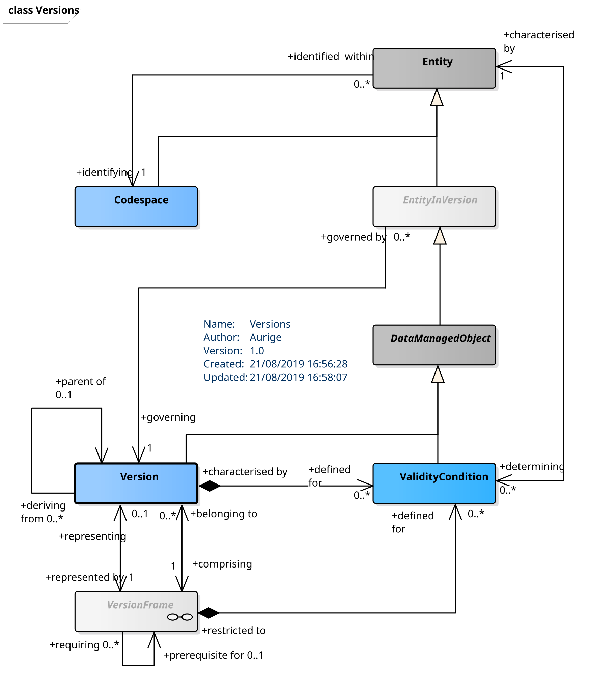
*Entity et Version – Modèle conceptuel*

Dans Transmodel, une ENTITY représente un objet réel dont une instance
est présente dans un ensemble de données échangées. Plusieurs versions,
généralement successives, d'une ENTITY peuvent être définies ;
normalement un ensemble de données donné contiendra une version
particulière (mais il est également possible d'avoir plusieurs versions
présentes dans le même ensemble de données si nécessaire).

Les données exportées vers un document XML à partir d'un référentiel
représentent un instantané de l'état d'une version particulière des
données à un moment donné dans le temps. <u>NeTEx s'intéresse
principalement aux ENTITY IN VERSION de Transmodel</u>.
C'est-à-dire que les éléments de données d'un document XML NeTEx
représentent une version particulière de chaque ENTITY. Même si une base
de données ne contient généralement qu'une unique représentation de
l'état actuel d'une ENTITY (plutôt que de tout son historique de
versions), chaque fois qu'elle effectue un export, elle crée en fait une
ENTITY IN VERSION correspondant à l’état courant : si la version est
modifiée, deux exports successifs donneront lieu à des états différents,
c'est-à-dire à différentes ENTITY IN VERSION.

L'EntityInVersion est spécialisé sous le nom de ***DataManagedObject***
qui réunit également certains autres concepts Transmodel distincts en
une seule classe abstraite XML. Il fournit un moyen pratique de réunir
les caractéristiques communes de version, de responsabilité et de
condition de validité de Transmodel, uniforme pour tous les objets NeTEx
et est donc plus simple à mettre en œuvre.

NeTEx utilise les ***Codespaces*** pour s'assurer que les identifiants
des instances d'éléments dans un document XML sont uniques, même s'ils
proviennent de nombreuses sources différentes – voir ***7.3 -***
***<u>CODESPACE et codification des identifiants-.</u>***

Une ***condition* de validité** est utilisée pour indiquer la période ou
les circonstances dans lesquelles un objet peut être utilisé (par
exemple « En hiver » ou entre deux dates spécifiées). Par le biais des
VERSION FRAMEs (voir plus loin), les ***conditions* de validité**
peuvent être associées à des ensembles d'objets.

Le ***DataManagedObject*** permet l'attribution d'une ***version***, des
informations de responsabilité (et rôles associés) à une
***EntityInVersion*** ainsi qu'une ou plusieurs instances de
***ValidityCondition*.**

<div class="table-title">DataManagedObject – Element (Abstrait)</div>

| Classification | Nom                        | Type                      |     | Description                                                                                                                                                                                                                                                                                                                                                                                                                                                                                                                                                                                                                                                                                                                                                                                                                                                                                                                                                                                                                                                                                                                                                                                                                                            |
| -------------- | -------------------------- | ------------------------- | --- | ------------------------------------------------------------------------------------------------------------------------------------------------------------------------------------------------------------------------------------------------------------------------------------------------------------------------------------------------------------------------------------------------------------------------------------------------------------------------------------------------------------------------------------------------------------------------------------------------------------------------------------------------------------------------------------------------------------------------------------------------------------------------------------------------------------------------------------------------------------------------------------------------------------------------------------------------------------------------------------------------------------------------------------------------------------------------------------------------------------------------------------------------------------------------------------------------------------------------------------------------------ |
| ::>            | ::>                        | *EntityInVersion*         | ::> | DATA MANAGED OBJECT hérite de ENTITY IN VERSION.                                                                                                                                                                                                                                                                                                                                                                                                                                                                                                                                                                                                                                                                                                                                                                                                                                                                                                                                                                                                                                                                                                                                                                                                       |
| «FK»           | ***responsibilitySetRef*** | *ResponsibilitySetIdType* | 1:1 | Pointe les roles et responsabilités associés au LIEU D'ARRÊT, à la ZONE D'EMBARQUEMENT ou à l'ACCÈS (généralisable à tous les objets, voir le modèle en 6.18).                                                                                                                                                                                                                                                                                                                                                                                                                                                                                                                                                                                                                                                                                                                                                                                                                                                                                                                                                                                                                                                                                         |
|                | ***KeyList***              | *KeyList*                 | 0:1 | <p><mark>Ensemble de couples clé-valeur utilisé pour décrire les identifiants secondaires de l'objet (LIGNE, LIEU D'ARRÊT, ZONE D'EMBARQUEMENT, POINT D’ARRET PLANIFIÉ, COURSE, etc.): c’est-à-dire tel qu'il peut être identifié dans des systèmes tiers: billettique, information voyageur, etc. La clé permet de nommer l'identifiant (et donc de faire référence au système tiers), la valeur étant l'identifiant lui-même.</mark></p><p><mark>Cette identification servira principalement d'identification croisée, permettant au fournisseur de retrouver facilement, dans ses systèmes, l'origine de l'objet.</mark></p><p><mark>La liste des identifiants secondaires est spécifique à chaque fournisseur.</mark></p><p><mark>Voir aussi ***PrivateCode*** du **GroupOfEntities** pour les identifiants alternatifs: les KeyList ne sont à utiliser que s'il y a plusieurs identifiants alternatifs, et si elles sont utilisées, le **PrivateCode** doit impérativement être aussi renseigné.</mark></p><p><mark>Il est interdit, dans le profil, d’utiliser le système de clé/valeur pour décrire des informations qui pourraient être fournies avec des attributs NeTEx existants (même s’ils ne sont pas retenus par le profil).</mark></p> |
|                | ***BrandingRef***          | *BrandingRefStructure*    | 0:1 | Référence à une marque (comme par exemple Navigo, Destineo, Oùra, etc.).                                                                                                                                                                                                                                                                                                                                                                                                                                                                                                                                                                                                                                                                                                                                                                                                                                                                                                                                                                                                                                                                                                                                                                               |
|                | ***alternativeTexts***     | *<u>AlternativeText</u>*  | 0:* | Additional Translations of text elements.                                                                                                                                                                                                                                                                                                                                                                                                                                                                                                                                                                                                                                                                                                                                                                                                                                                                                                                                                                                                                                                                                                                                                                                                              |

<div class="table-title">Entity – Element (Abstrait)</div>

| Classification | Nom               | Type           |     | Description                                                                                                                                                                                                                                                                                                                                                                                                                                                                                                                                                                                |
| -------------- | ----------------- | -------------- | --- | ------------------------------------------------------------------------------------------------------------------------------------------------------------------------------------------------------------------------------------------------------------------------------------------------------------------------------------------------------------------------------------------------------------------------------------------------------------------------------------------------------------------------------------------------------------------------------------------ |
|                | ***NameOfClass*** | *NameOfClass*  | ::> | Nom de la classe de l'ENTITÉ.                                                                                                                                                                                                                                                                                                                                                                                                                                                                                                                                                              |
| «PK»           | ***id***          | *ObjectIdType* | 1:1 | <p>Identifiant unique (et pérenne autant que possible) de l'objet.</p><p><mark>Tous les objets métiers "racine" (c’est-à-dire les objets situés au niveau ***members*** des FRAME (voir 7.2) doivent impérativement être identifiés. Par contre les objets inclus (au sens XML) dans un un autre objet ne seront généralement pas identifiés (l'identification n'est toutefois pas interdite).</mark></p><p><mark>**Cette remarque est valable pour la totalité des attributs du DataManagedObject (version, validité, etc. ne sont nécessaires que pour les objets racines).**</mark></p> |

<div class="table-title">EntityInVersion – Element (Abstrait)</div>

| Classification | Nom                            | Type                    |     | Description                                                                                                                                                                                                                                                                                                                                                                                                     |
| -------------- | ------------------------------ | ----------------------- | --- | --------------------------------------------------------------------------------------------------------------------------------------------------------------------------------------------------------------------------------------------------------------------------------------------------------------------------------------------------------------------------------------------------------------- |
| ::>            | ::>                            | *Entity*                | ::> | ENTITY ON VERSION hérite de ENTITY.                                                                                                                                                                                                                                                                                                                                                                             |
| «FK»           | ***dataSourceRef***            | *DataSourceIdType*      | 0:1 | Identifiant de la source des données (voir INSTITUTION pour la description détaillée d'une source).                                                                                                                                                                                                                                                                                                             |
|                | ***created***                  | *xsd:dateTime*          | 0:1 | Date et heure de création de l'ENTITÉ                                                                                                                                                                                                                                                                                                                                                                           |
|                | ***changed***                  | *xsd:dateTime*          | 0:1 | Date et heure de la dernière modification de l'ENTITÉ                                                                                                                                                                                                                                                                                                                                                           |
|                | ***modification***             | *ModificationEnum*      | 0:1 | Nature de la dernière modification : <ul><li>**new** (création)</li><li>**revise** (mise à jour)</li><li>**delete** (suppression)</li></ul>                                                                                                                                                                                                                                                                     |
| «PK»           | ***version***                  | *VersionIdType*         | 0:1 | Identifiant de version (généralement un numéro)                                                                                                                                                                                                                                                                                                                                                                 |
|                | ***status***                   | *VersionStatusEnum*     | 0:1 | Statut de la version : <ul><li>**active** (objet actif)</li><li>**inactive** (objet non actif, de façon à pouvoir "désactiver" un objet pendant un certain temps sans pour autant le supprimer, par exemple pour un arrêt qui ne sera plus utilisé pendant quelques mois).</li></ul>                                                                                                                            |
| «FK»           | ***derivedFromObjectRef***     | *ObjectIdType*          | 0:1 | <p>Identifiant d'une ENTITÉ dont celle-ci est dérivée.</p><p><mark>Dans le contexte du profil, ce champ est utilisé **uniquement** pour lier des objets pour lesquels on a réalisé une variante fonctionnelle. Typiquement, dans le cas d'une ligne de substitution (voir Profil Réseau) on pourra utiliser le ***derivedFromObjectRef*** pour la relier à la ligne qu'elle remplace temporairement.</mark></p> |
| «FK»           | ***compatibleWithVersionRef*** | *VersionIdType*         | 0:1 | <p><mark>Cet attribut est utilisé uniquement pour les CADREs DE VERSION (VERSION FRAME).</mark></p><p>Indique alors la version de l'instance de CADRE DE VERSION avec laquelle cette version d'objet est compatible. Ce CADRE DE VERSION porte le même identifiant que celui du cadre impliqué dans l'échange courant, mais avec un numero de version différent.</p>                                            |
| (choice)       | a : ***validityConditions***   | *ValidityCondition*     | 0:* | CONDITIONs DE VALIDITÉ de l’ENTITÉ.                                                                                                                                                                                                                                                                                                                                                                             |
|                | b : ***ValidBetween***         | *ValidBetweenStructure* | 0:* | Optimisation : version simplifiée de CONDITIONs DE VALIDITÉ (simple période entre deux dates)                                                                                                                                                                                                                                                                                                                   |

<div class="table-title">KeyList – Element (Abstrait)</div>

| Classification | Nom             | Type                   |     | Description                                                                                                                                                                                             |
| -------------- | --------------- | ---------------------- | --- | ------------------------------------------------------------------------------------------------------------------------------------------------------------------------------------------------------- |
|                | ***typeOfKey*** | *xsd:normalizedString* | 0:1 | <p>Type de clé.</p><p><mark>Seule la valeur "ALTERNATE_IDENTIFIER" est reconnue dans le cadre du profil. Tout autre type de type de clé devra être ignoré (sans toutefois générer d'erreur).</mark></p> |
|                | ***Key***       | *xsd:normalizedString* | 1:1 | Nom de la clé .                                                                                                                                                                                         |
|                | ***Value***     | *xsd:normalizedString* | 1:1 | Valeur associée à la clé                                                                                                                                                                                |

## Attributs de GroupOfEntities

***GroupOfEntities*** est défini par un type XSD abstrait, et ne peut
être instancié que dans un contexte d’héritage. Il existe toutefois une
version concrète du ***GroupOfEntities*** : le
***GeneralGroupOfEntities*** qui a pour vocation de permettre la
formation de groupe avec n’importe quels types d’objets, en particulier
ceux pour lesquels des spécialisations n’ont pas été prévues.

<div class="table-title">GroupOfEntities – Element (Abstrait)</div>

| Classification | Nom                        | Type                                  |                                              | Description                                                                                                                                                                                                                                                                                                                                                                                                                                                                                                                                                                                                                                                                                                                                                                                                                                                                                                                                                                                                                                                                                             |
| -------------- | -------------------------- | ------------------------------------- | -------------------------------------------- | ------------------------------------------------------------------------------------------------------------------------------------------------------------------------------------------------------------------------------------------------------------------------------------------------------------------------------------------------------------------------------------------------------------------------------------------------------------------------------------------------------------------------------------------------------------------------------------------------------------------------------------------------------------------------------------------------------------------------------------------------------------------------------------------------------------------------------------------------------------------------------------------------------------------------------------------------------------------------------------------------------------------------------------------------------------------------------------------------------- |
| ::>            | ::>                        | *DataManagedObject*                   | ::>                                          | GROUP OF ENTITies hérite de DATA MANAGED OBJECT.                                                                                                                                                                                                                                                                                                                                                                                                                                                                                                                                                                                                                                                                                                                                                                                                                                                                                                                                                                                                                                                        |
|                | ***Name***                 | *MultilingualString*                  | <del>0:1</del><br><mark>1:1</mark>           | <p>Nom du groupe d'entité <mark>(du LIEU D'ARRÊT, de la ZONE D'EMBARQUEMENT, de l'ACCÈS, etc.)</mark>.</p><p><mark>Attribut rendu obligatoire dans le cadre de ce profil.</mark></p>                                                                                                                                                                                                                                                                                                                                                                                                                                                                                                                                                                                                                                                                                                                                                                                                                                                                                                                    |
|                | ***ShortName***            | *MultilingualString*                  | 0:1                                          | Nom court du groupe d'entité <mark>(du LIEU D'ARRÊT, de la ZONE D'EMBARQUEMENT, de l'ACCÈS, etc.)</mark>                                                                                                                                                                                                                                                                                                                                                                                                                                                                                                                                                                                                                                                                                                                                                                                                                                                                                                                                                                                                |
|                | ***Description***          | *MultilingualString*                  | 0:1                                          | Texte libre de description                                                                                                                                                                                                                                                                                                                                                                                                                                                                                                                                                                                                                                                                                                                                                                                                                                                                                                                                                                                                                                                                              |
| «FK»           | ***PurposeOfGroupingRef*** | *PurposeOfGroupingRef*                | 0:1                                          | <p>But fonctionnel pour lequel des GROUPEMENTs d'éléments sont définis. La FINALITÉ DE GROUPEMENT peut être limitée à un ou plusieurs types d'un objet donné.</p><p><mark>Le champ ***PurposeofGroupingRef*** devra systématiquement valoir ***"groupOfStopPlace"*** pour les GROUPEs DE LIEUX D'ARRÊT.</mark></p><p><mark>Dans le cas des groupes de lignes (GROUP OF LINES, voir Profil Réseau) le ***PurposeofGroupingRef*** pourra être utilisé pour qualifier les lignes administratives en utilisant la valeur ***"administrativeLine"***</mark></p>                                                                                                                                                                                                                                                                                                                                                                                                                                                                                                                                              |
| «AK»           | ***PrivateCode***          | *PrivateCode*                         | 0:1                                          | <p>Code "privé" permettant de gérer une identification spécifique indépendante de l'identification partagée. <mark>Si plusieurs identifiants alternatifs sont nécessaires, on pourra recourir au keyList de DataManagedObject, mais dans cette hypothèse le champ PrivateCode devra impérativement être aussi renseigné (avec l'un des identifiants alternatifs).</mark></p><p><mark>Ce champ est utilisé de différente façon suivant le contexte. C'est un simple identifiant alternatif pour les LIEU D'ARRÊT, ZONE D'EMBARQUEMENT, GROUPE DE LIEU et ACCÈS.</mark></p><p><mark>Dans le cadre des zones administratives (LIEU TOPOGRAPHIQUE) ce code est utilisé de la façon suivante :</mark> <ul><li><mark>**Région** : code NUTS</mark></li><li><mark>**Département** : code NUTS</mark></li><li><mark>**Groupement de communes** : code Postal</mark></li><li><mark>**Ville** : code INSEE</mark></li><li><mark>**Arrondissement** : code INSEE</mark></li></ul></p><p><mark>Note : les codes NUTS peuvent être trouvés [ici](https://eur-lex.europa.eu/eli/reg/2003/1059/2018-01-18).</mark></p> |
| «ctd»          | ***(members)***            | *VersionOfObjectRef* \| *GroupMember* | <del>0:1</del><br><mark>***spécial***</mark> | <mark>**Ce champ est apporté par GeneralGroupOfEntities et n'est utilisé que dans certains cas particuliers :**</mark><ul><li><mark>**Dans le cadre des GROUPEs DE LIEUX D'ARRÊT, et il est alors obligatoire. Il contient la liste des identifiants des membres des GROUPEs DE LIEUX D'ARRÊT (ce sont donc des identifiants de LIEU D'ARRÊT)**</mark></li></ul>                                                                                                                                                                                                                                                                                                                                                                                                                                                                                                                                                                                                                                                                                                                                        |

## Attributs de Zone

<div class="table-title">Zone – Element (Abstrait)</div>

| Classification | Nom               | Type            |     | Description                                                                                                                                                                                                                                                                                                                                                                                                                            |
| -------------- | ----------------- | --------------- | --- | -------------------------------------------------------------------------------------------------------------------------------------------------------------------------------------------------------------------------------------------------------------------------------------------------------------------------------------------------------------------------------------------------------------------------------------- |
| ::>            | ::>               | *GroupOfPoints* | ::> | <p>ZONE hérite de GROUP OF POINTs (note : le ***GroupOfPoint*** n’apporte pas d’autres ajouts au ***GroupOfEntities*** que l’attribut ***members*** spécialisé pour ne référencer que des points).</p><p><mark>Le champ ***members*** n’est utilisé que dans le cas particulier du transport à la demande, pour permettre d’identifier les arrêts (POINT D’ARRÊT PLANIFIÉs) d’une zone dans le cas de TAD zonal avec arrêt.</mark></p> |
| «cntd»         | ***members***     | *PointRef*      | 0:* | Liste des POINT contenus dans la ZONE.                                                                                                                                                                                                                                                                                                                                                                                                 |
| «cntd»         | ***Centroid***    | *Point*         | 0:1 | <p>Point représentatif de la ZONE (<mark>LIEU D'ARRÊT, ZONE D'EMBARQUEMENT, LIEU TOPOGRAPHIQUE, ACCES, POINT D’ARRÊT PLANIFIÉ, etc.</mark>).</p><p>Ce point n'a pas à être le centre, ou le barycentre, de la zone, mais un point qui la localisera de façon satisfaisante (sur un fond de carte par exemple).</p>                                                                                                                     |
|                | ***Gml:Polygon*** | *gml:Polygon*   | 0:* | <p>Polygone de contour de la zone.</p><p>C'est une séquence ordonnée de points représentant une surface fermée et permettant de décrire le contour géographique de la ZONE.</p>                                                                                                                                                                                                                                                        |
| «cntd»         | ***projections*** | *Projection*    | 0:* | <p>Liste des PROJECTIONs de la ZONE.</p><p><mark>La PROJECTION n’est utilisée que pour permettre de mettre en lien l’offre de transport en commun et une description de l’infrastructure (route, rail, etc.). On référencera donc typiquement un jeu de données OSM, NavTeQ Here, etc.</mark></p>                                                                                                                                      |

## Attributs de Point

<div class="table-title">Point – Element (Abstrait)</div>

| Classification | Nom               | Type                   |                                         | Description                                                                                                                                                                                                                                                                                                                                                                                                                                                                                                                                                                                                                                                                                                     |
| -------------- | ----------------- | ---------------------- | --------------------------------------- | --------------------------------------------------------------------------------------------------------------------------------------------------------------------------------------------------------------------------------------------------------------------------------------------------------------------------------------------------------------------------------------------------------------------------------------------------------------------------------------------------------------------------------------------------------------------------------------------------------------------------------------------------------------------------------------------------------------- |
| ::>            | ::>               | *DataManagedObject*    | ::>                                     | POINT hérite de DATA MANAGED OBJECT.                                                                                                                                                                                                                                                                                                                                                                                                                                                                                                                                                                                                                                                                            |
|                | ***Name***        | *MultilingualString*   | 0:1                                     | Nom du POINT.                                                                                                                                                                                                                                                                                                                                                                                                                                                                                                                                                                                                                                                                                                   |
|                | ***Location***    | *Location*             | <del>0:1</del><br/><mark>**1:1**</mark> | Localisation du POINT <mark>(Obligatoire dans le profil France, notamment pour les objets de type QUAY et STOP PLACE. Attention, l'attribut n'est pas attendu dans les SCHEDULED STOP POINT)</mark>                                                                                                                                                                                                                                                                                                                                                                                                                                                                                                             |
| «»             | ***PointNumber*** | *xsd:normalizedString* | 0:1                                     | <p>Identifiant alternatif du point POINT.</p> <mark>On utilisera le champ PointNumber pour ordonner des points (par exemple les POINTs D’ARRÊT PLANIFIÉs d’une ligne que l’on veut ordonner sur une fiche horaire), avec la convention suivante :</mark> <ul><li><mark>On privilégiera une valeur purement numérique pour ce champ (avec un classement classique du plus petit au plus grand)</mark></li><li><mark>Si ce n’était pas le cas le classement sera réalisé de façon alphanumérique (et non alphabétique), aussi appelé classement naturel, en intégrant donc une reconnaissance de l’éventuelle partie numérique. (voir <http://rosettacode.org/wiki/Natural_sorting> par exemple)</mark></li></ul> |
| «cntd»         | ***projections*** | *Projection*           | 0:*                                     | <p>Projections du POINT.</p><p><mark>La PROJECTION n’est utilisée que pour permettre de mettre en lien l’offre de transport en commun et une description de l’infrastructure (route, rail, etc.). On référencera donc typiquement un jeu de données OSM, NavTeQ Here, etc.</mark></p>                                                                                                                                                                                                                                                                                                                                                                                                                           |

## Attributs de Tronçon

***Link*** est défini par un type XSD abstrait, et ne peut être
instancié que dans un contexte d’héritage. De plus, les spécialisations
concrètes de ***Link*** ajoutent systématiquement les attributs
***FromPointRef*** et ***ToPointRef*** (avec des types de point
spécialisés et adaptés : par exemple des ***RoutePoints*** pour les
***RouteLink***).

<div class="table-title">Link – Element (Abstrait)</div>

| Classification                                              | Nom                               | Type                                 |             | Description                                                                                                                                                                                                                                                                                                                                                                                                                                                                                                                                                                                                                                                                            |
| ----------------------------------------------------------- | --------------------------------- | ------------------------------------ | ----------- | -------------------------------------------------------------------------------------------------------------------------------------------------------------------------------------------------------------------------------------------------------------------------------------------------------------------------------------------------------------------------------------------------------------------------------------------------------------------------------------------------------------------------------------------------------------------------------------------------------------------------------------------------------------------------------------- |
| ::>                                                         | ::>                               | *DataManagedObject*                  | ::>         | LINK hérite de DATA MANAGED OBJECT.                                                                                                                                                                                                                                                                                                                                                                                                                                                                                                                                                                                                                                                    |
|                                                             | ***Name***                        | *MultilingualString*                 | 0:1         | Nom du TRONÇON.                                                                                                                                                                                                                                                                                                                                                                                                                                                                                                                                                                                                                                                                        |
|                                                             | ***Distance***                    | *DistanceType*                       | 0:1         | <p>Longueur du TRONÇON (unité en cohérence avec l’unité par défaut des frames, en mètre pour la France naturellement).</p><p><mark>Il ne s'agit pas de la simple distance "à vol d'oiseau" entre les deux extrémités, mais de la distance opérationnelle que l'on souhaite faire porter au TRONÇON, comme la distance qui sera parcourue par un véhicule sur ce TRONÇON par exemple.</mark></p>                                                                                                                                                                                                                                                                                        |
| «cntd»                                                      | ***LineString***                  | *gmlLineString*                      | 0:1         | Géométrie du TRONÇON sous forme d’une linestring GML (la géométrie d’un TRONÇON n’est donc pas limitée à un simple couple de point, mais est décrite par une séquence de points).                                                                                                                                                                                                                                                                                                                                                                                                                                                                                                      |
| «cntd»                                                      | ***<mark>projections</mark>***    |                                      |             | <p><mark>La PROJECTION n’est utilisée que pour permettre de mettre en lien l’offre de transport en commun et une description de l’infrastructure (route, rail, etc.). On référencera donc typiquement un jeu de données OSM, NavTeQ Here, etc.</mark></p><p><mark>Dans le cas des TRONÇONs la projection n’est généralement pas simple un TRONÇON ne se projetant généralement pas sur un unique autre TRONÇON (on aura presque systématiquement un TRONÇON TC à cheval sur N tronçon routier, ou encore l’inverse) : il a donc été fait le choix de ne projeter que les point extrémités du TRONÇON (ces point peuvent se projeter sur un autre point, ou sur un segment).</mark></p> |
| «cntd»                                                      | ***<mark>passingThrough</mark>*** |                                      |             | <mark>Le besoin de points intermédiaires est lié soit à une géométrie complexe (on utilisera alors l’attribut ***LineString***) soit au fait que, par exemple, un TRONÇON sur un PARCOURS passe par un arrêt sans s’y arrêter, mais on utilisera dans ce cas les éléments du PARCOURS dédiés à la description de cette situation.</mark>                                                                                                                                                                                                                                                                                                                                               |
| uniquement dans les spécialisations concrètes de ***Link*** | ***FromPointRef***                | *xxxPoint (spécialisation de Point)* | 1:1         | Point de depart du segment (uniquement dans les spécialisations concrètes de ***Link***)                                                                                                                                                                                                                                                                                                                                                                                                                                                                                                                                                                                               |
| ”                                                           | ***ToPointRef***                  | *xxxPoint (spécialisation de Point)* | 1:1         | Point de fin du segment (uniquement dans les spécialisations concrètes de ***Link***)                                                                                                                                                                                                                                                                                                                                                                                                                                                                                                                                                                                                  |

## Attributs des Séquences de Tronçons

Les SÉQUENCEs DE TRONÇONS sont des éléments de base pour la construction
d'objets plus complexes comme les ITINÉRAIREs (voir Profil Réseau).

<div class="table-title">LinkSequence – Element (Abstrait)</div>

| Classification | Nom                      | Type                 | Cardinalité | Description                                           |
| -------------- | ------------------------ | -------------------- | ----------- | ----------------------------------------------------- |
| ::>            | ::>                      | *DataManagedObject*  | ::>         | LINK SEQUENCE hérite de ***DataManagedObject***.      |
|                | ***Name***               | *MultilingualString* | 0:1         | Nom de la SÉQUENCE DE TRONÇON.                        |
|                | ***Distance***           | *DistanceType*       | 0:1         | Longueur totale (en mètre) de la SÉQUENCE DE TRONÇON. |
|                | ***sectionsInSequence*** | *SectionInSequence*  | 0:*         | Liste ordonnée de TRONÇONs.                           |

## Attributs des Points d’une Séquence de Tronçons

Les POINTs DE SÉQUENCE DE TRONÇONS (POINT IN LINK SEQUENCE) permettent
essentiellement d’indiquer les numéros d’ordre des POINTs au sein d’une
SÉQUENCE DE TRONÇONS.

<div class="table-title">PointInLinkSequence – Element (Abstrait)</div>

| Classification | Nom                   | Type                    |     | Description                                                                                                                       |
| -------------- | --------------------- | ----------------------- | --- | --------------------------------------------------------------------------------------------------------------------------------- |
| ::>            | ::>                   | *<u>VersionedChild</u>* | ::> | POINT IN LINK SEQUENCE hérite de VERSIONED CHILD.                                                                                 |
| «atr»          | ***order***           | *xsd:positiveInteger*   | 1:1 | Ordre du POINT au sein de la séquence (la valeur de début est sans importance seules comptent les valeurs relatives entre elles). |
| «FK»           | ***LinkSequenceRef*** | *LinkSequenceRef*       | 1:1 | Référence de la LINK SEQUENCE contenant le POINT IN LINK SEQUENCE.                                                                |
|                | ***Description***     | *MultilingualString*    | 0:1 | Description du POINT in LINK SEQUENCE. +v1.1                                                                                      |

## Conditions de validité

La validité se définit comme la période pendant laquelle, ou les
conditions en fonction desquelles l'ENTITÉ peut être utilisée par les
voyageurs.

**NOTE** : le LIEU D'ARRÊT ou l'ACCÈS peut aussi être sujet à des heures
d'ouverture, mais ces plages d'ouverture sont potentiellement multiples
au sein d'une journée, et variable selon le type de jour : même si les
AVAILABILITY CONDITIONs (voir plus bas) permettent de modéliser cette
information, il a été décidé de ne pas retenir ce niveau de finesse dans
ce profil (on ne conserve donc que de simples date de début et fin de
validité). Une NOTE pourra éventuellement être utilisée pour ce type de
situation (associée au LIEU D'ARRÊT ou à l'ACCÈS dans ce cas).

La figure ci-dessous montre que les conditions de validité peuvent être
exprimées de façon simplifiée au travers du ***ValidBetween*** ou de
façon détaillée. C’est, autant que possible, la version simplifiée du
***ValidBetween*** qui sera préférée.

<div class="table-title">ValidBetween – Element (objet inclus)</div>

| Classification | Nom            | Type           |     | Description                                                                                                                                                                                                                                  |
| -------------- | -------------- | -------------- | --- | -------------------------------------------------------------------------------------------------------------------------------------------------------------------------------------------------------------------------------------------- |
|                | ***FromDate*** | *xsd:dateTime* | 0:1 | Date et heure de début de validité (inclusif) <br/> <mark>Le ***FromDate*** est obligatoire dans le cadre du profil (le ***ToDate*** ne l’est pas, et s’il n’est pas rempli, la validité débute au ***FromDate*** sans limite de fin.</mark> |
|                | ***ToDate***   | *xsd:dateTime* | 0:1 | Date et heure de fin de validité (inclusif)                                                                                                                                                                                                  |

<div class="table-title">ValidityCondition – Element (objet inclus)</div>

| Classification | Nom                        | Type                   |     | Description                                                                                                                                                                                                                                                                                                                                                                                                                                                                                                                                                                                              |
| -------------- | -------------------------- | ---------------------- | --- | -------------------------------------------------------------------------------------------------------------------------------------------------------------------------------------------------------------------------------------------------------------------------------------------------------------------------------------------------------------------------------------------------------------------------------------------------------------------------------------------------------------------------------------------------------------------------------------------------------- |
| ::>            | ::>                        | *DataManagedObject*    | ::> | <p>Inherits from DATA MANAGED OBJECT.</p><p><mark>L’héritage reste naturellement valable, mais aucun des attributs qu’il apporte ne sera utilisé.</mark></p>                                                                                                                                                                                                                                                                                                                                                                                                                                             |
|                | ***Name***                 | *MultilingualString*   | 0:1 | Nom de la VALIDITY CONDITION                                                                                                                                                                                                                                                                                                                                                                                                                                                                                                                                                                             |
|                | ***Description***          | *MultilingualString*   | 0:1 | Description de la VALIDITY CONDITION                                                                                                                                                                                                                                                                                                                                                                                                                                                                                                                                                                     |
| «FK»           | ***ConditionedObjectRef*** | *ObjectRef*            | 0:1 | <p>Référence de l’objet sur lequel porte la CONDITION DE VALIDITÉ.</p><p><mark>Cet attribut n’est utilisé que si la condition de validité est fournie comme un objet indépendant au sein d’une FRAME (voir 7.2). Dans tous les autre cas (la CONDITION DE VALIDITÉ est dans l’arborescence XML d’un objet) c’est le contexte qui fournit cette information, et ce champ sera ignoré. On n’utilisera les conditions de validité comme un objet indépendant que pour pouvoir les référencer avec un ***WithConditionRef*** (champ suivant)</mark></p>                                                      |
| «FK»           | ***WithConditionRef***     | *ValidityConditionRef* | 0:1 | <p>Cet attribut permet de chaîner plusieurs CONDITIONs DE VALIDITÉ qui seront alors logiquement combinées par l’opérateur logique ET.</p><p><mark>On pourra ainsi gérer une période combinée à des exclusions, combiner des périodes et des évènements déclencheurs, etc.</mark></p><p><mark>Pour la gestion des exceptions, on exprimera toujours une CONDITION DE VALIDITÉ « principale » et on y associera des exceptions par ***WithConditionRef*** et non l’inverse. Pour toutes les combinaisons on procédera de même si une CONDITION DE VALIDITÉ « principale » peut être identifiée.</mark></p> |

Deux spécialisations des conditions de validité sont utilisées dans le
cadre des profils NeTEx : les conditions de disponibilité qui sont les
conditions temporelles, et les déclencheurs de validité qui sont des
événements rendant l’ENTITÉ disponibles (pour, par exemple, les
itinéraires en cas de crue, la modification de service ou d’ouverture en
cas de match ou d’évènement sportif autour d’un lieu comme un stade,
etc.)

<div class="table-title">AvailabilityCondition – Element (objet inclus)</div>

| Classification | Nom                 | Type                |     | Description                                                                                                                                                                                                                                                                                            |
| -------------- | ------------------- | ------------------- | --- | ------------------------------------------------------------------------------------------------------------------------------------------------------------------------------------------------------------------------------------------------------------------------------------------------------ |
| ::>            | ::>                 | *ValidityCondition* | ::> | AVAILABILITY CONDITION hérite de VALIDITY CONDITION.                                                                                                                                                                                                                                                   |
|                | ***FromDate***      | *xsd:dateTime*      | 0:1 | Date et heure de début de validité (inclusif)                                                                                                                                                                                                                                                          |
|                | ***ToDate***        | *xsd:dateTime*      | 0:1 | Date et heure de fin de validité (inclusif)                                                                                                                                                                                                                                                            |
|                | ***IsAvailable***   | *xsd:boolean*       | 1:1 | <p>Indique si la CONDITION DE VALIDITÉ correspond à une disponibilité (VRAI) ou une indisponibilité (FAUX).</p><p>Ce champ sert principalement à exprimer les exceptions (par exemple : sauf le 1er avril) par combinaison de CONDITIONs DE VALIDITÉ avec ***WithConditionRef*** (voir plus haut).</p> |
| «FK»           | ***dayTypes***      | *DayTypeRef*        | 0:* | <p>TYPE DE JOUR pendant lesquels la CONDITIONs DE VALIDITÉ s’applique.</p><p><mark>On n’utilisera pas simultanément ***dayTypes*** et ***operatingDays*** dans une même CONDITION DE VALIDITÉ.</mark></p>                                                                                              |
| «cntd»         | ***timeBands***     | *TimeBand*          | 0:* | <p>TRANCHEs HORAIREs pendant lesquelles la CONDITIONs DE VALIDITÉ s’applique.</p><p><mark>Permet essentiellement d’exprimer les heures d’ouverture.</mark></p>                                                                                                                                         |
| «cntd»         | ***operatingDays*** | *OperatingDay*      | 0:* | <p>Jours d’exploitation pendant lesquels la CONDITIONs DE VALIDITÉ s’applique.</p><p><mark>On n’utilisera pas simultanément ***dayTypes*** et ***operatingDays*** dans une même CONDITION DE VALIDITÉ.</mark></p>                                                                                      |

<div class="table-title">ValidityTrigger – Element (objet inclus)</div>

| Classification | Nom                    | Type                |             | Description                                                                                                                                                                                                                                                                                                                                                                                                                                                     |
| -------------- | ---------------------- | ------------------- | ----------- | --------------------------------------------------------------------------------------------------------------------------------------------------------------------------------------------------------------------------------------------------------------------------------------------------------------------------------------------------------------------------------------------------------------------------------------------------------------- |
| ::>            | ::>                    | *ValidityCondition* | ::>         | VALIDITY TRIGGER hérite de VALIDITY CONDITION.                                                                                                                                                                                                                                                                                                                                                                                                                  |
| «FK»           | ***TriggerObjectRef*** | *ObjectRef*         | 0:1         | <p>Référence (identifiant) de l’objet déclencheur de la validité.</p><p><mark>De façon pratique, plutôt que de réel identifiant d’objet, on utilisera ici des valeurs codifiées dont les valeurs possibles seront précisées dans les spécifications d’interface du système producteur. Par convention on utilisera autant que possible les codes ***reason***, ***subreason*** et ***PublicEvent*** proposés par le service SIRI Situation Exchange.</mark></p> |

## Accessibilité

Les informations concernant l'ACCESSIBILITÉ sont utilisées de la même façon pour
les LIEUx D'ARRÊT, les LIGNEs, les COURSEs, etc. L’information d’accessibilité
présentée correspond à une information minimale lorsque les ÉVALUATIONs
D’ACCESSIBILITÉ (ACCESSIBILITY ASSESSMENT) sont utilisées. Pour plus
d'information sur les éléments retenus dans le profil France, se référer à la
partie Accessibilité du profil France de NeTEx. Cette dernière propose, en
outre, des éléments de description d'accessibilité plus détaillés, ainsi que
l'identification des attributs obligatoires pour se conformer à la
réglementation en vigueur.

## Nom alternatif

<div class="table-title">AlternativeName – Element</div>

| Classification | Nom                  | Type                 |     | Description                                                                                                                                                                                                                                                                                                                                                                    |
| -------------- | -------------------- | -------------------- | --- | ------------------------------------------------------------------------------------------------------------------------------------------------------------------------------------------------------------------------------------------------------------------------------------------------------------------------------------------------------------------------------ |
| «FK»           | ***NamedObjectRef*** | *VersionOfObjectRef* | 0:1 | <p>Référence de l’objet pour lequel on fourni un nom alternatif.</p><p><mark>Cet attribut n’est utilisé que si le nom alternatif est fourni comme un objet indépendant au sein d’une FRAME (voir 7.2). Dans tous les autre cas (le NOM ALTERNATIF est dans l’arborescence XML d’un objet) c’est le contexte qui fournit cette information, et ce champ sera ignoré.</mark></p> |
|                | ***Lang***           | *Language*           | 0:1 | Langue utilisée pour ces alias (codification RFC 1766)                                                                                                                                                                                                                                                                                                                         |
|                | ***NameType***       | *NameTypeEnum*       | 0:1 | <p>Type de nom alternatif :<ul><li>***alias*** : Alias</li><li>***translation*** : Traduction</li><li>***other*** : Autre</li></ul></p><p>Il existe deux autres possibilités qui ne sont pas utilisées dans le cadre du profil : ***copy*** et ***label***.</p>                                                                                                                |
|                | ***TypeOfName***     | *NormalizedString*   | 0:1 | Description de type de nom (ex: *"Libellé de la synthèse vocale"*)                                                                                                                                                                                                                                                                                                             |
|                | ***Name***           | *MultilingualString* | 1:1 | Texte du nom alternatif                                                                                                                                                                                                                                                                                                                                                        |
|                | ***ShortName***      | *MultilingualString* | 0:1 | Version courte du nom alternatif                                                                                                                                                                                                                                                                                                                                               |
|                | ***Abbreviation***   | *MultilingualString* | 0:1 | Abréviation du nom alternatif                                                                                                                                                                                                                                                                                                                                                  |
|                | ***QualifierName***  | *MultilingualString* | 0:1 | Texte utilisé pour qualifier le nom (*"gare de"*, *"mairie de"*, etc.)                                                                                                                                                                                                                                                                                                         |

## Texte Alternatif (AlternativeText)

Il est parfois nécessaire de fournir plusieurs variantes d’un nom ou un
autre texte descriptif, en particulier si les informations sont requises
dans plusieurs langues. **AlternativeText** est un moyen générique de
fournir de telles variantes pour tout attribut textuel d'un
**DataManagedObject**. Il peut être considéré comme un complément au
mécanisme **AlternativeName** (décrit plus ci-dessus) et peut être
utilisé pour n’importe quel nom, description ou autre texte.

Note: l’élément ***AlternativeName*** (en comparaison à
***AlternativeText***) sera préféré pour les alias de nom propre (par
exemple “Bercy”, ”POPB”, ”AccorHotels Arena”, ”Palais omnisports de
Paris-Bercy”), alors qu’***AlternativeText*** servira essentiellement
pour les traductions (par exemple. “en.London”, “fr.Londres”,
“it.Londra”, “cn.倫敦”, “ge.ლონდონი”, etc).

<mark>Dans le profil, **AlternativeText** sera toujours utilisé
comme balise incluse (et non comme élément racine).</mark>

1. *AlternativeText – XML Element*

| Classification | Nom                  | Type                                   |            | Description                                                                                                                                               |
| -------------- | -------------------- | -------------------------------------- | ---------- | --------------------------------------------------------------------------------------------------------------------------------------------------------- |
| ::>            | ::>                  | *VersionedChild*                | ::>        | **AlternativeText** hérite de VERSIONED CHILD.                                                                                                            |
| «PK»           | ***attributeName***  | *xsd:NCName*                           | 0:1| Nom de l'attribut de texte pour lequel il s'agit du texte de remplacement. Doit être un nom d'attribut existant.                                          |
| «PK»           | ***useForLanguage*** | *xsd:language*                         | 0:1 | <p>Langue utilisée pour cette variante</p><p><mark>« fr » n’est pas accepté dans le profil, **AlternativeText** étant réservé aux traductions.</mark></p> |
|                | Text                 | *MultilingualString* (Language + Text) | 1:1        | Variante du texte original, dans le langage spécifié                                                                                                      |

## Localisation (Location)

<div class="table-title">Location – Element (abstrait)</div>

| Classification | Nom               | Type                             |     | Description                                                                                                                                                                                                                                                                                                 |
| -------------- | ----------------- | -------------------------------- | --- | ----------------------------------------------------------------------------------------------------------------------------------------------------------------------------------------------------------------------------------------------------------------------------------------------------------- |
| «FK»           | ***srsName***     | *LocatingSystemNameType*         | 0:1 | <p>Référentiel géographique: il s'appliquera aux Latitude et Longitude (permettant ainsi d'utiliser d'autres référentiels géodésiques que WGS84).</p><p>À utiliser au format GML (ex urn:ogc:def:crs:EPSG::4326 pour WGS84, voir <http://www.epsg.org> et <http://www.opengeospatial.org/ogcUrnPolicy>)</p> |
|                | ***Longitude***   | *LongitudeType*                  | 1:1 | Latitude du centroïd (point "central" du lieu d'arrêt) – WGS84 par défaut (-180 à +180)                                                                                                                                                                                                                     |
|                | ***Latitude***    | *LatitudeType*                   | 1:1 | Longitude du centroïd (point "central" du lieu d'arrêt) – WGS84 par défaut (-90 à +90)                                                                                                                                                                                                                      |
|                | ***Altitude***    | *AltitudeType*                   | 0:1 | Altitude du centroïd (mètres au-dessus du niveau de la mer)                                                                                                                                                                                                                                                 |
|                | ***Coordinates*** | *CoordinateString* ***gml:pos*** | 0:1 | <p>Localisation dans un référentiel géographique quelconque (format ISO/OGC) exprimé sous forme d'une chaine de caractère, contenant éventuellement le référentiel de projection (si différent du champ suivant SrsName).</p><p>Exemple: `-59.478340 -52.226578`</p>                                        |
|                | ***Precision***   | *xsd:decimal*                    | 0:1 | Précision de localisation (en mètres).                                                                                                                                                                                                                                                                      |

### Cas des surfaces

Les ZONEs, en plus d'être géolocalisés par un point représentatif
(centroïd) peuvent être représentées par une surface d'emprise. Cette
surface s'exprime sous la forme d'un polygone dont la structure est
décrite ci-dessous (il s’agit de la structure GML permettant de décrire
les polygones *gml:PolygonType*).

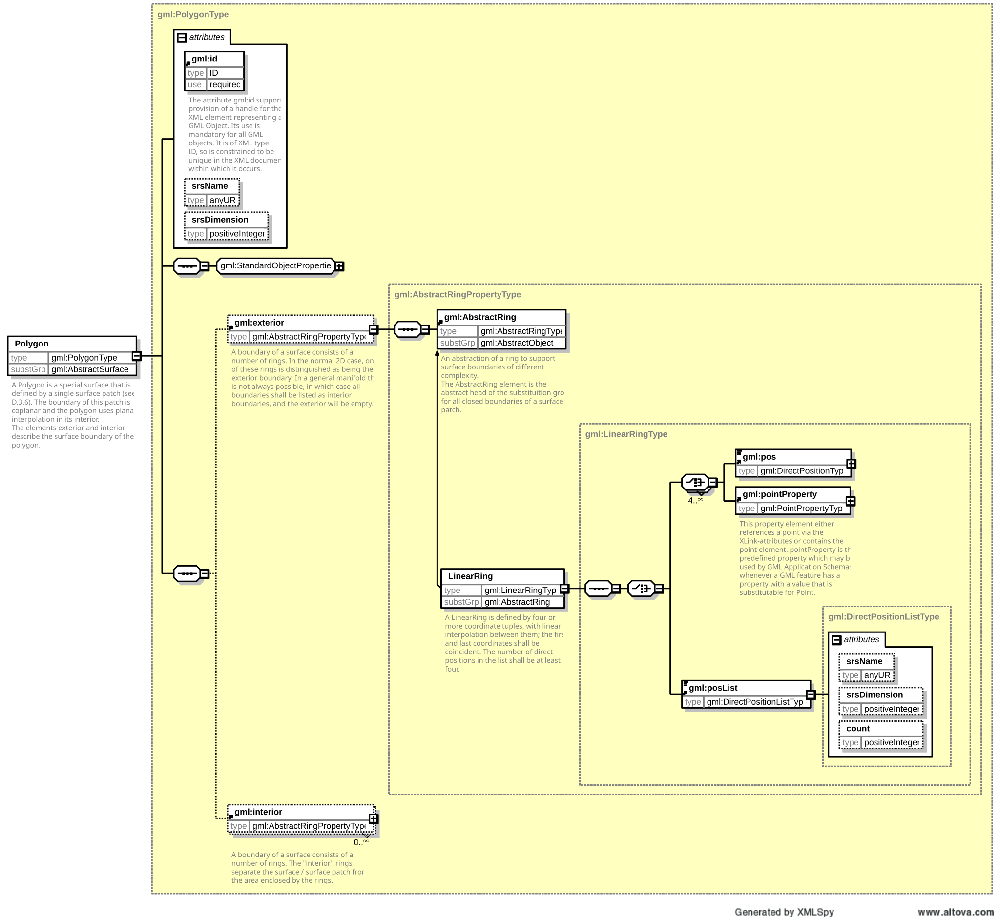
*Polygon – XSD*

Seul le contour extérieur de ce polygone (***exterior***) est retenu
dans le cadre du présent profil.

**EXEMPLE** un polygone de contour de LIEU D'ARRÊT pourra donc, par exemple,
prendre la forme ci-dessous

```xml
<gml:Polygon gml:id="12323">
  <gml:exterior>
    <gml:LinearRing>
      <gml:pos>-120.000000 65.588264</gml:pos>
      <gml:pos>-120.003571 65.590782</gml:pos>
      <gml:pos>-120.011292 65.590965</gml:pos>
      <gml:pos>-120.022491 65.595215</gml:pos>
      <gml:pos>-120.031212 65.592880</gml:pos>
      <gml:pos>-120.019363 65.586121</gml:pos>
      <gml:pos>-120.030350 65.585365</gml:pos>
    </gml:LinearRing>
  </gml:exterior>
</gml:Polygon>
```

## Attributs d'Addresse

<div class="table-title">Address – Element (objet inclus)</div>

| Classification | Nom               | Type                 |             | Description                             |
| -------------- | ----------------- | -------------------- | ----------- | --------------------------------------- |
| «FK»           | ***CountryRef***  | *CountryEnum*        | 0:1         | Code ISO 3166 du pays (deux caractères) |
|                | ***CountryName*** | *MultilingualString* | 0:1         | Nom du pays                             |

<div class="table-title">PostalAddress – Element (objet inclus)</div>

L'objet PostalAddress de NeTEx contient de nombreux attributs mais le profil
France choisit de n'en prioriser que certains afin de trouver le juste équilibre
entre les 3 axes suivants:

- production des données par ceux n'ayant pas nécessairement une donnée
  structurée (exemple de Open Trip Planner (OTP) lisant des données
  OpenStreetMap (OSM)),
- consommation des données de manière uniforme et si possible structurée,
- besoin de rester cohérent avec les modèles utilisés par les autres pays.

Pour cette raison, les champs `HouseNumber`, `Street` et `BuildingName` ne sont
pas priorisés dans le profil France. Ils peuvent être utilisés quand
l'information existe, elle sera alors considérée comme venant compléter les
attributs priorisés. Il est donc recommandé d'utiliser en priorité le champ
`AddressLine1` en n'indiquant si possible que les numéros et le nom de la rue,
en évitant d'inclure les noms ou codes des batiments. Ce champ libre permettra
dans certains cas d'indiquer les informations nécessaire quand aucune adresse
n'existe (par exemple un arrêt à un croisement de routes en inter-urbain).

|     | Nom                     | Type                   |     | Description                                                                                                                                                                                             |
| --- | ----------------------- | ---------------------- | --- | ------------------------------------------------------------------------------------------------------------------------------------------------------------------------------------------------------- |
| ::> | ::>                     | *Address*              | ::> | POSTAL ADDRESS hérite de ADDRESS.                                                                                                                                                                       |
|     | ***AddressLine1***      | *xsd:normalizedString* | 0:1 | Numéro et rue de l'adresse. Le num du batiment peut également être précisé. <mark>Ce champ retenu dans le profil France comme porteur de l'information de l'adresse (voir explication ci-dessus)</mark> |
|     | ***HouseNumber***       | *xsd:normalizedString* | 0:1 | Numéro du bâtiment sur la voie. Ce champ vient compléter le champ `AddressLine1`                                                                                                                        |
|     | ***Street***            | *xsd:normalizedString* | 0:1 | Nom et type de voie. Ce champ vient compléter le champ `AddressLine1`                                                                                                                                   |
|     | ***BuildingName***      | *xsd:normalizedString* | 0:1 | Nom du bâtiment. Ce champ vient compléter le champ `AddressLine1`                                                                                                                                       |
|     | ***Town***              | *MultilingualString*   | 0:1 | Nom de la ville                                                                                                                                                                                         |
|     | ***PostCode***          | *PostCodeType*         | 0:1 | Code Postal                                                                                                                                                                                             |
|     | ***PostCodeExtension*** | *xsd:normalizedString* | 0:1 | Extension du code postal (avec éventuel cedex ou boite postale)                                                                                                                                         |
|     | ***PostalRegion***      | *MultilingualString*   | 0:1 | Code INSEE. <mark>NOTE : le code INSEE permet aussi de faire la liaison avec la ville ou l'arrondissement (en tant que zone administrative) d'appartenance.</mark>                                      |

**Exemple de fourniture d'adresse dans le profil France :**
L'adresse postale suivant :
> Bâtiment B  
> 5 Allée des Pirouettes  
> 31420 Bouzin  

Peut s'exporter de la manière suivante :

```xml
<PostalAddress>
  <AddressLine1>5 Allée des Pirouettes</AddressLine1>
  <PostCode>31420</PostCode>
  <Town>Bouzin</Town>
</PostalAddress>
```

ou dans une version plus complète :

```xml
<PostalAddress>
  <AddressLine1>Bâtiment B, 5 Allée des Pirouettes</AddressLine1>
  <BuildingName>Bâtiment B</BuildingName>
  <HouseNumber>5</HouseNumber>
  <Street>Allée des Pirouettes</Street>
  <PostCode>31420</PostCode>
  <Town>Bouzin</Town>
</PostalAddress>
```

<div class="table-title">RoadAddress – Element (objet inclus)</div>

|     | Nom                   | Type                   |     | Description                                                                                                                                                                                                                                                                 |
| --- | --------------------- | ---------------------- | --- | --------------------------------------------------------------------------------------------------------------------------------------------------------------------------------------------------------------------------------------------------------------------------- |
| ::> | ::>                   | *Address*              | ::> | ROAD ADDRESS hérite de ADDRESS.                                                                                                                                                                                                                                             |
|     | ***GisFeatureRef***   | *normalizedString*     |     | <p><mark>Identification de l'objet correspondant à la voie dans une base spatiale (type PostGIS par exemple) ou dans un SIG.</mark></p><p><mark>Cet attribut permettra par exemple d'établir le lien avec une base IGN, Open Street Map, NavTeq, Teleatlas, etc.</mark></p> |
|     | ***RoadNumber***      | *xsd:normalizedString* | 0:1 | Nom de la voie sous forme codifiée (exemple: N20, A1, E11, D75, etc.)                                                                                                                                                                                                       |
|     | ***RoadName***        | *xsd:normalizedString* | 0:1 | Nom de la voie.                                                                                                                                                                                                                                                             |
|     | ***BearingDegrees***  | *xsd:integer*          | 0:1 | Orientation de la voie, en degrés (au niveau du LIEU d'ARRÊT, de la ZONE D'EMBARQUEMENT ou de l'ACCÈS).                                                                                                                                                                     |
|     | ***OddNumberRange***  | *xsd:normalizedString* | 0:1 | Plage de numéros impairs dans laquelle se situe le LIEU                                                                                                                                                                                                                     |
|     | ***EvenNumberRange*** | *xsd:normalizedString* | 0:1 | <p>Plage de numéros pairs dans laquelle se situe le LIEU</p><p>NOTE si la parité, droite-gauche, n'est pas respectée, c'est la zone paire qui sera renseignée.</p>                                                                                                          |

## Locale (contexte local du lieu)

Si cette information peut être portée par chaque objet, il est
généralement plus pertinent de l'utiliser de façon générique au niveau
***Frame*** (voir ***FrameDefaults*** en *7-Entêtes NeTEx*) ce qui en
évite la répétition. Si elle est présente au niveau ***Frame*** et sur
un objet particulier, la version de l'objet particulier sera utilisée
pour celui-ci.

<div class="table-title">Locale – Type (objet inclus)</div>

|   | Nom                        | Type             |      | Description                                                                         |
| - | -------------------------- | ---------------- | ---- | ----------------------------------------------------------------------------------- |
|   | ***TimeZoneOffset***       | *TimeZoneOffset* | 0:1  | Décalage horaire (positif ou négatif) par rapport à l'heure GMT                     |
|   | ***TimeZone***             | *TimeZoneOffset* | 0:1  | Nom de la zone horaire                                                              |
|   | ***SummerTimeZoneOffset*** | *TimeZoneOffset* | 0:1  | Décalage horaire (positif ou négatif) par rapport à l'heure GMT, pour l'heure d'été |
|   | ***DefaultLanguage***      | *xsd:language*   | 1:1  | Langue principale (codification RFC 1766)                                           |
|   | ***languages***            | *LanguageUsage*  | 0:\* | Autres langues utilisées (codification RFC 1766)                                    |

## Projections

Les projections sont exclusivement utilisées pour projeter les objets du
transport public sur leur infrastructure (voirie, rail, voies navigables
et câbles).

Les attributs de la structure abstraite de projection (présentés par la
figure ci-dessous), ne sont pas retenus dans les profils NeTEx : seuls
certains attributs proposés par les spécialisations (voir ci-dessous)
seront utilisés.

Seules les ***PointProjection*** (projection d’un Point sur un point ou
un tronçon) et les ***ZoneProjection*** (projection de zone sur une zone
ou un point) sont retenues. La projection de tronçon n’est pas retenue,
car difficile à mettre en œuvre opérationnellement (on doit généralement
faire face à des projections 1-N ou N-1, et la gestion de plusieurs
tronçons peut induire des difficultés de reconstruction topologique ; en
particulier dans le cas de cible disposant de structure non topologique
ou spaghetti :
<http://www.gitta.info/DigitModel/fr/html/Topologies_learningObject1.html>).
Pour projeter un tronçon on se cantonnera donc à en projeter les points
extrémités (qui eux peuvent être projetés sur des tronçons).

Les projections, telles qu'utilisées dans le contexte du profil, feront
des références vers des données externes (OSM, Nokia Here (ex Navteq),
Tomtom TeleAtlas, IGN, INSPIRE, etc.). Pour réaliser ces références de
façon non ambiguë, on utilisera conjointement deux mécanismes proposés
par NeTEx: les CODESPACE (voir 7.3) et les attributs associés aux
références.

Le CODESPACE permettra de référencer le jeu de données, par exemple en
décrivant un jeu de données OSM comme ci-dessous

```xml
<Codespace id="*osm*">
  <Xmlns>*osm*</Xmlns>
  <XmlnsUrl>*http://planet.openstreetmap.org/planet/2014/*</XmlnsUrl>
  <Description>Open Street Map through Planet OSM</Description>
</Codespace>
```

Une référence à un objet OSM pourra alors avoir la forme `ref=osm:4701234567`

Mais cela ne sera souvent pas suffisant et il faudra compléter cette
référence par d'éventuelles informations de classe, de version et de
date proposé par le mécanisme de référence de NeTEx.

<div class="table-title">Attributs pour les références externes (objet inclus)</div>

|      | Nom                  | Type                    |     | Description                                                                                                                                                                                                                                                                                                                                                                                                                                                                                                                                                                                                                                                                                                                                                                                         |
| ---- | -------------------- | ----------------------- | --- | --------------------------------------------------------------------------------------------------------------------------------------------------------------------------------------------------------------------------------------------------------------------------------------------------------------------------------------------------------------------------------------------------------------------------------------------------------------------------------------------------------------------------------------------------------------------------------------------------------------------------------------------------------------------------------------------------------------------------------------------------------------------------------------------------- |
|      | ***NameOfRefClass*** | *NameOfClass*           | 0:1 | Nom de la classe de l'objet référencé                                                                                                                                                                                                                                                                                                                                                                                                                                                                                                                                                                                                                                                                                                                                                               |
|      | ***created***        | *xsd:dateTime*          | 0:1 | <mark>Date à laquelle la référence a été créée: ATTENTION il ne s'agit pas ici de la **date de création de l'objet, mais bien de la date à laquelle la référence a été créée**. Cela permettra, en cas d'absence de mécanisme de version, de retrouver la version de l'objet considérée (dernière version à la date du…).</mark>                                                                                                                                                                                                                                                                                                                                                                                                                                                                    |
| «FK» | ***version***        | *VersionRef*            | 0:1 | <p>Version de l'objet référencé.</p><p><mark>Si les objets n'ont pas de version, mais que le jeu de donnée en a, on utilisera le CODESPACE en prefixe (ainsi `versionRef="TeleAtlas:MapMarker_USA_v04_Data/USA_TPT_2014_09"` pourra référer un jeu de données TeleAtlas (en ayant pris soin de créer le CODESPACE TeleAtlas au préalable, sur le principe indiqué ci-dessus).</mark></p><p><mark>Le référencement de la version de l'objet n'est naturellement pas obligatoire : si elle est absente on considère qu'il s'agit de la version courante.</mark></p><p>Pour les références externe, on procèdera comme indiqué en ***7.5 - Version des objets et références*** en precisant la version pointée grace à l’attribut versionRef (par exemple `versionRef="1.01:FR-NETEX_COMMUN-1.0"`)</p> |
| «FK» | ***ref***            | *ObjectRefObjectIdType* | 1:1 | Identifiant de l'objet référencé <mark>précédé de son CODESPACE</mark>.                                                                                                                                                                                                                                                                                                                                                                                                                                                                                                                                                                                                                                                                                                                             |

<div class="table-title">PointProjection – Element</div>

|      | Nom                     | Type         |     | Description                                                                                                                                                                                                                                                                                                                        |
| ---- | ----------------------- | ------------ | --- | ---------------------------------------------------------------------------------------------------------------------------------------------------------------------------------------------------------------------------------------------------------------------------------------------------------------------------------- |
| «FK» | ***ProjectedPointRef*** | *PointRef*   | 0:1 | <p>POINT projeté.</p><p><mark>Cet attribut n’est utile que si la projection est fournie comme un objet indépendant au sein d’une FRAME (voir 7.2). Dans tous les autres cas (la PROJECTION est dans l’arborescence XML d’un objet) c’est le contexte qui fournit cette information, et ce champ sera ignoré.</mark></p>            |
| «FK» | ***ProjectToPointRef*** | *PointRef*   | 0:1 | <p>POINT sur lequel on se projette.</p><p><mark>Dans le contexte des profils NeTEx, il s'agit là d'une référence vers une donnée externe (OSM, Nokia Here (ex Navteq), Tomtom TeleAtlas, IGN, INSPIRE, etc.).</mark></p><p><mark>La codification respectera les règles décrites ci-dessus pour les références externes.</mark></p> |
| «FK» | ***ProjectToLinkRef***  | *LinkRef*    | 0:1 | TRONÇON sur lequel on se projette (un POINT peut être projeté sur un TRONÇON).                                                                                                                                                                                                                                                     |
|      | ***Distance***          | *LengthType* | 1:1 | Distance entre le POINT projeté et le début du TRONÇON (ce champ n'est renseigné que si le précédent l'est aussi).                                                                                                                                                                                                                 |

<div class="table-title">ZoneProjection – Element</div>

|      | Nom                      | Type      |     | Description                                                                                                                                                                                                                                                                                                                           |
| ---- | ------------------------ | --------- | --- | ------------------------------------------------------------------------------------------------------------------------------------------------------------------------------------------------------------------------------------------------------------------------------------------------------------------------------------- |
| «FK» | ***ProjectedZoneRef***   | *ZoneRef* | 0:1 | <p>ZONE that is being projected.</p><p><mark>Cet attribut n’est utile que si la projection est fournie comme un objet indépendant au sein d’une FRAME (voir 7.2). Dans tous les autre cas (la PROJECTION est dans l’arborescence XML d’un objet) c’est le contexte qui fournit cette information, et ce champ sera ignoré.</mark></p> |
| «FK» | ***ProjectedToZoneRef*** | *ZoneRef* | 0:1 | <p>ZONE sur lequel on se projette.</p><p><mark>Dans le contexte des profils NeTEx, il s'agit là d'une référence vers une donnée externe (OSM, Nokia Here (ex Navteq), Tomtom TeleAtlas, IGN, INSPIRE, etc.).</mark></p><p><mark>La codification respectera les règles décrites ci-dessus pour les références externes.</mark></p>     |
| «FK» | ***ProjectToPointRef***  | *LinkRef* | 0:1 | POINT sur lequel on se projette (une ZONE peut être projeté sur un POINT: centroïde de ZONE, pictogramme, etc.).                                                                                                                                                                                                                      |

## Enumérations pour les modes et sous-modes

### Les modes

La liste des modes utilisés est la suivante (version anglaise d'origine
et traduction):

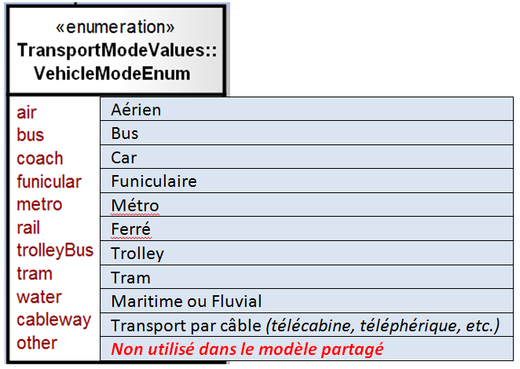
*Modes*

### Les sous modes

Le mode peut de plus être complété d'une caractéristique appelée "sous
mode" qui, plus que le type du véhicule, caractérise le type
d'exploitation qui est mis en place (navette, train régional, etc.). La
figure ci-dessous présente l'ensemble des modes normalisés.

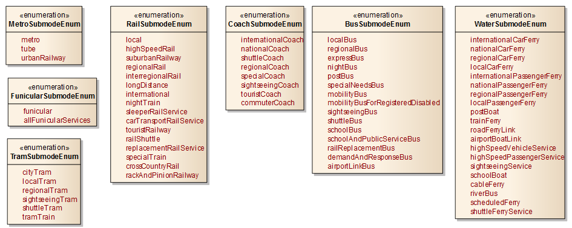
*Sous modes*

Par souci de clarté, les sous-modes ont été classés en relation avec un
mode, toutefois le sous-mode "***tramTrain***" peut être utilisé
indifféremment avec un mode Tram ou un mode Train (Ferré, auquel cas il
faut l'interprété "trainTram").

<div class="table-title">BusSubmodeEnum</div>

| Nom                             | Description                      |
| ------------------------------- | -------------------------------- |
| ***localBus***                  | Bus local                        |
| ***regionalBus***               | Bus régional                     |
| ***expressBus***                | Bus express                      |
| ***nightBus***                  | Bus de nuit                      |
| ***specialNeedsBus***           | Bus pour besoins spéciaux        |
| ***mobilityBus***               | Bus pour handicapé               |
| ***sightseeingBus***            | Bus panoramique                  |
| ***shuttleBus***                | Bus navette                      |
| ***highFrequencyBus***          | Bus à haute fréquence            |
| ***dedicatedLaneBus***          | Bus en site propre               |
| ***schoolBus***                 | Bus scolaire                     |
| ***schoolAndPublicServiceBus*** | Bus scolaire et service régulier |
| ***railReplacementBus***        | Bus de substitution              |
| ***demandAndResponseBus***      | Bus transport à la demande       |
| ***airportLinkBus***            | Bus de terminal aéroportuaire    |

<div class="table-title">CoachSubmodeEnum</div>

| Nom                      | Description                  |
| ------------------------ | ---------------------------- |
| ***internationalCoach*** | Car international            |
| ***nationalCoach***      | Car national                 |
| ***shuttleCoach***       | Navette                      |
| ***regionalCoach***      | Car régional                 |
| ***specialCoach***       | Car spécial                  |
| ***schoolCoach***        | Car scolaire                 |
| ***sightseeingCoach***   | Car touristique avec circuit |
| ***touristCoach***       | Car touristique général      |
| ***commuterCoach***      | Car pour trajets pendulaires |

<div class="table-title">MetroSubmodeEnum</div>

| Nom         | Description |
| ----------- | ----------- |
| ***metro*** | Métro       |

<div class="table-title">RailSubmodeEnum</div>

| Nom                           | Description                                                                                                                                                                                                                                           |
| ----------------------------- | ----------------------------------------------------------------------------------------------------------------------------------------------------------------------------------------------------------------------------------------------------- |
| ***local***                   | Train local                                                                                                                                                                                                                                           |
| ***highSpeedRail***           | <p>Train à grande vitesse</p><p>*Voir ERA B.4.7009 - 8 high speed train: Long distance train formed by a unit capable for high speed running on high speed or normal lines most modern train unit.*</p>                                               |
| ***suburbanRailway***         | <p>Train de banlieue</p><p>*Voir ERA B.4.7009 - 12 subUrban: Regional train organised by the regional government public transport in and around cities, running on its own freeways underground or overground, operational running with signals.*</p> |
| ***regionalRail***            | <p>Train régional</p><p>*See ERA B.4.7009 - 11 Regional: Regional train organised by the regional government even if formed by a unit capable for high speed running on high speed lines.*</p>                                                        |
| ***interregionalRail***       | <p>Train interrégional</p><p>*Voir ERA B.4.7009 - 10 Interregional: Regional train running in more than one region.*</p>                                                                                                                              |
| ***longDistance***            | <p>Train longue distance</p><p>*See ERA B.4.7009 - 9 Intercity: Long distance train formed by a unit capable for high speed or not running on high speed or normal lines modern train unit high quality service restricted stopping pattern.*</p>     |
| ***intermational***           | Train international                                                                                                                                                                                                                                   |
| ***nightTrain***              | <p>Train de nuit</p><p>*Voir ERA B.4.7009 - 13 Night train: Long distance train running overnight offering sleeping facilities (beds and or couchettes).*</p>                                                                                         |
| ***sleeperRailService***      | Service de train couchette                                                                                                                                                                                                                            |
| ***carTransportRailService*** | <p>Service de train de transport de voiture</p><p>*Voir ERA B.4.7009 - 14 Motor rail: Service transporting passenger's motor vehicle passengers are admitted either with vehicle only or with or without vehicle. Service mode.*</p>                  |
| ***touristRailway***          | <p>Train touristique</p><p>*Voir ERA B.4.7009 - 16 Historic train.*</p>                                                                                                                                                                               |
| ***railShuttle***             | Train navette                                                                                                                                                                                                                                         |
| ***rackAndPinionRailway***    | <p>Train à crémaillère</p><p>*Voir ERA B.4.7009 - 15 Mountain train: Local train adapted for running in mountain railway lines.*</p>                                                                                                                  |

<div class="table-title">TramSubmodeEnum</div>

| Nom                   | Description                                                                                                                              |
| --------------------- | ---------------------------------------------------------------------------------------------------------------------------------------- |
| ***cityTram***        | Tram urbain                                                                                                                              |
| ***localTram***       | Tram local                                                                                                                               |
| ***sightseeingTram*** | Tram panoramique                                                                                                                         |
| ***shuttleTram***     | Tram navette                                                                                                                             |
| ***tramTrain***       | TramTrain: Tram pouvant circuler d'un réseau de tramway urbain vers des voies de chemin de fer partagées avec des trains conventionnels. |

<div class="table-title">TelecabinSubmodeEnum</div>

| Nom             | Description  |
| --------------- | ------------ |
| ***telecabin*** | Télécabine   |
| ***cableCar***  | Téléphérique |

<div class="table-title">FunicularSubmodeEnum</div>

| Nom             | Description |
| --------------- | ----------- |
| ***funicular*** | Funiculaire |

<div class="table-title">AirSubmodeEnum</div>

| Nom                          | Description          |
| ---------------------------- | -------------------- |
| ***internationalFlight***    | Vol international    |
| ***domesticFlight***         | Vol national         |
| ***intercontinentalFlight*** | Vol intercontinental |

<div class="table-title">WaterSubmodeEnum</div>

| Nom                               | Description                                                        |
| --------------------------------- | ------------------------------------------------------------------ |
| ***internationalCarFerry***       | Ferry international                                                |
| ***nationalCarFerry***            | Ferry national                                                     |
| ***regionalCarFerry***            | Ferry régional                                                     |
| ***localCarFerry***               | Ferry local                                                        |
| ***internationalPassengerFerry*** | Ferry de transport de passagers international *(pas de véhicules)* |
| ***nationalPassengerFerry***      | Ferry de transport de passagers national *(pas de véhicules)*      |
| ***regionalPassengerFerry***      | Ferry de transport de passagers régional *(pas de véhicules)*      |
| ***localPassengerFerry***         | Ferry de transport de passagers local                              |
| ***riverBus***                    | Bateau-bus sur fleuve ou rivière                                   |

## Institutions

L'INSTITUTION (ORGANISATION) représente une entreprise impliquée dans la
planification, la collecte ou la fourniture d'informations sur les
transports en commun. Par exemple, une entreprise fournissant un service
d'informations sur les transports publics, une autorité, un opérateur ou
une entreprise fournissant un service de collecte d'informations.

Dans le profil, elle est essentiellement utile en tant que superclass
d'OPÉRATEUR et d'AUTORITÉ.

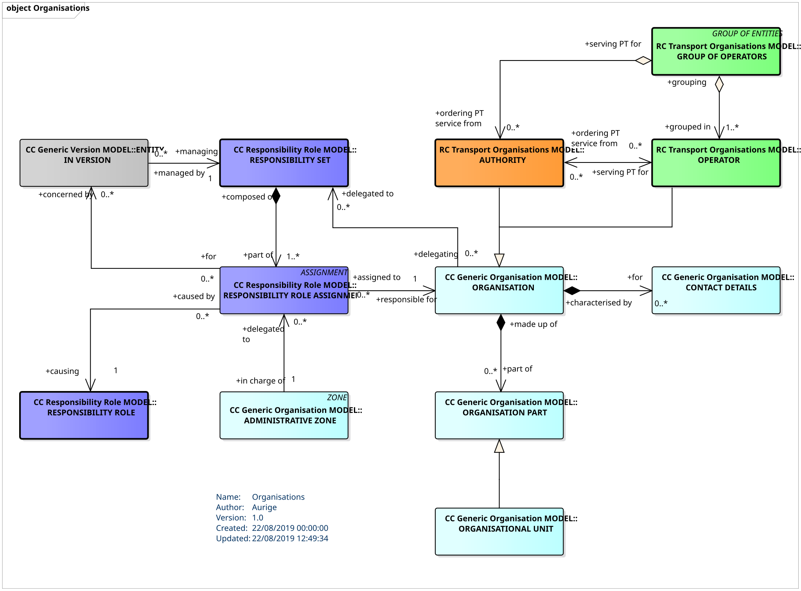
*ORGANISATIONs et responsabilité – Modèle conceptuel*

<div class="table-title">Organisation – Element</div>

|        | Nom                    | Type                     |                                    | Description                                                                                                                                                                                                                                                                                                                                                                                                                                                                 |
| ------ | ---------------------- | ------------------------ | ---------------------------------- | --------------------------------------------------------------------------------------------------------------------------------------------------------------------------------------------------------------------------------------------------------------------------------------------------------------------------------------------------------------------------------------------------------------------------------------------------------------------------- |
| ::>    | ::>                    | *DataManagedObject*      | ::>                                | ORGANISATION hérite de DATA MANAGED OBJECT.                                                                                                                                                                                                                                                                                                                                                                                                                                 |
| «AK»   | ***PublicCode***       | *xsd:normalizedString*   | 0:1                                | Identifiant (code) public de l'INSTITUTION (exemples: STIF, SNCF, etc.)                                                                                                                                                                                                                                                                                                                                                                                                     |
| «AK»   | ***CompanyNumber***    | *xsd:normalizedString*   | 0:1                                | Numéro d'enregistrement de l'institution <mark>(type code transporteur affecté par l'AO, NAO de la norme 99-502 pour les AOT, etc.)</mark>                                                                                                                                                                                                                                                                                                                                  |
|        | ***Name***             | *xsd:normalizedString*   | 0:1                                | Nom de l'ORGANISATION                                                                                                                                                                                                                                                                                                                                                                                                                                                       |
|        | ***ShortName***        | *MultilingualString*     | 0:1                                | Nom court de l'ORGANISATION                                                                                                                                                                                                                                                                                                                                                                                                                                                 |
|        | ***LegalName***        | *MultilingualString*     | 0:1                                | Nom légal de l'ORGANISATION                                                                                                                                                                                                                                                                                                                                                                                                                                                 |
| «cntd» | ***alternativeNames*** | *<u>AlternativeName</u>* | 0:*                                | <p>Nom alternative pour l’ORGANISATION.</p><p>Note : les éventuelles traductions utiliseront **AlternativeText** et non **alternativeNames**.</p>                                                                                                                                                                                                                                                                                                                           |
|        | ***Description***      | *MultilingualString*     | 0:1                                | Texte descriptif associé à l'INSTITUTION.                                                                                                                                                                                                                                                                                                                                                                                                                                   |
|        | ***ContactDetails***   | *ContactDetails*         | 0:1                                | Contact details for ORGANISATION for public use.                                                                                                                                                                                                                                                                                                                                                                                                                            |
| «FK»   | ***OrganisationType*** | *TypeOfOrganisationEnum* | <del>0:1</del><br><mark>1:1</mark> | Type d'organisation codifié : <ul><li>***authority*** : Autorité organisatrice</li><li>***operator*** : Exploitant</li><li>***railOperator*** : Exploitant Ferré</li><li>***railFreightOperator*** : Exploitant fret</li><li>***statutoryBody*** : Collectivité</li><li>***facilityOperator*** : Société de service</li><li>***travelAgent*** : Agence de voyage</li><li>***servicedOrganisation*** : Etablissement de service public</li><li>***other*** : Autre</li></ul> |
| «cntd» | ***parts***            | *OrganisationPart*       | 0:*                                | <p>Ensemble des entités constituant ou faisant partie de l'INSTITUTION (UNITÉ ORGANISATIONELLE ou DÉPARTEMENT).</p><p><mark>Seules les UNITÉs ORGANISATIONELLEs seront utilisées dans le cadre des profils NeTEx.</mark></p>                                                                                                                                                                                                                                                |

<div class="table-title">ContactDetails – Element (objet inclus)</div>

|    | Name                 | Type                   |             | Description                          |
| -- | -------------------- | ---------------------- | ----------- | ------------------------------------ |
|    | ***ContactPerson***  | *xsd:normalizedString* | 0:1         | Nom de la personne de contact.       |
|    | ***Email***          | *EmailAddressType*     | 0:1         | Email de contact au format ISO.      |
|    | ***Phone***          | *PhoneNumberType*      | 0:1         | Numéro de téléphone de contact       |
|    | ***Fax***            | *PhoneNumberType*      | 0:1         | Numéro de fax                        |
|    | ***Url***            | *xsd:anyURI*           | 0:1         | Site web de contact et d'information |
|    | ***FurtherDetails*** | *xsd:string*           | 0:1         | Information en texte libre           |

### Unités organisationnelles

Une unité organisationnelle est un sous ensemble d’une Institution à
laquelle est attribué un ensemble de responsabilités de planification et
de contrôle.

<div class="table-title">OrganisationalUnit – Element</div>

| Classification | Name | Type               | Cardinalité | Description                                      |
| -------------- | ---- | ------------------ | ----------- | ------------------------------------------------ |
| ::>            | ::>  | *OrganisationPart* | ::>         | ORGANISATIONAL UNIT hérite de ORGANISATION PART. |

<div class="table-title">OrganisationPart – Element (abstrait pour le profil)</div>

|        | Name                                   | Type                        |             | Description                                                                                                                                                                 |
| ------ | -------------------------------------- | --------------------------- | ----------- | --------------------------------------------------------------------------------------------------------------------------------------------------------------------------- |
| ::>    | ::>                                    | *DataManagedObject*         | ::>         | ORGANISATION PART hérite de DATA MANAGED OBJECT.                                                                                                                            |
|        | ***Name***                             | *MultilingualString*        | 0:1         | Nom du SOUS ENSEMBLE ORGANISATIONEL                                                                                                                                         |
|        | ***Description***                      | *MultilingualString*        | 0:1         | Description du SOUS ENSEMBLE ORGANISATIONEL.                                                                                                                                |
|        | ***ContactDetails***                   | *ContactDetails*            | 0:1         | Informations de contact du SOUS ENSEMBLE ORGANISATIONEL.                                                                                                                    |
| «cntd» | ***Location***                         | *Location*                  | 0:1         | Localisation du SOUS ENSEMBLE ORGANISATIONEL.                                                                                                                               |
| «FK»   | ***OrganisationRef***                  | *OrganisationRef*           | 0:1         | INSTITUTION à laquelle appartient le SOUS ENSEMBLE ORGANISATIONEL.                                                                                                          |
| «FK»   | ***TypeofOrganisationPartRef***        | *TypeOfOrganisationPartRef* | 0:1         | <p>Référence le type d'UNITÉ ORGANISATIONNELLE.</p><p><mark>On utilisera la reference comme type, mais sans obligation de créer le TYPE DE VALEUR correspondant.</mark></p> |
| «cntd» | ***<mark>AdministrativeZones</mark>*** |                             |             | <mark>On passera par le ResponsibilityRoleAssignment si une ZONE ADMINISTRATIVE doit être référencée.</mark>                                                                |

### Exploitants

L'OPÉRATEUR hérite de l'INSTITUTION, on utilisera un champ
***OrganisationType*** instancié avec ***operator*** ou
***railOperator***.

<div class="table-title">Operator – Element</div>

| Classification | Name                          | Type            |             | Description                                                    |
| -------------- | ----------------------------- | --------------- | ----------- | -------------------------------------------------------------- |
| ::>            | ::>                           | *Organisation*  | ::>         | OPERATOR hérite ORGANISATION.                                  |
|                | ***CountryRef***              | CountryRef      | 0:1         | Code ISO 3166-1 correspondant à la nationalité de l’exploitant |
|                | Address                       | PostalAddress   | 0:1         | Postal ADDRESS of ORGANISATION.                                |
|                | PrimaryMode                   | VehicleModeEnum | 0:1         | Mode de tranport principal de l'opérateur (s'il en a un)       |
|                | CustomerServiceContactDetails |                 |             | <mark>Voir ContactDetails d'ORGANISATION.</mark>               |
|                | ***~~departments~~***         |                 |             | <mark>Voir Parts d'ORGANISATION.</mark>                        |

### Autorités

De même pour décrire une AUTORITÉ ORGANISATRICE, on utilisera une
INSTITUTION avec un champ ***OrganisationType*** instancié avec
***authority***.

### Groupes d'operateurs

Les GROUPEMENTs D'OPÉRATEURS sont aussi des objets à décrire. Toutefois,
le GROUPEMENT D'OPÉRATEURS n'apporte aucun attribut spécifique par
rapport au GROUP OF ENTITIES, on se réfèrera donc à ce dernier pour le
détail des attributs.

## Rôles et affectation de responsabilités

Un ensemble de responsabilités peut être spécifié pour un objet
***DataManagedObject***, notamment afin de spécifier les institutions
responsables de différents rôles de gestion des données, telles que la
création, la maintenance, la distribution ou l'octroi de licence aux
données.

Dans le profil, un ***ResponsibilitySet*** est normalement utilisé au
niveau VERSION FRAME pour s’appliquer à tous les éléments du cadre,
plutôt qu’à des objets individuels (bien que cela reste possible).

Un ***ResponsibilitySet*** est composé d'une ou de plusieurs instances
de ***ResponsibilityRoleAssignment***. Chaque attribution de rôle de
responsabilité attribue un ou plusieurs rôles à une organisation ou à
une partie d'organisation, en ce qui concerne la responsabilité qui lui
incombe relativement aux objets décrits (propriété, planification,
exploitation, etc.) ou la gestion de ces données (distribution, mises à
jour, etc.).

<div class="table-title">ResponsibilitySet – Element</div>

| Classification | Name        | Type                           |             | Description                                                    |
| -------------- | ----------- | ------------------------------ | ----------- | -------------------------------------------------------------- |
| ::>            | ::>         | *DataManagedObject*            | ::>         | RESPONSIBILITY SET hérite de DATA MANAGED OBJECT.              |
| «cntd»         | ***roles*** | *ResponsibilityRoleAssignment* | 1:\*        | AFFECTATIONs de ROLE constituant l'ENSEMBLE DE RESPONSABILITÉ. |

<div class="table-title">ResponsibilityRoleAssignment – Element (objet inclus)</div>

| Classification | Name                              | Type                          |     | Description                                                                                                                                                                                                                                                                                                                |
| -------------- | --------------------------------- | ----------------------------- | --- | -------------------------------------------------------------------------------------------------------------------------------------------------------------------------------------------------------------------------------------------------------------------------------------------------------------------------- |
| ::>            | ::>                               | *VersionedChild*              |     | <p>RESPONSIBILITY ROLE hérite de VERSIONED CHILD.</p><p><mark>Non utilisé quand inclus comme roles de ***ResponsabilitySet*** (l’inclusion est la solution retenue par le profil)</mark></p>                                                                                                                               |
|                | ***Description***                 | *MultilingualString*          | 0:1 | Description textuelle du rôle                                                                                                                                                                                                                                                                                              |
| «PK»           | ***DataRoleType***                | *DataRoleTypeEnum*            | 0:1 | Rôle(s) attribué(s) dans la gestion des données. Les valeurs possibles sont :<ul><li>***collects***</li><li>***validates***</li><li>***aggregates***</li><li>***distributes***</li><li>***redistributes***</li><li>***creates***</li></ul>                                                                                 |
| «PK»           | ***StakeholderRoleType***         | *StakeholderRoleTypeEnum*     | 0:1 | Rôle(s) opérationel(s) attribué(s). Les valeurs possibles sont : <ul><li>***planning***</li><li>***operation***</li><li>***control***</li><li>***reservation***</li><li>***entityLegalOwnership***</li><li>***fareManagement***</li><li>***securityManagement***</li><li>***dataRegistrar***</li><li>***other***</li></ul> |
|                | ***TypeOfResponsibilityRoleRef*** | *TypeOfResponsibilityRoleRef* |     | <p>Référence à un type de responsabilité.</p><p><mark>On utilisera notamment ce champ pour référencer un type de contrat quand cela est nécessaire.</mark></p>                                                                                                                                                             |
| «FK»           | ***ResponsibleOrganisationRef***  | *OrganisationRef*             | 0:1 | Référence l'institution concernée                                                                                                                                                                                                                                                                                          |
| «FK»           | ***ResponsibleAreaRef***          | *AdministrativeZoneRef*       | 0:1 | Référence la zone administrative concernée                                                                                                                                                                                                                                                                                 |

## Notes (*NOTICEs*)

<div class="table-title">Notice – Element</div>

|        | Name                               | Type                   |             | Description                                                                                                                                                                                                                                                                                                                                                                                                                |
| ------ | ---------------------------------- | ---------------------- | ----------- | -------------------------------------------------------------------------------------------------------------------------------------------------------------------------------------------------------------------------------------------------------------------------------------------------------------------------------------------------------------------------------------------------------------------------- |
| ::>    | ::>                                | *DataManagedObject*    | ::>         | NOTICE hérite de DATA MANAGED OBJECT.                                                                                                                                                                                                                                                                                                                                                                                      |
|        | ***Name***                         | *MultilingualString*   | 0:1         | Nom de la NOTE.                                                                                                                                                                                                                                                                                                                                                                                                            |
|        | ***Text***                         | *MultilingualString*   | 0:1         | Texte de la NOTE                                                                                                                                                                                                                                                                                                                                                                                                           |
| «AK»   | ***PublicCode***                   | *xsd:normalizedString* | 1:1         | Code publique de la NOTE <mark>(numéro de renvoi sur la fiche horaire par exemple)</mark>                                                                                                                                                                                                                                                                                                                                  |
| «FK»   | ***TypeOfNoticeRef***              | *TypeOfNoticeRef*      | 1:1         | <p>Type de NOTE.</p><p><mark>On pourra ainsi catégoriser les NOTEs, par exemple :</mark><ul><li><mark>Exception de circulation (sauf…)</mark></li><li><mark>Restriction de circulation (ne circule que …)</mark></li><li><mark>Etc.</mark></li></ul></p><p><mark>Ces codes sont ouverts et sont définis par le producteur des données qui en précisera les valeurs possibles dans sa spécification d'interface.</mark></p> |
|        | ***<mark>CanBeAdvertised</mark>*** |                        |             | <mark>Dans le cadre des profils NeTEx, toutes les notes sont à vocation d'information voyageur et donc publiques.</mark>                                                                                                                                                                                                                                                                                                   |
| «cntd» | ***variants***                     | *DeliveryVariant*      | 0:*         | VARIANTEs DE DIFFUSION pour la note (rédaction adaptée à différents type de médias).                                                                                                                                                                                                                                                                                                                                       |

<div class="table-title">DeliveryVariant – Element (objet inclus)</div>

|      | Name                           | Type                 |     | Description                                                                                                                                                                                                          |
| ---- | ------------------------------ | -------------------- | --- | -------------------------------------------------------------------------------------------------------------------------------------------------------------------------------------------------------------------- |
| ::>  | ::>                            | *DataManagedObject*  | ::> | DELIVERY VARIANT hérite de DATA MANAGED OBJECT.                                                                                                                                                                      |
| «FK» | ***ParentRef***                |                      |     | <mark>Les variantes seront toujours exprimées au sein de la NOTE elle-même.</mark>                                                                                                                                   |
|      | ***DeliveryVariantMediaType*** | *DeliveryMediaEnum*  | 1:1 | Type de média donnant lieu à la VARIANTE DE DIFFUSION de la NOTE. Les valeurs possibles sont : <ul><li>***printed***</li><li>***textToSpeech***</li><li>***web***</li><li>***mobile***</li><li>***other***</li></ul> |
|      | ***VariantText***              | *MultilingualString* | 0:1 | Texte de la VARIANTE DE DIFFUSION (qui remplacera donc la NOTE pour les médias indiqués).                                                                                                                            |

Le tableau ci-dessous présente l'affectation de NOTE: seuls les deux
attributs retenus y sont présentés (l'affectation est très paramétrable,
mais la grande majorité des attributs ne sont pas retenus dans le
profil).

<mark>Les NoticeAssignments doivent être intégré en ligne à
l'élément annoté et non placé séparément. Ils peuvent faire référence à
une NOTICE déjà définie dans un NOTICE ASSIGNMENT antérieur.</mark>

<div class="table-title">Notice Assignment – Element</div>

|      | Name                         | Type                           |     | Description                                                                                                                                                                     |
| ---- | ---------------------------- | ------------------------------ | --- | ------------------------------------------------------------------------------------------------------------------------------------------------------------------------------- |
| ::>  | ::>                          | *<u>DataManagedObject</u>*     | ::> | NOTICE ASSIGNMENT inherits from DATA MANAGED OBJECT.                                                                                                                            |
| «PK» | ***id***                     | *TypeOfNoticeAssignmentIdType* | 1:1 | Identifiant du NOTICE ASSIGNMENT.                                                                                                                                               |
| «FK» | a : ***NoticeRef***          | *NoticeRef*                    | 0:1 | Reference à une NOTE                                                                                                                                                            |
|      | c : ***Notice***             | *<u>Notice</u>*                | 0:1 | <p>Description de la NOTE elle même.</p><p><mark>On préférera toujours ***Notice*** à ***NoticeRef*** (utilisez uniquement ***NoticeRef*** pour les NOTEs partagés).</mark></p> |
| «FK» | ***NoticedObjectRef***       | *VersionOfObjectRef*           | 0:1 | Objet auquel la NOTE est associée. Si donné par le contexte peut être omis.                                                                                                     |
| «FK» | ***StartPointInPatternRef*** | *PointInSequenceRef*           | 0:1 | POINT à partir duquel la NOTE devient applicatble (dans un PARCOURS).                                                                                                           |
| «FK» | ***EndPointInPatternRef***   | *PointInSequenceRef*           | 0:1 | POINT à partir duquel la NOTE n’est plus applicatble (dans un PARCOURS).                                                                                                        |

## Jour d’exploitation

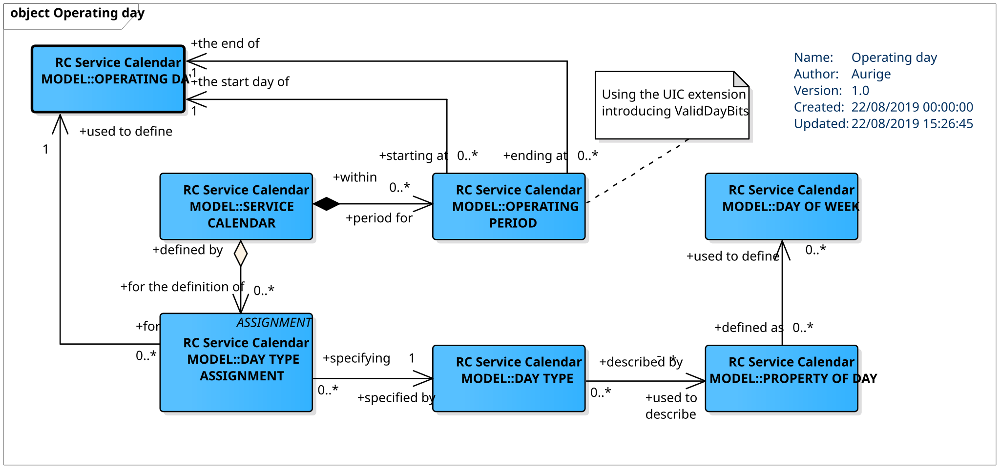
*OPERATING DAY et DAY TYPE – Model conceptuel*

<div class="table-title">OperatingDay – Element</div>

|      | Name                     | Type                 |     | Description                                                                                                                                                                                                                                                                                                                                                                                                                                   |
| ---- | ------------------------ | -------------------- | --- | --------------------------------------------------------------------------------------------------------------------------------------------------------------------------------------------------------------------------------------------------------------------------------------------------------------------------------------------------------------------------------------------------------------------------------------------- |
| ::>  | ::>                      | *DataManagedObject*  | ::> | OPERATING DAY hérite de DATA MANAGED OBJECT.                                                                                                                                                                                                                                                                                                                                                                                                  |
|      | ***CalendarDate***       | *xsd:date*           | 1:1 | <p>Date calendaire de la JOURNÉE D'EXPLOITATION.</p><p><mark>Il s'agit ici du jour calendaire où démarre la JOURNÉE D'EXPLOITATION, l'heure de début et la durée de la journée étant précisées par les autres paramètres.</mark></p>                                                                                                                                                                                                          |
| «FK» | ***ServiceCalendarRef*** | *CalendarRef*        | 0:1 | <p>CALENDRIER DE SERVICE auquel appartient la JOURNÉE D'EXPLOITATION.</p><p><mark>Note : une même journée calendaire peut être couverte par différentes JOURNÉE D'EXPLOITATION (pour différents exploitants, ou différentes modalités d'exploitation, comme par exemple NOCTILIEN (bus de nuit à Paris) et bus RATP). On recommandera toutefois dans ce cas d'affecter ces jours "redondants" à différents CALENDRIERs DE SERVICE.</mark></p> |
|      | ***Name***               | *MultilingualString* | 0:1 | Nom de la JOURNÉE D'EXPLOITATION                                                                                                                                                                                                                                                                                                                                                                                                              |
|      | ***EarliestTime***       | *xsd:time*           | 1:1 | Heure de début de la JOURNÉE D'EXPLOITATION                                                                                                                                                                                                                                                                                                                                                                                                   |
|      | ***DayLength***          | *xsd:duration*       | 1:1 | <p>Durée de la JOURNÉE D'EXPLOITATION.</p><p><mark>Une JOURNÉE D'EXPLOITATION peut durer plus de 24h (pas de limite supérieure).</mark></p>                                                                                                                                                                                                                                                                                                   |

## Type de Jour

**Note** : si le TYPE DE JOUR n'est valable que pour une période de temps
limitée, on le précisera grâce au *ValidBetween* (*FromDate*, *ToDate*)
disponible au travers de son héritage de *DataManagedObject.*

<div class="table-title">DayType – Model Element</div>

| Classification | Name               | Type                 |             | Description                                                                                                                                                                                                                                                                                                         |
| -------------- | ------------------ | -------------------- | ----------- | ------------------------------------------------------------------------------------------------------------------------------------------------------------------------------------------------------------------------------------------------------------------------------------------------------------------- |
| ::>            | ::>                | *DataManagedObject*  | ::>         | <p>DAY TYPE hérite de DATA MANAGED OBJECT.</p><p><mark>On utilisera le ***ValidBetween*** pour une éventuelle limitation de période</mark></p>                                                                                                                                                                      |
|                | ***Name***         | *MultilingualString* | 0:1         | Nom du TYPE DE JOUR.                                                                                                                                                                                                                                                                                                |
|                | ***Description***  | *MultilingualString* | 0:1         | Description du TYPE DE JOUR.                                                                                                                                                                                                                                                                                        |
|                | ***EarliestTime*** | *xsd:time*           | 0:1         | <p>Heure de début de validité dans le TYPE DE JOUR.</p><p><mark>Exclusif avec ***timebands***</mark></p>                                                                                                                                                                                                            |
|                | ***DayLength***    | *xsd:duration*       | 0:1         | <p>Durée du TYPE DE JOUR.</p><p><mark>Exclusif avec ***timebands***</mark></p>                                                                                                                                                                                                                                      |
| «cntd»         | ***properties***   | *PropertyOfDay*      | 0:*         | <p>PROPRIÉTÉ du TYPE DE JOUR.</p><p>Voir ci-après pour son usage.</p>                                                                                                                                                                                                                                               |
| «cntd»         | ***timebands***    | *Timeband*           | 0:*         | <p>TRANCHEs HORAIREs du TYPE DE JOUR</p><p><mark>On utilisera ces TRANCHEs HORAIREs uniquement si elles sont multiples (par exemple "de 9h à 12h30 et de 14h à 18h30") sinon on utilisera ***EarliestTime*** et ***DayLength***.</mark></p><p><mark>Exclusif avec ***EarliestTime*** et ***DayLength***.</mark></p> |

Note concernant ***properties*** : sous un même PropertyOfDay les
caractéristiques s'associent par un ET, sinon elles s'associent par un OU.

Ainsi pour désigner l'été et les samedis :

```xml
<netex:PropertyOfDay>
  <netex:DaysOfWeek>Saturday</netex:DaysOfWeek>
</netex:PropertyOfDay>
<netex:PropertyOfDay>
  <netex:Seasons>Summer</netex:Seasons>
</netex:PropertyOfDay>
```

Mais pour désigner les samedis d'été :

```xml
<netex:PropertyOfDay>
  <netex:DaysOfWeek>Saturday</netex:DaysOfWeek>
  <netex:Seasons>Summer</netex:Seasons>
</netex:PropertyOfDay>
```

<div class="table-title">PropertyOfDay – Element (objet inclus)</div>

| Classification | Name               | Type                         |             | Description                                                                                                                                                |
| -------------- | ------------------ | ---------------------------- | ----------- | ---------------------------------------------------------------------------------------------------------------------------------------------------------- |
|                | ***Name***         | *MultilingualString*         | 0:1         | Nom de la PROPRIÉTÉ DE JOUR.                                                                                                                               |
|                | ***Description***  | *MultilingualString*         | 0:1         | Description de la PROPRIÉTÉ DE JOUR.                                                                                                                       |
| «FK»           | ***DaysOfWeek***   | *DayOfWeekEnum*              | 0:7         | <p>Jours de la semaine affectés à la PROPRIÉTÉ DE JOUR.</p><p>Tous les jours par défaut.</p>                                                               |
|                | ***WeeksOfMonth*** | *WeekOfMonthEnum*            | 0:5         | <p>Numéros de semaine dans le mois (1-5) affectés à PROPRIÉTÉ DE JOUR.</p><p>Toutes les semaines par défaut.</p>                                           |
| Choice         | ***MonthOfYear***  | *month*                      | 0:1         | Mois de la PROPRIÉTÉ DE JOUR.                                                                                                                              |
|                | ***DayOfYear***    | *monthDay*                   | 0:1         | Jour dans l'année affecté à la PROPRIÉTÉ DE JOUR (par exemple "tous les 1er avril")                                                                        |
|                | ***CountryRef***   | *CountryEnum*                | 0:*         | Pays pour lequel les jours de vacances doivent-être considérés.                                                                                            |
|                | ***HolidayTypes*** | *HolidayTypeEnum*            | 0:5         | Type de vacance de la PROPRIÉTÉ DE JOUR (voir liste ci-dessous).                                                                                           |
|                | ***Seasons***      | *SeasonEnum*                 | 0:4         | Saison de la PROPRIÉTÉ DE JOUR.                                                                                                                            |
|                | ***Tides***        | *TideEnum*                   | 0:4         | <p>Type de marée de la PROPRIÉTÉ DE JOUR.</p><p><mark>Attention, cette classification restreint à une partie de la journée (marée haute, etc.).</mark></p> |
|                | ***DayEvent***     | *<u>DayEventEnumeration</u>* | 0:1         | Événement particulier associé à la PROPRIÉTÉ DE JOUR.                                                                                                      |
|                | ***Crowding***     | *<u>CrowdingEnumeration</u>* | 0:1         | Niveau de charge pour le jour concerné : <ul><li>*veryQuiet*</li><li>*quiet*</li><li>*normal*</li><li>*busy*</li><li>*veryBusy*</li></ul>                  |

Les énumérations correspondantes sont les suivantes (noter que l'on
n'utilisera pas les valeurs ***anyXxx*** ou ***everyXxx***, qui sont les
valeurs par défaut quand le champ est absent).

<div class="table-title">DayOfWeekEnum – valeurs autorisées</div>

| Nom       | Description |
| --------- | ----------- |
| Monday    | Lundi       |
| Tuesday   | Mardi       |
| Wednesday | Mercredi    |
| Thursday  | Jeudi       |
| Friday    | Vendredi    |
| Saturday  | Samedi      |
| Sunday    | Dimanche    |

<div class="table-title">WeekOfMonthEnum – valeurs autorisées</div>

| Nom | Description               |
| --- | ------------------------- |
| 1   | Première semaine du mois  |
| 2   | Seconde semaine du mois   |
| 3   | Troisième semaine du mois |
| 4   | Quatrième semaine du mois |
| 5   | Cinquième semaine du mois |

<div class="table-title">HolidayTypeEnum – valeurs autorisées</div>

| Nom                          | Description                               |
| ---------------------------- | ----------------------------------------- |
| ***SchoolDay***              | Jour d'école                              |
| NotHoliday                   | Jour hors vacances                        |
| AnyHoliday                   | N'importe quel type de jour de vancances. |
| LocalHoliday                 | Jour de vancance local                    |
| NationalHoliday              | Jour de vancance national                 |
| ***RegionalHoliday***        | Jour de vancance régional                 |
| ***HolidayDisplacementDay*** | Jour de départ ou retour en vacances      |
| ***EveOfHoliday***           | Veille de vacances                        |

<div class="table-title">SeasonEnum – valeurs autorisées</div>

| Nom    | Description |
| ------ | ----------- |
| Spring | Printemps   |
| Summer | Été         |
| Autumn | Automne.    |
| Winter | Hiver.      |

<div class="table-title">TideEnum – valeurs autorisées</div>

| Nom      | Description  |
| -------- | ------------ |
| HighTide | Marée haute  |
| LowTide  | Marée basse  |
| NeapTide | Grande marée |

<div class="table-title">DayEventEnumeration – valeurs autorisées</div>

| Nom             | Description                                                     |
| --------------- | --------------------------------------------------------------- |
| ***marketDay*** | Jour de marché                                                  |
| ***matchDay***  | Jour de match (ou évènement sportif)                            |
| ***eventDay***  | Jour d'évènement (préciser dans la description du type de jour) |

Dans un certain nombre de situations, les PROPRIÉTÉ DE JOUR ne permettent
pas de décrire précisément un TYPE DE JOUR, qui en final ne sera défini
que par un ensemble de JOURs D'EXPLOITATION: on réalise alors une
affectation entre le TYPE DE JOUR et les JOURs D'EXPLOITATION
correspondants.

<div class="table-title">DayTypeAssignment – Element</div>

| Classification | Name                                             | Type              |             | Description                                                                                                                                                                                                                         |
| -------------- | ------------------------------------------------ | ----------------- | ----------- | ----------------------------------------------------------------------------------------------------------------------------------------------------------------------------------------------------------------------------------- |
| ::>            | ::>                                              | *VersionedChild*  | ::>         | DAY TYPE ASSIGNMENT hérite de VERSIONED CHILD.                                                                                                                                                                                      |
| «FK»           | ***ServiceCalendarRef***                         | *CalendarRef*     | 0:1         | CALENDRIER DE SERVICE auquel l'affectation de TYPE DE JOUR appartient.                                                                                                                                                              |
|                | Choice (seul un de ces éléments est obligatoire) |                   |             |                                                                                                                                                                                                                                     |
| «FK»           | a : ***OperatingPeriodRef***                     | *OperatingDayRef* | 1:1         | Référence à une PÉRIODE D'EXPLOITATION assignée: noter que tous les jours de la période s'applique (de ce fait on l'utilisera le plus souvent pour les exclusions de périodes en combinaison avec le champ ***isAvailable=false***) |
| «FK»           | b : ***OperatingDayRef***                        | *OperatingDayRef* | 1:1         | Référence au JOUR D'EXPLOITATION correspondant.                                                                                                                                                                                     |
|                | c : ***Date***                                   | *xsd:date*        | 1:1         | Une date calendaire peut être utilisée à la place du JOUR D'EXPLOITATION correspondant (si l'on n'utilise aucune caractéristique propre au jour d'exploitation)                                                                     |
| «FK»           | ***DayTypeRef***                                 | *DayTypeRef*      | 1:1         | Référence le TYPE DE JOUR concerné                                                                                                                                                                                                  |
|                | ***isAvailable***                                | *boolean*         | 0:1         | Vrai (disponible par défaut) : cet attribut permet d'exprimer les exceptions (sauf le 1er avril…).                                                                                                                                  |

Le CALENDIER DE SERVICE permet de grouper des JOURs D'EXPLOITATION et
des AFFECTATIONs DE JOUR d'exploitation. On pourra ainsi, en conservant
le même TYPE DE JOUR, faire des mises à jour de calendrier en
transmettant uniquement une mise à jour du CALENDRIER DE SERVICE (ou un
nouveau CALENDRIER DE SERVICE).

<div class="table-title">ServiceCalendar – Element</div>

|        | Nom                      | Type                  |      | Description                                                        |
| ------ | ------------------------ | --------------------- | ---- | ------------------------------------------------------------------ |
| ::>    | ::>                      | *DataManagedObject*   | ::>  | SERVICE CALENDAR hérite de DATA MANAGED OBJECT.                    |
|        | ***Name***               | *MultilingualString*  | 0:1  | Nom du CALENDRIER DE SERVICE.                                      |
|        | ***FromDate***           | *xsd:date*            | 0:1  | Date (inclusive) du début du CALENDRIER DE SERVICE.                |
|        | ***ToDate***             | *xsd:date*            | 0:1  | Date (inclusive) de fin du CALENDRIER DE SERVICE.                  |
| «cntd» | ***dayTypes***           | *DayType*             | 0:\* | TYPEs DE JOURs du CALENDRIER DE SERVICE.                           |
| «cntd» | ***operatingDays***      | *OperatingDay*        | 0:\* | JOURs D'EXPLOITATION du CALENDRIER DE SERVICE.                     |
| «cntd» | ***operatingPeriods***   | *OperatingPeriod*     | 0:\* | AFFECTATIONs des PÉRIODEs D'EXPLOITATION du CALENDRIER DE SERVICE. |
| «cntd» | ***dayTypeAssignments*** | *DayTypeAssignment*   | 0:\* | AFFECTATIONs DE JOUR du CALENDRIER DE SERVICE.                     |

<div class="table-title">OperatingPeriod – Element</div>

|      | Nom                | Type                |     | Description                                         |
| ---- | ------------------ | ------------------- | --- | --------------------------------------------------- |
| ::>  | ::>                | *DataManagedObject* | ::> | OPERATING PERIOD hérite de DATA MANAGED OBJECT.     |
| «FK» | ServiceCalendarRef | CalendarRef         | 0:1 | CALENDRIER DE SERVICE auquel la période appartient. |
|      | b : ***FromDate*** | dateTime            | 1:1 | Date calendaire de début                            |
|      | b : ***ToDate***   | dateTime            | 1:1 | Date calendaire de fin                              |

<mark>Note : ***UicOperatingPeriod*** sera toujours utilisé dans le contexte du
profil, afin de rendre le ValidDayBits obligatoire (chaîne de bits, une pour
chaque jour de la période: qu'elle soit valide ou non le jour).</mark>

<div class="table-title">UicOperatingPeriod – Element</div>

| Classification | Name               | Type                     |             | Description                                                                                                                                                                                                               |
| -------------- | ------------------ | ------------------------ | ----------- | ------------------------------------------------------------------------------------------------------------------------------------------------------------------------------------------------------------------------- |
| ::>            | ::>                | *<u>OperatingPeriod</u>* | ::>         | UIC OPERATING PERIOD inherits from OPERATING PERIOD.                                                                                                                                                                      |
|                | ***ValidDayBits*** | *xsd:normalizedString*   | 1:1         | String of bits (built of "0" and "1"), one for each day in the period: whether valid or not valid on the day. Normally there will be a bit for every day between start and end date. If bit is missing, assume available. |
|                | ***DaysOfWeek***   | *DaysOfWeek*             | 0:1         | Days of week to which correspond. (up to first seven) bits                                                                                                                                                                |

## Tranche horaire

<div class="table-title">Timeband – Element (objet inclus)</div>

| Classification | Nom             | Type                |             | Description                                                                                                                                                  |
| -------------- | --------------- | ------------------- | ----------- | ------------------------------------------------------------------------------------------------------------------------------------------------------------ |
| ::>            | ::>             | *DataManagedObject* | ::>         | TIME BAND hérite de DATA MANAGED OBJECT.                                                                                                                     |
|                | ***StartTime*** | *xsd:time*          | 1:1         | heure de début (inclusif).                                                                                                                                   |
|                | ***EndTime***   | *xsd:time*          | 1:1         | heure de fin (inclusif).                                                                                                                                     |
|                | ***DayOffset*** | *xsd:integer*       | 0:*         | <p>Décalage de jour si l'heure de fin n'est pas le même jour que l'heure de début (1=le lendemain, 2=le surlendemain, etc.)</p><p>Valeur par défaut : 0.</p> |

## Type de Valeur

Les types de valeur sont utiles pour préciser et personnaliser toutes
les codifications ouvertes (TypeOfXxxxx, comme les ***TypeOfNoticeRef***
par exemple).

<div class="table-title">TypeOfValue – Element (abstrait)</div>

| Classification | Nom               | Type                 |     | Description                                  |
| -------------- | ----------------- | -------------------- | --- | -------------------------------------------- |
| ::>            | ::>               | *DataManagedObject*  | ::> | TYPE OF VALUE hérite de DATA MANAGED OBJECT. |
|                | ***Name***        | *MultilingualString* | 0:1 | Nom du TYPE DE VALEUR.                       |
|                | ***Description*** | *MultilingualString* | 0:1 | Description du TYPE OF VALUE.                |
|                | ***Image***       | *anyURI*             | 0:1 | Image associée au TYPE OF VALUE.             |
|                | ***Url***         | *anyURI*             | 0:1 | URL associée au TYPE OF VALUE.               |

## Presentation

La Présentation fournit des informations de graphisme et de style de
représentation associés à un objet (couleurs, police de caractère,
etc.).

<div class="table-title">Presentation – Type (objet inclus)</div>

| Classification | Name                       | Type                   |     | Description                                                                        |
| -------------- | -------------------------- | ---------------------- | --- | ---------------------------------------------------------------------------------- |
|                | ***Colour***               | *ColourValue*          | 0:1 | Couleur <mark>(format RVB)</mark>                                                  |
|                | ***ColourName***           | *xsd:normalizedString* | 0:1 | Nom de la couleur                                                                  |
|                | ***BackGroundColour***     | *ColourValueType*      | 0:1 | Valeur RVB de la couleur de fond (par exemple la couleur de la ligne de transport) |
|                | ***BackgroundColourName*** | *xsd:String*           | 0:1 | Nom de la couleur de fond dans le *ColourSystem*.                                  |
|                | ***TextColour***           | *ColourValue*          | 0:1 | Couleur du texte <mark>(format RVB)</mark>                                         |
|                | ***TextColourName***       | *xsd:normalizedString* | 0:1 | Nom de la couleur du texte                                                         |
|                | TextFont                   | *xsd:normalizedString* | 0:1 | Identifiant de la police de caractère                                              |
|                | ***TextFontName***         | *xsd:normalizedString* | 0:1 | Nom de la police de caractère                                                      |
|                | ***InfoLink***             | *InfoLink*             | 0:1 | URL d'un élément graphique de représentation (généralement une icône).             |

## Branding

Le Branding correspond aux informations permettant la description des
marques.

<div class="table-title">Branding – Element (objet inclus)</div>

| Classification | Nom                | Type                    |     | Description                                                                   |
| -------------- | ------------------ | ----------------------- | --- | ----------------------------------------------------------------------------- |
| ::>            | ::>                | *DataManagedObject*     | ::> | BRANDING hérite de TYPE OF VALUE.                                             |
|                | ***Presentation*** | *PresentationStructure* | 0:1 | Informations de graphisme et de style de représentation associés à la marque. |

# Entêtes NeTEx

## *PublicationDelivery*

Les données échangées avec NeTEx sont systématiquement accompagnées d’un
entête qui permet de décrire le contenu du jeu de données et précise le
contexte de leur publication (on peut parler de « métadonnées » à ce
niveau).

L’entête lui-même (*PublicationDelivery* présenté ci-dessous) est
directement suivi des données (*payload*), ces données étant
généralement regroupées dans un CADRE DE VERSION (VERSION FRAME). Ce
CADRE DE VERSION permet de grouper un ensemble de versions des données :
on n’échange en effet pas la donnée (ENTITY) elle-même, mais une version
particulière de ces données (ENTITY IN VERSION). Il convient donc, lors
d’un échange, de fournir des données dans des versions cohérentes les
unes avec les autres. Ce CADRE DE VERSION peut naturellement être soumis
à des CONDITIONs de VALIDITÉ. On pourra par la suite effectuer des mises
à jour mineures de versions d’objets individuelles (ne remettant pas en
question la cohérence globale de l’ensemble) ou fournir une nouvelle
version de ce CADRE DE VERSION, en particulier quand les relations entre
les objets sont impactées par les modifications apportées.

NeTEx fournit un certain nombre de CADREs DE VERSION prédéfinis, mais
permet aussi de définir des CADREs DE VERSION spécifiques. C’est cette
seconde option qui est retenue pour le présent profil. Ces CADREs
spécifiques sont décrits dans les lignes ci-dessous.

<div class="table-title">PublicationDelivery</div>

| Classification         | Nom                              | Type                          |     | Description                                                                                                                                                                                                                                   |
| ---------------------- | -------------------------------- | ----------------------------- | --- | --------------------------------------------------------------------------------------------------------------------------------------------------------------------------------------------------------------------------------------------- |
|                        | ***version***                    | *xsd:NMTOKEN*                 |     | <p>Identifiant de la version de NeTEx utilisée.</p><p>*Voir 7.5*</p>                                                                                                                                                                          |
| PublicationHeaderGroup | ***PublicationTimestamp***       | *xsd:dateTime*                | 1:1 | Date et heure de publication des données                                                                                                                                                                                                      |
| PublicationHeaderGroup | ***ParticipantRef***             | *ParticipantCodeType*         | 1:1 | Identifiant du système ayant produit la donnée. De manière générale il sera identique au DATA SOURCE, mais il arrive que plusieurs systèmes soient constitutifs d’une même source de données: il est alors utile de pouvoir les différencier. |
| PublicationHeaderGroup | ***PublicationRequest***         | *PublicationRequestStructure* | 0:1 | Description de la requête ayant donné lieu à la publication. <mark>Ce champ ne sera utilisé que dans le cadre d’une réponse dans le contexte d’un appel de web service (voir 8.2).</mark>                                                     |
| PublicationHeaderGroup | ***PublicationRefreshInterval*** | *xsd:duration*                | 0:1 | Période normale de rafraichissement des données (espace normal entre deux mises à jour) pour les CADREs DE VERSION contenus dans le jeu de données.                                                                                           |
| PublicationHeaderGroup | ***Description***                | *xsd:normalizedString*        | 0:1 | Texte décrivant les données contenues                                                                                                                                                                                                         |
| PayloadGroup           | ***dataObjects***                | *dataObjects_RelStructure*    | 0:1 | Données échangées dans un contexte de CADRE DE VERSION.                                                                                                                                                                                       |

## Frames (CADRE DE VERSION)

Une **VersionFrame** fournit un conteneur versionnable qui permet
d'échanger un ensemble cohérent d'éléments connexes correspondant, par
exemple aux horaires d'une ligne, ou aux gares d'un pays. La
**VersionFrame** garantit notamment la cohérence des versions des objets
en relation les uns avec les autres.

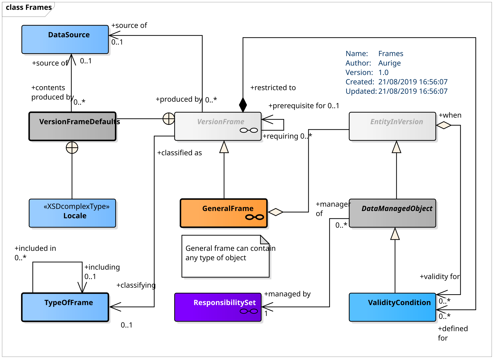
*FRAMEs – Modèle conceptuel*

Formant un ensemble cohérent d'éléments connexes (c'est-à-dire un
ensemble complet d'éléments tous de version compatible), les FRAMEs sont
fortement liés à la gestion des versions. Chaque instance VERSION FRAME
a également une ou plusieurs VALIDITY CONDITION qui lui sont attachées
(puisqu'il s'agit d'un ***DataManagedObject*** à part entière qui est
utilisé pour exprimer la validité du cadre et de son contenu dans son
ensemble).

Notez que ces conditions de validité du VERSION FRAME ne doivent pas
être confondues avec **contentValidityConditions** qui sont des
conditions de validité plus spécifiques qui s'appliquent à plusieurs
éléments dans le cadre (conditions de validité partagées qui seront
référencées par les objets eux même). <mark>Dans le cadre du
profil, les conditions de validité du VERSION FRAME viennent limiter la
validité des objets (un objet n’est plus considéré comme valide avant ou
après la période de la FRAME qui le contient).</mark>

***VersionFrame*** lui-même est abstrait : NeTEx fournit un ensemble de
cadres « spécifiques » spécialisés à des fins spécifiques (ServiceFrame,
***SiteFrame,*** etc.) couvrant chacun un sous-ensemble fonctionnel des
éléments de données NeTEx; ainsi qu'un ***GeneralFrame*** qui peut
contenir n'importe quel type d'ENTITY IN VERSION.

Une ***VersionFrame*** peut se voir attribuer une ***TypeOfFrame***; une
classification arbitraire définie par l'utilisateur (et qui est ici
utilisée pour identifier le profil).

La figure ci-dessous présente l’ensemble des CADREs DE VERSION prédéfini
dans NeTEx ainsi que le *GeneralFrame* qui est utilisé ici avec un type
de CADRE spécifique pour chaque partie du profil France (voir plus bas).

**NOTE IMPORTANTE**: Pour chaque export, les identifiants des CADREs de VERSION
(FRAME) doivent être uniques.

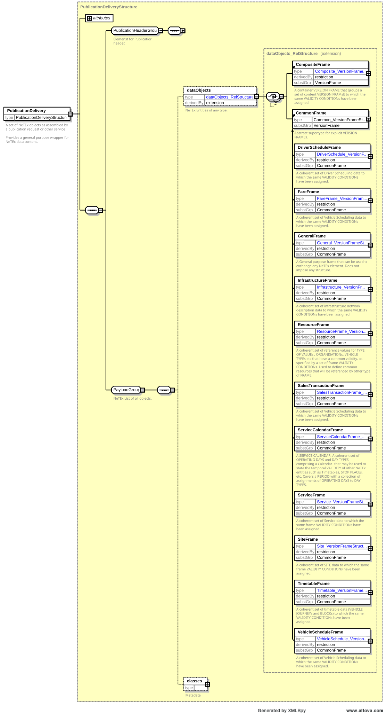
*predefined Frames– XSD*

<div class="table-title">VersionFrame – Element</div>

|        | Nom                             | Type                 |     | Description                                                                                                                                                                                                                                                                                                            |
| ------ | ------------------------------- | -------------------- | --- | ---------------------------------------------------------------------------------------------------------------------------------------------------------------------------------------------------------------------------------------------------------------------------------------------------------------------- |
| ::>    | ::>                             | *DataManagedObject*  | ::> | VERSION FRAME hérite de DATA MANAGED OBJECT.                                                                                                                                                                                                                                                                           |
|        | ***Name***                      | *MultilingualString* | 0:1 | Nom du VERSION FRAME.                                                                                                                                                                                                                                                                                                  |
|        | ***Description***               | *MultilingualString* | 0:1 | Description du VERSION FRAME.                                                                                                                                                                                                                                                                                          |
| «FK»   | ***TypeOfFrameRef***            | *TypeOfFrameRef*     | 0:1 | <p>Référence au TYPE OF VERSION FRAME utilisé.</p><p><mark>Imposé à NETEX_COMMUN, NETEX_ARRET, NETEX_LIGNE, NETEX_RESEAU, NETEX_HORAIRE, NETEX_CALENDRIER, NETEX_TARIF pour les GeneralFrame et pour les CompositeFrame on utilisera NETEX_FRANCE, NETEX_LIGNE ou NETEX_N_LIGNE.</mark></p>                            |
| «FK»   | ***BaselineVersionFrameRef***   | *VersionRef*         | 0:1 | <p>Identifiant du CADRE DE VERSION précédemment échangé et nécessaire pour utiliser celui-ci.</p><p>Cet attribut permet de faire des mises à jour d’un cadre de version sans avoir à l’échanger dans son intégralité.</p>                                                                                              |
| «cntd» | ***codespaces***                | *Version*            | 0:* | <p>CODESPACEs utilisé dans le CADRE DE VERSION. Normalement, il y en a au moins un. Une valeur par défaut peut être précisée par le ***FrameDefaults***.</p><p><mark>NOTE : Le ***codespace*** est utilisé par le profil, et il est spécifié par le ***FrameDefaults***.</mark></p><p><mark>Voir ci-dessous</mark></p> |
| «cntd» | ***FrameDefaults***             | *FrameDefaults*      | 0:1 | Ensemble de valeurs par défaut qu’il sera inutile de répéter pour chaque élément (un élément particulier garde toutefois la possibilité de définir ses propres valeurs, qui sont alors prioritaires sur celles du FrameDefaults).                                                                                      |
| «cntd» | ***prerequisites***             | *VersionFrameRef*    | 0:* | Références à d’autre VERSION FRAME dont dépend celle-ci (typiquement contenant des objets référencés par cette FRAME).                                                                                                                                                                                                 |
| «cntd» | ***contentValidityConditions*** | *ValidityCondition*  | 0:* | CONDITIONS DE VALIDITE partagées par les différents éléments contenus dans le CADRE. <mark>On utilisera uniquement le ***ValidBetween*** comme indiqué en 6.9</mark>                                                                                                                                                   |

<div class="table-title">GeneralFrame</div>

| Classification | Nom           | Type            | Cardinalité | Description                           |
| -------------- | ------------- | --------------- | ----------- | ------------------------------------- |
| ::>            | ::>           | *VersionFrame*  | ::>         | GENERAL FRAME hérite de VERSION FRAME |
|                | ***members*** | *EntityInFrame* | 0:\*        | Contenu du GENERAL FRAME              |

<div class="table-title">VersionFrameDefaults – Element (objet inclus)</div>

|      | Nom                               | Type                   |     | Description                                                                                      |
| ---- | --------------------------------- | ---------------------- | --- | ------------------------------------------------------------------------------------------------ |
| «FK» | ***DefaultCodeSpaceRef***         | *CodeSpaceRef*         | 0:1 | Codespace par défaut (voir 7.3) qui sera utilisé pour tous les éléments qui ne le précisent pas. |
| «FK» | ***DefaultDataSourceRef***        | *DataSourceRef*        | 0:1 | Source de données par défaut (pour tous les éléments qui ne le précisent pas)                    |
| «FK» | ***DefaultResponsibilitySetRef*** | *ResponsibilitySetRef* | 0:1 | RESPONSIBILITY SET par défaut (pour tous les éléments qui ne le précisent pas)                   |
|      | ***DefaultLocale***               | *Locale*               | 0:1 | Valeur de LOCALE par défaut (pour tous les éléments qui ne le précisent pas)                     |
|      | ***DefaultLocationSystem***       | *xsd:normalizedString* | 0:1 | Système de localisation par défaut (pour tous les éléments qui ne le précisent pas)              |

<mark>Dans le cadre du profil les distances et les longueurs sont par défaut
exprimées en mètres (*SystemOfUnits* ayant une valeur *SiMetres*) et les sommes
d’argent en Euros.</mark>

<div class="table-title">TypeOfFrame – Élément</div>

|        | Nom           | Type                           |     | Description                                                                                     |
| ------ | ------------- | ------------------------------ | --- | ----------------------------------------------------------------------------------------------- |
| ::>    | ::>           | *TypeOfValueDataManagedObject* | ::> | <p>TYPE OF FRAME hérite de TYPE OF VALUE.</p><p><mark>L'Id est imposé à NETEX_RESEAU</mark></p> |
| «cntd» | ***classes*** | *ClassInContextRef*            | 0:* | Liste des classes pouvant être contenues dans ce TYPE OF FRAME.                                 |

Chaque partie du profil France décrit les frames associées et la valeur
spécifique du type de Frame à utiliser, et le chapitre 7.4 du présent document
rappelle les différentes valeurs.

## CODESPACE et codification des identifiants

NeTEx propose un mécanisme de CODESPACE (à mettre en parallèle avec les
Namespace XML) qui permet de qualifier les identifiants et d’en assurer
ainsi l’unicité même si plusieurs sources de données non coordonnées
sont mises à contributions. En général, un CODESPACE est associé à un
fournisseur de données.

Un CODESPACE est défini comme une expression de chemin d’accès conforme
à la description d’un domaine internet, suivant la recommandation du
IANA (Internet Assigned Numbers Authority) qui permet d’assurer un
enregistrement de domaine garantissant l’unicité. À titre d’exemple, on
peut citer: *tfl.gov.uk*, *bahn.de*, *ratp.fr*, *foo.com*, ou *sbb.de*.

À chaque CODESPACE est attribué un identifiant qui sera utilisé dans le
document XML après avoir été déclaré dans les CODESPACEs du CADRE DE
VERSION.

EXEMPLE de définition de CODESPACE

```xml
<CompositeFrame version="any" id="mybus:CompositeFrame:CF1">
  <!--- ======= CODESPACEs======== -->
  <codespaces>
    <Codespace id=" *era* ">
      <Xmlns>*era*</Xmlns>
      <XmlnsUrl>*http://era.org.eu/*</XmlnsUrl>
      <Description>European Rail AUthority</Description>
    </Codespace>
  </codespaces>
</CompositeFrame>
```

EXEMPLE d’utilisation de CODESPACE pour les identifiants `id=napt:4701234567`

```text
ref=napt:4701234567
id=era:4501234345
```

<div class="table-title">Codespace – Element (objet inclus)</div>

|      | Nom               | Type          |     | Description                                                                                                       |
| ---- | ----------------- | ------------- | --- | ----------------------------------------------------------------------------------------------------------------- |
| ::>  | ::>               | *Entity*      | ::> | CODESPACE hérite de ENTITY.                                                                                       |
| «AK» | ***Xmlns***       | *xsd:NMTOKEN* | 1:1 | Préfixe du CODESPACE, unique au sein du document XML (exemple : ‘ratp’,’transilien’,’tisseo’, etc.)               |
|      | ***XmlnsUrl***    | *xsd:anyURI*  | 0:1 | <p>URI du CODESPACE.</p><p>Par exemple : `"http://naptan.org.uk/naptan"` ou `"http://vdv.de/vdv/haltstelle/"`</p> |
|      | ***Description*** | *xsd:string*  | 0:1 | Description du CODESPACE.                                                                                         |

Cette utilisation du CODESPACE est générique pour l'ensemble des objets.
Certains objets comme les arrêts peuvent disposer d'une codification
particulière (utilisée en lieu et place de la partie numérique dans les
exemples ci-dessus).

### Codification des identifiants

<mark>L’objectif d’une codification étant de s’assurer de
l’unicité (**au niveau national**) et de la pérennité de
l’identifiant. **Toute solution autre, permettant d’assurer une unicité et une
pérennité de l’identifiant est valable**. En particulier, si un référentiel de
données (arrêts, lignes, etc.) propose des identifiants uniques et
pérennes, mais avec une structure très différente, cela est tout à fait
acceptable ! **Il est par contre impératif que l’identifiant d’un objet soit
strictement le même quel que soit le flux de données utilisé** (SIRI, NeTEx,
tous profils confondus, et même GTFS ou tout autre format qui pourrait être
utilisé pour l’échange de données).</mark>

**NOTE IMPORTANTE** : la technique de construction proposée ici a pour
vocation d’assurer l’unicité de l’identifiant, mais en aucun cas
l’identifiant ne peut être considéré comme porteur de sémantique. En
conséquence **toute analyse (segmentation, parsing, extraction
d’information, etc.) de l’identifiant est à proscrire** !

Pour mémoire, le profil **SIRI Ile-de-France** propose la codification
suivante pour tous les identifiants:

`[Fournisseur]:[type d'objet]:[typeObjetDétaillé]:[identifiantTechnique]:LOC`

<mark>
Si un objet a déjà été identifié dans le cadre d’un
échange SIRI, on conservera naturellement son identifiant.
</mark>

<mark>Si l’objet n’a encore jamais été échangé, dans le
contexte des profils NeTEx, en dehors des arrêt (présenté ci-dessous) la
codification suivante est proposée :</mark>

- <mark>`[Fournisseur]` : est remplacé par le CODESPACE (et peut être complété
  par le `DataSourceRef` de `EntityInVersion`)</mark>

- <mark>`[type d'objet]`: classe de l'objet sous la forme du nom du tag XML qui
  le porte</mark>

- <mark>`[identifiantTechnique]` : est naturellement conservé</mark>

- <mark>`LOC` : est conservé
  pour permettre de préciser que l'identifiant a été défini de façon
  locale entre les parties engagées dans l'échange, et qu'il ne fait
  donc pas partie du référentiel partagé (régional, national, etc.)
  L'utilisation de ce qualificatif est obligatoire quand
  l'identifiant est local. Pour les objets faisant partie de
  référentiels partagés on peut le remplacer par un
  `[NomAttributaire]` qui le nom (ou code) du système référentiel utilisé
  pour attribuer l’identifiant.</mark>

<mark>La codification retenue est donc : </mark>

<mark>`[CODESPACE]:[type d'objet]:[identifiantTechnique]:[LOC ou Nom attributaire]`</mark>

<mark>Exemple `RATP-I2V:JourneyPattern:2354345:LOC` ou
`IDFM:Line:345:CODIFLIGNE` ou `STIF-CODIFLIGNE:Line:C00001:`</mark>

<mark>Note : par convention, on conserve les "**:**" de fin même
s’il n’y a pas de valeur \[NomAttributaire\] ou LOC (même si, encore une
fois, l’analyse du contenu d’un identifiant est plus que fortement
déconseillée, et d’autres structures peuvent être utilisée, en fonction
des systèmes attributaires, pour peu que l’unicité soit conservée au
niveau national.</mark>

### Codification des identifiants d'arrêt

<mark>Les arrêts sont un cas particulier et donneront lieu à une codification
spécifique. La forme actuellement envisagée étant **\[Code PAYS\]:\[Code commune
INSEE\]:\[Type d’objet\]:\[Code arrêt spécifique\]:\[Code émetteur du code
technique ou LOC\]**, on aura donc:</mark>

- <mark>**\[Code PAYS\]**: Identifiant du Pays en respectant la norme ISO 3166-1
  (voir:
  [www.iso.org/iso-3166-country-codes.html](https://www.iso.org/iso-3166-country-codes.html),
  **FR** pour la France).</mark>

- <mark>**\[Code commune INSEE\]**: 5 caractères (exemple: 78297 pour
  Guyancourt), 2 caractères pour le département et 3 pour la commune elle-même
  en France métropolitaine et 3 caractères pour le département et 2 pour la
  commune elle-même pour l’outre-mer. Ce code commune pourra, de façon
  optionnelle, être complété par le numéro d’arrondissement de commune précédé
  d’un «-» (tiret, ASCII code 45) codé sur un ou deux caractères numériques. En
  cas de mise à jour du code commune par l’INSEE, par souci de pérennité de
  l’identifiant, on conservera le code attribué initialement (pas de suivi d’un
  éventuel changement de codification INSEE donc).</mark>

- <mark>**\[Type d’objet\]** : **ZE** (ZONE D’EMBARQUEMENT),
  **LMO** (LIEU D’ARRET MONOMODAL),
  **PM** (POLE MONOMODAL),
  **LMU** (LIEU D’ARRET MUTIMODAL),
  **AC** (ACCES)</mark>

- <mark>**\[Code arrêt spécifique\]** : code technique libre</mark>

- <mark>**\[Code émetteur du code technique ou LOC\]** :
  Identifiant de l’attributeur de code
  technique centralisé s’il y en a un et LOC sinon. Ci-dessous
  quelques pistes pour identifier l’attributaire</mark>

  - <mark>Si c’est une région: code NUTS
    ([https://eur-lex.europa.eu/eli/reg/2003/1059/2018-01-18](https://eur-lex.europa.eu/eli/reg/2003/1059/2018-01-18))
    sans le FR, précédé de **NUTS** (**NUTS714** pour Isère par exemple)</mark>

  - <mark>Si c’est une AOT : code **NAO** de la norme NF-9950 précédé de NAO
    (**NAO17** pour Belfort par exemple)</mark>

  - <mark>Si un attributeur national est national est
    créé, il prendra le code **FR**</mark>

  - <mark>Si le code technique est attribué par le
    système local : code **LOC** (comme pour le profil SIRI). Note : un code
    **LOC** est à considérer comme à priori temporaire, en attente de la mise en
    place d’un système centralisé d’attribution des identifiants</mark>

  - <mark>Pour le mode ferré, le code sera **ERA** (pour European Rail Agency)
    pour les identifiants issus de la STI-TAP (à priori les codes UIC ne
    seront pas utilisés, mais si c’était le cas, le code serait **UIC**).</mark>

<mark>Examples :</mark>

- <mark>Gare ferrée "PARIS MONTPARNASSE 1 2" : `FR:75114:LMO:39100:ERA`</mark>
- <mark>Arrêt de bus sur la commune de Guyancourt, attribué
par un système transporteur:
`FR:78297:ZE:110E8400-E29B-11D4-A716-446655440000:LOC`</mark>
- <mark>Station de métro parisienne, avec identifiant STIF
(REFLEX) : `FR:75105:LMO:43289:NUTS10`</mark>

<mark>Encore une fois, si l’arrêt a déjà été identifié dans
le cadre d’un échange et que l’identifiant utilisé et unique au niveau
national et pérenne, on conservera naturellement son identifiant et la
codification ci-dessus ne s’applique plus.</mark>

## TypeOfFrame : types spécifiques

Le présent profil utilise des valeurs précises de *TypeOfFrame* pour spécifier
le contenu de chaque fichier:

- accessibility.xml: TypeOfFrame NETEX_ACCESSIBILITY, décrit dans la partie
  accessibilité du profil
- network.xml: TypeOfFrame NETEX_RESEAU décrit dans la partie "Description du
  réseau" du profil
- stop.xml: TypeOfFrame NETEX_ARRET, décrit dans la partie "Description des
  arrêts" du profil
- line_xyz.xml: TypeOfFrame NETEX_LIGNE et NETEX_LIGNE_STRUCTURE dans la partie
  "Description des réseaux" et NETEX_HORAIRE dans la partie Horaires du profil
- fare.xml : TypeOfFrame NETEX_TARIF dans la partie Tarifs du profil
- parking.xml : À venir dans la partie Parking du profil
- poi.xml: TypeOfFrame NETEX_POI, décrit dans la partie Éléments Communs du
  profil
- resource.xml: TypeOfFrame NETEX_FRANCE, NETEX_COMMUN et NETEX_CALENDRIER
  décrits dans la partie Éléments Communs du profil

Attention: les identifiants sont construits selon les recommandations du présent
profil. Par exemple, `NETEX_LIGNE` sera présent dans un fichier avec la valeur
complète `FR:TypeOfFrame:NETEX_LIGNE:`.

Le fichier `resource.xml` contient une CompositeFrame de type `NETEX_FRANCE`,
elle-même composée de:

- Une GeneralFrame de type `NETEX_COMMUN`
- Une GeneralFrame de type `NETEX_CALENDRIER`
Les objets de premiers niveaux possibles dans ces frames sont indiqués dans les
exemples XML ci-dessous sous forme de commentaires.

Le fichier `poi.xml` contient une GeneralFrame de type `NETEX_POI`.

Voici un exemple de cadre du fichier `resource.xml` :

```xml
<?xml version="1.0" encoding="utf-8"?>
<PublicationDelivery xmlns="http://www.netex.org.uk/netex" version="2.0:FR-NETEX-2.4">
  <PublicationTimestamp>2023-01-01T00:00:00.0Z</PublicationTimestamp>
  <ParticipantRef>Exemple</ParticipantRef>
  <dataObjects>
    <CompositeFrame id="exemple:CompositeFrame:NETEX_FRANCE-1:LOC" version="2.0:FR-NETEX-2.4">
      <TypeOfFrameRef ref="FR:TypeOfFrame:NETEX_FRANCE:" />
      <frames>
        <GeneralFrame id="exemple:GeneralFrame:NETEX_COMMUN-1:LOC" version="2.0:FR-NETEX-2.4">
          <TypeOfFrameRef ref="FR:TypeOfFrame:NETEX_COMMUN:" />
          <members>
            <!--
              VALIDITY CONDITION (AVAILABILITY CONDITION et VALIDITY TRIGGER)
              ALTERNATIVE NAME
              NOTICE
              NOTICE ASSIGNMENT
              RESPONSIBILITY ROLE ASSIGNMENT
              ORGANISATION
              POINT PROJECTION
              ZONE PROJECTION
              TYPE OF VALUE spécifiques
              DATA SOURCE
              SITE CONNECTION
              VEHICLE TYPE
              CONNECTION 
              JOURNEY INTERCHANGE
              DEFAULT CONNECTION
              BOOKING ARRANGEMENT
              SERVICE FACILITY SET
              -->
          </members>
        </GeneralFrame>
        <GeneralFrame id="exemple:GeneralFrame:NETEX_CALENDRIER-1:LOC" version="2.0:FR-NETEX-2.4">
          <TypeOfFrameRef ref="FR:TypeOfFrame:NETEX_CALENDRIER:" />
          <members>
            <!--
              DAY TYPE
              OPERATING PERIOD
              SERVICE CALENDAR
              DAY TYPE ASSIGNMENT
              -->
          </members>
        </GeneralFrame>
      </frames>
    </CompositeFrame>
  </dataObjects>
</PublicationDelivery>
```

Voici un exemple de cadre du fichier `poi.xml` :

```xml
<?xml version="1.0" encoding="utf-8"?>
<PublicationDelivery xmlns="http://www.netex.org.uk/netex" version="2.0:FR-NETEX-2.4">
  <PublicationTimestamp>2023-01-01T00:00:00.0Z</PublicationTimestamp>
  <ParticipantRef>Exemple</ParticipantRef>
  <dataObjects>
    <GeneralFrame id="exemple:GeneralFrame:NETEX_POI-1:LOC" version="2.0:FR-NETEX-2.4">
      <TypeOfFrameRef ref="FR:TypeOfFrame:NETEX_POI:" />
      <members>
        <!--
          POINT OF INTEREST
          POINT OF INTEREST CLASSIFICATION
          POINT OF INTEREST ENTRANCE
          -->
      </members>
    </GeneralFrame>
  </dataObjects>
</PublicationDelivery>
```

## Version des objets et références

NeTEx propose naturellement une possibilité de gestion des versions des
objets (voir ***EntityInVersion*** et tous les attributs associés) et
met aussi met en place un mécanisme de contrôle d'unicité des
identifiants relativement sophistiqué. Il est basé sur l'utilisation de
la contrainte ***xsd:key***
(<https://www.w3schools.com/xml/el_key.asp>) qui permettra aussi, par
la suite, de gérer les contraintes de référence vers les objets.

La contrainte d'unicité des identifiants permet de vérifier qu'au sein
d'un jeu de données, on n'a pas deux objets portant le même identifiant
ET la même version (pour deux objets de même type ou de types
différents). Cette vérification d'unicité impose qu'un attribut
***version*** soit présent (dans le cas contraire une erreur sera
signalée): si l'on ne dispose pas de versionnage des objets, il suffira
d'indiquer ***version="any***"(par convention).

Rappelons que la codification des identifiants est imposée par le
profil.

<mark>De façon à systématiquement activer ce contrôle de cohérence, le profil
rend obligatoire de toujours mettre une version associée aux identifiants, en
offrant toutefois la convention d'utilisation du "***any***" si la version est
indéfinie ou indifférente. De même, dans un souci de qualité des données, il est
obligatoire de faire figurer l'indication de version dans toutes les références
(éventuellement positionné à "***any***") et ce pour tous les objets figurant
dans le même document XML.</mark>

Pour les objets externes (c’est-à-dire ne figurant pas dans le même
document XML, ou étant définis dans un référentiel), il reste utile de
préciser le numéro de ***version***. Si l'on précise un attribut de
**version**, la vérification produit une erreur car, par définition, un
objet externe ne sera pas présent dans le jeu de données.
<mark>Pour pallier cette difficulté, NeTEx permet de précise le
numéro de version en utilisant l’attribut **versionRef** (et non plus
**version**) comme indiqué dans l'exemple ci-dessous:</mark>

```xml
<TypeOfFrameRef ref="FR:TypeOfFrame:NETEX_COMMUN" versionRef="1.01:FR-NETEX_COMMUN-1.0" />
```

<mark>Toutefois, contrairement aux références internes, la
précision du numéro de ***versionRef*** n'est pas obligatoire
pour les références externes (on pourra cependant considérer comme une
bonne pratique de systématiquement la fournir en indiquant
"***any***" quand elle n'est pas connue ou pas utile).</mark>

<mark>De plus, pour simplifier l’utilisation de données et
ne pas imposer de systématiquement rechercher et charger l’objet
référencé, le profil recommande, pour les objets externes uniquement, de
faire figurer le nom (l’information portée par sa balise **name** quand il y
en a une) en tant que contenu de la balise référence.</mark>

```xml
<StopPlaceRef ref="FR:78297:LMO:110E8400:LOC" versionRef="8.3">Le Corbusier</StopPlaceRef>
```

<mark>Note : l’une des conclusions des point ci-dessus est
que toute référence ne portant pas l’attribut **version** correspond forcément à
une référence vers un objet externe.</mark>

<div class="table-title">VersionOfObjectRef (abstrait)</div>

| Classification | Nom                  | Type              |     | Description                                                                                                                                                                                                              |
| -------------- | -------------------- | ----------------- | --- | ------------------------------------------------------------------------------------------------------------------------------------------------------------------------------------------------------------------------ |
|                | ***NameOfRefClass*** | *NameOfClass*     | 0:1 | Nom de la classe d’objet référencée.                                                                                                                                                                                     |
| «FK»           | ***ref***            | *(ObjectIdType)+* | 1:1 | Identifiant de l’objet référencé                                                                                                                                                                                         |
|                | ***Choice***         |                   |     |                                                                                                                                                                                                                          |
| «FK»           | a : ***version***    | *VersionIdType*   | 0:1 | <p>Version de l’objet référencé dans le jeu de données courant.</p><p><mark>Doit systématiquement être instancié pour un objet présent dans le jeu de donnée (mettre « any » si la version n’est pas connue).</mark></p> |
| «FK»           | b : ***versionRef*** | *VersionRef*      | 0:1 | <p>Version de l’objet référencé dans un jeu de données externe.</p><p><mark>Mettre « any » si la version n’est pas connue.</mark></p>                                                                                    |

## Version du profil

Dans le temps, il pourra exister plusieurs versions des profils qui
s'appuieront éventuellement sur différentes versions de NeTEx (en
fonction des évolutions à venir).

Une compatibilité ascendante est assurée entre les versions de NeTEx et
devra aussi l’être entre les versions de profils.

Il n'y a par contre aucune garantie de compatibilité "descendante" : on
peut assurer qu'un client de version antérieure puisse toujours
s'adresser à un serveur de version postérieure, mais l'inverse ne peut
être réalisé. En effet, un producteur de donnée compatible avec la
version 1.0 (par exemple) du profil ne peut pas avoir été développé en
prenant en compte les évolutions d’une future version 2.0 (ou plus),
puisque chaque nouvelle version s'accompagne généralement de
fonctionnalités additionnelles. Si un producteur peut tenir compte des
versions passées, il ne peut anticiper les versions à venir.

Afin d’assurer cette compatibilité ascendante, le profil NeTEx intègre
un mécanisme de gestion de version qui a plusieurs objectifs:

- Permettre à un producteur de données de savoir suivant quel profil
  il doit répondre à une requête client (cas d’appel par Web service)
  en supportant plusieurs versions ou en redirigeant les requêtes et
  donc sans contraindre tous les clients à changer de version en même
  temps que lui ;

- Permettre à un producteur de données de signaler à un client qu'il
  ne supporte pas la version demandée (plutôt que de lui répondre avec
  une erreur) ;

- Permettre à un client de gérer les réponses d'un serveur d'une
  version antérieure.

Le principe de gestion de version est simple : il s'appuie sur les
identifiants de version du CADRE DE VERSION spécifique utilisé par le
profil.

La codification de la version de profil se fait de la façon suivante :
`.x.y:FR-NETEX_nnnn-a.b-c`. Par exemple :

- `1.0:FR-NETEX_ARRET-1.0`
- `1.1:FR-NETEX_ARRET-1.2-4`

1. **x.y** étant la version de NeTEx (obligatoire): il s'agit ici du
   numero de version XSD (et WSDL) NeTEx

2. **:** est un délimiteur obligatoire

3. **FR** le digramme de la France (ISO 3166-1 alpha-2) (obligatoire)

4. **NETEX\_*nnnnn*** permet d'identifier le profil (obligatoire), nnnn
   valant "**FRANCE**", "**COMMUN**", "**ARRET**", "**LIGNE**",
   "**RESEAU**", "**HORAIRE**", "**CALENDRIER**" ou "**TARIF**".

5. **-** est un délimiteur obligatoire

6. **a.b** est la version du profil (obligatoire). a et b sont des
   chiffres entiers.

7. **-** est un délimiteur facultatif (doit être omis si c n'est pas
   présents, obligatoire sinon)

8. **c** est le numéro de version de l'implémentation locale. **c** est
   constitué de chiffres et de "." uniquement

Les principales règles d'utilisation des versions sont les suivantes.
Soit deux versions de profil N et N+ (N+ étant une version postérieure à
N).

- Un client en version N ne peut recevoir des données que d’un
  producteur version N+ (N ou supérieur). Le serveur N+ peut alors :

  - (solution non recommandée) Indiquer qu'il ne supporte pas cette
    version en utilisant le code d'erreur
    CapabilityNotSupportedError (voir 8.2) en précisant dans le
    champ CapabilityRef le numéro de version qui a été demandé (donc
    N ici)

  - adapter sa réponse pour la rendre conforme à la version N

  - Transférer la requête à un serveur en version N (le "transfert"
    peut, techniquement, être réalisé de différentes façons, comme
    l'URL Forwarding, mais ceci relève du choix d'implémentation
    technique).

- Un client N+ ne peut pas s'adresser à un producteur version N en
  demandant la version N+ (le serveur ne supportant pas cette version
  N+). Si toutefois cela se produisait et que le serveur soit en
  mesure de décoder la requête sans générer d'erreur, il est
  recommandé de répondre qu'il ne supporte pas cette version en
  utilisant le code d'erreur CapabilityNotSupportedError en précisant
  dans le champ CapabilityRef le numéro de version qui a été demandé
  (donc N+ ici)

- Un client N+ peut s'adresser à un serveur N en demandant la
  version N. La réponse lui est alors retournée en version N.

**NOTE** : Cette gestion de version n'est en rien incompatible avec
l'insertion d'un numéro de version dans l'URL d'accès au service (avec
éventuellement plusieurs URL si plusieurs versions sont disponibles). Ce
type de gestion des versions à travers les URL est à négocier entre les
partenaires impliqués dans l'échange.

# Modalités d’échange

Deux grandes typologies d’échange peuvent être envisagées : par échange
de fichier (sous quelque forme que ce soit : FTP, mail, etc.) ou au
travers de web service.

## Règles générales

- **Pas de duplication de ressources NeTEx**: pas de duplication des données
  “classe - identifiant - version” ce qui signifie que deux versions différentes
  d’un même objet peuvent coexister
- **Éviter les sur-informations**: Eviter l'ajout d'informations dont l'utilité
  n'est pas clairement identifiée.  

## Export sous forme de fichier

Un export NeTEx au profil France est une archive ZIP respectant plusieurs
contraintes:

- le nom du fichier est libre, mais il est recommandé de préciser qu'il s'agit
  d'un fichier NeTEx;
- l'archive ne contient pas de dossiers, tous les fichiers sont listés à la
  racine;
- les fichiers binaires, exécutables et sous archives sont interdits ;
- d'autres fichiers de type texte ou json peuvent figurer dans l’archive mais
  seront ignorés à l’import;
- des mesures de sécurité “propres à chaque consommateur” pourront conduire à
  des exigences complémentaires.

Les noms des fichiers doivent respecter les contraintes suivantes :

- pas de majuscule
- le séparateur est “_”
- pas d’accent
- pas d'espace
- une taille maximale de 250 caractères hors extension

Les fichiers attendus dans l'archive sont les suivants :

| Fichier           | Description                                                                                                                                                                                                                                                                                                                                                |
| ----------------- | ---------------------------------------------------------------------------------------------------------------------------------------------------------------------------------------------------------------------------------------------------------------------------------------------------------------------------------------------------------- |
| accessibility.xml | Fichier regroupant les équipements et les informations de cheminement, incluant leur caractéristiques d'accessibilité                                                                                                                                                                                                                                      |
| network.xml       | Fichier regroupant les informations sur les réseaux et les groupes de lignes                                                                                                                                                                                                                                                                               |
| stop.xml          | Fichier regroupant les informations sur les arrêts, les quais, etc.                                                                                                                                                                                                                                                                                        |
| line_xyz.xml      | Chaque fichier contient la description complète d'une ligne de transport en commun (parcours, courses, horaires, etc.). La partie "xyz" du nom de fichier est laissée libre, à condition de respecter l'unicité et les contraintes associées aux noms de fichiers. Il est conseillé d'utiliser des libellés courts comme les codes des lignes par exemple. |
| fare.xml          | Fichier regroupant les informations sur les tarifs, que ce soit pour les transports en commun, les parkings ou autres                                                                                                                                                                                                                                      |
| parking.xml       | Fichier regroupant les informations sur les parkings                                                                                                                                                                                                                                                                                                       |
| poi.xml           | Fichier regroupant les points d'intérêts et les informations associées                                                                                                                                                                                                                                                                                     |
| resource.xml      | Fichier contenant toutes les informations qui ne sont pas collectés dans des fichiers thématiques (correspondances, calendriers, commentaires, etc.)                                                                                                                                                                                                       |

Chaque fichier ne contiendra qu’un seul élément racine:
***PublicationDelivery*** (voir 7.1). Le fichier XSD de plus haut niveau à
utiliser est *NeTEx_publication.xsd*.

Notes :

- Même dans le cas où l'export NeTEx ne contient qu'un seul fichier XML, ce
  fichier doit être fourni dans une archive ZIP en respectant les critères
  ci-dessus.
- Pour tout échange de fichier en dehors d'un dépôt sur le
  [Point d'Accès National](https://transport.data.gouv.fr/), les parties sont
  libres d'éventuellement s'accorder sur un autre format d'archive et/ou de noms
  de fichiers.

## Web service

### Partage des principes avec SIRI

L’accès au travers de Web Service est proposé par NeTEx. La structure de
ce Web Service est identique à celle proposée par la norme SIRI. Il
conviendra donc de se référer à la documentation SIRI (partie 2) pour
disposer d’une description détaillée de ce mode d’accès : le présent
chapitre ne traite que des éléments spécifiques à NeTEx et leur
personnalisation dans le cadre des profils de NeTEx.

De plus SIRI dispose déjà d’un profil (élaboré à l’origine par le STIF
et devenu profil national). Sauf précision contraire, l’ensemble des
éléments techniques du profil SIRI sont repris dans les profils NeTEx,
en particulier :

- la supervision des connexions avec CheckStatus *(chapitre -
  **Vérification de la disponibilité des partenaires** du profil SIRI
  version France)*

- la gestion des erreurs (*chapitre* - **Gestion des erreurs** *du
  profil SIRI France)*

- la gestion de la sécurité et des communications *(voir profil SIRI
  France*)

Toutefois l’utilisation du mécanisme d’abonnement n’est pas retenue dans
le cadre des profils NeTEx (ce mécanisme ne prend tout son intérêt que
dans un contexte de forte variabilité de l’information, ce qui n’est pas
le cas pour les arrêts, le réseau et les horaires planifiés).

La figure ci-dessous présente le Web Service SOAP de NeTEx. Seuls les
points d’accès ***GetNetex*** et ***CheckStatus*** sont retenus dans la
cadre des profils NeTEx.

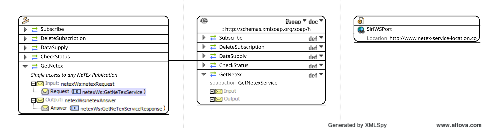
*Web service SOAP de NeTEx*

### Requête

La figure ci-dessous présente le point d’accès ***GetNetexService*** qui
permet de solliciter n’importe quel service NeTEx (à ce titre il permet
aussi la sollicitation du ***CheckStatus***, mais dans le cadre des
profils NeTEx et afin d’être cohérent avec le profil SIRI, le
***CheckStatus*** sera sollicité à partir de l’accès direct proposé dans
la WSDL. Seule la partie ***ServiceRequest*** est donc retenue pour le
profil.

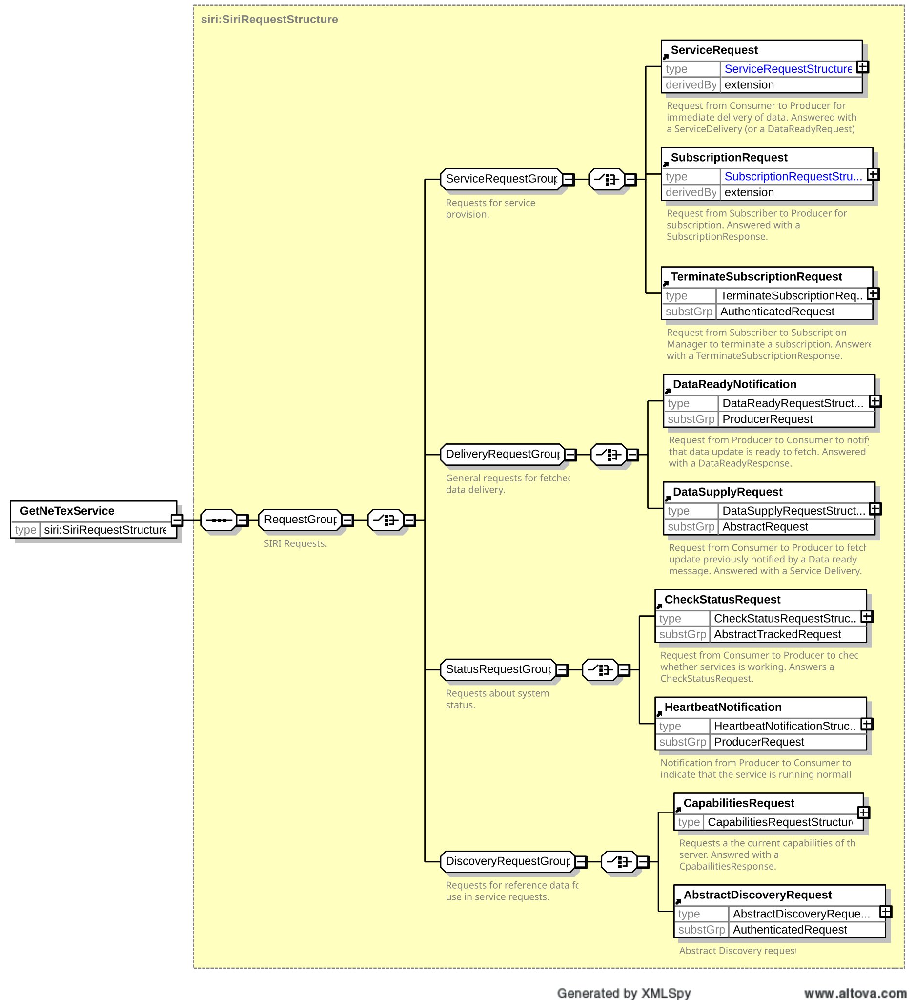
*GetNeTexService - XSD*

<div class="table-title">SIRI/NeTEx ServiceRequest — Attributes</div>

| Classification        | Nom                                    | Type               |                                        | Description                                                                                                                                                                              |
| --------------------- | -------------------------------------- | ------------------ | -------------------------------------- | ---------------------------------------------------------------------------------------------------------------------------------------------------------------------------------------- |
|                       | ***ServiceRequestContext***            | *+Structure*       | 0:1                                    | Propriétés générales de la requête.                                                                                                                                                      |
| *log*                 | ***RequestTimestamp***                 | *xsd:dateTime*     | **1:1**                                | Datation de la requête                                                                                                                                                                   |
| *Endpoint Properties* | ***Address***                          | *EndpointAddress*  | 0:1                                    | Adresse à laquelle la réponse doit être retournée (retour à ***RequestorRef*** si non précisé).                                                                                          |
| *Endpoint Properties* | ***RequestorRef***                     | *ParticipantCode*  | **1:1**                                | Identifiant du demandeur                                                                                                                                                                 |
| *Endpoint Properties* | ***MessageIdentifier***                | *MessageQualifier* | <del>0:1</del><br><mark>**1:1**</mark> | <p>Identifiant unique de la requête de souscription (utilisé dans la réponse).</p><p><mark>Comme pour le profil SIRI, ce champ est obligatoire dans le cadre du profil NeTEx.</mark></p> |
| *Payload*             | ***AbstractFunctionalServiceRequest*** | *+Structure*       | **1:***                                | La ou les requête(s) elles-même                                                                                                                                                          |

La partie ***Payload*** est de type
***AbstractFunctionalServiceRequest*** : dans le cas de NeTEx et du
présent profil, un mécanisme XML de “substitution group” permettra
d’utiliser un ***DataObjectRequestStructure*** (décrit plus bas) en tant
que ***Payload.***

La structure ***ServiceRequestContext*** est strictement compatible avec
celle du profil SIRI (la seule différence étant que le mode abonnement
n'est pas pris en charge).

<div class="table-title">ServiceRequestContext (issu du profil SIRI)</div>

|                           | Nom                           | Type                   |     | Description                                                                                                                                                                                                                                                                  |
| ------------------------- | ----------------------------- | ---------------------- | --- | ---------------------------------------------------------------------------------------------------------------------------------------------------------------------------------------------------------------------------------------------------------------------------- |
|                           | ***ServiceRequestContext***   | *+Structure*           |     | Propriétés générales des requêtes.                                                                                                                                                                                                                                           |
| *Server Endpoint Address* | ***CheckStatusAddress***      | *EndpointAddress*      | 0:1 | Adresse (URL) de destination du ***CheckStatus***.                                                                                                                                                                                                                           |
| *Client Endpoint Address* | ***StatusResponseAddress***   | *EndpointAddress*      | 0:1 | Adresse (URL) de destination des réponses aux ***CheckStatus***.                                                                                                                                                                                                             |
| *Client Endpoint Address* | ***ConsumerAddress***         | *EndpointAddress*      | 0:1 | Adresse (URL) de destination des données.                                                                                                                                                                                                                                    |
| *Location*                | a : ***WgsDecimalDegrees***   | *EmptyType*            | 0:1 | Les coordonnées géospatiales sont exprimées en latitude et longitude WGS84, en degrés décimaux d'arc.                                                                                                                                                                        |
| *Location*                | b : ***GmlCoordinateFormat*** | *srsNameType*          | 0:1 | <p>Nom du référentiel (GML) de localisation utilisé</p><p><mark>Les deux formats (WGS 84 systèmatique et générique GML) sont autorisés. (*<u>note</u>* : il existe de nombreux outils libres permettant de convertir les coordonnées d’un référentiel à l’autre).</mark></p> |
| *Temporal Span*           | ***DataHorizon***             | *PositiveDurationType* | 0:1 | Durée maximale de l’horizon de données des requêtes.                                                                                                                                                                                                                         |
| *Temporal Span*           | ***RequestTimeout***          | *PositiveDurationType* | 0:1 | Délai à partir duquel on peut considérer qu’une requête ne sera plus traitée (par défaut 1 minute).                                                                                                                                                                          |
| *Delivery Method*         | ***DeliveryMethod***          | *fetch* \| *direct*    | 0:1 | <p>Delivery pattern</p><p><mark>Abonnement à une phase (voir en début de document) uniquement : donc *direct*.</mark></p>                                                                                                                                                    |
| *Delivery Method*         | ***MultipartDespatch***       | *xsd:boolean*          | 0:1 | <mark>Autorisation de segmentation des messages : **Non** dans le profil.</mark>                                                                                                                                                                                             |
| *Delivery Method*         | ***ConfirmReceipt***          | *xsd:boolean*          | 0:1 | <mark>Confirmation des réceptions : **Non** dans le profil.</mark>                                                                                                                                                                                                           |

La requête à proprement parler est décrite ci-dessous. Elle est
essentiellement constituée d’un ***NetworkFrameTopic*** (la requête) et
d’une ***Policy*** (règles à appliquer pour la contraction de la
réponse).

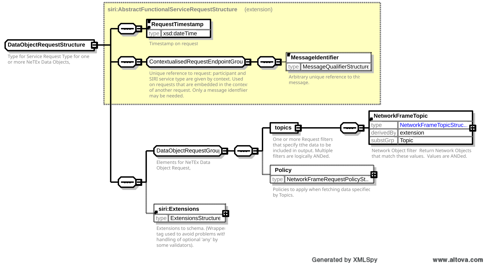
*DataObjectRequest- XSD*

<div class="table-title">NetworkFrameTopic – Element</div>

| Classification | Nom | Type | Cardinalité | Description |
| ---------------------- | ------------------------------- | ------------------------------- | --- | ------------------------------------------------------------------------------------------------------------------------------------------------------------------------------------------------------------------------------------------------------------------------------------------------------------------------------------------------------------- |
| *TopicGroup*           | ***sources***                   | *DataSource*                    | 0:* | Ce filtre permet de limiter la réponse à des données produites par une ou plusieurs sources de données spécifiées.                                                                                                                                                                                                                                            |
| *Object Request Topic* | *Topic Temporal Scope (choice)* |                                 |     |                                                                                                                                                                                                                                                                                                                                                               |
| *Object Request Topic* | a : ***Current***               | *EmptyType*                     | 1:1 | Ce filtre permet de ne demander que la version courante des données (excluant donc les anciennes ou futures versions).                                                                                                                                                                                                                                        |
| *Object Request Topic* | b : ***ChangedSince***          | *dateTime*                      | 1:1 | Permet de demander l’ensemble des données qui ont été modifiées depuis une date donnée.                                                                                                                                                                                                                                                                       |
| *Object Request Topic* | c : ***CurrentAt***             | *dateTime*                      | 1:1 | Ce filtre permet de ne demander que la version des données dans l’état où elles étaient à une date donnée.                                                                                                                                                                                                                                                    |
| *Object Request Topic* | ***TypeOfFrameRef***            | *TypeOfFrameRefStructure*       | 0:1 | <p>Permet de ne consulter que les données d’un type de cadre de version spécifique.</p><p><mark>S’il est utilisé, ce champ ne peut valoir que **NETEX_COMMUN**, **NETEX_ARRET**, **NETEX_RESEAU**, **NETEX_HORAIRE**, **NETEX_CALENDRIER**, **NETEX_TARIF**, **NETEX_FRANCE** *(correspondant à tous les types de CADRE définis par les profils)*.</mark></p> |
| *Topic Frame Scope*    | *Choice*                        |                                 |     |                                                                                                                                                                                                                                                                                                                                                               |
| *Topic Frame Scope*    | a : ***VersionFrameRef***       | *VersionFrameRefStructure*      | 1:* | Permet de ne consulter que les données d’un cadre de version spécifique.                                                                                                                                                                                                                                                                                      |
| *Topic Frame Scope*    | b : ***NetworkFilterByValue***  | *NetworkFilterByValueStructure* | 1:1 | Filtres additionnels pour la sélection (voir plus bas).                                                                                                                                                                                                                                                                                                       |

<div class="table-title">NetworkFilterByValue – Element</div>

| Classification | Nom | Type | Cardinalité | Description |
| ------------------------- | ---------------------- | ---------------------- | ---- | ------------------------------------------------------------------------------------------------------------------------------------------------------- |
| Object By Value           | ***BoundingBox***      | *BoundingBoxStructure* | 0:\* | Ce filtre permet de ne demander que les données à l’intérieur d’un périmètre géographique spécifié.                                                     |
|                           | ***objectReferences*** | *VersionOfObjectRef*   | 0:\* | Permet de spécifier l’identifiant de l’objet recherché. Si l’identifiant n’est pas précisé, tous les objets de la classe correspondante sont retournés. |
| *Network Filter By Value* | ***NetworkRef***       | *NetworkRefStructure*  | 0:1  | Permet de n’obtenir que les objets d’un réseau (NETWORK) <mark>ou d’un groupe de lignes (GROUP OF LINES)</mark> spécifique.                             |

<div class="table-title">FrameRequestPolicy – Element</div>

| Classification | Nom | Type | Cardinalité | Description |
| ---------------------------- | ----------------------------- | ------------- | --- | ----------------------------------------------------------------------------------------------------------------------------- |
| *AbstractRequestPolicyGroup* | ***MaximumNumberOfElements*** | *xsd:integer* | 0:1 | Nombre maximal d’objets à retourner dans la réponse.                                                                          |
|                              | ***IncludeDeleted***          | *xsd:boolean* | 0:1 | Indique qu’il faut aussi transmettre les indications d’objets supprimés (arrêt qui n’est plus utilisé, etc.) dans la réponse. |

### Réponse

La réponse retournée est très simple : naturellement, en cohérence avec
la requête, seul le ***ServiceDelivery*** de la réponse sera utilisé.

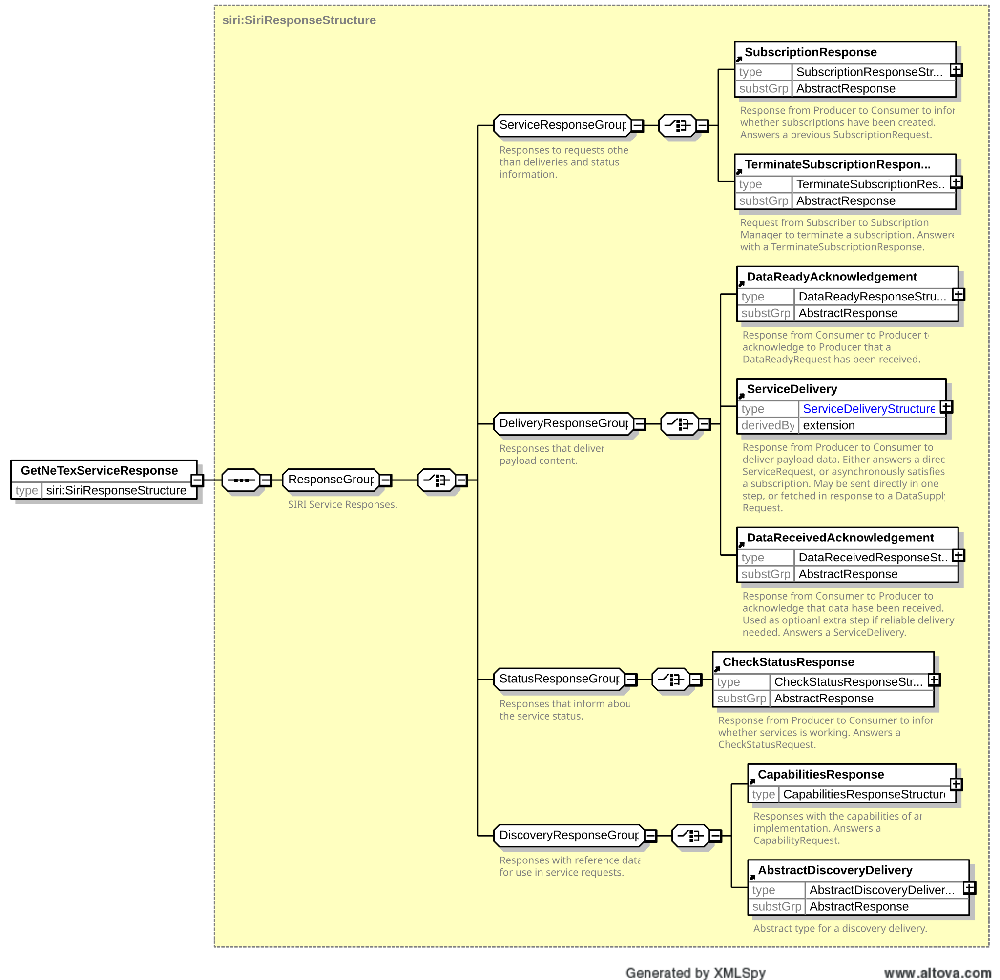
*GetNeTexServiceResponse - XSD*

<div class="table-title">ServiceDelivery (issu du profil SIRI) — Attributes</div>

| Classification | Nom | Type | Cardinalité | Description |
| --------------------- | ------------------------------- | -------------------- | -------------------------------------- | ---------------------------------------------------------------------------------------------------------------------------------------------------------------------------------------------------------------------------------------------------------------------------------------------- |
|                       | ***ServiceDelivery***           | *+Structure*         |                                        | Réponse du producteur au consommateur pour fournir les données utiles. Répond à une requête directe ou à un abonnement de manière asynchrone.                                                                                                                                                  |
| *Log*                 | ***ResponseTimestamp***         | *xsd:dateTime*       | 1:1                                    | Date et heure de production de la réponse.                                                                                                                                                                                                                                                     |
| *Endpoint properties* | ***ResponseMessageIdentifier*** | *MessageQualifier*   | 0:1                                    | Identifiant du message de réponse                                                                                                                                                                                                                                                              |
| *Endpoint properties* | ***RequestMessageRef***         | *->MessageQualifier* | <del>0:1</del><br><mark>**1:1**</mark> | <p>Référence de la requête.</p><p><mark>Obligatoire, en cohérence avec le profil SIRI</mark>                                                                                                                                                                                                   |
| *Status*              | ***Status***                    | *xsd:boolean*        | <del>0:1</del><br><mark>**1:1**</mark> | Indique si la requête a pu être traitée avec succès ou non.                                                                                                                                                                                                                                    |
| *Status*              | ***ErrorCondition***            | See below            | 0:1                                    | <p>Signalement d’erreur (voir le paragraphe sur la gestion des erreurs).</p><p><mark>Voir le profil SIRI pour le détail de la gestion des erreurs. Le détail des erreurs est porté par le DataObjectDelivery décrit plus bas (voir profil SIRI chapitre ***Gestion des Erreurs***).</mark></p> |
| *Payload*             | *Concrete SIRI Service :*       |                      |                                        |                                                                                                                                                                                                                                                                                                |
| *Payload*             | a : ***DataObjectDelivery***    | *+Structure*         | 0:*                                    | Corps de la réponse (voir DataObjectDelivery ci-dessous).                                                                                                                                                                                                                                      |

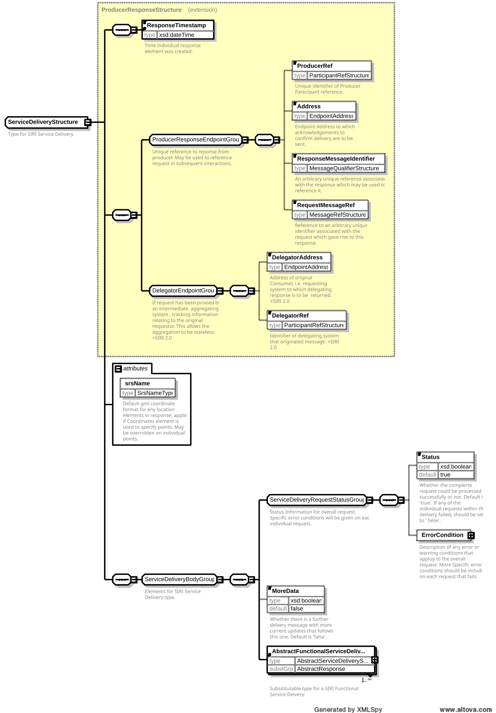
*ServiceDelivery - XSD*

<div class="table-title">DataObjectDelivery (issu du profil SIRI) — Attributes</div>

| Classification | Nom | Type | Cardinalité | Description |
| --------- | --------------------------- | ---------------------- | -------------------------------------- | ----------------------------------------------------------------------------------------- |
|           | ***DataObjectDelivery***    | *+Structure*           |                                        | Qualificateur des réponses.                                                               |
| *Log*     | ***ResponseTimestamp***     | *xsd:dateTime*         | 0:1                                    | Date de création de ce statut de réponse.                                                 |
| *Choice*  | ***RequestMessageRef***     | *MessageQualifier*     | <del>0:1</del><br><mark>**1:1**</mark> | Référence de la requête.                                                                  |
| *Payload* | ***Status***                | *xsd:boolean*          | <del>0:1</del><br><mark>**1:1**</mark> | Indique si la requête a été traitée normalement ou pas.                                   |
| *Payload* | ***ErrorCondition***        | *+Structure*           | 0:1                                    | Signalement d’erreur (<mark>voir profil SIRI, chapitre ***Gestion des Erreurs***</mark>). |
| *Info*    | ***ValidUntil***            | *xsd:dateTime*         | 0:1                                    | Date de validité maximale de la réponse.                                                  |
| *Info*    | ***ShortestPossibleCycle*** | *PositiveDurationType* | 0:1                                    | Intervalle minimal de mise à jour de la donnée.                                           |
| *Info*    | ***dataObjects***           | *VersionFrame*         | 0:*                                    | Données échangées dans un contexte de CADRE DE VERSION (voir 7.1).                        |

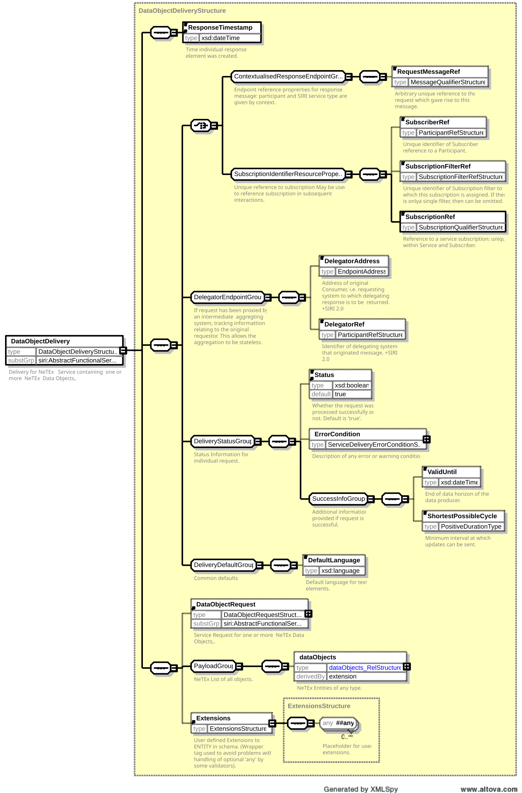
*GetNeTexServiceResponse - XSD*
