# Domaine d'application

Le Profil France NeTex pour les nouveaux modes concerne sp&eacute;cifiquement l'&eacute;change de donn&eacute;es de r&eacute;f&eacute;rence pour soutenir les "nouveaux" modes alternatifs pour les services de mobilit&eacute;, en ajoutant certains nouveaux concepts au sch&eacute;ma NeTEx (indiqu&eacute;s comme NeTEx v1.2.2), mais aussi en utilisant dans une large mesure des &eacute;l&eacute;ments de sch&eacute;ma existants d&eacute;finis dans les parties 1, 2 et 3 de NeTEx.

La conception de haut niveau pour le soutien aux modes alternatifs est d&eacute;riv&eacute;e d'un modèle conceptuel pour les modes alternatifs CEN PT1711 (CEN/TS 17413:2020) pr&eacute;par&eacute; par le groupe de travail TC278 WG17 de CEN. Cette sp&eacute;cification technique CEN d&eacute;crit un modèle conceptuel pour les modes alternatifs comme une extension de Transmodel V6.0 et bas&eacute; sur un ensemble d&eacute;taill&eacute; de cas d'utilisation tir&eacute;s de CEN PT1711, fournis en annexe A.

Le format NeTEx concerne un sous-ensemble des cas d'utilisation pour les donn&eacute;es de r&eacute;f&eacute;rence (les cas d'utilisation en temps r&eacute;el sont couverts par des protocoles dynamiques tels que SIRI et DATEX II). En g&eacute;n&eacute;ral, il concerne les donn&eacute;es pour les objectifs suivants :

- Permettre l'int&eacute;gration des segments de voyage effectu&eacute;s avec des modes alternatifs avec ceux effectu&eacute;s avec des modes conventionnels dans des plans de voyage sans couture ;
- D&eacute;crire les zones de couverture des services de mobilit&eacute; par modes alternatifs afin que les moteurs de planification de voyages et d'autres systèmes puissent informer les passagers de la possibilit&eacute; de les utiliser et fournir des liens appropri&eacute;s pour invoquer les services dynamiques ;
- Localiser les points d'accès pour les services de modes alternatifs, tels que les points de stationnement, les stations de covoiturage, etc., y compris leur relation avec les points d'accès pour les modes conventionnels ;

NeTEx concerne principalement l'&eacute;change de donn&eacute;es de r&eacute;f&eacute;rence pour permettre l'int&eacute;gration de nouveaux modes avec d'autres donn&eacute;es ; il ne d&eacute;crit pas les services dynamiques.

# R&eacute;f&eacute;rences normatives

Les documents de r&eacute;f&eacute;rence suivants sont indispensables pour l'application du pr&eacute;sent document. Pour les r&eacute;f&eacute;rences dat&eacute;es, seule l'&eacute;dition cit&eacute;e s'applique. Pour les r&eacute;f&eacute;rences non dat&eacute;es, la dernière &eacute;dition du document de r&eacute;f&eacute;rence s'applique (y compris les &eacute;ventuels amendements).

CEN/TS 16614-1, Network and Timetable Exchange (NeTEx) - Part 1: Public transport network topology exchange format

CEN/TS 16614-2, Network and Timetable Exchange (NeTEx) - Part 2: Public transport scheduled timetables exchange format

CEN/TS 16614-3, Network and Timetable Exchange (NeTEx) - Part 3: Fare exchange format

EN 12896, Road transport and traffic telematics - Public transport - Reference data model (Transmodel)

Le profil France NeTex modes Alternatifs s'appuie sur les profils NeTex France mentionn&eacute;s ci-après. Les informations d&eacute;crites dans ces profil nationaux ne sont pas reprises dans ce document.

NeTex Profil France v2.3 - Parking

# Termes et d&eacute;finitions

Pour les besoins du pr&eacute;sent document, les termes et d&eacute;finitions suivants s'appliquent. Une grande partie d'entre eux est directement issue de Transmodel et NeTEx.

NOTE Les termes sp&eacute;cifiquement introduits par le profil d'arrêt sont signal&eacute;s par le mot (profil), en italique et entre parenthèses. Les d&eacute;finitions ci-dessous sont des traductions litt&eacute;rales du document normatif.

NOTE Les d&eacute;finitions ci-dessus sont des traductions litt&eacute;rales du document normatif.

**ACTUAL VEHICLE EQUIPMENT (&eacute;quipement r&eacute;el du v&eacute;hicule)**

Cet &eacute;l&eacute;ment permet de sp&eacute;cifier un &eacute;quipement d'un type particulier effectivement disponible dans un v&eacute;hicule donn&eacute;.

**ALTERNATIVE MODE OF OPERATION** (Transmodel)

Tout mode d'exploitation annonc&eacute; publiquement diff&eacute;rent du mode d'exploitation conventionnel, notamment le partage de v&eacute;hicules, la location de v&eacute;hicules et le covoiturage.

**BOOKING ARRANGEMENT** (Transmodel)

Ensemble des règles et informations décrivant les modalités selon lesquelles un service de transport peut être réservé, incluant les conditions de réservation, les délais, les moyens de contact et les procédures à suivre par l’usager.

**CAR MODEL PROFIL** (NeTEx)

Description structurée des caractéristiques d’un modèle de véhicule utilisé dans un service de transport, incluant ses propriétés techniques, ses capacités et ses équipements, afin de qualifier son usage dans le système de transport.

Selon le niveau de détail, cela peut inclure par exemple :

* capacité (nombre de places),
* type de motorisation (thermique, électrique, hybride),
accessibilité (PMR),
* équipements (climatisation, espace bagages, etc.).

**CAR POOLING SERVICE** (NeTEx)

Service de transport dans lequel plusieurs usagers partagent un véhicule privé pour effectuer tout ou partie d’un trajet commun, selon des conditions définies d’organisation, de mise en relation et d’exploitation.

**COMMON VEHICLE SERVICE**

Un SERVICE DE MOBILIT&eacute; est en soi abstrait. Un SERVICE DE V&eacute;HICULES COMMUNS est une sp&eacute;cialisation d'un SERVICE DE MOBILIT&eacute; impliquant des V&eacute;HICULES.

Trois sp&eacute;cialisations d'un SERVICE DE V&eacute;HICULES COMMUNS sont possibles :

- SERVICE DE LOCATION DE V&eacute;HICULES : Offre de service de transport li&eacute;e à la LOCATION DE V&eacute;HICULES. Hors p&eacute;rimètre du pr&eacute;sent profil,
- SERVICE DE PARTAGE DE V&eacute;HICULES : Offre de service de transport li&eacute;e au PARTAGE DE V&eacute;HICULES.
- SERVICE DE VEHICULES PARTAGES (co voiturage) : Service de transport mettant en relation conducteur et passager(s) pour effectuer des trajets.

**CONVENTIONAL MODE OF OPERATION** (Transmodel)

Mode d'exploitation traditionnel propos&eacute; sous forme d'offre de transport programm&eacute;e et/ou flexible, annonc&eacute;e publiquement, s'appuyant sur un ensemble de caract&eacute;ristiques :

- Les conducteurs sont des salari&eacute;s ;
- La flotte appartient à une autorit&eacute;, ou est d&eacute;tenue ou exploit&eacute;e par un op&eacute;rateur,
- La topologie du r&eacute;seau est d&eacute;finie bien à l'avance et repose sur les lignes et les sch&eacute;mas de d&eacute;placement

**CYCLE MODEL PROFILE** (NeTEx)

Le PROFIL DU MODÈLE DE CYCLE décrit l'ÉQUIPEMENT installé à bord des cycles d'un MODÈLE DE CYCLE spécifique

**FLEET (Flotte)**- (Transmodel)

Une flotte appartient à une organisation de transport, un organisme l&eacute;galement constitu&eacute; li&eacute; à tout aspect du système de transport. Une organisation de transport peut poss&eacute;der plusieurs flottes.

**MOBILITY CONSTRAINT ZONE** (NeTEx)

Une ZONE DE CONTRAINTE DE SERVICE DE MOBILIT&eacute; d&eacute;finit des restrictions de d&eacute;placement au sein d'une zone pour un MODE DE FONCTIONNEMENT donn&eacute;.

**MOBILITY SERVICE** (Transmodel)

Service de transport alternatif disponible sur un territoire &eacute;tendu, par exemple le covoiturage, la location, etc.

**MODE OF OPERATION**

Un des trois type de mode d'exploitation parmi ;

- Les modes d'exploitation conventionnels,
- Les modes d'exploitation alternatifs
- Les modes d'exploitation personnels

**ONLINE SERVICES** (NeTEx)

L'entit&eacute; SERVICE EN LIGNE repr&eacute;sente tout service accessible à distance permettant d'acc&eacute;der à tout mode de transport et/ou à des informations relatives aux services de transport.

**ONLINE SERVICES OPERATOR** (Exploitant de services en ligne) (NeTEx)

Organisation responsable de la fourniture et de l’exploitation de services numériques permettant l’accès, la réservation, l’information ou la vente de services de transport via des canaux en ligne.

**PARKING** (parking) (Transmodel)

Emplacements d&eacute;sign&eacute;s pour stationner des v&eacute;hicules tels que des voitures, des motos et des v&eacute;los.

**PARKING AREA** (zone de parking) (Transmodel)

Zone identifi&eacute;e à l'int&eacute;rieur d'un parking, et contenant des places de stationnement (PARKING BAYs).

**PARKING AREA CAPACITY ASSIGNMENT** (NeTEx)

Association qui définit l’allocation d’une capacité de stationnement à une aire de stationnement donnée, en précisant comment une capacité (totale ou partielle) est affectée à un usage, un type de véhicule ou un service spécifique.

**PARKING BAY** (place de stationnement) _(Transmodel)_

Emplacement où l'on peut stationner une (unique) v&eacute;hicule.

**PERSONAL MODE OF OPERATION** _(Transmodel)_

Mode de d'exploitation priv&eacute; excluant toute utilisation annonc&eacute;e publiquement.


**SERVICE ACCES CODE** (Code d’accès à un service)(NeTEx)

Code définissant une condition ou une règle d’accès applicable à un service de transport, précisant les restrictions, permissions ou modalités d’utilisation associées à ce service.

**SERVICE PROFILE QUALIFICATION** (NeTEx)

Ensemble des attributs ou critères permettant de qualifier un profil de service de transport, afin de décrire ses caractéristiques fonctionnelles, opérationnelles ou commerciales et de le distinguer d’autres profils de service.

**SIMPLE VEHICLE TYPE** _(NeTex)_

D&eacute;finit les exigences applicables à un v&eacute;hicule utilis&eacute; pour fournir des services de modes alternatifs.

Il peut inclure des caract&eacute;ristiques emprunt&eacute;es à d'autres types de v&eacute;hicules (par exemple : v&eacute;los, trottinettes, scooters).

**TRANSPORT TYPE** _(NeTex)_

Un **TRANSPORT TYPE** peut être associ&eacute; à un **VEHICLE MODEL**, qui d&eacute;crit un ensemble de propri&eacute;t&eacute;s r&eacute;pondant à un **VEHICLE EQUIPMENT PROFILE**.

Chaque v&eacute;hicule possède :

- un TRANSPORT TYPE,
- un VEHICLE MODEL.

**USER PROFILE QUALIFICATION** (Transmodel)

nsemble des attributs ou critères permettant de qualifier un profil d’utilisateur de transport, afin de déterminer ses droits, conditions d’accès ou avantages applicables dans le cadre d’un système de transport.

**VEHICULE CHARGING EQUIPMENT** (NeTEx)

L'EQUIPEMENT DE RECHARGE DE VEHICULE est une sp&eacute;cialisation de l'EQUIPEMENT DE LIEU indiquant la disponibilit&eacute; de la recharge de v&eacute;hicule.

**VEHICLE MEETING PLACE** (NeTEx)

Lieux où les v&eacute;hicules/voyageurs/conducteurs se rencontrent pour changer de mode de transport, pour embarquer, d&eacute;barquer, prendre en charge, d&eacute;poser, etc. Un LIEU DE RENCONTRE DE V&eacute;HICULES peut être associ&eacute; à un SITE sp&eacute;cifique (tel qu'un LIEU D'ARRÊT ou un POINT D'INT&eacute;RÊT) ou à tout composant du SITE

**VEHICLE MODEL** (Transmodel)

Classification des v&eacute;hicules de transport public d'un même type selon l'&eacute;quipement ou la g&eacute;n&eacute;ration de modèle.

**VEHICLE MODEL PROFILE** (NeTEx)

Le PROFIL DU MODÈLE DE V&eacute;HICULE d&eacute;crit l'&eacute;QUIPEMENT install&eacute; à bord des V&eacute;HICULES d'un MODÈLE DE V&eacute;HICULE sp&eacute;cifique

**VEHICLE POOLER PROFIL**

Ensemble des caractéristiques décrivant un utilisateur ou un acteur qui met un véhicule à disposition dans un service de covoiturage, permettant de qualifier son rôle, ses droits et ses conditions de participation au service.

**VEHICLE SHARING** (Transmodel)

Location de v&eacute;hicule à court terme où le v&eacute;hicule peut être pris et stationn&eacute; à diff&eacute;rents endroits de la zone urbaine, souvent sans la contrainte de ramener le v&eacute;hicule à un endroit sp&eacute;cifique d&eacute;di&eacute;.

**Vehicle Pooling** (Transmodel)

Mode particulier d’exploitation d’un véhicule appartenant à un particulier, consistant à partager le véhicule pour un trajet entre un conducteur désigné, déjà engagé dans le trajet, et au moins un autre voyageur.

**VEHICLE POOLING MEETING PLACE** (Lieu de rencontre pour covoiturage) (Transmodel)

Lieu défini où les participants d’un service de covoiturage se rencontrent pour débuter ou organiser un trajet commun.

**VEHICLE POOLING PARKING BAY** (Emplacement de parking pour covoiturage) (Transmodel)

Emplacement de stationnement dédié ou identifié au sein d’une aire de stationnement, destiné à l’usage des véhicules participant à un service de covoiturage.

**VEHICLE POOLING PARKING AREA** (zone de parking pour covoiturage) (Transmodel)

Zone de stationnement dédiée ou qualifiée pour l’usage des véhicules participant à un service de covoiturage (vehicle pooling), permettant d’organiser et de restreindre l’utilisation de l’aire à ce type de service.

**VEHICLE SERVICE PLACE ASSIGNEMENT**

Association définissant l’affectation d’un lieu de service à l’usage des véhicules dans le cadre d’un service de transport, précisant les conditions dans lesquelles ce lieu peut être utilisé pour l’embarquement, le débarquement ou l’exploitation du service.

**VEHICLE SHARING PLACE ASSIGNEMENT**

Association définissant l’affectation d’un lieu à un service de partage de véhicule, précisant les conditions dans lesquelles ce lieu peut être utilisé pour la prise, la restitution ou l’exploitation de véhicules partagés.

**VEHICLE SHARING PARKING AREA** (zone de parking pour v&eacute;hicule partag&eacute;) (NeTEx)

Zone identifi&eacute;e à l'int&eacute;rieur d'un parking d&eacute;di&eacute; au v&eacute;hicules partag&eacute;s, et contenant des places de stationnement (PARKING BAYs).

**VEHICLE SHARING PARKING BAY** (place de stationnement pour v&eacute;hicule partag&eacute;) _(Transmodel)_

Emplacement où l'on peut stationner une (unique) v&eacute;hicule partag&eacute;e.

**VEHICLE SHARING PLACE ASSIGNEMENT** (NeTEx)

Une ATTRIBUTION DE PLACE DE PARTAGE DE V&eacute;HICULE peut être utilis&eacute;e pour attribuer des ZONES DE STATIONNEMENT et des PLACES DE STATIONNEMENT sp&eacute;cifiques à utiliser par un service donn&eacute;.

**VEHICLE SHARING SERVICE** (NeTEx)

Service de transport permettant à des utilisateurs d’accéder à des véhicules partagés, généralement en libre-service ou sur réservation, selon des conditions d’utilisation définies par un opérateur.

**VEHICLE SHARING TYPE** (NeTEx)

Type définissant la catégorie ou le mode de fonctionnement d’un service de partage de véhicules, caractérisant la manière dont les véhicules sont mis à disposition et utilisés par les usagers.

**VEHICLE TYPE** _(NeTex)_

D&eacute;finit les exigences applicables à un v&eacute;hicule programm&eacute; pour le transport de passagers. Ces exigences peuvent inclure :

- **Exigence de transport de passagers** : capacit&eacute; en passagers fauteuil roulant, etc.).
- **Exigence de manœuvrabilit&eacute;** : contraintes li&eacute;es à la capacit&eacute; de manœuvre du v&eacute;hicule.
- **Exigence d'&eacute;quipements** : installations requises à bord (accessibilit&eacute;, siège b&eacute;b&eacute;, etc.).

**VEHICLE TYPE ZONE RESTRICTION** (Type de Zone de restriction de circulation)(NeTEx)

Règle définissant les restrictions applicables à un type de véhicule dans une zone géographique donnée, précisant si ce type de véhicule est autorisé, limité ou interdit dans cette zone.

# Symboles et abr&eacute;viations

**LOM** : Moi d'orientation des mobilit&eacute;s

**NeTEx** : Network Timetable Exchange

**NM** : Nouveaux Modes

**SIRI** : Service Interface for Real Time Information.

**XSD** : XML Schema Definition

# Exigences minimales li&eacute;es au code des transports et la règlementation europ&eacute;enne

La mise à disposition des donn&eacute;es, quand elles existent, est obligatoire et se conforme aux exigences :

- Au niveau europ&eacute;en, du règlement d&eacute;l&eacute;gu&eacute; (UE) 2017/1926 de la Commission du 31 mai 2017 modifi&eacute; par le règlement d&eacute;l&eacute;gu&eacute; (UE) 2024/490 de la Commission du 29 novembre 2023 (&lt;<https://eur-lex.europa.eu/eli/reg_del/2017/1926/2024-03-04>&gt;), dit "règlement MMTIS" ;
- Au niveau français, des articles L. 1115-1 à L. 1115-7 , D. 1115-1, R. 1115-2 à R. 1115-8 et D. 1115-9 à D. 1115-11 du code du transports, notamment cr&eacute;&eacute;s ou modifi&eacute;s par les articles 25 et 27 de loi n° 2019-1428 du 24 d&eacute;cembre 2019 d'orientation des mobilit&eacute;s, dites loi « LOM ».

Ces mêmes articles de la LOM pr&eacute;cise le calendrier de mise à disposition des donn&eacute;es.

Le tableau ci-dessous r&eacute;sulte de l'analyse du code des transports et du règlement MMTIS et fournit la liste des concepts concern&eacute;s dans le pr&eacute;sent profil correspondant aux donn&eacute;es mentionn&eacute;es dans l'annexe du règlement. Il sera donc n&eacute;cessaire de fournir ces donn&eacute;es pour être conforme au cadre r&eacute;glementaire (il s'agit bien de mettre à disposition toutes les donn&eacute;es existantes dans les SI transport, et non de cr&eacute;er des donn&eacute;es qui n'existeraient pas encore sous forme informatique).

Notez que beaucoup de concepts d&eacute;pendent des concepts issus de Transmodel/NeTEx et sont li&eacute;s entre eux, soit par h&eacute;ritage, soit par relation au sens UML des termes. Par ailleurs, certains concepts additionnels peuvent relever d'autres parties du profil France pr&eacute;cis&eacute;s dans le tableau le cas &eacute;ch&eacute;ant.

De plus, les noms des cat&eacute;gories (colonnes Cat&eacute;gorie et D&eacute;tail) ont &eacute;t&eacute; conserv&eacute;s dans la langue originale du document (l'anglais) pour &eacute;viter tout risque de confusion.

La première colonne reprend la notion de _\*niveau\*_ tel qu'il est d&eacute;crit et utilis&eacute; par le règlement europ&eacute;en et a notamment une incidence sur le calendrier de mise à disposition de la donn&eacute;e (voir le règlement pour plus de d&eacute;tails).

Les diff&eacute;rents concepts retenus ne sont bien sûr pas d&eacute;taill&eacute;s dans ce tableau, mais dans le profil lui-même. C'est aussi dans la description du profil que l'on trouvera les d&eacute;tails concernant les attributs (obligatoire/facultatif, règles de remplissage, codification, etc.).

Pour ce qui est des attributs facultatifs, la règle reste que, pour les objets ci-dessous, toute information disponible est suppos&eacute;e être fournie (mais on ne cr&eacute;e pas d'information si elle n'est pas disponible).

L'attente du règlement d&eacute;l&eacute;gu&eacute; est très vaste et ne permet malheureusement pas de r&eacute;aliser une s&eacute;lection de concepts dans ce que propose NeTEx (qui est de plus très vaste).

| **Niveau** | **Cat&eacute;gorie** | **D&eacute;tail** | **Concept** | **Autre Concept** |
| --- | --- | --- | --- | --- |
| 2   | Recherche de localisation (origine/destination) | Identifiants d'adresse (num&eacute;ro de bâtiment, nom de rue, code postal) | ENTRANCE (V&eacute;HICULE et PASSAGER) PARKING |     |
| 2   | Recherche de localisation (modes à la demande) | \- Arrêts Park & Ride<br><br>\- Stations de partage de v&eacute;los<br><br>\- Stations de covoiturage<br><br>\- Stations de ravitaillement accessibles au public (stations de recharge pour v&eacute;hicules &eacute;lectriques) | PARKING<br><br>PARKING AREA<br><br>VEHICLE CHARGING EQUIPMENT |     |
| 2   | Service d'information | Où et comment acheter des billets pour les modes programm&eacute;s, modes à la demande et le stationnement (tous modes programm&eacute;s et à la demande, incluant canaux de vente, m&eacute;thodes de distribution, modes de paiement) | PARKING (attributs relatifs à la tarification) |     |
| 3   | Service d'information (tous modes) | Comment r&eacute;server le covoiturage, les, la v&eacute;los partage, etc. (incluant canaux de vente, m&eacute;thodes de distribution, modes de paiement) | BOOKING ARRANGEMENTS |     |
| 3   | Service d'information (tous modes) | Où et comment payer le stationnement, les stations de recharge publiques pour v&eacute;hicules &eacute;lectriques et les points de ravitaillement pour v&eacute;hicules au GNC/GNL, hydrogène, essence et diesel (incluant canaux de vente, m&eacute;thodes de distribution, modes de paiement) |     |     |
| 1   | Types des donn&eacute;es routières statiques | Localisation des places de stationnement et zones de service | **PARKING** | **PARKING AREA** |
| 1   | Types des donn&eacute;es routières statiques | Localisation des points de recharge pour v&eacute;hicules &eacute;lectriques et conditions d'utilisation | VEHICLE CHARGING EQUIPMENT |     |

_Table 1 - Concepts relatifs à la LOM et à la Règlementation Europ&eacute;enne_

# Description du profil d'&eacute;change

## Conventions de repr&eacute;sentation

### Tableaux d'attributs

**NOTE** les choix de conventions pr&eacute;sent&eacute;es ici ont pour vocation d'être coh&eacute;rents avec ceux r&eacute;alis&eacute;s dans le cadre du profil SIRI (Île-de-France Mobilit&eacute;s et CEREMA). De plus tous les profils NeTEx partagent les mêmes conventions.

Les messages constituant ce profil d'&eacute;change sont d&eacute;crits ci-dessous selon un double formalisme: une description sous forme de diagrammes XSD (leur compr&eacute;hension n&eacute;cessite une connaissance pr&eacute;alable de XSD: XML Schema Definition) et une description sous forme tabulaire. Les tableaux proposent ces colonnes:

| Classification | Nom | Type | Cardinalit&eacute; | Description |
| --- | --- | --- | --- | --- |

**Classification** : permet de cat&eacute;goriser l'attribut. Les principales cat&eacute;gories sont:

PK (Public Key) que l'on peut interpr&eacute;ter comme Identifiant Unique: il permet à lui seul d'identifier l'objet, de façon unique, p&eacute;renne et non ambiguë. C'est l'identifiant qui sera utilis&eacute; pour r&eacute;f&eacute;rencer l'objet dans les relations.

AK (Alternate Key) est un identifiant secondaire, g&eacute;n&eacute;ralement utilis&eacute; pour la communication, mais qui ne sera pas utilis&eacute; dans les relations.

FK (Foreign Key) indique que l'attribut contient l'identifiant unique (PK) d'un autre objet avec lequel il est en relation.

GROUP est un groupe XML nomm&eacute; (ensemble d'attributs utilisables dans diff&eacute;rents contextes) (cf: <http://www.w3.org/TR/2001/REC-xmlschema-0-20010502/#AttrGroups> )

**Nom** : nom de l'&eacute;l&eacute;ment ou attribut XSD

**Type** : type de l'&eacute;l&eacute;ment ou attribut XSD (pour certains d'entre eux, il conviendra de se r&eacute;f&eacute;rer à la XSD NeTEx)

**Cardinalit&eacute;** : cardinalit&eacute; de l'&eacute;l&eacute;ment ou attribut XSD exprim&eacute;e sous la forme "**_minimum:maximum_**" ("0:1" pour au plus une occurrence; "1:\*" au moins une occurrence et sans limites de nombre maximal; "1:1" une et une seule occurrence; etc.).

Description : texte de description de l'&eacute;l&eacute;ment ou attribut XSD (seul les attributs retenus par le profil ont un texte en français; les textes surlign&eacute;s en jaune indiquent une sp&eacute;cificit&eacute; du profil par rapport à NeTEx).

Les textes surlign&eacute;s en jaune sont ceux pr&eacute;sentant une particularit&eacute; (sp&eacute;cialisation) par rapport à NeTEx: une codification particulière, une restriction d'usage, etc.

Les textes surlign&eacute;s en bleu correspondent à des &eacute;l&eacute;ments de NeTEx non retenus dans le cadre de ce profil (pr&eacute;sent&eacute;s à titre informatif donc). Dans les diagrammes XSD, les &eacute;l&eacute;ments et attributs apparaissant sur fond bleu sont ceux qui ne sont pas retenus par le profil (et ce sont donc syst&eacute;matiquement des &eacute;l&eacute;ments ou attributs facultatifs de NeTEx).

La description XSD utilis&eacute;e est strictement celle de NeTEx, sans aucune modification (ceci explique notamment que tous les commentaires soient en anglais).

Les attributs et &eacute;l&eacute;ments rendus obligatoires dans le cadre de ce profil restent facultatifs dans l'XSD (le contrôle de cardinalit&eacute; devra donc être r&eacute;alis&eacute; applicativement).

### Valeurs de code de profil

Dans la mesure du possible, le profil s&eacute;lectionne les valeurs de code à utiliser pour caract&eacute;riser des &eacute;l&eacute;ments et les limite à un ensemble de valeurs document&eacute;es. NETEX propose plusieurs m&eacute;canismes diff&eacute;rents pour sp&eacute;cifier les valeurs de code autoris&eacute;es:

- Des &eacute;num&eacute;rations fixes d&eacute;finies dans le cadre du sch&eacute;ma XSD NeTEx. Le profil impose alors un sous-ensemble des codes NeTEx.
- Des sp&eacute;cialisations de TYPE OF VALUE, utilis&eacute;es pour d&eacute;finir des ensembles de codes ouverts pouvant être ajout&eacute;s au fil du temps sans modifier le sch&eacute;ma, par exemple, pour enregistrer des classifications d'entit&eacute;s h&eacute;rit&eacute;es. Le profil lui-même utilise le m&eacute;canisme TYPE OF VALUE dans quelques cas pour sp&eacute;cifier des codes normalis&eacute;s suppl&eacute;mentaires : ceux-ci sont affect&eacute;s à un CODESPACE «FR_IV_metadata» (<https://netex-cen.eu/FR_IV>) indiqu&eacute; par un pr&eacute;fixe «FR_IV». (par exemple, «FR_IV: monomodal».
- Des instances TypeOfFrame: le profil utilise plusieurs TYPES DE FRAME pour sp&eacute;cifier l'utilisation de VERSION FRAME dans le profil.

### Indication des classes abstraites

NeTEx, et Transmodel, utilisent largement l'h&eacute;ritage de classe; cela simplifie consid&eacute;rablement la sp&eacute;cification en &eacute;vitant les r&eacute;p&eacute;titions puisque les attributs partag&eacute;s sont d&eacute;clar&eacute;s par une superclasse et que des sous-classes viennent ensuite les sp&eacute;cialiser sans avoir à r&eacute;p&eacute;ter ces attributs et en n'ajoutant que ceux qui lui sont sp&eacute;cifiques. La plupart des superclasses sont «abstraites» - c'est-à-dire qu'il n'existe aucune instance concrète; seules les sous-classes terminales sont «concrètes».

Un inconv&eacute;nient de l'h&eacute;ritage est que si l'on veut comprendre les propri&eacute;t&eacute;s d'une classe concrète unique, il faut &eacute;galement examiner toutes ses super-classes. Pour cette raison, le profil inclut les classes abstraites n&eacute;cessaires pour comprendre les classes concrètes, même si ces classes concrètes ne sont jamais directement instanci&eacute;es dans un document NeTEx.

- Les super-classes sont signal&eacute;es dans les en-têtes par le suffixe «_(abstrait)_»
- Dans les diagrammes UML (comme pour NeTEx et Transmodel), les noms des classes abstraites sont indiqu&eacute;s en italique et les classes abstraites sont de couleur gris clair.
- Certaines super-classes ne sont techniquement pas abstraites dans NeTEx, mais ne sont pas utilis&eacute;es comme classes concrètes dans le profil : elles sont signal&eacute;es avec la même convention que les classes abstraites.

### Classes de sous-composants

Un certain nombre de classes ont des sous-composants qui constituent leur d&eacute;finition. Celles-ci fournissent des d&eacute;tails auxiliaires (par exemple, AlternativeText, AlternativeName, TrainComponent) et sont signal&eacute;es dans les en-têtes par le suffixe « _(objet inclus)_ ».

## Les &eacute;l&eacute;ments non d&eacute;finis dans l'offre des service (r&eacute;seau et horaires)

Sans Objet

# Concepts de base pour la description des modes de transport alternatif

Le terme 'mode' d&eacute;signe tout moyen de transport utilis&eacute; ou disponible. Il est divis&eacute; en 'mode v&eacute;hicule' et 'mode d'accès'.

Le 'mode v&eacute;hicule' est une caract&eacute;risation de l'exploitation du transport public selon le moyen de transport, par exemple, bus, tramway, m&eacute;tro, train, ferry, bateau ou v&eacute;lo.

Le 'mode d'accès' (par exemple, la marche, le cyclisme, la conduite de voiture priv&eacute;e, etc.) est une caract&eacute;risation du mouvement du voyageur (par exemple, marcher, faire du v&eacute;lo, etc.) lui permettant d'atteindre le 'mode v&eacute;hicule' ou de r&eacute;aliser un voyage complet.


Une distinction est faite entre le 'mode v&eacute;hicule' et le 'type de v&eacute;hicule'. Chaque 'mode v&eacute;hicule' peut correspondre à une gamme de 'types de v&eacute;hicules' (par exemple, pour le 'mode v&eacute;hicule' 'autobus', on peut avoir des types comme 'standard', 'articul&eacute;', 'minibus', 'à deux &eacute;tages').

Une cat&eacute;gorisation plus fine des modes de transport est fournie par le concept de 'sous-mode', qui est une variante d'un 'mode'. Par exemple, pour le mode 'rail', les sous-modes possibles sont 'rail international' ou 'rail domestique' ; pour le mode 'autobus', l'exemple de sous-mode est 'autobus r&eacute;gional', pour le mode 'voiture', les exemples de sous-modes sont 'voiture &eacute;lectrique', 'voiture conventionnelle', 'voiture autonome'.

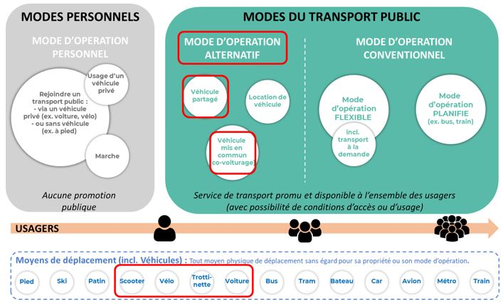

Les modes et sous-modes d&eacute;finis comme des 'moyens de transport' peuvent être caract&eacute;ris&eacute;s en termes de types de fonctionnement, c'est-à-dire des façons dont ils sont op&eacute;r&eacute;s.

Ce document distingue les types suivants de 'mode de fonctionnement' :

- **Mode de fonctionnement conventionnel** : le mode de fonctionnement traditionnel qui est propos&eacute; sous forme d'une offre de transport public annonc&eacute;e et/ou flexible, selon un horaire fixe et/ou flexible. Ce mode de fonctionnement suit soit un horaire et des itin&eacute;raires fixes, soit est li&eacute; à un r&eacute;seau/horaires fixes mais offre de la flexibilit&eacute;, afin d'optimiser par exemple le service ou de r&eacute;pondre à la demande des passagers ;
- **Mode alternatif de fonctionnement** : tout mode de fonctionnement public annonc&eacute; diff&eacute;rent du mode de fonctionnement conventionnel, notamment le partage de v&eacute;hicules, la location de v&eacute;hicules et le covoiturage ;
- **Mode personnel de fonctionnement** : un mode de transport priv&eacute; excluant toute utilisation publiquement annonc&eacute;e.

Le champ d'application de ce document concerne le mode de fonctionnement alternatif, à l'exception de la location de v&eacute;hicules. La distinction entre les modes de fonctionnement alternatif et conventionnel repose sur le fait qu'un mode conventionnel repose sur un ensemble de caract&eacute;ristiques : les conducteurs sont des employ&eacute;s, la flotte est d&eacute;tenue par un op&eacute;rateur ou une autorit&eacute;, et la topologie du r&eacute;seau est d&eacute;finie à l'avance et repose sur des lignes et des modèles de trajets ; tandis que les modes alternatifs peuvent ne pas remplir une ou plusieurs de ces caract&eacute;ristiques.

Ce document concerne le mode alternatif de fonctionnement.

# Cas d'utilisation & Concepts rattach&eacute;s

La prise en charge par NeTEx des modes alternatifs vise à inclure l'&eacute;change de donn&eacute;es de r&eacute;f&eacute;rence afin de permettre une information voyageur int&eacute;gr&eacute;e pour tous les modes. On suppose que l'&eacute;change de donn&eacute;es dynamiques, telles que les statuts et pr&eacute;visions en temps r&eacute;el, les offres de trajets en temps r&eacute;el, etc., sera couvert par d'autres API pour les fonctions dynamiques li&eacute;es aux modes alternatifs qui ne relèvent pas du champ d'application de NeTEx, mais qui sont incluses dans le p&eacute;rimètre de Transmodel et, pour la plupart, couvertes par SIRI pour l'&eacute;change de donn&eacute;es.

Le champ de couverture du profil France Nouveaux Modes partie Statique inclut les cas d'utilisation suivants. Pour les aspects tarification et parking, il convient de se reporter aux profils France NeTEx associ&eacute;s.

## Description du r&eacute;seau

| **Cas d'utilisation** | **Description** | **&eacute;l&eacute;ments de mod&eacute;lisation concern&eacute;s dans ce document** |
| --- | --- | --- |
| Recherche de localisation : Parc-relais | Trouver l'emplacement d'un parc-relais | **PARKING** |
| Recherche de localisation : Stations de v&eacute;lopartage | Trouver une station de v&eacute;lopartage | **STOP PLACE**, **SITE** |
| Recherche de localisation : Stations d'autopartage | Trouver une station d'autopartage | Modèle **PARKING** |
| Recherche de localisation : Stations de ravitaillement accessibles au public pour v&eacute;hicules à combustion, stations de recharge pour v&eacute;hicules &eacute;lectriques | Trouver des stations de ravitaillement accessibles au public<br><br>**NB** : les d&eacute;tails sont d&eacute;finis dans le Profil FR Parking | **PARKING MODEL**, |
| Recherche de localisation : Stationnement s&eacute;curis&eacute; pour v&eacute;hicules | Trouver des stationnements s&eacute;curis&eacute;s pour v&eacute;los et autres types de v&eacute;hicules, y compris horaires d'ouverture et dur&eacute;es de stationnement autoris&eacute;es | Modèle **PARKING** |
| V&eacute;hicules disponibles | Fourniture de services avec des v&eacute;hicules enregistr&eacute;s | Modèles **FLEET** et **VEHICLE MODE** |
| Couverture de service | Disponibilit&eacute; d'un service alternatif dans une zone donn&eacute;e | **MOBILITY SERVICE** |
| D&eacute;couverte de services | Services en ligne disponibles | **ON-LINE SERVICE** |

_Table 2 - Cas d'utilisation Description du r&eacute;seau_

## Planification de trajets Multi Modes (yc NM)

A compl&eacute;ter ult&eacute;rieurement

## Informations relatives aux trajets

| **Cas d'utilisation** | **Description** | **&eacute;l&eacute;ments de mod&eacute;lisation concern&eacute;s dans ce document** |
| --- | --- | --- |
| &eacute;quipements et services disponibles (Siège Auto, Navigation, Nombre de places, …) | &eacute;quipements que le voyageur peut trouver dans le mode alternatif | **FACILITY SET**, **FACILITY**, **EQUIPMENT** |
| Comment r&eacute;server un service d'autopartage, un v&eacute;lo en libre-service, etc. | Inclut les canaux de vente, les m&eacute;thodes de d&eacute;livrance, les moyens de paiement | **BOOKING ARRANGEMENTS** |
| Comment acc&eacute;der à un v&eacute;hicule | Proc&eacute;dures d'accès à un v&eacute;hicule partag&eacute; | **SERVICE ACCESS CODE**, **VEHICLE ACCESS ASSIGNMENT** |
| Où et comment payer pour un stationnement, un plein d'hydrogène, de carburant ou une recharge &eacute;lectrique | Inclut les canaux de vente, les m&eacute;thodes de d&eacute;livrance, les moyens de paiement | **BOOKING ARRANGEMENTS**, **TICKETING EQUIPMENT**, CHARGING EQUIPEMENT |

_Table 3 - Cas d'utilisation Information g&eacute;n&eacute;rale_

# Description fonctionnelle

À la suite d'un mode de fonctionnement alternatif, de **nouveaux services** sont propos&eacute;s et mis en œuvre à destination des voyageurs.

Cette section d&eacute;crit ces **nouveaux services** à travers certains aspects et fonctions qui les caract&eacute;risent.

Les **deux aspects suivants** sont particulièrement pertinents :

- **Types de v&eacute;hicules** : v&eacute;los, voitures, types de v&eacute;los, types de voitures, etc., caract&eacute;ris&eacute;s en particulier par leur **&eacute;quipement**,
- **Modes de fonctionnement** : covoiturage, partage, location, usage personnel,

Les **domaines fonctionnels** principalement concern&eacute;s par les modes alternatifs sont regroup&eacute;s dans les cat&eacute;gories suivantes :

- **Fourniture d'informations (au voyageur)** : activit&eacute;s consistant à fournir au voyageur des informations sur les règles et conditions li&eacute;es à un service de transport,
- **Services aux voyageurs** : activit&eacute;s (g&eacute;n&eacute;ralement initi&eacute;es par les utilisateurs) visant à faciliter ou permettre un d&eacute;placement,
- **Services op&eacute;rationnels** : activit&eacute;s r&eacute;alis&eacute;es par les acteurs responsables de l'exploitation d'un service.

Les sections suivantes d&eacute;crivent plus en d&eacute;tail les **domaines fonctionnels**, en les pr&eacute;sentant selon les **fonctions (activit&eacute;s)**, avec une courte d&eacute;finition de chaque fonction.

Comme mentionn&eacute; pr&eacute;c&eacute;demment au point 0, l'objectif principal des sections suivantes est **d'illustrer le p&eacute;rimètre du modèle conceptuel de donn&eacute;es d&eacute;velopp&eacute;**, en mettant l'accent sur la **fourniture d'informations**.

Les **sp&eacute;cificit&eacute;s de chaque mode de fonctionnement particulier** sont d&eacute;crites dans les sections correspondantes (partage de v&eacute;los, v&eacute;lo, covoiturage, partage de voitures).

## Fonctions relatives à la mise à disposition d'informations aux voyageurs

Les fonctions suivantes sont consacr&eacute;es à la fourniture d'informations aux voyageurs. Dans la plupart des cas, la fourniture d'informations peut être g&eacute;n&eacute;rale (concernant une zone entière) ou sp&eacute;cifique, li&eacute;e à une requête particulière d'un utilisateur avec des paramètres d&eacute;finis.

### Informations sur la r&eacute;servation

Cette activit&eacute; consiste à fournir des informations sur les règles de r&eacute;servation ainsi que des donn&eacute;es compl&eacute;mentaires permettant à l'utilisateur de d&eacute;cider de r&eacute;server un service. Les informations suivantes sont consid&eacute;r&eacute;es comme pertinentes :

- M&eacute;thodes de r&eacute;servation : description du mode de r&eacute;servation (par Internet, via une agence, etc.)
- Conditions de r&eacute;servation : d&eacute;lai minimal de r&eacute;servation, n&eacute;cessit&eacute; d'une garantie, etc.
- Coordonn&eacute;es de contact : URL, adresse, etc. pour contacter le service de r&eacute;servation
- Nombre/type de v&eacute;hicules disponibles par station ;
- Règles d'utilisation : conditions temporelles, lieux de prise en charge et de restitution, p&eacute;nalit&eacute;s, profil utilisateur, etc.

### Informations sur la disponibilit&eacute; du service

Cette activit&eacute; consiste à fournir des informations sur la disponibilit&eacute; d'un mode de fonctionnement particulier, par exemple les heures d'ouverture

### Informations sur la disponibilit&eacute; des v&eacute;hicules des modes alternatifs

Cette activit&eacute; consiste à fournir des informations, statiques (ou dynamiques), sur la disponibilit&eacute; de v&eacute;hicules dans les zones d&eacute;di&eacute;es aux modes alternatifs.

- L'information statique correspond à la capacit&eacute; pr&eacute;vue des zones.
- L'information dynamique (pr&eacute;sence r&eacute;elle de v&eacute;hicules disponibles) peut être d&eacute;riv&eacute;e des donn&eacute;es de localisation des v&eacute;hicules et des donn&eacute;es pr&eacute;vues de disponibilit&eacute;.

### Informations sur l'accès à l'infrastructure

Cette activit&eacute; consiste à fournir des informations indiquant où et comment acc&eacute;der à un emplacement d&eacute;di&eacute; à un mode alternatif (partage de v&eacute;hicule), et où restituer le v&eacute;hicule après usage. L'information est statique.

### Informations sur la localisation des v&eacute;hicules

Cette activit&eacute; consiste à fournir des informations dynamiques indiquant où trouver un v&eacute;hicule ou où il a &eacute;t&eacute; d&eacute;pos&eacute;.

### Informations sur l'accès au v&eacute;hicule

Cette activit&eacute; consiste à fournir des informations expliquant comment d&eacute;verrouiller un v&eacute;hicule avant usage et comment le s&eacute;curiser après usage, en particulier pour les services de partage. Les informations peuvent être statiques ou dynamiques.

### Informations tarifaires

Cette activit&eacute; consiste à fournir des informations sur les règles tarifaires, les formules de prix (à l'heure, à la semaine, au mois), les r&eacute;ductions, etc. L'information est g&eacute;n&eacute;ralement statique.

### Informations sur le paiement

Cette activit&eacute; consiste à fournir des informations sur les moyens et m&eacute;thodes de paiement, ainsi que les lieux de paiement. L'information est g&eacute;n&eacute;ralement statique.

Elle comprend :

- M&eacute;thodes de paiement : espèces, carte bancaire, paiement mobile, etc.
- Garanties de paiement : garantie par carte bancaire, coordonn&eacute;es bancaires, enregistrement d'identit&eacute;.

### Informations sur l'&eacute;quipement des zones de modes alternatifs

Cette activit&eacute; consiste à fournir des informations sur les &eacute;quipements pr&eacute;sents dans les emplacements d&eacute;di&eacute;s aux modes alternatifs : installations de stockage s&eacute;curis&eacute;, stations de recharge, mais aussi bornes de billetterie, guichets d'information, etc.

Les informations peuvent être statiques (pr&eacute;sence pr&eacute;vue) ou dynamiques (&eacute;tat actuel de fonctionnement).

### Informations sur les parkings des modes alternatifs

Cette activit&eacute; consiste à fournir des informations sur les zones de stationnement où un v&eacute;hicule peut être gar&eacute; et laiss&eacute; sans surveillance, ainsi que sur le nombre de places disponibles pour le d&eacute;pôt. Cette information est dynamique.

### Informations sur l'inscription

Cette activit&eacute; consiste à fournir des informations sur le processus d'inscription pour être reconnu comme utilisateur du service.

Les informations pertinentes sont :

- Informations d'identit&eacute; : nom, pr&eacute;nom, date et lieu de naissance, adresse de r&eacute;sidence
- Coordonn&eacute;es : adresse e-mail du service, num&eacute;ro de mobile et adresse e-mail de l'utilisateur
- Informations suppl&eacute;mentaires : donn&eacute;es de paiement (carte bancaire, compte bancaire) - principalement utilis&eacute;es comme garantie de paiement.

### Informations sur les services de r&eacute;paration

Cette activit&eacute; consiste à fournir des informations sur les lieux où la r&eacute;paration et/ou la maintenance des v&eacute;hicules est possible. Une description des r&eacute;parations possibles peut être fournie (ex. : r&eacute;paration de crevaisons, remplacement de chaîne, r&eacute;paration d'&eacute;clairage). Ces informations peuvent être statiques ou dynamiques (disponibilit&eacute; en temps r&eacute;el).

## Services aux voyageurs

Les paragraphes suivantes donnent des exemples de services aux voyageurs. Cette liste n'est pas exhaustive, mais fournit des exemples typiques rencontr&eacute;s dans le contexte des nouveaux modes. Par exemple, les fonctions d'aide au voyage comme la planification d'itin&eacute;raire ne sont pas d&eacute;crites ici, car elles sont largement couvertes par les normes li&eacute;es aux modes conventionnels.

### R&eacute;servation

La r&eacute;servation est un service aux voyageurs (&eacute;lectronique ou non) d&eacute;di&eacute; à la r&eacute;servation d'un v&eacute;hicule ou d'un trajet à une date et heure d&eacute;finie dans le cadre de la mobilit&eacute; urbaine.

### Inscription

L'inscription est un service aux voyageurs consid&eacute;r&eacute; comme l'identification initiale, virtuelle ou physique, de l'utilisateur pour acc&eacute;der à un service de transport. Elle peut être effectu&eacute;e à distance via une plateforme Internet (PC ou mobile) ou physiquement dans des lieux sp&eacute;cifiques.

### Contrôle d'accès au v&eacute;hicule

Service consistant à v&eacute;rifier et à activer les m&eacute;canismes de d&eacute;verrouillage et de verrouillage d'un v&eacute;hicule utilis&eacute; dans le cadre d'un mode alternatif.

### Contrôle d'accès aux stations

Activit&eacute; consistant à autoriser ou refuser l'accès à une station d'arrêt à des v&eacute;hicules fonctionnant selon des modes alternatifs.

### Paiement

Le paiement est un service permettant de r&eacute;gler un service de transport. Dans le contexte des modes alternatifs, il s'effectue principalement par moyens &eacute;lectroniques.

### Planification de trajet

La planification de trajet est applicable au contexte du covoiturage.

Les outils modernes d'aide au d&eacute;placement permettent aux voyageurs de pr&eacute;parer leur trajet, notamment en r&eacute;pondant à une demande de trajet. Cette fonction identifie les lieux de d&eacute;part et d'arriv&eacute;e d'un voyage et propose une ou plusieurs solutions de d&eacute;placement, en prenant en compte les contraintes ou pr&eacute;f&eacute;rences de l'utilisateur (dur&eacute;e minimale, nombre d'interconnexions, tarif le plus bas, etc.).

Le système propose ensuite un modèle de trajet, incluant les transferts à pied ou en correspondance, ainsi que les diff&eacute;rents modes de transport public et alternatifs. Il est possible de calculer une dur&eacute;e pr&eacute;cise (ou moyenne), les coûts correspondants, la compatibilit&eacute; avec les personnes à mobilit&eacute; r&eacute;duite, etc.

Si la demande concerne un trajet le jour même, les conditions suivies en temps r&eacute;el peuvent être prises en compte pour affiner la proposition (ex. : perturbations, retards, annulations).

## Services op&eacute;rationnels

### Transfert de v&eacute;hicules

Activit&eacute; consistant à transf&eacute;rer des v&eacute;hicules à travers la ville, notamment pour assurer un bon &eacute;quilibre entre les stations de partage de v&eacute;hicules (disponibilit&eacute; de v&eacute;hicules et d'emplacements).

### R&eacute;paration et maintenance

Fourniture de services de r&eacute;paration et d'entretien pour tous types de v&eacute;hicules, dans des zones &eacute;quip&eacute;es d'outils et de pièces de rechange.

### Recharge et ravitaillement

Processus de recharge des v&eacute;hicules &eacute;lectriques (par exemple dans une station de partage) et de ravitaillement en carburant des v&eacute;hicules thermiques lorsque n&eacute;cessaire.

## Partage de v&eacute;hicules (Vehicle Sharing)

### Cycles

Ce paragraphe d&eacute;crit certains aspects sp&eacute;cifiques suppl&eacute;mentaires li&eacute;s au cyclisme.

Le cyclisme d&eacute;signe l'utilisation d'un cycle par un utilisateur pour effectuer un d&eacute;placement. Dans le cadre du mode du partage de v&eacute;los (VLS).

La mod&eacute;lisation des informations li&eacute;es au cyclisme peut être utilis&eacute;e pour fournir des services aux voyageurs ; par exemple, les algorithmes existants de planification d'itin&eacute;raires peuvent utiliser des donn&eacute;es relatives au cyclisme pour calculer des trajets multimodaux incluant la location et le partage de v&eacute;los.

Le partage de v&eacute;los repose sur une relation commerciale entre un utilisateur et une organisation mettant des v&eacute;los à disposition.

Les types de cycles suivants sont pris en compte dans ce document :

- **Cycle classique** : v&eacute;hicule compos&eacute; de roues attach&eacute;es à un cadre. Il est propuls&eacute; par la force musculaire humaine ;
- **Cycle à propulsion &eacute;lectrique** : v&eacute;hicule &eacute;quip&eacute; d'un moteur &eacute;lectrique de faible puissance ; entrent dans cette cat&eacute;gorie les v&eacute;los &eacute;lectriques, mais aussi les gyropodes, hoverboards, monocycles motoris&eacute;s, etc.

#### Partage de v&eacute;los

Le partage de v&eacute;los est un mode d'exploitation d&eacute;di&eacute; à la location de v&eacute;los g&eacute;n&eacute;ralement de courte dur&eacute;e, dans lequel le v&eacute;lo peut être pris et d&eacute;pos&eacute; à diff&eacute;rents endroits, n'importe où en zone urbaine.

L'une des principales diff&eacute;rences entre le partage de v&eacute;los et la location de v&eacute;los r&eacute;side dans leur mode de fonctionnement. Le partage de v&eacute;los s'appuie sur un ensemble d'utilisateurs abonn&eacute;s qui partagent le service, en g&eacute;n&eacute;ral pour des trajets courts en dur&eacute;e ou en distance, moyennant un abonnement mensuel ou annuel fixe. Le tarif d&eacute;pend d'un ensemble de paramètres, par exemple le « profil de voyageur fr&eacute;quent ».

##### R&eacute;servation

Les services de partage de v&eacute;los offrent une r&eacute;servation à court terme permettant aux utilisateurs de v&eacute;rifier la station disponible la plus proche, de r&eacute;server un v&eacute;lo et de s'enregistrer en peu de temps. Cependant, la plupart du temps, il n'y a pas de r&eacute;servation à l'avance ; l'utilisateur prend un des v&eacute;los disponibles à la station la plus proche.

##### Tarifs et paiement

Dans le cadre du partage de v&eacute;los, dans la plupart des cas, les utilisateurs paient le service une seule fois lors de l'abonnement, puis chaque fois qu'ils ont utilis&eacute; le v&eacute;lo au-delà de la dur&eacute;e gratuite de location.

##### Sc&eacute;narios de disponibilit&eacute;

Les sc&eacute;narios suivants sont possibles selon le type de système de partage de v&eacute;los :

- **Dock&eacute; (stationn&eacute;)** : les v&eacute;los sont obtenus à partir d'un emplacement pr&eacute;d&eacute;termin&eacute; sp&eacute;cifique tel qu'une station de v&eacute;los où la station communique la disponibilit&eacute; d'un v&eacute;lo et enregistre quand il est pris et retourn&eacute; ainsi que par qui. La station dispose de systèmes pour lib&eacute;rer un v&eacute;lo au voyageur potentiel. Une station peut en fait avoir une capacit&eacute; sup&eacute;rieure au nombre strict de docks si elle dispose de personnel capable d'apporter des v&eacute;hicules suppl&eacute;mentaires depuis ou vers un stockage afin d'&eacute;quilibrer la demande - ce que l'on appelle un « service voiturier ». Il peut être tout aussi important pour un utilisateur qu'il y ait un dock vide disponible pour rendre son v&eacute;lo à la fin de son trajet, sinon il risque une recherche longue et même une p&eacute;nalit&eacute; pour utilisation prolong&eacute;e.
- **Station virtuel** : Idem que le point pr&eacute;c&eacute;dent sans dock physique associ&eacute;. Les cycles peuvent être obtenus / restitu&eacute; dans des zones virtuelles d&eacute;finis par l'op&eacute;rateur de transport.
- **Flottant (free-floating)** : pour les v&eacute;los d'un système de partage sans station, qui possèdent g&eacute;n&eacute;ralement un verrou d'immobilisation int&eacute;gr&eacute; à leur cadre, une station n'est pas n&eacute;cessaire. Le v&eacute;lo peut être laiss&eacute; à n'importe quel endroit sûr dans la zone du service et être immobilis&eacute; ou r&eacute;activ&eacute; à l'aide d'un code.

##### G&eacute;orep&eacute;rage et zones d'usage autoris&eacute;

- La plupart des systèmes de partage de v&eacute;hicules (v&eacute;los, trottinettes, voitures, etc.) fonctionnent uniquement dans une zone spatiale sp&eacute;cifique. Cette zone peut être indiqu&eacute;e via des cartes ou des informations aux usagers, ou, pour les v&eacute;hicules &eacute;quip&eacute;s de systèmes d'immobilisation à distance, être appliqu&eacute;e &eacute;lectroniquement grâce à la d&eacute;tection GNSS.
- De plus, certaines zones à l'int&eacute;rieur de la zone op&eacute;rationnelle peuvent être restreintes pour des raisons op&eacute;rationnelles, de s&eacute;curit&eacute; ou autres, par exemple pour contrôler la pollution environnementale. Des sanctions financières peuvent être appliqu&eacute;es en cas de violation des limites restreintes à tout moment ou à des moments pr&eacute;cis.
- Les zones autoris&eacute;es peuvent être d&eacute;crites à l'aide de zones de contraintes de mobilit&eacute;, chacune exprimant une &eacute;tendue spatiale et les usages permis.

### Voitures

#### Partage de Voiture

Le partage de voitures consiste en l'utilisation d'un v&eacute;hicule appartenant à un fournisseur commercial de partage de voitures pour une dur&eacute;e sp&eacute;cifi&eacute;e et pr&eacute;alablement convenue.

Le partage de voitures se distingue du covoiturage en ce que c'est le v&eacute;hicule qui est partag&eacute;, et non un groupe de voyageurs utilisant simultan&eacute;ment le même v&eacute;hicule pour effectuer un trajet.

Les principaux types de partage de voitures sont :

- Mise à disposition de v&eacute;hicules par une organisation (partage commercial) ;
- Mise à disposition entre particuliers (club d'autopartage) ;
- Location de voitures classique.

Seule la gestion du premier type est int&eacute;gr&eacute;e au profil France NeTex.

Les types de voitures pris en compte dans ce document sont :

- Voitures conventionnelles : voitures de diff&eacute;rentes tailles, &eacute;quipements et types de boîte de vitesses utilisant un carburant liquide conventionnel (essence ou diesel) ; les voitures hybrides ne n&eacute;cessitant pas de recharge peuvent aussi faire partie de cette cat&eacute;gorie ;
- Voitures à propulsion &eacute;lectrique : voitures n&eacute;cessitant une recharge après les trajets ou à la fin de la p&eacute;riode de partage ;

##### Partage commercial de voitures

Plusieurs types de partage commercial existent : Business to Business (B2B) et Business to Consumer (B2C). Seul le B2C est int&eacute;gr&eacute; au pr&eacute;sent profil France -

Il est à noter que NeTEx permet de faire du B2B.

- Business to Consumer (B2C) : c'est le partage de voitures conventionnel, où une organisation dispose d'un parc de v&eacute;hicules disponibles en partage aux consommateurs enregistr&eacute;s sur demande.

##### Enregistrement

Pour la majorit&eacute; des services commerciaux, l'utilisateur doit s'enregistrer auprès de la soci&eacute;t&eacute; de partage de voitures. Cet enregistrement permet de mettre en place un mode de paiement, d'enregistrer les informations du conducteur pour l'utilisation du service, et &eacute;ventuellement un d&eacute;pôt couvrant les risques en cas de dommages ou perte du v&eacute;hicule. Cet enregistrement cr&eacute;e aussi les applications n&eacute;cessaires pour acc&eacute;der et utiliser le service.

##### Sc&eacute;narios de disponibilit&eacute;

Selon le type de partage de voitures, le v&eacute;hicule peut se trouver à un emplacement pr&eacute;d&eacute;termin&eacute; (place de stationnement pour partage de voitures) ou à l'endroit où il a &eacute;t&eacute; laiss&eacute; après son dernier usage. Plusieurs sc&eacute;narios existent autour de ces deux conditions :

- **Boucle ferm&eacute;e** : la voiture est prise et rendue au même emplacement, aussi appel&eacute; « voyage en boucle à partir d'une station » ;
- **Aller simple** : la voiture est prise à un endroit et rendue à un autre emplacement pr&eacute;d&eacute;fini, aussi appel&eacute; « station de pool en libre-service » ;
- **Free floating (libre-service sans station)** : la voiture est prise là où elle a &eacute;t&eacute; laiss&eacute;e pr&eacute;c&eacute;demment et rendue où le trajet se termine. L'application de partage guide l'utilisateur vers l'emplacement le plus proche ou accessible d'un v&eacute;hicule adapt&eacute;, &eacute;galement appel&eacute; « zone op&eacute;rationnelle « free floating» ;
- Installations sp&eacute;ciales de docking (pour v&eacute;hicules &eacute;lectriques).

Certains types de v&eacute;hicules n&eacute;cessitent des emplacements adapt&eacute;s à leur type de carburant. Les v&eacute;hicules &eacute;lectriques doivent être gar&eacute;s à des endroits &eacute;quip&eacute;s de bornes de recharge. Par cons&eacute;quent, l'option free floating n'est pas toujours applicable.

##### Tarifs et paiement

Plusieurs modèles de paiement existent pour ce service :

- Service par abonnement donnant droit à un nombre d'utilisations et un kilom&eacute;trage convenus ;
- Paiement au kilomètre, avec facturation bas&eacute;e sur les kilomètres parcourus ;
- Paiement au temps d'utilisation, facturant la dur&eacute;e pendant laquelle le v&eacute;hicule est utilis&eacute; et indisponible pour d'autres ;
- Ou une combinaison des deux (temps et distance).

Le pr&eacute;sent profil ne d&eacute;crit pas les modalit&eacute;s de tarification. Le Profil NeTex France Tarif s'applique pour ces cas d'utilisation.

## Covoiturage

### Introduction

Le covoiturage consiste &agrave; partager des voitures particulières (ou &eacute;ventuellement d’autres types de v&eacute;hicules ou modes de transport) entre des voyageurs pour des trajets particuliers ou des portions de trajets (le plus souvent, le conducteur et les passagers ne partagent pas la même origine ni la même destination).

Dans le pr&eacute;sent document, le covoiturage est consid&eacute;r&eacute; comme planifi&eacute; et organis&eacute;, et non informel.

Le covoiturage n’est pas toujours organis&eacute; sur l’int&eacute;gralit&eacute; d’un trajet. En particulier pour les longs trajets, il est courant que les passagers ne participent qu’&agrave; une partie du parcours et versent une contribution proportionnelle &agrave; la distance parcourue.

### Covoiturage g&eacute;n&eacute;rique

Les conducteurs proposent une place pour des trajets sp&eacute;cifiques, &agrave; une date et une heure donn&eacute;es, via un service en ligne (g&eacute;n&eacute;ralement un site web ou une application). Les passagers consultent ces offres et s&eacute;lectionnent celle qui leur convient.

Diff&eacute;rents algorithmes de mise en relation offre-demande sont disponibles. Une fois qu’un passager a trouv&eacute; une offre appropri&eacute;e (qui peut concerner une partie du trajet propos&eacute; ou n&eacute;cessiter une l&eacute;gère modification du parcours), un contact est &eacute;tabli entre le conducteur et le passager afin de convenir des d&eacute;tails du trajet.

La r&eacute;servation finale (une fois tous les d&eacute;tails convenus) et le paiement peuvent varier selon le service de covoiturage utilis&eacute;.

### Covoiturage dynamique

\[Non retenu dans le cadre du profil France : Pas retenu pour L’instant 15/01/26\]. Ce n’est pas du planif&eacute;

Le covoiturage dynamique est similaire au covoiturage conventionnel, mais permet la mise en relation une fois le trajet commenc&eacute;. Il est principalement adapt&eacute; au contexte urbain (par opposition aux longues distances, g&eacute;n&eacute;ralement interurbaines et planifi&eacute;es &agrave; l’avance).

### Fonctions du covoiturage

Les paragraphes suivants d&eacute;crivent les fonctions du covoiturage

#### Tarification

\[Description A confirmer dans le profil FR\] 15/01/26 renvoyer vers le profil Tarif\] Permet de failre les abn

Le prix que le passager doit payer pour son trajet en covoiturage est cens&eacute; couvrir une partie des coûts du conducteur (carburant, coûts du v&eacute;hicule, etc.), mais ne constitue jamais un moyen pour le conducteur de r&eacute;aliser un b&eacute;n&eacute;fice (contrairement aux taxis et aux voitures avec chauffeur).

Le principe de base de la tarification consiste &agrave; calculer le prix en divisant la somme du carburant, des p&eacute;ages &eacute;ventuels, de la d&eacute;pr&eacute;ciation li&eacute;e &agrave; l’achat et &agrave; l’entretien du v&eacute;hicule, de l’assurance et des taxes pay&eacute;es par le conducteur, r&eacute;partie entre les voyageurs proportionnellement &agrave; la distance parcourue par le passager et au nombre de personnes ayant partag&eacute; le v&eacute;hicule.

Une tarification bas&eacute;e sur la distance a &eacute;galement &eacute;t&eacute; propos&eacute;e par certains services de covoiturage (ind&eacute;pendamment du nombre de voyageurs, sur la base du nombre maximal de voyageurs).

Il est &agrave; noter que la tarification n&eacute;cessite presque toujours un accord sur la distance du trajet avant le d&eacute;part (la dur&eacute;e du trajet n’entre pas dans le calcul du prix). Le d&eacute;tour effectu&eacute; par un conducteur pour prendre un passager doit &eacute;galement être pris en compte.

Il convient &eacute;galement de noter que la tarification n’a pas toujours lieu : dans certains cas, il peut s’agir d’un &eacute;change de services ou d’un accord pour être conducteur lors d’un trajet futur.

#### Preuve de covoiturage

\[Pas de preuve de port&eacute;e par NeTex\] Int&eacute;rêt

Pour être pay&eacute; ou pour pouvoir b&eacute;n&eacute;ficier de certains avantages r&eacute;serv&eacute;s aux conducteurs en covoiturage (par exemple le stationnement gratuit ou l’accès aux voies r&eacute;serv&eacute;es aux v&eacute;hicules &agrave; occupation multiple), le conducteur peut avoir besoin d’une preuve de covoiturage.

Cette preuve peut &eacute;galement être requise &agrave; des fins fiscales pour le conducteur (contrôle des revenus) ou pour le voyageur (preuve d’achat lorsqu’un remboursement est possible, par exemple pour les employ&eacute;s d’une entreprise).

Il n’est pas toujours possible d’obtenir une preuve de covoiturage et il n’existe pas de m&eacute;thode totalement fiable pour l’obtenir. En pratique, cette preuve peut être une d&eacute;claration personnelle, dans laquelle le covoitureur atteste avoir effectivement pratiqu&eacute; le covoiturage ce jour-l&agrave;. Cette d&eacute;claration peut être v&eacute;rifi&eacute;e, par exemple en contrôlant les plaques d’immatriculation ou, sur des voies d&eacute;di&eacute;es, en v&eacute;rifiant le nombre de personnes &agrave; l’int&eacute;rieur du v&eacute;hicule.

#### Inscription

- Valable pour Partage & Covoiturage – Description de service Usage Parameter – Vehicle Sharing Service \[A int&eacute;grer dans le Profil\] -VehicleAccessCredential.

&eacute;tant donn&eacute; que le covoiturage est une activit&eacute; de personne &agrave; personne, les services sont cens&eacute;s offrir un très haut niveau de confiance et de s&eacute;curit&eacute; (s&eacute;curit&eacute; personnelle, en plus de la s&eacute;curit&eacute; financière).

Par cons&eacute;quent, l’inscription implique le plus souvent plusieurs niveaux de v&eacute;rification et de validation de l’identit&eacute;, notamment :

- L’adresse e-mail (fournie pour mettre en relation deux utilisateurs) ;
- Le num&eacute;ro de t&eacute;l&eacute;phone (fourni pour mettre en relation deux utilisateurs) ;
- Le lien vers un r&eacute;seau social (afin que les utilisateurs puissent consulter le type d’activit&eacute; sur un compte Facebook, par exemple) ;
- Le num&eacute;ro de carte d’identit&eacute; ou de passeport (seul le fait que la v&eacute;rification a &eacute;t&eacute; effectu&eacute;e est communiqu&eacute; aux autres utilisateurs) ;
- Le permis de conduire et l’assurance.

#### M&eacute;canismes de mise en relation et de r&eacute;servation des trajets

\[Pr&eacute;ciser si via Site ou Num Tel\] Laisser la partie explicative / Seule info n&eacute;cessaire a l’echange cf Booking Arrangement

Les m&eacute;canismes de mise en relation des trajets peuvent être très simples (correspondance origine/destination et fenêtre temporelle) ou assez complexes, pouvant int&eacute;grer des fonctionnalit&eacute;s telles que :

- L’utilisation d’un algorithme r&eacute;el de planification de trajets bas&eacute; sur le r&eacute;seau routier (d’autres peuvent se contenter de « corridors » g&eacute;ographiques, de simples points de passage ou de villes) ;
- L’&eacute;largissement possible de la zone autour des lieux de d&eacute;part et d’arriv&eacute;e ;
- L’int&eacute;gration possible de trajets multimodaux ;
- L’int&eacute;gration de zones de covoiturage (et &eacute;ventuellement une aide &agrave; leur localisation) ;
- L’int&eacute;gration de d&eacute;tours possibles ;
- L’int&eacute;gration de la correspondance des profils utilisateurs ;
- L’int&eacute;gration de connexions possibles avec les transports publics (en proposant aux voyageurs de commencer ou de terminer leur trajet en transport public ou, dans certains cas, de basculer vers le covoiturage en cas de perturbation des transports publics) ;
- L’enregistrement des demandes et la r&eacute;ception d’alertes lorsqu’une offre correspondante est disponible (par exemple alertes SMS, e-mails, notifications dans les applications et autres formats de messagerie).

#### Paiement

Pas trait&eacute; dans ce Profil : Cf Profil FR Tarification

Les services de covoiturage intègrent un m&eacute;canisme de paiement s&eacute;curis&eacute;, jouant le rôle d’interm&eacute;diaire entre le conducteur et le voyageur. Les moyens de paiement les plus courants, tels que la carte de cr&eacute;dit, PayPal, le virement bancaire (pour les conducteurs), etc., sont g&eacute;n&eacute;ralement accept&eacute;s.

Diff&eacute;rents sc&eacute;narios et caract&eacute;ristiques peuvent exister :

- Il n’y a pas de paiement direct du voyageur au conducteur ;
- Le voyageur paie via le service en ligne (site web ou application) au moment de la r&eacute;servation du trajet ;
- Le paiement inclut g&eacute;n&eacute;ralement le coût du trajet, les frais de service et les taxes &eacute;ventuelles ;
- Une fois le trajet termin&eacute; et si aucun &eacute;v&eacute;nement particulier n’a &eacute;t&eacute; signal&eacute;, le conducteur est g&eacute;n&eacute;ralement pay&eacute; quelques jours après le voyage, afin de laisser au voyageur le temps de signaler d’&eacute;ventuels problèmes ;
- En cas de problème ou si, pour une raison quelconque, le trajet n’a pas &eacute;t&eacute; effectu&eacute;, le voyageur peut être rembours&eacute; (g&eacute;n&eacute;ralement sous conditions et pas toujours &agrave; 100 % ; les frais de service ne sont en g&eacute;n&eacute;ral pas rembours&eacute;s).

#### Accessibilit&eacute; pour les personnes &agrave; mobilit&eacute; r&eacute;duite

Certains services de covoiturage fournissent une description du v&eacute;hicule et indiquent la capacit&eacute; du conducteur &agrave; transporter des voyageurs en situation de handicap, notamment en fauteuil roulant ; toutefois, ce n’est pas la situation la plus courante et cela reste g&eacute;n&eacute;ralement sp&eacute;cifique &agrave; certains services de covoiturage.

#### Infrastructures

En plus du r&eacute;seau routier lui-même, certaines infrastructures plus sp&eacute;cifiques peuvent être utilis&eacute;es pour le covoiturage.

Les aires de covoiturage sont des zones signal&eacute;es où un conducteur peut prendre ou d&eacute;poser un passager pour commencer ou terminer un trajet en covoiturage. Il n’existe pas de structure pr&eacute;d&eacute;finie pour une aire de covoiturage :

- Il peut s’agir simplement d’une zone signal&eacute;e accessible depuis le r&eacute;seau routier ;
- Elle peut faire partie d’une aire de stationnement ;
- Elle peut être une zone d&eacute;di&eacute;e ;
- Elle peut être ferm&eacute;e ou ouverte ;
- L’accès &agrave; la zone peut être gratuit, contrôl&eacute; ou r&eacute;glement&eacute; ;

L’accès pour les passagers peut se faire uniquement &agrave; pied, mais la zone peut aussi offrir des places de stationnement (sous conditions convenues) permettant aux passagers de laisser leur propre voiture ou leur v&eacute;lo et de commencer un trajet en covoiturage ; ou encore, une aire de covoiturage signal&eacute;e peut être utilis&eacute;e &agrave; d’autres fins (aire de repos, etc.).

Les aires de covoiturage ne sont pas obligatoires pour pratiquer le covoiturage ; elles visent principalement &agrave; le faciliter, &agrave; le promouvoir et &agrave; garantir une prise en charge et une d&eacute;pose en toute s&eacute;curit&eacute;. Dans certains pays, il peut exister des r&eacute;glementations concernant la signalisation et la gestion des aires de covoiturage.

### Utilisateurs du covoiturage

#### G&eacute;n&eacute;ralit&eacute;s

Les profils des utilisateurs du covoiturage sont essentiels pour instaurer la confiance dans le service. Il existe deux principaux types de profils utilisateurs :

- Le profil du conducteur ;
- Le profil du voyageur.

Afin d’offrir un niveau de confiance suffisant, les utilisateurs (et donc les services de covoiturage) attendent la fourniture d’un maximum d’informations, ce qui soulève n&eacute;anmoins des questions potentielles de protection de la vie priv&eacute;e qui doivent être g&eacute;r&eacute;es par les services de covoiturage.

#### Conducteurs

En g&eacute;n&eacute;ral, davantage de donn&eacute;es sont collect&eacute;es pour le conducteur que pour le voyageur. Le niveau de d&eacute;tail fourni varie selon l’&eacute;tape du processus de r&eacute;servation :

- Phase initiale de mise en relation (liste des trajets disponibles) : niveau minimal d’information ;
- S&eacute;lection d’un trajet : informations un peu plus d&eacute;taill&eacute;es (le nom et les coordonn&eacute;es du conducteur ne sont pas fournis, la communication se fait g&eacute;n&eacute;ralement via le service) ;
- Acceptation de la demande par le conducteur : informations complètes.

Les informations suivantes concernant le conducteur sont g&eacute;n&eacute;ralement requises :

- **Nom** (g&eacute;n&eacute;ralement partiellement masqu&eacute; lors des premières &eacute;tapes de la r&eacute;servation) ;
- Permis de conduire et assurance valides ;
- Âge ;
- Niveau de v&eacute;rification du compte du conducteur (adresse e-mail, num&eacute;ro de t&eacute;l&eacute;phone, carte d’identit&eacute;, etc.) ;
- Statistiques du compte du conducteur : nombre de trajets propos&eacute;s, nombre de personnes transport&eacute;es, date de première inscription, date du dernier trajet propos&eacute;, etc. ;
- Style de conduite du conducteur, selon les voyageurs ;
- Caractère bavard ou r&eacute;serv&eacute; du conducteur ;
- Statut fumeur ou non-fumeur ;
- Pr&eacute;sence &eacute;ventuelle d’un animal dans le v&eacute;hicule, même s’il n’est pas pr&eacute;sent lors du trajet concern&eacute; ;
- &eacute;valuations des voyageurs : note moyenne, nombre d’&eacute;valuations, etc. ;
- Commentaires des voyageurs ;
- Type de v&eacute;hicule, incluant &eacute;ventuellement des d&eacute;tails sur celui-ci ;
- Int&eacute;gration aux r&eacute;seaux sociaux : nombre d’amis sur Facebook, etc.

Exigences accept&eacute;es concernant les passagers :

- Possibilit&eacute; de transporter des bagages, avec indication des dimensions ;
- Possibilit&eacute; de d&eacute;tours (y compris en termes de temps et de distance) ;
- Possibilit&eacute; de transporter un animal ;
- &eacute;quipements pour les voyageurs en situation de handicap ;
- Accompagnateurs pour les voyageurs en situation de handicap.

#### Voyageurs

Le profil du voyageur est transmis au conducteur, qui peut alors accepter la demande, engager une discussion avec le voyageur demandeur ou rejeter la demande.

Le profil du voyageur est g&eacute;n&eacute;ralement similaire &agrave; celui du conducteur, &agrave; l’exception des informations sp&eacute;cifiques au conducteur (type de v&eacute;hicule, etc.).

Les conducteurs peuvent &eacute;valuer les voyageurs, tout comme les voyageurs peuvent &eacute;valuer les conducteurs (ils sont g&eacute;n&eacute;ralement tous deux inform&eacute;s de toute &eacute;valuation ou commentaire, comme sur tout r&eacute;seau social).

#### Priorit&eacute;

Le covoiturage peut b&eacute;n&eacute;ficier d’une priorit&eacute; pour l’utilisation des voies de transport public ou d’une priorit&eacute; aux feux de circulation, avec l’autorisation des autorit&eacute;s locales de gestion du trafic. Une information par signalisation sur ces priorit&eacute;s est n&eacute;cessaire, ainsi qu’un moyen robuste de d&eacute;terminer quels v&eacute;hicules pratiquent effectivement le covoiturage &agrave; un instant donn&eacute;.

\[Pas dans le profil &agrave; date : Cf travaux en cours sur les infrastructure velo\]


# Modèle de donn&eacute;es

## Les modes Alternatifs (nouveaux modes)

### Modèle Conceptuel

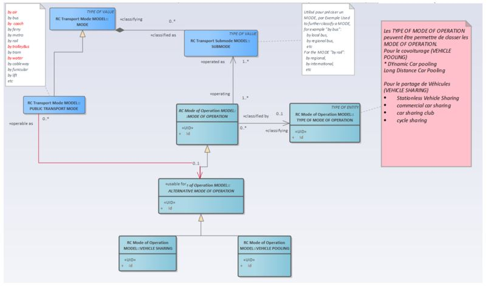

Figure 3 : Mode Alternatif NM

### Modèle de donn&eacute;es

#### MODE OF OPERATION (Mode d'exploitation)

| **Classification** | **Nom** | **Type** | **Cardinalit&eacute;** | **Description** |
| --- | --- | --- | --- | --- |
| ::> | ::> | TypeOfValue | ::> | MODE OF OPERATION h&eacute;rite de TYPE OF VALUE. |
| «PK» | id  | ModeOfOperationIdType | 1:1 | Identifiant du MODE OF OPERATION. |
| «FK» | TypeOfModeOfOperationRef | TypeOfModeOfOperationRef | 0:1 | R&eacute;f&eacute;rence à un TYPE OF MODE OF OPERATION. |
| «FK» | submodes | SubmodeRef | 1:\* | R&eacute;f&eacute;rence à un SUB MODE. |

Table 4 - Mode d'op&eacute;ration

#### Alternative Mode Of Operation (Mode d'exploitation Alternatif)

Il s'agit d'un mode de transport public, diff&eacute;rent des modes conventionnels, par exemple l'auto partage, le v&eacute;lo en libre-service, ou le covoiturage

| **Classification** | **Nom** | **Type** | **Cardinalit&eacute;** | **Description** |
| --- | --- | --- | --- | --- |
| ::> | ::> | ModeOfOperation | ::> | ALTERNATIVE MODE OF OPERATION h&eacute;rite de MODE OF OPERATION. |
| «PK» | id  | AlternativeModeOfOperationIdType | 1:1 | Identifiant d'un ALTERNATIVE MODE OF OPERATION. |

Table 5 - Mode d'op&eacute;ration alternatif

##### COVOITURAGE

A r&eacute;diger ult&eacute;rieurement

##### VEHICLE SHARING (Partage de v&eacute;hicule)

Location de v&eacute;hicule à court terme où le v&eacute;hicule peut être pris et stationn&eacute; à diff&eacute;rents endroits dans la zone urbaine, &eacute;ventuellement sans l'obligation de ramener le v&eacute;hicule à un lieu sp&eacute;cifique.

| **Classification** | **Nom** | **Type** | **Cardinalit&eacute;** | **Description** |
| --- | --- | --- | --- | --- |
| ::> | ::> | AlternativeModeOfOperation | ::> | VEHICLE SHARING h&eacute;rite de ALTERNATIVE MODE OF OPERATION. |
| «PK» | id  | VehicleSharingIdType | 1:1 | Identifiant de VEHICLE SHARING MODEL OF OPERATION. |
| «enum» | VehicleSharingType | VehicleSharingTypeEnum | 0:1 | Valeurs autoris&eacute;es pour un VEHICLE SHARING. Cf la table ci-après |

Table 6 - Paratage de v&eacute;hicule

###### VEHICULE SHARING TYPE (Type de partage de v&eacute;hicule)

Cette table indique les valeurs autoris&eacute;es pour VehicleSharingType dans le cadre du profil France

| **Valeur** | **Description** |
| --- | --- |
| carSharingClub | Car Sharing Club. |
| peerToPeerCarSharingClub | Peer-to-peer Car Sharing Club. |
| vehicleSharing | Partage de v&eacute;hicule |

Table 7 - Type de Partage de v&eacute;hicule

###### TypeOfModeOfOperation

Classification de MODE OF OPERATION.

<div class="joplin-table-wrapper"><table><tbody><tr><th><p><strong>Classification</strong></p></th><th><p><strong>Nom</strong></p></th><th><p><strong>Type</strong></p></th><th><p><strong>Cardinalit&eacute;</strong></p></th><th><p><strong>Description</strong></p></th></tr><tr><td><p>::&gt;</p></td><td><p>::&gt;</p></td><td><p>TypeOfValue</p></td><td><p>::&gt;</p></td><td><p>TYPE OF MODE OF OPERATION h&eacute;rite de TYPE OF VALUE.</p></td></tr><tr><td><p><a id="BKM_2D231185_EAE2_440B_8E14_F78C1D499CE1"></a>«PK»</p></td><td><p>id</p></td><td><p>TypeOfModeOfOperationIdType</p></td><td><p>1:1</p></td><td><p>Identifiant de TYPE OF MODE OF OPERATION.</p><p>Pour le partage de v&eacute;hicule sont autoris&eacute;s&nbsp;:</p><ul><li>Stationless Vehicle Sharing</li><li>Cycle sharing</li><li>Commercial Car sharing</li></ul></td></tr></tbody></table></div>

Table 8 - Type de mode d'op&eacute;ration

## Flotte de v&eacute;hicule

**Statut implémentation : OBLIGATOIRE** : Cette partie du profil doit être implémentée en cohérence avec le contexte.

### Modèle Conceptuel

Le modèle de flotte NM d&eacute;crit la flotte de v&eacute;hicules, d&eacute;finie comme un ensemble de v&eacute;hicules de tout type. Le concept de flotte est g&eacute;n&eacute;ral, c'est-à-dire qu'il ne d&eacute;pend pas du mode d'exploitation, mais il est particulièrement utile pour d&eacute;crire les services offerts par certains modes d'exploitation alternatifs (NM).**

Une flotte appartient à une organisation de transport, un organisme l&eacute;galement constitu&eacute; li&eacute; à un aspect quelconque du système de transport. Une organisation de transport peut poss&eacute;der plusieurs flottes.**

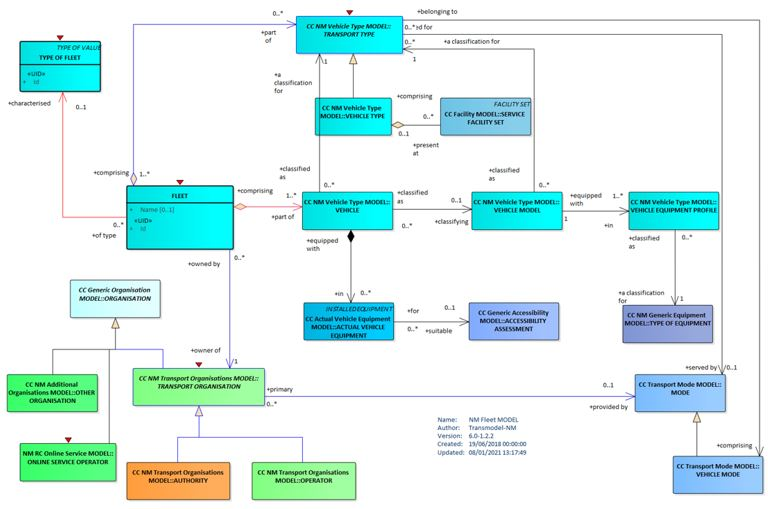

Figure 4 : Flotte de v&eacute;hicule NM

### Modèle de donn&eacute;es

#### Fleet (Flotte)

**Un ensemble de v&eacute;hicule de tout type****.**

| **Classification** | **Nom** | **Type** | **Cardinalit&eacute;** | **Description** |
| --- | --- | --- | --- | --- |
| ::> | ::> | _GroupOfEntities_ | ::> | FLEET h&eacute;rite de GROUP OF ENTITies. |
| «PK» | **_id_** | _FleetIdType_ | 1:1 | Identifiant de FLEET. |
| «cntd» | **_members_** | _Vehicle_ | 0:\* | VEHICULES de la flotte. Cf VEHICULE<br><br>Voir § 10.6. |
| «FK» | **_TransportOrganisationRef_** | _TransportOrganisationRef_ | 0:1 | Identifiant de l'organisation TRANSPORT ORGANISATION poss&eacute;dant la Flotte |
| «FK» | **_TypeOfFleetRef_** | _TypeOfFleetRef_ | 0:1 | Identifiant du TYPE OF FLEET. |
| «cntd» | **_transportTypes_** | _TransportTypeRef_ | 0:\* | TRANSPORT TYPEs et VEHICLE TYPEs de la Flotte. |

Table 9 - Flotte

##### Type of Fleet (Type de Flotte)

Classification d'une flotte de v&eacute;hicule.

| **Classification** | **Nom** | **Type** | **Cardinalit&eacute;** | **Description** |
| --- | --- | --- | --- | --- |
| ::> | ::> | _TypeOfValue_ | ::> | TYPE OF FLEET h&eacute;rite de TYPE OF VALUE. |
| «PK» | **_id_** | _TypeOfFleetIdType_ | 1:1 | Identifiant de TYPE OF FLEET. |

Table 10 - Type de flotte

### Flotte - XML Exemple

#### Cas du v&eacute;lo Partage

Exemple xml 1 : Flotte de v&eacute;los

#### Cas d'une flotte de voitures

Exemple xml 2 : Flotte de v&eacute;hicules

## Service En ligne

**Statut implémentation : FACULTATIF** : Cette partie du profil doit être implémentée en cohérence avec le contexte.

### Modèle conceptuel

L'entit&eacute; SERVICE EN LIGNE repr&eacute;sente tout service accessible à distance offrant un accès à un mode de transport et/ou à des informations relatives aux services de transport.

Un OP&eacute;RATEUR DE SERVICE EN LIGNE est responsable de la gestion d'un SERVICE EN LIGNE (mais pas n&eacute;cessairement du transport lui-même, c'est-à-dire diff&eacute;rent d'un OP&eacute;RATEUR DE TRANSPORT), par exemple pour fournir des informations à un utilisateur sur des offres de covoiturage disponibles ou adapt&eacute;es, via une application web. Le SERVICE EN LIGNE assure une interface entre les utilisateurs ou entre utilisateurs et op&eacute;rateurs.

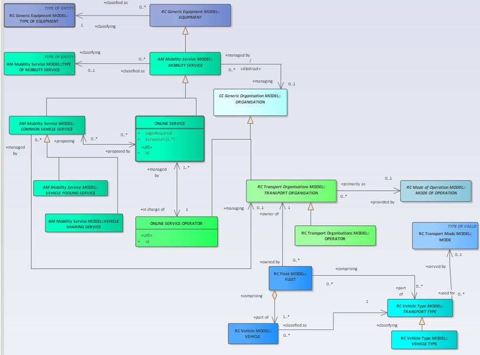

Figure 5 : Services en ligne NM

### Modèle de donn&eacute;es

#### OnlineServiceOperator (Op&eacute;rateur de Service en ligne)

Une organisation qui fournit un accès en ligne à un SERVICE EN LIGNE sans n&eacute;cessairement exploiter des services de transport pour les voyageurs.

Note : un SERVICE EN LIGNE peut être exploit&eacute; par tout OP&eacute;RATEUR, mais un OP&eacute;RATEUR DE SERVICE EN LIGNE gère uniquement des SERVICES EN LIGNE.

| **Classification** | **Nom** | **Type** | **Cardinalit&eacute;** | **Description** |
| --- | --- | --- | --- | --- |
| ::> | ::> | _TransportOrganisation_ | ::> | ONLINE SERVICE OPERATOR h&eacute;rite de TRANSPORT ORGANISATION |
| «PK» | **_id_** | _OnlineServiceOperatorIdType_ | 1:1 | Identifiant de ONLINE SERVICE OPERATOR. |
| "cntd» | **_onlineServices_** | _OnlineServiceRef_ | 0:\* | ONLINE SERVICES op&eacute;r&eacute;s par l'op&eacute;rateur |

Table 11 - OnlineServiceOperator

##### OnlineService (Service en ligne)

Tout service accessible à distance offrant un accès à un mode de transport et/ou à des informations relatives aux services de transport

| **Classification** | **Nom** | **Type** | **Cardinalit&eacute;** | **Description** |
| --- | --- | --- | --- | --- |
| ::> | ::> | _MobilityService_ | ::> | ONLINE SERVICE h&eacute;rite de MOBILITY SERVICE |
| «PK» | **_id_** | _OnlineServiceIdType_ | 1:1 | Identifiant de ONLINE SERVICE. |
|     | **_LoginRequired_** | _xsd:boolean_ | 0:1 | Utilisation d'un login pour acc&eacute;der au service (oui/non) |
| «cntd» | **_proposingServices_** | _CommonVehicleServiceRef_ | 0:\* | VEHICLE SERVICEs propos&eacute;spar ONLINE SERVICE. |

Table 12 - OnlineService

### Exemple d'Online Service

#### Service en ligne pour VLS

Exemple xml 3 : Online Service

## Zone de Stationnement

**Statut implémentation : OBLIGATOIRE** : Cette partie du profil doit être implémentée en cohérence avec le contexte.

### Modèle conceptuel

La description des zones de stationnement pour les modes de d&eacute;placement de type v&eacute;hicule partag&eacute; est d&eacute;crite dans le profil France Parking ;

Cette partie du modèle permet de d&eacute;crire les zones de d&eacute;pôt des v&eacute;hicules. Le lien avec les v&eacute;hicules et services rattach&eacute;s Sont d&eacute;crits au paragraphe 10.7.2.2.

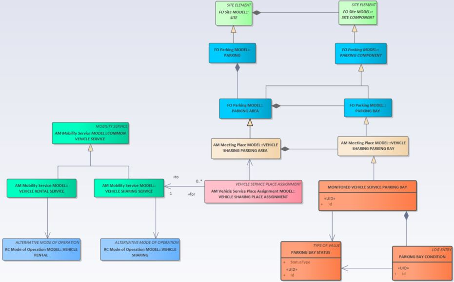

Figure 6 Modèle Emplacement NM

### Modèle de donn&eacute;es

#### PARKING (Station)

La d&eacute;finition des zones de stationnement et de leurs emplacements est d&eacute;crite dans le profil France Parking (paragraphe 6.2).

| **Classification** | **Nom** | **Type** | **Cardinalit&eacute;** | **Description** |
| --- | --- | --- | --- | --- |
| ::> | ::> | ParkingArea | ::> | VEHICLE SHARING PARKING AREA h&eacute;rite PARKING AREA. |
| «PK» | id  | VehicleSharingParkingAreaIdType | 1:1 | Identifiant de VEHICLE SHARING PARKING AREA. |

Table 13 - **PLACES DE STATIONNEMENT**

#### VEHICLE SHARING PARKING AREA (Zone de partage de v&eacute;hicule)

L'affectation d'une VEHICLE SHARING PARKING AREA à tout type de service de partage de v&eacute;hicule

| **Classification** | **Nom** | **Type** | **Cardinalit&eacute;** | **Description** |
| --- | --- | --- | --- | --- |
| ::> | ::> | VehicleServicePlaceAssignment | ::> | VEHICLE SHARING PLACE ASSIGNMENT h&eacute;rite de VEHICLE SERVICE PLACE ASSIGNMENT. |
| «PK» | id  | VehicleSharingPlaceAssignmentIdType | 1:1 | Identifiant de VEHICLE SHARING PLACE ASSIGNMENT. |
| «cntd» | VehicleCommonServiceRef | VehicleSharingServiceRef | 0:\* | R&eacute;f&eacute;rence à VEHICLE SHARING SERVICE |
| «FK» | VehicleSharingParkingAreaRef | VehicleSharingParkingAreaRef | 1:1 | R&eacute;f&eacute;rence un VEHICLE SHARING PARKING AREA. |
| «FK» | VehicleSharingParkingBayRef | ParkingBayRef | 1:1 | R&eacute;f&eacute;rence à VEHICLE SHARING PARKING BAY. |

Table 14 - **PLACES DE STATIONNEMENT POUR V&eacute;HICULES PARTAG&eacute;S**

#### Vehicle Pooling Parking Area (Zone de covoiturage)

_Une partie d&eacute;di&eacute;e de l’AIRE DE STATIONNEMENT pour le covoiturage compos&eacute;e d’une ou de plusieurs PLACES DE STATIONNEMENT DE COVOITURAGE._.

Il est possible de préciser que la zone de parking est dédiée au covoiturage en utilisant la Balise <Name/>. Se reporter au profil NexTEx France Parking.

Exemple : 
``` xml
<VehiclePoolingParkingArea id="FR:VehiclePoolingParkingArea:76-6:Qpark" version="any"><Name>Zone réservée aux covoitureurs</Name><TotalCapacity>2</TotalCapacity></VehiclePoolingParkingArea>
```
															
					
|     |     |     |     |     |
| --- | --- | --- | --- | --- |
| **Classification** | **Nom** | **Type** | **Cardinalit&eacute;** | **Description** |
| ::> | ::> | _ParkingArea_ | ::> | VEHICLE POOLING PARKING AREA h&eacute;rite de from PARKING AREA<br><br>\[non d&eacute;crit dans PART5 NeTex\] |
| «PK» | **_id_** | _VehiclePoolingParkingAreaIdType_ | 1:1 | Identifier of VEHICLE POOLING PARKING AREA. |

Table 14 — Zone de co voiturage

#### ParkingBay (Place de stationnement)

Une place dans le PARKING r&eacute;serv&eacute;e au partage de v&eacute;hicules.

| **Classification** | **Nom** | **Type** | **Cardinalit&eacute;** | **Description** |
| --- | --- | --- | --- | --- |
| ::> | ::> | ParkingBay | ::> | VEHICLE SHARING PARKING BAY h&eacute;rite PARKING BAY. |
| «PK» | id  | VehicleSharingParkingBayIdType | 1:1 | Identifiant de VEHICLE SHARING PARKING BAY. |

Table 15 - **Dock de stationnement pour v&eacute;hicule**

##### **_VehicleSharingParkingBay (Emplacement de parking à l'usage de partage de v&eacute;hicule)_**

Permet de d&eacute;finir un Place de parking pour le partage de v&eacute;hicule.

| **Classifi­cation** | **Name** | **Type** | **Cardin­ality** | **Description** |
| --- | --- | --- | --- | --- |
| ::> | ::> | _ParkingBay_ | ::> | VEHICLE SHARING PARKING BAY h&eacute;rite de PARKING BAY. |
| «PK» | **_id_** | _VehicleSharingParkingBayIdType_ | 1:1 | Identifiant du VEHICLE SHARING PARKING BAY. |

Table 16 - **Dock de stationnement pour v&eacute;hicule partag&eacute;**

VehiculeSharingParkingArea est une spécialisation de ParkingArea qui permet de préciser les emplacements dévolus au covoiturage lorsqu’existant


``` xml 
<VehicleSharingParkingArea id="FR:ParkingArea:76-5:Qpark" version="any">
<Name>Zone Autopartage</Name>
<TotalCapacity>10</TotalCapacity>
</VehicleSharingParkingArea>
```

##### VehiclePoolingParkingBay

Un emplacement d&eacute;di&eacute; pour garer soit un v&eacute;hicule participant &agrave; un service de covoiturage, soit le v&eacute;hicule d’un utilisateur du service de covoiturage

|     |     |     |     |     |
| --- | --- | --- | --- | --- |
| **Classification** | **Nom** | **Type** | **Cardinalit&eacute;** | **Description** |
| ::> | ::> | _ParkingBay_ | ::> | VEHICLE POOLING PARKING BAY h&eacute;rite de PARKING BAY. |
| «PK» | **_id_** | _VehiclePoolingParkingBayIdType_ | 1:1 | Identifiant du VEHICLE POOLING PARKING BAY. |

Table 17 — **Dock de stationnement pour v&eacute;hicule de co voiturage**

## Point de rencontre (Covoiturage)

**Statut implémentation : OBLIGATOIRE** : Cette partie du profil doit être implémentée en cohérence avec le contexte.

### Modèle conceptuel

Le MODÈLE NM Vehicle Meeting Place d&eacute;finit les lieux d’arrêt où les passagers se retrouvent avec leurs modes de transport alternatifs. Au niveau le plus g&eacute;n&eacute;ral, il peut s’agir de tout lieu disposant d’une adresse. Ceux-ci peuvent inclure des STOP PLACE et des PARKING, ainsi que leurs composant.

Transmodel inclut un modèle permettant de d&eacute;crire les &eacute;l&eacute;ments de stationnement comme des sp&eacute;cialisations de SITE COMPONENT. La relation entre les lieux d’arrêt et les services qui s’y arrêtent est d&eacute;crite dans le MODÈLE NM Service Area Assignment.

Le MODÈLE NM Vehicle Meeting Place distingue deux grands types de ADDRESSABLE PLACE, c’est-&agrave;-dire des lieux pouvant être localis&eacute;s par des coordonn&eacute;es spatiales et/ou par une adresse postale ou routière :

VEHICLE MEETING PLACE : lieux où des v&eacute;hicules, des voyageurs ou des conducteurs se rencontrent afin de changer de mode de transport, pour la mont&eacute;e, la descente, la prise en charge, la d&eacute;pose, etc. Un VEHICLE MEETING PLACE peut être associ&eacute; &agrave; un SITE sp&eacute;cifique (tel qu’un STOP PLACE ou un POINT OF INTEREST) ou &agrave; tout composant au sein de ce SITE.

Ces lieux se distinguent par l’usage qui en est fait. Dans les VEHICLE MEETING PLACE, il n’est pas possible de laisser des v&eacute;hicules sans surveillance pendant une dur&eacute;e prolong&eacute;e. Un PLACE se distingue d’une CONNECTION, laquelle d&eacute;finit une paire de lieux entre lesquels un transfert est possible.

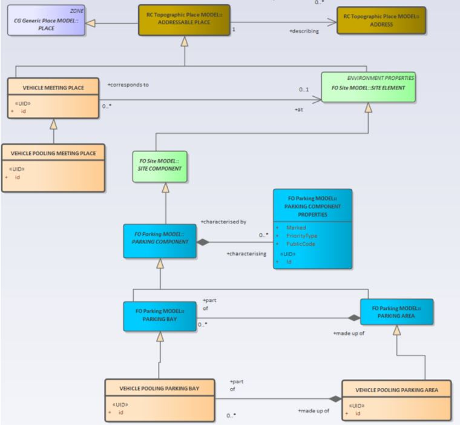

Figure 7 : Lieux de rencontre (Covoiturage) NM

### Modèle de donn&eacute;es

#### VEHICLE MEETING PLACE

Un lieu où v&eacute;hicules et passagers se rencontrent pour changer de mode de transport, pour monter &agrave; bord, descendre, prendre en charge ou d&eacute;poser, etc.

|     |     |     |     |     |
| --- | --- | --- | --- | --- |
| **Classification** | **Nom** | **Type** | **Cardinalit&eacute;** | **Description** |
| ::> | ::> | _AddressablePlace_ | ::> | VEHICLE MEETING PLACE h&eacute;rite de ADDRESSABLE PLACE. |
| «PK» | **_id_** | _VehicleMeetingPlaceIdType_ | 1:1 | Identifiant du VEHICLE MEETING PLACE. |
| «FK» | **_TopographicPlaceRef_** | _TopographicPlaceRef_ | 0:1 | Reference &agrave; un TOPOGRAPHIC PLACE. |
| «FK» | **_SiteElementRef_** | _SiteElementRef_ | 0:1 | R&eacute;f&eacute;rence &agrave; un SITE ELEMENT, tel que PARKING, PARKING AREA, PARKING BAP, STOP PLACE, QUAY, POINT OF INTEREST, etc. |

Table 19 — VehicleMeetingPlace — Elemen

#### Vehicle Pooling Meeting Place (Lieu de rendez-vous)

Un lieu de rendez-vous pour le covoiturage, d&eacute;sign&eacute; ou convenu par le conducteur et le passager, c’est-&agrave;-dire l’endroit où conducteurs et passagers se rencontrent pour la prise en charge ou la d&eacute;pose.

|     |     |     |     |     |
| --- | --- | --- | --- | --- |
| **Classifi-cation** | **Name** | **Type** | **Cardinality** | **Description** |
| ::> | ::> | _VEHICLE MEETING PLACE_ | ::> | **_VEHICLE POOLING MEETING PLACE_** inherits from **_VEHICLE MEETING PLACE._** |
| «UID» | **_Id_** | _VehiclePoolingMeetingPlaceIdType_ | 1:1 | Identifier of VEHICLE POOLING MEETING PLACE. |

Table 19 - VEHICLE POOLING MEETING PLACE – Attributes

## G&eacute;ofencing

**Statut implémentation : OBLIGATOIRE** : Cette partie du profil doit être implémentée en cohérence avec le contexte.

**Une ZONE DE CONTRAINTE DE SERVICE DE MOBILIT&eacute;** (MOBILITY SERVICE CONSTRAINT ZONE ) impose des restrictions sur les d&eacute;placements à l'int&eacute;rieur d'une zone pour un **MODE DE FONCTIONNEMENT** donn&eacute;.

Une **RESTRICTION DE ZONE PAR TYPE DE V&eacute;HICULE** (VEHICLE TYPE ZONE RESTRICTION ) sp&eacute;cifie quel **TYPE DE RESTRICTION** s'applique à un **TYPE DE TRANSPORT (**TRANSPORT TYPE) donn&eacute;.

### Modèle conceptual
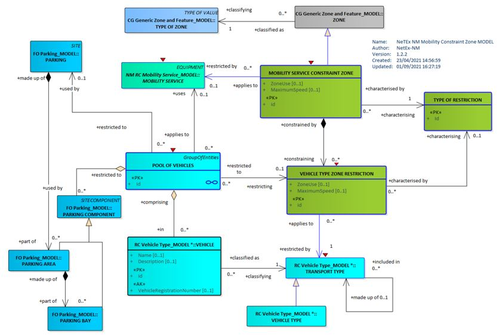

Figure 8 : Modèle G&eacute;ofencing NM

### Modèle de donn&eacute;es

#### MobilityConstraintZone (Zone de mobilit&eacute; contrainte)

ZONE d&eacute;finissant une zone de restriction de l'utilisation d'un MOBILITY SERVICE, par exemple : interdiction d'entr&eacute;e, interdiction de d&eacute;pose, etc

| **Classification** | **Nom** | **Type** | **Cardinalit&eacute;** | **Description** |
| --- | --- | --- | --- | --- |
| ::> | ::> | Zone | ::> | MOBILITY SERVICE CONSTRAINT ZONE h&eacute;rite de ZONE. |
| «PK» | id  | MobilityConstraintZoneIdType | 1:1 | Identifiant d'une MOBILITY SERVICE CONSTRAINT ZONE. |
| «enum» | RuleApplicability | RuleApplicabilityEnum | 0:1 | Indique si la règle s'applique à l'int&eacute;rieur ou l'ext&eacute;rieur de la zone.<br><br>Par D&eacute;faut : Int&eacute;rieur. |
| «enum» | ZoneUse | ZoneUseTypeEnum | 0:1 | Comment la zone peut être utilis&eacute;e |
| «cntd» | vehicleTypeRestrictions | VehicleTypeZoneRestriction | 0:\* | Restrictions applicables à diff&eacute;rents types de v&eacute;hicules |
|     | MaximumSpeed | Speed | 0:1 | Vitesse maximale dans la zone |
| «FK» | MobilityServiceRef | MobilityServiceRef | 0:1 | MOBILITY SERVICE associ&eacute;s à la MOBILITY SERVICE CONSTRAINT ZONE. |

Table 17 - MobilityConstraintZone

##### ZoneUseType (Type de zone d'usage)

Les valeurs autoris&eacute;es pour **ZoneUseType (**ZoneUseTypeEnumeration**) sont les suivantes** **:**

| **Valeur** | **Description** |
| --- | --- |
| allUsesAllowed | Toute utilisation autoris&eacute;e : Ramassage, d&eacute;pose, via |
| forbiddenZone | Interdiction de ramassage ou de D&eacute;pôt dans la zone |
| cannotPickUpInZone | Interdiction d'entr&eacute;e dans la zone |
| cannotDropOffInZone | Interdiction de d&eacute;pôt dans la zone |
| mustPickUpInZone | Obligation d'entr&eacute;e dans la zone |
| mustDropOffInZone | Obligation de d&eacute;pôt dans la zone |
| passThroughUseOnly | Interdiction d'entr&eacute;e ou de D&eacute;pôt dans la zone mais possibilit&eacute; de travers&eacute;e |
| noPassThrough | Interdiction de traverse uniquement (obligation de ramassage ou d&eacute;pôt dans la zone) |
| cannotPickUpAndDropOfInSameZone | Interdiction d'entr&eacute;e et d&eacute;pôt dans la même zone. |
| mustPickUpAndDropOffInSameZone | Obligation d'entr&eacute;e et d&eacute;pôt dans la zone |
| other | Autres restrictions. |

Table 18 - ZoneUseType

##### VehicleTypeZoneRestriction (Zone de restriction de Circulation)

Restriction d'utilisation dans une MOBILITY SERVICE CONSTRAINT ZONE TRANSPORT TYPE pour un mode de transport.

| **Classification** | **Nom** | **Type** | **Cardinalit&eacute;** | **Description** |
| --- | --- | --- | --- | --- |
| ::> | ::> | VersionedChild | ::> | VEHICLE TYPE ZONE RESTRICTION h&eacute;rite de VERSIONED CHILD. |
| «PK» | id  | PoolOfVehiclesIdType | 1:1 | Identifiant VEHICLE TYPE ZONE RESTRICTION. |
| «enum» | ZoneUse | ZoneUseTypeEnum | 0:1 | Modalit&eacute; d'utilisation de la zone. |
|     | MaximumSpeed | Speed | 0:1 | Vitesse maximum dans MOBILITY SERVICE CONSTRAINT ZONE. |
| «FK» | MobilityServiceConstraintZoneRef | MobilityServiceConstraintZoneRef | 0:1 | MOBILITY SERVICE CONSTRAINT ZONE auxquels les restrictions s'appliquent |
| «FK» | TransportTypeRef | TransportTypeRef | 0:1 | TRANSPORT TYPE auxquels les restrictions s'appliquent |

Table 19 - Type de zone de restriction

## V&eacute;hicules

**Statut implémentation : FACULTATIF** : Cette partie du profil doit être implémentée en cohérence avec le contexte.

### Modèle conceptuel

La d&eacute;finition d'un v&eacute;hicule (Cycle, Voiture) r&eacute;pond à la d&eacute;composition conceptuelle suivante.

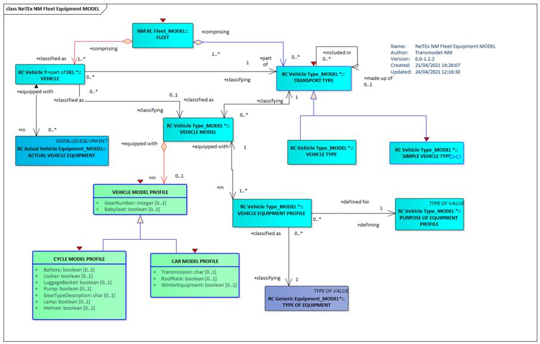

Figure 9 : V&eacute;hicule - MC

L'&eacute;quipement r&eacute;el du v&eacute;hicule sp&eacute;cifie le type d'&eacute;quipement à utiliser dans un v&eacute;hicule Donn&eacute;

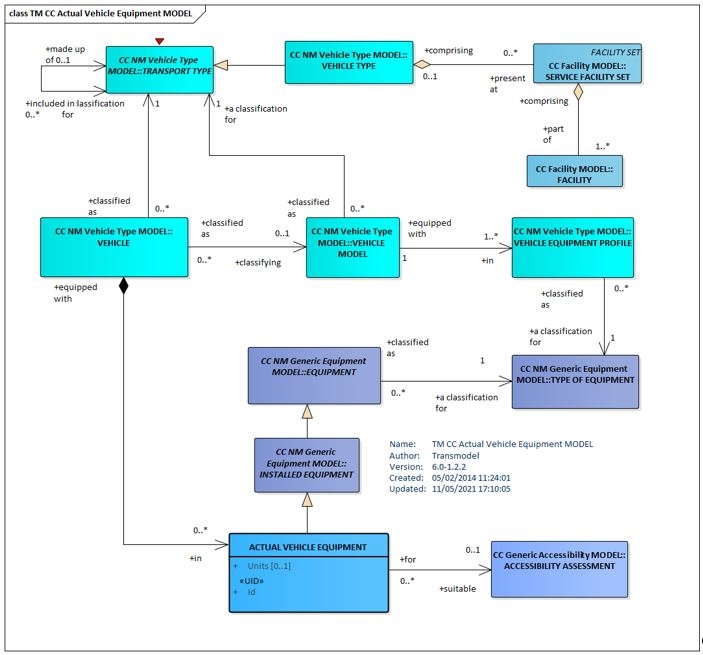

Figure 10 : Actual Vehicle Equipment MC

### Modèle de donn&eacute;es

Le modèle **SIMPLE** **VEHICLE TYPE** d&eacute;crit les v&eacute;hicules « personnels » et leurs propri&eacute;t&eacute;s.

Les v&eacute;hicules peuvent être class&eacute;s en fonction des exigences de planification, notamment :

- Le modèle,
- La capacit&eacute;,
- Les &eacute;quipements embarqu&eacute;s (Siège b&eacute;b&eacute;, …)

Ces mêmes exigences peuvent être associ&eacute;es à un **SERVICE JOURNEY** pour indiquer que ce service doit être assur&eacute; par un v&eacute;hicule de ce type.

#### Vehicle (V&eacute;hicule)

Description d'un v&eacute;hicule transport des passagers.

| **Classification** | **Nom** | **Type** | **Cardinalit&eacute;** | **Description** |
| --- | --- | --- | --- | --- |
| ::> | ::> | DataManagedObject | ::> | VEHICLE h&eacute;rite de DATA MANAGED OBJECT. |
| «PK» | **_id_** | VehicleIdType | 1:1 | Identifiant |
|     | **_Name_** | MultilingualString | 0:1 | Nom du v&eacute;hicule |
|     | ShortName | MultilingualString | 0:1 | Nom court VEHICLE. |
| «AK» | Registration­Number | xsd:normalizedString | 0:1 | Immatriculation du VEHICULE. |
|     | Registration Date | xsd:date | 0:1 | date d'immatriculation du VEHICULE |
| «AK» | OperationalNumber | xsd:normalizedString | 0:1 | Operational number of VEHICLE. |
| «AK» | PrivateCode | PrivateCode | 0:1 | Identifiant alternatif du VEHICULE.<br><br>Peut être utilis&eacute; pour les identifiant interne. |
| «FK» | TransportOrganisationRef | TransportOrganisationRef | 1:1 | Identifiant de l'OPERATEUR ou d'une TRANSPORT ORGANISATION. |
| «FK» | TransportTypeRef | TransportTypeRef | 0:1 | Identifiant d'un TRANSPORT TYPE du VEHICLE |
| «FK» | VehicleModelRef | VehicleModelRef | 0:1 | Identifiant MODEL du VEHICLE |
| «FK» | VehicleModelProfileRef | VehicleModelProfileRef | 0:1 | Identifiant MODEL EQUIPMENT PROFILE of VEHICLE |
| «cntd» | actualVehicle­Equipments | (EquipmentRef) \| (Equipment) | 0:1 | Identifiant ou description du Actual vehicle equipment, i.e., EQUIPMENT for VEHICLE |

Table 20 - Vehicle - Element

#### Actual Vehicle Equipment (&eacute;quipement r&eacute;el du v&eacute;hicule)

Cet &eacute;l&eacute;ment permet de sp&eacute;cifier un &eacute;quipement d'un type particulier effectivement disponible dans un v&eacute;hicule donn&eacute;.

| **Classification** | **Name** | **Type** | **Cardinality** | **Description** |
| --- | --- | --- | --- | --- |
| ::> | ::> | _InstalledEquipment_ | ::> | ACTUAL VEHICLE EQUIPMENT h&eacute;rite de PASSENGER EQUIPMENT. |
| «PK» | **_id_** | _ActualVehicleEquipmentIdType_ | 1:1 | Identifiant ACTUAL VEHICLE EQUIPMENT. |
|     | **_Units_** | _xsd:nonNegativeInteger_ | 0:1 | Nombre d'exemplaires de l'ACTUAL VEHICLE EQUIPMENT there are on vehicle. |
| «FK» | **_VehicleTypeRef_** | _VehicleTypeRef_ | 0:1 | VEHICLE TYPE auquel s'applique l'ACTUAL VEHICLE EQUIPMENT. |
| «cntd» | **_Accessibility­Assessment_** | _AccessibilityAssessment_ | 0:1 | ACCESSIBILITY ASSESSMENT de l'ACTUAL VEHICLE EQUIPMENT.<br><br>Se reporter au profil France accessibilit&eacute;. |

Table 21 - Equipement disponible dans le v&eacute;hicule

#### TransportType (Type de transport)

Classification de tout type de v&eacute;hicule en fonction de ses caract&eacute;ristiques

| **Classification** | **Nom** | **Type** | **Cardinalit&eacute;** | **Description** |
| --- | --- | --- | --- | --- |
| ::> | ::> | DataManagedObject | ::> | TRANSPORT TYPE h&eacute;rite de DATA MANAGED OBJECT. |
| «PK» | id  | TransportTypeIdType | 1:1 | Identifiant TRANSPORT TYPE. |
|     | Name | MultilingualString | 0:1 | nom du TRANSPORT TYPE. |
|     | ShortName | MultilingualString | 0:1 | Nom court TRANSPORT TYPE. |
|     | Description | MultilingualString | 0:1 | Description of TRANSPORT TYPE. |
| «AK» | PrivateCode | PrivateCode | 0:1 | Identifiant interne TRANSPORT TYPE. |
| XGRP | TransportType­PropertiesGroup | xmlGroup | 0:1 | El&eacute;ment d&eacute;crivant les propri&eacute;t&eacute;s du TRANSPORT TYPE. Voir ci-dessous |
| «enum» | TransportMode | AllVehicleModesEnum | 0:1 | Mode de transport : Valeurs autoris&eacute;es |
|     | EuroClass | xsd:normalizedString | 0:1 | Euroclass du v&eacute;hicule type. |
| «cntd» | Passenger­Capacity | PassengerCapacity | 0:1 | Capacit&eacute; en nombre de passage du TRANSPORT TYPE. |

Table 22 - Transport Type

##### TransportTypePropertiesGroup (Groupe de propri&eacute;t&eacute;s des types de transport)

| **Classification** | **Nom** | **Type** | **Cardinalit&eacute;** | **Description** |
| --- | --- | --- | --- | --- |
|     | Reversing­Direction | xsd:boolean | 0:1 | Whether VEHICLE TYPE has a reversing direction. |
|     | SelfPropelled | xsd:boolean | 0:1 | Whether VEHICLE TYPE is self-propelled. |
| «enum» | PropulsionType | PropulsionTypeEnum | 0:1 | Type de carburant du VEHICLE TYPE. Cf ci-dessous |
| «enum» | FuelType | FuelTypeEnum | 0:1 | Type of Fuel of VEHICLE TYPE. See allowed values below. |
|     | TypeOfFuel | FuelTypeEnum |     | DEPRECATED - renamed to FuelType |
|     | MaximumRange | DistanceType | 0:1 | Autonomie maximale en km |

Table 23 -TransportTypePropertiesGroup

###### PropulsionType (Type de propulsion)

| **Valeurs** | **Description** |
| --- | --- |
| combustion | Thermique de tout type |
| hybrid | Hybride Electrique / Thermique |
| human | Humaine (P&eacute;dalage) |
| electricAssist | Assistance Electrique (velo / Trotinette) |
| other | Autres |

Table 24 -PropulsionType - Valeurs

###### FuelType (Type de carburant)

Valeurs autoris&eacute;es pour **_FuelType_** (_FuelTypeEnum_).

| **valeurs** | **Description** |
| --- | --- |
| battery | Batterie |
| biodiesel | Biodiesel. |
| _diesel_ | Diesel |
| dieselBatteryHybrid | Hybride Diesel & Batteried |
| electricContact | Electrique n&eacute;cessitant un contact avec un cable ou un rail. |
| ethanol | Ethanol |
| hydrogen | Hydrogène. |
| liquidGas | Gaz Liquide |
| _tpg_ | TPG (Thermochemical Power Group). |
| methane | Methane. |
| _petrol_ | Essence. |
| petrolLeaded | Essence Plomb |
| petrolUnLeaded | Essence Sans Plomb |
| petrolBatteryHybrid | Hybride Essance & Batterie. |
| other | Autre carburant |
| none | Pas de carburant necessaire |

Table 25 - FuelType - Valeurs

#### V&eacute;hicleModel (Modèle de V&eacute;hicule)

Classification des v&eacute;hicules de transport public d'un même type, par exemple selon les sp&eacute;cifications de l'&eacute;quipement ou la g&eacute;n&eacute;ration du modèle.

| **Classification** | **Nom** | **Type** | **Cardinalit&eacute;** | **Description** |
| --- | --- | --- | --- | --- |
| ::> | ::> | DataManagedObject | ::> | VEHICLE MODEL h&eacute;rite de DATA MANAGED OBJECT. |
| «PK» | **_id_** | VehicleModelIdType | 1:1 | Identifiant de VEHICLE MODEL. |
|     | **_Name_** | MultilingualString | 0:1 | Nom du VEHICLE MODEL. |
|     | Description | MultilingualString | 0:1 | Description du VEHICLE MODEL. |
|     | Manufacturer | MultilingualString | 0:1 | Fabricant du VEHICLE MODEL. |
| «FK» | TransportTypeRef | TransportTypeRef | 1:1 | Identifiant du TRANSPORT TYPE ou du VEHICLE TYPE du VEHICLE MODEL. |
| «FK» | VehicleModelProfileRef | VehicleModelProfileRef | 0:1 | VEHICLE MODEL PROFILE du VEHICLE MODEL |
| «FK | equipmentProfiles | VehicleEquipmentProfileRef | 0:\* | Equipment profile for VEHICLE MODEL. |

Table 26 - Modèle de v&eacute;hicule

##### Vehicle Model Profile (Profil de Modèle de v&eacute;hicule)

Ensemble des caract&eacute;ristiques des &eacute;quipements install&eacute;s dans un v&eacute;hicule et d&eacute;finissant un modèle de v&eacute;hicule.

| **Classification** | **Nom** | **Type** | **Cardinalit&eacute;** | **Description** |
| --- | --- | --- | --- | --- |
| ::> | ::> | _DataManagedObject_ | ::> | VEHICLE MODEL PROFILE h&eacute;rite de DATA MANAGED OBJECT. |
|     | **_Name_** | _MultilingualString_ | 0:1 | Nom du VEHICLE MODEL PROFILE. |
|     | **_NumberOfGears_** | _xsd:nonNegativeInteger_ | 0:1 | Nombre de Vitesse du v&eacute;hicule VEHICLE. |
| «enum» | **_ChildSeat_** | _ChildSeatEnumeration_ | 0:1 | Indique la pr&eacute;sence d'un siège enfant à bord. |
|     | **_RangeBetweenRefuelling_** | _DistanceType_ | 0:1 | Autonomie du v&eacute;hicule MODEL PROFILE. |
|     | **_IsPortable_** | _xsd:boolean_ | 0:1 | Indique si le v&eacute;hicule peut être transport&eacute; facilement : concerne les scooter, skateboard, bicycle pliable. |

Table 27 - Profil de modèle de v&eacute;hicule

###### ChildSeat (Siège Enfant)

La d&eacute;finition du siège enfant peut prendre les valeurs suivantes : **_._**

| **Valeur** | **Description** |
| --- | --- |
| _Baby_ | Siège adapt&eacute; pour les b&eacute;b&eacute;s |
| _smallChild_ | Siège adapt&eacute; pour les enfants entre 9-18 kg. |
| _olderChild_ | Siège adapt&eacute; pour les enfants entre 15-36 kg. |
| _None_ | No child. |
| _other_ | Autre type de siège |

Table 28 - D&eacute;finition d'un siège Enfant

#### SimpleVehicleType (Type de V&eacute;hicule Simple)

Un type de v&eacute;hicule simple, d&eacute;finit les exigences pour un V&eacute;HICULE utilis&eacute; afin de fournir des services de modes alternatifs et peut inclure des caract&eacute;ristiques d'autres types de v&eacute;hicules tels que les v&eacute;los, trottinettes, etc. »

| **Classification** | **Nom** | **Type** | **Cardinalit&eacute;** | **Description** |
| --- | --- | --- | --- | --- |
| ::> | _::>_ | _TransportType_ | ::> | SimpleVehicleType h&eacute;rite de TransportType |
| «PK» | **_id_** | _SimpleVehicleTypeIdType_ | 1:1 | Identifiant de SIMPLE VEHICLE TYPE. |
| «enum» | **_LicenceRequirements_** | _LicenceRequirementsEnum_ | 0:1 | Indique si ce type de v&eacute;hicule n&eacute;cessite un permis. |
|     | **_MinimumAge_** | _xsd:integer_ | 0:1 | Age minimum pour l'utilisation du v&eacute;hicule |
| «enum» | **_VehicleCategory_** | _VehicleCategoryEnum_ | 0:1 | Cat&eacute;gorie du v&eacute;hicule |
|     | **_Portable_** | _xsd:boolean_ | 0:1 | Indique si le v&eacute;hicule est portable, par exemple un v&eacute;lo pliant ou une trottinette. |

Table 29 - Type de v&eacute;hicule simple

##### LicenceRequirements - Valeurs autoris&eacute;es

Valeurs autoris&eacute;es pour un permis d'utilisation (_LicenceRequirementsEnum_).

| **Value** | **Description** |
| --- | --- |
| _full_ | _Permis n&eacute;cessaire_ |
| _provisional_ | _Requires at least a provisional licence_ |
| _additional_ | _Requires additional vehicle category licence._ |
| _none_ | _Aucun permis requis_ |

Table 30 - Type de v&eacute;hicule simple

##### PersonalVehicleCategory- v Valeurs autoris&eacute;es

Valeurs autoris&eacute;es pour la cat&eacute;gorie de v&eacute;hicule Personnel _PersonalVehicleCategoryEnum_).

| **Value** | **Description** |
| --- | --- |
| _scooter_ | Scooter - small wheeled low mobile platform. |
| _bicycle_ | Bicycle. |
| _tricycle_ | Tricycle. |
| _tandem_ | Tandem bicycle. |
| _moped_ | Moped (Petite moto). |
| _motorcycle_ | Moto. |
| _quadbike_ | Quad |
| _car_ | Voiture |
| _microCar_ | Extremely small vehicle. |
| _miniCar_ | Very small vehicle. |
| _smallCar_ | Small vehicle. |
| _mediumCar_ | Compact vehicle. |
| _largeCar_ | Large vehicle. |
| _minivan_ | Minivan. |
| _transporter_ | minibus. |
| _snowmobile_ | MotoNeige |
| _other_ | Autre |

Table 31 - Type de V&eacute;hicule

### Exemple d'utilisation «  SimpleVehicleType »

#### Cas d'une flotte de v&eacute;los

Exemple xml 4 : Exemple mod&eacute;lisation « SimpleVehiculeType »

## Identifiants d'accès aux véhicules

Un code d'accès au service (SERVICE ACCESS CODE) est une spécialisation du document de voyage (TRAVEL DOCUMENT) qui fournit à l'utilisateur le code nécessaire pour utiliser un service.

Les documents de voyage sont associés à un client de transport donné via un contrat tarifaire (FARE CONTRACT). Ils peuvent également être liés à un package d'achat client (CUSTOMER PURCHASE PACKAGE) en tant que représentation électronique de l'achat effectué par le client.

Un code d'accès au service peut être associé à un véhicule physique et à un dispositif d'accès au support (MEDIUM ACCESS DEVICE) via une affectation d'accès au véhicule (VEHICLE ACCESS ASSIGNMENT). Cette association constitue un lien indépendant pouvant être utilisé de manière anonyme vis-à-vis du client pour exploiter le système d'accès.

Le diagramme NM Vehicle Access MODEL décrit un contexte plus large lié à la mise à disposition d'un contrat permettant d'accéder à un service de transport. En particulier, le contrat tarifaire (FARE CONTRACT) peut héberger les codes d'accès au service fournis pour un service de mobilité, quel que soit le mode de transport alternatif.

### Modèle conceptuel

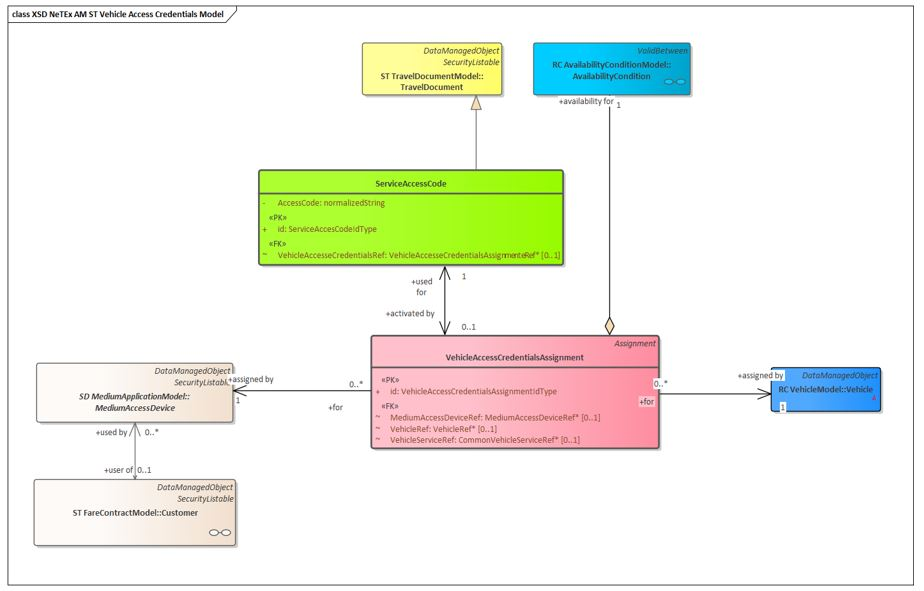

Figure 11 : Identifiants d'accès au Véhicule

### Modèle de données

#### Code d'accès à un service (ServiceAccessCode)

Code permettant d'accéder à un service, qui peut être un **code numérique**, un **code-barres**, un **flashcode (QR code)**, etc

| **Classification** | **Nom**                                     | **Type**                                | **Cardinalité** | **Description**                                                                                                                                                                                                   |
| ------------------ | ------------------------------------------- | --------------------------------------- | --------------- | ----------------------------------------------------------------------------------------------------------------------------------------------------------------------------------------------------------------- |
| «PK»               | **_id_**                                    | _ServiceAccessCodeIdType_               | 1:1             | Identifiant SERVICE ACCESS CODE                                                                                                                                                                                   |
|                    | **_AccessCode_**                            | _xsd:normalizedString_                  | 1:1             | Chaîne de caractères fournie aux voyageurs pour accéder à un véhicule particulier.                                                                                                                                |
|                    | **_ExpiryDate_**                            | _xsd:dateTime_                          | 1:1             | Date d'expiration d'un code d'accès au service                                                                                                                                                                    |
| «FK»               | **_VehicleAccessCredentialsAssignmentRef_** | _VehicleAccessCredentialsAssignmentRef_ | 0:1             | Affectation d'accès au véhicule qui associe un code d'accès au service (SERVICE ACCESS CODE) à un véhicule et/ou à un dispositif d'accès afin de permettre l'utilisation du service d'accès de manière sécurisée, |

Table 37 - Service de mobilitéAffectation des identifiants d'accès au véhicule (Vehicle Access Credentials Assignment)

L'allocation d'un dispositif d'accès au support (MEDIUM ACCESS DEVICE) à un véhicule spécifique, afin de permettre à l'utilisateur (client transport - TRANSPORT CUSTOMER) d'accéder au véhicule (généralement dans le cadre d'un service de partage de véhicule ou de location de véhicule). Cette affectation peut être soumise à des limites de validité.

| **Classification** | **Nom**                       | **Type**                                   | **Cardinalité** | **Description**                                                                                                     |
| ------------------ | ----------------------------- | ------------------------------------------ | --------------- | ------------------------------------------------------------------------------------------------------------------- |
| ::>                | ::>                           | _Assignment_                               | ::>             | VEHICLE ACCESS CREDENTIALS ASSIGNMENT hérite de ASSIGNMENT                                                          |
| «PK»               | **_id_**                      | _VehicleAccessCredentialsAssignmentIdType_ | 1:1             | **Identifiant de l'assignation des identifiants d'accès au véhicule (VEHICLE ACCESS CREDENTIALS ASSIGNMENT)** :     |
| «FK»               | **_CommonVehicleServiceRef_** | _CommonVehicleServiceRef_                  | 0:1             | Référence au service de véhicule (VEHICLE SERVICE) auquel l'accès est effectué.                                     |
| «FK»               | **_VehicleRef_**              | _VehicleRef_                               | 0:1             | Référence au véhicule auquel l'accès est autorisé / auquel l'accès est effectué.                                    |
| «FK»               | **_MediumAccessDeviceRef_**   | _MediumAccessDeviceRef_                    | 0:1             | Référence au dispositif d'accès au support (MEDIUM ACCESS DEVICE) utilisé pour transmettre le code à l'utilisateur. |
| «FK»               | **_ServiceAccessCodeRef_**    | _ServiceAccessCodeRef_                     | 1:1             | **Référence au code d'accès au service (SERVICE ACCESS CODE) permettant l'accès au véhicule.**                      |

Table 39 - Vehicle Access Credentials Assignment

## Paramètres d'utilisation (Usage Parameters)

### **Modèle conceptuel - Paramètres d'éligibilité d'usage NM**

Transmodel inclut des **paramètres d'usage** permettant de spécifier les restrictions relatives aux personnes autorisées à acheter un produit, notamment le **profil utilisateur (USER PROFILE)**.

Pour les nouveaux modes de transport, ces paramètres sont complétés par l'ajout d'un paramètre supplémentaire : le **profil du covoitureur (VEHICLE POOLER PROFILE)**, qui définit des restrictions additionnelles concernant les utilisateurs d'un service de **covoiturage (VEHICLE POOLING)**.

Par exemple, un service peut être proposé avec un VEHICLE POOLER PROFILE indiquant que les passagers doivent être de sexe féminin et non-fumeurs. Ces informations peuvent être mises en correspondance avec les préférences des passagers potentiels afin de sélectionner le trajet le plus approprié.

Les détails relatifs aux bagages pouvant être transportés peuvent être spécifiés à l'aide du paramètre franchise bagage (LUGGAGE ALLOWANCE).

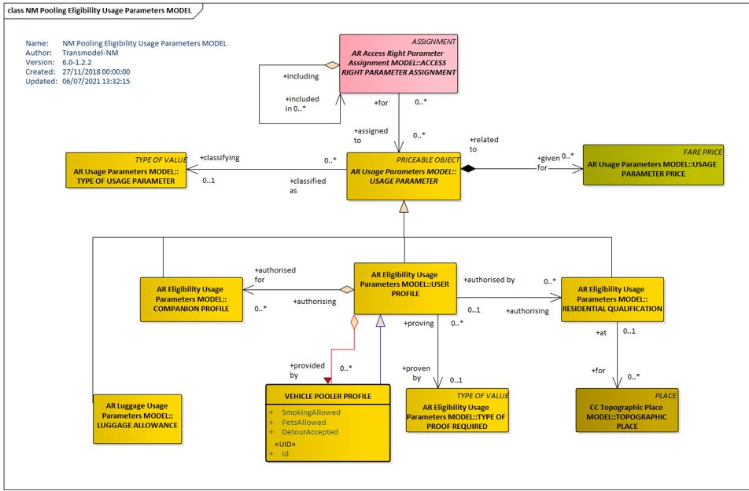

Figure 12 : Paramètres d'utilisation

### Modèle de données

#### Profil Utilisateur

Profil social d'un passager, basé sur des critères tels que le groupe d'âge, le niveau d'éducation, la profession, le statut social, le sexe, etc., souvent utilisé pour déterminer l'éligibilité à des réductions tarifaires : par exemple 18-40 ans, diplômés, conducteurs, personnes sans emploi, femmes, etc

| **Classification** | **Nom**                               | **Type**               | **Cardinalité** | **Description**                                                                                                                                    |
| ------------------ | ------------------------------------- | ---------------------- | --------------- | -------------------------------------------------------------------------------------------------------------------------------------------------- |
| ::>                | ::>                                   | _UsageParameter_       | ::>             | USER PROFILE hérite de USAGE PARAMETER..                                                                                                           |
| «PK»               | **_id_**                              | _UserProfileIdType_    | 1:1             | Identifiant du USER PROFILE.                                                                                                                       |
| «FK»               | **_BaseUserProfileRef_**              | _UserProfileRef_       | 0:1             | **Profil utilisateur de base (BASE USER PROFILE)** que ce profil vient spécialiser / affiner.                                                      |
| «FK»               | **_TypeOf­ConcessionRef_**            | _TypeOfConcessionRef_  | 0:1             | Classification par type de concession                                                                                                              |
| «enum»             | **_UserType_**                        | _UserTypeEnum_         | 0:1             | Classification des utilisateurs selon leur catégorie. Voir les valeurs autorisées ci-dessous.                                                      |
| XGRP               | **_UserProfile­Qualification­Group_** | **_xmlGroup_**         | 0:1             | Éléments décrivant les conditions d'éligibilité pour un utilisateur.                                                                               |
| «enum»             | **_Gender­Limitation_**               | _GenderLimitationList_ | 0:1             | Information relative au **genre exigé** pour l'éligibilité à un produit ou service, notamment pertinent pour les produits d'hébergement mono-sexe. |
| «enum»             | **_ProofRequired_**                   | _ProofOfIdentityEnum_  | 0:\*            | Document ou justificatif demandé pour attester du statut de l'utilisateur. Voir les valeurs autorisées ci-dessous.                                 |
| «enum»             | **_DiscountBasis_**                   | _DiscountBasisEnum_    | 0:1             | Type d'avantage tarifaire accordé à cette catégorie d'utilisateurs. Voir les valeurs autorisées précédemment                                       |
| «cntd»             | **_companion­Profiles_**              | _CompanionProfile_     | 0:\*            | **Profils des accompagnateurs (COMPANION PROFILE)** décrivant les utilisateurs autorisés à voyager avec l'utilisateur principal.                   |

Table 31 - Profil Utilisateur

##### Type d'utilisateur (UserType)

Le tableau suivant présente les valeurs autorisées pour le type d'utilisateur

| **Valeur**          | **Description**                                  |
| ------------------- | ------------------------------------------------ |
| _anyone_            | User is any type of person.                      |
| _adult_             | L'utilisateur est un adulte                      |
| _child_             | L'utilisateur est un enfant                      |
| _infant_            | L'utilisateur est un nourissons                  |
| _senior_            | L'utilisateur est un sénior                      |
| _schoolPupil_       | L'utilisateur est un écolier                     |
| _student_           | L'utilisateur est un étudiant                    |
| _youngPerson_       | L'utilisateur est une jeune personne             |
| _disabled_          | L'utilisateur est handicapé                      |
| _disabledCompanion_ | L'utilisateur est handicapé avec accompagnateur  |
| _employee_          | L'utilisateur est un employé de l'opérateur      |
| _military_          | L'utilisateur est un militaire                   |
| _jobSeeker_         | L'utilisateur est sans emploi                    |
| _guideDog_          | L'utilisateur est un chien guide                 |
| _member_            | L'utilisateur dispose d'un programme de fidélité |
| _animal_            | L'utilisateur est un animal                      |

Table 31 - Profil Utilisateur

##### Qualification du profil utilisateur (User Profile Qualification)

Ensemble des critères ou attributs permettant de qualifier et d'évaluer un profil utilisateur, afin de déterminer son éligibilité à un produit, un service ou une offre tarifaire.

| **Classification** | **Nom**                           | **Type**                   | **Cardinalité** | **Description**                                                                                                                                                                                                                                                                                                                                                                       |
| ------------------ | --------------------------------- | -------------------------- | --------------- | ------------------------------------------------------------------------------------------------------------------------------------------------------------------------------------------------------------------------------------------------------------------------------------------------------------------------------------------------------------------------------------- |
|                    | **_MinimumAge_**                  | _xsd:integer_              | 0:1             | **Âge minimum requis pour l'adhésion à un profil utilisateur (USER PROFILE).**                                                                                                                                                                                                                                                                                                        |
|                    | **_MaximumAge_**                  | _xsd:integer_              | 0:1             | **Âge maximum requis pour l'adhésion à un profil utilisateur (USER PROFILE).**                                                                                                                                                                                                                                                                                                        |
|                    | **_MonthDayOn­WhichAge­Applies_** | _xsd:gmonthDay_            | 0:1             | our / mois à partir duquel l'âge s'applique (le cas échéant).                                                                                                                                                                                                                                                                                                                         |
|                    | **_Minimum­Height_**              | _LengthType_               | 0:1             | Taille minimale requise pour l'adhésion à un profil utilisateur (USER PROFILE).                                                                                                                                                                                                                                                                                                       |
|                    | **_MaximumHeight_**               | _LengthType_               | 0:1             | Poids maximal qu'un utilisateur doit respecter pour être éligible à un profil ou à un service, par exemple pour des raisons de sécurité (comme l'accès avec de grands chiens ou pour définir une limite applicable aux enfants)..                                                                                                                                                     |
|                    | **_LocalResident_**               | _xsd:boolean_              | 0:1             | **Indique si l'utilisateur doit être résident local.** <br>→ Valeur booléenne précisant si l'utilisateur doit être un **résident local** pour être éligible. <br>→ La valeur par défaut est **« vrai » (true)**.                                                                                                                                                                      |
| «cntd»             | **_resides_**                     | _ResidentialQualification_ | 0:\*            | **Qualifications résidentielles (RESIDENTIAL QUALIFICATIONS) pour le profil utilisateur (USER PROFILE)** - <br>→ Ensemble des conditions relatives à la résidence permettant de qualifier l'utilisateur. <br>→ Si plusieurs valeurs sont définies, elles sont combinées avec un **opérateur logique OU (OR)**, c'est-à-dire qu'il suffit qu'une seule des conditions soit satisfaite. |

Table 31 - Qualification du profil utilisateur

##### Preuves necessaires (ProofRequired)

Le tableau suivant présente les valeurs autorisées pour le champ ProofRequired (ProofOfIdentityEnumeration).

Il s'agit des types de preuves d'identité pouvant être exigées pour justifier l'éligibilité d'un utilisateur à un produit ou service.

| **Valeur**          | **Description**                                                                                                                                                          |
| ------------------- | ------------------------------------------------------------------------------------------------------------------------------------------------------------------------ |
| _noneRequired_      | Aucun justificatif d'identité n'est nécessaire pour l'accès au produit, au service ou au profil utilisateur concerné.                                                    |
| _passport_          | La preuve requise est la présentation d'un passeport.                                                                                                                    |
| _drivingLicence_    | La preuve requise est la présentation d'un permis de conduire.                                                                                                           |
| _birthCertificate_  | La preuve requise est la présentation d'un acte de naissance.                                                                                                            |
| _membershipCard_    | La preuve requise est la présentation d'un document d'identité, tel qu'une preuve d'appartenance à une organisation (carte de membre, justificatif d'affiliation, etc.). |
| _studentCard_       | La preuve requise est la présentation d'une carte étudiante.                                                                                                             |
| _identityDocument_  | La preuve requise est la présentation d'un document d'identité, tel qu'un permis de conduire ou un passeport.                                                            |
| _creditCard_        | La preuve requise est la présentation d'une carte bancaire (carte de crédit).                                                                                            |
| _medicalDocument_   | La preuve requise est la présentation d'un document médical ou d'une lettre émise par une autorité médicale.                                                             |
| _letterWIthAddress_ | La preuve requise est la présentation d'une lettre ou d'une facture émise par une organisation à l'adresse du demandeur.                                                 |
| _measurement_       | Mesure physique (comme la taille ou une autre mesure corporelle).                                                                                                        |
| _emailAccount_      | La preuve consiste à répondre depuis un compte e-mail valide.                                                                                                            |
| _mobileDevice_      | La preuve consiste à répondre depuis un appareil mobile associé à un compte.                                                                                             |
| _other_             | Autre preuve.                                                                                                                                                            |

Table 89 - Preuves nécessaires

##### Profil du covoitureur (VehiclePoolerProfil)

Ensemble de paramètres utilisateur caractérisant les droits d'accès à un service de covoiturage (VEHICLE POOLING SERVICE).

→ Il s'agit d'une spécialisation du profil utilisateur (USER PROFILE) permettant de définir des attributs supplémentaires tels qu'une âge minimum.

| **Classifi­cation** | **Name**                 | **Type**                     | **Cardin­ality** | **Description**                                                                                                                                                                                                                                                                    |
| ------------------- | ------------------------ | ---------------------------- | ---------------- | ---------------------------------------------------------------------------------------------------------------------------------------------------------------------------------------------------------------------------------------------------------------------------------- |
| ::>                 | ::>                      | _UserProfile_                | ::>              | VEHICLE POOLER PROFILE hérite de USER PROFILE..                                                                                                                                                                                                                                    |
| «PK»                | **_id_**                 | _VehiclePoolerProfileIdType_ | 1:1              | Identifiant du profil du covoitureur (VEHICLE POOLER PROFILE).                                                                                                                                                                                                                     |
| «FK»                | **_HostUserProfileRef_** | _UserProfileRef_             | 0:1              | Profil utilisateur de base (BASE USER PROFILE) que ce profil vient spécialiser / affiner.                                                                                                                                                                                          |
|                     | **_SmokingAllowed_**     | _xsd:boolean_                | 0:1              | Indique si le tabagisme est autorisé ou non.                                                                                                                                                                                                                                       |
|                     | **_PetsAllowed_**        | _xsd:boolean_                | 0:1              | Indique si les animaux de compagnie sont autorisés ou non.                                                                                                                                                                                                                         |
|                     | **_LuggageAllowed_**     | _xsd:boolean_                | 0:1              | Indique si le covoitureur est disposé à transporter les bagages du passager.<br><br>→ La nature des bagages acceptés peut être spécifiée via un ou plusieurs éléments distincts de franchise bagage (LUGGAGE ALLOWANCE).<br><br>→ Cette disposition peut varier selon les trajets. |
|                     | **_DetourAccepted_**     | _xsd:duration_               | 0:1              | Durée maximale acceptée pour un détour. <br>→ Indique le temps supplémentaire maximum autorisé pour effectuer un détour, par exemple pour prendre en charge ou déposer un passager lors d'un trajet.                                                                               |

Table 89 - Profil du covoitureur

## Services

**Statut implémentation : FACULTATIF** : Cette partie du profil doit être implémentée en cohérence avec le contexte.

### Services de mobilit&eacute;

#### Modèle conceptual

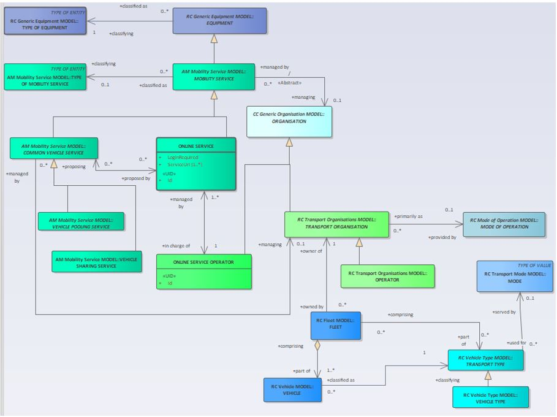

Figure 13 : Service En ligne - MC

#### Modèle de donn&eacute;es

##### MOBILITY SERVICE (Service de mobilit&eacute;)

Un service nomm&eacute; disponible sur une vaste zone, par exemple le covoiturage, le partage de v&eacute;hicule, etc. Le service peut être accessible à des emplacements d&eacute;sign&eacute;s. SITEs or ADDRESSABLE PLACEs.

| **Classification** | **Nom** | **Type** | **Cardinalit&eacute;** | **Description** |
| --- | --- | --- | --- | --- |
| ::> | ::> | Equipment | ::> | MOBILITY SERVICE h&eacute;rite EQUIPMENT. |
| «PK» | id  | MobilityServiceIdType | 1:1 | Identifiant de MOBILITY SERVICE. |
|     | ShortName | MultilingualString | 0:1 | Nom court d'un service |
|     | StartDate | xsd:date | 0:1 | Date à laquelle le service devient op&eacute;rationnel. |
| «FK» | OrganisationRef | OrganisationRef | 0:1 | Identifiant d'une ORGANISATION... |
| «FK» | TopographicPlaceRef | TopographicPlaceRef | 0:1<br><br>1:1 | Identifiant d'un TOPOGRAPHIC PLACE associ&eacute; au SERVICE.<br><br>Obligatoire pour le profil France |
| «FK» | TypeOfMobilityServiceRef | TypeOfMobilityServiceRef | 0:1 | Identifiant d'un type MOBILITY SERVICE. |
| «cntd» | BookingArrangements | ServiceBookingArrangements | 0:1 | Modalit&eacute; de r&eacute;servation du service |

Table 32 - Service de mobilit&eacute;

##### CommonVehicleService (Service de mobilit&eacute; usuel )

Un service de transport qui utilise des v&eacute;hicules pour effectuer des trajets. La zone de couverture du service peut être indiqu&eacute;e par un LIEU TOPOGRAPHIQUE. »

| **Classification** | **Nom** | **Type** | **Cardinalit&eacute;** | **Description** |
| --- | --- | --- | --- | --- |
| ::> | ::> | MobilityService | ::> | COMMON VEHICLE SERVICE h&eacute;rite de MOBILITY SERVICE |
| «PK» | id  | CommonVehicleServiceIdType | 1:1 | Identifiant de COMMON VEHICLE SERVICE. |
|     | BookingRequired | xsd:boolean | 1:1 | Indique si une r&eacute;servation du service est n&eacute;cessaire. |
|     | RegistrationRequired | xsd:boolean | 0:1 | Indique si un enregistrement est n&eacute;cessaire |
| «cntd» | proposedByServices | OnlineServiceRef | 0:\* | Identifiant du ONLINE SERVICEs qui propose le service |

Table 33 - Service de mobilit&eacute; usuel

##### VehicleSharingService (Service de partage de v&eacute;hicule)

Un Service type V&eacute;lo en libre-service ou Auto-partage.

| **Classification** | **Nom** | **Type** | **Cardinalit&eacute;** | **Description** |
| --- | --- | --- | --- | --- |
| ::> | ::> | CommonVehicleService | ::> | VEHICLE SHARING SERVICE h&eacute;rite de COMMON VEHICLE SERVICE. |
| «PK» | id  | VehicleSharingServiceIdType | 1:1 | Identifiant VEHICLE SHARING SERVICE. |
| «FK» | VehicleSharingRef | VehicleSharingRef | 0:1 | R&eacute;f&eacute;rence à un VEHICLE SHARING mode d'exploitation. |
|     | SharingPolicyUrl | xsd:anyURI | 1:1 | URL pour la politique d'utilisation |
|     | MinimumSharingPeriod | xsd:duration | 0:1 | Dur&eacute;e minimum de partage VEHICLE SHARING. |
|     | MaximumSharingPeriod | xsd:duration | 0:1 | Dur&eacute;e maximum de partage VEHICLE SHARING_._ |
|     | FloatingVehicles | xsd:boolean | 0:1 | Indique si le partage de v&eacute;hicule est de type free floating. |
| «FK» | fleets | FleetRef | 0:\* | R&eacute;f&eacute;rence à une FLEETs qui gère le service de partage. |

Table 34 -VehicleSharingService - Element

##### CarPoolingService (Covoiturage)

A completer ult&eacute;rieurement

### Services aux voyageurs

#### R&eacute;servation

Les dispositions de r&eacute;servation d&eacute;crivent les paramètres sp&eacute;cifiques des règles de r&eacute;servation pour un service et sont utilis&eacute;es par plusieurs entit&eacute;s diff&eacute;rentes.

Pour les nouveaux modes, les dispositions de r&eacute;servation peuvent être appliqu&eacute;es aux services de mobilit&eacute; li&eacute;s aux modes d'exploitation alternatifs, notamment la location de v&eacute;hicules, le partage de v&eacute;hicules et le covoiturage de v&eacute;hicules. La r&eacute;servation des services de location, de partage et de covoiturage de v&eacute;hicules peut être effectu&eacute;e via un service en ligne

##### Modèle conceptual

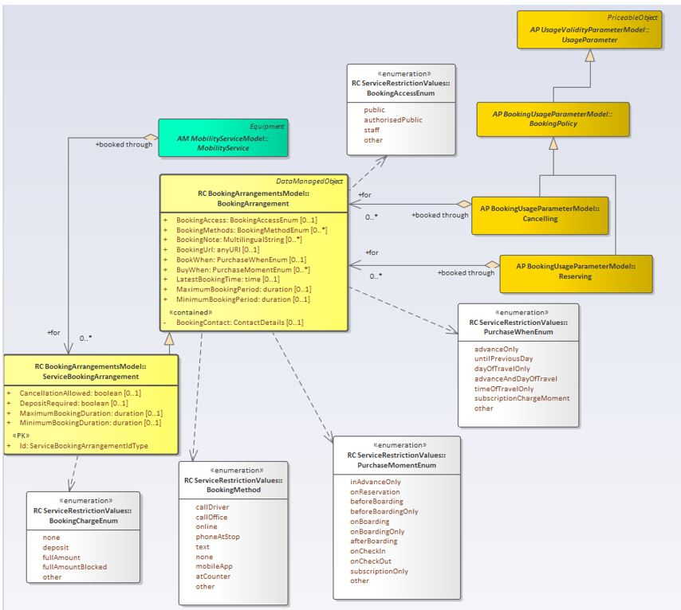

Figure 14 : R&eacute;servation - MC

##### Modèle de donn&eacute;es

###### Booking Arrangements

Information relative aux m&eacute;thodes de r&eacute;servation d'un v&eacute;hicule partag&eacute;.

**_Pour plus de d&eacute;tail sur les valeurs autoris&eacute;es se reporter au Profil NeTex France R&eacute;seaux._**

| **Classification** | **Nom** | **Type** | **Cardinalit&eacute;** | **Description** |
| --- | --- | --- | --- | --- |
| ««cntd» | **_BookingContact_** | _ContactDetails_ | 0:1 | Information contractuelle |
| «enum» | **_BookingMethods_** | _BookingMethodListEnum_ | 0:\* | M&eacute;thode de reservation |
| «enum» | **_BookingAccess_** | _BookingAccessEnum_ | 0:1 | Qui peut faire une r&eacute;servation |
| «enum» | **_BookWhen_** | _PurchaseWhenEnum_ | 0:1 | Cr&eacute;neaux de r&eacute;servation |
| «enum» | **_BuyWhen_** | _PurchaseMomentEnum_ | 0:\* | Cr&eacute;neaux d'achat |
|     | **_LatestBookingTime_** | _MultilingualString_ | 0:1 | Heure au plus tard de r&eacute;servation |
|     | **_MinimumBooking­Period_** | _xsd:duration_ | 0:1 | Intervalle minimum avant le d&eacute;but de la commande. |
|     | **_MaximumBooking­Period_** | _xsd:duration_ | 0:1 | Intervalle minimum avant le d&eacute;but de la commande |
|     | **_BookingUrl_** | _xsd:anyURI_ | 0:1 | url de r&eacute;servation |
| «cntd» | **_BookingNote_** | _MultilingualString_ | 0:1 | Information compl&eacute;mentaire |

Table 35 - BookingArrangements

#### Information sur les zones de d&eacute;pôt des v&eacute;hicules

##### Modèle Conceptuel

###### **Vehicle Meeting Place** (Zone de d&eacute;pôt/Station)

Le **modèle NM Vehicle Meeting Place** d&eacute;finit les points d'arrêt où les passagers retrouvent leurs modes de transport alternatifs.

Au sens le plus large, il peut s'agir de tout lieu disposant d'une adresse. Cela peut inclure des points d'arrêt (**STOP PLACE)** et des stations (**PARKING)**, ainsi que leurs composants, tels que d&eacute;finis dans la Partie 1.

Une station (**PARKING)** repr&eacute;sente un emplacement d&eacute;sign&eacute; pour laisser des v&eacute;hicules tels que voitures, motos ou v&eacute;los. Transmodel inclut un modèle permettant de d&eacute;crire les &eacute;l&eacute;ments de stationnement comme des sp&eacute;cialisations de **SITE COMPONENTs**.

La connexion entre les points d'arrêt et les services qui y opèrent se trouve dans le **modèle NM service de mobilit&eacute;**.

Le **modèle NM Vehicle Meeting Place** distingue deux grands types de **ADDRESSABLE PLACE** (lieux pouvant être localis&eacute;s par coordonn&eacute;es spatiales et/ou adresse postale ou routière) :

- **VEHICLE MEETING PLACEs** : lieux où v&eacute;hicules, voyageurs et conducteurs se rencontrent pour changer de mode de transport, embarquer, d&eacute;barquer, prendre ou d&eacute;poser des passagers, etc.

Un **VEHICLE MEETING PLACE** peut être associ&eacute; à un **SITE** sp&eacute;cifique (tel qu'un **STOP PLACE** ou un **POINT OF INTEREST**) ou à tout composant à l'int&eacute;rieur de ce **SITE**.

- **PARKING COMPONENTs** : emplacements d&eacute;sign&eacute;s pour laisser des v&eacute;hicules tels que voitures, motos ou v&eacute;los.

Ces lieux se distinguent par leur usage : dans un **VEHICLE MEETING PLACE**, il n'est pas possible de laisser un v&eacute;hicule sans surveillance pour une dur&eacute;e prolong&eacute;e.

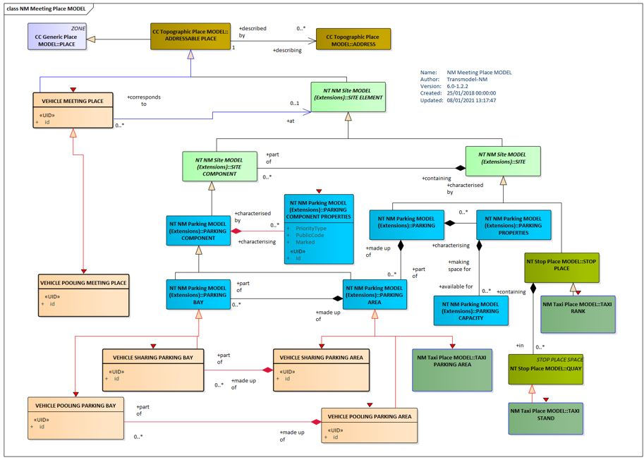

Figure 15 :NM Point de rencontre (UML)

###### Attribution des places de service des véhicules

Les diff&eacute;rents **services de v&eacute;hicules** utilisent des **emplacements sp&eacute;cifiques** pour **embarquer et d&eacute;barquer les passagers**, ou pour permettre aux voyageurs de **prendre ou restituer un v&eacute;hicule**.

Des sp&eacute;cialisations du m&eacute;canisme g&eacute;n&eacute;rique **Transmodel ASSIGNMENT** permettent de **lier les arrêts et les emplacements de stationnement correspondants aux services de v&eacute;hicules**.

Chaque service est d&eacute;crit individuellement ci-dessous.

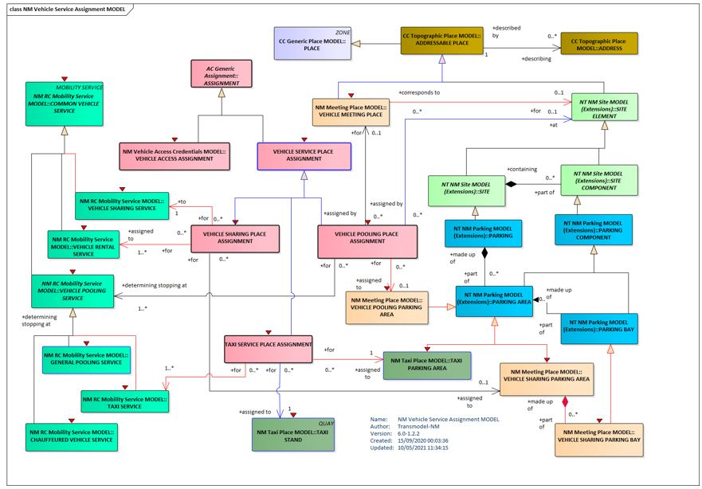

Figure 16 NM Emplacements (UML)

###### Attribution des places dans un système de partage de véhicules

Les **services d'autopartage**  ont besoin d'**emplacements** pour que les utilisateurs puissent **prendre ou d&eacute;poser les v&eacute;hicules**. Ces emplacements peuvent être **exclusifs à un service** ou **partag&eacute;s**. Un **Vehicle Sharing Place Assignment** permet d'**attribuer des zones et places de stationnement** à un service particulier.

Certains services d'autopartage, dits **« Free-Floating »**, permettent de **d&eacute;poser et r&eacute;cup&eacute;rer le v&eacute;hicule n'importe où**, par exemple à un **emplacement identifiable quelconque**, repr&eacute;sent&eacute; par des **points de rencontre pour v&eacute;hicules**.

Un même **Vehicle Sharing Place Assignment** peut **servir soit à l'autopartage, soit à la location**, mais **pas aux deux en même temps**. Si une zone de stationnement est utilis&eacute;e pour un assignment et un service d'autopartage, **deux assignments distincts doivent être d&eacute;finis**.

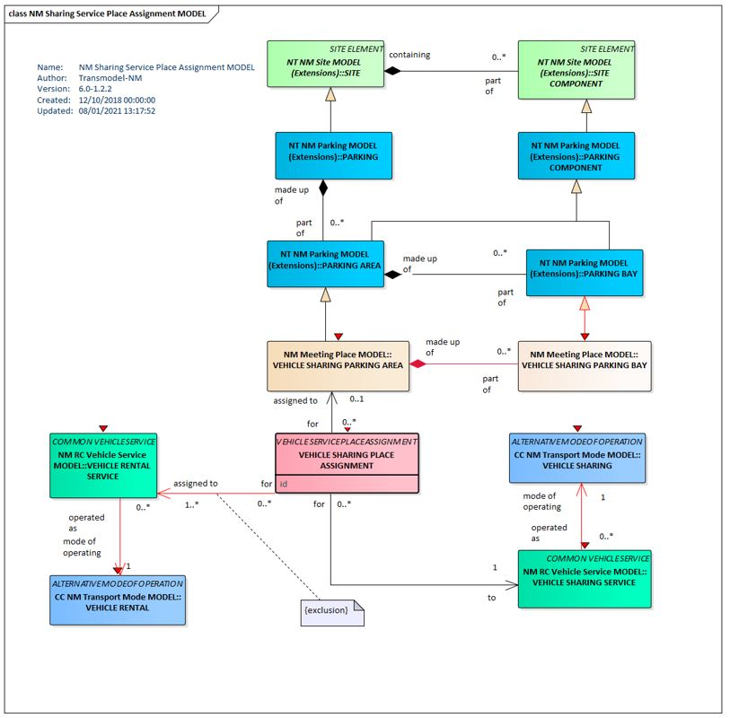

Figure 17 : NM Affectation d'un emplacement à un service de partage de vehicule (UML)

###### Affectation des places en covoiturage

A compléter ulterieurment

##### Modèle de donn&eacute;es

###### **VehicleMeetingPlace**

Lieu où v&eacute;hicules et passagers se rencontrent pour changer de mode de transport, pour embarquer, d&eacute;barquer, prendre ou d&eacute;poser des passagers, etc.

| **Classification** | **Nom** | **Type** | **Cardinalit&eacute;** | **Description** |
| --- | --- | --- | --- | --- |
| ::> | ::> | _AddressablePlace_ | ::> | VEHICLE MEETING PLACE H&eacute;rite de ADDRESSABLE PLACE. |
| «PK» | **_id_** | _VehicleMeetingPlaceIdType_ | 1:1 | Identifiant de VEHICLE MEETING PLACE. |
| «FK» | **_TopographicPlaceRef_** | _TopographicPlaceRef_ | 0:1 | R&eacute;f&eacute;rence à un TOPOGRAPHIC PLACE.. |
| «FK» | **_SiteElementRef_** | _SiteElementRef_ | 0:1 | R&eacute;f&eacute;rence à un SITE ELEMENT, tel que PARKING, PARKING AREA, PARKING BAP, STOP PLACE, QUAY, POINT OF INTEREST, etc. |

Table 36 - **VehicleMeetingPlace**

###### **Vehicle Service Place Assignment**

Affectation d'un dock à un MOBILITY SERVICE

| **Classification** | **Nom** | **Type** | **Cardinalit&eacute;** | **Description** |
| --- | --- | --- | --- | --- |
| ::> | ::> | _Assignment_ | ::> | VEHICLE SERVICE PLACE ASSIGNMENT inherits from ASSIGNMENT. |
| «PK» | **_id_** | _VehicleServicePlaceAssignmentIdType_ | 1:1 | Identifier of TAXI SERVICE PLACE ASSIGNMENT. |

Table 37 - VehicleServicePlaceAssignment - Element

###### **VehicleSharingPlaceAssignment**

The allocation of a VEHICLE SHARING PARKING AREA to any vehicle sharing or rental service.

| **Classification** | **Nom** | **Type** | **Cardinalit&eacute;** | **Description** |
| --- | --- | --- | --- | --- |
| ::> | ::> | _VehicleServicePlaceAssignment_ | ::> | VEHICLE SHARING PLACE ASSIGNMENT inherits from VEHICLE SERVICE PLACE ASSIGNMENT. |
| «PK» | **_id_** | _VehicleSharingPlaceAssignmentIdType_ | 1:1 | Identifier of VEHICLE SHARING PLACE ASSIGNMENT. |
| «cntd» | **_VehicleCommonServiceRef_** | _VehicleSharingServiceRef_ \| _VehicleRentalServiceRef_ | 0:\* | Reference to a VEHICLE SHARING SERVICE or a VEHICLE RENTAL SERVICE. |
| «FK» | **_VehicleSharingParkingAreaRef_** | _VehicleSharingParkingAreaRef_ | 1:1 | Reference to a VEHICLE SHARING PARKING AREA.. |
| «FK» | **_VehicleSharingParkingBayRef_** | _ParkingBayRef_ | 1:1 | Reference to a VEHICLE SHARING PARKING BAY. |

Table 38 - VehicleSharingPlaceAssignment - Element

##### Exemple XML VehicleSharingParkingArea

Le fragment de code suivant montre un **stationnement** pour une **station de v&eacute;los en libre-service** avec **10 emplacements** :

Exemple xml 5 : Zone de Stationnement pour v&eacute;hicule partag&eacute;

#### Disponibilit&eacute; des v&eacute;hicules des modes alternatifs

##### Modèle conceptuel

Le MODÈLE d'information sur la disponibilit&eacute; des v&eacute;hicules d&eacute;crit la disponibilit&eacute; pr&eacute;vue des v&eacute;hicules pour un SERVICE DE MOBILIT&eacute; particulier, exploit&eacute; à un emplacement topographique particulier. La disponibilit&eacute; pr&eacute;vue correspond à la pr&eacute;sence potentielle de v&eacute;hicules stationn&eacute;s à un emplacement et correspond g&eacute;n&eacute;ralement à la capacit&eacute; des PARKINGS et de leurs composants d&eacute;di&eacute;s aux diff&eacute;rents services.

Ces informations peuvent être globales, concernant la capacit&eacute; de l'ensemble du PARKING, ou indiquer la capacit&eacute; des ZONES DE STATIONNEMENT par TYPE DE V&eacute;HICULE. Il convient toutefois de noter que, pour &eacute;quilibrer l'offre et la demande dans les gares très fr&eacute;quent&eacute;es, les op&eacute;rateurs proposent parfois un service de personnel pour fournir ou retirer les v&eacute;hicules suppl&eacute;mentaires d'un d&eacute;pôt fixe ou de les placer sur des v&eacute;hicules mobiles. Cela signifie que la capacit&eacute; « virtuelle » d'un PARKING peut être sup&eacute;rieure au nombre de places physiques.

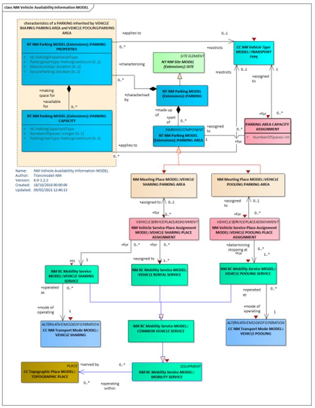

Figure 18 : Disponibilit&eacute; pr&eacute;vue des v&eacute;hicules - MC

##### Modèle de donn&eacute;es

###### ParkingAreaCapacityAssignement

L'Affectation de la capacit&eacute; d'une aire de stationnement permet l'Attribution d'un nombre de places pour un type de v&eacute;hicule particulier dans une aire de stationnement.

| **Classification** | **Nom** | **Type** | **Cardinalit&eacute;** | **Description** |
| --- | --- | --- | --- | --- |
| ::> | ::> | _Assignment_ | ::> | PARKING AREA CAPACITY ASSIGNMENT h&eacute;rite de ASSIGNMENT. |
| «PK» | **_id_** | _ParkingAreaCapacityAssignmentIdType_ | 1:1 | Identifiant du PARKING AREA CAPACITY ASSIGNMENT. |
| «FK» | **_TransportTypeRef_** | _TransportTypeRef_ | 0:1 | TRANSPORT TYPE associ&eacute; au PARKING AREA CAPACITY. |
| «FK» | **_ParkingAreaRef_** | _ParkingAreaRef_ | 1:1 | PARKING AREA associ&eacute; au PARKING AREA CAPACITY ASSIGNMENT. |
| «enum» | **_CapacityType_** | _ParkingCapacityTypeEnum_ | 1:1 | Type de capacit&eacute; |
|     | **_NumberOfSpaces_** | _xsd:nonNegativeInteger_ | 0:1 | Nombre de place |
|     | **_AdditionalVehicleCapacity_** | _xsd:nonNegativeInteger_ | 0:1 | Nombre de places additionnelles qui peuvent être occup&eacute;es par d'autres v&eacute;hicules |

Table 39 - Capacit&eacute; des stations

Note : Pour tout compl&eacute;ment d'information se r&eacute;f&eacute;rer au profil France Parking.

#### Equipements de rechargement

##### Modèle conceptuel

La d&eacute;finition des &eacute;quipements de rechargement pour les v&eacute;hicules partag&eacute;s &eacute;lectrique peut être rattach&eacute;e à un emplacement de v&eacute;hicule en station.

A noter que l'information d'existance de capacit&eacute; de rechargement &eacute;lectrique est port&eacute;e au niveau de la Station (Recharging Availability).

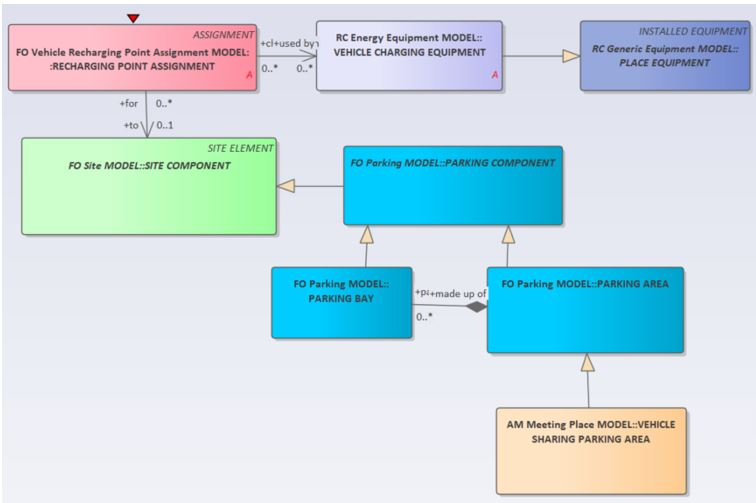

Figure 19 : Equipement de rechargement - MC

##### Modèle de donn&eacute;es

Les **ZONES DE STATIONNEMENT POUR LE PARTAGE/CO-VOITURAGE DE V&eacute;HICULES** peuvent être associ&eacute;es à des &eacute;quipements sp&eacute;cifiques, tels que des bornes de recharge, etc.

L'emplacement des &eacute;quipements est sp&eacute;cifi&eacute; à l'aide d'un **EMPLACEMENT D'&eacute;QUIPEMENT**.

Les **COMPOSANTS DE STATIONNEMENT** particuliers et l'**EMPLACEMENT D'&eacute;QUIPEMENT** doivent faire r&eacute;f&eacute;rence au même **COMPOSANT DE SITE**

###### Vehicle charging Equipment (Equipement de rechargement des v&eacute;hicules)

| **Classification** | **Nom** | **Type** | **Cardinalit&eacute;** | **Description** |
| --- | --- | --- | --- | --- |
| ::> | ::> | _PlaceEquipment_ | ::> | VEHICLE CHARGING EQUIPMENT h&eacute;rite de PLACE EQUIPMENT |
| «PK» | **_id_** | _VehicleChargingEquipmentId_ | 1:1 | Identifiant VEHICLE CHARGING EQUIPMENT. |
|     | **_FreeRecharging_** | _xsd:boolean_ | 0:1 | Identique si le chargement est gratuit |
|     | **_Reservation_** | _xsd:boolean_ | 0:1 | Indique si une r&eacute;servation est n&eacute;cessaire |
|     | **_ReservationUrl_** | _xsd:anyURI_ | 0:1 | URL de r&eacute;servation. |

Table 40 - Equipement de rechargement

# Entêtes NeTEx