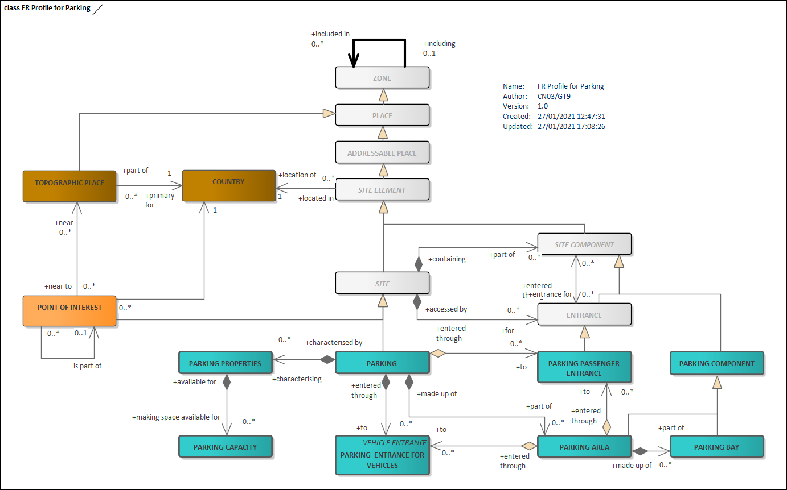
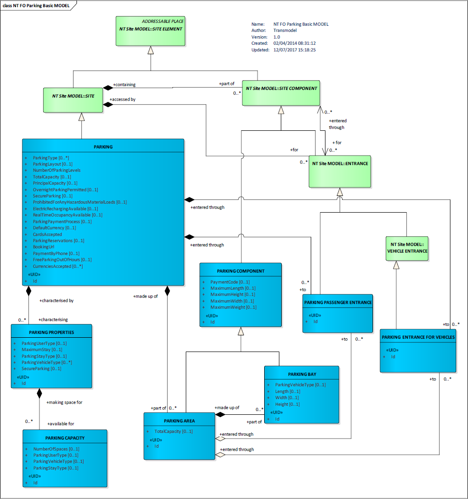
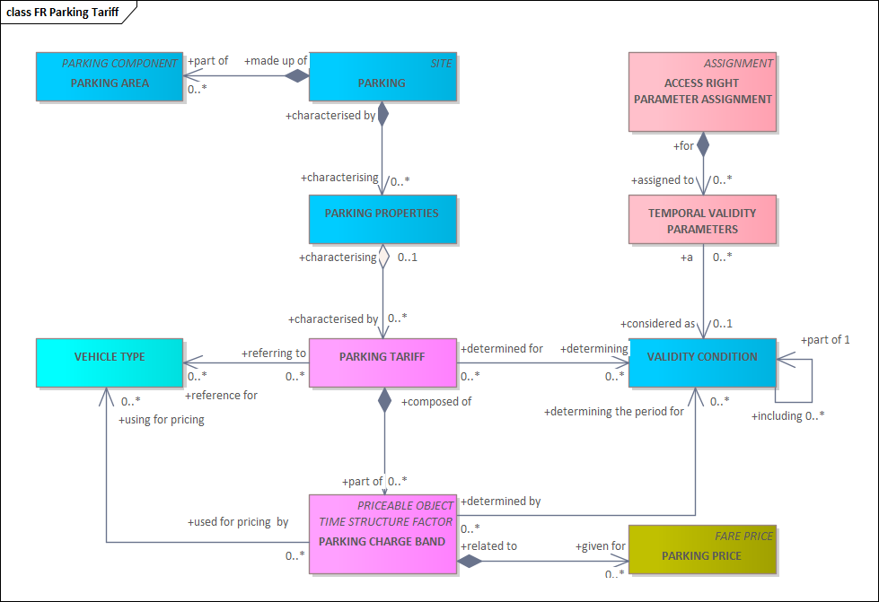
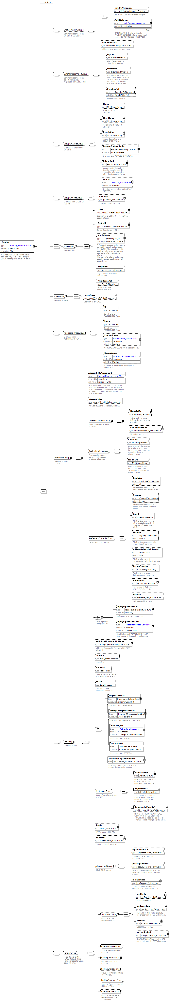
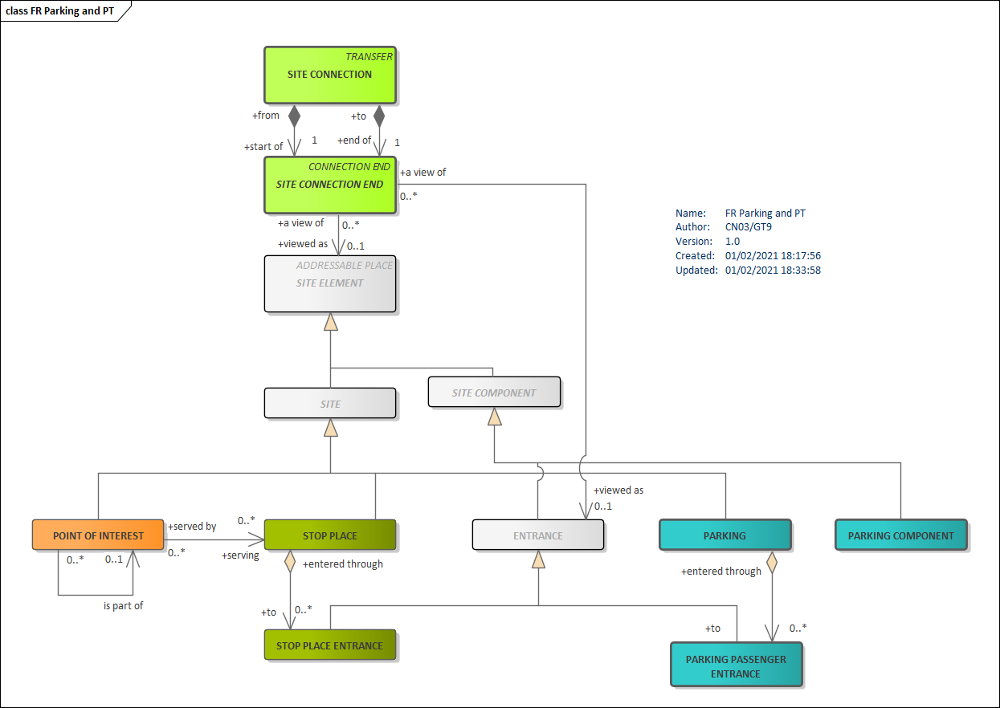
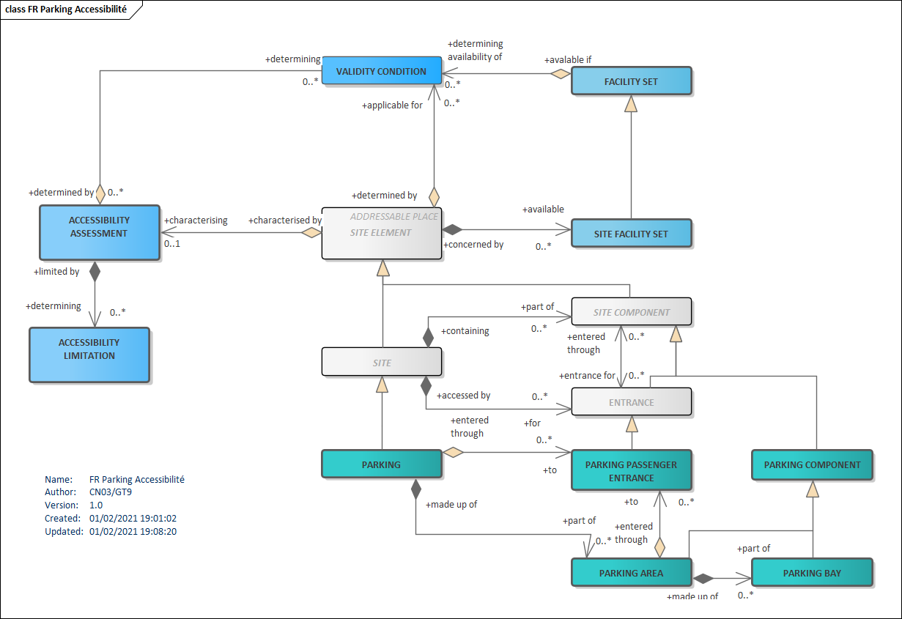
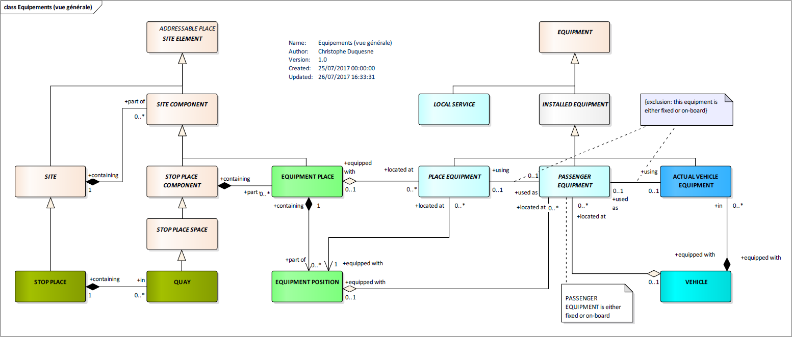
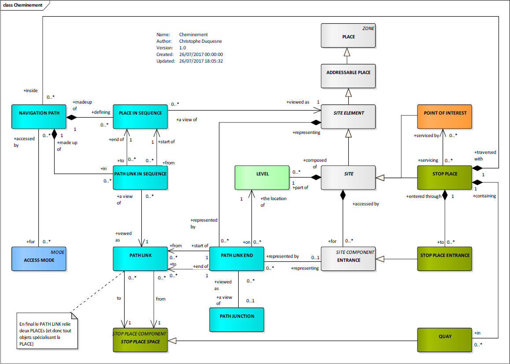

**Avant-propos**

L’harmonisation des pratiques dans l’échange des données relatives aux
offres de transport est essentielle :

- pour l’usager, aux fins d’une présentation homogène et compréhensible
  de l’offre de transport et de l’engagement sous-jacent des
  organisateurs (autorités organisatrices et opérateurs de transports) ;
- pour les AO, de manière à fédérer des informations homogènes venant de
  chacun des opérateurs de transports qui travaillent pour elle.
  L’harmonisation des échanges, et en particulier le présent profil,
  pourra le cas échéant être imposé par voie contractuelle. Cette
  homogénéité des formats d’information permet d’envisager la mise en
  place de systèmes d’information multimodaux, produisant une
  information globale de l’offre de transports sur un secteur donné, et
  garantir le fonctionnement des services d’information, en particulier
  des calculateurs d’itinéraires, et la cohérence des résultats, que ces
  services soient directement intégrés dans ces systèmes d’information
  multimodaux ou qu’ils puisent leurs informations sur des bases de
  données réparties ;
- pour les opérateurs, qui pourront utiliser ce format d’échange pour
  leurs systèmes de planification, les systèmes d’aide à l’exploitation,
  leurs systèmes billettiques et leurs systèmes d’information voyageur
  (information planifiée et information temps réel)
- pour les industriels et développeurs pour pérenniser et fiabiliser
  leurs investissements sur les formats d’échanges implémentés par les
  systèmes qu’ils réalisent, tout en limitant fortement l’effort de
  spécification lié aux formats d’échange

Ce document est le fruit de la collaboration entre les différents
partenaires des acteurs du domaine des parkings (exploitants, société de
services et experts de domaine) des autorités organisatrices de
transports, opérateurs, industriels et développeurs de solutions et de
systèmes informatiques ayant pour objet l’aide à l’exploitation du
transport public et l’information des voyageurs. Il a pour objet de
présenter le profil d’échange Profil NeTEx Parking : "format de
référence pour l'échange de données de description des Parkings" (issu
des travaux *NeTEx, Transmodel)* qui aujourd’hui fait consensus dans les
groupes de normalisation (CN03/GT9 – Parking, et CN03/GT7 – Transport
public / information voyageur).

**Introduction**

Le présent format d’échange est un profil de NeTEx.

NeTEx (CEN TS 16614-1, 16614-2 et 16614-3) propose un format et des
services d'échange de données de description de l'offre de transport
planifiée, basé sur Transmodel (EN 12896). NeTEx permet non seulement
d'assurer les échanges pour les systèmes d'information voyageur mais
traite aussi l’ensemble des concepts nécessaires en entrée et sortie des
systèmes de planification de l'offre (graphiquage, etc.) et des SAE
(Systèmes d’Aide à l’Exploitation). NeTEx traite aussi l’ensemble des
concepts constituant un point de départ, d’arrivé ou une étape au sein
d’un déplacement (POI, Parkings, etc.). Enfin la récente Partie 5 de
NeTEx traite des Nouveaux modes de transport (Autopartage, Vélopartage,
Covoiturage, VTC, etc.).

NeTEx se décompose en 5 parties:

- Partie 1 : topologie des réseaux (les réseaux, les lignes, les
  parcours commerciaux les missions commerciales, les arrêts et lieux
  d’arrêts, les correspondances et les éléments géographiques en se
  limitant au strict minimum pour l’information voyageur)
- Partie 2 : horaires théoriques (les courses commerciales, les heures
  de passage graphiquées, les jours types associés ainsi que les
  versions des horaires)
- Partie 3 : information tarifaire (uniquement à vocation d’information
  voyageur)
- Partie 4 : profil Européen pour l’information voyageur (EPIP)
- Partie 5 : nouveaux modes de transport (Autopartage, Vélopartage,
  Covoiturage, VTC, etc.).

NeTEx a été développé dans le cadre du CEN/TC278/WG3/SG9 piloté par la
France. Les parties 1 et 2 ont été publiées en tant que spécification
technique début 2014. Les travaux pour la partie 3, quant à eux, se sont
terminés en 2016.

Il faut noter que NeTEx a été l'occasion de renforcer les liens du
CEN/TC278/WG3 avec le secteur ferrovaire, en particulier grâce à la
participation de l'ERA (Agence Européen du Rail, qui a intégré NeTEx
dans la directive Européenne 454/2011 TAP-TSI ) et de l'UIC (Union
International des Chemins de fer).

Les normes, dans leur définition même, sont des « documents établis par
consensus ». Celles du CEN/TC278 sont de plus établies à un niveau
européen, en prenant donc en compte des exigences qui dépassent souvent
le périmètre national.

Il en résulte des normes qui sont relativement volumineuses et dont le
périmètre dépasse souvent largement les besoins d'une utilisation
donnée. Ainsi, à titre d'exemple, SIRI propose toute une série d'options
ou de mécanismes dont la vocation est d'assurer la compatibilité avec
les systèmes développés en Allemagne dans le contexte des VDV453/454. De
même, SIRI propose des services dédiés à la gestion des correspondances
garanties, services qui, s'ils sont dès aujourd'hui pertinents en Suisse
ou en Allemagne, sont pratiquement inexistants en France.

De plus, un certain nombre de spécificités locales ou nationales peuvent
amener à préciser l'usage ou la codification qui sera utilisée pour
certaines informations. Par exemple, les Anglais disposant d'un
référentiel national d'identification des points d'arrêts (NaPTAN), ils
imposeront naturellement que cette codification soit utilisée dans les
échanges SIRI, ce que ne feront pas les autres pays européens.

Enfin, certains éléments proposés par ces normes sont facultatifs et il
convient, lors d'une implémentation, de décider si ces éléments seront
ou non implémentés.

L'utilisation des normes liées à l'implémentation de l'interopérabilité
pour le transport en commun passe donc systématiquement par la
définition d'un profil (local agreement, en anglais). Concrètement, le
profil est un document complémentaire à la norme et qui en précise les
règles de mise en œuvre dans un contexte donné. Le profil contient donc
des informations comme :

- détail des services utilisés,
- détails des objets utilisés dans un échange,
- précisions sur les options proposées par la norme,
- précision sur les éléments facultatifs,
- précision sur les codifications à utiliser,
- etc.

Le profil présenté dans ce document permet d’échanger les informations
relatives aux Parkings qui constitue les plus importants points de
transfert modal et sont aussi un des éléments clés des nouveaux modes de
transport. Le cadrage fonctionnel permet de plus de répondre aux
attentes de la réglementation Europeénne et de la LOM (Lois
d’Orientation pour le Mobilités) en France.

D'autre profils de NeTEx sont disponibles (réseau, horaire, tarif). Ils
sont tous complémentaires les uns des autres (sans recouvrement) et
s'appuient tous sur le document : **NeTEx - Profil Français de NETEx:
éléments communs.** Il conviendra de se référer à ce document pour tous
les éléments utilisés dans le présent document, et dont la structure
n'est pas détaillée.

Ce profil d’échange a pour objectif de décrire et de structurer
précisément les éléments nécessaires à une bonne information de
description des parkings de façon :

- à pouvoir les présenter d’une manière homogène et compréhensible à
  l’usager sur des supports différents (papier, ordinateur et
  smartphone, Internet),
- à pouvoir les échanger entre systèmes d’information (systèmes
  d’information voyageurs et systèmes d’information multimodale,
  systèmes d’aide à l’exploitation, systèmes de planification, systèmes
  billettiques, etc.).

Les éléments présentés ci-dessous couvrent donc l’ensemble des concepts
propres à la description des parkings.

NOTE **IMPORTANTE** Ce document étant un profil d'échange de NeTEx, il
ne se substitue en aucun cas à NeTEx, et un minimum de connaissance de
NeTEx sera nécessaire à sa bonne compréhension.

# Domaine d'application

Le présent document constitue le profil de la CEN/TS 16614 (NeTEx) pour
l'échange de données de description d'arrêt en France. Il permet de
décrire les parkings et la manière dont ils pourront être structurés
pour des échanges entre systèmes d'information ainsi que pour leur
présentation aux voyageurs.

# Références normatives

Les documents de référence suivants sont indispensables pour
l'application du présent document. Pour les références datées, seule
l'édition citée s'applique. Pour les références non datées, la dernière
édition du document de référence s'applique (y compris les éventuels
amendements).

CEN/TS 16614-1, Network and Timetable Exchange (NeTEx) — Part 1: Public
transport network topology exchange format

CEN/TS 16614-2, Network and Timetable Exchange (NeTEx) — Part 2: Public
transport scheduled timetables exchange format

CEN/TS 16614-3, Network and Timetable Exchange (NeTEx) — Part 3: Fare
exchange format

EN 12896, Road transport and traffic telematics - Public transport -
Reference data model (Transmodel)

# Termes et définitions

Pour les besoins du présent document, les termes et définitions suivants
s'appliquent. Une grande partie d’entre eux est directement issue de
Transmodel et NeTEx.

NOTE Les termes spécifiquement introduits par le profil d’arrêt sont
signalés par le mot *(profil)*, en italique et entre parenthèses. Les
définitions ci-dessous sont des traductions littérales du document
normatif.

NOTE Les définitions ci-dessus sont des traductions littérales du
document normatif.

## PARKING (parking)

<div class="Definition">

*(Transmodel)*

</div>

Emplacements désignés pour stationner des véhicules tels que des
voitures, des motos et des vélos.

## PARKING PROPERTIES (propriété du parking)

<div class="Definition">

*(Transmodel)*

</div>

<div class="Definition">

Propriéte spécifique du PARKING en complément de sa simple capacité
d’accueil.

</div>

## PARKING CAPACITY

<div class="Definition">

*(Transmodel)*

</div>

<div class="Definition">

Capacités d’accueil du parking.

</div>

## PARKING ENTRANCE FOR VEHICLES (entrée du parking pour les véhicules)

<div class="Definition">

*(Transmodel)*

</div>

<div class="Definition">

Entrée (et/ou sortie) du parking destinée aux véhicules

</div>

## PARKING PASSENGER ENTRANCE (entrée du parking pour les piétons)

<div class="Definition">

*(Transmodel)*

</div>

<div class="Definition">

Entrée (et/ou sortie) du parking destinée aux piétons et tout conducteur
ou passager des véhicule (y-compruis fauteuils roulants).

</div>

## PARKING COMPONENT (composant de Parking)

<div class="Definition">

*(Transmodel)*

</div>

<div class="Definition">

Composant générique du parking (par exemple PARKING AREA -zone de
parking- ou PARKING BAY -place de stationnement-)

</div>

## PARKING AREA (zone de parking)

<div class="Definition">

*(Transmodel)*

</div>

<div class="Definition">

Zone identifiée à l’intérieur d’un parking, et contenant des places de
stationnement (PARKING BAYs).

</div>

## PARKING BAY (place de stationnement)

<div class="Definition">

*(Transmodel)*

</div>

Emplacement où l’on peut stationner une (unique) véhicule.

# Symboles et abréviations

## AO

Autorité Organisatrice de Transports

## PMR

Personne à Mobilité Réduite

# Exigences minimales liées au code des transports et la règlementation européenne

La mise à disposition des données, quand elles existent, est obligatoire et se conforme aux exigences :
- Au niveau européen, du règlement délégué (UE) 2017/1926 de la Commission du 31 mai 2017 modifié par le
  règlement délégué (UE) 2024/490 de la Commission du 29 novembre 2023 (<https://eur-lex.europa.eu/eli/reg_del/2017/1926/2024-03-04>), dit "règlement MMTIS" ;
- Au niveau français, des articles L. 1115-1 à L. 1115-7 , D. 1115-1, R. 1115-2 à R. 1115-8 et D. 1115-9 à D. 1115-11 du code du transports,
  notamment créés ou modifiés par les articles 25 et 27 de loi n° 2019-1428 du 24 décembre 2019 d’orientation des mobilités, dites loi « LOM ».
  Ces mêmes articles de la LOM précise le calendrier de mise à disposition des données.

Le tableau ci-dessous résulte de l’analyse du code des transports et du règlement
MMTIS et fournit la liste des concepts concernés dans le présent
profil correspondant aux données mentionnées dans l’annexe du règlement. Il sera donc nécessaire de fournir ces données pour être
conforme au cadre réglementaire (il s’agit bien de mettre à disposition toutes
les données existantes dans les SI, et non de créer des
données qui n’existeraient pas encore sous forme informatique).

Attention, certaines données considérées comme facultatives dans ce profil peuvent être exigées 
par le règlement MMTIS si celles-ci sont disponibles dans les SI. Dans ce cas, il est recommandé de les fournir.
En cas de doute, se référer au règlement et notamment à son annexe pour connaître les catégories de données à ouvrir.

Notez que beaucoup de concepts dépendent d’autres concepts (soit par héritage soit par relation, au sens UML des termes). 
Ces éléments d’héritage et de relations sont présentés dans les autres parties du profil France, 
mais pas dans ce tableau.

De plus, les noms des catégories (colonnes Catégorie et Détail) ont été
conservés dans la langue originale du document (l’anglais) pour éviter
tout risque de confusion. Pour la même raison, les noms des concepts
concernés sont ceux de la version originale de Transmodel.

Pour certaines catégories de données, il peut arriver que les concepts
correspondants soient multiples, mais aussi qu’ils soient différents
suivant le niveau de précision porté par la donnée. La colonne
« Concepts à minima » correspond alors au minimum à fournir pour
répondre à la catégorie en question et les colonnes « Autres concepts »
décrit des informations complémentaires qui, si elles sont utiles, ne
sont pas indispensables pour répondre à cette catégorie (notez que dans
certains cas, ces concepts additionnels peuvent relever d’autres
profils : ceci est précisé dans le tableau quand c’est le cas). Il faut
toutefois garder à l’esprit que toute information existante est supposée
être mise à disposition (que cela relève de la première ou de la seconde
colonne).

La première colonne reprend la notion de *niveau* tel qu’il est décrit
et utilisé par le règlement européen et a notamment une incidence sur le
calendrier de mise à disposition de la donnée (voir le règlement pour
plus de détails).

Les différents concepts présentés ne sont bien sûr pas détaillés dans ce
tableau, mais dans le profil lui-même. C’est aussi dans la description
du profil que l’on trouvera les détails concernant les attributs
(obligatoire/facultatif, règles de remplissage, codification, etc.).
Pour ce qui est des attributs facultatifs, la règle reste que, pour les
objets ci-dessous, toute information disponible est supposée être
fournie (mais on ne crée pas d’information si elle n’est pas
disponible).

Note : en complément du tableau ci-dessous, le tableau en
***Annexe B-Traçabilité avec les éléments d’entrée*** fournit une
analyse attribut par attribut des éléments attendus.

<div class='table-title'>Concepts relatifs à la LOM et à la Règlementation Européenne</div>

<table class="concepts">
<thead>
<tr class="header">
<th><strong>Niveau</strong></th>
<th><strong>Catégorie</strong></th>
<th><strong>Détail</strong></th>
<th><strong>Concepts à minima pour le profil</strong></th>
<th><strong>Autres concepts</strong></th>
<th><strong>Commentaire</strong></th>
</tr>
</thead>
<tbody>
<tr class="odd">
<td colspan="6"><strong>COMMISSION DELEGATED REGULATION (UE)
2017/1926</strong></td>
</tr>
<tr class="even">
<td><strong>2</strong></td>
<td><em><strong>Location search (origin/ destination)</strong></em></td>
<td>Address identifiers (building number, street name, postcode)</td>
<td><strong>ENTRANCE (VEHICLE and PASSENGER)<br />
PARKING</strong></td>
<td></td>
<td>L’Adresse est incluse dans tous les objets héritant d'ADRESSABLE
PLACE<br />
Au-delà du Profil Arrêt, les informations d’adresse sont donc attendues
pour tous les objets susceptibles d’en porter.</td>
</tr>
<tr class="odd">
<td><strong>2</strong></td>
<td><em><strong>Location search (demand-responsive
modes)</strong></em></td>
<td><ul><li>Park &amp; Ride stops</li>
<li>Bike sharing stations</li>
<li>Car-sharing stations</li>
<li>Publicly accessible refuelling stations <em>(for petrol, diesel,
CNG/LNG, hydrogen powered vehicles, charging stations for electric
vehicles)</em></li>
<li>Secure bike parking (such as locked bike garages)</li></ul></td>
<td><strong>PARKING</strong></td>
<td><p><strong>PARKING AREA</strong></p>
<p><strong>REFUELLING EQUIPMENT</strong></p>
<p><strong>VEHICLE CHARGING EQUIPMENT</strong></p></td>
<td>Voir le profil Accessibilité pour le détail d’utilisation des
équipements</td>
</tr>
<tr class="even">
<td><strong>2</strong></td>
<td><em><strong>Information service</strong></em></td>
<td>Where and how to buy tickets for scheduled modes, demand responsive
modes and car parking (all scheduled modes and demand-responsive incl.
retail channels, fulfilment methods, payment methods)</td>
<td><strong>PARKING</strong> <em>(attributs relatif à la
tarification)</em></td>
<td></td>
<td></td>
</tr>
<tr class="odd">
<td><strong>3</strong></td>
<td><em><strong>Special Fare Products</strong></em></td>
<td>Aggregated products combining different products and add on products
such as parking and travel, minimum stay</td>
<td><strong>PARKING</strong> <em>(fare related attributes)</em></td>
<td><p><strong><u>PARKING TARIFF</u></strong></p>
<p><em>(profil Accessibilité)</em></p>
<p><strong><u>FARE TABLE</u></strong></p>
<p><strong><u>USER PROFILE</u></strong></p></td>
<td>Le Profil NeTEx Tarif propose les éléments nécessaires à une
description détaillées des tarifs.</td>
</tr>
<tr class="even">
<td><strong>3</strong></td>
<td><em><strong>Information service</strong></em></td>
<td>Where how to pay for car parking, public charging stations for
electric vehicles and refuelling points for CNG/LNG, hydrogen, petrol
and diesel powered vehicles (incl. retail channels, fulfilment methods,
payment methods)</td>
<td><strong>PARKING</strong> <em>(fare related attributes)</em></td>
<td><p><strong><u>PARKING TARIFF</u></strong></p>
<p><em>(profil Tarif)</em></p>
<p><strong><u>FARE TABLE</u></strong></p>
<p><strong><u>USER PROFILE</u></strong></p>
<p><em>(profil Accessibilité)</em></p>
<p><strong><u>TICKETING EQUIPMENT</u></strong></p></td>
<td>Le Profil NeTEx Tarif propose les éléments nécessaires à une
description détaillées des tarifs.</td>
</tr>
<tr class="odd">
<td colspan="6"><strong>COMMISSION DELEGATED REGULATION (EU)
2015/962</strong></td>
</tr>
<tr class="even">
<td><strong>1</strong></td>
<td><em><strong>The types of the static road data</strong></em></td>
<td>Location of parking places and service areas</td>
<td><strong>PARKING</strong></td>
<td><strong>PARKING AREA</strong></td>
<td></td>
</tr>
<tr class="odd">
<td><strong>1</strong></td>
<td><em><strong>The types of the static road data</strong></em></td>
<td>Location of charging points for electric vehicles and the conditions
for their use</td>
<td><p><strong>REFUELLING EQUIPMENT</strong></p>
<p><strong>VEHICLE CHARGING EQUIPMENT</strong></p></td>
<td></td>
<td>Voir le profil Accessibilité pour le détail d’utilisation des
équipements</td>
</tr>
<tr class="even">
<td><strong>1</strong></td>
<td><em><strong>The types of the static road data</strong></em></td>
<td>Location of compressed natural gas, liquefied natural gas, liquefied
petroleum gas stations</td>
<td><p><strong>REFUELLING EQUIPMENT</strong></p>
<p><strong>VEHICLE CHARGING EQUIPMENT</strong></p></td>
<td></td>
<td>Voir le profil Accessibilité pour le détail d’utilisation des
équipements</td>
</tr>
</tbody>
</table>

## Extrait des règlements Européens

Les extraits des règlements concernant les parkings sont présentés
ci-dessous (volontairement laissés en anglais, langue utilisée pour leur
rédaction).

### COMMISSION DELEGATED REGULATION (UE) 2017/1926

*<u>Level of service 2</u>*

\(a\) Location search (demand-responsive modes):

> \(i\) Park & Ride stops
>
> \(ii\) Bike sharing stations
>
> \(iii\) Car-sharing stations
>
> \(iv\) Publicly accessible refuelling stations for petrol, diesel,
> CNG/LNG, hydrogen powered vehicles, charging stations for electric
> vehicles
>
> \(v\) Secure bike parking (such as locked bike garages)

\(b\) Information service:

Where and how to buy tickets for scheduled modes, demand responsive
modes and car parking (all scheduled modes and demand-responsive incl.
retail channels, fulfilment methods, payment methods)

*<u>Level of service 3</u>*

Special Fare Products: … aggregated products combining different
products and add on products such as parking and travel, minimum stay

\(b\) Information service (all modes):

> \(iii\) Where how to pay for car parking, public charging stations for
> electric vehicles and refuelling points for CNG/LNG, hydrogen, petrol
> and diesel powered vehicles (incl. retail channels, fulfilment
> methods, payment methods)
>
> **Types of the dynamic travel and traffic data**
>
> \(iii\) Status of access node features (including dynamic platform
> information, operational lifts/escalators, closed entrances and exit
> locations — all scheduled modes)
>
> \(b\) Information service:
>
> Availability of publicly accessible charging stations for electric
> vehicles and refuelling points for CNG/LNG, hydrogen, petrol and
> diesel powered vehicles
>
> \(c\) Availability check:
>
> \(i\) Car-sharing availability, bike sharing availability
>
> \(ii\) Car parking spaces available (on and off-street), parking
> tariffs, road toll tariffs

---

###  COMMISSION DELEGATED REGULATION (EU) 2015/962

<u>1. The types of the static road data include in particular:</u>

> \(i\) location of parking places and service areas;
>
> \(j\) location of charging points for electric vehicles and the
> conditions for their use;
>
> \(k\) location of compressed natural gas, liquefied natural gas,
> liquefied petroleum gas stations;
>
> \(l\) location of public transport stops and interchange points;
>
> \(m\) location of delivery areas.

<u>2. The types of the dynamic road status data include in
particular:</u>

> \(l\) availability of parking places;
>
> \(m\) availability of delivery areas;
>
> \(n\) cost of parking;
>
> \(o\) availability of charging points for electric vehicles;

# Description du profil d’échange

## Conventions de représentation

### Tableaux d’attributs

NOTE Tous les profils NeTEx partagent les mêmes conventions.

Les messages constituant ce profil d'échange sont décrits ci-dessous
selon un double formalisme : une description sous forme de diagrammes
XSD (leur compréhension nécessite une connaissance préalable de XSD: XML
Schema Definition) et une description sous forme tabulaire. Les tableaux
proposent ces colonnes :

<div id="attributes-definition">

| **Classification** | **Nom** | **Type** | **Cardinalité** | **Description** |
|--------------------|---------|----------|-----------------|-----------------|

</div>

- **Classification** : permet de catégoriser l'attribut. Les principales
  catégories sont:
  - PK (Public Key) que l'on peut interpréter comme Identifiant Unique:
    il permet à lui seul d'identifier l'objet, de façon unique, pérenne
    et non ambiguë. C'est l'identifiant qui sera utilisé pour référencer
    l'objet dans les relations.
  - AK (Alternate Key) est un identifiant secondaire, généralement
    utilisé pour la communication, mais qui ne sera pas utilisé dans les
    relations.
  - FK (Foreign Key) indique que l'attribut contient l'identifiant
    unique (PK) d'un autre objet avec lequel il est en relation.
  - GROUP est un groupe XML nommé (ensemble d'attributs utilisables dans
    différents contextes) (voir
    <http://www.w3.org/TR/2001/REC-xmlschema-0-20010502/#AttrGroups> )
- **Nom** : nom de l'élément ou attribut XSD
- **Type** : type de l'élément ou attribut XSD (pour certains d'entre
  eux, il conviendra de se référer à la XSD NeTEx)
- **Cardinalité** : cardinalité de l'élément ou attribut XSD exprimée
  sous la forme "***minimum:maximum***" ("0:1" pour au plus une
  occurrence; "1:\*" au moins une occurrence et sans limites de nombre
  maximal; "1:1" une et une seule occurrence; etc.). Quand le profil
  modifie la cardinalité NeTEx (champ facultatif rendu obligatoire),
  cette modification apparait surlignée en Jaune.
- Description : texte de description de l'élément ou attribut XSD (seul
  les attributs retenus par le profil ont un texte en français; les
  textes surlignés en jaune indiquent une spécificité du profil par
  rapport à NeTEx).

Les textes surlignés en <span class="mark">Jaune</span> sont ceux
présentant une particularité (spécialisation) par rapport à NeTEx: une
codification particulière, une restriction d'usage, etc.

La description XSD utilisée est strictement celle de NeTEx, sans aucune
modification (ceci explique notamment que tous les commentaires soient
en anglais).

Les attributs et éléments rendus obligatoires dans le cadre de ce profil
restent facultatifs dans l'XSD (le contrôle de cardinalité devra donc
être réalisé applicativement).

###  Valeurs de code de profil

Dans la mesure du possible, le profil sélectionne les valeurs de code à
utiliser pour caractériser des éléments et les limite à un ensemble de
valeurs documentées. NETEX propose plusieurs mécanismes différents pour
spécifier les valeurs de code autorisées :

- des énumérations fixes définies dans le cadre du schéma XSD NeTEx. Le
  profil impose alors un sous-ensemble des codes NeTEx.
- des spécialisations de TYPE OF VALUE, utilisées pour définir des
  ensembles de codes ouverts pouvant être ajoutés au fil du temps sans
  modifier le schéma, par exemple, pour enregistrer des classifications
  d'entités héritées. Le profil lui-même utilise le mécanisme TYPE OF
  VALUE dans quelques cas pour spécifier des codes normalisés
  supplémentaires : ceux-ci sont affectés à un CODESPACE
  « FR_IV_metadata » (https://netex-cen.eu/FR_IV) indiqué par un préfixe
  « FR_IV ». (par exemple, « FR_IV: monomodal ».
- des instances TypeOfFrame: le profil utilise plusieurs TYPES DE FRAME
  pour spécifier l'utilisation de VERSION FRAME dans le profil.

### Indication des classes abstraites

NeTEx et Transmodel utilisent largement l'héritage de classe; cela
simplifie considérablement la spécification en évitant les répétitions
puisque les attributs partagés sont déclarés par une superclasse et que
des sous-classes viennent ensuite les spécialiser sans avoir à répéter
ces attributs et en n’ajoutant que ceux qui lui sont spécifiques. La
plupart des superclasses sont « abstraites » - c’est-à-dire qu’il
n’existe aucune instance concrète; seules les sous-classes terminales
sont « concrètes ».

Un inconvénient de l'héritage est que si l'on veut comprendre les
propriétés d'une classe concrète unique, il faut également examiner
toutes ses super-classes. Pour cette raison, le profil inclut les
classes abstraites nécessaires pour comprendre les classes concrètes,
même si ces classes concrètes ne sont jamais directement instanciées
dans un document NeTEx.

- Les super-classes sont signalées dans les en-têtes par le suffixe
  « *(abstrait)* »
- Dans les diagrammes UML (comme pour NeTEx et Transmodel), les noms des
  classes abstraites sont indiqués en italique et les classes abstraites
  sont de couleur gris clair.
- Certaines super-classes ne sont techniquement pas abstraites dans
  NeTEx, mais ne sont pas utilisées comme classes concrètes dans le
  profil : elles sont signalées avec la même convention que les classes
  abstraites.

### Classes de sous-composants

Un certain nombre de classes ont des sous-composants qui constituent
leur définition. Celles-ci fournissent des détails auxiliaires (par
exemple, AlternativeText, AlternativeName, TrainComponent) et sont
signalées dans les en-têtes par le suffixe « *(objet inclus)* ».

## Modèle de données

 *PARKING – Modèle conceptuel*

L'objet le plus haut dans l'arbre d'héritage est la ZONE, décrivant un
objet générique à deux dimensions. Une ZONE peut être définie par un
GROUPE DE POINTS appartenant à la ZONE, et peut également être définie
comme une zone géométrique, bordée d'un polygone.

Une ZONE peut contenir d'autres ZONEs plus petites. Ceci est exprimé par
la relation réflexive sur ZONE et donc un PARKING peut inclure d'autres
PARKING comme tous les objets qui héritent de la
<span class="mark">ZONE : dans le contexte du profil Parking , on se
limitera à **3** niveaux au maximum (un PARKING de plus haut niveau,
pouvant contenir un ou plusieurs Parkings, chacun pouvant à leur tour
contenir un ou plusieurs Parkings mais sans pouvoir descendre plus
« bas »).</span>

Une ZONE peut être représentée par un seul POINT (par l'attribut
**Centroïd*) ***qui peut être utilisé comme une référence ponctuelle à
la ZONE elle-même. Ceci est utile pour représenter les systèmes de
transport flexibles (où un arrêt est souvent un ZONE). Concrètement pour
un PARKING, cela signifie que sa géométrie peut être décrite par une
surface, un ponctuel ou les deux.

Le deuxième niveau de la hiérarchie est la PLACE, qui représente
n'importe quel endroit significatif qu'un modèle de transport peut
vouloir décrire, et pour lequel la possibilité de voyage peut exister
(départ, arrivée ou point de passage). Une PLACE peut être spécialisée
de diverses manières, notamment une TOPOGRAPHIC PLACE (une ville, un
département ou une région nommée), ou une ADDRESSABLE PLACE spécifique
ayant une ADRESSE qui est soit un ROAD ADDRESS, soit un POSTAL ADDRESS.

L’élément de site spécialisé ADDRESSABLE PLACE peut être utilisé pour
ajouter l'accessibilité (voir ACCESSIBILITY ASSESMENT dans le Profil
Éléments Communs) et d'autres propriétés communes à tout lieu pouvant
être parcouru par un passager. Le SITE spécialise l’ELEMENT DE SITE pour
fournir une description générale des propriétés communes d'un lieu, tel
qu'une station ou un point d'intérêt, y compris ses entrées, niveaux,
équipements, cheminements, propriétés d'accessibilité, etc. Le SITE est
lui-même spécialisé en STOP PLACE, POINT D'INTERET, PARKING, etc.

Un PARKING est un type de SITE qui décrit la possibilité du
stationnement pour différents types de véhicules, ainsi que les
relations avec d'autres SITE tels que les gares.

Un PARKING peut être décrit de façon résumée et de façon détaillée - par
exemple, un parking de 50 places, ou encore le même PARKING peut être
décomposé en ZONES DE STATIONNEMENT (chacune sur un NIVEAU), chacune
contenant des PLACEs DE PARKING individuelles d'une taille désignée.

Un PARKING peut avoir des ENTRÉES DE VÉHICULE ainsi que des ENTRÉEs
PIETONNEs.

 *PARKING – Vue détaillée incluant les principaux
attributs*

### Parking

<span class="mark">**\[Code PAYS\]:\[Code commune
INSEE\]:\[Parking\]:\[Code parking spécifique\]:\[Code émetteur du code
technique ou LOC\]**, on aura donc :</span>

- <span class="mark">**\[Code PAYS\]**: Identifiant du Pays en
  respectant la norme ISO 3166-1 (voir:
  [www.iso.org/iso/country_codes/iso_3166_code_lists.htm](http://www.iso.org/iso/country_codes/iso_3166_code_lists.htm),
  **FR** pour la France ).</span>
- <span class="mark">**\[Code commune INSEE\]**: 5 caractères (exemple :
  78297 pour Guyancourt), 2 caractères pour le département et 3 pour la
  commune elle-même en France métropolitaine et 3 2 caractères pour le
  département et 2 pour la commune elle-même pour l’outre-mer.
  Ce code commune pourra, de façon optionnelle, être complété par le
  numéro d’arrondissement de commune précédé d’un « - » (tiret, ASCII
  code 45) codé sur un ou deux caractères numériques.
  En cas de mise à jour du code commune par l’INSEE, par souci de
  pérennité de l’identifiant, on conservera le code attribué
  initialement (pas de suivi d’un éventuel changement de codification
  INSEE donc).</span>
- **<span class="mark">\[Type d’objet\]: Parking</span>**
- <span class="mark">**\[Code arrêt spécifique\]** : code technique
  libre</span>
- <span class="mark">**\[Code émetteur du code technique\]** :
  Identifiant de l’attributeur de code technique, par exemple EFFIA,
  QParK, Indigo, Parcub, ou l’identifiant de la collectivité en charge
  du parking. **LOC** permet de préciser que l'identifiant a été défini
  de façon locale entre les parties engagées dans l'échange, et qu'il ne
  fait donc pas partie du référentiel partagé (local, régional, national,
  etc.) L'utilisation de ce qualificatif est obligatoire quand
  l'identifiant est local. Pour les objets faisant partie de
  référentiels partagés on peut le remplacer par un \[NomAttributaire\]
  qui le nom (ou code) du système référentiel utilisé pour attribuer
  l’identifiant.</span>

<span class="mark">Exemple ***FR:75105:Parking:076:LOC***</span>

Pour mémoire, les élément constitutif de cet identifiant n’ont pour
vocation que de garantir l’unicité et la pérennité quel que soit le
contexte géographique et organisationel: à aucun moment cet identifiant
ne doit être utilisé pour en extraire des information sémantique (ces
information figure dans les attributs des objets). En corollaire, une
fois un identifiant attribué, il ne doit plus être modifié, même si l’un
des constitutifs utilisé était amené à changer.

<span class="mark">Note : dans le cas de parkings pour lesquels un
identifiant unique aurait été délivré par le Point d’accès national sous
la forme ***INSEE-P-xxx*** (où INSEE est le code ***INSEE*** de la
commune et ***xxx*** est le numéro d’ordre sur 3 chiffres) le code INSEE
sera réutilisé dans la structuration ci-dessus et ***xxx*** sera utilisé
pour le **\[Code arrêt spécifique\]**, le **\[Code émetteur du code
technique\]** sera « **NAP** ».</span>

<div class='table-title'>Parking – Element</div>

<table class="attributes">
<thead>
<tr class="header">
<th><strong>Class.</strong></th>
<th><strong>Name</strong></th>
<th><strong>Type</strong></th>
<th><strong>Card.</strong></th>
<th><strong>Description</strong></th>
</tr>
</thead>
<tbody>
<tr class="odd">
<td><em>::&gt;</em></td>
<td><em>::&gt;</em></td>
<td><em>Site</em></td>
<td><em>::&gt;</em></td>
<td><p>PARKING hérite de SITE.<br />
Voir <em>A.2-Profil Arrêt</em> pour les détails.</p>
<p>Note : beaucoups d’éléments important comme la gestion des version,
les conditions de validité ou des attibuts classique comme le nom, la
description, ou encore la géométrie et la position sont issu de cet
héritage.</p>
<p><mark>Note : dans la chaine d’héritage, <em><strong>Id</strong></em>
et <em><strong>Name, AvaliabilityCondition
Centroid.Location.Longitude/Latitude</strong></em> sont des attributs
obligatoire pour le profi Parking.</mark></p></td>
</tr>
<tr class="even">
<td>« PK »</td>
<td><em><strong>id</strong></em></td>
<td><em>ParkingIdType</em></td>
<td>1:1</td>
<td><p>Identifiant du PARKING.</p>
<p><em>Voir codification ci-dessus</em></p></td>
</tr>
<tr class="odd">
<td>« cntd »</td>
<td>(<em>SiteAccessGroup</em>)</td>
<td><em>SiteAccessGroup</em></td>
<td>0:1</td>
<td>Description des lieux liés au Parking et des cheminement qui y amène
(voir SiteConnection et NavigationPath dans le profil
Accessibilité).</td>
</tr>
<tr class="even">
<td>« AK »</td>
<td><em><strong>PublicCode</strong></em></td>
<td><em>StopPlaceCodeType</em></td>
<td>0:1</td>
<td>Code Publique utilisé pour le PARKING.</td>
</tr>
<tr class="odd">
<td></td>
<td><em><strong>Label</strong></em></td>
<td><em>MultilingualString</em></td>
<td>0:1</td>
<td>Label associé au parking PARKING.</td>
</tr>
<tr class="even">
<td></td>
<td><em><strong>ParkingType</strong></em></td>
<td><em>ParkingTypeEnum</em></td>
<td><p>0:*</p>
<p><strong><mark>1:1</mark></strong></p></td>
<td><p>Nature du PARKING.</p>
<blockquote>
<p><em>parkAndRide (P+R)</em></p>
<p><em>liftShareParking (parking pour covoiturage)</em></p>
<p><em>urbanParking (parking urbain)</em></p>
<p><em>airportParking (parking d’aéroport)</em></p>
<p><em>trainStationParking (parking de gare)</em></p>
<p><em>exhibitionCentreParking (parking de park d’exposition)</em></p>
<p><em>rentalCarParking (parking pour loueur)</em></p>
<p><em>shoppingCentreParking (parking de centre comercial)</em></p>
<p><em>motorwayParking (parking d’autoroute</em></p>
<p><em>roadside (parking en voirie)</em></p>
<p><em>parkingZone (zone de parking)</em></p>
<p><em>undefined (type non précisé)</em></p>
<p><em>cycleRental (Parking de location de
vélo/trotinettes/etc.)</em></p>
<p><em>other <mark>(note : devra systématiquement donner lieu au
renseignement de <strong>TypeOfParkingRef</strong>)</mark><br />
</em></p>
</blockquote></td>
</tr>
<tr class="odd">
<td></td>
<td><em><strong>TypeOfParkingRef</strong></em></td>
<td><em>TypeOfParking</em></td>
<td>0:1</td>
<td>Reference à un TYPE OF PARKING (valeur libre non précodée
<mark>uniquement pour les type non proposés par
<em><strong>ParkingType</strong></em></mark>)</td>
</tr>
<tr class="even">
<td></td>
<td><em><strong>ParkingVehicleTypes</strong></em></td>
<td><em>VehicleTypeList</em></td>
<td><p>0 :*</p>
<p><strong><mark>1:*</mark></strong></p></td>
<td><p>Types de Vehicle autorisés dans le PARKING.</p>
<blockquote>
<p><em>pedalCycle (vélo avec pédales, iclus les vélos
électriques)</em></p>
<p><em>moped (vélomoteur)</em></p>
<p><em>motorcycle (moto)</em></p>
<p><em>motorcycleWithSidecar (moto avec sidecar)</em></p>
<p><em>motorScooter (scooter)</em></p>
<p><em>twoWheeledVehicle (véhicule à 2 roues)</em></p>
<p><em>threeWheeledVehicle (véhicules à 3 roues)</em></p>
<p><em>car (voiture)</em></p>
<p><em>smallCar (petite voiture)</em></p>
<p><em>passengerCar (de microcar jusqu’à 9 personnes)</em></p>
<p><em>largeCar (grosse voiture)</em></p>
<p><em>fourWheelDrive (4x4)</em></p>
<p><em>taxi (taxi)</em></p>
<p><em>camperCar (campingcar)</em></p>
<p><em>carWithTrailer (voiture avec remorque)</em></p>
<p><em>carWithCaravan (voiture avec caravane)</em></p>
<p><em>minibus (minibus)</em></p>
<p><em>bus (bus)</em></p>
<p><em>van (van, fourgonnette)</em></p>
<p><em>largeVan (gros van, fourgonnette)</em></p>
<p><em>highSidedVehicle (véhcule haut, au dela de 2.90 m)</em></p>
<p><em>lightGoodsVehicle (utilitaire léger)</em></p>
<p><em>heavyGoodsVehicle (utilitaire lourd)</em></p>
<p><em>agriculturalVehicle (engin agricole)</em></p>
<p><em>tanker (camion citerne)</em></p>
<p><em>truck (camion)</em></p>
<p><em>tram (tram)</em></p>
<p><em>articulatedVehicle (vehicule articulé)</em></p>
<p><em>vehicleWithTrailer (camion remoque)</em></p>
<p><em>lightGoodsVehicleWithTrailer (utilitaire léger avec
remorque)</em></p>
<p><em>heavyGoodsVehicleWithTrailer (utilitaire lourd avec
remorque)</em></p>
<p><em>undefined (non précisé)</em></p>
<p><em>allPassengerVehicles (tous vehicules pour passagers hors fret et
utilitaires donc)</em></p>
<p><em>all (tous)</em></p>
<p><em>other <mark>(note : devra systématiquement donner lieu au
renseignement de <strong>vehicleTypes</strong>)</mark></em></p>
</blockquote></td>
</tr>
<tr class="odd">
<td></td>
<td><em><strong>vehicleTypes</strong></em></td>
<td><em>TransportTypeRef</em></td>
<td>0:1</td>
<td>Type de véhicule en complément du champ précédent (valeur libre non
précodée <mark>uniquement pour les types non proposés par
<em><strong>ParkingVehicleTypes</strong></em></mark>)<br />
<mark>Note : les information liées aux types de carburant nécessitent
l’utilisation des VehicleType (VehicleType.FuelType, par exemple pour le
GPL, voir A.3-</mark>Véhicules<mark>)</mark></td>
</tr>
<tr class="even">
<td></td>
<td><em><strong>ParkingLayout</strong></em></td>
<td><em>ParkingLayoutEnum</em></td>
<td><p>0:1</p>
<p><strong><mark>1:1</mark></strong></p></td>
<td><p>Nature du PARKING.</p>
<blockquote>
<p><em>Covered (couvert)</em></p>
<p><em>openSpace (espace ouvert)</em></p>
<p><em>multistorey (à plusieur étages/niveaux)</em></p>
<p><em>underground (sous terrain)</em></p>
<p><em>roadside (bord de route)</em></p>
<p><em>undefined (non précisé)</em></p>
<p><em>other (autre… <mark>renseigner la description dans ce
cas</mark>)</em></p>
<p><em>cycleHire (location de cycle et trotinettes, inclus les vehicules
partagés)</em></p>
</blockquote></td>
</tr>
<tr class="odd">
<td></td>
<td><em><strong>NumberOfParkingLevels</strong></em></td>
<td><em>xsd:nonNegativeInteger</em></td>
<td>0:1</td>
<td>Nombre total de niveaux</td>
</tr>
<tr class="even">
<td></td>
<td><em><strong>TotalCapacity</strong></em></td>
<td><em>NumberOfSpaces</em></td>
<td><p>0:1</p>
<p><strong><mark>1:1</mark></strong></p></td>
<td>Capacité totale (incluant les places handicapées, réservées,
etc.)</td>
</tr>
<tr class="odd">
<td></td>
<td><em><strong>OvernightParkingPermitted</strong></em></td>
<td><em>xsd:boolean</em></td>
<td>0:1</td>
<td>Signale si les véhicules peuvent rester la nuit.</td>
</tr>
<tr class="even">
<td></td>
<td><em><strong>ProhibitedForHazardousMaterials</strong></em></td>
<td><em>xsd:boolean</em></td>
<td>0:1</td>
<td>Parking interdit pour les vehicules transportant des matériaux
dangereux.</td>
</tr>
<tr class="odd">
<td></td>
<td><em><strong>RechargingAvailable</strong></em></td>
<td><em>xsd:boolean</em></td>
<td>0:1</td>
<td>Indique si le parking dispose de bornes de recharge.</td>
</tr>
<tr class="even">
<td></td>
<td><em><strong>Secure</strong></em></td>
<td><em>xsd:boolean</em></td>
<td>0:1</td>
<td>Indique si le parking est sécurisé (gardiénage, surveillance,
etc.)</td>
</tr>
<tr class="odd">
<td></td>
<td><em><strong>RealTimeOccupancyAvailable</strong></em></td>
<td><em>xsd:boolean</em></td>
<td>0:1</td>
<td>Indique si le parking dispose d’une information temps réel sur les
places disponibles.</td>
</tr>
<tr class="even">
<td colspan="5"><strong>Éléments génériques de
tarification</strong></td>
</tr>
<tr class="odd">
<td></td>
<td><em><strong>ParkingPaymentProcess</strong></em></td>
<td><em>PaymentProcessEnum</em></td>
<td><p>0:*</p>
<p><strong><mark>1:*</mark></strong></p></td>
<td><p>Modes des paiement disponible</p>
<blockquote>
<p><em>free (gatuit)</em></p>
<p><em>payAtBay (aux bornes de sortie)</em></p>
<p><em>payAndDisplay (horodateur)</em></p>
<p><em>payAtExitBoothManualCollection (manuel à la sortie)</em></p>
<p><em>payAtMachineOnFootPriorToExit (en machine, à pied, avant de
sortir)</em></p>
<p><em>payByPrepaidToken (prépaiement)</em></p>
<p><em>payByMobileDevice (par mobile)</em></p>
<p><em>undefined (non précisé)</em></p>
<p><em>other (autre)</em></p>
</blockquote></td>
</tr>
<tr class="even">
<td></td>
<td><em><strong>PaymentMethods</strong></em></td>
<td><em>PaymentMethodList</em></td>
<td><p>0:*</p>
<p><strong><mark>1:*</mark></strong></p></td>
<td><p>Méthodes de paiement utilisées dans le PARKING.</p>
<blockquote>
<p><em>cash (liquide)</em></p>
<p><em>cashExactChangeOnly (miquide sans rendu de monaie)</em></p>
<p><em>cashAndCard (liquide et cartes)</em></p>
<p><em>coin (pièces)</em></p>
<p><em>banknote (billets)</em></p>
<p><em>cheque (chèque)</em></p>
<p><em>travellersCheque (traveller chèque)</em></p>
<p><em>postalOrder (mandat postal)</em></p>
<p><em>companyCheque (chèque d’entreprise)</em></p>
<p><em>creditCard (carte de crédit)</em></p>
<p><em>debitCard (carte de débit)</em></p>
<p><em>cardsOnly (cartes uniquement)</em></p>
<p><em>travelCard (carte de transport)</em></p>
<p><em>contactlessPaymentCard (paiement sans contact)</em></p>
<p><em>contactlessTravelCard (carte de transport sans contact)</em></p>
<p><em>directDebit (prélèvement)</em></p>
<p><em>bankTransfer (virement bancaire)</em></p>
<p><em>epayDevice (paiement électronique)</em></p>
<p><em>epayAccount (compte électronique)</em></p>
<p><em>sms (par SMS)</em></p>
<p><em>mobilePhone (par télépohne portable)</em></p>
<p><em>mobileApp (par Application sur téléphone ou ordinateur)</em></p>
<p><em>voucher (voucher/bon)</em></p>
<p><em>token (jeton)</em></p>
<p><em>warrant (madat)</em></p>
<p><em>mileagePoints (miles)</em></p>
<p><em>other (autre)</em></p>
</blockquote></td>
</tr>
<tr class="odd">
<td></td>
<td><em><strong>typesOfPaymentMethod</strong></em></td>
<td><em>TypeOfPaymentMethodRef</em></td>
<td>0 :*</td>
<td>Method of Payment (valeur libre non précodée <mark>uniquement pour
les type non proposés par
<em><strong>PaymentMethods</strong></em></mark>)</td>
</tr>
<tr class="even">
<td></td>
<td><em><strong>DefaultCurrency</strong></em></td>
<td><em>CurrencyType</em></td>
<td>0:1</td>
<td>Devise par défaut <mark>(Euros en France… même si le champs n’est
pas rempli)</mark></td>
</tr>
<tr class="odd">
<td></td>
<td><em><strong>CurrenciesAccepted</strong></em></td>
<td><em>CurrencyList</em></td>
<td>0:1</td>
<td>Devises acceptées.</td>
</tr>
<tr class="even">
<td></td>
<td><em><strong>CardsAccepted</strong></em></td>
<td>xsd:NMTOKENS</td>
<td>0:1</td>
<td><p>Indique les carte de payment acceptées</p>
<p><mark>Le Profil prédéfini quelque code de
<em>TypeOfPaymentMethod </em>:</mark></p>
<ul>
<li><em><mark>VISA</mark></em></li>
<li><em><mark>MASTERCARD</mark></em></li>
<li><em><mark>CB</mark></em></li>
<li><em><mark>TOTAL (GR)</mark></em></li>
<li><em><mark>LIBERTE</mark></em></li>
</ul>
<p>Plusieurs cartes peuvent naturellement être indiquées (in sépare la
noms pas des espaces)</p></td>
</tr>
<tr class="odd">
<td></td>
<td><em><strong>ParkingReservations</strong></em></td>
<td><em>ParkingReservationEnum</em></td>
<td>0:1</td>
<td><p>Type de réservation</p>
<ul>
<li><em>reservationRequired (réservation nécessaire)</em></li>
<li><em>reservationAllowed (réservation possible)</em></li>
<li><em>noReservations (pas de réservation)</em></li>
<li><em>registrationRequired (enregistrement nécessaire pour accéder au
parking)</em></li>
<li><em>other (autre)</em></li>
</ul></td>
</tr>
<tr class="even">
<td></td>
<td><em><strong>BookingUrl</strong></em></td>
<td><em>xsd:anUri</em></td>
<td>0:1</td>
<td>URL poiur la réservation.</td>
</tr>
<tr class="odd">
<td>« cntd »</td>
<td><em><strong>PaymentByMobile</strong></em></td>
<td><em>PaymentByMobile</em></td>
<td>0:1</td>
<td>Comment payer par téléphone ou via une app.</td>
</tr>
<tr class="even">
<td></td>
<td><em><strong>FreeParkingOutOfHours</strong></em></td>
<td><em>xsd:boolean</em></td>
<td>0:1</td>
<td>Indique si le parking est accessible et gratuit en dehors des heures
d’ouvertures.</td>
</tr>
<tr class="odd">
<td colspan="5"><strong>Constituants</strong></td>
</tr>
<tr class="even">
<td>« cntd »</td>
<td><em><strong>parkingProperties</strong></em></td>
<td><em>ParkingProperties</em></td>
<td>0 :*</td>
<td><p>Proriétés détaillées du PARKING.</p>
<p><mark>Note : On ne remplira qu’un unique block
<em>ParkingProperties</em> global au parking, les propriétés spécifique
aux Areas seront directement renseignées dans les bloc Area eux
même</mark></p></td>
</tr>
<tr class="odd">
<td>« cntd »</td>
<td><em><strong>parkingAreas</strong></em></td>
<td><em>ParkingArea</em></td>
<td>0 :*</td>
<td><p>PARKING AREAs (zon de parking) faisant partie de ce PARKING.</p>
<p><mark>Note : Comme dans tous les profile Français de NeTEx on
utilisera ici l’inclusion XML et non les références.</mark></p></td>
</tr>
<tr class="even">
<td>« cntd »</td>
<td><em><strong>entrances</strong></em></td>
<td><em>StopPlaceEntrance</em></td>
<td>0 :*</td>
<td>Liste des entrées pour les véhicules et les piértons.</td>
</tr>
</tbody>
</table>

<div class='table-title'>PaymentByMobile – Element</div>

<table class="attributes">
<thead>
<tr class="header">
<th><strong>Class.</strong></th>
<th><strong>Name</strong></th>
<th><strong>Type</strong></th>
<th><strong>Card.</strong></th>
<th><strong>Description</strong></th>
</tr>
</thead>
<tbody>
<tr class="odd">
<td></td>
<td><em><strong>PhoneNumberToPay</strong></em></td>
<td><em>PhoneType</em></td>
<td>0:1</td>
<td>Numéro de téléphone pour le paiement (appel et/ou SMS)</td>
</tr>
<tr class="even">
<td></td>
<td><em><strong>SupportPhoneNumber</strong></em></td>
<td><em>PhoneType</em></td>
<td>0:1</td>
<td>Numéro de téléphone pour l’assistance.</td>
</tr>
<tr class="odd">
<td></td>
<td><em><strong>PaymentUrl</strong></em></td>
<td><em>xsd:anyUri</em></td>
<td>0:1</td>
<td>URL pour le paiement.</td>
</tr>
<tr class="even">
<td></td>
<td><em><strong>PaymentAppDownloadUrl</strong></em></td>
<td><em>xsd:anyUri</em></td>
<td>0:1</td>
<td><p>URL pour télécharger l’application de paiement.</p>
<p>Note : s’il y a plusieurs application de paiement, ou plus
classiquement des accès à l’application différentiés par type de
plateforme (IOS, Android, etc.), l’URL fournisra un lien d’accès à une
page fournissant l’ensemble de liens de téléchargement.</p></td>
</tr>
</tbody>
</table>

<div class='table-title'>TypeOfPaymentMethod – Element</div>

<div class='attributes'>

| **Class.** | **Name**            | **Type**                    | **Card.** | **Description**                                                                                       |
|------------|---------------------|-----------------------------|-----------|-------------------------------------------------------------------------------------------------------|
| ::\>       | ::\>                | *<u>TypeOfValue</u>*        | ::\>      | TYPE OF PAYMENT METHOD hérite de TYPE OF VALUE (voir Profil Éléments Communs).                        |
| « PK »     | ***id***            | *TypeOfPaymentMethodIdType* | 1:1       | Identifiant du TYPE OF PAYMENT METHOD.                                                                |
| « enum »   | ***PaymentMethod*** | *PaymentMethodEnum*         | 0:1       | Type de méthode de paiement prédéfinie que l’on peut associée à ce TYPE OF PAYMENT METHOD spécifique. |
|            | ***AutomatedUse***  | xsd:boolean                 | 0:1       | Indique si le paiement peut être automatisé (débit direct, etc.).                                     |

</div>

#### Exemple

``` xml
<Parking id="FR:75105:Parking:076:Qpark" version="2" responsibilitySetRef="FR:ResponsibilitySet:0123:LOC">
  <validityConditions>
    <AvailabilityCondition id="FR:AvailabilityCondition:01:Qpark" version="any">
      <!-- Ouverture semaine et samedi-->
      <IsAvailable>true</IsAvailable>
      <dayTypes>
        <DayType version="any" id="FR:DayType:01:Qpark">
          <properties>
            <PropertyOfDay>
              <DaysOfWeek>Weekdays Weekend</DaysOfWeek>
            </PropertyOfDay>
          </properties>
          <timebands id="FR:timebands:01:Qpark">
            <Timeband id="FR:Timeband:01:Qpark" version="any">
              <StartTime>07:00:00</StartTime>
              <EndTime>20:00:00</EndTime>
            </Timeband>
          </timebands>
        </DayType>
      </dayTypes>
    </AvailabilityCondition>
  </validityConditions>
  <Name>PATRIARCHES</Name>
  <ParkingType>urbanParking</ParkingType>
  <ParkingVehicleTypes>car</ParkingVehicleTypes>
  <ParkingLayout>underground</ParkingLayout>
  <TotalCapacity>334</TotalCapacity>
  <ParkingPaymentProcess>payAtMachineOnFootPriorToExit payAtBay</ParkingPaymentProcess>
  <PaymentMethods>cashAndCard epayDevice contactlessPaymentCard</PaymentMethods>
  <ParkingReservation>noReservations</ParkingReservation>
  <parkingProperties>
    <ParkingProperties id="FR:ParkingProperties:1:Qpark" version="any">
      <ParkingUserTypes>allUsers</ParkingUserTypes>
    </ParkingProperties>
  </parkingProperties>
  <!-- … etc. (ParkingAreas, Entrances …) -->
</Parking>
```

### Composants des Parkings

<div class='table-title'>ParkingArea – Element</div>

<table class="attributes">
<thead>
<tr class="header">
<th><strong>Class.</strong></th>
<th><strong>Name</strong></th>
<th><strong>Type</strong></th>
<th><strong>Card.</strong></th>
<th><strong>Description</strong></th>
</tr>
</thead>
<tbody>
<tr class="odd">
<td><em>::&gt;</em></td>
<td><em>::&gt;</em></td>
<td><em>SiteComponentGroup</em></td>
<td><em>::&gt;</em></td>
<td><p>PARKING AREA hérite de PARKING COMPONENT.</p>
<p>Note : beaucoups d’éléments important comme la gestion des version,
les conditions de validité ou des attibuts classique comme le nom, la
description, ou encore la géométrie et la position sont issu de cet
héritage.</p></td>
</tr>
<tr class="even">
<td>« PK »</td>
<td><em><strong>id</strong></em></td>
<td><em>ParkingAreaIdType</em></td>
<td>1 :1</td>
<td><p>Identifiant du PARKING AREA.</p>
<p>Forme :</p>
<p><mark><strong>[</strong><em>Code fournisseur</em><strong>]:[ParkingArea] :[</strong><em>Code technique</em><strong>]:LOC</strong></mark></p></td>
</tr>
<tr class="odd">
<td></td>
<td><em><strong>TotalCapacity</strong></em></td>
<td><em>NumberOfSpaces</em></td>
<td>0:1</td>
<td>Capacité totale du PARKING AREA.</td>
</tr>
<tr class="even">
<td></td>
<td><em><strong>NumberOfBaysWithWIthRecharging</strong></em></td>
<td><em>NumberOfSpaces</em></td>
<td>0:1</td>
<td>Nombre de place disposant d’une borne de recharge électrique PARKING
AREA.</td>
</tr>
<tr class="odd">
<td>« cntd »</td>
<td><em><strong>ParkingProperties</strong></em></td>
<td><em>ParkingProperties</em></td>
<td>0:1</td>
<td>Propriétés détaillée du PARKING AREA.</td>
</tr>
<tr class="even">
<td>« cntd »</td>
<td><em><strong>bays</strong></em></td>
<td><em>ParkingBay</em></td>
<td>0 :*</td>
<td><p>Détail des place individuelles dans le PARKING AREA.</p>
<p><mark>Note : Comme dans tous les profile Français de NeTEx on
utilisera ici l’inclusion XML et non les références.</mark></p>
<p><mark>Note : la description détaillée des places de parking est
nécessaire en particulier dans le contexte des place
PMR.</mark></p></td>
</tr>
<tr class="odd">
<td>« cntd »</td>
<td><em><strong>entrances</strong></em></td>
<td><em>SiteEntrance</em></td>
<td>0 :*</td>
<td>ENTRANCEs of PARKING COMPONENT.</td>
</tr>
</tbody>
</table>

<div class='table-title'>ParkingComponent – Element</div>

<table class="attributes">
<thead>
<tr class="header">
<th><strong>Class.</strong></th>
<th><strong>Name</strong></th>
<th><strong>Type</strong></th>
<th><strong>Card.</strong></th>
<th><strong>Description</strong></th>
</tr>
</thead>
<tbody>
<tr class="odd">
<td><em>::&gt;</em></td>
<td><em>::&gt;</em></td>
<td><em>SiteComponent</em></td>
<td><em>::&gt;</em></td>
<td>PARKING COMPONENT hérite de SITE COMPONENT.</td>
</tr>
<tr class="even">
<td>« PK »</td>
<td><em><strong>id</strong></em></td>
<td><em>ParkingComponentIdType</em></td>
<td>1:1</td>
<td>Identifiant du PARKING COMPONENT.</td>
</tr>
<tr class="odd">
<td></td>
<td><em><strong>ParkingPaymentCode</strong></em></td>
<td><em>xsd:normalizedString</em></td>
<td>0:1</td>
<td>Code de paiement associé au PARKING COMPONENT</td>
</tr>
<tr class="even">
<td></td>
<td><em><strong>Label</strong></em></td>
<td><em>MultilingualString</em></td>
<td>0:1</td>
<td>Label additionel désignant le PARKING COMPONENT.</td>
</tr>
<tr class="odd">
<td></td>
<td><em><strong>MaximumLength</strong></em></td>
<td><em>LengthType</em></td>
<td>0:1</td>
<td>Longueur maximale des véhicules dans le PARKING AREA.</td>
</tr>
<tr class="even">
<td></td>
<td><em><strong>MaximumWidth</strong></em></td>
<td><em>LengthType</em></td>
<td>0:1</td>
<td>Largeur maximale des véhicules dans le PARKING AREA.</td>
</tr>
<tr class="odd">
<td></td>
<td><em><strong>MaximumHeight</strong></em></td>
<td><em>LengthType</em></td>
<td><p>0:1</p>
<p><strong><mark>1:1</mark></strong></p></td>
<td>Hauteur maximale des véhicules dans le PARKING AREA.</td>
</tr>
<tr class="even">
<td></td>
<td><em><strong>MaximumWeight</strong></em></td>
<td><em>WeightType</em></td>
<td>0:1</td>
<td>Poids maximal des véhicules dans le PARKING AREA.</td>
</tr>
</tbody>
</table>

La ***ParkingBay*** correspond à l’emplacement pour garer un véhicule.

<div class='table-title'>ParkingBay – Element</div>

<table class="attributes">
<thead>
<tr class="header">
<th><strong>Class.</strong></th>
<th><strong>Name</strong></th>
<th><strong>Type</strong></th>
<th><strong>Card.</strong></th>
<th><strong>Description</strong></th>
</tr>
</thead>
<tbody>
<tr class="odd">
<td><em>::&gt;</em></td>
<td><em>::&gt;</em></td>
<td><em>SiteComponent</em></td>
<td><em>::&gt;</em></td>
<td><p>PARKING BAY hérite de SITE COMPONENT.</p>
<p>Note : beaucoups d’éléments important comme la gestion des version,
les conditions de validité ou encore la géométrie, la position et
l’accessibilité de la place sont issu de cet héritage.</p></td>
</tr>
<tr class="even">
<td>« PK »</td>
<td><em><strong>id</strong></em></td>
<td><em>ParkingBayIdType</em></td>
<td>1:1</td>
<td>Identifiant du PARKING BAY.</td>
</tr>
<tr class="odd">
<td></td>
<td><em><strong>ParkingVehicleType</strong></em></td>
<td><em>ParkingVehicleEnum</em></td>
<td>0:1</td>
<td>TYPEs of VEHICLE qui peuvent utiliser cette place.</td>
</tr>
<tr class="even">
<td></td>
<td><em><strong>Length</strong></em></td>
<td><em>LengthType</em></td>
<td>0:1</td>
<td>Longueur de la place.</td>
</tr>
<tr class="odd">
<td></td>
<td><em><strong>Width</strong></em></td>
<td><em>LengthType</em></td>
<td>0:1</td>
<td>Largeur de la place.</td>
</tr>
<tr class="even">
<td></td>
<td><em><strong>Height</strong></em></td>
<td><em>LengthType</em></td>
<td>0:1</td>
<td>Hauteur de la place.</td>
</tr>
<tr class="odd">
<td></td>
<td><em><strong>Weight</strong></em></td>
<td><em>WeightType</em></td>
<td>0:1</td>
<td>Poids maximal pour la place.</td>
</tr>
<tr class="even">
<td></td>
<td><em><strong>RechargingAvailable</strong></em></td>
<td><em>xsd:boolean</em></td>
<td>0:1</td>
<td>Indique si une borne de recharge est disponible à la place. Voir
EQUIPMENT pour plus de détails.</td>
</tr>
</tbody>
</table>

***ParkingProperties*** décrit les propriétés générale du PARKING et de
ses constituants, à l’exception des caractéristiques de capacité.

<div class='table-title'>ParkingProperties – Element</div>

<table class="attributes">
<thead>
<tr class="header">
<th><strong>Class.</strong></th>
<th><strong>Name</strong></th>
<th><strong>Type</strong></th>
<th><strong>Card.</strong></th>
<th><strong>Description</strong></th>
</tr>
</thead>
<tbody>
<tr class="odd">
<td><em>::&gt;</em></td>
<td><em>::&gt;</em></td>
<td><em>VersionedChild</em></td>
<td><em>::&gt;</em></td>
<td>PARKING PROPERTies hérite de VERSIONED CHILD.</td>
</tr>
<tr class="even">
<td>« PK »</td>
<td><em><strong>id</strong></em></td>
<td><em>ParkingPropertiesIdType</em></td>
<td>1:1</td>
<td>Identifiant du PARKING PROPERTies.</td>
</tr>
<tr class="odd">
<td></td>
<td><em><strong>Name</strong></em></td>
<td><em>MultilingualString</em></td>
<td>0 :1</td>
<td>Nom associé à ces propiétés (permet de les identifer clairement
quand il y a plusieurs groupes de propriétés)</td>
</tr>
<tr class="even">
<td></td>
<td><em><strong>ParkingUserType</strong></em></td>
<td><em>ParkingUserEnum</em></td>
<td>0 :*</td>
<td><p>Types d’utilisateurs admis</p>
<blockquote>
<p><em>allUsers (pas de restriction)</em></p>
<p><em>staff (personnel du parking)</em></p>
<p><em>visitors (visiteurs)</em></p>
<p><em>registeredDisabled (personnes handicapées enregistrèes)</em></p>
<p><em>registered (personnes enregistrées)</em></p>
<p><em>rental (location… personnes louant la place)</em></p>
<p><em>doctors (docteurs et personels médicaux)</em></p>
<p><em>residentsWithPermits (résident avec permis)</em></p>
<p><em>reservationHolders (personnes ayant réservé)</em></p>
<p><em>emergencyServices (services d’urgence)</em></p>
<p><em>taxi (taxi)</em></p>
<p><em>vehicleSharing (partage de véhicule)</em></p>
<p><em>other (autre)</em></p>
</blockquote></td>
</tr>
<tr class="odd">
<td></td>
<td><em><strong>ParkingVehicleTypes</strong></em></td>
<td><em>VehicleTypeList</em></td>
<td><p>0 :*</p>
<p><strong><mark>1:*</mark></strong></p></td>
<td><p>Types de véhicles autorisés :</p>
<blockquote>
<p><em>pedalCycle (vélo avec pédales, iclus les vélos
électriques)</em></p>
<p><em>moped (vélomoteur)</em></p>
<p><em>motorcycle (moto)</em></p>
<p><em>motorcycleWithSidecar (moto avec sidecar)</em></p>
<p><em>motorScooter (scooter)</em></p>
<p><em>twoWheeledVehicle (véhicule à 2 roues)</em></p>
<p><em>threeWheeledVehicle (véhicules à 3 roues)</em></p>
<p><em>car (voiture)</em></p>
<p><em>smallCar (petite voiture)</em></p>
<p><em>passengerCar (de microcar jusqu’à 9 personnes)</em></p>
<p><em>largeCar (grosse voiture)</em></p>
<p><em>fourWheelDrive (4x4)</em></p>
<p><em>taxi (taxi)</em></p>
<p><em>camperCar (campingcar)</em></p>
<p><em>carWithTrailer (voiture avec remorque)</em></p>
<p><em>carWithCaravan (voiture avec caravane)</em></p>
<p><em>minibus (minibus)</em></p>
<p><em>bus (bus)</em></p>
<p><em>van (van, fourgonnette)</em></p>
<p><em>largeVan (gros van, fourgonnette)</em></p>
<p><em>highSidedVehicle (véhcule haut, au dela de 2.90 m)</em></p>
<p><em>lightGoodsVehicle (utilitaire léger)</em></p>
<p><em>heavyGoodsVehicle (utilitaire lourd)</em></p>
<p><em>agriculturalVehicle (engin agricole)</em></p>
<p><em>tanker (camion citerne)</em></p>
<p><em>truck (camion)</em></p>
<p><em>tram (tram)</em></p>
<p><em>articulatedVehicle (vehicule articulé)</em></p>
<p><em>vehicleWithTrailer (camion remoque)</em></p>
<p><em>lightGoodsVehicleWithTrailer (utilitaire léger avec
remorque)</em></p>
<p><em>heavyGoodsVehicleWithTrailer (utilitaire lourd avec
remorque)</em></p>
<p><em>undefined (non précisé)</em></p>
<p><em>allPassengerVehicles (tous vehicules pour passagers hors fret et
utilitaires donc)</em></p>
<p><em>all (tous)</em></p>
<p><em>other <mark>(note : devra systématiquement donner lieu au
renseignement de <strong>vehicleTypes</strong>)</mark></em></p>
</blockquote></td>
</tr>
<tr class="even">
<td></td>
<td><em><strong>vehicleTypes</strong></em></td>
<td><em>TransportTypeRef</em></td>
<td>0:1</td>
<td>Type de véhicule en complément du champ précédent (valeur libre non
précodée <mark>uniquement pour les type non proposés par
<em><strong>ParkingVehicleTypes</strong></em></mark>)<br />
<mark>Note : les information lées aux types de carburant nécessitent
l’utilisation des VehicleType (VehicleType.FuelType, par exemple pour le
GPL, voir A.3-</mark>Véhicules<mark>)</mark></td>
</tr>
<tr class="odd">
<td></td>
<td><em><strong>ParkingStayList</strong></em></td>
<td><em>ParkingStayEnumeration</em></td>
<td>0 :*</td>
<td><p>Type de durée de stationnement</p>
<blockquote>
<p><em>shortStay (courte durée)</em></p>
<p><em>midTerm (moyenne durée)</em></p>
<p><em>longTerm (longue durée)</em></p>
<p><em>dropoff (déponse minute)</em></p>
<p><em>unlimited (non limité)</em></p>
<p><em>other (autre)</em></p>
<p><em>all (toutes les possibilités)</em></p>
</blockquote></td>
</tr>
<tr class="even">
<td></td>
<td><em><strong>MaximumStay</strong></em></td>
<td><em>xsd:duration</em></td>
<td>0 :1</td>
<td>Durée maximale du stationnement</td>
</tr>
<tr class="odd">
<td></td>
<td><em><strong>BayGeometry</strong></em></td>
<td><em>BayGeometryEnumeration</em></td>
<td></td>
<td><p>Type de positionnement des véhicule</p>
<blockquote>
<p><em>Unspecified (non précisé)<br />
orthogonal (perpendiculaire)<br />
angled (en épis)<br />
parallel (logitudinal)<br />
freeFormat (libre)<br />
other (autre)</em></p>
</blockquote></td>
</tr>
<tr class="even">
<td></td>
<td><em><strong>ParkingVisibility</strong></em></td>
<td><em>ParkingVisibilityEnumeration</em></td>
<td></td>
<td><p>Type de marquage des places</p>
<blockquote>
<p><em>Unmarked (non marqué)<br />
signageOnly (signalisation par panneau ou sinalétique)<br />
demarcated (marquage au sol)<br />
docks (démarquation physique)<br />
other (autre)</em></p>
</blockquote></td>
</tr>
<tr class="odd">
<td>« contents »</td>
<td><em><strong>spaces</strong></em></td>
<td><em>ParkingCapacity</em></td>
<td><p>0 :*</p>
<p><strong><mark>1:*</mark></strong></p></td>
<td><p>Capacité de cet espace</p>
<p><mark>Note : Comme dans tous les profile Français de NeTEx on
utilisera ici l’inclusion XML et non les références.</mark></p></td>
</tr>
</tbody>
</table>

***ParkingCapacity*** décrit les caractéristiques de capacité du PARKING
et de ses constituants.

<div class='table-title'>ParkingCapacity – Element</div>

<table class="attributes">
<thead>
<tr class="header">
<th><strong>Class.</strong></th>
<th><strong>Name</strong></th>
<th><strong>Type</strong></th>
<th><strong>Card.</strong></th>
<th><strong>Description</strong></th>
</tr>
</thead>
<tbody>
<tr class="odd">
<td><em>::&gt;</em></td>
<td><em>::&gt;</em></td>
<td><em><u>VersionedChild</u></em></td>
<td><em>::&gt;</em></td>
<td>PARKING CAPACITY hérite de VERSIONED CHILD.</td>
</tr>
<tr class="even">
<td>« PK »</td>
<td><em><strong>id</strong></em></td>
<td><em>ParkingCapacityIdType</em></td>
<td>1:1</td>
<td>Identifiant du PARKING CAPACITY.</td>
</tr>
<tr class="odd">
<td>« enum »</td>
<td><em><strong>ParkingUserType</strong></em></td>
<td><em>ParkingUserEnum</em></td>
<td>0:1</td>
<td>Type d’utilisateur concerné par cette capacité</td>
</tr>
<tr class="even">
<td>« enum »</td>
<td><em><strong>ParkingVehicleType</strong></em></td>
<td><em>ParkingVehicleEnum</em></td>
<td>0:1</td>
<td>Type de véhicule concerné par cette capacité</td>
</tr>
<tr class="odd">
<td></td>
<td><em><strong>TransportTypeRef</strong></em></td>
<td><em>TransportTypeRef</em></td>
<td>0:1</td>
<td>Type de véhicule en complément du champ précédent (valeur libre non
précodée <mark>uniquement pour les type non proposés par
<em><strong>ParkingVehicleTypes</strong></em></mark>)<br />
<mark>Note : les information lées aux types de carburant nécessitent
l’utilisation des VehicleType (VehicleType.FuelType, par exemple pour le
GPL, voir A.3-</mark>Véhicules<mark>)</mark></td>
</tr>
<tr class="even">
<td>« enum »</td>
<td><em><strong>ParkingStayType</strong></em></td>
<td><em>ParkingStayEnum</em></td>
<td>0:1</td>
<td><p>Durée de stationnement pour ce PARKING CAPACITY.</p>
<blockquote>
<p><em>shortStay (courte durée)</em></p>
<p><em>midTerm (moyenne durée)</em></p>
<p><em>longTerm (longue durée)</em></p>
<p><em>dropoff (déponse minute)</em></p>
<p><em>unlimited (non limité)</em></p>
<p><em>other (autre)</em></p>
<p><em>all (toutes les possibilités</em></p>
</blockquote></td>
</tr>
<tr class="odd">
<td></td>
<td><em><strong>NumberOfSpaces</strong></em></td>
<td><em>NumberOfVehicles</em></td>
<td>0:1</td>
<td>Nombre total de places de parking.</td>
</tr>
<tr class="even">
<td></td>
<td><em><strong>NumberOfSpacesWithRechargePoint</strong></em></td>
<td><em>NumberOfVehicles</em></td>
<td>0:1</td>
<td>Dont, nombre de places de parking équipé en bornes de recharge.</td>
</tr>
</tbody>
</table>

#### Exemple

``` xml
<ParkingArea id="FR:ParkingArea:76-1:Qpark" version="any">
  <Name>Zone PMR</Name>
  <AccessibilityAssessment version="any" id="FR:AccessibilityAssessment:01:Qpark">
    <MobilityImpairedAccess>true</MobilityImpairedAccess>
  </AccessibilityAssessment>
  <PublicUse>disabledPublicOnly</PublicUse>
  <Label>Zone VERTE</Label>
  <MaximumHeight>190</MaximumHeight>
  <TotalCapacity>7</TotalCapacity>
</ParkingArea>
```

### Entrées des Parkings

***ParkingEntranceForVehicle*** décrit une possibilité d’accès au
PARKING depuis la voirie.

<div class='table-title'>ParkingEntranceForVehicle – Element</div>

<table class="attributes">
<thead>
<tr class="header">
<th><strong>Class.</strong></th>
<th><strong>Name</strong></th>
<th><strong>Type</strong></th>
<th><strong>Card.</strong></th>
<th><strong>Description</strong></th>
</tr>
</thead>
<tbody>
<tr class="odd">
<td><em>::&gt;</em></td>
<td><em>::&gt;</em></td>
<td><em>SiteEntrance</em></td>
<td><em>::&gt;</em></td>
<td><p>PARKING VEHICLE ENTRANCE hérite de ENTRANCE.</p>
<p>Voir <em><strong>A.2.6-Entrée</strong></em></p>
<p>Notez notamment l’élément IsExternal qui permettre de distinguer les
entrées extérieures de celles intérieures, entre zones du parking
(séparation d’une zone Premium ou d’une zone dédiée à la location ou à
l’autopartage, etc.)</p>
<p><mark>Note : dans la chaine d’héritage
<em><strong>Centroid.Location.Longitude / Latitude</strong></em> sont
des attributs obligatoire pour le profi Parking.</mark></p></td>
</tr>
<tr class="even">
<td>« PK »</td>
<td><em><strong>id</strong></em></td>
<td><em>VehicleEntranceIdType</em></td>
<td>1:1</td>
<td>Identifiand du PARKING VEHICLE ENTRANCE.</td>
</tr>
<tr class="odd">
<td></td>
<td><em><strong>ModeOfOperationRef</strong></em></td>
<td><em>ModeOfOperationRef</em></td>
<td>0 :*</td>
<td><p>Types de services auxquel cette entrèe est dédiée.</p>
<p>Le ModeOfOperation permettra de spécialiser les entrées : pour
l’autopartage, les locations, le covoiturage, etc.</p></td>
</tr>
<tr class="even">
<td>« FK »</td>
<td><em><strong>areas</strong></em></td>
<td><em>ParkingAreaRef</em></td>
<td>0:1</td>
<td>PARKING AREAs auquel le PARKING VEHICLE ENTRANCE donne accès.</td>
</tr>
</tbody>
</table>

***ParkingPassengerEntrance*** décrit une possibilité d’accès au PARKING
pour les piétons (incluant les accès type fauteils roulant, etc.).

<div class='table-title'>ParkingPassengerEntrance – Element</div>

<table class="attributes">
<thead>
<tr class="header">
<th><strong>Class.</strong></th>
<th><strong>Name</strong></th>
<th><strong>Type</strong></th>
<th><strong>Card.</strong></th>
<th><strong>Description</strong></th>
</tr>
</thead>
<tbody>
<tr class="odd">
<td><em>::&gt;</em></td>
<td><em>::&gt;</em></td>
<td><em>Entrance</em></td>
<td><em>::&gt;</em></td>
<td><p>PARKING PASSENGER ENTRANCE hérite de ENTRANCE.</p>
<p>Voir <em><strong>A.2.6-Entrée</strong></em></p>
<p><mark>Note : Les caractéristiques d’accessibilité des entrées de
parking peuvent être détaillées par les classiques ACCESSIBILITY
ASSESMENTs et il est aussi possible d’y associer des FACILITY SET
(services et équipement disponibles)</mark></p>
<p><mark>Note : dans la chaine d’héritage
<em><strong>Centroid.Location.Longitude / Latitude</strong></em> sont
des attributs obligatoire pour le profi Parking.</mark></p></td>
</tr>
<tr class="even">
<td>« PK »</td>
<td><em><strong>id</strong></em></td>
<td><em>PassengerEntranceIdType</em></td>
<td>1:1</td>
<td>identifiant PARKING PASSENGER ENTRANCE.</td>
</tr>
<tr class="odd">
<td>« FK »</td>
<td><em><strong>areas</strong></em></td>
<td><em>ParkingAreaRef</em></td>
<td>0:1</td>
<td>PARKING AREAs auquel le PARKING VEHICLE ENTRANCE donne accès.</td>
</tr>
</tbody>
</table>

#### Exemple

``` xml
<vehicleEntrances>
  <ParkingEntranceForVehicles id="FR:ParkingEntranceForVehicles:1:Qpark" version="any">
    <Name>Entr&#xE9;e/sortie principale pour les v&#xE9;hicules</Name>
    <Centroid>
      <Location>
        <Longitude>2.3508884</Longitude>
        <Latitude>48.8403437</Latitude>
      </Location>
    </Centroid>
  </ParkingEntranceForVehicles>
</vehicleEntrances>
```

``` xml
<ParkingPassengerEntrance id="FR:ParkingPassengerEntrance:1:Qpark" version="any">
  <Name>Entr&#xE9;e pi&#xE9;tone principale</Name>
  <Centroid>
    <Location>
      <Longitude>2.3508884</Longitude>
      <Latitude>48.8403437</Latitude>
    </Location>
  </Centroid>
</ParkingPassengerEntrance>
```

### Parking – Offre tarifaire détaillée

Les éléments ci-dessus n’ont donnés que des informations très générales
sur la tarification des parking (mode de paiements acceptés, URL de
réservation, etc.) : le modèle ci-dessous permet d’en fournir une
description plus détaillée.

De plus, le stationnement est souvent au sein d'un trajet multimodal en
voiture et en transports en commun et certains PRODUITS TARIFAIREs du
transport en communs peuvent inclure des éléments de stationnement; par
exemple, le stationnement dans une gare peut être inclus dans le prix
global d'un billet. Le modèle suivant montre comment les TARIFs DE
PARKINGs peuvent être décrit avec dans les structures tarifaires de
NeTEx.

#### Tarification des parkings

Le modèle de tarif de stationnement propose une vue simplifiée des tarif
NeTEx adaptée aux parkings.

Les tarifs de stationnement peuvent être spécifiés pour un PARKING et/ou
sa subdivision PARKING AREA à l’aide d’un élément PARKING PROPERTIES.

Un tarif de stationnement est composé d’une ou de plusieurs périodes de
stationnement (PARKING CHARGE BAND) pour un ensemble donné de TYPE DE
VÉHICULE. Chaque période peu naturellement avoir une traification
différente.

Ce modèle permettra essentiellement de renseigner les tarifications sur
base horaire ; les tarifications par abonnement seront décrites en
utilisant les tableaux tarifaires (FareTable) et descriptions des droits
tels que définis dans le Profil France Tarif de NeTEx (un exemple
typique d’utilisation de tableaux tarifaires et fourni par l’exemple
comple en annexe de ce document).

.

 *Parking Tariff – Conceptual Model*

#### Parking Tariff – Attributes and XSD

Ensemble de frais de stationnement qui décrivent le coût de
l’utilisation d’un PARKING ou d’une PARKING AREA.

<div class='table-title'>ParkingTariff – Element</div>

<table class='attributes'>
<thead>
<tr class="header">
<th><strong>Class.</strong></th>
<th><strong>Name</strong></th>
<th><strong>Type</strong></th>
<th><strong>Card.</strong></th>
<th><strong>Description</strong></th>
</tr>
</thead>
<tbody>
<tr class="odd">
<td>::&gt;</td>
<td>::&gt;</td>
<td><em>DataManagedObject</em></td>
<td>::&gt;</td>
<td>PARKING TARIFF hérite de TARIFF.</td>
</tr>
<tr class="even">
<td>« PK »</td>
<td><em><strong>id</strong></em></td>
<td><em>ParkingTariffIdType</em></td>
<td>1:1</td>
<td>Identifiant du PARKING TARIFF.</td>
</tr>
<tr class="odd">
<td>XGRP</td>
<td><em><strong>TariffDescriptionGroup</strong></em></td>
<td><em><strong><u>xmlGroup</u></strong></em></td>
<td>0:1</td>
<td>Voir A.7-Profil Tarif</td>
</tr>
<tr class="even">
<td>XGRP</td>
<td><em><strong>TariffOrganisationGroup</strong></em></td>
<td><em><strong><u>xmlGroup</u></strong></em></td>
<td>0:1</td>
<td>Voir A.7-Profil Tarif</td>
</tr>
<tr class="odd">
<td>XGRP</td>
<td><em><strong>TariffTimeGroup</strong></em></td>
<td><em><strong><u>xmlGroup</u></strong></em></td>
<td>0:1</td>
<td>Voir Profil Tarif</td>
</tr>
<tr class="even">
<td>XGRP</td>
<td><em><strong>TariffQualityGroup</strong></em></td>
<td><em><strong><u>xmlGroup</u></strong></em></td>
<td>0:1</td>
<td>Voir Profil Tarif</td>
</tr>
<tr class="odd">
<td>« enum »</td>
<td><em><strong>ParkingUserType</strong></em></td>
<td><em>ParkingUserEnumeration</em></td>
<td>0:1</td>
<td>Type d’utilisateur concerné par ce TARIFF</td>
</tr>
<tr class="even">
<td>« enum »</td>
<td><em><strong>ParkingStayType</strong></em></td>
<td><em>ParkingStayEnum</em></td>
<td>0:1</td>
<td><p>Durée de stationnement pour ce TARIFF.</p>
<blockquote>
<p><em>shortStay (courte durée)</em></p>
<p><em>midTerm (moyenne durée)</em></p>
<p><em>longTerm (longue durée)</em></p>
<p><em>dropoff (déponse minute)</em></p>
<p><em>unlimited (non limité)</em></p>
<p><em>other (autre)</em></p>
<p><em>all (toutes les possibilités</em></p>
</blockquote></td>
</tr>
<tr class="odd">
<td>« enum »</td>
<td><em><strong>ParkingVehicleType</strong></em></td>
<td><em>ParkingVehicleEnum</em></td>
<td>0:1</td>
<td>Types de véhicule concerné par ce tarif.</td>
</tr>
<tr class="even">
<td></td>
<td><em><strong>vehicleTypes</strong></em></td>
<td><em>transportTypeRefs_RelStructure</em></td>
<td>0:*</td>
<td>Type de véhicule en complément du champ précédent (valeur libre non
précodée <mark>uniquement pour les type non proposés par
<em><strong>ParkingVehicleTypes</strong></em></mark>)<br />
<mark>Note : les information lées aux types de carburant nécessitent
l’utilisation des VehicleType (VehicleType.FuelType, par exemple pour le
GPL, voir A.3-</mark>Véhicules<mark>)</mark></td>
</tr>
<tr class="odd">
<td></td>
<td><em><strong>appliesTo</strong></em></td>
<td><em>parkingRefs_RelStructure</em></td>
<td>0:*</td>
<td>PARKINGs concernés par ce tarif (cela permet de mutualiser une
tarification entre plusieurs parkings)</td>
</tr>
<tr class="even">
<td></td>
<td><em><strong>AdditionalTax</strong></em></td>
<td><em>xsd:boolean</em></td>
<td>0:1</td>
<td>Indique si des taxes additionnelles (TVA, taxe locale, etc.) sont à
prévoir</td>
</tr>
<tr class="odd">
<td>« cntd »</td>
<td><em><strong>parkingChargeBands</strong></em></td>
<td><em>ParkingChargeBand</em></td>
<td>0:*</td>
<td>Tranches horaires du PARKING TARIFF.</td>
</tr>
</tbody>
</table>

Frais de stationnement qui décrivent le coût d’utilisation d’un PARKING
ou d’une PARKING AREA pour une période donnée.

<div class='table-title'>ParkingChargeBand – Element</div>

<table class='attributes'>
<thead>
<tr class="header">
<th><strong>Class.</strong></th>
<th><strong>Name</strong></th>
<th><strong>Type</strong></th>
<th><strong>Card.</strong></th>
<th><strong>Description</strong></th>
</tr>
</thead>
<tbody>
<tr class="odd">
<td>::&gt;</td>
<td>::&gt;</td>
<td><em>TimeStructureFactor</em></td>
<td>::&gt;</td>
<td>PARKING CHARGE BAND hérite de TIME STRUCTURE FACTOR (lui-même étant
un PRICEABLE OBJECT).</td>
</tr>
<tr class="even">
<td>« PK »</td>
<td><em><strong>id</strong></em></td>
<td><em>ParkingChargeBandIdType</em></td>
<td>1:1</td>
<td>Identifiant de la tranche horaire PARKING CHARGE BAND.</td>
</tr>
<tr class="odd">
<td>« enum »</td>
<td><em><strong>ParkingVehicleType</strong></em></td>
<td><em>ParkingVehicleEnum</em></td>
<td>0:1</td>
<td>Type de véhicule associé à cette tranche horaire PARKING CHARGE
BAND.</td>
</tr>
<tr class="even">
<td></td>
<td><em><strong>MaximumStay</strong></em></td>
<td><em>xsd:duration</em></td>
<td>0:1</td>
<td><p>Durée (maximum, borne supérieur donc) du PARKING CHARGE BAND.</p>
<p><mark>ParkingChargeBand.TimeUnitRef peut spécifier l'unité de temps :
sans précision c’est la minute qui sera utilisée par défaut dans le
profil</mark>.</p></td>
</tr>
<tr class="odd">
<td>« cntd »</td>
<td><em><strong>prices</strong></em></td>
<td><em>ParkingPrice</em></td>
<td>0:1</td>
<td>Prix de la tranche horaire PARKING CHARGE BAND.</td>
</tr>
</tbody>
</table>

#### Exemple de grille horaire

``` xml
<ParkingTariff id="FR:75105:ParkingTariff:076:Qpark" version="any">
  <Name>Tarif principal</Name>
  <noticeAssignments>
    <NoticeAssignmentView>
      <Text>Gratuit pour les personnes &#xE0; mobilit&#xE9; r&#xE9;duite</Text>
    </NoticeAssignmentView>
  </noticeAssignments>
  <ParkingUserType>allUsers</ParkingUserType>
  <!--peut prendre des valeurs comme "registered-Disabled"-->
  <appliesTo>
    <ParkingRef ref="FR:75105:Parking:076:Qpark"/>
    <!--Note: plusieurs Parkings peuvent partager la même tarification-->
  </appliesTo>
  <parkingChargeBands>
    <ParkingChargeBand>
      <MaximumStay>PT1H</MaximumStay>
      <prices>
        <TimeIntervalPrice id="FR:TimeIntervalPrice:01:LOC" version="any">
          <Amount>4.4</Amount>
        </TimeIntervalPrice>
      </prices>
    </ParkingChargeBand>
    <ParkingChargeBand>
      <MaximumStay>PT2H</MaximumStay>
      <prices>
        <TimeIntervalPrice id="FR:TimeIntervalPrice:02:LOC" version="any">
          <Amount>7.7</Amount>
        </TimeIntervalPrice>
      </prices>
    </ParkingChargeBand>
    <ParkingChargeBand>
      <MaximumStay>PT3H</MaximumStay>
      <prices>
        <TimeIntervalPrice id="FR:TimeIntervalPrice:03:LOC" version="any">
          <Amount>12.1</Amount>
        </TimeIntervalPrice>
      </prices>
    </ParkingChargeBand>
    <ParkingChargeBand>
      <MaximumStay>PT4H</MaximumStay>
      <prices>
        <TimeIntervalPrice id="FR:TimeIntervalPrice:04:LOC" version="any">
          <Amount>16.5</Amount>
        </TimeIntervalPrice>
      </prices>
    </ParkingChargeBand>
    <ParkingChargeBand>
      <MaximumStay>P1D</MaximumStay>
      <prices>
        <TimeIntervalPrice id="FR:TimeIntervalPrice:05:LOC" version="any">
          <Amount>39.6</Amount>
        </TimeIntervalPrice>
      </prices>
    </ParkingChargeBand>
  </parkingChargeBands>
</ParkingTariff>
```

#### Exemple d’abonnement (basé sur le profil tarifaire)

``` xml
<ParkingTariff id="FR:75105:ParkingTariff:077:Qpark" version="any">
  <Name>Tarif abonnement</Name>
  <appliesTo>
    <ParkingRef ref="FR:75105:Parking:076:Qpark"/>
    <!-- Note: plusieurs Parkings peuvent partager la même tarification -->
  </appliesTo>
</ParkingTariff>
<UserProfile id="FR-Tarif-Example:UserProfile:001:LOC" version="any">
  <!-- tarif résident -->
  <Name>R&#xE9;sident</Name>
  <Description>Profil r&#xE9;sident pour tarif r&#xE9;duit</Description>
  <LocalResident>true</LocalResident>
</UserProfile>
<UserProfile id="FR-Tarif-Example:UserProfile:002:LOC" version="any">
  <!-- Plein tarif classique -->
  <Name>Non R&#xE9;sident</Name>
  <Description>Profil non r&#xE9;sident</Description>
  <LocalResident>false</LocalResident>
</UserProfile>
<UsageValidityPeriod version="any" id="FR-Tarif-Example:UsageValidityPeriod:001:LOC">
  <ValidityPeriodType>seasonTicket</ValidityPeriodType>
  <StandardDuration>P1M</StandardDuration>
</UsageValidityPeriod>
<!-- FARE TABLE -->
<!-- Pour chaque cellule: Prix / ParkingTariff-UsageValidityPeriodRef-UserProfile -->
<FareTable version="any" id="FR-Tarif-Example:FareTable:001:LOC">
  <Name> Tarifs particuliers the Parking PATRIARCHES</Name>
  <cells>
    <Cell version="any" id="FR-Tarif-Example:Cell:001:LOC" order="1">
      <ParkingPrice id="lFR-Tarif-Example:ParkingPrice:001:LOC" version="any">
        <Name>Tarif r&#xE9;sident</Name>
        <Amount>232</Amount>
      </ParkingPrice>
      <PriceableObjectRef ref="FR:75105:ParkingTariff:077:Qpark"/>
      <!-- Pour faire le lien avec le Parking -->
      <UserProfileRef version="any" ref="FR-Tarif-Example:UserProfile:001:LOC"/>
      <!-- reference vers "résident" -->
      <UsageValidityPeriodRef ref="FR-Tarif-Example:UsageValidityPeriod:001:LOC"/>
    </Cell>
    <Cell version="any" id="FR-Tarif-Example:Cell:002:LOC" order="2">
      <ParkingPrice id="FR-Tarif-Example:Cell:002:LOC" version="any">
        <Name>Tarif non r&#xE9;sident</Name>
        <Amount>290</Amount>
      </ParkingPrice>
      <PriceableObjectRef ref="FR:75105:ParkingTariff:077:Qpark"/>
      <!-- Pour faire le lien avec le Parking -->
      <UserProfileRef version="any" ref="FR-Tarif-Example:UserProfile:002:LOC"/>
      <!-- reference vers "non résident" -->
      <UsageValidityPeriodRef ref="FR-Tarif-Example:UsageValidityPeriod:001:LOC"/>
    </Cell>
    <!-- etc. -->
  </cells>
</FareTable>
```

### Equipements de recharge et réapprovisionnement en carburant

Les équipements de recharge et réapprovisionnement en carburant étant
ciblé par le règlement Européen, ils sont succinctement présentés ici.
La façon d’inclure les équipements dans un lieu (en l’occurrence un
Parking) et décrite de façon détaillée dans le profil accessibilité.

<div class='table-title'>RefuellingEquipment – Element</div>

<div class='attributes'>

| **Class.** | **Name**                  | **Type**                    | **Card.** | **Description**                                     |
|------------|---------------------------|-----------------------------|-----------|-----------------------------------------------------|
| ::\>       | ::\>                      | *PlaceEquipment*            | ::\>      | REFUELLING EQUIPMENT hérite de PLACE EQUIPMENT      |
| « PK »     | ***Id***                  | *RefuellingEquipmentIdType* | 1:1       | Identifiant du REFUELLING G EQUIPMENT.              |
|            | ***TypeOfFuelAvailable*** | *FuelTypeEnum*              | 1:1       | Type de carburant disponible (inclus l’électrique). |

</div>

<div class='table-title'>VehicleChargingEquipment – Element</div>

<div class='attributes'>

| **Class.** | **Name**             | **Type**                     | **Card.** | **Description**                                      |
|------------|----------------------|------------------------------|-----------|------------------------------------------------------|
| ::\>       | ::\>                 | *PlaceEquipment*             | ::\>      | VEHICLE CHARGING EQUIPMENT hérite de PLACE EQUIPMENT |
| « PK »     | ***id***             | *VehicleChargingEquipmentId* | 1:1       | Identifiant du VEHICLE CHARGING EQUIPMENT.           |
|            | ***FreeRecharging*** | *xsd:boolean*                | 0:1       | Indique si la recharge est gratuite.                 |
|            | ***Reservation***    | *xsd:boolean*                | 0:1       | Indique si une réservation est nécessaire.           |
|            | ***ReservationUrl*** | *xsd:anyURI*                 | 0:1       | URL de réservation.                                  |

</div>

<span class="mark">Note : si l’on souhaite décrire les équipements de
recharge de de façon détaillée (types de prise, puissance, voltage,
fabriquant, etc.), NeTEx dispose d’un ***ChargingEquipmentProfile*** qui
n’est pas décrit ici.</span>

# Entêtes NeTEx

*Note: les FRAMEs et entêtes NeTEx sont présentés dans le document
éléments communs. Seules les spécificités du profil NETEX_PARKING sont
présentées ici.*

## TypeOfFrame : type spécifique *NETEX_PARKING*

Le présent profil utilise un *TypeOfFrame* spécifique, identifié
***NETEX_PARKING*** . Il apparaitra systématiquement et explicitement
dans les éléments ***members*** du ***GeneralFrame***.

<div class='table-title'>TypeOfFrame – Element (objet inclus)</div>

<table class='attributes'>
<thead>
<tr class="header">
<th><strong>Class.</strong></th>
<th><strong>Nom</strong></th>
<th><strong>Type</strong></th>
<th><strong>Card.</strong></th>
<th><strong>Description</strong></th>
</tr>
</thead>
<tbody>
<tr class="odd">
<td>::&gt;</td>
<td>::&gt;</td>
<td><em>TypeOfValueDataManagedObject</em></td>
<td><em>::&gt;::&gt;</em></td>
<td><p>TYPE OF FRAME hérite de TYPE OF VALUE.</p>
<p><mark>L'Id est imposé à NETEX_</mark>PARKING</p></td>
</tr>
<tr class="even">
<td>« cntd »</td>
<td><em><strong>classes</strong></em></td>
<td><em>ClassInContextRef</em></td>
<td>0:*</td>
<td><p>Liste des classes pouvant être contenu dans ce TYPE OF FRAME.</p>
<p><mark>La liste est fixe pour NETEX_PARKING :</mark></p>
<ul>
<li><mark>PARKING (contiendra par includion tous les autres objest comme
PARKING AREAs, VEHICLE ENTRANCEs, etc.)</mark></li>
<li><mark>GENERAL ORGANISATION</mark></li>
<li><mark>RESPONSIBILITY SET</mark></li>
<li><mark>BRANDING</mark></li>
<li><mark>VEHICLE TYPE</mark></li>
<li><mark>PARKING TARIFF</mark></li>
<li><mark>USER PROFILE</mark></li>
<li><mark>USAGE VALIDITY PERIOD</mark></li>
<li><mark>FARE TABLE</mark></li>
</ul></td>
</tr>
</tbody>
</table>

<div class='table-title'>TypeOfValue (pour le TypeOfFrame NETEX_PARKING) – Element</div>

<table class='attributes'>
<thead>
<tr class="header">
<th><strong>Class.</strong></th>
<th><strong>Name</strong></th>
<th><strong>Type</strong></th>
<th><strong>Card.</strong></th>
<th><strong>Description</strong></th>
<th></th>
</tr>
</thead>
<tbody>
<tr class="odd">
<td>::&gt;</td>
<td>::&gt;</td>
<td><em>DataManagedObject</em></td>
<td>::&gt;</td>
<td><p><mark>TYPE OF VALUE hérite de DATA MANAGED OBJECT.</mark></p>
<p><mark>L’attribut <em><strong>version</strong></em> portera la version
du profil</mark></p>
<p><mark>L'Identifiant du TYPE OF VALUE est imposé à
NETEX_PARKING</mark></p></td>
<td></td>
</tr>
<tr class="even">
<td></td>
<td><em><strong>Name</strong></em></td>
<td><em>MultilingualString</em></td>
<td>1:1</td>
<td><p><mark>Nom du TYPE OF VALUE.</mark></p>
<p><mark>Imposé à « NETEX PARKING ».</mark></p></td>
<td></td>
</tr>
<tr class="odd">
<td></td>
<td><em><strong>Description</strong></em></td>
<td><em>MultilingualString</em></td>
<td>1:1</td>
<td><p>Description du TYPE OF VALUE.</p>
<p><mark>Imposé à « Profil d’échange français NETEX
ARRET »</mark>.</p></td>
<td></td>
</tr>
</tbody>
</table>

# Modalités d’échange

Une seule typologies d’échange est envisagées pour les parkings: un
échange de fichier (sous quelque forme que ce soit : FTP, mail, etc.).
Les mécanismes de sécurité et d’authentification seront gérés par le
protocole d’accès au fichier. Par souci de compacités des échanges les
fichiers seront compressés au format ZIP classique.

L’échange par fichier est assez simple : le fichier est un fichier XML
classique qui ne contiendra qu’un seul élément racine :
***PublicationDelivery*** (voir exemples en annexe).

# Bibliographie

AFIMB - groupe de travail Qualité des Données - Modèle d'arrêts
partagé - Version 1.5

EN 15531-1, Public transport - Service interface for real-time
information relating to public transport operations - Part 1: Context
and framework

EN 15531-2, Public transport - Service interface for real-time
information relating to public transport operations - Part 2:
Communications infrastructure3

EN 15531-3, Public transport - Service interface for real-time
information relating to public transport operations - Part 3: Functional
service interfaces4

CEN/TS 15531-4, Public transport - Service interface for real-time
information relating to public transport operations - Part 4: Functional
service interfaces: Facility Monitoring

CEN/TS 15531-5, Public transport - Service interface for real-time
information relating to public transport operations - Part 5: Functional
service interfaces - Situation Exchange

<div class="annexes">

# Rappel sur les objets des autres profils

## Introduction

Le profil Parking n’est que l’un des profils Français de NeTEx : d'autre
profils de NeTEx sont disponibles (réseau, horaire, tarif). Ils sont
tous complémentaires les uns des autres (sans recouvrement) et
s'appuient tous sur le document : **NeTEx - Profil Français de NETEx:
éléments communs.** Il conviendra de se référer à ce document pour tous
les éléments utilisés dans le présent document, et dont la structure
n'est pas détaillée.

Toutefois, de façon à ce que ce document puisse être lu sans faire
d’aller-retour entre les documents, cette annexe fournis les
informations utiles au profil Parking, mais issues des autres profils de
NeTEx. De nombreux objets présentés dans ce document héritent en effet
d’objets présentés dans d’autres profils et il est indispensable de les
connaître un minimum pour avoir une vue complète des possibilités
offertes par chaque concept.

La figure ci-dessous (distribuée sur 3 pages) donne une vue complètement
déployée de l’objet ***Parking*** et de tous les objets dont il hérite.
Cette vue permet de visualiser en une seule fois l’ensemble des
possibilités offertes par NeTEX. Elle peut être facilement obtenue à
partir de l’XSD NeTEx en utilisant des outils comme Oxygen ou XML-Spy.

 *XSD Parking*

## Profil Arrêt

Note : dans le contexte du profil Parking toutes les références aux
LIEUx D’ARRÊT ci-dessous, issues du profil arrêt, sont a généraliséer et
à comprendre comme s’adressant aussi aux PARKINGs (tout deux hérites des
objets PLACE et SITE et possèdent donc des caractéristiques communes).

### Attributs de Place

<div class='table-title'>Place – Element (abstrait)</div>

<table class='attributes'>
<thead>
<tr class="header">
<th><strong>Class.</strong></th>
<th><strong>Name</strong></th>
<th><strong>Type</strong></th>
<th><strong>Card.</strong></th>
<th><strong>Description</strong></th>
</tr>
</thead>
<tbody>
<tr class="odd">
<td>::&gt;</td>
<td>::&gt;</td>
<td><em>Zone</em></td>
<td>::&gt;</td>
<td>PLACE hérite de ZONE <mark><em>(voir le document éléments
communs)</em>.</mark></td>
</tr>
<tr class="even">
<td>« cntd »</td>
<td><em><strong>placeTypes</strong></em></td>
<td><em>TypeOfPlaceRef</em></td>
<td><p>0:*</p>
<p><strong><mark>0:1</mark></strong></p>
<p><em><strong><mark>spécial</mark></strong></em></p></td>
<td><p><mark>Cet attribut n'est utilisé que pour les LIEUx D'ARRÊT et
les zones administratives (TOPOGRAPHIC PLACE), et il est alors
obligatoire, et sa cardinalité est alors
<strong>1:1</strong>.</mark></p>
<p><mark>Pour le LIEU D'ARRET Codification permettant de distinguer
les:</mark></p>
<ul>
<li><mark>LIEU D'ARRÊT MONOMODAL<br />
valeur: <em><strong>monomodalStopPlace</strong></em></mark></li>
<li><mark>PÔLE MONOMODAL<br />
valeur: <em><strong>monomodalHub</strong></em></mark></li>
<li><mark>LIEU D'ARRÊT MULTIMODAL<br />
valeur: <em><strong>multimodalStopPlace</strong></em></mark></li>
</ul>
<p><mark>Type de zones administratives françaises (TOPOGRAPHIC PLACE),
qui doit être cohérent avec les
<em><strong>Topographic-PlaceType</strong></em> (voir A.2.7):</mark></p>
<ul>
<li><mark>RÉGION<br />
valeur: <em><strong>region</strong></em></mark></li>
<li><mark>DÉPARTEMENT<br />
valeur: <em><strong>department</strong></em></mark></li>
<li><mark>GROUPEMENT DE COMMUNES<br />
valeur: <em><strong>urbanCommunity</strong></em></mark></li>
<li><mark>VILLE<br />
valeur: <em><strong>town</strong></em></mark></li>
<li><mark>ARRONDISSEMENT<br />
valeur: <em><strong>district</strong></em></mark></li>
</ul>
<p><mark>Pour le PARKING Codification permettant de préciser
:</mark></p>
<ul>
<li><mark>Zone « Park&amp;Ride »<br />
valeur: <em><strong>parkAndRide</strong> (On ne l’utlise que pour
qualifier une zone, PARKING AREA, particulière, la qualification globale
du parking pouvant se faire par le <strong>ParkingType</strong> du
<strong>Parking</strong> lui -même)</em></mark></li>
</ul></td>
</tr>
</tbody>
</table>

### Attributs du AddressablePlace

<div class='table-title'>AddressablePlace – Element (abstrait)</div>

<div class='attributes'>

| **Class.** | **Nom**             | **Type**              | **Card.** | **Description**                    |
|------------|---------------------|-----------------------|-----------|------------------------------------|
| *::\>*     | *::\>*              | *ADDRESSABLE* *PLACE* | *::\>*    | ADDRESSABLE PLACE hérite de PLACE. |
|            | ***Url***           | *xsd:anyURI*          | 0:1       | Url d'information associée au lieu |
|            | ***Image***         | *xsd:anyURI*          | 0:1       | Image et photo du lieu (en ligne)  |
|            | ***PostalAddress*** | *PostalAddress*       | 0:1       | Adresse postale                    |
|            | ***RoadAddress***   | *RoadAddress*         | 0:1       | Adresse sur voirie                 |

</div>

### Attributs du SiteElement

<div class='table-title'>SiteElement – Element (abstrait)</div>

<table class='attributes'>
<thead>
<tr class="header">
<th><strong>Class.</strong></th>
<th><strong>Nom</strong></th>
<th><strong>Type</strong></th>
<th><strong>Card.</strong></th>
<th><strong>Description</strong></th>
</tr>
</thead>
<tbody>
<tr class="odd">
<td><em>::&gt;</em></td>
<td><em>::&gt;</em></td>
<td><em>PLACE</em></td>
<td><em>::&gt;</em></td>
<td>SITE ÉLÉMENT hérite de ADDRESSABLE PLACE.</td>
</tr>
<tr class="even">
<td>« cntd »</td>
<td><em><strong>AccessibilityAssessment</strong></em></td>
<td><em>AccessibilityAssessment</em></td>
<td>0:1</td>
<td><p>Information globale précisant le niveau d'accessibilité du
<mark>LIEU D'ARRÊT, de la ZONE D'EMBARQUEMENT ou de l'ACCÈS</mark>.</p>
<p>Voir le détail ci-dessous.</p></td>
</tr>
<tr class="odd">
<td>« cntd »</td>
<td><em><strong>AccessModes</strong></em></td>
<td><em>AccessModeEnum</em></td>
<td>0:*</td>
<td><p>Liste des modes utilisables (il peut donc y en avoir plusieurs)
pour accéder à ce <mark>LIEU D'ARRÊT (renseigné uniquement pour les
LIEUx D'ARRÊT</mark>):</p>
<ul>
<li><em><strong>foot</strong></em>: À pied</li>
<li><em><strong>bicycle</strong></em> : En vélo (il y a un garage à vélo
ou une station de vélos partagés)</li>
<li><em><strong>boat</strong></em> : Bateau</li>
<li><em><strong>car</strong></em> : Voiture (il y a un parking, ou une
station d'auto partagée)</li>
<li><em><strong>taxi</strong></em> : Taxi (il y a une borne taxi)</li>
<li><em><strong>shuttle</strong></em> : Navette (une navette dessert le
lieu)</li>
</ul>
<p>Note: ne pas confondre avec le mode principal du LIEU D'ARRÊT (on
qualifie ici les façons possibles de se rendre au LIEU D'ARRÊT, par
exemple "<em>je peux me rendre à la gare en vélo…</em>" sous-entendu,
"<em>il y a bien un parking à vélo</em>"…)</p></td>
</tr>
<tr class="even">
<td>« cntd »</td>
<td><em><strong>alternativeNames</strong></em></td>
<td><em>AlternativeName</em></td>
<td>0:*</td>
<td><p>Nom(s) alternatif(s) (potentiellement multiple) <mark>du LIEU
D'ARRÊT, de la ZONE D'EMBARQUEMENT ou de l'ACCÈS</mark>.</p>
<p>Voir le détail dans le profil Éléments Communs.</p></td>
</tr>
<tr class="odd">
<td rowspan="2"></td>
<td><em><strong>CrossRoad</strong></em></td>
<td><em>MultilingualString</em></td>
<td>0:1</td>
<td>Identification du croisement (nom des rues de l'intersection) où se
situe <mark>le LIEU D'ARRÊT, la ZONE D'EMBARQUEMENT ou
l'ACCÈS</mark>..</td>
</tr>
<tr class="even">
<td><em><strong>Landmark</strong></em></td>
<td><em>MultilingualString</em></td>
<td>0:1</td>
<td>Nom d'un repère proche <mark>du LIEU D'ARRÊT, de la ZONE
D'EMBARQUEMENT ou de l'ACCÈS</mark> (par exemple "en face du café XXX",
"juste après la bouche d'incendie", etc.).</td>
</tr>
<tr class="odd">
<td></td>
<td><em><strong>SiteElementPropertiesGroup</strong></em></td>
<td><em>ElementPropertiesGroup</em></td>
<td>0:1</td>
<td>Propriétés complémentaires de l’élément, voir ci-dessous..</td>
</tr>
</tbody>
</table>

<div class='table-title'>SiteElementPropertiesGroup – Group (objet inclus)</div>

<table class='attributes'>
<thead>
<tr class="header">
<th><strong>Class.</strong></th>
<th><strong>Name</strong></th>
<th><strong>Type</strong></th>
<th><strong>Card.</strong></th>
<th><strong>Description</strong></th>
</tr>
</thead>
<tbody>
<tr class="odd">
<td></td>
<td><em><strong>PublicUse</strong></em></td>
<td><em>PublicUseEnum</em></td>
<td>0:1</td>
<td><p>Indique par quel public le lieu est utilisable:</p>
<ul>
<li><em><strong>disabledPubicOnly</strong></em>: Personnes handicapées
uniquement</li>
<li><em><strong>authorisedPublicOnly</strong></em>: Personnes autorisées
uniquement</li>
<li><em><strong>staffOnly</strong></em>: Réservé au personnel</li>
<li><em><strong>publicOnly</strong></em>: Réservé au public</li>
<li><em><strong>all</strong></em>: Tout public</li>
</ul></td>
</tr>
<tr class="even">
<td></td>
<td><em><strong>Covered</strong></em></td>
<td><em>CoveredEnum</em></td>
<td>0:1</td>
<td><p>Indique si le lieu est couvert</p>
<ul>
<li><em><strong>indoors</strong></em>: Intérieur</li>
<li><em><strong>outdoors</strong></em>: Extérieur</li>
<li><em><strong>covered</strong></em>: Couvert (extérieur)</li>
<li><em><strong>mixed</strong></em>: Mixte</li>
<li><em><strong>unknown</strong></em>: Information non connue</li>
</ul></td>
</tr>
<tr class="odd">
<td></td>
<td><em><strong>Gated</strong></em></td>
<td><em>GatedEnum</em></td>
<td>0:1</td>
<td><p>Indique si l'on accède au lieu par des portes :</p>
<ul>
<li><em><strong>openArea</strong></em>: Accès ouvert</li>
<li><em><strong>gatedArea</strong></em>: Accès par porte</li>
<li><em><strong>unknown</strong></em>: Information non connue</li>
</ul></td>
</tr>
<tr class="even">
<td></td>
<td><em><strong>Lighting</strong></em></td>
<td><em>LightingEnum</em></td>
<td>0:1</td>
<td><p>Indique si le lieu est éclairé :</p>
<ul>
<li><em><strong>wellLit</strong></em>: Bien éclairé</li>
<li><em><strong>poorLit</strong></em>: Faiblement éclairé</li>
<li><em><strong>unlit</strong></em>: Non éclairé</li>
<li><em><strong>unknown</strong></em>: Information non connue</li>
</ul></td>
</tr>
</tbody>
</table>

### Attributs du Site

<div class='table-title'>Site – Element (abstrait)</div>

<table class='attributes'>
<thead>
<tr class="header">
<th><strong>Class.</strong></th>
<th><strong>Nom</strong></th>
<th><strong>Type</strong></th>
<th><strong>Card.</strong></th>
<th><strong>Description</strong></th>
</tr>
</thead>
<tbody>
<tr class="odd">
<td><em>::&gt;</em></td>
<td><em>::&gt;</em></td>
<td><em>SiteElement</em></td>
<td><em>::&gt;</em></td>
<td>SITE hérite de SITE ÉLÉMENT.</td>
</tr>
<tr class="even">
<td>« FK »</td>
<td><em><strong>TopographicPlaceRef</strong></em></td>
<td><em>TopographicPlaceRef</em></td>
<td>0:1</td>
<td>Référence à la zone administrative à laquelle appartient le
<mark>LIEU D'ARRÊT, la ZONE D'EMBARQUEMENT ou l'ACCÈS</mark> (il s'agira
ici uniquement d'une zone administrative de type Ville ou
Arrondissement: c'est la structure administrative elle-même qui décrira
les inclusions dans les zones administratives "supérieures").</td>
</tr>
<tr class="odd">
<td></td>
<td><em><strong>additionalTopographicPlaces</strong></em></td>
<td><em>topographicPlaceRefs</em></td>
<td>0 :*</td>
<td><p>Un <mark>LIEU D'ARRÊT</mark> peut avoir des composants dans
plusieurs communes d’où la cardinalité : ce champ permet de référencer
toutes ces zones administratives (la précédente étant la
principale).</p>
<p><mark>Cet attribut n'est utilisé que pour les LIEUx
D'ARRÊT</mark></p></td>
</tr>
<tr class="even">
<td></td>
<td><em><strong>Locale</strong></em></td>
<td><em>Locale</em></td>
<td>0:1</td>
<td><p>Information locales liées au <mark>LIEU D'ARRÊT, ZONE
D'EMBARQUEMENT ou ACCÈS</mark> comme le fuseau horaire, la langue,
etc.</p>
<p>Voir Profil Éléments Communs.</p></td>
</tr>
<tr class="odd">
<td>« FK »</td>
<td><em><strong>OrganisationRef</strong></em></td>
<td><em>OrganisationRef</em></td>
<td>0:1</td>
<td>Identifiant de l'exploitant du LIEU (référence une
INSTITUTION).</td>
</tr>
<tr class="even">
<td>« FK »</td>
<td><em><strong>ParentSiteRef</strong></em></td>
<td><em>SiteRef</em></td>
<td>0:1</td>
<td><p><mark>Référence au LIEU D'ARRÊT "contenant" le présent LIEU.
Cette liaison est contrainte en fonction de la spécialisation du LIEU
D'ARRÊT:</mark></p>
<ul>
<li><mark>LIEU D'ARRET MONOMODAL : parent= LIEU D'ARRÊT MULTIMODAL ou
POLE MONOMODAL</mark></li>
<li><mark>POLE MONOMODAL : parent= LIEU D'ARRÊT MULTIMODAL</mark></li>
<li><mark>LIEU D'ARRÊT MULTIMODAL = pas de parent</mark>
<mark>Cet attribut n'est utilisé que pour les LIEUx D'ARRÊT</mark></li>
</ul></td>
</tr>
<tr class="odd">
<td>« cntd »</td>
<td><em><strong>levels</strong></em></td>
<td><em>Level</em></td>
<td>0:*</td>
<td><p>Liste des niveaux (étages) du lieu d'arrêt. Ils sont identifiés
par leur nom : cela peut être "1", "A", "Banlieue", etc.</p>
<p>On aura par exemple:</p>
<div class="sourceCode" id="cb1"><pre
class="sourceCode xml"><code class="sourceCode xml"><span id="cb1-1"><a href="#cb1-1" aria-hidden="true" tabindex="-1"></a>&lt;<span class="kw">levels</span>&gt;</span>
<span id="cb1-2"><a href="#cb1-2" aria-hidden="true" tabindex="-1"></a>  &lt;<span class="kw">levelRef</span><span class="ot"> ref=</span><span class="st">&quot;Banlieue&quot;</span>/&gt;</span>
<span id="cb1-3"><a href="#cb1-3" aria-hidden="true" tabindex="-1"></a>  &lt;<span class="kw">levelRef</span><span class="ot"> ref=</span><span class="st">&quot;GrandeLigne&quot;</span>/&gt;</span>
<span id="cb1-4"><a href="#cb1-4" aria-hidden="true" tabindex="-1"></a>&lt;/<span class="kw">levels</span>&gt;</span></code></pre></div>
<p><mark>Cet attribut n'est utilisé que pour les LIEUx
D'ARRÊT</mark></p></td>
</tr>
<tr class="even">
<td>« cntd »</td>
<td><em><strong>entrances</strong></em></td>
<td><em>Entrance</em></td>
<td>0:*</td>
<td><p>Lien vers les entrées du LIEU (référence des ACCÈS)</p>
<p><mark>Cet attribut n'est utilisé que pour les LIEUx
D'ARRÊT</mark></p></td>
</tr>
</tbody>
</table>

### Attributs SiteComponent

<div class='table-title'>SiteComponent – Element (abstrait)</div>

<table class='attributes'>
<thead>
<tr class="header">
<th><strong>Class.</strong></th>
<th><strong>Nom</strong></th>
<th><strong>Type</strong></th>
<th><strong>Card.</strong></th>
<th><strong>Description</strong></th>
</tr>
</thead>
<tbody>
<tr class="odd">
<td><em>::&gt;</em></td>
<td><em>::&gt;</em></td>
<td><em>SiteElement</em></td>
<td><em>::&gt;</em></td>
<td>SITE COMPONENT hérite de SITE ÉLÉMENT.</td>
</tr>
<tr class="even">
<td>« FK »</td>
<td><em><strong>SiteRef</strong></em></td>
<td><em>SiteRef</em></td>
<td><p>0:1</p>
<p><mark>1:1</mark></p></td>
<td><p><mark>Pour une ZONE D'EMBARQUEMENT, il s'agit de l'identifiant du
LIEU D'ARRÊT MONOMODAL dont dépend la ZONE D'EMBARQUEMENT.</mark></p>
<p><mark>Pour un ACCÈS il s'agit de l'identifiant du LIEU D'ARRÊT
MONOMODAL, POLE MONOMODAL ou LIEU D'ARRÊT MULTIMODAL auquel mène
l'ACCÈS.</mark></p>
<p><mark>Cet attribut est obligatoire dans le cadre du
profil.</mark></p>
<p><mark>Note : de plus, notament pour faciliter les conversions vers le
profil Européen, on systématisera l’includion XML des
<em><strong>SiteComponents</strong></em> dans les
<em><strong>Sites.</strong></em></mark></p></td>
</tr>
<tr class="odd">
<td>« FK »</td>
<td><em><strong>LevelRef</strong></em></td>
<td><em>LevelRef</em></td>
<td>0:1</td>
<td>Niveau (étages) du lieu d'arrêt auquel se situe la ZONE
D'EMBARQUEMENT ou l'ACCÈS. Il est identifié par son nom : cela peut être
"<strong>1</strong>", "<strong>A</strong>", "<strong>Banlieue</strong>",
etc.</td>
</tr>
</tbody>
</table>

### Entrée

<div class='table-title'>Entrance – Element</div>

<table class='attributes'>
<thead>
<tr class="header">
<th><strong>Class.</strong></th>
<th><strong>Nom</strong></th>
<th><strong>Type</strong></th>
<th><strong>Card.</strong></th>
<th><strong>Description</strong></th>
</tr>
</thead>
<tbody>
<tr class="odd">
<td><em>::&gt;</em></td>
<td><em>::&gt;</em></td>
<td><em>SiteComponent</em></td>
<td><em>::&gt;</em></td>
<td>ENTRANCE hérite de SITE COMPONENT.</td>
</tr>
<tr class="even">
<td rowspan="8">SITE COMPONENT GROUP</td>
<td><em><strong>PublicCode</strong></em></td>
<td><em>xsd:normalizedString</em></td>
<td>0:1</td>
<td>Code de l'accès connu du public (généralement un numéro ou une
lettre)</td>
</tr>
<tr class="odd">
<td><em><strong>Label</strong></em></td>
<td><em>xsd:normalizedString</em></td>
<td>0:1</td>
<td>Label associé à l’entrée (généralement lettre ou numéro).</td>
</tr>
<tr class="even">
<td><em><strong>EntranceType</strong></em></td>
<td><em>EntranceTypeEnum</em></td>
<td>0:1</td>
<td><p>Type codifié de l'accès :</p>
<ul>
<li><em><strong>opening</strong></em>: Ouvert</li>
<li><em><strong>openDoor</strong></em>: Porte Ouverte</li>
<li><em><strong>door</strong></em>: Porte</li>
<li><em><strong>swingDoor</strong></em>: Porte battante</li>
<li><em><strong>revolvingDoor</strong></em>: Porte à tambour</li>
<li><em><strong>automaticDoor</strong></em> Porte automatique</li>
<li><em><strong>ticketBarrier</strong></em>: Portillon à ticket</li>
<li><em><strong>gate</strong></em>: Barrière</li>
<li><em><strong>other</strong></em>: autre</li>
</ul></td>
</tr>
<tr class="odd">
<td><em><strong>IsExternal</strong></em></td>
<td><em>xsd:boolean</em></td>
<td>0:1</td>
<td>Indique s'il s'agit d'un ACCÈS extérieur ou intérieur (via un centre
commercial par exemple)</td>
</tr>
<tr class="even">
<td><em><strong>IsEntry</strong></em></td>
<td><em>xsd:boolean</em></td>
<td>0:1</td>
<td>Indique que c'est une entrée</td>
</tr>
<tr class="odd">
<td><em><strong>IsExit</strong></em></td>
<td><em>xsd:boolean</em></td>
<td>0:1</td>
<td>Indique que c'est une sortie</td>
</tr>
<tr class="even">
<td><em><strong>Width</strong></em></td>
<td><em>LengthType</em></td>
<td>0:1</td>
<td>Largeur de l’entrèe.</td>
</tr>
<tr class="odd">
<td><em><strong>Height</strong></em></td>
<td><em>LengthType</em></td>
<td>0:1</td>
<td>Hauteur de l’entrée.</td>
</tr>
<tr class="even">
<td>EXTERNAL ENTRANCE GROUP</td>
<td><em><strong>DroppedKerbOutside</strong></em></td>
<td><em>xsd:boolean</em></td>
<td>0:1</td>
<td>Marche abaissée à l’entrée (à mettre à false pour indiquer une
marche)</td>
</tr>
</tbody>
</table>

### Zone administrative

<div class='table-title'>TopographicPlace – Element</div>

<table class='attributes'>
<thead>
<tr class="header">
<th><strong>Class.</strong></th>
<th><strong>Nom</strong></th>
<th><strong>Type</strong></th>
<th><strong>Card.</strong></th>
<th><strong>Description</strong></th>
</tr>
</thead>
<tbody>
<tr class="odd">
<td>::&gt;</td>
<td>::&gt;</td>
<td><em>Place</em></td>
<td>::&gt;</td>
<td>TOPOGRAPHIC PLACE hérite de PLACE.</td>
</tr>
<tr class="even">
<td></td>
<td><em><strong>IsoCode</strong></em></td>
<td><em>IsoSubdvisionCodeType</em></td>
<td>0:1</td>
<td><p>Code ISO 3166-2 permettant d'identifier un pays et ses
subdivisions (voir <a
href="http://fr.wikipedia.org/wiki/ISO_3166-2:FR">http://fr.wikipedia.org/wiki/ISO_3166-2:FR</a>
)</p>
<p>Par exemple :</p>
<p>FR-Q = Haute-Normandie (région)</p>
<p>FR-15 = Cantal (département)</p></td>
</tr>
<tr class="odd">
<td></td>
<td><em><strong>Descriptor</strong></em></td>
<td><em>Descriptor</em></td>
<td>1:1</td>
<td><p>Description de la TOPOGRAPHIC PLACE.</p>
<p>Le nom de la Zone Administrative est un des attributs de cette
structure, ce qui explique son caractère obligatoire.</p>
<p><em><mark>Note: le nom peut aussi apparaître dans l'attribut
<strong>name</strong> hérité de <strong>GroupOfEntities</strong> où il
n'est pas obligatoire. Si les deux noms sont renseignés, ils doivent
naturellement être identiques (si ce n'était pas le cas, celui
obligatoire du <strong>Descriptor</strong> prévaut)</mark></em></p></td>
</tr>
<tr class="even">
<td></td>
<td><em><strong>TopographicPlaceType</strong></em></td>
<td><em>TopographicTypeEnum</em></td>
<td>0:1</td>
<td><p>Classification de la zone administrative:</p>
<ul>
<li><em><strong>region</strong></em> (RÉGION)</li>
<li><em><strong>area</strong></em> (utilisé pour DÉPARTEMENT en
France)</li>
<li><em><strong>conurbation</strong></em> (utilisé pour GROUPEMENT DE
COMMUNE)</li>
<li><em><strong>city</strong></em> (VILLE)</li>
<li><em><strong>quarter</strong></em> (niveau ARRONDISSEMENT)</li>
<li><em><strong>suburb</strong></em> (niveau VILLE)</li>
<li><em><strong>town</strong></em> (niveau VILLE)</li>
<li><em><strong>district</strong></em> (niveau ARRONDISSEMENT)</li>
<li><em><strong>village</strong></em> (niveau VILLE)</li>
<li><em><strong>hamlet</strong></em> (niveau VILLE)</li>
<li><em><strong>urbanCenter</strong></em> (niveau ARRONDISSEMENT)</li>
<li><em><strong>placeOfInterest</strong></em> (niveau
ARRONDISSEMENT)</li>
<li><em><strong>other</strong></em></li>
<li><em><strong>unrecorded</strong></em></li>
</ul></td>
</tr>
<tr class="odd">
<td></td>
<td><em><strong>PostCode</strong></em></td>
<td><em>xsd:normalizedString</em></td>
<td>0:1</td>
<td>Code postal associé à la Zone Administrative (peut avoir une valeur
spécifique à la zone et différente de celle de la commune
d’appartenance).</td>
</tr>
<tr class="even">
<td>« FK »</td>
<td><em><strong>CountryRef</strong></em></td>
<td><em>CountryEnum</em></td>
<td>0:1</td>
<td><p>Identifiant du Pays en respectant la norme ISO 3166-1 (voir: <a
href="http://www.iso.org/iso/country_codes/iso_3166_code_lists.htm">www.iso.org/iso/country_codes/iso_3166_code_lists.htm</a>
).</p>
<p>C'est le code Alpha-2 sur 2 caractères qui est utilisé ici.</p></td>
</tr>
<tr class="odd">
<td></td>
<td><em><strong>otherCountries</strong></em></td>
<td><em>CountryRef</em></td>
<td>0:*</td>
<td>Pour les Zone Administrative à cheval sur plusieurs pays</td>
</tr>
<tr class="even">
<td>« FK »</td>
<td><em><strong>ParentTopographicPlaceRef</strong></em></td>
<td><em>TopographicPlaceRef</em></td>
<td>0:1</td>
<td><p>Référence la zone administrative dans laquelle est incluse
celle-ci. <mark>Ce champ doit respecter les règles suivantes
:</mark></p>
<p><mark>• une RÉGION n'a pas de parent (voir
<em><strong>CountryRef</strong></em>)</mark></p>
<p><mark>• un DÉPARTEMENT est contenu dans une RÉGION</mark></p>
<p><mark>• un GROUPEMENT DE COMMUNES est contenu dans un DÉPARTEMENT (ou
éventuellement une région s'il est à cheval sur plusieurs
DEPARTEMENTs)</mark></p>
<p><mark>• une VILLE est contenue dans un DÉPARTEMENT (et PAS dans
GROUPEMENT DE COMMUNES: voir <em><strong>containedIn</strong></em> plus
bas)</mark></p>
<p><mark>• un ARRONDISSEMENT est contenu dans VILLE</mark></p></td>
</tr>
<tr class="odd">
<td></td>
<td><em><strong>containedIn</strong></em></td>
<td><em>TopographicPlaceRef</em></td>
<td>0:*</td>
<td><mark>Ce champs est utilisé pour les VILLEs uniquement et permet
d'indiquer que la VILLE fait aussi partie d'un GROUPEMENT DE
COMMUNES).</mark></td>
</tr>
</tbody>
</table>

Une Zone Administrative doit toujours avoir un nom, mais il n’est pas
rare qu’il existe plusieurs lieux du même nom dans un pays (par exemple,
il existe douze lieux appelées « Hausen » en Allemagne, et huit
« Newports » au Royaume-Uni, etc.) ou dans des pays différents (il
existe également plusieurs « Hausen » en Suisse et même « Paris,
Texas »).

Afin de distinguer les différentes instances de manière cohérente, un
nom de qualificatif peut être spécifié pour une Zone Administrative en
utilisant un élément ***TopographicPlaceDescriptor*** (par exemple,
« Newport, Gwent », « Newport, Salop », etc.).

<div class='table-title'>TopographicPlaceDescriptor – Element</div>

<table class="attributes">
<thead>
<tr class="header">
<th><strong>Class.</strong></th>
<th><strong>Name</strong></th>
<th><strong>Type</strong></th>
<th><strong>Card.</strong></th>
<th><strong>Description</strong></th>
</tr>
</thead>
<tbody>
<tr class="odd">
<td>::&gt;</td>
<td>::&gt;</td>
<td><em><u>VersionedChild</u></em></td>
<td>::&gt;</td>
<td>TOPOGRAPHIC PLACE DESCRIPTOR hérite de VERSIONED CHILD.</td>
</tr>
<tr class="even">
<td></td>
<td><em><strong>Name</strong></em></td>
<td><em>MultilingualString</em></td>
<td>1:1</td>
<td>Nom du descripteur</td>
</tr>
<tr class="odd">
<td></td>
<td><em><strong>QualifierName</strong></em></td>
<td><em>MultilingualString</em></td>
<td>0:1</td>
<td><p>Nom utilisé pour distinguer le TOPOGRAPHIC PLACE d’autres lieux
similaires portant le même nom. Ce texte ne doit pas être inclus dans le
nom mais peut être ajouté par les applications en fonction du
contexte.</p>
<p>Le qualificatif doit être dans la même langue que le nom
<mark>(Français pour le profil)</mark></p></td>
</tr>
</tbody>
</table>

##  Véhicules

Seul le SimpleVehicleType est présenté ici, car il est à priori
suffisant pour les besoins du profil Parking (toutefois NeTEx propose
aussi un VehicleType plus complet mais dont la vocation est plus
orientée vers le transport en commun).

<div class='table-title'>SimpleVehicleType – Element</div>

<div class='attributes'>

| **Class.** | **Name**              | **Type**                  | **Card.** | **Description**                                                    |
|------------|-----------------------|---------------------------|-----------|--------------------------------------------------------------------|
| ::\>       | *::\>*                | *<u>TransportType</u>*    | ::\>      | SimpleVehicleType inherits from **TransportType**                  |
| « PK »     | ***id***              | *SimpleVehicleTypeIdType* | 1:1       | Identifier of SIMPLE VEHICLE TYPE.                                 |
| « enum »   | ***RequiresLicence*** | *LicenceRequirementsEnum* | 0:1       | Whether the means of transport requires a licence to use.          |
|            | ***MinimumAge***      | *xsd:integer*             | 0:1       | Minimum age required to use vehicle.                               |
| « enum »   | ***VehicleCategory*** | *VehicleCategoryEnum*     | 0:1       | Category of vehicle.                                               |
|            | ***Portable***        | *xsd:boolean*             | 0:1       | Whether the vehicle is portable, e.g., a fold up biker or scooter. |

</div>

<div class='table-title'>TransportType – Element</div>

<div class='attributes'>

| **Class.** | **Name**                           | **Type**                   | **Card.** | **Description**                                                                                                                           |
|------------|------------------------------------|----------------------------|-----------|-------------------------------------------------------------------------------------------------------------------------------------------|
| ::\>       | ::\>                               | *<u>DataManagedObject</u>* | ::\>      | TRANSPORT TYPE inherits from DATA MANAGED OBJECT.                                                                                         |
| « PK »     | ***id***                           | *TransportTypeIdType*      | 1:1       | Identifier of TRANSPORT TYPE.                                                                                                             |
|            | ***Name***                         | *MultilingualString*       | 0:1       | Nom du TYPE DE VEHICULE.                                                                                                                  |
|            | ***Description***                  | *MultilingualString*       | 0:1       | Description of TRANSPORT TYPE.                                                                                                            |
| XGRP       | ***TransportTypePropertiesGroup*** | ***<u>xmlGroup</u>***      | 0:1       | Elements describing the properties of a VEHICLE TYPE. See below.                                                                          |
| « enum »   | ***TransportMode***                | *AllVehicleModesEnum*      | 0:1       | Mode of transport – see allowed values for MODE.                                                                                          |
|            | ***EuroClass***                    | *xsd:normalizedString*     | 0:1       | Euroclasse du TYPE DE VEHICULE (normes européennes d'émission: <http://fr.wikipedia.org/wiki/Normes_europ%C3%A9ennes_d%27%C3%A9mission>). |
| « cntd »   | ***PassengerCapacity***            | *<u>PassengerCapacity</u>* | 0:1       | Total passenger carrying capacity of VEHICLE TYPE.                                                                                        |

</div>

<div class='table-title'>TransportTypePropertiesGroup – Group</div>

<table class="attributes">
<thead>
<tr class="header">
<th><strong>Class.</strong></th>
<th><strong>Name</strong></th>
<th><strong>Type</strong></th>
<th><strong>Card.</strong></th>
<th><strong>Description</strong></th>
</tr>
</thead>
<tbody>
<tr class="odd">
<td></td>
<td><em><strong>SelfPropelled</strong></em></td>
<td><em>xsd:boolean</em></td>
<td>0:1</td>
<td>Indique si le TYPE DE VEHICULE est autonome, ou s'il nécessite une
motrice ou un véhicule tracteur.</td>
</tr>
<tr class="even">
<td>« enum »</td>
<td><em><strong>PropulsionType</strong></em></td>
<td><em>PropulsionTypeEnum</em></td>
<td>0:1</td>
<td><p>Type of Propulsion for VEHICLE TYPE. See allowed values below.
+v1.2.2</p>
<ul>
<li><em>Combustion</em></li>
<li><em>electric</em></li>
<li><em>hybrid</em></li>
<li><em>human</em></li>
<li><em>electricAssist</em></li>
<li><em>other</em></li>
</ul></td>
</tr>
<tr class="odd">
<td>« enum »</td>
<td><em><strong>FuelType</strong></em></td>
<td><em>FuelTypeEnum</em></td>
<td>0:1</td>
<td><p>Type of Fuel of VEHICLE TYPE. See allowed values below.</p>
<ul>
<li><em>battery</em></li>
<li><em>biodiesel</em></li>
<li><em>diesel</em></li>
<li><em>dieselBatteryHybrid</em></li>
<li><em>electricContact</em></li>
<li><em>ethanol</em></li>
<li><em>hydrogen</em></li>
<li><em>liquidGas</em></li>
<li><em>tpg (Thermochemical Power Group)</em></li>
<li><em>methane</em></li>
<li><em>petrol</em></li>
<li><em>petrolBatteryHybrid</em></li>
<li><em>other</em></li>
<li><em>none</em></li>
</ul></td>
</tr>
<tr class="even">
<td></td>
<td><em><strong>MaximumRange</strong></em></td>
<td><em>DistanceType</em></td>
<td>0:1</td>
<td>Maximum range between refuelling.</td>
</tr>
</tbody>
</table>

## Profil Eléments Communs

### Adresses

<div class='table-title'>Address – Element (objet inclus)</div>

<div class='attributes'>

| **Class.** | **Nom**           | **Type**             | **Card.** | **Description**                         |
|------------|-------------------|----------------------|-----------|-----------------------------------------|
| « FK »     | ***CountryRef***  | *CountryEnum*        | 0:1       | Code ISO 3166 du pays (deux caractères) |
|            | ***CountryName*** | *MultilingualString* | 0:1       | Nom du pays                             |

</div>

<div class='table-title'>PostalAddress – Element (objet inclus)</div>

<table class='attributes'>
<thead>
<tr class="header">
<th><strong>Class.</strong></th>
<th><strong>Nom</strong></th>
<th><strong>Type</strong></th>
<th><strong>Card.</strong></th>
<th><strong>Description</strong></th>
</tr>
</thead>
<tbody>
<tr class="odd">
<td>::&gt;</td>
<td>::&gt;</td>
<td><em>Address</em></td>
<td>::&gt;</td>
<td>POSTAL ADDRESS hérite de ADDRESS.</td>
</tr>
<tr class="even">
<td></td>
<td><em><strong>HouseNumber</strong></em></td>
<td><em>xsd:normalizedString</em></td>
<td>0:1</td>
<td>Numéro du bâtiment sur la voie</td>
</tr>
<tr class="odd">
<td></td>
<td><em><strong>BuildingName</strong></em></td>
<td><em>xsd:normalizedString</em></td>
<td>0:1</td>
<td>Nom du bâtiment</td>
</tr>
<tr class="even">
<td></td>
<td><em><strong>AddressLine1</strong></em></td>
<td><em>xsd:normalizedString</em></td>
<td>0:1</td>
<td>Complément d'adresse hors numéro, type et nom de voie.</td>
</tr>
<tr class="odd">
<td></td>
<td><em><strong>Street</strong></em></td>
<td><em>xsd:normalizedString</em></td>
<td>0:1</td>
<td>Nom et type de voie</td>
</tr>
<tr class="even">
<td></td>
<td><em><strong>Town</strong></em></td>
<td><em>xsd:normalizedString</em></td>
<td>0:1</td>
<td>Nom de la ville.</td>
</tr>
<tr class="odd">
<td></td>
<td><em><strong>PostCode</strong></em></td>
<td><em>PostCodeType</em></td>
<td>0:1</td>
<td>Code Postal</td>
</tr>
<tr class="even">
<td></td>
<td><em><strong>PostCodeExtension</strong></em></td>
<td><em>xsd:normalizedString</em></td>
<td>0:1</td>
<td>Extension du code postal (avec éventuel cedex ou boite postale)</td>
</tr>
<tr class="odd">
<td></td>
<td><em><strong>PostalRegion</strong></em></td>
<td><em>xsd:normalizedString</em></td>
<td>0:1</td>
<td><p><mark>Code INSEE</mark></p>
<p><mark>NOTE le code INSEE permet aussi de faire la liaison avec la
ville ou l'arrondissement (en tant que zone administrative)
d'appartenance.</mark></p>
<p><mark>NOTE si l'on souhaite mieux formaliser la relation à la
commune, l'Adresse Postale, la ZONE NeTEx dispose du "ParentZoneRef" que
l'on peut utiliser à cet effet.</mark></p>
<p><strong><mark>Champ obligatoire pour les
Parking</mark></strong></p></td>
</tr>
</tbody>
</table>

<div class='table-title'>RoadAddress – Element (objet inclus)</div>

<table class='attributes'>
<thead>
<tr class="header">
<th><strong>Class.</strong></th>
<th><strong>Nom</strong></th>
<th><strong>Type</strong></th>
<th><strong>Card.</strong></th>
<th><strong>Description</strong></th>
</tr>
</thead>
<tbody>
<tr class="odd">
<td>::&gt;</td>
<td>::&gt;</td>
<td><em>Address</em></td>
<td>::&gt;</td>
<td>ROAD ADDRESS hérite de ADDRESS.</td>
</tr>
<tr class="even">
<td></td>
<td><em><strong>GisFeatureRef</strong></em></td>
<td><em>normalizedString</em></td>
<td></td>
<td><p><mark>Identification de l'objet correspondant à la voie dans une
base spatiale (type PostGIS par exemple) ou dans un SIG.</mark></p>
<p><mark>Cet attribut permettra par exemple d'établir le lien avec une
base IGN, Open Street Map, NavTeq, Teleatlas, etc.</mark></p></td>
</tr>
<tr class="odd">
<td></td>
<td><em><strong>RoadNumber</strong></em></td>
<td><em>xsd:normalizedString</em></td>
<td>0:1</td>
<td>Nom de la voie sous forme codifiée (exemple: N20, A1, E11, D75,
etc.)</td>
</tr>
<tr class="even">
<td></td>
<td><em><strong>RoadName</strong></em></td>
<td><em>xsd:normalizedString</em></td>
<td>0:1</td>
<td>Nom de la voie.</td>
</tr>
<tr class="odd">
<td></td>
<td><em><strong>BearingDegrees</strong></em></td>
<td><em>xsd:integer</em></td>
<td>0:1</td>
<td>Orientation de la voie, en degrés (au niveau du LIEU d'ARRÊT, de la
ZONE D'EMBARQUEMENT ou de l'ACCÈS).</td>
</tr>
<tr class="even">
<td></td>
<td><em><strong>OddNumberRange</strong></em></td>
<td><em>xsd:normalizedString</em></td>
<td>0:1</td>
<td>Plage de numéros impairs dans laquelle se situe le LIEU</td>
</tr>
<tr class="odd">
<td></td>
<td><em><strong>EvenNumberRange</strong></em></td>
<td><em>xsd:normalizedString</em></td>
<td>0:1</td>
<td><p>Plage de numéros pairs dans laquelle se situe le LIEU</p>
<p>NOTE si la parité, droite-gauche, n'est pas respectée, c'est la zone
paire qui sera renseignée.</p></td>
</tr>
</tbody>
</table>

### GroupOfEntities

***GroupOfEntities*** est défini par un type XSD abstrait, et ne peut
être instancié que dans un contexte d’héritage. Il existe toutefois une
version concrète du ***GroupOfEntities*** : le
***GeneralGroupOfEntities*** qui a pour vocation de permettre la
formation de groupe avec n’importe quels types d’objets, en particulier
ceux pour lesquels des spécialisations n’ont pas été prévues.

<div class='table-title'>GroupOfEntities – Element (Abstrait)</div>

<table class='attributes'>
<thead>
<tr class="header">
<th><strong>Class.</strong></th>
<th><strong>Nom</strong></th>
<th><strong>Type</strong></th>
<th><strong>Card.</strong></th>
<th><strong>Description</strong></th>
</tr>
</thead>
<tbody>
<tr class="odd">
<td>::&gt;</td>
<td>::&gt;</td>
<td><em>DataManagedObject</em></td>
<td>::&gt;</td>
<td>GROUP OF ENTITies hérite de DATA MANAGED OBJECT.</td>
</tr>
<tr class="even">
<td></td>
<td><em><strong>Name</strong></em></td>
<td><em>MultilingualString</em></td>
<td><p>0:1</p>
<p><span class="mark-gray">1:1</span></p></td>
<td><p>Nom du groupe d'entité (<mark>du LIEU D'ARRÊT, de la ZONE
D'EMBARQUEMENT, de l'ACCÈS, etc.)</mark></p>
<p><mark>Attribut rendu obligatoire dans le cadre de ce
profil</mark></p></td>
</tr>
<tr class="odd">
<td></td>
<td><em><strong>ShortName</strong></em></td>
<td><em>MultilingualString</em></td>
<td>0:1</td>
<td>Nom court du groupe d'entité <mark>(du LIEU D'ARRÊT, de la ZONE
D'EMBARQUEMENT, de l'ACCÈS, etc.)</mark></td>
</tr>
<tr class="even">
<td></td>
<td><em><strong>Description</strong></em></td>
<td><em>MultilingualString</em></td>
<td>0:1</td>
<td>Texte libre de description</td>
</tr>
<tr class="odd">
<td>« FK »</td>
<td><em><strong>PurposeOfGroupingRef</strong></em></td>
<td><em>PurposeOfGroupingRef</em></td>
<td>0:1</td>
<td><p>But fonctionnel pour lequel des GROUPEMENTs d'éléments sont
définis. La FINALITÉ DE GROUPEMENT peut être limitée à un ou plusieurs
types d'un objet donné.</p>
<p><mark>Le champ <em><strong>PurposeofGroupingRef</strong></em> devra
systématiquement valoir "<em><strong>groupOfStopPlace</strong></em>"
pour les GROUPEs DE LIEUX D'ARRÊT.</mark></p>
<p><mark>Dans le cas des groupes de lignes (GROUP OF LINES, voir Profil
Réseau) le <em><strong>PurposeofGroupingRef</strong></em> pourra être
utilisé pour qualifier les lignes administratives en utilisant la valeur
"<em><strong>administrativeLine</strong></em>"</mark></p></td>
</tr>
<tr class="even">
<td>« AK »</td>
<td><em><strong>PrivateCode</strong></em></td>
<td><em>PrivateCode</em></td>
<td>0:1</td>
<td><p>Code "privé" permettant de gérer une identification spécifique
indépendante de l'identification partagée<mark>. Si plusieurs
identifiants alternatifs sont nécessaires, on pourra recourir au keyList
de DataManagedObject, mais dans cette hypothèse le champ PrivateCode
devra impérativement être aussi renseigné (avec l'un des identifiants
alternatifs).</mark></p>
<p><mark>Ce champ est utilisé de différente façon suivant le contexte.
C'est un simple identifiant alternatif pour les LIEU D'ARRÊT, ZONE
D'EMBARQUEMENT, GROUPE DE LIEU et ACCÈS.</mark></p>
<p><mark>Dans le cadre des zones administratives (LIEU TOPOGRAPHIQUE) ce
code est utilisé de la façon suivante:</mark></p>
<ul>
<li><mark>Région : code NUTS</mark></li>
<li><mark>Département : code NUTS</mark></li>
<li><mark>Groupement de communes: code Postal</mark></li>
<li><mark>Ville : code INSEE</mark></li>
<li><mark>Arrondissement : code INSEE</mark></li>
</ul>
<p><mark>Note: les codes NUTS peuvent être trouvés ici: <a
href="https://eur-lex.europa.eu/eli/reg/2003/1059/2018-01-18">https://eur-lex.europa.eu/eli/reg/2003/1059/2018-01-18</a></mark></p></td>
</tr>
<tr class="odd">
<td>« ctd »</td>
<td><em><strong>(members)</strong></em></td>
<td><em>VersionOfObjectRef | GroupMember</em></td>
<td><p>0:1</p>
<p><em><strong><mark>spécial</mark></strong></em></p></td>
<td><p><strong><mark>Ce champ est apporté par
<em>GeneralGroupOfEntities</em> et n'est utilisé que dans certains cas
particuliers :</mark></strong></p>
<ul>
<li><strong><mark>Dans le cadre des GROUPEs DE LIEUX D'ARRÊT, et il est
alors obligatoire. Il contient la liste des identifiants des membres des
GROUPEs DE LIEUX D'ARRÊT (ce sont donc des identifiants de LIEU
D'ARRÊT)</mark></strong></li>
</ul></td>
</tr>
</tbody>
</table>

### Point

<div class='table-title'>Point – Element (Abstrait)</div>

<table class="attributes">
<thead>
<tr class="header">
<th><strong>Class.</strong></th>
<th><strong>Nom</strong></th>
<th><strong>Type</strong></th>
<th><strong>Card.</strong></th>
<th><strong>Description</strong></th>
</tr>
</thead>
<tbody>
<tr class="odd">
<td>::&gt;</td>
<td>::&gt;</td>
<td><em>DataManagedObject</em></td>
<td>::&gt;</td>
<td>POINT hérite de DATA MANAGED OBJECT.</td>
</tr>
<tr class="even">
<td></td>
<td><em><strong>Name</strong></em></td>
<td><em>MultilingualString</em></td>
<td>0:1</td>
<td>Nom du POINT.</td>
</tr>
<tr class="odd">
<td></td>
<td><em><strong>Location</strong></em></td>
<td><em>Location</em></td>
<td><p>0:1</p>
<p><strong><mark>1 :1</mark></strong></p></td>
<td>Localisation du POINT <mark>(obligatoire dans le profil)</mark></td>
</tr>
<tr class="even">
<td>« »</td>
<td><em><strong>PointNumber</strong></em></td>
<td><em>xsd:normalizedString</em></td>
<td>0:1</td>
<td><p>Identifiant alternatif du point POINT.</p>
<p><mark>On utilisera le champ PointNumber pour ordonner des points (par
exemple les POINTs D’ARRÊT PLANIFIÉs d’une ligne que l’on veut ordonner
sur une fiche horaire), avec la convention suivante :</mark></p>
<ul>
<li><mark>On privilégiera une valeur purement numérique pour ce champ
(avec un classement classique du plus petit au plus grand)</mark></li>
<li><mark>Si ce n’était pas le cas le classement sera réalisé de façon
alphanumérique (et non alphabétique), aussi appelé classement naturel,
en intégrant donc une reconnaissance de l’éventuelle partie numérique.
(voir <a
href="http://rosettacode.org/wiki/Natural_sorting">http://rosettacode.org/wiki/Natural_sorting</a>
par exemple)</mark></li>
</ul></td>
</tr>
<tr class="odd">
<td>« cntd »</td>
<td><em><strong>projections</strong></em></td>
<td><em>Projection</em></td>
<td>0:*</td>
<td><p>Projections du POINT.</p>
<p><mark>La PROJECTION n’est utilisée que pour permettre de mettre en
lien l’offre de transport en commun et une description de
l’infrastructure (route, rail, etc.). On référencera donc typiquement un
jeu de données OSM, NavTeQ Here, etc.</mark></p></td>
</tr>
</tbody>
</table>

### Location

<div class='table-title'>Location – Element (abstrait)</div>

<table class='attributes'>
<thead>
<tr class="header">
<th><strong>Class.</strong></th>
<th><strong>Nom</strong></th>
<th><strong>Type</strong></th>
<th><strong>Card.</strong></th>
<th><strong>Description</strong></th>
</tr>
</thead>
<tbody>
<tr class="odd">
<td>« FK »</td>
<td><em><strong>srsName</strong></em></td>
<td><em>LocatingSystemNameType</em></td>
<td>0:1</td>
<td><p>Référentiel géographique: il s'appliquera aux Latitude et
Longitude (permettant ainsi d'utiliser d'autres référentiels géodésiques
que WGS84).</p>
<p>À utiliser au format GML (ex urn:ogc:def:crs:EPSG::4326 pour WGS84,
voir <a href="http://www.epsg.org">http://www.epsg.org</a> et <a
href="http://www.opengeospatial.org/ogcUrnPolicy">http://www.opengeospatial.org/ogcUrnPolicy</a>
)</p></td>
</tr>
<tr class="even">
<td></td>
<td><em><strong>Longitude</strong></em></td>
<td><em>LongitudeType</em></td>
<td>1:1</td>
<td>Latitude du centroïd (point "central" du lieu d'arrêt) – WGS84 par
défaut (-180 à +180)</td>
</tr>
<tr class="odd">
<td></td>
<td><em><strong>Latitude</strong></em></td>
<td><em>LatitudeType</em></td>
<td>1:1</td>
<td>Longitude du centroïd (point "central" du lieu d'arrêt) – WGS84 par
défaut (-90 à +90)</td>
</tr>
<tr class="even">
<td></td>
<td><em><strong>Altitude</strong></em></td>
<td><em>AltitudeType</em></td>
<td>0:1</td>
<td>Altitude du centroïd (mètres au-dessus du niveau de la mer)</td>
</tr>
<tr class="odd">
<td></td>
<td><em><strong>Coordinates</strong></em></td>
<td><em>CoordinateString</em> <em><strong>gml:pos</strong></em></td>
<td>0:1</td>
<td><p>Localisation dans un référentiel géographique quelconque (format
ISO/OGC) exprimé sous forme d'une chaine de caractère, contenant
éventuellement le référentiel de projection (si différent du champ
suivant SrsName).</p>
<p>Exemple:</p>
<div class="sourceCode" id="cb1"><pre
class="sourceCode xml"><code class="sourceCode xml"><span id="cb1-1"><a href="#cb1-1" aria-hidden="true" tabindex="-1"></a>&lt;<span class="kw">gml:pos</span><span class="ot"> srsName=</span><span class="st">&quot;urn:ogc:def:crs:EPSG::4326&quot;</span>&gt;</span>
<span id="cb1-2"><a href="#cb1-2" aria-hidden="true" tabindex="-1"></a>  -59.478340 -52.226578</span>
<span id="cb1-3"><a href="#cb1-3" aria-hidden="true" tabindex="-1"></a>&lt;/<span class="kw">gml:pos</span>&gt;</span></code></pre></div></td>
</tr>
<tr class="even">
<td></td>
<td><em><strong>Precision</strong></em></td>
<td><em>xsd:decimal</em></td>
<td>0:1</td>
<td>Précision de localisation (en mètres).</td>
</tr>
</tbody>
</table>

### Zone

<div class='table-title'>Zone – Element (Abstrait)</div>

<table class='attributes'>
<thead>
<tr class="header">
<th><strong>Class.</strong></th>
<th><strong>Nom</strong></th>
<th><strong>Type</strong></th>
<th><strong>Card.</strong></th>
<th><strong>Description</strong></th>
</tr>
</thead>
<tbody>
<tr class="odd">
<td>::&gt;</td>
<td>::&gt;</td>
<td><em>GroupOfPoints</em></td>
<td>::&gt;</td>
<td><p>ZONE hérite de GROUP OF POINTs (note : le
<em><strong>GroupOfPoint</strong></em> n’apporte pas d’autres ajouts au
<em><strong>GroupOfEntities</strong></em> que l’attribut
<em><strong>members</strong></em> spécialisé pour ne référencer que des
points).</p>
<p><mark>Le champ <em><strong>members</strong></em> n’est utilisé que
dans le cas particulier du transport à la demande, pour permettre
d’identifier les arrêts (POINT D’ARRÊT PLANIFIÉs) d’une zone dans le cas
de TAD zonal avec arrêt.</mark></p></td>
</tr>
<tr class="even">
<td>« cntd »</td>
<td><em><strong>members</strong></em></td>
<td><em>PointRef</em></td>
<td>0:*</td>
<td>Liste des POINT contenus dans la ZONE.</td>
</tr>
<tr class="odd">
<td>« cntd »</td>
<td><em><strong>Centroid</strong></em></td>
<td><em>Point</em></td>
<td>0:1</td>
<td><p>Point représentatif de la ZONE <mark>(LIEU D'ARRÊT, ZONE
D'EMBARQUEMENT, LIEU TOPOGRAPHIQUE, ACCES, POINT D’ARRÊT PLANIFIÉ,
etc.).</mark></p>
<p>Ce point n'a pas à être le centre, ou le barycentre, de la zone, mais
un point qui la localisera de façon satisfaisante (sur un fond de carte
par exemple).</p></td>
</tr>
<tr class="even">
<td></td>
<td><em><strong>Gml:Polygon</strong></em></td>
<td><em>gml:Polygon</em></td>
<td>0:*</td>
<td><p>Polygone de contour de la zone.</p>
<p>C'est une séquence ordonnée de points représentant une surface fermée
et permettant de décrire le contour géographique de la ZONE.</p></td>
</tr>
<tr class="odd">
<td>« cntd »</td>
<td><em><strong>projections</strong></em></td>
<td><em>Projection</em></td>
<td>0:*</td>
<td><p>Liste des PROJECTIONs de la ZONE.</p>
<p><mark>La PROJECTION n’est utilisée que pour permettre de mettre en
lien l’offre de transport en commun et une description de
l’infrastructure (route, rail, etc.). On référencera donc typiquement un
jeu de données OSM, NavTeQ Here, etc.</mark></p></td>
</tr>
</tbody>
</table>

### DataManagedObject

Le ***DataManagedObject*** permet l'attribution d'une ***version***, des
informations de responsabilité (et rôles associés) à une
***EntityInVersion*** ainsi qu'une ou plusieurs instances de
***ValidityCondition*.**

<div class='table-title'>DataManagedObject – Element (Abstrait)</div>

<table class='attributes'>
<thead>
<tr class="header">
<th><strong>Class.</strong></th>
<th><strong>Nom</strong></th>
<th><strong>Type</strong></th>
<th><strong>Card.</strong></th>
<th><strong>Description</strong></th>
</tr>
</thead>
<tbody>
<tr class="odd">
<td>::&gt;</td>
<td>::&gt;</td>
<td><em>EntityInVersion</em></td>
<td>::&gt;</td>
<td>DATA MANAGED OBJECT hérite de ENTITY IN VERSION.</td>
</tr>
<tr class="even">
<td>« FK »</td>
<td><em><strong>responsibilitySetRef</strong></em></td>
<td><em>ResponsibilitySetIdType</em></td>
<td>1:1</td>
<td>Pointe les roles et responsabilités associés au LIEU D'ARRÊT, à la
ZONE D'EMBARQUEMENT ou à l'ACCÈS (généralisable à tous les objets, voir
le modèle en <em>A.4.16</em>).</td>
</tr>
<tr class="odd">
<td></td>
<td><em><strong>KeyList</strong></em></td>
<td><em>KeyList</em></td>
<td>0:1</td>
<td><p><mark>Ensemble de couples clé-valeur utilisé pour décrire les
identifiants secondaires de l'objet (LIGNE, LIEU D'ARRÊT, ZONE
D'EMBARQUEMENT, POINT D’ARRET PLANIFIÉ, COURSE, etc.): c’est-à-dire tel
qu'il peut être identifié dans des systèmes tiers: billettique,
information voyageur, etc. La clé permet de nommer l'identifiant (et
donc de faire référence au système tiers), la valeur étant l'identifiant
lui-même.</mark></p>
<p><mark>Cette identification servira principalement d'identification
croisée, permettant au fournisseur de retrouver facilement, dans ses
systèmes, l'origine de l'objet.</mark></p>
<p><mark>La liste des identifiants secondaires est spécifique à chaque
fournisseur.</mark></p>
<p><mark>Voir aussi <em><strong>PrivateCode</strong></em> du
<strong>GroupOfEntities</strong> pour les identifiants alternatifs: les
KeyList ne sont à utiliser que s'il y a plusieurs identifiants
alternatifs, et si elles sont utilisées, le
<em><strong>PrivateCode</strong></em> doit impérativement être aussi
renseigné.</mark></p>
<p><mark>Il est interdit, dans le profil, d’utiliser le système de
clé/valeur pour décrire des informations qui pourraient être fournies
avec des attributs NeTEx existants (même s’ils ne sont pas retenus par
le profil).</mark></p></td>
</tr>
<tr class="even">
<td></td>
<td><em><strong>BrandingRef</strong></em></td>
<td><em>BrandingRefStructure</em></td>
<td>0:1</td>
<td>Référence à une marque (comme par exemple Navigo, Destineo, OùRA,
etc.).</td>
</tr>
<tr class="odd">
<td></td>
<td><em><strong>alternativeTexts</strong></em></td>
<td><em><u>AlternativeText</u></em></td>
<td>0:*</td>
<td>Additional Translations of text elements.</td>
</tr>
</tbody>
</table>

<div class='table-title'>Entity – Element (Abstrait)</div>

<table class='attributes'>
<thead>
<tr class="header">
<th><strong>Class.</strong></th>
<th><strong>Nom</strong></th>
<th><strong>Type</strong></th>
<th><strong>Card.</strong></th>
<th><strong>Description</strong></th>
</tr>
</thead>
<tbody>
<tr class="odd">
<td></td>
<td><em><strong>NameOfClass</strong></em></td>
<td><em>NameOfClass</em></td>
<td><em>::&gt;</em></td>
<td>Nom de la classe de l'ENTITÉ.</td>
</tr>
<tr class="even">
<td>« PK »</td>
<td><em><strong>id</strong></em></td>
<td><em>ObjectIdType</em></td>
<td>1:1</td>
<td><p>Identifiant unique (et pérenne autant que possible) de
l'objet.</p>
<p><mark>Tous les objets métiers "racine" (c’est-à-dire les objets
situés au niveau <em><strong>members</strong></em> des FRAME: voir
<strong>Erreur ! Source du renvoi introuvable.</strong>) doivent
impérativement être identifiés. Par contre les objets inclus (au sens
XML) dans un un autre objet ne seront généralement pas identifiés
(l'identification n'est toutefois pas interdite).</mark></p>
<p><strong><mark>Cette remarque est valable pour la totalité des
attributs du DataManagedObject (version, validité, etc. ne sont
nécessaires que pour les objets racines).</mark></strong></p></td>
</tr>
</tbody>
</table>

<div class='table-title'>EntityInVersion – Element (Abstrait)</div>

<table class='attributes'>
<thead>
<tr class="header">
<th><strong>Class.</strong></th>
<th><strong>Nom</strong></th>
<th><strong>Type</strong></th>
<th><strong>Card.</strong></th>
<th><strong>Description</strong></th>
</tr>
</thead>
<tbody>
<tr class="odd">
<td>::&gt;</td>
<td>::&gt;</td>
<td><em>Entity</em></td>
<td><em>::&gt;</em></td>
<td>ENTITY ON VERSION hérite de ENTITY.</td>
</tr>
<tr class="even">
<td>« FK »</td>
<td><em><strong>dataSourceRef</strong></em></td>
<td><em>DataSourceIdType</em></td>
<td>0:1</td>
<td>Identifiant de la source des données (voir INSTITUTION pour la
description détaillée d'une source).</td>
</tr>
<tr class="odd">
<td></td>
<td><em><strong>created</strong></em></td>
<td><em>xsd:dateTime</em></td>
<td>0:1</td>
<td>Date et heure de création de l'ENTITÉ</td>
</tr>
<tr class="even">
<td></td>
<td><em><strong>changed</strong></em></td>
<td><em>xsd:dateTime</em></td>
<td>0:1</td>
<td>Date et heure de la dernière modification de l'ENTITÉ</td>
</tr>
<tr class="odd">
<td></td>
<td><em><strong>modification</strong></em></td>
<td><em>ModificationEnum</em></td>
<td>0:1</td>
<td><p>Nature de la dernière modification:</p>
<ul>
<li><strong>new</strong> (création)</li>
<li><strong>revise</strong> (mise à jour)</li>
<li><strong>delete</strong> (suppression)</li>
</ul></td>
</tr>
<tr class="even">
<td>« PK »</td>
<td><em><strong>version</strong></em></td>
<td><em>VersionIdType</em></td>
<td>0:1</td>
<td>Identifiant de version (généralement un numéro)</td>
</tr>
<tr class="odd">
<td></td>
<td><em><strong>status</strong></em></td>
<td><em>VersionStatusEnum</em></td>
<td>0:1</td>
<td><p>Statut de la version:</p>
<ul>
<li><strong>active</strong> (objet actif)</li>
<li><strong>inactive</strong> (objet non actif, de façon à pouvoir
"désactiver" un objet pendant un certain temps sans pour autant le
supprimer, par exemple pour un arrêt qui ne sera plus utilisé pendant
quelques mois).</li>
</ul></td>
</tr>
<tr class="even">
<td>« FK »</td>
<td><em><strong>derivedFromObjectRef</strong></em></td>
<td><em>ObjectIdType</em></td>
<td>0:1</td>
<td><p>Identifiant d'une ENTITÉ dont celle-ci est dérivée.</p>
<p><mark>Dans le contexte du profil, ce champ est utilisé
<strong>uniquement</strong> pour lier des objets pour lesquels on a
réalisé une variante fonctionnelle. Typiquement, dans le cas d'une ligne
de substitution (voir Profil Réseau) on pourra utiliser le
<em><strong>derivedFromObjectRef</strong></em> pour la relier à la ligne
qu'elle remplace temporairement.</mark></p></td>
</tr>
<tr class="odd">
<td>« FK »</td>
<td><em><strong>compatibleWithVersionRef</strong></em></td>
<td><em>VersionIdType</em></td>
<td>0:1</td>
<td><p><mark>Cet attribut est utilisé uniquement pour les CADREs DE
VERSION (VERSION FRAME).</mark></p>
<p>Indique alors la version de l'instance de CADRE DE VERSION avec
laquelle cette version d'objet est compatible. Ce CADRE DE VERSION porte
le même identifiant que celui du cadre impliqué dans l'échange courant,
mais avec un numero de version différent.</p></td>
</tr>
<tr class="even">
<td rowspan="2">(choice)</td>
<td><em><strong>validityConditions</strong></em></td>
<td><em>ValidityCondition</em></td>
<td>0:*</td>
<td>CONDITIONs DE VALIDITÉ de l’ENTITÉ.</td>
</tr>
<tr class="odd">
<td><em><strong>ValidBetween</strong></em></td>
<td><em>ValidBetweenStructure</em></td>
<td>0:*</td>
<td><em>Optimisation :</em> version simplifiée de CONDITIONs DE VALIDITÉ
(simple période entre deux dates)</td>
</tr>
</tbody>
</table>

<div class='table-title'>KeyList – Element (Abstrait)</div>

<table class='attributes'>
<thead>
<tr class="header">
<th><strong>Class.</strong></th>
<th><strong>Nom</strong></th>
<th><strong>Type</strong></th>
<th><strong>Card.</strong></th>
<th><strong>Description</strong></th>
</tr>
</thead>
<tbody>
<tr class="odd">
<td></td>
<td><em><strong>typeOfKey</strong></em></td>
<td><em>xsd:normalizedString</em></td>
<td>0:1</td>
<td><p>Type de clé.</p>
<p><mark>Seule la valeur "ALTERNATE_IDENTIFIER" est reconnue dans le
cadre du profil. Tout autre type de type de clé devra être ignoré (sans
toutefois générer d'erreur).</mark></p></td>
</tr>
<tr class="even">
<td></td>
<td><em><strong>Key</strong></em></td>
<td><em>xsd:normalizedString</em></td>
<td>1:1</td>
<td>Nom de la clé.</td>
</tr>
<tr class="odd">
<td></td>
<td><em><strong>Value</strong></em></td>
<td><em>xsd:normalizedString</em></td>
<td>1:1</td>
<td>Valeur associée à la clé</td>
</tr>
</tbody>
</table>

### ValidityCondition

<div class='table-title'>ValidityCondition – Element (objet inclus)</div>

<table class="attributes">
<thead>
<tr class="header">
<th><strong>Class.</strong></th>
<th><strong>Nom</strong></th>
<th><strong>Type</strong></th>
<th><strong>Card.</strong></th>
<th><strong>Description</strong></th>
</tr>
</thead>
<tbody>
<tr class="odd">
<td>::&gt;</td>
<td>::&gt;</td>
<td><em>DataManagedObject</em></td>
<td><em>::&gt;</em></td>
<td><p>Inherits from DATA MANAGED OBJECT.</p>
<p><mark>L’héritage reste naturellement valable, mais aucun des
attributs qu’il apporte ne sera utilisé.</mark></p></td>
</tr>
<tr class="even">
<td>« FK »</td>
<td><em><strong>ConditionedObjectRef</strong></em></td>
<td><em>ObjectRef</em></td>
<td>0:1</td>
<td><p>Référence de l’objet sur lequel porte la <mark>CONDITION DE
VALIDITÉ.</mark></p>
<p><mark>Cet attribut n’est utilisé que si la condition de validité est
fournie comme un objet indépendant au sein d’une FRAME (voir
<strong>Erreur ! Source du renvoi introuvable.</strong>). Dans tous les
autre cas (la CONDITION DE VALIDITÉ est dans l’arborescence XML d’un
objet) c’est le contexte qui fournit cette information, et ce champ sera
ignoré. On n’utilisera les conditions de validité comme un objet
indépendant que pour pouvoir les référencer avec un
<em><strong>WithConditionRef</strong></em> (champ
suivant)</mark></p></td>
</tr>
<tr class="odd">
<td>« FK »</td>
<td><em><strong>WithConditionRef</strong></em></td>
<td>ValidityConditionRef</td>
<td>0:1</td>
<td><p>Cet attribut permet de chaîner plusieurs CONDITIONs DE VALIDITÉ
qui seront alors logiquement combinées par l’opérateur logique ET.</p>
<p><mark>On pourra ainsi gérer une période combinée à des exclusions,
combiner des périodes et des évènements déclencheurs, etc.</mark></p>
<p><mark>Pour la gestion des exceptions, on exprimera toujours une
CONDITION DE VALIDITÉ « principale » et on y associera des exceptions
par <em><strong>WithConditionRef</strong></em> et non l’inverse. Pour
toutes les combinaisons on procédera de même si une CONDITION DE
VALIDITÉ « principale » peut être identifiée.</mark></p></td>
</tr>
</tbody>
</table>

Deux spécialisations des conditions de validité sont utilisées dans le
cadre des profils NeTEx : les conditions de disponibilité qui sont les
conditions temporelles, et les déclencheurs de validité qui sont des
événements rendant l’ENTITÉ disponibles (pour, par exemple, les
itinéraires en cas de crue, la modification de service ou d’ouverture en
cas de match ou d’évènement sportif autour d’un lieu comme un stade,
etc.)

<div class='table-title'>AvailabilityCondition – Element (objet inclus)</div>

<table class="attributes">
<thead>
<tr class="header">
<th><strong>Class.</strong></th>
<th><strong>Nom</strong></th>
<th><strong>Type</strong></th>
<th><strong>Card.</strong></th>
<th><strong>Description</strong></th>
</tr>
</thead>
<tbody>
<tr class="odd">
<td>::&gt;</td>
<td>::&gt;</td>
<td><em>ValidityCondition</em></td>
<td>::&gt;</td>
<td>AVAILABILITY CONDITION hérite de VALIDITY CONDITION.</td>
</tr>
<tr class="even">
<td></td>
<td><em><strong>FromDate</strong></em></td>
<td><em>xsd:dateTime</em></td>
<td>0:1</td>
<td>Date et heure de début de validité (inclusif)</td>
</tr>
<tr class="odd">
<td></td>
<td><em><strong>ToDate</strong></em></td>
<td><em>xsd:dateTime</em></td>
<td>0:1</td>
<td>Date et heure de fin de validité (inclusif)</td>
</tr>
<tr class="even">
<td></td>
<td><em><strong>IsAvailable</strong></em></td>
<td><em>xsd:boolean</em></td>
<td>1:1</td>
<td><p>Indique si la CONDITION DE VALIDITÉ correspond à une
disponibilité (VRAI) ou une indisponibilité (FAUX).</p>
<p>Ce champ sert principalement à exprimer les exceptions (par exemple :
sauf le 1<sup>er</sup> avril) par combinaison de CONDITIONs DE VALIDITÉ
avec <em><strong>WithConditionRef</strong></em> (voir plus
haut).</p></td>
</tr>
<tr class="odd">
<td>« FK »</td>
<td><em><strong>dayTypes</strong></em></td>
<td><em>DayTypeRef</em></td>
<td>0:*</td>
<td><p>TYPE DE JOUR pendant lesquels la CONDITIONs DE VALIDITÉ
s’applique.</p>
<p><mark>On n’utilisera pas simultanément
<em><strong>dayTypes</strong></em> et
<em><strong>operatingDays</strong></em> dans une même CONDITION DE
VALIDITÉ.</mark></p></td>
</tr>
<tr class="even">
<td>« cntd »</td>
<td><em><strong>timeBands</strong></em></td>
<td><em>TimeBand</em></td>
<td>0:*</td>
<td><p>TRANCHEs HORAIREs pendant lesquelles la CONDITIONs DE VALIDITÉ
s’applique.</p>
<p><mark>Permet essentiellement d’exprimer les heures
d’ouverture.</mark></p></td>
</tr>
<tr class="odd">
<td>« cntd »</td>
<td><em><strong>operatingDays</strong></em></td>
<td><em>OperatingDay</em></td>
<td>0:*</td>
<td><p>Jours d’exploitation pendant lesquels la CONDITIONs DE VALIDITÉ
s’applique.</p>
<p><mark>On n’utilisera pas simultanément
<em><strong>dayTypes</strong></em> et
<em><strong>operatingDays</strong></em> dans une même CONDITION DE
VALIDITÉ.</mark></p></td>
</tr>
</tbody>
</table>

<div class='table-title'>ValidityTrigger – Element (objet inclus)</div>

<table class="attributes">
<thead>
<tr class="header">
<th><strong>Class.</strong></th>
<th><strong>Nom</strong></th>
<th><strong>Type</strong></th>
<th><strong>Card.</strong></th>
<th><strong>Description</strong></th>
</tr>
</thead>
<tbody>
<tr class="odd">
<td>::&gt;</td>
<td>::&gt;</td>
<td><em>ValidityCondition</em></td>
<td>::&gt;</td>
<td>VALIDITY TRIGGER hérite de VALIDITY CONDITION.</td>
</tr>
<tr class="even">
<td>« FK »</td>
<td><em><strong>TriggerObjectRef</strong></em></td>
<td><em>ObjectRef</em></td>
<td>0:1</td>
<td><p>Référence (identifiant) de l’objet déclencheur de la
validité.</p>
<p><mark>De façon pratique, plutôt que de réel identifiant d’objet, on
utilisera ici des valeurs codifiées dont les valeurs possibles seront
précisées dans les spécifications d’interface du système producteur. Par
convention on utilisera autant que possible les codes
<em><strong>reason</strong></em>, <em><strong>subreason</strong></em> et
<em><strong>PublicEvent</strong></em> proposés par le service SIRI
Situation Exchange.</mark></p></td>
</tr>
</tbody>
</table>

<div class='table-title'>ValidBetween – Element (objet inclus)</div>

<table class='attributes'>
<thead>
<tr class="header">
<th><strong>Class.</strong></th>
<th><strong>Nom</strong></th>
<th><strong>Type</strong></th>
<th><strong>Card.</strong></th>
<th><strong>Description</strong></th>
</tr>
</thead>
<tbody>
<tr class="odd">
<td></td>
<td><em><strong>FromDate</strong></em></td>
<td><em>xsd:dateTime</em></td>
<td>0:1</td>
<td>Date et heure de début de validité (inclusif)<br />
<mark>Le <em><strong>FromDate</strong></em> est obligatoire dans le
cadre du profil (le <em><strong>ToDate</strong></em> ne l’est pas, et
s’il n’est pas rempli, la validété débute au
<em><strong>FromDate</strong></em> sans limite de fin.</mark></td>
</tr>
<tr class="even">
<td></td>
<td><em><strong>ToDate</strong></em></td>
<td><em>xsd:dateTime</em></td>
<td>0:1</td>
<td>Date et heure de fin de validité (inclusif)</td>
</tr>
</tbody>
</table>

### ResponsibilitySet

<div class='table-title'>ResponsibilitySet – Element</div>

<div class='attributes'>

| **Class.** | **Name**    | **Type**                       | **Card.** | **Description**                                                |
|------------|-------------|--------------------------------|-----------|----------------------------------------------------------------|
| ::\>       | ::\>        | *DataManagedObject*            | ::\>      | RESPONSIBILITY SET hérite de DATA MANAGED OBJECT.              |
| « cntd »   | ***roles*** | *ResponsibilityRoleAssignment* | 1:\*      | AFFECTATIONs de ROLE constituant l'ENSEMBLE DE RESPONSABILITÉ. |

</div>

<div class='table-title'>ResponsibilityRoleAssignment – Element (objet inclus)</div>

<table class='attributes'>
<thead>
<tr class="header">
<th><strong>Class.</strong></th>
<th><strong>Nom</strong></th>
<th><strong>Type</strong></th>
<th><strong>Card.</strong></th>
<th><strong>Description</strong></th>
</tr>
</thead>
<tbody>
<tr class="odd">
<td>::&gt;</td>
<td>::&gt;</td>
<td><em>VersionedChild</em></td>
<td></td>
<td><p>RESPONSIBILITY ROLE hérite de VERSIONED CHILD.</p>
<p><mark>Non utilisé quand inclus comme roles de
<em><strong>ResponsabilitySet</strong> (l’inclusion est la solution
retenue par le profil)</em></mark></p></td>
</tr>
<tr class="even">
<td></td>
<td><em><strong>Description</strong></em></td>
<td><em>MultilingualString</em></td>
<td>0:1</td>
<td>Description textuelle du rôle</td>
</tr>
<tr class="odd">
<td>« PK »</td>
<td><em><strong>DataRoleType</strong></em></td>
<td><em>DataRoleTypeEnum</em></td>
<td>0:1</td>
<td><p>Rôle(s) attribué(s) dans la gestion des données. Les valeurs
possibles sont :</p>
<ul>
<li><em><strong>collects</strong></em></li>
<li><em><strong>validates</strong></em></li>
<li><em><strong>aggregates</strong></em></li>
<li><em><strong>distributes</strong></em></li>
<li><em><strong>redistributes</strong></em></li>
<li><em><strong>creates</strong></em></li>
</ul></td>
</tr>
<tr class="even">
<td>« PK »</td>
<td><em><strong>StakeholderRoleType</strong></em></td>
<td><em>StakeholderRoleTypeEnum</em></td>
<td>0:1</td>
<td><p>Rôle(s) opérationel(s) attribué(s). Les valeurs possibles sont
:</p>
<ul>
<li><em><strong>planning</strong></em></li>
<li><em><strong>operation</strong></em></li>
<li><em><strong>control</strong></em></li>
<li><em><strong>reservation</strong></em></li>
<li><em><strong>entityLegalOwnership</strong></em></li>
<li><em><strong>fareManagement</strong></em></li>
<li><em><strong>securityManagement</strong></em></li>
<li><em><strong>dataRegistrar</strong></em></li>
<li><em><strong>other</strong></em></li>
</ul></td>
</tr>
<tr class="odd">
<td></td>
<td><em><strong>TypeOfResponsibilityRoleRef</strong></em></td>
<td><em>TypeOfResponsibility RoleRef</em></td>
<td></td>
<td><p>Référence à un type de responsabilité.</p>
<p><mark>On utilisera notamment ce champ pour référencer un type de
contrat quand cela est nécessaire.</mark></p></td>
</tr>
<tr class="even">
<td>« FK »</td>
<td><em><strong>ResponsibleOrganisationRef</strong></em></td>
<td><em>OrganisationRef</em></td>
<td>0:1</td>
<td>Référence l'institution concernée</td>
</tr>
<tr class="odd">
<td>« FK »</td>
<td><em><strong>ResponsibleAreaRef</strong></em></td>
<td><em>AdministrativeZoneRef</em></td>
<td>0:1</td>
<td>Référence la zone administrative concernée</td>
</tr>
</tbody>
</table>

### Notes

<div class='table-title'>Notice – Element</div>

<table class="attributes">
<thead>
<tr class="header">
<th><strong>Class.</strong></th>
<th><strong>Nom</strong></th>
<th><strong>Type</strong></th>
<th><strong>Card.</strong></th>
<th><strong>Description</strong></th>
</tr>
</thead>
<tbody>
<tr class="odd">
<td>::&gt;</td>
<td>::&gt;</td>
<td><em>DataManagedObject</em></td>
<td>::&gt;</td>
<td>NOTICE hérite de DATA MANAGED OBJECT.</td>
</tr>
<tr class="even">
<td></td>
<td><em><strong>Name</strong></em></td>
<td><em>MultilingualString</em></td>
<td>0:1</td>
<td>Nom de la NOTE.</td>
</tr>
<tr class="odd">
<td></td>
<td><em><strong>Text</strong></em></td>
<td><em>MultilingualString</em></td>
<td>0:1</td>
<td>Texte de la NOTE</td>
</tr>
<tr class="even">
<td>« AK »</td>
<td><em><strong>PublicCode</strong></em></td>
<td><em>xsd:normalizedString</em></td>
<td>1:1</td>
<td>Code publique de la NOTE <mark>(numéro de renvoi sur la fiche
horaire par exemple)</mark></td>
</tr>
<tr class="odd">
<td>« FK »</td>
<td><em><strong>TypeOfNoticeRef</strong></em></td>
<td><em>TypeOfNoticeRef</em></td>
<td>1:1</td>
<td><p>Type de NOTE.</p>
<p><mark>On pourra ainsi catégoriser les NOTEs, par exemple:</mark></p>
<ul>
<li><mark>Exception de circulation (<em>sauf</em>…)</mark></li>
<li><mark>Restriction de circulation (<em>ne circule que</em>
…..)</mark></li>
<li><mark>Etc.</mark></li>
</ul>
<p><mark>Ces codes sont ouverts et sont définis par le producteur des
données qui en précisera les valeurs possibles dans sa spécification
d'interface.</mark></p></td>
</tr>
<tr class="even">
<td></td>
<td><em><strong><del>CanBeAdvertised</del></strong></em></td>
<td></td>
<td></td>
<td><mark>Dans le cadre des profils NeTEx, toutes les notes sont à
vocation d'information voyageur et donc publiques.</mark></td>
</tr>
<tr class="odd">
<td>« cntd »</td>
<td><em><strong>variants</strong></em></td>
<td><em>DeliveryVariant</em></td>
<td>0:*</td>
<td>VARIANTEs DE DIFFUSION pour la note (rédaction adaptée à différents
type de médias).</td>
</tr>
</tbody>
</table>

Le tableau ci-dessous présente l'affectation de NOTE: seul les deux
attributs retenus y sont présentés (l'affectation est très paramétrable,
mais la grande majorité des attributs ne sont pas retenus dans le
profil).

<span class="mark">Les NoticeAssignments doivent être intégré en ligne à
l'élément annoté et non placé séparément. Ils peuvent faire référence à
une NOTICE déjà défini dans un NOTICE ASSIGNMENT antérieur.</span>

<div class='table-title'>Notice Assignment – Element</div>

<table>
<thead>
<tr class="header">
<th><strong>Class.</strong></th>
<th colspan="2"><strong>Name</strong></th>
<th><strong>Type</strong></th>
<th><strong>Card.</strong></th>
<th><strong>Description</strong></th>
</tr>
</thead>
<tbody>
<tr class="odd">
<td>::&gt;</td>
<td colspan="2">::&gt;</td>
<td><em><u>DataManagedObject</u></em></td>
<td>::&gt;</td>
<td>NOTICE ASSIGNMENT inherits from DATA MANAGED OBJECT.</td>
</tr>
<tr class="even">
<td>« PK »</td>
<td colspan="2"><em><strong>id</strong></em></td>
<td><em>TypeOfNoticeAssignmentIdType</em></td>
<td>1:1</td>
<td>Identifiant du NOTICE ASSIGNMENT.</td>
</tr>
<tr class="odd">
<td>« FK »</td>
<td><em><strong>a</strong></em></td>
<td><em><strong>NoticeRef</strong></em></td>
<td><em>NoticeRef</em></td>
<td>0:1</td>
<td>Reference à une NOTE</td>
</tr>
<tr class="even">
<td></td>
<td><em><strong>c</strong></em></td>
<td><em><strong>Notice</strong></em></td>
<td><em><u>Notice</u></em></td>
<td>0:1</td>
<td><p>Description de la NOTE elle même.</p>
<p><mark>On préférera toujours <em><strong>Notice</strong></em> à
<em><strong>NoticeRef</strong></em> (utilisez uniquement
<em><strong>NoticeRef</strong></em> pour les NOTEs
partagés).</mark></p></td>
</tr>
<tr class="odd">
<td>« FK »</td>
<td colspan="2"><em><strong>NoticedObjectRef</strong></em></td>
<td><em>VersionOfObjectRef</em></td>
<td>0:1</td>
<td>Objet auquel la NOTE est associée. Si donné par le contexte peut
être omis.</td>
</tr>
<tr class="even">
<td>« FK »</td>
<td colspan="2"><em><strong>StartPointInPatternRef</strong></em></td>
<td><em>PointInSequenceRef</em></td>
<td>0:1</td>
<td>POINT à partir duquel la NOTE devient applicatble (dans un
PARCOURS).</td>
</tr>
<tr class="odd">
<td>« FK »</td>
<td colspan="2"><em><strong>EndPointInPatternRef</strong></em></td>
<td><em>PointInSequenceRef</em></td>
<td>0:1</td>
<td>POINT à partir duquel la NOTE n’est plus applicatble (dans un
PARCOURS).</td>
</tr>
</tbody>
</table>

### Accessibilité

Les informations concernant l'ACCESSIBILITÉ sont utilisées de la même
façon pour les PARKINGs, les LIEUx D'ARRÊT, les LIGNEs et les COURSEs.
L’information d’accessibilité présentée ici correspond à une information
minimale (le profil NeTEx pour l’accessibilité propose une version
beaucoup plus détaillée de cette information, incluant les cheminements,
les équipements, etc.). Il s'agit d'une information générique permettant
d'indiquer si un SITE permet une accessibilité de type:

- *WheelchairAccess*: accessible en fauteuil roulant
- *StepFreeAccess*: l'accès est possible sans franchissement de marche
  ou d'escalier
- *EscalatorFreeAccess*: l'accès est possible sans utiliser
  d'escalator
- *LiftFreeAccess*: l'accès est possible sans utiliser
  d'ascenseur
- *AudibleSignalsAvailable*: une signalétique auditive est
  disponible
- *VisualSignsAvailable*: une signalétique visuelle est
  disponible

Cela correspond, dans les grandes lignes aux principaux pictogrammes
d'accessibilité classiquement rencontrés.

<div class='table-title'>AccessibilityAssessment – Element (objet inclus)</div>

<table class="attributes">
<thead>
<tr class="header">
<th><strong>Class.</strong></th>
<th><strong>Nom</strong></th>
<th><strong>Type</strong></th>
<th><strong>Card.</strong></th>
<th><strong>Description</strong></th>
</tr>
</thead>
<tbody>
<tr class="odd">
<td>::&gt;</td>
<td>::&gt;</td>
<td><em>DataManagedObject</em></td>
<td>::&gt;</td>
<td>ACCESSIBILITY ASSESSMENT hérite de DATA MANAGED OBJECT.</td>
</tr>
<tr class="even">
<td></td>
<td><em><strong>MobilityImpairedAccess</strong></em></td>
<td><em>AccessibilityEnumeration</em></td>
<td>1:1</td>
<td><p>Indication globale d'accessibilité (de la LIGNE ou du LIEU).</p>
<p>Il peut valoir <em>true</em> (accessible), <em>false</em> (non
accessible), <em>partial</em> ou <em>unknown</em></p></td>
</tr>
<tr class="odd">
<td>« cntd »</td>
<td><em><strong>limitations</strong></em></td>
<td><em>AccessibilityLimitation</em></td>
<td>0:1</td>
<td>Limitations d'accessibilité</td>
</tr>
<tr class="even">
<td></td>
<td><em><strong>Comment</strong></em></td>
<td><em>MultilingualString</em></td>
<td>0:1</td>
<td><p>Commentaire complémentaire sur l'accessibilité.</p>
<p><mark>Ce champ a pour vocation à compléter, en termes d'information
voyageur, l'information générale de la structure
<em>AccessibilityLimitation</em>. Il a donc pour vocation à être affiché
avec les informations d'accessibilité.</mark></p></td>
</tr>
</tbody>
</table>

NOTE L'attribut ***MobilityImpairedAccess*** n'a pas été retenu dans le
cadre des travaux sur le modèle d'arrêt partagé (car considéré comme
trop générique). Toutefois, ce champ étant obligatoire dans NeTEx, il
devra être présent dans les échanges. Les valeurs qu'il peut prendre
étant ***true***/***false***/***unknow***/***partial***, il est
recommandé (pour des raisons de cohérence) que sa valeur soit:

- ***true*** si tous les champs de ***AccessibilityLimitation*** sont à
  ***true***
- ***false*** si tous les champs de ***AccessibilityLimitation*** sont à
  ***false***
- ***partial*** si seulement certains champs de
  ***AccessibilityLimitation*** sont à ***true***
- ***unknow*** dans tous les autres cas

<div class='table-title'>AccessibilityLimitation – Element (objet inclus)</div>

<div class='attributes'>

| **Class.** | **Nom**                     | **Type**               | **Card.** | **Description**                                                                                                                                 |
|------------|-----------------------------|------------------------|-----------|-------------------------------------------------------------------------------------------------------------------------------------------------|
|            | ***WheelchairAccess***      | *LimitationStatusEnum* | 1:1       | Indique si l'accès est possible sans fauteuil roulant (codification: ***true***/***false***/***unknow***/***partial***).                        |
|            | ***StepFreeAccess***        | *LimitationStatusEnum* | 0:1       | Indique si l'accès est possible sans franchissement de marche ou d'escalier (codification: ***true***/***false***/ ***unknow***/***partial***). |
|            | ***EscalatorFreeAccess***   | *LimitationStatusEnum* | 0:1       | Indique si l'accès est possible sans utiliser d'escalator (codification: ***true***/***false***/***unknow***/ ***partial***).                   |
|            | ***LiftFreeAccess***        | *LimitationStatusEnum* | 0:1       | Indique si l'accès est possible sans utiliser d'ascenseur (codification: ***true***/***false***/***unknow***/ ***partial***).                   |
|            | ***AudibleSignsAvailable*** | *LimitationStatusEnum* | 0:1       | Indique si une signalétique auditive est disponible (codification: ***true***/***false***/***unknow***/***partial***).                          |
|            | ***VisualSignsAvailable***  | *LimitationStatusEnum* | 0:1       | Indique si une signalétique visuelle est disponible (codification: ***true***/***false***/***unknow***/***partial***).                          |

</div>

<span class="mark">Chaque fois que pour ***LimitationStatus*** la valeur
"partial" est utilisée, une "***ValidityCondition-\> Description***"
(dans l’objet ***AccessibilityAssessment***) doit être fournie en
conséquence pour expliquer pourquoi l'accessibilité n'est que partielle
(notez que seule la ***Description*** de la ***ValidityCondition*** peut
être remplie). Les informations textuelles contenues doivent pouvoir
être présentées au public sans autre modification.</span>

### Nom alternatif

<div class='table-title'>AlternativeName – Element</div>

<table class='attributes'>
<thead>
<tr class="header">
<th><strong>Class.</strong></th>
<th><strong>Nom</strong></th>
<th><strong>Type</strong></th>
<th><strong>Card.</strong></th>
<th><strong>Description</strong></th>
</tr>
</thead>
<tbody>
<tr class="odd">
<td>« FK »</td>
<td><em><strong>NamedObjectRef</strong></em></td>
<td><em>VersionOfObjectRef</em></td>
<td>0:1</td>
<td><p>Référence de l’objet pour lequel on fourni un nom alternatif.</p>
<p><mark>Cet attribut n’est utilisé que si le nom alternatif est fourni
comme un objet indépendant au sein d’une FRAME (voir <strong>Erreur !
Source du renvoi introuvable.</strong>). Dans tous les autre cas (le NOM
ALTERNATIF est dans l’arborescence XML d’un objet) c’est le contexte qui
fournit cette information, et ce champ sera ignoré.</mark></p></td>
</tr>
<tr class="even">
<td></td>
<td><em><strong>Lang</strong></em></td>
<td><em>Language</em></td>
<td>0:1</td>
<td>Langue utilisée pour ces alias (codification RFC 1766)</td>
</tr>
<tr class="odd">
<td></td>
<td><em><strong>NameType</strong></em></td>
<td><em>NameTypeEnum</em></td>
<td>0:1</td>
<td><p>Type de nom alternatif:</p>
<ul>
<li><em><strong>alias</strong></em>: Alias</li>
<li><em><strong>translation</strong></em>: Traduction</li>
<li><em><strong>other</strong></em>: Autre</li>
</ul>
<p>Il existe deux autres possibilités qui ne sont pas utilisées dans le
cadre du profil: <em><strong>copy</strong></em> et
<em><strong>label</strong></em></p></td>
</tr>
<tr class="even">
<td></td>
<td><em><strong>TypeOfName</strong></em></td>
<td><em>NormalizedString</em></td>
<td>0:1</td>
<td>Description de type de nom (ex: " <em>Libellé de la synthèse
vocale</em> ")</td>
</tr>
<tr class="odd">
<td></td>
<td><em><strong>Name</strong></em></td>
<td><em>MultilingualString</em></td>
<td>1:1</td>
<td>Texte du nom alternatif</td>
</tr>
<tr class="even">
<td></td>
<td><em><strong>ShortName</strong></em></td>
<td><em>MultilingualString</em></td>
<td>0:1</td>
<td>Version courte du nom alternatif</td>
</tr>
<tr class="odd">
<td></td>
<td><em><strong>Abbreviation</strong></em></td>
<td><em>MultilingualString</em></td>
<td>0:1</td>
<td>Abréviation du nom alternatif</td>
</tr>
<tr class="even">
<td></td>
<td><em><strong>QualifierName</strong></em></td>
<td><em>MultilingualString</em></td>
<td>0:1</td>
<td>Texte utilisé pour qualifier le nom ("gare de", "mairie de",
etc.)</td>
</tr>
</tbody>
</table>

### Texte Alternatif (AlternativeText)

Il est parfois nécessaire de fournir plusieurs variantes d’un nom ou un
autre texte descriptif, en particulier si les informations sont requises
dans plusieurs langues. **AlternativeText** est un moyen générique de
fournir de telles variantes pour tout attribut textuel d'un
**DataManagedObject**. Il peut être considéré comme un complément au
mécanisme **AlternativeName** (décrit plus ci-dessus) et peut être
utilisé pour n’importe quel nom, description ou autre texte.

Note: l’élément ***AlternativeName*** (en comparaison à
***AlternativeText***) sera préféré pour les alias de nom propre (par
exemple *“Bercy”; POPB*”, ”AccorHotels Arena”, ”Palais omnisports de
Paris-Bercy”), alors qu’***AlternativeText*** servira essentiellement
pour les traductions (par exemple. “en.London”, “fr.Londres”,
“it.Londra”, “cn.倫敦”, “ge.ლონდონი”, etc).

<span class="mark">Dans le profil, **AlternativeText** sera toujours
utilisé comme balise incluse (et non comme élément racine).</span>

<div class='table-title'>AlternativeText – XML Element</div>

<table class='attributes'>
<thead>
<tr class="header">
<th><strong>Class.</strong></th>
<th><strong>Nom</strong></th>
<th><strong>Type</strong></th>
<th><strong>Card.</strong></th>
<th><strong>Description</strong></th>
</tr>
</thead>
<tbody>
<tr class="odd">
<td>::&gt;</td>
<td>::&gt;</td>
<td><em><u>VersionedChild</u></em></td>
<td>::&gt;</td>
<td><strong>AlternativeText</strong> hérite de VERSIONED CHILD.</td>
</tr>
<tr class="even">
<td>« PK »</td>
<td><em><strong>attributeName</strong></em></td>
<td><em>xsd:NCName</em></td>
<td><u>0:1</u></td>
<td>Nom de l'attribut de texte pour lequel il s'agit du texte de
remplacement. Doit être un nom d'attribut existant.</td>
</tr>
<tr class="odd">
<td>« PK »</td>
<td><em><strong>useForLanguage</strong></em></td>
<td><em>xsd:language</em></td>
<td><u>0:1</u></td>
<td><p>Langage utilisé pour cette variante</p>
<p><mark>« fr » n’est pas accepté dans le profil,
<strong>AlternativeText</strong> étant réservé aux
traductions.</mark></p></td>
</tr>
<tr class="even">
<td></td>
<td>Text</td>
<td>MultilingualString (Language + Text)</td>
<td>1:1</td>
<td>Variante du texte original, dans le langage spécifié</td>
</tr>
</tbody>
</table>

### Type de Valeur

Les types de valeur sont utiles pour préciser et personnaliser toutes
les codifications ouvertes (TypeOfXxxxx, comme les ***TypeOfNoticeRef***
par exemple).

<div class='table-title'>TypeOfValue – Element (abstrait)</div>

<div class='attributes'>

| **Class.** | **Nom**           | **Type**             | **Card.** | **Description**                              |
|------------|-------------------|----------------------|-----------|----------------------------------------------|
| ::\>       | ::\>              | *DataManagedObject*  | ::\>      | TYPE OF VALUE hérite de DATA MANAGED OBJECT. |
|            | ***Name***        | *MultilingualString* | 0:1       | Nom du TYPE DE VALEUR.                       |
|            | ***Description*** | *MultilingualString* | 0:1       | Description du TYPE OF VALUE.                |
|            | ***Image***       | *anyURI*             | 0:1       | Image associée au TYPE OF VALUE.             |
|            | ***Url***         | *anyURI*             | 0:1       | URL associée au TYPE OF VALUE.               |

</div>

### Presentation

La Présentation fournit des informations de graphisme et de style de
représentation associés à un objet (couleurs, police de caractère,
etc.).

<div class='table-title'>Presentation – Type (objet inclus)</div>

<div class='attributes'>

| **Class.** | **Name**                   | **Type**               | **Card.** | **Description**                                                                                                                                                                                                                                                       |
|------------|----------------------------|------------------------|-----------|-----------------------------------------------------------------------------------------------------------------------------------------------------------------------------------------------------------------------------------------------------------------------|
|            | ***Colour***               | *ColourValue*          | 0:1       | Couleur <span class="mark">(format RVB)</span>                                                                                                                                                                                                                        |
|            | ***ColourName***           | *xsd:normalizedString* | 0:1       | Nom de la couleur                                                                                                                                                                                                                                                     |
|            | ***BackGroundColour***     | *ColourValueType*      | 0:1       | Valeur RVB de la couleur de fond (par exemple la couleur de la ligne de transport)                                                                                                                                                                                    |
|            | ***BackgroundColourName*** | *xsd:String*           | 0:1       | Nom de la couleur de fond dans le *ColourSystem*.                                                                                                                                                                                                                     |
|            | ***TextColour***           | *ColourValue*          | 0:1       | Couleur du texte <span class="mark">(format RVB)</span>                                                                                                                                                                                                               |
|            | ***TextColourName***       | *xsd:normalizedString* | 0:1       | Nom de la couleur du texte                                                                                                                                                                                                                                            |
|            | ***TextFont***             | *xsd:normalizedString* | 0:1       | Identifiant de la police de caractère                                                                                                                                                                                                                                 |
|            | ***TextFontName***         | *xsd:normalizedString* | 0:1       | Nom de la police de caractère                                                                                                                                                                                                                                         |
|            | ***InfoLink***             | *InfoLink*             | 0:1       | URL d'un élément graphique de représentation (généralement une icône).                                                                                                                                                                                                |
|            | ***ColourSystem***         | *xsd:String*           | 0:1       | Nom du système de couleur utilisé pour le nommage: par exemple RAL, https://en.wikipedia.org/wiki/RAL_colour_standard, DIN 6164 http://www.dtpstudio.de/atlas/farbsysteme/DIN%206164_bs00_3.htm, Pantone (attention Pantone est une classification commerciale), etc. |

</div>

### Branding

Le Branding corresponf aux informations permettant la descriptrion des
marques.

<div class='table-title'>Branding – Element (objet inclus)</div>

<div class='attributes'>

| **Class.** | **Nom**            | **Type**                | **Card.** | **Description**                                                                |
|------------|--------------------|-------------------------|-----------|--------------------------------------------------------------------------------|
| ::\>       | ::\>               | *DataManagedObject*     | ::\>      | BRANDING hérite de TYPE OF VALUE.                                              |
|            | ***Presentation*** | *PresentationStructure* | 0:1       | Iinformations de graphisme et de style de représentation associés à la marque. |

</div>

### Institutions (exploitants)

<div class='table-title'>Organisation et GeneralOrganisation – Element</div>

<table class='attributes'>
<thead>
<tr class="header">
<th><strong>Class.</strong></th>
<th><strong>Nom</strong></th>
<th><strong>Type</strong></th>
<th><strong>Card.</strong></th>
<th><strong>Description</strong></th>
</tr>
</thead>
<tbody>
<tr class="odd">
<td>::&gt;</td>
<td>::&gt;</td>
<td><em>DataManagedObject</em></td>
<td>::&gt;</td>
<td>ORGANISATION hérite de DATA MANAGED OBJECT.</td>
</tr>
<tr class="even">
<td>« AK »</td>
<td><em><strong>PublicCode</strong></em></td>
<td><em>xsd:normalizedString</em></td>
<td>0:1</td>
<td>Identifiant (code) public de l'INSTITUTION (exemples: STIF, SNCF,
etc.)</td>
</tr>
<tr class="odd">
<td>« AK »</td>
<td><em><strong>CompanyNumber</strong></em></td>
<td><em>xsd:normalizedString</em></td>
<td>0:1</td>
<td><p>Numéro d'enregistrement de l'institution<span
class="mark-gray">(type code transporteur affecté par l'AO, NAO de la
norme 99-502 pour les AOT, etc.)</span></p>
<p><strong><mark>Numéro SIRET (champ obligatoire) pour les exploitants
et propriétaire de parkings.</mark></strong></p></td>
</tr>
<tr class="even">
<td></td>
<td><em><strong>Name</strong></em></td>
<td><em>xsd:normalizedString</em></td>
<td>0:1</td>
<td>Nom de l'organisation</td>
</tr>
<tr class="odd">
<td></td>
<td><em><strong>ShortName</strong></em></td>
<td><em>MultilingualString</em></td>
<td>0:1</td>
<td>Nom court de l'ORGANISATION</td>
</tr>
<tr class="even">
<td></td>
<td><em><strong>LegalName</strong></em></td>
<td><em>MultilingualString</em></td>
<td>0:1</td>
<td>Nom légal de l'ORGANISATION</td>
</tr>
<tr class="odd">
<td>« cntd »</td>
<td><em><strong>alternativeNames</strong></em></td>
<td><em><u>AlternativeName</u></em></td>
<td>0:*</td>
<td><p>Nom alternative pour l’ORGANISATION.</p>
<p>Note: les éventuelles traductions utiliseront
<strong>AlternativeText</strong> et non
<strong>alternativeNames</strong>.</p></td>
</tr>
<tr class="even">
<td></td>
<td><em><strong>Description</strong></em></td>
<td><em>MultilingualString</em></td>
<td>0:1</td>
<td>Texte descriptif associé à l'INSTITUTION.</td>
</tr>
<tr class="odd">
<td></td>
<td><em><strong>ContactDetails</strong></em></td>
<td><em>ContactDetails</em></td>
<td>0:1</td>
<td>Contact details for ORGANISATION for public use.</td>
</tr>
<tr class="even">
<td>« FK »</td>
<td><em><strong>OrganisationType</strong></em></td>
<td><em>TypeOfOrganisationEnum</em></td>
<td><p>0:1</p>
<p><span class="mark-gray">1:1</span></p></td>
<td><p>Type d'organisation codifié:</p>
<ul>
<li><strong>authority</strong> : Autorité organisatrice</li>
<li><strong>operator</strong> : Exploitant</li>
<li><strong>railOperator</strong> : Exploitant Ferré</li>
<li><strong>railFreightOperator</strong> : Exploitant fret</li>
<li><strong>statutoryBody</strong> : Collectivité</li>
<li><strong>facilityOperator</strong> : Société de service</li>
<li><strong>travelAgent</strong> : Agence de voyage</li>
<li><strong>servicedOrganisation</strong> : Etablissement de service
public</li>
<li><em><strong>other</strong></em> : Autre</li>
</ul></td>
</tr>
<tr class="odd">
<td>« cntd »</td>
<td><em><strong>parts</strong></em></td>
<td><em>OrganisationPart</em></td>
<td>0:*</td>
<td><p>Ensemble des entités constituant ou faisant partie de
l'INSTITUTION (UNITÉ ORGANISATIONELLE ou DÉPARTEMENT).</p>
<p><span class="mark-gray">Seules les UNITÉs ORGANISATIONELLEs seront
utilisées dans le cadre des profils NeTEx.</span></p></td>
</tr>
</tbody>
</table>

<div class='table-title'>ContactDetails – Element (objet inclus)</div>

<div class='attributes'>

| **Class.** | **Nom**              | **Type**               | **Card.** | **Description**                      |
|------------|----------------------|------------------------|-----------|--------------------------------------|
|            | ***ContactPerson***  | *xsd:normalizedString* | 0:1       | Nom de la personne de contact.       |
|            | ***Email***          | *EmailAddressType*     | 0:1       | Email de contact au format ISO.      |
|            | ***Phone***          | *PhoneNumberType*      | 0:1       | Numéro de téléphone de contact       |
|            | ***Fax***            | *PhoneNumberType*      | 0:1       | Numéro de fax                        |
|            | ***Url***            | *xsd:anyURI*           | 0:1       | Site web de contact et d'information |
|            | ***FurtherDetails*** | *xsd:string*           | 0:1       | Information en texte libre           |

</div>

### Responsabilités

<div class='table-title'>ResponsibilitySet – Element</div>

<div class='attributes'>

| **Class.** | **Name**    | **Type**                       | **Card.** | **Description**                                                |
|------------|-------------|--------------------------------|-----------|----------------------------------------------------------------|
| ::\>       | ::\>        | *DataManagedObject*            | ::\>      | RESPONSIBILITY SET hérite de DATA MANAGED OBJECT.              |
| « cntd »   | ***roles*** | *ResponsibilityRoleAssignment* | 1:\*      | AFFECTATIONs de ROLE constituant l'ENSEMBLE DE RESPONSABILITÉ. |

</div>

<div class='table-title'>ResponsibilityRoleAssignment – Element (objet inclus)</div>

<table class='attributes'>
<thead>
<tr class="header">
<th><strong>Class.</strong></th>
<th><strong>Nom</strong></th>
<th><strong>Type</strong></th>
<th><strong>Card.</strong></th>
<th><strong>Description</strong></th>
</tr>
</thead>
<tbody>
<tr class="odd">
<td>::&gt;</td>
<td>::&gt;</td>
<td><em>VersionedChild</em></td>
<td></td>
<td><p>RESPONSIBILITY ROLE hérite de VERSIONED CHILD.</p>
<p><span class="mark-gray">Non utilisé quand inclus comme roles de
<em><strong>ResponsabilitySet</strong> (l’inclusion est la solution
retenue par le profil)</em></span></p></td>
</tr>
<tr class="even">
<td></td>
<td><em><strong>Description</strong></em></td>
<td><em>MultilingualString</em></td>
<td>0:1</td>
<td>Description textuelle du rôle</td>
</tr>
<tr class="odd">
<td>« PK »</td>
<td><em><strong>DataRoleType</strong></em></td>
<td><em>DataRoleTypeEnum</em></td>
<td>0:1</td>
<td><p>Rôle(s) attribué(s) dans la gestion des données. Les valeurs
possibles sont :</p>
<ul>
<li><em><strong>collects</strong></em></li>
<li><em><strong>validates</strong></em></li>
<li><em><strong>aggregates</strong></em></li>
<li><em><strong>distributes</strong></em></li>
<li><em><strong>redistributes</strong></em></li>
<li><em><strong>creates</strong></em></li>
</ul></td>
</tr>
<tr class="even">
<td>« PK »</td>
<td><em><strong>StakeholderRoleType</strong></em></td>
<td><em>StakeholderRoleTypeEnum</em></td>
<td>0:1</td>
<td><p>Rôle(s) opérationel(s) attribué(s). Les valeurs possibles sont
:</p>
<ul>
<li><em><strong>planning</strong></em></li>
<li><em><strong>operation</strong></em></li>
<li><em><strong>control</strong></em></li>
<li><em><strong>reservation</strong></em></li>
<li><em><strong>entityLegalOwnership</strong></em></li>
<li><em><strong>fareManagement</strong></em></li>
<li><em><strong>securityManagement</strong></em></li>
<li><em><strong>dataRegistrar</strong></em></li>
<li><em><strong>other</strong></em></li>
</ul></td>
</tr>
<tr class="odd">
<td></td>
<td><em><strong>TypeOfResponsibilityRoleRef</strong></em></td>
<td><em>TypeOfResponsibility RoleRef</em></td>
<td></td>
<td><p>Référence à un type de responsabilité.</p>
<p><span class="mark-gray">On utilisera notamment ce champ pour
référencer un type de contrat quand cela est nécessaire.</span></p></td>
</tr>
<tr class="even">
<td>« FK »</td>
<td><em><strong>ResponsibleOrganisationRef</strong></em></td>
<td><em>OrganisationRef</em></td>
<td>0:1</td>
<td>Référence l'institution concernée</td>
</tr>
<tr class="odd">
<td>« FK »</td>
<td><em><strong>ResponsibleAreaRef</strong></em></td>
<td><em>AdministrativeZoneRef</em></td>
<td>0:1</td>
<td>Référence la zone administrative concernée</td>
</tr>
</tbody>
</table>

## Profil Réseau



### Site Connection

Les correspondances entre sites permettent de créer simplement des
relations entre LIEUX D'ARRÊT et les Points Of Interest (POI) sans avoir
à descendre au niveau du NAVIGATION PATH (détail du cheminement piéton,
dont on ne fera ici qu'une description minimale permettant d'indiquer la
présence des principaux équipements, comme les ascenseurs, etc.). La
structure est la même que pour les CORRESPONDANCEs, avec une
spécialisation des extrémités et la possibilité de faire référence à un
NAVIGATION PATH.

Cette structure permet aussi de caractériser de façon un peu plus
détaillée les cheminements accès (STOP PLACE ENTRANCE) vers ZONE
D'EMBARQUEMENT (QUAY).

<div class='table-title'>SiteConnection – Element</div>

<table class='attributes'>
<thead>
<tr class="header">
<th><strong>Class.</strong></th>
<th><strong>Name</strong></th>
<th><strong>Type</strong></th>
<th><strong>Card.</strong></th>
<th><strong>Description</strong></th>
</tr>
</thead>
<tbody>
<tr class="odd">
<td><em>::&gt;</em></td>
<td><em>::&gt;</em></td>
<td><em>Transfer</em></td>
<td><em>::&gt;</em></td>
<td>SITE CONNECTION hérite de TRANSFER.</td>
</tr>
<tr class="even">
<td>« cntd »</td>
<td><em><strong>From</strong></em></td>
<td><em>SiteConnectionEnd</em></td>
<td>0:1</td>
<td>Origine du lien entre sites</td>
</tr>
<tr class="odd">
<td>« cntd »</td>
<td><em><strong>To</strong></em></td>
<td><em>SiteConnectionEnd</em></td>
<td>0:1</td>
<td>Fin du lien entre sites</td>
</tr>
<tr class="even">
<td></td>
<td><em><strong>navigationPaths</strong></em></td>
<td><em>navigationPaths</em></td>
<td>0:1</td>
<td><p>Description du cheminement utilisé pour cette correspondance.</p>
<p><mark>Dans le cadre du Profil Réseau, le NAVIGATION PATH n'est
utilisé que pour indiquer de façon générale les contraintes
d'accessibilité du cheminement (champs
<em><strong>AccessFeatureList</strong></em> et NavigationType). La
description complète et détaillée du NAVIGATION PATH n'interviendra que
dans un profil dédié.</mark></p></td>
</tr>
</tbody>
</table>

<div class='table-title'>SiteConnectionEnd – Element (objet inclus)</div>

<table>
<thead>
<tr class="header">
<th><strong>Class.</strong></th>
<th colspan="2"><strong>Name</strong></th>
<th><strong>Type</strong></th>
<th><strong>Card.</strong></th>
<th><strong>Description</strong></th>
</tr>
</thead>
<tbody>
<tr class="odd">
<td></td>
<td
colspan="2"><em><strong><del>ScheduledStopPointRef</del></strong></em></td>
<td></td>
<td></td>
<td><mark>On limite dans le profil le SITE CONNECTION aux
correspondances entre sites (LIEU D'ARRÊT, PARKING, POI) de façon à
simplifier l'analyse des données et éviter toute possible confusion
sémantique.</mark></td>
</tr>
<tr class="even">
<td>Choice</td>
<td colspan="2"><em><strong>StopPlaceRef</strong></em></td>
<td><em>StopPlaceRef</em></td>
<td>0:1</td>
<td>Reference to destination STOP PLACE of SITE CONNECTION.</td>
</tr>
<tr class="odd">
<td></td>
<td><em>Choice</em></td>
<td><em><strong>QuayRef</strong></em></td>
<td><em>QuayRef</em></td>
<td>0:1</td>
<td>Référence à une ZONE D'EMBARGEMENT <mark>(voir profil NeTEx
Arrêt)</mark></td>
</tr>
<tr class="even">
<td></td>
<td colspan="2"><em><strong>StopPlaceEntranceRef</strong></em></td>
<td><em>StopPlaceEntranceRef</em></td>
<td>0:1</td>
<td><p>Référence à une entrée (entrée à utiliser pour cette
correspondance)</p>
<p><mark>(voir profil NeTEx Arrêt)</mark></p></td>
</tr>
<tr class="odd">
<td></td>
<td colspan="2"><em><strong>PointOfInterestEndGroup</strong></em></td>
<td><em>PointOfInterestEndGroup</em></td>
<td>0:1</td>
<td><p>Eléments pour identifier un POI à la l’extrémité d’un SITE
CONNECTION.</p>
<p><mark>On pourra utilisera
<em><strong>PointOfInterestRef</strong></em> avec une référence
externe.</mark></p>
<p><em><mark>Note: la valeur de ce champ sera précisée quand on
disposera d'un profil pour les POIs.</mark></em></p></td>
</tr>
<tr class="even">
<td></td>
<td colspan="2"><em><strong>ParkingEndGroup</strong></em></td>
<td><em>ParkingEndGroup</em></td>
<td>0:1</td>
<td><p>Eléments pour identifier un PARKING à l’extrémité d’un SITE
CONNECTION.</p>
<p><mark>On utilisera <em><strong>PakingRef</strong></em> avec une
référence externe.</mark></p>
<p><em><mark>Note: la valeur de ce champ sera précisée quand on
disposera d'un profil pour les PARKINGs.</mark></em></p></td>
</tr>
</tbody>
</table>

<u>EXEMPLE XML</u>

L’exemple suivant illustre l’utilisation de références à des POI
externes, la première provenant d’OSM en France et la seconde d’INSPIRE
en Slovaquie. Notez que l’attribut versionRef est obligatoire pour les
objets externes (la valeur peut être “any” si la version est inconnue ou
le numéro de version réel du POI s’il est connu).

``` xml
<PointOfInterestRef ref=“FR_OSM_Poi:node:55711945” versionRef=“any” />

<PointOfInterestRef ref=“SK_INSPIRE_Poi:SK.SOPSK.SKUEV0319” versionRef=“any” />
```

## Équipements, cheminements et accessibilité

Précision pour l’accessibilité des places

<table>
<tbody>
<tr class="odd">
<td>Localisation de la place</td>
<td><p><strong>Bay.centroid.location</strong> pour un ponctuel</p>
<p><strong>Bay.Polygon.exterior</strong> pour une surface</p></td>
</tr>
<tr class="even">
<td><p>Type de stationnement</p>
<p><em>(longitudinal à droite, longitudinal à gauche, épi,
perpendiculaire)</em></p></td>
<td><p>Par défaut Perpendiculaire en Parking d’ouvrage.</p>
<p>Si ce n’est pas le cas le préciser dans
<strong>ParkingArea.BayGeometry</strong></p></td>
</tr>
<tr class="odd">
<td>Type de sortie <em>( classique / classique + sortie arrière /
classique + sortie latérale / classique + arrière + latérale)</em></td>
<td>Semble plus lié aux véhicules en fonction des dimensions de la
place : au niveau du parking lui-même l’ensemble de options sont
possibles (donc <em>classique + arrière + latérale</em>)</td>
</tr>
<tr class="even">
<td>Dimension A (longueur de la place)</td>
<td><strong>Bay.Length</strong></td>
</tr>
<tr class="odd">
<td>Dimension B (largeur de la place)</td>
<td><strong>Bay.Width</strong></td>
</tr>
<tr class="even">
<td>Dimension C (largeur trottoir)</td>
<td>Non applicable en Parking d’ouvrage (information dans
Bay.Description si nécessaire)</td>
</tr>
<tr class="odd">
<td>Marquage au sol / panneau / commentaire</td>
<td><p><strong>Bay.facilities.<em>AccessibilityAssesment</em>.AccessibilityLimitation.VisualSignsAvailable
= true/false</strong></p>
<p>Pour le commentaire</p>
<p><strong>Bay.Description</strong></p></td>
</tr>
<tr class="even">
<td>Date de création de l’emplacement</td>
<td>Attribut <em><strong>created</strong></em></td>
</tr>
</tbody>
</table>

Note : ***Bay.AccessibilityAssesment*** ou
***ParkingArea.AccessibilityAssesment*** peuvent aussi préciser les
caractéristiques d’accessibilité de la place ou de la zone, et
l’ensemble du Profil Accessibilité est disponible pour un Parking
(services, équipements, cheminements, etc.).

### Services disponibles

FacilitySets



### Equipement et Cheminenment





## Profil Tarif

<div class='table-title'>FarePrice – Element</div>

<div class='attributes'>

| **Class.** | **Name**                        | **Type**                | **Card.** | **Description**                                                                      |
|------------|---------------------------------|-------------------------|-----------|--------------------------------------------------------------------------------------|
| ::\>       | ::\>                            | *<u>VersionedChild</u>* | ::\>      | FARE PRICE inherits from VERSIONED CHILD                                             |
| « PK »     | ***id***                        | *FarePriceIdType*       | 1:1       | Identifier of FARE PRICE.                                                            |
|            | ***Name***                      | *MultilingualString*    | 0:1       | Name of PRICE.                                                                       |
|            | ***Description***               | *MultilingualString*    | 0:1       | Description of PRICE. +v1.1                                                          |
|            | ***PrivateCode***               | *PrivateCode*           | 0:1       | External identifier of PRICE. +v1.1                                                  |
|            | ***StartDate***                 | *xsd:date*              | 0:1       | Start date for PRICE validity.                                                       |
|            | ***EndDate***                   | *xsd:date*              | 0:1       | End date for PRICE validity.                                                         |
|            | ***Amount***                    | *AmountType*            | 0:1       | Price in a specified currency.                                                       |
|            | ***Currency***                  | *CurrencyType*          | 0:1       | Currency ISO 4217 code (This in an optimization to allow PRICE UNITs to be omitted). |
| « FK »     | ***PriceUnitRef***              | *PriceUnitRef*          | 0:1       | Reference to a PRICE UNIT; may be a currency.                                        |
|            | ***Units***                     | *xsd:decimal*           | 0:1       | Amount in designated unit.                                                           |
| « FK »     | ***PricingServiceRef***         | *PricingServiceRef*     | 0:1       | Reference to a PRICE SERVICE which can provide / provided price.                     |
| XGRP       | ***FarePriceCalculationGroup*** | ***<u>xmlGroup</u>***   | 0:1       | Elements governing the calculation of prices.                                        |
|            | ***Ranking***                   | *xsd:integer*           | 0:1       | Relative ranking of price relative to other prices.                                  |

</div>

<div class='table-title'>TariffDescriptionGroup – Group</div>

<div class='attributes'>

| **Class.** | **Name**                | **Type**             | **Card.** | **Description**                             |
|------------|-------------------------|----------------------|-----------|---------------------------------------------|
|            | ***Name***              | *MultilingualString* | 0:1       | Name of TARIFF.                             |
| « cntd »   | ***alternativeNames***  | *AlternativeName*    | 0:\*      | Alternative names for TARIFF.               |
|            | ***Description***       | *MultilingualString* | 0:1       | Description of TARIFF.                      |
| « cntd »   | ***noticeAssignments*** | *NoticeAssignment*   | 0:\*      | NOTICE ASSIGNMENTs for TARIFF.              |
| « cntd »   | ***documentLinks***     | *InfoLink*           | 0:\*      | Links for documents associated with TARIFF. |

</div

<div class='table-title'>TariffOrganisationGroup – Group</div>

<div class='attributes'>

| **Class.** | **Name**                      | **Type**                  | **Card.** | **Description**                                 |
|------------|-------------------------------|---------------------------|-----------|-------------------------------------------------|
| « FK »     | ***OrganisationRef***         | *(OrganisationRef)*       | 0:1       | ORGANISATION to which TARIFF applies.           |
| « FK »     | ***GroupOfOrganisationsRef*** | *GroupOfOrganisationsRef* | 0:1       | GROUP OF ORGANISATIONs to which TARIFF applies. |

</div>

<div class='table-title'>TariffTimeGroup – Group</div>

<div class='attributes'>

| **Class.** | **Name**                   | **Type**              | **Card.** | **Description**                                |
|------------|----------------------------|-----------------------|-----------|------------------------------------------------|
| « FK »     | ***TimeUnitRef***          | *TimeUnitRef*         | 0:1       | Reference to TIME UNIT for TARIFF.             |
| « cntd »   | ***timeIntervals***        | *TimeInterval*        | 0:\*      | TIME INTERVALs associated with TARIFF.         |
| « cntd »   | ***timeStructureFactors*** | *TimeStructureFactor* | 0:\*      | TIME STRUCTURE FACTORs associated with TARIFF. |

</div>

<div class='table-title'>TariffQualityGroup – Group</div>

<div class='attributes'>

| **Class.** | **Name**                      | **Type**                 | **Card.** | **Description**                                   |
|------------|-------------------------------|--------------------------|-----------|---------------------------------------------------|
| « cntd »   | ***qualityStructureFactors*** | *QualityStructureFactor* | 0:\*      | QUALITY STRUCTURE FACTORs associated with TARIFF. |

</div>

<div class='table-title'>TimeInterval – Element</div>

<table class='attributes'>
<thead>
<tr class="header">
<th><strong>Class.</strong></th>
<th><strong>Name</strong></th>
<th><strong>Type</strong></th>
<th><strong>Card.</strong></th>
<th><strong>Description</strong></th>
</tr>
</thead>
<tbody>
<tr class="odd">
<td>::&gt;</td>
<td>::&gt;</td>
<td><em><u>FareInterval</u></em></td>
<td>::&gt;</td>
<td>TIME INTERVAL inherits from FARE INTERVAL.</td>
</tr>
<tr class="even">
<td>« PK »</td>
<td><em><strong>id</strong></em></td>
<td><em>TimeIntervalIdType</em></td>
<td>1:1</td>
<td>Identifier of TIME INTERVAL.</td>
</tr>
<tr class="odd">
<td></td>
<td><em><strong>StartTime</strong></em></td>
<td><em>xsd:time</em></td>
<td>0:1<br />
<mark>1 :1</mark></td>
<td>Start of TIME INTERVAL.</td>
</tr>
<tr class="even">
<td></td>
<td><em><strong>EndTime</strong></em></td>
<td><em>xsd:time</em></td>
<td>0:1<br />
<mark>1 :1</mark></td>
<td>End of TIME INTERVAL.</td>
</tr>
<tr class="odd">
<td></td>
<td><em><strong>DayOffset</strong></em></td>
<td><em>DayOffsetType</em></td>
<td>0:1</td>
<td>Day offset of end time from start time.</td>
</tr>
<tr class="even">
<td></td>
<td><em><strong>Duration</strong></em></td>
<td><em>xsd:duration</em></td>
<td>0:1</td>
<td>Interval expressed as duration.</td>
</tr>
<tr class="odd">
<td></td>
<td><em><strong>MinimumDuration</strong></em></td>
<td><em>xsd:duration</em></td>
<td>0:1</td>
<td>Minimum Duration for TIME INTERVAL. +v1.1</td>
</tr>
</tbody>
</table>

<div class='table-title'>TimeStructureFactor – Element</div>

<div class='attributes'>

| **Class.** | **Name**                        | **Type**                     | **Card.** | **Description**                                            |
|------------|---------------------------------|------------------------------|-----------|------------------------------------------------------------|
| ::\>       | ::\>                            | *<u>FareStructureFactor</u>* | ::\>      | TIME STRUCTURE FACTOR inherits from FARE STRUCTURE FACTOR. |
| « PK »     | ***id***                        | *TimeStructureFactorIdType*  | 1:1       | Identifier of TIME STRUCTURE FACTOR.                       |
| « FK »     | ***TimeIntervalRef***           | *TimeIntervalRef*            | 0:1       | Reference to TIME INTERVAL associated with factor.         |
| « FK »     | ***TimeUnitRef***               | *TimeUnitRef*                | 0:1       | Reference to TIME UNIT associated with factor.             |
| « FK »     | ***QualityStructureFactorRef*** | *QualityStructureFactorRef*  | 0:\*      | QUALITY FACTOR associated with the TIME STRUCTURE FACTOR.  |

</div>

# Traçabilité avec les éléments d’entrée

## Tableau de correspondance

<table class="mapping">
<thead>
<tr class="header">
<th><strong>Nom</strong></th>
<th><strong>Type</strong></th>
<th><strong>Description</strong></th>
<th><strong>Exemple</strong></th>
<th><strong>Propriétés</strong></th>
<th><strong>Profil NeTEx</strong></th>
<th><strong>commentaire</strong></th>
</tr>
</thead>
<tbody>
<tr class="odd">
<td>id</td>
<td>chaine de caractères</td>
<td>L’identifiant unique du parking, délivré par le Point d’accès
national. INSEE-P-xxx où INSEE est le code INSEE de la commune et xxx
est le numéro d’ordre sur 3 chiffres.</td>
<td class="red">75105-P-076</td>
<td>Valeur obligatoire, Motif : ^([013-9]\d|2[AB1-9])\d{3}-P-\d{3}$</td>
<td>Parking.Id</td>
<td>Codification harmonisée<br />
<strong>FR:75105:Parking:076:Qpark</strong></td>
</tr>
<tr class="even">
<td>nom</td>
<td>chaine de caractères</td>
<td>Nom du parking, ou nom donné dans son utilisation quotidienne en
majuscules et sans accents. Recommandation : inutile de répéter le mot
parking et ne pas dépasser les 64 caractères.</td>
<td class="red">PATRIARCHES</td>
<td>Valeur obligatoire</td>
<td>Parking.Name</td>
<td>Héritage DataManagedObject</td>
</tr>
<tr class="odd">
<td>num_siret_proprietaire</td>
<td>chaine de caractères</td>
<td>Numéro SIRET de la société ou de la collectivité propriétaire de
l’ouvrage (14 chiffres).</td>
<td class="red">21750001600019</td>
<td>Valeur obligatoire, Motif : ^\d{14}$</td>
<td>Organisation.CompanyNumber<br />
+ ResponsibilityRoleAssignment avec
StakeholderRoleType=entityLegalOwnership</td>
<td>Organisation.ResponsibilitySetRef pour pointer l'affectaion de
rôle</td>
</tr>
<tr class="even">
<td class="red">Propriétaire</td>
<td class="red">chaine de caractères</td>
<td class="red">Nom du propriétaire du parc de stationnement</td>
<td class="red">Ville de Paris</td>
<td class="red">Valeur optionnelle</td>
<td>Organisation.Name<br />
+ ResponsibilityRoleAssignment avec
StakeholderRoleType=entityLegalOwnership</td>
<td>Organisation.ResponsibilitySetRef pour pointer l'affectaion de
rôle</td>
</tr>
<tr class="odd">
<td>num_siret_exploitant</td>
<td>chaine de caractères</td>
<td>Numéro SIRET de la société ou de la collectivité chargée de la
gestion de l’ouvrage (14 chiffres).</td>
<td class="red">50472714000056</td>
<td>Valeur obligatoire, Motif : ^\d{14}$</td>
<td>Parking.OrganisationRef +<br />
Organisation.CompanyNumber (+name, description, contact, etc.)</td>
<td> </td>
</tr>
<tr class="even">
<td class="red">Exploitant</td>
<td class="red">chaine de caractères</td>
<td class="red">Nom du gestionnaire qui exploite le parc de
stationnement</td>
<td class="red">INDIGO INFRA</td>
<td class="red">Valeur optionnelle</td>
<td>Parking.OrganisationRef +<br />
Organisation.Name</td>
<td> </td>
</tr>
<tr class="odd">
<td class="red">Enseigne</td>
<td class="red">chaine de caractères</td>
<td class="red">Nom de la marque affichée à l'entrée du parc de
stationnement</td>
<td class="red">INDIGO</td>
<td class="red">Valeur optionnelle</td>
<td>Parking.BrandingRef +<br />
Branding.Name</td>
<td> </td>
</tr>
<tr class="even">
<td class="red">Logo</td>
<td class="red">image</td>
<td class="red">Logo de l'enseigne</td>
<td class="red"> </td>
<td class="red">Valeur optionnelle</td>
<td>Parking.BrandingRef +<br />
Branding.Image (URL)</td>
<td> </td>
</tr>
<tr class="odd">
<td class="red">Couleur</td>
<td class="red">chaine de caractères</td>
<td class="yellow-cell"></td>
<td class="yellow-cell"></td>
<td>Valeur optionnelle</td>
<td>Parking.BrandingRef +<br />
Branding.TextColour</td>
<td>On peut aussi le rendre spécifique au Parking plutôt qu'à la
marque</td>
</tr>
<tr class="even">
<td>insee</td>
<td>chaine de caractères</td>
<td>Le code INSEE de la commune où le parking est localisé.</td>
<td class="red">75105</td>
<td>Valeur obligatoire, Motif : ^([013-9]\d|2[AB1-9])\d{3}$</td>
<td>Parking.PostalAddress.PostalRegion</td>
<td> </td>
</tr>
<tr class="odd">
<td>adresse</td>
<td>chaine de caractères</td>
<td>L’adresse de l’entrée principale du parking, suivi du code postal et
du nom de la Commune (séparé par des virgules). Nomenclature pour les
lieux proches des sorties d’autoroute ou de nationale : A11 Sortie 7 Le
Mans Nord. Nomenclature pour les zones rurales sans adresse :
“Croisement de route_1 - route_2” ou “Le long de route_X après le
passage à niveau”.</td>
<td class="red">42 ter rue Daubenton, 75005, Paris</td>
<td>Valeur optionnelle</td>
<td>Parking.PostalAddress.*</td>
<td> </td>
</tr>
<tr class="even">
<td>url</td>
<td>chaine de caractères</td>
<td>Une adresse URL (Uniform Resource Locator) pointant vers une
ressource disponible sur Internet où l’on peut obtenir d’autres
informations pertinente relatives aux horaires d’ouverture et fermeture
du parc, tarifs appliquées dans le parc, ressource disponible sur
Internet où l’on peut réserver en ligne la place de parking.</td>
<td
class="red">https://fr.parkindigo.com/parking/paris-75005/patriarches-75050300</td>
<td>Valeur optionnelle</td>
<td>Parking.infoLinks.infoLink</td>
<td> </td>
</tr>
<tr class="odd">
<td>type_usagers</td>
<td><span class="red">Liste</span> chaine de caractères</td>
<td class="red">Liste des types d'usagers autorisés dans le parc</td>
<td class="red">tous</td>
<td>Valeur obligatoire, Valeurs autorisées : tous, abonnés<span
class="red">, amodiataires, clients horaires, parc relais, clients du
magasin…</span></td>
<td>Parking.ParkingType<br />
+TypeOfParkingRef pour ajouter des types hors énumération</td>
<td> </td>
</tr>
<tr class="even">
<td class="red">type_vehicule</td>
<td class="yellow-cell"></td>
<td class="red">Liste des types de véhicules autorisés dans ce parc de
stationnement : voiture, poids lourd, autocar, deux-roues motorisé,
vélo, GPL, engin de déplacement personnel, autre.</td>
<td class="red">Voiture, GPL, Motos, Vélos</td>
<td class="red">Valeur obligatoire</td>
<td>Parking.ParkingVehicleTypes<br />
+vehicleTypes pour ajouter des types hors énumération</td>
<td>GPL est à mettre dans un VehicleType: VehicleType.FuelType (on peut
en prédéfinir une liste par défaut pour les cas déjà identifiés).</td>
</tr>
<tr class="odd">
<td>nb_places_voitures</td>
<td>nombre entier</td>
<td>Nombre total de places pour les voitures tout statut (PMR,
covoiturage, autopartage, voitures électriques).</td>
<td class="red">334</td>
<td>Valeur obligatoire</td>
<td>ParkingArea.TotalCapacity +
ParkingArea.ParkingPropertiesproperties.ParkingVehicleTypes avec le type
qui va bien</td>
<td> </td>
</tr>
<tr class="even">
<td>nb_pr</td>
<td>nombre entier</td>
<td>Nombre de places avec le tarif P+R.</td>
<td class="red">0</td>
<td>Valeur optionnelle</td>
<td>Parking.ParkingType pour l'info P+R Pour l'ensemble du Parking<br />
<br />
ParkingArea.TotalCapacity + ParkingArea.placeTypes (avec valeur
conventionelle « parkAndRide »)</td>
<td> </td>
</tr>
<tr class="odd">
<td>nb_pmr</td>
<td>nombre entier</td>
<td>Nombre total de places réservées aux personnes à mobilité
réduite.</td>
<td class="red">7</td>
<td>Valeur optionnelle</td>
<td>ParkingArea.TotalCapacity + ParkingArea.placeTypes (avec valeur
conventionelle) … complété par un AccessibilityAssesment</td>
<td> </td>
</tr>
<tr class="even">
<td>nb_voitures_electriques</td>
<td>nombre entier</td>
<td>Nombre total de places réservées aux voitures électriques, disposant
d’une infrastructure de recharge opérationnelle.</td>
<td class="red">3</td>
<td>Valeur optionnelle</td>
<td>ParkingArea.NumberOfBaysWithWIthRecharging</td>
<td>Est-ce que cela veut bien dire: "place équipée d'une boren de
recharge" ?</td>
</tr>
<tr class="odd">
<td>nb_velo</td>
<td>nombre entier</td>
<td>Le nombre de vélos maximum pouvant y être rangés. Pour les
appuis-vélos qui permettent d’attacher deux vélos (e.g arceau) :
multiplier le nombre d’appuis par 2 (e.g. pour 5 arceaux = une capacité
de 10 places). Les râteliers permettent d’attacher 1 vélo.</td>
<td class="red">8</td>
<td>Valeur optionnelle</td>
<td>ParkingArea.TotalCapacity + ParkingArea.ParkingVehicleType
(pedalCycle, moped, etc.)</td>
<td> </td>
</tr>
<tr class="even">
<td>nb_2r_el</td>
<td>nombre entier</td>
<td>Nombre d’emplacements vélos ou deux roues motorisés disposant d’une
prise <span class="red">électrique</span> dédiée.</td>
<td class="red">0</td>
<td>Valeur optionnelle</td>
<td>ParkingArea.TotalCapacity + ParkingArea.ParkingVehicleType
(pedalCycle, moped, etc.) +
ParkingArea.NumberOfBaysWithWIthRecharging</td>
<td> </td>
</tr>
<tr class="odd">
<td>nb_autopartage</td>
<td>nombre entier</td>
<td>Nombre total de places réservées aux voitures en autopartage.</td>
<td class="red">0</td>
<td>Valeur optionnelle</td>
<td>VehiclesharingParkingArea (spécialisation de ParkingArea)</td>
<td><p> </p>
<p>Peut aussi être exprimé au niveu de la place (Bay)</p></td>
</tr>
<tr class="even">
<td>nb_2_rm</td>
<td>nombre entier</td>
<td>Nombre total de places réservées aux motos et scooters.</td>
<td class="red">20</td>
<td>Valeur optionnelle</td>
<td>ParkingArea.TotalCapacity + ParkingArea.ParkingVehicleType
(pedalCycle, moped, etc.) …</td>
<td> </td>
</tr>
<tr class="odd">
<td>nb_covoit</td>
<td>nombre entier</td>
<td>Nombre total de places réservées au covoiturage.</td>
<td class="red">0</td>
<td>Valeur optionnelle</td>
<td>VehiclePoolingParkingArea (spécialisation de ParkingArea)</td>
<td><p> </p>
<p>Peut aussi être exprimé au niveu de la place (Bay)</p></td>
</tr>
<tr class="even">
<td class="red">nb_pl</td>
<td class="red">nombre entier</td>
<td class="red">Nombre total de places réservés aux poids lourds</td>
<td class="red">0</td>
<td class="red">Valeur optionnelle</td>
<td>ParkingArea.ParkingVehicleType = truk + TotalCapacity</td>
<td> </td>
</tr>
<tr class="odd">
<td class="red">nb_campingcar</td>
<td class="red">nombre entier</td>
<td class="red">Nombre total de places réservés aux autocaravanes
(camping cars)</td>
<td class="red">0</td>
<td class="red">Valeur optionnelle</td>
<td>ParkingArea.ParkingVehicleType = camperCar + TotalCapacity</td>
<td> </td>
</tr>
<tr class="even">
<td>hauteur_max</td>
<td>chaine de caractères</td>
<td>Hauteur maximale autorisée à la fois pour l’accès au parking et pour
le stationnement du véhicule, en centimètres. S’il n’y a pas de hauteur
maximale, il est possible de renseigner ce champs avec la valeur
N/A.</td>
<td class="red">190</td>
<td>Valeur obligatoire, Motif : ^(\d+|N/A)$</td>
<td>ParkingArea,MaximumHeight</td>
<td> </td>
</tr>
<tr class="odd">
<td>Xlong</td>
<td>nombre réel</td>
<td>La longitude en degrés décimaux (point comme séparateur décimal,
avec au moins 4 chiffres après le point décimal) de la localisation de
l’entrée <span class="red">principale véhicules</span> du lieu exprimée
dans le système de coordonnées WGS84.</td>
<td class="red">2.3508884</td>
<td>Valeur obligatoire, Valeur minimale : -180, Valeur maximale :
180</td>
<td>Parking, ParkingArea and Bay .location.longitude et +</td>
<td> </td>
</tr>
<tr class="even">
<td>Ylat</td>
<td>nombre réel</td>
<td>La latitude en degrés décimaux (point comme séparateur décimal, avec
au moins 4 chiffres après le point décimal) de la localisation de
l’entrée <span class="red">principale véhicules</span> du lieu exprimée
dans le système de coordonnées WGS84.</td>
<td class="red">48.8403437</td>
<td>Valeur obligatoire, Valeur minimale : -90, Valeur maximale : 90</td>
<td>Parking, ParkingArea and Bay .location.latitude et +</td>
<td> </td>
</tr>
<tr class="odd">
<td class="red">Xlong Ylat autres entrées véhicules</td>
<td class="red">nombre réel</td>
<td class="yellow-cell"></td>
<td class="red"> </td>
<td class="red">Valeur optionnelle</td>
<td>xxxEntrance.location …</td>
<td> </td>
</tr>
<tr class="even">
<td class="red">Xlong Ylat sorties véhicules</td>
<td class="red">nombre réel</td>
<td class="yellow-cell"></td>
<td class="red"> </td>
<td class="red">Valeur optionnelle</td>
<td>xxxEntrance.location …</td>
<td> </td>
</tr>
<tr class="odd">
<td class="red">Xlong Ylat accès piétons</td>
<td class="red">nombre réel</td>
<td class="yellow-cell"></td>
<td class="red"> </td>
<td class="red">Valeur optionnelle</td>
<td>xxxEntrance.location …</td>
<td> </td>
</tr>
<tr class="even">
<td class="red">horair_ouverture_visit</td>
<td class="red">Tableau</td>
<td class="red">Horaires durant lesquels les visiteurs (clients
horaires) peuvent entrer avec leurs véhicules</td>
<td class="red">Du lundi au vendredi : 07:00-20:00<br />
Samedi : 07:00-13:00<br />
Dimanche et jours fériés : Fermé</td>
<td class="red">Valeur obligatoire</td>
<td>Parking.AvaliabilityCondition</td>
<td>Fonctionne aussi sur les Parking area</td>
</tr>
<tr class="odd">
<td class="red">canaux_paiement</td>
<td class="red"><span class="red">Liste</span> chaine de caractères</td>
<td class="red">Liste des matériels permettant de payer le stationnement
effectué dans ce parc : caisse_manuelle/borne de
sortie/automate/internet/mobile/autre</td>
<td class="red">caisse_manuelle/borne de sortie/automate</td>
<td class="red">Valeur obligatoire</td>
<td>Parking.ParkingPaymentProcess</td>
<td> </td>
</tr>
<tr class="even">
<td class="red">moyens_paiement</td>
<td class="red"><span class="red">Liste</span> chaine de caractères</td>
<td class="red">pièces/billets/CB/Visa/MasterCard/chèque/chèques
parking/carte à décompte (à débit)/cartes privatives/badge de
télépéage/autre</td>
<td class="red">pièces/CB/Visa/MasterCard/cartes privatives/badge de
télépéage</td>
<td class="red">Valeur obligatoire</td>
<td>Parking.PaymentMethods</td>
<td> </td>
</tr>
<tr class="odd">
<td class="red">réservation</td>
<td class="red">booléen</td>
<td class="red">Possibilité de réserver une place de stationnement à
l'avance</td>
<td class="red">oui</td>
<td class="red">Valeur optionnelle<br />
Oui / Non</td>
<td>Parking.ParkingReservations</td>
<td>reservationRequired<br />
reservationAllowed<br />
noReservations<br />
registrationRequired</td>
</tr>
<tr class="even">
<td class="red yellow-cell"><del>abonnement</del></td>
<td class="red yellow-cell"><del> </del></td>
<td class="red yellow-cell"><del>non obligatoire, comment s'abonner
?</del></td>
<td class="red yellow-cell"> </td>
<td class="red yellow-cell">Supprimé (redondant)</td>
<td> </td>
<td> </td>
</tr>
<tr class="odd">
<td>gratuit</td>
<td>booléen</td>
<td class="red">Indique si le parc est toujours gratuit pour tous les
usagers</td>
<td class="red">Non</td>
<td>Valeur obligatoire</td>
<td><p>"Parking.ParkingPaymentProcess=""free""</p>
<p>ou encore</p>
<p>Parking.FreeParkingOutOfHours ou
Parking.ParkingPaymentProcess=free"</p></td>
<td><strong> </strong></td>
</tr>
<tr class="even">
<td>tarif_pmr</td>
<td>chaine de caractères</td>
<td>Type de tarif horaire pour les PMR.</td>
<td>-</td>
<td>Valeur optionnelle, Valeurs autorisées : gratuit, normal_payant,
tarif_special</td>
<td>ParkingTariff.ParkingUserType="registeredDisabled"<br />
<br />
Le type (colonne B) etant "chaine de caractère" on peut préciser les
choses dans une simple Notice associée au ParkingTariff</td>
<td>ParkingTariff doit référencer le ou les Parkings concernés</td>
</tr>
<tr class="odd">
<td>tarif_1h</td>
<td>nombre réel</td>
<td>Tarif à payer pour 1h de stationnement, en euros TTC (durée gratuite
comprise, le cas échéant).</td>
<td class="red">4,4</td>
<td>Valeur optionnelle, Valeur minimale : 0</td>
<td
class="salmon-cell">ParkingTariff.parkingChargeBands.ParkingChargeBand.MaximumStay
= 60 (PT60M ou PT1H en XML)<br />
et<br />
ParkingTariff.parkingChargeBands.ParkingChargeBand.prices.TimeIntervalPrice.Amount
= 4,4</td>
<td class="salmon-cell">Ensemble de ParkingChargeBand dans un
ParkingTariff<br />
<br />
<br />
Unité monétaire par défaut = Euro</td>
</tr>
<tr class="even">
<td>tarif_2h</td>
<td>nombre réel</td>
<td>Tarif à payer pour 2h de stationnement, en euros TTC (durée gratuite
comprise, le cas échéant).</td>
<td class="red">7,7</td>
<td>Valeur optionnelle, Valeur minimale : 0</td>
<td class="salmon-cell">idem avec MaximumStay = 2h et Amount = 7,7</td>
<td> </td>
</tr>
<tr class="odd">
<td>tarif_3h</td>
<td>nombre réel</td>
<td>Tarif à payer pour 3h de stationnement, en euros TTC (durée gratuite
comprise, le cas échéant).</td>
<td class="red">12,1</td>
<td>Valeur optionnelle, Valeur minimale : 0</td>
<td class="salmon-cell">idem avec MaximumStay = 3h et Amount = 12,1</td>
<td> </td>
</tr>
<tr class="even">
<td>tarif_4h</td>
<td>nombre réel</td>
<td>Tarif à payer pour 4h de stationnement, en euros TTC (durée gratuite
comprise, le cas échéant).</td>
<td class="red">16,5</td>
<td>Valeur optionnelle, Valeur minimale : 0</td>
<td class="salmon-cell">idem avec MaximumStay = 4h et Amount = 16,5</td>
<td> </td>
</tr>
<tr class="odd">
<td>tarif_24h</td>
<td>nombre réel</td>
<td>Tarif à payer pour 24h de stationnement, en euros TTC (durée
gratuite comprise, le cas échéant).</td>
<td class="red">39,6</td>
<td>Valeur optionnelle, Valeur minimale : 0</td>
<td class="salmon-cell">idem avec MaximumStay = 1j (P1D en XML) et
Amount = 39,6</td>
<td> </td>
</tr>
<tr class="even">
<td>abo_resident</td>
<td>nombre réel</td>
<td>Abonnement mensuel-type pour un résident de la zone, en euros TTC.
<del>En cas de changement de tarif, préciser le tarif moyen sur l’année
(prorata temporis).</del></td>
<td class="red">232</td>
<td>Valeur optionnelle, Valeur minimale : 0</td>
<td>Structure générique profil FR avec Fare table<br />
(voir exemple)<br />
<br />
UsageValidityPeriod. ValidityPeriodType =SeasonTiket<br />
UsageValidityPeriod.standardDuration =P1M<br />
<br />
et UserProfile .LocalResident= true</td>
<td> </td>
</tr>
<tr class="odd">
<td>abo_non_resident</td>
<td>nombre réel</td>
<td>Abonnement mensuel-type pour un non-résident de la zone, en euros
TTC. <del>En cas de changement de tarif, préciser le tarif moyen sur
l’année (prorata temporis).</del></td>
<td class="red">290</td>
<td>Valeur optionnelle, Valeur minimale : 0</td>
<td>idem</td>
<td> </td>
</tr>
<tr class="even">
<td>type_ouvrage</td>
<td>chaine de caractères</td>
<td>Précision sur le type de construction de l’équipement.</td>
<td class="red">souterrain</td>
<td>Valeur <span class="red">obligatoire</span>, Valeurs autorisées :
enclos_en_surface, <span class="red">souterrain seul, silo seul,
autre</span> ouvrage</td>
<td>Parking.ParkingLayout</td>
<td> </td>
</tr>
<tr class="odd">
<td>info</td>
<td>chaine de caractères</td>
<td>Faire remonter des informations ou commentaires, utiles pour un
usager du parking, si les champs précédents ne correspondent pas. Si
plusieurs informations sont renseignées, le séparateur est le
point-virgule. Par exemple : gratuité le samedi matin de 9h à 12h,
informations relatives aux services mis à disposition des usagers
(présence d’agents de sécurité 24h…).</td>
<td>Gratuité pour le marché le samedi matin</td>
<td>Valeur optionnelle</td>
<td>Parking.Description</td>
<td> </td>
</tr>
<tr class="even">
<td class="red">tarif-complet</td>
<td> </td>
<td class="red yellow-cell">Fournit le descriptif complet des
tarifs</td>
<td> </td>
<td class="red">Valeur optionnelle</td>
<td>FareTable … voir profil Tarif</td>
<td> </td>
</tr>
</tbody>
</table>

# Exemple

## Exemple minimal

``` xml
<?xml version="1.0" encoding="UTF-8"?>
<PublicationDelivery xmlns="http://www.netex.org.uk/netex" xmlns:xsi="http://www.w3.org/2001/XMLSchema-instance" xsi:schemaLocation="http://www.netex.org.uk/netex file:///C:/Data/Clients/Ministere/SIRI/NeTEx/New%20Modes/PT%200303/XSD/1.2.2r/xsd/NeTEx_publication.xsd" version="1.1">
  <!--- =============== ENTETE =========== -->
  <PublicationTimestamp>2019-06-12T09:30:47.0Z</PublicationTimestamp>
  <ParticipantRef>AURIGE001</ParticipantRef>
  <!-- ========== DONNEES =========== -->
  <dataObjects>
    <!-- =========================================== -->
    <!-- CompositeFrame.de type NETEX_FRANCE -->
    <CompositeFrame version="1" created="2019-06-12T09:30:47.0Z" id="FR:CompositeFrame:myFrame01:LOC">
      <frames>
        <!-- =========================================== -->
        <!-- Frame NETEX_TARIF -->
        <GeneralFrame version="001" id="FR:TypeOfFrame:NETEX_PARKING-Example1:LOC">
          <TypeOfFrameRef ref="FR:TypeOfFrame:NETEX_PARKING">version="2.01:FR-NETEX_PARKING-1.0"</TypeOfFrameRef>
          <members modificationSet="all">
            <!-- ======================================================================================================== -->
            <Parking id="FR:75105:Parking:076:Qpark" version="2" responsibilitySetRef="FR:ResponsibilitySet:0123:LOC">
              <validityConditions>
                <AvailabilityCondition id="FR:AvailabilityCondition:01:Qpark" version="any">
                  <!-- Ouverture semaine et samedi-->
                  <IsAvailable>true</IsAvailable>
                  <dayTypes>
                    <DayType version="any" id="FR:DayType:01:Qpark">
                      <properties>
                        <PropertyOfDay>
                          <DaysOfWeek>Weekdays Weekend</DaysOfWeek>
                        </PropertyOfDay>
                      </properties>
                      <timebands id="FR:timebands:01:Qpark">
                        <Timeband id="FR:Timeband:01:Qpark" version="any">
                          <StartTime>07:00:00</StartTime>
                          <EndTime>20:00:00</EndTime>
                        </Timeband>
                      </timebands>
                    </DayType>
                  </dayTypes>
                </AvailabilityCondition>
              </validityConditions>
              <Name>PATRIARCHES</Name>
              <ParkingType>urbanParking</ParkingType>
              <ParkingVehicleTypes>car</ParkingVehicleTypes>
              <ParkingLayout>underground</ParkingLayout>
              <TotalCapacity>334</TotalCapacity>
              <ParkingPaymentProcess>payAtMachineOnFootPriorToExit payAtBay</ParkingPaymentProcess>
              <PaymentMethods>cashAndCard epayDevice contactlessPaymentCard</PaymentMethods>
              <ParkingReservation>noReservations</ParkingReservation>
              <parkingProperties>
                <ParkingProperties id="FR:ParkingProperties:1:Qpark" version="any">
                  <ParkingUserTypes>allUsers</ParkingUserTypes>
                </ParkingProperties>
              </parkingProperties>
              <parkingAreas>
                <ParkingArea id="FR:ParkingArea:76-1:Qpark" version="any">
                  <MaximumHeight>190</MaximumHeight>
                  <TotalCapacity>334</TotalCapacity>
                </ParkingArea>
              </parkingAreas>
              <vehicleEntrances>
                <ParkingEntranceForVehicles id="FR:ParkingEntranceForVehicles:1:Qpark" version="any">
                  <Centroid>
                    <Location>
                      <Longitude>2.3508884</Longitude>
                      <Latitude>48.8403437</Latitude>
                    </Location>
                  </Centroid>
                </ParkingEntranceForVehicles>
              </vehicleEntrances>
            </Parking>
            <!-- ========================================================================== -->
            <GeneralOrganisation version="any" id="FR:Organsation:75:">
              <CompanyNumber>21750001600019</CompanyNumber>
              <!--Ville de Paris-->
            </GeneralOrganisation>
            <GeneralOrganisation id="FR:Organsation:AB74:LOC" version="any">
              <CompanyNumber>50472714000056</CompanyNumber>
              <!--INDIGO -->
            </GeneralOrganisation>
            <ResponsibilitySet id="FR:ResponsibilitySet:0123:LOC" version="any">
              <roles>
                <ResponsibilityRoleAssignment version="any" id="FR:ResponsibilityRoleAssignment:01:LOC">
                  <StakeholderRoleType>EntityLegalOwnership</StakeholderRoleType>
                  <ResponsibleOrganisationRef ref="FR:Organsation:75:"/>
                </ResponsibilityRoleAssignment>
                <ResponsibilityRoleAssignment version="any" id="FR:ResponsibilityRoleAssignment:02:LOC">
                  <StakeholderRoleType>Operation</StakeholderRoleType>
                  <ResponsibleOrganisationRef ref="FR:Organsation:AB74:LOC"/>
                </ResponsibilityRoleAssignment>
              </roles>
            </ResponsibilitySet>
            <!-- ========================================================================== -->
          </members>
        </GeneralFrame>
      </frames>
    </CompositeFrame>
  </dataObjects>
</PublicationDelivery>
```

## Exemple complet

``` xml
<?xml version="1.0" encoding="UTF-8"?>
<PublicationDelivery xmlns="http://www.netex.org.uk/netex" xmlns:xsi="http://www.w3.org/2001/XMLSchema-instance" xsi:schemaLocation="http://www.netex.org.uk/netex file:///C:/Data/Clients/Ministere/SIRI/NeTEx/New%20Modes/PT%200303/XSD/1.2.2r/xsd/NeTEx_publication.xsd" version="1.1">
  <!--- =============== ENTETE =========== -->
  <PublicationTimestamp>2019-06-12T09:30:47.0Z</PublicationTimestamp>
  <ParticipantRef>AURIGE001</ParticipantRef>
  <!-- ========== DONNEES =========== -->
  <dataObjects>
    <!-- =========================================== -->
    <!-- CompositeFrame.de type NETEX_FRANCE -->
    <CompositeFrame version="1" created="2019-06-12T09:30:47.0Z" id="FR:CompositeFrame:myFrame01:LOC">
      <frames>
        <!-- =========================================== -->
        <!-- Frame NETEX_TARIF -->
        <GeneralFrame version="001" id="FR:TypeOfFrame:NETEX_PARKING-Example1:LOC">
          <TypeOfFrameRef ref="FR:TypeOfFrame:NETEX_PARKING">version="2.01:FR-NETEX_PARKING-1.0"</TypeOfFrameRef>
          <members modificationSet="all">
            <!-- =========================================================================================================== -->
            <Parking id="FR:75105:Parking:076:Qpark" version="2" responsibilitySetRef="FR:ResponsibilitySet:0123:LOC">
              <validityConditions>
                <AvailabilityCondition id="FR:AvailabilityCondition:01:Qpark" version="any">
                  <!-- Ouverture semaine et samedi-->
                  <IsAvailable>true</IsAvailable>
                  <dayTypes>
                    <DayType version="any" id="FR:DayType:01:Qpark">
                      <properties>
                        <PropertyOfDay>
                          <DaysOfWeek>Weekdays</DaysOfWeek>
                        </PropertyOfDay>
                      </properties>
                      <timebands id="FR:timebands:01:Qpark">
                        <Timeband id="FR:Timeband:01:Qpark" version="any">
                          <StartTime>07:00:00</StartTime>
                          <EndTime>20:00:00</EndTime>
                        </Timeband>
                      </timebands>
                    </DayType>
                    <DayType id="FR:DayType:02:Qpark" version="any">
                      <properties>
                        <PropertyOfDay>
                          <DaysOfWeek>Saturday</DaysOfWeek>
                        </PropertyOfDay>
                      </properties>
                      <timebands id="FR:timebands:02:Qpark">
                        <Timeband id="FR:timebands:02:Qpark" version="any">
                          <StartTime>07:00:00</StartTime>
                          <EndTime>13:00:00</EndTime>
                        </Timeband>
                      </timebands>
                    </DayType>
                  </dayTypes>
                </AvailabilityCondition>
                <AvailabilityCondition id="FR:AvailabilityCondition:02:Qpark" version="any">
                  <!-- Fermé dimanche et jours fériés -->
                  <IsAvailable>false</IsAvailable>
                  <dayTypes>
                    <DayType id="FR:DayType:03:Qpark" version="any">
                      <properties>
                        <PropertyOfDay>
                          <DaysOfWeek>Sunday</DaysOfWeek>
                          <HolidayTypes>NationalHoliday</HolidayTypes>
                        </PropertyOfDay>
                      </properties>
                    </DayType>
                  </dayTypes>
                </AvailabilityCondition>
              </validityConditions>
              <BrandingRef ref="FR:Branding:INDI123:LOC"/>
              <Name>PATRIARCHES</Name>
              <Description>Parking INDIGO PATRIARCHES - Gratuit&#xE9; pour le march&#xE9; le samedi matin</Description>
              <infoLinks>
                <InfoLink>https://fr.parkindigo.com/parking/paris-75005/patriarches-75050300</InfoLink>
              </infoLinks>
              <Centroid>
                <Location>
                  <Longitude>2.3508884</Longitude>
                  <Latitude>48.8403437</Latitude>
                </Location>
              </Centroid>
              <PostalAddress version="any" id="FR:PostalAddress:01:Qpark">
                <HouseNumber>42 ter</HouseNumber>
                <!-- NOTE: il serait aussi possible de renseigner une "AddressLine1" au lieu de champs séparé -->
                <Street>rue Daubenton</Street>
                <Town>Paris</Town>
                <PostalRegion>75015</PostalRegion>
              </PostalAddress>
              <entrances>
                <!-- On ne mettra ici que les entrès piétonne (les entrée véhicule on un positionnement particulier pour les Parkings -->
                <ParkingPassengerEntrance id="FR:ParkingPassengerEntrance:1:Qpark" version="any">
                  <!-- Note: une entrée peut aussi etre spécifique à une ParkingArea si nécessaire -->
                  <Name>Entr&#xE9;e pi&#xE9;tone principale</Name>
                  <Centroid>
                    <Location>
                      <Longitude>2.3508884</Longitude>
                      <Latitude>48.8403437</Latitude>
                    </Location>
                  </Centroid>
                </ParkingPassengerEntrance>
              </entrances>
              <ParkingType>urbanParking</ParkingType>
              <ParkingVehicleTypes>car motorcycle pedalCycle</ParkingVehicleTypes>
              <vehicleTypes>
                <VehicleTypeRef ref="FR:VehicleType:GPL:"/>
              </vehicleTypes>
              <ParkingLayout>underground</ParkingLayout>
              <TotalCapacity>334</TotalCapacity>
              <ParkingPaymentProcess>payAtMachineOnFootPriorToExit payAtBay</ParkingPaymentProcess>
              <PaymentMethods>cashAndCard epayDevice contactlessPaymentCard</PaymentMethods>
              <typesOfPaymentMethod>
                <TypeOfPaymentMethodRef ref="VISA"/>
                <TypeOfPaymentMethodRef ref="Mastercard"/>
              </typesOfPaymentMethod>
              <CardsAccepted>VISA MASTERCARD CB</CardsAccepted>
              <ParkingReservation>registrationRequired</ParkingReservation>
              <parkingProperties>
                <ParkingProperties id="FR:ParkingProperties:1:Qpark" version="any">
                  <ParkingUserTypes>allUsers</ParkingUserTypes>
                </ParkingProperties>
              </parkingProperties>
              <parkingAreas>
                <ParkingArea id="FR:ParkingArea:76-1:Qpark" version="any">
                  <!-- Cette première zone est plus complète que les autres, à vocation d'exemple, mais le même niveau de détail peut s'appliquer à toutes les zones -->
                  <Name>Zone PMR</Name>
                  <AccessibilityAssessment version="any" id="FR:AccessibilityAssessment:01:Qpark">
                    <MobilityImpairedAccess>true</MobilityImpairedAccess>
                  </AccessibilityAssessment>
                  <PublicUse>disabledPublicOnly</PublicUse>
                  <Label>Zone VERTE</Label>
                  <MaximumHeight>190</MaximumHeight>
                  <TotalCapacity>7</TotalCapacity>
                </ParkingArea>
                <ParkingArea id="FR:ParkingArea:76-2:Qpark" version="any">
                  <Name>Zone P+R</Name>
                  <placeTypes>
                    <TypeOfPlaceRef ref="parkAndRide"/>
                    <!-- parkAndRide est une valeur conventionnelle définie par le profil... on pourrait peut être l'intégrer à ParkingUserType -->
                  </placeTypes>
                  <PublicUse>all</PublicUse>
                  <TotalCapacity>0</TotalCapacity>
                  <!-- Valeur 0 pour suivre l'exemple: inutile de décrire une ParkingArea si elle n'a pas de places... -->
                </ParkingArea>
                <ParkingArea id="FR:ParkingArea:76-4:Qpark" version="any">
                  <Name>Zone Parking V&#xE9;lo</Name>
                  <Description>4 arceaux permettant une capacit&#xE9; de 8 place de v&#xE9;lo</Description>
                  <PublicUse>all</PublicUse>
                  <TotalCapacity>20</TotalCapacity>
                  <NumberOfBaysWithRecharging>0</NumberOfBaysWithRecharging>
                  <ParkingProperties id="FR:ParkingProperties:12:Qpark" version="any">
                    <ParkingVehicleTypes>pedalCycle moped motorcycle</ParkingVehicleTypes>
                    <!-- peut naturellent être scindé en # espaces -->
                  </ParkingProperties>
                </ParkingArea>
                <VehicleSharingParkingArea id="FR:ParkingArea:76-5:Qpark" version="any">
                  <Name>Zone Autopartage</Name>
                  <TotalCapacity>10</TotalCapacity>
                </VehicleSharingParkingArea>
                <VehiclePoolingParkingArea id="FR:VehiclePoolingParkingArea:76-6:Qpark" version="any">
                  <Name>Zone r&#xE9;serv&#xE9;e aux couvoitureurs</Name>
                  <TotalCapacity>2</TotalCapacity>
                </VehiclePoolingParkingArea>
              </parkingAreas>
              <vehicleEntrances>
                <ParkingEntranceForVehicles id="FR:ParkingEntranceForVehicles:1:Qpark" version="any">
                  <!-- Note: une entrée peut aussi etre spécifique à une ParkingArea si nécessaire -->
                  <Name>Entr&#xE9;e/sortie principale pour les v&#xE9;hicules</Name>
                  <Centroid>
                    <Location>
                      <Longitude>2.3508884</Longitude>
                      <Latitude>48.8403437</Latitude>
                    </Location>
                  </Centroid>
                </ParkingEntranceForVehicles>
              </vehicleEntrances>
            </Parking>
            <!-- ========================================================================== -->
            <GeneralOrganisation version="any" id="FR:Organsation:75:">
              <CompanyNumber>21750001600019</CompanyNumber>
              <Name>Ville de Paris</Name>
            </GeneralOrganisation>
            <GeneralOrganisation id="FR:Organsation:AB74:LOC" version="any">
              <CompanyNumber>50472714000056</CompanyNumber>
              <Name>INDIGO INFRA</Name>
            </GeneralOrganisation>
            <ResponsibilitySet id="FR:ResponsibilitySet:0123:LOC" version="any">
              <roles>
                <ResponsibilityRoleAssignment version="any" id="FR:ResponsibilityRoleAssignment:01:LOC">
                  <StakeholderRoleType>EntityLegalOwnership</StakeholderRoleType>
                  <ResponsibleOrganisationRef ref="FR:Organsation:75:"/>
                </ResponsibilityRoleAssignment>
                <ResponsibilityRoleAssignment version="any" id="FR:ResponsibilityRoleAssignment:02:LOC">
                  <StakeholderRoleType>Operation</StakeholderRoleType>
                  <ResponsibleOrganisationRef ref="FR:Organsation:AB74:LOC"/>
                </ResponsibilityRoleAssignment>
              </roles>
            </ResponsibilitySet>
            <Branding id="FR:Branding:INDI123:LOC" version="any">
              <Name>INDIGO</Name>
              <Image>https://fr.parkindigo.com/assets/img/indigo.svg</Image>
              <Presentation>
                <TextColour>02AEBF</TextColour>
              </Presentation>
            </Branding>
            <VehicleType id="FR:VehicleType:GPL:" version="any">
              <Name>V&#xE9;hicule GPL</Name>
              <Description>V&#xE9;hicule particulier utilisant le GPL</Description>
              <TypeOfFuel>naturalGas</TypeOfFuel>
            </VehicleType>
            <!-- ===================================================================================================== -->
            <!-- STRUCTURE TARIFAIRE ET DROITS DE BASE -->
            <ParkingTariff id="FR:75105:ParkingTariff:076:Qpark" version="any">
              <Name>Tarif principal</Name>
              <noticeAssignments>
                <NoticeAssignmentView>
                  <Text>Gratuit pour les personnes &#xE0; mobilit&#xE9; r&#xE9;duite</Text>
                </NoticeAssignmentView>
              </noticeAssignments>
              <ParkingUserType>allUsers</ParkingUserType>
              <!-- peut prendre des valeurs comme "registeredDisabled" -->
              <appliesTo>
                <ParkingRef ref="FR:75105:Parking:076:Qpark"/>
                <!-- Note: plusieurs Parkings peuvent partager la même tarification -->
              </appliesTo>
              <parkingChargeBands>
                <ParkingChargeBand>
                  <MaximumStay>PT1H</MaximumStay>
                  <prices>
                    <TimeIntervalPrice id="FR:TimeIntervalPrice:01:LOC" version="any">
                      <Amount>4.4</Amount>
                    </TimeIntervalPrice>
                  </prices>
                </ParkingChargeBand>
                <ParkingChargeBand>
                  <MaximumStay>PT2H</MaximumStay>
                  <prices>
                    <TimeIntervalPrice id="FR:TimeIntervalPrice:02:LOC" version="any">
                      <Amount>7.7</Amount>
                    </TimeIntervalPrice>
                  </prices>
                </ParkingChargeBand>
                <ParkingChargeBand>
                  <MaximumStay>PT3H</MaximumStay>
                  <prices>
                    <TimeIntervalPrice id="FR:TimeIntervalPrice:03:LOC" version="any">
                      <Amount>12.1</Amount>
                    </TimeIntervalPrice>
                  </prices>
                </ParkingChargeBand>
                <ParkingChargeBand>
                  <MaximumStay>PT4H</MaximumStay>
                  <prices>
                    <TimeIntervalPrice id="FR:TimeIntervalPrice:04:LOC" version="any">
                      <Amount>16.5</Amount>
                    </TimeIntervalPrice>
                  </prices>
                </ParkingChargeBand>
                <ParkingChargeBand>
                  <MaximumStay>P1D</MaximumStay>
                  <prices>
                    <TimeIntervalPrice id="FR:TimeIntervalPrice:05:LOC" version="any">
                      <Amount>39.6</Amount>
                    </TimeIntervalPrice>
                  </prices>
                </ParkingChargeBand>
              </parkingChargeBands>
            </ParkingTariff>
            <ParkingTariff id="FR:75105:ParkingTariff:077:Qpark" version="any">
              <Name>Tarif abonnement</Name>
              <appliesTo>
                <ParkingRef ref="FR:75105:Parking:076:Qpark"/>
                <!-- Note: plusieurs Parkings peuvent partager la même tarification -->
              </appliesTo>
            </ParkingTariff>
            <UserProfile id="FR-Tarif-Example:UserProfile:001:LOC" version="any">
              <!-- Plein tarif classique -->
              <Name>R&#xE9;sident</Name>
              <Description>Profil r&#xE9;sident pour tarif r&#xE9;duit</Description>
              <LocalResident>true</LocalResident>
            </UserProfile>
            <UserProfile id="FR-Tarif-Example:UserProfile:002:LOC" version="any">
              <!-- Plein tarif classique -->
              <Name>Non R&#xE9;sident</Name>
              <Description>Profil non r&#xE9;sident</Description>
              <LocalResident>false</LocalResident>
            </UserProfile>
            <UsageValidityPeriod version="any" id="FR-Tarif-Example:UsageValidityPeriod:001:LOC">
              <ValidityPeriodType>seasonTicket</ValidityPeriodType>
              <StandardDuration>P1M</StandardDuration>
            </UsageValidityPeriod>
            <!-- FARE TABLE -->
            <!-- Pour chaque cellule: Prix / ParkingTariff-UsageValidityPeriodRef-UserProfile -->
            <FareTable version="any" id="FR-Tarif-Example:FareTable:001:LOC">
              <Name> Tarifs particuliers the Parking PATRIARCHES</Name>
              <cells>
                <Cell version="any" id="FR-Tarif-Example:Cell:001:LOC" order="1">
                  <ParkingPrice id="lFR-Tarif-Example:ParkingPrice:001:LOC" version="any">
                    <Name>Tarif r&#xE9;sident</Name>
                    <Amount>232</Amount>
                  </ParkingPrice>
                  <PriceableObjectRef ref="FR:75105:ParkingTariff:077:Qpark"/>
                  <!-- Pour faire le lien avec le Parking -->
                  <UserProfileRef version="any" ref="FR-Tarif-Example:UserProfile:001:LOC"/>
                  <!-- reference vers "résident" -->
                  <UsageValidityPeriodRef ref="FR-Tarif-Example:UsageValidityPeriod:001:LOC"/>
                </Cell>
                <Cell version="any" id="FR-Tarif-Example:Cell:002:LOC" order="2">
                  <ParkingPrice id="FR-Tarif-Example:Cell:002:LOC" version="any">
                    <Name>Tarif non r&#xE9;sident</Name>
                    <Amount>290</Amount>
                  </ParkingPrice>
                  <PriceableObjectRef ref="FR:75105:ParkingTariff:077:Qpark"/>
                  <!-- Pour faire le lien avec le Parking -->
                  <UserProfileRef version="any" ref="FR-Tarif-Example:UserProfile:002:LOC"/>
                  <!-- reference vers "non résident" -->
                  <UsageValidityPeriodRef ref="FR-Tarif-Example:UsageValidityPeriod:001:LOC"/>
                </Cell>
                <!-- etc. -->
              </cells>
            </FareTable>
            <!-- ============================================================================================== -->
          </members>
        </GeneralFrame>
      </frames>
    </CompositeFrame>
  </dataObjects>
</PublicationDelivery>
```

</div>

<style>
  .mark      { background-color: yellow; }
  .mark-gray { background-color: lightgray; }

  .red { color: red; }

  /* Hide terms & definitions lists in ToC */
  .toc.autonumbering .inner > ul > li:nth-of-type(3) > ul { display: none; }
  .toc.autonumbering .inner > ul > li:nth-of-type(4) > ul { display: none; }

  /* Renumber annexes in ToC */
  .toc.autonumbering {
    counter-set: lvl1 0;
  }
  .toc.autonumbering .inner > ul > li:nth-child(n+10)::before {
    counter-increment: lvl1;
    content: 'Annexe 'counter(lvl1, upper-alpha)' – ';
  }
  .toc.autonumbering .inner > ul > li:nth-child(n+10) > ul {
    counter-set: lvl2 0;
  }
  .toc.autonumbering .inner > ul > li:nth-child(n+10) > ul ul {
    counter-set: lvl3 0;
  }
  .toc.autonumbering .inner > ul > li:nth-child(n+10) > ul > li::before {
    counter-increment: lvl2;
    content: counter(lvl1, upper-alpha)'.' counter(lvl2)'.';
  }
  .toc.autonumbering .inner > ul > li:nth-child(n+10) > ul > li > ul > li::before {
    counter-increment: lvl3;
    content: counter(lvl1, upper-alpha)'.' counter(lvl2)'.' counter(lvl3)'.';
  }
  /* But hide numbering for Bibliographie */
  .toc.autonumbering .inner > ul > li:nth-child(9)::before {
    content: "";
  }

  /* Renumber annexes in body */
  .annexes {
    counter-set: h1 0 h2 0 h3 0;
  }
  .annexes h1::before {
    content: 'Annexe 'counter(h1, upper-alpha)' – ';
  }
  .annexes h2::before {
    counter-increment: h2;
    content: counter(h1, upper-alpha)'.' counter(h2)'. ';
  }
  .annexes h3::before {
    counter-increment: h3;
    content: counter(h1, upper-alpha)'.' counter(h2)'.' counter(h3)'. ';
  }
  /* But hide numbering for Bibliographie */
  h1#bibliographie::before {
    content: "";
  }

  .post-content img {
    margin-inline: auto;
    width: unset;
    max-width: 100%;
  }

  .post-content img.icon {
    max-width: unset;
    margin: 0;
    height: 2rem;
    display: inline-block;
    vertical-align: middle;
  }

  #attributes-definition table {
    width: 100%;
    display: table;
    table-layout: fixed;
  }
  #attributes-definition table thead th {
    background-color: #d0cece;
    text-align: center;
  }

  table.concepts thead th {
    background-color: #ffc000;
    text-align: center;
  }
  table.concepts tbody td:first-of-type {
    background-color: #c6e0b4;
    text-align: center;
  }
  table.concepts td[colspan="6"]:first-of-type {
    background-color: #d0cece;
  }

  table td[colspan="5"] {
    text-align: center;
  }

  table.mapping {
    position: relative;
  }
  table.mapping tr.header th {
    background-color: #c00000;
    color: white;
    position: sticky;
    top: 0;
  }
  table.mapping tr.header th:nth-child(n+6) {
    background-color: #0070c0;
  }
  table.mapping td.yellow-cell {
    background-color: yellow;
  }
  table.mapping td.salmon-cell {
    background-color: #fde9d9;
  }
  table.mapping del {
    color: red;
    background: linear-gradient(to right,red 100%,transparent 0)0/1px 1px repeat-x;
  }
  table.mapping th:nth-child(3),
  table.mapping td:nth-child(3) {
    min-width: 300px;
  }

  table.attributes, div.attributes table {
    font-size: 12px;
    display: table;
  }

  div.attributes table th:nth-child(1),
  div.attributes table td:nth-child(1),
  div.attributes table th:nth-child(4),
  div.attributes table td:nth-child(4),
  table.attributes th:nth-child(1),
  table.attributes td:nth-child(1),
  table.attributes th:nth-child(4),
  table.attributes td:nth-child(4) {
    min-width: unset;
  }

  div.attributes table th:nth-child(2),
  div.attributes table td:nth-child(2),
  div.attributes table th:nth-child(3),
  div.attributes table td:nth-child(3),
  table.attributes th:nth-child(2),
  table.attributes td:nth-child(2),
  table.attributes th:nth-child(3),
  table.attributes td:nth-child(3) {
    min-width: unset;
    width: min-content;
  }

  table.attributes th:nth-child(5),
  table.attributes td:nth-child(5),
  div.attributes table th:nth-child(5),
  div.attributes table td:nth-child(5) {
    min-width: 300px;
  }
</style>
