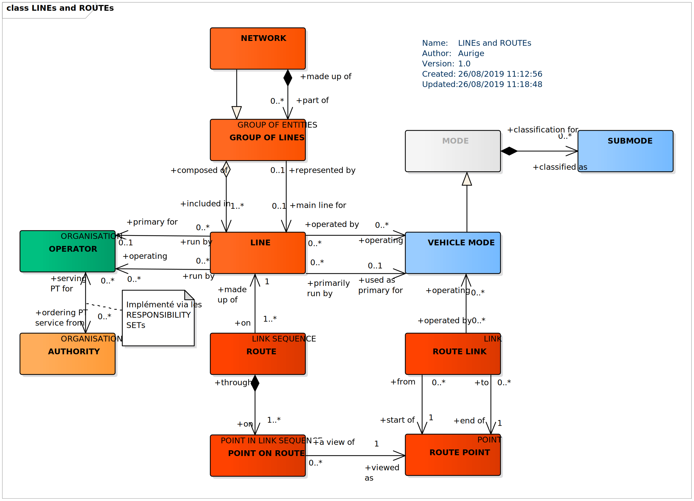
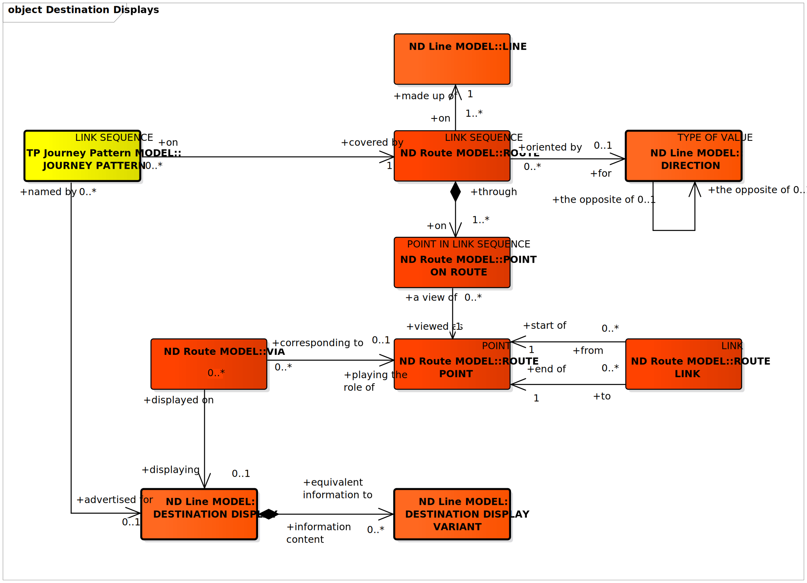
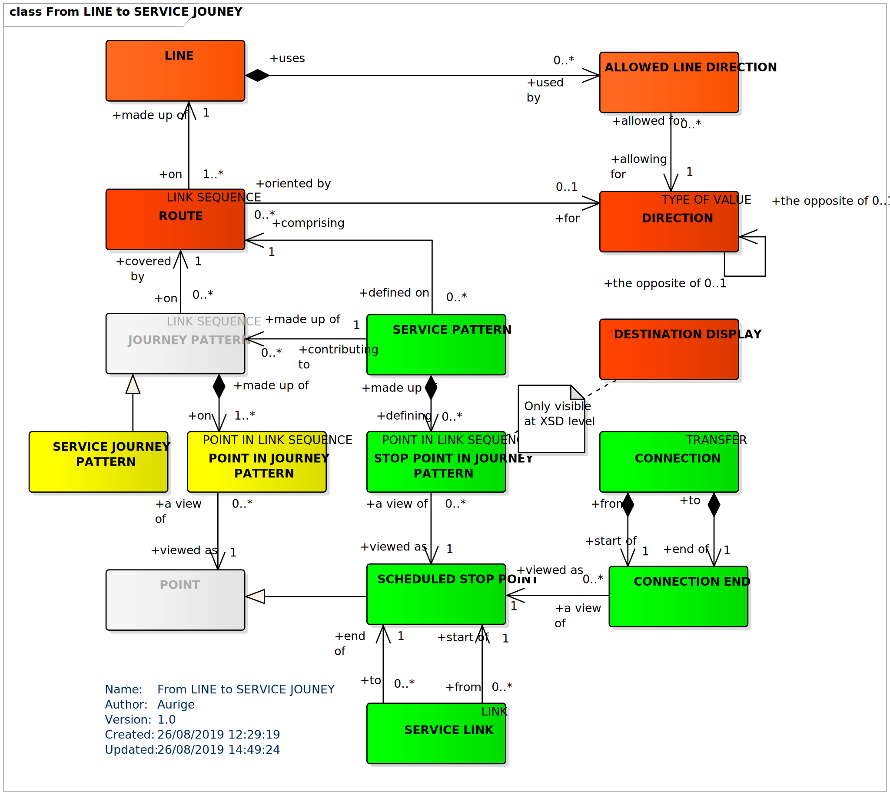

**Avant-propos**

L’harmonisation des pratiques dans l’échange des données relatives aux
offres de transport est essentielle :

-   pour l’usager, aux fins d’une présentation homogène et
    compréhensible de l’offre de transport et de l’engagement
    sous-jacent des organisateurs (autorités organisatrices et
    opérateurs de transports) ;

-   pour les AOT, de manière à fédérer des informations homogènes venant
    de chacun des opérateurs de transports qui travaillent pour elle.
    L’harmonisation des échanges, et en particulier le présent profil,
    pourra le cas échéant être imposée par voie contractuelle. Cette
    homogénéité des formats d’information permet d’envisager la mise en
    place de systèmes d’information multimodaux, produisant une
    information globale de l’offre de transports sur un secteur donné,
    et garantir le fonctionnement des services d’information, en
    particulier des calculateurs d’itinéraires, et la cohérence des
    résultats, que ces services soient directement intégrés dans ces
    systèmes d’information multimodaux ou qu’ils puisent leurs
    informations sur des bases de données réparties ;

-   pour les opérateurs, qui pourront utiliser ce format d’échange pour
    leurs systèmes de planification, les systèmes d’aide à
    l’exploitation, leurs systèmes billettiques et leurs systèmes
    d’information voyageur (information planifiée et information temps
    réel)

-   pour les industriels et développeurs pour pérenniser et fiabiliser
    leurs investissements sur les formats d’échanges implémentés par les
    systèmes qu’ils réalisent, tout en limitant fortement l’effort de
    spécification lié aux formats d’échange

Ce document est le fruit de la collaboration entre les différents
partenaires des autorités organisatrices de transports, opérateurs,
industriels et développeurs de solutions et de systèmes informatiques
ayant pour objet l’aide à l’exploitation du transport public et
l’information des voyageurs. Il a pour objet de présenter le profil
d’échange Profil NeTEx Réseaux: "format de référence pour l'échange de
données de description des réseaux de transport en commun" (issu des
travaux *NeTEx, Transmodel et IFOPT)* qui aujourd’hui fait consensus
dans les groupes de normalisation (CN03/GT7 – Transport public /
information voyageur).

**Introduction**

Le présent format d’échange est un profil de NeTEx.

NeTEx (CEN/TS 16614-1, 16614-2 et 16614-3) propose un format et des
services d'échange de données de description de l'offre de transport
planifiée, basé sur Transmodel (EN 12896) et l’ancienne norme IFOPT (EN
28701). NeTEx permet non seulement d'assurer les échanges pour les
systèmes d'information voyageur mais traite aussi de l’ensemble des
concepts nécessaires en entrée et sortie des systèmes de planification
de l'offre (graphiquage, etc.) et des SAE (Systèmes d’Aide à
l’Exploitation).

NeTEx se décompose en trois parties:

-   Partie 1 : topologie des réseaux (les réseaux, les lignes, les
    parcours commerciaux les missions commerciales, les arrêts et lieux
    d’arrêts, les correspondances et les éléments géographiques en se
    limitant au strict minimum pour l’information voyageur)


-   Partie 2 : horaires théoriques (les courses commerciales, les heures
    de passage graphiquées, les jours types associés ainsi que les
    versions des horaires)


-   Partie 3 : information tarifaire (uniquement à vocation
    d’information voyageur)

NeTEx a été développé dans le cadre du CEN/TC 278/WG 3/SG 9 piloté par
la France. Les parties 1 et 2 ont été publiées en tant que spécification
technique début 2014. Les travaux pour la partie 3, quant à eux, se sont
terminés en 2016.

Il faut noter que NeTEx a été l'occasion de renforcer les liens du
CEN/TC278/WG3 avec le secteur ferrovaire, en particulier grâce à la
participation de l'ERA (Agence Européen du Rail, qui a intégré NeTEx
dans la directive Européenne 454/2011 TAP-TSI ) et de l'UIC (Union
International des Chemins de fer).

Les normes, dans leur définition même, sont des « documents établis par
consensus ». Celles du CEN/TC278 sont de plus établies à un niveau
européen, en prenant donc en compte des exigences qui dépassent souvent
le périmètre national.

Il en résulte des normes qui sont relativement volumineuses et dont le
périmètre dépasse souvent largement les besoins d'une utilisation
donnée. Ainsi, à titre d'exemple, SIRI propose toute une série d'options
ou de mécanismes dont la vocation est d'assurer la compatibilité avec
les systèmes développés en Allemagne dans le contexte des VDV 453/454.
De même, SIRI propose des services dédiés à la gestion des
correspondances garanties, services qui, s'ils sont dès aujourd'hui
pertinents en Suisse ou en Allemagne, sont pratiquement inexistants en
France.

De plus, un certain nombre de spécificités locales ou nationales peuvent
amener à préciser l'usage ou la codification qui sera utilisée pour
certaines informations. Par exemple, les Anglais disposant d'un
référentiel national d'identification des points d'arrêts (NaPTAN), ils
imposeront naturellement que cette codification soit utilisée dans les
échanges SIRI, ce que ne feront pas les autres pays européens.

Enfin, certains éléments proposés par ces normes sont facultatifs et il
convient, lors d'une implémentation, de décider si ces éléments seront
ou non implémentés.

L'utilisation des normes liées à l'implémentation de l'interopérabilité
pour le transport en commun passe donc systématiquement par la
définition d'un profil (local agreement, en anglais). Concrètement, le
profil est un document complémentaire à la norme et qui en précise les
règles de mise en œuvre dans un contexte donné. Le profil contient donc
des informations comme :

-   détail des services utilisés,


-   détails des objets utilisés dans un échange,


-   précisions sur les options proposées par la norme,


-   précision sur les éléments facultatifs,


-   précision sur les codifications à utiliser,


-   etc.

Les principaux profils actuellement utilisés en France sont NEPTUNE
(profil de TRIDENT) et le profil de SIRI défini par le CEREMA et
Île-de-France Mobilités. Ces deux profils ont une vocation nationale. Le
présent document décrit le profil Français de NeTEx pour l’échange des
données de description des réseaux de transport public.

Le groupe de travail GT7 (AFNOR BNTRA/CN03/GT7) a élaboré une sélection
des concepts Transmodel nécessaire à la description des réseaux en
France (à vocation d'information voyageur essentiellement). C'est sur la
base de cette sélection qu'est élaboré le présent profil.

D'autre profils de NeTEx sont disponibles (arrêt, horaire, tarif). Ils
sont tous complémentaires les uns des autres (sans recouvrement) et
s'appuient tous sur un document partagé: **NeTEx - Profil Français de
NETEx: éléments communs.** Il conviendra de se référer à ce document
pour tous les éléments utilisés dans le présent document, et dont la
structure n'est pas détaillée.

Ce profil d’échange a pour objectif de décrire et de structurer
précisément les éléments nécessaires à une bonne information de
description des réseaux de transport public de façon :

-   à pouvoir les présenter d’une manière homogène et compréhensible à
    l’usager des transports publics sur des supports différents (papier
    ou Internet),

-   à pouvoir les échanger entre systèmes d’information (systèmes
    d’information voyageurs et systèmes d’information multimodale,
    systèmes d’aide à l’exploitation, systèmes de planification,
    systèmes billettiques, etc.).

Les éléments présentés ci-dessous couvrent donc l’ensemble des concepts
propres à la description des réseaux.

**NOTE IMPORTANTE** Ce document étant un profil d'échange de NeTEx, il
ne se substitue en aucun cas à NeTEx, et un minimum de connaissance de
NeTEx sera nécessaire à sa bonne compréhension.

# Domaine d'application

Le présent document est un profil de la CEN/TS 16614 (NeTEx) pour
l'échange de données de description des réseaux en France et permet de
décrire les réseaux de transports publics et la manière dont ils
pourront être structurés pour des échanges entre systèmes d'information
ainsi que pour leur présentation aux voyageurs.

C'est la structure du réseau lui-même (sa structure, ses attributs et sa
géographie) qui est prise en compte dans ce contexte, et non son
insertion dans le contexte des services de transport (pas de références
aux horaires, etc.).

# Références normatives

Les documents de référence suivants sont indispensables pour
l'application du présent document. Pour les références datées, seule
l'édition citée s'applique. Pour les références non datées, la dernière
édition du document de référence s'applique (y compris les éventuels
amendements).

CEN/TS 16614-1, Network and Timetable Exchange (NeTEx) — Part 1: Public
transport network topology exchange format

CEN/TS 16614-2, Network and Timetable Exchange (NeTEx) — Part 2: Public
transport scheduled timetables exchange format

EN 12896, Road transport and traffic telematics - Public transport -
Reference data model (Transmodel)

# Termes et définitions

Pour les besoins du présent document, les termes et définitions suivants
s'appliquent. Ils sont directement issus de Transmodel et NeTEx.
L'Error: Reference source not found complète ces définitions par des
explication plus détaillées. Pour une information complète, il
conviendra toutefois de se référer au document normatif.

NOTE Les termes spécifiquement introduits par le profil d’arrêt sont
signalés par le mot *(profil)*, en italique et entre parenthèses. Les
définitions ci-dessous sont des traductions littérales du document
normatif.

NOTE Les définitions ci-dessus sont des traductions littérales du
document CEN.


## **ACCESS MODE** (MODE D’ACCÉS)

Caractérisation de déplacement d’un passager relatif à son mode de
transport en dehors des transports public (piéton, vélo, etc.).


## **AUTHORITY** (AUTORITÉ ORGANISATRICE)

INSTITUTION sous la responsabilité de laquelle l’organisation des
transports est placée pour une zone géographique ou administrative
donnée.


## **BOARDING POSITION** (POSITION D’EMBARQUEMENT)

Position d’une ZONE D’EMBARQUEMENT à partir de laquelle un passager
pourra embarquer, ou vers laquelle il débarquera d’un VÉHICULE

Note: cet objet n’a pas été retenu dans le Modèle d’Arrêt Partagé, mais
il s’y raccroche directement et est donc à considérer comme une
extension du Modèle d’Arrêt Partagé)


## **BOOKING ARRANGEMENT** (CONDITIONS DE RESERVATION)

CONDITIONS DE RÉSERVATION pour une LIGNE FLEXIBLE.


## **COMPOUND TRAIN** (TRAIN COMPOSÉ)

TYPE DE VEHICULE composé d’une séquence d’un ou plusieurs TRAIN.


## **CONNECTION** (CORRESPONDANCE)

Possibilité physique (spatiale) d'un passager de passer d'un véhicule de
transport public vers un autre dans le but de continuer son voyage. Des
temps de parcours différents peuvent être nécessaires en fonction du
type de passager.


## **CONNECTION END** (EXTRÉMITÉ DE CORRESPONDANCE)

Début ou fin d'une CORRESPONDANCE. Il s’agit forcément d’une relation
avec un POINT D’ARRÊT PLANIFIÉ.


## **CONTACT DETAILS** (INFORMATIONS DE CONTACT)

Informations permettant au public de contacter une INSTITUTION.


## **CONTROL CENTRE** (CENTRE DE CONTROL)

UNITÉ ORGANISATIONNELLE composée d’une équipe opérationnelle en charge
des commandes et du contrôle des services d’exploitation.


## **DEAD RUN** (HAUT LE PIED)

PARCOURS associé à un HAUT LE PIED (sans transport des passagers :
retour dépôt, jonction entre ligne, etc.).


## **DEFAULT CONNECTION** (CORRESPONDACE PAR DEFAUT)

Possibilité physique (spatiale) d'un passager de passer d'un véhicule de
transport public vers un autre dans le but de continuer son voyage. Elle
définit le temps par défaut à utiliser pour passer d'un véhicule de
transport à un autre au sein d'une zone (SITE, LIEU TOPOGRAPHIQUE, ZONE
D'ARRÊT). Elle peut être restreinte à des OPERATEURS ou des MODES des
transports particuliers, ou ne s'applique que dans un sens donné (une
correspondance bus vers train peut être différente de train vers bus).


## **DESTINATION DISPLAY** (DESTINATION AFFICHÉE)

Une destination d'un PARCOURS (ou ITINÉRAIRE) particulier, affichée au
public en général sur une girouette ou sur tout autre afficheur
embarqué. Cette information peut évoluer au fur et à mesure de
l'évolution de la course et, en particulier, être mise à jour lors du
franchissement des points VIA.


## **DESTINATION DISPLAY VARIANT** (VARIANTE DE DESTINATION AFFICHÉE)

alternative à la DESTINATION AFFICHÉE, généralement destiné à des média
spécifiques (SMS, type d’afficheur particulier, etc.)


## **DIRECTION** (SENS)

Classification de l'orientation générale des ITINÉRAIREs.


## **FLEXIBLE LINE** (LIGNE FLEXIBLE)

Spécialisation de la LIGNE pour décrire les services flexibles. Tous les
services d'une LIGNE peuvent ne pas être flexibles, la flexibilité
elle-même étant alors décrite au niveau du PARCOURS (cela signifie aussi
qu'il faudra définir des parcours spécifiques pour chaque type de
flexibilité de la LIGNE).


## **FLEXIBLE LINK PROPERTIES** (PROPRIÉTÉ DE TRONÇON FLEXIBLE)

Ensemble de caractéristiques décrivant les éventuelles flexibilités
associées à un lien

Note: la relation est établie par composition pour limiter le recours à
l'héritage multiple.


## **FLEXIBLE POINT PROPERTIES** (PROPRIÉTÉ DE POINT FLEXIBLE)

Ensemble de caractéristiques décrivant les éventuelles flexibilités
associées à un point

Note: la relation est établie par composition pour limiter le recours à
l'héritage multiple.


## **FLEXIBLE ROUTE** (ITINERAIRE FLEXIBLE)

Spécialisation de l'ITINÉRAIRE pour décrire les services flexibles. Il
peut inclure des POINTs et des ZONEs, et des sections parcourues dans un
ordre prédéfini ou non.


## **FLEXIBLE STOP PLACE** (LIEU D’ARRÊT FLEXIBLE)

Spécialisation du LIEU D’ARRÊT décrivant un arrêt d'un service flexible.
Il peut être composé de zones flexibles ou de zones de type « hail and
ride » identifiant les zones de montée ou descente possible des services
flexibles (quand ils utilisent des zones ou des quais flexibles).
Certains services flexibles utilisent aussi des LIEUx D’ARRÊT classiques
pour leurs arrêts. Quand il est assigné à un POINT D'ARRÊT PLANIFIÉ, ce
POINT D'ARRÊT PLANIFIÉ est alors censé être une zone (le centroïd de la
ZONE étant alors considéré comme le POINT D'ARRÊT PLANIFIÉ).


## **GROUP OF LINES** (GROUPE DE LIGNES)

Regroupement de lignes référencées de manière commune relative à un
objectif donné.


## **GROUP OF OPERATOR** (GROUPE D’EXPLOITANTS)

Groupe d’EXPLOITANTs ayant en commun, par exemple, un ensemble de règles
tarifaires et d’information voyageur.


## **JOURNEY PATTERN** (PARCOURS)

Liste ordonnée de POINTs D'ARRÊT PLANIFIÉs et de POINTs HORAIREs sur un
unique ITINÉRAIRE, décrivant le plan de déplacement pour les véhicules
de transport public. Un PARCOURS peut passer par le même POINT plus
d'une fois. Le premier point d'un PARCOURS est l'origine. Le dernier
point est la destination.


## **LINE** (LIGNE)

Groupe d'ITINÉRAIREs (voir plus bas) qui est en général connu du public
par une appellation commune (nom ou numéro, extrémités de ligne, etc.).


## **NETWORK** (RÉSEAU)

Un GROUPE DE LIGNES disposant d'un nom sous lequel un réseau de
transport est connu.


## **OPERATOR** (EXPLOITANT)

Entreprise offrant des services de transport public.


## **PASSENGER STOP ASSIGNMENT** (AFFECTATION D’ARRÊT POUR PASSAGER)

Affection d’un POINT D’ARRÊT PLANIFIÉ à un LIEU D’ARRÊT (ou un de ses
composant de type ZONE D’EMBARQUEMENT ou POSITION D’EMBARQUEMENT) pour
un service passager.


## **POINT IN JOURNEY PATTERN** (POINT SUR PARCOURS)

Un POINT D'ARRÊT PLANIFIÉ ou un POINT HORAIRE dans un PARCOURS indiquant
son rang dans ce PARCOURS.


## **POINT IN TIMING PATTERN** (POINT SUR PARCOURS HORAIRE)

POINT sur PARCOURS qui est un POINT HORAIRE.


## **POINT ON ROUTE** (POINT SUR ITINÉRAIRE)

POINT D'ITINÉRAIRE (accompagné de son rang) qui sert à définir un
ITINÉRAIRE.


## **ROUTE LINK** (TRONÇON D'ITINÉRAIRE)

Tronçon orienté entre deux POINTs D'ITINÉRAIRE permettant une définition
univoque d'un chemin à travers le réseau.


## **ROUTE POINT** (POINT D'ITINÉRAIRE)

POINT permettant de définir la géométrie d'un ITINÉRAIRE à travers le
réseau.


## **ROUTE** (ITINÉRAIRE)

Liste ordonnée de POINTs définissant un seul chemin à travers le réseau
routier (ou ferré). Un ITINÉRAIRE peut passer deux fois par un même
POINT.


## **ROUTING CONSTRAINT ZONE** (ZONE DE CONTRAINTE)

ZONE au sein de laquelle une contrainte d'acheminement s'applique. La
ZONE peut être définie soit par un périmètre géographique, soit par la
liste des POINTs D'ARRÊT PLANIFIÉS qu'elle contient.


## **SCHEDULED STOP POINT** (POINT D'ARRÊT PLANIFIÉ)

POINT où les passagers peuvent monter à bord ou descendre des véhicules.


## **SCHEMATIC MAP** (PLAN SCHÉMATIQUE)

Carte représentant schématiquement la disposition de la structure
topographique des lieux (par exemple, un ensemble de sites) ou le réseau
de transports en commun (un ensemble de lignes). Il peut comprendre une
projection de pixel ou objet de dessin vectoriel vers un ensemble
d'objet transport pour permettre les interactions, services et
hyperliens.


## **SCHEMATIC MAP MEMBER** (COMPOSANT DE PLAN SCHÉMATIQUE)

Projection d’un objet transport sur un PLAN SCHÉMATIQUE.


## **SERVICE JOURNEY PATTERN** (PARCOURS COMMERCIAL)

PARCOURS associé à une COURSE COMMERCIALE (transportant des passagers).


## **SERVICE LINK** (TRONÇON COMMERCIAL)

TRONÇON entre une paire ordonnée de POINTs D'ARRÊT PLANIFIÉS.


## **SERVICE PATTERN** (MISSION COMMERCIALE)

Vue d'un PARCOURS définie uniquement par des POINTs D'ARRÊT SUR
PARCOURS. La MISSION COMMERCIALE se distingue du PARCOURS COMMERCIAL par
le fait qu'elle n'est définie que par une séquence d'arrêts, sans point
intermédiaire.


## **SITE CONNECTION** (CORRESPONDANCE ENTRE SITES)

La possibilité physique (spatiale) d'un passager de continuer son
déplacement déterminé par deux localisations comme des SITEs ou leurs
ENTRÉEs. Des temps de parcours différents peuvent être nécessaires en
fonction du type de passager.


## **STOP ASSIGNMENT** (AFFECTATION D’ARRÊT)

Affection d’un POINT D’ARRÊT PLANIFIÉ à un LIEU D’ARRÊT.


## **STOP POINT IN JOURNEY PATTERN** (POINT D'ARRÊT SUR PARCOURS)

POINT d'un PARCOURS qui est un POINT D'ARRÊT


## **SUBMODE** (SOUS-MODE)

Précision sur le MODE, comme "international" ou "longue distance" (pour
un MODE Rail par exemple). Le SOUS-MODE caractérise très souvent un type
d'exploitation qui vient donc compléter le MODE.


## **TIMING LINK** (TRONÇON HORAIRE)

Paire ordonnée de POINTs HORAIREs qui peut être utilisée pour
l'enregistrement des temps de parcours.


## **TIMING PATTERN** (PARCOURS HORAIRE)

Vue d'un PARCOURS définie uniquement par des POINTs HORAIRE SUR
PARCOURS.


## **TIMING POINT** (POINT HORAIRE)

POINT servant de référence aux données nécessaires à la conception des
horaires. Un POINT HORAIRE peut aussi être un POINT D’ARRÊT PLANIFIÉ
mais cela n’a rien d’obligatoire ou de systématique.


## **TRAIN STOP ASSIGNMENT** (AFFECTATION D’ARRÊT DE TRAIN)

Affection d’un COMPOSANT DE TRAIN à un LIEU D’ARRÊT (ou un de ses
composant de type ZONE D’EMBARQUEMENT ou POSITION D’EMBARQUEMENT) pour
un POINT D’ARRÊT PLANIFIÉ donné.


## **TRANSFER RESTRICTION** (RESTRICTION DE CORRESPONDANCE)

Contrainte qui s’applique aux CORRESPONDANCES (ou CORRESPONDANCES ENTRE
COURSES) entre deux POINTs D’ARRÊT PLANIFIÉs, en limitant voir
interdisant l’usage pour les passagers.


## **TYPE OF LINES** (TYPE DE LIGNES)

Classification pour les lignes


## **VEHICLE MODE** (MODE DE VÉHICULE)

Typologie de l'exploitation suivant le moyen de transport (bus, tramway,
métro, train, ferry, bateau).


## **VIA** (VIA)

POINT utilisé comme POINT D'ITINÉRAIRE et permettant de distinguer deux
cheminements (ITINÉRAIREs) entre une origine et une destination. Il est
généralement défini à des fins d'information voyageur pour par exemple
différentier deux itinéraires sur un afficheur du réseau, ou encore sur
un système de vente.

# Symboles et abréviations

AO

<div class="Definition">

Autorité Organisatrice de Transports

</div>

PMR

<div class="Definition">

Personne à Mobilité Réduite

</div>

# Exigences minimum liées à la LOM et la règlementation Européenne

La LOI n° 2019-1428 du 24 décembre 2019 d'orientation des mobilités
(LOM :
<https://www.legifrance.gouv.fr/dossierlegislatif/JORFDOLE000037646678>)
et, au niveau Européen, le Règlement Délégué (UE) 2017/1926 De La
Commission du 31 mai 2017 (complétant la directive 2010/40/UE du
Parlement européen et du Conseil en ce qui concerne la mise à
disposition, dans l'ensemble de l'Union, de services d'informations sur
les déplacements multimodaux) rendent obligatoire la mise à disposition,
quand elles existent, de certains types de données.

Le tableau ci-dessous résulte de l’analyse de la LOM et du règlement
délégué et fournit la liste des concepts concernés dans le présent
profil. Il sera donc nécessaire de fournir ces données pour être
conforme à la législation (il s’agit bien de mettre à disposition toutes
les données existantes dans les SI transport, et non de créer des
données qui n’existeraient pas encore sous forme informatique).

Notez que les concepts présents dans les tableaux sont les ceux qui sont
directement référencés par l’annexe du règlement européen
(<https://eur-lex.europa.eu/legal-content/FR/TXT/HTML/?uri=CELEX:32017R1926&from=FR>),
mais que pour beaucoup d’entre eux, cela impliquera d’autres concepts
(soit par héritage soit par relation, au s sens UML des termes). Ces
éléments d’héritage et de relations sont présentés dans les profils,
mais pas dans ce tableau.

De plus, les noms des catégories (colonnes Catégorie et Détail) ont été
conservés dans la langue originale du document (l’anglais) pour éviter
tout risque de confusion. Pour la même raison, les noms des concepts
concernés sont ceux de la version originale de Transmodel.

Pour certaines catégories de données, il peut arriver que les concepts
correspondants soient multiples, mais aussi qu’ils soient différents
suivant le niveau de précision porté par la donnée. La colonne
« Concepts à minima » correspond alors au minimum à fournir pour
répondre à la catégorie en question et les colonnes « Autres concepts »
décrit des informations complémentaires qui, si elles sont utiles, ne
sont pas indispensables pour répondre à cette catégorie (notez que dans
certains cas, ces concepts additionnels peuvent relever d’autres
profils : ceci est précisé dans le tableau quand c’est le cas). Il faut
toutefois garder à l’esprit que toute information existante est supposée
être mise à disposition (que cela relève de la première ou de la seconde
colonne).

La première colonne reprend la notion de *niveau* tel qu’il est décrit
et utilisé par le règlement européen et a notamment une incidence sur le
calendrier de mise à disposition de la donnée (voir le règlement pour
plus de détails).

Les différents concepts présentés ne sont bien sûr pas détaillés dans ce
tableau, mais dans le profil lui-même. C’est aussi dans la description
du profil que l’on trouvera les détails concernant les attributs
(obligatoire/facultatif, règles de remplissage, codification, etc.).
Pour ce qui est des attributs facultatifs, la règle reste que, pour les
objets ci-dessous, toute information disponible est supposée être
fournie (mais on ne crée pas d’information si elle n’est pas
disponible).

<div class="table-title">Concepts relatifs à la LOM et à la Règlementation Européenne</div>

<table>
<colgroup>
<col style="width: 7%" />
<col style="width: 13%" />
<col style="width: 16%" />
<col style="width: 21%" />
<col style="width: 19%" />
<col style="width: 21%" />
</colgroup>
<thead>
<tr class="header">
<th><strong>Niveau</strong></th>
<th><strong>Catégorie</strong></th>
<th><strong>Détail</strong></th>
<th><strong>Concepts à minima</strong></th>
<th><p><strong>Autres</strong></p>
<p><strong>concepts</strong></p></th>
<th><strong>Commentaire</strong></th>
</tr>
</thead>
<tbody>
<tr class="odd">
<td>1</td>
<td><em><strong>Location search (origin/ destination)</strong></em></td>
<td>Points of interest (related to transport information) to which people may wish to travel</td>
<td><strong>POI</strong></td>
<td></td>
<td>Même si le transport en commun n'est probablement pas la meilleure source pour les POI, NeTEx reste néanmoins en mesure de les décrire.</td>
</tr>
<tr class="even">
<td>1</td>
<td><em><strong>Trip plan computation — scheduled modes transport</strong></em></td>
<td>Connection links where interchanges may be made, default transfer times between modes at interchanges</td>
<td><strong>DEFAUT CONNECTION</strong></td>
<td><p><strong>CONNECTION<br />
SITE CONNECTION<br />
</strong></p>
<p><em>(profil horaire)</em></p>
<p><strong>INTERCHANGE</strong></p></td>
<td><p>DEFAUT CONNECTION peut être utilisé à la place de CONNECTION quand l'information détaillée n'est pas disponible.</p>
<p>L’INTERCHANGE décrit la correspondance entre deux courses et est, à ce titre, décrit dans le Profil Horaire.</p></td>
</tr>
<tr class="odd">
<td>1</td>
<td><em><strong>Trip plan computation — scheduled modes transport</strong></em></td>
<td>Network topology and routes/lines (topology)</td>
<td><strong>LINE<br />
SERVICE PATERN<br />
SCHEDULED STOP POINT</strong></td>
<td><p><strong>ROUTE</strong></p>
<p><strong>ROUTE POINT<br />
ROUTE LINK<br />
SERVICE LINK<br />
POINT IN JOURNEY PATTERN<br />
DESTINATION DISPLAY</strong></p></td>
<td></td>
</tr>
<tr class="even">
<td>2</td>
<td><em><strong>Trip plans, auxiliary information, availability check</strong></em></td>
<td>Basic common standard fares (all scheduled modes): Fare network data (fare zones/stops and fare stages)</td>
<td><strong>TARIFF ZONE</strong></td>
<td><p><em>(profil tarif)</em></p>
<p><strong>FARE ZONE</strong></p>
<p><strong>FARE PRODUCT<br />
SALES OFFER PACKAGE<br />
DISTRIBUTION CHANNEL<br />
ACCESS RIGHT PARAMETER ASSIGNMENT</strong></p></td>
<td></td>
</tr>
<tr class="odd">
<td>3</td>
<td><em><strong>Trip plans</strong></em></td>
<td>Parameters needed to calculate an environmental factor such as carbon per vehicle type or passenger mile or per distance walked</td>
<td><p><strong>VEHICLE TYPE<br />
CONNECTION</strong> <em>et</em> <strong>SITE CONNECTION<br />
</strong></p>
<p><strong>ROUTE LINK</strong> <em>(donc ROUTE)</em> <em>ou</em> <strong>SERVICE LINK</strong> <em>en alternative</em></p></td>
<td><p><em>(profil accessibilité)</em></p>
<p><strong>NAVIGATION PATH</strong></p></td>
<td>Les SERVICE LINKs ou ROUTE LINKs impliquent naturellement les POINTs (POINT IN JOURNEY PATTERN, ROUTE POINT, POINT ON ROUTE, etc.) correspondant. Ils permettront d’évaluer la distance parcourue par le véhicule.</td>
</tr>
</tbody>
</table>

# Description du profil d’échange

## Conventions de représentation

### Tableaux d’attributs

NOTE les choix de conventions présentées ici ont pour vocation d'être
cohérents avec ceux réalisés dans le cadre du profil SIRI (IDFM et
CEREMA). De plus tous les profils NeTEx partagent les mêmes conventions.

Les messages constituant ce profil d'échange sont décrits ci-dessous
selon un double formalisme: une description sous forme de diagrammes XSD
(leur compréhension nécessite une connaissance préalable de XSD: XML
Schema Definition) et une description sous forme tabulaire. Les tableaux
proposent ces colonnes:

|                     |         |          |                  |                 |
|---------------------|---------|----------|------------------|-----------------|
| **Classifi­cation** | **Nom** | **Type** | **Cardin­alité** | **Description** |

-   **Classification** : permet de catégoriser l'attribut. Les
    principales catégories sont:

    -   PK (Public Key) que l'on peut interpréter comme Identifiant
        Unique: il permet à lui seul d'identifier l'objet, de façon
        unique, pérenne et non ambiguë. C'est l'identifiant qui sera
        utilisé pour référencer l'objet dans les relations.

    

    -   AK (Alternate Key) est un identifiant secondaire, généralement
        utilisé pour la communication, mais qui ne sera pas utilisé dans
        les relations.

    

    -   FK (Foreign Key) indique que l'attribut contient l'identifiant
        unique (PK) d'un autre objet avec lequel il est en relation.

    

    -   GROUP est un groupe XML nommé (ensemble d'attributs utilisables
        dans différents contextes) (cf:
        <http://www.w3.org/TR/2001/REC-xmlschema-0-20010502/#AttrGroups>
        )


-   **Nom** : nom de l'élément ou attribut XSD


-   **Type** : type de l'élément ou attribut XSD (pour certains d'entre
    eux, il conviendra de se référer à la XSD NeTEx)


-   **Cardinalité** : cardinalité de l'élément ou attribut XSD exprimée
    sous la forme "***minimum:maximum***" ("0:1" pour au plus une
    occurrence; "1:\*" au moins une occurrence et sans limites de nombre
    maximal; "1:1" une et une seule occurrence; etc.).


-   Description : texte de description de l'élément ou attribut XSD
    (seul les attributs retenus par le profil ont un texte en français;
    les textes surlignés en jaune indiquent une spécificité du profil
    par rapport à NeTEx).

Les textes surlignés en <span class="hl">Jaune</span> sont ceux
présentant une particularité (spécialisation) par rapport à NeTEx: une
codification particulière, une restriction d'usage, etc.

La description XSD utilisée est strictement celle de NeTEx, sans aucune
modification (ceci explique notamment que tous les commentaires soient
en anglais).

Les attributs et éléments rendus obligatoires dans le cadre de ce profil
restent facultatifs dans l'XSD (le contrôle de cardinalité devra donc
être réalisé applicativement).

### Valeurs de code de profil

Dans la mesure du possible, le profil sélectionne les valeurs de code à
utiliser pour caractériser des éléments et les limite à un ensemble de
valeurs documentées. NETEX propose plusieurs mécanismes différents pour
spécifier les valeurs de code autorisées :

-   Des énumérations fixes définies dans le cadre du schéma XSD NeTEx.
    Le profil impose alors un sous-ensemble des codes NeTEx.

-   Des spécialisations de TYPE OF VALUE, utilisées pour définir des
    ensembles de codes ouverts pouvant être ajoutés au fil du temps sans
    modifier le schéma, par exemple, pour enregistrer des
    classifications d'entités héritées. Le profil lui-même utilise le
    mécanisme TYPE OF VALUE dans quelques cas pour spécifier des codes
    normalisés supplémentaires : ceux-ci sont affectés à un CODESPACE
    «FR_IV_metadata» (https://netex-cen.eu/FR_IV) indiqué par un préfixe
    «FR_IV». (par exemple, «FR_IV: monomodal».

-   Des instances TypeOfFrame: le profil utilise plusieurs TYPES DE
    FRAME pour spécifier l'utilisation de VERSION FRAME dans le profil.

### Indication des classes abstraites

NeTEx, et Transmodel, utilisent largement l'héritage de classe; cela
simplifie considérablement la spécification en évitant les répétitions
puisque les attributs partagés sont déclarés par une superclasse et que
des sous-classes viennent ensuite les spécialiser sans avoir à répéter
ces attributs et en n’ajoutant que ceux qui lui sont spécifiques. La
plupart des superclasses sont «abstraites» - c’est-à-dire qu’il n’
existe aucune instance concrète; seules les sous-classes terminales sont
«concrètes».

Un inconvénient de l'héritage est que si l'on veut comprendre les
propriétés d'une classe concrète unique, il faut également examiner
toutes ses super-classes. Pour cette raison, le profil inclut les
classes abstraites nécessaires pour comprendre les classes concrètes,
même si ces classes concrètes ne sont jamais directement instanciées
dans un document NeTEx.

-   Les super-classes sont signalées dans les en-têtes par le suffixe
    «*(abstrait)*»

-   Dans les diagrammes UML (comme pour NeTEx et Transmodel), les noms
    des classes abstraites sont indiqués en italique et les classes
    abstraites sont de couleur gris clair.

-   Certaines super-classes ne sont techniquement pas abstraites dans
    NeTEx, mais ne sont pas utilisées comme classes concrètes dans le
    profil : elles sont signalées avec la même convention que les
    classes abstraites.

### Classes de sous-composants

Un certain nombre de classes ont des sous-composants qui constituent
leur définition. Celles-ci fournissent des détails auxiliaires (par
exemple, AlternativeText, AlternativeName, TrainComponent) et sont
signalées dans les en-têtes par le suffixe « *(objet inclus)*».

## Structure du réseau

La topologie du réseau décrit les lignes et itinéraires permanent du
réseau de transport, ainsi que les éléments organisationnels qui y sont
rattachés.


*Structure du Réseau – Modèle conceptuel*

Transmodel définit une LIGNE comme un groupe d’ITINERAIREs (ROUTE) qui
est généralement connu du public sous un nom ou un numéro similaire. Ces
ITINERAIREs sont généralement très similaires d’un point de vue
topologique, c’est-à-dire des variantes d’un itinéraire principal avec
quelques écarts seulement sur certaines parties. Deux ITINERAIREs
utilisant la même d’infrastructure (ou des voies parallèles), mais avec
des DIRECTIONS opposées, appartiendront généralement à la même LIGNE.

Une LIGNE est associée à un MODE DE TRANSPORT principal et à un
SOUS-MODE, mais peut également avoir des modes secondaires (par exemple,
une ligne de train qui est exploitée par un bus à certaines heures de la
journée ou dans certaines circonstances).

Une LIGNE est également associée à un OPÉRATEUR principal ou à une
AUTORITÉ (plusieurs opérateurs secondaires sont également autorisés).

Les LIGNEs peuvent être regroupées en groupes de lignes à des fins
particulières, telles que l'harmonisation des tarifs, l'attribution de
types de jours ou pour regrouper certaines catégories de services (bus
de nuit, etc.).

## Les lignes

<div class="table-title">Line – Element</div>

<table>
<colgroup>
<col style="width: 8%" />
<col style="width: 7%" />
<col style="width: 9%" />
<col style="width: 22%" />
<col style="width: 8%" />
<col style="width: 43%" />
</colgroup>
<tbody>
<tr class="odd">
<td><strong>Classifi­cation</strong></td>
<td colspan="2"><strong>Name</strong></td>
<td><strong>Type</strong></td>
<td><strong>Cardin­ality</strong></td>
<td><strong>Description</strong></td>
</tr>
<tr class="even">
<td><em>::></em></td>
<td colspan="2"><em>::></em></td>
<td><em>DataManagedObject</em></td>
<td><em>::></em></td>
<td>LINE hérite de <em><strong>DataManagedObject</strong></em> <span class="hl">(</span><em><span class="hl">voir le document </span><strong><span class="hl">Profil NeTEx éléments communs</span></strong></em><span class="hl">).</span></td>
</tr>
<tr class="odd">
<td></td>
<td colspan="2"><em><strong>Name</strong></em></td>
<td><em>MultilingualString</em></td>
<td>1:1</td>
<td>Nom de la LIGNE.</td>
</tr>
<tr class="even">
<td></td>
<td colspan="2"><em><strong>ShortName</strong></em></td>
<td><em>MultilingualString</em></td>
<td>0:1</td>
<td>Nom court de la LIGNE.</td>
</tr>
<tr class="odd">
<td></td>
<td colspan="2"><em><strong>Description</strong></em></td>
<td><em>MultilingualString</em></td>
<td>0:1</td>
<td>Description de la LIGNE.</td>
</tr>
<tr class="even">
<td></td>
<td colspan="2"><em><strong>TransportMode</strong></em></td>
<td><em>VehicleModeEnum</em></td>
<td>0:1</td>
<td>MODE DE TRANSPORT principal de la LIGNE.</td>
</tr>
<tr class="odd">
<td></td>
<td colspan="2"><em><strong>Transport­Submode</strong></em></td>
<td><em>SubmodeEnum</em></td>
<td>0:1</td>
<td>SOUS-MODE associé à la LIGNE.</td>
</tr>
<tr class="even">
<td></td>
<td colspan="2"><em><strong>Url</strong></em></td>
<td><em>any</em></td>
<td>0:1</td>
<td>URL d'information voyageur associée à la LIGNE.</td>
</tr>
<tr class="odd">
<td>«AK»</td>
<td colspan="2"><em><strong>PublicCode</strong></em></td>
<td><em>xsd:normalizedString</em></td>
<td>0:1</td>
<td><p>Identifiant publique de la LIGNE.</p>
<p><span class="hl">Il s'agit généralement d'un numéro, parfois complété d'une lettre (par exemple 95, ou 27A, etc.).</span> Les <em><strong><span class="hl">Name</span></strong></em><span class="hl"> et </span><em><strong><span class="hl">ShortName</span></strong></em><span class="hl"> porteront généralement une information plus explicite (par exemple la ligne ayant le </span><em><strong><span class="hl">PublicCode</span></strong></em><span class="hl"> </span><em><span class="hl">95</span></em><span class="hl"> à Paris s'appelle "</span><em><span class="hl">Porte de Vanves / Porte de Montmartre"</span></em><span class="hl">).</span></p>
<p><span class="hl">On peut considérer que le nom complet de la ligne est une concaténation de son </span><em><strong><span class="hl">PublicCode</span></strong></em><span class="hl"> et de son </span><em><strong><span class="hl">Name</span></strong></em><span class="hl">.</span></p></td>
</tr>
<tr class="even">
<td>«AK»</td>
<td colspan="2"><em><strong>PrivateCode</strong></em></td>
<td><em>xsd:normalizedString</em></td>
<td>0:1</td>
<td><p>Identifiant secondaire de la LIGNE.</p>
<p><span class="hl">Il s'agit généralement d'un identifiant propre au fournisseur (transporteur) de l'information.</span></p></td>
</tr>
<tr class="even">
<td>«FK»</td>
<td rowspan="2">Choice</td>
<td><em><strong>AuthorityRef</strong></em></td>
<td><em>TransportOperatorRef</em></td>
<td>0:1</td>
<td>Réference une AUTORITE</td>
</tr>
<tr class="odd">
<td>«FK»</td>
<td><em><strong>OperatorRef</strong></em></td>
<td><em>OperatorRef</em></td>
<td>0:1</td>
<td>Réference un EXPLOITANT.</td>
</tr>
<tr class="even">
<td>«cntd»</td>
<td colspan="2"><em><strong>additional­Operators</strong></em></td>
<td><em>OperatorRef</em></td>
<td>0:*</td>
<td>Réference un EXPLOITANT additionnel pour la LIGNE <span class="hl">(comme pour les RER A et B à Paris, où encore les lignes en "pool").</span></td>
</tr>
<tr class="odd">
<td></td>
<td colspan="2"><em><strong>otherModes</strong></em></td>
<td><em>modeRefs</em></td>
<td></td>
<td>Réference un MODE de transport additionnel pour la LIGNE <span class="hl">(certaine ligne SNCF sont parfois ponctuellement remplacées par des lignes de car par exemple).</span></td>
</tr>
<tr class="odd">
<td></td>
<td colspan="2"><em><strong>TypeOfLineRef</strong></em></td>
<td><em>TypeOfLineRef</em></td>
<td>0:1</td>
<td><p>TYPE DE LIGNE spécifique.</p>
<p><span class="hl">Permet une classification particulière de la ligne (ligne saisonnière, ligne de substitution, etc.)</span></p>
<p><span class="hl">Deux types prédéfinis sont proposé par le profil: SEASONAL_LINE_TYPE et REPLACEMENT_LINE_TYPE Pour ce second type on utilisera, par convention, le derivedFromObjectRef (voir le document Profil NeTEx éléments communs) pour effectuer le lien avec la ligne à remplacer, et on renseignera le ValidityTrigger permettant de décrire dans quelle condition le remplacement est activé.</span></p>
<p><span class="hl">À ne pas confondre avec une marque commerciale, pour lequel l'attribut Branding est disponible dans le DataManagedObject (voir le document Profil NeTEx éléments communs).</span></p>
<p><span class="hl">A définir par un TYPE DE VALEUR spécifique (</span><em><span class="hl">voir le document </span><strong><span class="hl">Profil NeTEx éléments communs</span></strong></em><span class="hl">).</span></p></td>
</tr>
<tr class="odd">
<td></td>
<td colspan="2"><em><strong>Monitored</strong></em></td>
<td><em>xsd:boolean</em></td>
<td>0:1</td>
<td>Indique si la ligne dispose d'information voyageur temps réel.</td>
</tr>
<tr class="even">
<td>«cntd»</td>
<td colspan="2"><em><strong>routes</strong></em></td>
<td><em>RouteRef</em></td>
<td>0:*</td>
<td>Liste des ITINERAIREs de la LIGNE.</td>
</tr>
<tr class="odd">
<td>«FK»</td>
<td colspan="2"><em><strong><del>RepresentBy­GroupRef</del></strong></em></td>
<td></td>
<td></td>
<td><span class="hl">Le GROUPE DE LIGNES référence les LIGNES, mais on n'utilise pas la relation inverse dans le profil.</span></td>
</tr>
<tr class="even">
<td>«cntd»</td>
<td colspan="2"><em><strong>Presentation</strong></em></td>
<td><em>Presentation</em></td>
<td>0:1</td>
<td>Information concernant la représentation graphique de la ligne (couleur, etc.).</td>
</tr>
<tr class="even">
<td></td>
<td colspan="2"><em><strong>Accessibility­Assessment</strong></em></td>
<td><em>Accessibility­Assessment</em></td>
<td>0:1</td>
<td>Information concernant l'accessibilité de la ligne <span class="hl">(</span><em><span class="hl">voir le document </span><strong><span class="hl">Profil NeTEx éléments communs</span></strong></em><span class="hl">).</span></td>
</tr>
<tr class="odd">
<td>«cntd»</td>
<td colspan="2"><em><strong>allowed­Directions</strong></em></td>
<td><em>AllowedDirection</em></td>
<td>0:*</td>
<td>Ensemble des DIRECTIONs de la ligne (attention la DIRECTION est une indication d'ordre générale à ne pas confondre avec la DESTINATION qui est un arrêt terminus de la LIGNE).</td>
</tr>
<tr class="even">
<td></td>
<td colspan="2"><em><strong>noticeAssignments</strong></em></td>
<td><em>noticeAssignments_RelStructure</em></td>
<td>0:*</td>
<td><p>NOTEs affectées à la LIGNE.</p>
<p><span class="hl">(</span><em><span class="hl">voir le document </span><strong><span class="hl">Profil NeTEx éléments communs</span></strong></em><span class="hl">).</span></p></td>
</tr>
<tr class="odd">
<td>«cntd»</td>
<td colspan="2"><em><strong>documentLinks</strong></em></td>
<td><em>InfoLinks</em></td>
<td>0:*</td>
<td>Document, typiquement PDF, associés à la ligne (généralement plan et horaires).</td>
</tr>
</tbody>
</table>

### Directions

<div class="table-title">Direction – Element (objet inclus)</div>

| **Classifi­cation** | **Name**                    | **Type**            | **Cardin­ality** | **Description**                                                                                                                                                                                  |
|---------------------|-----------------------------|---------------------|------------------|--------------------------------------------------------------------------------------------------------------------------------------------------------------------------------------------------|
| *::>*               | *::>*                       | *TypeOfValue*       | *::>*            | DIRECTION hérite de TYPE OF VALUE <span class="hl">(</span>*<span class="hl">voir le document </span>**<span class="hl">Profil NeTEx éléments communs</span>***<span class="hl">)</span> |
|                     | ***DirectionType***         | *DirectionTypeEnum* | 0:1              | Valeur fixe parmi : ‘*outbound’, ‘inbound’, ‘clockwise’, ‘anticlockwise’* (sortant, entrant, horaire, antihoraire) associée à cette DIRECTION.                                                   |
| «FK»                | ***Opposite­DirectionRef*** | *DirectionRef*      | 0:1              | Référence à la DIRECTION correspondant au sens opposé.                                                                                                                                           |

## Les groupes de Ligne

<div class="table-title">GroupOfLines – Element</div>

<table>
<colgroup>
<col style="width: 8%" />
<col style="width: 17%" />
<col style="width: 22%" />
<col style="width: 8%" />
<col style="width: 43%" />
</colgroup>
<tbody>
<tr class="odd">
<td><strong>Classifi­cation</strong></td>
<td><strong>Name</strong></td>
<td><strong>Type</strong></td>
<td><strong>Cardin­ality</strong></td>
<td><strong>Description</strong></td>
</tr>
<tr class="even">
<td><em>::></em></td>
<td><em>::></em></td>
<td><em>GroupOfEntities</em></td>
<td><em>::></em></td>
<td><p>GROUP OF LINEs hérite de GROUP OF ENTITies.<span class="hl"> </span><span class="hl">(</span><em><span class="hl">voir le document </span><strong><span class="hl">Profil NeTEx éléments communs</span></strong></em><span class="hl">)</span></p>
<p><span class="hl">L'attribut </span><em><strong><span class="hl">PurposeofGroupingRef</span></strong></em><span class="hl"> pourra être utilisé pour qualifier les lignes administratives en utilisant la valeur "</span><em><strong><span class="hl">administrativeLine</span></strong></em><span class="hl">".</span></p></td>
</tr>
<tr class="odd">
<td>«cntd»</td>
<td><em><strong>members</strong></em></td>
<td><em>LineRef</em></td>
<td>0:*</td>
<td>Références à l'ensemble des LIGNEs du GROUPE DE LIGNES.</td>
</tr>
<tr class="even">
<td>«FK»</td>
<td><em><strong>MainLineRef</strong></em></td>
<td><em>LineRef</em></td>
<td>0:1</td>
<td>LIGNE principale du GROUPE DE LIGNES.</td>
</tr>
<tr class="odd">
<td></td>
<td><em><strong>TransportMode</strong></em></td>
<td><em>VehicleModeEnum</em></td>
<td>0:1</td>
<td>MODE DE TRANSPORT principal du GROUPE DE LIGNES.</td>
</tr>
</tbody>
</table>

### Les réseaux

La notion de "réseau" correspond à un regroupement de lignes mis en avant sur le terrain et visible des voyageurs.
Par exemple pour des réseaux urbains, le réseau TCL pour Lyon et les alentours, TBM pour le réseau de Bordeaux ou 
Bibus pour le réseau urbain de Brest.

Cette notion de réseau n'est pas obligatoire, mais très fortement recommandée pour des exports de structures de réseau ou
d'offre horaires. De plus, pour éviter des différences d'interprétation et de communication, une ligne ne peut être 
référencée que par un seul réseau dans un export NeTEx France.


<div class="table-title">Network – Element</div>

| **Classifi­cation** | **Name**                       | **Type**                   | **Cardin­ality** | **Description**                                                          |
|---------------------|--------------------------------|----------------------------|------------------|--------------------------------------------------------------------------|
| *::>*               | *::>*                          | *GroupOfLines*             | *::>*            | NETWORK hérite de GROUP OF LINEs                                         |
|                     | ***TransportOrganisationRef*** | *OrganisationRefStructure* | 0:1              | INSTITUTION (autorité organisatrice ou transporteur) en charge du RÉSEAU |
|                     | ***groupsOfLines***            | *groupsOfLinesInFrame*     | 0:\*             | GROUPE DE LIGNES faisant partie du RÉSEAU                                |
|                     | ***tariffZones***              | *tariffZoneRefs*           | 0:\*             | ZONEs TARIFAIREs faisant partie du RÉSEAU                                |


Afin de permettre une description complète d'un réseau de transport, la notion de groupe de lignes peut êgalement être utilisée
en complément afin de regrouper par exemple les lignes de nuit du réseau ou les "lignes fortes". Dans ce cas, la ligne est référencée 
par le (ou les) groupe(s) de lignes dont elle fait partie ET par le réseau global.
**Recommandation** : une ligne ne devrait pas être présente dans plus d'un groupe de lignes à la fois au sein du réseau sauf situation particulière.

Exemple : 
```xml
<Network id="sample-with-lines">
  <Name>Mon Réseau</Name>
  <members>
    <LineRef ref="L1" version="any"/>
    <LineRef ref="L2" version="any"/>
    <LineRef ref="L3" version="any"/>
  </members>
  <groupsOfLines>
    <GroupOfLinesRef ref="G1" version="any"/> 
    <GroupOfLinesRef ref="G2" version="any"/>
  </groupsOfLines>  
</Network>
<!-- avec le groupe de lignes G1 qui contient des références aux lignes L1 et L2, et le groupe de lignes G2 qui contient une référence à la ligne L3. -->
```


## Zone tarifaire

<div class="table-title">TariffZone – Element</div>

| **Classifi­cation** | **Name** | **Type** | **Cardin­ality** | **Description**                                                                                                                                                                                                                   |
|---------------------|----------|----------|------------------|-----------------------------------------------------------------------------------------------------------------------------------------------------------------------------------------------------------------------------------|
| ::>                 | ::>      | *Zone*   | ::>              | TARIFF ZONE hérite de ZONE.<span class="hl"> (</span>*<span class="hl">voir le document </span>**<span class="hl">Profil NeTEx éléments communs</span>***<span class="hl">)</span> sans y apporter de nouveaux attributs. |

## Les itinéraires

<div class="table-title">Route – Element</div>

| **Classifi­cation** | **Name**               | **Type**              | **Cardin­ality** | **Description**                                                                                                                                                                               |
|---------------------|------------------------|-----------------------|------------------|-----------------------------------------------------------------------------------------------------------------------------------------------------------------------------------------------|
| *::>*               | *::>*                  | *LinkSequence*        | *::>*            | ROUTE hérite de LINK SEQUENCE <span class="hl">(</span>*<span class="hl">voir le document </span>**<span class="hl">Profil NeTEx éléments communs</span>***<span class="hl">)</span>. |
| «FK»                | ***LineRef***          | *LineRef*             | 0:1              | LIGNE à laquelle l'ITINÉRAIRE appartient.                                                                                                                                                     |
|                     | ***DirectionType***    | *TypeOfDirectionEnum* | 0:1              | Type de direction de la ROUTE (***outbound***, ***inbound***, pour aller Retrour et éventuellement ***clockwise*** ou ***anticlockwise*** pour les boucles)                                   |
| «FK»                | ***DirectionRef***     | *DirectionRef*        | 0:1              | Référence la DIRECTION de l'ITINÉRAIRE.                                                                                                                                                       |
| «cntd»              | ***pointsInSequence*** | *PointOnRoute*        | 2:\*             | Liste des points de l'ITINÉRAIRE.                                                                                                                                                             |
|                     | ***InverseRouteRef***  | *RouteRef*            | 0:1              | Référence l'éventuel ITINÉRAIRE en sens opposé.                                                                                                                                               |

### Les Point d'itinéraire

<div class="table-title">RoutePoint – Element</div>

| **Classifi­cation** | **Name**             | **Type**      | **Cardin­ality** | **Description**                                                                                                                                                                             |
|---------------------|----------------------|---------------|------------------|---------------------------------------------------------------------------------------------------------------------------------------------------------------------------------------------|
| *::>*               | *::>*                | *Point*       | *::>*            | ROUTE POINT hérite de POINT <span class="hl">(</span>*<span class="hl">voir le document </span>**<span class="hl">Profil NeTEx éléments communs</span>***<span class="hl">)</span>. |
|                     | ***BorderCrossing*** | *xsd:boolean* | 0:1              | Indique que le point est un point situé à la frontière entre deux pays.                                                                                                                     |

### Les points sur itinéraire

<div class="table-title">PointOnRoute – Element</div>

| **Classifi­cation**           | **Name**            |                    | **Type**              | **Cardin­ality** | **Description**                                                                                                                                                                                                 |
|-------------------------------|---------------------|--------------------|-----------------------|------------------|-----------------------------------------------------------------------------------------------------------------------------------------------------------------------------------------------------------------|
| *::>*                         | *::>*               |                    | *PointInLinkSequence* | *::>*            | POINT ON ROUTE hérite de POINT IN LINK SEQUENCE <span class="hl">(</span>*<span class="hl">voir le document </span>**<span class="hl">Profil NeTEx éléments communs</span>***<span class="hl">)</span>. |
| *Hérité de POINT IN SEQUENCE* |                     | ***~~RouteRef~~*** |                       |                  | <span class="hl">Les PointOnRoute seront systématiquement inclus dans les ROUTEs</span>                                                                                                                       |
|                               |                     | ***projections***  | *projections*         | 0:1              | Projection sur la voirie ou les rails <span class="hl">(</span>*<span class="hl">voir le document </span>**<span class="hl">Profil NeTEx éléments communs</span>***<span class="hl">)</span>.           |
| «FK»                          | ***RoutePointRef*** |                    | *RoutePointRef*       | 1:1              | Référence au POINT D'ITINÉRAIRE correspondant                                                                                                                                                                   |

#### Point sur séquence de tronçon

<div class="table-title">PointInLinkSequence – Element (objet inclus)</div>

| **Classifi­cation** | **Name**              | **Type**              | **Cardin­ality** | **Description**                                                                                                                                                                                                        |
|---------------------|-----------------------|-----------------------|------------------|------------------------------------------------------------------------------------------------------------------------------------------------------------------------------------------------------------------------|
| *::>*               | *::>*                 | *PointInSequence*     | *::>*            | POINT IN LINK SEQUENCE hérite de ***PointInSequence*** <span class="hl">(</span>*<span class="hl">voir le document </span>**<span class="hl">Profil NeTEx éléments communs</span>***<span class="hl">)</span>. |
|                     | ***order***           | *xsd:positiveInteger* | 0:1              | Numéro d'ordre du point dans la séquence.                                                                                                                                                                              |
|                     | ***LinkSequenceRef*** | *LinkSequenceRef*     | 0:1              | Référence la SÉQUENCE DE TRONÇONs à laquelle appartient le POINT <span class="hl">(une spécialisation pourra intervenir via un groupe de substitution).</span>                                                       |
|                     | ***projections***     | *projections*         | 0:1              | Projection sur la voirie ou les rails <span class="hl">(</span>*<span class="hl">voir le document </span>**<span class="hl">Profil NeTEx éléments communs</span>***<span class="hl">)</span>.                  |

### Les tronçons d'itinéraire

<div class="table-title">RouteLink – Element</div>

| **Classifi­cation** | **Name**           | **Type**        | **Cardin­ality** | **Description**                                                                                                                                                                           |
|---------------------|--------------------|-----------------|------------------|-------------------------------------------------------------------------------------------------------------------------------------------------------------------------------------------|
| *::>*               | *::>*              | *Link*          | *::>*            | ROUTE LINK hérite de LINK <span class="hl">(</span>*<span class="hl">voir le document </span>**<span class="hl">Profil NeTEx éléments communs</span>***<span class="hl">)</span>. |
|                     | Distance           | DistanceType    | 1:1              | Longueur du ROUTE LINK. Les unités sont telles que spécifiées pour la FRAME (la valeur par défaut est SI mètres).                                                                         |
| «FK»                | ***FromPointRef*** | *RoutePointRef* | 1:1              | POINT D'ITINÉRAIRE de début de <span class="hl">TRONÇON</span>.                                                                                                                         |
| «FK»                | ***ToPointRef***   | *RoutePointRef* | 1:1              | POINT D'ITINÉRAIRE de fin de <span class="hl">TRONÇON</span>.                                                                                                                           |
|                     |                    |                 |                  |                                                                                                                                                                                           |

## Les affichages de destination


*DESTINATION DISPLAY – Modèle conceptuel*

<div class="table-title">DestinationDisplay – Element</div>

<table>
<colgroup>
<col style="width: 10%" />
<col style="width: 14%" />
<col style="width: 21%" />
<col style="width: 7%" />
<col style="width: 47%" />
</colgroup>
<tbody>
<tr class="odd">
<td><strong>Classifi­cation</strong></td>
<td><strong>Name</strong></td>
<td><strong>Type</strong></td>
<td><strong>Cardin­ality</strong></td>
<td><strong>Description</strong></td>
</tr>
<tr class="even">
<td><em>::></em></td>
<td><em>::></em></td>
<td><em>DataManagedObject</em></td>
<td><em>::></em></td>
<td>DESTINATION DISPLAY hérite de <em><strong>DataManagedObject</strong></em> <span class="hl">(</span><em><span class="hl">voir le document </span><strong><span class="hl">Profil NeTEx éléments communs</span></strong></em><span class="hl">)</span>.</td>
</tr>


<tr class="odd">
<td></td>
<td><em><strong>SideText</strong></em></td>
<td><em>MultilingualString</em></td>
<td>0:1</td>
<td>Texte latéral (affiché sur le côté du véhicule) de l'AFFICHAGE DE DESTINATION.</td>
</tr>
<tr class="even">
<td></td>
<td><em><strong>FrontText</strong></em></td>
<td><em>MultilingualString</em></td>
<td><p>0:1</p>
<p><span class="hl">1:1</span></p></td>
<td><p>Texte frontal (affiché sur le devant du véhicule) de l'AFFICHAGE DE DESTINATION.</p>
<p><span class="hl">Au niveau du profil, ce texte est considéré comme étant le texte principal et est rendu obligatoire.</span></p></td>
</tr>


<tr class="odd">
<td>«AK»</td>
<td><em><strong>PublicCode</strong></em></td>
<td><em>xsd:normalizedString</em></td>
<td>0:1</td>
<td><p>Code associé à l'AFFICHAGE DE DESTINATION.</p>
<p><span class="hl">Dans un certain nombre de cas l'AFFICHAGE DE DESTINATION n'est pas un texte mais un code (par exemple pour les RER et Transilen en IIe-de-France avec des codes comme PADO, DEFI ou encore PORO). Ce sont ces codes qui seront indiqué dans ce champ (on réservera les champs </span><em><strong><span class="hl">XxxxText</span></strong></em><span class="hl"> pour un texte compréhensible par tous)</span>.</p></td>
</tr>

<tr class="odd">
<td>«cntd»</td>
<td><em><strong><del>vias</del></strong></em></td>
<td></td>
<td></td>
<td><span class="hl">Les éventuels vias seront intégrés dans le texte de l'AFFICHAGE DE DESTINATION.</span></td>
</tr>
<tr class="even">
<td>«cntd»</td>
<td><em><strong>variants</strong></em></td>
<td><em>DeliveryDisplayVariant</em></td>
<td>0:*</td>
<td>Variante de texte AFFICHAGE DE DESTINATION pour s'adapter aux différents types de média.</td>
</tr>
</tbody>
</table>

### Les variantes d'affichages de destination

<div class="table-title">DestinationDisplayVariant – Element (objet inclus)</div>

<table>
<colgroup>
<col style="width: 8%" />
<col style="width: 14%" />
<col style="width: 20%" />
<col style="width: 5%" />
<col style="width: 51%" />
</colgroup>
<tbody>
<tr class="odd">
<td><strong>Classifi­cation</strong></td>
<td><strong>Name</strong></td>
<td><strong>Type</strong></td>
<td><strong>Cardin­ality</strong></td>
<td><strong>Description</strong></td>
</tr>
<tr class="even">
<td><em>::></em></td>
<td><em>::></em></td>
<td><em>DataManagedObject</em></td>
<td><em>::></em></td>
<td>DESTINATION DISPLAY VARIANT hérite de <em><strong>DataManagedObject</strong></em> <span class="hl">(</span><em><span class="hl">voir le document </span><strong><span class="hl">Profil NeTEx éléments communs</span></strong></em><span class="hl">)</span>.</td>
</tr>

<tr class="even">
<td></td>
<td><em><strong>DestinationDisplayVariantMediaType</strong></em></td>
<td><em>DeliveryVariantTypeEnumeration</em></td>
<td>1:1</td>
<td><p>Type (codé) de support auquel est destinée la variante. Les valeurs possibles sont:</p>
<ul>
<li><p><em>Printed</em></p></li>
<li><p><em>textToSpeech</em></p></li>
<li><p><em>web</em></p></li>
<li><p><em>mobile</em></p></li>
<li><p><em>other</em></p></li>
</ul></td>
</tr>


<tr class="even">
<td></td>
<td><em><strong>FrontText</strong></em></td>
<td><em>MultilingualString</em></td>
<td><p>0:1</p>
<p><span class="hl">1:1</span></p></td>
<td><p>Texte "frontal" de la VARIANTE D'AFFICHAGE DE DESTINATION.</p>
<p><span class="hl">Au niveau du profil, ce texte est considéré comme étant le texte principal et est rendu obligatoire.</span></p></td>
</tr>


</tbody>
</table>

## La flexibilité des lignes (TAD)


*Flexible Line – Modèle conceptuel*

La plupart des objets de bases utilisés pour la description des lignes
disposent d'une déclinaison dite "flexible" que l'on utilisera en
particulier dans le cadre du transport à la demande (TAD), mais aussi
dans de nombreux autres contextes de nouveaux services de transport
public.

Pour les LIGNEs et les ITINÉRAIREs le mécanisme de groupe de
substitution (substitution group) XML utilisé par NeTEx permet
d'utiliser n'importe que objet "flexible" en lieu et place de la version
non flexible correspondante.

Pour les POINTs et le TRONÇON, c'est un objet supplémentaire
(référençant l'objet "principal") qui apporte les propriétés de
flexibilité.

### Ligne flexible

<div class="table-title">FlexibleLine – Element</div>

<table>
<colgroup>
<col style="width: 8%" />
<col style="width: 19%" />
<col style="width: 22%" />
<col style="width: 6%" />
<col style="width: 43%" />
</colgroup>
<tbody>
<tr class="odd">
<td><strong>Classifi­cation</strong></td>
<td><strong>Name</strong></td>
<td><strong>Type</strong></td>
<td><strong>Cardin­ality</strong></td>
<td><strong>Description</strong></td>
</tr>
<tr class="even">
<td><em>::></em></td>
<td><em>::></em></td>
<td><em>Line</em></td>
<td><em>::></em></td>
<td>FLEXIBLE LINE hérite de LINE</td>
</tr>
<tr class="odd">
<td></td>
<td><em><strong>FlexibleLineType</strong></em></td>
<td><em>FlexibleLineTypeEnum</em></td>
<td>1:1</td>
<td><p>Type de LIGNE FLEXIBLE <span class="hl">(voir le document NeTEx pour le détail des différents types de flexibilité)</span>:</p>
<ul>
<li><p><em>corridorService</em></p></li>
<li><p><em>mainRouteWithFlexibleEnds</em></p></li>
<li><p><em>flexibleAreasOnly</em></p></li>
<li><p><em>hailAndRideSections</em></p></li>
<li><p><em>fixedStopAreaWide</em></p></li>
<li><p><em>freeAreaAreaWide</em></p></li>
<li><p><em>mixedFlexible</em></p></li>
<li><p><em>mixedFlexibleAndFixed</em></p></li>
<li><p><em>fixed</em></p></li>
<li><p><em>other</em></p></li>
</ul></td>
</tr>
<tr class="even">
<td>«cntd»</td>
<td><em><strong>Booking­Arrangements</strong></em></td>
<td><em>BookingArrangements</em></td>
<td>0:1</td>
<td>Information sur les conditions de réservation.</td>
</tr>
</tbody>
</table>

<div class="table-title">BookingArrangements – Element (objet inclus)</div>

<table>
<colgroup>
<col style="width: 8%" />
<col style="width: 19%" />
<col style="width: 22%" />
<col style="width: 6%" />
<col style="width: 43%" />
</colgroup>
<tbody>
<tr class="odd">
<td><strong>Classifi­cation</strong></td>
<td><strong>Name</strong></td>
<td><strong>Type</strong></td>
<td><strong>Cardin­ality</strong></td>
<td><strong>Description</strong></td>
</tr>
<tr class="even">
<td>«cntd»</td>
<td><em><strong>BookingContact</strong></em></td>
<td><em>ContactDetails</em></td>
<td>0:1</td>
<td>Informations de contact pour la réservation <span class="hl">(</span><em><span class="hl">voir le document </span><strong><span class="hl">Profil NeTEx éléments communs</span></strong></em><span class="hl">)</span>.</td>
</tr>
<tr class="odd">
<td></td>
<td>BookingMethods</td>
<td>BookingMethodEnum</td>
<td>0:*</td>
<td><p>Méthode de réservation à utiliser (plusieurs valeurs possibles):</p>
<ul>
<li><p><em>callDriver (appeler le conducteur)</em></p></li>
<li><p><em>callOffice (appeler un centre d’appel)</em></p></li>
<li><p><em>online (via Internet)</em></p></li>
<li><p><em>other (autre)</em></p></li>
<li><p><em>phoneAtStop (par téléphone à l’arrêt)</em></p></li>
<li><p><em>text</em> (<em>envoyer un message SMS pour réserver)</em></p></li>
<li><p><em>none</em></p></li>
</ul></td>
</tr>
<tr class="even">
<td></td>
<td>BookingAccess</td>
<td>BookingAccessEnum</td>
<td>0:1</td>
<td><p>Précise qui peut faire la réservation:</p>
<ul>
<li><p>public <em>(tout le monde)</em></p></li>
<li><p>authorisedPublic <em>(personnes autorisée)</em></p></li>
<li><p>staff <em>(le personnel d’exploitation)</em></p></li>
<li><p>other</p></li>
</ul></td>
</tr>
<tr class="odd">
<td></td>
<td><em><strong>BookWhen</strong></em></td>
<td><em>PurchaseWhenEnumeration</em></td>
<td>0:1</td>
<td><p>Précise quand la reservation peut-être faite</p>
<ul>
<li><p>timeOfTravelOnly : au moment de voyage</p></li>
<li><p>dayOfTravelOnly : le jour du voyage</p></li>
<li><p>untilPreviousDay : jusqu'au jour précédent le voyage (avant le jour du voyage)</p></li>
<li><p>advanceAndDayOfTravel: jusqu'au jour du voyage</p></li>
</ul></td>
</tr>
<tr class="even">
<td></td>
<td><em><strong>BuyWhen</strong></em></td>
<td><em>PurchaseMomentListOfEnumerations</em></td>
<td>0:1</td>
<td><p>Moment où le paiement doit intervenir :</p>
<ul>
<li><p>onReservation : lors de la réservation</p></li>
<li><p>beforeBoarding : avant l'embarquement</p></li>
<li><p>onBoarding : au moment de l'embarquement</p></li>
<li><p>afterBoarding : après l'embarquement (pendant le voyage)</p></li>
<li><p>onCheckOut; à la descente du véhicule</p></li>
</ul></td>
</tr>
<tr class="odd">
<td></td>
<td>LatestBookingTime</td>
<td>MultilingualString</td>
<td>0:1</td>
<td><p>Heure au plus tard, dans la journée, où la réservation doit se faire.</p>
<p><span class="hl">A combiner avec </span><em><strong><span class="hl">BookWhen </span></strong></em><span class="hl">pour exprimer, par exemple </span><em><span class="hl">"avant la veille à 18:00"</span>.</em></p></td>
</tr>
<tr class="even">
<td></td>
<td>MinimumBooking­Period</td>
<td>xsd:duration</td>
<td>0:1</td>
<td>Période, avant le départ, en amont de laquelle la réservation doit être faite. (exemple: 2:00 avant l'heure du départ).</td>
</tr>
<tr class="odd">
<td></td>
<td><em><strong><del>BookingUrl</del></strong></em></td>
<td></td>
<td></td>
<td><span class="hl">On utilise l'URL de bookingContact</span></td>
</tr>
<tr class="even">
<td></td>
<td>BookingNotes</td>
<td><em>Notice</em></td>
<td>0:*</td>
<td>Note concernant les conditions de réservation.</td>
</tr>
</tbody>
</table>

### Itinéraire flexible

<div class="table-title">FlexibleRoute – Element</div>

<table>
<colgroup>
<col style="width: 8%" />
<col style="width: 17%" />
<col style="width: 22%" />
<col style="width: 8%" />
<col style="width: 43%" />
</colgroup>
<tbody>
<tr class="odd">
<td><strong>Classifi­cation</strong></td>
<td><strong>Name</strong></td>
<td><strong>Type</strong></td>
<td><strong>Cardin­ality</strong></td>
<td><strong>Description</strong></td>
</tr>
<tr class="even">
<td><em>::></em></td>
<td><em>::></em></td>
<td><em>Route</em></td>
<td><em>::></em></td>
<td>FLEXIBLE ROUTE hérite ROUTE.</td>
</tr>
<tr class="odd">
<td></td>
<td><em><strong>FlexibleRoute­Type</strong></em></td>
<td><em>FlexibleRouteTypeEnum</em></td>
<td>1:1</td>
<td><p>Type d'ITINÉRAIRE FLEXIBLE <em><span class="hl">(voir le document NeTEx pour les définitions)</span></em> :</p>
<ul>
<li><p><em>flexibleAreasOnly</em></p></li>
<li><p><em>hailAndRideSections</em></p></li>
<li><p><em>mixed</em></p></li>
<li><p><em>fixed</em></p></li>
<li><p><em>other</em></p></li>
</ul></td>
</tr>
</tbody>
</table>

### Point flexible

***FlexiblePointProperties*** doit toujours être intégré au
***StopPointInPattern*** qu’il précise.

<div class="table-title">FlexiblePointProperties – Element (objet inclus)</div>

<table>
<colgroup>
<col style="width: 8%" />
<col style="width: 1%" />
<col style="width: 15%" />
<col style="width: 24%" />
<col style="width: 6%" />
<col style="width: 43%" />
</colgroup>
<tbody>
<tr class="odd">
<td><strong>Classifi­cation</strong></td>
<td colspan="2"><strong>Name</strong></td>
<td><strong>Type</strong></td>
<td><strong>Cardin­ality</strong></td>
<td><strong>Description</strong></td>
</tr>
<tr class="even">
<td><em>::></em></td>
<td colspan="2"><em>::></em></td>
<td><em>VersionedChild</em></td>
<td><em>::></em></td>
<td><em><strong>FlexiblePointProperties</strong></em> hérite de <strong><em>VersionedChild</em></strong> <span class="hl">(</span><em><span class="hl">voir le document </span><strong><span class="hl">Profil NeTEx éléments communs</span></strong></em><span class="hl">)</span>.</td>
</tr>
<tr class="odd">
<td>Choice</td>
<td><em><strong>a</strong></em></td>
<td><em><strong>PointOnRoute­Ref</strong></em></td>
<td><em>PointOnRouteRef</em></td>
<td>0:1</td>
<td>POINT SUR ITINÉRAIRE concerné par ces propriétés de flexibilité</td>
</tr>
<tr class="even">
<td></td>
<td></td>
<td></td>
<td></td>
<td></td>
<td></td>
</tr>
<tr class="odd">
<td></td>
<td colspan="2"><em><strong>MayBeSkipped</strong></em></td>
<td><em>xsd:boolean</em></td>
<td>0:1</td>
<td>L'ITINÉRAIRE peut ne pas passer par ce point</td>
</tr>
<tr class="even">
<td></td>
<td colspan="2"><em><strong>OnMainRoute</strong></em></td>
<td><em>xsd:boolean</em></td>
<td>0:1</td>
<td>Point sur l'ITINÉRAIRE principal (cas des corridors)</td>
</tr>
<tr class="odd">
<td></td>
<td colspan="2"><em><strong>PointStanding­For­AZone</strong></em></td>
<td><em>xsd:boolean</em></td>
<td>0:1</td>
<td><p>Point représentant une ZONE</p>
<p>Le POINT est alors obligatoirement référencé par une ZONE dont il est le centroïd <span class="hl">(</span><em><span class="hl">voir le document </span><strong><span class="hl">Profil NeTEx éléments communs</span></strong></em><span class="hl">)</span>.</p></td>
</tr>
<tr class="even">
<td></td>
<td colspan="2"><em><strong>ZoneContaining­Stops</strong></em></td>
<td><em>xsd:boolean</em></td>
<td>0:1</td>
<td>Dans le cas où <em><strong>PointStandingForAZone</strong></em> est vrai, cet attribut permet d'indiquer que la zone contient des arrêts (pour différentier le TAD zonal à l'adresse et le TAD zonal à l'arrêt). La ZONE référencée a alors obligatoirement un champ <em><strong>members</strong></em> référençant les arrêts qu'elle contient (de type POINT D'ARRÊT PLANIFIÉ).</td>
</tr>
</tbody>
</table>

### Tronçon flexible

<div class="table-title">FlexibleLinkProperties – Element (objet inclus)</div>

<table>
<colgroup>
<col style="width: 8%" />
<col style="width: 17%" />
<col style="width: 24%" />
<col style="width: 6%" />
<col style="width: 43%" />
</colgroup>
<tbody>
<tr class="odd">
<td><strong>Classifi­cation</strong></td>
<td><strong>Name</strong></td>
<td><strong>Type</strong></td>
<td><strong>Cardin­ality</strong></td>
<td><strong>Description</strong></td>
</tr>
<tr class="even">
<td><em>::></em></td>
<td><em>::></em></td>
<td><em>VesionedChild</em></td>
<td><em>::></em></td>
<td><em><strong>FlexibleLinkProperties</strong></em> hérite de <strong><em>VesionedChild</em></strong> <span class="hl">(</span><em><span class="hl">voir le document </span><strong><span class="hl">Profil NeTEx éléments communs</span></strong></em><span class="hl">)</span>.</td>
</tr>
<tr class="odd">
<td></td>
<td><em><strong>LinkRef</strong></em></td>
<td><em>LinkRef</em></td>
<td>0:1</td>
<td>Tronçon concerné par ces propriétés de flexibilité</td>
</tr>
<tr class="even">
<td></td>
<td><em><strong>MayBeSkipped</strong></em></td>
<td><em>xsd:boolean</em></td>
<td>0:1</td>
<td>L'ITINÉRAIRE peut ne pas passer par ce TRONÇON</td>
</tr>
<tr class="odd">
<td></td>
<td><em><strong>OnMainRoute</strong></em></td>
<td><em>xsd:boolean</em></td>
<td>0:1</td>
<td>TRONÇON sur l'ITINÉRAIRE principal (cas des corridors)</td>
</tr>
<tr class="even">
<td></td>
<td><em><strong>UnscheduledPath</strong></em></td>
<td><em>xsd:boolean</em></td>
<td>0:1</td>
<td>Indique que le cheminement précis sur l'infrastructure routière n'est pas planifié.</td>
</tr>
<tr class="odd">
<td></td>
<td><em><strong>FlexibleLinkType</strong></em></td>
<td><em>FlexibleLinkTypeEnum</em></td>
<td>0:1</td>
<td><p>Type of FLEXIBLE ROUTE LINK:</p>
<ul>
<li><p><em>hailAndRide</em></p></li>
<li><p><em>onDemand</em></p></li>
<li><p><em>fixed</em></p></li>
<li><p><em>other</em></p></li>
</ul></td>
</tr>
</tbody>
</table>

## Parcours


*Service Pattern – Modèle Conceptuel*

### Mission commerciale

<div class="table-title">ServiceJourneyPattern – Element</div>

<table>
<colgroup>
<col style="width: 8%" />
<col style="width: 17%" />
<col style="width: 26%" />
<col style="width: 4%" />
<col style="width: 43%" />
</colgroup>
<tbody>
<tr class="odd">
<td><strong>Classifi­cation</strong></td>
<td><strong>Name</strong></td>
<td><strong>Type</strong></td>
<td><strong>Cardin­ality</strong></td>
<td><strong>Description</strong></td>
</tr>
<tr class="even">
<td><em>::></em></td>
<td><em>::></em></td>
<td><em>LinkSequence</em></td>
<td><em>::></em></td>
<td>JOURNEY PATTERN hérite de LINK SEQUENCE <span class="hl">(</span><em><span class="hl">voir le document </span><strong><span class="hl">Profil NeTEx éléments communs</span></strong></em><span class="hl">)</span>.</td>
</tr>
<tr class="odd">
<td>«FK»</td>
<td><em><strong>RouteRef</strong></em></td>
<td><em>RouteRef</em></td>
<td>0:1</td>
<td>ITINÉRAIRE utilisé par la MISSION COMMERCIALE.</td>
</tr>
<tr class="even">
<td></td>
<td><em><strong><del>DirectionType</del></strong></em></td>
<td></td>
<td></td>
<td><span class="hl">Les informations de directions seront portées par l'ITINÉRAIRE.</span></td>
</tr>
<tr class="odd">
<td>«FK»</td>
<td><em><strong>DirectionRef</strong></em></td>
<td><em>DirectionRef</em></td>
<td>0:1</td>
<td>La DIRECTION d’une JOURNEY PATTERN est souvent utilisée pour distinguer des groupes de JOURNEY PATTERN utilisant les mêmes branches (c’est-à-dire des ROUTEs) d’une LIGNE.<br />
<span class="hl">La DIRECTION est disponible à des fins de filtrage exclusivement (par exemple dans une interface utilisateur de calculateur d’itinéraire ou un système d'information sur les horaires), mais ne devra pas être considérée comme une informations descriptive (ce n’est pas une information présentée « spontanément »).</span></td>
</tr>
<tr class="even">
<td>«FK»</td>
<td><em><strong>Destination­Display­Ref</strong></em></td>
<td><em>DestinationDisplayRef</em></td>
<td>0:1</td>
<td>AFFICHAGE DE DESTINATION associée à la MISSION COMMERCIALE <span class="hl">(</span><em><span class="hl">voir le document </span><strong><span class="hl">Profil NeTEx éléments communs</span></strong></em><span class="hl">)</span>.</td>
</tr>


<tr class="even">
<td>«cntd»</td>
<td><em><strong>pointsInSequence</strong></em></td>
<td><em>PointInJourneyPattern</em></td>
<td>0:*</td>
<td>Liste ordonnées des points sur la MISSION COMMERCIALE (POINT D'ARRÊT SUR PARCOURS, POINT HORAIRE ou POINT SUR PARCOURS).</td>
</tr>

<tr class="even">
<td>«FK»</td>
<td><em><strong>ServiceJourneyPatternType</strong></em></td>
<td><em>ServiceJourneyPatternTypeEnumeration</em></td>
<td>0:1</td>
<td><p>Type de MISSION COMMERCIALE.</p>
<p><span class="hl">Il s'agit d'un type "étendu" qui permet de typer tout PARCOURS présentant un intérêt pour l'information voyageur.</span> Les valeurs possibles pour ce type sont:</p>
<ul>
<li><p><em>Passenger</em> : service passager</p></li>
<li><p><em>garageRunOut</em> : sortie de garage/dépôt</p></li>
<li><p><em>garageRunIn</em> : retour de garage/dépôt</p></li>
<li><p><em>turningManoeuvre</em> : manœuvre de retournement (changement de sens en fin de parcours)</p></li>
<li><p><em>other</em>: autre type sans passager</p></li>
</ul></td>
</tr>
</tbody>
</table>

### Haut le pied

Le profil étant dédié à l'information voyageur, on se limitera, pour la
description des hauts le pied, à une bonne utilisation du champ
***ServiceJourneyPatternType*** présenté dans le tableau ci-dessus (ce
champ permet de gérer le haut le pied pour lesquels on souhaite informer
les voyageurs, en indiquant les départ et retour dépôt ou encore les
manœuvre de retournement).

### Point sur parcours

<div class="table-title">PointInJourneyPattern – Element</div>

<table>
<colgroup>
<col style="width: 8%" />
<col style="width: 20%" />
<col style="width: 21%" />
<col style="width: 6%" />
<col style="width: 43%" />
</colgroup>
<tbody>
<tr class="odd">
<td><strong>Classifi­cation</strong></td>
<td><strong>Name</strong></td>
<td><strong>Type</strong></td>
<td><strong>Cardinality</strong></td>
<td><strong>Description</strong></td>
</tr>
<tr class="even">
<td><em>::></em></td>
<td><em>::></em></td>
<td><em>PointInLinkSequence</em></td>
<td><em>::></em></td>
<td><p>POINT IN JOURNEY PATTERN hérite de POINT IN LINK SEQUENCE <span class="hl">(voir )</span></p>
<p><span class="hl">On n'utilisera pas le </span><em><strong><span class="hl">LinkSequenceRef</span></strong></em><span class="hl"> de cet héritage car, dans le contexte du profil, cet objet sera toujours "à l'intérieur" d'une MISSION COMMERCIALE.</span></p></td>
</tr>
<tr class="odd">
<td>«FK»</td>
<td><em><strong>PointRef</strong></em></td>
<td><em>PointRef</em></td>
<td>0:1</td>
<td>POINT à placer dans le PARCOURS <span class="hl">(il peut s'agir de n'importe quel type de point).</span></td>
</tr>
<tr class="even">
<td>«FK»</td>
<td><em><strong>Destination­DisplayRef</strong></em></td>
<td><em>DestinationDisplayRef</em></td>
<td>0:1</td>
<td><p>DESTINATION DISPLAY associée à ce POINT.</p>
<p><span class="hl">Cette information, qui sert à changer l'AFFICHAGE DE DESTINATION lorsque le véhicule arrive à ce POINT ne sera renseignée que si </span><em><strong><span class="hl">ChangeOfDestinationDisplay</span></strong></em><span class="hl"> est VRAI</span></p></td>
</tr>

<tr class="even">
<td></td>
<td><em><strong>FlexiblePointProperties</strong></em></td>
<td><em>FlexiblePointProperties</em></td>
<td>0:1</td>
<td>Information sur l'éventuelle flexibilité du POINT <span class="hl">(voir )</span></td>
</tr>
<tr class="odd">
<td></td>
<td><em><strong>ChangeOf­DestinationDisplay</strong></em></td>
<td><em>xsd:boolean</em></td>
<td>0:1</td>
<td>Indique s'il faut changer l'AFFICHAGE DE DESTINATION en arrivant à ce POINT</td>
</tr>


</tbody>
</table>

### Point d'arrêt sur parcours

<div class="table-title">StopPointInJourneyPattern – Element (objet inclus)</div>

<table>
<colgroup>
<col style="width: 8%" />
<col style="width: 17%" />
<col style="width: 24%" />
<col style="width: 6%" />
<col style="width: 43%" />
</colgroup>
<tbody>
<tr class="odd">
<td><strong>Classifi­cation</strong></td>
<td><strong>Name</strong></td>
<td><strong>Type</strong></td>
<td><strong>Cardin­ality</strong></td>
<td><strong>Description</strong></td>
</tr>
<tr class="even">
<td><em>::></em></td>
<td><em>::></em></td>
<td><em>TimingPointInJourneyPattern</em></td>
<td><em>::></em></td>
<td><p>STOP POINT IN JOURNEY PATTERN hérite de POINT IN LINK SEQUENCE <span class="hl">(voir )</span></p>
<p><span class="hl">On n'utilisera pas le </span><em><strong><span class="hl">LinkSequenceRef</span></strong></em><span class="hl"> de cet héritage car, dans le contexte du profil, cet objet sera toujours "à l'intérieur" d'une MISSION COMMERCIALE.</span></p></td>
</tr>
<tr class="odd">
<td>«FK»</td>
<td><em><strong>ScheduledStopPointRef</strong></em></td>
<td><em>ScheduledStopPointRef</em></td>
<td>1:1</td>
<td>Reference au POINT D'ARRÊT PLANIFIÉ.</td>
</tr>


<tr class="odd">
<td></td>
<td><em><strong>ForAlighting</strong></em></td>
<td><em>xsd:boolean</em></td>
<td>0:1</td>
<td>Indique que l'on peut descendre du véhicule à ce point (vrai par défaut).</td>
</tr>
<tr class="even">
<td></td>
<td><em><strong>ForBoarding</strong></em></td>
<td><em>xsd:boolean</em></td>
<td>0:1</td>
<td>Indique que l'on peut embarquer dans le véhicule à ce point (vrai par défaut).</td>
</tr>
<tr class="odd">
<td><em>Choice</em></td>
<td><em><strong>Destination­DisplayRef</strong></em></td>
<td><em>DestinationDisplayRef</em></td>
<td>0:1</td>
<td><p>DESTINATION DISPLAY associée ce POINT.</p>
<p><span class="hl">Cette information, qui sert à changer l'AFFICHAGE DE DESTINATION lorsque le véhicule arrive à ce POINT ne sera renseignée que si </span><em><strong><span class="hl">ChangeOfDestinationDisplay</span></strong></em><span class="hl"> est VRAI</span></p></td>
</tr>


<tr class="even">
<td></td>
<td><em><strong>FlexiblePointProperties</strong></em></td>
<td><em>FlexiblePointProperties</em></td>
<td>0:1</td>
<td>Information sur l'éventuelle flexibilité du POINT <span class="hl">(voir )</span></td>
</tr>
<tr class="odd">
<td></td>
<td><em><strong>ChangeOf­DestinationDisplay</strong></em></td>
<td><em>xsd:boolean</em></td>
<td>0:1</td>
<td>Indique s'il faut changer l'AFFICHAGE DE DESTINATION en arrivant à ce POINT.</td>
</tr>

<tr class="odd">
<td>«cntd»</td>
<td><em><strong>noticeAssignments</strong></em></td>
<td><em>NoticeAssignmentView</em></td>
<td>0:*</td>
<td>NOTE associée au POINT.</td>
</tr>
<tr class="even">
<td></td>
<td><em><strong>RequestStop</strong></em></td>
<td><em>xsd:boolean</em></td>
<td>0:1</td>
<td>Indique que l'arrêt doit être demandé <span class="hl">(bouton à l'intérieur du véhicule et faire un signe de la main depuis le quai, ou tout autre dispositif fonctionnellement similaire potentiellement précisé ci-dessous).</span></td>
</tr>
<tr class="odd">
<td></td>
<td><em><strong>RequestMethod</strong></em></td>
<td><em>RequestMethodTypeEnum</em></td>
<td>0:1</td>
<td><p>Méthode de demander l’arrêt</p>
<ul>
<li><p><em><strong>noneRequired</strong> (pas de demande nécessaire)</em></p></li>
<li><p><em><strong>handSignal</strong> (signe de main)</em></p></li>
<li><p><em><strong>turnOnLight</strong> (allumage d’une lumière)</em></p></li>
<li><p><em><strong>stopButton</strong> (bouton stop)</em></p></li>
<li><p><em><strong>phoneCall</strong> (appel téléphonique)</em></p></li>
<li><p><em><strong>mobileApp</strong> (application mobile)</em></p></li>
<li><p><em><strong>sms</strong></em></p></li>
<li><p><em><strong>other</strong></em></p></li>
</ul></td>
</tr>
<tr class="even">
<td></td>
<td><em><strong>StopUse</strong></em></td>
<td><em>StopUseEnumeration</em></td>
<td>0:1</td>
<td><p>Type d'utilisation du POINT D'ARRÊT PLANIFIÉ dans la MISSION COMMERCIALE (<em>access</em> par défaut)</p>
<ul>
<li><p><em><strong>access</strong></em> : accès au transport (montée et/ou descente)</p></li>
<li><p><em><strong>interchangeOnly</strong></em> : correspondance seulement</p></li>
<li><p><em><strong>passthrough</strong></em> : passage sans marquer l'arrêt</p></li>
<li><p><em><strong>noBoardingOrAlighting</strong></em> : arrêt sans montée ni descente</p></li>
</ul></td>
</tr>
<tr class="odd">
<td></td>
<td><em><strong>Booking­Arrangements</strong></em></td>
<td><em><u>BookingArrangements</u></em></td>
<td>0:1</td>
<td>Conditions de réservation pour cet arrêt quand elles sont différentes du SERVICE JOURNEY.</td>
</tr>


</tbody>
</table>

### Point d'arrêt panifié

<div class="table-title">ScheduledStopPoint – Element</div>

<table>
<colgroup>
<col style="width: 8%" />
<col style="width: 17%" />
<col style="width: 24%" />
<col style="width: 6%" />
<col style="width: 43%" />
</colgroup>
<tbody>
<tr class="odd">
<td><strong>Classifi­cation</strong></td>
<td><strong>Name</strong></td>
<td><strong>Type</strong></td>
<td><strong>Cardin­ality</strong></td>
<td><strong>Description</strong></td>
</tr>
<tr class="even">
<td><em>::></em></td>
<td><em>::></em></td>
<td><em>TimingPoint</em></td>
<td><em>::></em></td>
<td>SCHEDULED STOP POINT hérite de TIMING POINT (voir ci-dessous).</td>
</tr>

<tr class="even">
<td>«cntd»</td>
<td><em><strong>tariffZones</strong></em></td>
<td><em>TariffZoneRef</em></td>
<td>0:*</td>
<td>ZONE TARIFAIRE à laquelle appartient le POINT D'ARRÊT PLANIFIÉ.</td>
</tr>
<tr class="odd">
<td></td>
<td><em><strong>ShortName</strong></em></td>
<td><em>MultilingualString</em></td>
<td>0:1</td>
<td><p>Nom abrégé du POINT D'ARRÊT PLANIFIÉ.</p>
<p><span class="hl">Informations à garder cohérente avec le lieu d'arrêt</span>.</p></td>
</tr>
<tr class="even">
<td></td>
<td><em><strong>Description</strong></em></td>
<td><em>MultilingualString</em></td>
<td>0:1</td>
<td>Description du POINT D'ARRÊT PLANIFIÉ.</td>
</tr>


<tr class="odd">
<td>«AK»</td>
<td><em><strong>PublicCode</strong></em></td>
<td><em>xsd:normalizedString</em></td>
<td>0:1</td>
<td>Code publique du POINT D'ARRÊT PLANIFIÉ <span class="hl">(code identifiant utilisé pour les services, par SMS par exemple)</span><span class="hl">.</span></td>
</tr>
<tr class="even">
<td>«AK»</td>
<td><em><strong>PrivateCode</strong></em></td>
<td><em>xsd:normalizedString</em></td>
<td>0:1</td>
<td>Identifiant technique alternatif du POINT D'ARRÊT PLANIFIÉ.</td>
</tr>


<tr class="odd">
<td></td>
<td><em><strong>StopType</strong></em></td>
<td><em>StopPlaceTypeEnum</em></td>
<td>0:1</td>
<td><p><span class="hl">Type de POINT D'ARRÊT PLANIFIÉ. Ce champ n'est retenu que pour fournir une information quand l'affection au LIEU D'ARRÊT n'est pas fournie (le LIEU D'ARRÊT porte cette information de type). Si </span><em><strong><span class="hl">StopType</span></strong></em><span class="hl"> est fourni et l'affection au LIEU D'ARRÊT aussi, ces informations devront être cohérente (si ça ne l'est pas, c'est le LIEU D'ARRÊT qui sera pris comme référence).</span></p>
<ul>
<li><p><em>onstreetBus (bus sur voirie)</em></p></li>
<li><p><em>onstreetTram (Tram sur voirie)</em></p></li>
<li><p><em>airport (aéroport)</em></p></li>
<li><p><em>railStation (Gare)</em></p></li>
<li><p><em>metroStation (station de métro)</em></p></li>
<li><p><em>busStation (gare routière)</em></p></li>
<li><p><em>coachStation (station d’autocars)</em></p></li>
<li><p><em>tramStation (station de Tram)</em></p></li>
<li><p><em>harbourPort (port)</em></p></li>
<li><p><em>ferryPort (port pour ferry)</em></p></li>
<li><p><em>ferryStop (arrêt de ferry)</em></p></li>
<li><p><em>liftStation (accès ascenseur ou téléphérique)</em></p></li>
<li><p><em>vehicleRailInterchange (correspondance rail)</em></p></li>
<li><p><em>other</em></p></li>
</ul></td>
</tr>

<tr class="odd">
<td></td>
<td><em><strong>Presentation</strong></em></td>
<td><em>PresentationStructure</em></td>
<td>0:1</td>
<td>Eléments de représentation associés au POINT D'ARRÊT PLANIFIÉ.</td>
</tr>

<tr class="odd">
<td></td>
<td><em><strong><del>ForAlighting</del></strong></em></td>
<td></td>
<td></td>
<td><span class="hl">Voir </span><em><strong><span class="hl">Stop</span><span class="hl">PointInJourneyPattern</span></strong></em></td>
</tr>
<tr class="even">
<td></td>
<td><em><strong><del>ForBoarding</del></strong></em></td>
<td></td>
<td></td>
<td><span class="hl">Voir </span><em><strong><span class="hl">Stop</span><span class="hl">PointInJourneyPattern</span></strong></em></td>
</tr>
<tr class="odd">
<td></td>
<td><em><strong><del>RequestStop</del></strong></em></td>
<td></td>
<td></td>
<td><span class="hl">Voir </span><em><strong><span class="hl">Stop</span><span class="hl">PointInJourneyPattern</span></strong></em></td>
</tr>
<tr class="even">
<td>«FK»</td>
<td><em><strong><del>TopographicPlace­Ref</del></strong></em></td>
<td></td>
<td></td>
<td><span class="hl">Ces informations seront portées par le lieu d'arrêt.</span></td>
</tr>

</tbody>
</table>

### Parcours horaire

Le profil étant dédié à l'information voyageur, on se limitera, pour la
description des parcours horaires, à utiliser la capacité des
***ServiceJourneyPattern*** à intégrer des
***TimingPointInJourneyPattern*** dans sa séquence de points, pour les
point horaire qui ne sont pas des POINT D'ARRÊT PLANIFIÉs, et à
instancier aux codes adéquats les champs ***TimingPointStatus*** et
***AllowedForWaitTime*** des POINT D'ARRÊT PLANIFIÉs (les informations
plus détaillées de ***StopPointInJourneyPattern*** ne sont pas
retenues).

#### Point horaire sur parcours 

<div class="table-title">TimingPointInJourneyPattern – Element (objet inclus)</div>

<table>
<colgroup>
<col style="width: 7%" />
<col style="width: 18%" />
<col style="width: 23%" />
<col style="width: 8%" />
<col style="width: 42%" />
</colgroup>
<tbody>
<tr class="odd">
<td><strong>Classifi­cation</strong></td>
<td><strong>Name</strong></td>
<td><strong>Type</strong></td>
<td><strong>Cardin­ality</strong></td>
<td><strong>Description</strong></td>
</tr>
<tr class="even">
<td><em>::></em></td>
<td><em>::></em></td>
<td><em>PointInSequence</em></td>
<td><em>::></em></td>
<td><p>TIMING POINT IN JOURNEY PATTERN hérite de POINT IN LINK SEQUENCE <span class="hl">(voir )</span></p>
<p><span class="hl">On n'utilisera pas le </span><em><strong><span class="hl">LinkSequenceRef</span></strong></em><span class="hl"> de cet héritage car, dans le contexte du profil, cet objet sera toujours "à l'intérieur" d'une MISSION COMMERCIALE.</span></p></td>
</tr>
<tr class="odd">
<td></td>
<td><em><strong>TimingPointRef</strong></em></td>
<td><em>ScheduledStopPointRef</em></td>
<td>1:1</td>
<td>Référence au POINT HORAIRE.</td>
</tr>


<tr class="even">
<td rowspan="2"></td>
<td></td>
<td></td>
<td></td>
<td></td>
</tr>
<tr class="odd">
<td></td>
<td></td>
<td></td>
<td></td>
</tr>


</tbody>
</table>

#### Point horaire

<div class="table-title">TimingPoint – Element</div>

<table>
<colgroup>
<col style="width: 8%" />
<col style="width: 17%" />
<col style="width: 22%" />
<col style="width: 8%" />
<col style="width: 43%" />
</colgroup>
<tbody>
<tr class="odd">
<td><strong>Classifi­cation</strong></td>
<td><strong>Name</strong></td>
<td><strong>Type</strong></td>
<td><strong>Cardin­ality</strong></td>
<td><strong>Description</strong></td>
</tr>
<tr class="even">
<td><em>::></em></td>
<td><em>::></em></td>
<td><em>TimingPoint</em></td>
<td><em>::></em></td>
<td>TIMING POINT hérite de POINT<span class="hl">(</span><em><span class="hl">voir le document </span><strong><span class="hl">Profil NeTEx éléments communs</span></strong></em><span class="hl">)</span>.</td>
</tr>
<tr class="odd">
<td></td>
<td><em><strong>TimingPointStatus</strong></em></td>
<td><em>TimingPointStatusEnumeration</em></td>
<td>0:1</td>
<td><p>Nature du POINT HORAIRE:</p>
<ul>
<li><p><em><strong>timingPoint</strong></em> : POINT HORAIRE utilisé pour la régulation</p></li>
<li><p><em><strong>secondaryTimingPoint</strong></em> : POINT HORAIRE utilisé pour la construction des horaires mais pas pour la régulation</p></li>
<li><p><em><strong>notTimingPoint</strong></em></p></li>
</ul></td>
</tr>
<tr class="even">
<td></td>
<td><em><strong>AllowedFor­WaitTime</strong></em></td>
<td><em>xsd:duration</em></td>
<td>0:1</td>
<td>Temps d'attente autorisé pour la régulation.</td>
</tr>
</tbody>
</table>

## Correspondances

La plupart des calculateurs d’itinéraires utilisent les temps de
transfert pour un changement de véhicule de transport. Il peut
éventuellement s’agir d’un temps d'échange par défaut à utiliser pour
toutes les correspondances d'un MODE particulier ou à une station
donnée, mais certains calculateurs permettent d'indiquer les temps de
correspondances entre les quais.

Le modèle NeTEx permet d'échanger un ensemble de correspondance pour la
planification de voyage avec des niveaux de précision dépendant du
contexte (par défaut, pour une station spécifique, pour un couple
d'arrêts spécifique), héritant tous du concept TRANSFER.


*Correspondances – Modèle conceptuel*

#### Correspondance entre POINT D'ARRÊT PLANIFIÉs

<div class="table-title">Connection – Element</div>

| **Classifi­cation** | **Name**   | **Type**        | **Cardin­ality** | **Description**                      |
|---------------------|------------|-----------------|------------------|--------------------------------------|
| *::>*               | *::>*      | *Transfer*      | *::>*            | CONNECTION hérite de TRANSFER.       |
|                     |            |                 |                  |                                      |
| «cntd»              | ***From*** | *ConnectionEnd* | 1:1              | Point de départ de la CORRESPONDANCE |
| «cntd»              | ***To***   | *ConnectionEnd* | 1:1              | Point de fin de la CORRESPONDANCE    |
|                     |            |                 |                  |                                      |

<div class="table-title">ConnectionEnd – Element (objet inclus)</div>

<table>
<colgroup>
<col style="width: 8%" />
<col style="width: 17%" />
<col style="width: 22%" />
<col style="width: 8%" />
<col style="width: 43%" />
</colgroup>
<tbody>
<tr class="odd">
<td><strong>Classifi­cation</strong></td>
<td><strong>Name</strong></td>
<td><strong>Type</strong></td>
<td><strong>Cardin­ality</strong></td>
<td><strong>Description</strong></td>
</tr>
<tr class="even">
<td></td>
<td><em><strong>TransportMode</strong></em></td>
<td><em>TransportModeEnum</em></td>
<td>0:1</td>
<td><p>MODE de transport concerné par cette extrémité de correspondance.</p>
<p><span class="hl">Cet attribut permet de particulariser les correspondances en fonction des modes de transport. Si rien n'est indiqué, tous les modes présents sont concernés. Si le mode est précisé, mais que certain modes présent n'ont pas de correspondance associée, c'est que la correspondance n'est pas possible pour ces modes.</span></p></td>
</tr>
<tr class="odd">
<td>«FK»</td>
<td><em><strong>ScheduledStopPointRef</strong></em></td>
<td><em>ScheduledStopPointRef</em></td>
<td>0:1</td>
<td>POINT D'ARRÊT PLANIFIÉ auquel se raccorde la CORRESPONDANCE.</td>
</tr>
</tbody>
</table>

#### Transferts

<div class="table-title">Transfer – Element (abstrait)</div>

<table style="width:100%;">
<colgroup>
<col style="width: 7%" />
<col style="width: 16%" />
<col style="width: 19%" />
<col style="width: 8%" />
<col style="width: 47%" />
</colgroup>
<tbody>
<tr class="odd">
<td><strong>Classifi­cation</strong></td>
<td><strong>Name</strong></td>
<td><strong>Type</strong></td>
<td><strong>Cardin­ality</strong></td>
<td><strong>Description</strong></td>
</tr>
<tr class="even">
<td>::></td>
<td>::></td>
<td><em>DataManagedObject</em></td>
<td>::></td>
<td>TRANSFER hérite de <em><strong>DataManagedObject</strong></em> <span class="hl">(</span><em><span class="hl">voir le document </span><strong><span class="hl">Profil NeTEx éléments communs</span></strong></em><span class="hl">).</span></td>
</tr>
<tr class="odd">
<td></td>
<td><em><strong>Name</strong></em></td>
<td><em>MultilingualString</em></td>
<td>0:1</td>
<td>Nom du TRANSFERT.</td>
</tr>
<tr class="even">
<td>«FK»</td>
<td><em><strong>TypeOfTransfer­Ref</strong></em></td>
<td><em>TypeOfTransferRef</em></td>
<td>0:1</td>
<td><p>Type de TRANSFERT.</p>
<p><span class="hl">Utilisé uniquement avec le code "ADVERTISED" pour signaler que la correspondance doit être affichée sur les média (information à l'arrêt).</span></p></td>
</tr>
<tr class="odd">
<td></td>
<td><em><strong>Description</strong></em></td>
<td><em>MultilingualString</em></td>
<td>0:1</td>
<td>Description du TRANSFERT.</td>
</tr>
<tr class="even">
<td></td>
<td><em><strong>Distance</strong></em></td>
<td><em>DistanceType</em></td>
<td>0:1</td>
<td>Distance totale du TRANSFERT (en mètres).</td>
</tr>
<tr class="odd">
<td>«cntd»</td>
<td><em><strong><del>TransferDuration</del></strong></em></td>
<td></td>
<td></td>
<td><span class="hl">Temps de correspondance total (marche plus temps d'attentes): non retenu pour le profil</span></td>
</tr>
<tr class="even">
<td>«cntd»</td>
<td><em><strong>WalkTransfer­Duration</strong></em></td>
<td><em>TransferDuration</em></td>
<td>0:1</td>
<td>Temps de marche à la correspondance.</td>
</tr>
<tr class="odd">
<td></td>
<td><em><strong>BothWays</strong></em></td>
<td><em>xsd:boolean</em></td>
<td>0:1</td>
<td>Indique si le TRANSFERT est bidirectionnel ou non (oui par défaut).</td>
</tr>
<tr class="even">
<td>«cntd»</td>
<td>(<em><strong>From</strong></em>)</td>
<td><em>TransferEnd</em></td>
<td>1:1</td>
<td><p>Origine du TRANSFERT</p>
<p>Le TRANFERT étant l'objet de correspondance le plus générique, les extrémités ne sont ici pas typées, elles le seront par contre dans les spécialisations du TRANSFERT.</p></td>
</tr>
<tr class="odd">
<td>«cntd»</td>
<td>(<em><strong>To</strong></em>)</td>
<td><em>TransferEnd</em></td>
<td>1:1</td>
<td>Fin du TRANSFERT</td>
</tr>
</tbody>
</table>

<div class="table-title">TransferDuration – Element (objet inclus)</div>

<table>
<colgroup>
<col style="width: 8%" />
<col style="width: 24%" />
<col style="width: 14%" />
<col style="width: 7%" />
<col style="width: 45%" />
</colgroup>
<tbody>
<tr class="odd">
<td><strong>Classifi­cation</strong></td>
<td><strong>Name</strong></td>
<td><strong>Type</strong></td>
<td><strong>Cardin­ality</strong></td>
<td><strong>Description</strong></td>
</tr>
<tr class="even">
<td></td>
<td><em><strong>DefaultDuration</strong></em></td>
<td><em>xsd:duration</em></td>
<td><p>0:1</p>
<p><span class="hl">1:1</span></p></td>
<td><p>Durée par défaut (à pied)</p>
<p><span class="hl">Obligatoire dans le contexte du profil.</span></p></td>
</tr>
<tr class="odd">
<td></td>
<td><em><strong>FrequentTraveller­Duration</strong></em></td>
<td><em>xsd:duration</em></td>
<td>0:1</td>
<td>Durée pour un voyageur habitué de ce parcours.</td>
</tr>
<tr class="even">
<td></td>
<td><em><strong>OccasionalTraveller­Duration</strong></em></td>
<td><em>xsd:duration</em></td>
<td>0:1</td>
<td><p>Durée pour un voyageur découvrant ce parcours.</p>
<p><span class="hl">Note: on attend naturellement </span><em><strong><span class="hl">FrequentTraveller-Duration</span></strong></em><span class="hl"> <= </span><em><strong><span class="hl">DefaultDuration</span></strong></em><span class="hl"> <= </span><em><strong><span class="hl">OccasionalTraveller-Duration</span></strong></em></p></td>
</tr>
<tr class="odd">
<td></td>
<td><em><strong>MobilityRestricted­TravellerDuration</strong></em></td>
<td><em>xsd:duration</em></td>
<td>0:1</td>
<td>Durée pour un voyageur en mobilité réduite (bagages, poussette, handicap, etc.).</td>
</tr>
</tbody>
</table>

#### Informations par défaut sur les correspondances

Les correspondances par défaut sont des objets "racine" (au niveau
***members*** du FRAME) et permettent de valoriser les correspondances
implicites. Elles peuvent être particularisées par MODE ou par
EXPLOITANT ou par LIEU TOPOGRAPHIQUE (ville, arrondissement, etc.).
Cette information est particulièrement importante pour les calculateurs
d'itinéraire.

<span class="hl">Par convention on fournira en général un
</span>***<span class="hl">DefaultConnection</span>**<span
class="hl"> </span>*<span class="hl">sans contrainte pour le cas
général, et on le particularisera par des versions spécifiques par MODE
ou par EXPLOITANT qui viendront alors "surcharger" la version sans
contrainte (la priorité est aux versions particularisées).</span>

<div class="table-title">DefaultConnection – Element</div>

| **Classifi­cation** | **Name**                    | **Type**               | **Cardin­ality** | **Description**                                                                                                            |
|---------------------|-----------------------------|------------------------|------------------|----------------------------------------------------------------------------------------------------------------------------|
| *::>*               | *::>*                       | *Transfer*             | *::>*            | DEFAULT TRANSFER hérite de TRANSFER.                                                                                       |
| «cntd»              | ***From***                  | *DefaultConnectionEnd* | 0:1              | Origine du transfert (MODE / EXPLOITANT).                                                                                  |
| «cntd»              | ***To***                    | *DefaultConnectionEnd* | 0:1              | Fin du transfert (MODE / EXPLOITANT).                                                                                      |
| «FK»                | ***Topographic­PlaceView*** | *TopographicPlaceRef*  | 0:\*             | Zone administrative (typiquement une ville ou un groupement de commune) dans laquelle ces valeurs par défaut s’appliquent. |
| «FK»                | ***SiteElementRef***        | *SiteElementRef*       | 0:\*             | Elément de SITE dans lesquels ces valeurs par défaut s’appliquent.                                                         |

<div class="table-title">DefaultConnectionEnd – Element (objet inclus)</div>

| **Classifi­cation** | **Name**          | **Type**            | **Cardin­ality** | **Description**                                                                                   |
|---------------------|-------------------|---------------------|------------------|---------------------------------------------------------------------------------------------------|
| «FK»                | ***Mode***        | *TransportModeEnum* | 0:1              | MODE associé à l'extrémité du transfert. L’énumération se trouve dans la partie Eléments communs. |
| «FK»                | ***OperatorRef*** | *OperatorRef*       | 0:1              | EXPLOITANT associé à l'extrémité du transfert.                                                    |

#### Correspondance entre sites (LIEUx D'ARRÊT)

Les correspondances entre sites permettent de créer simplement des
relations entre LIEUX D'ARRÊT et les Points Of Interest (POI) sans avoir
à descendre au niveau du NAVIGATION PATH (détail du cheminement piéton,
dont on ne fera ici qu'une description minimale permettant d'indiquer la
présence des principaux équipements, comme les ascenseurs, etc.). La
structure est la même que pour les CORRESPONDANCEs, avec une
spécialisation des extrémités et la possibilité de faire référence à un
NAVIGATION PATH.

Cette structure permet aussi de caractériser de façon un peu plus
détaillée les cheminements accès (STOP PLACE ENTRANCE) vers ZONE
D'EMBARQUEMENT (QUAY).

<div class="table-title">SiteConnection – Element</div>

<table>
<colgroup>
<col style="width: 8%" />
<col style="width: 17%" />
<col style="width: 22%" />
<col style="width: 8%" />
<col style="width: 43%" />
</colgroup>
<tbody>
<tr class="odd">
<td><strong>Classifi­cation</strong></td>
<td><strong>Name</strong></td>
<td><strong>Type</strong></td>
<td><strong>Cardin­ality</strong></td>
<td><strong>Description</strong></td>
</tr>
<tr class="even">
<td><em>::></em></td>
<td><em>::></em></td>
<td><em>Transfer</em></td>
<td><em>::></em></td>
<td>SITE CONNECTION hérite de TRANSFER.</td>
</tr>
<tr class="odd">
<td>«cntd»</td>
<td><em><strong>From</strong></em></td>
<td><em>SiteConnectionEnd</em></td>
<td>0:1</td>
<td>Origine du lien entre sites</td>
</tr>
<tr class="even">
<td>«cntd»</td>
<td><em><strong>To</strong></em></td>
<td><em>SiteConnectionEnd</em></td>
<td>0:1</td>
<td>Fin du lien entre sites</td>
</tr>
<tr class="odd">
<td></td>
<td><em><strong>navigationPaths</strong></em></td>
<td><em>navigationPaths</em></td>
<td>0:1</td>
<td><p>Description du cheminement utilisé pour cette correspondance.</p>
<p><span class="hl">Dans le cadre du Profil Réseau, le NAVIGATION PATH n'est utilisé que pour indiquer de façon générale les contraintes d'accessibilité du cheminement (champs AccessFeatureList et NavigationType). La description complète et détaillée du NAVIGATION PATH n'interviendra que dans un profil dédié.</span></p></td>
</tr>
</tbody>
</table>

<div class="table-title">SiteConnectionEnd – Element (objet inclus)</div>

<table>
<colgroup>
<col style="width: 8%" />
<col style="width: 6%" />
<col style="width: 10%" />
<col style="width: 22%" />
<col style="width: 8%" />
<col style="width: 43%" />
</colgroup>
<tbody>
<tr class="odd">
<td><strong>Classifi­cation</strong></td>
<td colspan="2"><strong>Name</strong></td>
<td><strong>Type</strong></td>
<td><strong>Cardin­ality</strong></td>
<td><strong>Description</strong></td>
</tr>
<tr class="even">
<td></td>
<td colspan="2"></td>
<td></td>
<td></td>
<td></td>
</tr>
<tr class="odd">
<td></td>
<td colspan="2"></td>
<td></td>
<td></td>
<td></td>
</tr>
<tr class="even">
<td></td>
<td colspan="2"><em><strong><del>ScheduledStopPointRef</del></strong></em></td>
<td></td>
<td></td>
<td><span class="hl">On limite dans le profil le SITE CONNECTION aux correspondances entre sites (LIEU D'ARRÊT, PARKING, POI) de façon à simplifier l'analyse des données et éviter toute possible confusion sémantique.</span></td>
</tr>
<tr class="odd">
<td>Choice</td>
<td colspan="2"><em><strong>StopPlaceRef</strong></em></td>
<td><em>StopPlaceRef</em></td>
<td>0:1</td>
<td>Reference to destination STOP PLACE of SITE CONNECTION.</td>
</tr>
<tr class="even">
<td></td>
<td></td>
<td></td>
<td></td>
<td></td>
<td></td>
</tr>
<tr class="odd">
<td></td>
<td></td>
<td></td>
<td></td>
<td></td>
<td></td>
</tr>
<tr class="even">
<td></td>
<td><em>Choice</em></td>
<td><em><strong>QuayRef</strong></em></td>
<td><em>QuayRef</em></td>
<td>0:1</td>
<td>Référence à une ZONE D'EMBARGEMENT <span class="hl">(voir profil NeTEx Arrêt)</span></td>
</tr>
<tr class="odd">
<td></td>
<td colspan="2"><em><strong>StopPlaceEntranceRef</strong></em></td>
<td><em>StopPlaceEntranceRef</em></td>
<td>0:1</td>
<td><p>Référence à une entrée (entrée à utiliser pour cette correspondance)</p>
<p><span class="hl"> (voir profil NeTEx Arrêt)</span></p></td>
</tr>
<tr class="even">
<td></td>
<td colspan="2"><em><strong>PointOfInterestEndGroup</strong></em></td>
<td><em>PointOfInterestEndGroup</em></td>
<td>0:1</td>
<td><p>Eléments pour identifier un POI à la l’extrémité d’un SITE CONNECTION.</p>
<p><span class="hl">On pourra utilisera </span><em><strong><span class="hl">PointOfInterestRef </span></strong></em><span class="hl">avec une référence externe.</span></p>
<p><em><span class="hl">Note: la valeur de ce champ sera précisée quand on disposera d'un profil pour les POI</span>s.</em></p></td>
</tr>
<tr class="odd">
<td></td>
<td colspan="2"><em><strong>ParrkingEndGroup</strong></em></td>
<td><em>ParkingEndGroup</em></td>
<td>0:1</td>
<td><p>Eléments pour identifier un PARKING à l’extrémité d’un SITE CONNECTION.</p>
<p><span class="hl">On utilisera </span><em><strong><span class="hl">PakingRef </span></strong></em><span class="hl">avec une référence externe.</span></p>
<p><em><span class="hl">Note: la valeur de ce champ sera précisée quand on disposera d'un profil pour les PARKINGs.</span></em></p></td>
</tr>
<tr class="even">
<td></td>
<td colspan="2"></td>
<td></td>
<td></td>
<td></td>
</tr>
<tr class="odd">
<td></td>
<td colspan="2"></td>
<td></td>
<td></td>
<td></td>
</tr>
<tr class="even">
<td></td>
<td colspan="2"></td>
<td></td>
<td></td>
<td></td>
</tr>
</tbody>
</table>

<u>EXEMPLE XML</u>

L'exemple suivant illustre l'utilisation de références à des POI
externes, la première provenant d'OSM en France et la seconde d'INSPIRE
en Slovaquie. Notez que l'attribut versionRef est obligatoire pour les
objets externes (la valeur peut être "any" si la version est inconnue ou
le numéro de version réel du POI s'il est connu).

> \<**PointOfInterestRef** ref="FR_OSM_Poi:node:55711945"
> versionRef="any"/>
>
> \<**PointOfInterestRef** ref="SK_INSPIRE_Poi:SK.SOPSK.SKUEV0319"
> versionRef="any"/>

##### Point of Interest

Un POINT D'INTÉRÊT (POI) est un type de LIEU vers ou à partir duquel les
passagers peuvent souhaiter se déplacer dans le cadre de leur
déplacement (ce sont fréquemment des points de départ ou d’arrivé
utilisés pour effectuer une requête à un calculateur d’itinéraire, ils
sont aussi utilisés pour interroger la desserte de transport
avoisinante, etc.).

<span class="hl">Dans de nombreux cas, les POIs seront définis dans des
bases de données externes (INSPIRE, OSM, ou jeux de données commerciaux)
et simplement référencés par SITE CONNECTIONs. Toutefois la le
formalisme NeTEx peut aussi permettre d’enrichir l’information issue
d’une autre source (par exemple pour y décrire les service disponible,
l’accessibilité, les équipements du lieu, etc.). Dans ces cas
d’enrichissement, on prendra soin de bien conserver l’identifiant de
l’objet enrichi et on utilisera le codespace adéquat (par exemple
</span><span class="hl">"</span><span
class="hl">FR_OSM:PointOfInteres:node:55711945</span><span
class="hl">"</span><span class="hl"> où </span><span
class="hl">55711945 </span><span class="hl">est bien d’identifiant
OSM, pour enrichir une POI issu d’Open Street Map et permet
</span><span class="hl">node</span><span class="hl"> de qualifier le
type d’objet OSM pour garantir l’unicité de l’identifiant)</span>

1.  PointOfInterest – XML Element

<table>
<colgroup>
<col style="width: 8%" />
<col style="width: 17%" />
<col style="width: 22%" />
<col style="width: 6%" />
<col style="width: 45%" />
</colgroup>
<tbody>
<tr class="odd">
<td><strong>Classification</strong></td>
<td><strong>Name</strong></td>
<td><strong>Type</strong></td>
<td><strong>Cardinality</strong></td>
<td><strong>Description</strong></td>
</tr>
<tr class="even">
<td><em>::></em></td>
<td><em>::></em></td>
<td><em><u>Site</u></em></td>
<td><em>::></em></td>
<td>POINT OF INTEREST hérite de SITE.</td>
</tr>
<tr class="odd">
<td>«PK»</td>
<td><em><strong>id</strong></em></td>
<td><em>PointOfInterestIdType</em></td>
<td>1:1</td>
<td>Identifier of: POINT OF INTEREST.</td>
</tr>
<tr class="even">
<td>«cntd»</td>
<td><em><strong>classifications</strong></em></td>
<td><em>PointOfInterest­ClassificationRef | PointOfInterestClassificationView</em></td>
<td>0:*</td>
<td><p>Classification du POINT OF INTEREST.</p>
<p><span class="hl">Seul l'attribut Name de PointOfInterestClassificationView sera utilisé pour cette classification. Aucune classification standard n'est prédéfinie ni par NeTEx, ni par le profil.</span></p></td>
</tr>

<tr class="even">
<td>«cntd»</td>
<td><em><strong>nearTopographic­Places</strong></em></td>
<td><em>TopographicPlaceRef</em></td>
<td>0:*</td>
<td>TOPOGRAPHIC PLACEs proche du POINT OF INTEREST.</td>
</tr>

</tbody>
</table>

##### Cheminement

La description du cheminement est ici limitée à ses caractéristiques
principales (en particulier pour l'accessibilité).

<span class="hl">Note : le profil NeTEx pour l’accessibilité fournit
une vue beaucoup plus détaillée du NavigationPath.</span>

<div class="table-title">NavigationPath – Element</div>

<table>
<colgroup>
<col style="width: 8%" />
<col style="width: 17%" />
<col style="width: 22%" />
<col style="width: 8%" />
<col style="width: 43%" />
</colgroup>
<tbody>
<tr class="odd">
<td><strong>Classifi­cation</strong></td>
<td><strong>Name</strong></td>
<td><strong>Type</strong></td>
<td><strong>Cardin­ality</strong></td>
<td><strong>Description</strong></td>
</tr>
<tr class="even">
<td><em>::></em></td>
<td><em>::></em></td>
<td><em>LinkSequence</em></td>
<td><em>::></em></td>
<td>NAVIGATION PATH hérite de LINK SEQUENCE.</td>
</tr>


<tr class="even">
<td></td>
<td><em><strong>AccessFeature­List</strong></em></td>
<td><em>AccessFeatureEnum</em></td>
<td>0:*</td>
<td><p>Type d'équipements qui seront rencontrés sur le cheminement (<em><strong>none</strong></em> par défaut).</p>
<p>Les valeurs possibles sont:</p>
<ul>
<li><p><em>Lift (ascenseur)</em></p></li>
<li><p><em>Escalator (escalier mécanique)</em></p></li>
<li><p><em>freightElevator (monte charge)</em></p></li>
<li><p><em>travelator (tapus roulant)</em></p></li>
<li><p><em>ramp (rampe)</em></p></li>
<li><p><em>stairs (escaliers)</em></p></li>
<li><p><em>seriesOfStairs (serie d’escaliers)</em></p></li>
<li><p><em>shuttle (navette)</em></p></li>
<li><p><em>crossing (passage piéton)</em></p></li>
<li><p><em>barrier (barrière)</em></p></li>
<li><p><em>narrowEntrance (passage étroit)</em></p></li>
<li><p><em>hall (hall, couloir)</em></p></li>
<li><p><em>concourse (hall, esplanade)</em></p></li>
<li><p><em>confinedSpace (espace réduit)</em></p></li>
<li><p><em>queueManagement (gestion de queue)</em></p></li>
<li><p><em>none (rine)</em></p></li>
<li><p><em>unknown (inconnu)</em></p></li>
<li><p><em>other (autre)</em></p></li>
<li><p><em>openSpace (espace ouvert)</em></p></li>
<li><p><em>street (rue)</em></p></li>
<li><p><em>pavement (chaussée)</em></p></li>
<li><p><em>footpath (chemin piéton)</em></p></li>
<li><p><em>passage (couloir)</em></p></li>
</ul></td>
</tr>
<tr class="odd">
<td></td>
<td><em><strong>NavigationType</strong></em></td>
<td><em>NavigationTypeEnum</em></td>
<td>1:1</td>
<td><p>Type de cheminement. Les valeurs possibles sont:</p>
<ul>
<li><p><em>hallToQuay (hall vers quai)</em></p></li>
<li><p><em>hallToStreet (hall vers rue)</em></p></li>
<li><p><em>quayToHall (quai vers hall)</em></p></li>
<li><p><em>quayToQuay (quai vers quai)</em></p></li>
<li><p><em>quayToStreet (quai vers rue)</em></p></li>
<li><p><em>streetToHall (rue vers hall)</em></p></li>
<li><p><em>streetToQuay (rue vers quai)</em></p></li>
<li><p><em>streetToSpace (rue vers esplanade)</em></p></li>
<li><p><em>spaceToStreet (esplanade vers rue)</em></p></li>
<li><p><em>spaceToHall (esplanade vers hall)</em></p></li>
<li><p><em>hallToSpace (hall vers esplanade)</em></p></li>
<li><p><em>spaceToSpace (esplanade vers esplanade)</em></p></li>
<li><p><em>other (autre)</em></p></li>
</ul></td>
</tr>


</tbody>
</table>

## Contraintes et restrictions (ITL, etc.)


*Contraintes et restrictions – Modèle Conceptuel*

### Contraintes de zone.

Les contraintes de zone sont particulièrement bien adaptées à la
description des ITL (Interdiction de trafic local).

<div class="table-title">RoutingConstraintZone – Element</div>

<table>
<colgroup>
<col style="width: 8%" />
<col style="width: 17%" />
<col style="width: 24%" />
<col style="width: 6%" />
<col style="width: 43%" />
</colgroup>
<tbody>
<tr class="odd">
<td><strong>Classifi­cation</strong></td>
<td><strong>Name</strong></td>
<td><strong>Type</strong></td>
<td><strong>Cardin­ality</strong></td>
<td><strong>Description</strong></td>
</tr>
<tr class="even">
<td><em>::></em></td>
<td><em>::></em></td>
<td><em>Zone</em></td>
<td><em>::></em></td>
<td><p>ROUTING CONSTRAINT ZONE hérite de ZONE <span class="hl">(</span><em><span class="hl">voir le document </span><strong><span class="hl">Profil NeTEx éléments communs</span></strong></em><span class="hl">).</span></p>
<p><span class="hl">Note: on définira généralement la zone par la liste des POINTs D'ARRÊT PLANIFIÉs concernés par la contrainte (une ZONE peut en effet être définie par un ensemble de points, par son attribut </span><em><strong><span class="hl">members</span></strong></em><span class="hl">). Si la ZONE n'est pas définie par un ensemble de points (et uniquement dans ce cas-là) c'est son périmètre géographique qui sera utilisé (il devra donc impérativement être défini).</span></p></td>
</tr>
<tr class="odd">
<td></td>
<td><em><strong>ZoneUse</strong></em></td>
<td><em>ZoneUseTypeEnum</em></td>
<td>0:1</td>
<td><p>Contrainte appliquée à la ZONE :</p>
<ul>
<li><p><em>cannotBoardAndAlightInSameZone :</em> un voyageur ne peut embarquer puis débarquer au sein de cette ZONE (ITL)</p></li>
<li><p><em>mustAlightInZone: tous les voyageurs présents à l'entrée de la ZONE devront débarquée dans cette ZONE.</em></p></li>
<li><p><em>cannotAlightInZone: tous les voyageurs présents à l'entrée de la ZONE ne pourront pas débarquer dans cette ZONE.</em></p></li>
<li><p><em>other</em></p></li>
</ul></td>
</tr>

<tr class="odd">
<td></td>
<td><em><strong>lines</strong></em></td>
<td><em>lineRefs</em></td>
<td>0:*</td>
<td>Liste des lignes concernées par la restriction</td>
</tr>
<tr class="even">
<td></td>
<td><em><strong>GroupOfLinesRef</strong></em></td>
<td><em>GroupOfLinesRef</em></td>
<td>0:1</td>
<td>Groupe de lignes ou réseau concerné par la restriction</td>
</tr>
</tbody>
</table>

### Restriction de correspondance

<div class="table-title">TransferRestriction – Element</div>

<table>
<colgroup>
<col style="width: 8%" />
<col style="width: 17%" />
<col style="width: 22%" />
<col style="width: 8%" />
<col style="width: 43%" />
</colgroup>
<tbody>
<tr class="odd">
<td><strong>Classifi­cation</strong></td>
<td><strong>Name</strong></td>
<td><strong>Type</strong></td>
<td><strong>Cardin­ality</strong></td>
<td><strong>Description</strong></td>
</tr>
<tr class="even">
<td><em>::></em></td>
<td><em>::></em></td>
<td><em>DataManagedObject</em></td>
<td><em>::></em></td>
<td>TRANSFER RESTRICTION hérite de DATA MANAGED OBJECT (via ASSIGNMENT) <span class="hl">(</span><em><span class="hl">voir le document </span><strong><span class="hl">Profil NeTEx éléments communs</span></strong></em><span class="hl">).</span></td>
</tr>

<tr class="even">
<td></td>
<td><em><strong>Description</strong></em></td>
<td>MultilingualString</td>
<td>0:1</td>
<td>Description de la restriction de correspondance (explication/justification de son utilisation).</td>
</tr>

<tr class="even">
<td></td>
<td><em><strong>BothWays</strong></em></td>
<td>boolean</td>
<td>0:1</td>
<td>Indique si la restriction n'est que pour le sens direct ou pour les deux sens de correspondance.</td>
</tr>
<tr class="odd">
<td></td>
<td><em><strong>RestrictionType</strong></em></td>
<td>TransferRestriction­TypeEnum</td>
<td>1:1</td>
<td><p>Type de restriction:</p>
<ul>
<li><p>cannotTransfer</p></li>
</ul>
<p><span class="hl">Seule l'interdiction de correspondance est retenue dans le profil.</span></p></td>
</tr>
<tr class="even">
<td>«FK»</td>
<td><em><strong>FromPointRef</strong></em></td>
<td>ScheduledStopPointRef</td>
<td>0:1</td>
<td><p>PONT D'ARRÊT PLANIFIÉ de départ</p>
<p><span class="hl">Si seul le départ est indiqué, toutes les correspondances partantes sont interdites (et entrante aussi si BothWays=vrai).</span></p>
<p><span class="hl">Au moins l'un des deux attributs </span><em><strong><span class="hl">FromPointRef ou ToPointRef </span></strong></em><span class="hl">doir être valorisé.</span></p></td>
</tr>
<tr class="odd">
<td>«FK»</td>
<td><em><strong>ToPointRef</strong></em></td>
<td>ScheduledStopPointRef</td>
<td>0:1</td>
<td><p>PONT D'ARRÊT PLANIFIÉ de destination.</p>
<p><span class="hl">Si seul la destination est indiquée, toutes les correspondances arrivantes sont interdites (et sortantes aussi si BothWays=vrai).</span></p>
<p><span class="hl">Au moins l'un des deux attributs </span><em><strong><span class="hl">FromPointRef ou ToPointRef </span></strong></em><span class="hl">doit être valorisé.</span></p></td>
</tr>
</tbody>
</table>

## Affectation d'arrêt

Cette affection permet de mettre en relation des LIEUx D'ARRÊT ou des
ZONE D'EMBARQUEMENT (voir profil NeTEx Arrêt et modèle d'arrêt partagé
de du ministère des transport) et les POINTs D'ARRÊT PLANIFIÉs.


*Passenger Stop Assignment – Modèle conceptuel*

<div class="table-title">StopAssignment – Element (abstrait)</div>

| **Classifi­cation** | **Name**                     | **Type**                | **Cardin­ality** | **Description**                                                                                                                                                                                                                |
|---------------------|------------------------------|-------------------------|------------------|--------------------------------------------------------------------------------------------------------------------------------------------------------------------------------------------------------------------------------|
| *::>*               | *::>*                        | *DataManagedObject*     | *::>*            | STOP ASSIGNMENT hérite de DATA MANAGED OBJECT (via ASSIGNMENT) <span class="hl">(</span>*<span class="hl">voir le document </span>**<span class="hl">Profil NeTEx éléments communs</span>***<span class="hl">).</span> |
| «FK»                | ***ScheduledStop­PointRef*** | *ScheduledStopPointRef* | 0:1              | Référence au POINT D'ARRÊT PLANIFIÉ.                                                                                                                                                                                           |

<div class="table-title">PassengerStopAssignment – Element</div>

<table>
<colgroup>
<col style="width: 8%" />
<col style="width: 17%" />
<col style="width: 22%" />
<col style="width: 8%" />
<col style="width: 43%" />
</colgroup>
<tbody>
<tr class="odd">
<td><strong>Classifi­cation</strong></td>
<td><strong>Name</strong></td>
<td><strong>Type</strong></td>
<td><strong>Cardin­ality</strong></td>
<td><strong>Description</strong></td>
</tr>
<tr class="even">
<td><em>::></em></td>
<td><em>::></em></td>
<td><em>StopAssignment</em></td>
<td><em>::></em></td>
<td>PASSENGER STOP ASSIGNMENT hérite de STOP ASSIGNMENT.</td>
</tr>
<tr class="odd">
<td>«FK»</td>
<td><em><strong>StopPlaceRef</strong></em></td>
<td><em>StopPlaceRef</em></td>
<td>1:1</td>
<td>Référence au LIEU D'ARRÊT associé Référence au POINT D'ARRÊT PLANIFIÉ.</td>
</tr>
<tr class="even">
<td>«FK»</td>
<td><em><strong>QuayRef</strong></em></td>
<td><em>QuayRef</em></td>
<td>0:1</td>
<td>Eventuelle référence à la ZONE D'EMBARQUEMENT concernée.</td>
</tr>

<tr class="even">
<td>«cntd»</td>
<td><em><strong>trainElements</strong></em></td>
<td><em>TrainStopAssignment</em></td>
<td>0:*</td>
<td><p>Références à des affectations détaillées des positions de train (alignement des voitures sur les marques à quai).</p>
<p><span class="hl">On utilisera ici des objets indépendant (des références et non des inclusions) de façon à permettre une mise à jour de l’affectation de train, sans avoir à modifier l'affectation d'arrêt elle-même. De même on autorise que l'affectation de train référence l'affectation d'arrêt sans que la réciproque ne soit vraie (on pourra donc ne pas remplir le présent élément).</span></p></td>
</tr>
</tbody>
</table>

### Affectation de train à quai

<div class="table-title">TrainStopAssignment – Element</div>

<table>
<colgroup>
<col style="width: 8%" />
<col style="width: 17%" />
<col style="width: 22%" />
<col style="width: 8%" />
<col style="width: 43%" />
</colgroup>
<tbody>
<tr class="odd">
<td><strong>Classifi­cation</strong></td>
<td><strong>Name</strong></td>
<td><strong>Type</strong></td>
<td><strong>Cardin­ality</strong></td>
<td><strong>Description</strong></td>
</tr>
<tr class="even">
<td><em>::></em></td>
<td><em>::></em></td>
<td><em>StopAssignment</em></td>
<td><em>::></em></td>
<td>TRAIN STOP ASSIGNMENT hérite de STOP ASSIGNMENT</td>
</tr>
<tr class="odd">
<td>«FK»</td>
<td><em><strong>PassengerStop­AssignmentRef</strong></em></td>
<td><em>PasssengerStop­AssignmentRef</em></td>
<td>0:1</td>
<td>Référence à l'affectation d'arrêt que l'affectation de train précise.</td>
</tr>
<tr class="even">
<td>«FK»</td>
<td><em><strong>TrainRef</strong></em></td>
<td><em>TrainRef</em></td>
<td>0:1</td>
<td><p>Identifiant du train concerné.</p>
<p><span class="hl">On pourra soit utiliser l'identifiant d'un TRAIN défini par ailleurs, soit directement référencer un numéro de train en utilisant la convention suivante:</span></p>
<ul>
<li><p><span class="hl">L'attribut nameOfRefClass de la référence est positionné à "TrainNumberRef"</span></p></li>
<li><p><span class="hl">L'attribut </span><em><strong><span class="hl">ref</span></strong></em><span class="hl"> de la référence est instancié avec le numéro de train (ex: "</span><em><span class="hl">9050"</span></em><span class="hl"> pour l'Eurostar Londres-Paris de 19h01)</span></p></li>
</ul></td>
</tr>
<tr class="odd">
<td>«FK»</td>
<td><em><strong>TrainComponent­Ref</strong></em></td>
<td><em>TrainComponenRef</em></td>
<td>0:1</td>
<td><p>COMPOSANT DE TRAIN (voiture) concerné par l'affectation de train.</p>
<p><span class="hl">On pourra soit utiliser l'identifiant d'un COMPOSANT DE TRAIN défini par ailleurs, soit directement référencer un numéro de voiture en utilisant la convention suivante:</span></p>
<ul>
<li><p><span class="hl">L'attribut nameOfRefClass de la référence est positionné à "TrainComponentRef"</span></p></li>
<li><p><span class="hl">L'attribut </span><em><strong><span class="hl">ref</span></strong></em><span class="hl"> de la référence est instancié avec le numéro de voiture (ex: "</span><em><span class="hl">12"</span></em><span class="hl">)</span></p></li>
</ul></td>
</tr>


<tr class="even">
<td>«FK»</td>
<td><em><strong>BoardingPositionRef</strong></em></td>
<td><em>BoardingPositionRef</em></td>
<td>0:1</td>
<td><p>Référence la POSITION D'EMBARQUEMENT avec laquelle le COMPOSANT DE TRAIN s'alignera.</p>
<p>La POSITION D'EMBARQUEMENT n'étant pas retenue dans le profil NeTEx Arrêt, on utilisera la convention suivante:</p>
<ul>
<li><p><span class="hl">L'attribut nameOfRefClass de la référence est positionné à "BoardingPositionRef"</span></p></li>
<li><p><span class="hl">L'attribut </span><em><strong><span class="hl">ref</span></strong></em><span class="hl"> de la référence est instancié avec le nom de la marque à quay (ex: </span><em><span class="hl">"W"</span></em><span class="hl">)</span></p></li>
</ul></td>
</tr>

</tbody>
</table>

### Affectation dynamique (pour affectation « tardive », mais toujours planifiée)

<div class="table-title">DynamicStopAssignment – Element</div>

| **Classification** | **Name**                    | **Type**                       | **Cardinality** | **Description**                                                    |
|--------------------|-----------------------------|--------------------------------|-----------------|--------------------------------------------------------------------|
| *::>*              | *::>*                       | *<u>DynamicStopAssignment</u>* | *::>*           | DYNAMIC STOP ASSIGNMENT hérite de PASSENGER STOP ASSIGNMENT.       |
| «PK»               | Id                          | DynamicAssignmentIdType        | 1:1             | Identifiant du DYNAMIC STOP ASSIGNMENT.                            |
| «FK»               | JourneyPatternRef           | *JourneyPatternRef*            | 0:1             | JOURNEY PATTERN à laquelle la DYNAMIC STOP ASSIGNMENT s’applique.  |
| «FK»               | PassengerStop­AssignmentRef | *PassengerStopAssignment­Ref*  | 0:1             | PASSENGER STOP ASSIGNMENT que le DYNAMIC STOP ASSIGNMENT remplace. |

## Plan schématique

<div class="table-title">SchematicMap – Element</div>

<table>
<colgroup>
<col style="width: 8%" />
<col style="width: 17%" />
<col style="width: 22%" />
<col style="width: 8%" />
<col style="width: 43%" />
</colgroup>
<tbody>
<tr class="odd">
<td><strong>Classifi­cation</strong></td>
<td><strong>Name</strong></td>
<td><strong>Type</strong></td>
<td><strong>Cardin­ality</strong></td>
<td><strong>Description</strong></td>
</tr>
<tr class="even">
<td>::></td>
<td>::></td>
<td><em>DataManagedObject</em></td>
<td>::></td>
<td>SCHEMATIC MAP hérite de DATA MANAGED OBJECT <span class="hl">(</span><em><span class="hl">voir le document </span><strong><span class="hl">Profil NeTEx éléments communs</span></strong></em><span class="hl">).</span></td>
</tr>
<tr class="odd">
<td></td>
<td><em><strong>Name</strong></em></td>
<td><em>MultilingualString</em></td>
<td>0:1</td>
<td>Nom de la carte schématique</td>
</tr>

<tr class="odd">
<td></td>
<td><em><strong>ImageUri</strong></em></td>
<td><em>xsd:anyURI</em></td>
<td>0:1</td>
<td><p>URL d'accès à la carte schématique</p>
<p><span class="hl">La carte schématique peut être aussi bien une image raster classique (.png, .jpg, etc.), qu'une image vectorielle (.svg, .ai, etc.).</span></p></td>
</tr>
<tr class="even">
<td>«FK»</td>
<td><em><strong>DepictsObjectRef</strong></em></td>
<td><em>ObjectRef</em></td>
<td>1:1</td>
<td>Référence de l'objet transport représenté par cette carte (typiquement RESEAU, LIGNE, LIEU D'ARRÊT, etc.)</td>
</tr>
<tr class="odd">
<td>«cntd»</td>
<td><em><strong>members</strong></em></td>
<td><em>SchematicMapMember</em></td>
<td>0:*</td>
<td>Objets transports représentés sur la carte schématique.</td>
</tr>
</tbody>
</table>

<div class="table-title">SchematicMapMember – Element (objet inclus)</div>

<table>
<colgroup>
<col style="width: 8%" />
<col style="width: 17%" />
<col style="width: 24%" />
<col style="width: 6%" />
<col style="width: 43%" />
</colgroup>
<tbody>
<tr class="odd">
<td><strong>Classifi­cation</strong></td>
<td><strong>Name</strong></td>
<td><strong>Type</strong></td>
<td><strong>Cardin­ality</strong></td>
<td><strong>Description</strong></td>
</tr>
<tr class="even">
<td>::></td>
<td>::></td>
<td><em>GroupMember</em></td>
<td>::></td>
<td>SCHEMATIC MAP MEMBER hérite de GROUP MEMBER <span class="hl">(</span><em><span class="hl">voir le document </span><strong><span class="hl">Profil NeTEx éléments communs</span></strong></em><span class="hl">).</span></td>
</tr>

<tr class="even">
<td>«FK»</td>
<td><em><strong>VersionOfObjectRef</strong></em></td>
<td><em>ObjectRef</em></td>
<td>0:1</td>
<td>Référence de l'objet transport (NeTEx) représenté sur la carte.</td>
</tr>


<tr class="odd">
<td></td>
<td><em><strong>InfoLink</strong></em></td>
<td><em>InfoLink</em></td>
<td>0:1</td>
<td><p>URL vers l'objet dans la carte schématique:</p>
<p><span class="hl">On utilisera la syntaxe HTML de référencement par ancre ("anchor", avec la syntaxe </span><em><span class="hl">#anchor, </span></em><span class="hl">par exemple </span><a href="http://www.macarte.com/schma.svg#objectId"><span class="hl">http://www.macarte.com/schma.svg#objectId</span></a><span class="hl"> ) pour référencer un objet vectoriel identifié. L'URL de la carte schématique étant fournie par l'attribut </span><em><strong><span class="hl">ImageUri</span></strong></em><span class="hl">, on pourra ne fournir que la référence de l'objet (</span><em><span class="hl">#objectId</span></em><span class="hl">)</span></p></td>
</tr>
<tr class="even">
<td></td>
<td><em><strong>x</strong></em></td>
<td><em>GraphicsUnitsTypeType</em></td>
<td>1:1</td>
<td>Coordonnée (abscisse) de l'objet dans l'environnement de la carte schématique (pixel ou unité graphique suivant le type de carte schématique)</td>
</tr>
<tr class="odd">
<td></td>
<td><em><strong>y</strong></em></td>
<td><em>GraphicsUnitsTypeType</em></td>
<td>1:1</td>
<td>Coordonnée (ordonnées) de l'objet dans l'environnement de la carte schématique (pixel ou unité graphique suivant le type de carte schématique)</td>
</tr>

</tbody>
</table>

# Entêtes NeTEx

*Note: les entêtes NeTEx sont présentés dans le document éléments
communs. Seules les spécificités du profil NETEX_RESEAU sont présentées
ici.*

Deux FRAMEs distincts peuvent être utilisés pour échanger la description
des réseaux: l'un pour n'échanger qu'une description de haut niveau des
lignes (**NETEX_LIGNE**) et l'autre pour échanger l'ensemble de la
description du réseau (**NETEX_RESEAU**). Le FRAME **NETEX_RESEAU** peut
naturellement contenir le FRAME **NETEX_LIGNE**.

## TypeOfFrame : type spécifique *NETEX_LIGNE*

Le présent profil utilise un *TypeOfFrame* spécifique, identifié
***NETEX_LIGNE***

<div class="table-title">TypeOfFrame – Element (objet inclus)</div>

<table>
<colgroup>
<col style="width: 9%" />
<col style="width: 17%" />
<col style="width: 19%" />
<col style="width: 12%" />
<col style="width: 41%" />
</colgroup>
<thead>
<tr class="header">
<th><strong>Classifi­cation</strong></th>
<th><strong>Nom</strong></th>
<th><strong>Type</strong></th>
<th></th>
<th><strong>Description</strong></th>
</tr>
</thead>
<tbody>
<tr class="odd">
<td>::></td>
<td>::></td>
<td><em>TypeOfValueDataManagedObject</em></td>
<td><em>::>::></em></td>
<td><p>TYPE OF FRAME hérite de TYPE OF VALUE.</p>
<p><span class="hl">L'Id est imposé à NETEX_</span><span class="hl"> </span><span class="hl">LIGNE</span></p></td>
</tr>


<tr class="even">
<td>«cntd»</td>
<td><em><strong>classes</strong></em></td>
<td><em>ClassInContextRef</em></td>
<td>0:*</td>
<td><p>Liste des classes pouvant être contenu dans ce TYPE OF FRAME.</p>
<p><span class="hl">La liste est fixe pour NETEX_ RESEAU:</span></p>
<ul>
<li><p><span class="hl">LINE</span></p></li>
</ul>
<ul>
<li><p><span class="hl">DIRECTION</span></p></li>
</ul>
<ul>
<li><p><span class="hl">GROUP OF LINE</span></p></li>
</ul>
<ul>
<li><p><span class="hl">NETWORK</span></p></li>
</ul>
<ul>
<li><p><span class="hl">ROUTE</span></p></li>
</ul>
<ul>
<li><p><span class="hl">ROUTE POINT</span></p></li>
</ul>
<ul>
<li><p><span class="hl">POINT ON ROUTE</span></p></li>
</ul>
<ul>
<li><p><span class="hl">ROUTE LINK</span></p></li>
</ul>
<ul>
<li><p><span class="hl">GROUPE OF ENTITIES (sous ligne)</span></p></li>
</ul>
<ul>
<li><p><span class="hl">FLEXIBLE LINE</span></p></li>
</ul>
<ul>
<li><p><span class="hl">FLEXIBLE ROUTE</span></p></li>
</ul></td>
</tr>


</tbody>
</table>

<div class="table-title">TypeOfValue (pour le TypeOfFrame NETEX\_ LIGNE) – Element</div>

<table>
<colgroup>
<col style="width: 6%" />
<col style="width: 12%" />
<col style="width: 14%" />
<col style="width: 8%" />
<col style="width: 29%" />
<col style="width: 29%" />
</colgroup>
<thead>
<tr class="header">
<th><strong>Classifi­cation</strong></th>
<th><strong>Name</strong></th>
<th><strong>Type</strong></th>
<th></th>
<th><strong>Description</strong></th>
<th></th>
</tr>
</thead>
<tbody>
<tr class="odd">
<td>::></td>
<td>::></td>
<td><em>DataManagedObject</em></td>
<td>::></td>
<td><p>TYPE OF VALUE hérite de <em><strong>DataManagedObject</strong></em>.</p>
<p><span class="hl">L’attribut </span><em><strong><span class="hl">version</span></strong></em><span class="hl"> portera la version du profil</span>.</p>
<p><span class="hl">L'Identifiant du TYPE OF VALUE est imposé à NETEX_ LIGNE</span>.</p></td>
<td></td>
</tr>
<tr class="even">
<td></td>
<td><em><strong>Name</strong></em></td>
<td><em>MultilingualString</em></td>
<td>1:1</td>
<td><p>Nom du TYPE OF VALUE.</p>
<p><span class="hl">Imposé à « NETEX LIGNE»</span>.</p></td>
<td></td>
</tr>
<tr class="odd">
<td></td>
<td></td>
<td></td>
<td></td>
<td></td>
<td></td>
</tr>
<tr class="even">
<td></td>
<td><em><strong>Description</strong></em></td>
<td><em>MultilingualString</em></td>
<td>1:1</td>
<td><p>Description du TYPE OF VALUE.</p>
<p><span class="hl">Imposé à « Profil d’échange français NETEX LIGNE»</span>.</p></td>
<td></td>
</tr>
<tr class="odd">
<td></td>
<td></td>
<td></td>
<td></td>
<td></td>
<td></td>
</tr>
<tr class="even">
<td></td>
<td></td>
<td></td>
<td></td>
<td></td>
<td></td>
</tr>
<tr class="odd">
<td></td>
<td></td>
<td></td>
<td></td>
<td></td>
<td></td>
</tr>
</tbody>
</table>

## TypeOfFrame : type spécifique *NETEX\_ RESEAU*

Le présent profil utilise un *TypeOfFrame* spécifique, identifié
***NETEX_RESEAU***.

<div class="table-title">TypeOfFrame – Element</div>

<table>
<colgroup>
<col style="width: 9%" />
<col style="width: 17%" />
<col style="width: 19%" />
<col style="width: 12%" />
<col style="width: 41%" />
</colgroup>
<thead>
<tr class="header">
<th><strong>Classifi­cation</strong></th>
<th><strong>Nom</strong></th>
<th><strong>Type</strong></th>
<th></th>
<th><strong>Description</strong></th>
</tr>
</thead>
<tbody>
<tr class="odd">
<td>::></td>
<td>::></td>
<td><em>TypeOfValueDataManagedObject</em></td>
<td><em>::>::></em></td>
<td><p>TYPE OF FRAME hérite de TYPE OF VALUE.</p>
<p><span class="hl">L'Id est imposé à NETEX_</span><span class="hl"> </span><span class="hl">RESEAU</span></p></td>
</tr>


<tr class="even">
<td>«cntd»</td>
<td><em><strong>classes</strong></em></td>
<td><em>ClassInContextRef</em></td>
<td>0:*</td>
<td><p>Liste des classes pouvant être contenu dans ce TYPE OF FRAME.</p>
<p><span class="hl">La liste est fixe pour NETEX_ RESEAU:</span></p>
<ul>
<li><p><span class="hl">GENERAL FRAME de type NETEX_LIGNE</span></p></li>
</ul>
<ul>
<li><p><span class="hl">TARIFF ZONE</span></p></li>
</ul>
<ul>
<li><p><span class="hl">DESTINATION DISPLAY</span></p></li>
</ul>
<ul>
<li><p><span class="hl">FLEXIBLE POINT PROPERTIES</span></p></li>
</ul>
<ul>
<li><p><span class="hl">FLEXIBLE LINK PROPERTIES</span></p></li>
</ul>
<ul>
<li><p><span class="hl">SERVICE JOURNEY PATTERN</span></p></li>
</ul>
<ul>
<li><p><span class="hl">POINT IN JOURNEY PATTERN</span></p></li>
</ul>
<ul>
<li><p><span class="hl">SCHEDULED STOP POINT</span></p></li>
</ul>
<ul>
<li><p><span class="hl">TIMING POINT</span></p></li>
</ul>
<ul>
<li><p><span class="hl">CONNECTION</span></p></li>
</ul>
<ul>
<li><p><span class="hl">DEFAULT CONNECTION</span></p></li>
</ul>
<ul>
<li><p><span class="hl">SITE CONNECTION</span></p></li>
</ul>
<ul>
<li><p><span class="hl">ROUTING CONSTRAINT ZONE</span></p></li>
</ul>
<ul>
<li><p><span class="hl">TRANSFER RESTRICTION</span></p></li>
</ul>
<ul>
<li><p><span class="hl">PASSENGER STOP ASSIGNMENT</span></p></li>
</ul>
<ul>
<li><p><span class="hl">TRAIN STOP ASSIGNMENT</span></p></li>
</ul>
<ul>
<li><p><span class="hl">SCHEMATIC MAP</span></p></li>
</ul></td>
</tr>


</tbody>
</table>

<div class="table-title">TypeOfValue (pour le TypeOfFrame NETEX\_ RESEAU) – Element</div>

<table>
<colgroup>
<col style="width: 6%" />
<col style="width: 12%" />
<col style="width: 14%" />
<col style="width: 8%" />
<col style="width: 29%" />
<col style="width: 29%" />
</colgroup>
<thead>
<tr class="header">
<th><strong>Classifi­cation</strong></th>
<th><strong>Name</strong></th>
<th><strong>Type</strong></th>
<th></th>
<th><strong>Description</strong></th>
<th></th>
</tr>
</thead>
<tbody>
<tr class="odd">
<td>::></td>
<td>::></td>
<td><em>DataManagedObject</em></td>
<td>::></td>
<td><p>TYPE OF VALUE hérite de <em><strong>DataManagedObject</strong></em>.</p>
<p><span class="hl">L’attribut </span><em><strong><span class="hl">version</span></strong></em><span class="hl"> portera la version du profil</span>.</p>
<p><span class="hl">L'Identifiant du TYPE OF VALUE est imposé à NETEX_RESEAU</span>.</p></td>
<td></td>
</tr>
<tr class="even">
<td></td>
<td><em><strong>Name</strong></em></td>
<td><em>MultilingualString</em></td>
<td>1:1</td>
<td><p>Nom du TYPE OF VALUE.</p>
<p><span class="hl">Imposé à « NETEX RESEAU»</span>.</p></td>
<td></td>
</tr>
<tr class="odd">
<td></td>
<td></td>
<td></td>
<td></td>
<td></td>
<td></td>
</tr>
<tr class="even">
<td></td>
<td><em><strong>Description</strong></em></td>
<td><em>MultilingualString</em></td>
<td>1:1</td>
<td><p>Description du TYPE OF VALUE.</p>
<p><span class="hl">Imposé à « Profil d’échange français NETEX RESEAU»</span>.</p></td>
<td></td>
</tr>
<tr class="odd">
<td></td>
<td></td>
<td></td>
<td></td>
<td></td>
<td></td>
</tr>
<tr class="even">
<td></td>
<td></td>
<td></td>
<td></td>
<td></td>
<td></td>
</tr>
<tr class="odd">
<td></td>
<td></td>
<td></td>
<td></td>
<td></td>
<td></td>
</tr>
</tbody>
</table>

Bibliographie

EN 15531-1, Public transport - Service interface for real-time
information relating to public transport operations - Part 1: Context
and framework

EN 15531-2, Public transport - Service interface for real-time
information relating to public transport operations - Part 2:
Communications infrastructure3

EN 15531-3, Public transport - Service interface for real-time
information relating to public transport operations - Part 3: Functional
service interfaces4

CEN/TS 15531-4, Public transport - Service interface for real-time
information relating to public transport operations - Part 4: Functional
service interfaces: Facility Monitoring

CEN/TS 15531-5, Public transport - Service interface for real-time
information relating to public transport operations - Part 5: Functional
service interfaces - Situation Exchange
