**Avant-propos**

L’harmonisation des pratiques dans l’échange des données relatives aux
offres de transport est essentielle :

- pour l’usager, aux fins d’une présentation homogène et compréhensible
  de l’offre de transport et de l’engagement sous-jacent des
  organisateurs (autorités organisatrices et opérateurs de transports) ;

- pour les AOT, de manière à fédérer des informations homogènes venant
  de chacun des opérateurs de transports qui travaillent pour elle.
  L’harmonisation des échanges, et en particulier le présent profil,
  pourra le cas échéant être imposé par voie contractuelle. Cette
  homogénéité des formats d’information permet d’envisager la mise en
  place de systèmes d’information multimodaux, produisant une
  information globale de l’offre de transports sur un secteur donné, et
  garantir le fonctionnement des services d’information, en particulier
  des calculateurs d’itinéraires, et la cohérence des résultats, que ces
  services soient directement intégrés dans ces systèmes d’information
  multimodaux ou qu’ils puisent leurs informations sur des bases de
  données réparties ;

- pour les opérateurs, qui pourront utiliser ce format d’échange pour
  leurs systèmes de planification, les systèmes d’aide à l’exploitation,
  leurs systèmes billettiques et leurs systèmes d’information voyageur
  (information planifiée et information temps réel) ;

- pour les industriels et développeurs pour pérenniser et fiabiliser
  leurs investissements sur les formats d’échanges implémentés par les
  systèmes qu’ils réalisent, tout en limitant fortement l’effort de
  spécification lié aux formats d’échange ;

Ce document est le fruit de la collaboration entre les différents
partenaires des autorités organisatrices de transports, opérateurs,
industriels et développeurs de solutions et de systèmes informatiques
ayant pour objet l’aide à l’exploitation du transport public et
l’information des voyageurs. Il a pour objet de présenter le profil
d’échange Profil NeTEx Tarifs : "format de référence pour l'échange de
données de description des offres tarifaires" (issu des travaux NeTEx,
et Transmodel) qui aujourd’hui fait consensus dans les groupes de
normalisation (CN03/GT7 – Transport public / information voyageur).

**Introduction**

Le présent format d’échange est un profil de NeTEx.

NeTEx (CEN TS 16614-1, 16614-2 et 16614-3) propose un format et des
services d'échange de données de description de l'offre de transport
planifiée, basé sur Transmodel (EN 12896) et l’ancienne norme IFOPT (EN
28701). NeTEx permet non seulement d'assurer les échanges pour les
systèmes d'information voyageur mais traite aussi l’ensemble des
concepts nécessaires en entrée et sortie des systèmes de planification
de l'offre (graphiquage, etc.) et des SAE (Systèmes d’Aide à
l’Exploitation).

NeTEx se décompose en cinq parties :

- Partie 1 : topologie des réseaux (les réseaux, les lignes, les
  parcours commerciaux les missions commerciales, les arrêts et lieux
  d’arrêts, les correspondances et les éléments géographiques en se
  limitant au strict minimum pour l’information voyageur)

- Partie 2 : horaires théoriques (les courses commerciales, les heures
  de passage graphiquées, les jours types associés ainsi que les
  versions des horaires)

- Partie 3 : information tarifaire (uniquement à vocation d’information
  voyageur)

- Partie 4 : Profil Européen pour l’information voyageur (EPIP :
  European Passenger Information Profile)

- Partie 5 : NeTEx New Modes extension (vehicle sharing, vehicle
  pooling, etc.)

NeTEx a été développé dans le cadre du CEN/TC 278/WG 3/SG 9 piloté par
la France. Les parties 1 et 2 ont été publiées en tant que spécification
technique début 2014. Les travaux pour la partie 3, quant à eux, se sont
terminés en 2016.

Il faut noter que NeTEx a été l'occasion de renforcer les liens du
CEN/TC278/WG3 avec le secteur ferrovaire, en particulier grâce à la
participation de l'ERA (Agence Européen du Rail, qui a intégré NeTEx
dans la directive Européenne 454/2011 TAP-TSI ) et de l'UIC (Union
International des Chemins de fer).

Les normes, dans leur définition même, sont des « documents établis par
consensus ». Celles du CEN/TC278 sont de plus établies à un niveau
européen, en prenant donc en compte des exigences qui dépassent souvent
le périmètre national.

Il en résulte des normes qui sont relativement volumineuses et dont le
périmètre dépasse souvent largement les besoins d'une utilisation
donnée. Ainsi, à titre d'exemple, SIRI propose toute une série d'options
ou de mécanismes dont la vocation est d'assurer la compatibilité avec
les systèmes développés en Allemagne dans le contexte des VDV 453/454.
De même, SIRI propose des services dédiés à la gestion des
correspondances garanties, services qui, s'ils sont dès aujourd'hui
pertinents en Suisse ou en Allemagne, sont pratiquement inexistants en
France.

De plus, un certain nombre de spécificités locales ou nationales peuvent
amener à préciser l'usage ou la codification qui sera utilisée pour
certaines informations. Par exemple, les Anglais disposant d'un
référentiel national d'identification des points d'arrêts (NaPTAN), ils
imposeront naturellement que cette codification soit utilisée dans les
échanges SIRI, ce que ne feront pas les autres pays européens.

Enfin, certains éléments proposés par ces normes sont facultatifs et il
convient, lors d'une implémentation, de décider si ces éléments seront
ou non implémentés.

L'utilisation des normes liées à l'implémentation de l'interopérabilité
pour le transport en commun passe donc systématiquement par la
définition d'un profil (local agreement, en anglais). Concrètement, le
profil est un document complémentaire à la norme et qui en précise les
règles de mise en œuvre dans un contexte donné. Le profil contient donc
des informations comme :

- détail des services utilisés,

- détail des objets utilisés dans un échange,

- précisions sur les options proposées par la norme,

- précision sur les éléments facultatifs,

- précision sur les codifications à utiliser,

- etc.

Les principaux profils actuellement utilisés en France sont NEPTUNE
(profil de TRIDENT) et le profil de SIRI défini par le CEREMA et
Île-de-France Mobilités (un profil SIRI Frane, qui en découle, est en
cours d’élaboration). Ces deux profils ont une vocation nationale. Le
groupe de travail GT7 (AFNOR BNTRA/CN 03/GT 7) a élaboré une sélection
des concepts Transmodel nécessaire à la description des horaires en
France (à vocation d'information voyageur essentiellement). C'est sur la
base de cette sélection qu'est élaboré le présent profil.

D'autre profils de NeTEx sont disponibles (arrêt, réseau, horaire). Ils
sont tous complémentaires les uns des autres (sans recouvrement) et
s'appuient tous sur un document partagé: **NeTEx - Profil Français de
NETEx: éléments communs.** Il conviendra de se référer à ce document
pour tous les éléments utilisés dans le présent document, et dont la
structure n'est pas détaillée.

Ce profil d’échange a pour objectif de décrire et de structurer
précisément les éléments nécessaires à une bonne information de
description des horaires de transport public de façon :

- à pouvoir les présenter d’une manière homogène et compréhensible à
  l’usager des transports publics sur des supports différents (papier ou
  Internet),

- à pouvoir les échanger entre systèmes d’information (systèmes
  d’information voyageurs et systèmes d’information multimodale,
  systèmes d’aide à l’exploitation, systèmes de planification, systèmes
  billettiques, etc.).

Les éléments présentés ci-dessous couvrent donc l’ensemble des concepts
propres à la description des offres tarifaires (on notera que le prix
n’est que l’un des élément possible de description de l’offre tarifaire,
et que le prix n’est pas toujours connu, notamment dans le cas des
tarifs dits « yieldés »).

NOTE **IMPORTANTE** Ce document étant un profil d'échange de NeTEx, il
ne se substitue en aucun cas à NeTEx, et un minimum de connaissance de
NeTEx sera nécessaire à sa bonne compréhension.

# Domaine d'application

Le présent document est le profil de la CEN/TS 6614 (NeTEx) pour
l'échange de données de description des horaires en France et permet de
décrire les horaires de transports publics et la manière dont ils
pourront être structurés pour des échanges entre systèmes d'information
ainsi que pour leur présentation aux voyageurs.

Ce sont les services de transport et leurs horaires au sens large
(heures de passage, fréquences, jours d'application) qui sont pris en
compte dans ce contexte, et non la structure de l'offre de transport
(voir les profils arrêt et réseau pour cela).

# Références normatives

Les documents de référence suivants sont indispensables pour
l'application du présent document. Pour les références datées, seule
l'édition citée s'applique. Pour les références non datées, la dernière
édition du document de référence s'applique (y compris les éventuels
amendements).

CEN/TS 16614-1, Network and Timetable Exchange (NeTEx) — Part 1: Public
transport network topology exchange format

CEN/TS 16614-2, Network and Timetable Exchange (NeTEx) — Part 2: Public
transport scheduled timetables exchange format

EN 12896, Road transport and traffic telematics - Public transport -
Reference data model (Transmodel)

# Termes et définitions

Pour les besoins du présent document, les termes et définitions suivants
s'appliquent. Ils sont directement issus de Transmodel et NeTEx. Pour
une information complète, il conviendra toutefois de se référer au
document normatif.

NOTE Les définitions ci-dessus sont des traductions littérales du
document normatif. Seules les définitions spécifiques du profil tarif sont
proposées ici, celles relatives aux autres profils sont disponibles dans
les profils correspondants.

## ACCESS RIGHT IN PRODUCT (DROIT D’ACCÈS D’UN PRODUIT tarifaire)

Un ÉLÉMENT VALIDABLE (VALIDABLE ELEMENT) faisant partie d’un PRODUIT
TARIFAIRE PRÉDÉFINI (PRE-ASSIGNED FARE PRODUCT), éventuellement incluant
un numéro d’ordre dans un ensemble d’ ÉLÉMENTs VALIDABLEs regroupés pour
définir les droits d’accès de ce PRODUIT TARIFAIRE PRÉDÉFINI

## ACCESS RIGHT PARAMETER ASSIGNMENT (AFFECTATION DES PARAMÈTRES DES DROITS D'ACCÈS)

L'affectation d'un paramètre tarifaire (faisant référence à la
géographie, au temps, à la qualité ou à l'usage) à un élément d'un
système tarifaire (droit d'accès, accès validé, moyen de contrôle,
etc.).

## AMOUNT OF PRICE UNIT (MONTANT D’UNITÉS TARIFAIRE)

PRODUIT TARIFAIRE constitué d'une valeur stockée d'UNITÉS TARIFAIRE : une
somme d'argent sur un porte-monnaie électronique, une quantité d'unités
transport sur une carte, etc.

## BORDER POINT (POINT FRONTALIER)

Un POINT sur le Réseau marquant une limite pour le calcul tarifaire.
Peut ou non être un POINT D'ARRÊT PLANIFIÉ.

## CAPPED DISCOUNT RIGHT (REDUCTION PAR PLAFONNEMENT)

Spécialisation du DROIT A REDUCTION utilisé pour les tarifications de
type « pay-as-you-go », où une fois qu'un certain niveau de consommation
a été atteint dans un intervalle de temps donné, un plafond (tel que
spécifié par une ou plusieurs RÈGLES DE PLAFONNEMENT) est appliqué, par
exemple en limitant le coût, pour toute utilisation au cours d’une même
journée, au prix d'un passe journalier.

## CELL (CELLULE)

Une combinaison unique de caractéristique au sein d'un GRILLE TARIFAIRE,
utilisée pour associer un prix à un élément de tarif.

## CHARGING MOMENT (MOMENT DE PAIMENT)

Une classification des PRODUITS TARIFAIRES selon le mode de paiement et
le type de compte : pré-paiement à usage unique, pré-paiement avec débit
sur carte, pré-paiement sans enregistrement de consommation (pass),
post- paiement etc...

## CHARGING POLICY (POLITIQUE DE PAIEMENT)

Paramètre régissant le montant minimum et le crédit autorisé lors de la
consommation d'un PRODUIT TARIFAIRE.

## CLASS OF USE (CLASSE D’UTILISATION)

Une classification des tarifs et autres classes de services par
catégorie d'utilisateur autorisé à les utiliser.

## COMMERCIAL PROFILE (PROFIL COMMERCIALE)

Catégorisation d'utilisateurs en fonction de leurs relations
commerciales avec l'opérateur (fréquence d'utilisation, montant
d'achat…), souvent utilisée pour les remises.

## COMPANION PROFILE (PROFIL D’ACCOMPAGNATEUR)

Le nombre et les caractéristiques des personnes autorisées à voyager en
tant qu’accompagnateur d'un autre PROFIL UTILISATEUR.

## DISTANCE MATRIX ELEMENT (ÉLÉMENT DE MATRICE DE DISTANCES)

Une cellule d'une matrice origine-destination pour les ZONES TARIFAIRES
ou POINTS D'ARRÊT, exprimant une distance tarifaire pour le trajet
correspondant : valeur en km, nombre d'unités tarifaires etc.

## DISTRIBUTION ASSIGNMENT (AFFECTATION DE DISTRIBUTION)

Une affectation du CANAL DE DISTRIBUTION par lequel un produit peut ou
non être distribué.

## DISTRIBUTION CHANNEL (CANAL DE DISTRIBUTION)

Un type de point de vente pour la vente d'un produit.

## DISTRIBUTION VALIDITY PARAMETERS (PARAMÈTRE DE VALIDITÉ POUER LA DISTRIBUTION)

Un type de PARAMÈTRE DE VALIDITÉ lié à la distribution des produits
tarifaires.

## ELIGIBILITY CHANGE POLICY (POLITIQUE POUR LE CHANGEMENT D’ÉLIGIBILITÉ)

La politique à appliquer si l'éligibilité d'un utilisateur, en tant que
PROFIL UTILISATEUR, change.

## ENTITLEMENT GIVEN (DROIT OBTENU)

Paramètre indiquant si un PRODUIT TARIFAIRE particulier donne le droit
d'acheter ou d'utiliser un droit d'accès.

## ENTITLEMENT PRODUCT (PRODUIT OUVRANT DES DROITS)

Une condition préalable pour accéder à un service ou pour acheter un
PRODUIT TARIFAIRE délivré par une organisation qui peut ne pas être un
opérateur transport public (par exemple, une carte militaire).

## ENTITLEMENT REQUIRED (DROIT REQUIS)

Paramètre indiquant si un PRODUIT TARIFAIRE nécessite un droit ou
autorisation particulière pour pouvoir l’acheter ou l’utiliser.

## EXCHANGING (ÉCHANGE)

Si et comment le droit d'accès peut être échangé contre un autre droit
d'accès.

## FARE DEMAND FACTOR (FACTEUR TARIFAIRE LIÉ À LA DEMENADE)

Un ensemble nommé de paramètres définissant une période de déplacement
avec un prix donné, par exemple heures creuses, heures pleines, super
heures creuses, etc.

## FARE ELEMENT IN SEQUENCE (D’ÉLÉMENT TARIFAIRE EN SÉQUENCE)

Un ÉLÉMENT TARIFAIRE faisant partie d'un ensemble, y compris son ordre
éventuel dans la séquence d'ÉLÉMENTS TARIFAIRE.

## FARE POINT IN JOURNEY PATTERN (POINT TARIFAIRE DANS UN PARCOURS)

Un POINT SUR PARCOURS qui représente le début ou la fin d'une SECTION
TARIFAIRE, ou un point utilisé pour définir une CONTRAINTE DE SÉRIE.

## FARE PRICE (PRIX)

Caractéristiques de prix définies par défaut caractérisant les
différents GROUPES DE PRIX.

## FARE PRODUCT (PRODUIT TARIFAIRE)

Un élément commercialisable immatériel (droits d'accès, droits de
remise, etc.), propre à un MOMENT DE PAIEMENT.

## FARE QUOTA FACTOR (FACTEUR DE QUOTA TARIFAIRE)

Un ensemble paramètres définissant un nombre maximal de tarifs
disponibles pour une dénomination donnée.

## FARE SCHEDULED STOP POINT (POINT D’ARRÊT TARIFAIRE)

Une spécialisation de POINT D'ARRÊT PLANIFIÉ décrivant un arrêt avec des
caractéristiques tarifaires en lien avec l’itinéraire.

## FARE SECTION (SECTION TARIFAIRE)

Subdivision d'un PARCOURS constitué de POINTs consécutifs sur ce
PARCOURS, utilisée pour définir un élément de la structure tarifaire.

## FARE STRUCTURE ELEMENT (ÉLÉMENT DE STRUCTURE TARIFAIRE)

Une séquence ou un ensemble d'éléments tarifaires auxquels sont
appliquées des règles de limitation des droits d'accès et de calcul des
prix (structure tarifaire).

## FARE STRUCTURE ELEMENT IN SEQUENCE (ÉLÉMENTS DE STRUCTURE TARIFAIRE EN SÉQUENCE)

Un ÉLÉMENT DE STRUCTURE TARIFAIRE faisant partie d'un ÉLÉMENT VALIDABLE,
y compris son ordre éventuel dans la séquence d'ÉLÉMENTS DE STRUCTURE
TARIFAIRE formant cet ÉLÉMENT VALIDABLE, et son éventuelle limitation
quantitative.

## FARE TABLE (GRILLE TARIFAIRE)

Un regroupement de prix pouvant être associé à tout ou partie des
éléments suivants : ÉLÉMENT DE MATRICE DE DISTANCE, ÉLÉMENT DE STRUCTURE
TARIFAIRE INTERVALLE GÉOGRAPHIQUE, GROUPE DE PARAMÈTRE DE DROIT D'ACCÈS,
CLASSE D'UTILISATION, OPÉRATEUR, MODE VÉHICULE, PRODUIT TARIFAIRE.

## FARE VALIDITY PARAMETERS (PARAMETRES DE VALIDITÉ TARIFAIRE)

Un type de PARAMÈTRE DE VALIDITÉ lié aux produits tarifaires et/ou à
leur distribution.

## FARE ZONE (ZONE BILLÉTIQUE)

Specialisation d’une ZONE TARIFAIRE pour inclure les SECTIONs
TARIFAIREs.

## FREQUENCY OF USE (FÉQUENCE D’UTILISATION)

Limites de fréquence d'utilisation d'un PRODUIT TARIFAIRE (ou d'un de
ses composants) ou d'une OFFRE A LA VENTE pendant une PÉRIODE DE
VALIDITÉ déterminée. Il peut y avoir des tarifications différentes selon
la fréquence de consommation du droit au cours de la période.

## FULFILMENT METHOD (MÉTHODE DE DÉLIVRANCE)

Le moyen par lequel le billet est remis au CLIENT, par ex. en ligne,
collecte, etc.

## GENERIC PARAMETER ASSIGNMENT (AFFECTATION GÉNÉRIQUE DES PARAMÈTRES)

Une AFFECTATION DE PARAMETRES DE VALIDITE spécifiant des droits d'accès
génériques pour une classe de produits (par exemple une limite de
tranche horaire - 7h à 10h - pour les trajets effectués avec un titre
étudiant).

## GEOGRAPHICAL INTERVAL (INTERVAL GÉOGRAPHIQUE)

Un intervalle géographique précisant les droits d'accès pour les
ÉLÉMENTS DE STRUCTURE TARIFAIRE dans la plage de cet intervalle : 0-5
km, 4-6 zones etc.

## GEOGRAPHICAL STRUCTURE FACTOR (FACTEUR D’INTERVAL GÉOGRAPHIQUE)

La valeur d'un INTERVALLE GEOGRAPHIQUE ou d'un ELEMENT MATRICE DE
DISTANCE exprimée par une UNITÉ GEOGRAPHIQUE.

## GEOGRAPHICAL UNIT (UNITÉ GÉOGAPHIQUE)

Une unité de calcul des tarifs géographiques dégressifs.

## GROUP OF DISTANCE MATRIX ELEMENTS (GROUPE D’ÉLÉMENT MATRICES DE DISTANCE)

Un regroupement d'ÉLÉMENTS DE MATRICE DE DISTANCE. Peut être utilisé
pour fournir des paires Origine/Destination réutilisables (et leur
associer un PRIX).

## GROUP OF SALES OFFER PACKAGES (GROUPE D’OFFRES À LA VENTE)

Un groupement d’OFFREs À LA VENTE

## GROUP TICKET (TICKET DE GROUPE)

Le nombre et les caractéristiques des personnes autorisées à voyager en
plus du titulaire d'un droit d'accès.

## LUGGAGE ALLOWANCE (BAGAGES AUTORISÉS)

Le nombre et les caractéristiques (poids, volume) des bagages qu'un
titulaire d'un droit d'accès est autorisé à transporter.

## MINIMUM STAY (SÉJOUR MINIMUM)

Détails de tout séjour minimum à la destination requis pour utiliser le
produit.

## NETWORK VALIDITY PARAMETERS (PARAMETRES DE VALIDITÉ DU RESEAU)

Un type de PARAMÈTRE DE VALIDITÉ lié à la structure du réseau.

## ORGANISATIONAL VALIDITY PARAMETERS (PARAMETRES DE VALIDITÉ ORGANISATIONELS)

Un type de PARAMÈTRE DE VALIDITÉ relatifs à l'organisation.

## PENALTY POLICY (POLITIQUE D’AMENDE)

Politique concernant différents aspects des frais de pénalité, par
exemple entrée répétée dans la même gare, ne pas avoir de billet, etc.

## PLACE VALIDITY PARAMETERS (PARAMETRES DE VALIDITÉ DES LIEUX)

Un type de PARAMÈTRE DE VALIDITÉ relatifs aux sites du réseau.

## PRE-ASSIGNED FARE PRODUCT (PRODUIT TARIFAIRE PRÉDÉFINI)

UN PRODUIT TARIFAIRE composé d'un ou plusieurs ÉLÉMENTS VALIDABLES,
spécifiques à un MODE DE PAIEMENT.

## PRICEABLE OBJECT (OBJET AVEC PRIX)

Un élément qui peut avoir un PRIX.

## PRODUCT VALIDITY PARAMETERS (PARAMETRES DE VALIDITÉ DU PRODUIT)

Un type de PARAMÈTRE DE VALIDITÉ lié aux produits tarifaires.

## PURCHASE WINDOW (FENÊTRE D’ACHAT)

Période pendant laquelle le produit doit être acheté.

## QUALITY STRUCTURE FACTOR (FACTEUR QUALITATIF)

Un facteur influençant la définition des droits d'accès ou le calcul des
prix, en fonction de la qualité : seuil de congestion du trafic,
réservation anticipée/tardive, etc.

## QUALITY STRUCTURE FACTOR PRICE (PRIX DE FACTEUR QUALITATIF)

Un ensemble de toutes les caractéristiques de prix possibles d'un
FACTEUR QUALITATIF, par ex. prix total par défaut, etc.

## REFUNDING (REMBOURSEMENT)

Indique si et comment le produit peut être remboursé.

## REPLACING (REMPLACEMENT)

Indique si et comment le produit peut être remplacé.

## RESELLING (REVENTE)

Conditions de revente (c'est-à-dire pour échange ou remboursement)
attachées au produit.

## RESERVING (RESERVATION)

Indiquer si le droit d'accès nécessite une réservation.

## RESIDENTIAL QUALIFICATION (QUALIFICATION RÉSIDENTIELLE)

Décrit une exigence de résidence dans une certaine zone géographique.

## ROUND TRIP (ALLER RETOUR)

Propriétés relatives à l'usage pour un aller simple ou un aller-retour
d'un droit d'accès.

## ROUTING (ITINÉRAIRE)

Limitations d'un droit d'accès relative à l’itinéraire réalisable.

## ROUTING VALIDITY PARAMETERS (PARAMETRE DE VALIDITE DE L’ITINERAIRE)

Un type de PARAMÈTRE DE VALIDITÉ lié à un itinéraire spécifique.

## SALE DISCOUNT RIGHT (DROIT A REDUCTION)

PRODUIT TARIFAIRE (FARE PRODUCT) qui permet à son porteur de bénéficier
d’une déduction lors de l’achat d’OFFREs A LA VENTE (SALES OFFER
PACKAGE) particulières.

## SALE OFFER ENTITLEMENT GIVEN (DROIT D’ACCES A UNE OFFRE)

DROIT accordé pour utiliser une OFFRE A LA VENTE.

## SALE OFFER ENTITLEMENT REQUIRED (DROIT NÉCESSAIRE POUR ACCEDER A L’OFFRE)

DROIT nécessaire pour utiliser une OFFRE A LA VENTE.

## SALES NOTICE ASSIGNMENT (AFFECTATION D’UNE NOTE)

Affectation d’une NOTE à un une OFFRE A LA VENTE ou à un GROUPE D’OFFREs
A LA VENTE.

## SALES OFFER PACKAGE (OFFRE A LA VENTE)

Une offre à la vente dans son ensemble, composé d'un ou plusieurs
PRODUITS TARIFAIRES matérialisé grâce à un ou plusieurs DOCUMENTS DE
VOYAGE. Les PRODUITS TARIFAIRES peuvent être soit directement attachés
aux DOCUMENTS DE VOYAGE, soit être rechargeables sur les DOCUMENTS DE
VOYAGE.

## SALES OFFER PACKAGE ELEMENT (ÉLÉMENT D’OFFRE A LA VENTE)

L'affectation d'un PRODUIT TARIFAIRE à un TYPE DE DOCUMENT DE VOYAGE
afin de définir une OFFRE A LA VENTE, réalisé sous forme d'affectation
fixe (impression, stockage magnétique etc.) ou par la possibilité de
recharger le PRODUIT TARIFAIRE sur le TYPE DU DOCUMENT DE VOYAGE.

## SALES OFFER PACKAGE PRICE (PRIX D’UNE OFFRE A LA VENTE)

Un ensemble de toutes les caractéristiques de prix possibles d'une OFFRE
A LA VENTE : prix total par défaut, etc.

## SCOPING VALIDITY PARAMETERS (CIBLAGE DES PARAMÈTRES DE VALIDITÉ)

Regroupement des affectations de PARAMETRE DE VALIDITÉ aux éléments pour
les associer à un ensemble de cibles (éléments auxquels ils
s’appliquent).

## SEATING VALIDITY PARAMETERS (PARAMÈTRES DE VALIDITÉ DES SIÈGES)

Type de PARAMÈTRE DE VALIDITÉ lié aux caractéristiques des sièges (par
exemple, siège d'autocar ou de passager).

## SERIES CONSTRAINT (CONTRAINTE DE SÉRIE)

Extension d'un ÉLÉMENT DE MATRICE DE DISTANCE (une cellule d'une matrice
origine-destination pour les ZONES TARIFAIRES ou les POINTS D'ARRÊT
PLANIFIÉS) exprimant une distance tarifaire pour le trajet correspondant
(valeur en km, nombre d'unités tarifaires, etc.), limitée à des
itinéraires spécifiques. Les CONTRAINTES DE SÉRIE sont principalement
utilisées pour les tarifs ferroviaires.

## SERVICE ACCESS RIGHT (DROIT D’ACCÈS AU SERVICE)

Un élément commercialisable immatériel dédié à l'accès à certains
services.

## SERVICE VALIDITY PARAMETERS (PARAMÈTRE DE VALIDITÉ DU SERVICE)

Un type de PARAMÈTRE DE VALIDITÉ lié aux caractéristiques du service
(par exemple, la classe).

## SITE VALIDITY PARAMETERS (PARAMÈTRE DE VALIDITÉ DU SITE)

Un type de PARAMÈTRE DE VALIDITÉ lié aux caractéristiques du SITE.

## START TIME AT STOP POINT (HORAIRE DE DÉBUT AU POINT D’ARRÊT)

Heure à laquelle une tranche horaire tarifaire (tranche horaire pointe,
heures creuses) commence pour les trajets au départ d'une gare
particulière.

## STEP LIMIT (LIMITATION DU NOMBRE D’ÉTAPES)

Paramètre géographique limitant les droits d'accès par comptage
d'arrêts, de tronçons ou de zones.

## SUBSCRIBING (SOUSCRIPTION)

Paramètres régissant la souscription à un produit permettant un paiement
à intervalles réguliers.

## SUPPLEMENT PRODUCT (SUPPLÉMENT)

PRODUIT TARIFAIRE PRÉAFFECTÉ qui offrira un droit supplémentaire
lorsqu'il est utilisé avec (en complément) d'un autre (siège réservé,
surclassement de deuxième à première classe, etc.). PRODUIT
SUPPLÉMENTAIRE signifie aussi généralement prix de supplément.

## SUSPENDING (SUSPENSION)

Conditions de suspension d'un PRODUIT TARIFAIRE, par ex. forfait période
ou abonnement.

## TARIFF (TARIF)

Un tarif particulier, décrit par une combinaison de paramètres.

## TARIFF VALIDITY PARAMETERS (PARAMÈTRES DE VALIDITÉ DU TARIF)

Un type de PARAMÈTRE DE VALIDITÉ lié aux TARIFs.

## TARIFF ZONE (ZONE TARIFAIRE)

Une ZONE utilisée pour définir une structure tarifaire zonale dans un
système de comptage de zones ou de matrice de zones.

## TEMPORAL VALIDITY PARAMETERS (PARAMÈTRES DE VALIDITÉ TEMPORELS)

Regroupement des paramètres de validité temporelle.

## THIRD PARTY PRODUCT (PRODUIT TARIFAIRE TIER)

PRODUIT TARIFAIRE (non lié au transport public) commercialisé avec un
PRODUIT TARIFAIRE de transport public.

## TIME BAND (PLAGE HORAIRE)

Une période dans une journée, importante pour certains aspects des
transports publics, par ex. conditions de circulation ou catégorie
tarifaire similaires.

## TIME DEMAND TYPE (NIVEAU DE SERVICE)

Un indicateur des conditions de circulation ou d'autres facteurs (heure
de pointe, heure creuse, etc.) qui peuvent affecter les temps de
parcours ou d'attente des véhicules. Elle peut être saisie directement
par la planification ou définie par l'utilisation de PLAGEs HORAIRES.

## TIME INTERVAL (INTERVAL TEMPOREL)

Un intervalle temporel précisant les droits d'accès aux ÉLÉMENTS DE
STRUCTURE TARIFAIRE dans la plage de cet intervalle : 0-1 heure, 1-3
jours etc.

## TIME STRUCTURE FACTOR (FACTEUR DE STRUCTURE TEMPORELLE)

La valeur d'un INTERVAL TEMPOREL exprimée par une UNITÉs TEMPORELLE.

## TIME UNIT (UNITÉs TEMPORELLE)

Unité temporelle de calcul des tarifs progressifs en fonction du temps.

## TRANSFERABILITY (TRANSFÉRABILITÉ)

Le nombre et les caractéristiques des personnes autorisées à utiliser le
service de transport public à la place du client d'origine.

## TYPE OF CONCESSION (TYPE DE CONCESSION)

Une classification du PROFIL D'UTILISATEUR par type de personne éligible
pour y correspondre.

## TYPE OF FARE PRODUCT (TYPE DE PRODUIT TARIFAIRE)

Classification de PRODUIT TARIFAIRE.

## TYPE OF PAYMENT METHOD (TYPE DE MÉTHODE DE PAIEMENT)

Une classification du mode de paiement (par exemple, espèces, carte de
crédit, carte de débit, carte de voyage, carte de voyage sans contact,
téléphone portable, jeton, etc.).

## TYPE OF TRAVEL DOCUMENT (TYPE DE DOCUMENT DE VOYAGE)

Une classification des DOCUMENTS DE VOYAGE exprimant leur fonctionnement
et les caractéristiques fonctionnelles locales propres à l'opérateur.
Des TYPEs DE DOCUMENTS DE VOYAGE comme par ex. ticket jetable, bloc
ticket jetable, carte de valeur, porte-monnaie électronique permettant
l'accès, carte de crédit de transport en commun, etc. peuvent être
utilisés pour définir ces catégories.

## USAGE DISCOUNT RIGHT (DROIT À RÉDUCTION LIÉ À L’USAGE)

PRODUIT TARIFAIRE permettant à un client de bénéficier de remises lors
de la consommation d'ÉLÉMENTS VALIDABLES.

## USAGE PARAMETER (PARAMÈTRE D’UTILISATION)

Paramètre utilisé pour spécifier l'utilisation d'une OFFRE À LA VENTE ou
d'un PRODUIT TARIFAIRE.

## USAGE VALIDITY PERIOD (PÉRIODE DE VALIDITÉ D’UTILISATON)

Une limitation dans le temps de la validité d'un PRODUIT TARIFAIRE ou
d'une OFFRE À LA VENTE. Il peut être composé d'une durée standard (par
exemple 3 jours, 1 mois) et/ou de dates et heures de début/fin fixes.

## USER PROFILE (PROFIL UTILISATEUR)

Profil social d'un passager, basé sur la tranche d'âge, l'éducation, la
profession, le statut social, le sexe etc., souvent utilisé pour
permettre des réductions : 18-40 ans, diplômés, chauffeurs, chômeurs,
femmes etc.

## VALIDABLE ELEMENT (ÉLÉMENT VALIDABLE)

Une séquence ou un ensemble d'ÉLÉMENTS DE STRUCTURE TARIFAIRE, regroupés
pour être validés en une seule fois.

## VALIDITY PARAMETER ASSIGNMENT (AFFECTATION DE PARAMÈTRES DE VALIDITÉ)

Une AFFECTATION DE PARAMÈTRES DE DROIT D'ACCÈS associant un paramètre de
perception tarifaire à un PRODUIT TARIFAIRE (ou à l'un de ses
composants) ou à une OFFRE À LA VENTE.

# Symboles et abréviations

## AO

Autorité Organisatrice de Transports

## PMR

Personne à Mobilité Réduite

# Exigences minimum liées à la LOM et la règlementation Européenne

La LOI n° 2019-1428 du 24 décembre 2019 d'orientation des mobilités
(LOM :
<https://www.legifrance.gouv.fr/dossierlegislatif/JORFDOLE000037646678>)
et, au niveau Européen, le Règlement Délégué (UE) 2017/1926 De La
Commission du 31 mai 2017 (complétant la directive 2010/40/UE du
Parlement européen et du Conseil en ce qui concerne la mise à
disposition, dans l'ensemble de l'Union, de services d'informations sur
les déplacements multimodaux) rendent obligatoire la mise à disposition,
quand elles existent, de certains types de données.

Le tableau ci-dessous résulte de l’analyse de la LOM et du Règlement
Délégué et fournit la liste attentes fonctionnelles relatives à la
tarification. Il sera donc nécessaire de fournir ces données pour être
conforme à la législation (il s’agit bien de mettre à disposition toutes
les données existantes dans les SI transport, et non de créer des
données qui n’existeraient pas encore sous forme informatique).

Notez que les catégories de données présentes dans les tableaux sont
celles qui sont directement référencées par l’annexe du règlement
européen
(<https://eur-lex.europa.eu/legal-content/FR/TXT/HTML/?uri=CELEX:32017R1926&from=FR>),
mais que pour beaucoup d’entre elles, cela impliquera tout un ensemble
de concepts Transmodel/NeTEx.

De plus, les noms des catégories (colonnes Catégorie et Détail) ont été
conservés dans la langue originale du document (l’anglais) pour éviter
tout risque de confusion.

La première colonne reprend la notion de *niveau* tel qu’il est décrit
et utilisé par le règlement européen et a notamment une incidence sur le
calendrier de mise à disposition de la donnée (voir le règlement pour
plus de détails).

Les différents concepts retenus ne sont bien sûr pas détaillés dans ce
tableau, mais dans le profil lui-même. C’est aussi dans la description
du profil que l’on trouvera les détails concernant les attributs
(obligatoire/facultatif, règles de remplissage, codification, etc.).
Pour ce qui est des attributs facultatifs, la règle reste que, pour les
objets ci-dessous, toute information disponible est supposée être
fournie (mais on ne crée pas d’information si elle n’est pas
disponible).

L’attente du règlement délégué est très vaste et ne permet
malheureusement pas de réaliser une sélection de concepts dans ce que
propose NeTEx (qui est de plus très vaste).

Si l’autorité organisatrice des transports décide de sélectionner les
titres et les tarifs sur lesquels elle communique de façon exhaustive
(description complète même s’ils sont complexes), alors, il y a lieu que
cette sélection couvre :

- Les abonnements et le ou les titres unitaires les plus utilisés,
  l’ensemble devant représenter au moins 80% des validations.

- Ainsi que les tarifs sociaux et ceux dédiés aux accompagnateurs de
  personnes handicapées.

- Les titres restants pourront être décrits de façon plus succincte,
  comme indiqué en 6.12, et illustré en B.2 et B.3 en utilisant des
  « Notices » en lieu et place d’une description structurée et détaillée
  des droits d’accès et paramètres d’utilisation.

<div class='table-title'>Concepts relatifs à la LOM et à la Règlementation Européenne</div>

| **Niveau** | **Catégorie**                                                               | **Détail**                                                                                                                                                                                                                            |
|------------|-----------------------------------------------------------------------------|---------------------------------------------------------------------------------------------------------------------------------------------------------------------------------------------------------------------------------------|
| **2**      | ***Information service***                                                   | Where and how to buy tickets for scheduled modes, demand responsive modes and car parking (all scheduled modes and demand-responsive incl. retail channels, fulfilment methods, payment methods)                                      |
| **2**      | ***Trip plans, auxiliary information, availability check***                 | Basic common standard fares (all scheduled modes): Standard fare structures (point to point including daily and weekly fares, zonal fares, flat fares)                                                                                |
| **3**      | ***Detailed common standard and special fare query (all scheduled modes)*** | Special Fare Products: offers with additional special conditions such as promotional fares, group fares, season passes, aggregated products combining different products and add on products such as parking and travel, minimum stay |
| **3**      | ***Detailed common standard and special fare query (all scheduled modes)*** | Basic commercial conditions such as refunding/replacing/exchanging/transferring and basic booking conditions such as purchase windows, validity periods, routing restrictions zonal sequence fares, minimum stay.                     |
| **3**      | ***Information service (all modes)***                                       | How to book car sharing, taxis, cycle hire etc. (incl. retail channels, fulfilment methods, payment methods)                                                                                                                          |
| **3**      | ***Information service (all modes)***                                       | Where how to pay for car parking, public charging stations for electric vehicles and refuelling points for CNG/LNG, hydrogen, petrol and diesel powered vehicles (incl. retail channels, fulfilment methods, payment methods)         |

# Description du profil d’échange

## Conventions de représentation

### Tableaux d’attributs

NOTE les choix de conventions présentées ici ont pour vocation d'être
cohérents avec ceux réalisés dans le cadre du profil SIRI (Île-de-France
Mobilités et CEREMA). De plus tous les profils NeTEx partagent les mêmes
conventions.

Les messages constituant ce profil d'échange sont décrits ci-dessous
selon un double formalisme : une description sous forme de diagrammes XSD
(leur compréhension nécessite une connaissance préalable de XSD : XML
Schema Definition) et une description sous forme tabulaire. Les tableaux
proposent ces colonnes :

| **Classification** | **Nom** | **Type** | **Cardinalité** | **Description** |
|--------------------|---------|----------|-----------------|-----------------|

- **Classification** : permet de catégoriser l'attribut. Les principales
  catégories sont :

  - PK (Public Key) que l'on peut interpréter comme Identifiant Unique :
    il permet à lui seul d'identifier l'objet, de façon unique, pérenne
    et non ambiguë. C'est l'identifiant qui sera utilisé pour référencer
    l'objet dans les relations.

  - AK (Alternate Key) est un identifiant secondaire, généralement
    utilisé pour la communication, mais qui ne sera pas utilisé dans les
    relations.

  - FK (Foreign Key) indique que l'attribut contient l'identifiant
    unique (PK) d'un autre objet avec lequel il est en relation.

  - GROUP est un groupe XML nommé (ensemble d'attributs utilisables dans
    différents contextes) (cf.
    <http://www.w3.org/TR/2001/REC-xmlschema-0-20010502/#AttrGroups> )

- **Nom** : nom de l'élément ou attribut XSD

- **Type** : type de l'élément ou attribut XSD (pour certains d'entre
  eux, il conviendra de se référer à la XSD NeTEx)

- **Cardinalité** : cardinalité de l'élément ou attribut XSD exprimée
  sous la forme "***minimum:maximum***" ("0:1" pour au plus une
  occurrence; "1:\*" au moins une occurrence et sans limites de nombre
  maximal; "1:1" une et une seule occurrence; etc.).

- Description : texte de description de l'élément ou attribut XSD (seul
  les attributs retenus par le profil ont un texte en français ; les
  textes surlignés en jaune indiquent une spécificité du profil par
  rapport à NeTEx).

Les textes surlignés en <span class="mark">jaune</span> sont ceux
présentant une particularité (spécialisation) par rapport à NeTEx : une
codification particulière, une restriction d'usage, etc.

Les textes surlignés en <span class="mark-blue">bleu</span>
correspondent à des éléments de NeTEx non retenus dans le cadre de ce
profil (présentés à titre informatif donc). Dans les diagrammes XSD, les
éléments et attributs apparaissant sur fond bleu sont ceux qui ne sont
pas retenus par le profil (et ce sont donc systématiquement des éléments
ou attributs facultatifs de NeTEx).

La description XSD utilisée est strictement celle de NeTEx, sans aucune
modification (ceci explique notamment que tous les commentaires soient
en anglais).

Les attributs et éléments rendus obligatoires dans le cadre de ce profil
restent facultatifs dans l'XSD (le contrôle de cardinalité devra donc
être réalisé applicativement).

### Valeurs de code de profil

Dans la mesure du possible, le profil sélectionne les valeurs de code à
utiliser pour caractériser des éléments et les limite à un ensemble de
valeurs documentées. NeTEx propose plusieurs mécanismes différents pour
spécifier les valeurs de code autorisées :

- des énumérations fixes définies dans le cadre du schéma XSD NeTEx. Le
  profil impose alors un sous-ensemble des codes NeTEx.

- des spécialisations de TYPE OF VALUE, utilisées pour définir des
  ensembles de codes ouverts pouvant être ajoutés au fil du temps sans
  modifier le schéma, par exemple, pour enregistrer des classifications
  d'entités héritées. Le profil lui-même utilise le mécanisme TYPE OF
  VALUE dans quelques cas pour spécifier des codes normalisés
  supplémentaires : ceux-ci sont affectés à un CODESPACE
  « FR_IV_metadata » (https://netex-cen.eu/FR_IV) indiqué par un préfixe
  « FR_IV ». (par exemple, « FR_IV: monomodal ».

- des instances TypeOfFrame : le profil utilise plusieurs TYPES DE FRAME
  pour spécifier l'utilisation de VERSION FRAME dans le profil.

### Indication des classes abstraites

NeTEx, et Transmodel, utilisent largement l'héritage de classe ; cela
simplifie considérablement la spécification en évitant les répétitions
puisque les attributs partagés sont déclarés par une superclasse et que
des sous-classes viennent ensuite les spécialiser sans avoir à répéter
ces attributs et en n’ajoutant que ceux qui lui sont spécifiques. La
plupart des superclasses sont « abstraites » - c’est-à-dire qu’il
n’existe aucune instance concrète ; seules les sous-classes terminales
sont « concrètes ».

Un inconvénient de l'héritage est que si l'on veut comprendre les
propriétés d'une classe concrète unique, il faut également examiner
toutes ses super-classes. Pour cette raison, le profil inclut les
classes abstraites nécessaires pour comprendre les classes concrètes,
même si ces classes abstraites ne sont jamais directement instanciées
dans un document NeTEx.

- Les super-classes sont signalées dans les en-têtes par le suffixe
  « *(abstrait)* »

- Dans les diagrammes UML (comme pour NeTEx et Transmodel), les noms des
  classes abstraites sont indiqués en italique et les classes abstraites
  sont de couleur gris clair.

- Certaines super-classes ne sont techniquement pas abstraites dans
  NeTEx, mais ne sont pas utilisées comme classes concrètes dans le
  profil : elles sont signalées avec la même convention que les classes
  abstraites.

### Classes de sous-composants

Un certain nombre de classes ont des sous-composants qui constituent
leur définition. Celles-ci fournissent des détails auxiliaires (par
exemple, AlternativeText, AlternativeName, TrainComponent) et sont
signalées dans les en-têtes par le suffixe « *(objet inclus)* ».

## Concepts de base pour la description de l’offre tarifaire

Comme pour les autres domaines, NeTEx s’appuie sur le modèle de données
Transmodel pour la gestion des offres tarifaires.

NeTEx fournit un modèle de représentation permettant de décrire les
produits tarifaires simples et complexes et les prix associés quand ils
sont déterminés à l’avance. Les produits sont assemblés à partir d'un
ensemble de composants réutilisables de bas niveau, en s'appuyant aussi
sur d'autres ensembles de données communs utilisés pour décrire les
arrêts, les lignes et les services planifiés d'un réseau de transport ou
de réseaux (voir les autres profils NeTEx France).

Les structures et les produits tarifaires peuvent parfois être complexes
et il existe des écarts importants dans la manière de les structurer
dans les différents pays européens, mais aussi d’une région à l’autre,
ou encore entre les différents opérateurs et les différents modes.
Confrontés à ce type de complexité et de diversité, il est nécessaire de
séparer soigneusement les concepts de modélisation.

Le point de départ de la description de ces concepts fondamentaux est la
définition des **droits d'accès**, basée sur l'utilisation d'**éléments
de réseau** et les **éléments temporels**. Ceux-ci peuvent être combinés
pour former des produits tarifaires, qui sont liés aux documents de
voyage afin de constituer des packages de vente aux passagers. Les
composants de prix sont liés aux droits d’accès, aux produits tarifaires
et aux packages de vente : ils servent à calculer le prix à payer par un
client pour une consommation spécifique (vente sur un distributeur
automatique, débit d’une carte, post-paiement, par exemple).

NeTEx, dans sa Partie 3, couvre uniquement la description planifiée de
l’offre tarifaire et l’information voyageur qui y est associée (la
validation et le contrôle, l’information en temps réel sur les prix de
vente quand ils ne sont pas fixes, la disponibilité, ou encore le suivi
des ventes, ne font pas partie du périmètre courvert). L’objectif est
donc de pouvoir renseigner sur les différents titres disponibles ainsi
que leurs variantes, les droits qu’ils ouvrent, les supports utilisés,
les conditions d’achat et d’utilisation et le prix, quand il est défini
de façon planifiée.

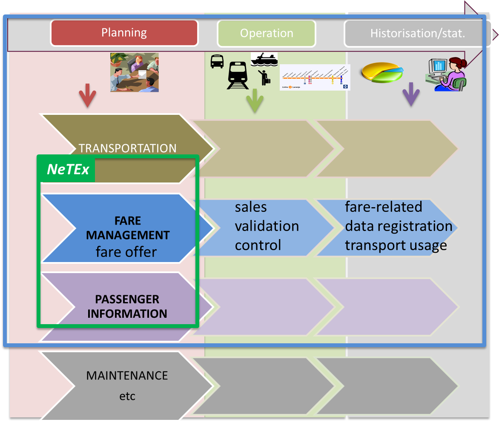 *Couverture de NeTEx pour l’offre tarifaire*

Les principales catégories de données disponibles dans NeTEx sont les
suivantes :

- Description de la structure tarifaire (les éléments de base sur
  lesquels s’appuie l’offre tarifaire : trajet simple, la durée de
  voyage autorisée, les origines/destinations, etc.)

- Description des droits d'accès (accès aux réseaux, aux lignes, les
  possibilités de correspondances, les aller/retour, etc.)

- Les prix (quand ils sont connus à l’avance, et sinon des informations
  sur les services pour obtenir les prix variables)

- Les conditions de vente (possibilités d’échange et remboursement,
  nécessité d’achat ou réservation à l’avance, etc.)

- Les modalités de paiement possibles (carte bancaire, liquide, paiement
  en ligne, etc.)

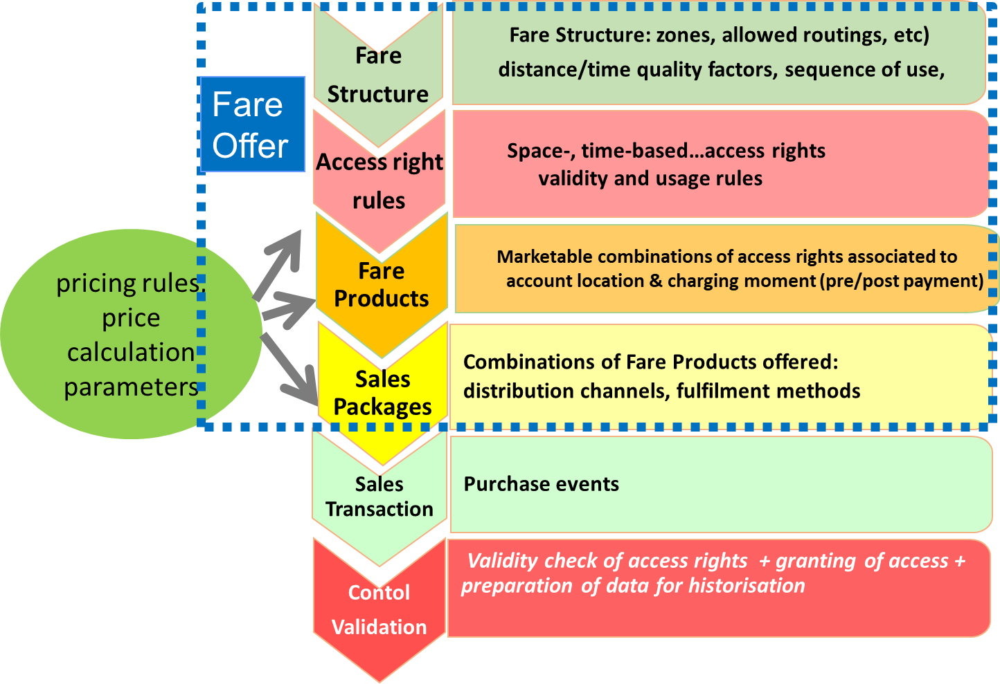 *Catégories de donnée gérées (entourée en
pointillé bleus) et leur classification*

Différents droits d'accès peuvent être combinés pour former des produits
tarifaires (par exemple, un « aller simple » associé à un produit
tarifaire appelé « billet simple » ou plusieurs trajets au cours d'un
mois associés à un produit tarifaire appelé« abonnement mensuel »).

Un ou plusieurs produits tarifaires peuvent être associés à un
« document de voyage » et matérialisés (par exemple, un billet unique en
papier permettant uniquement un « aller simple » ou une carte
électronique contenant divers produits tarifaires).

Les combinaisons de produits tarifaires et de documents de voyage sont
vendues aux clients en tant que « packages d’offre de vente » (par
exemple un carnet de tickets « aller simple »). Chaque package vendu
fait partie d'un « contrat » individuel avec un client particulier.

L’offre tarifaire peut être décrite en plusieurs étapes (Figure 9),
résumées comme suit :

1.  Les éléments pertinents du réseau de transport (arrêts, zones
    tarifaires, etc.) et les services planifiés (par exemple, des
    trajets spécifiques avec des restrictions tarifaires, etc.), qui
    peuvent être utilisés dans un produit sont identifiés (ces
    informations sont décrites par les profils Arrêts, Réseau et Horaire).

2.  Une STRUCTURE TARIFAIRE (FARE STRUCTURE) définie en fonction des
    éléments spatiaux et temporels utilisés, ainsi que tout autre
    élément donnant lieu à une tarification particulière (classe
    d'utilisation, types d'utilisateurs éligibles, heure de pointe ou
    non, etc.).

3.  Les ensembles de DROITS D'ACCÈS (ACCESS RIGHT), comme les droits de
    déplacement au sein d'une zone, les droits de déplacement entre des
    arrêts, etc. sont définis comme des ÉLÉMENTS VALIDABLEs.

4.  Les PRODUITs TARIFAIREs (FARE PRODUCT) combinent des ensembles de
    droits d'accès avec des conditions supplémentaires telles que les
    conditions commerciales d'achat et de remboursement, etc.

5.  Les PRODUITs TARIFAIREs sont combinés dans des OFFRES COMMERCIALES
    (SALES PACKAGE OFFER) décrivant le support sur lequel les produits
    sont disponibles, ainsi que les éventuelles conditions commerciales
    et les canaux de vente autorisés.

6.  Les PRIX (FARE PRICE) des offres commerciales et éventuelles options
    sont définies.

Un principe fondamental de l’approche NeTEx est que les prix sont
séparés des éléments qu’ils tarifent. Un autre principe important
consiste à réutiliser les éléments de données existants dans la mesure
du possible. Ainsi, par exemple, les mêmes données d'arrêt sont
utilisées pour les horaires et les tarifs.

## Les éléments non définis dans l’offre des service (réseau et horaires)

Même si l’infrastructure et les services sont très complètement décrits
par les parties 1 et 2 de NeTEx, la description de l’offre tarifaire
nécessite de compléter certaines de ces informations avec des attributs
propres à la tarification. C’est ce que proposent les spécialisations et
compléments d’objet présentés dans ce chapitre.

Note : en gris, les éléments non instanciés (abstraits) ou issu des
autres profils (et donc non décrits dans ce document).

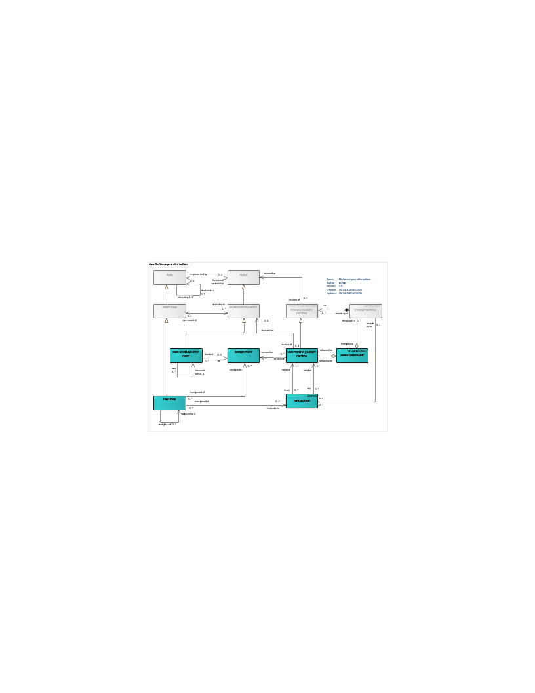 *Éléments du réseau dédié à l’offre tarifaire –
Modèle conceptuel*

NeTEx Partie 1 décrit le concept de ZONE TARIFAIRE, qui peut être
utilisé pour définir les zones tarifaires permanentes d'un système. Un
POINT D'ARRÊT PLANIFIÉ donné peut appartenir à une ou plusieurs ZONE
TARIFAIREs. Le MODÈLE DE ZONE TARIFAIRE NeTEx Partie 3 les complète des
concepts supplémentaires relatifs au réseau qui peuvent être utilisés en
plus pour étayer les structures tarifaires.

- Une ZONE BILLETTIQUE (FARE ZONE) est une spécialisation de ZONE
  TARIFAIRE qui peut notamment être associée à des SECTION TARIFAIREs.

- Les SECTION TARIFAIREs permettent à des sections (entre deux arrêts
  d’une ligne en général) arbitraires du réseau d'être associées à une
  ZONE BILLETTIQUE spécifique.

- Le POINT D'ARRÊT TARIFAIRE (FARE SCHEDULED STOP POINT) spécialise le
  POINT D'ARRÊT PLANIFIÉ avec des attributs supplémentaires liés à la
  tarification.

- Un POINT FRONTALIER (BORDER POINT) peut être utilisé pour distinguer
  certains points (souvent mais pas nécessairement les POINTS D'ARRÊT
  PLANIFIÉs et / ou les POINTS HORAIREs) comme ayant une importance
  particulière pour le calcul des tarifs internationaux.

<!-- -->

- Une CONSTRAINTE DE SERIE permet de spécifier des contraintes sur des
  itinéraires spécifiques (pour le domaine ferroviaire), par exemple
  pour indiquer que les itinéraires peuvent ou doivent passer par des
  points particuliers. Ils sont principalement utilisés pour le rail et
  peuvent comprendre un ou plusieurs POINTs TARIFAIRES sur PARCOURS.

<div class='table-title'>FareZone (Zone de Prix) – Element</div>

| **Classification** | **Name**                      | **Type**                                                 | **Cardinality** | **Description**                                                                                          |
|--------------------|-------------------------------|----------------------------------------------------------|-----------------|----------------------------------------------------------------------------------------------------------|
| ::\>               | ::\>                          | *<u>TariffZone</u>*                                      | ::\>            | FARE ZONE hérite de TARIFF ZONE. Voir profil Réseau.                                                     |
| « PK »             | ***id***                      | *FareZoneIdType*                                         | 1:1             | Identifiant due la FARE ZONE.                                                                            |
| « enum »           | ***ZoneTopology***            | *ZoneTopologyEnum*                                       | 0:1             | Topologie de la FARE ZONE (en anneaux, tuiles adjacentes, etc.). Voir les valeurs autorisées ci-dessous. |
| « FK »             | ***TransportOranisationRef*** | *(TransportOrganisationRef) OperatorRef \| AuthorityRef* | 0:1             | Reference à l’OPERATOR associé à la FARE ZONE.                                                           |
| « cntd »           | ***fareSections***            | *<u>FareSection</u>*                                     | 0:\*            | FARE SECTIONs de la FARE ZONE.                                                                           |
| « cntd »           | ***contains***                | *<u>TariffZoneRef</u>*                                   | 0:\*            | Autre zone tarifaire entièrement incluse dans la FARE ZONE.                                              |
| « cntd »           | ***neighbours***              | *FareZoneRef*                                            | 0:\*            | FARE ZONEs adjacentes.                                                                                   |

Le tableau suivant fournit les valeurs autorisées pour
***ZoneTopology*** (*ZoneTopologyEnumeration*)*.*

<div class='table-title'>ZoneTopology – Allowed values</div>

| **Value**             | **Description**                                                                                                                                                                                                                            |
|-----------------------|--------------------------------------------------------------------------------------------------------------------------------------------------------------------------------------------------------------------------------------------|
| *overlapping*         | Les zones sont de forme arbitraire et peuvent se chevaucher                                                                                                                                                                                |
| *honeycomb*           | Les zones sont disposées en nid d'abeilles, en mosaïque de polygones réguliers (par exemple, des hexagones, des carrés, etc.) Les zones ne se chevauchent pas.                                                                              |
| *ring*                | Les zones sont disposées en anneaux. Les zones internes imbriquées sont incluses dans toutes les zones externes contenantes.                                                                                                                 |
| *annular*             | Les zones sont disposées en anneaux non imbriqués. La zone immédiatement imbriquée est exclue de la zone externe contenante.                                                                                                                    |
| *nested*              | Les zones sont imbriquées, c'est-à-dire que certaines zones sont entièrement contenues dans d'autres zones et sont automatiquement incluses si la zone extérieure est sélectionnée. Elles peuvent également chevaucher les zones voisines. |
| *tiled*               | Les zones sont disposées sous forme de tuiles adjacentes ou de formes arbitraires qui ne se chevauchent pas.                                                                                                                               |
| *sequence*            | Les zones sont disposées en tuiles adjacentes en séquence qui se touchent à l'une ou aux deux extrémités. Elles ne se chevauchent pas.                                                                                                     |
| *overlappingSequence* | Les zones sont disposées en tuiles adjacentes en séquence qui se touchent à l'une ou aux deux extrémités. Elles peuvent se chevaucher partiellement de sorte que certains arrêts se trouvent dans les deux zones.                          |
| *other*               | La zone a une topologie autre ou non spécifiée.                                                                                                                                                                                            |

Une SECTION TARIFAIRE est subdivision d'un PARCOURS composée de POINTs
SUR PARCOURS consécutifs, utilisée pour définir un élément de la
structure tarifaire.

<div class='table-title'>FareSection – Element</div>

| Classification | **Name**                | **Type**                | **Cardinality** | **Description**                                                          |
|----------------|-------------------------|-------------------------|-----------------|--------------------------------------------------------------------------|
| ::\>           | ::\>                    | *<u>CommonSection</u>*  | ::\>            | FARE SECTION hérite de COMMON SECTION.                                   |
| « PK »         | ***id***                | *FareSectionIdType*     | 1:1             | Identifiant de la FARE SECTION.                                          |
|                | ***Name***              | *MultilingualString*    | 0:1             | Nom de la FARE SECTION.                                                  |
| « FK »         | ***JourneyPatternRef*** | *JourneyPatternRef+*    | 0:1             | Référence au JOURNEY PATTERN sur laquelle cette FARE SECTION s’applique. |
| « FK »         | ***FromFarePointRef***  | *FarePointInPatternRef* | 0:1             | Référence au FARE POINT IN PATTERN auquel la FARE SECTION débute.        |
| « FK »         | ***ToFarePointRef***    | *FarePointInPatternRef* | 0:1             | Référence au FARE POINT IN PATTERN auquel la FARE SECTION se termine.    |

<div class='table-title'>CommonSection – Element</div>

| **Classification** | **Name**              | **Type**                   | **Cardinality** | **Description**                               |
|--------------------|-----------------------|----------------------------|-----------------|-----------------------------------------------|
| ::\>               | ::\>                  | *<u>DataManagedObject</u>* | ::\>            | COMMON SECTION hérite de DATA MANAGED OBJECT. |
| « PK »             | ***id***              | *CommonSectionIdType*      | 1:1             | Identifiant du la COMMON SECTION.             |
| « cntd »           | ***pointsOnSection*** | *<u>PointOnSectionr</u>*   | 0:\*            | POINTS de la COMMON SECTION.                  |

Le ***FareScheduledStopPoint*** est une spécialisation de POINT D'ARRÊT
PLANIFIÉ décrivant un arrêt avec des caractéristiques de billettique et
de routage. Le POINT D'ARRÊT PLANIFIÉ pourra avoir été déjà échangé par
ailleurs pour décrire les données d’offre de transport : un jeux de
données d’offre tarifaire pourra reprendre l’ensemble des
caractéristique de ces POINT D'ARRÊT PLANIFIÉs

<div class='table-title'>FareScheduledStopPoint – Element</div>

| **Classification** | **Name**                     | **Type**                    | **Cardinality** | **Description**                                                                      |
|--------------------|------------------------------|-----------------------------|-----------------|--------------------------------------------------------------------------------------|
| ::\>               | ::\>                         | *<u>ScheduledStopPoint</u>* | ::\>            | FARE SCHEDULED STOP POINT hérite de SCHEDULED STOP POINT.                            |
| « PK »             | ***id***                     | *FareStopPointIdType*       | 1:1             | Identifiant du FARE SCHEDULED STOP POINT.                                            |
|                    | ***SiteFacilitySet***        | *SiteFacilitySetRef*        | 0:1             | Ensemble des services disponible à ce point                                          |
|                    | ***NameOnRouting***          | *MultilingualString*        | 0:1             | Nom à utiliser pour indiquer la station sur les itinéraires.                         |
| « FK »             | ***AccountingStopPointRef*** | *FareScheduledStopPointRef* | 0:1             | Identifiant d'une autre station à utiliser à des fins comptables pour cette station. |
| « FK »             | ***BorderPointRef***         | *BorderPointRef*            | 0:1             | BORDER POINT associé au FARE SCHEDULED STOP POINT.                                   |

Le ***FarePointInJourneyPattern*** Un POINT SUR PARCOURS qui représente
le début ou la fin d'une SECTION TARIFAIRE.

Les ***FareStage*** (dernier attribut), ou point de changement de tarif,
sont des points géographiques qui délimitent une frontière de transition
pour définir un tarif. Un ***FareStage*** peut être à un point d’arrêt
ou entre deux arrêts.

<div class='table-title'>FarePointInPattern – Element</div>

| **Classification** | **Name**                     | **Type**                       | **Cardinality** | **Description**                                                                               |
|--------------------|------------------------------|--------------------------------|-----------------|-----------------------------------------------------------------------------------------------|
| ::\>               | ::\>                         | *<u>PointInJourneyPattern</u>* | ::\>            | FARE POINT IN PATTERN hérite POINT IN JOURNEY PATTERN. Voir Profil Réseau.                    |
| « PK »             | ***id***                     | *FaresPointInPatternIdType*    | 1:1             | Identifiant du FARE POINT IN PATTERN.                                                         |
|                    | ***ScheduledStopPointView*** | *ScheduledStopPointView*       | 0:1             | Informations dérivées sur le POINT D'ARRÊT PLANIFIÉ, telles que son nom – voir Profil Réseau. |
|                    | ***IsFareStage***            | *xsd:boolean*                  | 0:1             | Indique si l'arrêt est considéré comme une étape de tarification.                             |

Un ***BorderPoint*** est un point sur le réseau marquant une limite pour
le calcul des tarifs. Peut ou non être un POINT D'ARRÊT PLANIFIÉ.

<div class='table-title'>BorderPoint – Element</div>

| **Classification** | **Name**          | **Type**             | **Cardinality** | **Description**                                          |
|--------------------|-------------------|----------------------|-----------------|----------------------------------------------------------|
| ::\>               | ::\>              | *<u>TimingPoint</u>* | ::\>            | BORDER POINT hérite de TIMING POINT. Voir Profile Réseau |
| « PK »             | ***id***          | *BorderPointIdType*  | 1:1             | Identifiant du BORDER POINT.                             |
|                    | ***ShortName***   | *MultilingualString* | 0:1             | Nom court du BORDER POINT.                               |
|                    | ***Description*** | *MultilingualString* | 0:1             | Description du BORDER POINT.                             |

Une ***SeriesConstraint*** est une extension d'un ÉLÉMENT DE MATRICE DE
DISTANCE, une cellule d'une matrice origine-destination pour les ZONE
TARIFAIREs ou les POINTs D'ARRÊT, exprimant une distance tarifaire pour
le trajet correspondant (en tant que valeur en km, nombre d'unités
tarifaires etc.) et éventuellement une contrainte pour n’autoriser les
déplacements que sur des itinéraires spécifiques.

<div class='table-title'>SeriesConstraint – Element</div>

<table>
<thead>
<tr class="header">
<th>Classification</th>
<th><strong>Name</strong></th>
<th><strong>Type</strong></th>
<th><strong>Cardinality</strong></th>
<th><strong>Description</strong></th>
</tr>
</thead>
<tbody>
<tr class="odd">
<td>::&gt;</td>
<td>::&gt;</td>
<td><em>PriceableObject</em></td>
<td>::&gt;</td>
<td>SERIES CONSTRAINT hérite de PRICEABLE OBJECT.</td>
</tr>
<tr class="even">
<td>« PK »</td>
<td><em><strong>id</strong></em></td>
<td><em>SeriesConstraintIdType</em></td>
<td>1:1</td>
<td>Identifiant de SERIES CONSTRAINT.</td>
</tr>
<tr class="odd">
<td></td>
<td><em><strong>PrivateCode</strong></em></td>
<td><em>PrivateCodeType</em></td>
<td>0:1</td>
<td>Code privé associé à l'élément.</td>
</tr>
<tr class="even">
<td></td>
<td><em><strong>Itinerary</strong></em></td>
<td><em>xsd:normalizedString</em></td>
<td>0:1</td>
<td>Description textuelle schématique de la série (Voir Tap STI
5.1).</td>
</tr>
<tr class="odd">
<td></td>
<td><em><strong>SymbolMarkingUsualRoute</strong></em></td>
<td><em>xsd:normalizedString</em></td>
<td>0:1</td>
<td>Symbol to use to denote the usual route.</td>
</tr>
<tr class="even">
<td>« enum »</td>
<td><em><strong>SeriesType</strong></em></td>
<td><em>SeriesTypeEnum</em></td>
<td>0:1</td>
<td><p>Classification de la SERIES CONSTRAINT. La valeur par défaut est
‘stationToStation’. Voir les valeurs autorisées ci-dessous (voir TAP-TSI
pour plus de détail):</p>
<ul>
<li><p><em>stationToStation (arrêt à arrêt)</em></p></li>
<li><p><em>originToBorder (départ à frontière)</em></p></li>
<li><p><em>borderToDestination (frontière à destionation)</em></p></li>
<li><p><em>border (frontière)</em></p></li>
<li><p><em>transit (via)</em></p></li>
</ul></td>
</tr>
<tr class="odd">
<td>« enum »</td>
<td><em><strong>RoutingType</strong></em></td>
<td><em>RoutingTypeEnum</em></td>
<td>0:1</td>
<td>Indique s’il s’agit d'un direct, ou si un changement est
requis.</td>
</tr>
<tr class="even">
<td>« enum »</td>
<td><em><strong>FareBasis</strong></em></td>
<td><em>FareBasisEnum</em></td>
<td>0:1</td>
<td>Base tarifaire utilisée pour établir le prix des séries (itinéraire
ou distance)</td>
</tr>
<tr class="odd">
<td></td>
<td><em><strong>FirstClassDistance</strong></em></td>
<td><em>DistanceType</em></td>
<td>0:1</td>
<td>Distance fictive de la CONTRAINTE DE SÉRIE pour le calcul des tarifs
de première classe.</td>
</tr>
<tr class="even">
<td></td>
<td><em><strong>SecondClassDistance</strong></em></td>
<td><em>DistanceType</em></td>
<td>0:1</td>
<td>Distance fictive de la CONTRAINTE DE SÉRIE pour le calcul des tarifs
de seconde classe.</td>
</tr>
<tr class="odd">
<td></td>
<td><em><strong>Discrete</strong></em></td>
<td><em>xsd:boolean</em></td>
<td>0:1</td>
<td>Indique si la CONTRAINTE DE SÉRIE ne peut être utilisé que seul ou
s'il peut être utilisé dans une chaîne de séries.</td>
</tr>
<tr class="even">
<td>« FK »</td>
<td><em><strong>FromConnectionRef</strong></em></td>
<td><em>ConnectionRef</em></td>
<td>0:1</td>
<td>Référence à la correspondance associée au départ de la CONTRAINTE DE
SÉRIE.</td>
</tr>
<tr class="odd">
<td>« FK »</td>
<td><em><strong>ToConnectionRef</strong></em></td>
<td><em>ConnectionRef</em></td>
<td>0:1</td>
<td>Référence à la correspondance associée à la fin de la CONTRAINTE DE
SÉRIE.</td>
</tr>
<tr class="even">
<td>« cntd »</td>
<td><em><strong>farePointsInPattern</strong></em></td>
<td><em>FarePointInPattern</em></td>
<td>0:*</td>
<td>FARE POINTs IN PATTERN faisant partie de la série.</td>
</tr>
<tr class="odd">
<td>« cntd »</td>
<td><em><strong>journeyPatterns</strong></em></td>
<td><em>JourneyPatternRef+</em></td>
<td>0:*</td>
<td>Références aux JOURNEY PATTERN “equivalent” à la SERIES
CONSTRAINT.</td>
</tr>
<tr class="even">
<td>« cntd »</td>
<td><em><strong>replaces</strong></em></td>
<td><em>SeriesConstraintRef</em></td>
<td>0:*</td>
<td>Remplace la SERIE spéifiée. (nécessaire pour TAP TSI).</td>
</tr>
</tbody>
</table>

Note : de façon générale, les attributs de prix des différents éléments
ne sont pas retenus car le profil fait le choix de systématiser la
présentation des prix via des GRILLEs TARIFAIRE (FARE TABLE).

## La structure tarifaire

La définition des éléments de la structure tarifaire repose sur des
règles génériques, principalement quantitatives, qui influencent les
droits d'accès réglementant la consommation des services de transport,
et donc le prix qu'un passager doit payer pour une consommation
spécifique : limitation de la durée ou de la durée des trajets , le
nombre de zones traversées, etc.

Ces règles décrivent l'utilisation du système de transport et se
définissent en termes d'espace, de temps et de qualité de service.
Ainsi, les paramètres spatiaux, temporels et de qualité seront spécifiés
et associés à des ÉLÉMENTS DE STRUCTURE TARIFAIRE.

Les règles déterminant les droits d'accès peuvent être classées en deux
grandes catégories :

- Des règles globales qui permettent de déterminer la validité d'une gamme
de droits d'accès génériques servant de base au calcul du prix de leur
consommation. Un tel ensemble de règles est classiquement appelé
« structure tarifaire ».

- Règles de limitation de validité qui consistent à attribuer certains
« paramètres de limitation » à des droits d'accès spécifiques. Par
exemple, un trajet peut être limité par la dernière heure de départ
possible, un pass valable uniquement pour les étudiants, etc. Ces
limitations sont exprimées par deux catégories de paramètres :

  - « Paramètres de validité », qui affectent les caractéristiques
  physiques des droits d'accès (principalement dans l'espace ou dans le
  temps) ; des exemples de paramètres de limitation de validité sont
  GROUPE DE LIGNES, TYPE DE JOUR, etc.

  - « CONDITIONS D’UTILISATION », qui affectent l'utilisation réelle des
  droits d'accès, tels que PROFIL D'UTILISATEUR, FRÉQUENCE
  D'UTILISATION, TRANSFÉRABILITÉ, etc.

Une version particulière de la structure tarifaire fixe les valeurs des
différents paramètres : cet ensemble de règles avec des valeurs de
paramètres bien définies construit un TARIF.

La structure tarifaire est composé d'un certain nombre de sous-modèles
décrits ci-dessous.

- Le modèle géographique définit des aspects spatiaux de la structure
tarifaire.

- Le modèle temporel définit des aspects temporels de la structure des
tarifs.

- Les FACTEURs DE QUALITÉ définissent d'autres aspects qualitatifs de la
structure tarifaire.

- La MATRICE DE DISTANCE montre les origine/destination possibles et leurs
caractéristiques.

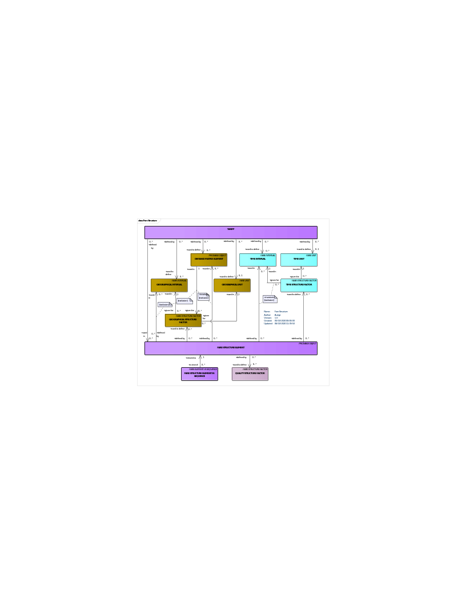 *Structure tarifaire – Modèle conceptuel*

### Elément de structure tarifaire (FareStructureElement)

Le ***FareStructureElement*** est naturellement l’élément de base de la
construction des structures tarifaires.

<div class='table-title'>FareStructureElement – Element</div>

<table>
<thead>
<tr class="header">
<th><strong>Classification</strong></th>
<th><strong>Name</strong></th>
<th><strong>Type</strong></th>
<th><strong>Cardinality</strong></th>
<th><strong>Description</strong></th>
</tr>
</thead>
<tbody>
<tr class="odd">
<td>::&gt;</td>
<td>::&gt;</td>
<td><em><u>PriceableObject</u></em></td>
<td>::&gt;</td>
<td>FARE STRUCTURE ELEMENT hérite de PRICEABLE
OBJECT<em><strong>.</strong></em></td>
</tr>
<tr class="even">
<td>« PK »</td>
<td><em><strong>id</strong></em></td>
<td><em>FareStructureElementIdType</em></td>
<td>1:1</td>
<td>Identifiant de FARE STRUCTURE ELEMENT.</td>
</tr>
<tr class="odd">
<td>« enum »</td>
<td><em><strong>TariffBasis</strong></em></td>
<td><em>TariffBasisEnum</em></td>
<td>0:1</td>
<td><p>Base tarifaire à utiliser pour cet élément</p>
<blockquote>
<p><em>Flat (constant)</em></p>
<p><em>Distance (distance)</em></p>
<p><em>unitSection (section)</em></p>
<p><em>zone (zonal)</em></p>
<p><em>zoneToZone (zone à zone)</em></p>
<p><em>pointToPoint (point à point)</em></p>
<p><em>route (itinéraire)</em></p>
<p><em>tour (tour)</em></p>
<p><em>group (group)</em></p>
<p><em>discount (rabais)</em></p>
<p><em>period (période)</em></p>
<p><em>free (gratuit)</em></p>
<p><em>other (autre)</em></p>
</blockquote></td>
</tr>
<tr class="even">
<td></td>
<td><em><strong>TypeOfFareStructureElementRef</strong></em></td>
<td><em>TypeOfFareStructureElementRef</em></td>
<td>0:1</td>
<td>Type ouvert associé à l’élément .</td>
</tr>
<tr class="odd">
<td>XGRP</td>
<td><em><strong>FareStructureElementFactorGroup</strong></em></td>
<td><em>xmlGroup</em></td>
<td>0:1</td>
<td>FARE STRUCTURE FACTORs associé au FARE STRUCTURE ELEMENT.</td>
</tr>
<tr class="even">
<td>XGRP</td>
<td><em><strong>FareStructureComponentGroup</strong></em></td>
<td><em>xmlGroup</em></td>
<td>0:1</td>
<td>FARE STRUCTURE COMPONENTs associé au FARE STRUCTURE ELEMENT.</td>
</tr>
</tbody>
</table>

<div class='table-title'>FareStructureElementFactorGroup – Group</div>

<table>
<thead>
<tr class="header">
<th><strong>Classification</strong></th>
<th colspan="2"><strong>Name</strong></th>
<th><strong>Type</strong></th>
<th><strong>Cardinality</strong></th>
<th><strong>Description</strong></th>
</tr>
</thead>
<tbody>
<tr class="odd">
<td colspan="3"></td>
<td><em>Choice</em></td>
<td colspan="2"></td>
</tr>
<tr class="even">
<td>« FK »</td>
<td><em><strong>a</strong></em></td>
<td><em><strong>GeographicalIntervalRef</strong></em></td>
<td><em>GeographicalIntervalRef</em></td>
<td>0:1</td>
<td><p>Reference au GEOGRAPHICAL INTERVAL associé au FARE STRUCTURE
ELEMENT.</p>
<p><mark>Note : de façon générale on n’utilisera les références que s’il y
a effectivement réutilisation (donc ici on préférera
<em><strong>geographicalIntervals</strong> à
<strong>GeographicalIntervalRef</strong> sauf si les mêmes
<strong>GeographicalInterval</strong> sont utilisés à plusieurs
reprises)</em></mark></p></td>
</tr>
<tr class="odd">
<td>« cntd »</td>
<td><em><strong>b</strong></em></td>
<td><em><strong>geographicalIntervals</strong></em></td>
<td><em><u>GeographicalInterval</u></em> |
<em>GeographicalIntervalRef</em></td>
<td>0:*</td>
<td>GEOGRAPHICAL INTERVALs associé au FARE STRUCTURE ELEMENT.</td>
</tr>
<tr class="even">
<td>« cntd »</td>
<td><em><strong>c</strong></em></td>
<td><em><strong>geographicalStructureFactors</strong></em></td>
<td><em><u>GeographicalStructureFactor</u> |
GeographicalStructureFactorRef</em></td>
<td>0:*</td>
<td>GEOGRAPHICAL STRUCTURE FACTORs associé au FARE STRUCTURE
ELEMENT.</td>
</tr>
<tr class="odd">
<td colspan="3"></td>
<td><em>Choice</em></td>
<td colspan="2"></td>
</tr>
<tr class="even">
<td>« FK »</td>
<td><em><strong>a</strong></em></td>
<td><em><strong>TimeIntervalRef</strong></em></td>
<td><em>TimeIntervalRef</em></td>
<td>0:1</td>
<td>Référence au TIME INTERVAL ass associé au FARE STRUCTURE
ELEMENT.</td>
</tr>
<tr class="odd">
<td>« cntd »</td>
<td><em><strong>b</strong></em></td>
<td><em><strong>timeIntervals</strong></em></td>
<td><em><u>TimeInterval</u> | TimeIntervalRef</em></td>
<td>0:*</td>
<td>TIME STRUCTURE INTERVALs associé au the FARE STRUCTURE ELEMENT.</td>
</tr>
<tr class="even">
<td>« cntd »</td>
<td><em><strong>c</strong></em></td>
<td><em><strong>timeStructureFactors</strong></em></td>
<td><em><u>TimeStructureFactor</u> | TimeStructureFactorRef</em></td>
<td>0:*</td>
<td>TIME STRUCTURE FACTORs associé au FARE STRUCTURE ELEMENT.</td>
</tr>
<tr class="odd">
<td></td>
<td colspan="2"></td>
<td><em>Choice</em></td>
<td></td>
<td></td>
</tr>
<tr class="even">
<td>« FK »</td>
<td><em><strong>a</strong></em></td>
<td><em><strong>QualityStructureFactorRef</strong></em></td>
<td><em>QualityStructureFactorRef</em></td>
<td>0:1</td>
<td>Référence au QUALITY STRUCTURE FACTOR associé au FARE STRUCTURE
ELEMENT.</td>
</tr>
<tr class="odd">
<td>« cntd »</td>
<td><em><strong>b</strong></em></td>
<td><em><strong>qualityStructureFactors</strong></em></td>
<td><em><u>QualityStructureFactor</u> | QualityStructureFactor</em></td>
<td>0:*</td>
<td>QUALITY STRUCTURE FACTORs associé au FARE STRUCTURE ELEMENT.</td>
</tr>
<tr class="even">
<td colspan="3"></td>
<td><em>Choice</em></td>
<td colspan="2"></td>
</tr>
<tr class="odd">
<td>« FK »</td>
<td><em><strong>a</strong></em></td>
<td><em><strong>DistanceMatrixElementRef</strong></em></td>
<td><em>DistanceMatrixElementRef</em></td>
<td>0:1</td>
<td>Référence au DISTANCE MATRIX ELEMENT associé au FARE STRUCTURE
ELEMENT.</td>
</tr>
<tr class="even">
<td>« FK »</td>
<td><em><strong>b</strong></em></td>
<td><em><strong>distanceMatrixElements</strong></em></td>
<td><em><u>DistanceMatrixElement</u> |
DistanceMatrixElementRef</em></td>
<td>0:*</td>
<td>DISTANCE MATRIX ELEMENTs associés au FARE STRUCTURE ELEMENT.</td>
</tr>
<tr class="odd">
<td>« FK »</td>
<td><em><strong>c</strong></em></td>
<td><em><strong>GroupOfDistanceMatrixElementsRef</strong></em></td>
<td><em>GroupOfDistanceMatrixElementsRef</em></td>
<td>0:1</td>
<td>Référence au GROUP OF DISTANCE MATRIX ELEMENTs associés au FARE
STRUCTURE ELEMENT.</td>
</tr>
<tr class="even">
<td>« cntd »</td>
<td><em><strong>d</strong></em></td>
<td><em><strong>GroupOfDistanceMatrixElements</strong></em></td>
<td><em>GroupOfDistanceMatrixElements</em></td>
<td>0:1</td>
<td>GROUP OF DISTANCE MATRIX ELEMENTs associés au FARE STRUCTURE
ELEMENT.</td>
</tr>
</tbody>
</table>

<div class='table-title'>FareStructureComponentGroup – Group</div>

| **Classification** | **Name**                              |                                           | **Type**                         | **Cardinality** | **Description**                                                                                                                                              |
|--------------------|---------------------------------------|-------------------------------------------|----------------------------------|-----------------|--------------------------------------------------------------------------------------------------------------------------------------------------------------|
| « cntd »           | ***fareStructureElementsInSequence*** |                                           | *FareStructureElementInSequence* | 0:\*            | Ensemble de FARE STRUCTURE ELEMENTS IN SEQUENCE constituant FARE STRUCTURE ELEMENT.                                                                          |
|                    |                                       |                                           | *Choice*                         |                 | Soit plusieurs paramètres enveloppés dans une balise, soit un seul paramètre (une optimisation).                                                             |
| « cntd »           | ***a***                               | ***validityParameterAssignments***        | *AccessRightParameterAssignment* | 0:\*            | GENERIC PARAMETER ASSIGNMENTs associés au FARE STRUCTURE ELEMENT.                                                                                            |
| « cntd »           | ***b***                               | ***GenericParameterAssignment***          | *GenericParameterAssignment*     | 0:1             | GENERIC PARAMETER ASSIGNMENT unique associé au FARE STRUCTURE ELEMENT.                                                                                       |
| « cntd »           | ***c***                               | ***GenericParameterAssignmentInContext*** | *GenericParameterAssignment*     | 0:1             | GENERIC PARAMETER ASSIGNMENT unique associé au FARE STRUCTURE ELEMENT. Aucun ID ne doit être fourni - sera déduit des valeurs d'affectation. (OPTIMISATION). |

Les structures tarifaires impliquent souvent la définition de séquences
d'éléments à utiliser **dans un ordre spécifié**. Le modèle de structure
tarifaire définit un élément abstrait FARE ELEMENT IN SEQUENCE qui est
affiné dans d'autres sous-modèles pour décrire les aspects séquentiels
de la STRUCTURE FARE.

<div class='table-title'>FareStructureElementInSequence – Element</div>

| **Classification** | **Name**                      | **Type**                               | **Cardinality** | **Description**                                                        |
|--------------------|-------------------------------|----------------------------------------|-----------------|------------------------------------------------------------------------|
| ::\>               | ::\>                          | *<u>FareElementInSequence</u>*         | ::\>            | FARE STRUCTURE ELEMENT IN SEQUENCE hérite de FARE ELEMENT IN SEQUENCE. |
| « PK »             | ***id***                      | *FareStructureElementInSequenceIdType* | 1:1             | Identifiant du FARE STRUCTURE ELEMENT IN SEQUENCE.                     |
| « FK »             | ***FareStructureElementRef*** | *FareStructureElementRef*              | 0:1             | Référence à unFARE STRUCTURE ELEMENT.                                  |

<span class="mark">Note : les éventuels
***ValidityParameterAssignment*** ne sont pas retenus dans le
***FareStructureElementInSequence*** et seront, si nécessaire, placés
dans les ***FareStructureElement*** « hôte » de la séquence.</span>

<div class='table-title'>FareElementInSequence – Element</div>

| **Classification** | **Name**                    | **Type**                      | **Cardinality** | **Description**                                     |
|--------------------|-----------------------------|-------------------------------|-----------------|-----------------------------------------------------|
| ::\>               | ::\>                        | *<u>VersionedChild</u>*       | ::\>            | FARE ELEMENT IN SEQUENCE hérite de VERSIONED CHILD. |
| « PK »             | ***id***                    | *FareElementInSequenceIdType* | 1:1             | Identifiant du FARE ELEMENT IN SEQUENCE.            |
| « PK »             | ***order***                 | *xsd:positiveInteger*         | 0:1             | Odre de l’élément dans la SEQUENCE.                 |
|                    | ***Name***                  | *MultilingualString*          | 0:1             | Nom du FARE ELEMENT IN SEQUENCE.                    |
|                    | ***Description***           | *MultilingualString*          | 0:1             | Description du FARE ELEMENT IN SEQUENCE.            |
|                    | ***IsFirstInSequence***     | *xsd:boolean*                 | 0:1             | Indique si l’élément est le premier de la séquence  |
|                    | ***IsLastInSequence***      | *xsd:boolean*                 | 0:1             | Indique si l’élément est le dernier de la séquence  |
|                    | ***AccessNumberIsLimited*** | *xsd:boolean*                 | 0:1             | Indique si le nombre d’accès est limité             |
|                    | ***AccessNumber***          | *xsd:nonNegativeInteger*      | 0:1             | Numéro d’accès                                      |

#### Exemples

***FareStructureElement*** ne contenant qu’un intervalle temporel

``` xml
<FareStructureElement id="FR-Tarif-Example:FareStructureElement:001:LOC" version="any">
  <TimeIntervalRef ref="FR-Tarif-Example:TimeInterval:001:LOC"/>
</FareStructureElement>
```

***FareStructureElement*** contenant des ***DistanceMatrixElements***
(origines-destination)

``` xml
<FareStructureElement id="FR-Tarif-Example:FareStructureElement:DM-001:LOC" version="any">
  <distanceMatrixElements>
    <DistanceMatrixElementRef ref="FR-Tarif-Example:DistanceMatrixElement:AtoB:LOC"/>
    <DistanceMatrixElementRef ref="FR-Tarif-Example:DistanceMatrixElement:AtoC:LOC"/>
    <DistanceMatrixElementRef ref="FR-Tarif-Example:DistanceMatrixElement:BtoC:LOC"/>
    <!--etc...-->
  </distanceMatrixElements>
</FareStructureElement>
```

***FareStructureElement*** incluant des limitation d’utilisation

``` xml
<FareStructureElement id="LEMAN-EXPRESS:FareStructureElement:001:LOC" version="any">
  <DistanceMatrixElementRef ref="FR-Tarif-Example:DistanceMatrixElement:001:LOC"/>
  <GenericParameterAssignment id="LEMAN-EXPRESS:GenericParameterAssignment:001:LOC" version="any" order="1">
    <limitations>
      <UsageValidityPeriod id="LEMAN-EXPRESS:UsageValidityPeriod:001:LOC" version="any">
        <!--Peut être une référence pour mutualiser la définition-->
        <UsageTrigger>purchase</UsageTrigger>
        <!--On a aussi l'option startOutboundRide, etc.-->
        <StandardDuration>PT180M</StandardDuration>
      </UsageValidityPeriod>
    </limitations>
  </GenericParameterAssignment>
</FareStructureElement>
```

### Règle d’application des caractéristiques (QualityStructureFactor) 

Les FACTEURs DE QUALITÉ définissent les aspects qualitatifs de la
structure tarifaire. Par exemple, le niveau de congestion ou
d'occupation (par exemple en %) peut influencer le tarif ou une
limitation des droits d'accès. Certains opérateurs ferroviaires
appliquent des tarifs différents si la réservation est effectuée tôt ou
tard (par exemple en nombre de jours).

Deux spécialisations peuvent être utilisées pour des aspects
spécifiques : Un FACTEUR DE FREQUENTATION (FARE DEMAND FACTOR) définit
une « tranche horaire » pour le voyage, par ex. aux heures de pointe ou
aux heures creuses, et un QUOTA TARIFAIRE (FARE QUOTA FACTOR) définit
une allocation limitée de sièges disponibles à un prix particulier.

<span class="mark">Note : un ***QualityStructureFactor*** peut aussi
être référencé par l’AFFECTATION DES PARAMÈTRES DES DROITS D'ACCÈS
(ACCESS RIGHT PARAMETER ASSIGNMENT, plus précisément par le
***ValidityParameterAssignment***). On n’utilisera le
***QualityStructureFactor*** au sein de la structure tarifaire que s’il
est véritablement partie intégrante de la structure sur laquelle
s’appuie la tarification (par exemple si l’on a systématiquement une
prise en compte de la différence heure creuse/heure de pointe). Si par
contre il ne s’applique que pour un ou quelques titres ou cartes de
réduction (par exemple une carte de réduction valable uniquement en
heures creuses), alors le ***QualityStructureFactor*** sera référencé
par le ***ValidityParameterAssignment*** (et en cas d’ambiguïté, c’est
cette seconde solution que l’on préférera systèmatiquement)</span>

 *QualityStructureFactor – Modèle conceptuel*

<div class='table-title'>QualityStructureFactor – Element</div>

| **Classification** | **Name** | **Type**                       | **Cardinality** | **Description**                                      |
|--------------------|----------|--------------------------------|-----------------|------------------------------------------------------|
| ::\>               | ::\>     | *<u>FareStructureFactor</u>*   | ::\>            | QUALITY STRUCTURE FACTOR hérite de PRICEABLE OBJECT. |
| « PK »             | ***id*** | *QualityStructureFactorIdType* | 1:1             | Identifiant du QUALITY STRUCTURE FACTOR.             |

<span class="mark">Note : dans le cas où les *QualityStructureFactor*
est très spécifique, on en effectuera la description dans une Notice
(disponible via l’héritage PriceableObject).</span>

<div class='table-title'>FareStructureFactor – Element</div>

| **Classification** | **Name**                           | **Type**                                | **Cardinality** | **Description**                                          |
|--------------------|------------------------------------|-----------------------------------------|-----------------|----------------------------------------------------------|
| ::\>               | ::\>                               | *<u>PriceableObject</u>*                | ::\>            | FARE STRUCTURE FACTOR. hérite de PRICEABLE OBJECT***.*** |
| « PK »             | ***id***                           | *FareStructureFactorIdType*             | 1:1             | Identifiant du FARE STRUCTURE FACTOR.                    |
|                    | ***PrivateCode***                  | *PrivateCodeStructure*                  | 0:1             | Code externe associé au facteur                          |
|                    | ***TypeOfFareStructureFactorRef*** | *TypeOfFareStructureFactorRefStructure* | 0:1             | Référence à un TYPE OF FARE STRUCTURE FACTOR.            |

<span class="mark">Note : dans le cas où les *FareStructureFactor* est
très spécifique, on en effectuera la description dans une Notice
(disponible via l’héritage PriceableObject).</span>

<div class='table-title'>FareDemandFactor – Element</div>

<table>
<thead>
<tr class="header">
<th><strong>Classification</strong></th>
<th><strong>Name</strong></th>
<th><strong>Type</strong></th>
<th><strong>Cardinality</strong></th>
<th><strong>Description</strong></th>
</tr>
</thead>
<tbody>
<tr class="odd">
<td>::&gt;</td>
<td>::&gt;</td>
<td><em><u>QualityStructureFactor</u></em></td>
<td>::&gt;</td>
<td>FARE DEMAND FACTOR hérite de QUALITY STRUCTURE FACTOR.</td>
</tr>
<tr class="even">
<td>« PK »</td>
<td><em><strong>id</strong></em></td>
<td><em>FareDemandFactorIdType</em></td>
<td>1:1</td>
<td>Identifiant du a FARE DEMAND FACTOR.</td>
</tr>
<tr class="odd">
<td>« enum »</td>
<td><em><strong>FareDemandType</strong></em></td>
<td><em>FareDemandTypeEnum</em></td>
<td>0:1</td>
<td><p>TIME DEMAND TYPE correspondant au FARE DEMAND FACTOR:</p>
<blockquote>
<p><em>Peak (heures de pointe)</em></p>
<p><em>Middle (heures intermédiaires)</em></p>
<p><em>offPeak (heures creuses)</em></p>
<p><em>superOffPeak (heures super-creuses)</em></p>
<p><em>night (nuit)</em></p>
<p><em>specialEvent (évènement spécial)</em></p>
</blockquote></td>
</tr>
<tr class="even">
<td>« FK »</td>
<td><em><strong>TimeDemandTypeRef</strong></em></td>
<td><em>TimeDemandTypeRef</em></td>
<td>0:1</td>
<td>TIME DEMAND TYPE correspondant au FARE DEMAND FACTOR</td>
</tr>
<tr class="odd">
<td>« cntd »</td>
<td><em><strong>startTimesAtStopPoints</strong></em></td>
<td><em><u>StartTimeAtStopPoint</u></em></td>
<td>0:*</td>
<td>Heure de début au SCHEDULED STOP POINTs pour ce FARE DEMAND
TYPE.</td>
</tr>
</tbody>
</table>

Le NIVEAU DE SERVICE (TIME DEMAND TYPE) est définie dans la Partie 1 de
NeTEx mais n’avait pas été retenu par les profils français jusqu’à
maintenant. C’est a la base un indicateur temporel des conditions de
circulation (ou taux de remplissage) ou d'autres facteurs qui peuvent
influer sur la circulation des véhicules, les temps d'attente ou la
tarification.

<div class='table-title'>TimeDemandType – Element</div>

<table>
<thead>
<tr class="header">
<th><strong>Classification</strong></th>
<th><strong>Name</strong></th>
<th><strong>Type</strong></th>
<th><strong>Cardinality</strong></th>
<th><strong>Description</strong></th>
</tr>
</thead>
<tbody>
<tr class="odd">
<td><em>::&gt;</em></td>
<td><em>::&gt;</em></td>
<td><em><u>DataManagedObject</u></em></td>
<td><em>::&gt;</em></td>
<td><p>TIME DEMAND TYPE hérite de DATA MANAGED OBJECT.</p>
<p>Note : La période associée au <em>TimeDemandType</em> est définie par
sa <em>ValidityCondition</em> (en l’occurrence on utilisera une
<em>AvailabilityCondition</em> qui dispose de DayType et
TimeBands)</p></td>
</tr>
<tr class="even">
<td>« PK »</td>
<td><em><strong>id</strong></em></td>
<td><em>TimeDemandTypeIdType</em></td>
<td>1:1</td>
<td>Identifiant du TIME DEMAND TYPE.</td>
</tr>
<tr class="odd">
<td></td>
<td><em><strong>Name</strong></em></td>
<td><em>MultilingualString</em></td>
<td>0:1</td>
<td>Nom du TIME DEMAND TYPE.</td>
</tr>
<tr class="even">
<td></td>
<td><em><strong>Description</strong></em></td>
<td><em>MultilingualString</em></td>
<td>0:1</td>
<td>Description du TIME DEMAND TYPE.</td>
</tr>
<tr class="odd">
<td>« AK »</td>
<td><em><strong>PrivateCode</strong></em></td>
<td><em>xsd:normalizedString</em></td>
<td>0:1</td>
<td>Code alternatif du TIME DEMAND TYPE.</td>
</tr>
</tbody>
</table>

<div class='table-title'>StartTimeAtStopPoint – Element</div>

| **Classification** | **Name**                    | **Type**                     | **Cardinality** | **Description**                                                                                                        |
|--------------------|-----------------------------|------------------------------|-----------------|------------------------------------------------------------------------------------------------------------------------|
| ::\>               | ::\>                        | *<u>VersionedChild</u>*      | ::\>            | START TIME AT STOP POINT hérite de VERSIONED CHILD.                                                                    |
| « PK »             | ***id***                    | *StartTimeAtStopPointIdType* | 1:1             | Identifiant du START TIME AT STOP POINT                                                                                |
| « FK »             | ***ScheduledStopPointRef*** | *ScheduledStopPointRef*      | 1:1             | SCHEDULED STOP POINT auquel s’applique l’information.                                                                  |
|                    | ***StartTime***             | *xsd:time*                   | 0:1             | Heure à laquelle la tranche horaire commence à l’arrêt.                                                                |
|                    | ***EndTime***               | *xsd:time*                   | 0:1             | Heure à laquelle la tranche horaire se termine à l’arrêt.                                                              |
|                    | ***DayOffset***             | *DayOffsetType*              | 0:1             | Décalage du jour de l'heure de fin par rapport à l'heure de début. Zéro indique qu’il n’y a pas de changement de jour. |

<div class='table-title'>FareQuotaFactor – Element</div>

| **Classification** | **Name**            | **Type**                        | **Cardinality** | **Description**                                       |
|--------------------|---------------------|---------------------------------|-----------------|-------------------------------------------------------|
| ::\>               | ::\>                | *<u>QualityStructureFactor</u>* | ::\>            | FARE QUOTA FACTOR hérite de QUALITY STRUCTURE FACTOR. |
| « PK »             | ***id***            | *FareQuotaFactorIdType*         | 1:1             | Identifiant du FARE QUOTA FACTOR.                     |
|                    | ***NumberOfUnits*** | *xsd:integer*                   | 0:\*            | Nombre d'unités disponibles à un prix donné.          |

#### Exemple

Le fragment de code suivant montre trois ***FareDemandFactor*** pour un
trajet à tout moment, en période de pointe et en dehors des heures de
pointe. Le trajet en dehors des heures de pointe définit des heures de
début distinctes pour certaines zones.

``` xml
<qualityStructureFactors>
  <FareDemandFactor version="any" id="tfl:any_time">
    <Name>Anytimetravel </Name>
  </FareDemandFactor>
  <FareDemandFactor version="any" id="tfl:peak">
    <Name>Peak time travel </Name>
    <validityConditions>
      <AvailabilityConditionRef ref="tfl:Peak" version="any"/>
    </validityConditions>
  </FareDemandFactor>
  <FareDemandFactor version="any" id="tfl:offPeak">
    <Name>off peak time travel</Name>
    <Description>Has stop specific overrides</Description>
    <!--
If you travel from a station north of Moor Park or Hatch End on a weekday after the times below, your Oyster
single fare will count towards the off-peak cap instead of the peak cap.
North of Moor Park
Station Touch in times
Chesham After 09:00
Amersham After 09:10
Chalfont & Latimer After 09:15
Chorleywood After 09:15
Rickmansworth After 09:20 -->
    <validityConditions>
      <AvailabilityConditionRef ref="tfl:OffPeak" version="any"/>
    </validityConditions>
    <startTimesAtStopPoints>
      <StartTimeAtStopPoint version="any" id="tfl:Chesham">
        <ScheduledStopPointRef ref="tfl:Chesham" version="any"/>
        <StartTime>09:00:00</StartTime>
      </StartTimeAtStopPoint>
      <StartTimeAtStopPoint version="any" id="tfl:Amersham">
        <ScheduledStopPointRef ref="tfl:Amersham" version="any"/>
        <StartTime>09:10:00</StartTime>
      </StartTimeAtStopPoint>
      <StartTimeAtStopPoint version="any" id="tfl:Chalfont_and_Latimer">
        <ScheduledStopPointRef ref="tfl:Chalfont_and_Latimer" version="any"/>
        <StartTime>09:15:00</StartTime>
      </StartTimeAtStopPoint>
      <StartTimeAtStopPoint version="any" id="tfl:Chorleywood">
        <ScheduledStopPointRef ref="tfl:Chorleywood" version="any"/>
        <StartTime>09:15:00</StartTime>
      </StartTimeAtStopPoint>
      <StartTimeAtStopPoint version="any" id="tfl:Rickmansworth">
        <ScheduledStopPointRef ref="tfl:Rickmansworth" version="any"/>
        <StartTime>09:20:00</StartTime>
      </StartTimeAtStopPoint>
    </startTimesAtStopPoints>
  </FareDemandFactor>
</qualityStructureFactors>
```

### Tarif : version de l’offre Tarifaire (Tariff)

Les TARIFs regroupent des ÉLÉMENTs DE STRUCTURE TARIFAIRE soumis à des
conditions de validité communes.

Dans la plupart des cas, un seul FACTEUR DE STRUCTURE GEOGRAPHIQUE
(resp. TEMPS ou QUALITE) est attaché à chaque ELEMENT DE STRUCTURE
TARIFAIRE. Parfois, différents facteurs peuvent s'appliquer au même
élément, choisis par une règle en fonction de conditions de validité
spécifiques. C'est le cas par exemple lorsque des tarifs différents sont
appliqués en été par rapport aux autres saisons. Plus simplement, la
structure tarifaire peut évoluer et une version être remplacée par une
autre.

L'entité TARIF décrit une VERSION de tous les paramètres composant une
structure tarifaire particulière. Lors de l'application des règles
tarifaires, un algorithme choisira les paramètres en fonction du TARIF
valide au moment spécifié par la demande.

Le principe est donc très similaire à celui des FRAMEs mais avec, ici,
une granularité plus fine (une FRAME pour par exemple contenir plusieurs
TARIFs, un pour le bus en période scolaire, un autre pour la période de
vacances et un troisième TARIF pour le ferré, etc.).

<div class='table-title'>Tariff – Element</div>

| **Classification** | **Name**                       | **Type**                   | **Cardinality** | **Description**                                           |
|--------------------|--------------------------------|----------------------------|-----------------|-----------------------------------------------------------|
| ::\>               | ::\>                           | *<u>DataManagedObject</u>* | ::\>            | TARIFF hérite de DATA MANAGED OBJECT.                     |
| « PK »             | ***id***                       | *TariffIdType*             | 1:1             | Identifiant du TARIFF.                                    |
| XGRP               | ***TariffDescriptionGroup***   | *xmlGroup*                 | 0:1             | Éléments descriptifs du TARIFF.                           |
|                    | ***PrivateCode***              | *PrivateCodeType*          | 0:1             | Identifiant alternatif                                    |
| XGRP               | ***TariffOrganisationGroup***  | *xmlGroup*                 | 0:1             | Éléments descriptifs des ORGANISATIONs opérant TARIFF.     |
| XGRP               | ***TariffApplicabilityGroup*** | *xmlGroup*                 | 0:1             | Éléments descriptifs des LINEs opérant TARIFF.            |
| XGRP               | ***TariffCalculationGroup***   | *xmlGroup*                 | 0:1             | Éléments descriptifs des paramètre de calcul du TARIFF.   |
| XGRP               | ***TariffGeographicalGroup***  | *xmlGroup*                 | 0:1             | Éléments descriptifs des aspects géographiques du TARIFF. |
| XGRP               | ***TariffTimeGroup***          | *xmlGroup*                 | 0:1             | Éléments descriptifs des aspects temporels du TARIFF.     |
| XGRP               | ***TariffQualityGroup***       | *xmlGroup*                 | 0:1             | Éléments descriptifs des aspects qualitatifs du TARIFF.   |
| XGRP               | ***TariffStructureGroup***     | *xmlGroup*                 | 0:1             | Éléments descriptifs de la structure du TARIFF.           |
| XGRP               | ***TariffPricesGroup***        | *xmlGroup*                 | 0:1             | TARIFF PRICE faisant partie du TARIFF.                    |

<div class='table-title'>TariffDescriptionGroup – Group</div>

| **Classification** | **Name**                | **Type**             | **Cardinality** | **Description**                              |
|--------------------|-------------------------|----------------------|-----------------|----------------------------------------------|
|                    | ***Name***              | *MultilingualString* | 0:1             | Nom du TARIFF.                               |
| « cntd »           | ***alternativeNames***  | *AlternativeName*    | 0:\*            | Nom alternatif TARIFF.                       |
|                    | ***Description***       | *MultilingualString* | 0:1             | Description du TARIFF.                       |
| « cntd »           | ***noticeAssignments*** | *NoticeAssignment*   | 0:\*            | NOTICE ASSIGNMENTs associés au TARIFF.       |
| « cntd »           | ***documentLinks***     | *InfoLink*           | 0:\*            | Liens vers les documents associés au TARIFF. |

<div class='table-title'>TariffOrganisationGroup – Group</div>

| **Classification** | **Name**                      | **Type**                  | **Cardinality** | **Description**                                     |
|--------------------|-------------------------------|---------------------------|-----------------|-----------------------------------------------------|
| « FK »             | ***OrganisationRef***         | *(OrganisationRef)*       | 0:1             | ORGANISATION pour laquelle le TARIFF s’applique.    |
| « FK »             | ***GroupOfOrganisationsRef*** | *GroupOfOrganisationsRef* | 0:1             | GROUP OF ORGANISATIONs auquel le TARIFF s’applique. |

<div class='table-title'>TariffApplicabilityGroup – Group</div>

| **Classification** | **Name**              | **Type**          | **Cardinality** | **Description**                             |
|--------------------|-----------------------|-------------------|-----------------|---------------------------------------------|
| « FK »             | ***LineRef***         | *LineRef*         | 0:1             | LINE à laquelle TARIFF s’applique.          |
| « FK »             | ***GroupOfLinesRef*** | *GroupOfLinesRef* | 0:1             | GROUP OF LINEs auquel le TARIFF s’applique. |

<div class='table-title'>TariffGeographicalGroup – Group</div>

| **Classification** | **Name**                           | **Type**                      | **Cardinality** | **Description**                                   |
|--------------------|------------------------------------|-------------------------------|-----------------|---------------------------------------------------|
| « FK »             | ***GeographicalUnitRef***          | *GeographicalUnitRef*         | 0:1             | Référence au GEOGRAPHICAL UNIT for TARIFF.        |
| « cntd »           | ***geographicalIntervals***        | *GeographicalInterval*        | 0:\*            | GEOGRAPHICAL INTERVALs associé auTARIFF.          |
| « cntd »           | ***geographicalStructureFactors*** | *GeographicalStructureFactor* | 0:\*            | GEOGRAPHICAL STRUCTURE FACTORs associé au TARIFF. |

<div class='table-title'>TariffTimeGroup – Group</div>

| **Classification** | **Name**                   | **Type**              | **Cardinality** | **Description**                           |
|--------------------|----------------------------|-----------------------|-----------------|-------------------------------------------|
| « FK »             | ***TimeUnitRef***          | *TimeUnitRef*         | 0:1             | Référence au TIME UNIT for TARIFF.        |
| « cntd »           | ***timeIntervals***        | *TimeInterval*        | 0:\*            | TIME INTERVALs associé au TARIFF.         |
| « cntd »           | ***timeStructureFactors*** | *TimeStructureFactor* | 0:\*            | TIME STRUCTURE FACTORs associé au TARIFF. |

<div class='table-title'>TariffQualityGroup – Group</div>

| **Classification** | **Name**                      | **Type**                 | **Cardinality** | **Description**                              |
|--------------------|-------------------------------|--------------------------|-----------------|----------------------------------------------|
| « cntd »           | ***qualityStructureFactors*** | *QualityStructureFactor* | 0:\*            | QUALITY STRUCTURE FACTORs associé au TARIFF. |

<div class='table-title'>TariffStructureGroup – Group</div>

| **Classification** | **Name**                             | **Type**                        | **Cardinality** | **Description**                                       |
|--------------------|--------------------------------------|---------------------------------|-----------------|-------------------------------------------------------|
| « cntd »           | ***fareStructureElements***          | *FareStructureElement*          | 0:\*            | FARE STRUCTURE ELEMENTs associé au TARIFF.            |
| « cntd »           | ***distanceMatrixElements***         | *DistanceMatrixElement*         | 0:\*            | DISTANCE MATRIX ELEMENTs associé au TARIFF.           |
| « cntd »           | ***groupsOfDistanceMatrixElements*** | *GroupOfDistanceMatrixElements* | 0:\*            | GROUPs OF DISTANCE MATRIX ELEMENTS associé au TARIFF. |

<div class='table-title'>TariffPricesGroup – Group</div>

| **Classification** | **Name**          | **Type**     | **Cardinality** | **Description**              |
|--------------------|-------------------|--------------|-----------------|------------------------------|
| « cntd »           | ***priceGroups*** | *PriceGroup* | 0:\*            | PRICE GROUPs pour ce TARIFF. |
| « cntd »           | ***fareTables***  | *FareTable*  | 0:\*            | FARE TABLEs pour ce TARIFF.  |

#### Exemple

``` xml
<Tariff id="tap:NrtProduct@Route@Basic01" version="01">
  <Name>Standard route based Fare table 1</Name>
  <validityConditions>
    <AvailabilityCondition id="tap:Tariff01" version="01">
      <FromDate>2011-01-01T00:00:00Z</FromDate>
      <ToDate>2014-01-01T00:00:00Z</ToDate>
    </AvailabilityCondition>
  </validityConditions>
  <OperatorRef ref="tap:0106" version="any"/>
  <TypeOfTariffRef ref="tap:B.1.1:01" version="any"/>
  <TariffBasis>route</TariffBasis>
  <ReturnFareTwiceSingle>true</ReturnFareTwiceSingle>
  <fareStructureElements>
    <FareStructureElementRef ref="tap:NrtProduct@round_trips" version="01"/>
    <FareStructureElementRef ref="tap:NrtProduct@fare_classes" version="01"/>
    <FareStructureElementRef ref="tap:NrtProduct@profiles" version="01"/>
    <FareStructureElementRef ref="tap:NrtProduct@series" version="01"/>
  </fareStructureElements>
  <groupsOfDistanceMatrixElements>
    <GroupOfDistanceMatrixElementsRef ref="tap:NrtProduct@Routes" version="01"/>
  </groupsOfDistanceMatrixElements>
</Tariff>
```

### Les éléments de structure de tarification temporelle

Il est assez courant d'avoir une structure tarifaire basée sur le temps,
par exemple:

- déterminé par l'entité INTERVALLE DE TEMPS qui décrit les périodes
  (0-1 heure, 1-3 heures, etc.) pendant lesquels un certain tarif est
  appliqué aux ELEMENT DE STRUCTURE TARIFAIRE.

- une structure temporelle progressive définie à l'aide d'une UNITÉ DE
  TEMPS (par ex. Jours, heures ou minutes).

- les deux types de structures peuvent être combinés en FACTEURS DE
  STRUCTURE DE TEMPS règles d’application pour les structures
  temporelles). Cela permet par exemple de spécifier un tarif par heure
  passée, qui varie en fonction de la durée totale de transport (ou
  d’utilisation du service).

#### Intervalle de temps (TimeInterval)

<div class='table-title'>TimeInterval – Element</div>

<table>
<thead>
<tr class="header">
<th><strong>Classification</strong></th>
<th><strong>Name</strong></th>
<th><strong>Type</strong></th>
<th><strong>Cardinality</strong></th>
<th><strong>Description</strong></th>
</tr>
</thead>
<tbody>
<tr class="odd">
<td>::&gt;</td>
<td>::&gt;</td>
<td><em><u>FareInterval</u></em></td>
<td>::&gt;</td>
<td>TIME INTERVAL hérite de FARE INTERVAL.</td>
</tr>
<tr class="even">
<td>« PK »</td>
<td><em><strong>id</strong></em></td>
<td><em>TimeIntervalIdType</em></td>
<td>1:1</td>
<td>Identifiant du TIME INTERVAL.</td>
</tr>
<tr class="odd">
<td></td>
<td><em><strong>StartTime</strong></em></td>
<td><em>xsd:time</em></td>
<td>0:1<br />
<mark>1 :1</mark></td>
<td>Début du TIME INTERVAL.</td>
</tr>
<tr class="even">
<td></td>
<td><em><strong>EndTime</strong></em></td>
<td><em>xsd:time</em></td>
<td>0:1<br />
<mark>1 :1</mark></td>
<td>Fin du TIME INTERVAL.</td>
</tr>
<tr class="odd">
<td></td>
<td><em><strong>DayOffset</strong></em></td>
<td><em>DayOffsetType</em></td>
<td>0:1</td>
<td>Décalage du jour de l'heure de fin par rapport à l'heure de début.
Zéro indique qu’il n’y a pas de changement de jour.</td>
</tr>
<tr class="even">
<td></td>
<td><em><strong>Duration</strong></em></td>
<td><em>xsd:duration</em></td>
<td>0:1</td>
<td>Durée</td>
</tr>
<tr class="odd">
<td></td>
<td><em><strong>MinimumDuration</strong></em></td>
<td><em>xsd:duration</em></td>
<td>0:1</td>
<td>Durée minimale du TIME INTERVAL.</td>
</tr>
</tbody>
</table>

#### Règles d’application de Structure Temporelle (TimeStructureFactor)

<div class='table-title'>TimeStructureFactor – Element</div>

| **Classification** | **Name**                        | **Type**                     | **Cardinality** | **Description**                                        |
|--------------------|---------------------------------|------------------------------|-----------------|--------------------------------------------------------|
| ::\>               | ::\>                            | *<u>FareStructureFactor</u>* | ::\>            | TIME STRUCTURE FACTOR hérite de FARE STRUCTURE FACTOR. |
| « PK »             | ***id***                        | *TimeStructureFactorIdType*  | 1:1             | Identifiant du TIME STRUCTURE FACTOR.                  |
| « FK »             | ***TimeIntervalRef***           | *TimeIntervalRef*            | 0:1             | Référence au TIME INTERVAL associé au facteur.         |
| « FK »             | ***TimeUnitRef***               | *TimeUnitRef*                | 0:1             | Référence au TIME UNIT associé au facteur.             |
| « FK »             | ***QualityStructureFactorRef*** | *QualityStructureFactorRef*  | 0:\*            | QUALITY FACTOR associé au TIME STRUCTURE FACTOR.       |

Note : les ***TimeInterval***, ***TimeUnit*** et
***QualityStructureFactor*** s’appliquent de façon combinée (ET logique)
dans le ***TimeStructureFactor***

#### Unité Temporelle (TimeUnit )

<div class='table-title'>TimeUnit – Element</div>

| **Classification** | **Name**       | **Type**          | **Cardinality** | **Description**                                                                                |
|--------------------|----------------|-------------------|-----------------|------------------------------------------------------------------------------------------------|
| ::\>               | ::\>           | *<u>FareUnit</u>* | ::\>            | TIME UNIT hérite de FARE UNIT.                                                                 |
| « PK »             | ***id***       | *TimeUnitIdType*  | 1:1             | Identifiant du TIME UNIT.                                                                      |
|                    | ***Type***     | *xsd:NCName*      | 0:1             | Nom de type XML associé à l’unité e.g. gday, gMonth. Cette information est une métadonnée. |
|                    | ***Duration*** | *xsd:duration*    | 0:1             | Durée associée à l’unité, e.g. P1D, PT1S.                                                      |

#### Exemple

``` xml
<TimeInterval id="FR-Tarif-Example:TimeInterval:001:LOC" version="any">
  <Description>1h30 de validit&#xE9; pour bus et TRam</Description>
  <Duration>PT90M</Duration>
  <timeStructureFactors>
    <TimeStructureFactor>
      <Name>Entre premi&#xE8;re et derni&#xE8;re validation</Name>
      <!--A présenter pour l'IV-->
      <Description>Time Structure Factor pour "entre premi&#xE8;re et derni&#xE8;re validation"</Description>
      <TypeOfFareStructureFactorRef ref="BetweenFirstAndLastValidation"/>
    </TimeStructureFactor>
  </timeStructureFactors>
</TimeInterval>
```

### Les éléments de structure de tarification géographique

Les règles de structure tarifaire les plus courantes sont basées sur la
géographie ou, plus précisément, sur la distance. Les trois types
principaux sont respectivement progressifs (proportionnel à une
distance), gradués en fonction d'une distance, et utilisant des zones.
Certains de ces types peuvent être combinés.

L'entité INTERVALLE GÉOGRAPHIQUE décrit une classification des ÉLÉMENTS
DE STRUCTURE TARIFAIRE en fonction de leur longueur, par exemple :

- 1 zone (ou section tarifaire) traversée, 2 à 4 zones traversées, plus
  de 4 zones traversées ;

- longueur de trajet inférieure à 5 km, entre 5 et 15 km, plus de 15 km ;

- etc.

Les structures tarifaires progressives permettent un calcul des tarifs
en fonction de la distance parcourue pendant le voyage. La distance est
calculée à partir d'une certaine unité, la plus classique étant la
distance en kilomètres, le nombre de sections tarifaires (ou zones) ou
le nombre de points d'arrêt. Une telle unité de graduation est décrite
par l'entité UNITE GEOGRAPHIQUE. Le tarif d'un voyage sera calculé en
multipliant la distance par un paramètre de prix attaché à l'UNITÉ
GEOGRAPHIQUE.

De nombreux réseaux utilisent des ZONEs TARIFAIREs (ZONE définie
spécifiquement pour le calcul des tarifs). Elle définit notamment un
périmètre qui contient des POINTS D'ARRÊT PLANIFIÉS. Une ZONE TARIFAIRE
peut avoir des points spécifiques sur ses frontières (POINTS
TARIFAIRES).

Une SECTION TARIFAIRE est un autre type de paramètre de structure
tarifaire. Il s'agit d'une subdivision d'un PARCOURS, constitué de
POINTS D'ARRÊT PLANIFIÉS.

De nombreuses structures tarifaires progressives utiliseront le nombre
de ZONEs TARIFAIREs ou de SECTIONs TARIFAIREs comme UNITÉ GÉOGRAPHIQUE.

Certains systèmes de structure tarifaire utiliseront des distances
arbitraires ou réelles entre l'origine et la destination. Ces valeurs de
paramètres sont susceptibles de différer d'un calcul exact basé sur la
distance parcourue. Ces valeurs sont stockées dans l'entité DISTANCE
MATRIX ELEMENT. Les origines et destination sont généralement des POINTS
D'ARRÊT PLANIFIÉS, LIEUX D’ARRÊT ou des ZONEs TARIFAIREs (l’origine et
la destination peuvent avoir des types différents).

#### Intervalle Géographique (GeographicalInterval)

<div class='table-title'>GeographicalInterval – Element</div>

<table>
<thead>
<tr class="header">
<th><strong>Classification</strong></th>
<th><strong>Name</strong></th>
<th><strong>Type</strong></th>
<th><strong>Cardinality</strong></th>
<th><strong>Description</strong></th>
</tr>
</thead>
<tbody>
<tr class="odd">
<td>::&gt;</td>
<td>::&gt;</td>
<td><em><u>FareInterval</u></em></td>
<td>::&gt;</td>
<td>GEOGRAPHICAL INTERVAL hérite de FARE INTERVAL.</td>
</tr>
<tr class="even">
<td>« PK »</td>
<td><em><strong>id</strong></em></td>
<td><em>GeographicalIntervalIdType</em></td>
<td>1:1</td>
<td>Identifiant du GEOGRAPHICAL INTERVAL.</td>
</tr>
<tr class="odd">
<td></td>
<td><em><strong>StartGeographicalValue</strong></em></td>
<td><em>xsd:decimal</em></td>
<td>0:1</td>
<td>Valeur de départ du GEOGRAPHICAL INTERVAL.</td>
</tr>
<tr class="even">
<td></td>
<td><em><strong>EndGeographicalValue</strong></em></td>
<td><em>xsd:decimal</em></td>
<td>0:1</td>
<td>Valeur de fin du GEOGRAPHICAL INTERVAL.</td>
</tr>
<tr class="odd">
<td></td>
<td><em><strong>NumberOfUnits</strong></em></td>
<td><em>xsd:integer</em></td>
<td>0:1</td>
<td>Nombre d’unités du GEOGRAPHICAL INTERVAL.</td>
</tr>
<tr class="even">
<td>« enum »</td>
<td><em><strong>IntervalType</strong></em></td>
<td><em>IntervalTypeEnum</em></td>
<td>0:1</td>
<td><p>Classification de l’interval:</p>
<blockquote>
<p><em>Stop (arrêt)</em></p>
<p><em>tariffZone (zone tarifaire)</em></p>
<p><em>distance (distance)</em></p>
<p><em>section (section)</em></p>
<p><em>coupon (coupon)</em></p>
<p><em>other (autre)</em></p>
</blockquote></td>
</tr>
<tr class="odd">
<td>« FK »</td>
<td><em><strong>GeographicalUnitRef</strong></em></td>
<td><em>GeographicalUnitRef</em></td>
<td>0:1</td>
<td>GEOGRAPHICAL UNIT pour l’interval.</td>
</tr>
</tbody>
</table>

#### Unité Géographique (GeographicUnit)

<div class='table-title'>GeographicalUnit – Element</div>

| **Classification** | **Name**       | **Type**                 | **Cardinality** | **Description**                               |
|--------------------|----------------|--------------------------|-----------------|-----------------------------------------------|
| ::\>               | ::\>           | *<u>FareUnit</u>*        | ::\>            | GEOGRAPHICAL UNIT hérite de FARE UNIT.        |
| « PK »             | ***id***       | *GeographicalUnitIdType* | 1:1             | Identifiant du GEOGRAPHICAL UNIT.             |
|                    | ***Distance*** | *DistanceType*           | 0:1             | Pour les unités de distance, type de l'unité. |

#### Règles d’application de Structure Géographique (GeographicalStructureFactor)

Les structures tarifaires simples peuvent être combinées dans des
structures plus complexes.

Dans la plupart des cas de structures tarifaires utilisant des
INTERVALLEs GEOGRAPHIQUEs, le tarif sera fixe dans la plage de chaque
intervalle, ce qui signifie que le tarif est le même tout au long de
l'intervalle. Cependant, les tarifs peuvent varier à l'intérieur de
chaque intervalle, selon une graduation basée sur une UNITÉ
GÉOGRAPHIQUE. Par exemple, les tarifs peuvent être progressifs, le prix
au km différant en fonction du nombre de zones traversées (notamment
pour permettre des prix plus bas pour les longs trajets).

De même, une structure tarifaire progressive peut être influencée par le
type de voyage, en ce qui concerne la géographie du réseau. Si le tarif
est basé sur le nombre de sections tarifaires traversées, il peut
varier, par exemple, selon que le trajet s'effectue d'une banlieue vers
le centre-ville ou entre deux banlieues. Cette structure associera des
INTERVALLE GÉOGRAPHIQUE (sections tarifaires) et des ÉLÉMENTS DE MATRICE
DE DISTANCE (en utilisant un ensemble de ZONEs TARIFAIREs, par exemple
« centre » et « banlieue »).

L'entité GEOGRAPHICAL STRUCTURE FACTOR permet de combiner deux
structures simples dans un facteur complexe. Il est identifié par une
UNITÉ GEOGRAPHIQUE, décrivant l'unité de graduation utilisée, et par un
INTERVALLE GÉOGRAPHIQUE ou un ÉLÉMENT DE MATRICE DE DISTANCE.

<div class='table-title'>GeographicalStructureFactor – Element</div>

| **Classification** | **Name**                       | **Type**                         | **Cardinality** | **Description**                                                |
|--------------------|--------------------------------|----------------------------------|-----------------|----------------------------------------------------------------|
| ::\>               | ::\>                           | *<u>FareStructureFactor</u>*     | ::\>            | GEOGRAPHICAL STRUCTURE FACTOR hérite de FARE STRUCTURE FACTOR. |
| « PK »             | ***id***                       | *GeographicalStructureFactorRef* | 1:1             | Identifiant du GEOGRAPHICAL STRUCTURE FACTOR.                  |
| « FK »             | ***DistanceMatrixElementRef*** | *DistanceMatrixElementRef*       | 0:1             | Référence à un DISTANCE MATRIX ELEMENT.                        |
| « FK »             | ***GeographicalIntervalRef***  | *GeographicalIntervalIdType*     | 0:1             | Référence à un GEOGRAPHICAL INTERVAL.                          |
| « FK »             | ***GeographicalUnitRef***      | *GeographicalUnitRef*            | 0:1             | Référence au GEOGRAPHICAL UNIT correspondant.                  |

#### Exemple

``` xml
<GeographicalUnit version="any" id="SNCF:GeographicalUnit:TER-Unit&#xE9;-de-distance:LOC">
  <Name>Unit&#xE9; de distance arbitraire (peut-&#xEA;tre des kilom&#xE9;tre, ou une unit&#xE9; de distance tarifaire)</Name>
</GeographicalUnit>

<GeographicalInterval version="001" id="SNCF:GeographicalInterval:TER-1km:LOC">
  <StartGeographicalValue>0.0</StartGeographicalValue>
  <EndGeographicalValue>1.0</EndGeographicalValue>
  <IntervalType>distance</IntervalType>
</GeographicalInterval>

<!--etc...-->

<GeographicalInterval version="001" id="SNCF:GeographicalInterval:TER-3km:LOC">
  <StartGeographicalValue>1.0</StartGeographicalValue>
  <EndGeographicalValue>2.0</EndGeographicalValue>
  <IntervalType>distance</IntervalType>
</GeographicalInterval>

<!--etc...-->

<!--Association Interval - Unités-->
<GeographicalStructureFactor version="001" id="SNCF:GeographicalStructureFactor:AtoB:LOC">
  <GeographicalIntervalRef version="001" ref="SNCF:GeographicalInterval:TER-43km:LOC"/>
  <GeographicalUnitRef ref="SNCF:GeographicalUnit:TER-Unit&#xE9;-de-distance:LOC"/>
</GeographicalStructureFactor>
```

#### Élément de Matrice de Distances (DistanceMatrixElement)

La MATRICE DE DISTANCEs permet de décrire les tarifs point à point.
Chaque ELEMENT DE MATRICE DE DISTANCE représente le tarif pour un couple
d'origine-destination. Un GROUPE D'ÉLÉMENTS DE MATRICE DE DISTANCE
spécifie un ensemble d'ÉLÉMENTs DE MATRICE DE DISTANCE, permettant un
ensemble commun de prix entre différentes paires origine-destination si
nécessaire.

Dans le domaine ferroviaire, il peut y avoir des CONSTRAINTEs SERIEs
associées à un DISTANCE MATRIX ELEMENT, chacune représentant une
contrainte de routage différente.

<div class='table-title'>DistanceMatrixElement – Element</div>

| **Classification** | **Name**                                  | **Type**                      | **Cardinality** | **Description**                                           |
|--------------------|-------------------------------------------|-------------------------------|-----------------|-----------------------------------------------------------|
| ::\>               | ::\>                                      | *<u>PriceableObject</u>*      | ::\>            | DISTANCE MATRIX ELEMENT hérite de PRICEABLE OBJECT***.*** |
| « PK »             | ***id***                                  | *DistanceMatrixElementIdType* | 1:1             | Identifiant du DISTANCE MATRIX ELEMENT.                   |
| XGRP               | ***DistanceMatrixElementDetailsGroup***   | ***<u>xmlGroup</u>***         | 1:1             | Propriétés détaillées du DISTANCE MATRIX ELEMENT.         |
| XGRP               | ***DistanceMatrixElementODGroup***        | ***<u>xmlGroup</u>***         | 1:1             | Origine et Destination du DISTANCE MATRIX ELEMENT.        |
| XGRP               | ***DistanceMatrixElementComponentGroup*** | ***<u>xmlGroup</u>***         | 1:1             | Composants du DISTANCE MATRIX ELEMENT.                    |

<div class='table-title'>DistanceMatrixElementDetailsGroup – Group</div>

| **Classification** | **Name**              | **Type**       | **Cardinality** | **Description**                                                                                                               |
|--------------------|-----------------------|----------------|-----------------|-------------------------------------------------------------------------------------------------------------------------------|
|                    | ***Distance***        | *DistanceType* | 0:1             | Distance entre l'origine et la destination d'un DISTANCE MATRIX ELEMENT.                                                      |
|                    | ***RelativeRanking*** | *xsd:integer*  | 0:1             | Préférence relative attribuée à cet élément s'il y a plusieurs possibilités entre deux points.                                |
|                    | ***IsDirect***        | *xsd:boolean*  | 0:1             | Indique que le voyage est direct ou nécessite des changements.                                                                |
|                    | ***InverseAllowed***  | *xsd:boolean*  | 0:1             | Indique s’il y a un élément dans la direction opposée avec les mêmes prix - optimisation pour réduire les volumes de données. |

<div class='table-title'>DistanceMatrixElementODGroup – Group</div>

| **Classification** | **Name** |                                  | **Type**                | **Cardinality** | **Description**                                                                                      |
|--------------------|----------|----------------------------------|-------------------------|-----------------|------------------------------------------------------------------------------------------------------|
|                    |          |                                  | *Choice*                | 1:1             |                                                                                                      |
| « FK »             | ***a***  | ***StartStopPointRef***          | *ScheduledStopPointRef* | 0:1             | SCHEDULED STOP POINT duquel le DISTANCE MATRIX ELEMENT commence.                                     |
| « FK »             | ***c***  | ***StartTariffZoneRef***         | *TariffZoneRef*         | 0:1             | TARIFF ZONE à laquelle DISTANCE MATRIX ELEMENT commence.                                             |
| « FK »             | ***e***  | ***StartFareSectionRef***        | *FareSectionRef*        | 0:1             | FARE SECTION à laquelle DISTANCE MATRIX ELEMENT commence.                                            |
| « FK »             | ***f***  | ***StartFarePointInPatternRef*** | *FarePointInPatternRef* | 0:1             | FARE POINT IN PATTERN duquel le DISTANCE MATRIX ELEMENT commence (gère le cas des passages répétés) |
|                    |          |                                  | *Choice*                | 1:1             | Destination du DISTANCE MATRIX ELEMENT.                                                              |
| « FK »             | ***a***  | ***EndStopPointRef***            | *ScheduledStopPointRef* | 0:1             | SCHEDULED STOP POINT où le DISTANCE MATRIX ELEMENT se termine.                                       |
| « FK »             | ***c***  | ***EndTariffZoneRef***           | *TariffZoneRef*         | 0:1             | TARIFF ZONE à laquelle le DISTANCE MATRIX ELEMENT se termine.                                        |
| « FK »             | ***e***  | ***EndFareSectionRef***          | *FareSectionRef*        | 0:1             | FARE SECTION à laquelle le DISTANCE MATRIX ELEMENT se termine.                                       |
| « FK »             | ***f***  | ***EndFarePointInPatternRef***   | *FarePointInPatternRef* | 0:1             | FARE POINT IN PATTERN où le DISTANCE MATRIX ELEMENT se termine. (gère le cas des passages répétée)  |

<div class='table-title'>DistanceMatrixElementComponentGroup – Group</div>

| **Classification** | **Name**                | **Type**                         | **Cardinality** | **Description**                                        |
|--------------------|-------------------------|----------------------------------|-----------------|--------------------------------------------------------|
| « cntd »           | ***seriesConstraints*** | *SeriesConstraintRef*            | 0:\*            | SERIES CONSTRAINTs associé au DISTANCE MATRIX ELEMENT. |
| « cntd »           | ***structureFactors***  | *GeographicalStructureFactorRef* | 0:\*            | STRUCTURE FACTORs associé au DISTANCE MATRIX ELEMENT.  |

#### Groupe de Matrice d’Éléments de Distances (GroupOfDistanceMatrixElement)

<div class='table-title'>GroupOfDistanceMatrixElements – Element</div>

| **Classification** | **Name**                | **Type**                              | **Cardinality** | **Description**                                                                                                                                                            |
|--------------------|-------------------------|---------------------------------------|-----------------|----------------------------------------------------------------------------------------------------------------------------------------------------------------------------|
| ::\>               | ::\>                    | *<u>GroupOfEntities</u>*              | ::\>            | GROUP of DISTANCE MATRIX ELEMENTs hérite de GROUP OF ENTITies.                                                                                                             |
| « PK »             | ***id***                | *GroupOfDistanceMatrixElementsIdType* | 1:1             | Identifiant du GROUP of DISTANCE MATRIX ELEMENTS.                                                                                                                          |
|                    | ***UseToExclude***      | *xsd:boolean*                         | 0:1             | Indique si le contenu du groupe doit être utilisé pour exclure (vrai) l’information d'une liste plus importante. La valeur par défaut est "false" (c'est-à-dire "include") |
|                    | ***Distance***          | *DistanceType*                        | 0:1             | Distance entre les origines et les destinations d'un GROUP OF DISTANCE MATRIX ELEMENTs.                                                                                    |
| « cntd »           | ***structureFactors***  | *GeographicalStructureFactorRef*      | 0:\*            | Référence à un GEOGRAPHICAL STRUCTURE FACTORs.                                                                                                                            |
| « cntd »           | ***noticeAssignments*** | *<u>NoticeAsssignment</u>*            | 0:\*            | NOTICE ASSIGNMENTs pour le GROUP OF DISTANCE MATRIX ELEMENTs.                                                                                                              |
| « cntd »           | ***members***           | *<u>DistanceMatrixElements</u>*       | 0:\*            | Référence les membres du GROUP OF DISTANCE MATRIX ELEMENTs.                                                                                                               |

#### Exemple

Exemple 1

``` xml
<DistanceMatrixElement id="FR-Tarif-Example:DistanceMatrixElement:AtoB:LOC" version="any">
  <Distance>43</Distance>
  <IsDirect>true</IsDirect>
  <InverseAllowed>true</InverseAllowed>
  <StartStopPointRef versionRef="any" ref="SNCF:ScheduledStopPoint:GareA:LOC"/>
  <EndStopPointRef versionRef="any" ref="SNCF:ScheduledStopPoint:GareB:LOC"/>
  <structureFactors>
    <GeographicalStructureFactorRef version="001" ref="SNCF:GeographicalInterval:TER-43km:LOC"/>
  </structureFactors>
</DistanceMatrixElement>
```

Exemple 2

``` xml
<DistanceMatrixElement id="FR-Tarif-Example:DistanceMatrixElement:001:LOC" version="any">
  <IsDirect>true</IsDirect>
  <InverseAllowed>false</InverseAllowed>
  <StartStopPointRef versionRef="any" ref="SNCF:ScheduledStopPoint:ParisGareduNord-87271007:LOC"/>
  <EndStopPointRef versionRef="any" ref="SNCF:ScheduledStopPoint:LilleFlandre-87 286 005:LOC"/>
  <!--Note On pourrait insérer ici une CONTRAINTE de SERIE si plusieurs itinéraires étaient concernés-->
  <!-- <seriesConstraints>
<SeriesConstraint id="SNCF:SeriesConstraint:Paris-Lille" order="1" version="1.0">
<Itinerary>Paris * Lille</Itinerary>
<SeriesType>stationToStation</SeriesType>
<FirstClassDistance>19</FirstClassDistance> -->
  <!-- et on peut en profiter pour ajouter une
distance tarifaire -->
  <!--
<SecondClassDistance>20</SecondClassDistance>
<journeyPatterns>
<JourneyPatternRef ref="SNCF:JourneyPattern:0001:LOC"></JourneyPatternRef> -->
  <!--Peut
passer par des JP, mais ausi par des points ... ou des correspondances-->
  <!--
<JourneyPatternRef ref="SNCF:JourneyPattern:0002:LOC"></JourneyPatternRef>
</journeyPatterns>
</SeriesConstraint>
</seriesConstraints>-->
</DistanceMatrixElement>
```

## Les Éléments Validables (ValidableElement)

Le système de contrôle d'un organisme de transport public est organisé
pour « valider » régulièrement la consommation des droits d'accès,
c'est-à-dire que les passagers disposent du bon billet pour le transport
sur lequel ils voyagent. Le processus de validation vise à préciser
qu'un droit d'accès est valide, a été consommé et que cette consommation
a été autorisée. Il utilise les résultats d'un ou plusieurs contrôles
consécutifs.

Un tel droit d'accès validé peut inclure plusieurs éléments pour
lesquels la structure tarifaire est différente. Par exemple, un produit
tarifaire peut inclure une réduction pour les voyageurs utilisant un
parking puis les transports en commun (cas des parcs relais). Si la
structure tarifaire de ces deux éléments est différente (par exemple,
les tarifs fixes pour les transports publics et le prix basé sur la
durée du séjour pour le parking), ils seront décrits par deux ÉLÉMENTS
DE STRUCTURE TARIFAIRE différents. La remise n'est accordée que lorsque
le processus de validation reconnaît que les deux ont été consommés en
séquence.

Par conséquent, un ÉLÉMENT VALIDABLE est défini comme une séquence ou un
ensemble d'ÉLÉMENTS DE STRUCTURE TARIFAIRE, à consommer dans son
ensemble (ou à valider en une seule fois), c'est-à-dire qu'il n'est pas
prévu d'utiliser les différents éléments de la séquence séparément (si
l'un des éléments est consommé, l'ensemble du droit d'accès est
considéré comme consommé).

Un ELEMENT DE STRUCTURE TARIFAIRE, dédié à être consommé tel quel, seul,
est identique à un ELEMENT VALIDABLE.

Par exemple, un abonnement peut donner à l'utilisateur le droit
d'effectuer un trajet entre une gare de banlieue particulière et le
centre-ville (pour lequel l'ÉLÉMENT VALIDABLE est un « voyage en train »
avec départ spécifié) et aussi le droit de circuler en métro dans la
zone urbaine (l'ÉLÉMENT VALIDABLE est un « trajet en métro » avec une
restriction zonale).

Un ÉLÉMENT VALIDABLE peut être limité à une portée particulière (par
exemple, MODE, OPÉRATEUR, LIGNE, etc.) via une ASSIGNATION DE PARAMÈTRES
DE VALIDITÉ associée.

Dans certains cas, il est utile de décrire les droits plus en détail, en
particulier de les relier au processus de vérification des billets et
l'ELEMENT CONTRÔLABLE (voir plus loin) permet de le faire.

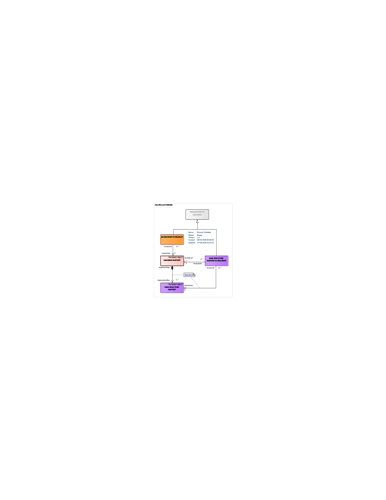 *Élément Validable – Modèle conceptuel*

Note : Quand un ***ValidableElement*** n’a pas vocation à être réutilisé
(uniquement utilisé par un unique FareProduct) alors on le définit
directement dans le FareProduct

<div class='table-title'>ValidableElement – Element</div>

| **Classification** | **Name**                             | **Type**                 | **Cardinality** | **Description**                                                |
|--------------------|--------------------------------------|--------------------------|-----------------|----------------------------------------------------------------|
| ::\>               | ::\>                                 | *<u>PriceableObject</u>* | ::\>            | VALIDABLE ELEMENT hérite de PRICEABLE OBJECT***.***            |
| « PK »             | ***id***                             | *ValidableElementIdType* | 1:1             | Identifiant du VALIDABLE ELEMENT.                              |
| XGRP               | ***ValidableElementStructureGroup*** | ***<u>xmlGroup</u>***    | 1:1             | Éléments structurels constituant le VALIDABLE ELEMENT.         |
| XGRP               | ***ValidableElementProductGroup***   | ***<u>xmlGroup</u>***    | 1:1             | Éléments relatifs au produit constituant le VALIDABLE ELEMENT. |

<div class='table-title'>ValidableElementStructureGroup – Group</div>

| **Classification** | **Name**                    | **Type**                                | **Cardinality** | **Description**                                                       |
|--------------------|-----------------------------|-----------------------------------------|-----------------|-----------------------------------------------------------------------|
| « cntd »           | ***fareStructureElements*** | *<u>FareStructureElement</u>*           | 0:\*            | FARE STRUCTURE ELEMENTs constituant le VALIDABLE ELEMENT.             |
| « cntd »           | ***elementsInSequence***    | *<u>FareStructureElementInSequence</u>* | 0:\*            | FARE STRUCTURE ELEMENTs IN SEQUENCE constituant le VALIDABLE ELEMENT. |

<div class='table-title'>ValidableElementProductGroup – Group</div>

<table>
<thead>
<tr class="header">
<th><strong>Classification</strong></th>
<th><strong>Name</strong></th>
<th><strong>Type</strong></th>
<th><strong>Cardinality</strong></th>
<th><strong>Description</strong></th>
</tr>
</thead>
<tbody>
<tr class="odd">
<td>« cntd »</td>
<td><em><strong>discountRights</strong></em></td>
<td><em>FareProductRef+</em></td>
<td>0:*</td>
<td><p>Droits à remise faisant parti du VALIDABLE ELEMENT.</p>
<p><mark>Note : utilisé uniquement pour consommation simultanée d’un
titre ouvrant droit à réduction</mark></p></td>
</tr>
<tr class="even">
<td>« cntd »</td>
<td><em><strong>thirdPartyProducts</strong></em></td>
<td><em>ThirdPartyProductRef</em></td>
<td>0:*</td>
<td>THIRD PARTY PRODUCTs lié au VALIDABLE ELEMENT.</td>
</tr>
<tr class="odd">
<td>« cntd »</td>
<td><em><strong>validityParameterAssignments</strong></em></td>
<td><em><u>ValidityParameterAssignment</u></em></td>
<td>0:*</td>
<td>VALIDITY PARAMETER ASSIGNMENTs liés au VALIDABLE ELEMENT.</td>
</tr>
</tbody>
</table>

### Exemple

``` xml
<ValidableElement id="FR-Tarif-Example:ValidableElement:001:LOC" version="any">
  <noticeAssignments>
    <NoticeAssignment id="FR-Tarif-Example:NoticeAssignment:001:LOC" version="any" order="1">
      <NoticeRef ref="FR-Tarif-Example:Notice:001:LOC"/>
    </NoticeAssignment>
  </noticeAssignments>
  <fareStructureElements>
    <FareStructureElementRef ref="FR-Tarif-Example:FareStructureElement:001:LOC" version="any"/>
  </fareStructureElements>
</ValidableElement>
```

## Les Éléments Contrôlables (ControllableElement)

<span class="red">**UNIQUEMENT UTILE SI L’ALIMENTATION D’UN SYSTÈME
BILLETTIQUE EST ENVISAGEE !**</span>

<span class="mark">Note : l’ÉLÉMENT CONTRÔLABLE n’est à utiliser que
dans les contexte de l’alimentation d’un système billettique (de façon à
lui préciser les élément effectivement à contrôler)</span>

La définition d'un système tarifaire comprend toujours un niveau de base
de droits d'accès, pour lequel les paramètres de validité contrôlés
restent les mêmes et sont constamment valables. Un ELEMENT CONTROLLABLE
est défini comme le plus petit élément de service :

- dont la consommation réelle peut être contrôlée, au moyen de contrôles
  réguliers ou occasionnels ;

- tout au long duquel tout paramètre contrôlé reste valide.

Un ÉLÉMENT CONTRÔLABLE est le composant de base de toute combinaison de
droits d'accès incluse dans un produit tarifaire.

Trois principaux types d'ÉLÉMENTS CONTRÔLABLES se retrouvent dans les
transports publics :

- La montée dans un véhicule, par exemple dans des bus, des tramways ou
  d'autres systèmes « ouverts ». Un trajet d'un POINT D'ARRÊT PLANIFIÉ à
  un autre, au cours d'une COURSE, peut représenter un tel ÉLÉMENT
  CONTRÔLABLE ;

- Les voyages, composés de séquences de segments et de correspondances,
  par exemple dans des systèmes fermés comme le métro avec des
  tourniquets d'entrée / sortie. Dans un tel cas, les échanges sont
  autorisés au sein du même ÉLÉMENT CONTRÔLABLE et ne sont pas
  contrôlés ;

- L’accès aux services communs (par ex. parking, salon, etc.), le cas
  échéant.

Dans les situations complexes, des ÉLÉMENTS CONTRÔLABLES plus détaillés
sont définis. Par exemple, si une ligne de train utilise une voie
composée de deux tronçons, chacun exploité par un opérateur différent,
un seul trajet sur cette ligne sera composé de deux ÉLÉMENTS
CONTRÔLABLES, distingués par le paramètre OPÉRATEUR.

Les paramètres de validité peuvent être associés à un ÉLÉMENT
CONTRÔLABLE, soit :

- au début de l'élément, contrôlé par un contrôle d'entrée ; par exemple,
  la consommation doit commencer à un POINT D'ARRÊT PLANIFIÉ donné ;

- à la fin de l'élément, contrôlé par un contrôle de sortie ; par
  exemple, la consommation ne doit pas se terminer après 16 heures ;

- tout au long de l'élément (paramètre « en route »), éventuellement
  contrôlé par tout contrôle d'entrée, de sortie ou en route ; par
  exemple, la consommation doit avoir lieu sur la ligne 18.

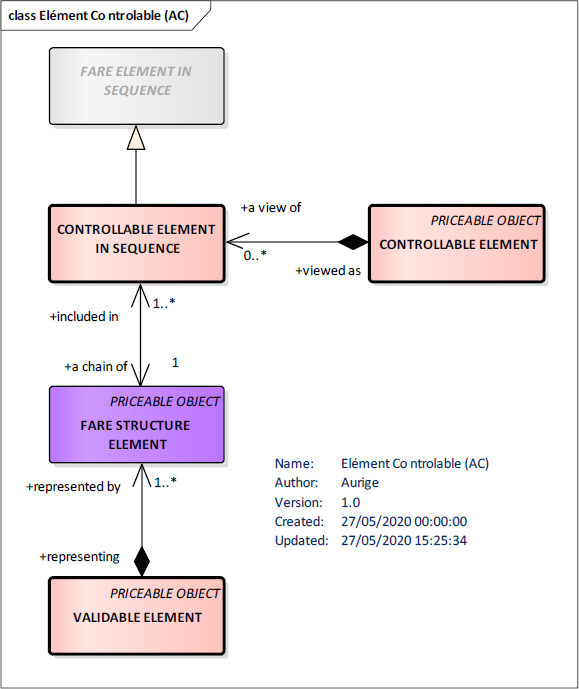 *Élément contrôlable – Modèle conceptuel*

Note : l’association avec les ÉLÉMENTS DE STRUCTURE TARIFAIRE se fait
via les ***FareStructureComponentGroup***

<div class='table-title'>ControllableElement – Element</div>

| **Classification** | **Name**                              | **Type**                                  | **Cardinality** | **Description**                                                     |
|--------------------|---------------------------------------|-------------------------------------------|-----------------|---------------------------------------------------------------------|
| ::\>               | ::\>                                  | *<u>PriceableObject</u>*                  | ::\>            | CONTROLLABLE ELEMENT hérite de PRICEABLE OBJECT***.***              |
| « PK »             | ***id***                              | *ControllableElementIdType*               | 1:1             | Identifiant du CONTROLLABLE ELEMENT.                                |
| « cntd »           | ***accessRightParameterAssignments*** | *<u>AccessRightParameter-Assignment+</u>* | 0:\*            | ACCESS RIGHT PARAMETER ASSIGNMENTs associé au CONTROLLABLE ELEMENT. |
| « cntd »           | ***controllableElementsInSequence***  | *<u>ControllableElementInSequence</u>*    | 0:\*            | CONTROLLABLE ELEMENTs IN SEQUENCE associé au CONTROLLABLE ELEMENT.  |

## Les Produits Tarifaires (FareProduct)

Le PRODUIT TARIFAIRE décrit un ensemble de fonctionnalités (droits
d'accès, droits de remise, etc.), spécifiques à un MOMENT DE PAIMENT
(pré-paiement, post-paiement…).

Un PRODUIT TARIFAIRE est un élément commercialisable immatériel (il
donne des droits) mis à la disposition du public. Il peut être acheté et
permet au propriétaire d’utiliser les transports en commun ou d'autres
services à des conditions spécifiques. Il peut s'agir de droits d'accès
spécifiés (PRODUIT TARIFAIRE PRÉDÉFINI) ou d'autres produits (remises,
montant d'unité de prix, etc.).

Un PRODUIT TARIFARE bien qu’immatériel, peut être matérialisé sur différents
DOCUMENTS DE VOYAGE. Par exemple, un PRODUIT TARIFAIRE « passe
mensuelle » peut être incorporé de différentes manières sur un billet
papier spécifique ou stocké sur une carte électronique.

Le fait que les PRODUITs TARIFAIREs se distinguent en fonction du MOMENT
DE PAIEMENT montre la caractéristique intrinsèque d'un PRODUIT TARIFAIRE ;
ce sont des droits d'accès.

Les exemples classiques de MOMENT DE PAIMENT sont les suivants :

- pré-paiement avec annulation (billets jetables );

- pré-paiement avec débit sur un DOCUMENT DE VOYAGE (carte de valeur) ;

- pré-paiement sans enregistrement de la consommation (pass illimité) ;

- post-paiement (carte électronique avec compte central et débit
  mensuel) ;

- gratuit.

Ces principales catégories peuvent naturellement être subdivisées en
fonction des exigences spécifiques de l'opérateur.

Les PRODUITs TARIFAIREs les plus classiques sont des combinaisons de
droits d'accès spécifiés (ticket unique, ticket hebdomadaire, abonnement
mensuel, etc.). Un tel PRODUIT TARIFAIRE PRÉDÉFINI est décrit comme un
PRODUIT TARIFAIRE composé d'un ou plusieurs ÉLÉMENTS VALIDABLES
spécifiques.

Un même PRODUIT TARIFAIRE peut être utilisé dans une ou plusieurs OFFREs
A LA VENTE (voir plus loin) pour décrire un produit commercialisé que
l'utilisateur peut acheter matérialisé sur un DOCUMENT DE VOYAGE
(ticket, carte, mobile, etc.).

<span class="mark">Note : la plupart de spécialisation de : UN PRODUIT
TARIFAIRE dispose d’un attribut ***ProductType***. Par convention, dans
le cadre du profil si le produit est "*single trip*" et qu’il référence
plusieurs ***ValidableElements***, alors le PRODUIT ne donne la
possibilité que d’utiliser un seul de ces ***ValidableElement*** parmi
la miste proposée. Cela permet de gérer les cas où un produit donne
accès à une droit A **ou** B **ou** C .... On pourra aussi utliser ce
mécanisme pour faire un unique produit O-D, contenant de très nombreuses
O-D, mais avec une seule tarification comme dans le cas du Yield
Management. Pour mémoire, le ***ValidableElement*** peut lui-même être
constitué d’une séquence de ***FareStructureElement***s, ce qui
permettra bien de gérer toutes les situations de droits combinés.</span>

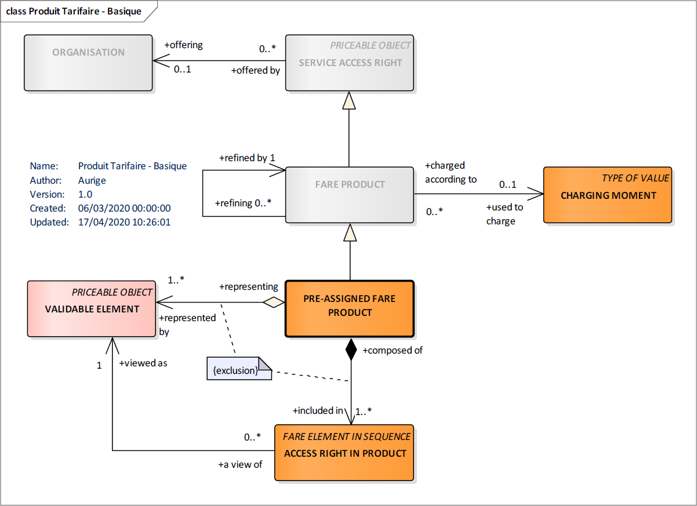 *Produits Tarifaires (vue simplifiée) – Modèle
conceptuel*

<div class='table-title'>ServiceAccessRight – Element</div>

| **Classification** | **Name**            | **Type**                   | **Cardinality** | **Description**                                                                     |
|--------------------|---------------------|----------------------------|-----------------|-------------------------------------------------------------------------------------|
| ::\>               | ::\>                | *<u>PriceableObject</u>*   | ::\>            | SERVICE ACCESS RIGHT hérite de PRICEABLE OBJECT***.***                              |
| « PK »             | ***id***            | *ServiceAccessRightIdType* | 1:1             | Identifiant du SERVICE ACCESS RIGHT.                                                |
| « AK »             | ***PrivateCode***   | *PrivateCodeType*          | 0:1             | Identifiant alternatif; peut être utilisé pour s'associer à des systèmes existants. |
|                    | ***InfoUrl***       | *xsd:anyURI*               | 0:1             | Lien ver les informations sur le produit.                                           |
| « cntd »           | ***documentLinks*** | *<u>InfoLink</u>*          | 0:\*            | InfoLinks pour les documents externes. Pour les PDF, etc.                           |

<div class='table-title'>FareProduct – Element (abstrait)</div>

<table>
<thead>
<tr class="header">
<th><strong>Classification</strong></th>
<th><strong>Name</strong></th>
<th><strong>Type</strong></th>
<th><strong>Cardinality</strong></th>
<th><strong>Description</strong></th>
</tr>
</thead>
<tbody>
<tr class="odd">
<td>::&gt;</td>
<td>::&gt;</td>
<td><em><u>PriceableObject</u></em></td>
<td>::&gt;</td>
<td><p>FARE PRODUCT hérite de SERVICE ACCESS
RIGHT<em><strong>.</strong></em></p>
<p><mark>Note : cet héritage fournit entre autres un attribut
<em><strong>noticeAssignments</strong></em> ; dans le contexte de ce
profil, c’est au niveau des <em><strong>SalesOfferPackage</strong></em>
et <em><strong>FareProducts</strong></em> que l’on placera les
Notices.</mark></p></td>
</tr>
<tr class="even">
<td>« PK »</td>
<td><em><strong>id</strong></em></td>
<td><em>FareProductIdType</em></td>
<td>0:1</td>
<td>Identifiant du FARE PRODUCT.</td>
</tr>
<tr class="odd">
<td>« FK »</td>
<td><em><strong>ChargingMomentRef</strong></em></td>
<td><em>ChargingMomentRef</em></td>
<td>0:1</td>
<td>Référence à CHARGING MOMENT associé au produit.</td>
</tr>
<tr class="even">
<td>« enum »</td>
<td><em><strong>ChargingMomentType</strong></em></td>
<td><em>ChargingMomentTypeEnum</em></td>
<td>0:1</td>
<td><p>Énumération des valeurs normalisées du moment de paiement.</p>
<blockquote>
<p><em>beforeTravel (avant le voyage)</em></p>
<p><em>onStartOfTravel (au départ du voyage)</em></p>
<p><em>beforeEndOfTravel (avant la fin du voyage)</em></p>
<p><em>onStartThenAdjustAtEndOfTravel (au départ avec ajustement à la
fin du voyage)</em></p>
<p><em>onStarThenAdjustAtEndOfFareDay (au départ avec ajustement en fin
de journée)</em></p>
<p><em>onStartThenAdjustAtEndOfChargePeriod (au départ avec ajustement
en fin de période tarifaire)</em></p>
<p><em>atEndOfTravel (à la fin du voyage)</em></p>
<p><em>atEndOfFareDay (à la fin de la journée tarifaire)</em></p>
<p><em>atEndOfChargePeriod (à la fin de la période tarifaire)</em></p>
<p><em>free (gratuit)</em></p>
<p><em>anyTime (à n’importe quel moment)</em></p>
<p><em>other (autre)</em></p>
</blockquote></td>
</tr>
<tr class="odd">
<td>« FK »</td>
<td><em><strong>typesOfFareProductRef</strong></em></td>
<td><em>TypeOfFareProductRef</em></td>
<td>0:*</td>
<td>Classifications du FARE PRODUCT.</td>
</tr>
<tr class="even">
<td>« FK »</td>
<td><em><strong>TransportOrganisationRef</strong></em></td>
<td><em>(TransportOrganisationRef) OperatorRef | AuthorityRef</em></td>
<td>0:1</td>
<td>OPERATOR ou AUTHORITY en charge du FARE PRODUCT.</td>
</tr>
<tr class="odd">
<td>« cntd »</td>
<td><em><strong>ConditionSummary</strong></em></td>
<td><em><u>ConditionSummary</u></em></td>
<td>0:1</td>
<td><p>Résumé des conditions associées au FARE PRODUCT.</p>
<p><mark>Note : dans le cadre du profil, seuls certains attributs des
<em><strong>ConditionSummary</strong></em> sont acceptés pour le
<em><strong>FareProduct</strong></em> (voir description des
<em><strong>ConditionSummary</strong></em> plus haut).</mark></p></td>
</tr>
<tr class="even">
<td>XGRP</td>
<td><em><strong>FareProductValidityGroup</strong></em></td>
<td><em>FareProductRef</em></td>
<td>0:1</td>
<td>Informations de validité relatives au FARE PRODUCT.</td>
</tr>
</tbody>
</table>

<div class='table-title'>FareProductValidityGroup – Group</div>

| **Classification** | **Name**                           | **Type**                         | **Cardinality** | **Description**                                          |
|--------------------|------------------------------------|----------------------------------|-----------------|----------------------------------------------------------|
| « cntd »           | ***validityParameterAssignments*** | *AccessRightParameterAssignment* | 0:\*            | VALIDITY PARAMETER ASSIGNMENTs relatifs au FARE PRODUCT. |
| « cntd »           | ***validableElements***            | *ValidableElement*               | 0:\*            | VALIDABLE ELEMENTs pour le FARE PRODUCT.                 |
| « cntd »           | ***accessRightsInProduct***        | *AccessRightInProduct*           | 0:\*            | ACCESS RIGHTs contenu par le FARE PRODUCT.               |

<div class='table-title'>PreassignedFareProduct – Element</div>

<table>
<thead>
<tr class="header">
<th><strong>Classification</strong></th>
<th><strong>Name</strong></th>
<th><strong>Type</strong></th>
<th><strong>Cardinality</strong></th>
<th><strong>Description</strong></th>
</tr>
</thead>
<tbody>
<tr class="odd">
<td>::&gt;</td>
<td>::&gt;</td>
<td><em><u>FareProduct</u></em></td>
<td>::&gt;</td>
<td>PREASSIGNED FARE PRODUCT hérite de FARE
PRODUCT<em><strong>.</strong></em></td>
</tr>
<tr class="even">
<td>« PK »</td>
<td><em><strong>id</strong></em></td>
<td><em>PreassignedFareProductIdType</em></td>
<td>1:1</td>
<td>Identifiant du PREASSIGNED FARE PRODUCT.</td>
</tr>
<tr class="odd">
<td>« enum »</td>
<td><em><strong>ProductType</strong></em></td>
<td><em>PreassignedFareProductEnum</em></td>
<td>1:1</td>
<td><p>Classification du PREASSIGNED FARE PRODUCT.</p>
<blockquote>
<p><em>singleTrip (trajet unique)</em></p>
<p><em>shortTrip (trajet court)</em></p>
<p><em>timeLimitedSingleTrip (trajet unique à durée limitée)</em></p>
<p><em>dayReturnTrip (aller-retour dans la journée)</em></p>
<p><em>periodReturnTrip (aller-retour sur période fixe)</em></p>
<p><em>multistepTrip (trajet à étapes)</em></p>
<p><em>dayPass (passe journalier)</em></p>
<p><em>periodPass (abonnement pour une période)</em></p>
<p><em>supplement (supplément)</em></p>
<p><em>other (autre)</em></p>
</blockquote></td>
</tr>
</tbody>
</table>

<div class='table-title'>ChargingMoment – Element</div>

| **Classification** | **Name** | **Type**               | **Cardinality** | **Description**                                  |
|--------------------|----------|------------------------|-----------------|--------------------------------------------------|
| ::\>               | ::\>     | *<u>TypeOfValue</u>*   | ::\>            | TYPE OF CHARGING MOMENT hérite de TYPE OF VALUE. |
| « PK »             | ***id*** | *ChargingMomentIdType* | 1:1             | Identifiant du TYPE OF CHARGING MOMENT.          |

Les quatre principaux types de PRODUITS TARIFAIRES sont les suivants :

- Le PRODUIT TARIFAIRE PRÉDÉFINI est une combinaison commercialisable
  d'ÉLÉMENTS VALIDABLES spécifiés. Il s'agit du PRODUIT TARIFAIRE le
  plus courant dans les transports publics (matérialisé par exemple sous
  forme de ticket unique, d'abonnement mensuel, etc.) ;

- Le AMOUNT OF PRICE UNIT, qui correspond à une porte-monnaie d’unités
  transport, est un PRODUIT TARIFAIRE exprimé par un nombre spécifié
  d'UNITÉS DE PRIX (unité monétaire, jeton, trajet, etc.). Il n'est
  généralement pas pré-assigné, ce qui signifie qu'il donne le droit de
  consommer n'importe quel ELEMENT VALIDABLE d'une liste spécifiée. Dans
  certains cas, les billets simples doivent être considérés comme
  « unité transport », lorsqu'il est nécessaire de poinçonner un nombre
  variable de billets en fonction de la nature ou la durée du voyage
  effectué ;

- Le DROIT A REMISE est un PRODUIT TARIFAIRE permettant à son titulaire
  de bénéficier de remises lors de l'achat d’OFFRES A LA VENTE
  spécifiques. Les compagnies de train, par exemple, proposent
  généralement de telles réductions (par exemple, une carte de réduction
  de 30%) ;

- Le DROIT A REMISE A L’USAGE est un PRODUIT TARIFAIRE permettant à son
  titulaire de bénéficier de remises lors de la consommation des ELEMENT
  VALIDABLEs spécifiés, et ce en fonction de l’usage qu’il fait des
  services de transport (c’est typiquement le principe des « Miles »,
  cartes voyageur, etc.).

Deux autres types de PRODUITs TARIFAIREs existent également :

- REMISE PAR PLAFONNEMENT un affinement du droit de remise utilisé pour
  les tarifs électroniques avancés de paiement à la consommation, où une
  fois qu'un certaine niveau d’usage a été atteint, un plafond (tel que
  spécifié par une ou plusieurs RÈGLES DE PLAFONNEMENT) est appliqué,
  par exemple en limitant l'utilisation quotidienne a coût d'un passe
  journalier.

- PRODUIT SUPPLÉMENTAIRE : Un produit accessoire, tel qu'un surclassement
  de siège ou un repas, qui ne peut être acheté qu'en complément d'un
  autre produit.

En outre, deux autres types de « produits » non liés au voyage peuvent
être déclarés et référencés :

- un PRODUIT OUVRANT DES DROITS peut également être utilisé pour
  représenter des qualifications non liées au transport telles que des
  cartes d'invalidité, des cartes militaires ou des laissez-passer de
  retraités qui sont des conditions préalables à l'achat ou à la
  consommation de produits de voyage.

- un PRODUIT TIERS : UN PRODUIT TARIFAIRE qui est commercialisé avec un
  PRODUIT TARIFAIRE pour les transports publics mais qui n’y est pas lié
  (un accès à un salon, un abonnement sportif, etc.).

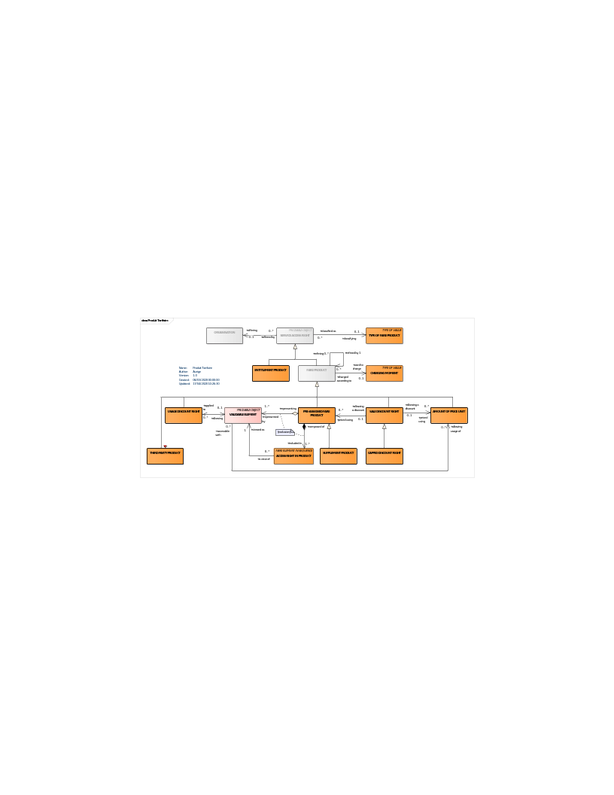 *Produits Tarifaires – Modèle conceptuel*

Le DROIT A REDUCTION (SALE DISCOUNT RIGHT) est un PRODUIT TARIFAIRE
(FARE PRODUCT) qui permet à son porteur de bénéficier d’une déduction
lors de l’achat d’OFFREs A LA VENTE (SALES OFFER PACKAGE) particulières.
Une carte de réduction ouvrant droit à une rabais de 25% sur les trajets
en train d’une compagnie ferroviaire en est un exemple relativement
classique.

<div class='table-title'>SaleDiscountRight – Element</div>

<table>
<thead>
<tr class="header">
<th><strong>Classification</strong></th>
<th><strong>Name</strong></th>
<th><strong>Type</strong></th>
<th><strong>Cardinality</strong></th>
<th><strong>Description</strong></th>
</tr>
</thead>
<tbody>
<tr class="odd">
<td>::&gt;</td>
<td>::&gt;</td>
<td><em><u>FareProduct</u></em></td>
<td>::&gt;</td>
<td>SALE DISCOUNT RIGHT hérite de FARE PRODUCT.</td>
</tr>
<tr class="even">
<td>« PK »</td>
<td><em><strong>id</strong></em></td>
<td><em>SaleDiscountRightIdType</em></td>
<td>1:1</td>
<td>Identifiant du SALE DISCOUNT RIGHT.</td>
</tr>
<tr class="odd">
<td>« enum »</td>
<td><em><strong>ProductType</strong></em></td>
<td><em>SaleDiscountRightEnum</em></td>
<td>1:1</td>
<td><p>Classification du SALE DISCOUNT RIGHT.</p>
<blockquote>
<p><em>travelCard (carte voyageur)</em></p>
<p><em>payAsYouGoRight (paiement au fur et à mesure)</em></p>
<p><em>statutoryRight (droit statutaire)</em></p>
<p><em>other (autre)</em></p>
</blockquote></td>
</tr>
</tbody>
</table>

La REDUCTION PAR PLAFONNEMENT (CAPPED DISCOUNT RIGHT) est un raffinement
du DROIT A REDUCTION utilisé pour les tarifications de type
« pay-as-you-go », où une fois qu'un certain niveau de consommation a
été atteint dans un intervalle de temp donné, un plafond (tel que
spécifié par une ou plusieurs RÈGLES DE PLAFONNEMENT) est appliqué, par
exemple en limitant le coût, pour toute utilisation au cours d’une même
journée, au prix d'un passe journalier.

<div class='table-title'>CappedDiscountRight – Element</div>

| **Classification** | **Name**           | **Type**                    | **Cardinality** | **Description**                                                  |
|--------------------|--------------------|-----------------------------|-----------------|------------------------------------------------------------------|
| ::\>               | ::\>               | *<u>SaleDiscountRight</u>*  | ::\>            | CAPPED DISCOUNT RIGHT hérite de SALE DISCOUNT RIGHT***.***       |
| « PK »             | ***id***           | *CappedDiscountRightIdType* | 1:1             | Identifiant du CAPPED DISCOUNT RIGHT.                            |
| « cntd »           | ***cappingRules*** | *<u>CappingRule</u>*        | 0:\*            | Un ensemble de paramètres fixant un prix plafond sur un produit. |

<div class='table-title'>CappingRule – Element</div>

<table>
<thead>
<tr class="header">
<th><strong>Classification</strong></th>
<th><strong>Name</strong></th>
<th><strong>Type</strong></th>
<th><strong>Cardinality</strong></th>
<th><strong>Description</strong></th>
</tr>
</thead>
<tbody>
<tr class="odd">
<td>::&gt;</td>
<td>::&gt;</td>
<td><em><u>PriceableObject</u></em></td>
<td>::&gt;</td>
<td>CAPPING RULE hérite de PRICEABLE OBJECT.</td>
</tr>
<tr class="even">
<td>« PK »</td>
<td><em><strong>id</strong></em></td>
<td><em>CappingRuleIdType</em></td>
<td>1:1</td>
<td>Identifiant du CAPPING RULE.</td>
</tr>
<tr class="odd">
<td>« cntd »</td>
<td><em><strong>MaximumDistance</strong></em></td>
<td><em>LengthType</em></td>
<td>0:*</td>
<td>Plafonnement de la distance de si la limite est basée sur la
distance.</td>
</tr>
<tr class="even">
<td>« enum »</td>
<td><em><strong>CappingPeriod</strong></em></td>
<td><em>CappingPeriodEnum</em></td>
<td>0:1</td>
<td><p>Période pendant laquelle le plafonnement s'applique, par ex. du
quotidien. Voir les valeurs autorisées ci-dessous. Une valeur
quantitative peut être définie avec une USAGE VALIDITY PERIOD, ainsi
qu'une définition plus détaillée des heures de début et de fin.</p>
<blockquote>
<p><em>Day (jour)</em></p>
<p><em>Week (semaine)</em></p>
<p><em>Month (mois)</em></p>
<p><em>None (rien)</em></p>
</blockquote></td>
</tr>
<tr class="odd">
<td>« FK »</td>
<td><em><strong>PreassignedFareProductRef</strong></em></td>
<td><em>PreassignedFareProductRef</em></td>
<td>0:1</td>
<td>PREASSIGNED FARE PRODUCT dont les prix plafonnent le prix pour ce
produit.</td>
</tr>
<tr class="even">
<td>« cntd »</td>
<td><em><strong>validityParameterAssignments</strong></em></td>
<td><em><u>ValidityParameterAssignment+</u></em></td>
<td>0:*</td>
<td>VALIDITY PARAMETER ASSIGNMENTS pour cette règle.</td>
</tr>
</tbody>
</table>

Un SUPPLÉMENT (SUPPLEMENT PRODUCT) et un produit accessoire, tel qu'un
surclassement de classe de siège ou un repas, qui ne peut être acheté
qu'en plus d'un autre produit.

<div class='table-title'>SupplementProduct – Element</div>

<table>
<thead>
<tr class="header">
<th><strong>Classification</strong></th>
<th colspan="2"><strong>Name</strong></th>
<th><strong>Type</strong></th>
<th><strong>Cardinality</strong></th>
<th><strong>Description</strong></th>
</tr>
</thead>
<tbody>
<tr class="odd">
<td>::&gt;</td>
<td colspan="2">::&gt;</td>
<td><em><u>PreassignedFareProduct</u></em></td>
<td>::&gt;</td>
<td>SUPPLEMENT PRODUCT hérite de PREASSIGNED FARE PRODUCT.</td>
</tr>
<tr class="even">
<td>« PK »</td>
<td colspan="2"><em><strong>id</strong></em></td>
<td><em>SupplementProductIdType</em></td>
<td>1:1</td>
<td>Identifiant du SUPPLEMENT PRODUCT.</td>
</tr>
<tr class="odd">
<td>« enum »</td>
<td colspan="2"><em><strong>SupplementProductType</strong></em></td>
<td><em>SupplementProductTypeEnum</em></td>
<td>0:1</td>
<td><p>Classification du SUPPLEMENT PRODUCT.</p>
<blockquote>
<p><em>seatReservation (réservation de place assise)</em></p>
<p><em>bicycle (vélo)</em></p>
<p><em>dog (chien)</em></p>
<p><em>animal (animal)</em></p>
<p><em>meal (repas)</em></p>
<p><em>wifi (wifi)</em></p>
<p><em>extraLuggage (bagage additionnel)</em></p>
<p><em>penalty (amende)</em></p>
<p><em>upgrade (sur classement)</em></p>
<p><em>journeyExtension (extension de trajet)</em></p>
<p><em>journeyAddOn (trajet additionel)</em></p>
<p><em>eventAddOn (évènement additionel)</em></p>
<p><em>parking (parking)</em></p>
<p><em>topUp (rechargement)</em></p>
<p><em>other (autre)</em></p>
</blockquote></td>
</tr>
<tr class="even">
<td></td>
<td colspan="2"><em><strong>Choice</strong></em></td>
<td colspan="3"></td>
</tr>
<tr class="odd">
<td>« FK »</td>
<td><em>a</em></td>
<td><em><strong>SupplementToFareProductRef</strong></em></td>
<td><em>FareProductRef+</em></td>
<td>0:1</td>
<td>Référence au PRE ASSIGNED FARE PRODUCT OFFER pour lequel ceci est un
supplément.</td>
</tr>
</tbody>
</table>

La REDUCTION A L’USAGE (USAGE DISCOUNT RIGHT) est un PRODUIT TARIFAIRE
permettant à son titulaire de bénéficier de remises basées sur sa
consommation de titres de transport. Par exemple, un tel produit peut
accorder à son détenteur une réduction pour un parking relai (« park and
ride »), alors que le stationnement ou les trajets en transport en
commun consommés seuls sont facturés au tarif normal. Le principe des
« miles » accumulés, classiquement utilisés dans les transports longue
distance, et aussi un exemple classique de REDUCTION A L’USAGE. Ce type
de remise est particulièrement utilisé avec les méthodes post-paiement.

<div class='table-title'>UsageDiscountRight – Element</div>

<table>
<thead>
<tr class="header">
<th><strong>Classification</strong></th>
<th><strong>Name</strong></th>
<th><strong>Type</strong></th>
<th><strong>Cardinality</strong></th>
<th><strong>Description</strong></th>
</tr>
</thead>
<tbody>
<tr class="odd">
<td>::&gt;</td>
<td>::&gt;</td>
<td><em><u>FareProduct</u></em></td>
<td>::&gt;</td>
<td>USAGE DISCOUNT RIGHT hérite de FARE PRODUCT.</td>
</tr>
<tr class="even">
<td>« PK »</td>
<td><em><strong>id</strong></em></td>
<td><em>UsageDiscounRightIdType</em></td>
<td>1:1</td>
<td>Identifiant du USAGE DISCOUNT RIGHT.</td>
</tr>
<tr class="odd">
<td>« enum »</td>
<td><em><strong>ProductType</strong></em></td>
<td><em>UsageDiscountRightEnum</em></td>
<td>1:1</td>
<td><p>Classification du USAGE DISCOUNT RIGHT.</p>
<blockquote>
<p><em>mileagePoints (miles)</em></p>
<p><em>usageRebate (rabais à l’usage)</em></p>
<p><em>other (autre)</em></p>
</blockquote></td>
</tr>
</tbody>
</table>

Le MONTANT D’UNITÉS TARIFAIRE (AMOUNT OF PRICE UNIT PRODUCT) est un
PRODUIT TARIFAIRE constitué d'une valeur stockée d'UNITÉS TARIFAIRE: une
somme d'argent sur un porte-monnaie électronique, une quantité d'unités
transport sur une carte, etc.

<div class='table-title'>AmountOfPriceUnitProduct – Element</div>

<table>
<thead>
<tr class="header">
<th><strong>Classification</strong></th>
<th><strong>Name</strong></th>
<th><strong>Type</strong></th>
<th><strong>Cardinality</strong></th>
<th><strong>Description</strong></th>
</tr>
</thead>
<tbody>
<tr class="odd">
<td>::&gt;</td>
<td>::&gt;</td>
<td><em><u>FareProduct</u></em></td>
<td>::&gt;</td>
<td>AMOUNT OF PRICE UNIT hérite de FARE PRODUCT.</td>
</tr>
<tr class="even">
<td>« PK »</td>
<td><em><strong>id</strong></em></td>
<td><em>AmountOfPriceUnitIdType</em></td>
<td>1:1</td>
<td>Identifiant du AMOUNT OF PRICE UNIT.</td>
</tr>
<tr class="odd">
<td>« enum »</td>
<td><em><strong>ProductType</strong></em></td>
<td><em>AmountOfPriceUnitEnum</em></td>
<td>1:1</td>
<td><p>Classification du AMOUNT OF PRICE UNIT.</p>
<blockquote>
<p><em>tripCarnet (carnet)</em></p>
<p><em>passCarnet (carnet de passes)</em></p>
<p><em>unitCoupon (coupon unitaire)</em></p>
<p><em>storedValue (valeur)</em></p>
<p><em>other (autre)</em></p>
</blockquote></td>
</tr>
<tr class="even">
<td>« FK »</td>
<td><em><strong>PriceUnitRef</strong></em></td>
<td><em>PriceUnitRef</em></td>
<td>0:1</td>
<td>Référence à un PRICE UNIT.</td>
</tr>
<tr class="odd">
<td></td>
<td><em><strong>Amount</strong></em></td>
<td><em>xsd:decimal</em></td>
<td>0:1</td>
<td>Nombre d’unités.</td>
</tr>
</tbody>
</table>

Un PRODUIT TIERS (Third Party Product) est un PRODUIT TARIFAIRE
commercialisé avec un PRODUIT TARIFAIRE pour les transports publics mais
produit par une autre organisation, non liée au transport public. Ce
produit ne sera naturellement pas entièrement décrit par les systèmes de
transport. On peut, titre d’exemple, citer un titre de transport associé
à un évènement (exposition, salon, évènement sportif).

<div class='table-title'>ThirdPartyProduct – Element</div>

| **Classification** | **Name** |                                                                | **Type**                                                   | **Cardinality**                    | **Description**                                                                                       |
|--------------------|----------|----------------------------------------------------------------|------------------------------------------------------------|------------------------------------|-------------------------------------------------------------------------------------------------------|
| ::\>               | ::\>     |                                                                | *<u>FareProduct</u>*                                       | ::\>                               | THIRD PARTY PRODUCT hérite de FARE PRODUCT.                                                           |
| « PK »             | ***id*** |                                                                | *ThirdPartyProductIdType*                                  | 1:1                                | Identifiant du THIRD PARTY PRODUCT.                                                                   |
|                    |          |                                                                | CHOICE                                                     |                                    |                                                                                                       |
| « cntd »           | ***a***  | ***GeneralGroupOfEntities***                                   | *<u>GeneralGroupOfEntities</u>*                            | 0:1                                | GENERAL GROUP OF ENTITIES associé au THIRD PARTY PRODUCT.                                             |
| « cntd »           | ***a***  | ***<span class="mark-blue">GeneralGroupOfEntitiesRef</span>*** | *<span class="mark-blue">GeneralGroupOfEntitiesRef</span>* | <span class="mark-blue">0:1</span> | <span class="mark-blue">Référence à GENERAL GROUP OF ENTITIES associé au Third PARTY product.</span> |

### Résumé Des Conditions Tarifaires 

Un RÉSUMÉ DES CONDITIONS TARIFAIRES (CONDITION SUMMARY) peut être
utilisé pour fournir une description synthétique d'un produit à des fins
de comparaison et d'information des voyageurs. Le résumé indique
généralement simplement l'existence d'une condition - les conditions
réelles elles-mêmes sont décrites plus exactement par les CONDITIONS
D’UTILISATION, les AFFECTATIONS DE DROITS D'ACCÈS et d'autres éléments.
Le résumé peut inclure des informations sur :

- Les exigences concernant les cartes liées au produit.

- Les conditions commerciales de remboursement, d'échange, etc.

- Conditions limitant les temps de parcours, les itinéraires, etc.

- Conditions relatives aux droits.

- Conditions affectant la réservation.

La figure suivante montre le modèle physique du RÉSUMÉ DES CONDITIONS
TARIFAIRES.

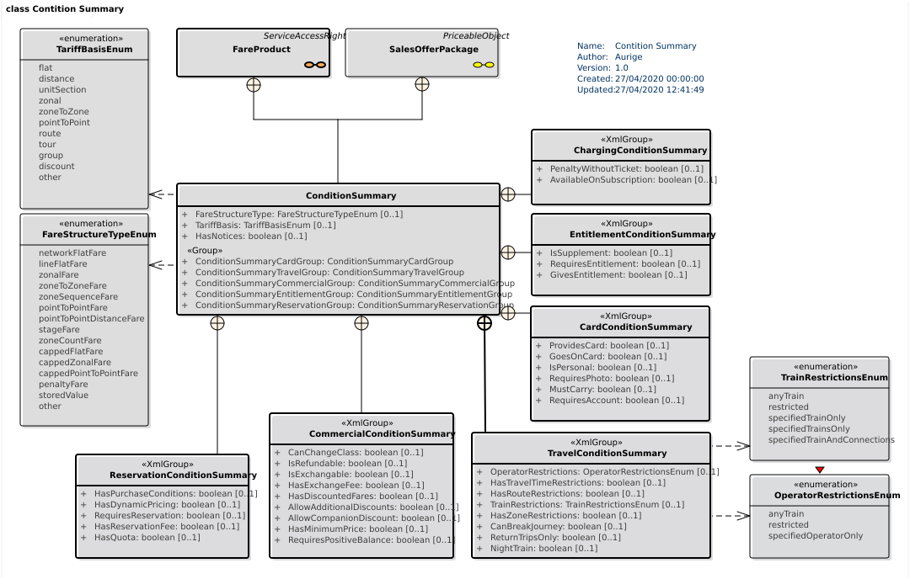 *Résume des conditions – Modèle physique*

<span class="mark">Note : les attributs du ***ConditionSummary*** sont
spécialisés par le profil NeTEx Tarif France</span>. Ainsi certains sont
uniquement destinés à être utilisés par les PRODUITs TARIFAIREs (Fare
Product) et d’autres sont réservés aux OFFREs À LA VENTE
(SalesPackageOffer). Cette restriction et ce systématisme ont pour
vocation de simplifier l’usage d’un profil (placer une information donnée
à un endroit unique quand cela est possible). Une colonne précisant
**<span class="mark">PT</span>** (PRODUITs TARIFAIRE) ou
**<span class="mark">OalV</span>** (OFFRE À LA VENTE) a été ajoutée pour
préciser cette affectation (s’il n’y a pas de précision, l’attribut
reste utilisable dans les deux cas)*.*

<div class='table-title'>ConditionSummary – Element</div>

<table>
<thead>
<tr class="header">
<th><strong>Classification</strong></th>
<th><strong>Name</strong></th>
<th><strong>Type</strong></th>
<th><strong>Cardinality</strong></th>
<th><strong>Description</strong></th>
<th></th>
</tr>
</thead>
<tbody>
<tr class="odd">
<td>« enum »</td>
<td><em><strong>FareStructureType</strong></em></td>
<td><em>FareStructureTypeEnum</em></td>
<td>1:1</td>
<td><p>Classification de la structure tarifaire.</p>
<blockquote>
<p><em>networkFlatFare (constant sur le réseau)</em></p>
<p><em>lineFlatFare (constant par ligne)</em></p>
<p><em>zonalFare (constant par zone)</em></p>
<p><em>zoneToZoneFare (zone à zone)</em></p>
<p><em>zoneSequenceFare (sequence de zones)</em></p>
<p><em>cappedFlatFare (constant plafonné)</em></p>
<p><em>cappedPointToPointFare (point à point plafonné)</em></p>
<p><em>cappedZonalFare (zonal plafoné)</em></p>
<p><em>pointToPointFare (point à point)</em></p>
<p><em>pointToPointDistanceFare (tarification à la distance)</em></p>
<p><em>stageFare (tarification par étapes)</em></p>
<p><em>penaltyFare (amende)</em></p>
<p><em>other (autre)</em></p>
</blockquote></td>
<td><strong><mark>PT</mark></strong></td>
</tr>
<tr class="even">
<td>« enum »</td>
<td><em><strong>TariffBasis</strong></em></td>
<td><em>TariffBasisEnum</em></td>
<td>0:1</td>
<td><p>Base pour la tarification.</p>
<blockquote>
<p><em>Flat (constant)</em></p>
<p><em>Distance (distance)</em></p>
<p><em>unitSection (section)</em></p>
<p><em>zone (zonal)</em></p>
<p><em>zoneToZone (zone à zone)</em></p>
<p><em>pointToPoint (point à point)</em></p>
<p><em>route (itinéraire)</em></p>
<p><em>tour (tour)</em></p>
<p><em>group (group)</em></p>
<p><em>discount (rabais)</em></p>
<p><em>period (période)</em></p>
<p><em>free (gratuit)</em></p>
<p><em>other (autre)</em></p>
</blockquote></td>
<td><strong><mark>PT</mark></strong></td>
</tr>
<tr class="odd">
<td></td>
<td><em><strong>HasNotices</strong></em></td>
<td><em>xsd:boolean</em></td>
<td>0:1</td>
<td><p>Indique si une NOTICE est associée au produit.</p>
<p><mark>Note : la NOTICE doit systématiquement être affichée en contexte
d’information voyageur</mark></p></td>
<td></td>
</tr>
<tr class="even">
<td>XGRP</td>
<td><em><strong>ConditionSummaryCardGroup</strong></em></td>
<td><em>xmlGroup</em></td>
<td>1:1</td>
<td>Éléments relatif aux cartes de paiement dans le CONDITION
SUMMARY.</td>
<td></td>
</tr>
<tr class="odd">
<td>XGRP</td>
<td><em><strong>ConditionSummaryEntitlementGroup</strong></em></td>
<td><em>xmlGroup</em></td>
<td>1:1</td>
<td>Éléments relatif aux droits ouverts dans le CONDITION SUMMARY.</td>
<td></td>
</tr>
<tr class="even">
<td>XGRP</td>
<td><em><strong>ConditionSummaryTravelGroup</strong></em></td>
<td><em>xmlGroup</em></td>
<td>1:1</td>
<td>Éléments relatif aux conditions de voyage dans le CONDITION
SUMMARY.</td>
<td></td>
</tr>
<tr class="odd">
<td>XGRP</td>
<td><em><strong>ConditionSummaryCommercialGroup</strong></em></td>
<td><em>xmlGroup</em></td>
<td>1:1</td>
<td>Éléments relatif aux conditions commerciales dans le CONDITION
SUMMARY.</td>
<td></td>
</tr>
<tr class="even">
<td>XGRP</td>
<td><em><strong>ConditionSummaryReservationGroup</strong></em></td>
<td><em>xmlGroup</em></td>
<td>1:1</td>
<td>Éléments relatif aux conditions de réservation dans le CONDITION
SUMMARY.</td>
<td></td>
</tr>
<tr class="odd">
<td>XGRP</td>
<td><em><strong>ConditionSummaryChargingGroup</strong></em></td>
<td><em>xmlGroup</em></td>
<td>1:1</td>
<td>Éléments relatif aux conditions de recharge dans le CONDITION
SUMMARY.</td>
<td></td>
</tr>
</tbody>
</table>

<div class='table-title'>ConditionSummaryCardGroup – Group</div>

| **Classification** | **Name**              | **Type**      | **Cardinality** | **Description**                                                                                       |                                    |
|--------------------|-----------------------|---------------|-----------------|-------------------------------------------------------------------------------------------------------|------------------------------------|
|                    | ***ProvidesCard***    | *xsd:boolean* | 0:1             | Indique si une carte est fournie avec le produit.                                                     | **<span class="mark">OalV</span>** |
|                    | ***GoesOnCard***      | *xsd:boolean* | 0:1             | Indique si le produit va sur une carte.                                                               | **<span class="mark">OalV</span>** |
|                    | ***IsPersonal***      | *xsd:boolean* | 0:1             | Indique si que le produit est vendu de manière anonyme ou à une personne identifiée.                  | **<span class="mark">OalV</span>** |
|                    | ***RequiresPhoto***   | *xsd:boolean* | 0:1             | Indique si l'utilisation du produit nécessite la fourniture d'une photo.                              | **<span class="mark">OalV</span>** |
|                    | ***MustCarry***       | *xsd:boolean* | 0:1             | Indique si la carte, le support, doit être transporté lors du déplacement afin d'utiliser le produit. | **<span class="mark">OalV</span>** |
|                    | ***RequiresAccount*** | *xsd:boolean* | 0:1             | Indique si le produit nécessite que l'utilisateur crée un compte pour la facturation.                 | **<span class="mark">OalV</span>** |

<div class='table-title'>ConditionSummaryEntitlementGroup – Group</div>

| **Classification** | **Name**                  | **Type**      | **Cardinality** | **Description**                                                        |                                  |
|--------------------|---------------------------|---------------|-----------------|------------------------------------------------------------------------|----------------------------------|
|                    | ***IsSupplement***        | *xsd:boolean* | 0:1             | Indique si le produit est un complément à un autre produit             | **<span class="mark">PT</span>** |
|                    | ***RequiresEntitlement*** | *xsd:boolean* | 0:1             | Indique si le produit nécessite un droit ouvert par d'autres produits. | **<span class="mark">PT</span>** |
|                    | ***GivesEntitlement***    | *xsd:boolean* | 0:1             | Indique si le produit ouvre des droits à d'autres produits.            | **<span class="mark">PT</span>** |

<div class='table-title'>ConditionSummaryTravelGroup – Group</div>

<table>
<thead>
<tr class="header">
<th><strong>Classification</strong></th>
<th><strong>Name</strong></th>
<th><strong>Type</strong></th>
<th><strong>Cardinality</strong></th>
<th><strong>Description</strong></th>
<th></th>
</tr>
</thead>
<tbody>
<tr class="odd">
<td>« enum »</td>
<td><em><strong>HasOperatorRestrictions</strong></em></td>
<td><em>OperatorRestrictionEnum</em></td>
<td>0:1</td>
<td><p>Limitations quant à l'OPÉRATEUR pouvant être utilisé</p>
<blockquote>
<p><em>anyTrain (n’importe quel train)</em></p>
<p><em>restricted (limité)</em></p>
<p><em>specifiedOperatorOnly (opérateurs spéciaux seulement)</em></p>
</blockquote></td>
<td><strong><mark>PT</mark></strong></td>
</tr>
<tr class="even">
<td></td>
<td><em><strong>HasTravelTimeRestrictions</strong></em></td>
<td><em>xsd:boolean</em></td>
<td>0:1</td>
<td>Indique si des limitations s'appliquent quant au moment où le voyage
peut avoir lieu.</td>
<td><strong><mark>PT</mark></strong></td>
</tr>
<tr class="odd">
<td></td>
<td><em><strong>HasRouteRestrictions</strong></em></td>
<td><em>xsd:boolean</em></td>
<td>0:1</td>
<td>Indique si des limitations s'appliquent à l'itinéraire qui peut être
utilisé.</td>
<td><strong><mark>PT</mark></strong></td>
</tr>
<tr class="even">
<td>« enum »</td>
<td><em><strong>HasTrainRestrictions</strong></em></td>
<td><em>TrainRestrictionEnum</em></td>
<td>0:1</td>
<td><p>Limitations quant aux trains pouvant être utilisés.</p>
<blockquote>
<p><em>anyTrain (n’importe quel train</em></p>
<p><em>restricted (limité)</em></p>
<p><em>specifiedTrainOnly (train unique)</em></p>
<p><em>specifiedTrainsOnly (certains trains)</em></p>
<p><em>specifiedTrainAndConnections (train unique et
correspondances)</em></p>
</blockquote></td>
<td><strong><mark>PT</mark></strong></td>
</tr>
<tr class="odd">
<td></td>
<td><em><strong>HasZoneRestrictions</strong></em></td>
<td><em>xsd:boolean</em></td>
<td>0:1</td>
<td>Indique si des limitations s'appliquent quant à la zone dans
laquelle le voyage peut avoir lieu.</td>
<td><strong><mark>PT</mark></strong></td>
</tr>
<tr class="even">
<td></td>
<td><em><strong>CanBreakJourney</strong></em></td>
<td><em>xsd:boolean</em></td>
<td>0:1</td>
<td>Indique si l'utilisateur est autorisé à interrompre le trajet,
c'est-à-dire à quitter le réseau de transport, à un point intermédiaire,
puis à reprendre son trajet.</td>
<td><strong><mark>PT</mark></strong></td>
</tr>
<tr class="odd">
<td></td>
<td><em><strong>ReturnTripsOnly</strong></em></td>
<td><em>xsd:boolean</em></td>
<td>0:1</td>
<td>Indique si trajet retour doit impérativement être acheté.</td>
<td><strong><mark>PT</mark></strong></td>
</tr>
</tbody>
</table>

<div class='table-title'>ConditionSummaryCommercialGroup – Group</div>

| **Classification** | **Name**                       | **Type**      | **Cardinality** | **Description**                                                                                               |                                    |
|--------------------|--------------------------------|---------------|-----------------|---------------------------------------------------------------------------------------------------------------|------------------------------------|
|                    | ***CanChangeClass***           | *xsd:boolean* | 0:1             | Indique si l'utilisateur peut changer de classe                                                               | **<span class="mark">PT</span>**   |
|                    | ***IsRefundable***             | *xsd:boolean* | 0:1             | Indique si le billet est remboursable                                                                         | **<span class="mark">OalV</span>** |
|                    | ***IsExchangable***            | *xsd:boolean* | 0:1             | Indique si le billet est échangeable                                                                          | **<span class="mark">OalV</span>** |
|                    | ***HasExchangeFee***           | *xsd:boolean* | 0:1             | Indique s'il y a des frais pour les échanges.                                                                 | **<span class="mark">OalV</span>** |
|                    | ***HasDiscountedFares***       | *xsd:boolean* | 0:1             | Indique si les tarifs réduits sont autorisés.                                                                 | **<span class="mark">PT</span>**   |
|                    | ***AllowAdditionalDiscounts*** | *xsd:boolean* | 0:1             | Indique si plusieurs remises peuvent être appliquées, par ex. Enfant + Accompagnateur.                        | **<span class="mark">PT</span>**   |
|                    | ***AllowCompanionDiscount***   | *xsd:boolean* | 0:1             | Indique s'il y a une remise pour les accompagnateur.                                                          | **<span class="mark">PT</span>**   |
|                    | ***HasMinimumPrice***          | *xsd:boolean* | 0:1             | Indique s'il y a un prix minimum lors de la combinaison de remises.                                           | **<span class="mark">PT</span>**   |
|                    | ***RequiresPositiveBalance***  | *xsd:boolean* | 0:1             | Indique si le produit nécessite un solde positif (généralement sur une carte de transport) pour être utilisé. | **<span class="mark">OalV</span>** |

<div class='table-title'>ConditionSummaryReservationGroup – Group</div>

| **Classification** | **Name**                      | **Type**      | **Cardinality** | **Description**                                                                                                          |                                    |
|--------------------|-------------------------------|---------------|-----------------|--------------------------------------------------------------------------------------------------------------------------|------------------------------------|
|                    | ***PenaltyWIthoutTicket***    | *xsd:boolean* | 0:1             | Indique s'il y a une pénalité pour voyager sans billet, c'est-à-dire que les billets ne peuvent pas être achetés à bord. | **<span class="mark">OalV</span>** |
|                    | ***AvailableOnSubscription*** | *xsd:boolean* | 0:1             | Indique si le produit est disponible sur abonnement.                                                                     | **<span class="mark">OalV</span>** |

<div class='table-title'>ConditionSummaryReservationGroup – Group</div>

| **Classification** | **Name**                    | **Type**      | **Cardinality** | **Description**                                                                                                           |                                    |
|--------------------|-----------------------------|---------------|-----------------|---------------------------------------------------------------------------------------------------------------------------|------------------------------------|
|                    | ***HasPurchaseConditions*** | *xsd:boolean* | 0:1             | Indique si les conditions d'achat s'appliquent à la vente du produit, par ex. quand doit être acheté ou qui peut acheter. | **<span class="mark">OalV</span>** |
|                    | ***HasDynamicPricing***     | *xsd:boolean* | 0:1             | Indique si le produit a une tarification dynamique.                                                                       | **<span class="mark">PT</span>**   |
|                    | ***RequiresReservation***   | *xsd:boolean* | 0:1             | Indique si le produit nécessite une réservation.                                                                          | **<span class="mark">OalV</span>** |
|                    | ***HasReservationFee***     | *xsd:boolean* | 0:1             | Indique si la réservation est payante.                                                                                    | **<span class="mark">OalV</span>** |
|                    | ***HasQuota***              | *xsd:boolean* | 0:1             | Indique qu'il y a un quota limité pour l'offre ou qu'elle est vendue en nombre illimité.                                  | **<span class="mark">OalV</span>** |

### Exemple

Exemple 1 (simple)

``` xml
<!-- LE TITRE -->
<PreassignedFareProduct id="FR-Tarif-Example:PreassignedFareProduct:T+001:LOC" version="any">
  <Name>Ticket 1h30</Name>
  <AuthorityRef ref="FR-Tarif-Example:Authority:IDFM:"/>
  <ConditionSummary>
    <TariffBasis>period</TariffBasis>
    <CanBreakJourney>false</CanBreakJourney>
    <IsRefundable>false</IsRefundable>
    <IsExchangable>false</IsExchangable>
  </ConditionSummary>

  <validableElements>
    <ValidableElementRef ref="FR-Tarif-Example:ValidableElement:001:LOC" version="any"/>
  </validableElements>
  <ProductType>singleTrip</ProductType>
</PreassignedFareProduct>
```

Exemple 2

``` xml
<PreassignedFareProduct id="FR-Tarif-Example:PreassignedFareProduct:Paris-Lille-001:LOC" version="any">
  <Name>Paris-Lille</Name> <!--NOTE : OU "billet OD TGV" SI ON FAIT DE LA MUTUALISATION-->
  <noticeAssignments>
    <NoticeAssignment>
      <NoticeRef ref="FR-Tarif-Example:Notice:002:LOC"/>
    </NoticeAssignment>
  </noticeAssignments>
  <ChargingMomentType>beforeTravel</ChargingMomentType>
  <OperatorRef ref="FR-Tarif-Example:Authority:SNCF:"/>
  <ConditionSummary>
    <FareStructureType>pointToPointFare</FareStructureType>
    <TrainRestrictions>specifiedTrainOnly</TrainRestrictions>
    <CanBreakJourney>false</CanBreakJourney>
    <IsRefundable>false</IsRefundable>
    <IsExchangable>false</IsExchangable>
    <HasExchangeFee>true</HasExchangeFee>
    <HasDynamicPricing>true</HasDynamicPricing> <!--YIELD MANANGED-->
    <RequiresReservation>true</RequiresReservation> <!--inclue dans le titre-->
    <HasReservationFee>false</HasReservationFee>
  </ConditionSummary>
  <validityParameterAssignments>
    <GenericParameterAssignment>
      <LimitationGroupingType>AND</LimitationGroupingType>
      <limitations>
        <ReservingRef ref="FR-Tarif-Example:Reserving:001:LOC"/>

        <ExchangingRef ref="FR-Tarif-Example:Exchanging:001:LOC"/>
        <ExchangingRef ref="FR-Tarif-Example:Exchanging:002:LOC"/>
        <ExchangingRef ref="FR-Tarif-Example:Exchanging:003:LOC"/>
        <ExchangingRef ref="FR-Tarif-Example:Exchanging:004:LOC"/>
        <RefundingRef ref="FR-Tarif-Example:Refunding:001:LOC"/>
        <RefundingRef ref="FR-Tarif-Example:Refunding:002:LOC"/>
        <RefundingRef ref="FR-Tarif-Example:Refunding:003:LOC"/>
      </limitations>
      <validityParameters>
        <VehicleModes>rail</VehicleModes>
      </validityParameters>
    </GenericParameterAssignment>
  </validityParameterAssignments>
  <validableElements>
    <ValidableElementRef ref="FR-Tarif-Example:ValidableElement:002:LOC"/>
    <!--etc. VOIR NOTE SUR ProductType -->
    <!--NOTE: On peut aussi définit le VE ici plutôt que de le référencer-->
  </validableElements>
  <ProductType>singleTrip</ProductType> <!--NOTE IMPORTANTE: si le produit est "single trip" alors un seul
de ValidableElement est utilisable, même s'il y a plusieurs VE: cela permet de gérer les cas ou un produit
donne accès à une droit A OU B OU C .... On pourra aussi utliser ce mécanisme pour faire un unique produit
O-D, contenant de très nombreuses O-D, mais avec une seule tarification comme dans le cas du Yield Management
...-->
</PreassignedFareProduct>
```

## Les Offres à la Vente (SalesPackageOffer)

Les PRODUITS TARIFAIREs sont associés à des DOCUMENTS DE VOYAGE afin de
constituer des packages propices à la vente. Une OFFRE A LA VENTE est
définie comme un ensemble, constitué d'un ou plusieurs PRODUITS
TARIFAIREs matérialisés grâce à un ou plusieurs DOCUMENTS DE VOYAGE.

Les PRODUITS TARIFAIREs peuvent être soit directement attachés aux
DOCUMENTS DE VOYAGE (impression, stockage magnétique, etc.), soit
rechargeables sur des DOCUMENTS DE VOYAGE (tels que des porte-monnaies
électroniques ou des laissez-passer).

Dans la plupart des cas, une OFFRE A LA VENTE ne comprendra qu'un seul
PRODUIT TARIFAIRE sur un DOCUMENT DE VOYAGE, mais des combinaisons plus
complexes sont possibles. Elles permettent aussi de proposer des
packages temporaires (par exemple pendant une semaine de promotion) ou
permanents.

Les OFFRE A LA VENTE sont décrites par des ÉLÉMENTS D'OFFRE DE VENTE,
chacun associant un PRODUIT TARIFAIRE spécifique à un TYPE DE DOCUMENT
DE VOYAGE spécifique.

Une OFFRE A LA DE VENTE peut parfois être soumise à des limitations : par
exemple n’être vendu que dans une certaine ZONE D'ARRÊT.

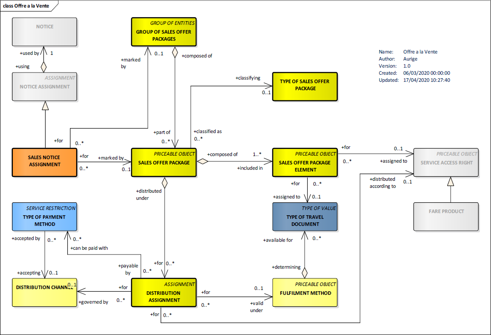 *Offre à la Vente – Modèle conceptuel*

Les tableaux ci-dessous présentent les attributs des OFFRE A LA VENTE
retenus dans le cadre du profil.

<div class='table-title'>SalesOfferPackage – Element</div>

<table>
<thead>
<tr class="header">
<th><strong>Classification</strong></th>
<th><strong>Name</strong></th>
<th><strong>Type</strong></th>
<th><strong>Cardinality</strong></th>
<th><strong>Description</strong></th>
</tr>
</thead>
<tbody>
<tr class="odd">
<td>::&gt;</td>
<td>::&gt;</td>
<td><em>PriceableObject</em></td>
<td>::&gt;</td>
<td><p>SALES OFFER PACKAGE hérite de PRICEABLE
OBJECT<em><strong>.</strong></em></p>
<p><mark>Note : cet héritage fournit entre autres un attribut
<em><strong>noticeAssignments</strong></em> ; dans le contexte de ce
profil, c’est au niveau des <em><strong>SalesOfferPackage</strong></em>
et <em><strong>FareProducts</strong></em> que l’on placera les
Notices.</mark></p></td>
</tr>
<tr class="even">
<td>« PK »</td>
<td><em><strong>id</strong></em></td>
<td><em>SalesOfferPackageIdType</em></td>
<td>1:1</td>
<td>Identifiant du a SALES OFFER PACKAGE.</td>
</tr>
<tr class="odd">
<td>« AK »</td>
<td><em><strong>PrivateCode</strong></em></td>
<td><em>PrivateCodeType</em></td>
<td>0:1</td>
<td>Identifiant alternatif d'une entité. peut être utilisé pour
s'associer à des systèmes existants.</td>
</tr>
<tr class="even">
<td>XGRP</td>
<td><em><strong>SalesOfferPackageCommonGroup</strong></em></td>
<td><em>xmlGroup</em></td>
<td>0:1</td>
<td>Propriétés communes au SALES OFFER PACKAGE et au GROUP OF SALES
OFFER PACKAGEs.</td>
</tr>
</tbody>
</table>

<div class='table-title'>SalesOfferPackageCommonGroup – Element</div>

<table>
<thead>
<tr class="header">
<th><strong>Classification</strong></th>
<th><strong>Name</strong></th>
<th><strong>Type</strong></th>
<th><strong>Cardinality</strong></th>
<th><strong>Description</strong></th>
</tr>
</thead>
<tbody>
<tr class="odd">
<td>« FK »</td>
<td><em><strong>TypeOfSalesOfferPackageRef</strong></em></td>
<td><em>TypeOfSalesOfferPackageRef</em></td>
<td>0:1</td>
<td>Type of SALES OFFER PACKAGE.</td>
</tr>
<tr class="even">
<td>« cntd »</td>
<td><em><strong>ConditionSummary</strong></em></td>
<td><em><u>ConditionSummary</u></em></td>
<td>0:1</td>
<td><p>Description synthétique des conditions d'une OFFRE A LA VENTE
pouvant être utilisée pour fournir des informations aux passagers.</p>
<p><mark>Note : dans le cadre du profil, seuls certains attributs des
<em><strong>ConditionSummary</strong></em> sont acceptés pour le
<em><strong>SalesOfferPackage</strong></em> (voir description des
<em><strong>ConditionSummary</strong></em> plus haut).</mark></p></td>
</tr>
<tr class="odd">
<td>« cntd »</td>
<td><em><strong>validityParameterAssignments</strong></em></td>
<td><em>GenericAccessRightParameterAssignment</em></td>
<td>0:*</td>
<td>GENERIC PARAMETER ASSIGNMENTs (i.e. ACCESS RIGHT PARAMETER
ASSIGNMENTs) associé au SALES OFFER PACKAGE.</td>
</tr>
<tr class="even">
<td>« cntd »</td>
<td><em><strong>distributionAssignments</strong></em></td>
<td><em><u>DistributionAssignment</u></em></td>
<td>0:*</td>
<td>DISTRIBUTION ASSIGNMENTs pour le SALES OFFER PACKAGE.</td>
</tr>
<tr class="odd">
<td>« cntd »</td>
<td><em><strong>salesOfferPackageElements</strong></em></td>
<td><em><u>SalesOfferPackageElement</u></em></td>
<td>0:*</td>
<td><p>SALES OFFER PACKAGE ELEMENTs associé au SALES OFFER PACKAGE.</p>
<p><mark>Note : on n’utilisera ici la possibilité de faire des
références que s’il y a réutilisation du
<em><strong>SalesOfferPackageElement</strong></em>, dans tous les autres
cas on inculera directement le
<em><strong>SalesOfferPackageElement</strong></em> dans la structure
XML.</mark></p></td>
</tr>
</tbody>
</table>

Les OFFRE A LA VENTE sont décrites par des ÉLÉMENTS D'OFFRE DE VENTE,
chacun associant un PRODUIT TARIFAIRE spécifique à un TYPE DE DOCUMENT
DE VOYAGE spécifique.

<div class='table-title'>SalesOfferPackageElement – Element</div>

<table>
<thead>
<tr class="header">
<th><strong>Classification</strong></th>
<th><strong>Name</strong></th>
<th><strong>Type</strong></th>
<th><strong>Cardinality</strong></th>
<th><strong>Description</strong></th>
</tr>
</thead>
<tbody>
<tr class="odd">
<td>::&gt;</td>
<td>::&gt;</td>
<td><em><u>PriceableObject</u></em></td>
<td>::&gt;</td>
<td>SALES OFFER PACKAGE ELEMENT hérite de PRICEABLE
OBJECT<em><strong>.</strong></em></td>
</tr>
<tr class="even">
<td>« PK »</td>
<td><em><strong>id</strong></em></td>
<td><em>SalesOfferPackageElementIdType</em></td>
<td>1:1</td>
<td>Identifiant du SALES OFFER PACKAGE ELEMENT.</td>
</tr>
<tr class="odd">
<td></td>
<td><em><strong>RequiresValidation</strong></em></td>
<td><em>xsd:boolean</em></td>
<td>0:1</td>
<td>Indique si l'élément nécessite une validation avant de pouvoir être
utilisé.</td>
</tr>
<tr class="even">
<td>« cntd »</td>
<td><em><strong>ConditionSummary</strong></em></td>
<td><em><u>ConditionSummary</u></em></td>
<td>0:1</td>
<td><p>Description synthétique du SALES OFFER PACKAGE.</p>
<p><mark>Note : dans le cadre du profil, seuls certains attributs des
<em><strong>ConditionSummary</strong></em> sont acceptés pour le
<em><strong>SalesOfferPackage</strong></em> (voir description des
<em><strong>ConditionSummary</strong></em> plus haut).</mark></p></td>
</tr>
<tr class="odd">
<td>« FK »</td>
<td><em><strong>TypeOfTravelDocumenRef</strong></em></td>
<td><em>TypeOfTravelDocumentRef</em></td>
<td>0:1</td>
<td><p>Référence à un TYPE OF TRAVEL DOCUMENT.</p>
<p><mark>Note : si un <em><strong>FareProduct</strong></em> est
disponible sur plusieurs types de média, il faut créer plusieurs
<em><strong>SalesOfferPackageElement</strong></em></mark></p></td>
</tr>
<tr class="even">
<td>« FK »</td>
<td><em><strong>FareProductRef</strong></em></td>
<td><em>FareProductRef+</em></td>
<td>0:1</td>
<td>FARE PRODUCT associé au SALES OFFER PACKAGE.</td>
</tr>
<tr class="odd">
<td>« cntd »</td>
<td><em><strong>validityParameterAssignments</strong></em></td>
<td><em>GenericParameterAssignment</em></td>
<td>0:*</td>
<td>GENERIC PARAMETER ASSIGNMENTs associé au SALES OFFER PACKAGE
ELEMENT.</td>
</tr>
</tbody>
</table>

<div class='table-title'>GroupOfSalesOfferPackages – Element</div>

| **Classification** | **Name**                           | **Type**                           | **Cardinality** | **Description**                                                                 |
|--------------------|------------------------------------|------------------------------------|-----------------|---------------------------------------------------------------------------------|
| ::\>               | ::\>                               | *<u>GroupOfEntities</u>*           | ::\>            | GROUP of SALES OFFER PACKAGEs hérite de GROUP OF ENTITIES. Voir NeTEx Partie 1.     |
| « PK »             | ***id***                           | *GroupOfSalesOffer-PackagesIdType* | 1:1             | Identifiant du GROUP of SALES OFFER PACKAGEs.                                   |
| « cntd »           | ***alternativeNames***             | *<u>AlternativeName</u>*           | 0:\*            | ALTERNATIVE NAMEs for GROUP of SALES OFFER PACKAGEs.                            |
| XGRP               | ***SalesOfferPackageCommonGroup*** | ***<u>xmlGroup</u>***              | 0:1             | Propriétés communes du SALES OFFER PACKAGE et du GROUP OF SALES OFFER PACKAGES. |
| « cntd »           | ***members***                      | *SalesOfferPackageRef*             | 0:\*            | Références aux constituants du GROUP OF SALES OFFER PACKAGEs.                   |

### Exemple

``` xml
<SalesOfferPackageElement id="FR-Tarif-Example:SalesOfferPackageElement:001:LOC" version="any" order="1">
  <RequiresValidation>true</RequiresValidation>
  <TypeOfTravelDocumentRef ref="FR-Tarif-Example:TypeOfTravelDocument:001:LOC"/>
  <PreassignedFareProductRef ref="FR-Tarif-Example:PreassignedFareProduct:T+001:LOC" version="any"/>
</SalesOfferPackageElement>

<TypeOfTravelDocument id="FR-Tarif-Example:TypeOfTravelDocument:001:LOC" version="any">
  <Name>Ticket T+ carton a bande magn&#xE9;tique</Name>
  <Url>http://www.navigo.fr/wp-content/uploads/2018/11/127099_Ticket-T_carnet-de-10-300x136.png</Url>
  <MediaType>paperTicket</MediaType>
  <MachineReadable>magneticStrip</MachineReadable>
</TypeOfTravelDocument>

<SalesOfferPackage id="FR-Tarif-Example:SalesOfferPackage:001:LOC" version="any">
  <Name>Ticket &#xE0; l'unit&#xE9;</Name>
  <salesOfferPackageElements>
    <SalesOfferPackageElementRef ref="FR-Tarif-Example:SalesOfferPackageElement:001:LOC" version="any"/>
  </salesOfferPackageElements>
</SalesOfferPackage>


<SalesOfferPackage id="FR-Tarif-Example:SalesOfferPackage:002:LOC" version="any">
  <Name>Carnet de 10 Ticket</Name>
  <validityParameterAssignments>
    <GenericParameterAssignment>
      <limitations>
        <UsageValidityPeriod>
          <ValidityPeriodType>carnet</ValidityPeriodType>
        </UsageValidityPeriod>
      </limitations>
    </GenericParameterAssignment>
  </validityParameterAssignments>

  <salesOfferPackageElements>
    <SalesOfferPackageElementRef ref="FR-Tarif-Example:SalesOfferPackageElement:001:LOC"/>
    <SalesOfferPackageElementRef ref="FR-Tarif-Example:SalesOfferPackageElement:001:LOC"/>
    <SalesOfferPackageElementRef ref="FR-Tarif-Example:SalesOfferPackageElement:001:LOC"/>
    <SalesOfferPackageElementRef ref="FR-Tarif-Example:SalesOfferPackageElement:001:LOC"/>
    <SalesOfferPackageElementRef ref="FR-Tarif-Example:SalesOfferPackageElement:001:LOC"/>
    <SalesOfferPackageElementRef ref="FR-Tarif-Example:SalesOfferPackageElement:001:LOC"/>
    <SalesOfferPackageElementRef ref="FR-Tarif-Example:SalesOfferPackageElement:001:LOC"/>
    <SalesOfferPackageElementRef ref="FR-Tarif-Example:SalesOfferPackageElement:001:LOC"/>
    <SalesOfferPackageElementRef ref="FR-Tarif-Example:SalesOfferPackageElement:001:LOC"/>
    <SalesOfferPackageElementRef ref="FR-Tarif-Example:SalesOfferPackageElement:001:LOC"/>
  </salesOfferPackageElements>
</SalesOfferPackage>
```

### Document de voyage 

Le TYPE DE DOCUMENT DE VOYAGE indique les matérialisations possibles des
produits tarifaires sur un support.

Les DOCUMENTs DE VOYAGE sont généralement attribués aux clients à
l'occasion d'une TRANSACTION DE VENTE.

Les DOCUMENTs DE VOYAGE sont gérés individuellement dans une base de
données opérateur, s'ils appartiennent à des clients identifiés (carte
de valeur rechargeable, document de droit de remise, etc.). Ceci est
bien sûr obligatoire pour les méthodes de post-paiement.

Les DOCUMENTs DE VOYAGE sont catégorisés par un TYPE DE DOCUMENT DE
VOYAGE, qui exprime :

- leurs caractéristiques générales (type de support, types de produits
  tarifaires compatibles, etc.) ;

- leurs caractéristiques fonctionnelles locales, propres à l'opérateur
  ou à la collectivité (produits tarifaires spécifiques stockés sur ce
  type, type de revendeur, etc.).

Les types le plus classiques de DOCUMENTS DE VOYAGE sont par exemple :

- billet jetable à usage unique, donnant le droit de consommer un seul
  ELEMENT VALIDABLE (par exemple un voyage) ;

- billet jetable, offrant un droit d'accès en utilisant un certain
  nombre d'unités (généralement en les poinçonnant ensemble dans un
  validateur) ;

- carte, débitée d'un certain montant pour chaque consommation
  d'ÉLÉMENTS VALIDABLES ;

- porte-monnaie électronique rechargeable, permettant l'accès au réseau
  de transport, débité à chaque achat ;

- Carte de crédit transport, avec post-paiement sur un compte central ;

- document attestant le droit de bénéficier d'une réduction ;

- etc.

<div class='table-title'>TypeOfTravelDocument – Element</div>

<table>
<thead>
<tr class="header">
<th><strong>Classification</strong></th>
<th><strong>Name</strong></th>
<th><strong>Type</strong></th>
<th><strong>Cardinality</strong></th>
<th><strong>Description</strong></th>
</tr>
</thead>
<tbody>
<tr class="odd">
<td>::&gt;</td>
<td>::&gt;</td>
<td><em><u>TypeOfValue</u></em></td>
<td>::&gt;</td>
<td>TYPE OF TRAVEL DOCUMENT hérite de TYPE OF VALUE. Voir NeTEx
Partie 1.</td>
</tr>
<tr class="even">
<td>« PK »</td>
<td><em><strong>id</strong></em></td>
<td><em>TypeOfTravelDocumentIdType</em></td>
<td>1:1</td>
<td>Identifiant du TYPE OF TRAVEL DOCUMENT.</td>
</tr>
<tr class="odd">
<td></td>
<td><em><strong>IsCard</strong></em></td>
<td><em>xsd:boolean</em></td>
<td>0:1</td>
<td>Indique si le TRAVEL DOCUMENT est matérialisé sous forme de
carte.</td>
</tr>
<tr class="even">
<td></td>
<td><em><strong>IsSmartCard</strong></em></td>
<td><em>xsd:boolean</em></td>
<td>0:1</td>
<td>Indique si le TRAVEL DOCUMENT est matérialisé sous forme d’une carte
à puce ou d’un appareil mobile.</td>
</tr>
<tr class="odd">
<td></td>
<td><em><strong>HasPhoto</strong></em></td>
<td><em>xsd:boolean</em></td>
<td>0:1</td>
<td>Indique si le TRAVEL DOCUMENT comporte une photo.</td>
</tr>
<tr class="even">
<td>« enum »</td>
<td><em><strong>MediaType</strong></em></td>
<td><em>MediaTypeEnum</em></td>
<td>0:1</td>
<td><p>Classification du TRAVEL DOCUMENT par type de média :</p>
<blockquote>
<p><em>none (aucun)</em></p>
<p><em>paperTicket (ticket papier)</em></p>
<p><em>paperTicketWithCoupons (ticket papier et coupon)</em></p>
<p><em>coupon (coupon)</em></p>
<p><em>selfPrintPaperTicket (impression à domicile)</em></p>
<p><em>smartCard (carte à puce)</em></p>
<p><em>mobileApp (application sur mobile)</em></p>
<p><em>card (carte)</em></p>
<p><em>mms (MMS)</em></p>
<p><em>sms (SMS)</em></p>
<p><em>other (autre)</em></p>
</blockquote></td>
</tr>
<tr class="odd">
<td>« enum »</td>
<td><em><strong>MachineReadable</strong></em></td>
<td><em>MachineReadableEnum</em></td>
<td>0:*</td>
<td><p>Classification du the TRAVEL DOCUMENT par mécanisme de lecture en
machine :</p>
<blockquote>
<p><em>none (aucun)</em></p>
<p><em>magneticStrip (bande magnétique)</em></p>
<p><em>chip (puce)</em></p>
<p><em>ocr (reconnaissance de caractères)</em></p>
<p><em>barCode (code barre)</em></p>
<p><em>shotCode (numéro d’émission)</em></p>
<p><em>nfc (NFC)</em></p>
<p><em>other (autre)</em></p>
</blockquote></td>
</tr>
<tr class="even">
<td>« cntd »</td>
<td><em><strong>typesOfMachineReadabilities</strong></em></td>
<td><em>TypeOfMachineReadabilityRef</em></td>
<td>0:*</td>
<td>Classification du TRAVEL DOCUMENT par TYPE OF MACHINE
READABILITY.</td>
</tr>
<tr class="odd">
<td>« cntd »</td>
<td><em><strong>alternativeNames</strong></em></td>
<td><em><u>AlternativeName</u></em></td>
<td>0:*</td>
<td>ALTERNATIVE NAMEs pour l’élément.</td>
</tr>
</tbody>
</table>

#### Exemples

``` xml
<TypeOfTravelDocument id="FR-Tarif-Example:TypeOfTravelDocument:001:LOC" version="any">
  <Name>E-Billet</Name>
  <Description>Billet &#xE9;lectronique &#xE0; Flashcode, imprim&#xE9; sur papier ou viualis&#xE9; sur terminal &#xE9;lectronique
(smartphone)</Description>
  <Url>https://www.oui.sncf/aide/le-e-billet</Url>
  <MediaType>other</MediaType>
  <!--"Other" car il n'y a pas qu'un unique support physique ... on pourrait
aussi ne pas faire figurer cet élément-->
  <MachineReadable>barCode</MachineReadable>
</TypeOfTravelDocument>
<TypeOfTravelDocument id="FR-Tarif-Example:TypeOfTravelDocument:001:LOC" version="any">
  <Name>Ticket T+ carton a bande magn&#xE9;tique</Name>
  <Url>http://www.navigo.fr/wp-content/uploads/2018/11/127099_Ticket-T_carnet-de-10-300x136.png</Url>
  <MediaType>paperTicket</MediaType>
  <MachineReadable>magneticStrip</MachineReadable>
</TypeOfTravelDocument>
```

### Canal de distribution (DistributionChannel)

Le modèle de distribution des titres de transport spécifie les règles
pour savoir où et comment les PRODUITs TARIFAIREs peuvent être achetés,
par exemple au comptoir, en ligne, via des distributeurs automatiques de
billets en libre-service, etc.

Le CANAL DE DISTRIBUTION et de la MÉTHODE DE RETRAIT - comment un achat
est ensuite livré - sont séparées car ils peuvent être distinctes. Par
exemple, un produit acheté en ligne peut être délivré soit par courrier,
auto-impression, collecte à partir d'une machine ou par ajout
automatique à un compte en ligne. Lorsque certaines facilités, telles
que les remboursements, sont limitées à certains points de vente, cela
peut également être indiqué.

<div class='table-title'>DistributionChannel – Element</div>

<table>
<thead>
<tr class="header">
<th><strong>Classification</strong></th>
<th><strong>Name</strong></th>
<th><strong>Type</strong></th>
<th><strong>Cardinality</strong></th>
<th><strong>Description</strong></th>
</tr>
</thead>
<tbody>
<tr class="odd">
<td>::&gt;</td>
<td>::&gt;</td>
<td><em>TypeOfValue</em></td>
<td>::&gt;</td>
<td>DISTRIBUTION CHANNEL hérite de TYPE OF VALUE. Voir NeTEx Partie 1.</td>
</tr>
<tr class="even">
<td>« PK »</td>
<td><em><strong>id</strong></em></td>
<td><em>DistributionChannelIdType</em></td>
<td>1:1</td>
<td>Identifiant du DISTRIBUTION CHANNEL.</td>
</tr>
<tr class="odd">
<td>« cntd »</td>
<td><em><strong>alternativeNames</strong></em></td>
<td><em>AlternativeName</em></td>
<td>0:*</td>
<td>Nom alternatif du DISTRIBUTION CHANNEL.</td>
</tr>
<tr class="even">
<td>« enum »</td>
<td><em><strong>DistributionChannelType</strong></em></td>
<td><em>DistributionChannelTypeEnum</em></td>
<td>0:1</td>
<td><p>Type de DISTRIBUTION CHANNEL.</p>
<blockquote>
<p><em>atStop (à l’arrêt)</em></p>
<p><em>onBoard (à bord)</em></p>
<p><em>online (en ligne)</em></p>
<p><em>onlineAccount (sur compte en ligne)</em></p>
<p><em>telephone(par téléphone)</em></p>
<p><em>electronicPass (passe électronique)</em></p>
<p><em>postal (postal)</em></p>
<p><em>mobileDevice (sur terminal mobile)</em></p>
<p><em>agency (en agence)</em></p>
<p><em>tourOperator (par agence de voyage)</em></p>
<p><em>other (autre)</em></p>
</blockquote></td>
</tr>
<tr class="odd">
<td></td>
<td><em><strong>IsObligatory</strong></em></td>
<td><em>xsd:boolean</em></td>
<td>0:1</td>
<td>Indique si l’utilisation du DISTRIBUTION CHANNEL est obligatoire (et
donc qu'elle doit être autorisée).</td>
</tr>
<tr class="even">
<td></td>
<td><em><strong>RequiresEmailAddress</strong></em></td>
<td><em>xsd:boolean</em></td>
<td>0:1</td>
<td>L'utilisation du canal nécessite une adresse e-mail.</td>
</tr>
<tr class="odd">
<td>« FK »</td>
<td><em><strong>OrganisationRef</strong></em></td>
<td><em>(OrganisationRef)</em></td>
<td>0:1</td>
<td>ORGANISATION associée au channel.</td>
</tr>
<tr class="even">
<td>« enum »</td>
<td><em><strong>PaymentMethods</strong></em></td>
<td><em>PaymentMethodEnum</em></td>
<td>0:*</td>
<td><p>Méthode de paiement supportée</p>
<blockquote>
<p><em>cash (liquide)</em></p>
<p><em>cashExactChangeOnly (liquide sans rendu de monaie)</em></p>
<p><em>cashAndCard (liquide et cartes)</em></p>
<p><em>coin (pièces)</em></p>
<p><em>banknote (billets)</em></p>
<p><em>cheque (chèque)</em></p>
<p><em>travellersCheque (traveller chèque)</em></p>
<p><em>postalOrder (mandat postal)</em></p>
<p><em>companyCheque (chèque d’entreprise)</em></p>
<p><em>creditCard (carte de crédit)</em></p>
<p><em>debitCard (carte de débit)</em></p>
<p><em>cardsOnly (cartes uniquement)</em></p>
<p><em>travelCard (carte de transport)</em></p>
<p><em>contactlessPaymentCard (paiement sans contact)</em></p>
<p><em>contactlessTravelCard (carte de transport sans contact)</em></p>
<p><em>directDebit (prélèvement)</em></p>
<p><em>bankTransfer (virement bancaire)</em></p>
<p><em>epayDevice (paiement électronique)</em></p>
<p><em>epayAccount (compte électronique)</em></p>
<p><em>sms (par SMS)</em></p>
<p><em>mobilePhone (par télépohne portable)</em></p>
<p><em>mobileApp (par Application sur téléphone ou ordinateur)</em></p>
<p><em>voucher (voucher/bon)</em></p>
<p><em>token (jeton)</em></p>
<p><em>warrant (madat)</em></p>
<p><em>mileagePoints (miles)</em></p>
<p><em>other (autre)</em></p>
</blockquote></td>
</tr>
<tr class="odd">
<td>« cntd »</td>
<td><em><strong>typesOfPaymentMethod</strong></em></td>
<td><em>TypeOfPaymentMethodRef</em></td>
<td>0:*</td>
<td>Type libre pour la PAYMENT METHOD</td>
</tr>
<tr class="even">
<td>« enum »</td>
<td><em><strong>DistributionRights</strong></em></td>
<td><em>DistributionRightsEnum</em></td>
<td>0:1</td>
<td><p>Droit de distribution du DISTRIBUTION CHANNEL.</p>
<blockquote>
<p><em>None (aucun)</em></p>
<p><em>Sell (vente)</em></p>
<p><em>Exchange (échange)</em></p>
<p><em>Refund (reboursement)</em></p>
<p><em>Inform (information)</em></p>
<p><em>Private (privé)</em></p>
<p><em>Other (autre)</em></p>
</blockquote></td>
</tr>
<tr class="odd">
<td>« cntd »</td>
<td><em><strong>distributionPoints</strong></em></td>
<td><em>PointRef+</em></td>
<td>0:*</td>
<td>Points auxquels la distribution est limitée, le cas échéant. Par
exemple, qu'un billet ne peut être acheté qu'à une gare spécifique.</td>
</tr>
<tr class="even">
<td>« FK »</td>
<td><em><strong>DistributionGroupRef</strong></em></td>
<td><em>GroupOfEntitiesRef</em></td>
<td>0:1</td>
<td>GROUPE D'ENTITÉS, par ex. lieux, organisations ou autres entités
(par exemple, trajets spécifiques à bord ou lieux de services) auxquels
la distribution est restreinte, le cas échéant. Par exemple, qu'un
billet ne peut être acheté qu'à une gare spécifique.</td>
</tr>
</tbody>
</table>

<div class='table-title'>DistributionAssignment – Element</div>

| **Classification** | **Name**                           | **Type**                       | **Cardinality** | **Description**                                                                    |
|--------------------|------------------------------------|--------------------------------|-----------------|------------------------------------------------------------------------------------|
| ::\>               | ::\>                               | *<u>Assignment</u>*            | ::\>            | DISTRIBUTION ASSIGNMENT hérite de ASSIGNMENT.                                      |
| « PK »             | ***id***                           | *DistributionAssignmentIdType* | 1:1             | Identifiant du a DISTRIBUTION ASSIGNMENT.                                          |
| « FK »             | ***ServiceAccessRightRef***        | *ServiceAccessRightRef*        | 0:1             | SERVICE ACCESS RIGHT (FARE PRODUCT) auquel on associe une DISTRIBUTION ASSIGNMENT. |
| « FK »             | ***SalesOfferPackageRef***         | *SalesOfferPackageRef*         | 0:1             | SALES OFFER PACKAGE auquel on associe une DISTRIBUTION ASSIGNMENT.                 |
| « FK »             | ***GroupOfSalesOfferPackagesRef*** | *GroupOfSalesOfferPackagesRef* | 0:1             | GROUP OF SALES OFFER PACKAGEs auquel on associe une DISTRIBUTION ASSIGNMENT.       |
|                    | ***DistributionRights***           | ***<u>xmlGroup</u>***          | 0:1             | Droits de distribution associé au DISTRIBUTION ASSIGNMENT.                         |
| XGRP               | ***DistributionThroughGroup***     | ***<u>xmlGroup</u>***          | 0:1             | Éléments régissant les canaux par lesquels la distribution peut être effectuée.    |
| XGRP               | ***DistributionByGroup***          | ***<u>xmlGroup</u>***          | 0:1             | Éléments indiquent qui peut distribuer.                                            |
| XGRP               | ***DistributionDetailsGroup***     | ***<u>xmlGroup</u>***          | 0:1             | Éléments détaillant la distribution.                                               |

***Table 74 – DistributionThroughGroup – Element***

| **Classification** | **Name**                  |                                      | **Type**                         | **Cardinality** | **Description**                                                                             |
|--------------------|---------------------------|--------------------------------------|----------------------------------|-----------------|---------------------------------------------------------------------------------------------|
|                    |                           |                                      | CHOICE                           |                 | Pays/Région/Ville dans lequel la distribution peut avoir lieu.                              |
| « FK »             | ***TopographicPlaceRef*** |                                      | *TopographicPlaceRef*            | 0:1             | TOPOGRAPHIC PLACE associé au DISTRIBUTION ASSIGNMENT.                                      |
|                    |                           |                                      | CHOICE                           |                 | Canal par lequel la distribution peut être effectuée.                                       |
|                    | ***a***                   | ***AllDistributionChannelsRef***     | *AllDistributionChannelsRef*     | 0:1             | La distribution peut se faire par tous les canaux.                                          |
| « FK »             | ***b***                   | ***DistributionChannelRef***         | *DistributionChannelRef*         | 0:1             | DISTRIBUTION CHANNEL associé au DISTRIBUTION ASSIGNMENT.                                   |
| « FK »             | ***c***                   | ***GroupOfDistributionChannelsRef*** | *GroupOfDistributionChannelsRef* | 0:1             | GROUP OF DISTRIBUTION CHANNELs associé au DISTRIBUTION ASSIGNMENT.                         |
|                    | ***AllowedInChannel***    |                                      | *xsd:boolean*                    | 0:1             | Indique si la distribution est autorisée ou interdite par le DISTRIBUTION CHANNEL spécifié. |
|                    | ***RestrictedToChannel*** |                                      | *xsd:boolean*                    | 0:1             | Indique si la distribution est limitée aux seuls DISTRIBUTION CHANNEL spécifiés.            |

<div class='table-title'>DistributionByGroup– Element</div>

| **Classification** | **Name**                   |                           | **Type**               | **Cardinality** | **Description**                                               |
|--------------------|----------------------------|---------------------------|------------------------|-----------------|---------------------------------------------------------------|
|                    | ***InitialCarrier***       |                           | *xsd:boolean*          | 0:1             | Distribution par transporteur de la première étape du voyage. |
|                    | ***FinalCarrier***         |                           | *xsd:boolean*          | 0:1             | Distribution par transporteur de la dernière étape du voyage. |
|                    |                            |                           | *Choice*               |                 | Organisation qui peut effectuer la distribution.              |
| « FK »             | ***a***                    | ***AllOrganisationsRef*** | *AllOrganisationsRef*  | 0:1             | Toutes ORGANISATIONs qui peuvent distribuer.                  |
| « FK »             | ***b***                    | ***OrganisationRef***     | *(OrganisationRef)*    | 0:1             | ORGANISATION désignée par ce DISTRIBUTION ASSIGNMENT.         |
| « FK »             | ***ResponsibilitySetRef*** |                           | *ResponsibilitySetRef* | 0:1             | RESPONSIBILITY SET associé au DISTRIBUTION ASSIGNMENT.        |

<div class='table-title'>DistributionDetailsGroup– Element</div>

<table>
<thead>
<tr class="header">
<th><strong>Classification</strong></th>
<th><strong>Name</strong></th>
<th><strong>Type</strong></th>
<th><strong>Cardinality</strong></th>
<th><strong>Description</strong></th>
</tr>
</thead>
<tbody>
<tr class="odd">
<td>« enum »</td>
<td><em><strong>TicketingServiceFacility</strong></em></td>
<td><em>TicketingServiceFacilityEnum</em></td>
<td>0:*</td>
<td><p>Liste des TICKETING SERVICE FACILITies, par ex. achat, collecte,
faire le plein.</p>
<blockquote>
<p><em>Purchase (achat)</em></p>
<p><em>Collection (collection)</em></p>
<p><em>cardTopUp (recharge de carte)</em></p>
<p><em>reservations (réservations)</em></p>
<p><em>exchange (échange)</em></p>
<p><em>refund (remboursement)</em></p>
<p><em>renewal (renouvellement)</em></p>
<p><em>excessFares (ajustements)</em></p>
<p><em>other (autre)</em></p>
<p><em>all (tous)</em></p>
</blockquote></td>
</tr>
<tr class="even">
<td></td>
<td><em><strong>RequiresRegistration</strong></em></td>
<td><em>xsd:boolean</em></td>
<td>0:1</td>
<td>Indique si la distribution nécessite que le client enregistre une
identité personnelle en ligne ou autrement.</td>
</tr>
<tr class="odd">
<td>« FK »</td>
<td><em><strong>FulfilmentMethodRef</strong></em></td>
<td><em>FulfilmentMethodRef</em></td>
<td>0:1</td>
<td>FULFILMENT METHOD à utiliser pour cette distribution.</td>
</tr>
</tbody>
</table>

Le MODE DE REMISE (FULFILMENT METHOD) est le moyen par lequel le titre
de transport est délivré au client, par exemple en ligne, retrait en
station, etc.

<div class='table-title'>FulfilmentMethod – Element</div>

<table>
<thead>
<tr class="header">
<th><strong>Classification</strong></th>
<th><strong>Name</strong></th>
<th><strong>Type</strong></th>
<th><strong>Cardinality</strong></th>
<th><strong>Description</strong></th>
</tr>
</thead>
<tbody>
<tr class="odd">
<td>::&gt;</td>
<td>::&gt;</td>
<td><em><u>PriceableObject</u></em></td>
<td>::&gt;</td>
<td>FULFILMENT METHOD hérite de PRICEABLE
OBJECT<em><strong>.</strong></em></td>
</tr>
<tr class="even">
<td>« PK »</td>
<td><em><strong>id</strong></em></td>
<td><em>FulfillmentMethodIdType</em></td>
<td>1:1</td>
<td>Identifiant du FULFILMENT METHOD.</td>
</tr>
<tr class="odd">
<td>« enum »</td>
<td><em><strong>FulfilmentMethodType</strong></em></td>
<td><em>FulfilmentMethodTypeEnum</em></td>
<td>0:1</td>
<td><p>Type de FULFILMENT METHOD.</p>
<blockquote>
<p><em>ticketOffice (guichet)</em></p>
<p><em>ticketMachine (machine)</em></p>
<p><em>conductor (conducteur)</em></p>
<p><em>agent (agent)</em></p>
<p><em>post (poste)</em></p>
<p><em>courier (courrier)</em></p>
<p><em>selfprint (impression à domicile)</em></p>
<p><em>sms (SMS)</em></p>
<p><em>email (email)</em></p>
<p><em>topUpDevice (équipement de rechargement)</em></p>
<p><em>validator (validateur)</em></p>
<p><em>mobileApp (application mobile)</em></p>
<p><em>other (autre)</em></p>
</blockquote></td>
</tr>
<tr class="even">
<td></td>
<td><em><strong>RequiresCard</strong></em></td>
<td><em>xsd:boolean</em></td>
<td>0:1</td>
<td>Indique si la collecte du billet nécessite une carte de crédit
utilisée pour l'achat.</td>
</tr>
<tr class="odd">
<td></td>
<td><em><strong>RequiresBookingReference</strong></em></td>
<td><em>xsd:boolean</em></td>
<td>0:1</td>
<td>Indique si la collecte du billet nécessite une référence
d’achat.</td>
</tr>
<tr class="even">
<td>« cntd »</td>
<td><em><strong>typesOfDocument</strong></em></td>
<td><em>TypeOfTravelDocumentRef</em></td>
<td>0:*</td>
<td>TYPEs OF TRAVEL DOCUMENT associé.</td>
</tr>
</tbody>
</table>

#### Exemples

Exemple 1

``` xml
<DistributionChannel id="FR-Tarif-Example:DistributionChannel:001:LOC" version="any">
  <Name>Points de vente RATP</Name>
  <Description>Vente de ticket dans tous les points de vente RATP</Description>
  <DistributionChannelType>agency</DistributionChannelType>
  <OrganisationRef ref="FR-Tarif-Example:Organisation:RATP:"/>
  <distributionPoints>
    <PointRef ref="etc."/>
    <PointRef ref="etc."/>
  </distributionPoints>
</DistributionChannel>
<GroupOfDistributionChannels id="FR-Tarif-Example:GroupOfDistributionChannels:001:LOC" version="any">
  <Name>Tous les points de vente du Ticket T+</Name>
  <members>
    <DistributionChannelRef ref="FR-Tarif-Example:DistributionChannel:001:LOC"/>
    <!--Etc.-->
  </members>
</GroupOfDistributionChannels>
<DistributionAssignment>
  <SalesOfferPackageRef ref="FR-Tarif-Example:SalesOfferPackage:001:LOC"/>
  <!--Ticket T+ plein tarif à l'unité-->
  <GroupOfDistributionChannelsRef ref="FR-Tarif-Example:GroupOfDistributionChannels:001:LOC"/>
</DistributionAssignment>
```

Exemple 2

``` xml
<DistributionChannel id="FR-Tarif-Example:DistributionChannel:001:LOC" version="any">
  <Name>Points de vente SNCF</Name>
  <Description>Vente de ticket dans tous les points de vente SNCF</Description>
  <DistributionChannelType>agency</DistributionChannelType>
  <OrganisationRef ref="FR-Tarif-Example:Organisation:SNCF:"/>
  <distributionPoints>
    <PointRef ref="etc."/>
    <PointRef ref="etc."/>
  </distributionPoints>
</DistributionChannel>

<DistributionChannel id="FR-Tarif-Example:DistributionChannel:002:LOC" version="any">
  <Name>Oui SNCF</Name>
  <Description>Vente de ticket sur le site officiel SNCF</Description>
  <DistributionChannelType>online</DistributionChannelType>
  <ContactDetails>
    <Url>https://www.oui.sncf/</Url>
  </ContactDetails>
  <OrganisationRef ref="FR-Tarif-Example:Organisation:Oui-SNCF:"/>
</DistributionChannel>

<DistributionChannel id="FR-Tarif-Example:DistributionChannel:003:LOC" version="any">
  <Name>Trainline</Name>
  <Description>Vente de billets de 270 compagnies de train et de bus</Description>
  <DistributionChannelType>online</DistributionChannelType>
  <ContactDetails>
    <Url>https://www.trainline.fr/</Url>
  </ContactDetails>
  <OrganisationRef ref="FR-Tarif-Example:Organisation:TrainLine:"/>
</DistributionChannel>

<GroupOfDistributionChannels id="FR-Tarif-Example:GroupOfDistributionChannels:001:LOC" version="any">
  <Name>Tous les points de vente SNCF en ligne</Name>
  <members>
    <DistributionChannelRef ref="FR-Tarif-Example:DistributionChannel:002:LOC"/>
    <DistributionChannelRef ref="FR-Tarif-Example:DistributionChannel:003:LOC"/>
    <!--Etc.-->
  </members>
</GroupOfDistributionChannels>

<DistributionAssignment>
  <SalesOfferPackageRef ref="FR-Tarif-Example:SalesOfferPackage:001:LOC"/>
  <GroupOfDistributionChannelsRef ref="FR-Tarif-Example:GroupOfDistributionChannels:001:LOC"/>
</DistributionAssignment>
```

## Les Droits d’accès et Conditions de validité (Validity Parameters)

En complément de la structure tarifaire tels que les intervalles de
temps et la distance, d'autres paramètres peuvent être utilisés par un
système tarifaire afin de limiter la validité de droits d'accès
particuliers.

Ce modèle permet d'associer des DROITS D'ACCÈS spécifiques à des
éléments de la structure tarifaire à l'aide de divers paramètres de
validité. L'élément central est l'AFFECTATION DES PARAMÈTRES DE DROITS
D'ACCÈS (ACCESS RIGHT PARAMETER ASSIGNMENT) qui attribue un ensemble
droits et limitation. Il est possible de combiner ces droits en
utilisant un opérateur logique (ET, OU ou OU-Exclusif) pour créer des
combinaisons complexes de conditions qui peuvent ensuite être associées
à de nombreux éléments du modèle tarifaire (ÉLÉMENT DE STRUCTURE
TARIFAIRE, ÉLÉMENT DE MATRICE DE DISTANCE, GROUPE D'ÉLÉMENTS DE MATRICE
DE DISTANCE, PRODUIT TARIFAIRE, PACKAGE D'OFFRE DE VENTE, ÉLÉMENT
VALIDABLE, ou ÉLÉMENT CONTRÔLABLE)

Une AFFECTATION DE PARAMÈTRES DE VALIDITÉ permet de spécifier un
paramètre limitant un droit d'accès théorique, par exemple, une période
temporelle après laquelle le titre ne sera plus utilisable.

Une AFFECTATION DE PARAMÈTRE DE DROIT D'ACCÈS compare généralement une
valeur de paramètre à une caractéristique de l'objet associé. L’attribut
« Type d’affectation » permet une telle comparaison. Il existe
différents types de comparaisons possibles, spécifiées par le type
d’attribution d’attribut, dont les valeurs sont un opérateur de
comparaison (« GT », « EQ », « LT », etc.). Ils expriment que la
caractéristique comparée, par exemple :

- « EQ » est strictement égal au paramètre, par exemple : Titre limité à
  la LIGNE « 27 ».

- « NE » est différent d’une certaine valeur, par exemple : pour
  représenter la règle « le droit d’accès est valable sur toutes les
  LIGNES du réseau de bus à l’exception de la LIGNE 278 et de la LIGNE
  66 » ou « le droit d’accès à la zone 4 n’est pas valable entre 2 h 00
  et 4 h 00 »

- « GE » est supérieur ou égal au paramètre, par exemple : le voyage
  doit se terminer après « 23 heures » ;

- « LE » est égal ou inférieur au paramètre, par exemple : le voyage
  doit se terminer avant « 23h00 ».

<span class="mark">Note : à chaque fois que cela est possible, on
préfèrera faire porter les ***ValidityParameter***s par le
**FareProduct**… le passage par le ***SalesOffPackage***, ou le
***ValidableElement*** (voir le ***FareStructureElement***) ne se fera
que si les droits sont véritablement complètement spécifiques à ces
concepts.</span>

<span class="mark">A titre d’exemple l’association des
***ValidityParameter***s au ***SalesOffPackage*** sera justifiée si le
fait de porter son titre sur une « carte grand voyageur » donnait accès
à une « salon grand voyageur » ce qui ne serait pas le cas pour le même
titre sur billet papier ou billet électronique.</span>

<span class="mark">De plus, seuls les ***ValidityParameter***s
génériques sur un ***FareProduct*** seront affectés « en dur », et toutes
les variantes avec impact sur le prix (réduction famille nombreuse,
tarifs enfants, etc. pour ce même ***FareProduct***) seront affectées via
une ***FareTable***.</span>

La figure ci-dessous propose une vue d’ensemble des affectations de
droits : on y voit clairement que des droits peuvent apparaitre à tous
les niveaux : la note ci-dessus est donc importante pour harmoniser les
façons de décrire les tarifs.

L’AFFECTATION DES PARAMÈTRES DES DROITS D'ACCÈS (ACCESS RIGHT PARAMETER
ASSIGNMENT) est l’élément central de l’affectation des droits.
<span class="mark">Toutefois, dans le contexte du profil, il est considéré
comme abstrait et on ne l’instanciera pas en tant qu’élément XML, mais
uniquement via sa spécialisation en AFFECTATION DES PARAMÈTRES
GÉNÉRIQUES (GENERIC PARAMETER ASSIGNMENT).</span>

L’AFFECTATION DE PARAMÈTRES GÉNÉRIQUES (GENERIC PARAMETER ASSIGNMENT)
spécifie donc les droits d'accès génériques pour une classe de produits
(par exemple, une limite de temps - 7 à 10 heures - pour les voyages
effectués avec un passe étudiant).

Le CIBLAGE DES PARAMÈTRES DE VALIDITÉ (SCOPING VALIDITY PARAMETER)
permet de définit la portée de la validité des droits d'accès, par
exemple sur une partie du réseau, sur certains services, etc. Les
PARAMÈTRE D’UTILISATION spécifient les conditions d’utilisation
(échange, remboursement, réservation, possibilités d’emporter des
bagages, profil utilisateur comme les classes d’âge, etc.). Les
PARAMÈTRES DE VALIDITÉ TEMPORELS précise naturellement les aspects
temporels (à ne pas confondre avec les ÉLÉMENTS DE STRUCTURE TARIFAIRE
décrivant la temporalité : par exemple un ticket de bus permettant de
voyager pendant 90 minute relève de la structure tarifaire, par contre
si ce même billet doit être utilisé dans l’année suivant la date
d’achat, cela relève des PARAMÈTRES DE VALIDITÉ TEMPORELS).

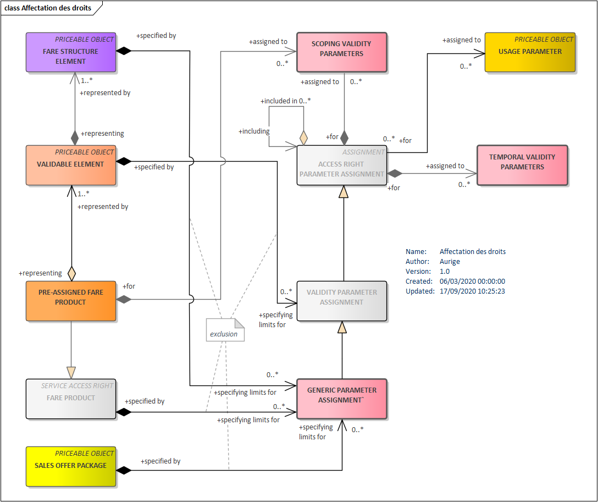 *Droits d’accès et Conditions de validité –
Modèle conceptuel*

<div class='table-title'>AccessRightParameterAssignment – Element</div>

| Classification | **Name**                                          | **Type**                               | **Cardinality** | **Description**                                                            |
|----------------|---------------------------------------------------|----------------------------------------|-----------------|----------------------------------------------------------------------------|
| ::\>           | ::\>                                              | *<u>Assignment</u>*                    | ::\>            | ACCESS RIGHT PARAMETER ASSIGNMENT hérite de ASSIGNMENT.                    |
| « PK »         | ***id***                                          | *AccessRightParameterAssignmentIdType* | 1:1             | Identifiant du ACCESS RIGHT PARAMETER ASSIGNMENT.                          |
| XGRP           | ***AccessRightParamterAssignmentProperiesGroup*** | ***<u>xmlGroup</u>***                  | 1:1             | Propriétés générales du ACCESS RIGHT PARAMETER ASSIGNMENT.                 |
| XGRP           | ***ParameterAssignmentScopeGroup***               | ***<u>xmlGroup</u>***                  | 1:1             | FARE STRUCTURE ELEMENTS concerné par cet ACCESS RIGHT PARAMETER ASSIGNMEN. |
| XGRP           | ***UsageValidityParameterGroup***                 | ***<u>xmlGroup</u>***                  | 1:1             | USAGE PARAMETERs limitant cet ACCESS RIGHT PARAMETER ASSIGNMENT.           |
| XGRP           | ***AccessRightParameterValidityParameterGroup***  | ***<u>xmlGroup</u>***                  | 1:1             | Paramètres de validité liés à l’ACCESS RIGHT PARAMETER ASSIGNMENT.         |

<div class='table-title'>ParameterAssignmentScopeGroup – Group</div>

<table>
<thead>
<tr class="header">
<th><strong>Classification</strong></th>
<th><strong>Name</strong></th>
<th><strong>Type</strong></th>
<th><strong>Cardinality</strong></th>
<th><strong>Description</strong></th>
</tr>
</thead>
<tbody>
<tr class="odd">
<td>« FK »</td>
<td><em><strong>ValidableElementRef</strong></em></td>
<td><em>ValidableElementR</em>ef</td>
<td>0:1</td>
<td>VALIDABLE ELEMENT cible de l’affectation.</td>
</tr>
<tr class="even">
<td>« FK »</td>
<td><em><strong>ControllableElementRef</strong></em></td>
<td><em>ControllableElementRef</em></td>
<td>0:1</td>
<td>CONTROLLABLE ELEMENT cible de l’affectation.</td>
</tr>
<tr class="odd">
<td>« FK »</td>
<td><em><strong>FareProductRef</strong></em></td>
<td><em>FareProductRef+</em></td>
<td>0:1</td>
<td><p>FARE PRODUCT cible de l’affectation.</p>
<p><mark>Note : dans le cadre du profil France, c’est sur le FARE
PRODUCT que l’on fera porter l’affectation des droits à chaque fois que
cela est possible.</mark></p></td>
</tr>
<tr class="even">
<td>« FK »</td>
<td><em><strong>FareStructureElementRef</strong></em></td>
<td><em>FareStructureElementRef</em></td>
<td>0:1</td>
<td>FARE STRUCTURE ELEMENT cible de l’affectation.</td>
</tr>
<tr class="odd">
<td>« FK »</td>
<td><em><strong>FareStructureElementInSequenceRef</strong></em></td>
<td><em>FareStructure-Element-InSequenceRef</em></td>
<td>0:1</td>
<td>FARE STRUCTURE ELEMENT IN SEQUENCE cible de l’affectation.</td>
</tr>
<tr class="even">
<td>« FK »</td>
<td><em><strong>DistanceMatrixElementRef</strong></em></td>
<td><em>DistanceMatrixRef</em></td>
<td>0:1</td>
<td>DISTANCE MATRIX ELEMENT cible de l’affectation.</td>
</tr>
<tr class="odd">
<td>« FK »</td>
<td><em><strong>DistanceMatrixInverseRef</strong></em></td>
<td><em>DistanceMatrixRef</em></td>
<td>0:1</td>
<td>DISTANCE MATRIX ELEMENT cible de l’affectation. La référence est
pour le sens inverse de celui de l'élément.</td>
</tr>
<tr class="even">
<td>« FK »</td>
<td><em><strong>SalesOfferPackageRef</strong></em></td>
<td><em>SalesOfferPackageRef</em></td>
<td>0:1</td>
<td>SALES OFFER PACKAGE cible de l’affectation.</td>
</tr>
<tr class="odd">
<td>« FK »</td>
<td><em><strong>GroupOfDistanceMatrixElementsRef</strong></em></td>
<td><em>GroupOfDistanceMatrixElementsRef</em></td>
<td>0:1</td>
<td>GROUP OF DISTANCE MATRIX ELEMENTs cible de l’affectation.</td>
</tr>
<tr class="even">
<td>« FK »</td>
<td><em><strong>GroupOfSalesOfferPackages-Ref</strong></em></td>
<td><em>GroupOfSalesOffer-PackagesRef</em></td>
<td>0:1</td>
<td>GROUP OF SALES OFFER PACKAGEs cible de l’affectation.</td>
</tr>
</tbody>
</table>

Les règles de limitation des DROITS D'ACCÈS peuvent être complexes et
impliquer plusieurs combinaisons de paramètres et de conditions. Ces
règles peuvent être exprimées sous forme de propositions logiques avec
des opérateurs logiques (et, ou, ou-exclusif). Cela signifie que
différents types de combinaisons doivent être pris en compte et que
l’AFFECTATION DE DROITS D'ACCÈS est une affectation multiple. Pour cela,
les attributs *xxx**GroupingType*** ci-dessous sont définis avec les
valeurs d'un opérateur logique (AND, OR, NOT, XOR). Cela permettra
d’exprimer des choses comme un droit valable de 6h00 à 8h30 ET de 19h30
à 21h00, par opposition à une droit valable de 6h00 à 8h30 OU (EXCLUSIF)
de 19h30 à 21h00.

<div class='table-title'>UsageValidityParameter – Group</div>

<table>
<thead>
<tr class="header">
<th><strong>Classification</strong></th>
<th><strong>Name</strong></th>
<th><strong>Type</strong></th>
<th><strong>Cardinality</strong></th>
<th><strong>Description</strong></th>
</tr>
</thead>
<tbody>
<tr class="odd">
<td>« enum »</td>
<td><em><strong>LimitationGroupingType</strong></em></td>
<td><em>BooleanOperatorEnum</em></td>
<td>0:1</td>
<td><p>Opérateur logique pour combiner les USAGE PARAMETERs. La valeur
par défaut est « ET ». « OR » et « XOR » ne doivent être utilisés que si
les paramètres sont tous du même type. Voir les valeurs autorisées
ci-dessous.</p>
<blockquote>
<p><em>AND</em></p>
<p><em>OR</em></p>
<p><em>NOT</em></p>
<p><em>XOR</em></p>
</blockquote></td>
</tr>
<tr class="even">
<td>« enum »</td>
<td><em><strong>LimitationsSetSelection-Type</strong></em></td>
<td><em>SetOperatorEnum</em></td>
<td>0:1</td>
<td><p>Lorsqu'un ou plusieurs paramètres constituent un groupe contenant
plusieurs éléments, (GROUP OF xxx), opérateur d'ensemble pour faire la
distinction entre l'ensemble complet et les différentes possibilités de
sélection.</p>
<blockquote>
<p><em>oneOfAnyOneSet (un seul d’entre eux)</em></p>
<p><em>oneOfEachSet (un de chaque)</em></p>
<p><em>someOfAnySet (plusieurs d’une categorie)</em></p>
<p><em>allOfOneSet (tous ceux d’une categorie)</em></p>
<p><em>allOfAllSets (tous)</em></p>
</blockquote></td>
</tr>
<tr class="odd">
<td>« FK »</td>
<td><em><strong>limitations</strong></em></td>
<td><em>UsageParameterRef+</em></td>
<td>0:*</td>
<td>Réferences des USAGE PARAMETERs définissant des limitations.</td>
</tr>
</tbody>
</table>

<div class='table-title'>AccessRightParameterValidityParameterGroup – Group</div>

<table>
<thead>
<tr class="header">
<th><strong>Classification</strong></th>
<th><strong>Name</strong></th>
<th><strong>Type</strong></th>
<th><strong>Cardinality</strong></th>
<th><strong>Description</strong></th>
</tr>
</thead>
<tbody>
<tr class="odd">
<td>« enum »</td>
<td><em><strong>ValidityParameterAssignmentType</strong></em></td>
<td><em>ComparisonOperatorEnum</em></td>
<td>0:1</td>
<td><p>Opérateur de comparaison pour faire correspondre les valeurs des
paramètres de validité.</p>
<blockquote>
<p><em>EQ</em></p>
<p><em>NE</em></p>
<p><em>GE</em></p>
<p><em>GT</em></p>
<p><em>LE</em></p>
<p><em>LT</em></p>
</blockquote></td>
</tr>
<tr class="even">
<td>« enum »</td>
<td><em><strong>ValidityParameterGroupingType</strong></em></td>
<td><em>BooleanOperatorEnum</em></td>
<td>0:1</td>
<td><p>Opérateur logique pour combiner les paramètres de validité du
réseau, par ex. « ET », « OU », « XOR ».</p>
<blockquote>
<p><em>AND</em></p>
<p><em>OR</em></p>
<p><em>NOT</em></p>
<p><em>XOR</em></p>
</blockquote></td>
</tr>
<tr class="odd">
<td>« enum »</td>
<td><em><strong>ValiditySetSelection-Type</strong></em></td>
<td><em>SetOperatorEnum</em></td>
<td>0:1</td>
<td><p>Lorsqu'un ou plusieurs paramètres sont un groupe contenant
plusieurs éléments, (GROUP OF xxx), opérateur d'ensemble pour faire la
distinction entre l'ensemble complet et les différentes possibilité de
sélections.</p>
<blockquote>
<p><em>oneOfAnyOneSet (un seul d’entre eux)</em></p>
<p><em>oneOfEachSet (un de chaque)</em></p>
<p><em>someOfAnySet (plusieurs d’une categorie)</em></p>
<p><em>allOfOneSet (tous ceux d’une categorie)</em></p>
<p><em>allOfAllSets (tous)</em></p>
</blockquote></td>
</tr>
<tr class="even">
<td>« cntd »</td>
<td><em><strong>temporalValidityParameters</strong></em></td>
<td><em>TemporalValidityParametersGroup</em></td>
<td>0:*</td>
<td>Validité temporelle associée.</td>
</tr>
<tr class="odd">
<td>« cntd »</td>
<td><em><strong>validityParameters</strong></em></td>
<td><em>LimitingValidityParametersGroup</em></td>
<td>0:*</td>
<td>Paramètres de validités associés.</td>
</tr>
</tbody>
</table>

<div class='table-title'>TemporalValidityParametersGroup – Group</div>

| **Classification** | **Name**                   | **Type**               | **Cardinality** | **Description**                                                  |
|--------------------|----------------------------|------------------------|-----------------|------------------------------------------------------------------|
| « FK »             | ***DayTypeRef***           | *ValidityConditionRef* | 0:1             | DAY TYPE auquel l’ACCESS RIGHT PARAMETER est affecté.            |
| « FK »             | ***GroupOfTimebandsRef***  | *GroupOfTimebandsRef*  | 0:1             | GROUP OF TIME BANDs auquel l’ACCESS RIGHT PARAMETER est affecté. |
| « FK »             | ***OperatingDayRef***      | *OperatingDayRef*      | 0:1             | OPERATING DAY auquel l’ACCESS RIGHT PARAMETER est affecté.       |
| « FK »             | ***OperatingPeriodRef***   | *OperatingPeriod-Ref*  | 0:1             | OPERATING PERIOD auquel l’ACCESS RIGHT PARAMETER est affecté.    |
| « FK »             | ***ValidityConditionRef*** | *ValidityConditionRef* | 0:1             | VALIDITY CONDITION auquel l’ACCESS RIGHT PARAMETER est affecté.  |

<div class='table-title'>AccessRightParameterAssignmentPropertiesGroup – Group</div>

| **Classification** | **Name**                  | **Type**                        | **Cardinality** | **Description**                                                               |
|--------------------|---------------------------|---------------------------------|-----------------|-------------------------------------------------------------------------------|
|                    | ***IsAllowed***           | *xsd:boolean*                   | 0:1             | Indique si les affectations spécifiées sont autorisées (true) ou non (false). |
| « FK »             | ***TypeOfAssignmentRef*** | *TypeOAccessRightAssignmentRef* | 0:1             | Classification du ACCESS RIGHT PARAMETER ASSIGNMENT.                          |

<div class='table-title'>ValidityParameterAssignment – Element</div>

| Classification | **Name**                        | **Type**                                | **Cardinality** | **Description**                                                                                |
|----------------|---------------------------------|-----------------------------------------|-----------------|------------------------------------------------------------------------------------------------|
| ::\>           | ::\>                            | *<u>AccessRightParameterAssignment</u>* | ::\>            | VALIDITY PARAMETER ASSIGNMENT hérite de ACCESS RIGHT PARAMETER ASSIGNMENT.                     |
| « PK »         | ***id***                        | *ValidityParameterAssignmentIdType*     | 1:1             | Identifiant du VALIDITY PARAMETER ASSIGNMENT.                                                  |
| « FK »         | ***QualityStructureFactorRef*** | *QualityStructureFactorRef*             | 0:1             | Référence à un QUALITY STRUCTURE FACTOR auquel l’ACCESS RIGHT PARAMETER ASSIGNMENT s’applique. |

<div class='table-title'>GenericParameterAssignment – Element</div>

| Classification | **Name**                                      | **Type**                             | **Cardinality** | **Description**                                                                                          |
|----------------|-----------------------------------------------|--------------------------------------|-----------------|----------------------------------------------------------------------------------------------------------|
| ::\>           | ::\>                                          | *<u>ValidityParameterAssignment</u>* | ::\>            | GENERIC PARAMETER ASSIGNMENT hérite de VALIDITY PARAMETER ASSIGNMENTs                                    |
| « PK »         | ***id***                                      | *GenericParameterAssignmentIdType*   | 1:1             | Identifiant du GENERIC PARAMETER ASSIGNMENT.                                                             |
|                | ***GenericParameterAssignmentIncludesGroup*** | ***<u>xmlGroup</u>***                | 1:1             | Éléments pour le GENERIC PARAMETER ASSIGNMENT. Ne peut être combiné qu'avec des paramètres du même type. |

<div class='table-title'>AccessRightParameterAssignmentIncludesGroup – Group</div>

<table>
<thead>
<tr class="header">
<th><strong>Classification</strong></th>
<th><strong>Name</strong></th>
<th><strong>Type</strong></th>
<th><strong>Cardinality</strong></th>
<th><strong>Description</strong></th>
</tr>
</thead>
<tbody>
<tr class="odd">
<td>« enum »</td>
<td><em><strong>IncludesGroupingType</strong></em></td>
<td><em>BooleanOperatorEnum</em></td>
<td>0:1</td>
<td><p>Opérateur logique pour combiner les éléments inclus. La valeur
par défaut est « OU ».</p>
<blockquote>
<p><em>AND</em></p>
<p><em>OR</em></p>
<p><em>NOT</em></p>
<p><em>XOR</em></p>
</blockquote></td>
</tr>
<tr class="even">
<td>« cntd »</td>
<td><em><strong>includes</strong></em></td>
<td><em>AccessRightParameterAssignment+</em></td>
<td>0:*</td>
<td>ACCESS RIGHT PARAMETER ASSIGNMENTs constituant un ACCESS RIGHT
PARAMETER ASSIGNMENT composite.</td>
</tr>
</tbody>
</table>

### Ciblage des droits d’accès

Le ciblage permet de restreindre les droits d'accès des éléments de la
structure tarifaire à des éléments spécifiques du réseau.

Paramètres liés à l'organisation :

- Quels OPÉRATEURS ou GROUPES D'OPÉRATEURS peuvent être utilisés.

- Quels MODE et sous-modes de VÉHICULE peuvent être utilisés.

Paramètres liés au réseau :

- Quels LIGNES, GROUPES DE LIGNES ou RÉSEAUX et MODE DE VÉHICULE peuvent
  être utilisés.

- Quelles ZONE TARIFAIRE, SECTION TARIFAIRE et quels POINTS D'ARRÊT
  PLANIFIÉS peuvent être utilisés. De même, lorsqu'un droit est limité à
  une partie d'un emplacement physique, cela peut être spécifié à l'aide
  d'un ÉLÉMENT DU SITE.

- Quels POINTS D'INTÉRÊT sont accessibles.

Paramètres liés au service :

- Quelles CONTRAINTES DE SERIES sur les itinéraires doivent être
  suivies.

- Le NUMÉRO DE TRAIN, la COURSE, la MISSION COMMERCIALE, le TYPE DE
  PRODUIT (par exemple ICE, Thalys, etc.) qui peuvent être utilisés.

- Quelle CLASSE peuvent être utilisées.

Paramètres liés au SITE :

- Le LIEU D'ARRÊT, le PARKING ou LE POINT D'INTÉRÊT qui est concerné.

- L'ADRESSE à laquelle l'affectation s'applique.

- LIEU TOPOGRAPHIQUE auquel l'affectation s'applique.

Paramètres liés au SIÈGE :

- La COURSE et le NUMÉRO DE TRAIN auxquels l'affectation s'applique.

- Les service (FACILITY SET) et le type de place (Siège, couchette,
  etc.) auxquels s'applique l'affectation.

- Le SIÈGE lui-même auquel l'affectation s'applique.

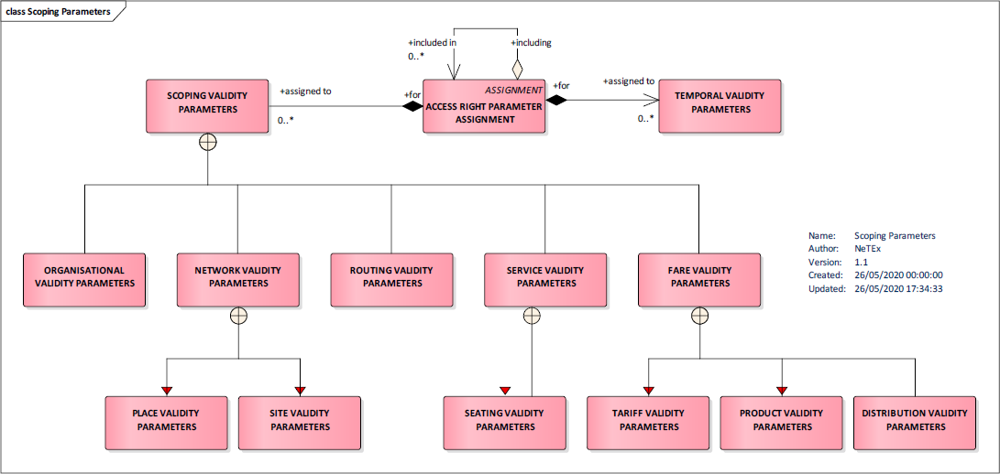 *Ciblage des droits d’accès – Modèle conceptuel*

<div class='table-title'>ScopingValidityParameters – Element</div>

| **Classification** | **Name**                                   | **Type**              | **Cardinality** | **Description**                                                        |
|--------------------|--------------------------------------------|-----------------------|-----------------|------------------------------------------------------------------------|
| XGRP               | ***OrganisationValidityParametersGroup***  | ***<u>xmlGroup</u>*** | 1:1             | Paramètre de validité concernant l’ORGANISATION cible de l’affecation. |
| XGRP               | ***NetworkValidityParametersGroup***       | ***<u>xmlGroup</u>*** | 1:1             | Paramètre de validité concernant le NETWORK cible de l’affecation.     |
| XGRP               | ***RouteValidityParametersGroup***         | ***<u>xmlGroup</u>*** | 1:1             | Paramètre de validité concernant la ROUTE cible de l’affecation.       |
| XGRP               | ***ServiceValidityParametersGroup***       | ***<u>xmlGroup</u>*** | 1:1             | Paramètre de validité concernant le SERVICE cible de l’affecation.     |
| XGRP               | ***ProductValidityParametersGroup***       | ***<u>xmlGroup</u>*** | 1:1             | Paramètre de validité concernant le PRODUCT cible de l’affecation.     |

La figure ci-dessous fournit une vue d’ensemble de ce ciblage des droits
d’accès (le tableau des attributs lui-même n’est pas fourni car il
s’agit simplement d’une longue liste de références à des objets existant
– ***LineRef***, ***SchduledStopPointRef***, ***SiteRef***, etc.- et ne
présente pas d’intérêt particulier pour ce document).

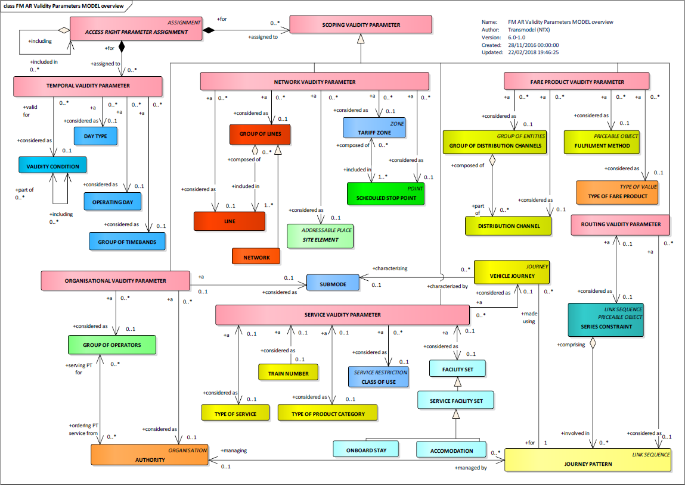 *Ciblage des droits d’accès – vue d’ensemble*

### Exemples

Exemple 1

``` xml
<GenericParameterAssignment id="LEMAN-EXPRESS:GenericParameterAssignment:001:LOC" version="any" order="1">
  <limitations>
    <UsageValidityPeriod id="LEMAN-EXPRESS:UsageValidityPeriod:001:LOC" version="any">
      <!--Peut être une référence pour mutualiser la définition-->
      <UsageTrigger>purchase</UsageTrigger>
      <!--On a aussi l'option startOutboundRide, etc.-->
      <StandardDuration>PT180M</StandardDuration>
    </UsageValidityPeriod>
  </limitations>
</GenericParameterAssignment>
```

Exemple 2

``` xml
<GenericParameterAssignment>
  <LimitationGroupingType>AND</LimitationGroupingType>
  <limitations>
    <RoundTripRef ref="FR-Tarif-Example:RoundTrip:001:LOC"/>
    <ExchangingRef ref="FR-Tarif-Example:Exchanging:001:LOC"/>
    <RefundingRef ref="FR-Tarif-Example:Refunding:001:LOC"/>
  </limitations>
  <validityParameters>
    <VehicleModes>tram bus</VehicleModes>
  </validityParameters>
  <IncludesGroupingType>AND</IncludesGroupingType>
  <includes>
    <GenericParameterAssignment>
      <Description>Voir http://www.navigo.fr/wp-content/uploads/2016/06/lignes_tarifica-
tion_speciale_07-2014.pdf pour les lignes &#xE0; tarification sp&#xE9;ciale</Description>
      <IsAllowed>false</IsAllowed>
      <validityParameters>
        <LineRef ref="FR-Tarif-Example:Line:Orlybus:LOC"/>
        <LineRef ref="FR-Tarif-Example:Line:Tram11:LOC"/>
        <LineRef ref="FR-Tarif-Example:Line:RAPT350:LOC"/>
        <LineRef ref="FR-Tarif-Example:Line:RAPT351:LOC"/>
        <GroupOfLinesRef ref="FR-Tarif-Example:GroupOfLines:Noctilien:LOC"/>
      </validityParameters>
    </GenericParameterAssignment>
  </includes>
</GenericParameterAssignment>
```

## Conditions d’Utilisation (Usage Parameter)

La validité d'un droit d'accès peut être limitée par des paramètres liés
à la manière de le consommer (profil de l'utilisateur, fréquence
d'utilisation, transférabilité, etc.). Cela se décrit par des règles
complémentaires à celles exprimées par la structure tarifaire et les
paramètres de validité. Ces paramètres sont décrits par les CONDITIONS
D’UTILISATION.

Les CONDITIONS D’UTILISATION spécifient divers types de limitations
fonctionnelles sur un élément tarifaire, par exemple, quand il peut être
acheté (FENÊTRE D'ACHAT), qui peut l'acheter (PROFIL UTILISATEUR), s'il
peut être donné à quelqu'un d'autre (TRANSFÉRABILITÉ), etc. Les
paramètres se répartissent en quatre groupes principaux qui sont
présentés ci-dessous.

Les CONDITIONS D’UTILISATION DU VOYAGE spécifient les limites de voyage
telles que ALLER-RETOUR, ITINÉRAIRE, FRÉQUENCE D'UTILISATION, ÉCHANGE,
PÉRIODE DE VALIDITÉ D'UTILISATION, SÉJOUR MINIMUM.

- ALLER-RETOUR exprimant les propriétés relatives à l'utilisation
  d’aller simple ou d’aller-retour d'un droit d'accès.

- PÉRIODE DE VALIDITÉ D'UTILISATION décrit une limitation dans le temps
  des droits d'accès, en particulier des abonnements. Il peut inclure
  une « durée standard » de validité (1 jour, 1 mois…), des limites de
  temps (« date de début » et « date de fin », « heure de début » et
  « heure de fin »), ou une combinaison des deux ;

- FRÉQUENCE D'UTILISATION décrit la limitation d'un droit d'accès, en
  fonction de la fréquence d'utilisation pendant une PÉRIODE DE
  VALIDITÉ. Par exemple, un produit est proposé à un tarif spécial s'il
  est utilisé plus de 50 fois par mois ;

- CORRESPONDANCE exprimant les limites de correspondances au cours d'un
  voyage ;

- SÉJOUR MINIMUM, exprimant les détails de tout séjour minimum à
  destination requis pour utiliser le produit (typiquement une réduction
  si l’on passe un weekend sur place) ;

- LIMITE DE SEUIL, paramètre géographique limitant les droits d'accès
  par comptage d'arrêts, tronçons ou zones ;

- ITINERAIRE, expression des limitations lié à l’itinéraire suivi, pour
  un droit d'accès ;

- SUPENSION, décrivant les conditions applicables pour suspendre
  temporairement un droit d'accès tel qu'un abonnement.

L’éligibilité spécifie les limites sur les personnes autorisées à
utiliser un produit telles que PROFIL D'UTILISATEUR, BILLET DE GROUPE,
COMPAGNON OU MEMBRE DU GROUPE, PROFIL COMMERCIAL, DROIT DONNÉ et DROIT
REQUIS.

- PROFIL UTILISATEUR, qui décrit le profil social d'un client. Il est
  généralement utilisé pour permettre des réductions en fonction des
  groupes d'âge (par exemple moins de 18 ans), du sexe, de la
  profession, du statut social (par exemple étudiant, retraité,
  chômeur), etc. ;

- PROFIL COMMERCIAL, qui permet de décrire les catégories de clients en
  fonction de leurs relations commerciales avec l'opérateur (grand
  voyageur, montant des achats par une entreprise, etc.). Il est
  généralement utilisé pour permettre des remises ;

- TICKET DE GROUPE décrit le nombre et les caractéristiques des
  personnes éventuellement habilitées à voyager en plus du titulaire
  d'un droit d'accès ;

- PROFIL D’ACCOMPAGNATEUR, indiquant le nombre et les caractéristiques
  des personnes habilitées à voyager en groupe ou en tant
  qu’accompagnateur d'un autre PROFIL UTILISATEUR ;

- QUALIFICATION RÉSIDENTIELLE, catégorisant les utilisateurs en fonction
  de leurs lieu de résidence ;

- POLITIQUE DE CHANGEMENT D'ÉLIGIBILITÉ, spécifiant l'action à
  entreprendre si l'éligibilité d'un utilisateur pour un profil donné
  change.

Les CONDITIONS D’UTILISATION des droits peuvent préciser les droits
préalablement requis pour un produit, ou les droits donnés par un
produit.

- DROIT REQUIS, indiquant si un PRODUIT requis pour pouvoir utiliser le
  droit d'accès (carte famille nombreuse par exemple) ;

- DROIT DONNÉ, indiquant si un produit permet d’en utiliser d’autres.

Les CONDITIONS D’UTILISATION des bagages spécifient des limitations sur
les bagages (quantité, poids maximal, etc.).

- ALLOCATION DE BAGAGES décrit le nombre et les caractéristiques (poids
  ou volume, vélos, etc.) des bagages que le titulaire d'un droit
  d'accès est en droit de transporter.

Les CONDITIONS DE VENTE spécifient les limites des transactions de
réservation telles que la FENÊTRE D'ACHAT, la TRANSFÉRABILITÉ, les
RÉSERVATION, l’ÉCHANGE, le REMBOURSEMENT.

- FENÊTRE D'ACHAT, indiquant la période dans laquelle le produit sera
  acheté ;

- TRANSFÉRABILITÉ décrit le droit de céder un droit à d'autres personnes
  que le client d'origine ;

- REVENTE, exprimant les conditions de revente attachées au produit ;

- ÉCHANGE indiquant si et comment le droit d'accès peut être échangé
  contre un autre droit d'accès ;

- REMBOURSEMENT indiquant si et comment le droit d'accès acheté peut
  être remboursé ;

- REMPLACEMENT indiquant si et comment le droit d'accès peut être
  remplacé (par exemple si un ticket est perdu ou défectueux) ;

- RÉSERVATION indiquant si le droit d'accès nécessite une réservation.

Les CONDITIONS DE FACTURATION spécifient des règles liées à la
facturation tels que la POLITIQUE DE FACTURATION et la POLITIQUE DE
PÉNALITÉ.

- Le paramètre la POLITIQUE DE FACTURATION spécifie les limitations sur
  la façon dont un produit peut être facturé, par exemple pour spécifier
  un niveau de crédit minimum et maximum.

- Le paramètre POLITIQUE DE PÉNALITÉ spécifie les règles relatives aux
  pénalités qui peuvent être encourus en cas d’infraction.

- Le paramètre POLITIQUE D’ABONNEMENT spécifie les règles relatives aux
  tarifs achetés dans le cadre d’un abonnement avec des de paiement
  réguliers.

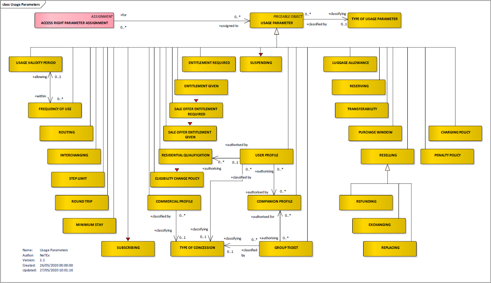 *Conditions d’Utilisation – Modèle conceptuel*

<div class='table-title'>UsageParameter – Element (abstrait)</div>

| **Classification** | **Name**                      | **Type**                  | **Cardinality** | **Description**                                   |
|--------------------|-------------------------------|---------------------------|-----------------|---------------------------------------------------|
| ::\>               | ::\>                          | *<u>PriceableObject</u>*  | ::\>            | USAGE PARAMETER hérite de PRICEABLE OBJECT***.*** |
| « PK »             | ***id***                      | *UsageParameterIdType*    | 1:1             | Identifiant du USAGE PARAMETER.                   |
|                    | ***Url***                     | *xsd:anyUri*              | 0:1             | Url associé au parameter.                         |
| « FK »             | ***TypeOfUsageParameterRef*** | *TypeOfUsageParameterRef* | 0:1             | Type de USAGE PARAMETER (***TypeofValue***).      |

Les figures ci-dessous présente les modèles de données pour l’ensemble
des conditions d’utilisation. Ces conditions sont à prendre tel-quel et
il n’y a pas de véritable intérêt à leur applique un travail de profil,
les tableaux d’attributs qui leur correspondent on don été placés en
annexe (en anglais) pour référence (ceci afin de ne pas surcharger
inutilement la partie principale de ce document).

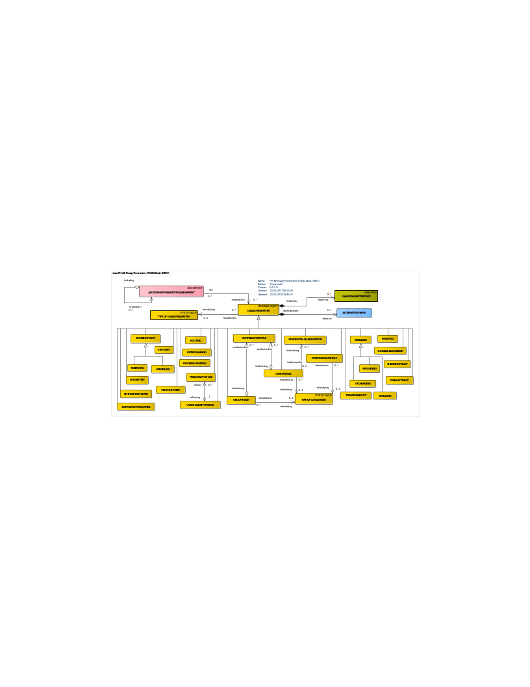 *Conditions d’Utilisation (Usage Parameter)*

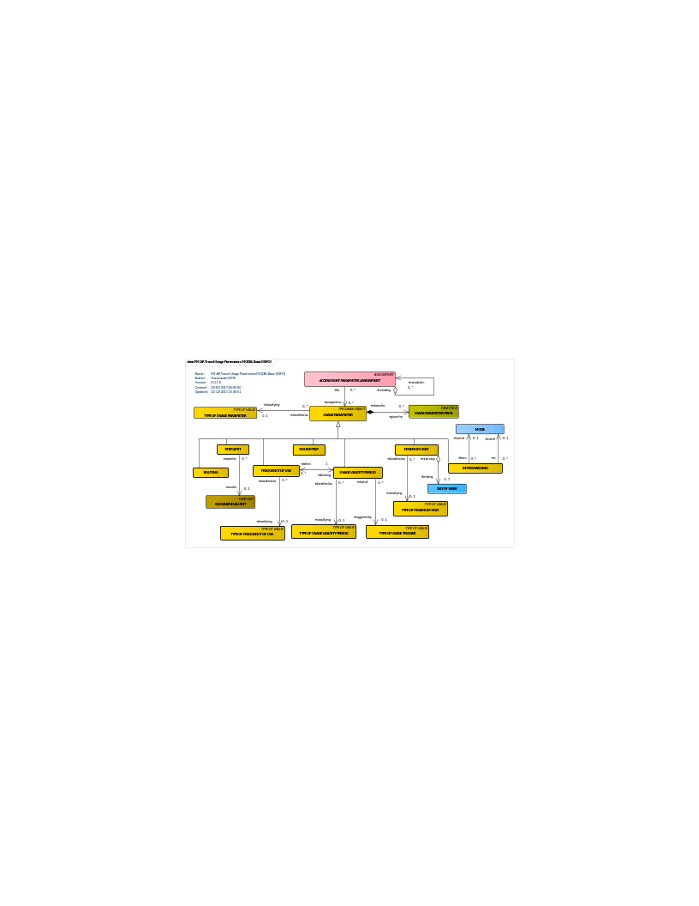 *Paramètre du voyage (Travel parameters)*

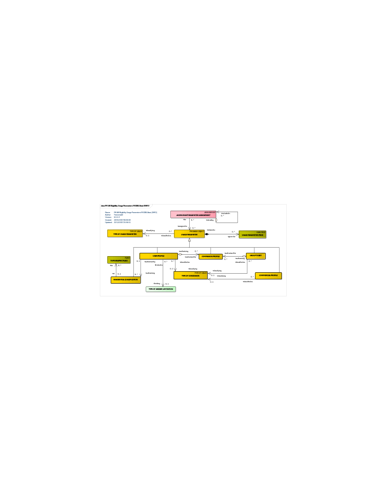 *Eligibilité (Eligibility)*

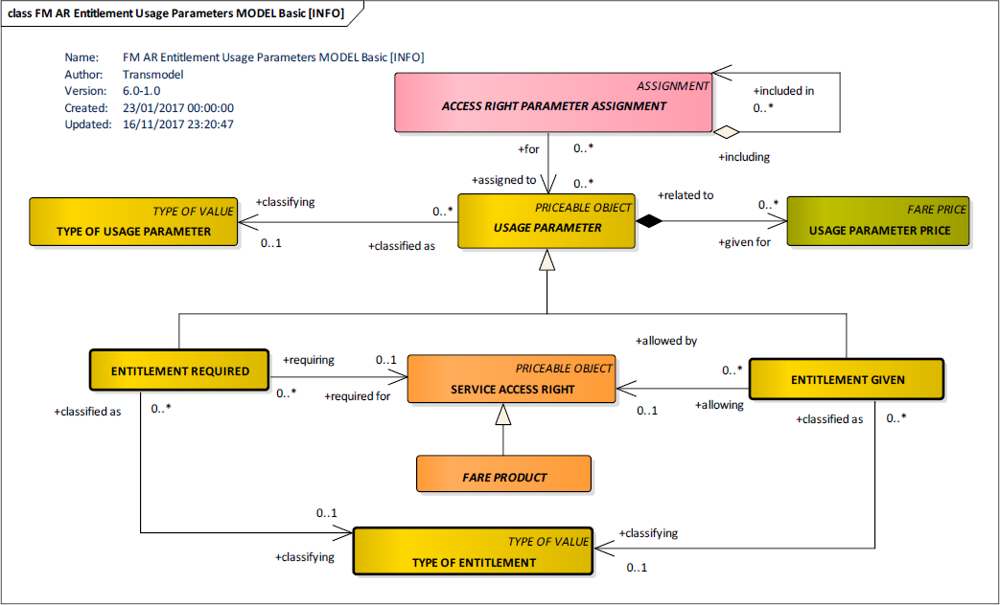 *Ouvertures de droits (Entitlements)*

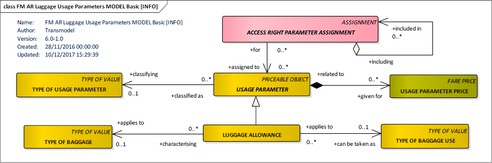 *Bagages (Luggage)*

 *Réservation (Booking)*

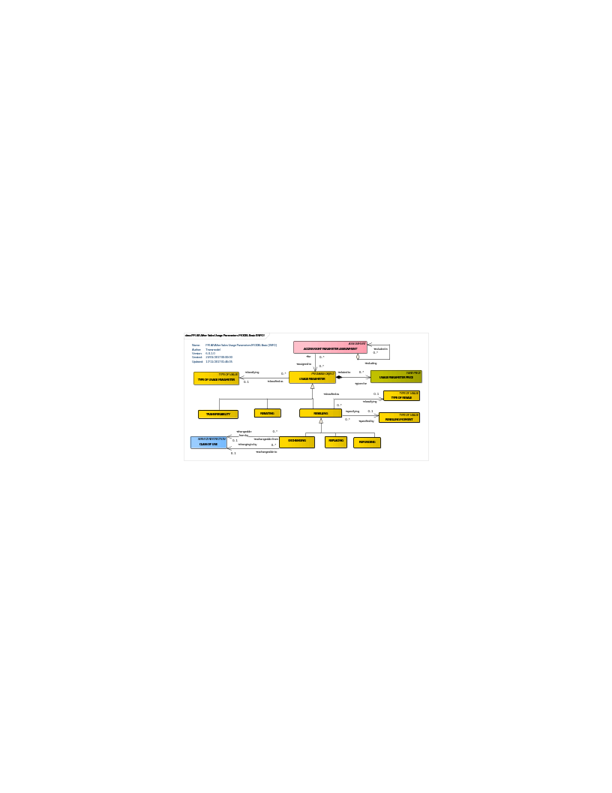 *Après-vente (After Sales)*

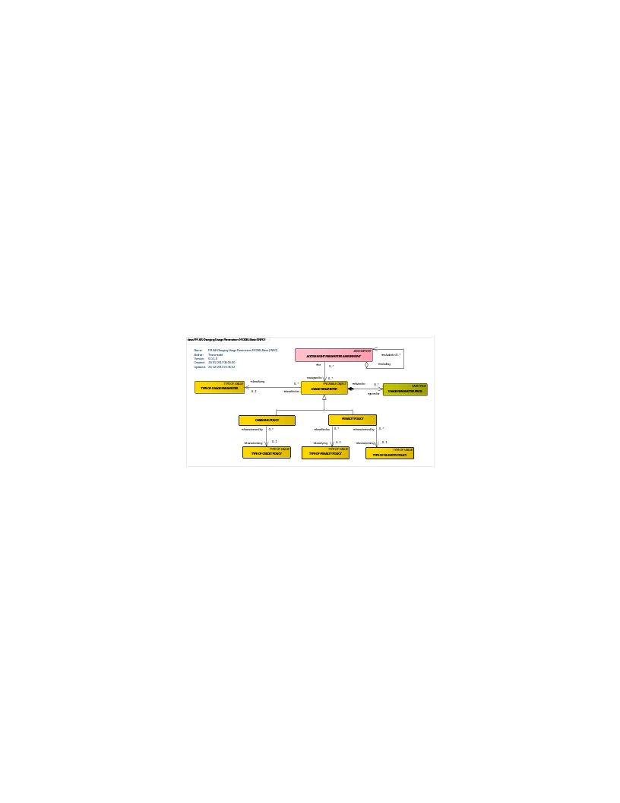 *Paiement (Charging)*

### Exemples

``` xml
<UserProfile id="FR-Tarif-Example:UserProfile:001:LOC" version="any">
  <!--Plein tarif classique-->
  <Name>Plein tarif</Name>
  <Description>Plein tarif adulte sans r&#xE9;duction</Description>
  <MinimumAge>10</MinimumAge>
</UserProfile>
<UserProfile id="FR-Tarif-Example:UserProfile:002:LOC" version="any">
  <!--Gratuit pour les enfants-->
  <Name>Moins de 4 ans</Name>
  <Description>Gratuit pour les enfants de moins de 4 ans</Description>
  <MaximumAge>4</MaximumAge>
  <DiscountBasis>free</DiscountBasis>
</UserProfile>
<UserProfile id="FR-Tarif-Example:UserProfile:003:LOC" version="any">
  <!--50% pour les enfants entre 4 et 10 ans -->
  <Name>Tarif Enfant</Name>
  <Description>50%de r&#xE9;duction pour les enfants entre 4 et 10 ans </Description>
  <prices>
    <UsageParameterPrice>
      <LimitingRule>
        <DiscountAsPercentage>0.50</DiscountAsPercentage>
        <CanBeCumulative>false</CanBeCumulative>
      </LimitingRule>
    </UsageParameterPrice>
  </prices>
  <MinimumAge>4</MinimumAge>
  <MaximumAge>10</MaximumAge>
  <DiscountBasis>discount</DiscountBasis>
</UserProfile>
<UserProfile id="FR-Tarif-Example:UserProfile:004:LOC" version="any">
  <!-- User Profile pour les titulaire de carter Famille Nombreuse -->
  <Name>Titulaire de carte famille nombreuse SNCF bleue</Name>
  <Description>50%de r&#xE9;duction</Description>
  <TypeOfUsageParameterRef ref="FR-Tarif-Example:EntitlementRequired:004:LOC" version="any"/>
  <prices>
    <UsageParameterPrice>
      <LimitingRule>
        <DiscountAsPercentage>0.50</DiscountAsPercentage>
        <CanBeCumulative>false</CanBeCumulative>
      </LimitingRule>
    </UsageParameterPrice>
  </prices>
  <DiscountBasis>discount</DiscountBasis>
</UserProfile>
```

``` xml
<Exchanging id="FR-Tarif-Example:Exchanging:001:LOC" version="any">
  <Description>Billet &#xE9;changeable gratuitement jusqu'&#xE0; 30 jours avant le d&#xE9;part. S'ajoute l'&#xE9;ventuelle
diff&#xE9;rence de prix entre l'ancien et le nouveau billet</Description>
  <Allowed>full</Allowed>
  <ResellWhen>beforeStartOfValidity</ResellWhen>
  <ExchangableUntilDuration>-P30D</ExchangableUntilDuration>
  <HasFee>false</HasFee>
  <RefundBasis>perPerson</RefundBasis>
  <!--A vérifier-->
</Exchanging>
<Exchanging id="FR-Tarif-Example:Exchanging:002:LOC" version="any">
  <Description>Billet &#xE9;changeable avec retenue de 5 &#x20AC; &#xE0; compter de 30 jours avant le d&#xE9;part. A la retenue
s'ajoute l'&#xE9;ventuelle diff&#xE9;rence de prix entre l'ancien et le nouveau billet</Description>
  <prices>
    <UsageParameterPrice>
      <Amount>5</Amount>
      <Currency>EUR</Currency>
    </UsageParameterPrice>
  </prices>
  <Allowed>full</Allowed>
  <ResellWhen>beforeStartOfValidity</ResellWhen>
  <ExchangableFromDuration>-P30D</ExchangableFromDuration>
  <ExchangableUntilDuration>-P2D</ExchangableUntilDuration>
  <HasFee>true</HasFee>
  <RefundBasis>perPerson</RefundBasis>
  <!--A vérifier-->
</Exchanging>
```

``` xml
<Refunding id="FR-Tarif-Example:Refunding:001:LOC" version="any">
  <Description>Billet Remboursable gratuitement jusqu'&#xE0; 30 jours avant le d&#xE9;part.</Description>
  <Allowed>full</Allowed>
  <ResellWhen>beforeStartOfValidity</ResellWhen>
  <ExchangableUntilDuration>-P30D</ExchangableUntilDuration>
  <HasFee>false</HasFee>
  <RefundBasis>perPerson</RefundBasis>
  <!--A vérifier-->
</Refunding>
<Refunding id="FR-Tarif-Example:Refunding:002:LOC" version="any">
  <Description>Billet Remboursable avec retenue de 5 &#x20AC; &#xE0; compter de 30 jours avant le d&#xE9;part.</Description>
  <prices>
    <UsageParameterPrice>
      <Amount>5</Amount>
      <Currency>EUR</Currency>
    </UsageParameterPrice>
  </prices>
  <Allowed>full</Allowed>
  <ResellWhen>beforeStartOfValidity</ResellWhen>
  <ExchangableFromDuration>-P30D</ExchangableFromDuration>
  <ExchangableUntilDuration>-P2D</ExchangableUntilDuration>
  <HasFee>true</HasFee>
  <RefundBasis>perPerson</RefundBasis>
  <!--A vérifier-->
</Refunding>
```

## Les Grilles Tarifaires (FareTable)

<span class="mark">Dans tous les tableaux précédents, les attributs
fournissant une information de prix n'ont pas été retenus dans le cadre du
Profil France : cela tient au fait que l’option retenue par le profil
est de systématiser la présentation des prix au travers d’une GRILLE
TARIFAIRE (FARE TABLE). L’objectif est ici de systématiser la production
et l’interprétation des données d’ordre tarifaire, mais aussi d’éviter
une trop grande disparité des choix et options de modélisation qui ne
manquerait pas de se présenter (surtout dans le domaine tarifaire) s’il
elles n’étaient pas un peu contraintes.</span>

<span class="mark">La présentation des prix sous forme de grille des
tarifs reste un grand classique dans le domaine des transports, et ce
choix permettra aussi la simplification de la présentation de l’offre
aux voyageur (ce qui est cohérent avec l’objectif d’information voyageur
du profil).</span>

<span class="mark">Il reste toutefois quelques cas où des prix pourront
être fournis en dehors des GRILLEs TARIFAIREs : par exemple si un
produit offre une réduction fixe, par exemple de 5€, cela pourra être
indiqué explicitement dans la description du produit tarifaire de façon
à pouvoir en donner une description complète et pertinente au
voyageur.</span>

<span class="mark">Note : dans le cadre du profil, on fait le choix de
ne pas prévoir la gestion de réductions cumulatives.</span>

Une GRILLE TARIFAIRE permet la représentation de groupes de prix pour
des combinaisons d'éléments tarifaires. Il définit une matrice
multidimensionnelle de CELLULES, dont chacune peut indiquer un prix pour
une combinaison d'un ou plusieurs éléments tarifaires. Par exemple, on
peut avoir des références PROFIL UTILISATEUR + ÉLÉMENT DE MATRICE DE
DISTANCE + CLASSE D'UTILISATION sur chaque cellule afin de définir les
tarifs adulte et enfant pour la première et la deuxième classe.

Les grilles peuvent être imbriqués. Tous les objets héritant de
« PRICEABLE OBJECT » (ce qui est le cas de la grande majorité des objets
de ce profil) peuvent être utilisés au sein d’un GRILLE TARIFAIRE.

La construction en GRILLE TARIFAIRE permet de définir tout un ensemble
de composants relativement indépendants et potentiellement réutilisables
qui seront assemblés (par référence) au sein de la grille pour fournir
un prix correspondant (par exemple : Titre pour zones A et B + billet à
l’unité + jeune voyageur (18-25 ans) =\> Prix). On conserve donc une
construction très modulaire.

<span class="mark">La GRILLE TARIFAIRE fera des références vers tous les
éléments qui la constituent à l’exception des prix eux-mêmes qui, n’étant
pas définis par ailleurs, devront être complètement définis au sein de
la GRILLE TARIFAIRE.</span>

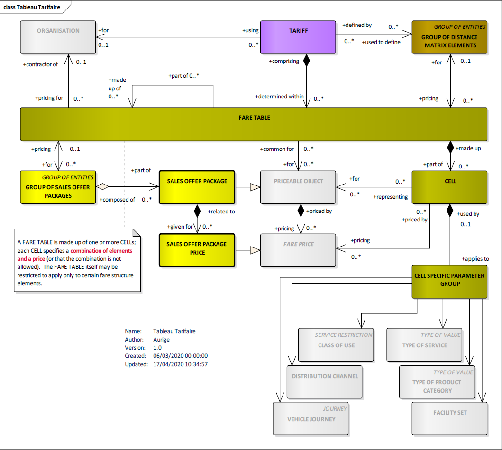 *Grilles Tarifaires – Modèle conceptuel*

<div class='table-title'>FareTable – Element</div>

| **Classification** | **Name**                              | **Type**           | **Cardinality** | **Description**                                                                               |
|--------------------|---------------------------------------|--------------------|-----------------|-----------------------------------------------------------------------------------------------|
| ::\>               | ::\>                                  | *PriceGroup*       | ::\>            | FARE TABLE hérite de PRICE GROUP***.***                                                       |
| « PK »             | ***id***                              | *FareTableIdType*  | 1:1             | Identifiant du FARE TABLE.                                                                    |
|                    | ***StartDate***                       | *xsd:date*         | 0:1             | Date de début de validité du prix.                                                            |
|                    | ***EndDate***                         | *xsd:date*         | 0:1             | Date de fin de validité du prix.                                                              |
| XGRP               | ***FareTableReferencesGroup***        | *xmlGroup*         | 0:\*            | Éléments de structure tarifaire pouvant recevoir un prix et donc associés à cette cellule.    |
| XGRP               | ***FareTableCommonAssignmentsGroup*** | *xmlGroup*         | 0:1             | Association d'un élément de structure tarifaire pour une cellule.                             |
| XGRP               | ***FareTableHeadingsGroup***          | *xmlGroup*         | 0:1             | En-têtes de lignes et de colonnes pour le tableau. Les CELL peuvent y faire référence.        |
|                    | ***EmbargoUntil***                    | *xsd:dateTime*     | 0:1             | Les prix ne seront communiqués qu'à partir de cette date.                                     |
| « cntd »           | ***cells***                           | *Cell*             | 0:\*            | Un tuple dans une TABLE DES TARIFS qui associe une ou plusieurs entités tarifaires à un prix. |
| « cntd »           | ***noticeAssignments***               | *NoticeAssignment* | 0:\*            | NOTICEs s’appliquant à l’ensemble de la FARE TABLE                                            |

<div class='table-title'>FareTableReferencesGroup – Group</div>

| **Classification** | **Name**                 |                                        | **Type**                           | **Cardinality** | **Description**                                                                |
|--------------------|--------------------------|----------------------------------------|------------------------------------|-----------------|--------------------------------------------------------------------------------|
| « FK »             | ***TypeOfFareTableRef*** |                                        | *TypeOfFareTableRef*               | 0:1             | Classification de la FARE TABLE.                                               |
| « cntd »           | ***pricesFor***          |                                        | *PriceableObjectRef+*              | 0:\*            | PRICEABLE OBJECT pouvant faire l'objet d'un prix et donc associé à cette CELL. |
| « cntd »           | ***usedIn***             |                                        | *Choice*                           | 0:1             | Un élément tarifaire associé au FARE TABLE.                                    |
| « FK »             | ***a***                  | ***TariffRef***                        | *TariffRef*                        | 1:\*            | TARIFF auquel le PRICEs of FARE TABLE s’applique.                              |
| « FK »             | ***b***                  | ***GroupOfDistanceMatrixElementsRef*** | *GroupOfDistanceMatrixElementsRef* | 1:\*            | GROUP OF DISTANCE MATRIX ELEMENTs associé au FARE TABLE.                       |
| « FK »             | ***c***                  | ***GroupOfSalesOfferPackagesRef***     | *GroupOfSalesOfferPackagesRef*     | 1:\*            | GROUP OF SALES OFFER PACKAGEs associé au FARE TABLE.                           |
| « FK »             | ***OrganisationRef***    |                                        | *(OrganisationRef)*                | 0:1             | OPERATOR ou AUTHORITY auquel le FARE PRICEs s’applique.                        |

<div class='table-title'>FareTableCommonAssignmentsGroup – Group</div>

| **Classification** | **Name**                            | **Type**              | **Cardinality** | **Description**                                                                                    |
|--------------------|-------------------------------------|-----------------------|-----------------|----------------------------------------------------------------------------------------------------|
| « cntd »           | ***limitations***                   | *UsageParameterRef+*  | 0:\*            | USAGE PARAMETER or PARAMETERs auquel le CELL PRICE s’applique.                                     |
| XGRP               | ***CellSpecificNetworkGroup***      | ***<u>xmlGroup</u>*** | 0:1             | Combinaison d'éléments liés au réseau pour lesquels la FARE TABLE ou CELL fournit un prix.         |
| XGRP               | ***CellSpecificRoutingGroup***      | ***<u>xmlGroup</u>*** | 0:1             | Combinaison d'éléments liés à l’itinéraire pour lesquels la FARE TABLE or CELL fournit un prix.    |
| XGRP               | ***CellSpecificServiceGroup***      | ***<u>xmlGroup</u>*** | 0:1             | Combinaison d'éléments liés aux services pour lesquels la FARE TABLE ou CELL fournit un prix.      |
| XGRP               | ***CellSpecificDistributionGroup*** | ***<u>xmlGroup</u>*** | 0:1             | Combinaison d'éléments liés à la distribution pour lesquels la FARE TABLE ou CELL fournit un prix. |

<div class='table-title'>FareTableHeadingsGroup – Group</div>

| **Classification** | **Name**       | **Type**                 | **Cardinality** | **Description**                                                     |
|--------------------|----------------|--------------------------|-----------------|---------------------------------------------------------------------|
| « cntd »           | ***columns***  | *FareTableColumnHeading* | 0:\*            | En-têtes de colonnes à utiliser lors de la présentation du tableau. |
| « cntd »           | ***rows***     | *FareTableRowHeading*    | 0:\*            | En-têtes de ligne à utiliser lors de la présentation du tableau.    |
| « cntd »           | ***includes*** | *FareTable*              | 0:\*            | FARE TABLEs imbriqués dans ce tableau. Peut être récursif.          |

<div class='table-title'>FareTableColumn – Element</div>

| **Classification** | **Name**              | **Type**                 | **Cardinality** | **Description**                                                                                   |
|--------------------|-----------------------|--------------------------|-----------------|---------------------------------------------------------------------------------------------------|
| ::\>               | ::\>                  | *VersionedChild*         | ::\>            | FARE TABLE COLUMN hérite de VERSIONED CHILD                                                       |
| « PK »             | ***id***              | *FareTableColumnIdType*  | 1:1             | Identifiant du FARE TABLE COLUMN.                                                                 |
|                    | ***Name***            | *MultilingualString*     | 0:1             | Nom du FARE TABLE COLUMN.                                                                         |
|                    | ***Description***     | *MultilingualString*     | 0:1             | Description du FARE TABLE COLUMN.                                                                 |
| « cntd »           | **noticeAssignments** | *NoticeAssignments*      | 0:\*            | NOTICEs qui s’applique à l’ensemble de la FARE TABLE COLUMN.                                      |
| « cntd »           | ***representing***    | *(VersionOfObjectRef)*   | 0:\*            | ENTITIES que la colonne représente.                                                               |
| « cntd »           | ***columns***         | *FareTableColumnHeading* | 0:\*            | En-têtes de FARE TABLE COLUMN imbriqués à utiliser lors de la présentation de la table. Récursif. |

<div class='table-title'>FareTableRow – Element</div>

| **Classification** | **Name**              | **Type**                     | **Cardinality** | **Description**                                                                                |
|--------------------|-----------------------|------------------------------|-----------------|------------------------------------------------------------------------------------------------|
| ::\>               | ::\>                  | *<u>VersionedChild</u>*      | ::\>            | FARE TABLE ROW hérite de VERSIONED CHILD.                                                      |
| « PK »             | ***id***              | *FareTableRowIdType*         | 1:1             | Identifiant du FARE TABLE ROW.                                                                 |
|                    | ***Name***            | *MultilingualString*         | 0:1             | Nom du FARE TABLE ROW.                                                                         |
|                    | ***Description***     | *MultilingualString*         | 0:1             | Description du FARE TABLE ROW.                                                                 |
| « cntd »           | **noticeAssignments** | *<u>NoticeAssignments</u>*   | 0:\*            | NOTICEs qui s’applique à l’ensemble de la FARE TABLE ROW.                                      |
| « cntd »           | ***representing***    | *(VersionOfObjectRef)*       | 0:\*            | ENTITIES que la colonne représente.                                                            |
| « cntd »           | ***rows***            | *<u>FareTableRowHeadin</u>g* | 0:\*            | En-têtes de FARE TABLE ROW imbriqués à utiliser lors de la présentation de la table. Récursif. |

### Les Cellules 

Note : la cellule ayant principalement la capacité de référencer tous
les éléments liés à la tarification pour les combiner et leur attribuer
un prix, cela en fait un objet très volumineux (de par sa définition, et
non son implémentation) mais sa structure est très simple (alignement de
références à « potentiellement » combiner).

<div class='table-title'>Cell – Element</div>

<table>
<thead>
<tr class="header">
<th><strong>Classification</strong></th>
<th colspan="2"><strong>Name</strong></th>
<th><strong>Type</strong></th>
<th><strong>Cardinality</strong></th>
<th><strong>Description</strong></th>
</tr>
</thead>
<tbody>
<tr class="odd">
<td>::&gt;</td>
<td colspan="2">::&gt;</td>
<td><em>VersionedChild</em></td>
<td>::&gt;</td>
<td>CELL hérite de VERSIONED CHILD</td>
</tr>
<tr class="even">
<td>« PK »</td>
<td colspan="2"><em><strong>id</strong></em></td>
<td><em>CellIdType</em></td>
<td>1:1</td>
<td>Identifiant du CELL.</td>
</tr>
<tr class="odd">
<td></td>
<td colspan="2"><em><strong>Name</strong></em></td>
<td><em>MultilingualString</em></td>
<td>0:1</td>
<td>Nom du CELL.</td>
</tr>
<tr class="even">
<td></td>
<td colspan="2"><em><strong>Description</strong></em></td>
<td><em>MultilingualString</em></td>
<td>0:1</td>
<td>Description du CELL.</td>
</tr>
<tr class="odd">
<td></td>
<td colspan="2"><em><strong>price</strong></em></td>
<td><em>Choice</em></td>
<td>1:1</td>
<td>Prix</td>
</tr>
<tr class="even">
<td>« FK »</td>
<td><em><strong>c</strong></em></td>
<td><em><strong>FarePrice</strong></em></td>
<td><em>FarePrice+</em></td>
<td>1:1</td>
<td><p>Tout objet héritant de FARE PRICE fournissant le prix pour cette
CELL.</p>
<p><mark>Dans le cas du profil France on utilisera de façon très
préférentielle (voir exclusivement) un
<em><strong>SalesOfferPAckegePrice</strong></em> ici</mark></p></td>
</tr>
<tr class="odd">
<td>XGRP</td>
<td colspan="2"><em><strong>CellReferencesGroup</strong></em></td>
<td><em><strong><u>xmlGroup</u></strong></em></td>
<td>0:1</td>
<td>Structure tarifaire qui pouvant avoir un prix et ainsi être associée
à cette CELLULE.</td>
</tr>
<tr class="even">
<td>XGRP</td>
<td colspan="2"><em><strong>CellHeadingsGroup</strong></em></td>
<td><em><strong><u>xmlGroup</u></strong></em></td>
<td>0:1</td>
<td>Intitulés de tableaux associés à cette CELL.</td>
</tr>
<tr class="odd">
<td>« cntd »</td>
<td colspan="2"><strong>noticeAssignments</strong></td>
<td><em><u>NoticeAssignments</u></em></td>
<td>0:*</td>
<td>NOTICEs qui s’applique à cette CELL.</td>
</tr>
</tbody>
</table>

<div class='table-title'>CellReferencesGroup – Group</div>

| **Classification** | **Name**                               | **Type**                           | **Cardinality** | **Description**                                                                     |
|--------------------|----------------------------------------|------------------------------------|-----------------|-------------------------------------------------------------------------------------|
| « cntd »           | ***PriceableObjectRef***               | *PriceableObjectRef+*              | 0:\*            | Éléments de structure tarifaire pouvant être tarifés et donc associés à cette CELL. |
| « FK »             | ***GroupOfDistanceMatrixElementsRef*** | *GroupOfDistanceMatrixElementsRef* | 0:1             | Référence à un GROUP OF DISTANCE MATRIX ELEMENTS) associé à la CELL or FARE TABLE.  |
| XGRP               | ***CellSpecificRoutingGroup***         | ***<u>xmlGroup</u>***              | 0:1             | Itinéraires pour lesquels CELL fournit un prix.                                     |
| XGRP               | ***CellSpecificNetworkGroup***         | ***<u>xmlGroup</u>***              | 0:1             | Réseaux pour lesquels CELL fournit un prix.                                         |
| XGRP               | ***CellSpecificServiceGroup***         | ***<u>xmlGroup</u>***              | 0:1             | Services pour lesquels CELL fournit un prix.                                        |
| XGRP               | ***CellSpecificDistributionGroup***    | ***<u>xmlGroup</u>***              | 0:1             | Canaux de distribution pour lesquels CELL fournit un prix.                          |

<div class='table-title'>CellSpecificNetworkGroup – Group</div>

| **Classification** | **Name**              | **Type**          | **Cardinality** | **Description**                                         |
|--------------------|-----------------------|-------------------|-----------------|---------------------------------------------------------|
| « FK »             | ***GroupOfLinesRef*** | *GroupOfLinesRef* | 0:1             | A GROUP OF LINEs pour leque cette CELL fournit un prix. |
| « FK »             | ***LineRef***         | *LineRef*         | 0:1             | LIGNE pour laquelle la CELLULE fournit un prix.         |
| « FK »             | ***SiteRef***         | *SiteRef*         | 0:1             | SITE pour laquelle la CELLULE fournit un prix.          |
| « FK »             | ***TariffZoneRef***   | *TariffZoneRef*   | 0:1             | TARIFF ZONE pour laquelle la CELLULE fournit un prix.   |
| « FK »             | ***FareSectionRef***  | *FareSectionRef*  | 0:1             | FARE SECTION pour laquelle la CELLULE fournit un prix.  |

<div class='table-title'>CellSpecificRoutingGroup – Group</div>

<table>
<thead>
<tr class="header">
<th><strong>Classification</strong></th>
<th><strong>Name</strong></th>
<th><strong>Type</strong></th>
<th><strong>Cardinality</strong></th>
<th><strong>Description</strong></th>
</tr>
</thead>
<tbody>
<tr class="odd">
<td>« enum »</td>
<td><em><strong>DirectionType</strong></em></td>
<td><em>RelativeDirectionEnum</em></td>
<td>0:1</td>
<td><p>Pour les tarifs des DISTANCE MATRIX ELEMENTs, DIRECTION dans
laquelle le prix s'applique. Voir Part1 pour les valeurs autorisées.</p>
<blockquote>
<p><em>both (les deux)</em></p>
<p><em>forwards (aller)</em></p>
<p><em>backwards (retour)</em></p>
</blockquote></td>
</tr>
<tr class="even">
<td>« enum »</td>
<td><em><strong>RoutingType</strong></em></td>
<td><em>RoutingTypeEnum</em></td>
<td>0:1</td>
<td><p>Si le tarif est pour un itinéraire direct (c'est-à-dire qu'aucun
changement n'est requis pour un tarif point à point) ou pour un
itinéraire indirect.</p>
<blockquote>
<p><em>direct (direct)</em></p>
<p><em>indirect (avec correspondance)</em></p>
<p><em>both (les deux)</em></p>
</blockquote></td>
</tr>
</tbody>
</table>

<div class='table-title'>CellSpecificServiceGroup – Group</div>

| **Classification** | **Name**                       | **Type**                   | **Cardinality** | **Description**                                                  |
|--------------------|--------------------------------|----------------------------|-----------------|------------------------------------------------------------------|
| « enum »           | ***FareClass***                | *FareClassEnum*            | 0:1             | FARE CLASS pour laquelle la CELL fournit un prix.                |
| « FK »             | ***ClassOfUseRef***            | *ClassOfUseRef*            | 0:1             | CLASS OF USE (Seat Class) pour laquelle la CELL fournit un prix. |
| « FK »             | ***FacilitySetRef***           | *FacilitySetRef*           | 0:1             | FACILITY SET pour laquelle la CELL fournit un prix.              |
| « FK »             | ***TypeOfProductCategoryRef*** | *TypeOfProductCategoryRef* | 0:1             | TYPE OF PRODUCT CATEGORY pour laquel la CELL fournit un prix.    |
| « FK »             | ***TypeOfServiceRef***         | *TypeOfServiceRef*         | 0:1             | TYPE OF SERVICE pour lequel la CELL fournit un prix.             |
| « FK »             | ***ServiceJourneyRef***        | *ServiceJourneyRef*        | 0:1             | SERVICE JOURNEY pour laquelle la CELL fournit un prix.           |
| « FK »             | ***TrainNumberRef***           | *TrainNumberRef*           | 0:1             | TRAIN NUMBER pour lequel la CELL fournit un prix.                |
| « FK »             | ***GroupOfServicesRef***       | *GroupOfServicesRef*       | 0:1             | GROUP OF SERVICEs pour lequel la CELL fournit un prix.           |

<div class='table-title'>CellReferencesGroup – Group</div>

| **Classification** | **Name**                             | **Type**                         | **Cardinality** | **Description**                                                                   |
|--------------------|--------------------------------------|----------------------------------|-----------------|-----------------------------------------------------------------------------------|
| « FK »             | ***TypeOfFareProductRef***           | *TypeOfFareProductRef*           | 0:1             | TYPE OF FARE PRODUCT pour lequel la CELL fournit un prix.                         |
| « FK »             | ***DistributionChannelRef***         | *DistributionChannelRef*         | 0:1             | DISTRIBUTION CHANNEL pour laquelle la CELL fournit un prix.                       |
| « FK »             | ***GroupOfDistributionChannelsRef*** | *GroupOfDistributionChannelsRef* | 0:1             | GROUP OF DISTRIBUTION CHANNELs pour laquelle la CELL fournit un prix.             |
| « enum »           | ***PaymentMethods***                 | *PaymentMethodEnum*              | 0:1             | Valeur standard de ***PaymentMethod*** pour laquelle la CELL fournit un prix. |
| « FK »             | ***TypeOfPaymentMethodRef***         | *TypeOfPaymentMethodRef*         | 0:1             | TYPE OF PAYMENT METHOD pour lequel la CELL fournit un prix.                       |

<div class='table-title'>CellHeadingsGroup – Group</div>

| **Classification** | **Name**        | **Type**    | **Cardinality** | **Description**                                                              |
|--------------------|-----------------|-------------|-----------------|------------------------------------------------------------------------------|
| « FK »             | ***ColumnRef*** | *ColumnRef* | 0:1             | Référence à une colonne de la FARE TABLE à laquelle cette CELL est affectée. |
| « FK »             | ***RowRef***    | *RowRef*    | 0:1             | Référence à une ligne de la FARE TABLE à laquelle cette CELL est affectée.   |

### Exemples

Exemple 1

``` xml
<!-- Pour chaque cellule: Prix / UserProfile ou Entitlement / SalesOfferPackage (le lien avec les FareProduct
est fait par le SalesOfferPackage) -->
<FareTable version="any" id="lFR-Tarif-Example:TickeT+FareTable:001:LOC">
  <Name> Bus Fare Prices - 18+Student </Name>
  <cells>
    <Cell version="any" id="FR-Tarif-Example:Cell:001:LOC" order="1">
      <SalesOfferPackagePrice version="any" id="lFR-Tarif-Example:SalesOfferPackagePrice:001:LOC">
        <Name>Ticket 1h30</Name>
        <Amount>1.90</Amount>
      </SalesOfferPackagePrice>
      <SalesOfferPackageRef ref="FR-Tarif-Example:SalesOfferPackage:001:LOC" version="any"/>
      <NetworkRef ref="FR-Tarif-Example:Network:001:"/>
      <!--Réseau concerné-->
      <noticeAssignments>
        <NoticeAssignmentView>
          <Text>Ticket 1h30 - a l'unit&#xE9; plein tarif - aAller retour interdit, gratuit pour le moins de
4 ans, ticket disponible en agence uniquement</Text>
          <CanBeAdvertised>true</CanBeAdvertised>
        </NoticeAssignmentView>
      </noticeAssignments>
    </Cell>
    <!-- etc. -->
  </cells>
</FareTable>
```

Exemple 2

``` xml
<FareTable version="any" id="FR-Tarif-Example:TickeT+FareTable:001:LOC">
  <Name> Tarif TGV Paris - Lille </Name>
  <cells>
    <Cell version="any" id="FR-Tarif-Example:Cell:001:LOC">
      <SalesOfferPackagePrice>
        <Name>Prix dynamique plein taif</Name>
        <!--<Amount>xx.00</Amount> Possibilité de prix de référence même s'il y a un tarif "yieldé"-->
        <PricingServiceRef ref="FR-Tarif-Example:PricingService:001:LOC"/>
        <!-- <LimitingRule> Possibilité de limitation du prix
<MinimumPrice>0.1 </MinimumPrice>
<MaximumPrice>10000.00</MaximumPrice>
</LimitingRule>-->
      </SalesOfferPackagePrice>
      <UserProfileRef version="any" ref="FR-Tarif-Example:UserProfile:001:LOC"/>
      <SalesOfferPackageRef ref="FR-Tarif-Example:SalesOfferPackage:001:LOC" version="any"/>
    </Cell>
    <Cell version="any" id="FR-Tarif-Example:Cell:002:LOC">
      <SalesOfferPackagePrice>
        <Name>Gratuit pour les enfants de moins de 4 ans</Name>
        <Amount>0.0</Amount>
        <!--GRATUIT POUR LES ENFANT DE MOINS DE 4 ANS "SUR LES GENOUX"-->
      </SalesOfferPackagePrice>
      <UserProfileRef version="any" ref="FR-Tarif-Example:UserProfile:002:LOC"/>
      <SalesOfferPackageRef ref="FR-Tarif-Example:SalesOfferPackage:001:LOC" version="any"/>
    </Cell>
    <Cell version="any" id="FR-Tarif-Example:Cell:002b:LOC">
      <SalesOfferPackagePrice>
        <Name>Tarif pour les enfants de moins de 4 ans sur un si&#xE8;ge</Name>
        <Amount>9.0</Amount>
        <!--9€ FIXE POUR LES ENFANT DE MOINS DE 4 ANS "SUR UN SIEGE"-->
      </SalesOfferPackagePrice>
      <UserProfileRef version="any" ref="FR-Tarif-Example:UserProfile:002b:LOC"/>
      <SalesOfferPackageRef ref="FR-Tarif-Example:SalesOfferPackage:001:LOC" version="any"/>
    </Cell>
    <Cell version="any" id="FR-Tarif-Example:Cell:003:LOC">
      <SalesOfferPackagePrice>
        <Name>Prix dynamique pour le 4-11 ans</Name>
        <PricingServiceRef ref="FR-Tarif-Example:PricingService:001:LOC"/>
        <DiscountingRule>
          <DiscountAsPercentage>0.6</DiscountAsPercentage>
        </DiscountingRule>
      </SalesOfferPackagePrice>
      <UserProfileRef version="any" ref="FR-Tarif-Example:UserProfile:003:LOC"/>
      <!--LES ENFANT DE DE 4
A 11 ANS => 60% de réduction-->
      <SalesOfferPackageRef ref="FR-Tarif-Example:SalesOfferPackage:001:LOC" version="any"/>
    </Cell>
    <!-- etc. -->
  </cells>
</FareTable>
```

### Les prix

Le modèle complète de façon très naturelle le reste de la description de
l’offre tarifaire.

Tout élément qui peut avoir un prix (ou auquel on peut faire correspondre
un prix ou une variation de prix) est une spécialisation d’un OBJET
VALORISABLE (PRICEABLE OBJECT), ce qui est le cas de la majorité des
concepts introduits dans ce profil.

Il existe différents types de PRIX pour chaque OBJET VALORISABLE, par
exemple prix d’un ÉLÉMENT DE MATRICE DE DISTANCE, prix d’un PRODUIT
TARIFAIRE, etc.

Les PRIX peuvent être un montant absolu (par exemple 23,00 euros) ou
être dérivés en utilisant une RÈGLE DE CALCUL DU PRIX sur un autre prix
(par exemple un pourcentage de réduction). Le PRIX peut indiquer le prix
et la règle dont il est dérivé ainsi que le montant qui en résulte.

- Une RÈGLE DE RÉDUCTION spécifie les paramètres relatifs à la remise ;
  Les remises peuvent être exprimées en pourcentage (par exemple 10%) ou
  en montant absolu (par exemple 5 euros).

- Une RÈGLE DE LIMITATION peut être utilisée pour définir une règle
  définie sur les résultats, par exemple pour fixer un prix minimum et
  maximum.

Il peut être nécessaire de regrouper les de prix en GROUPES DE PRIX, par
exemple pour définir des catégories auxquelles la même augmentation, en
valeur ou en pourcentage, peut être appliquée.

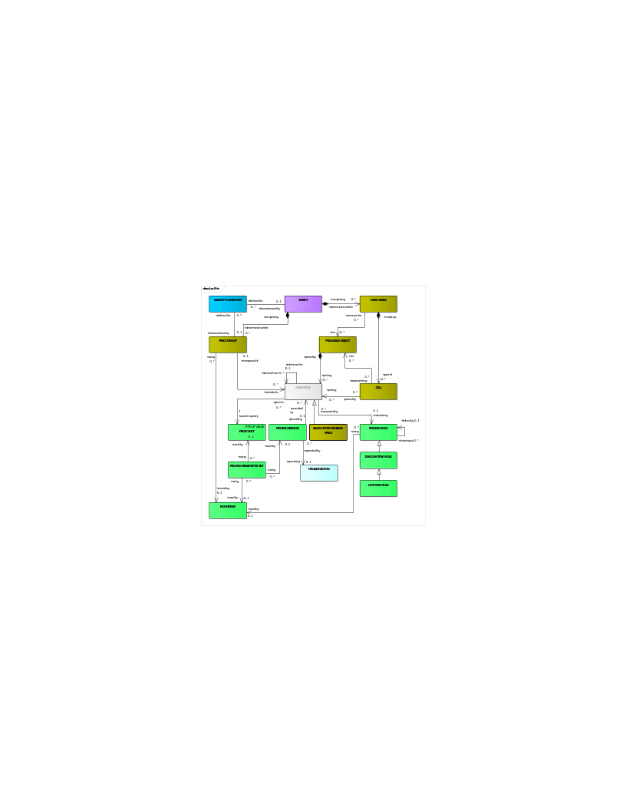 *Prix – Modèle conceptuel*

<div class='table-title'>PriceableObject – Element (abstrait)</div>

<table>
<thead>
<tr class="header">
<th><strong>Classification</strong></th>
<th><strong>Name</strong></th>
<th><strong>Type</strong></th>
<th><strong>Cardinality</strong></th>
<th><strong>Description</strong></th>
</tr>
</thead>
<tbody>
<tr class="odd">
<td>::&gt;</td>
<td>::&gt;</td>
<td><em><u>DataManagedObject</u></em></td>
<td>::&gt;</td>
<td>PRICEABLE OBJECT hérite de DATA MANAGED OBJECT.</td>
</tr>
<tr class="even">
<td>« PK »</td>
<td><em><strong>id</strong></em></td>
<td><em>PriceableObjectIdType</em></td>
<td>1:1</td>
<td>Identifiant du PRICEABLE OBJECT.</td>
</tr>
<tr class="odd">
<td></td>
<td><em><strong>Name</strong></em></td>
<td><em>MultilingualString</em></td>
<td>0:1</td>
<td>Nom du PRICEABLE OBJECT.</td>
</tr>
<tr class="even">
<td></td>
<td><em><strong>Description</strong></em></td>
<td><em>MultilingualString</em></td>
<td>0:1</td>
<td>Description du PRICEABLE OBJECT.</td>
</tr>
<tr class="odd">
<td></td>
<td><em><strong>Url</strong></em></td>
<td><em>xsd:AnyURI</em></td>
<td>0:1</td>
<td>URL d’une page web contenant des information concernant le PRICEABLE
OBJECT.</td>
</tr>
<tr class="even">
<td>« cntd »</td>
<td><em><strong>infoLinks</strong></em></td>
<td><em><u>InfoLink</u></em></td>
<td>0:*</td>
<td>Hypelien d’information additionel</td>
</tr>
<tr class="odd">
<td>« cntd »</td>
<td><em><strong>alternativeNames</strong></em></td>
<td><em><u>AlternativeName</u></em></td>
<td>0:*</td>
<td>Nom alternatif</td>
</tr>
<tr class="even">
<td>« cntd »</td>
<td><em><strong>noticeAssignments</strong></em></td>
<td><em><u>NoticeAssignment</u></em></td>
<td>0:*</td>
<td><p>NOTICE ASSIGNMENTs associé à cet élément.</p>
<p><mark>Note : on n’utilisera cette possibilité de NOTICE que si l’on
n’est pas en mesure de la faire figurer dans la GRILLE TAIFAIRE (FARE
TABLE)</mark></p></td>
</tr>
</tbody>
</table>

<div class='table-title'>FarePrice – Element (abstrait)</div>

| **Classification** | **Name**                                   | **Type**                                     | **Cardinality**                    | **Description**                                                                            |
|--------------------|--------------------------------------------|----------------------------------------------|------------------------------------|--------------------------------------------------------------------------------------------|
| ::\>               | ::\>                                       | *<u>VersionedChild</u>*                      | ::\>                               | FARE PRICE hérite de VERSIONED CHILD                                                       |
| « PK »             | ***id***                                   | *FarePriceIdType*                            | 1:1                                | Identifiant du FARE PRICE.                                                                 |
|                    | ***Name***                                 | *MultilingualString*                         | 0:1                                | Nom du PRICE.                                                                              |
|                    | ***Description***                          | *MultilingualString*                         | 0:1                                | Description du PRICE.                                                                      |
|                    | ***PrivateCode***                          | *PrivateCode*                                | 0:1                                | Identifiant externe du PRICE.                                                              |
|                    | ***StartDate***                            | *xsd:date*                                   | 0:1                                | Date de départ pour la validité du PRICE.                                                  |
|                    | ***EndDate***                              | *xsd:date*                                   | 0:1                                | Date de fin pour la validité du PRICE.                                                     |
|                    | ***Amount***                               | *AmountType*                                 | 0:1                                | Prix dans l’unité monétaire convenue.                                                      |
|                    | ***Currency***                             | *CurrencyType*                               | 0:1                                | Code de devise ISO 4217 (Ceci dans une optimisation permettant d'omettre les PRICE UNITs). |
| « FK »             | ***PriceUnitRef***                         | *PriceUnitRef*                               | 0:1                                | Référence à un PRICE UNIT ; peut-être remplacé par ***Currency***.                          |
|                    | ***<span class="mark-blue">Units</span>*** | *<span class="mark-blue">xsd:decimal</span>* | <span class="mark-blue">0:1</span> | <span class="mark-blue">Nombe d'unités désignée.</span>                                    |
| « FK »             | ***PricingServiceRef***                    | *PricingServiceRef*                          | 0:1                                | Référence à un PRICE SERVICE qui peut fournir le prix (pour la tarification dynamique).    |
| XGRP               | ***FarePriceCalculationGroup***            | ***<u>xmlGroup</u>***                        | 0:1                                | Éléments régissant le calcul des prix.                                                     |
|                    | ***Ranking***                              | *xsd:integer*                                | 0:1                                | Classement relatif du prix par rapport aux autres prix.                                    |

<div class='table-title'>FarePriceCalculationGroup – Group</div>

<table>
<thead>
<tr class="header">
<th><strong>Classification</strong></th>
<th colspan="2"><strong>Name</strong></th>
<th><strong>Type</strong></th>
<th><strong>Cardinality</strong></th>
<th><strong>Description</strong></th>
</tr>
</thead>
<tbody>
<tr class="odd">
<td>« cntd »</td>
<td>b</td>
<td><em><strong>PricingRule</strong></em></td>
<td><em><u>PricingRule</u></em></td>
<td>0:1</td>
<td><p>PRICING RULE utilisée pour claculer le prix.</p>
<p>Peut être une</p>
<blockquote>
<p><em><strong>DiscountingRule</strong></em></p>
<p><em><strong>LimitingRule</strong></em></p>
<p><em><strong>LimitingRuleInContext</strong></em></p>
<p><em><strong>PricingRule</strong></em></p>
</blockquote></td>
</tr>
<tr class="even">
<td></td>
<td colspan="2"><em><strong>CanBeCumulative</strong></em></td>
<td><em>xsd:boolean</em></td>
<td>0:1</td>
<td>Si la remise peut être utilisée de manière cumulative en combinaison
avec d'autres remises.</td>
</tr>
<tr class="odd">
<td>« FK »</td>
<td colspan="2"><em><strong>RoundingRef</strong></em></td>
<td><em>RoundingRef</em></td>
<td>0:1</td>
<td>Arrondi à utiliser pour le calcul.</td>
</tr>
</tbody>
<tbody>
</tbody>
</table>

<div class='table-title'>PricingService – Element</div>

| **Classification** | **Name**              | **Type**                   | **Cardinality** | **Description**                                            |
|--------------------|-----------------------|----------------------------|-----------------|------------------------------------------------------------|
| ::\>               | ::\>                  | *<u>DataManagedObject</u>* | ::\>            | PRICING SERVICE hérite de DATA MANAGED OBJECT.             |
| « PK »             | ***id***              | *PricingServiceIdType*     | 1:1             | Identifiant du PRICING SERVICE.                            |
|                    | ***Name***            | *MultilingualString*       | 0:1             | Nom du PRICING SERVICE.                                    |
|                    | ***Description***     | *MultilingualString*       | 0:1             | Description du PRICING SERVICE.                            |
|                    | ***Url***             | *xsd:anyURI*               | 0:1             | URL à laquelle le service est disponible.                  |
| « FK »             | ***OrganisationRef*** | *(OrganisationRef)*        | 0:1             | ORGANISATION qui fournit des services (coordonnées, etc.). |

<div class='table-title'>PricingRule – Element</div>

| **Classification** | **Name**           | **Type**                   | **Cardinality** | **Description**                             |
|--------------------|--------------------|----------------------------|-----------------|---------------------------------------------|
| ::\>               | ::\>               | *<u>DataManagedObject</u>* | ::\>            | PRICING RULE hérite de DATA MANAGED OBJECT. |
| « PK »             | ***id***           | *PricingRuleIdType*        | 1:1             | Identifiant du PRICING RULE.                |
|                    | ***Name***         | *MultilingualString*       | 0:1             | Nom du PRICING RULE.                        |
|                    | ***Description***  | *MultilingualString*       | 0:1             | Description du PRICING RULE.                |
|                    | ***MethodName***   | *xsd:NCNAME*               | 0:1             | Méthode de calcul associé au PRICING RULE.  |
|                    | ***Currency***     | *CurrencyType*             | 0:1             | Devise associé au PRICING RULE.             |
| « FK »             | ***PriceUnitRef*** | *PriceUnitRef*             | 0:1             | PRICE UNIT pour le PRICING RULE.            |
|                    | ***url***          | *xsd:anyURI*               | 0:1             | URL associé au PRICING RULE.                |

<div class='table-title'>DiscountingRule – Element</div>

| **Classification** | **Name**                   | **Type**                | **Cardinality** | **Description**                                                                                     |
|--------------------|----------------------------|-------------------------|-----------------|-----------------------------------------------------------------------------------------------------|
| ::\>               | ::\>                       | *<u>PricingRule</u>*    | ::\>            | DISCOUNTING RULE hérite de PRICING RULE.                                                            |
| « PK »             | ***id***                   | *DiscountingRuleIdType* | 1:1             | Identifiant du DISCOUNTING RULE.                                                                    |
|                    | ***DiscountAsPercentage*** | *PercentageType*        | 0:1             | Remise du prix en pourcentage.                                                                      |
|                    | ***DiscountAsValue***      | *AmountType*            | 0:1             | Remise du prix en valeur.                                                                           |
|                    | ***CanBeCumulative***      | *xsd:boolean*           | 0:1             | Indique si la remise peut être utilisée de manière cumulative en combinaison avec d'autres remises. |

<div class='table-title'>PriceUnit – Element</div>

| **Classification** | **Name**        | **Type**             | **Cardinality** | **Description**                     |
|--------------------|-----------------|----------------------|-----------------|-------------------------------------|
| ::\>               | ::\>            | *<u>TypeOfValue</u>* | ::\>            | PRICE UNIT hérite de TYPE OF VALUE. |
| « PK »             | ***id***        | *PriceUnitIdType*    | 1:1             | Identifiant du PRICE UNIT.          |
|                    | ***Precision*** | *xsd:integer*        | 0:1             | Précision su PRICE UNIT.            |

***PricingParameterSet*** décrit l'Ensemble de paramètres tarifaires
globaux commun à tous les éléments de la FRAME.

<div class='table-title'>PricingParameterSet – Element</div>

| **Classification** | **Name**                       | **Type**                     | **Cardinality** | **Description**                                                                                                      |
|--------------------|--------------------------------|------------------------------|-----------------|----------------------------------------------------------------------------------------------------------------------|
| ::\>               | ::\>                           | *<u>DataManagedObject</u>*   | ::\>            | PRICING PARAMETER SET hérite de DATA MANAGED OBJECT. Voir NeTEx Partie 1.                                                |
|                    | ***id***                       | *PricingParameterSetIdType*  | 1:1             | Identifiant du PRICING PARAMETER SET.                                                                                |
|                    | ***Name***                     | *MultilingualString*         | 0:1             | Nom du PRICING PARAMETER SET.                                                                                        |
| « cntd »           | ***priceUnits***               | *<u>PriceUnit</u>*           | 0:\*            | PRICE UNITs disponibles.                                                                                             |
| « cntd »           | ***pricingRules***             | *<u>PricingRule</u>*         | 0:1             | PRICING RULEs disponibles.                                                                                           |
|                    | ***AllowCumulativeDiscounts*** | *xsd:boolean*                | 0:1             | Indique si les remises cumulatives sont autorisées.                                                                  |
| « FK »             | ***DayTypeRef***               | *DayTypeRef*                 | 0:1             | FARE DAY par default.                                                                                                |
| « cntd »           | ***monthValidityOffsets***     | *<u>MonthValidityOffset</u>* | 0:12            | Décalages de jours pour chaque mois de l'année à utiliser pour décider de la date d'activation de certains produits. |
| « cntd »           | ***pricingServices***          | *<u>PricingService</u>*      | 0:\*            | PRICING SERVICEs disponibles                                                                                         |

Le ***MonthValidityOffset*** décrit les jours avant (négatif) ou après
(positif) le début du mois où un produit, dont l’activation est basée
sur une période calendaire, devient valide.

<div class='table-title'>MonthValidityOffset – Element</div>

| **Classification** | **Name**        | **Type**                   | **Cardinality** | **Description**                                      |
|--------------------|-----------------|----------------------------|-----------------|------------------------------------------------------|
| ::\>               | ::\>            | *<u>DataManagedObject</u>* | ::\>            | MONTH VALIDITY OFFSET hérite de DATA MANAGED OBJECT. |
|                    | ***Month***     | *month*                    | 1:1             | Numéro de mois                                       |
|                    | ***Name***      | *MultilingualString*       | 0:1             | Nom du MONTH VALIDITY OFFSET.                        |
|                    | ***DayOffset*** | *xsd:integer*              | 1:1             | Nombre de jours par rapport au début du mois.        |

## Utilisation des Notices

Les notes sont un élément important dans la communication sur la
tarification (il suffit de regarder une fiche tarifaire pour voir
qu’elle est truffée d’astérisques et de renvois vers tout une série de
notes). Il faut de plus noter que, dans le contexte particulier du
Profil Tarif France, sa mise en service sera plus délicate que les
autres profils de fait qu’il n’existe que très peu d’offre tarifaire
déjà décrite de façon structurée et numérique (on a encore, en 2021,
majoritairement des pages web et de document PDF pour présenter l’offre
tarifaire) : le travail de représentation structuré initial sera donc
relativement long et conséquent et il sera utile de procéder par étapes.
L’une des solutions pour procéder par étape pourra être de commencer par
ne structurer que les éléments clés de produits : on décrit les
fondamentaux (***FareStructureElement*** comme une origine-destination
ou une validité temporelle d’une heure trente par exemple), le produit
tarifaire (***PreassignedFareProduct***) et l’offre à la vente
(***SalesOfferPackage***) mais avec des droits (***ValidityParameter***,
***UsageParameter***, etc.) très succincts, et on assemble l’ensemble
dans une grille tarifaire (***FareTable***) dans laquelle on ajoute une
note précisant les droits. L’idée ici est typiquement de fournir
suffisamment d’éléments pour qu’un système d’information (calculateur
d’itinéraire, service en contexte MaaS, etc.) puisse proposer le titre
quand il a de grande chance d’être pertinent et que la note associée
permette à l’usager de décider si le titre lui convient ou pas.

La figure ci-dessous montre un titre TER (Bourgogne-Franche-Compté) que
l’on peut décrire en détail avec NeTEx mais qui nécessite de nombreux
éléments de profil utilisateur combinés (salarié des entreprises, agent
des administrations, autre professionnels…), qui nécessitera aussi un
enregistrement du professionnel ou de sa société, etc. Ces éléments de
droits d’accès et de profil utilisateur peuvent, en première approche,
être insérés dans une note : en réutilisant le titre
(***PreassignedFareProduct***) « standard » on créera une offre à la
vente (***SalesOfferPackage***) dédiée que l’on associera, dans la
grille tarifaire (***FareTable***) à une note (***Notice***) et à
l’information sur la réduction correspondant (via un ***FarePrice***),
ici de 30%.

 *Exemple de tarif particulier pouvant justifier
l’usage d’une note pour le simplifier*

<span class="mark">Autre élément important dans le cadre de ce profil :
les Notices seront exclusivement rattachées aux grilles tarifaires
(***FareTable***), qui permettra en fait de l’associer à une offre à la
vente (***SalesOfferPackage***), ou éventuellement à un produit
tarifaire (***PreassignedFareProduct***). Théoriquement une note peut
être attachée à n’importe quel objet mais attacher les note sans règle à
de nombreux endroits rendrait l’exploitation de la donnée très
délicate.</span>

Il sera aussi souvent utile de pouvoir proposer des traductions des
notes dans différentes langues : on procédera naturellement à ces
traduction grâce à l’élément ***AlternativeText*** (décrit dans le
document **NF_Profil NeTEx éléments communs(F)** à partir de la version
2).

### Exemple minimal

L’exemple ci-dessous illustre la description d’un tarif minimal :
l’option prise dans cette exemple est d’être le plus simple et compact
possible, mais cette simplification a pour conséquence qu’un calculateur
d’itinéraire, s’il aura la possibilité de présenter cette offre pour les
réseau concernés, ne pourra pas vérifier qu’il est pertinent pour un
itinéraire proposé (seul le texte indique que la durée d’utilisation et
d’une heure trente au maximum par exemple). Le même exemple est proposé
de façon un tout petit peu plus détaillé en ***B.2-Tarif simple*** (il
ajoute en particulier un élément de structure tarifaire de type
`TimeInterval` qui pourra être utilisé par par le calculateur
d’itinéraire).

``` xml
<?xml version="1.0"?>
<PublicationDelivery xmlns="http://www.netex.org.uk/netex" xmlns:xsi="http://www.w3.org/2001/XMLSchemainstance" xsi:schemaLocation="http://www.netex.org.uk/netex ./xsd/NeTEx_publication.xsd" version="1.1">
  <!--- =============== ENTETE =========== -->
  <PublicationTimestamp>2019-06-12T09:30:47.0Z</PublicationTimestamp>
  <ParticipantRef>AURIGE001</ParticipantRef>
  <!-- ========== DONNEES =========== -->
  <dataObjects>
    <!-- =========================================== -->
    <!-- CompositeFrame.de type NETEX_FRANCE -->
    <CompositeFrame version="1" created="2019-06-12T09:30:47.0Z" id="FR-Tarif-Example:CompositeFrame:myFrame01:LOC">
      <frames>
        <!-- =========================================== -->
        <!-- Frame NETEX_TARIF -->
        <GeneralFrame version="001" id="FR-Tarif-Example:TypeOfFrame:NETEX_TARIF-Example1:LOC">
          <TypeOfFrameRef ref="FR:TypeOfFrame:NETEX_TARIF">version="1.01:FR-NETEX_TARIF-1.0"</TypeOfFrameRef>
          <members modificationSet="all">
            <!-- ======================================================================== -->
            <!-- LE TITRE -->
            <PreassignedFareProduct id="FR-Tarif-Example:PreassignedFareProduct:T+001:LOC" version="any">
              <Name>Ticket 1h30</Name>
              <AuthorityRef ref="FR-Tarif-Example:Authority:IDFM:"/>
              <ConditionSummary>
                <TariffBasis>period</TariffBasis>
                <CanBreakJourney>false</CanBreakJourney>
                <IsRefundable>false</IsRefundable>
                <IsExchangable>false</IsExchangable>
              </ConditionSummary>
              <ProductType>singleTrip</ProductType>
            </PreassignedFareProduct>
            <!-- ======================================================================= -->
            <!-- FARE TABLE avec affectation des prix -->
            <!-- Version minimaliste sans SalesOfferPackage (le lien direct avec FareProduct) -->
            <FareTable version="any" id="lFR-Tarif-Example:TickeT+FareTable:001:LOC">
              <Name> Bus Fare Prices - 18+Student </Name>
              <cells>
                <Cell version="any" id="FR-Tarif-Example:Cell:001:LOC" order="1">
                  <SalesOfferPackagePrice version="any" id="lFR-Tarif-Example:SalesOfferPackagePrice:001:LOC">
                    <Name>Ticket 1h30</Name>
                    <Amount>1.90</Amount>
                  </SalesOfferPackagePrice>
                  <PreassignedFareProductRef ref="FR-Tarif-Example:PreassignedFareProduct:T+001:LOC" version="any"/>
                  <NetworkRef ref="FR-Tarif-Example:Network:001:"/>
                  <!--Réseau concerné-->
                  <noticeAssignments>
                    <NoticeAssignmentView>
                      <Text>Ticket 1h30 - a l'unit&#xE9; plein tarif &#x2013; Aller/retour interdit, gratuit pour le moins de 4 ans, ticket disponible en agence uniquement</Text>
                      <CanBeAdvertised>true</CanBeAdvertised>
                    </NoticeAssignmentView>
                  </noticeAssignments>
                </Cell>
                <!-- etc. -->
              </cells>
            </FareTable>
            <!-- ======================================================================== -->
          </members>
        </GeneralFrame>
      </frames>
    </CompositeFrame>
  </dataObjects>
</PublicationDelivery>
```

# Entêtes NeTEx

*Note: les entêtes NeTEx sont présentés dans le document éléments
communs. Seules les spécificités du profil NETEX_TARIF sont présentées
ici.*

## TypeOfFrame : type spécifique *NETEX_TARIF*

Le présent profil utilise un *TypeOfFrame* spécifique, identifié
***NETEX_TARIF***. Il apparaitra systématiquement et explicitement dans
les éléments ***members*** du ***GeneralFrame***.

<div class='table-title'>TypeOfFrame – Element</div>

<table>
<thead>
<tr class="header">
<th><strong>Classifi­cation</strong></th>
<th><strong>Nom</strong></th>
<th><strong>Type</strong></th>
<th></th>
<th><strong>Description</strong></th>
</tr>
</thead>
<tbody>
<tr class="odd">
<td>::&gt;</td>
<td>::&gt;</td>
<td><em>TypeOfValueDataManagedObject</em></td>
<td><em>::&gt;::&gt;</em></td>
<td><p>TYPE OF FRAME hérite de TYPE OF VALUE.</p>
<p><mark>L'Id est imposé à NETEX_TARIF</mark></p></td>
</tr>
<tr class="even">
<td>« cntd »</td>
<td><em><strong>classes</strong></em></td>
<td><em>ClassInContextRef</em></td>
<td>0:*</td>
<td><p>Liste des classes pouvant être contenues dans ce TYPE OF FRAME.</p>
<p><mark>La liste est fixe pour NETEX_TARIF:</mark></p>
<ul>
<li><p><mark>FARE STRUCTURE ELEMENT</mark></p></li>
<li><p><mark>FARE STRUCTURE ELEMENT IN SEQUENCE</mark></p></li>
<li><p><mark>QUALITY STRUCTURE FACTOR</mark></p></li>
<li><p><mark>FARE DEMAND FACTOR</mark></p></li>
<li><p><mark>TIME DEMAND TYPE</mark></p></li>
<li><p><mark>FARE QUOTA FACTOR</mark></p></li>
<li><p><mark>TARIFF</mark></p></li>
<li><p><mark>TIME INTERVAL</mark></p></li>
<li><p><mark>TIME STRUCTURE FACTOR</mark></p></li>
<li><p><mark>TIME UNIT</mark></p></li>
<li><p><mark>GEOGRAPHICAL INTERVAL</mark></p></li>
<li><p><mark>GEOGRAPHICAL UNIT</mark></p></li>
<li><p><mark>GEOGRAPHICAL STRUCTURE FACTOR</mark></p></li>
<li><p><mark>DISTANCE MATRIX ELEMENT</mark></p></li>
<li><p><mark>GROUP OF DISTANCE MATRIX ELEMENTS</mark></p></li>
<li><p><mark>VALIDABLE ELEMENT</mark></p></li>
<li><p><mark>CONTROLLABLE ELEMENT</mark></p></li>
<li><p><mark>PREASSIGNED FARE PRODUCT</mark></p></li>
<li><p><mark>SALE DISCOUNT RIGHT</mark></p></li>
<li><p><mark>CAPPED DISCOUNT RIGHT</mark></p></li>
<li><p><mark>SUPPLEMENT PRODUCT</mark></p></li>
<li><p><mark>USAGE DISCOUNT RIGHT</mark></p></li>
<li><p><mark>THIRD PARTY PRODUCT</mark></p></li>
<li><p><mark>SALES OFFER PACKAGE</mark></p></li>
<li><p><mark>GROUP OF SALES OFFER PACKAGES</mark></p></li>
<li><p><mark>TYPE OF TRAVEL DOCUMENT</mark></p></li>
<li><p><mark>DISTRIBUTION CHANNEL</mark></p></li>
<li><p><mark>DISTRIBUTION ASSIGNMENT</mark></p></li>
<li><p><mark>ACCESS RIGHT PARAMETER ASSIGNMENT</mark></p></li>
<li><p><mark>USAGE VALIDITY PARAMETER</mark></p></li>
<li><p><mark>VALIDITY PARAMETER ASSIGNMENT</mark></p></li>
<li><p><mark>GENERIC PARAMETER ASSIGNMENT</mark></p></li>
<li><p><mark>SCOPING VALIDITY PARAMETERS</mark></p></li>
<li><p><mark>USAGE PARAMETER (and all inheriting
objects)</mark></p></li>
<li><p><mark>FARE TABLE (and associated object, cell,
etc.)</mark></p></li>
<li><p><mark>SALES OFFER PACKAGE PRICE</mark></p></li>
<li><blockquote>
<p><mark>PRICING SERVICE</mark></p>
</blockquote></li>
</ul></td>
</tr>
</tbody>
</table>

<div class='table-title'>TypeOfValue (pour le TypeOfFrame NETEX\_ HORAIRE) – Element</div>

<table>
<thead>
<tr class="header">
<th><strong>Classifi­cation</strong></th>
<th><strong>Name</strong></th>
<th><strong>Type</strong></th>
<th></th>
<th><strong>Description</strong></th>
<th></th>
</tr>
</thead>
<tbody>
<tr class="odd">
<td>::&gt;</td>
<td>::&gt;</td>
<td><em>DataManagedObject</em></td>
<td>::&gt;</td>
<td><p>TYPE OF VALUE hérite de DATA MANAGED OBJECT.</p>
<p><mark>L’attribut <em><strong>version</strong></em> portera la version
du profil.</mark></p>
<p><mark>L'Identifiant du TYPE OF VALUE est imposé à
NETEX_TARIF.</mark></p></td>
<td></td>
</tr>
<tr class="even">
<td></td>
<td><em><strong>Name</strong></em></td>
<td><em>MultilingualString</em></td>
<td>1:1</td>
<td><p>Nom du TYPE OF VALUE.</p>
<p><mark>Imposé à « NETEX TARIF ».</mark></p></td>
<td></td>
</tr>
<tr class="odd">
<td></td>
<td><em><strong>Description</strong></em></td>
<td><em>MultilingualString</em></td>
<td>1:1</td>
<td><p>Description du TYPE OF VALUE.</p>
<p><mark>Imposé à « Profil d’échange français NETEX
TARIF ».</mark></p></td>
<td></td>
</tr>
</tbody>
</table>

<div class="annexes">

# Usage Parameters

Les CONDITIONS D’UTILISATION (USAGE PARAMETER) sont nombreuses, mais il
est difficile d’en faire une sélection dans le cadre du profil car la
diversité des offres tarifaire est telle qu’il n’est pas possible
d’affirmer que telle CONDITION d’UTILISATION n’est (et ne sera) utile
nulle part en France. Les tableaux ci-dessous fournissent, pour mémoire,
donc l’intégralité des CONDITIONS D’UTILISATION proposées par NeTEx (non
traduit en Français, donc en Anglais).

## Usage Parameter: Travel – Attributes

### RoundTrip – Element

*Properties relating to single or return trip use of an access right.*

<div class='table-title'>RoundTrip – Element</div>

<table>
<thead>
<tr class="header">
<th><strong>Classification</strong></th>
<th><strong>Name</strong></th>
<th><strong>Type</strong></th>
<th><strong>Cardinality</strong></th>
<th><strong>Description</strong></th>
</tr>
</thead>
<tbody>
<tr class="odd">
<td>::&gt;</td>
<td>::&gt;</td>
<td><em><u>UsageParameter</u></em></td>
<td>::&gt;</td>
<td>ROUND TRIP hérite de USAGE PARAMETER.</td>
</tr>
<tr class="even">
<td>« PK »</td>
<td><em><strong>id</strong></em></td>
<td><em>RoundTripIdType</em></td>
<td>1:1</td>
<td><p>Identifiant du ROUND TRIP.</p>
<ul>
<li><p><em>single Single trip.</em></p></li>
<li><p><em>return Outbound and return trip.</em></p></li>
<li><p><em>returnOut Outbound leg of return journey</em></p></li>
<li><p><em>returnBack Return leg of return journey.</em></p></li>
<li><p><em>returnOnly Return trip only</em></p></li>
<li><p><em>multiple Multiple trip.</em></p></li>
</ul></td>
</tr>
<tr class="odd">
<td></td>
<td><em><strong>TripType</strong></em></td>
<td><em>xsd:boolean</em></td>
<td>0:1</td>
<td>Whether return trip is allowed.</td>
</tr>
<tr class="even">
<td></td>
<td><em><strong>DoubleSingleFare</strong></em></td>
<td><em>xsd:boolean</em></td>
<td>0:1</td>
<td>Whether fare for return trip is single fare doubled.</td>
</tr>
<tr class="odd">
<td></td>
<td><em><strong>ShortTrip</strong></em></td>
<td><em>xsd:boolean</em></td>
<td>0:1</td>
<td>Whether trip is classified as a short trip for fares.</td>
</tr>
<tr class="even">
<td></td>
<td><em><strong>IsRequired</strong></em></td>
<td><em>xsd:boolean</em></td>
<td>0:1</td>
<td>Whether return trip is required.</td>
</tr>
</tbody>
</table>

### Routing – Element

*Limitations on routing of an access right.*

<div class='table-title'>Routing – Element</div>

| **Classification** | **Name**                   | **Type**                | **Cardinality** | **Description**                                                                                                                                               |
|--------------------|----------------------------|-------------------------|-----------------|---------------------------------------------------------------------------------------------------------------------------------------------------------------|
| ::\>               | ::\>                       | *<u>UsageParameter</u>* | ::\>            | ROUTING hérite de USAGE PARAMETER.                                                                                                                            |
| « PK »             | ***id***                   | *RoutingIdType*         | 1:1             | Identifiant du ROUTING.                                                                                                                                       |
|                    | ***ReturnRouteIdentical*** | *xsd:boolean*           | 0:1             | Whether return route shall be same as outbound route.                                                                                                         |
|                    | ***ForwardsOnly***         | *xsd:boolean*           | 0:1             | Whether passenger may only take routes that proceed in a single direction. (They may not use product to achieve a return trip for the cost of a single trip). |
|                    | ***IsRestricted***         | *xsd:boolean*           | 0:1             | Whether only allowed on certain routes or series.                                                                                                             |
|                    | ***CrossBorder***          | *xsd:boolean*           | 0:1             | Whether the routing is across a border.                                                                                                                       |

### FrequencyOfUse – Element

*The limits of usage frequency for a FARE PRODUCT (or one of its
components) or a SALES OFFER PACKAGE during a specific VALIDITY PERIOD.
There may be different tariffs depending on how often the right is
consumed during the period.*

<div class='table-title'>FrequencyOfUse – Element</div>

<table>
<thead>
<tr class="header">
<th><strong>Classification</strong></th>
<th><strong>Name</strong></th>
<th><strong>Type</strong></th>
<th><strong>Cardinality</strong></th>
<th><strong>Description</strong></th>
</tr>
</thead>
<tbody>
<tr class="odd">
<td>::&gt;</td>
<td>::&gt;</td>
<td><em>UsageParameter</em></td>
<td>::&gt;</td>
<td>FREQUENCY OF USE hérite de USAGE PARAMETER.</td>
</tr>
<tr class="even">
<td>« PK »</td>
<td><em><strong>id</strong></em></td>
<td><em>FrequencyOfUseIdType</em></td>
<td>1:1</td>
<td>Identifiant du FREQUENCY OF USE.</td>
</tr>
<tr class="odd">
<td>« enum »</td>
<td><em><strong>FrequencyOfUseType</strong></em></td>
<td><em>FrequencyOfUseEnum</em></td>
<td>0:1</td>
<td><p>Type of Frequency of Use. See allowed values below.</p>
<ul>
<li><p><em>none No use changes allowed.</em></p></li>
<li><p><em>single Single use allowed.</em></p></li>
<li><p><em>limited Limited use allowed.</em></p></li>
<li><p><em>unlimited Unlimited use allowed.</em></p></li>
<li><p><em>twiceADay Can be used twice a day.</em></p></li>
</ul></td>
</tr>
<tr class="even">
<td></td>
<td><em><strong>MinimalFrequency</strong></em></td>
<td><em>xsd:integer</em></td>
<td>0:1</td>
<td>Minimum number of times can be used.</td>
</tr>
<tr class="odd">
<td></td>
<td><em><strong>MaximalFrequency</strong></em></td>
<td><em>xsd:integer</em></td>
<td>0:1</td>
<td>Maximum number of times can be used.</td>
</tr>
<tr class="even">
<td></td>
<td><em><strong>FrequencyInterval</strong></em></td>
<td><em>xsd:duration</em></td>
<td>0:1</td>
<td>Interval within which frequency is measured. If absent forever.</td>
</tr>
<tr class="odd">
<td>« FK »</td>
<td><em><strong>TimeIntervalRef</strong></em></td>
<td><em>TimeIntervalRef</em></td>
<td>0:1</td>
<td>Interval within which frequency is measured. - as Référence au
arbitrary time interval.</td>
</tr>
<tr class="even">
<td>« enum »</td>
<td><em><strong>DiscountBasis</strong></em></td>
<td><em>DiscountBasisEnum</em></td>
<td>0:1</td>
<td><p>Nature of discount for number of journeys. See allowed values
below.</p>
<ul>
<li><p><em>none No companion allowed.</em></p></li>
<li><p><em>free Companion allowed for free</em></p></li>
<li><p><em>discount Companion allowed at discount</em></p></li>
</ul></td>
</tr>
</tbody>
</table>

### Interchanging – Element

*Limitations on making changes within a trip.*

<div class='table-title'>Interchanging – Element</div>

<table>
<thead>
<tr class="header">
<th><strong>Classification</strong></th>
<th><strong>Name</strong></th>
<th><strong>Type</strong></th>
<th><strong>Cardinality</strong></th>
<th><strong>Description</strong></th>
</tr>
</thead>
<tbody>
<tr class="odd">
<td>::&gt;</td>
<td>::&gt;</td>
<td><em><u>UsageParameter</u></em></td>
<td>::&gt;</td>
<td>INTERCHANGING hérite de USAGE PARAMETER.</td>
</tr>
<tr class="even">
<td>« PK »</td>
<td><em><strong>id</strong></em></td>
<td><em>InterchangingIdType</em></td>
<td>1:1</td>
<td>Identifiant du INTERCHANGING.</td>
</tr>
<tr class="odd">
<td></td>
<td><em><strong>CanInterchange</strong></em></td>
<td><em>xsd:boolean</em></td>
<td>0:1</td>
<td>Whether an interchange can be made.</td>
</tr>
<tr class="even">
<td>« enum »</td>
<td><em><strong>FromMode</strong></em></td>
<td><em>VehicleModeEnum</em></td>
<td>0:1</td>
<td>TRANSPORT MODE from which user is interchanging. See NeTEx Part1 for
allowed values.</td>
</tr>
<tr class="odd">
<td>« enum »</td>
<td><em><strong>ToMode</strong></em></td>
<td><em>VehicleModeEnum</em></td>
<td>0:1</td>
<td>TRANSPORT MODE to which user is interchanging. See NeTEx Part1 for
allowed values.</td>
</tr>
<tr class="even">
<td></td>
<td><em><strong>MaximumNumberOfChanges</strong></em></td>
<td><em>xsd:integer</em></td>
<td>0:1</td>
<td>Maximum number of transfers that can be made on a trip.</td>
</tr>
<tr class="odd">
<td></td>
<td><em><strong>MaximumTimeToMakeATransfer</strong></em></td>
<td><em>xsd:duration</em></td>
<td>0:1</td>
<td>Maximum time allowed to make a transfer.</td>
</tr>
<tr class="even">
<td></td>
<td><em><strong>CanBreakJourney</strong></em></td>
<td><em>xsd:boolean</em></td>
<td>0:1</td>
<td>Whether the journey can be broken at an interchange point.</td>
</tr>
<tr class="odd">
<td></td>
<td><em><strong>CrossBorder</strong></em></td>
<td><em>xsd:boolean</em></td>
<td>0:1</td>
<td>Whether the interchange is across a border.</td>
</tr>
<tr class="even">
<td>« enum »</td>
<td><em><strong>RegisterBreakOfJourney</strong></em></td>
<td><em>RegisterBreakOfJourneyEnum</em></td>
<td>0:*</td>
<td><p>Whether the Journey can be interrupted, i.e. leave stop point and
return. See allowed values below.</p>
<ul>
<li><p><em>none No action needed.</em></p></li>
<li><p><em>markByStaff Journey break shall be marked by operator
staff.</em></p></li>
<li><p><em>markByValidator Journey break shall be marked by
validator.</em></p></li>
<li><p><em>markByMobileApp Journey break shall be marked using mobile
application.</em></p></li>
<li><p><em>other Journey break shall be marked by other
means.</em></p></li>
</ul></td>
</tr>
</tbody>
</table>

### MinimumStay – Element

Details of any minimum stay at the destination required to use the
product.

<div class='table-title'>MinimumStay – Element</div>

<table>
<thead>
<tr class="header">
<th><strong>Classification</strong></th>
<th><strong>Name</strong></th>
<th><strong>Type</strong></th>
<th><strong>Cardinality</strong></th>
<th><strong>Description</strong></th>
</tr>
</thead>
<tbody>
<tr class="odd">
<td>::&gt;</td>
<td>::&gt;</td>
<td><em>UsageParameter</em></td>
<td>::&gt;</td>
<td>MINIMUM STAY hérite de USAGE PARAMETER.</td>
</tr>
<tr class="even">
<td>« PK »</td>
<td><em><strong>id</strong></em></td>
<td><em>MinimumStayIdType</em></td>
<td>1:1</td>
<td>Identifiant du MINIMUM STAY parameter.</td>
</tr>
<tr class="odd">
<td></td>
<td><em><strong>MinimumStayType</strong></em></td>
<td><em>MinimumStay</em></td>
<td>0:1</td>
<td><p>Nature of Minimum stay requirements. See allowed values
below.</p>
<ul>
<li><p><em>none Starts on purchase.</em></p></li>
<li><p><em>specifiedNightsAway Shall spend specified nights
away.</em></p></li>
<li><p><em>countNightsAway Shall spend the specified number of nights
away.</em></p></li>
<li><p><em>either Shall spend either the specified number of nights away
or the specified nights</em></p></li>
<li><p><em>both Shall spend the specified number of nights away which
shall be from the specified nights.</em></p></li>
</ul></td>
</tr>
<tr class="even">
<td>« enum »</td>
<td><em><strong>RequiredNightsAway</strong></em></td>
<td><em>DayOfWeekEnum</em></td>
<td>0:7</td>
<td>Specific nights which shall be spent away. See NeTEx Part1.</td>
</tr>
<tr class="odd">
<td></td>
<td><em><strong>MinimumNumberOfNightsAway</strong></em></td>
<td><em>xsd:integer</em></td>
<td>0:1</td>
<td>Minimum number of nights that shall be spent away.</td>
</tr>
<tr class="even">
<td></td>
<td><em><strong>MaximumNumberOfNightsAway</strong></em></td>
<td><em>xsd:integer</em></td>
<td>0:1</td>
<td>Minimum number of nights that can be spent away.</td>
</tr>
</tbody>
</table>

### StepLimit – Element

Geographical parameter limiting the access rights by counts of stops,
sections or zones.

<div class='table-title'>StepLimit – Element</div>

<table>
<thead>
<tr class="header">
<th><strong>Classification</strong></th>
<th><strong>Name</strong></th>
<th><strong>Type</strong></th>
<th><strong>Cardinality</strong></th>
<th><strong>Description</strong></th>
</tr>
</thead>
<tbody>
<tr class="odd">
<td>::&gt;</td>
<td>::&gt;</td>
<td><em>UsageParameter</em></td>
<td>::&gt;</td>
<td>STEP LIMIT hérite de USAGE PARAMETER.</td>
</tr>
<tr class="even">
<td>« PK »</td>
<td><em><strong>id</strong></em></td>
<td><em>StepLimitIdType</em></td>
<td>1:1</td>
<td>Identifiant du STEP LIMIT parameter.</td>
</tr>
<tr class="odd">
<td></td>
<td><em><strong>Restricted</strong></em></td>
<td><em>xsd:boolean</em></td>
<td>0:1</td>
<td>Whether restricted to a number of stops.</td>
</tr>
<tr class="even">
<td>« enum »</td>
<td><em><strong>StepUnits</strong></em></td>
<td><em>StepUnitEnum</em></td>
<td>0:`</td>
<td><p>Units in which steps are counted. See allowed values below.</p>
<ul>
<li><p><em>stops Step limit applies to number of stops at which user
enters or changes.</em></p></li>
<li><p><em>stopsIncludingPassThroughStops Step limit applies to number
of stops including stops passed though.</em></p></li>
<li><p><em>sections Step limit applies to number of sections passed
though.</em></p></li>
<li><p><em>zones Step ep limit applies to number of zones passed
though.</em></p></li>
<li><p><em>networks Step limit applies to number of networks passed
though.</em></p></li>
<li><p><em>operators Step limit applies to number of operators
used.</em></p></li>
<li><p><em>countries Step limit applies to number of countries passed
though.</em></p></li>
</ul></td>
</tr>
<tr class="odd">
<td></td>
<td><em><strong>MinimumNumberOfSteps</strong></em></td>
<td><em>xsd:integer</em></td>
<td>0:1</td>
<td>Minimum number of steps allowed.</td>
</tr>
<tr class="even">
<td></td>
<td><em><strong>MaximumNumberOfSteps</strong></em></td>
<td><em>xsd:integer</em></td>
<td>0:1</td>
<td>Maximum number of steps allowed.</td>
</tr>
<tr class="odd">
<td></td>
<td><em><strong>MaximumNumberOfTrips</strong></em></td>
<td><em>xsd:integer</em></td>
<td>0:1</td>
<td>Maximum number of trips allowed.</td>
</tr>
</tbody>
</table>

### UsageValidityPeriod – Element

*A time limitation for validity of a FARE PRODUCT or a SALES OFFER
PACKAGE. It may be composed of a standard duration (e.g. 3 days, 1
month) and/or fixed start/end dates and times.*

<div class='table-title'>UsageValidityPeriod – Element</div>

<table>
<thead>
<tr class="header">
<th><strong>Classification</strong></th>
<th><strong>Name</strong></th>
<th><strong>Type</strong></th>
<th><strong>Cardinality</strong></th>
<th><strong>Description</strong></th>
</tr>
</thead>
<tbody>
<tr class="odd">
<td>::&gt;</td>
<td>::&gt;</td>
<td><em>UsageParameter</em></td>
<td>::&gt;</td>
<td>USAGE VALIDITY PERIOD hérite de USAGE PARAMETER.</td>
</tr>
<tr class="even">
<td>« PK »</td>
<td><em><strong>id</strong></em></td>
<td><em>UsageValidityPeriodIdType</em></td>
<td>1:1</td>
<td>Identifiant du USAGE VALIDITY PERIOD.</td>
</tr>
<tr class="odd">
<td>« enum »</td>
<td><em><strong>ValidityType</strong></em></td>
<td><em>ValidityTypeEnum</em></td>
<td>0:*</td>
<td><p>Type of USAGE VALIDITY PERIOD. See allowed values below.</p>
<ul>
<li><p><em>singleRide A single ride.</em></p></li>
<li><p><em>singleTrip A single trip.</em></p></li>
<li><p><em>returnTrip A return trip.</em></p></li>
<li><p><em>carnet A number of individual trips.</em></p></li>
<li><p><em>dayPass Ticket valid for a day.</em></p></li>
<li><p><em>weeklyPass Valid for one week.</em></p></li>
<li><p><em>weekendPass Valid for one weekend.</em></p></li>
<li><p><em>monthlyPass Valid for one month.</em></p></li>
<li><p><em>annualPass Valid for one year.</em></p></li>
<li><p><em>seasonTicket Ticket valid for specified period of several
days, weeks or months.</em></p></li>
<li><p><em>profileMembership Ticket valid while member of a COMMERCIAL
PROFILE or USER PROFILE.</em></p></li>
<li><p><em>subscription Product valid for specified period of
subscription.</em></p></li>
<li><p><em>openEnded Ticket valid until otherwise
notified.</em></p></li>
<li><p><em>other Other Validity period</em></p></li>
</ul></td>
</tr>
<tr class="even">
<td>« enum »</td>
<td><em><strong>UsageTrigger</strong></em></td>
<td><em>UsageTriggerEnum</em></td>
<td>0:1</td>
<td><p>Trigger event that starts validity period. See allowed values
below.</p>
<ul>
<li><p><em>startOfPeriod Start of period. Beginning time for period in
which first use occurs (for Capping products)</em></p></li>
<li><p><em>startOutboundRide Start of outbound trip.</em></p></li>
<li><p><em>endOutboundRide End of outbound trip.</em></p></li>
<li><p><em>startReturnRide Start of return trip</em></p></li>
<li><p><em>enrolment Validity period starts when user registers (e.g.
creates a customer account).</em></p></li>
<li><p><em>reservation Validity period starts when user makes a
reservation.</em></p></li>
<li><p><em>purchase Starts on purchase.</em></p></li>
<li><p><em>activation Validity period starts when user activates a
product.</em></p></li>
<li><p><em>specifiedStartDate Start date specified at purchase - may be
different from purchase date.</em></p></li>
<li><p><em>fulfilment Starts on collection.</em></p></li>
<li><p><em>dayOffsetBeforeCalendarPeriod Becomes valid a given number
days before start of calendar period where number of days is specified
by a MONTH VALIDITY OFFSET.</em></p></li>
</ul></td>
</tr>
<tr class="odd">
<td>« enum »</td>
<td><em><strong>UsageEnd</strong></em></td>
<td><em>UsageEndEnum</em></td>
<td>0:1</td>
<td><p>Classification du when the end of the Usage validity period
occurs. May be a specified period (Standard Duration) or an event, e.g.
end of trip. See allowed values below.</p>
<ul>
<li><p><em>standardDuration Period Ticket valid for specified after
validation. May be in terms of trip or a specified period.</em></p></li>
<li><p><em>endOfCalendarPeriod Ticket valid to end of calendar
period.</em></p></li>
<li><p><em>endOfRide Ticket valid to end of ride.</em></p></li>
<li><p><em>endOfTrip Ticket valid to end of trip - may be several
rides.</em></p></li>
<li><p><em>endOfFareDay Ticket valid to end of fare day.</em></p></li>
<li><p><em>endOfFarePeriod Ticket valid to end of fare
period.</em></p></li>
<li><p><em>productExpiry Product valid to end of product - for a travel
card withe expiry date.</em></p></li>
<li><p><em>deregistration Product valid until
deregistration.</em></p></li>
<li><p><em>profileExpiry Ticket valid while member of a profile. Stops
when ends.</em></p></li>
<li><p><em>other Other Validity period.</em></p></li>
</ul></td>
</tr>
<tr class="even">
<td></td>
<td><em><strong>StandardDuration</strong></em></td>
<td><em>xsd:duration</em></td>
<td>0:1</td>
<td>Duration of VALIDITY PERIOD after departure. or validation</td>
</tr>
<tr class="odd">
<td>« enum »</td>
<td><em><strong>ActivationMeans</strong></em></td>
<td><em>ActivationMeansEnum</em></td>
<td>0:1</td>
<td><p>Means of activatiing start of period. See allowed values
below.</p>
<ul>
<li><p><em>noneRequired No activation required.</em></p></li>
<li><p><em>checkIn Activation occurs automatically on check-in at
barrier, etc.</em></p></li>
<li><p><em>useOfValidator Activation occurs on use of
validator.</em></p></li>
<li><p><em>useOfMobileDevice Activation is made by using mobile
device.</em></p></li>
<li><p><em>automaticByTime Activation occurs automatically at specified
time of travel.</em></p></li>
<li><p><em>automaticByProximity Activation occurs automatically by
proximity to stop and/or vehicle.</em></p></li>
<li><p><em>other Other means of activation.</em></p></li>
</ul></td>
</tr>
<tr class="even">
<td></td>
<td><em><strong>StartDate</strong></em></td>
<td><em>xsd:date</em></td>
<td>0:1</td>
<td>Start date for VALIDITY PERIOD.</td>
</tr>
<tr class="odd">
<td></td>
<td><em><strong>StartTime</strong></em></td>
<td><em>xsd:time</em></td>
<td>0:1</td>
<td>Start time for VALIDITY PERIOD.</td>
</tr>
<tr class="even">
<td></td>
<td><em><strong>EndDate</strong></em></td>
<td><em>xsd:date</em></td>
<td>0:1</td>
<td>End date for VALIDITY PERIOD.</td>
</tr>
<tr class="odd">
<td></td>
<td><em><strong>EndTime</strong></em></td>
<td><em>xsd:time</em></td>
<td>0:1</td>
<td>End time for VALIDITY PERIOD.</td>
</tr>
</tbody>
</table>

### UsageValidityPeriodStartConstraintGroup – Group

*Elements relating to the start of the Validity Period.*

<div class='table-title'>UsageValidityPeriodStartConstraintGroup – Group</div>

<table>
<thead>
<tr class="header">
<th><strong>Classification</strong></th>
<th><strong>Name</strong></th>
<th><strong>Type</strong></th>
<th><strong>Cardinality</strong></th>
<th><strong>Description</strong></th>
</tr>
</thead>
<tbody>
<tr class="odd">
<td>« enum »</td>
<td><em><strong>UsageStartConstraintType</strong></em></td>
<td><em>UsageStartConstraintEnum</em></td>
<td>0:1</td>
<td><p>Whether start type of trip or pass is variable or fixed. See
allowed values below.</p>
<ul>
<li><p><em>variable Validity start date can be chosen by
user.</em></p></li>
<li><p><em>fixed Validity start date is constrained. For a pass to
certain days of week, month or year. For a trip to a specific
train.</em></p></li>
<li><p><em>fixedWindow Validity start date for a trip is constrained
relative to start of booked service, e.g. may catch previous train as
well.</em></p></li>
<li><p><em>noTravelWithinTimeband No travel permitted within exclusion
time band of a day.</em></p></li>
</ul></td>
</tr>
<tr class="even">
<td>« cntd »</td>
<td><em><strong>startOnlyOn</strong></em></td>
<td><em>DayType</em></td>
<td>0:*</td>
<td>Prices for the USAGE PARAMETER.</td>
</tr>
<tr class="odd">
<td></td>
<td><em><strong>MaximumServicesBefore</strong></em></td>
<td><em>xsd:nonNegativeInteger</em></td>
<td>0:1</td>
<td>If <em><strong>UsageStartConstraintType</strong></em> is
"fixedWindow", maximum number of services before the booked train that
may also be used.</td>
</tr>
<tr class="even">
<td></td>
<td><em><strong>FlexiblePeriodBefore</strong></em></td>
<td><em>xsd:duration</em></td>
<td>0:1</td>
<td>If <em><strong>UsageStartConstraintType</strong></em> is
"fixedWindow", maximum period before the booked train during which other
trains may also be caught.</td>
</tr>
<tr class="odd">
<td></td>
<td><em><strong>MaximumServicesAfter</strong></em></td>
<td><em>xsd:nonNegativeInteger</em></td>
<td>0:1</td>
<td>If <em><strong>UsageStartConstraintType</strong></em> is
"fixedWindow", maximum number of services after the booked train that
may also be used.</td>
</tr>
<tr class="even">
<td></td>
<td><em><strong>FlexiblePeriodAfter</strong></em></td>
<td><em>xsd:duration</em></td>
<td>0:1</td>
<td>If <em><strong>UsageStartConstraintType</strong></em> is
"fixedWindow", maximum period after the booked train during which other
trains may also be caught.</td>
</tr>
</tbody>
</table>

### Suspending – Element

Conditions governing temporary suspension of a FARE PRODUCT, (i.e.
period pass or subscription).

<div class='table-title'>Suspending – Element</div>

<table>
<thead>
<tr class="header">
<th><strong>Classification</strong></th>
<th><strong>Name</strong></th>
<th><strong>Type</strong></th>
<th><strong>Cardinality</strong></th>
<th><strong>Description</strong></th>
</tr>
</thead>
<tbody>
<tr class="odd">
<td>::&gt;</td>
<td>::&gt;</td>
<td><em><u>UsageParameter</u></em></td>
<td>::&gt;</td>
<td>SUSPENDING hérite de USAGE PARAMETER.</td>
</tr>
<tr class="even">
<td>« PK »</td>
<td><em><strong>id</strong></em></td>
<td><em>SuspendingIdType</em></td>
<td>1:1</td>
<td>Identifiant du USAGE VALIDITY PERIOD.</td>
</tr>
<tr class="odd">
<td>« enum »</td>
<td><em><strong>SuspensionPolicy</strong></em></td>
<td><em>SuspensionPolicyEnum</em></td>
<td>0:*</td>
<td><p>Allowed policies for suspending term of product.</p>
<ul>
<li><p><em>none Suspension not allowed.</em></p></li>
<li><p><em>forCertifiedIllness Suspension allowed for
illness.</em></p></li>
<li><p><em>forParentalLeave Suspension allowed for parental
leave.</em></p></li>
<li><p><em>forHoliday Suspension allowed for holiday.</em></p></li>
<li><p><em>forAnyReason Suspension allowed for any reason</em></p></li>
<li><p><em>weeklyPass Valid for one week.</em></p></li>
<li><p><em>weekendPass Valid for one weekend.</em></p></li>
<li><p><em>monthlyPass Valid for one month.</em></p></li>
<li><p><em>seasonTicket Ticket valid for specified period of several
days, weeks or months.</em></p></li>
<li><p><em>profileMembership Ticket valid while member of a COMMERCIAL
PROFILE or USER PROFILE.</em></p></li>
<li><p><em>openEnded Ticket valid until otherwise
notified.</em></p></li>
<li><p><em>other Other Validity period</em></p></li>
</ul></td>
</tr>
<tr class="even">
<td></td>
<td><em><strong>QualificationPeriod</strong></em></td>
<td><em>duration</em></td>
<td>0:1</td>
<td>Minimum duration that shall have occurred before a suspension is
allowed.</td>
</tr>
<tr class="odd">
<td></td>
<td><em><strong>QualificationPercent</strong></em></td>
<td><em>decimal</em></td>
<td>0:1</td>
<td>Minimum proportion of term that shall have occurred before a
suspension is allowed.</td>
</tr>
<tr class="even">
<td></td>
<td><em><strong>MinimumSuspensionPeriod</strong></em></td>
<td><em>duration</em></td>
<td>0:1</td>
<td>Minimum duration allowed for a suspension.</td>
</tr>
<tr class="odd">
<td></td>
<td><em><strong>MaximumSuspensionPeriod</strong></em></td>
<td><em>duration</em></td>
<td>0:1</td>
<td>Maximum duration allowed for a suspension.</td>
</tr>
<tr class="even">
<td></td>
<td><em><strong>MaximumNumberOfSuspensionsPerTerm</strong></em></td>
<td><em>nonNegativeInteger</em></td>
<td>0:1</td>
<td>Maximum duration allowed for a suspension. with the term of the fare
product or subscription.</td>
</tr>
</tbody>
</table>

## Usage Parameter: Eligibility – Attributes

### GroupTicket – Element

*The number and characteristics of persons entitled to travel in
addition to the holder of an access right.*

<div class='table-title'>GroupTicket – Element</div>

<table>
<thead>
<tr class="header">
<th><strong>Classification</strong></th>
<th><strong>Name</strong></th>
<th><strong>Type</strong></th>
<th><strong>Cardinality</strong></th>
<th><strong>Description</strong></th>
</tr>
</thead>
<tbody>
<tr class="odd">
<td>::&gt;</td>
<td>::&gt;</td>
<td><em><u>UsageParameter</u></em></td>
<td>::&gt;</td>
<td>GROUP TICKET hérite de USAGE
PARAMETER<em><strong>.</strong></em></td>
</tr>
<tr class="even">
<td>« PK »</td>
<td><em><strong>id</strong></em></td>
<td><em>GroupTicketIdType</em></td>
<td>1:1</td>
<td>Identifiant du GROUP TICKET.</td>
</tr>
<tr class="odd">
<td>« FK »</td>
<td><em><strong>TypeOfConcessionRef</strong></em></td>
<td><em>TypeOfConcessionRef</em></td>
<td></td>
<td>Type of concession to which this group applies.</td>
</tr>
<tr class="even">
<td>XGRP</td>
<td><em><strong>GroupTicketSizeGroup</strong></em></td>
<td><em><strong><u>xmlGroup</u></strong></em></td>
<td>0:1</td>
<td>Elements relating to size of group.</td>
</tr>
<tr class="odd">
<td>XGRP</td>
<td><em><strong>GroupTicketCalculationGroup</strong></em></td>
<td><em><strong><u>xmlGroup</u></strong></em></td>
<td>0:1</td>
<td>Elements relating to calculation of group discount.</td>
</tr>
<tr class="even">
<td>« enum »</td>
<td><em><strong>JointCheckIn</strong></em></td>
<td><em>GroupCheckInEnum</em></td>
<td>0:1</td>
<td><p>Whether joint check in is required. See allowed values below.</p>
<ul>
<li><p><em>none No group check in.</em></p></li>
<li><p><em>required Passengers shall check in together.</em></p></li>
<li><p><em>allowed Passengers may check in together.</em></p></li>
</ul></td>
</tr>
<tr class="odd">
<td>« enum »</td>
<td><em><strong>Ticketing</strong></em></td>
<td><em>GroupTicketingEnum</em></td>
<td>0:1</td>
<td><p>Nature of tickets issued for group. See allowed values</p>
<ul>
<li><p><em>allOnOneTicket A single ticket is issued for the whole
group.</em></p></li>
<li><p><em>separateTickets Separate tickets are issued for each member
of the group.</em></p></li>
<li><p><em>ticketWithCoupons There is a main ticket with coupons for
each member.</em></p></li>
<li><p><em>other Other ticketing.</em></p></li>
</ul></td>
</tr>
<tr class="even">
<td>« enum »</td>
<td><em><strong>GroupBookingFacility</strong></em></td>
<td><em>GroupBookingEnum</em></td>
<td>0:1</td>
<td>Type of Group Booking allowed. See NeTEx Part1.</td>
</tr>
</tbody>
</table>

### GroupTicketSizeGroup – Group

*The **GroupTicketSizeGroup*** *specifies the number and characteristics
of persons entitled to travel in addition to the holder of an access
right.*

<div class='table-title'>GroupTicketSizeGroup – Group</div>

| **Classification** | **Name**                         | **Type**           | **Cardinality** | **Description**                                                           |
|--------------------|----------------------------------|--------------------|-----------------|---------------------------------------------------------------------------|
|                    | ***MinimumNumberOfPersons***     | *NumberOfPersons*  | 0:1             | Minimum number of persons overall allowed on GROUP TICKET.                |
|                    | ***MaximumNumberOfPersons***     | *NumberOfPersons*  | 0:1             | Maximum number of persons overall allowed on GROUP TICKET.                |
|                    | ***MinimumNumberOfCardHolders*** | *NumberOfPersons*  | 0:1             | Minimum number of card holders required to qualify for this GROUP TICKET. |
| « cntd »           | ***companionProfiles***          | *CompanionProfile* | 0:\*            | COMPANION OR GROUP allowed in each USER PROFILE category.                 |

### *GroupTicketCalculationGroup* – Group

*The GroupTicketCalculationGroup* *specifies parameters affecting the
calculation of the group discount.*

<div class='table-title'>GroupTicketCalculationGroup – Group</div>

<table>
<thead>
<tr class="header">
<th><strong>Classification</strong></th>
<th><strong>Name</strong></th>
<th><strong>Type</strong></th>
<th><strong>Cardinality</strong></th>
<th><strong>Description</strong></th>
</tr>
</thead>
<tbody>
<tr class="odd">
<td>« enum »</td>
<td><em><strong>PricingBasis</strong></em></td>
<td><em>PerBasisEnum</em></td>
<td>0:1</td>
<td><p>Basis on which pricing is done - per whole group or per member.
See allowed values below.</p>
<ul>
<li><p><em>none No companion allowed.</em></p></li>
<li><p><em>free All members free.</em></p></li>
<li><p><em>discountForAll Discount for all members of
group.</em></p></li>
<li><p><em>discountForFirstMemberOfGroup Discount for first member of
group only.</em></p></li>
<li><p><em>discountForSecondAndSubsequentMembersOfGroup Discount for
second and subsequent member of group.</em></p></li>
<li><p><em>stepDiscount Discount depends on number of people in
group.</em></p></li>
</ul></td>
</tr>
<tr class="even">
<td></td>
<td><em><strong>MaximumPersonsFree</strong></em></td>
<td><em>NumberOfPassengers</em></td>
<td>0:1</td>
<td>Number of persons allowed free on ticket.</td>
</tr>
<tr class="odd">
<td></td>
<td><em><strong>MaximumPersonsDiscounted</strong></em></td>
<td><em>NumberOfPassengers</em></td>
<td>0:1</td>
<td>Maximum number of persons for which a group discount is
allowed.</td>
</tr>
<tr class="even">
<td></td>
<td><em><strong>DiscountOnlyForFirstPerson</strong></em></td>
<td><em>xsd:boolean</em></td>
<td>0:1</td>
<td>Whether there is only a discount for the first person in the
group.</td>
</tr>
<tr class="odd">
<td></td>
<td><em><strong>MinimumNumberOfCardHolders</strong></em></td>
<td><em>NumberOfPassengers</em></td>
<td>0:1</td>
<td>Minimum number of persons in the group who shall hold a qualifying
railcard for the discount to be granted.</td>
</tr>
<tr class="even">
<td></td>
<td><em><strong>OneForNPersons</strong></em></td>
<td><em>NumberOfPassengers</em></td>
<td>0:1</td>
<td>Whether discount is on a one-for-n basis. Intermediate numbers are
rounded down.</td>
</tr>
<tr class="odd">
<td></td>
<td><em><strong>GroupSizeChanges</strong></em></td>
<td><em>GroupSizeChangesEnum</em></td>
<td>0:1</td>
<td><p>Possibilities for changing the number of people in the group. See
allowed values below.</p>
<ul>
<li><p><em>noCharge Group size cannot be changed</em></p></li>
<li><p><em>free No charge to change group size.</em></p></li>
<li><p><em>charge Charge for changing group size.</em></p></li>
<li><p><em>discountForFirstMemberOfGroup Discount for first member of
group only.</em></p></li>
<li><p><em>purchaseWindowSteppedCharge Group size can be changed,
charges are according to a sliding scale according to the length of time
before travel (as specified by several EXCHANGING
parameters)</em></p></li>
<li><p><em>numberOfPassengersSteppedCharge Group size can be changed,
charges are according to a sliding scale according to the number of
passengers changed.</em></p></li>
</ul></td>
</tr>
</tbody>
</table>

### UserProfile – Element

*The social profile of a passenger, based on age group, education,
profession, social status, sex etc., often used for allowing discounts:
18-40 years old, graduates, drivers, unemployed, women etc.*

<div class='table-title'>UserProfile – Element</div>

<table>
<thead>
<tr class="header">
<th><strong>Classification</strong></th>
<th><strong>Name</strong></th>
<th><strong>Type</strong></th>
<th><strong>Cardinality</strong></th>
<th><strong>Description</strong></th>
</tr>
</thead>
<tbody>
<tr class="odd">
<td>::&gt;</td>
<td>::&gt;</td>
<td><em><u>UsageParameter</u></em></td>
<td>::&gt;</td>
<td>USER PROFILE hérite de USAGE PARAMETER.</td>
</tr>
<tr class="even">
<td>« PK »</td>
<td><em><strong>id</strong></em></td>
<td><em>UserProfileIdType</em></td>
<td>1:1</td>
<td>Identifiant du USER PROFILE.</td>
</tr>
<tr class="odd">
<td>« FK »</td>
<td><em><strong>BaseUserProfileRef</strong></em></td>
<td><em>UserProfileIdType</em></td>
<td>0:1</td>
<td>Base USER PROFILE which this profile refines.</td>
</tr>
<tr class="even">
<td>« FK »</td>
<td><em><strong>TypeOfConcessionRef</strong></em></td>
<td><em>TypeOfConcessionRef</em></td>
<td>0:1</td>
<td>Classification by type of concession.</td>
</tr>
<tr class="odd">
<td>« enum »</td>
<td><em><strong>UserType</strong></em></td>
<td><em>UserTypeEnum</em></td>
<td>0:1</td>
<td><p>Classification du user type.</p>
<ul>
<li><p><em>anyone User is any type of person.</em></p></li>
<li><p><em>adult User is a human.</em></p></li>
<li><p><em>child User is a child.</em></p></li>
<li><p><em>infant User is an infant.</em></p></li>
<li><p><em>senior User is a senior.</em></p></li>
<li><p><em>schoolPupil User is school pupil.</em></p></li>
<li><p><em>student User is a student.</em></p></li>
<li><p><em>youngPerson User is a young person.</em></p></li>
<li><p><em>disabled User is a guide dog.</em></p></li>
<li><p><em>disabledCompanion User is a guide dog.</em></p></li>
<li><p><em>employee User is an employee of a company.</em></p></li>
<li><p><em>military User is a member of the armed forces.</em></p></li>
<li><p><em>jobSeeker User is unemployed.</em></p></li>
<li><p><em>guideDog User is a guide dog.</em></p></li>
<li><p><em>animal User is an animal.</em></p></li>
</ul></td>
</tr>
<tr class="even">
<td>XGRP</td>
<td><em><strong>UserProfileQualificationGroup</strong></em></td>
<td><em><strong><u>xmlGroup</u></strong></em></td>
<td>0:1</td>
<td>Elements describing eligibility conditions for user.</td>
</tr>
<tr class="odd">
<td>« enum »</td>
<td><em><strong>GenderLimitation</strong></em></td>
<td><em>GenderLimitationList</em></td>
<td>0:1</td>
<td>Gender required by USER PROFILE. Relevant for single sex
accommodation products.</td>
</tr>
<tr class="even">
<td>« enum »</td>
<td><em><strong>ProofRequired</strong></em></td>
<td><em>ProofOfIdentityEnum</em></td>
<td>0:*</td>
<td><p>Proof required for type of user. See allowed values below.</p>
<ul>
<li><p><em>noneRequired No proof required.</em></p></li>
<li><p><em>passport Proof is to show a passport.</em></p></li>
<li><p><em>drivingLicence Proof is to show a driving
licence.</em></p></li>
<li><p><em>birthCertificate Proof is to show a birth
certificate.</em></p></li>
<li><p><em>membershipCard Proof is to show an Identify document. such as
a passport or driving licence.</em></p></li>
<li><p><em>studentCard Proof is to show a student card.</em></p></li>
<li><p><em>identityDocument Proof is to show an Identify
document.</em></p></li>
<li><p><em>creditCard Proof is to show a credit card.</em></p></li>
<li><p><em>medicalDocument Proof is to show a medical document or letter
from a medical authority.</em></p></li>
<li><p><em>letterWIthAddress Proof is to show a letter or bill from an
organisation to the applicant’s address.</em></p></li>
<li><p><em>measurement Height or other physical
measurement.</em></p></li>
<li><p><em>emailAccount Proof is to respond from a valid email
account.</em></p></li>
<li><p><em>mobileDevice Proof is to respond from a mobile device associé
au an account.</em></p></li>
<li><p><em>other Other proof.</em></p></li>
</ul></td>
</tr>
<tr class="odd">
<td>« enum »</td>
<td><em><strong>DiscountBasis</strong></em></td>
<td><em>DiscountBasisEnum</em></td>
<td>0:1</td>
<td>Nature of discount for this type of user. See earlier for allowed
values.</td>
</tr>
<tr class="even">
<td>« cntd »</td>
<td><em><strong>companionProfiles</strong></em></td>
<td><em><u>CompanionProfile</u></em></td>
<td>0:*</td>
<td>COMPANION PROFILEs describing users who may travel with user.</td>
</tr>
</tbody>
</table>

### UserProfileQualificationGroup – Group

*The **UserProfileQualificationGroup*** *specifies attributes describing
the eligibility of a user to belong to a USER PROFILE.*

<div class='table-title'>UserProfileQualificationGroup – Group</div>

| **Classification** | **Name**                        | **Type**                   | **Cardinality** | **Description**                                                                                                                 |
|--------------------|---------------------------------|----------------------------|-----------------|---------------------------------------------------------------------------------------------------------------------------------|
|                    | ***MinimumAge***                | *xsd:integer*              | 0:1             | Minimum age for membership of USER PROFILE.                                                                                     |
|                    | ***MaximumAge***                | *xsd:integer*              | 0:1             | Maximum age for membership of USER PROFILE.                                                                                     |
|                    | ***MonthDayOnWhichAgeApplies*** | *xsd:gmonthDay*            | 0:1             | Day / Month on which age applies. if any.                                                                                       |
|                    | ***MinimumHeight***             | *LengthType*               | 0:1             | Minimum height for membership of USER PROFILE. For example, to restrict access for health and safety reasons.                   |
|                    | ***MaximumHeight***             | *LengthType*               | 0:1             | Maximum weight for membership of USER PROFILE. This may be relevant for example for judging large dogs, or a limit on children. |
|                    | ***LocalResident***             | *xsd:boolean*              | 0:1             | Whether user shall be local resident. The default value is ‘*true’*.                                                            |
| « cntd »           | ***resides***                   | *ResidentialQualification* | 0:\*            | RESIDENTIAL QUALIFICATIONs for USER PROFILE – if more than one, these will be logically ORed together.                          |

### ResidentialQualification – Element

*The* RESIDENTIAL QUALIFICATION *element describes a requirement to live
in a certain area.*

<div class='table-title'>ResidentialQualification – Element</div>

<table>
<thead>
<tr class="header">
<th><strong>Classification</strong></th>
<th><strong>Name</strong></th>
<th><strong>Type</strong></th>
<th><strong>Cardinality</strong></th>
<th><strong>Description</strong></th>
</tr>
</thead>
<tbody>
<tr class="odd">
<td>::&gt;</td>
<td>::&gt;</td>
<td><em>VersionedChild</em></td>
<td>::&gt;</td>
<td>RESIDENTIAL QUALIFICATION hérite de VERSIONED CHILD. See NeTEx
Part1.</td>
</tr>
<tr class="even">
<td>« PK »</td>
<td><em><strong>id</strong></em></td>
<td><em>ResidentialQualificationIdType</em></td>
<td>1:1</td>
<td>Identifiant du RESIDENTIAL QUALIFICATION.</td>
</tr>
<tr class="odd">
<td></td>
<td><em><strong>Name</strong></em></td>
<td><em>MultilingualString</em></td>
<td>0:1</td>
<td>Nom du RESIDENTIAL QUALIFICATION.</td>
</tr>
<tr class="even">
<td></td>
<td><em><strong>Description</strong></em></td>
<td><em>MultilingualString</em></td>
<td>0:1</td>
<td>Description du RESIDENTIAL QUALIFICATION.</td>
</tr>
<tr class="odd">
<td>« FK »</td>
<td><em><strong>ParentRef</strong></em></td>
<td><em>UsageParameterRef+</em></td>
<td>0:1</td>
<td>Parent USER PROFILE for whom this specifies a RESIDENTIAL
QUALIFICATION.</td>
</tr>
<tr class="even">
<td></td>
<td><em><strong>MustReside</strong></em></td>
<td><em>xsd:boolean</em></td>
<td>0:1</td>
<td>Whether the user shall or shall not reside in specified TOPOGRAPHIC
PLACE.</td>
</tr>
<tr class="odd">
<td>« FK »</td>
<td><em><strong>TopographicalPlaceRef</strong></em></td>
<td><em>TopographicalPlaceRef</em></td>
<td>0:1</td>
<td>TOPOGRAPHIC PLACE for which residency rule applies. See NeTEx
Part1.</td>
</tr>
<tr class="even">
<td>« enum »</td>
<td><em><strong>ResidenceType</strong></em></td>
<td><em>ResidenceTypeEnum</em></td>
<td>0:1</td>
<td><p>Classification du type of residence required, e.g. live, work,
study.</p>
<ul>
<li><p><em>live Shall live in specified area.</em></p></li>
<li><p><em>work Shall work in specified area.</em></p></li>
<li><p><em>study Shall be in full time education in specified
area.</em></p></li>
<li><p><em>exchange Shall be on qualifying exchange programme in
specified area.</em></p></li>
<li><p><em>born Shall have been born in the specified
area.</em></p></li>
<li><p><em>nonResident Shall not reside in the specified
area.</em></p></li>
</ul></td>
</tr>
<tr class="odd">
<td></td>
<td><em><strong>MinimumDuration</strong></em></td>
<td><em>xsd:duration</em></td>
<td>0:1</td>
<td>Minimum period of residency needed to qualify.</td>
</tr>
</tbody>
</table>

### CompanionProfile – Element

*The* COMPANION PROFILE specifies the *number and characteristics of
persons entitled to travel in addition to the holder of an access right,
for example children, wheelchair carer, etc.*

<div class='table-title'>CompanionProfile – Element</div>

<table>
<thead>
<tr class="header">
<th><strong>Classification</strong></th>
<th><strong>Name</strong></th>
<th><strong>Type</strong></th>
<th><strong>Cardinality</strong></th>
<th><strong>Description</strong></th>
</tr>
</thead>
<tbody>
<tr class="odd">
<td>::&gt;</td>
<td>::&gt;</td>
<td><em><u>UsageParameter</u></em></td>
<td>::&gt;</td>
<td>COMPANION PROFILE hérite de USAGE PARAMETER.</td>
</tr>
<tr class="even">
<td>« PK »</td>
<td><em><strong>id</strong></em></td>
<td><em>GroupTicketUserIdType</em></td>
<td>1:1</td>
<td>Identifiant du COMPANION PROFILE.</td>
</tr>
<tr class="odd">
<td></td>
<td><em><strong>ParentRef</strong></em></td>
<td><em>UsageParameterRef+</em></td>
<td>0:1</td>
<td>Parent USER PROFILE for whom this specifies an allowed companion
type.</td>
</tr>
<tr class="even">
<td>« FK »</td>
<td><em><strong>UserProfileRef</strong></em></td>
<td><em>UserProfileRef</em></td>
<td>0:1</td>
<td>Reference USER PROFILE defining a category of people eligible to be
a companion.</td>
</tr>
<tr class="odd">
<td>« enum »</td>
<td><em><strong>CompanionRelationship</strong></em></td>
<td><em>CompanionRelationshipEnum</em></td>
<td>0:1</td>
<td><p>Required relationship of companion to eligible user. See allowed
values below. .</p>
<ul>
<li><p><em>anyone Anyone</em></p></li>
<li><p><em>parent Parent</em></p></li>
<li><p><em>grandparent Grandparent</em></p></li>
<li><p><em>child Childe</em></p></li>
<li><p><em>grandchild Grandchild</em></p></li>
<li><p><em>family Family</em></p></li>
<li><p><em>spouse Spouse</em></p></li>
<li><p><em>partner Partner</em></p></li>
<li><p><em>dependent Dependent</em></p></li>
<li><p><em>colleague Colleague</em></p></li>
<li><p><em>pupil Pupil</em></p></li>
<li><p><em>teacher Teacher</em></p></li>
<li><p><em>carer Carer</em></p></li>
</ul></td>
</tr>
<tr class="even">
<td></td>
<td><em><strong>MinimumNumberOfPersons</strong></em></td>
<td><em>xsd:integer</em></td>
<td>0:1</td>
<td>Minimum number of persons overall allowed of this type.</td>
</tr>
<tr class="odd">
<td></td>
<td><em><strong>MaximumNumberOfPersons</strong></em></td>
<td><em>xsd:integer</em></td>
<td>0:1</td>
<td>Maximum number of persons overall allowed of this type.</td>
</tr>
<tr class="even">
<td>« enum »</td>
<td><em><strong>DiscountBasis</strong></em></td>
<td><em>DiscountBasisEnum</em></td>
<td>0:1</td>
<td>Nature of discount for this type of user. See allowed values
earlier.</td>
</tr>
</tbody>
</table>

### CommercialProfile – Element

*A category of users depending on their commercial relations with the
operator (frequency of use, amount of purchase etc.), often used for
allowing discounts.*

<div class='table-title'>CommercialProfile – Element</div>

| **Classification** | **Name**                        | **Type**                    | **Cardinality** | **Description**                                                             |
|--------------------|---------------------------------|-----------------------------|-----------------|-----------------------------------------------------------------------------|
| ::\>               | ::\>                            | *<u>UsageParameter</u>*     | ::\>            | COMMERCIAL PROFILE hérite de USAGE PARAMETER.                               |
| « PK »             | ***id***                        | *CommercialProfileIdType*   | 1:1             | Identifiant du COMMERCIAL PROFILE.                                          |
| « FK »             | ***TypeOfConcessionRef***       | *TypeOfConcessionRef*       | 0:1             | Référence à un TYPE OF CONCESSION.                                           |
|                    | ***ConsumptionAmount***         | *xsd:anyType*               | 0:1             | Consumption amount associé au COMMERCIAL PROFILE.                           |
|                    | ***ConsumptionUnits***          | *xsd:anyType*               | 0:1             | Units for Consumption amount associé au COMMERCIAL PROFILE.                 |
|                    | ***GeneralGroupOfEntitiesRef*** | *GeneralGroupOfEntitiesRef* | 0:1             | GROUP OF ORGANISATIONs or other entities associé au the COMMERCIAL PROFILE. |

### TypeOfConcession – Element

*A Classification du USER PROFILE by type of person eligible to use it*

<div class='table-title'>TypeOfConcession – Element</div>

| **Classification** | **Name**               | **Type**                 | **Cardinality** | **Description**                                              |
|--------------------|------------------------|--------------------------|-----------------|--------------------------------------------------------------|
| ::\>               | ::\>                   | *TypeOfValue*            | ::\>            | TYPE OF CONCESSION hérite de TYPE OF VALUE. See NeTEx Part1. |
| « PK »             | ***id***               | *TypeOfConcessionIdType* | 1:1             | Identifiant du TYPE OF CONCESSION.                           |
| « cntd »           | ***alternativeNames*** | *AlternativeName*        | 0:\*            | Alternative names for VALUE.                                 |

### EligibilityChangePolicy – Element

*A Classification du USER PROFILE by type of person eligible to use it*

<div class='table-title'>EligibilityChangePolicy – Element</div>

<table>
<thead>
<tr class="header">
<th><strong>Classification</strong></th>
<th><strong>Name</strong></th>
<th><strong>Type</strong></th>
<th><strong>Cardinality</strong></th>
<th><strong>Description</strong></th>
</tr>
</thead>
<tbody>
<tr class="odd">
<td>::&gt;</td>
<td>::&gt;</td>
<td><em><u>UsageParameter</u></em></td>
<td>::&gt;</td>
<td>ELIGIBILITY CHANGE POLICY hérite de USAGE
PARAMETER<em><strong>.</strong></em></td>
</tr>
<tr class="even">
<td>« PK »</td>
<td><em><strong>id</strong></em></td>
<td><em>EligibilityChangePolicyIdType</em></td>
<td>1:1</td>
<td>Identifiant du ELIGIBILITY CHANGE POLICY.</td>
</tr>
<tr class="odd">
<td>« enum »</td>
<td><em><strong>OnBecomingEligiblePolicy</strong></em></td>
<td><em>OnBecomingEnumeration</em></td>
<td>0:1</td>
<td><p>Policy to apply on product holder becoming eligible.</p>
<ul>
<li><p><em>automatic Automatically enrol or upgrade the user. To reflect
status change.</em></p></li>
<li><p><em>invite Invite the user to change products.</em></p></li>
<li><p><em>noAction Take no action.</em></p></li>
<li><p><em>other Other action</em>.</p></li>
</ul></td>
</tr>
<tr class="even">
<td>« enum »</td>
<td><em><strong>OnCeasingToBeEligiblePolicy</strong></em></td>
<td><em>OnCeasingEnum</em></td>
<td>0:1</td>
<td><p>Policy to apply on product holder ceasing to be eligible. See
allowed values below.</p>
<ul>
<li><p><em>onCeasingEligibility Allowed values for Ceasing to be
eligible.</em></p></li>
<li><p><em>immediateTermination If user ceases to be eligible,
automatically terminate validity of an eligibility dependent
product.</em></p></li>
<li><p><em>useUntilExpiry If user ceases to be eligible, they may go on
using the product until it expires.</em></p></li>
<li><p><em>terminateAfterGracePeriod If user ceases to be eligible,
termination take place after the end of a grace period</em></p></li>
<li><p><em>automaticallySubstituteProduct If user ceases to be eligible,
automatically substitute them with an appropriate replacement
product.</em></p></li>
<li><p><em>noAction If user ceases to be eligible, take no
action.</em></p></li>
<li><p><em>other Other action</em>.</p></li>
</ul></td>
</tr>
</tbody>
</table>

## Usage Parameter: Entitlement – Attributes

### EntitlementRequired – Element

Receiving of entitlement from another FARE PRODUCT.

<div class='table-title'>EntitlementRequired – Element</div>

| **Classification** | **Name**                         | **Type**                       | **Cardinality** | **Description**                                                             |
|--------------------|----------------------------------|--------------------------------|-----------------|-----------------------------------------------------------------------------|
| ::\>               | ::\>                             | *UsageParameter*               | ::\>            | ENTITLEMENT REQUIRED hérite de USAGE PARAMETER.                             |
| « PK »             | ***id***                         | *EntitlementRequiredIdType*    | 1:1             | Identifiant du ENTITLEMENT REQUIRED.                                        |
| « FK »             | ***ServiceAccessRightRef***      | *ServiceAccessRightRef*        | 0:1             | Entitlement comes from the referenced FARE PRODUCT.                         |
|                    | ***MinimumQualificationPeriod*** | *xsd:duration*                 | 0:1             | Minimum period that required product shall be held in order to be eligible. |
|                    | ***EntitlementConstraint***      | *<u>EntitlementConstraint</u>* | 0:1             | Constraints on related product or offer.                                    |

### EntitlementGiven – Element

*Granting of entitlement to another FARE PRODUCT.*

<div class='table-title'>EntitlementGiven – Element</div>

<table>
<thead>
<tr class="header">
<th><strong>Classification</strong></th>
<th><strong>Name</strong></th>
<th><strong>Type</strong></th>
<th><strong>Cardinality</strong></th>
<th><strong>Description</strong></th>
</tr>
</thead>
<tbody>
<tr class="odd">
<td>::&gt;</td>
<td>::&gt;</td>
<td><em><u>UsageParameter</u></em></td>
<td>::&gt;</td>
<td>ENTITLEMENT GIVEN hérite de USAGE PARAMETER.</td>
</tr>
<tr class="even">
<td>« PK »</td>
<td><em><strong>id</strong></em></td>
<td><em>EntitlementGivenIdType</em></td>
<td>1:1</td>
<td>Identifiant du ENTITLEMENT GIVEN.</td>
</tr>
<tr class="odd">
<td>« FK »</td>
<td><em><strong>ServiceAccessRightRef</strong></em></td>
<td><em>ServiceAccessRightRef</em></td>
<td>0:1</td>
<td>Entitlement comes from the referenced FARE PRODUCT.</td>
</tr>
<tr class="even">
<td></td>
<td><em><strong>MinimumQualificationPeriod</strong></em></td>
<td><em>xsd:duration</em></td>
<td>0:1</td>
<td>Minimum period that product shall be held for entitlement to be
granted.</td>
</tr>
<tr class="odd">
<td></td>
<td><em><strong>EntitlementConstraint</strong></em></td>
<td><em><u>EntitlementConstraint</u></em></td>
<td>0:1</td>
<td>Constraints on related product or offer.</td>
</tr>
<tr class="even">
<td>« enum »</td>
<td><em><strong>EntitlementType</strong></em></td>
<td><em>EntitlementTypeEnum</em></td>
<td>0:1</td>
<td><p>Type of entitlement. See allowed values below.</p>
<ul>
<li><p><em>use Entitlement is to use product.</em></p></li>
<li><p><em>purchase Entitlement is to purchase product.</em></p></li>
<li><p><em>none No entitlement.</em></p></li>
</ul></td>
</tr>
</tbody>
</table>

### EntitlementConstraint – Element

Constraints on choices for an dependent entitled product relative to the
required choices for the prerequisite entitling product.

<div class='table-title'>7.6.1.3.7.3 EntitlementConstraint – Element</div>

<table>
<thead>
<tr class="header">
<th><strong>Classification</strong></th>
<th><strong>Name</strong></th>
<th><strong>Type</strong></th>
<th><strong>Cardinality</strong></th>
<th><strong>Description</strong></th>
</tr>
</thead>
<tbody>
<tr class="odd">
<td>« enum »</td>
<td><em><strong>PeriodConstraint</strong></em></td>
<td><em>SamePeriodEnum</em></td>
<td>0:1</td>
<td><p>Constraint on validity period of associated product, e.g. Same
time, same day, same period. See allowed values below.</p>
<ul>
<li><p><em>any No period constraint.</em></p></li>
<li><p><em>samePeriod Shall be for same period as related
product.</em></p></li>
<li><p><em>withinSamePeriod Shall be within period of related
product.</em></p></li>
<li><p><em>sameDay Shall be for same day as related
product.</em></p></li>
<li><p><em>sameDayOfReturn Shall be for same day of return of related
product.</em></p></li>
<li><p><em>sameFareDay Shall be for same FARE DAY as related
product.</em></p></li>
<li><p><em>nextDay Shall be for next FARE DAY as that of related
product.</em></p></li>
<li><p><em>equivalentDuration Shall be equivalent to period of related
product.</em></p></li>
</ul>
<p>different Shall be different from period of related product.</p></td>
</tr>
<tr class="even">
<td>« enum »</td>
<td><em><strong>OriginConstraint</strong></em></td>
<td><em>SameStopEnum</em></td>
<td>0:1</td>
<td><p>Constraint on origin SCHEDULED STOP POINT of associated product.
E.g. same stop.</p>
<ul>
<li><p><em>any No constraint.</em></p></li>
<li><p><em>same Shall be same as that of related product.</em></p></li>
<li><p><em>sameAsOrigin Shall be same as origin of related
product.</em></p></li>
<li><p><em>sameAsDestination Shall be same as destination of related
product.</em></p></li>
<li><p><em>sameAsOriginOrDestination Shall be for same origin or
destination of related product.</em></p></li>
<li><p><em>anyStopOnRoute Shall be within one of the stops on the route
of the related product.</em></p></li>
<li><p><em>anyStopInZone Shall be within zone of related
product.</em></p></li>
<li><p><em>different Shall be different from that of related
product.</em></p></li>
</ul></td>
</tr>
<tr class="odd">
<td>« enum »</td>
<td><em><strong>DestinationConstraint</strong></em></td>
<td><em>SameStopEnum</em></td>
<td>0:1</td>
<td>Constraint on destination SCHEDULED STOP POINT of product. See
allowed values above.</td>
</tr>
<tr class="even">
<td>« enum »</td>
<td><em><strong>TariffZoneConstraint</strong></em></td>
<td><em>SameZoneEnum</em></td>
<td>0:1</td>
<td><p>Constraint on TARIFF ZONE of associated product.</p>
<ul>
<li><p><em>any No constraint.</em></p></li>
<li><p><em>same Shall be same as related product.</em></p></li>
<li><p><em>sameAsOrigin Shall be same as origin of related
product.</em></p></li>
<li><p><em>sameAsDestination Shall be same as destination of related
product.</em></p></li>
<li><p><em>sameAsOriginOrDestination Shall be for same origin or
destination of related product.</em></p></li>
<li><p><em>within Shall be within zone of related product.</em></p></li>
<li><p><em>containing Shall contain zone of related
product.</em></p></li>
<li><p><em>equivalent Shall be equivalent to access right ZONE of
related product.</em></p></li>
<li><p><em>different Shall be different from that of related
product</em>.</p></li>
</ul></td>
</tr>
<tr class="odd">
<td>« enum »</td>
<td><em><strong>DirectionConstraint</strong></em></td>
<td><em>SameRouteEnum</em></td>
<td>0:1</td>
<td><p>Constraint on DIRECTION of use of associated product.</p>
<ul>
<li><p><em>any No constraint.</em></p></li>
<li><p><em>same Shall be same as that of related product.</em></p></li>
<li><p><em>oppositeDirection Shall be opposite to that of related
product.</em></p></li>
<li><p><em>different Shall be different from that of related
product.</em></p></li>
</ul></td>
</tr>
<tr class="even">
<td>« enum »</td>
<td><em><strong>RouteConstraint</strong></em></td>
<td><em>SameRouteEnum</em></td>
<td>0:1</td>
<td>Constraint on ROUTE of associated product. See allowed values
above.</td>
</tr>
<tr class="odd">
<td>« enum »</td>
<td><em><strong>OperatorConstraint</strong></em></td>
<td><em>SameOperatorEnum</em></td>
<td>0:1</td>
<td><p>Constraint on OPERATOR of associated product. E.g. same
operator.</p>
<ul>
<li><p><em>any No constraint.</em></p></li>
<li><p><em>same Shall be same as that of related product.</em></p></li>
<li><p><em>participating Shall be participant in interoperating
agreement with operator of related product.</em></p></li>
<li><p><em>different Shall be different from that of related
product.</em></p></li>
</ul></td>
</tr>
<tr class="even">
<td>« enum »</td>
<td><em><strong>TypeOfProductCategoryConstraint</strong></em></td>
<td><em>SameTypeOfProductCategoryEnum</em></td>
<td>0:1</td>
<td><p>Constraint on TYPE OF PRODUCT CATEGORY of associated product.</p>
<ul>
<li><p><em>any No constraint.</em></p></li>
<li><p><em>same Shall be same as that of related product.</em></p></li>
<li><p><em>sameOrEquivalent Shall be equivalent to that of related
product.</em></p></li>
<li><p><em>different Shall be different from that of related
product.</em></p></li>
</ul></td>
</tr>
<tr class="odd">
<td>« enum »</td>
<td><em><strong>ClassOfUseConstraint</strong></em></td>
<td><em>SameClassOfUseEnum</em></td>
<td>0:1</td>
<td><p>Constraint SERVICE JOURNEY of associated product.</p>
<ul>
<li><p><em>any No constraint.</em></p></li>
<li><p><em>same Shall be same as that of related product.</em></p></li>
<li><p><em>sameOrEquivalent Shall be equivalent to that of related
product.</em></p></li>
<li><p><em>different Shall be different from that of related
product.</em></p></li>
</ul></td>
</tr>
<tr class="even">
<td>« enum »</td>
<td><em><strong>TypeOfTravelDocumentConstraint</strong></em></td>
<td><em>SameTypeOfTravelDocumentEnum</em></td>
<td>0:1</td>
<td><p>Constraint on TYPE OF TRAVEL DOCUMENT of associated product.</p>
<ul>
<li><p><em>any No constraint.</em></p></li>
<li><p><em>same Shall be same as that of related product.</em></p></li>
<li><p><em>sameMedia Shall use same media as that of related
product.</em></p></li>
<li><p><em>sameSmartCard Shall be on same smart card ad that of related
product.</em></p></li>
<li><p><em>sameMobileApp Shall use same mobile app as that of related
product.</em></p></li>
<li><p><em>different Shall be different from that of related
product</em>.</p></li>
</ul></td>
</tr>
<tr class="odd">
<td>« enum »</td>
<td><em><strong>JourneyConstraint</strong></em></td>
<td><em>SameJourneyEnum</em></td>
<td>0:1</td>
<td><p>Constraint on SERVICE JOURNEY of associated product.</p>
<ul>
<li><p><em>any No constraint.</em></p></li>
<li><p><em>same Shall be same as that of related product.</em></p></li>
<li><p><em>similar Shall be similar to that of related
product.</em></p></li>
<li><p><em>different Shall be different from that of related
product.</em></p></li>
</ul></td>
</tr>
<tr class="even">
<td>« enum »</td>
<td><em><strong>UserConstraint</strong></em></td>
<td><em>SameUserEnum</em></td>
<td>0:1</td>
<td><p>Constraint on CUSTOMER and USER PROFILEs of associated
product.</p>
<ul>
<li><p><em>anyone No constraint on eligibility.</em></p></li>
<li><p><em>samePerson Shall be same person as that of associated
product.</em></p></li>
<li><p><em>differentPerson Shall be diferent person as that of
associated product.</em></p></li>
<li><p><em>specific Shall be belomg to a given USER
PROFILE.</em></p></li>
</ul></td>
</tr>
<tr class="odd">
<td>« cntd »</td>
<td><em><strong>specificProfiles</strong></em></td>
<td><em>UserProfileRef</em></td>
<td>0:*</td>
<td>Specific user profiles to which USER PROFILEs to which entitlement
applies.</td>
</tr>
</tbody>
</table>

## Usage Parameter: Luggage – Attributes

### LuggageAllowance – Element

*The number and characteristics (weight, volume) of luggage that a
holder of an access right is entitled to carry.*

<div class='table-title'>LuggageAllowance – Element</div>

<table>
<thead>
<tr class="header">
<th><strong>Classification</strong></th>
<th><strong>Name</strong></th>
<th><strong>Type</strong></th>
<th><strong>Cardinality</strong></th>
<th><strong>Description</strong></th>
</tr>
</thead>
<tbody>
<tr class="odd">
<td>::&gt;</td>
<td>::&gt;</td>
<td><em><u>UsageParameter</u></em></td>
<td>::&gt;</td>
<td>LUGGAGE ALLOWANCE hérite de USAGE PARAMETER.</td>
</tr>
<tr class="even">
<td>« PK »</td>
<td><em><strong>id</strong></em></td>
<td><em>LuggageAllowanceIdType</em></td>
<td>1:1</td>
<td>Identifiant du LUGGAGE ALLOWANCE.</td>
</tr>
<tr class="odd">
<td>« enum »</td>
<td><em><strong>BaggageUseType</strong></em></td>
<td><em>BaggageUseEnum</em></td>
<td>0:1</td>
<td><p>Use of baggage covered by the allowance. See allowed values
below.</p>
<ul>
<li><p><em>carryOn Luggage is to carry on.</em></p></li>
<li><p><em>checkIn Luggage is to check in.</em></p></li>
<li><p><em>oversizeCheckIn Oversize bag check in</em>.</p></li>
</ul></td>
</tr>
<tr class="even">
<td>« enum »</td>
<td><em><strong>BaggageType</strong></em></td>
<td><em>LuggageUseEnum</em></td>
<td>0:1</td>
<td><p>Type of baggage covered by the allowance. See allowed values
below.</p>
<ul>
<li><p><em>handbag Hand bag.</em></p></li>
<li><p><em>handLuggage Hand luggage.</em></p></li>
<li><p><em>smallSuitcase Small suitcase.</em></p></li>
<li><p><em>suitcase Suitcase.</em></p></li>
<li><p><em>trunk Trunk.</em></p></li>
<li><p><em>oversizeItem Oversized item.</em></p></li>
<li><p><em>bicycle Bicycles.</em></p></li>
<li><p><em>sportingEquipment Sporting equipment.</em></p></li>
<li><p><em>skis Skis.</em></p></li>
<li><p><em>musicalInstrument Musical Instruments.</em></p></li>
<li><p><em>pushChair Push chair.</em></p></li>
<li><p><em>motorizedWheelchair Motorized Wheelchair.</em></p></li>
<li><p><em>largeMotorizedWheelchair Large on street Motorized
Wheelchair.</em></p></li>
<li><p><em>wheelchair Wheelchair (non-motorized).</em></p></li>
<li><p><em>smallAnimal Small animal.</em></p></li>
<li><p><em>animal Animal.</em></p></li>
<li><p><em>game Dead Game animals.</em></p></li>
<li><p><em>motorcycle Motor cycle.</em></p></li>
<li><p><em>other Other baggage item.</em></p></li>
</ul></td>
</tr>
<tr class="odd">
<td>« enum »</td>
<td><em><strong>LuggageAllowanceType</strong></em></td>
<td><em>LuggageAllowanceEnum</em></td>
<td>0:1</td>
<td><p>Classification du allowance type. See allowed values below.</p>
<ul>
<li><p><em>none Luggage is to carry on.</em></p></li>
<li><p><em>unlimited Unlimited baggage allowance.</em></p></li>
<li><p><em>single Single bag allowed.</em></p></li>
<li><p><em>limited Baggage limited by restriction.</em></p></li>
</ul></td>
</tr>
<tr class="even">
<td></td>
<td><em><strong>MaximumNumberOfItems</strong></em></td>
<td><em>xsd:nonNegativeInteger</em></td>
<td>0:1</td>
<td>Number of bags allowed.</td>
</tr>
<tr class="odd">
<td></td>
<td><em><strong>MaximumBagHeight</strong></em></td>
<td><em>LengthType</em></td>
<td>0:1</td>
<td>Maximum bag height.</td>
</tr>
<tr class="even">
<td></td>
<td><em><strong>MaximumBagWidth</strong></em></td>
<td><em>LengthType</em></td>
<td>0:1</td>
<td>Maximum bag width.</td>
</tr>
<tr class="odd">
<td></td>
<td><em><strong>MaximumBagDepth</strong></em></td>
<td><em>LengthType</em></td>
<td>0:1</td>
<td>Maximum bag depth.</td>
</tr>
<tr class="even">
<td></td>
<td><em><strong>MaximumBagWeight</strong></em></td>
<td><em>WeightType</em></td>
<td>0:1</td>
<td>Maximum bag weight.</td>
</tr>
<tr class="odd">
<td></td>
<td><em><strong>TotalWeight</strong></em></td>
<td><em>WeightType</em></td>
<td>0:1</td>
<td>Total Weight limit of LUGGAGE ALLOWANCE.</td>
</tr>
<tr class="even">
<td>« enum »</td>
<td><em><strong>LuggageChargingBasis</strong></em></td>
<td><em>LuggageChargingBasisEnum</em></td>
<td>0:1</td>
<td><p>Basis on which luggage is charged. See allowed values below.</p>
<ul>
<li><p><em>free Luggage is free.</em></p></li>
<li><p><em>chargedByItem Luggage is charged by item (subject to item
size and weight restrictions).</em></p></li>
<li><p><em>chargedByWeight Luggage is charged by weight.</em></p></li>
<li><p><em>other Luggage is charge don a different basis</em></p></li>
</ul></td>
</tr>
</tbody>
</table>

## Usage Parameter: Booking – Attributes

### PurchaseWindow – Element

*Period in which the product shall be purchased.*

<div class='table-title'>PurchaseWindow – Element</div>

<table>
<thead>
<tr class="header">
<th><strong>Classification</strong></th>
<th><strong>Name</strong></th>
<th><strong>Type</strong></th>
<th><strong>Cardinality</strong></th>
<th><strong>Description</strong></th>
</tr>
</thead>
<tbody>
<tr class="odd">
<td>::&gt;</td>
<td>::&gt;</td>
<td><em>UsageParameter</em></td>
<td>::&gt;</td>
<td>PURCHASE WINDOW hérite de USAGE PARAMETER.</td>
</tr>
<tr class="even">
<td>« PK »</td>
<td><em><strong>id</strong></em></td>
<td><em>PurchaseWindowIdType</em></td>
<td>1:1</td>
<td>Identifiant du PURCHASE WINDOW.</td>
</tr>
<tr class="odd">
<td>« enum »</td>
<td><em><strong>PurchaseAction</strong></em></td>
<td><em>PurchaseActionEnum</em></td>
<td>0:1</td>
<td><p>Action governed by Purchase Window. The default value is
‘<em>purchase’</em>. See allowed values below.</p>
<ul>
<li><p><em>purchase Purchase</em></p></li>
<li><p><em>orderWithoutPayment Order without payment</em></p></li>
<li><p><em>reserve Reserve</em></p></li>
<li><p><em>payForPreviousOrder Pay for pervious order</em></p></li>
<li><p><em>subscribe Set up subscription.</em></p></li>
<li><p><em>payInstallment Pay subscription installment.</em></p></li>
<li><p><em>other Other</em></p></li>
</ul></td>
</tr>
<tr class="even">
<td>« enum »</td>
<td><em><strong>PurchaseWhen</strong></em></td>
<td><em>PurchaseWhenEnum</em></td>
<td>0:1</td>
<td><p>When purchase may be made. See Part1 for allowed values.</p>
<ul>
<li><p><em>advanceOnly Purchase may only be made in
advance.</em></p></li>
<li><p><em>untilPreviousDay Purchase may only be made in advance up
until the day previous to travel.</em></p></li>
<li><p><em>dayOfTravelOnly Purchase may only be made on day of
travel.</em></p></li>
<li><p><em>advanceAndDayOfTravel Purchase may be made in advance or on
day of travel.</em></p></li>
<li><p><em>timeOfTravelOnly Purchase may only be made at time of
travel.</em></p></li>
<li><p><em>subscriptionChargeMoment Purchase may made at one of the
agreed charging moments for a subscription. advance.</em></p></li>
<li><p><em>other Other limitation on who may make a
booking.</em></p></li>
</ul></td>
</tr>
<tr class="odd">
<td></td>
<td><em><strong>LatestTime</strong></em></td>
<td><em>xsd:duration</em></td>
<td>0:1</td>
<td>Latest time on specified last day when ticket can be purchased.</td>
</tr>
<tr class="even">
<td></td>
<td><em><strong>MinimumPeriodBeforeDeparture</strong></em></td>
<td><em>xsd:duration</em></td>
<td>0:1</td>
<td>Minimum duration before departure that ticket may be purchased.</td>
</tr>
<tr class="odd">
<td>« FK »</td>
<td><em><strong>MinimumPeriodIntervalRef</strong></em></td>
<td><em>TimeIntervalRef</em></td>
<td>0:1</td>
<td>Minimum period before departure that purchase shall be made - as
arbitrary interval.</td>
</tr>
<tr class="even">
<td></td>
<td><em><strong>MaximumPeriodBeforeDeparture</strong></em></td>
<td><em>xsd:duration</em></td>
<td>0:1</td>
<td>Maximum duration before departure that ticket may be purchased.</td>
</tr>
<tr class="odd">
<td>« FK »</td>
<td><em><strong>MaximumPeriodIntervalRef</strong></em></td>
<td><em>TimeIntervalRef</em></td>
<td>0:1</td>
<td>Maximum period before departure that purchase shall be made - as
arbitrary interval.</td>
</tr>
<tr class="even">
<td>« enum »</td>
<td><em><strong>PurchaseMoment</strong></em></td>
<td><em>PurchaseMomentEnum</em></td>
<td>0:1</td>
<td>Permitted moments of purchase. See Part1 for allowed values.</td>
</tr>
</tbody>
</table>

### Reserving – Element

*Indicating whether the access right requires reservation and any
limitations on making and changing reservations.*

<div class='table-title'>Reserving – Element</div>

<table>
<thead>
<tr class="header">
<th>Classification</th>
<th><strong>Name</strong></th>
<th><strong>Type</strong></th>
<th><strong>Cardinality</strong></th>
<th><strong>Description</strong></th>
</tr>
</thead>
<tbody>
<tr class="odd">
<td>::&gt;</td>
<td>::&gt;</td>
<td><em>UsageParameter</em></td>
<td>::&gt;</td>
<td>RESERVING hérite de USAGE PARAMETER.</td>
</tr>
<tr class="even">
<td>« PK »</td>
<td><em><strong>id</strong></em></td>
<td><em>ReservingIdType</em></td>
<td>1:1</td>
<td>Identifiant du RESERVING.</td>
</tr>
<tr class="odd">
<td>« enum »</td>
<td><em><strong>ReservingRequirements</strong></em></td>
<td><em>ServiceReservationFacilityEnum</em></td>
<td>0:*</td>
<td>Nature of reservations required. See NeTEx Part1 for allowed
values.</td>
</tr>
<tr class="even">
<td></td>
<td><em><strong>MinimumNumberToReserve</strong></em></td>
<td><em>NumberOfPassengers</em></td>
<td>0:1</td>
<td>Minimum number of persons allowed on a reservation.</td>
</tr>
<tr class="odd">
<td></td>
<td><em><strong>MaximumNumberToReserve</strong></em></td>
<td><em>NumberOfPassengers</em></td>
<td>0:1</td>
<td>Minimum number of persons allowed on a reservation.</td>
</tr>
<tr class="even">
<td></td>
<td><em><strong>MustReserveWholeCompartment.</strong></em></td>
<td><em>xsd:boolean</em></td>
<td>0:1</td>
<td>Whether a whole compartment shall be reserved.</td>
</tr>
<tr class="odd">
<td>« enum »</td>
<td><em><strong>ReservationChargeType</strong></em></td>
<td><em>ReservationChargeTypeEnum</em></td>
<td>0:1</td>
<td><p>Nature of reservation fee. See allowed values below.</p>
<ul>
<li><p><em>noFee No reservation fee.</em></p></li>
<li><p><em>fee Reservation fee.</em></p></li>
<li><p><em>singleFeeForReturnTrip Single reservation fee for return
trip.</em></p></li>
<li><p><em>feeForEachDirection Separate reservation fee is for each
direction of travel.</em></p></li>
<li><p><em>feeForEachLeg Separate reservation fee is for each
leg.</em></p></li>
</ul></td>
</tr>
<tr class="even">
<td>« enum »</td>
<td><em><strong>FeeBasis</strong></em></td>
<td><em>PerBasisEnum</em></td>
<td>0:1</td>
<td><p>Basis on which refund is made. See allowed values below.</p>
<ul>
<li><p><em>perOffer Refund is per offer.</em></p></li>
<li><p><em>perPerson Refund is per person</em>.</p></li>
</ul></td>
</tr>
<tr class="odd">
<td></td>
<td><em><strong>HasFreeConnectingReservations</strong></em></td>
<td><em>xsd:boolean</em></td>
<td>0:1</td>
<td>Whether connecting reservations are all free or not.</td>
</tr>
<tr class="even">
<td></td>
<td><em><strong>NumberOfFreeConnectingReservations</strong></em></td>
<td><em>xsd:integer</em></td>
<td>0:1</td>
<td>Number of free connecting reservations allowed.</td>
</tr>
<tr class="odd">
<td></td>
<td><em><strong>IsFeeRefundable</strong></em></td>
<td><em>xsd:boolean</em></td>
<td>0:1</td>
<td>Whether reservation fees is refundable.</td>
</tr>
<tr class="even">
<td>« cntd »</td>
<td><em><strong>BookingArrangements</strong></em></td>
<td><em>BookingArrangements</em></td>
<td>0:1</td>
<td>Booking arrangements. See Part1 Service Restrictions Model.</td>
</tr>
<tr class="odd">
<td>« enum »</td>
<td><em><strong>SeatAllocationMethod</strong></em></td>
<td><em>SeatAllocationMethodEnum</em></td>
<td>0:1</td>
<td><p>Method for allocating seat.</p>
<ul>
<li><p><em>autoAssignment A seat will be assigned automatically by an
algorithm.</em></p></li>
<li><p><em>seatMap The passenger may choose a specific seat from the
available seats.</em></p></li>
<li><p><em>openSeating It is not possible to reserve a specific
seat</em></p></li>
</ul></td>
</tr>
<tr class="even">
<td></td>
<td><em><strong>ReservationExpiryPeriod</strong></em></td>
<td><em>xsd:duration</em></td>
<td>0:1</td>
<td>Period after which reservation without payment will expire if not
paid for.</td>
</tr>
</tbody>
</table>

### Cancelling – Element

*Requirements for cancelling a booking.*

<div class='table-title'>Cancelling – Element</div>

| **Classification** | **Name**                  | **Type**                     | **Cardinality** | **Description**                                                             |
|--------------------|---------------------------|------------------------------|-----------------|-----------------------------------------------------------------------------|
| ::\>               | ::\>                      | *<u>UsageParameter</u>*      | ::\>            | CANCELLING hérite de USAGE PARAMETER.                                       |
| « PK »             | ***id***                  | *CancellingIdType*           | 1:1             | Identifiant du CANCELLING element.                                          |
|                    | ***BookingArrangements*** | *<u>BookingArrangements</u>* | 0:1             | Arrangements for cancelling a booking. See Part1 Service restrictions Model |

### BookingArrangements – *Group*

Information about booking to make a cancellation or other change. See
also Part1 for details.

<div class='table-title'>BookingArrangements Group – Group</div>

| **Classification** | **Name**                   | **Type**             | **Cardinality** | **Description**                                                                   |
|--------------------|----------------------------|----------------------|-----------------|-----------------------------------------------------------------------------------|
|                    | ***BookingContact***       | *Contact*            | 0:1             | Contact for Booking.                                                              |
| « enum »           | ***BookingMethods***       | *BookingMethodEnum*  | 0:\*            | Booking method for FLEXIBLE LINE.                                                 |
| « enum »           | ***BookingAccess***        | *BookingAccessEnum*  | 0:1             | Who can make a booking. See Part1.                                                |
| « enum »           | ***BookWhen***             | *PurchaseWhenEnum*   | 0:1             | When Booking can be made. See Part1                                               |
| « enum »           | ***BuyWhen***              | *PurchaseMomentEnum* | 0:\*            | When purchase can be made. See Part1.                                             |
|                    | ***LatestBookingTime***    | *xsd:time*           | 0:1             | Latest time in day that booking can be made.                                      |
|                    | ***MinimumBookingPeriod*** | *xsd:duration*       | 0:1             | Minimum interval in advance of departure day or time that service may be ordered. |
|                    | ***BookingUrl***           | *xsd:anyURI*         | 0:1             | URL for booking.                                                                  |
|                    | ***BookingNote***          | *MultilingualString* | 0:1             | Note about booking the FLEXIBLE LINE.                                             |

## Usage Parameter: After Sales – Attributes

### Transferability – Element

The number and characteristics of persons entitled to use the public
transport service instead of the original customer.

<div class='table-title'>Transferability – Element</div>

<table>
<thead>
<tr class="header">
<th><strong>Classification</strong></th>
<th><strong>Name</strong></th>
<th><strong>Type</strong></th>
<th><strong>Cardinality</strong></th>
<th><strong>Description</strong></th>
</tr>
</thead>
<tbody>
<tr class="odd">
<td>::&gt;</td>
<td>::&gt;</td>
<td><em><u>UsageParameter</u></em></td>
<td>::&gt;</td>
<td>TRANSFERABILITY hérite de USAGE PARAMETER.</td>
</tr>
<tr class="even">
<td>« PK »</td>
<td><em><strong>id</strong></em></td>
<td><em>TransferabilityIdType</em></td>
<td>1:1</td>
<td>Identifiant du TRANSFERABILITY.</td>
</tr>
<tr class="odd">
<td></td>
<td><em><strong>CanTransfer</strong></em></td>
<td><em>xsd:boolean</em></td>
<td>0:1</td>
<td>Whether ticket can be transferred to someone else.</td>
</tr>
<tr class="even">
<td></td>
<td><em><strong>MaximumNumberOfNamedTransferees</strong></em></td>
<td><em>NumberOfPassengers</em></td>
<td>0:1</td>
<td>Where a product can be used by a limited number of named users,
maximum number of users allowed.</td>
</tr>
<tr class="odd">
<td></td>
<td><em><strong>HasTransferFee</strong></em></td>
<td><em>xsd:boolean</em></td>
<td>0:1</td>
<td>Whether there is a charge for making a transfer.</td>
</tr>
<tr class="even">
<td>« enum »</td>
<td><em><strong>SharedUsage</strong></em></td>
<td><em>SharedUsageEnum</em></td>
<td>0:1</td>
<td><p>Indicates the nature of the permitted sharing, if any, of
products that can be shared, e.g. Trips from a multi-trip carnet. See
allowed values</p>
<ul>
<li><p><em>singleUser Product can only be used by only one person at a
time.</em></p></li>
<li><p><em>concurrent Users Product can be used by several persons at a
time., e.g. carnet.</em></p></li>
<li><p><em>concurrentDesignatedUsers Product can be shared at the same
time but only with designated types of companions, e.g.
children.</em></p></li>
</ul></td>
</tr>
</tbody>
</table>

### Reselling – Element

Common resale conditions (i.e. for exchange or refund) attaching to the
product.

<div class='table-title'>Reselling – Element</div>

<table>
<thead>
<tr class="header">
<th><strong>Classification</strong></th>
<th><strong>Name</strong></th>
<th><strong>Type</strong></th>
<th><strong>Cardinality</strong></th>
<th><strong>Description</strong></th>
</tr>
</thead>
<tbody>
<tr class="odd">
<td>::&gt;</td>
<td>::&gt;</td>
<td><em>UsageParameter</em></td>
<td>::&gt;</td>
<td>RESELLING hérite de USAGE PARAMETER.</td>
</tr>
<tr class="even">
<td>« PK »</td>
<td><em><strong>id</strong></em></td>
<td><em>ResellingIdType</em></td>
<td>1:1</td>
<td>Identifiant du RESELLING.</td>
</tr>
<tr class="odd">
<td>« enum »</td>
<td><em><strong>Allowed</strong></em></td>
<td><em>ResellTypeEnum</em></td>
<td>0:1</td>
<td><p>Whether exchange or refund is allowed. See allowed values
below.</p>
<ul>
<li><p><em>none Ticket can never be exchanged or refunded.</em></p></li>
<li><p><em>partial Partial refund or exchange allowed.</em></p></li>
<li><p><em>full Full refund allowed</em>.</p></li>
</ul></td>
</tr>
<tr class="even">
<td></td>
<td><em><strong>CanChangeClass</strong></em></td>
<td><em>xsd:boolean</em></td>
<td>0:1</td>
<td>Whether user can change class.</td>
</tr>
<tr class="odd">
<td></td>
<td><em><strong>UnusedTicketsOnly</strong></em></td>
<td><em>xsd:boolean</em></td>
<td>0:1</td>
<td>Whether it is possible to exchange partially used tickets.</td>
</tr>
<tr class="even">
<td></td>
<td><em><strong>OnlyAtCertainDistributionPoints</strong></em></td>
<td><em>xsd:boolean</em></td>
<td>0:1</td>
<td>Whether distribution is restricted to certain points.</td>
</tr>
<tr class="odd">
<td>XGRP</td>
<td><em><strong>ResellingPeriodGroup</strong></em></td>
<td><em><strong><u>xmlGroup</u></strong></em></td>
<td>0:1</td>
<td>When Period may take place.</td>
</tr>
<tr class="even">
<td></td>
<td><em><strong>HasFee</strong></em></td>
<td><em>xsd:boolean</em></td>
<td>0:1</td>
<td>Whether these is a fee for a refund or exchange.</td>
</tr>
<tr class="odd">
<td>« enum »</td>
<td><em><strong>RefundBasis</strong></em></td>
<td><em>PerBasisEnum</em></td>
<td>0:1</td>
<td>Basis on which refund is made. See allowed values below.</td>
</tr>
<tr class="even">
<td>« enum »</td>
<td><em><strong>PaymentMethods</strong></em></td>
<td><em>PaymentMethodEnum</em></td>
<td>0:*</td>
<td>PAYMENT METHODs that may be used for transaction. See Part1 RC
service Restriction model.</td>
</tr>
<tr class="odd">
<td>« ctd »</td>
<td><em><strong>TypeOfPaymentMethod</strong></em></td>
<td><em>TypeOfPaymentMethod</em></td>
<td>0:*</td>
<td>PAYMENT METHODs that may be used for transaction.</td>
</tr>
</tbody>
</table>

### ResellingPeriod – Group

The ResellingPeriod group species when a refund or exchange may take
place.

<table>
<thead>
<tr class="header">
<th><strong>Classification</strong></th>
<th colspan="2"><strong>Name</strong></th>
<th><strong>Type</strong></th>
<th><strong>Cardinality</strong></th>
<th><strong>Description</strong></th>
</tr>
</thead>
<tbody>
<tr class="odd">
<td>« enum »</td>
<td colspan="2"><em><strong>ResellWhen</strong></em></td>
<td><em>ResellWhenEnum</em></td>
<td>0:1</td>
<td><p>Event marking when the is exchangeable status of the ticket
changes. See allowed values below.</p>
<ul>
<li><p><em>never No transaction allowed, i.e. Ticket can never be
exchanged or refunded.</em></p></li>
<li><p><em>withinPurchaseGracePeriod Transaction allowed within purchase
cool off period.</em></p></li>
<li><p><em>beforeStartOfValidityPeriod Transaction allowed before start
of Validity period of ticket.</em></p></li>
<li><p><em>afterStartOfValidityPariod Transaction allowed after start of
Validity period of ticket.</em></p></li>
<li><p><em>afterEndOfValidityPariod Transaction allowed after end of
Validity period of ticket.</em></p></li>
<li><p><em>beforeFirstUse Transaction allowed before ticket first
used.</em></p></li>
<li><p><em>afterFirstUse Transaction still allowed after ticket has been
partially used.</em></p></li>
<li><p><em>beforeValidation Transaction allowed before ticket first
validated.</em></p></li>
<li><p><em>afterValidation Transaction allowed after ticket first
validated.</em></p></li>
<li><p><em>withinSpecifiedWindow Transaction allowed within specified
window.</em></p></li>
<li><p><em>anyTime Transaction allowed at any time.</em></p></li>
<li><p><em>other Other condition</em>.</p></li>
</ul></td>
</tr>
<tr class="even">
<td></td>
<td colspan="2"></td>
<td>CHOICE</td>
<td></td>
<td>From when refund/exchange can be made</td>
</tr>
<tr class="odd">
<td></td>
<td>a</td>
<td><em><strong>ExchangeableFromAnyTime</strong></em></td>
<td><em>EmptyType</em></td>
<td>0:1</td>
<td>Can be exchanged or refunded from any point after purchase.</td>
</tr>
<tr class="even">
<td></td>
<td>b</td>
<td><em><strong>ExchangableFromDuration</strong></em></td>
<td><em>xsd:duration</em></td>
<td>0:1</td>
<td>Duration to start of period before (negative) or after (positive)
the trigger point, (i.e. either Start Of Validity or First Use) after
which ticket may be exchanged or refunded.</td>
</tr>
<tr class="odd">
<td></td>
<td>c</td>
<td><em><strong>ExchangableFromPercentUse</strong></em></td>
<td><em>xsd:decimal</em></td>
<td>0:1</td>
<td>Can be exchanged once a certain percentage of duration or use has
been achieved.</td>
</tr>
<tr class="even">
<td>« FK »</td>
<td colspan="2"><strong>ExchangeableFromIntervalRef</strong></td>
<td><em>TimeIntervalRef</em></td>
<td>0:1</td>
<td>TimeInterval determining period from which exchange can be made
relative to trigger point.</td>
</tr>
<tr class="odd">
<td></td>
<td colspan="2"></td>
<td>CHOICE</td>
<td></td>
<td>Until when refund/exchange can be made</td>
</tr>
<tr class="even">
<td></td>
<td>a</td>
<td><em><strong>ExchangeableUntilAnyTime</strong></em></td>
<td><em>EmptyType</em></td>
<td>0:1</td>
<td>Can be exchanged or refunded up until any point after purchase.</td>
</tr>
<tr class="odd">
<td></td>
<td></td>
<td><em><strong>ExchangableUntilDuration</strong></em></td>
<td><em>xsd:duration</em></td>
<td>0:1</td>
<td>Duration to end of period before (negative) or after (positive) the
trigger point (i.e. either Start Of Validity or First Use ) after which
ticket may be exchanged or refunded.</td>
</tr>
<tr class="even">
<td></td>
<td></td>
<td><em><strong>ExchangableUntilPercentUse</strong></em></td>
<td><em>xsd:decimal</em></td>
<td>0:1</td>
<td>Can be exchanged until a certain percentage of duration or use has
been achieved.</td>
</tr>
<tr class="odd">
<td>« FK »</td>
<td
colspan="2"><strong>ExchangeableU<u>ntil</u>IntervalRef</strong></td>
<td><em>TimeIntervalRef</em></td>
<td>0:1</td>
<td>TimeInterval determining period up until which exchange can be made
relative to trigger point.</td>
</tr>
<tr class="even">
<td>« enum »</td>
<td colspan="2"><strong>EffectiveFrom</strong></td>
<td><em>EffectiveFromEnum</em></td>
<td></td>
<td><p>Constraint on when change can be made</p>
<ul>
<li><p><em>never Cannot be made at any time.</em></p></li>
<li><p><em>nextInterval Can take place at end of next product
interval.</em></p></li>
<li><p><em>nextInstallment Can take place at end of next subscription
instalment.</em></p></li>
<li><p><em>anyTime Can be made at any time.</em></p></li>
<li><p><em>other Other condition</em></p></li>
</ul></td>
</tr>
<tr class="odd">
<td></td>
<td colspan="2"><em><strong>NotificationPeriod</strong></em></td>
<td><em>xsd:duration</em></td>
<td>0:1</td>
<td>Notice period needed before action is effective.</td>
</tr>
</tbody>
</table>

### Exchanging – Element

*Whether and how access rights may be exchanged for other access
rights.*

<div class='table-title'>Exchanging – Element</div>

<table>
<thead>
<tr class="header">
<th><strong>Classification</strong></th>
<th><strong>Name</strong></th>
<th><strong>Type</strong></th>
<th><strong>Cardinality</strong></th>
<th><strong>Description</strong></th>
</tr>
</thead>
<tbody>
<tr class="odd">
<td>::&gt;</td>
<td>::&gt;</td>
<td><em><u>Reselling</u></em></td>
<td>::&gt;</td>
<td>EXCHANGING hérite de RESELLING.</td>
</tr>
<tr class="even">
<td>« PK »</td>
<td><em><strong>id</strong></em></td>
<td><em>ExchangingIdType</em></td>
<td>1:1</td>
<td>Identifiant du EXCHANGING.</td>
</tr>
<tr class="odd">
<td></td>
<td><em><strong>NumberOfExchangesAllowed</strong></em></td>
<td><em>xsd:integer</em></td>
<td>0:1</td>
<td>Number of times a ticket may be exchanged.</td>
</tr>
<tr class="even">
<td>« enum »</td>
<td><em><strong>ToFareClass</strong></em></td>
<td><em>FareClassEnum</em></td>
<td>0:1</td>
<td>Fare class to which can be exchanged. See NeTEx Part1. (From class
would be expression as the Seat class on an ACCESS RIGHT PARAMETER
ASSIGNMENT.)</td>
</tr>
<tr class="odd">
<td>« FK »</td>
<td><em><strong>ToClassOfUseRef</strong></em></td>
<td><em>ClassOfUseRef</em></td>
<td>0:1</td>
<td>CLASS OF USE class to which can be exchanged.</td>
</tr>
<tr class="even">
<td>« enum »</td>
<td><em><strong>ExchangableTo</strong></em></td>
<td><em>ExchangableToEnum</em></td>
<td>0:1</td>
<td><p>Type of exchange allowed. The default is ‘<em>anyProduct’</em>,
i.e. to any other fare. See allowed values below.</p>
<ul>
<li><p><em>anyProduct Can exchange to any other fare.</em></p></li>
<li><p><em>sameProductSameDay Can exchange to fares of the same type for
travel on the same date.</em></p></li>
<li><p><em>sameProductLongerJourney Can exchange to fares of the same
type for longer journey.</em></p></li>
<li><p><em>sameProductShorterJourney Can exchange to fares of the same
type for shorter journey.</em></p></li>
<li><p><em>sameProductAnyDay Can exchange to fares of the same type for
travel on the any date.</em></p></li>
<li><p><em>upgradeToStandardFare Can exchange as upgrade to full
standard fare.</em></p></li>
<li><p><em>upgradeToSpecifiedFare Can exchange as an upgrade to a
specified fare.</em></p></li>
<li><p><em>downgradeToSpecifiedFare Can exchange as a downgrade to a
specified fare.</em></p></li>
<li><p><em>equivalentProduct Can exchange for an equivalent
product.</em></p></li>
<li><p><em>changeGroupSize Can change group size</em></p></li>
<li><p><em>other Other condition</em>.</p></li>
</ul></td>
</tr>
</tbody>
</table>

### Refunding – Element

*Whether and how the product may be refunded.*

<div class='table-title'>Refunding – Element</div>

<table>
<thead>
<tr class="header">
<th>Classification</th>
<th><strong>Name</strong></th>
<th><strong>Type</strong></th>
<th><strong>Cardinality</strong></th>
<th><strong>Description</strong></th>
</tr>
</thead>
<tbody>
<tr class="odd">
<td>::&gt;</td>
<td>::&gt;</td>
<td><em><u>Reselling</u></em></td>
<td>::&gt;</td>
<td>REFUNDING hérite de RESELLING<em><strong>.</strong></em></td>
</tr>
<tr class="even">
<td>« PK »</td>
<td><em><strong>id</strong></em></td>
<td><em>RefundingIdType</em></td>
<td>1:1</td>
<td>Identifiant du REFUNDING.</td>
</tr>
<tr class="odd">
<td>« enum »</td>
<td><em><strong>RefundType</strong></em></td>
<td><em>RefundTypeEnum</em></td>
<td>0:1</td>
<td><p>Classification du REFUNDING. See allowed values below.</p>
<ul>
<li><p><em>unused Refund is because the product was
unused.</em></p></li>
<li><p><em>delay Refund is because the passenger’s trip was
delayed.</em></p></li>
<li><p><em>cancellation Refund is because the passenger‘s journey was
cancelled.</em></p></li>
<li><p><em>partialJourney Refund is because the product was only party
unused.</em></p></li>
<li><p><em>earlyTermination Refund is because the product was terminated
early.</em></p></li>
<li><p><em>changeOfGroupSize Refund is because the group size was
changed.</em></p></li>
<li><p><em>other Refund is because of some other reason.</em></p></li>
</ul></td>
</tr>
<tr class="even">
<td>« enum »</td>
<td><em><strong>RefundPolicy</strong></em></td>
<td><em>RefundPolicyEnum</em></td>
<td>0:*</td>
<td><p>Reasons for giving refunds.</p>
<ul>
<li><p><em>any Any reason</em></p></li>
<li><p><em>illness Death</em></p></li>
<li><p><em>death Refund of unused ticket.</em></p></li>
<li><p><em>maternity Maternity</em></p></li>
<li><p><em>redundancy Redundancy</em></p></li>
<li><p><em>changeOfEmployment Change of Employment.</em></p></li>
<li><p><em>changeOfResidence Change of Residence.</em></p></li>
<li><p><em>none No refunds given.</em></p></li>
<li><p><em>other Other reason.</em></p></li>
</ul></td>
</tr>
<tr class="odd">
<td>« enum »</td>
<td><em><strong>PartialRefundBasis</strong></em></td>
<td><em>PartialRefundBasisEnum</em></td>
<td>0:*</td>
<td><p>Basis on which partial refunds of period passes etc are
calculated.</p>
<ul>
<li><p><em>unusedDays Refund is for unused days.</em></p></li>
<li><p><em>unusedWeeks Refund is for unused whole weeks.</em></p></li>
<li><p><em>unusedMonths Refund is for unused whole months.</em></p></li>
<li><p><em>unusedSemesters Refund is for unused whole academic
terms.</em></p></li>
<li><p><em>other Other refund.</em></p></li>
</ul></td>
</tr>
<tr class="even">
<td>« enum »</td>
<td><em><strong>PaymentMethod</strong></em></td>
<td><em>PaymentMethodEnum</em></td>
<td>0:*</td>
<td>DEPRECATED – Use <em><strong>PaymentMethods</strong></em> on
RESELLING higher in hierarchy</td>
</tr>
</tbody>
</table>

### Replacing – Element

*Whether and how access rights may be replaced if lost or stolen.*

<div class='table-title'>Replacing – Element</div>

| **Classification** | **Name** | **Type**          | **Cardinality** | **Description**                |
|--------------------|----------|-------------------|-----------------|--------------------------------|
| ::\>               | ::\>     | *Reselling*       | ::\>            | REPLACING hérite de RESELLING. |
| « PK »             | ***id*** | *ReplacingIdType* | 1:1             | Identifiant du REPLACING.      |

## Usage Parameter: Charging – Attributes

### ChargingPolicy – Element

Policy regarding different aspects of charging such as credit limits.

<div class='table-title'>ChargingPolicy – Element</div>

<table>
<thead>
<tr class="header">
<th><strong>Classification</strong></th>
<th><strong>Name</strong></th>
<th><strong>Type</strong></th>
<th><strong>Cardinality</strong></th>
<th><strong>Description</strong></th>
</tr>
</thead>
<tbody>
<tr class="odd">
<td>::&gt;</td>
<td>::&gt;</td>
<td><em><u>UsageParameter</u></em></td>
<td>::&gt;</td>
<td>CHARGING POLICY hérite de USAGE PARAMETER.</td>
</tr>
<tr class="even">
<td>« PK »</td>
<td><em><strong>id</strong></em></td>
<td><em>ChargingPolicyIdType</em></td>
<td>1:1</td>
<td>Identifiant du CHARGING POLICY.</td>
</tr>
<tr class="odd">
<td>« enum »</td>
<td><em><strong>CreditPolicy</strong></em></td>
<td><em>CreditPolicyEnumeration</em></td>
<td>0:1</td>
<td><p>Policy for traveling on credit – See allowed values below.</p>
<ul>
<li><p><em>allowTravel Can travel even if credit is
negative.</em></p></li>
<li><p><em>blockPayAsYouGoTravel Block all pay as you go travel but
allow prepaid travel.</em></p></li>
<li><p><em>blockAllTravel Block all travel, even using other
products.</em></p></li>
<li><p><em>other Other policy.</em></p></li>
</ul></td>
</tr>
<tr class="even">
<td>“</td>
<td><em><strong>ExpireAfterPeriod</strong></em></td>
<td><em>xsd:duration</em></td>
<td>0:1</td>
<td>Any expiry period on collecting a rebate or adjustment.</td>
</tr>
<tr class="odd">
<td></td>
<td><em><strong>PaymentGracePeriod</strong></em></td>
<td><em>xsd:duration</em></td>
<td>0:1</td>
<td>Period after purchase by which time payment shall be settled.</td>
</tr>
<tr class="even">
<td>« enum »</td>
<td><em><strong>BillingPolicy</strong></em></td>
<td><em>TravelBillingPolicyEnumeration</em></td>
<td>0:1</td>
<td><p>Policy for billing frequency – See Allowed values below.</p>
<ul>
<li><p><em>billAsYouGo Bill for use immediately on incurring
travel.</em></p></li>
<li><p><em>billOnThreshold Only raise bill when threshold is
reached.</em></p></li>
<li><p><em>billAtFareDayEnd Bill at end of every fare day.</em></p></li>
<li><p><em>billAtPeriodEnd Bill at end of a specified
period</em>.</p></li>
</ul></td>
</tr>
</tbody>
</table>

### PenaltyPolicy – Element

*Policy regarding different aspects of penalty charges, for example
repeated entry at the same station, no ticket etc.*

<div class='table-title'>PenaltyPolicy – Element</div>

<table>
<thead>
<tr class="header">
<th><strong>Classification</strong></th>
<th><strong>Name</strong></th>
<th><strong>Type</strong></th>
<th><strong>Cardinality</strong></th>
<th><strong>Description</strong></th>
</tr>
</thead>
<tbody>
<tr class="odd">
<td>::&gt;</td>
<td>::&gt;</td>
<td><em><u>UsageParameter</u></em></td>
<td>::&gt;</td>
<td>PENALTY POLICY hérite de USAGE PARAMETER.</td>
</tr>
<tr class="even">
<td>« PK »</td>
<td><em><strong>id</strong></em></td>
<td><em>PenaltyPolicyIdType</em></td>
<td>1:1</td>
<td>Identifiant du PENALTY POLICY.</td>
</tr>
<tr class="odd">
<td>« enum »</td>
<td><em><strong>PenaltyPolicyType</strong></em></td>
<td><em>PenaltyPolicyEnum</em></td>
<td>0:1</td>
<td><p>Classification du Penalty Policy. See below.</p>
<ul>
<li><p><em>noTicket Penalty is for having no ticket.</em></p></li>
<li><p><em>noCheckIn Penalty is incurred if failed to check
in</em></p></li>
<li><p><em>noCheckOut Penalty is incurred if checked in and failed to
check out.</em></p></li>
<li><p><em>noValidation Penalty is incurred if have valid ticket but
failed to validate it.</em></p></li>
<li><p><em>other Other type of penalty.</em></p></li>
</ul></td>
</tr>
<tr class="even">
<td>« enum »</td>
<td><em><strong>SameStationEntryPolicy</strong></em></td>
<td><em>SameStationEntryPolicyEnum</em></td>
<td>0:1</td>
<td><p>Policy for allowing re-entry at the same station within a certain
time. See below.</p>
<ul>
<li><p><em>blocked Re-entry not allowed.</em></p></li>
<li><p><em>newFare Re-entry allowed and new fare charged.</em></p></li>
<li><p><em>maximumFare Charge maximum fare to complete previous journey
and start new journey.</em></p></li>
<li><p><em>allowed Can re-enter without penalty and resume
journey.</em></p></li>
</ul></td>
</tr>
<tr class="odd">
<td></td>
<td><em><strong>MinimumTimeBeforeRentry</strong></em></td>
<td><em>xsd:duration</em></td>
<td>0:1</td>
<td>Minimum time before can re-enter at the same station before
incurring penalty.</td>
</tr>
<tr class="even">
<td></td>
<td><em><strong>MaximumNumberOfFailToCheckOutEvents</strong></em></td>
<td><em>xsd:duration</em></td>
<td>0:1</td>
<td>Limit on the number of fail-to-checkout events allowed before
suspension.</td>
</tr>
</tbody>
</table>

### Subscribing – Element

Parameters governing subscription to a product allowing payment at
regular intervals.

<table>
<thead>
<tr class="header">
<th><strong>Classification</strong></th>
<th><strong>Name</strong></th>
<th><strong>Type</strong></th>
<th><strong>Cardinality</strong></th>
<th><strong>Description</strong></th>
</tr>
</thead>
<tbody>
<tr class="odd">
<td>::&gt;</td>
<td>::&gt;</td>
<td><em>UsageParameter</em></td>
<td>::&gt;</td>
<td>SUBSCRIBING hérite de USAGE PARAMETER.</td>
</tr>
<tr class="even">
<td>« PK »</td>
<td><em><strong>id</strong></em></td>
<td><em>SubscribingIdType</em></td>
<td>1:1</td>
<td>Identifiant du SUBSCRIBING.</td>
</tr>
<tr class="odd">
<td>« enum »</td>
<td><em><strong>SubscriptionTermType</strong></em></td>
<td><em>SubscriptionTermTypeEnum</em></td>
<td>0:1</td>
<td><p>Types of subscription term allowed. See allowed values below.</p>
<ul>
<li><p><em>fixed Subscription shall be for a fixed term.</em></p></li>
<li><p><em>variable Subscription can be for an arbitrary
term.</em></p></li>
<li><p><em>openEnded Subscription can be open-ended</em>.</p></li>
</ul></td>
</tr>
<tr class="even">
<td></td>
<td><em><strong>MinimumSubscriptionPeriod</strong></em></td>
<td><em>duration</em></td>
<td>0:1</td>
<td>Minimum duration allowed for a subscription.</td>
</tr>
<tr class="odd">
<td></td>
<td><em><strong>MaximumSubscriptionPeriod</strong></em></td>
<td><em>duration</em></td>
<td>0:1</td>
<td>Maximum duration allowed for a subscription.</td>
</tr>
<tr class="even">
<td>« enum »</td>
<td><em><strong>SubscriptionRenewalPolicy</strong></em></td>
<td><em>SubscriptionRenewalPolicyEnum</em></td>
<td>0:1</td>
<td><p>Policy on renewing subscription. See allowed values below.</p>
<ul>
<li><p><em>automatic Renew automatically at end of term.</em></p></li>
<li><p><em>manual Renew on request.</em></p></li>
<li><p><em>automaticOnConfirmation Confirm and renew automatically at
end of subscription term</em></p></li>
<li><p><em>none No renewal allowed.</em></p></li>
<li><p><em>other Other.</em></p></li>
</ul></td>
</tr>
<tr class="odd">
<td>« cntd »</td>
<td><em><strong>possibleInstallmentIntervals</strong></em></td>
<td><em>TimeIntervalRef</em></td>
<td>0:*</td>
<td>Allowed billing Intervals for payment in installment.r</td>
</tr>
<tr class="even">
<td>« enum »</td>
<td><em><strong>InstallmentPaymentMethods</strong></em></td>
<td><em>PaymentMethodsEnum</em></td>
<td>0:1</td>
<td>Allowed means of payment of installations as standard value.</td>
</tr>
<tr class="odd">
<td>« cntd »</td>
<td><em><strong>installmentPaymentMethods</strong></em></td>
<td><em>TypeOfPaymentMethod</em></td>
<td>0:*</td>
<td>Allowed means of payment of installations as TYPE OF PAYMENT
METHOD.</td>
</tr>
</tbody>
</table>

# Exemples

## Inroduction

## Tarif simple

``` xml
<?xml version="1.0"?>
<PublicationDelivery xmlns="http://www.netex.org.uk/netex" xmlns:xsi="http://www.w3.org/2001/XMLSchemainstance" xsi:schemaLocation="http://www.netex.org.uk/netex ./xsd/NeTEx_publication.xsd" version="1.1">
  <!--- =============== ENTETE =========== -->
  <PublicationTimestamp>2019-06-12T09:30:47.0Z</PublicationTimestamp>
  <ParticipantRef>AURIGE001</ParticipantRef>
  <!-- ========== DONNEES =========== -->
  <dataObjects>
    <!-- =========================================== -->
    <!-- CompositeFrame.de type NETEX_FRANCE -->
    <CompositeFrame version="1" created="2019-06-12T09:30:47.0Z" id="FR-Tarif-Example:CompositeFrame:myFrame01:LOC">
      <frames>
        <!-- =========================================== -->
        <!-- Frame NETEX_TARIF -->
        <GeneralFrame version="001" id="FR-Tarif-Example:TypeOfFrame:NETEX_TARIF-Example1:LOC">
          <TypeOfFrameRef ref="FR:TypeOfFrame:NETEX_TARIF">version="1.01:FR-NETEX_TARIF1.0"</TypeOfFrameRef>
          <members modificationSet="all">
            <!-- ======================================================================= -->
            <!-- STRUCTURE TARIFAIRE ET DROITS DE BASE -->
            <TimeInterval id="FR-Tarif-Example:TimeInterval:001:LOC" version="any">
              <Description>1h30 de validit&#xE9;</Description>
              <Duration>PT90M</Duration>
            </TimeInterval>
            <ValidableElement id="FR-Tarif-Example:ValidableElement:001:LOC" version="any">
              <noticeAssignments>
                <NoticeAssignment id="FR-Tarif-Example:NoticeAssignment:001:LOC" version="any" order="1">
                  <NoticeRef ref="FR-Tarif-Example:Notice:001:LOC"/>
                </NoticeAssignment>
              </noticeAssignments>
              <fareStructureElements>
                <FareStructureElementRef ref="FR-Tarif-Example:FareStructureElement:001:LOC" version="any"/>
              </fareStructureElements>
            </ValidableElement>
            <FareStructureElement id="FR-Tarif-Example:FareStructureElement:001:LOC" version="any">
              <TimeIntervalRef ref="FR-Tarif-Example:TimeInterval:001:LOC" version="any"/>
            </FareStructureElement>
            <!-- ===================================================================== -->
            <!-- LE TITRE -->
            <PreassignedFareProduct id="FR-Tarif-Example:PreassignedFareProduct:T+001:LOC" version="any">
              <Name>Ticket 1h30</Name>
              <AuthorityRef ref="FR-Tarif-Example:Authority:IDFM:"/>
              <ConditionSummary>
                <TariffBasis>period</TariffBasis>
                <CanBreakJourney>false</CanBreakJourney>
                <IsRefundable>false</IsRefundable>
                <IsExchangable>false</IsExchangable>
              </ConditionSummary>
              <validableElements>
                <ValidableElementRef ref="FR-Tarif-Example:ValidableElement:001:LOC" version="any"/>
              </validableElements>
              <ProductType>singleTrip</ProductType>
            </PreassignedFareProduct>
            <!-- ======================================================== -->
            <!-- Offre à la vente -->
            <SalesOfferPackageElement id="FR-Tarif-Example:SalesOfferPackageElement:001:LOC" version="any" order="1">
              <RequiresValidation>true</RequiresValidation>
              <TypeOfTravelDocumentRef ref="FR-Tarif-Example:TypeOfTravelDocument:001:LOC"/>
              <PreassignedFareProductRef ref="FR-Tarif-Example:PreassignedFareProduct:T+001:LOC" version="any"/>
            </SalesOfferPackageElement>
            <TypeOfTravelDocument id="FR-Tarif-Example:TypeOfTravelDocument:001:LOC" version="any">
              <Name>Ticket T+ carton a bande magn&#xE9;tique</Name>
              <Url>http://www.navigo.fr/wp-content/uploads/2018/11/127099_Ticket-T_carnetde-10-300x136.png</Url>
              <MediaType>paperTicket</MediaType>
              <MachineReadable>magneticStrip</MachineReadable>
            </TypeOfTravelDocument>
            <SalesOfferPackage id="FR-Tarif-Example:SalesOfferPackage:001:LOC" version="any">
              <Name>Ticket &#xE0; l'unit&#xE9;</Name>
              <salesOfferPackageElements>
                <SalesOfferPackageElementRef ref="FR-Tarif-Example:SalesOfferPackageElement:001:LOC" version="any"/>
              </salesOfferPackageElements>
            </SalesOfferPackage>
            <!-- ===================================================================== -->
            <!-- FARE TABLE avec affectation des prix -->
            <!-- Pour chaque cellule: Prix / UserProfile ou Entitlement / SalesOfferPackage
(le lien avec les FareProduct est fait par le SalesOfferPackage) -->
            <FareTable version="any" id="lFR-Tarif-Example:TickeT+FareTable:001:LOC">
              <Name> Bus Fare Prices - 18+Student </Name>
              <cells>
                <Cell version="any" id="FR-Tarif-Example:Cell:001:LOC" order="1">
                  <SalesOfferPackagePrice version="any" id="lFR-Tarif-Example:SalesOfferPackagePrice:001:LOC">
                    <Name>Ticket 1h30</Name>
                    <Amount>1.90</Amount>
                  </SalesOfferPackagePrice>
                  <SalesOfferPackageRef ref="FR-Tarif-Example:SalesOfferPackage:001:LOC" version="any"/>
                  <NetworkRef ref="FR-Tarif-Example:Network:001:"/>
                  <!--Réseau concerné-->
                  <noticeAssignments>
                    <NoticeAssignmentView>
                      <Text>Ticket 1h30 - a l'unit&#xE9; plein tarif - aAller retour
interdit, gratuit pour le moins de 4 ans, ticket disponible en agence uniquement</Text>
                      <CanBeAdvertised>true</CanBeAdvertised>
                    </NoticeAssignmentView>
                  </noticeAssignments>
                </Cell>
                <!-- etc. -->
              </cells>
            </FareTable>
            <!-- ===================================================================== -->
          </members>
        </GeneralFrame>
      </frames>
    </CompositeFrame>
  </dataObjects>
</PublicationDelivery>
```

## Tarif minimal (ultra simplifié)

``` xml
<?xml version="1.0" encoding="UTF-8"?>
<PublicationDelivery xmlns="http://www.netex.org.uk/netex" xmlns:xsi="http://www.w3.org/2001/XMLSchemainstance" xsi:schemaLocation="http://www.netex.org.uk/netex ./xsd/NeTEx_publication.xsd" version="1.1">
  <!--- =============== ENTETE =========== -->
  <PublicationTimestamp>2019-06-12T09:30:47.0Z</PublicationTimestamp>
  <ParticipantRef>AURIGE001</ParticipantRef>
  <!-- ========== DONNEES =========== -->
  <dataObjects>
    <!-- =========================================== -->
    <!-- CompositeFrame.de type NETEX_FRANCE -->
    <CompositeFrame version="1" created="2019-06-12T09:30:47.0Z" id="FR-Tarif-Example:CompositeFrame:myFrame01:LOC">
      <frames>
        <!-- =========================================== -->
        <!-- Frame NETEX_TARIF -->
        <GeneralFrame version="001" id="FR-Tarif-Example:TypeOfFrame:NETEX_TARIF-Example1:LOC">
          <TypeOfFrameRef ref="FR:TypeOfFrame:NETEX_TARIF">version="1.01:FR-NETEX_TARIF1.0"</TypeOfFrameRef>
          <members modificationSet="all">
            <!-- ======================================================================== -->
            <!-- LE TITRE -->
            <PreassignedFareProduct id="FR-Tarif-Example:PreassignedFareProduct:T+001:LOC" version="any">
              <Name>Ticket 1h30</Name>
              <AuthorityRef ref="FR-Tarif-Example:Authority:IDFM:"/>
              <ConditionSummary>
                <TariffBasis>period</TariffBasis>
                <CanBreakJourney>false</CanBreakJourney>
                <IsRefundable>false</IsRefundable>
                <IsExchangable>false</IsExchangable>
              </ConditionSummary>
              <ProductType>singleTrip</ProductType>
            </PreassignedFareProduct>
            <!-- ======================================================================= -->
            <!-- FARE TABLE avec affectation des prix -->
            <!-- Version minimaliste sans SalesOfferPackage (le lien direct avec FareProduct)
-->
            <FareTable version="any" id="lFR-Tarif-Example:TickeT+FareTable:001:LOC">
              <Name> Bus Fare Prices - 18+Student </Name>
              <cells>
                <Cell version="any" id="FR-Tarif-Example:Cell:001:LOC" order="1">
                  <SalesOfferPackagePrice version="any" id="lFR-Tarif-Example:SalesOfferPackagePrice:001:LOC">
                    <Name>Ticket 1h30</Name>
                    <Amount>1.90</Amount>
                  </SalesOfferPackagePrice>
                  <PreassignedFareProductRef ref="FR-Tarif-Example:PreassignedFareProduct:T+001:LOC" version="any"/>
                  <NetworkRef ref="FR-Tarif-Example:Network:001:"/>
                  <!--Réseau concerné-->
                  <noticeAssignments>
                    <NoticeAssignmentView>
                      <Text>Ticket 1h30 - a l'unit&#xE9; plein tarif - aAller retour
interdit, gratuit pour le moins de 4 ans, ticket disponible en agence uniquement</Text>
                      <CanBeAdvertised>true</CanBeAdvertised>
                    </NoticeAssignmentView>
                  </noticeAssignments>
                </Cell>
                <!-- etc. -->
              </cells>
            </FareTable>
            <!-- ======================================================================== -->
          </members>
        </GeneralFrame>
      </frames>
    </CompositeFrame>
  </dataObjects>
</PublicationDelivery>
```

## BUS Ile de France

``` xml
<?xml version="1.0"?>
<PublicationDelivery xmlns="http://www.netex.org.uk/netex" xmlns:xsi="http://www.w3.org/2001/XMLSchemainstance" xsi:schemaLocation="http://www.netex.org.uk/netex ./NeTEx/xsd/NeTEx_publication-NoConstraint.xsd" version="1.1">
  <!--- =============== ENTETE =========== -->
  <PublicationTimestamp>2019-06-12T09:30:47.0Z</PublicationTimestamp>
  <ParticipantRef>AURIGE001</ParticipantRef>
  <!-- ========== DONNEES =========== -->
  <dataObjects>
    <!-- =========================================== -->
    <!-- CompositeFrame.de type NETEX_FRANCE -->
    <CompositeFrame version="1" created="2019-06-12T09:30:47.0Z" id="AURIGE:CompositeFrame:myFrame01:LOC">
      <frames>
        <!-- =========================================== -->
        <!-- Frame NETEX_TARIF -->
        <GeneralFrame version="001" id="AURIGE:TypeOfFrame:NETEX_TARIF-Example1:LOC">
          <TypeOfFrameRef ref="FR:TypeOfFrame:NETEX_TARIF">version="1.01:FR-NETEX_TARIF-1.0"</TypeOfFrameRef>
          <members modificationSet="all">
            <!-- =============================================================================== -->
            <!-- STRUCTURE TARIFAIRE ET DROITS DE BASE -->
            <TimeInterval id="FR-Tarif-Example:TimeInterval:001:LOC" version="any">
              <Description>1h30 de validit&#xE9; pour bus et TRam</Description>
              <Duration>PT90M</Duration>
              <timeStructureFactors>
                <TimeStructureFactor>
                  <Name>Entre premi&#xE8;re et derni&#xE8;re validation</Name>
                  <!--A présenter pour l'IV-->
                  <Description>Time Structure Factor pour "entre premi&#xE8;re et derni&#xE8;re validation"</Description>
                  <TypeOfFareStructureFactorRef ref="BetweenFirstAndLastValidation"/>
                </TimeStructureFactor>
              </timeStructureFactors>
            </TimeInterval>
            <ValidableElement id="FR-Tarif-Example:ValidableElement:001:LOC" version="any">
              <noticeAssignments>
                <NoticeAssignment>
                  <NoticeRef ref="FR-Tarif-Example:Notice:001:LOC"/>
                </NoticeAssignment>
              </noticeAssignments>
              <fareStructureElements>
                <FareStructureElementRef ref="FR-Tarif-Example:FareStructureElement:001:LOC"/>
              </fareStructureElements>
              <!-- Moved to Fare Product <validityParameterAssignments>
<GenericParameterAssignment>
<LimitationGroupingType>AND</LimitationGroupingType>
<limitations>
<RoundTripRef ref="FR-Tarif-Example:RoundTrip:001:LOC"/>
<ExchangingRef ref="FR-Tarif-Example:Exchanging:001:LOC"/>
<RefundingRef ref="FR-Tarif-Example:Refunding:001:LOC"/>
</limitations>
<validityParameters>
<VehicleModes>tram bus</VehicleModes>
</validityParameters>
<IncludesGroupingType>AND</IncludesGroupingType>
<includes>
<GenericParameterAssignment>
<Description>Voir http://www.navigo.fr/wp-content/uploads/2016/06/lignes_tarification_speciale_07-2014.pdf pour les lignes à tarification spéciale</Description>
<IsAllowed>false</IsAllowed>
<validityParameters>
<LineRef ref="FR-Tarif-Example:Line:Orlybus:LOC"/>
<LineRef ref="FR-Tarif-Example:Line:Tram11:LOC"/>
<LineRef ref="FR-Tarif-Example:Line:RAPT350:LOC"/>
<LineRef ref="FR-Tarif-Example:Line:RAPT351:LOC"/>
<GroupOfLinesRef ref="FR-Tarif-Example:GroupOfLines:Noctilien:LOC"/>
</validityParameters>
</GenericParameterAssignment>
</includes>
</GenericParameterAssignment>
</validityParameterAssignments>-->
            </ValidableElement>
            <FareStructureElement id="FR-Tarif-Example:FareStructureElement:001:LOC" version="any">
              <TimeIntervalRef ref="FR-Tarif-Example:TimeInterval:001:LOC"/>
              <!-- <GenericParameterAssignment> </GenericParameterAssignment> -->
            </FareStructureElement>
            <Notice id="FR-Tarif-Example:Notice:001:LOC" version="any">
              <Name>Ticket Validation Notice</Name>
              <Text>&#xC0; chaque entr&#xE9;e ou changement de bus ou de tramway, vous devez valider &#xE0; nouveau votre ticket T+</Text>
              <CanBeAdvertised>true</CanBeAdvertised>
            </Notice>
            <!-- =============================================================================== -->
            <!-- LE TITRE -->
            <PreassignedFareProduct id="FR-Tarif-Example:PreassignedFareProduct:T+BusTram-001:LOC" version="any">
              <Name>Ticket T+ Bus-Tram</Name>
              <AuthorityRef ref="FR-Tarif-Example:Authority:IDFM:"/>
              <ConditionSummary>
                <TariffBasis>period</TariffBasis>
                <CanBreakJourney>false</CanBreakJourney>
                <IsRefundable>false</IsRefundable>
                <IsExchangable>false</IsExchangable>
              </ConditionSummary>
              <validityParameterAssignments>
                <GenericParameterAssignment>
                  <LimitationGroupingType>AND</LimitationGroupingType>
                  <limitations>
                    <RoundTripRef ref="FR-Tarif-Example:RoundTrip:001:LOC"/>
                    <ExchangingRef ref="FR-Tarif-Example:Exchanging:001:LOC"/>
                    <RefundingRef ref="FR-Tarif-Example:Refunding:001:LOC"/>
                  </limitations>
                  <validityParameters>
                    <VehicleModes>tram bus</VehicleModes>
                  </validityParameters>
                  <IncludesGroupingType>AND</IncludesGroupingType>
                  <includes>
                    <GenericParameterAssignment>
                      <Description>Voir http://www.navigo.fr/wp-content/uploads/2016/06/lignes_tarification_speciale_07-2014.pdf pour les lignes &#xE0; tarification sp&#xE9;ciale</Description>
                      <IsAllowed>false</IsAllowed>
                      <validityParameters>
                        <LineRef ref="FR-Tarif-Example:Line:Orlybus:LOC"/>
                        <LineRef ref="FR-Tarif-Example:Line:Tram11:LOC"/>
                        <LineRef ref="FR-Tarif-Example:Line:RAPT350:LOC"/>
                        <LineRef ref="FR-Tarif-Example:Line:RAPT351:LOC"/>
                        <GroupOfLinesRef ref="FR-Tarif-Example:GroupOfLines:Noctilien:LOC"/>
                      </validityParameters>
                    </GenericParameterAssignment>
                  </includes>
                </GenericParameterAssignment>
              </validityParameterAssignments>
              <validableElements>
                <ValidableElementRef ref="FR-Tarif-Example:ValidableElement:001:LOC"/>
              </validableElements>
              <ProductType>singleTrip</ProductType>
            </PreassignedFareProduct>
            <RoundTrip id="FR-Tarif-Example:RoundTrip:001:LOC" version="any">
              <TripType>single</TripType>
            </RoundTrip>
            <Exchanging id="FR-Tarif-Example:Exchanging:001:LOC" version="any">
              <Description>Echang&#xE9; seulement si d&#xE9;fectueux</Description>
              <Allowed>none</Allowed>
            </Exchanging>
            <Refunding id="FR-Tarif-Example:Refunding:001:LOC" version="any">
              <Allowed>none</Allowed>
            </Refunding>
            <!-- ======================================================== -->
            <SalesOfferPackageElement id="FR-Tarif-Example:SalesOfferPackageElement:001:LOC" version="any">
              <RequiresValidation>true</RequiresValidation>
              <!-- <ConditionSummary> Deplacer vers le FARE PRODUCT (decision du 28/01)
<TariffBasis>period</TariffBasis>
<CanBreakJourney>false</CanBreakJourney>
<IsRefundable>false</IsRefundable>
<IsExchangable>false</IsExchangable>
</ConditionSummary>-->
              <TypeOfTravelDocumentRef ref="FR-Tarif-Example:TypeOfTravelDocument:001:LOC"/>
              <PreassignedFareProductRef ref="FR-Tarif-Example:PreassignedFareProduct:T+001:LOC"/>
            </SalesOfferPackageElement>
            <TypeOfTravelDocument id="FR-Tarif-Example:TypeOfTravelDocument:001:LOC" version="any">
              <Name>Ticket T+ carton a bande magn&#xE9;tique</Name>
              <Url>http://www.navigo.fr/wp-content/uploads/2018/11/127099_Ticket-T_carnet-de-10300x136.png</Url>
              <MediaType>paperTicket</MediaType>
              <MachineReadable>magneticStrip</MachineReadable>
            </TypeOfTravelDocument>
            <SalesOfferPackage id="FR-Tarif-Example:SalesOfferPackage:001:LOC" version="any">
              <Name>Ticket &#xE0; l'unit&#xE9;</Name>
              <prices>
                <SalesOfferPackagePrice>
                  <Amount>1.90</Amount>
                  <Currency>EUR</Currency>
                </SalesOfferPackagePrice>
              </prices>
              <salesOfferPackageElements>
                <SalesOfferPackageElementRef ref="FR-Tarif-Example:SalesOfferPackageElement:001:LOC"/>
              </salesOfferPackageElements>
            </SalesOfferPackage>
            <SalesOfferPackage id="FR-Tarif-Example:SalesOfferPackage:002:LOC" version="any">
              <Name>Carnet de 10 Ticket</Name>
              <validityParameterAssignments>
                <GenericParameterAssignment>
                  <limitations>
                    <UsageValidityPeriod>
                      <ValidityPeriodType>carnet</ValidityPeriodType>
                    </UsageValidityPeriod>
                  </limitations>
                </GenericParameterAssignment>
              </validityParameterAssignments>
              <prices>
                <SalesOfferPackagePrice>
                  <Amount>14.90</Amount>
                  <Currency>EUR</Currency>
                </SalesOfferPackagePrice>
              </prices>
              <salesOfferPackageElements>
                <SalesOfferPackageElementRef ref="FR-Tarif-Example:SalesOfferPackageElement:001:LOC"/>
                <SalesOfferPackageElementRef ref="FR-Tarif-Example:SalesOfferPackageElement:001:LOC"/>
                <SalesOfferPackageElementRef ref="FR-Tarif-Example:SalesOfferPackageElement:001:LOC"/>
                <SalesOfferPackageElementRef ref="FR-Tarif-Example:SalesOfferPackageElement:001:LOC"/>
                <SalesOfferPackageElementRef ref="FR-Tarif-Example:SalesOfferPackageElement:001:LOC"/>
                <SalesOfferPackageElementRef ref="FR-Tarif-Example:SalesOfferPackageElement:001:LOC"/>
                <SalesOfferPackageElementRef ref="FR-Tarif-Example:SalesOfferPackageElement:001:LOC"/>
                <SalesOfferPackageElementRef ref="FR-Tarif-Example:SalesOfferPackageElement:001:LOC"/>
                <SalesOfferPackageElementRef ref="FR-Tarif-Example:SalesOfferPackageElement:001:LOC"/>
                <SalesOfferPackageElementRef ref="FR-Tarif-Example:SalesOfferPackageElement:001:LOC"/>
              </salesOfferPackageElements>
            </SalesOfferPackage>
            <!-- =============================================================================== -->
            <!-- TARIF REDUIT -->
            <UserProfile id="FR-Tarif-Example:UserProfile:001:LOC" version="any">
              <!--Plein tarif classique-->
              <Name>Plein tarif</Name>
              <Description>Plein tarif adulte sans r&#xE9;duction</Description>
              <MinimumAge>10</MinimumAge>
            </UserProfile>
            <UserProfile id="FR-Tarif-Example:UserProfile:002:LOC" version="any">
              <!--Gratuit pour les enfants-->
              <Name>Moins de 4 ans</Name>
              <Description>Gratuit pour les enfants de moins de 4 ans</Description>
              <MaximumAge>4</MaximumAge>
              <DiscountBasis>free</DiscountBasis>
            </UserProfile>
            <UserProfile id="FR-Tarif-Example:UserProfile:003:LOC" version="any">
              <!--50% pour les enfants entre 4 et 10 ans -->
              <Name>Tarif Enfant</Name>
              <Description>50%de r&#xE9;duction pour les enfants entre 4 et 10 ans </Description>
              <prices>
                <UsageParameterPrice>
                  <LimitingRule>
                    <DiscountAsPercentage>0.50</DiscountAsPercentage>
                    <CanBeCumulative>false</CanBeCumulative>
                  </LimitingRule>
                </UsageParameterPrice>
              </prices>
              <MinimumAge>4</MinimumAge>
              <MaximumAge>10</MaximumAge>
              <DiscountBasis>discount</DiscountBasis>
            </UserProfile>
            <EntitlementRequired id="FR-Tarif-Example:EntitlementRequired:004:LOC" version="any">
              <!--50% carte famille nombreuse -->
              <Name>Carte Famille Nombreuse SNCF</Name>
              <Description>50% de r&#xE9;duction aus titulaires d&#x2019;une carte "Famille nombreuse" de couleur bleue d&#xE9;livr&#xE9;e par la SNCF (enfant de &#x2013; de 18 ans, contrairement &#xE0; la carte rouge &#x2026;) </Description>
              <!-- <prices> Déplacé vers le UserProfile correspondant (décision du 28/01/2020
<UsageParameterPrice>
<DiscountingRule>
<DiscountAsPercentage>0.5</DiscountAsPercentage>
</DiscountingRule>
</UsageParameterPrice>
</prices>-->
              <EntitlementProductRef ref="FR-Tarif-Example:EntitlementProduct:001:LOC"/>
            </EntitlementRequired>
            <EntitlementProduct id="FR-Tarif-Example:EntitlementProduct:001:LOC" version="any">
              <Name>carte famille nombreuse SNCF bleue </Name>
              <Description>carte "Famille nombreuse" de couleur bleue d&#xE9;livr&#xE9;e par la SNCF (enfant
de &#x2013; de 18 ans, contrairement &#xE0; la carte rouge &#x2026;)</Description>
              <InfoUrl>https://www.service-public.fr/particuliers/vosdroits/F15292</InfoUrl>
              <documentLinks>
                <InfoLink>https%3A%2F%2Fwww.legifrance.gouv.fr%2Ftelecharger_rtf.do%3FidTexte%3DLEGITEXT000006063361%26dateTexte%3D20190617</InfoLink>
              </documentLinks>
              <GeneralOrganisationRef ref="FR-Tarif-Example:OperatorRef:SNCF:"/>
            </EntitlementProduct>
            <UserProfile id="FR-Tarif-Example:UserProfile:004:LOC" version="any">
              <!-- User Profile pour les titulaire de carter Famille Nombreuse -->
              <Name>Titulaire de carte famille nombreuse SNCF bleue</Name>
              <Description>50%de r&#xE9;duction</Description>
              <TypeOfUsageParameterRef ref="FR-Tarif-Example:EntitlementRequired:004:LOC" version="any"/>
              <prices>
                <UsageParameterPrice>
                  <LimitingRule>
                    <DiscountAsPercentage>0.50</DiscountAsPercentage>
                    <CanBeCumulative>false</CanBeCumulative>
                  </LimitingRule>
                </UsageParameterPrice>
              </prices>
              <DiscountBasis>discount</DiscountBasis>
            </UserProfile>
            <!-- =============================================================================== -->
            <!-- POINTS DE VENTE -->
            <DistributionChannel id="FR-Tarif-Example:DistributionChannel:001:LOC" version="any">
              <Name>Points de vente RATP</Name>
              <Description>Vente de ticket dans tous les points de vente RATP</Description>
              <DistributionChannelType>agency</DistributionChannelType>
              <OrganisationRef ref="FR-Tarif-Example:Organisation:RATP:"/>
              <distributionPoints>
                <PointRef ref="etc."/>
                <PointRef ref="etc."/>
              </distributionPoints>
            </DistributionChannel>
            <GroupOfDistributionChannels id="FR-Tarif-Example:GroupOfDistributionChannels:001:LOC" version="any">
              <Name>Tous les points de vente du Ticket T+</Name>
              <members>
                <DistributionChannelRef ref="FR-Tarif-Example:DistributionChannel:001:LOC"/>
                <!--Etc.-->
              </members>
            </GroupOfDistributionChannels>
            <DistributionAssignment>
              <SalesOfferPackageRef ref="FR-Tarif-Example:SalesOfferPackage:001:LOC"/>
              <!--Ticket T+ plein tarif à l'unité-->
              <GroupOfDistributionChannelsRef ref="FR-Tarif-Example:GroupOfDistributionChannels:001:LOC"/>
            </DistributionAssignment>
            <!-- =============================================================================== -->
            <!-- FARE TABLE avec affectation des prix -->
            <!-- Pour chaque cellule: Prix / UserProfile ou Entitlement / SalesOfferPackage (le lien
avec les FareProduct est fait par le SalesOfferPackage) -->
            <FareTable version="any" id="lFR-Tarif-Example:TickeT+FareTable:001:LOC">
              <Name> Bus Fare Prices - 18+Student </Name>
              <cells>
                <Cell version="any" id="lFR-Tarif-Example:Cell:001:LOC">
                  <SalesOfferPackagePrice>
                    <Name>Ticket a l'unit&#xE9; plein tarif</Name>
                    <Amount>1.90</Amount>
                  </SalesOfferPackagePrice>
                  <UserProfileRef version="any" ref="FR-Tarif-Example:UserProfile:001:LOC"/>
                  <SalesOfferPackageRef ref="FR-Tarif-Example:SalesOfferPackage:001:LOC" version="any"/>
                </Cell>
                <Cell version="any" id="lFR-Tarif-Example:Cell:002:LOC">
                  <SalesOfferPackagePrice>
                    <Name>Gratuit pour les enfants</Name>
                    <Amount>0.00</Amount>
                  </SalesOfferPackagePrice>
                  <UserProfileRef version="any" ref="FR-Tarif-Example:UserProfile:002:LOC"/>
                  <!--Gratuit pour les enfants-->
                  <SalesOfferPackageRef ref="FR-Tarif-Example:SalesOfferPackage:001:LOC" version="any"/>
                </Cell>
                <Cell version="any" id="lFR-Tarif-Example:Cell:003:LOC">
                  <SalesOfferPackagePrice>
                    <Name>50% pour les enfants entre 4 et 10 ans</Name>
                    <Amount>0.80</Amount>
                  </SalesOfferPackagePrice>
                  <UserProfileRef version="any" ref="FR-Tarif-Example:UserProfile:003:LOC"/>
                  <!--50% pour les enfants entre 4 et 10 ans -->
                  <SalesOfferPackageRef ref="FR-Tarif-Example:SalesOfferPackage:001:LOC" version="any"/>
                </Cell>
                <Cell version="any" id="lFR-Tarif-Example:Cell:004:LOC">
                  <SalesOfferPackagePrice>
                    <Name>Carnet de 10 Tickets plein tarif</Name>
                    <Amount>14.90</Amount>
                  </SalesOfferPackagePrice>
                  <UserProfileRef version="any" ref="FR-Tarif-Example:UserProfile:001:LOC"/>
                  <SalesOfferPackageRef ref="FR-Tarif-Example:SalesOfferPackage:002:LOC" version="any"/>
                </Cell>
                <Cell version="any" id="lFR-Tarif-Example:Cell:005:LOC">
                  <SalesOfferPackagePrice>
                    <Name>Carnet de 10 Tickets plein tarif famille nombreuse</Name>
                    <Amount>7.45</Amount>
                  </SalesOfferPackagePrice>
                  <EntitlementRequiredRef ref="FR-Tarif-Example:EntitlementRequired:004:LOC" version="any"/>
                  <!--EntitlementRequired au lieur de UserProfile -->
                  <SalesOfferPackageRef ref="FR-Tarif-Example:SalesOfferPackage:002:LOC" version="any"/>
                </Cell>
                <!-- etc. -->
              </cells>
            </FareTable>
            <!-- =============================================================================== -->
          </members>
        </GeneralFrame>
      </frames>
    </CompositeFrame>
  </dataObjects>
</PublicationDelivery>
```

## TGV Paris-Lille

``` xml
<?xml version="1.0"?>
<PublicationDelivery xmlns="http://www.netex.org.uk/netex" xmlns:xsi="http://www.w3.org/2001/XMLSchemainstance" xsi:schemaLocation="http://www.netex.org.uk/netex ./xsd/NeTEx_publication-NoConstraint.xsd" version="1.1">
  <!--- =============== ENTETE =========== -->
  <PublicationTimestamp>2019-06-12T09:30:47.0Z</PublicationTimestamp>
  <ParticipantRef>AURIGE001</ParticipantRef>
  <!-- ========== DONNEES =========== -->
  <dataObjects>
    <!-- =========================================== -->
    <!-- CompositeFrame.de type NETEX_FRANCE -->
    <CompositeFrame version="1" created="2019-06-12T09:30:47.0Z" id="AURIGE:CompositeFrame:myFrame01:LOC">
      <frames>
        <!-- =========================================== -->
        <!-- Frame NETEX_TARIF -->
        <GeneralFrame version="001" id="AURIGE:TypeOfFrame:NETEX_TARIF-Example1:LOC">
          <TypeOfFrameRef ref="FR:TypeOfFrame:NETEX_TARIF">version="1.01:FR-NETEX_TARIF-1.0"</TypeOfFrameRef>
          <members modificationSet="all">
            <!-- =============================================================================== -->
            <!-- STRUCTURE TARIFAIRE ET DROITS DE BASE -->
            <DistanceMatrixElement id="FR-Tarif-Example:DistanceMatrixElement:001:LOC" version="any">
              <IsDirect>true</IsDirect>
              <InverseAllowed>false</InverseAllowed>
              <StartStopPointRef versionRef="any" ref="SNCF:ScheduledStopPoint:ParisGareduNord87271007:LOC"/>
              <EndStopPointRef versionRef="any" ref="SNCF:ScheduledStopPoint:LilleFlandre-87 286 005:LOC"/>
              <!--Note On pourrait insérer ici une CONTRAINTE de SERIE si plusieurs itinéraires
étaient concernés-->
              <!-- <seriesConstraints>
<SeriesConstraint id="SNCF:SeriesConstraint:Paris-Lille" order="1" version="1.0">
<Itinerary>Paris * Lille</Itinerary>
<SeriesType>stationToStation</SeriesType>
<FirstClassDistance>19</FirstClassDistance> -->
              <!-- et on peut en profiter
pour ajouter une distance tarifaire -->
              <!--
<SecondClassDistance>20</SecondClassDistance>
<journeyPatterns>
<JourneyPatternRef ref="SNCF:JourneyPattern:0001:LOC"></JourneyPatternRef> -->
              <!--Peut passer par des JP, mais ausi par des points ... ou des correspondances-->
              <!--
<JourneyPatternRef ref="SNCF:JourneyPattern:0002:LOC"></JourneyPatternRef>
</journeyPatterns>
</SeriesConstraint>
</seriesConstraints>-->
            </DistanceMatrixElement>
            <FareStructureElement id="FR-Tarif-Example:FareStructureElement:002:LOC" version="any">
              <DistanceMatrixElementRef ref="FR-Tarif-Example:DistanceMatrixElement:001:LOC"/>
              <!-- <GenericParameterAssignment> </GenericParameterAssignment> -->
            </FareStructureElement>
            <ValidableElement id="FR-Tarif-Example:ValidableElement:002:LOC" version="any">
              <fareStructureElements>
                <FareStructureElementRef ref="FR-Tarif-Example:FareStructureElement:002:LOC"/>
              </fareStructureElements>
              <validityParameterAssignments>
                <GenericParameterAssignment>
                  <validityParameters>
                    <!-- <ServiceJourneyPatternRef ref="xxxxx" version="any"/> On peut préciser
la ServiceJourneyPattern en plus du numéro de Train -->
                    <!-- <TrainNumberRef ref="7057" version="any"/> -->
                    <!--Affectation du numéro
de train à l'OD-->
                    <!-- NON car ça limiterais à un horaire et calendrier associé -->
                  </validityParameters>
                </GenericParameterAssignment>
              </validityParameterAssignments>
            </ValidableElement>
            <!-- =============================================================================== -->
            <Notice id="FR-Tarif-Example:Notice:002:LOC" version="any">
              <!--POUR L'EXEMPLE-->
              <Name>Conditions de transport</Name>
              <Text>Les conditions g&#xE9;n&#xE9;rale de transport sont disponibles en ligne sur https://medias.sncf.com/sncfcom/pdf/tarif-voyageurs/Tarifs-voyageurs_CGV.pdf</Text>
              <CanBeAdvertised>true</CanBeAdvertised>
            </Notice>
            <!--SECONDE
Billet échangeable et remboursable avec retenue de 5 € à compter de 30 jours avant le départ, portée à 15
€ l'avant-veille jusqu'au jour du départ. À partir de 30 minutes avant départ du train, billet échangeable
2 fois maximum uniquement pour le même jour et le même trajet et non remboursable après échange. A la retenue s'ajoute l'éventuelle différence de prix entre l'ancien et le nouveau billet.
Billet non échangeable et non remboursable après le départ.-->
            <Exchanging id="FR-Tarif-Example:Exchanging:001:LOC" version="any">
              <Description>Billet &#xE9;changeable gratuitement jusqu'&#xE0; 30 jours avant le d&#xE9;part.
S'ajoute l'&#xE9;ventuelle diff&#xE9;rence de prix entre l'ancien et le nouveau billet</Description>
              <Allowed>full</Allowed>
              <ResellWhen>beforeStartOfValidity</ResellWhen>
              <ExchangableUntilDuration>-P30D</ExchangableUntilDuration>
              <HasFee>false</HasFee>
              <RefundBasis>perPerson</RefundBasis>
              <!--A vérifier-->
            </Exchanging>
            <Exchanging id="FR-Tarif-Example:Exchanging:002:LOC" version="any">
              <Description>Billet &#xE9;changeable avec retenue de 5 &#x20AC; &#xE0; compter de 30 jours avant le
d&#xE9;part. A la retenue s'ajoute l'&#xE9;ventuelle diff&#xE9;rence de prix entre l'ancien et le nouveau billet</Description>
              <prices>
                <UsageParameterPrice>
                  <Amount>5</Amount>
                  <Currency>EUR</Currency>
                </UsageParameterPrice>
              </prices>
              <Allowed>full</Allowed>
              <ResellWhen>beforeStartOfValidity</ResellWhen>
              <ExchangableFromDuration>-P30D</ExchangableFromDuration>
              <ExchangableUntilDuration>-P2D</ExchangableUntilDuration>
              <HasFee>true</HasFee>
              <RefundBasis>perPerson</RefundBasis>
              <!--A vérifier-->
            </Exchanging>
            <Exchanging id="FR-Tarif-Example:Exchanging:003:LOC" version="any">
              <Description>Billet &#xE9;changeable avec retenue de 15 &#x20AC; de l'avant-veille jusqu'au jour
du d&#xE9;part. A la retenue s'ajoute l'&#xE9;ventuelle diff&#xE9;rence de prix entre l'ancien et le nouveau billet</Description>
              <prices>
                <UsageParameterPrice>
                  <Amount>15</Amount>
                  <Currency>EUR</Currency>
                </UsageParameterPrice>
              </prices>
              <Allowed>full</Allowed>
              <ResellWhen>beforeStartOfValidity</ResellWhen>
              <ExchangableFromDuration>-P2D</ExchangableFromDuration>
              <ExchangableUntilDuration>-PT30M</ExchangableUntilDuration>
              <HasFee>true</HasFee>
              <RefundBasis>perPerson</RefundBasis>
              <!--A vérifier-->
            </Exchanging>
            <Exchanging id="FR-Tarif-Example:Exchanging:004:LOC" version="any">
              <Description>&#xC0; partir de 30 minutes avant d&#xE9;part du train, billet &#xE9;changeable 2 fois
maximum uniquement pour le m&#xEA;me jour et le m&#xEA;me trajet et non remboursable apr&#xE8;s &#xE9;change.A la retenue de
15&#x20AC; s'ajoute l'&#xE9;ventuelle diff&#xE9;rence de prix entre l'ancien et le nouveau billet</Description>
              <prices>
                <UsageParameterPrice>
                  <Amount>15</Amount>
                  <Currency>EUR</Currency>
                </UsageParameterPrice>
              </prices>
              <Allowed>full</Allowed>
              <ResellWhen>beforeStartOfValidity</ResellWhen>
              <ExchangableFromDuration>-PT30M</ExchangableFromDuration>
              <HasFee>true</HasFee>
              <RefundBasis>perPerson</RefundBasis>
              <!--A vérifier-->
              <NumberOfExchangesAllowed>2</NumberOfExchangesAllowed>
              <ExchangableTo>sameProductSameDay</ExchangableTo>
            </Exchanging>
            <!-- ========= Rembouresements -->
            <Refunding id="FR-Tarif-Example:Refunding:001:LOC" version="any">
              <Description>Billet Remboursable gratuitement jusqu'&#xE0; 30 jours avant le d&#xE9;part.</Description>
              <Allowed>full</Allowed>
              <ResellWhen>beforeStartOfValidity</ResellWhen>
              <ExchangableUntilDuration>-P30D</ExchangableUntilDuration>
              <HasFee>false</HasFee>
              <RefundBasis>perPerson</RefundBasis>
              <!--A vérifier-->
            </Refunding>
            <Refunding id="FR-Tarif-Example:Refunding:002:LOC" version="any">
              <Description>Billet Remboursable avec retenue de 5 &#x20AC; &#xE0; compter de 30 jours avant le
d&#xE9;part.</Description>
              <prices>
                <UsageParameterPrice>
                  <Amount>5</Amount>
                  <Currency>EUR</Currency>
                </UsageParameterPrice>
              </prices>
              <Allowed>full</Allowed>
              <ResellWhen>beforeStartOfValidity</ResellWhen>
              <ExchangableFromDuration>-P30D</ExchangableFromDuration>
              <ExchangableUntilDuration>-P2D</ExchangableUntilDuration>
              <HasFee>true</HasFee>
              <RefundBasis>perPerson</RefundBasis>
              <!--A vérifier-->
            </Refunding>
            <Refunding id="FR-Tarif-Example:Refunding:003:LOC" version="any">
              <Description>Billet Remboursable avec retenue de 15 &#x20AC; de l'avant-veille jusqu'au jour
du d&#xE9;part.</Description>
              <prices>
                <UsageParameterPrice>
                  <Amount>15</Amount>
                  <Currency>EUR</Currency>
                </UsageParameterPrice>
              </prices>
              <Allowed>full</Allowed>
              <ResellWhen>beforeStartOfValidity</ResellWhen>
              <ExchangableFromDuration>-P2D</ExchangableFromDuration>
              <ExchangableUntilDuration>-PT30M</ExchangableUntilDuration>
              <HasFee>true</HasFee>
              <RefundBasis>perPerson</RefundBasis>
              <!--A vérifier-->
            </Refunding>
            <Reserving id="FR-Tarif-Example:Reserving:001:LOC" version="any">
              <Description>R&#xE9;servation incluse avec le titre de transport. Possibilit&#xE9; de choix du
type de placement</Description>
              <ReservingRequirements>reservationsCompulsory</ReservingRequirements>
              <SeatAllocationMethod>autoAssigned</SeatAllocationMethod>
            </Reserving>
            <!-- =============================================================================== -->
            <!-- LE TITRE -->
            <PreassignedFareProduct id="FR-Tarif-Example:PreassignedFareProduct:Paris-Lille-001:LOC" version="any">
              <Name>Paris-Lille</Name>
              <!--NOTE : OU "billet OD TGV" SI ON FAIT DE LA MUTUALISATION-->
              <noticeAssignments>
                <NoticeAssignment>
                  <NoticeRef ref="FR-Tarif-Example:Notice:002:LOC"/>
                </NoticeAssignment>
              </noticeAssignments>
              <ChargingMomentType>beforeTravel</ChargingMomentType>
              <OperatorRef ref="FR-Tarif-Example:Authority:SNCF:"/>
              <ConditionSummary>
                <FareStructureType>pointToPointFare</FareStructureType>
                <!-- <IsPersonal>true</IsPersonal> déplacé sur le SalesOfferPackageElement =>
il faudra dire ce que l'on met sur le FP et ce qui va sur le Package-->
                <TrainRestrictions>specifiedTrainOnly</TrainRestrictions>
                <CanBreakJourney>false</CanBreakJourney>
                <IsRefundable>false</IsRefundable>
                <IsExchangable>false</IsExchangable>
                <HasExchangeFee>true</HasExchangeFee>
                <HasDynamicPricing>true</HasDynamicPricing>
                <!--YIELD MANANGED-->
                <RequiresReservation>true</RequiresReservation>
                <!--inclue dans le titre-->
                <HasReservationFee>false</HasReservationFee>
              </ConditionSummary>
              <validityParameterAssignments>
                <GenericParameterAssignment>
                  <LimitationGroupingType>AND</LimitationGroupingType>
                  <limitations>
                    <ReservingRef ref="FR-Tarif-Example:Reserving:001:LOC"/>
                    <ExchangingRef ref="FR-Tarif-Example:Exchanging:001:LOC"/>
                    <ExchangingRef ref="FR-Tarif-Example:Exchanging:002:LOC"/>
                    <ExchangingRef ref="FR-Tarif-Example:Exchanging:003:LOC"/>
                    <ExchangingRef ref="FR-Tarif-Example:Exchanging:004:LOC"/>
                    <RefundingRef ref="FR-Tarif-Example:Refunding:001:LOC"/>
                    <RefundingRef ref="FR-Tarif-Example:Refunding:002:LOC"/>
                    <RefundingRef ref="FR-Tarif-Example:Refunding:003:LOC"/>
                  </limitations>
                  <validityParameters>
                    <VehicleModes>rail</VehicleModes>
                  </validityParameters>
                </GenericParameterAssignment>
              </validityParameterAssignments>
              <validableElements>
                <ValidableElementRef ref="FR-Tarif-Example:ValidableElement:002:LOC"/>
                <!--etc. VOIR NOTE SUR ProductType -->
                <!--NOTE: On peut aussi définit le VE ici plutôt que de le référencer-->
              </validableElements>
              <!-- Possible option pour VE1 ou VE2 ... NON RETENU EN PREMIERE APPROCHE ... Voir choix
du ProductType -->
              <!-- <accessRightsInProduct>
<AccessRightInProduct>
<IsFirstInSequence>true</IsFirstInSequence>
<ValidableElementRef ref="FR-Tarif-Example:ValidableElement:002:LOC"/>
</AccessRightInProduct>
<AccessRightInProduct>
<IsFirstInSequence>true</IsFirstInSequence>
<ValidableElementRef ref="FR-Tarif-Example:ValidableElement:002:LOC"/>
</AccessRightInProduct>
-->
              <!--etc.-->
              <!--
</accessRightsInProduct>-->
              <ProductType>singleTrip</ProductType>
              <!--NOTE IMPORTANTE: si le produit est "single
trip" alors un seul de ValidableElement est utilisable, même s'il y a plusieurs VE: cela permet de gérer
les cas ou un produit donne accès à une droit A OU B OU C .... On pourra aussi utliser ce mécanisme pour
faire un unique produit O-D, contenant de très nombreuses O-D, mais avec une seule tarification comme dans
le cas du Yield Management ...-->
            </PreassignedFareProduct>
            <!--l'Indication "Espace Famille pourra se faire par un FamilyServices dans les FacilitySet associé à la course ou au Service Pattern-->
            <!-- =============================================================================== -->
            <!-- LE PACKAGE ... A FINALISER -->
            <SalesOfferPackageElement id="FR-Tarif-Example:SalesOfferPackageElement:001:LOC" version="any">
              <RequiresValidation>false</RequiresValidation>
              <ConditionSummary>
                <!--A ARTICULER AVEC LA PARTIE DANS LE FARE PRODUCT-->
                <IsPersonal>true</IsPersonal>
                <HasQuota>false</HasQuota>
                <!--le "HasQuota" peut être utilisé pour, par exemple
proposer un nombre de titre limité à tarif réduit ... pour être aussi restreint par une période d'achat-->
              </ConditionSummary>
              <TypeOfTravelDocumentRef ref="FR-Tarif-Example:TypeOfTravelDocument:001:LOC"/>
              <PreassignedFareProductRef ref="FR-Tarif-Example:PreassignedFareProduct:Paris-Lille001:LOC"/>
            </SalesOfferPackageElement>
            <TypeOfTravelDocument id="FR-Tarif-Example:TypeOfTravelDocument:001:LOC" version="any">
              <Name>E-Billet</Name>
              <Description>Billet &#xE9;lectronique &#xE0; Flashcode, imprim&#xE9; sur papier ou viualis&#xE9; sur terminal &#xE9;lectronique (smartphone)</Description>
              <Url>https://www.oui.sncf/aide/le-e-billet</Url>
              <MediaType>other</MediaType>
              <!--"Other" car il n'y a pas qu'un unique support physique ... on pourrait aussi ne pas faire figurer cet élément-->
              <MachineReadable>barCode</MachineReadable>
            </TypeOfTravelDocument>
            <SalesOfferPackage id="FR-Tarif-Example:SalesOfferPackage:001:LOC" version="any">
              <Name>Billet Origine-Destination (Paris-Lille) avec r&#xE9;servation</Name>
              <salesOfferPackageElements>
                <SalesOfferPackageElementRef ref="FR-Tarif-Example:SalesOfferPackageElement:001:LOC"/>
              </salesOfferPackageElements>
            </SalesOfferPackage>
            <!-- =============================================================================== -->
            <!-- POINTS DE VENTE
A FINALISER pour titre papier au guichet
-->
            <DistributionChannel id="FR-Tarif-Example:DistributionChannel:001:LOC" version="any">
              <Name>Points de vente SNCF</Name>
              <Description>Vente de ticket dans tous les points de vente SNCF</Description>
              <DistributionChannelType>agency</DistributionChannelType>
              <OrganisationRef ref="FR-Tarif-Example:Organisation:SNCF:"/>
              <distributionPoints>
                <PointRef ref="etc."/>
                <PointRef ref="etc."/>
              </distributionPoints>
            </DistributionChannel>
            <DistributionChannel id="FR-Tarif-Example:DistributionChannel:002:LOC" version="any">
              <Name>Oui SNCF</Name>
              <Description>Vente de ticket sur le site officiel SNCF</Description>
              <DistributionChannelType>online</DistributionChannelType>
              <ContactDetails>
                <Url>https://www.oui.sncf/</Url>
              </ContactDetails>
              <OrganisationRef ref="FR-Tarif-Example:Organisation:Oui-SNCF:"/>
            </DistributionChannel>
            <DistributionChannel id="FR-Tarif-Example:DistributionChannel:003:LOC" version="any">
              <Name>Trainline</Name>
              <Description>Vente de billets de 270 compagnies de train et de bus</Description>
              <DistributionChannelType>online</DistributionChannelType>
              <ContactDetails>
                <Url>https://www.trainline.fr/</Url>
              </ContactDetails>
              <OrganisationRef ref="FR-Tarif-Example:Organisation:TrainLine:"/>
            </DistributionChannel>
            <GroupOfDistributionChannels id="FR-Tarif-Example:GroupOfDistributionChannels:001:LOC" version="any">
              <Name>Tous les points de vente SNCF en ligne</Name>
              <members>
                <DistributionChannelRef ref="FR-Tarif-Example:DistributionChannel:002:LOC"/>
                <DistributionChannelRef ref="FR-Tarif-Example:DistributionChannel:003:LOC"/>
                <!--Etc.-->
              </members>
            </GroupOfDistributionChannels>
            <DistributionAssignment>
              <SalesOfferPackageRef ref="FR-Tarif-Example:SalesOfferPackage:001:LOC"/>
              <GroupOfDistributionChannelsRef ref="FR-Tarif-Example:GroupOfDistributionChannels:001:LOC"/>
            </DistributionAssignment>
            <!-- =============================================================================== -->
            <!-- TARIF REDUIT -->
            <UserProfile id="FR-Tarif-Example:UserProfile:001:LOC" version="any">
              <!--Plein tarif classique-->
              <Name>Plein tarif</Name>
              <Description>Plein tarif adulte sans r&#xE9;duction</Description>
              <MinimumAge>11</MinimumAge>
            </UserProfile>
            <UserProfile id="FR-Tarif-Example:UserProfile:002:LOC" version="any">
              <!--Gratuit pour les enfants-->
              <!-- Votre enfant de moins de 4 ans voyage gratuitement avec vous. Pour en bénéficier,
cochez la case « place gratuite sur les genoux » lors de votre réservation.-->
              <Name>Moins de 4 ans</Name>
              <Description>Gratuit pour les enfants de moins de 4 ans</Description>
              <MaximumAge>4</MaximumAge>
              <DiscountBasis>free</DiscountBasis>
              <companionProfiles>
                <CompanionProfile version="any" id="FR-Tarif-Example:CompanionProfile:002:LOC">
                  <Name>L'enfant doit avoir un adulte (payant) avec lui, et il n'a pas de si&#xE8;ge
attribu&#xE9; (sur les genoux)</Name>
                  <UserProfileRef version="any" ref="FR-Tarif-Example:UserProfile:001:LOC"/>
                  <MinimumNumberOfPersons>1</MinimumNumberOfPersons>
                </CompanionProfile>
              </companionProfiles>
            </UserProfile>
            <UserProfile id="FR-Tarif-Example:UserProfile:002b:LOC" version="any">
              <!--Gratuit pour les enfants-->
              <!-- forfait bambin à 9€ : profitez-en pour vos voyages à bord de TGV INOUI, TER et Intercités. Ce tarif réduit vous est proposé par défaut lors de votre réservation -->
              <Name>Moins de 4 ans</Name>
              <Description>Gratuit pour les enfants de moins de 4 ans</Description>
              <MaximumAge>4</MaximumAge>
              <DiscountBasis>discount</DiscountBasis>
              <companionProfiles>
                <CompanionProfile version="any" id="FR-Tarif-Example:CompanionProfile:002b:LOC">
                  <Name>L'enfant doit avoir un adulte (payant) avec lui, et il dispose d'un
si&#xE8;ge</Name>
                  <UserProfileRef version="any" ref="FR-Tarif-Example:UserProfile:001:LOC"/>
                  <MinimumNumberOfPersons>1</MinimumNumberOfPersons>
                </CompanionProfile>
              </companionProfiles>
            </UserProfile>
            <UserProfile id="FR-Tarif-Example:UserProfile:003:LOC" version="any">
              <!-- A FINALISER pour le compagnon -->
              <!-- -60% pour les enfants de 4 à 11 ans inclus (jusqu’à 3 maximum) pour un voyage aller-retour incluant
au moins un jour/une nuit de week-end sur place1
-30% pour un accompagnateur adulte pour un voyage aller-retour incluant au moins un jour/une nuit
de week-end sur place1 -->
              <Name>Tarif Enfant</Name>
              <Description>60%de r&#xE9;duction pour les enfants entre 4 et 10 ans </Description>
              <prices>
                <UsageParameterPrice>
                  <LimitingRule>
                    <DiscountAsPercentage>0.40</DiscountAsPercentage>
                    <CanBeCumulative>false</CanBeCumulative>
                  </LimitingRule>
                </UsageParameterPrice>
              </prices>
              <MinimumAge>4</MinimumAge>
              <MaximumAge>11</MaximumAge>
              <DiscountBasis>discount</DiscountBasis>
            </UserProfile>
            <EntitlementRequired id="FR-Tarif-Example:EntitlementRequired:004:LOC" version="any">
              <!--carte famille nombreuse
3 enfants=30 %
4 enfants=40 %
5 enfants=50 %
6 enfants ou plus= 75 %
A COMPLETER-->
              <Name>Carte Famille Nombreuse SNCF</Name>
              <Description>30% de r&#xE9;duction aus titulaires d&#x2019;une carte "Famille nombreuse"d&#xE9;livr&#xE9;e
par la SNCF (3 enfants) </Description>
              <EntitlementProductRef ref="FR-Tarif-Example:EntitlementProduct:001:LOC"/>
            </EntitlementRequired>
            <EntitlementProduct id="FR-Tarif-Example:EntitlementProduct:001:LOC" version="any">
              <Name>carte famille nombreuse SNCF 30% </Name>
              <Description>carte "Famille nombreuse" d&#xE9;livr&#xE9;e par la SNCF - 3 enfants </Description>
              <InfoUrl>https://www.service-public.fr/particuliers/vosdroits/F15292</InfoUrl>
              <documentLinks>
                <InfoLink>https%3A%2F%2Fwww.legifrance.gouv.fr%2Ftelecharger_rtf.do%3FidTexte%3DLEGITEXT000006063361%26dateTexte%3D20190617</InfoLink>
              </documentLinks>
              <GeneralOrganisationRef ref="FR-Tarif-Example:OperatorRef:SNCF:"/>
            </EntitlementProduct>
            <UserProfile id="FR-Tarif-Example:UserProfile:004:LOC" version="any">
              <!-- User Profile pour les titulaire de carter Famille Nombreuse -->
              <Name>Titulaire de carte famille nombreuse SNCF bleue</Name>
              <Description>30%de r&#xE9;duction</Description>
              <TypeOfUsageParameterRef ref="FR-Tarif-Example:EntitlementRequired:004:LOC" version="any"/>
              <prices>
                <UsageParameterPrice>
                  <LimitingRule>
                    <DiscountAsPercentage>0.70</DiscountAsPercentage>
                    <CanBeCumulative>false</CanBeCumulative>
                  </LimitingRule>
                </UsageParameterPrice>
              </prices>
              <DiscountBasis>discount</DiscountBasis>
            </UserProfile>
            <!-- =============================================================================== -->
            <!-- PRICING SERVICE -->
            <PricingService version="any" id="FR-Tarif-Example:PricingService:001:LOC">
              <Name>SNCF online pricing sercice</Name>
              <OrganisationRef ref="FR-Tarif-Example:Organisation:SNCF:"/>
              <Url>https://www.oui.sncf/tgv-inoui/tarifs</Url>
              <!--Voir quel lien mettre ...
existe-t-il une API ?-->
            </PricingService>
            <!-- =============================================================================== -->
            <!-- FARE TABLE avec tarif Yieldés ou fixes -->
            <!-- Pour chaque cellule: Prix / UserProfile ou Entitlement / SalesOfferPackage (le lien
avec les FareProduct est fait par le SalesOfferPackage) -->
            <FareTable version="any" id="FR-Tarif-Example:TickeT+FareTable:001:LOC">
              <Name> Tarif TGV Paris - Lille </Name>
              <cells>
                <Cell version="any" id="FR-Tarif-Example:Cell:001:LOC">
                  <SalesOfferPackagePrice>
                    <Name>Prix dynamique plein taif</Name>
                    <!--<Amount>00.00</Amount> Possibilité de prix de référence même s'il
y a un tarif "yieldé"-->
                    <PricingServiceRef ref="FR-Tarif-Example:PricingService:001:LOC"/>
                    <!-- <LimitingRule>
<MinimumPrice>0.1 </MinimumPrice>
<MaximumPrice>10000.00</MaximumPrice>
</LimitingRule>-->
                  </SalesOfferPackagePrice>
                  <UserProfileRef version="any" ref="FR-Tarif-Example:UserProfile:001:LOC"/>
                  <SalesOfferPackageRef ref="FR-Tarif-Example:SalesOfferPackage:001:LOC" version="any"/>
                </Cell>
                <Cell version="any" id="FR-Tarif-Example:Cell:002:LOC">
                  <SalesOfferPackagePrice>
                    <Name>Gratuit pour les enfants de moins de 4 ans</Name>
                    <Amount>0.0</Amount>
                    <!--GRATUIT POUR LES ENFANT DE MOINS DE 4 ANS "SUR LES
GENOUX"-->
                  </SalesOfferPackagePrice>
                  <UserProfileRef version="any" ref="FR-Tarif-Example:UserProfile:002:LOC"/>
                  <SalesOfferPackageRef ref="FR-Tarif-Example:SalesOfferPackage:001:LOC" version="any"/>
                </Cell>
                <Cell version="any" id="FR-Tarif-Example:Cell:002b:LOC">
                  <SalesOfferPackagePrice>
                    <Name>Tarif pour les enfants de moins de 4 ans sur un si&#xE8;ge</Name>
                    <Amount>9.0</Amount>
                    <!--9€ FIXE POUR LES ENFANT DE MOINS DE 4 ANS "SUR UN
SIEGE"-->
                  </SalesOfferPackagePrice>
                  <UserProfileRef version="any" ref="FR-Tarif-Example:UserProfile:002b:LOC"/>
                  <SalesOfferPackageRef ref="FR-Tarif-Example:SalesOfferPackage:001:LOC" version="any"/>
                </Cell>
                <Cell version="any" id="FR-Tarif-Example:Cell:003:LOC">
                  <SalesOfferPackagePrice>
                    <Name>Prix dynamique pour le 4-11 ans</Name>
                    <PricingServiceRef ref="FR-Tarif-Example:PricingService:001:LOC"/>
                    <DiscountingRule>
                      <DiscountAsPercentage>0.6</DiscountAsPercentage>
                    </DiscountingRule>
                  </SalesOfferPackagePrice>
                  <UserProfileRef version="any" ref="FR-Tarif-Example:UserProfile:003:LOC"/>
                  <!--
LES ENFANT DE DE 4 A 11 ANS => 60% de réduction-->
                  <SalesOfferPackageRef ref="FR-Tarif-Example:SalesOfferPackage:001:LOC" version="any"/>
                </Cell>
                <!-- etc. -->
                <!-- NOTE S'il n'y a pas re référence ou de min/max, il est peut intéressant de répéter cette ligne pour chaque OD possible .... On placera alors probablement toutes les OD dans une unique
PreassignedFareProduct, typé "singleTrip" -->
              </cells>
            </FareTable>
            <!-- =============================================================================== -->
          </members>
        </GeneralFrame>
      </frames>
    </CompositeFrame>
  </dataObjects>
</PublicationDelivery>
```

## Leman Express

``` xml
<?xml version="1.0"?>
<PublicationDelivery xmlns="http://www.netex.org.uk/netex" xmlns:xsi="http://www.w3.org/2001/XMLSchemainstance" xsi:schemaLocation="http://www.netex.org.uk/netex ./xsd/NeTEx_publication.xsd" version="1.1">
  <!--- =============== ENTETE =========== -->
  <PublicationTimestamp>2019-06-12T09:30:47.0Z</PublicationTimestamp>
  <ParticipantRef>AURIGE001</ParticipantRef>
  <!-- ========== DONNEES =========== -->
  <dataObjects>
    <!-- =========================================== -->
    <!-- CompositeFrame.de type NETEX_FRANCE -->
    <CompositeFrame version="1" created="2019-06-12T09:30:47.0Z" id="AURIGE:CompositeFrame:myFrame01:LOC">
      <frames>
        <!-- =========================================== -->
        <!-- Frame NETEX_TARIF -->
        <GeneralFrame version="001" id="AURIGE:TypeOfFrame:NETEX_TARIF-Example1:LOC">
          <TypeOfFrameRef ref="FR:TypeOfFrame:NETEX_TARIF">version="1.01:FR-NETEX_TARIF1.0"</TypeOfFrameRef>
          <members modificationSet="all">
            <!-- ============================================================================ -->
            <!-- STRUCTURE TARIFAIRE ET DROITS DE BASE -->
            <DistanceMatrixElement id="LEMAN-EXPRESS:DistanceMatrixElement:001:LOC" version="any">
              <!--Exemple d'OD Arrêt vers Zone -->
              <InverseAllowed>true</InverseAllowed>
              <StartStopPointRef versionRef="any" ref="LEMAN-EXPRESS:ScheduledStopPoint:Chamb&#xE9;si-87271007:LOC"/>
              <EndTariffZoneRef versionRef="any" ref="LEMAN-EXPRES:TariffZone:Zone250:LOC"/>
            </DistanceMatrixElement>
            <FareStructureElement id="LEMAN-EXPRESS:FareStructureElement:001:LOC" version="any">
              <DistanceMatrixElementRef ref="FR-Tarif-Example:DistanceMatrixElement:001:LOC"/>
              <GenericParameterAssignment id="LEMAN-EXPRESS:GenericParameterAssignment:001:LOC" version="any" order="1">
                <limitations>
                  <UsageValidityPeriod id="LEMAN-EXPRESS:UsageValidityPeriod:001:LOC" version="any">
                    <!--Peut être une référence pour mutualiser la définition-->
                    <UsageTrigger>purchase</UsageTrigger>
                    <!--On a aussi
l'option startOutboundRide, etc.-->
                    <StandardDuration>PT180M</StandardDuration>
                  </UsageValidityPeriod>
                </limitations>
              </GenericParameterAssignment>
            </FareStructureElement>
            <!-- ======================================================================== -->
            <!-- ETC. -->
          </members>
        </GeneralFrame>
      </frames>
    </CompositeFrame>
  </dataObjects>
</PublicationDelivery>
```

## Tarif Kilométrique Ferré (TER)

``` xml
<?xml version="1.0"?>
<PublicationDelivery xmlns="http://www.netex.org.uk/netex" xmlns:xsi="http://www.w3.org/2001/XMLSchemainstance" xsi:schemaLocation="http://www.netex.org.uk/netex ./NeTEx/xsd/NeTEx_publication-NoConstraint.xsd" version="1.1">
  <!--
Exemple de tarif Kilométrique TER sur la base des données de https://ressources.data.sncf.com/explore/dataset/bareme-de-prix-national-ter/table/?sort=-km
ATTENTION: cet exemple explique comment représenter ce tableau Kilométrique, mais ne définit pas les
produits tarifaire correspondant, ni les offres à la vente: ces éléments doivent être ajoutés et intégrés
à la Fare Table!
-->
  <!--- =============== ENTETE =========== -->
  <PublicationTimestamp>2019-06-12T09:30:47.0Z</PublicationTimestamp>
  <ParticipantRef>AURIGE001</ParticipantRef>
  <!-- ========== DONNEES =========== -->
  <dataObjects>
    <!-- =========================================== -->
    <!-- CompositeFrame.de type NETEX_FRANCE -->
    <CompositeFrame version="1" created="2019-06-12T09:30:47.0Z" id="AURIGE:CompositeFrame:myFrame01:LOC">
      <frames>
        <!-- =========================================== -->
        <!-- Frame NETEX_TARIF -->
        <GeneralFrame version="001" id="AURIGE:TypeOfFrame:NETEX_TARIF-Example1:LOC">
          <TypeOfFrameRef ref="FR:TypeOfFrame:NETEX_TARIF">version="1.01:FR-NETEX_TARIF1.0"</TypeOfFrameRef>
          <members modificationSet="all">
            <!-- ======================================================================= -->
            <!-- STRUCTURE TARIFAIRE ET DROITS DE BASE -->
            <!-- ======== Représentation des éléments du tableau lui même -->
            <GeographicalUnit version="any" id="SNCF:GeographicalUnit:TER-Unit&#xE9;-de-distance:LOC">
              <Name>Unit&#xE9; de distance arbitraire (peut-&#xEA;tre des kilom&#xE9;tre, ou une unit&#xE9; de
distance tarifaire)</Name>
            </GeographicalUnit>
            <GeographicalInterval version="001" id="SNCF:GeographicalInterval:TER-1km:LOC">
              <StartGeographicalValue>0.0</StartGeographicalValue>
              <EndGeographicalValue>1.0</EndGeographicalValue>
              <IntervalType>distance</IntervalType>
              <!-- <GeographicalUnitRef version="any" ref="SNCF:GeographicalUnit:TER-Unité-de-distance:LOC"/> Facultatif, aussi fourni via le GeographicalStructureFactor -->
            </GeographicalInterval>
            <!--etc...-->
            <GeographicalInterval version="001" id="SNCF:GeographicalInterval:TER-3km:LOC">
              <StartGeographicalValue>1.0</StartGeographicalValue>
              <EndGeographicalValue>2.0</EndGeographicalValue>
              <IntervalType>distance</IntervalType>
            </GeographicalInterval>
            <!--etc...-->
            <!--Association Interval - Unités-->
            <GeographicalStructureFactor version="001" id="SNCF:GeographicalStructureFactor:AtoB:LOC">
              <GeographicalIntervalRef version="001" ref="SNCF:GeographicalInterval:TER43km:LOC"/>
              <GeographicalUnitRef ref="SNCF:GeographicalUnit:TER-Unit&#xE9;-de-distance:LOC"/>
            </GeographicalStructureFactor>
            <!--etc...-->
            <!-- ========= Et les distances pour les origines / destination -->
            <DistanceMatrixElement id="FR-Tarif-Example:DistanceMatrixElement:AtoB:LOC" version="any">
              <Distance>43</Distance>
              <IsDirect>true</IsDirect>
              <InverseAllowed>true</InverseAllowed>
              <StartStopPointRef versionRef="any" ref="SNCF:ScheduledStopPoint:GareA:LOC"/>
              <EndStopPointRef versionRef="any" ref="SNCF:ScheduledStopPoint:GareB:LOC"/>
              <!--Note On pourrait insérer ici une CONTRAINTE de SERIE si plusieurs itinéraires étaient concernés si pluisieurs itinéraires sont possible -->
              <structureFactors>
                <GeographicalStructureFactorRef version="001" ref="SNCF:GeographicalInterval:TER-43km:LOC"/>
              </structureFactors>
            </DistanceMatrixElement>
            <!--etc...-->
            <!--LE FareStructureElement référence tous les DistanceMatrixElement ... Il sera
lui même référencé par les PreassignedFareProduct->ValidableElements-->
            <FareStructureElement id="FR-Tarif-Example:FareStructureElement:DM-001:LOC" version="any">
              <distanceMatrixElements>
                <!--... QUESTION RECURENTE DU TRAITEMENT EN "OU" OU
EN "ET" DE CES SEQUENCES (ici on cible OU) -->
                <DistanceMatrixElementRef ref="FR-Tarif-Example:DistanceMatrixElement:AtoB:LOC"/>
                <DistanceMatrixElementRef ref="FR-Tarif-Example:DistanceMatrixElement:AtoC:LOC"/>
                <DistanceMatrixElementRef ref="FR-Tarif-Example:DistanceMatrixElement:BtoC:LOC"/>
                <!--etc...-->
              </distanceMatrixElements>
            </FareStructureElement>
            <!-- ======== Tableau tarifaire simplifié, pour l'exemple (sans les FareProduct et SalesOfferPackage) -->
            <!-- Cette table est purement un exemple ... on peut s'interroger sur le fait de donner le prix des GeographicalIntervalRef, qui implique un calcul ou directement celui du DistanceMatrixElement -->
            <!--ces limites nous permettent de ne mettre que le prix de la 1ere colonne du
tableau (la limite s'appliquera opur les réductions)-->
            <LimitingRule version="001" id="SNCF:LimitingRule:001:LOC">
              <MinimumPrice>1.8</MinimumPrice>
            </LimitingRule>
            <LimitingRule version="001" id="SNCF:LimitingRule:002:LOC">
              <MinimumPrice>1.2</MinimumPrice>
            </LimitingRule>
            <FareTable id="SNCF:StandardFareTable:TER-1km:LOC" version="1.0">
              <Name>TER-Tarification kilom&#xE8;trique </Name>
              <pricesFor>
                <FareStructureElementRef ref="FR-Tarif-Example:FareStructureElement:DM001:LOC" version="any"/>
                <!--a remplace par FareProduct et SalesOfferPackage en final-->
              </pricesFor>
              <cells>
                <Cell>
                  <CellPrice>
                    <Amount>1.8</Amount>
                    <LimitingRuleRef ref="SNCF:LimitingRule:001:LOC"/>
                  </CellPrice>
                  <GeographicalIntervalRef ref="SNCF:GeographicalInterval:TER1km:LOC"/>
                  <FareClass>firstClass</FareClass>
                </Cell>
                <Cell>
                  <CellPrice>
                    <Amount>1.2</Amount>
                    <LimitingRuleRef ref="SNCF:LimitingRule:001:LOC"/>
                  </CellPrice>
                  <GeographicalIntervalRef ref="SNCF:GeographicalInterval:TER1km:LOC"/>
                  <FareClass>secondClass </FareClass>
                </Cell>
                <!--etc...-->
                <Cell>
                  <CellPrice>
                    <Amount>2.1</Amount>
                    <LimitingRuleRef ref="SNCF:LimitingRule:001:LOC"/>
                  </CellPrice>
                  <GeographicalIntervalRef ref="SNCF:GeographicalInterval:TER3km:LOC"/>
                  <FareClass>firstClass</FareClass>
                </Cell>
                <Cell>
                  <CellPrice>
                    <Amount>1.4</Amount>
                    <LimitingRuleRef ref="SNCF:LimitingRule:001:LOC"/>
                  </CellPrice>
                  <GeographicalIntervalRef ref="SNCF:GeographicalInterval:TER3km:LOC"/>
                  <FareClass>secondClass </FareClass>
                </Cell>
              </cells>
            </FareTable>
            <!-- ======================================================================= -->
          </members>
        </GeneralFrame>
      </frames>
    </CompositeFrame>
  </dataObjects>
</PublicationDelivery>
```

# Bibliographie

EN 15531-1, Public transport - Service interface for real-time
information relating to public transport operations - Part 1: Context
and framework

EN 15531-2, Public transport - Service interface for real-time
information relating to public transport operations - Part 2:
Communications infrastructure3

EN 15531-3, Public transport - Service interface for real-time
information relating to public transport operations - Part 3: Functional
service interfaces4

CEN/TS 15531-4, Public transport - Service interface for real-time
information relating to public transport operations - Part 4: Functional
service interfaces: Facility Monitoring

CEN/TS 15531-5, Public transport - Service interface for real-time
information relating to public transport operations - Part 5: Functional
service interfaces - Situation Exchange

</div>

<style>
  .mark      { background-color: yellow; }
  .mark-blue { background-color: cyan;   }

  .red { color: red; }

  /* Hide terms & definitions lists in ToC */
  .toc.autonumbering .inner > ul > li:nth-of-type(3) > ul { display: none; }
  .toc.autonumbering .inner > ul > li:nth-of-type(4) > ul { display: none; }

  /* Renumber annexes in ToC */
  .toc.autonumbering {
    counter-set: lvl1 0;
  }
  .toc.autonumbering .inner > ul > li:nth-child(n+8)::before {
    counter-increment: lvl1;
    content: 'Annexe 'counter(lvl1, upper-alpha)' – ';
  }
  .toc.autonumbering .inner > ul > li:nth-child(n+8) > ul {
    counter-set: lvl2 0;
  }
  .toc.autonumbering .inner > ul > li:nth-child(n+8) > ul ul {
    counter-set: lvl3 0;
  }
  .toc.autonumbering .inner > ul > li:nth-child(n+8) > ul > li::before {
    counter-increment: lvl2;
    content: counter(lvl1, upper-alpha)'.' counter(lvl2)'.';
  }
  .toc.autonumbering .inner > ul > li:nth-child(n+8) > ul > li > ul > li::before {
    counter-increment: lvl3;
    content: counter(lvl1, upper-alpha)'.' counter(lvl2)'.' counter(lvl3)'.';
  }
  /* But hide numbering for Bibliographie */
  .toc.autonumbering .inner > ul > li:last-child::before {
    content: "";
  }

  /* Renumber annexes in body */
  .annexes {
    counter-set: h1 0 h2 0 h3 0;
  }
  .annexes h1::before {
    content: 'Annexe 'counter(h1, upper-alpha)' – ';
  }
  .annexes h2::before {
    counter-increment: h2;
    content: counter(h1, upper-alpha)'.' counter(h2)'. ';
  }
  .annexes h3::before {
    counter-increment: h3;
    content: counter(h1, upper-alpha)'.' counter(h2)'.' counter(h3)'. ';
  }
  /* But hide numbering for Bibliographie */
  .annexes h1:last-of-type::before {
    content: "";
  }

  .post-content img {
    margin-inline: auto;
    width: unset;
    max-width: 100%;
  }
</style>
