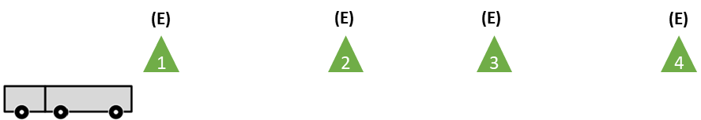
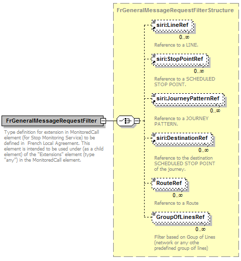

Profil d'échange pour la description des informations temps-réel des
réseaux de transport en commun

**SIRI - Profil Français**

**BNTRA-CN03-GT7_NF Profil SIRI FR_v1.7 20230727**

**Avant-propos**

Ce document présente de façon détaillée le profil SIRI National France
(également appelé « local agreement SIRI France »), soit la déclinaison
de la norme SIRI aux besoins métiers français. Il contient tous les
éléments nécessaires à sa compréhension, mais ne propose ni une
réécriture ni une traduction de l'ensemble des documents normatifs SIRI
:

- Le lecteur devra donc se référer à la norme quand cela sera
  nécessaire, en particulier au niveau technique avant d'envisager toute
  implémentation de SIRI.

D'autre part, l'ensemble de la terminologie utilisée dans ce document
est celle de SIRI, et par voie de conséquence de TRANSMODEL version 6.0.

- Le lecteur est donc invité à se référer au document TRANSMODEL pour de
  plus amples précisions sur la terminologie, les concepts ou modèles de
  données sous-jacents.

Plus généralement, les notions manipulées dans ce document sont décrites
par l’ensemble de documents normatifs suivants :

- SIRI : Service Interface for Real-time Information relating to public
  transport operations (NF EN 15531- 1 à 3 et CEN/TS 15531-4 et 5)

- Partie 1: Context and framework

- Partie 2: Communications infrastructure

- Partie 3: Functional service interfaces

- Partie 4: Functional service interfaces - Facility Management

- Partie 5: Functional service interfaces - Situation Exchange

- TRANSMODEL : NF EN 12896, Transmodel (version 6.0), Reference Data
  Model for Public Transport et Transmodel in UML (projet SITP 2,version
  0.1 04/09/2003)

- NEPTUNE : Projet de norme AFNOR - PR NF P99-506 Décembre 2009

Dans le document, les règles propres au profil sont présentées sur
fond gris. Les autres règles ont plus un rôle
d'explication, d'accompagnement ou de recommandation.

Ce document est structuré en quatre parties :

- Partie 1 : Contexte

  Cette partie présente la démarche de construction du profil
  SIRIFrance, les cas d’utilisation constatés ou présentés à titre
  d’exemple, et la liste des services SIRI retenus, en se basant sur ces
  cas d’utilisation.

- Partie 2 : Présentation des concepts fondamentaux du Profil

  Cette partie présente les particularités et les options du profil SIRI
  France : concepts fondamentaux, modélisation de cas spécifiques,
  référentiels de données, et modalités techniques d’échange.

- Partie 3 : Description du profil d’échange

  Cette partie décrit les conventions et les règles utilisées pour la
  rédaction de ce profil.

- Partie 4 : Description détaillée des messages

Cette partie présente le format des messages SIRI et les choix effectués
dans le contexte national français (utilisation ou non des champs,
cardinalités, …). Elle constitue à ce titre une description technique et
essentiellement un cadre fonctionnel à destination des développeurs et
intégrateurs.

Le lecteur dispose en annexe au présent document d’un glossaire composé
des définitions et autres acronymes.

*<u>A noter</u>* : les extraits de normes figurant dans cet ouvrage sont
reproduits avec l’accord de l’AFNOR. Seul le texte original et complet
de la norme telle que diffusée par l'AFNOR – accessible via le site
Internet www.afnor. org – possède une valeur normative.

**Introduction**

La norme SIRI (Service Interface for Real time Information) définit le
protocole d’échange de l’information Temps Réel pour les transports
collectifs (format XML). SIRI se base sur le modèle de données de
référence du transport public : TRANSMODEL. SIRI a été élaborée avec la
participation initiale de la France, l’Allemagne, la Norvège et le
Royaume-Uni.

Le groupe de travail français, CN03/GT7 (miroir du groupe européen CEN
TC278 / WG3 / SG7) a adopté le format d’échanges NEPTUNE (sous-ensemble,
ou profil, du format TRIDENT issu d'un projet Européen) comme base pour
les échanges de données de transport en commun. Le standard NEPTUNE,
aborde essentiellement les aspects référentiels des données échangées.
Il est normalisé à l’AFNOR sous la référence PR NF P99-506.

Afin de fournir aux transporteurs et aux industriels un cadre normalisé
pour l’échange de données concernant l’information temps réel, le CEN
TC278 / WG3 / SG7 a décidé de lancer le projet SIRI (Service Interface
for Realtime Information) dès 2004.

Aujourd’hui, la norme SIRI version 2.1 peut servir de base à toute
implémentation des échanges de données temps réel, elle assure une
compatibilité ascendante avec la version 1.0 qu'elle précise et lui
ajoute quelques fonctions et attributs issus des retours d'expérience de
mise en œuvre de la version 1.0.

Le présent document contient le profil d’utilisation de cette
spécification technique dans un contexte national français.

Il est complété par un ensemble de documents d’accompagnement : se
reporter au paragraphe Documents d’accompagnement du présent document.

#  Domaine d’application

Le profil, objet du present document, s’applique à la spécification
technique SIRI (documents \[R5\] à \[R9\] §2). Les objectifs de ce
profil sont rappelés dans la suite de ce paragraphe.

## Profils

La mise en place d’un profil normatif répond au constat suivant :

- Les normes sont par nature et définition des documents consensuels, en
  particulier pour les documents de normalisations publiés par le CEN,
  définis dans un contexte international. Dans le cas des normes du
  CEN/TC 278/WG03, cela signifie que d'une part elles prennent en compte
  de très nombreux besoins car elles ont été établies à un niveau
  européen, et d'autre part elles n'imposent pas une implémentation
  exhaustive immédiate, mais permettent une implémentation progressive
  et qui peut être limitée à un besoin bien identifié.

Ces normes prennent en compte des besoins d’implémentation qui vont
au-delà des besoins nationaux.

- La contrepartie de cette ouverture est que l'on peut facilement
  aboutir à des systèmes SIRI incompatibles alors même qu'ils respectent
  la norme : par exemple, pour peu qu'ils n'implémentent pas les mêmes
  services.

- Les documents normatifs sont bien souvent très détaillés et
  volumineux, rendant leur consultation et lecture difficiles.

- Des éléments proposés par la norme sont optionnels, lors de
  l’implémentation d’une application conforme à la norme il doit être
  décidé s’ils sont ou non utilisés.

- Les spécifications techniques SIRI sont issues de ces processus de
  normalisation internationaux et intègrent des mécanismes répondant à
  des besoins Allemands ou Suisse par exemple y sont aussi intégrés des
  mécanismes pour faciliter la compatibilité avec le projet de norme
  française NEPTUNE, britannique TransXChange, NOPTIS suédoise, …

La norme SIRI recommande donc l'établissement d'un « Local Agreement »
ou profil SIRI, qui permettra de contraindre et restreindre son
implémentation dans le cadre d'un échange donné – ici, dans le cas
présent, au niveau national français.

De plus, la norme SIRI fournit un guide pour l'établissement de ce
profil.

## Qualité et Cohérence des données

Un des objectifs du profil est de simplifier et d’améliorer
l’interopérabilité. L’interopérabilité ne peut être atteinte uniquement
sur la base de la conformité au profil sans s’assurer de la qualité des
données véhiculées : cohérence des données, conforme au format et
decrivant la réalité.

En conséquence le profil doit être accompagné d’un ensemble de règles de
cohérence et de qualité spécifiquement conçues pour la mise en œuvre du
profil SIRI. Le respect des règles ne garantie cependant pas à 100% la
qualité d’un jeu de données mais va permettre de minimiser les problèmes
de cohérence.

## Références Normatives

Les documents de référence suivants sont indispensables pour
l'application du présent document. Pour les références datées, seule
l'édition citée s'applique. Pour les références non datées, la dernière
édition du document de référence s'applique (y compris les éventuels
amendements).

**\[R1\]** NF EN 12896 Public Transport Reference Data Model Partie 1 à
Partie 4

- Partie 1 : Common Concepts (corresponds to
  [NeTEx](http://www.transmodel-cen.eu/standards/netex/) Part 1
  -Framework)

- Partie 2: Public Transport Network Topology (corresponds to
  [NeTEx](http://www.transmodel-cen.eu/standards/netex/) Part 1-
  Topology)

- Partie 3 : Timing Information and Vehicle Scheduling (corresponds to
  [NeTEx](http://www.transmodel-cen.eu/standards/netex/) Part 2)

**\[R2\]** CEN/TS 16614-1 Network and Timetable Exchange (NeTEx) -
Network description

**\[R3\]** CEN/TS 16614-2 Network and Timetable Exchange (NeTEx) -
Timing information

**\[R4\]** CEN/TS 16614-3 Network and Timetable Exchange (NeTEx) - Fare
description

**\[R5\]** EN 15531-1, Public transport - Service interface for
real-time information relating to public transport operations - Part 1:
Context and framework

**\[R6\]** EN 15531-2, Public transport - Service interface for
real-time information relating to public transport operations - Part 2:
Communications infrastructure

**\[R7\]** EN 15531-3, Public transport - Service interface for
real-time information relating to public transport operations - Part 3:
Functional service interfaces

**\[R8\]** CEN/TS 15531-4, Public transport - Service interface for
real-time information relating to public transport operations - Part 4:
Functional service interfaces: Facility Monitoring

**\[R9\]** CEN/TS 15531-5, Public transport - Service interface for
real-time information relating to public transport operations - Part 5:
Functional service interfaces - Situation Exchange

**\[R10\]** XSD SIRI 2.1

## Autres documents

**\[R11\]** T1 Éléments communs aux profils d'échange pour les
informations planifiées du transport en commun

\[R11.1\] T2 NeTEx - Profil
Français de NETEx: éléments communs,

\[R11.2\] T2 NeTEx - Profil Français pour les Arrêts,

\[R11.3\] T2 NeTEx - Profil Français pour les horaires,

\[R11.4\] T2 NeTEx - Profil Français pour les réseaux.

# Termes et définitions

## Cas général

Dans le cadre de ce document, les termes et definitions applicables sont
ceux définis dans le document CEN/EN 15531-1:2021 \[R5\].

## Définition d’un point d’arrêt

La notion de point d’arrêt utilisée dans le cadre du présent profil fait
référence aux concepts Transmodel \[R1\] suivants :

- Point d’arrêt logique,

- Point d’arrêt planifié (SCHEDULE STOP POINT),

- Point d’arrêt physique,

- Zone d’embarquement (QUAY),

- Lieu d’arrêt monomodal (STOP PLACE),

- Pole Monomodal (STOP PLACE).

| DEF.1 | Chacun de ces points d’arrêt doit disposer d’un identifiant spécifique indépendamment de son type. |
|-------|----------------------------------------------------------------------------------------------------|

Le point d’arrêt physique peut être ou non rattaché à un point d’arrêt
logique, selon les implémentations, par l’intermédiaire d’une
affectation (STOP ASSIGNMENT). La figure ci-après illustre ces relations
(Profil NeTEx France \[R11.4\]).

## Définitions de « Départ » et « Arrivée »

D’un point de vue fonctionnel les notions d’arrivée et de départ sont
définies ci-dessous. Ces notions osnt utilisés par plusieurs services
SIRI (ET, SM) pour échanger des heures d’arrivée et de départ, estimées
ou échues.

Arrivée

Une arrivée correspond à un événement permettant au premier passager
d’être en mesure de débarquer à un endroit particulier (par rapport au
trajet et à l'arrêt donnés). En règle générale, il s'agit du moment où
les portes du véhicule sont (ou pourraient être) ouvertes pour la
première fois après leur deverrouillage. Peu importe que les passagers
montent ou descendent effectivement à l'arrêt ou que les portes aient
été ouvertes en premier lieu.

Départ

Un départ correspond à un événement permettant au dernier passager
d’être en mesure d'embarquer à un endroit particulier (par rapport au
trajet et à l'arrêt donnés). En règle générale, il s'agit du moment où
les portes du véhicule sont (ou pourraient être) fermées pour la
dernière fois avant l'enclenchement de la serrure.

Dans certains cas, la condition d'ouverture ou de fermeture d'une porte
n'est pas satisfaite et donc un événement tel que défini ci-dessus ne
peut pas être enregistré avec précision :

• Un véhicule passe par un arrêt sans réellement s'arrêter ou ne
s'arrête que brièvement sans ouvrir ses portes, par exemple, dans le cas
où l'arrêt était facultatif et que personne ne l'a demandé. Dans un tel
cas, l'événement d'arrivée et de départ sont tous deux enregistrés en
même temps lorsque le véhicule passe la position d'arrêt.

• Un événement d'arrivée à un arrêt où il est interdit de descendre est
enregistré soit au moment où la serrure est déverrouillée pour la
première fois, lorsque le véhicule s'arrête (si la serrure n'a jamais
été déverrouillée) ou lorsque le véhicule passe la position d'arrêt (si
le véhicule ne s'arrête pas réellement).

• Un événement de départ à un arrêt où l'embarquement est interdit est
soit enregistré au moment où la serrure est enclenchée pour la dernière
fois, lorsque le véhicule commence à rouler (si la serrure n'a jamais
été déverrouillée) ou lorsque le véhicule franchit l'arrêt position (si
le véhicule ne s'arrête pas réellement).

## Définition de la structure LEADER

La description des services SIRI fait référence à une structure LEADER.

| LEADER | ::: | 1:1 | xxx­Delivery | voir xxx**Delivery**. |
|--------|-------------------------------|-----|-------------|-----------------------|

Le Leader est (indirectement) défini dans la spécification SIRI \[R6\]
par les attributs suivants :

| xxxDelivery |     | +Structure | Réponse pour le service xxx. |
|-------------|-----|------------|------------------------------|

<table>
<colgroup>
<col style="width: 7%" />
<col style="width: 17%" />
<col style="width: 0%" />
<col style="width: 5%" />
<col style="width: 0%" />
<col style="width: 11%" />
<col style="width: 0%" />
<col style="width: 0%" />
<col style="width: 57%" />
</colgroup>
<thead>
<tr class="header">
<th>Log</th>
<th>Response­Timestamp</th>
<th colspan="2">1:1</th>
<th colspan="2">xsd:dateTime</th>
<th colspan="3">Heure de creation de la response.</th>
</tr>
</thead>
<tbody>
<tr class="odd">
<td>End­point prop­erties</td>
<td>RequestMessageRef</td>
<td colspan="2">0:1</td>
<td colspan="3">Message­Qualifier</td>
<td colspan="2">Pour les requêtes directes, identifiant de la requête
origine de la réponse.</td>
</tr>
<tr class="even">
<td></td>
<td>SubscriberRef</td>
<td colspan="2">0:1</td>
<td colspan="3">Participant­Code</td>
<td colspan="2">Obligatoire si la réponse concerne un Abonnement,
Identfiant de l’abonné.</td>
</tr>
<tr class="odd">
<td></td>
<td>Subscription­FilterRef</td>
<td colspan="2">0:1</td>
<td colspan="3">SubcriptionFilterCode</td>
<td colspan="2">Identifiant unique du filtre d'abonnement auquel cet
abonnement est affecté. S'il n'y a qu'un seul filtre, alors ce champ
peut être omis.</td>
</tr>
<tr class="even">
<td></td>
<td>Subscription­Ref</td>
<td colspan="2">1:1</td>
<td colspan="3">Subscript­ion­Qualifier</td>
<td colspan="2">
Obligatoire si la réponse concerne un Abonnement.

Identifiant de l'Abonnement émis par le Demandeur.
</td>
</tr>
<tr class="odd">
<td>Status</td>
<td>Status</td>
<td colspan="2">0:1</td>
<td colspan="3">xsd:boolean</td>
<td colspan="2">
Indique si la demande complète a pu être traitée avec
succès ou non. La valeur par défaut est true.

Si l'une des demandes individuelles de la diffusion a échoué, doit
être à "false".
</td>
</tr>
<tr class="even">
<td></td>
<td>ErrorCondition</td>
<td colspan="2">0:1</td>
<td colspan="3">+Structure</td>
<td colspan="2">Description de toute condition d'erreur ou de warning
qui s'applique à la demande ou à la réponse.</td>
</tr>
<tr class="odd">
<td></td>
<td>➞ <em>choix</em></td>
<td colspan="2">-1:1</td>
<td colspan="3"></td>
<td colspan="2">Un des codes erreurs suivants.</td>
</tr>
<tr class="even">
<td></td>
<td colspan="2">a) Capability­Not­Supported­Error</td>
<td colspan="2">0:1</td>
<td colspan="3">+ Error</td>
<td>Erreur : fonctionnalité non prise en charge.</td>
</tr>
<tr class="odd">
<td></td>
<td colspan="2">b) AccessNot­Allowed­Error</td>
<td colspan="2">0:1</td>
<td colspan="3">+Error</td>
<td>Erreur : le demandeur n'est pas autorisé à accéder au service ou aux
données demandés.</td>
</tr>
<tr class="even">
<td></td>
<td colspan="2">c) NoInfoFor­TopicError</td>
<td colspan="2">0:1</td>
<td colspan="3">+Error</td>
<td>Erreur : une demande valide a été effectuée, mais le service ne
contient aucune donnée pour l'expression de rubrique demandée.</td>
</tr>
<tr class="odd">
<td></td>
<td colspan="2">d) Allowed­Resource­Usage­Exceeded­Error</td>
<td colspan="2">0:1</td>
<td colspan="3">+Error</td>
<td>Erreur : une demande valide a été effectuée, mais la demande
dépasserait l'utilisation autorisée des ressources du client.</td>
</tr>
<tr class="even">
<td></td>
<td colspan="2">e) OtherError</td>
<td colspan="2">0:1</td>
<td colspan="3">+Error</td>
<td>Erreur autre</td>
</tr>
<tr class="odd">
<td></td>
<td colspan="2">➞ Description</td>
<td colspan="2">0:1</td>
<td colspan="3">ErrorDescription</td>
<td>Description de l’erreur.</td>
</tr>
<tr class="even">
<td></td>
<td>ValidUntil</td>
<td colspan="2">0:1</td>
<td colspan="3">xsd:dateTime</td>
<td colspan="2">Limite de validité des données.</td>
</tr>
<tr class="odd">
<td></td>
<td>Shortest­Possible­Cycle</td>
<td colspan="2">0:1</td>
<td colspan="3">Positive­Duration­Type</td>
<td colspan="2">Intervalle minimum auquel les mises à jour peuvent être
envoyées.</td>
</tr>
<tr class="even">
<td></td>
<td>DefaultLanguage</td>
<td colspan="2">0:1</td>
<td colspan="3">Xsd:language</td>
<td colspan="2">Langue par défaut des éléments de texte.</td>
</tr>
</tbody>
</table>

## Référentiel théorique

Le référentiel théorique est l’objet d’un accord entre les parties.

Il repose sur des échanges :

- non définis par le présent profil (NeTEx par exemple),

- ou à base de service Discovery (cf paragraphe 5.6).

# Description du profil d’échange

## Règles de gestion du profil

Le present profil contient un ensemble de règles de gestion applicables.
Ces règles de gestion sont présentées sous forme tabulaire et
numérotées.

| Numéro | Intitulé de la règle |
|--------|------------------------------------------------|

Des textes explicatifs viennent compléter les règles
d’application du profil FR.

## Conventions & Représention des messages

Les messages constituant ce profil d'échange sont décrits en adoptant un
formalisme tabulaire. Les tableaux proposent ces colonnes:

<table class="m_fr">
<colgroup>
<col style="width: 15%" />
<col style="width: 14%" />
<col style="width: 14%" />
<col style="width: 21%" />
<col style="width: 34%" />
</colgroup>
<tbody>
<tr>
<th>Classification</th>
<th>Nom de l’élement</th>
<th>Min : 
Max</th>
<th>Type de données</th>
<th>Description</th>
</tr>
</tbody>
</table>

La structure des tableaux présentée ici est exactement la même que celle
des tableaux des documents SIRI de référence ceci afin de simplifier le
passage d'un document à l'autre.

Les tableaux sont simplement complétés et enrichis des informations
propres au profil SIRI France.

Une description détaillée de la structure de ces tableaux est présentée
dans le document « SIRI- partie 1 - 4.3-Notation pour les structures de
modélisation XML des messages SIRI ».

Pour mémoire les principaux éléments présentés sont les suivants :

- Dans la documentation SIRI, les structures sont présentées sous forme
  tabulaire. L'en-tête des colonnes est supposé connu et n'est donc pas
  systématiquement répété.

- Les tableaux utilisent un ensemble de conventions pour les éléments
  XML et leurs contraintes.

Les éléments constitutifs de ces tableaux sont présentés ci-dessous.

### Classification (Organisational Group label)

Cette première colonne précise la catégorie de l'élément, par exemple
‘*Payload’* (qui se traduit littéralement par « charge utile », et
correspond à la description de l'objet lui-même indépendamment de toute
donnée d'accompagnement, et autres en-têtes).

Par exemple :

- Attributes,

- Log,

- Endpoint,

- Status,

- Payload.

### Nom de l'élément (*Element Name*)

Cet élément correspond naturellement au nom de l'élément présenté. Si
l'élément appartient à une structure complexe, le nom de l'élément père
(ou racine) est présenté en haut du tableau.

La notation « :: » fait référence à un groupe d'éléments défini à un
autre endroit du document (la colonne Type de Données permettra de
retrouver cette définition).

Dans les cas d'éléments composés, une indication « voir ci-dessous »
figure dans la colonne type et les sous-éléments sont présentés en
dessous avec une indentation (c'est le cas de ***ErrorCondition*** cf
3.2.5).

### Cardinalité et choix (Multiplicity & Choice (Min:Max))

Cette colonne précise la cardinalité de l'élément sous la forme :

- \[nombre minimal d'occurrences\]:\[nombre maximal d'occurrences\],

- Un nombre d'occurrence valant « \* » signifie « nombre illimité ».

Si cet indicateur est préfixé d'un tiret (par exemple « –1:1 ») cela
signifie qu'il faut choisir un élément (ou plusieurs) parmi une liste
indiquée (‘choice’ au niveau XSD).

Si la cardinalité SIRI est précisée pour le profil SIRI France, cela
sera aussi noté, en complément dans cette colonne et
surligné en gris.

Les différentes possibilités d'exprimer la cardinalité sont donc les
suivantes :

- En noir sur fond blanc : la cardinalité est celle spécifiée par le
  document normatif SIRI (en particulier, toutes les notations de type «
  1:1 » ou « 1:\* » signifient que le champ est obligatoire). Ces champs
  font partie du profil SIRI France.

- En noir surligné en gris: la cardinalité du
  document normatif SIRI est précisée par le profil SIRI France (pour
  rendre un champ facultatif obligatoire ). C'est alors la version
  surlignée en gris qui s'applique.

- En noir surligné en vert : la cardinalité du
  document normatif SIRI est précisée par le profil SIRI France pour la
  mise en place des concentrateurs . En effet, les concentrateurs ont
  des spécificités, en particulier en terme de volumétrie et de mise en
  cohérence de données multi-sources qui nécessitent certaines
  adaptations par rapport au cas général. Les commentaires y attenant
  seront aussi surlignés en vert.

### Type de données (*Data Type*)

Cette colonne indique le type de l'élément:

- soit un type simple (SIRI ou XSD) comme *Positive­DurationType* ou
  *xsd:dateTime*

- soit un type structuré, signalé par +*Structure* (la définition de la
  structure porte alors le nom de l'élément suffixé par le terme
  **Structure**),

- les références (par identifiant) sont signalées, sous la forme
  *OperatorCodeRef* (référence à un opérateur, dont on fournit le code
  ou identifiant, dans ce cas),

- dans le cas des énumérations, la liste des valeurs est indiquée
  (éléments séparés par une barre verticale : « **\|** »),

- Pour les types les plus classiques, l'abréviation est autorisée quand
  le nom est long (*NLString* pour *NaturalLanguageString* ou *Error*
  pour *ErrorStructure*).

  Ce type permet de définir les chaines de caractères associées à une
  langue. La structure est la suivante :

| NaturalLanguageStringStructure |
|--------------------------------|

<table>
<colgroup>
<col style="width: 18%" />
<col style="width: 14%" />
<col style="width: 9%" />
<col style="width: 14%" />
<col style="width: 42%" />
</colgroup>
<thead>
<tr class="header">
<th></th>
<th>Name</th>
<th>Type</th>
<th>Cardinality</th>
<th>Description</th>
</tr>
</thead>
<tbody>
<tr class="odd">
<td>attribute</td>
<td>Xml :lang</td>
<td>string</td>
<td>0 :1</td>
<td>
La langue doit etre spécifiée sous la forme d’un code de 3 lettre
conformément à l’ISO 639-3 ou un code sur 2 caractères conformément à
l’ISO 639-1RFC 1766.

Par défaut interprété comme «FRA». Si la langue n’est pas le francais
ce champ <strong>DOIT</strong> être renseigné.
</td>
</tr>
<tr class="even">
<td>Element</td>
<td>(element content)</td>
<td>String</td>
<td>1:1</td>
<td>Texte du message.</td>
</tr>
</tbody>
</table>

### Description (Description)

On trouve dans cette colonne la description textuelle de l'élément.

Le tableau ci-dessous est un exemple de tableau SIRI (**non traduit**
pour celui-ci, étant donné que son contenu n'a pas d'importance).

<table>
<colgroup>
<col style="width: 13%" />
<col style="width: 20%" />
<col style="width: 6%" />
<col style="width: 12%" />
<col style="width: 46%" />
</colgroup>
<thead>
<tr class="header">
<th>Classification</th>
<th>Nom de l’élement</th>
<th>Min : 
Max</th>
<th>Type de données</th>
<th>Description</th>
</tr>
<tr class="odd">
<th><em><strong>MyMessageResponse</strong></em></th>
<th></th>
<th></th>
<th><em>+Structure</em></th>
<th>Returns data for a MyMessage Request</th>
</tr>
</thead>
<tbody>
<tr class="odd">
<td><em>Attributes</em></td>
<td><em><strong>srsName</strong></em></td>
<td>0:1</td>
<td><em>xsd:string</em></td>
<td>Default GML coordinate format for any spatial points defined in
response by Coordinates parameter.</td>
</tr>
<tr class="even">
<td><em>Log</em></td>
<td><em><strong>Response­Timestamp</strong></em></td>
<td><strong>1:1</strong></td>
<td><em>xsd:dateTime</em></td>
<td>Time individual response element was created.</td>
</tr>
<tr class="odd">
<td><em>Endpoint</em></td>
<td><em><strong>Producer­Ref</strong></em></td>
<td>0:1</td>
<td><em>Participant­Code</em></td>
<td>Participant reference that identifies producer of data. May be
available from context.</td>
</tr>
<tr class="even">
<td></td>
<td><em><strong>:::</strong></em></td>
<td>0:1</td>
<td><em>MyAdd­Group</em></td>
<td>MyAddress Group elements. See section 101.0.</td>
</tr>
<tr class="odd">
<td><em>Status</em></td>
<td><em><strong>Status</strong></em></td>
<td>0:1</td>
<td><em>xsd:boolean</em></td>
<td>Whether the complete request could be processed successfully or not.
Default is <em>true</em>.</td>
</tr>
<tr class="even">
<td></td>
<td><em><strong>Error­Condition</strong></em></td>
<td>0:1</td>
<td><em>See below</em></td>
<td>Description of any error or warning conditions that apply to the
overall request.</td>
</tr>
<tr class="odd">
<td></td>
<td>➞ <em>choix</em></td>
<td>-1:1</td>
<td></td>
<td>One of the following error codes.</td>
</tr>
<tr class="even">
<td></td>
<td><strong>a) Capability­Not­Supported­Error</strong></td>
<td>0:1</td>
<td><em>+Error</em></td>
<td>Capability not supported.</td>
</tr>
<tr class="odd">
<td></td>
<td><strong>b) Other­Error</strong></td>
<td>0:1</td>
<td><em>+Error</em></td>
<td>Error other than a well defined category.</td>
</tr>
<tr class="even">
<td></td>
<td>➞ <em><strong>Description</strong></em></td>
<td>0:1</td>
<td><em>Error­Description</em></td>
<td>Description of Error.</td>
</tr>
<tr class="odd">
<td><em>Payload</em></td>
<td><em><strong>Expected</strong>­<strong>Life</strong>­<strong>Time</strong></em></td>
<td><strong>1:1</strong></td>
<td><em>Positive­Duration­Type</em></td>
<td>How long I expect to live. Time interval.</td>
</tr>
<tr class="even">
<td></td>
<td><em><strong>MyWay</strong></em></td>
<td>0:1</td>
<td><em>foo | bar</em></td>
<td>Which way I did it. Default is ‘<em>foo’</em>.</td>
</tr>
<tr class="odd">
<td></td>
<td><em><strong>Xxx­Delivery</strong></em></td>
<td>0:*</td>
<td><em>+Structure</em></td>
<td>See SIRI Part 3 – Functional Service.</td>
</tr>
</tbody>
</table>

### Indentation des données

La représentation des données imbriquées est représentée en utilisant
les symboles ➞ et ⮆ pour indiquer le niveau d’imbrication.

| **Nom**              | **Card** | **Type**   | **Description**                                                                                               |
|----------------------|----------|------------|---------------------------------------------------------------------------------------------------------------|
| **Donnée Niv 1**     |          | +Structure | Cette information est constituée des structure « Donnée 1 Niv 2 » et « Donnée 2 Niv 2 »                       |
| ➞ **Donnée 1 Niv 2** | 1:\*     | +Structure | « Donnée 1 Niv 2 » définie par ailleurs                                                                       |
| ➞ **Donnée 2 Niv 2** | 1:\*     | +Structure | « Donnée 2 Niv 2 » est une structure constituée de « Donnée 1 Niv 3 » et « Donnée 2 Niv 3 » definies ci-apres |
| ⮆ **Donnée 1 Niv 3** | 0:1      | Type 1     | Donnée de « Donnée 2 Niv 2 »                                                                                  |
| ⮆ **Donnée 2 Niv 3** | 0:1      | Type 2     | Donnée de « Donnée 2 Niv 2 »                                                                                  |

# Partie I - Description du cadre

## Définition des concepts fondamentaux

Le présent profil s’appuie sur les concepts définis dans Transmodel
\[R1\].

## Cas d’usage

Les principaux cas d’usage SIRI, dans un environnement national
français, sont synthétisés dans la suite de ce paragraphe. Ils sont
détaillés dans le document d’accompagnement \[A1\].

Cette liste des cas d’usage ne se veut **pas exhaustive** et peut être
complétée localement pour répondre à des besoins spécifiques.

Pour chaque cas d’usage, une **préconisation** de services SIRI à
implémenter est présentée en conclusion du paragraphe. Les
préconisations s’appuient sur les ‘bonnes pratiques’ d’implémentation
SIRI \[A3\].

Dans ce cadre, chaque service SIRI d’un cas d’usage est qualifié
‘Indispensable’ ou ‘Facultatif’.

- Indispensable : indique que, pour le cas d’usage identifié, le respect
  des bonnes pratiques d’implémentation tend à l’utilisation de ce
  service. Dans le cas ou un autre service SIRI serait retenu,
  l’implémentation sortirait du contexte d’utilisation et correspondrait
  alors un autre cas d’usage.

- La non-implémentation d’un service ‘Indispensable’ ne veut pas dire
  que cette implémentation n’est pas conforme au profil SIRI France,
  seule la conformité aux règles de gestion et aux règles
  d’implémentation des services le sont.

- ‘Facultatif’ : indique que le service SIRI peut être utilisé en
  complément du ou des services SIRI obligatoires mais que le cas
  d’usage peut être respecté sans son implémentation.

### Diffusion inter systèmes

Ce cas d’usage doit permettre à différents systèmes de transport
d’échanger des flux d’information relatifs à l’information voyageur. Ces
échanges leur permettent de réaliser des traitements de cette
information indépendamment les uns des autres et en parfaite cohérence.

Dans ce cadre, SIRI permet l’échange d’informations multimodales et
multi opérateurs. Ces flux ne sont pas à destination directe des
usagers.

Les systèmes concernés peuvent être des SAE, des SIV, des systèmes
d’affichage, …

Cet alignement repose sur un échange préalable de données théoriques
(topologie et offre de transport) qui sont mises à jour entre les
différents systèmes interconnectés via SIRI.

Ces échanges s’appuient sur le protocole de communication SIRI définis
dans la partie 2 de la spécification [\[R6\]](#_Références_Normatives).

La description de ce cas d’usage est définie dans le document
d’accompagnement [\[A1\]](#_Documents_d’accompagnement).

### Diffusion Terminaux légers

Il s'agit ici de permettre à un utilisateur d'accéder aux informations
horaires temps réel (prochains passages avec indications de ligne, de
direction, ainsi que les éventuels messages) pour n’importe quel point
d’arrêt, indépendamment du transporteur, et ce à partir d'un terminal
mobile de type téléphone portable.

Ce service pourra ainsi être utilisé sur le réseau (à l'arrêt dans le
cas où il n'y aurait pas d'afficheur, permettant ainsi à l'exploitant de
mettre le service à disposition sans que les coûts ne soient trop
importants, autorisant ainsi plus facilement la couverture de ligne ou
zones à faible fréquentation) ou hors réseau (pour synchroniser son
départ avec l'arrivée du train ou du bus par exemple).

SIRI est ici utilisé pour permettre au système de présentation qui gère
le dialogue avec les terminaux mobiles d'accéder aux informations
horaires temps réel de prochain passage.

Ce cas d'utilisation peut être généralisé à un accès avec tout autre
type de terminal, en particulier via un accès de type Web, pour diffuser
les informations horaires et les informations de perturbation.

A noter que pour ce cas d’usage les protocoles de communications SIRI
lite sont à privilégier.

La description de ce cas d’usage est définie dans le document
d’accompagnement \[A1\]

### Centrale de mobilité

Les centrales de mobilité prennent en compte les transports en commun
sur une échelle relativement large, impliquant ainsi quasi
systématiquement plusieurs transporteurs.

L'un des services clés de ce type de centrale de mobilité est souvent le
calcul d’itinéraires, qui se limite de moins en moins à la prise en
compte des horaires théoriques (pour cause d’indisponibilité des
données, et non pour des raisons techniques).

La prise en compte des informations temps réel est un besoin qui, dans
ce contexte, s'exprime à deux niveaux:

1.  la prise en compte des perturbations (prévues, c'est-à-dire connues
    plus ou moins longtemps avant le départ, ou inopinées) pour, d'une
    part, les signaler à l'usager et, d'autre part, lui proposer des
    solutions alternatives lui permettant de « sécuriser » son trajet,

2.  la prise en compte des informations horaires temps réel pour
    optimiser le déplacement (le train que l'on ne pensait pas pouvoir
    prendre à une correspondance devient disponible suite à un léger
    retard ou encore un retard trop important impliquant une
    modification de l'itinéraire, etc).

L'apport de la norme SIRI est ici clairement de permettre aux SAE de
diffuser vers la centrale de mobilité l'ensemble des informations temps
réel nécessaires pour la mise en place des services.

La description de ce cas d’usage est définie dans le document
d’accompagnement [\[A1\]](#_Documents_d’accompagnement).

### Gestion des perturbations

La prise en compte des perturbations telle qu'elle est souvent mise en
oeuvre dans les systèmes actuels se limite souvent à un message textuel
libre ou pré-formaté et associé à un arrêt, une ligne, un itinéraire ou
une mission. La norme SIRI permet de transmettre la perturbation de
manière codifiée ; elle permet :

- de décrire finement la cause de la perturbation,

- de lister les conséquences liées à cette perturbation,

- de permettre une prise en compte par un calculateur d’itinéraires,

- de générer automatiquement des messages, avec prise en compte du type
  de périphérique (petits messages pour les SMS, longs messages pour le
  Web, etc.) ou de générer ces messages en plusieurs langues (il ne
  s’agit naturellement pas d’une fonction de SIRI mais d’une fonction
  qui pourra être mise en œuvre par l’émetteur ou par le récepteur sur
  la base des données structurées),

- d'associer la perturbation à un tronçon de ligne,

- de gérer des périodes de validité complexes (i.e. : du lundi au
  vendredi de 8 h à 18 h),

- de mettre à jour le « fil de perturbation » en ayant la possibilité
  d’identifier les mises à jour d'une perturbation.

La description de ce cas d’usage est définie dans le document
d’accompagnement [\[A1\]](#_Documents_d’accompagnement).

### Information PMR

Informer les PMR ou toute personne ayant des besoins particuliers (en
particulier les handicaps auditifs, visuels, moteurs, etc., mais aussi à
tous les besoins particuliers comme « utilisation d'une poussette »,
« lourdement chargé en bagage », « jambe dans le plâtre », etc.) est un
besoin avéré.

Ce type de besoin comporte une composante temps réel afin de pouvoir
informer sur l'état des équipements et des services (i.e. :
disponibilité ou non d'un ascenseur, d'un escalier mécanique, d'une
palette, d'un dispositif visuel, etc.).

Sur la base des services SIRI, des systèmes d'acquisition et de
supervision ou des systèmes impliquant une saisie par un opérateur (la
vérification d'état des équipements est aujourd'hui réalisée de façon
manuelle dans de très nombreux cas) peuvent diffuser leurs informations
de perturbation.

La description de ce cas d’usage est définie dans le document
d’accompagnement [\[A1\]](#_Documents_d’accompagnement).

### Concentrateur

Les concentrateurs permettent de rassembler au sein d’un même système un
ensemble d’informations voyageur d’origine et de formes diverses dans un
format pivot (en principe conforme aux concepts Transmodel) pour les
mettre à disposition de systèmes clients.

Le flux entrant et sortant du concentrateur peuvent s’appuyer sur SIRI.
En général les systèmes historiques peuvent fournir aux concentrateurs
les informations dans des formats autres, le concentrateur redistribuant
les données en utilisant SIRI :

- les centrales de mobilité,

- les systèmes pour les agents sur le terrain,

- les afficheurs,

- des terminaux dédiés (système prévu spécifiquement pour gérer un type
  de handicap),

- etc.

### Conformité Directive EU

La loi n° 2019-1428 du 24 décembre 2019 d'orientation des mobilités
(LOM :
<https://www.legifrance.gouv.fr/dossierlegislatif/JORFDOLE000037646678>)
et, au niveau Européen, le Règlement Délégué (UE) 2017/1926 de La
Commission du 31 mai 2017 (complétant la directive 2010/40/UE du
Parlement européen et du Conseil en ce qui concerne la mise à
disposition, dans l'ensemble de l'Union, de services d'informations sur
les déplacements multimodaux) rendent obligatoire la mise à disposition,
quand elles existent, de certains types de données.

Le tableau ci-dessous résulte de l’analyse de la LOM et du règlement
délégué et fournit la liste des concepts concernés dans le présent
profil. Il sera donc nécessaire de fournir ces données pour être
conforme à la législation (il s’agit bien de mettre à disposition toutes
les données existantes dans les SI transport, et non de créer des
données qui n’existeraient pas encore sous forme informatique).

Les concepts présents dans les tableaux sont ceux directement référencés
à l’annexe du règlement européen Délégué (UE) 2017/1926 de La Commission
du 31 mai 2017
(<https://eur-lex.europa.eu/legal-content/FR/TXT/HTML/?uri=CELEX:32017R1926&from=FR>)
qui impliquent d’autres concepts (soit par héritage soit par relation,
au sens UML des termes). Ces éléments d’héritage et de relations sont
présentés dans les profils, mais pas dans ce tableau.

De plus, les noms des catégories (colonnes Catégorie et Détail) ont été
conservés dans la langue originale du document (l’anglais) pour éviter
tout risque de confusion. Pour la même raison, les noms des concepts
concernés sont ceux de la version originale de Transmodel.

Pour certaines catégories de données, il peut arriver que les concepts
correspondants soient multiples, mais aussi qu’ils soient différents
suivant le niveau de précision porté par la donnée. La colonne
« Services à minima » correspond alors au minimum à fournir pour
répondre à la catégorie en question et les colonnes « Autres services »
décrivent des informations complémentaires qui, si elles sont utiles, ne
sont pas indispensables pour répondre à cette catégorie.

Il faut toutefois garder à l’esprit que toute information existante est
supposée être mise à disposition (que cela relève de la première ou de
la seconde colonne).

La première colonne reprend la notion de *niveau* tel qu’il est décrit
et utilisé par le règlement européen et a notamment une incidence sur le
calendrier de mise à disposition de la donnée (voir le règlement pour
plus de détails).

Les différents concepts présentés ne sont bien sûr pas détaillés dans ce
tableau mais dans le profil lui-même. C’est aussi dans la description du
profil que l’on trouvera les détails concernant les attributs
(obligatoire/facultatif, règles de remplissage, codification, etc.).
Pour ce qui est des attributs facultatifs, la règle reste que, pour les
objets ci-dessous, toute information disponible est supposée être
fournie (mais on ne crée pas d’information si elle n’est pas
disponible).

### 

Table 1 – *Concepts relatifs à la LOM et à la Règlementation Européenne*

<table>
<colgroup>
<col style="width: 5%" />
<col style="width: 18%" />
<col style="width: 20%" />
<col style="width: 12%" />
<col style="width: 14%" />
<col style="width: 30%" />
</colgroup>
<thead>
<tr class="header">
<th><strong>Niveau</strong></th>
<th><strong>Catégorie</strong></th>
<th><strong>Détail</strong></th>
<th><strong>Service à minima</strong></th>
<th>
<strong>Autres</strong>

<strong>services</strong>
</th>
<th><strong>Commentaire</strong></th>
</tr>
</thead>
<tbody>
<tr class="odd">
<td>1</td>
<td><em><strong>Passing times, trip plans and auxiliary
information</strong></em></td>
<td>Disruptions (all modes)</td>
<td>General Message</td>
<td>Situation Exchange</td>
<td>Note : tout ce qui peut être échangé avec General Message peut aussi
l’être avec Situation Exchange: pour anticiper les évolutions à venir il
peut donc être préférable de tout de suite porter son choix sur
Situation Exchange.</td>
</tr>
<tr class="even">
<td><strong>1</strong></td>
<td><em><strong>Passing times, trip plans and auxiliary
information</strong></em></td>
<td>Real-time status information — delays, cancellations, guaranteed
connections monitoring (all modes)</td>
<td>General Message</td>
<td>Situation Exchange</td>
<td>Note : tout ce qui peut être échangé avec General Message peut aussi
l’être avec Situation Exchange: pour anticiper les évolutions à venir il
peut donc être préférable de tout de suite porter son choix sur
Situation Exchange.</td>
</tr>
<tr class="odd">
<td>1</td>
<td><em><strong>Passing times, trip plans and auxiliary
information</strong></em></td>
<td>Status of access node features (including dynamic platform
information, operational lifts/escalators, closed entrances and exit
locations — all scheduled modes)</td>
<td>General Message</td>
<td>Situation Exchange 
Facility Monitoring</td>
<td>Note : tout ce qui peut être échangé avec General Message peut aussi
l’être avec Situation Exchange: pour anticiper les évolutions à venir il
peut donc être préférable de tout de suite porter son choix sur
Situation Exchange.</td>
</tr>
<tr class="even">
<td><strong>2</strong></td>
<td><em><strong>Passing times, trip plans and auxiliary information (all
modes)</strong></em></td>
<td>Estimated departure and arrival times of services</td>
<td>Estimated Timetable</td>
<td></td>
<td>
Stop Monitoring pour heure de départ ou de passage mais ne permet
pas de savoir l’heure d’arrivée.

Estimated Timetable pour une vue complète départ/arrivée. 
ATTENTION: la notion d'heure de départ/arrivée peut donner lieu à
débat
</td>
</tr>
<tr class="odd">
<td><strong>2</strong></td>
<td><em><strong>Information service</strong></em></td>
<td>Availability of publicly accessible charging stations for electric
vehicles and refuelling points for CNG/LNG, hydrogen, petrol- and
diesel-powered vehicles</td>
<td>Facility Monitoring</td>
<td></td>
<td></td>
</tr>
<tr class="even">
<td>2</td>
<td><em><strong>Availability check</strong></em></td>
<td>Car-sharing availability, bike sharing availability</td>
<td>Facility Monitoring</td>
<td></td>
<td></td>
</tr>
<tr class="odd">
<td>2</td>
<td><em><strong>Availability check</strong></em></td>
<td>Car parking spaces available (on and off-street), parking tariffs,
road toll tariffs</td>
<td>Facility Monitoring</td>
<td></td>
<td></td>
</tr>
</tbody>
</table>

### Services SIRI applicables

<table>
<colgroup>
<col style="width: 17%" />
<col style="width: 9%" />
<col style="width: 9%" />
<col style="width: 10%" />
<col style="width: 9%" />
<col style="width: 11%" />
<col style="width: 10%" />
<col style="width: 10%" />
<col style="width: 10%" />
</colgroup>
<thead>
<tr class="header">
<th>Service</th>
<th>Diffusion Inter Systèmes</th>
<th>Diffusion Terminaux Legers</th>
<th>Centrale de Mobilité</th>
<th>Diffusion dans les vehicules</th>
<th>Gestion des perturbations</th>
<th>Information PMR</th>
<th>Concentrateur</th>
<th>Directive EU</th>
</tr>
</thead>
<tbody>
<tr class="odd">
<td>
Horaires planifiés

Production Timetable
</td>
<td></td>
<td></td>
<td></td>
<td></td>
<td></td>
<td></td>
<td></td>
<td></td>
</tr>
<tr class="even">
<td>
Horaires calculés

Estimated Timetable
</td>
<td>Indispensable</td>
<td></td>
<td>Indispensable</td>
<td></td>
<td></td>
<td></td>
<td>Indispensable</td>
<td>Indispensable</td>
</tr>
<tr class="odd">
<td>
Horaires planifiés à l’arrêt

Stop Timetable
</td>
<td></td>
<td></td>
<td></td>
<td></td>
<td></td>
<td></td>
<td></td>
<td></td>
</tr>
<tr class="even">
<td>Discovery Line</td>
<td></td>
<td></td>
<td></td>
<td></td>
<td></td>
<td></td>
<td>Facultatif<a href="#fn1" class="footnote-ref" id="fnref1"
role="doc-noteref">1</a></td>
<td></td>
</tr>
<tr class="odd">
<td>
Horaires calculés à l’arrêt

Stop Monitoring
</td>
<td></td>
<td>Indispensable</td>
<td></td>
<td>Facultatif</td>
<td></td>
<td></td>
<td>Facultatif</td>
<td>Facultatif</td>
</tr>
<tr class="even">
<td>Discovery Stop</td>
<td></td>
<td></td>
<td></td>
<td></td>
<td></td>
<td></td>
<td>Facultatif<a href="#fn2" class="footnote-ref" id="fnref2"
role="doc-noteref">2</a></td>
<td></td>
</tr>
<tr class="odd">
<td>
Supervision des véhicules

Vehicle Monitoring
</td>
<td></td>
<td></td>
<td></td>
<td>Indispensable</td>
<td></td>
<td></td>
<td>Facultatif</td>
<td></td>
</tr>
<tr class="even">
<td>
Correspondances planifiées

Connection Timetable
</td>
<td></td>
<td></td>
<td></td>
<td></td>
<td></td>
<td></td>
<td></td>
<td></td>
</tr>
<tr class="odd">
<td>
Correspondances calculées

Connection Monitoring
</td>
<td></td>
<td></td>
<td></td>
<td>Facultatif</td>
<td></td>
<td></td>
<td></td>
<td></td>
</tr>
<tr class="even">
<td>
Messagerie

General Messaging
</td>
<td>Facultatif</td>
<td>Facultatif</td>
<td>Facultatif</td>
<td>Indispensable</td>
<td>Facultatif</td>
<td>Facultatif</td>
<td>Indispensable</td>
<td>Indispensable (uniquement si SX n’est par retenu)</td>
</tr>
<tr class="odd">
<td>
Gestion des événements

Situation Exchange
</td>
<td></td>
<td></td>
<td>Indispensable</td>
<td>Facultatif</td>
<td>Indispensable</td>
<td>Indispensable</td>
<td>Facultatif</td>
<td>Facultatif</td>
</tr>
<tr class="even">
<td>
Etat des équipements

Facility Monitoring
</td>
<td></td>
<td></td>
<td>Facultatif</td>
<td></td>
<td></td>
<td>Indispensable</td>
<td></td>
<td>Indispensable</td>
</tr>
</tbody>
</table>
<aside id="footnotes" class="footnotes footnotes-end-of-document"
role="doc-endnotes">

<ol>
<li id="fn1">
En complément du Service ET<a href="#fnref1"
class="footnote-back" role="doc-backlink">↩︎</a>
</li>
<li id="fn2">
En complement du Service SM<a href="#fnref2"
class="footnote-back" role="doc-backlink">↩︎</a>
</li>
</ol>
</aside>

**Règles de gestion**

<table>
<colgroup>
<col style="width: 4%" />
<col style="width: 95%" />
</colgroup>
<thead>
<tr class="header">
<th>CU-1</th>
<th>Si le service SX est disponible, toute information diffusée via GM
doit aussi l’être en SX</th>
</tr>
</thead>
<tbody>
<tr class="odd">
<td>CU-2</td>
<td>
Si le service SIRI SX est implémenté, GM ne devient qu'un service
pour compatibilité avec les systèmes ne sachant pas recevoir du SX.

SX devient la référence pour les informations circonstancielles et
doit donc contenir toutes les informations.
</td>
</tr>
</tbody>
</table>

## 

### Protocoles d’échange des données SIRI

Les échanges de données SIRI entre Systèmes reposent l’echange de
fichiers XML via la mise en œuvre du protocole SOAP. A noter que la mise
en œuvre d’une interface SIRI Lite repose sur des échanges de fichiers
XML ou JSON via une API REST.

Dans le cadre d’autres usages type OPEN DATA, l’utilisation d’autres
mécanismes est possible : message broker type MQTT, XML sans SOAP, API
REST, ….

# Partie II - Application du Profil SIRI France

## Modalités d’application

Après avoir retenu les services SIRI pour les cas d’utilisation
identifiés (Partie 1), les principales actions à effectuer sont les
suivantes:

1.  Identifier les données de référence, objet de la partie 2 de ce
    document :

- Participants,

- Identifiants des lignes, des itinéraires et des missions,

- Identifiants des points d’arrêt (et type de point d’arrêt…),

- Identifiants des correspondances,

- Préciser les listes de valeurs supportées (*ServiceCategory*,
  *ProductCategory*, *VehicleFeature*) .

2.  Définir le profil technique lui-même :

- Type d’abonnement (1 ou 2 phases),

- Support de la segmentation des messages,

- Confirmation ou non des notifications,

- Filtres simples ou multiples,

- Supervision de la disponibilité des partenaires,

- Signification des champs fonctionnels,

- …

3.  Préciser l’utilisation des champs facultatifs dans les messages des
    services retenus (un champ facultatif dans la norme peut être
    supprimé, devenir obligatoire ou rester facultatif dans le profil…)

4.  Définir éventuellement des extensions (ajout de champs non
    normalisés) propres à l’implémentation locale.

## Implémentations locales: éléments à préciser dans les protocoles d’accord

Le paragraphe suivant présente les aspects techniques à traiter pour
l’implémentation, il est à noter que ces aspects ne font pas partie
intégrante du local agreement SIRI France et sont présentés ci-dessous à
titre indicatif.

Le profil ne peut en effet pas définir tous les aspects nécessaires à la
mise en place d’un échange. Ces éléments devront donc être définis dans
le cadre des protocoles locaux établis entre les différents acteurs des
échanges.

1.  L'identification des infrastructures d’alimentation (et processus
    correspondant) : à définir spécifiquement pour chaque implémentation
    (par exemple le mode de connexion de l’interface SIRI au SAE…)

2.  Le choix d’utilisation des champs laissés facultatifs par le profil
    France dans les messages et services retenus (un champ facultatif
    peut être supprimé, devenir obligatoire ou rester facultatif), sans
    que la WSDL SIRI France ne soit modifiée. 

3.  Des préconisations pour la gestion et l'organisation des systèmes
    (annexe recommandée par la norme SIRI, à traiter dans le contexte de
    chaque protocole d’accord local) :

- Contacts et responsables opérationnels,

- Surveillance des services,

- Période d’interruption des services,

- Identification/gestion des anomalies.

## Référentiels de données

### Présentation du besoin

La mise en place d'un échange de données implique que les systèmes mis
en relation puissent identifier de façon non ambiguë les objets auxquels
ils font référence.

Cela est particulièrement vrai pour SIRI qui, de par sa vocation à
échanger des informations temps réel, ne re-décrit pas le référentiel
sous-jacent et le suppose donc connu.

Il sera donc indispensable, pour demander les prochains horaires de
passage à un arrêt, de connaître l'identifiant de l'arrêt en question.
Cela concerne tout un ensemble d'objets listés ci-dessous.

Il faut rappeler que l'identification de l'objet est une chose, mais que
le concept sous-jacent en est une autre.

La cohérence doit porter sur ces deux aspects. Les principaux concepts
utiles ont été évoqués au chapitre précédent. Pour les autres,
TRANSMODEL fait référence.

<u>Note</u>: le nom des objets est donné en français et en anglais, de
façon à simplifier une éventuelle recherche complémentaire dans les
documents normatifs.

### Références utilisées dans le cadre du profil SIRI France

<table>
<colgroup>
<col style="width: 29%" />
<col style="width: 70%" />
</colgroup>
<thead>
<tr class="header">
<th><strong>Donnée de référence</strong></th>
<th><strong>Référence adoptée pour le profil SIRI France</strong></th>
</tr>
</thead>
<tbody>
<tr class="odd">
<td>
Date et Heure

(Date &amp; Time)
</td>
<td><mark>ISO 8601</mark></td>
</tr>
<tr class="even">
<td>
Langue

(Language)
</td>
<td><mark>ISO 639-1</mark></td>
</tr>
<tr class="odd">
<td>
Localisation géographique

(Location)
</td>
<td><mark>WGS84 / gml (GML permettra d'échanger les localisations
géographiques dans des référentiels projetés comme Lambert 2
étendu)</mark></td>
</tr>
<tr class="even">
<td>
Fournisseur d'information

(Information Provider)
</td>
<td>
Voir le paragraphe correspondant (<strong>Erreur ! Source du
renvoi introuvable.</strong>)

Notion à mettre en relation avec le groupement ou le transporteur qui
délivre l’information.
</td>
</tr>
<tr class="odd">
<td>
Point d'arrêt

(Stop Point)
</td>
<td>
Voir le paragraphe correspondant (5.4.1.1)

<mark>Dans l'état actuel des choses, il n'existe aucun référentiel
global des points d’arrêt en France.</mark>
</td>
</tr>
<tr class="even">
<td>
Correspondance

(Connection)
</td>
<td>
<mark>Dans l'état actuel des choses, il n'existe aucun
référentiel global des correspondances en France.</mark>

<mark>Dans un premier temps, l'identification des correspondances
devra donc être réalisée au cas par cas, et définie entre les acteurs
avant de débuter un échange. L'identification devra dans ce cas porter
une indication signalant qu'elle est spécifique à un échange
local.</mark>

<mark>Cela concernera uniquement les cas où l'on souhaite gérer une
correspondance et où l'on souhaitera être informé du fait qu'elle n'est
plus possible (le bus signale qu'il décide de ne pas attendre le train,
par exemple).</mark>
</td>
</tr>
<tr class="odd">
<td>
Véhicule supervisé

(VehicleActivity)
</td>
<td>
<mark>Dans le cadre du profil SIRI France, cette donnée ne peut
être utile que pour permettre d'identifier la position d’un
véhicule.</mark>

<mark>Si l’on souhaite connaître l'état des services dans le véhicule
(état de fonctionnement de la palette par exemple), il sera alors plus
simple de passer par l'identification de la course que par celle du
véhicule.</mark>
</td>
</tr>
<tr class="even">
<td>
Course

(Vehicle Journey)
</td>
<td><mark>L'identification des courses devra donc être réalisée au cas
par cas, et définie entre les acteurs avant de débuter un échange.
L'identification devra dans ce cas porter une indication signalant
qu'elle est spécifique à un échange local.</mark></td>
</tr>
<tr class="odd">
<td>
Numéro de passage à un Point d'arrêt sur une mission

(Stop Visit In Pattern)
</td>
<td><mark>Parmi les solutions proposées par SIRI, le profil SIRI France
retient celle qui consiste à attribuer un numéro d'ordre dans la mission
à chacun des arrêts.</mark></td>
</tr>
<tr class="even">
<td>
Ligne

(Line )
</td>
<td><mark>A date, il n’existe aucun référentiel global des lignes en
France. L'identification des lignes devra donc être réalisée au cas par
cas, et définie entre les acteurs avant de débuter un échange.
L'identification devra dans ce cas porter une indication signalant
qu'elle est spécifique à un échange local.</mark></td>
</tr>
<tr class="odd">
<td>
Itinéraire

(Route)
</td>
<td><mark>A date, il n’existe aucun référentiel global des itinéraires
en France. L'identification des itinéraires devra donc être réalisée au
cas par cas, et définie entre les acteurs avant de débuter un échange.
L'identification devra dans ce cas porter une indication signalant
qu'elle est spécifique à un échange local.</mark></td>
</tr>
<tr class="even">
<td>
Mission

(Journey pattern)
</td>
<td><mark>A date, il n’existe aucun référentiel global des missions en
France. L'identification des Missions devra donc être réalisée au cas
par cas, et définie entre les acteurs avant de débuter un échange.
L'identification devra dans ce cas porter une indication signalant
qu'elle est spécifique à un échange local.</mark></td>
</tr>
<tr class="odd">
<td>
Direction

(Direction)
</td>
<td><mark>Cette notion a été introduite par SIRI pour pallier les cas où
la notion d’itinéraire n'est pas formalisée.</mark></td>
</tr>
<tr class="even">
<td>
Destination

(Destination)
</td>
<td>
<mark>Cette notion a été introduite par SIRI pour pallier les cas
ou la notion de mission n'est pas formalisée.</mark>

<mark>Dans le cadre du profil SIRI France, les destinations seront
systématiquement les extrémités des missions, et donc leur dernier point
d'arrêt (dont on utilisera l'identifiant).</mark>
</td>
</tr>
<tr class="odd">
<td>
Version des horaires théoriques

(Schedule Version)
</td>
<td>
<mark>Cette notion permet de référencer la version des données
horaires théoriques sous-jacente.</mark>

<mark>L'identification de version du référentiel devra donc être
réalisée au cas par cas, et définie entre les acteurs avant de débuter
un échange. L'identification devra dans ce cas porter une indication
signalant qu'elle est spécifique à un échange local.</mark>

<mark>Pour mémoire, son principal usage est de permettre d'identifier
une éventuelle désynchronisation entre les référentiels (horaires et
réseaux) qui pourrait amener à ce que, par exemple, un point d'arrêt
connu par l'une des parties de l'échange ne le soit pas de
l'autre.</mark>
</td>
</tr>
<tr class="even">
<td>
Mode et sous-mode de transport

(Product Category)
</td>
<td>
<mark>L'ensemble des valeurs proposées par SIRI est retenu pour
le profil SIRI France.</mark>

<mark>Voir 3.3.11.3 dans le document SIRI Partie 1</mark>

<mark>Cette liste est très détaillée mais permet d'être certain de ne
pas avoir à la compléter à l'avenir.</mark>
</td>
</tr>
<tr class="odd">
<td>
Identification du véhicule, type de véhicule

(Vehicle Feature)
</td>
<td>
<mark>L'ensemble des valeurs proposées par SIRI est retenu pour
le profil SIRI France.</mark>

<mark>Voir 3.3.13 dans le document SIRI Partie 1 et sa mise à jour
pour le service <em>Facility Monitoring</em></mark>

<mark>Cette liste est très détaillée mais permet d'être certain de ne
pas avoir à la compléter à l'avenir.</mark>
</td>
</tr>
<tr class="even">
<td>
Type de service

(Service Feature)
</td>
<td>
<mark>L'ensemble des valeurs proposées par SIRI est retenu pour
le profil SIRI France.</mark>

<mark>Voir 3.3.13 dans le document « SIRI Partie 1 » et sa mise à
jour pour le service <em>Facility Monitoring</em></mark>

<mark>Cette liste est très détaillée mais permet d'être certain de ne
pas avoir à la compléter à l'avenir.</mark>
</td>
</tr>
</tbody>
</table>

<u>Note</u> : Il faut rappeler que, d’une façon générale, pour des
échanges locaux, il n’est pas indispensable de disposer d’un référentiel
complet pour échanger les données temps réel (notamment mission, course,
…). Le sous-ensemble d’objets ci-dessus peut en effet suffire, tout
dépendra du cas d’utilisation mis en œuvre.

## Gestion des Identifiants

### Structure des identifiants

L’objectif d’une codification est de s’assurer de
l’unicité (**au niveau national**) et de la pérennité de l’identifiant.
**Toute solution, permettant d’assurer une unicité et une pérennité de
l’identifiant est valable**. En particulier, si un réfentiel de données
(arrêts, lignes, etc.) propose des identifiants uiques et pérennes mais
avec une structure différente de celle proposée par le Profil NeTEx
France \[[R11.1\],](#R111) cela est tout à fait acceptable ;

**Il est par contre impératif que l’identifiant d’un
objet soit strictement le même quel que soit le flux de données
utilisé** (SIRI, NeTEx, tous profils confondus, et même GTFS ou tout
autre format qui pourrait être utilisé pour l’échange de
données).

**NOTE IMPORTANTE** : Un mécanisme de codification
des identifiants est proposé par le profil NeTEx France « Eléments
commun » [\[R11.1\].](#R111) Ce mécanisme de construction a pour
vocation d’assurer l’unicité de l’identifiant, mais en aucun cas
l’identifiant ne peut être considéré comme porteur de sémantique. En
conséquence **toute analyse (segmentation, parsing, extraction
d’information, etc.) de l’identifiant est à proscrire** !

#### Identifiants SIRI

Cette liste non exhaustive devra être complétée si nécessaire lors des
développements. Ces identifiants pourront aussi évoluer si nécessaire
(ex : cas de doublon pour deux identifiants). Des précisions sur ces
formats d'identifiant pourront être apportées dans les spécifications
d'interface de chacun des systèmes.

<table>
<colgroup>
<col style="width: 31%" />
<col style="width: 68%" />
</colgroup>
<thead>
<tr class="header">
<th><strong>Champ SIRI</strong></th>
<th><strong>Identifiant SIRI</strong></th>
</tr>
</thead>
<tbody>
<tr class="odd">
<td>DataFrameRef</td>
<td>[CODESPACE]:DataFrame::<em>[identifiantTechnique]</em>:[LOC]</td>
</tr>
<tr class="even">
<td>DatedVehicleJourneyRef</td>
<td>
[CODESPACE]:VehicleJourney::<em>[identifiantTechnique]</em>:[LOC]

Note: <strong>DatedVehicleJourneyRef</strong> est le champ de la
structure <strong>FramedVehicleJourneyRef</strong> contenant la
référence à la course datée elle-même.
</td>
</tr>
<tr class="odd">
<td>DestinationRef</td>
<td>Comme un identifiant d'arrêt</td>
</tr>
<tr class="even">
<td>DirectionRef</td>
<td><em><strong>DirectionRef</strong></em> est un code (code ouvert,
limité à "<em>aller</em>" ou "<em>retour</em>" ou vide, sans format
particulier donc). Normalement non retenu par le profil SIRI France,
mais parfois obligatoire dans SIRI</td>
</tr>
<tr class="odd">
<td>FormatRef</td>
<td>Utilisé pour General Message ; le format est spécifique au contexte
France et doit contenir la valeur fixe « <mark>France</mark> » (valeur
sans format particulier)</td>
</tr>
<tr class="even">
<td>FramedVehicleJourneyRef</td>
<td><strong>FramedVehicleJourneyRef</strong> est une structure, la
référence elle-même est portée par la référence à la course datée
elle-même <strong>DatedVehicleJourneyRef</strong> décrit plus haut. La
course étant spécifique d'un SAE, on complétera autant que possible le
code Opérateur de [Fournisseur] par un code permettant d'identifier le
SAE producteur.</td>
</tr>
<tr class="odd">
<td>InfoChannelRef</td>
<td>C'est un code technique seul qui est utilisé pour
l'<em><strong>InfoChannelRef</strong>.</em> Il peut valoir
"<em>Perturbation</em>", "<em>Information</em>" ou "<em>Commercial</em>"
(valeur sans format particulier).</td>
</tr>
<tr class="even">
<td>InfoMessageIdentifier</td>
<td>[CODESPACE]:InfoMessage::<em>[identifiantTechnique]</em>:[LOC]</td>
</tr>
<tr class="odd">
<td>ItemIdentifier</td>
<td>
[CODESPACE]:Item::[identifiant Unique de l'Information]:[LOC]

La partie [identifiant Unique de l'Information] pourra etre
construite en s'appuyant sur l'identifiant de véhicule pour Vehicle
Monitoring, et sur le InfoMessageIdentifier pour General Message.

Pour les passages à l'arrêt (StopMonitoring en particulier), la forme
est la suivante:

[CODESPACE]:Item::[identifiantTechnique du couple Arrêt –
Course]:[LOC]
</td>
</tr>
<tr class="even">
<td>ItemRef</td>
<td>[CODESPACE]:Item::<em>[identifiantTechnique]</em>:[LOC]</td>
</tr>
<tr class="odd">
<td>JourneyPatternRef</td>
<td>[CODESPACE]:JourneyPattern::<em>[identifiantTechnique]</em>:[LOC]</td>
</tr>
<tr class="even">
<td>LineRef</td>
<td>[CODESPACE]:Line::[identifiantTechnique]:</td>
</tr>
<tr class="odd">
<td>MessageIdentifier</td>
<td>[CODESPACE]:Message::<em>[identifiantTechnique]</em>:[LOC]</td>
</tr>
<tr class="even">
<td>MonitoringRef</td>
<td>Comme pour les arrêts</td>
</tr>
<tr class="odd">
<td>OperatorRef</td>
<td>[CODESPACE]:Operator::<em>[identifiantTechnique]</em>:</td>
</tr>
<tr class="even">
<td>OriginRef</td>
<td>Comme pour les arrêts</td>
</tr>
<tr class="odd">
<td>PlaceRef</td>
<td>
Cet identifiant a la particularité de pouvoir identifier un lieu
quelconque, pouvant en particulier être un arrêt (pour mémoire, dans
Transmodel, le STOP PLACE hérite bien de PLACE).

La forme générale de l'identifiant de place est
[CODESPACE]:Place::<em>[identifiantTechnique]</em>:LOC

Mais s'il s'agit d'un arrêt on utilisera la forme spécifique des
identifiant d'arrêt (voir 5.4.1.1)

Note: Si un référentiel national est mis en place, le LOC devrait
être supprimé.
</td>
</tr>
<tr class="even">
<td>ProducerRef</td>
<td>[CODESPACE]</td>
</tr>
<tr class="odd">
<td>RequestMessageRef</td>
<td>[CODESPACE]:Message::<em>[identifiantTechnique]</em>:[LOC]</td>
</tr>
<tr class="even">
<td>RequestorRef</td>
<td>[CODESPACE]</td>
</tr>
<tr class="odd">
<td>ResponseMessageIdentifier</td>
<td>[CODESPACE]:ResponseMessage::<em>[identifiantTechnique]</em>:[LOC]</td>
</tr>
<tr class="even">
<td>RouteRef</td>
<td>[CODESPACE]:Route::<em>[identifiantTechnique]</em>:[LOC]</td>
</tr>
<tr class="odd">
<td>SituationSimpleRef</td>
<td>[CODESPACE]:Situation::<em>[identifiantTechnique]</em>:[LOC]</td>
</tr>
<tr class="even">
<td>StopPointRef</td>
<td>Comme pour les arrêts</td>
</tr>
<tr class="odd">
<td>SubscriberRef</td>
<td>[CODESPACE]</td>
</tr>
<tr class="even">
<td>
SubscriptionRef

et

SubscriptionIdentifier 
</td>
<td>[CODESPACE]:Subscription::<em>[identifiantTechnique]</em>:[LOC]</td>
</tr>
</tbody>
</table>

### Ajout d’identifiants alternatifs

Un mécanisme permet optionnellement de typer les identifiants (KeyList).
L’implémentation des KeyList s’appuie sur une nouvelle structure de la
table extensions de SIRI (Part2) présentée ci-dessous.

#### KeyList

Une Keylist est un ensemble de couples clé-valeur utilisé pour décrire
les identifiants secondaires de l'objet (LIGNE, LIEU D'ARRÊT, ZONE
D'EMBARQUEMENT, POINT D’ARRÊT PLANIFIÉ, COURSE, etc.): c’est-à-dire tel
qu'il peut être identifié dans des systèmes tiers: billettique,
information voyageur, etc. La clé permet de nommer l'identifiant (et
donc de faire référence au système tiers), la valeur étant l'identifiant
lui même.

Cette identification servira principalement d'identification croisée,
permettant au fournisseur de retrouver facilement, dans ses systèmes,
l'origine de l'objet.

La liste des identifiants secondaires est spécifique à chaque
fournisseur. Voir aussi PrivateCode du GroupOfEntities pour les
identifiants alternatifs:

| KL-1 | Les KeyList ne sont à utiliser que s'il y a plusieurs identifiants alternatifs, et si elles sont utilisées, le PrivateCode doit impérativement être aussi renseigné.                                              |
|------|-------------------------------------------------------------------------------------------------------------------------------------------------------------------------------------------------------------------|
| KL-2 | Il est interdit, dans le profil, d’utiliser le système de clé/valeur pour décrire des informations qui pourraient être fournies avec des attributs SIRI existants (même s’ils ne sont pas retenus par le profil). |

#### Structure Extension

| **Extensions** |      | +Structure | Placeholder for user extensions. |
|----------------|------|------------|----------------------------------|
| ➞ **KeyList**  | 0:1  | +Structure | Set of KEY VALUE pairs.          |
| ➞ **…**        | 0:\* | xsd:any\*  | Any user defined content.        |

#### Structure KeyList

<table>
<colgroup>
<col style="width: 13%" />
<col style="width: 5%" />
<col style="width: 19%" />
<col style="width: 61%" />
</colgroup>
<thead>
<tr class="header">
<th><strong>KeyList</strong></th>
<th></th>
<th>+Structure</th>
<th>Ensemble de couples Clef/Valeur arbitraires. Fournis en mecanisme
d’extension. Chaque paire de clef /valeur doit être unique.</th>
</tr>
</thead>
<tbody>
<tr class="odd">
<td>➞ <strong>KeyValue</strong></td>
<td>1:*</td>
<td>+Structure</td>
<td>Une paire arbitraire de clé-valeur.</td>
</tr>
<tr class="even">
<td>⮆ <strong>TypeOfKey</strong></td>
<td>0:1</td>
<td>xsd:normalizedString</td>
<td>
<strong>Attribut</strong> qui spécifie le type / objectif de la
paire de clé-valeur.

<mark>Type de clé.</mark>

<mark>Seule la valeur "<strong>ALTERNATE_IDENTIFIER"</strong> est
reconnue dans le cadre du profil. Tout autre type de type de clé devra
être ignoré (sans toutefois générer d'erreur</mark>).
</td>
</tr>
<tr class="odd">
<td>⮆ <strong>Key</strong></td>
<td>1:1</td>
<td>xsd:normalizedString</td>
<td>Clé de KEY VALUE.</td>
</tr>
<tr class="even">
<td>⮆ <strong>Value</strong></td>
<td>1:1</td>
<td>xsd:normalizedString</td>
<td>Valeur de KAY VALUE.</td>
</tr>
</tbody>
</table>

## Choix du profil SIRI France

### Gestion des abonnements

La spécification SIRI propose une couche de communication très complète
(décrite dans le document « part-2: Communications infrastructure »),
mais qui, comme le reste de la spécification, est ouverte et nécessite
un certain nombre de précisions dans le cadre du profil France.

Ainsi, la norme SIRI propose deux méthodes pour accéder à l'information
:

1.  Les **requêtes directes**, générant immédiatement une, et une seule,
    réponse portant les informations demandées ;

2.  Un mécanisme d'abonnement où la même requête est soumise, mais pour
    laquelle on recevra régulièrement des mises à jour des informations
    au fur et à mesure de leur évolution.

> Ce mécanisme d'abonnement propose lui-même deux variantes:

1.  un mécanisme de notification à deux phases (fetched delivery) : lors
    > d'une évolution des données on reçoit une indication de « mise à
    > jour disponible » et on peut alors aller chercher les données en
    > question auprès du serveur, via une nouvelle requête ;

2.  un mécanisme de notification à une phase (direct delivery) : lors
    > d'une évolution des données on reçoit directement les données
    > mises à jour.

<table>
<colgroup>
<col style="width: 7%" />
<col style="width: 92%" />
</colgroup>
<thead>
<tr class="header">
<th>R001</th>
<th><mark>Dans le cadre du profil SIRI France, tout système implémentant
SIRI devra impérativement, lorsqu’implémenter, utiliser le <u>mécanisme
de requête directe</u>.</mark></th>
</tr>
</thead>
<tbody>
<tr class="odd">
<td>R005</td>
<td>
<mark>De même, tout nouveau système (en particulier les
concentrateurs) devra proposer un service d’abonnement conformément à la
table suivante :</mark>

<table>
<colgroup>
<col style="width: 27%" />
<col style="width: 40%" />
<col style="width: 31%" />
</colgroup>
<thead>
<tr class="header">
<th>
Mécanisme

Service SIRI
</th>
<th>Abonnement/Notification</th>
<th>Requête/Réponse</th>
</tr>
</thead>
<tbody>
<tr class="odd">
<td>SM</td>
<td>Facultatif</td>
<td>Facultatif</td>
</tr>
<tr class="even">
<td>ET</td>
<td>Obligatoire</td>
<td>Facultatif</td>
</tr>
<tr class="odd">
<td>VM</td>
<td>Obligatoire</td>
<td>Facultatif</td>
</tr>
<tr class="even">
<td>SX</td>
<td>Facultatif</td>
<td>Facultatif</td>
</tr>
<tr class="odd">
<td>GM</td>
<td>Facultatif</td>
<td>Facultatif</td>
</tr>
<tr class="even">
<td>FM</td>
<td>Facultatif</td>
<td>Facultatif</td>
</tr>
</tbody>
</table></td>
</tr>
<tr class="even">
<td>R010</td>
<td><mark>Ce mécanisme d'abonnement sera mis en oeuvre en implémentant
impérativement le mécanisme de notification à une phase (moins
consommateur en bande passante réseau, et plus simple à mettre en oeuvre
que le mécanisme à deux phases).</mark></td>
</tr>
<tr class="odd">
<td>R015</td>
<td><mark>De plus, dans le cadre des abonnements, SIRI propose une
gestion des confirmations de réception (lorsque l'on reçoit une
notification, on répond avec un acquittement pour confirmer au serveur
que les données ont bien été reçues) : cette <strong>possibilité n'est
pas retenue</strong> dans le cadre du profil France</mark></td>
</tr>
</tbody>
</table>

En effet les protocoles de transport permettent
aujourd’hui de s’assurer qu’une requête a bien été transmise, ce qui
supprime tout besoin d’acquittement (il suffit donc de tester le code
retour de l’appel fonctionnel SOAP).

### Gestion de la segmentation des messages

La spécification SIRI offre la possibilité de
segmenter les messages (découper un grand message en un ensemble de
messages plus petits, qu'il faudra ré-assembler).

| R020 | La segmentation des messages peut être intéressante si les échanges sont réalisés sur des réseaux de communication fortement contraints, mais ne présente pas d'intérêt dans le cadre du profil France, et n'est donc **pas retenue**. |
|------|------------------------------------------------------------------------------------------------------------------------------------------------------------------------------------------------------------------------------------------------------------------|

### Vérification de la disponibilité des partenaires

Lors d'un échange, il est important de savoir si le système avec lequel
on « dialogue » est disponible ou non. Cela est particulièrement
important si un mécanisme d'abonnement est mis en place de façon à
pouvoir faire la différence entre le fait de ne pas recevoir de mise à
jour parce qu'il n'y a pas d'évolution des données, et le fait de ne pas
recevoir de mises à jour parce que le système distant est « en panne »
(ou qu'il y a un problème réseau -. ou toute autre défaillance).

Pour ce faire, la spécification SIRI propose deux mécanismes afin
d’assurer cette surveillance :

1)  Le « check Status » (requête de vérification d'état) : une requête
    spécifique permet de demander au système distant, quand on le
    souhaite, s’il est bien disponible. On déclare le système distant
    indisponible si l'on ne reçoit pas de réponse ou si l'on reçoit une
    erreur en réponse (ce mécanisme est similaire au « ping »
    classiquement utilisé sur les réseaux IP).

2)  Le « heartbeat » (battement de cœur) qui consiste à ce que chacun
    des systèmes émette régulièrement (à intervalle paramétrable) un
    message signalant qu'il est disponible. Si l'on ne reçoit pas ce
    message pendant une durée supérieure au délai paramétré, c'est que
    la communication avec le système distant n'est plus possible.

<table>
<colgroup>
<col style="width: 7%" />
<col style="width: 92%" />
</colgroup>
<thead>
<tr class="header">
<th>R025</th>
<th>
<mark>Dans le cadre du profil SIRI France, le <u>mécanisme de
requête de vérification d'état</u> (service CheckStatus) est retenu.
Tout serveur SIRI devra donc implémenter ce mécanisme.</mark>

<mark>Par contre cela n’est pas une obligation pour les clients :
cela pourra toutefois être envisagé dans la cadre de la gestion
d’abonnement pour vérifier la disponibilité d’un abonné.</mark>
</th>
</tr>
</thead>
<tbody>
<tr class="odd">
<td>R030</td>
<td><mark>Les implémentations devront toutefois s'engager à appeler
régulièrement la requête de vérification d'état, au moins dès qu'elles
n'ont plus eu d’échange avec le système distant depuis un certain temps
(fixé par défaut à cinq minutes).</mark></td>
</tr>
</tbody>
</table>

### Structure du CheckStatus

Dans le cadre du profil SIRI France :

| R035 | Le champ facultatif au niveau SIRI «Status» sera toujours présent, dans le profil France, et égal à « true » si le système est parfaitement opérationnel, et à « false » s’il est en mesure de recevoir les requêtes, mais dans l'impossibilité d'y apporter une réponse (contact avec le gestionnaire de données perdu, etc.) |
|------|----------------------------------------------------------------------------------------------------------------------------------------------------------------------------------------------------------------------------------------------------------------------------------------------------------------------------------------------------------|
| R040 | Le champ facultatif au niveau «ErrorCondition» reste facultatif, au niveau du profil France, si aucune erreur n’est détectée, mais devra obligatoirement être présent et instancié à chaque fois qu'une erreur sera détectée.                                                                                                  |
| R045 | Les champs facultatifs de «SuccessInfoGroup» restent facultatifs.                                                                                                                                                                                                                                                              |
| R050 | Le champ facultatif au niveau SIRI «ServiceStartedTime» sera toujours présent dans le profil France, et instancié avec l'heure du dernier démarrage du système.                                                                                                                                                                |

### Utilisation des WSDL

Les WSDL introduites ci-dessus, permettent de décrire complètement
l'interface des services SIRI dans le contexte de Web Service de type
SOAP.

| R055 | Dans le cadre du profil France, seuls les encodages *RPC-Literal* et *Document-Literal-Wrapped* sont supportés. |
|------|-------------------------------------------------------------------------------------------------------------------------------------------|

### Gestion des filtres multiples

Lors de la constitution d'une requête, les différents paramètres
permettent, entre autres, de définir un filtre pour que le client ne
puisse recevoir que les données qui lui sont utiles (« les 3 prochains
passages à l'arrêt AAA dans la direction DDD», « le prochain passage à
l'arrêt BBB », « toutes les informations temps réel pour la ligne LLL »,
etc.).

La gestion d’abonnement utilise le même mécanisme. Le cas des
abonnements est un peu particulier car on peut, par exemple, souhaiter
être abonné avec plusieurs paramètres de filtrage:

- « les 2 prochains passages à l'arrêt AAA dans la direction DDD»

et

- « le prochain passage à l'arrêt BBB ».

Pour limiter les échanges sur le réseau ainsi que la surcharge de
traitement (overhead) pour la gestion de données, la norme SIRI propose
un mécanisme de filtres multiples permettant aux clients de recevoir,
dans une unique notification, les informations issues de l'ensemble des
abonnements : c'est le mécanisme de filtres multiples sur un abonnement.

| R060 | En cohérence avec le choix des notifications à une phase, le profil SIRI France retient ce <u>mécanisme de filtres multiples</u> qui devra donc être mis en œuvre à chaque fois que les services d'abonnement seront retenus (cela permettra de recevoir plusieurs informations dans une même réponse ou notification, et donc limiter le nombre de messages). |
|------|------------------------------------------------------------------------------------------------------------------------------------------------------------------------------------------------------------------------------------------------------------------------------------------------------------------------------------------------------------------------------------------|

### Structuration XML

La spécification SIRI propose, la possibilité de « déstructurer »
l'arborescence XML pour la rendre « plate » (« flat XML »), et ce, afin
de simplifier la compatibilité avec certains systèmes existants.

| R065 | Cette option de XML à plat (« flat XML ») n'est pas retenue dans le cadre du profil SIRI France. |
|------|----------------------------------------------------------------------------------------------------------------------------|

### Identification de la version de SIRI

| R070 | La version de SIRI utilisée dans le cadre du profil SIRI France est la version 2.1. |
|------|---------------------------------------------------------------------------------------------------------------|

### Réseau et sécurité

La gestion de la sécurité et du contrôle d'accès
n'est pas à proprement parler du ressort de SIRI, mais repose sur la
couche de transport réseau retenue.

SIRI étant un protocole inter-systèmes, la sécurité
est plus facile à maîtriser.

| R075 | A minima, la mise en place de filtres sur les adresses IP (ou des plages d'adresses IP), complétés par l'utilisation d'un canal crypté HTTPS, est recommandée. |
|------|------------------------------------------------------------------------------------------------------------------------------------------------------------------------------------------|

Cette solution est peu coûteuse et simple à mettre en
oeuvre, car elle ne repose que sur une configuration du serveur
HTTP.

En complément de ces éléments, on retrouve tous les
éléments de sécurité classique du monde du Web : firewall, architecture
avec DMZ, etc. Cependant ces éléments n'ont pas d’impact sur les
échanges SIRI eux-mêmes et sont du ressort de chaque intervenant (points
sur lesquels ils auront une parfaite autonomie).

| R080 | Par contre, dans tous les cas, les services SIRI France seront accessibles à partir d'une liaison Web classique et ne nécessiteront donc pas la mise en place de liaisons spécialisées, d'abonnement à un gestionnaire de réseau spécifique, ni d'utilisation de réseaux point à point (RTC, etc.) sauf accord entre les parties. |
|------|-------------------------------------------------------------------------------------------------------------------------------------------------------------------------------------------------------------------------------------------------------------------------------------------------------------------------------------------------------------|

Ces recommandations valent de façon générale pour tous les accès SIRI
indépendamment des cas d'utilisation : il est souhaitable que le mode
d'accès soit toujours le même, et sans lien avec l'usage qui sera fait
des données.

Si certains systèmes disposent déjà de mécanismes de gestion des accès
sécurisés et ne correspondent pas à la description ci-dessus (type VPN
par exemple), ils pourront être utilisés dans un premier temps de façon
à ne pas pénaliser les temps de développement (puisque cela n’entraîne
pas d’impact fonctionnel).

### Contrôle d'accès (niveau applicatif)

La norme SIRI impose que tous les messages échangés
contiennent l'identifiant de celui qui l'a émis.

Cet identifiant peut être utilisé pour réaliser un
contrôle d'accès pour, par exemple, ne permettre à un système distant de
n'accéder qu'à certaines lignes ou certains arrêts.

<table>
<colgroup>
<col style="width: 7%" />
<col style="width: 92%" />
</colgroup>
<thead>
<tr class="header">
<th>R085</th>
<th>
<mark>Dans le cadre du profil France, un tel contrôle sera
possible, mais ne pourra porter que :</mark>

<ul>
<li>
<mark>sur des <strong>arrêts</strong> identifiés,</mark>
</li>
<li>
<mark>des <strong>lignes</strong> identifiées,</mark>
</li>
<li>
<mark>des <strong>exploitants</strong> identifiés (accès à toutes
les informations fournies par un exploitant donné pour les cas où le
système SIRI propose des informations issues de plusieurs
exploitants).</mark>
</li>
</ul></th>
</tr>
</thead>
<tbody>
</tbody>
</table>

Les éventuelles informations de restrictions devront
être communiquées aux personnes en charge de la gestion et de
l'exploitation du système client concerné.

| R090 | Toutefois, cet échange sera réalisé par courrier ou par mail, mais sans utiliser les structures d'autorisation (« ***permission structures »***) proposées par SIRI et dont l'implémentation ne correspond pas à un besoin exprimé en France (pour mémoire les « ***permission structures »*** permettent à un client de demander **dynamiquement** « quelles sont les informations auxquelles j'ai droit » -.). |
|------|--------------------------------------------------------------------------------------------------------------------------------------------------------------------------------------------------------------------------------------------------------------------------------------------------------------------------------------------------------------------------------------------------------------------------------------------|

### Gestion des erreurs

La gestion des erreurs constitue un point important, auquel SIRI apporte
une réponse claire et précise.

<table>
<colgroup>
<col style="width: 7%" />
<col style="width: 92%" />
</colgroup>
<thead>
<tr class="header">
<th>R095</th>
<th>
<mark>Toute anomalie détectée par le serveur devra donner lieu à
la génération d'un message d’erreur précisant le problème (« service
SIRI non implémenté », « accès non autorisé », « service temporairement
indisponible », etc.).</mark>

<mark>De façon à être précise, toute réponse à une requête devra
indiquer si elle a pu être traitée normalement ou si une quelconque
erreur a été rencontrée.</mark>
</th>
</tr>
</thead>
<tbody>
</tbody>
</table>

Le tableau ci-dessous détaille chacun des codes d'erreur proposés par
SIRI :

<table>
<colgroup>
<col style="width: 28%" />
<col style="width: 71%" />
</colgroup>
<thead>
<tr class="header">
<th><strong>Erreur SIRI</strong></th>
<th><strong>Description</strong></th>
</tr>
</thead>
<tbody>
<tr class="odd">
<td><em><strong><mark>AccessNotAllowedError</mark></strong></em></td>
<td>Le demandeur n'a pas les droits lui permettant d'accéder à ce
service ou à ces données.</td>
</tr>
<tr class="even">
<td><em><strong><mark>AllowedResourceUsage­ExceededError</mark></strong></em></td>
<td>La requête est valide mais nécessite une charge trop importante pour
pouvoir être traitée.</td>
</tr>
<tr class="odd">
<td><em><strong><mark>BeyondDataHorizon</mark></strong></em></td>
<td>Les données ne sont pas disponibles pour la période demandée.</td>
</tr>
<tr class="even">
<td><em><strong><mark>CapabilityNotSupportedError</mark></strong></em></td>
<td>
Le serveur ne supporte pas la fonctionnalité demandée.

<mark>Le champ « CapabilityNotSupportedError » signalera une erreur
si un service optionnel non implémenté est sollicité.</mark>
</td>
</tr>
<tr class="odd">
<td><em><strong><mark>InvalidDataReferencesError</mark></strong></em></td>
<td>La requête contient des identifiants qui sont inconnus.</td>
</tr>
<tr class="even">
<td><em><strong><mark>NoInfoForTopicError</mark></strong></em></td>
<td>La requête est valide, mais aucune donnée correspondante n'est
disponible sur le serveur.</td>
</tr>
<tr class="odd">
<td><em><strong><mark>OtherError</mark></strong></em></td>
<td>Erreur autre que celles qui sont prédéfinies.</td>
</tr>
<tr class="even">
<td><em><strong><mark>ParametersIgnoredError</mark></strong></em></td>
<td>La requête contient des paramètres qui ne sont pas supportés par le
serveur : une réponse a été fournie, mais les paramètres non supportés
n'ont pas été pris en compte.</td>
</tr>
<tr class="odd">
<td><em><strong><mark>ServiceNotAvailableError</mark></strong></em></td>
<td>Le service est indisponible (mais toutefois capable de fournir cette
réponse …).</td>
</tr>
<tr class="even">
<td></td>
<td></td>
</tr>
<tr class="odd">
<td><em><strong><mark>UnknownExtensionsError</mark></strong></em></td>
<td>La requête contient des extensions qui ne sont pas supportées par le
serveur : une réponse a bien été fournie mais sans tenir compte de ces
extensions.</td>
</tr>
<tr class="even">
<td><em><strong><mark>UnknownParticipantError</mark></strong></em></td>
<td>
Le destinataire du message (requête) est inconnu.

<em><u>Note</u></em>: cette erreur fait echo à la capacité de relais
de requête introduite par SIRI 2.
</td>
</tr>
</tbody>
</table>

Dans le cadre du profil SIRI France :

<table>
<colgroup>
<col style="width: 7%" />
<col style="width: 92%" />
</colgroup>
<thead>
<tr class="header">
<th>R100</th>
<th>
<mark>Pour les services fonctionnels, le champ facultatif «
<strong>Status</strong> » (dans le
<em><strong>DeliveryStatusGroup</strong></em> défini par la structure
<em><strong>AbstractServiceDeliveryStructure</strong></em> utilisée pour
les réponses de chacun des services) sera :</mark>

<ul>
<li>
<mark>toujours présent et égal à « <strong>true »</strong>
(valeur par défaut) si la requête a été traitée
normalement,</mark>
</li>
<li>
<mark>et à « <strong>false »</strong> sinon (dans le cas des
abonnements, un éventuel problème détecté, comme une indisponibilité
temporaire, donnera lieu à l'émission d'une notification sans données,
mais signalant le problème).</mark>
</li>
</ul></th>
</tr>
</thead>
<tbody>
</tbody>
</table>

Ce champ signale qu'un problème a été rencontré, et
non qu'il n'y a pas de réponse : il peut donc être positionné à
« **false »** alors qu'une information est bien retournée.

Plus particulièrement dans le cas de la réponse à un
GetSiri, on obtient un « **Status** » au niveau de l'entête global de la
réponse (dans le ***ServiceDeliveryRequestStatusGroup***) et un autre
pour chacune des réponses aux requêtes élémentaires (typiquement quand
on a utilisé GetSiri pour effectuer une interrogation sur toute une
liste d'arrêts. Dans ce cas aussi, un « **Status** » à « **false »**
dans l'entête signifie qu'il y a une des réponses portant une erreur, et
non qu'il n'y a pas de réponse.

| R105 | Le champ facultatif « **ErrorCondition** » reste facultatif, mais devra être présent et instancié à chaque fois qu'une erreur sera détectée.           |
|------|----------------------------------------------------------------------------------------------------------------------------------------------------------------------------------|
| R110 | La liste des codes erreur à supporter dans le cadre du profil France est détaillée dans le tableau ci-dessous.                                         |
| R115 | S'il ne s'agit pas d'un service optionnel non implémenté, le champ « **OtherError** » précisera sous forme textuelle la nature de l'erreur rencontrée. |

| R120 | Le champ facultatif « Description » reste facultatif et permettra juste de préciser l'erreur (les éléments fondamentaux étant précisés dans l'un des deux champs précédents). Il devra contenir une description de l’erreur ainsi que le champ incriminé, par exemple : "Erreur \[nom du champ\] : \[Raison de l’erreur avec valorisation reçue\]". |
|------|-------------------------------------------------------------------------------------------------------------------------------------------------------------------------------------------------------------------------------------------------------------------------------------------------------------------------------------------------------------------------------|
| R130 | De façon à systématiser les messages d'erreur, le champ « **OtherError** » sera structuré en débutant par un code prédéfini entre crochets, suivi d'un texte explicatif.                                                                                                                                                                            |

La liste des codes prédéfinis est la suivante
:

- **\[BAD_REQUEST\]** : impossible de décoder la
  > requête.

- **\[BAD_PARAMETER\]** : la requête contient un
  > paramètre inutilisable (le texte devra alors préciser le paramètre
  > posant problème).

- **\[INTERNAL_ERROR\]** : erreur non identifiée,
  > mais empêchant la fourniture d'un résultat.

| R135 | De façon à assurer une homogénéité de comportement dans le traitement des erreurs, il est convenu des comportements suivants : |
|------|----------------------------------------------------------------------------------------------------------------------------------------------------------|

| **Erreur**                              | **Comportement**                                                                                                                                 |
|-------------------------------------------------------------------|----------------------------------------------------------------------------------------------------------------------------------------------------------------------------|
| *\[BAD_REQUEST\]*                       | Rejet complet de la requête, réponse erreur uniquement.                                                                                          |
| ***InvalidDataReferencesError***        | Rejet de la requête ; en cas de multiples requêtes, rejet de la seule requête en erreur.                                                         |
| *\[BAD_PARAMETER\]*                     | Rejet complet de la requête, réponse erreur uniquement.                                                                                          |
| ***ParametersIgnoredError***            | Réponse en ignorant le paramètre incriminé.                                                                                                      |
| ***NoInfoForTopicError***               | Réponse uniquement sur la base des informations effectivement disponibles (pas de réponse autre que l'erreur si aucune donnée n'est disponible). |
| ***ServiceNotAvailableError***          | Rejet complet de la requête, réponse erreur uniquement.                                                                                          |
| ***AccessNotAllowedError***             | Rejet complet de la requête, réponse erreur uniquement.                                                                                          |
| *\[INTERNAL_ERROR\]*                    | Réponse erreur uniquement.                                                                                                                       |
| ***AllowedResourceUsageExceededError*** | Réponse erreur uniquement.                                                                                                                       |
| ***BeyondDataHorizon***                 | Réponse erreur uniquement.                                                                                                                       |
| ***UnknownExtensionsError***            | Réponse uniquement sur la base des paramètres effectivement reconnus.                                                                            |

Il n'y a pas d'obligation pour un système d'être en
mesure de remonter chacune de ces erreurs.

| R140 | Toutefois, en cas d'anomalie, les systèmes devront s'astreindre à utiliser le code correspondant au problème rencontré pour le signaler (et ce en rapport avec leurs capacités et limitations de détection d'anomalie, ce qui signifie qu'ils ne sont pas tenus de remonter une erreur qu'ils ne savent pas identifier). |
|------|----------------------------------------------------------------------------------------------------------------------------------------------------------------------------------------------------------------------------------------------------------------------------------------------------------------------------------------------------|
| R145 | Les erreurs rencontrées devront de plus être conservées dans des fichiers (fichier type « log ») tant au niveau des systèmes serveurs que des systèmes clients, de façon à permettre une analyse « post-mortem » et d’envisager d'éventuels correctifs ultérieurs.                                                       |
| R150 | La durée minimale de conservation des fichiers « log » sera définie dans le cadre des projets ; on peut toutefois considérer que **3** mois est une valeur acceptable et **1** an une valeur maximale.                                                                                                                   |

La remontée d'erreur n'a en effet d'intérêt que si on
l’utilise pour comprendre et corriger les causes des anomalies. Cela
implique que ces erreurs soient reçues et traitées par les équipes
d’exploitation puis dispatchées, après une première analyse, vers les
partenaires, les industriels ou tout intervenant susceptible d’y
apporter un remède.

| R155 | Dans le cas où une requête ne reçoit pas de réponse, une erreur pourra être déclarée. Cette anomalie sera mentionnée dans le « log » d'erreur du client. Le délai d'attente (« timeout » avant identification d'une panne) est fixé par défaut à une minute (cette valeur « par défaut » pourra être ajustée localement, notamment au regard du délai « normal » de rafraîchissement des données). |
|------|------------------------------------------------------------------------------------------------------------------------------------------------------------------------------------------------------------------------------------------------------------------------------------------------------------------------------------------------------------------------------------------------------------------------------|
| R160 | *ATTENTION* : il est tout à fait possible que la réponse arrive finalement, mais après le délai imparti, le système client pourra alors décider de la prendre en compte ou de l'ignorer (à définir localement dans l'implémentation du système).                                                                                                                                                   |

### Identification des services disponibles

La norme SIRI offre la possibilité de demander à un
système la liste des services qu'il implémente (ceux qu’ils doivent
normalement implémenter, indépendamment des éventuelles pannes), ce qui
peut s'avérer utile du fait du caractère facultif d'implémentation de
certains services (se référer à la partie 1 pour la liste des services à
caractère obligatoire ou facultatif).

Il peut être utile pour des systèmes concentrateurs
de pouvoir demander à un système distant les services qu'il implémente
et ainsi se configurer automatiquement pour la gestion de
l'échange.

Toutefois, cela peut aussi être réalisé au travers
d'un simple mécanisme de configuration du serveur, qui sera de toute
façon indispensable pour identifier la liste des serveurs SIRI à
contacter (il suffit alors, pour chaque serveur, de préciser la liste
des services disponibles).

| R165 | De façon à ne pas alourdir le développement des systèmes la possibilité de « **Capability Checking** » proposée par SIRI n'est pas retenue, au profit d'un système non dynamique basé sur des fichiers de configuration (l'aspect dynamique et automatique ne présente pas d'intérêt particulier dans le cadre France). |
|------|---------------------------------------------------------------------------------------------------------------------------------------------------------------------------------------------------------------------------------------------------------------------------------------------------------------------------------------------------|

### Compression

<table>
<colgroup>
<col style="width: 7%" />
<col style="width: 92%" />
</colgroup>
<thead>
<tr class="header">
<th>R170</th>
<th>
<mark>De façon à limiter la taille des messages, une compression
de type Gzip (proposée par SIRI) sera utilisée.</mark>

<mark>Dans le contexte de l'utilisation de SOAP sur le protocole
HTTP, elle sera mise en œuvre par les serveurs HTTP généralement par
simple configuration.</mark>
</th>
</tr>
</thead>
<tbody>
</tbody>
</table>

### Encodage des caractères

| R175 | Les différentes chaines de caractères présentent dans les données XML seront encodées exclusivement en UTF-8 (abréviation de l’anglais Universal Character Set Transformation Format - 8 bits sans Bit-Order-Mark (BOM)). |
|------|-----------------------------------------------------------------------------------------------------------------------------------------------------------------------------------------------------------------------------------------------------|

Tehchniquement cela se traduira, si l'on souhaite
être explicite, par un " **\<?xml version="1.0"
encoding="UTF-8**"**?\>** " en entête du document. Mais cela n'est pas
indispensable car l'UTF-8 est la valeur par défaut quand l'encodage
n'est pas précisé.

Voir <https://fr.wikipedia.org/wiki/UTF-8> pour plus
de détail sur UTF-8.

##  Modalité d'utilisation des versions

Les principales règles d'utilisation des versions
sont les suivantes. Soit deux versions de profil N et N+ (N+ étant une
version postérieure à N).

- Un client N peut s'adresser à un serveur N+. Le
  serveur N+ peut alors :

- (*solution non recommandée*) Indiquer qu'il ne
  supporte pas cette version en utilisant le code d'erreur
  ***CapabilityNotSupportedError*** en précisant dans le champ
  ***CapabilityRef*** le numéro de version qui a été demandé (donc N
  ici),

- adapter sa réponse pour la rendre conforme à la
  version N,

- Transférer la requête à un serveur en version N (le
  "transfert" peut, techniquement, être réalisé de différentes façons,
  comme l'*URL Forwarding*, mais ceci relève du choix d'implémentation
  technique),

- Un client N+ ne peut pas s'adresser à un serveur N
  en demandant la version N+ (le serveur ne supportant pas cette version
  N+). Si toutefois cela se produisait et que le serveur soit en mesure
  de décoder la requête sans générer d'erreur, il est recommandé de
  répondre qu'il ne supporte pas cette version en utilisant le code
  d'erreur ***CapabilityNotSupportedError*** en précisant dans le champ
  ***CapabilityRef*** le numéro de version qui a été demandé (donc N+
  ici),

- Un client N+ peut s'adresser à un serveur N en
  demandant la version N. La réponse lui est alors retournée en version
  N.

*<u>Note</u>*: Cette gestion de version n'est en rien incompatible avec
l'insertion d'un numéro de version dans l'URL d'accès au service (avec
éventuellement plusieurs URL si plusieurs versions sont disponibles). Ce
type de gestion des versions à travers les URL est à négocier entre les
partenaires impliqués dans l'échange.

## Cas des passages échus, à venir

L'utilisation des « OnwardCall » et « PreviousCall »,
« recordedCall » mérite d'être précisée car elle est légèrement
différente suivant qu'on les utilise dans le service StopMonitoring ou
le service VehicleMonitoring.

| R180 | Le « PreviousCall » n'a pas été retenu par le profil France et ne doit donc pas être utilisé.                                                                                                                                                                         |
|------|-------------------------------------------------------------------------------------------------------------------------------------------------------------------------------------------------------------------------------------------------------------------------------------------------|
| R185 | Le « MonitoredCall» correspond à l'arrêt pour lequel on a fait l'interrogation (et n'est donc en aucun cas lié à la position du véhicule). Les « OnwardCall » correspondent alors à tous les arrêts suivant ce « MonitoredCall» dans le cadre des courses concernées. |

Dans le cas du service VehicleMonitoring le
« MonitoredCall» correspond au dernier arrêt marqué ou à l'arrêt où se
trouve le véhicule s'il est à l'arrêt. Les « OnwardCall » correspondent
alors à tous les arrêts suivants pour ce véhicule dans le cadre de sa
course.

## Service SIRI Discovery

SIRI propose des services qui permettent d’effectuer l’échange de
données référentielles (Discovery Services). Le tableau ci-dessous
présente les services disponibles et ceux qui sont retenus pour le
profil SIRI France :

<table>
<colgroup>
<col style="width: 30%" />
<col style="width: 69%" />
</colgroup>
<thead>
<tr class="header">
<th><strong>Requête d'identification du référentiel</strong></th>
<th><strong>Commentaire</strong></th>
</tr>
</thead>
<tbody>
<tr class="odd">
<td><mark>StopPointsRequest</mark></td>
<td>
<mark>Requête retenue pour le profil France. L'utilisation de ce
service devra donc reposer sur des informations cohérentes d’identifiant
des arrêts.</mark>

<mark>Cette requête permet d'obtenir la liste de tous les points
d'arrêts connus du système (voir la structure retournée,
ci-dessous).</mark>
</td>
</tr>
<tr class="even">
<td><mark>LinesRequest</mark></td>
<td>
<mark>Requête retenue pour le profil France.</mark>

<mark>Cette requête permet d'obtenir la liste de toutes les lignes
connues du système (voir la structure retournée,
ci-dessous).</mark>
</td>
</tr>
<tr class="odd">
<td><mark>InfoChannelRequest</mark></td>
<td>
<mark>Requête retenue pour le profil France.</mark>

<mark>Cette requête permet d'obtenir la liste de tous les canaux de
messagerie proposés (voir la structure retournée,
ci-dessous).</mark>

<mark>Dans le cadre du profil France, seules les valeurs suivantes
seront utilisées pour identifier les canaux:</mark>

<mark>1. « Perturbation »,</mark>

<mark>2. « Information »,</mark>

<mark>3. « Commercial ».</mark>

<mark>NB : même il ne s'agit pas ici d'une donnée du référentiel
cette information est traitée ici, car elle fait partie du « Discovery
Service » proposé par SIRI.</mark>
</td>
</tr>
<tr class="even">
<td><mark>FacilityRequest</mark></td>
<td>
<mark>Requête retenue pour le profil France.</mark>

<mark>Cette requête permet d'obtenir la liste de tous les équipements
et services connus du système (voir la structure retournée,
ci-dessous).</mark>

<mark>Note: ce service n'est pas encore disponible dans la version
actuelle de SIRI, mais fait partie des nouveaux services en cours de
définition.</mark>
</td>
</tr>
</tbody>
</table>

Ces requêtes ne seront déployées que dans les cas où
un référentiel théorique n’aura pas pu être identifié : leur
implémentation est donc facultative et devra, autant que faire se peut,
être temporaire.

Les services retenus sont donc : *StopPointsRequest*,
*LinesRequest*, *InfoChannelRequest* et *FacilityRequest*. Les
identifiants ainsi obtenus pourront être utilisés avec tous les Services
SIRI disponibles sur le système les ayant fournis. On utilisera, par
exemple, un même identifiant d’arrêt pour consulter les horaires à
l’arrêt (avec le service « Stop Monitoring »), ou les informations de
perturbation (service « Situation Exchange » et/ou « General
Message »).

Les informations qu'ils procurent sont présentées
ci-dessous :

Note: les services de découvertes SIRI permettent de
connaître les noms des arrêts et lignes et l'appartenance des arrêts aux
lignes mais en aucun cas la structure (itinéraire-Route, mission-Journey
pattern et à fortiori course-vehicle Journey). Il conviendra donc de se
tourner vers les données de référence de l'offre et un référentiel
d'arrêt pour obtenir une information proprement structurée.

### Discovery StopPoint

#### Requête StopPointsRequest

<u>Note</u>: Voir 3.2 pour les explications détaillées de lecture des
tableaux qui suivent (codes couleurs, etc.).

|                                                            |              |                                       |
|------------------------------------------------------------|--------------|---------------------------------------|
| ***StopPointsDiscoveryRequest*** | *+Structure* | Requête d'accès à la liste des arrêts |

|                       |                                                  |     |                     |                                                                                                       |
|-----------------------|--------------------------------------------------|-----|---------------------|-------------------------------------------------------------------------------------------------------|
| *Log*                 | ***Request­Timestamp*** | 1:1 | *xsd:dateTime*      | Date d’émission de la requête.                                                                        |
| *Endpoint Properties* | ***Address***          | 0:1 | *Endpoint­Address*   | Adresse réseau de destination de la réponse (ici une URL étant donné le choix d’implémentation SOAP). |
|                       | ***RequestorRef***     | 1:1 | *Participant­Code*   | Identifiant du demandeur (reprendre la structure \[*fournisseur*\] des identifiants).                 |
|                       | ***Message­Identifier***                          | 0:1 | *Message­Qualifier*  | Identifiant unique de ce message.                                                                     |
| *Topic*               | ***BoundingBox***      | 0:1 |                     | Filtre permettant de n'obtenir que les arrêts situés à l'intérieur d'un rectangle englobant.          |
|                       | ***➞ UpperLeft***                                | 0:1 | *LocationStructure* | Coin supérieur gauche du rectangle englobant.                                                         |
|                       | ➞ ***LowerRight***                               | 0:1 | *LocationStructure* | Coin inférieur droit du rectangle englobant.                                                          |
|                       | ***OperatorRef***                                | 0:1 | *Operator­Code*      | Filtre permettant de n'obtenir que les arrêts utilisés par un opérateur donné.                        |
|                       | ***LineRef***                                    | 0:1 | *LineCode*          | Filtre permettant de n'obtenir que les arrêts utilisés par une ligne donnée.                          |

#### Réponses aux StopPointsRequest

La structure ci-dessous présente la description d'un arrêt tel que
retourné par le service (mais sans les entêtes génériques de réponse
SIRI).

|                                                             |                                        |                                                              |
|-------------------------------------------------------------|----------------------------------------|--------------------------------------------------------------|
| ***AnnotatedStopPointStructure*** | *+Structure* | Description simplifiée d'un arrêt. |

<table>
<colgroup>
<col style="width: 11%" />
<col style="width: 16%" />
<col style="width: 5%" />
<col style="width: 17%" />
<col style="width: 48%" />
</colgroup>
<tbody>
<tr class="odd">
<td><em>Stop Identity</em></td>
<td><em><strong><mark>Stop­Point­Ref</mark></strong></em></td>
<td><em>1:1</em></td>
<td><em>StopPoint­Code</em></td>
<td>
Identifiant du Point d'arrêt. Cf 5.4.

Il convient d'utiliser ici un identifiant d'objet de
référence.
</td>
</tr>
<tr class="even">
<td></td>
<td><em><strong><mark>StopName</mark></strong></em></td>
<td><em><strong><mark>1:1</mark></strong></em></td>
<td><em>NaturalLanguageStringStructure</em></td>
<td><mark>le champ«StopName» sera toujours présent et renseigné
conformément au paragraphe 5.4.</mark></td>
</tr>
<tr class="odd">
<td></td>
<td><em><strong><mark>Lines</mark></strong></em></td>
<td><em>0:*</em></td>
<td></td>
<td>Liste des lignes passant à l'arrêt.</td>
</tr>
<tr class="even">
<td></td>
<td>➞ <mark><em><strong>LineRef</strong></em></mark></td>
<td><em>0:1</em></td>
<td><em>LineCode</em></td>
<td>Identifiant d'une ligne (issu du référentiel des lignes).</td>
</tr>
<tr class="odd">
<td></td>
<td><em><strong><mark>Location</mark></strong></em></td>
<td><em>0:1</em></td>
<td><em>LocationStructure</em></td>
<td>Localisation géographique de l'arrêt.</td>
</tr>
</tbody>
</table>

### Discovery Line

#### Requête LinesDiscoveryRequest

|                                                       |              |                                       |
|-------------------------------------------------------|--------------|---------------------------------------|
| ***LinesDiscoveryRequest*** | *+Structure* | Requête d'accès à la liste des lignes |

|                       |                                                   |     |                    |                                                                                                                                 |
|-----------------------|---------------------------------------------------|-----|--------------------|---------------------------------------------------------------------------------------------------------------------------------|
| *Log*                 | ***Request­Timestamp***  | 1:1 | *xsd:dateTime*     | Date d’émission de la requête.                                                                        |
| *Endpoint Properties* | ***Address***           | 0:1 | *Endpoint­Address*  | Adresse réseau de destination de la réponse (ici une URL étant donné le choix d’implémentation SOAP). |
|                       | ***Requestor­Ref***      | 1:1 | *Participant­Code*  | Identifiant du demandeur (reprendre la structure \[*fournisseur*\] des identifiants).                 |
|                       | ***Message­Identifier*** | 0:1 | *Message­Qualifier* | Identifiant unique de ce message.                                                                     |
|                       | ***OperatorRef***       | 0:1 | *Operator­Code*     | Filtre permettant de n'obtenir que les lignes exploitées par un opérateur donné.                      |

#### Réponses aux LinesRequest

|                                                        |              |                                                               |
|--------------------------------------------------------|--------------|---------------------------------------------------------------|
| ***AnnotatedLineStructure*** | *+Structure* | Description simplifiée d'une ligne. |

|                 |                                              |      |                                  |                                                                                                                                                                                                                                                                  |
|-----------------|----------------------------------------------|------|----------------------------------|------------------------------------------------------------------------------------------------------------------------------------------------------------------------------------------------------------------------------------------------------------------|
| *Line Identity* | ***LineRef***      | 1:1  | *LineCode*                       | Identifiant de la ligne (issu du référentientiel des lignes).                                                                                                                                                                          |
|                 | ***LineName***     | 1:1  | *NaturalLanguageStringStructure* | Nom de la ligne (issu du référentientiel des lignes)..                                                                                                                                                                                 |
|                 | ***Monitored***    | 0:1  | *xsd:boolean*                    | Le champ obligatoire « Monitored » sera toujours égal à « true » indiquant ainsi que l’on dispose bien d’information temps réel à ce point (inutile de traiter les arrêts et lignes pour lesquels on n’a pas d'information temps réel) |
|                 | ***Destinations*** | 0:\* | *AnnotatedDestinationStructure*  | Le champ facultatif « Destinations » reste facultatif et permettra d’indiquer, en plus des extrémités de la ligne, si elle est composée de plus de deux itinéraires (aller et retour).                                                 |

### Discovery InfoChannel & Facility

#### Requêtes

Les requêtes ont toutes la même forme (l'exemple de
la *StopPointsRequest* est fourni ci-dessous).

Dans le cadre du profil France :

- Le champ facultatif «**address**» ne sera jamais
  présent,

- Le champ facultatif «**MessageIdentifier**» sera
  toujours présent et instancié (utilisé en particulier pour la gestion
  des cas d'erreur).

<u>Note</u>: l'attribut « version » référence la
version de SIRI utilisée (afin de permettre une gestion « sereine » des
futures versions, voir 5.9).

La mise à jour des données de référence devra être
réalisée périodiquement de façon à garantir la synchronisation des
référentiels des différents systèmes. On pourra envisager différents
modes de synchronisation :

- Des synchronisations à heures fixes
  (quotidiennement la nuit ou en milieu de journée pour les réseaux
  nocturnes),

- Des synchronisations à dates fixes (hebdomadaires,
  mensuelles, etc.),

- Des synchronisations manuelles.

Il est difficile d’envisager ici tous les cas et
modes de synchronisation, car l’objectif traité dans ces paragraphes
n’est pas de préconiser « comment faire » mais de s’adapter aux systèmes
existants.

Il faudra donc envisager des adaptations au cas par
cas, à formaliser dans le cadre de la contractualisation entre les
intervenants. Il est important de rappeler que ces accords particuliers
devront traiter de façon explicite et détaillée les différents cas
d’erreur qui pourront intervenir :

- Impossibilité de consulter les référentiels à la
  date et/ou l’heure prévue,

- Identification d’une incohérence de référentiel en
  exploitation, alors que le système est utilisé,

- Modification tardive du référentiel par
  l’exploitant,

- Etc.

Un tel mécanisme peut sembler attrayant, et il peut
être tentant de le pérenniser. Il faut toutefois bien garder à l'esprit
que s'il est pertinent pour deux systèmes en communication, il est
beaucoup plus délicat à mettre en place pour un grand nombre de systèmes
du fait de la problématique de mise à jour et de synchronisation qu'il
implique: on a en effet un nombre d'échanges à prévoir égal à N\*(N-1)
où N est le nombre de systèmes (donc 20 synchronisations quotidiennes
pour cinq systèmes).

Et, même si l’on a qu’un fournisseur et N clients, il
est clair que la mise en place d’un référentiel spécifique à
l’information temps réel ne permettra pas la mise en place de systèmes
d’information complets permettant à l’utilisateur de passer sans
difficulté de l’information théorique à l’information temps réel.

#### Réponses aux InfoChannelRequest

Tous les champs étant obligatoires, il n'y a pas
d'adaptation au cadre du profil France (on définit tout de même les
codes possibles : « Perturbation », « Information » ou « Commercial
»).

On peut toutefois noter que le champ «** icon **»
pourra souvent rester vide.

*<u>Note</u>*: voir la description du service de
messagerie pour plus de précisions.

#### Réponses aux FacilityRequest

Dans le cadre du profil France :

- le champ facultatif « Monitored » sera toujours
  présent et égal à « true » (inutile de traiter les équipements pour
  lesquels on n’a pas d'information temps réel ou au moins mis à jour
  quotidiennement.

- Le champ facultatif «Facility» sera toujours
  présent :

  - Le champ facultatif «**FacilityRef**» ne sera
    jamais présent (déjà disponible au niveau supérieur),

  - Le champ facultatif «**Description**» reste
    facultatif,

  - Le champ facultatif «**FacilityClass**» reste
    facultatif,

  - Le champ facultatif «**Feature**» sera toujours
    présent et instancié,

  - Le champ facultatif «**FacilityLocation**» sera
    toujours présent et instancié,

  - Les champs facultatifs «**SuitableFor**» et
    «**NotSuitableFor**» restent facultatifs,

- Le champ facultatif «**Extension**» ne sera jamais
  présent.

Les valeurs possibles pour ces différents champs
seront celles proposées par SIRI, mais pourront être réduites aux
valeurs jugées pertinentes dans le contexte France lors de
l’implémentation du service , par exemple pour «**SuitableFor**» et
«**NotSuitableFor**» on trouvera des possibilités comme :

- auditory,

- wheelChair,

- motorizedWheelChair,

- mobility,

- visual,

- cognitive,

- psychiatric,

- incapacitingdisease,

- youngPassenger,

- luggageEncumbered,

- stroller,

- elderly,

- otherSpecificNeed.

## Gestion des versions du profil SIRI FR

L’évolution des normes et du profil SIRI France dans
le temps nécéssite de définir les règles permettant d’identifier la
version d’un profil France SIRI.

Une compatibilité ascendante devra être assurée entre
les versions du profil. Il n'y a par contre aucune garantie de
compatibilité "descendante" : on peut assurer qu'un client de version
antérieure puisse toujours s'adresser à un serveur de version
postérieure, mais l'inverse ne peut être réalisé.

Le profil SIRI France intègre un mécanisme de gestion
de version qui a plusieurs objectifs:

- Permettre à un serveur de savoir suivant quel
  profil il doit répondre à une requête client (en supportant plusieurs
  versions ou en redirigeant les requêtes et donc sans contraindre
  tousles clients à changer de version en même temps que lui) ;

- Permettre à un serveur de signaler à un client
  qu'il ne supporte pas la version demandée (plutôt que de lui répondre
  avec une erreur) ;

- Permettre à un client de gérer les réponses d'un
  serveur d'une version antérieure.

Le principe de gestion de version est simple : il
s'appuie sur les identifiants de version proposés par SIRI dans les
en-têtes de toutes les requêtes de service (ce champ est disponible pour
chacune des ***xxxxRequestStructure*** sous la forme d'un attribut nommé
***Version***) ainsi que de chacune des réponses correspondantes (ce
champs est disponible pour chacune des ***xxxxDeliveryStructure,*** là
aussi sous la forme d'un attribut nommé ***Version***).

<u>Note**:**</u> il s'agit bien ici de l'attribut
**Version** au niveau des services et non de l'attribut que l'on trouve
sur la racine **Siri** du schéma, cette dernière n'étant pas accessible
dans le cadre des échanges SOAP.

La codification de version proposée par SIRI est de la forme x.y :

- x constitue le numéro de version majeure, soit en l'occurrence la
  version de la norme (spécification technique (TS) précédemment),

- y constitue le numéro de version mineure: il est
  potentiellement suivi d'une lettre (facultative) qui précise
  éventuellement la version de l'XSD utilisée, on aura par exemple une
  version ***2.1n*** pour indiquer la version ***21*** de Siri et la
  version ***n*** de l'XSD correspondant.

Par exemple pour SIRI 1, les versions 1.0, 1.2, 1.3 et 1.4, et pour SIRI
2, la version 2.1 est actuellement disponible.

La codification de la version de profil se fait de la
façon suivante : ***x.y:FR-a.b-c-d*** (par exemple
"*2.1:FR-1.0*").

- ***x.y*** étant la version de SIRI (obligatoire):
  le **x** est un entier et les **y** est un entier potentiellement
  suivi d'une lettre.

- ***:*** est un délimiteur obligatoire.

- ***FR*** le digramme de la France (ISO 3166-1
  [alpha-2](http://fr.wikipedia.org/wiki/ISO_3166-1_alpha-2))
  (obligatoire).

- ***-*** est un délimiteur obligatoire

- ***a.b*** est la version du profil (obligatoire).
  ***a*** et ***b*** sont des chiffres entiers.

- ***-*** est un délimiteur facultatif (doit être
  omis si ni **c** ni **d** ne sont présents, obligatoire sinon).

- **c** est le numéro de version du service concerné
  (facultatif). Il est constitué d'un ou deux caractères numériques. Il
  permettra d'identifier des possibles ajustements futurs spécifiques à
  ce service.

- ***-*** est un délimiteur facultatif (doit être
  omis si **d** n'est pas présent, mais est impératif si **d** est
  présent).

- **d** est le numéro de version le l'implémentation
  locale (numéro de version logicielle du serveur SNCF, Transdev, RATP,
  Keolis, du relais, etc.). **d** est constitué de chiffres et de "."
  uniquement.

Les exemples ci-dessous sont valides au titre de
cette codification :

- 2.1:FR-1.0,

- 2.0:FR-1.0-1.

# Partie III. Description détaillée des messages

Les paragraphes ci-dessous présentent les services retenus dans le cadre
du profil SIRI France d’un point de vue « description technique des
messages ».

Le principe de ces services a déjà été présenté en amont dans ce
document, ce qui est présenté ici correspond aux tableaux détaillés des
services que l'on trouve dans le document « SIRI-Partie 3 », traduit en
français (seules les descriptions sont traduites, les noms des éléments
et leurs types restent en anglais, car c'est ainsi qu'on les retrouvera
dans l'échange XML) et précisant l'utilisation des différents champs, le
maintien ou non de leur caractère facultatif, etc.

- Les éléments retenus pour le profil sont surlignés
  en Gris.

- Les éléments non retenus pour le profil sont en
  texte masqué surligné bleu

- Les éléments ne comportant aucune marque font partie du profil
  conformément aux spécifications de la norme SIRI.

L’ensemble des services présentés s’appuie sur la norme SIRI en version
2.1.

Des mises à jour de version de SIRI pourront être envisagées, au fur et
à mesure des évolutions et corrections de SIRI. Toutefois, la prise en
compte d’une nouvelle version de SIRI ne pourra être réalisée que si
elle a été validée par une mise à jour du présent document.

## Estimated Timetable

La norme SIRI ne pose aucune hypothèse ni aucune limite sur la durée
exacte des journées d’exploitation (possibilité de passer minuit), les
informations pourront donc être remontées indépendamment de la durée de
la journée d’exploitation.

*<u>Note</u>* : Les mécanismes de datation SIRI sont normalisés ISO. Un
changement de jour se traduit par un incrément du jour et
l’initialisation des heures, minutes et secondes.

Par contre si un système s’attend à recevoir des données après minuit et
que le fournisseur n’est pas en mesure de les produire, cela peut poser
problème : ce point sera donc à qualifier, si nécessaire, dans le cadre
des protocoles d’accord en tre AOT et OTP.

### Requête d’informations horaires calculées sur la ligne

| **EstimatedTimetable­Request** | *+Structure* | Requête d’informations horaires calculées sur la ligne |
|---------------------------------------------------------|--------------|--------------------------------------------------------|

| *Attributes*          | ***Version***             | 1:1                               | *VersionString*        | Version du service “ Estimated Timetable”, intégrant le numéro de version de profil (voir 5.9) par exemple - ‘2.1:FR-1.0’                                                                                                                                                                                                                       |
|-----------------------|-----------------------------------------------------|-----------------------------------|------------------------|-------------------------------------------------------------------------------------------------------------------------------------------------------------------------------------------------------------------------------------------------------------------------------------------------------------------------------------------------|
| *Endpoint Properties* | ***Request­Timestamp***                              | 1:1                               | *xsd:dateTime*         | Date d'émission de la requête.                                                                                                                                                                                                                                                                                                                  |
|                       | ***Message­Identifier***   | **1:1** | *MessageQualifier*     | Numéro d'identification du message                                                                                                                                                                                                                                                                                                              |
| *Topic*               | ***Preview­Interval***     | 0:1                               | *Positive­DurationType* | Si ce paramètre est présent, il indique que l'on souhaite recevoir des informations sur toute course proposant au moins une arrivée ou un départ intervenant dans la durée indiquée (à partir de l’heure de réception de la requête). S’il n’est pas présent, toutes les informations disponibles sur la journée d'exploitation sont remontées. |
|                       | ***Timetable­VersionRef*** | 0:1                               | *xsd:string*           | Version du référenciel théorique connue : seuls les écarts par rapport à ce référentiel seront transmis.                                                                                                                                                                                                                                        |
|                       | ***Operator­Ref***                                   | 0:1                               | *Operator­Code*         | Identifie l’exploitant pour lequel on souhaite obtenir des informations*.*                                                                                                                                                                                                                                                                      |
|                       | ***Lines***                                         | 0:\*                              | *+structure*           | Liste des lignes contenant les courses pour lesquelles on souhaite des informations.                                                                                                                                                                                                                                                            |
|                       | ➞ ***LineDirection***     | 0:1                               | *LineDirection­Code*    | Identifie la ligne pour laquelle on souhaite obtenir des informations.                                                                                                                                                                                                                                                                          |
|                       |                                                     |                                   |                        |                                                                                                                                                                                                                                                                                                                                                 |
| Any                   | Extensions                                          | 0:1                               | +Structure             | Emplacement pour extension utilisateur (cf 5.4.2.2)                                                                                                                                                                                                                                                                                             |

### Abonnement aux horaires calculés sur la ligne

Les notifications sont gérées de façons très légèrement différentes en
EstimatedTimetable et StopMonitoring (du fait des différences
structurelles des services).

Le tableau ci-dessous précise les conditions de notification pour
EstimatedTimetable.

| **Notification**                                                                                                                                                                               | **Commentaire**                                                                                                            |
|------------------------------------------------------------------------------------------------------------------------------------------------------------------------------------------------|----------------------------------------------------------------------------------------------------------------------------|
| Changement (incluant une première inscription dans le champ) d'une des heures de passage d'une valeur supérieure ou égale à ***ChangeBeforeUpdate*** par rapport à la précédente notification. | Notification différentielle (uniquement des ***Call*** concernés par ces changements) similaire à celle de StopMonitoring. |
| Lorsque le véhicule quitte l'arrêt (sauf pour le dernier arrêt)                                                                                                                                | Notification en positionnant le champ ***DepartureStatus*** à "*departed"*.                                                |
| A minima pour le dernier arrêt (et si possible pour tous les arrêts), lorsque le véhicule arrive à l'arrêt                                                                                     | Notification en positionnant le champ ***VehicleAtStop*** à *’True’*                                                       |
| En cas de changement de quai                                                                                                                                                                   | Notification en positionnant les informations relatives au quai.                                                           |

| **EstimatedTimetable­SubscriptionRequest** | *+Structure* | Requête d’abonnement aux horaires calculés sur la ligne |
|-------------------------------------------|--------------|---------------------------------------------------------|

<table>
<colgroup>
<col style="width: 11%" />
<col style="width: 19%" />
<col style="width: 5%" />
<col style="width: 15%" />
<col style="width: 47%" />
</colgroup>
<thead>
<tr class="header">
<th><em>Identity</em></th>
<th><em><strong>Subscriber­Ref</strong></em></th>
<th><mark>1:1</mark></th>
<th><em>Participant­Code</em></th>
<th>Identification du système demandeur (voir SIRI Partie 2 Common
<em><strong>SubscriptionRequest</strong></em> parameters.)</th>
</tr>
</thead>
<tbody>
<tr class="odd">
<td></td>
<td><em><strong>Subscription­Identifier</strong></em></td>
<td>1:1</td>
<td><em>Subscription­Qualifier</em></td>
<td>Identifiant de l'abonnement pour le système demandeur.</td>
</tr>
<tr class="even">
<td><em>Lease</em></td>
<td><em><strong><mark>Initial­Termination­Time</mark></strong></em></td>
<td>1:1</td>
<td><em>xsd:dateTIme</em></td>
<td>Date et heure de fin de l'abonnement : <mark>un abonnement a
forcément une date et une heure de fin (les partenaires pourront décider
de limiter la durée maximale d’un abonnement).</mark></td>
</tr>
<tr class="odd">
<td><em>Request</em></td>
<td><em><strong>Estimated­Timetable­Request</strong></em></td>
<td>1:1</td>
<td><em>+Structure</em></td>
<td>Voir EstimatedTimetable­Request.</td>
</tr>
<tr class="even">
<td><em>Policy</em></td>
<td><em><strong><mark>Change­Before­Update</mark></strong></em></td>
<td>1:1</td>
<td><em>Positive­Duration­Type</em></td>
<td>
Permet d'indiquer un écart de temps en dessous duquel on ne
souhaite pas être notifié (si l'on demande un seuil de 5mn et qu'un
horaire de départ change de 2 minutes, on ne sera pas notifié, évitant
ainsi des flux d'information inutiles).

<mark>Si ce champ n'est pas présent, une valeur de
<strong>5minutes</strong> est prise par défaut.</mark>C’est une valeur «
par défaut », qui est volontairement haute pour ne pas surcharger les
échanges : dans le cas nominal elle devra être précisée avec une valeur
plus faible (mais tous les systèmes ne fonctionnent pas à la minute,
surtout côté client).

Dans le cadre des échanges avec un concentrateur la valeur par défaut
est de <strong>1 minute.</strong>

<mark>De plus il est important de noter que l'abonnement à Estimated
Timetable fonctionne exclusivement en mode <strong>incrémental</strong>
: ce service est en effet conçu pour les échanges en volume, et ne pas
utiliser le mode incrémental serait complètement contreproductif par
rapport à l'objectif de limiter les volumes d'échange.</mark>
</td>
</tr>
</tbody>
</table>

### Réponse aux requêtes d’horaires calculés sur la ligne

| **EstimatedTimetableDelivery** | *+Structure* | Décrit une *Dated Timetable* (horaire pour un jour d’application donné). |
|----------------------------------------------------------|--------------|--------------------------------------------------------------------------|

| *Attributes* | ***version***                      | 1:1  | *Version­String* | Numéro de version du service *Estimated Timetable*, intégrant le numéro de version de profil (voir 5.9) (valeur fixe). |
|--------------|--------------------------------------------------------------|------|-----------------|------------------------------------------------------------------------------------------------------------------------|
| *LEADER*     | ***::***                                                     | 1:1  | *xxx­Delivery*   | Voir xxx**Delivery**.                                                                                                  |
| *Payload*    | ***EstimatedJourneyVersionFrame*** | 0:\* | *+Structure*    | Voir EstimatedJourneyVersionFrame element.                                                                             |
| *any*        | ***Extensions***                                             | 0:1  | *+Structure*    | Emplacement pour extension utilisateur (cf 5.4.2.2)                                                                    |

#### Structure EstimatedJourneyVersionFrame

| **EstimatedJourneyVersionFrame** | *+Structure* | Fournit les horaires attendus pour un itinéraire (ligne+direction) donné. |
|----------------------------------|--------------|---------------------------------------------------------------------------|

<table>
<colgroup>
<col style="width: 11%" />
<col style="width: 17%" />
<col style="width: 5%" />
<col style="width: 16%" />
<col style="width: 48%" />
</colgroup>
<thead>
<tr class="header">
<th><em>Log</em></th>
<th><strong>Recorded­AtTime</strong></th>
<th>1:1</th>
<th><em>xsd:dateTime</em></th>
<th>Date et heure à laquelles ces données ont été produites.</th>
</tr>
</thead>
<tbody>
<tr class="odd">
<td><em>Identity</em></td>
<td><strong><mark>VersionRef</mark></strong></td>
<td>0:1</td>
<td><em>VersionCode</em></td>
<td>
Contexte d'identification de la course (SAE pour le jour
d'exploitation, version du référentiel de données, etc.).

<mark>Ce champ permet de qualifier la version des données de
référence ie version du référentiel théorique (voir
2.5).</mark>
</td>
</tr>
<tr class="even">
<td><em>Journeys</em></td>
<td><em><strong>EstimatedVehicleJourney</strong></em></td>
<td>1:*</td>
<td><em>+Structure</em></td>
<td>
Description des courses sur l’itinéraire.

Voir EstimatedVehicleJourney element.
</td>
</tr>
<tr class="odd">
<td>any</td>
<td><strong>Extensions</strong></td>
<td>0:1</td>
<td>any</td>
<td>Emplacement pour extension utilisateur (cf 5.4.2.2)</td>
</tr>
</tbody>
</table>

##### Structure EstimatedVehicleJourney

| **EstimatedVehicleJourney** | *+Structure* | Description d’une course. |
|-----------------------------|--------------|---------------------------|

<table>
<colgroup>
<col style="width: 8%" />
<col style="width: 24%" />
<col style="width: 7%" />
<col style="width: 13%" />
<col style="width: 0%" />
<col style="width: 0%" />
<col style="width: 45%" />
</colgroup>
<thead>
<tr class="header">
<th><em>Vehicle Journey Identity</em></th>
<th><em><strong>LineRef</strong></em></th>
<th>1:1</th>
<th><em>LineCode</em></th>
<th colspan="3">Identifiant de la ligne.</th>
</tr>
</thead>
<tbody>
<tr class="odd">
<td></td>
<td><em><strong><mark>DirectionRef</mark></strong></em></td>
<td>1:1</td>
<td><em>Direction­Code</em></td>
<td colspan="3">
Identifie la direction (typiquement
Aller/Retour).

<mark>La sélection de ce champ n’est pas dans la logique du reste du
profil (plutôt porté sur Destination, voir plus bas) mais est maintenu
du fait de la cardinalité imposée par SIRI</mark> (le champ est
obligatoire dans la description XSD de SIRI et doit donc être maintenu,
il pourra toutefois être laissé vide, sans que cela ne pose
problème…)
</td>
</tr>
<tr class="even">
<td></td>
<td><em>choix</em></td>
<td>–1:1</td>
<td></td>
<td colspan="3">Seul le choix <em>a, b</em> ou <em>c</em> est possible
…</td>
</tr>
<tr class="odd">
<td></td>
<td><em><strong>a)
<mark>Dated­Vehicle­Journey­Ref</mark></strong></em></td>
<td>0:1</td>
<td colspan="2"><em>DatedVehicle­Journey­Code</em></td>
<td colspan="2">
Identifie la course.

<mark>Cette information est obligatoire dans le cadre des échanges
avec un concentrateur.</mark>
</td>
</tr>
<tr class="even">
<td></td>
<td><em><strong><mark>b)
Estimated­Vehicle­Journey­Code</mark></strong></em></td>
<td>0:1</td>
<td colspan="2"><em>Estimated­Vehicle­Journey­Code</em></td>
<td colspan="2">
<mark>Permet d’identifier une nouvelle course (course
ajoutée par rapport aux horaires théoriques).</mark>

<mark>Si ce champ est présent,.
<em><strong>ExtraJourney</strong></em> doit être positionné à ‘true’ (et
réciproquement…).</mark>

<mark>Cette information est obligatoire (si une course a été ajoutée)
dans le cadre des échanges avec un concentrateur. Dans le cas ou
l'adjonction de course ne peut être détectée, la structure
<em><strong>Dated­Vehicle­Journey­Ref</strong></em> sera remplie comme pour
les autres courses.</mark>
</td>
</tr>
<tr class="odd">
<td></td>
<td><em><strong><mark>c)
Dated­Vehicle­Journey­Indirect­Ref</mark></strong></em></td>
<td>0:1</td>
<td colspan="2"><em>+Structure</em></td>
<td colspan="2"><mark>Si les systèmes en communication n’ont pas de
référentiel commun pour identifier les courses, la structure ci-dessous
permet de la décrire succinctement.</mark></td>
</tr>
<tr class="even">
<td></td>
<td>➞ <em><strong>Origin­Ref</strong></em></td>
<td>1:1</td>
<td colspan="2"><em>StopPoint­Code</em></td>
<td colspan="2">Identifiant du premier point d’arrêt de la course.</td>
</tr>
<tr class="odd">
<td></td>
<td>➞ <em><strong>Aimed­Departure­Time</strong></em></td>
<td>1:1</td>
<td colspan="2"><em>xsd:dateTime</em></td>
<td colspan="2">Heure de depart (théorique) au premier point
d’arrêt.</td>
</tr>
<tr class="even">
<td></td>
<td>➞ <em><strong>Destination­Ref</strong></em></td>
<td>1:1</td>
<td colspan="2"><em>StopPoint­Code</em></td>
<td colspan="2">Identifiant du dernier point d’arrêt de la course.</td>
</tr>
<tr class="odd">
<td></td>
<td>➞ <em><strong>Aimed­Arrival­Time</strong></em></td>
<td>1:1</td>
<td colspan="2"><em>xsd:dateTime</em></td>
<td colspan="2">Heure d’arrivée (théorique) au dernier point
d’arrêt.</td>
</tr>
<tr class="even">
<td><em>Change</em></td>
<td><em><strong><mark>ExtraJourney</mark></strong></em></td>
<td>0:1</td>
<td><em>xsd:boolean</em></td>
<td colspan="3">
Signale qu’il s’agit d’une nouvelle course, ajoutée
par rapport aux horaires théoriques.

<mark>Valeur par défaut : « false »</mark>
</td>
</tr>
<tr class="odd">
<td></td>
<td><em><strong><mark>Cancellation</mark></strong></em></td>
<td>0:1</td>
<td><em>xsd:boolean</em></td>
<td colspan="3">
Signale la suppression de la course identifiée.

<mark>Valeur par défaut : « false »</mark>
</td>
</tr>
<tr class="even">
<td><em>Journey­Pattern Info</em></td>
<td><em><strong><mark>::</mark></strong></em></td>
<td>0:1</td>
<td><em>Journey­Pattern­Info­Group</em></td>
<td colspan="3">Voir Journey­Pattern­Info­Group.</td>
</tr>
<tr class="odd">
<td><em>JourneyEndNames</em></td>
<td><em><strong><mark>:::</mark></strong></em></td>
<td>0:1</td>
<td><em>JourneyEndNamesGroup</em></td>
<td colspan="3">Voir JourneyEndNamesGroup</td>
</tr>
<tr class="even">
<td><em>VehicleJourneyInfo</em></td>
<td><em><strong><mark>:::</mark></strong></em></td>
<td>0:1</td>
<td><em>VehicleJourneyInfoGroup</em></td>
<td colspan="3">Voir VehicleJourneyInfoGroup</td>
</tr>
<tr class="odd">
<td><em>Service Info</em></td>
<td><em><strong><mark>:::</mark></strong></em></td>
<td>0:1</td>
<td><em>Service­Info­Group</em></td>
<td colspan="3">Voir Service­Info­Group.</td>
</tr>
<tr class="even">
<td><em>Journey Info</em></td>
<td><em><strong>Vehicle­Journey­Name</strong></em></td>
<td>0:1</td>
<td><em>NLString</em></td>
<td colspan="3">Nom commercial de la course.</td>
</tr>
<tr class="odd">
<td></td>
<td><em><strong>JourneyNote</strong></em></td>
<td>0:*</td>
<td><em>NLString</em></td>
<td colspan="3">Texte complémentaire décrivant la course.</td>
</tr>
<tr class="even">
<td><em>EstimatedInfo</em></td>
<td><em><strong><mark>Headway­Service</mark></strong></em></td>
<td>0:1</td>
<td><em>xsd:boolean</em></td>
<td colspan="3">
<mark>Indique si la course est gérée dans un contexte
d’exploitation (ou d’information seulement) en fréquence.</mark>

<mark>Valeur par défaut : « false »</mark>.
</td>
</tr>
<tr class="odd">
<td></td>
<td><em><strong>Origin­Aimed­Departure­Time</strong></em></td>
<td>0:1</td>
<td><em>xsd:date­Time</em></td>
<td colspan="3">Heure théorique de départ de la course à son point de
départ.</td>
</tr>
<tr class="even">
<td></td>
<td><em><strong>Destination­Aimed­Arrival­Time</strong></em></td>
<td>0:1</td>
<td><em>xsd:date­Time</em></td>
<td colspan="3">Heure théorique d'arrivée de la course à son point de
d'arrivée.</td>
</tr>
<tr class="odd">
<td></td>
<td><em><strong><mark>FirstOrLastJourney</mark></strong></em></td>
<td>0:1</td>
<td><em>FirstOrLastJourneyEnum</em></td>
<td colspan="3">
<mark>Indique s'il s'agit de la première ou de la
dernière course de la journée d'exploitation sur la ligne, et pour une
destination donnée. L'interprétation comme "première ou dernière course
pour une mission donnée" est acceptable, mais devra être précisée dans
les spécifications d'interface du serveur (et le JourneyPatterInfoGroup
devra alors être renseigné).</mark>

(<mark>firstServiceOfDay</mark> | <mark>lastServiceOfDay</mark> |
<mark>otherService</mark> | <mark>unspecified</mark>).
</td>
</tr>
<tr class="even">
<td><em>Disruption­Group</em></td>
<td><em><strong>:::</strong></em></td>
<td>0:1</td>
<td><em>Disrupt­ion­Group</em></td>
<td colspan="3">Voir Disruption­Group.</td>
</tr>
<tr class="odd">
<td><em>Journey­Progress­Info</em></td>
<td><em><strong>:::</strong></em></td>
<td>0:1</td>
<td><em>Journey­Progresss­Info­Group</em></td>
<td colspan="3">
voir Journey­Progress­Info­Group.

DetailLevel: normal.
</td>
</tr>
<tr class="even">
<td><em>Opera­tional­Info</em></td>
<td><em><strong><mark>TrainNumber</mark></strong></em></td>
<td>0:*</td>
<td><em>sequence</em></td>
<td colspan="3"><mark>Séquence de numéro de train (l'utilisation d'une
sequence permet notament de gérer les trains couples)</mark></td>
</tr>
<tr class="odd">
<td></td>
<td>➞ <em><strong><mark>TrainNumberRef</mark></strong></em></td>
<td>1:1</td>
<td><em>TrainNumber</em></td>
<td colspan="3"><mark>Numéro de train</mark></td>
</tr>
<tr class="even">
<td></td>
<td><em><strong><mark>JourneyParts</mark></strong></em></td>
<td>0:*</td>
<td><em>sequence</em></td>
<td colspan="3">Liste des parties de course concernée par les Call
ci-dessous.</td>
</tr>
<tr class="odd">
<td></td>
<td>➞ <em><strong>JourneyPart­Info</strong></em></td>
<td>1:1</td>
<td><em>+Structure</em></td>
<td colspan="3">Information sur les parties de course</td>
</tr>
<tr class="even">
<td></td>
<td>⮆ <em><strong><mark>Journey­PartRef</mark></strong></em></td>
<td>0:1</td>
<td><em>JourneyPart­Code</em></td>
<td colspan="3">
<mark>Dans le cadre du profil France ce champ
permettra d'identifier les portions de courses exploitées par des
opérateurs différents : les valeurs d'identification des JourneyPart
sont des données de référence qui devront être fixées en amont de
l'échange.</mark>

<mark>Exemple de Ile de France : cas du RER, les portions de courses
exploitées par la RATP et celles exploitées par la SNCF</mark>
</td>
</tr>
<tr class="odd">
<td></td>
<td>⮆ <em><strong><mark>Train­NumberRef</mark></strong></em></td>
<td>0:1</td>
<td><em>TrainNumber</em></td>
<td colspan="3"><mark>n'ont pas été échangés mais que la parité doit
tout de même être échangée, le champ précédent (JourneyPartRef, qui est
obligatoire) prendra la valeur arbitraire de
"<em><strong>unknown</strong></em>".</mark></td>
</tr>
<tr class="even">
<td><em>Calls</em></td>
<td>➞ <em><strong>RecordedCalls</strong></em></td>
<td>0:1</td>
<td><em>+Structure</em></td>
<td colspan="3">Description ordonnée des passages déjà réalisés</td>
</tr>
<tr class="odd">
<td></td>
<td>⮆ <em><strong><mark>RecordedCall</mark></strong></em></td>
<td><em>1:*</em></td>
<td colspan="3"><em>+Structure</em></td>
<td>Décrit un arrêt déjà desservi par la course.</td>
</tr>
<tr class="even">
<td></td>
<td>➞ <em><strong>Estimated­Calls</strong></em></td>
<td><em>0:1</em></td>
<td colspan="3"><em>+Structure</em></td>
<td>
La séquence des arrêts déjà desservis dans l'ordre où ils ont été
desservis par le VehicleJourney.

Veuillez noter que tous les arrêts de la séquence doivent être dans
l'ordre chronologique. (Sauf si l'enregistrement d'un appel est manqué,
cet appel peut être conservé dans la séquence en tant qu'appel estimé
correspondant même après avoir été passé.)
</td>
</tr>
<tr class="odd">
<td></td>
<td>⮆ <em><strong><mark>Estimated­Call</mark></strong></em></td>
<td><em>1:*</em></td>
<td colspan="3"><em>+Structure</em></td>
<td>Voir EstimatedCall.</td>
</tr>
<tr class="even">
<td></td>
<td><em><strong><mark>IsComplete­Stop­Sequence</mark></strong></em></td>
<td>0:1</td>
<td><em>xsd:boolean</em></td>
<td colspan="3">
Indique si la liste des arrêts est complète ou
non.

<mark>Dans le cadre du profil France, en mode requête-réponse, elle
sera toujours complète - le champ vaudra donc ‘true’ (on remonte
l'ensemble des passages non encore échus).</mark>

<mark>En mode abonnement, le mode différentiel étant appliqué, la
séquence d'arrêt sera régulièrement incomplète.</mark>

Il faut noter que cette indication ne concerne que les passages à
échoir et non les passages déjà échus.
</td>
</tr>
<tr class="odd">
<td><em>Any</em></td>
<td><em><strong>Extensions</strong></em></td>
<td>0:1</td>
<td><em>any</em></td>
<td colspan="3">Emplacement pour extension utilisateur (cf 5.4.2.2)</td>
</tr>
</tbody>
</table>

###### Structure RecordedCall

Structure permettant de décrire les informations concernant un arrêt
déjà desservi par une course.

| **RecordedCall** | *+Structure* | Décrit un arrêt déjà desservi par la course. |
|------------------|--------------|----------------------------------------------|

<table>
<colgroup>
<col style="width: 11%" />
<col style="width: 17%" />
<col style="width: 5%" />
<col style="width: 16%" />
<col style="width: 48%" />
</colgroup>
<thead>
<tr class="header">
<th><em>Stop Identity</em></th>
<th><strong>Stop­Point­Ref</strong></th>
<th>1:1</th>
<th><em>StopPoint­Code</em></th>
<th>Identifiant du Point d'arrêt (cet identifiant est à rapprocher de
l’attribut MonitoringRef de la structure MonitoredStopVisit, mais
restreint à ce cas de point d’arrêt là ou le MonitoringRef peut aussi,
dans le contexte général de SIRI, , référencer un afficheur, par
exemple).</th>
</tr>
</thead>
<tbody>
<tr class="odd">
<td></td>
<td><strong>Order</strong></td>
<td><mark>1:1</mark></td>
<td><em>xsd:positive­Integer</em></td>
<td>
Numéro d'ordre de l'arrêt dans la mission.

Veuillez noter que la séquence doit contenir tous les arrêts décrits
(appel), c'est-à-dire que l'ordre doit être une séquence continue de
l'appel enregistré enregistré à l'appel estimé à venir.
</td>
</tr>
<tr class="even">
<td></td>
<td><strong>Stop­Point­Name</strong></td>
<td>0:1</td>
<td><em>NLString</em></td>
<td>Nom du point d'arrêt.</td>
</tr>
<tr class="odd">
<td><em>Change</em></td>
<td><strong>ExtraCall</strong></td>
<td>0:1</td>
<td><em>xsd:boolean</em></td>
<td>Signale si cet arrêt a été ajouté sur la course (par rapport aux
horaires théoriques).</td>
</tr>
<tr class="even">
<td></td>
<td><strong>Cancellation</strong></td>
<td>0:1</td>
<td><em>xsd:boolean</em></td>
<td>
La valeur « true » signale que, contrairement à ce que
prévoyaient les horaires théoriques, cet arrêt n’est plus desservi.

Valeur par défaut : « false ».
</td>
</tr>
<tr class="odd">
<td></td>
<td><strong>Occupancy</strong></td>
<td>0:1</td>
<td><em>full | seats­Available | standing­Available | unknown | empty |
manySeatAvailable | fewSeatAvailable | standingRoomOnly |
crushStandingRoomOnly | notAcceptingPassengers</em></td>
<td>
Indique le niveau d’occupation du vehicule au départ de l’arrêt.
Ne permet pas de distinguer le taux d’occupation par voiture.

On utilisera les attributs au niveau de la course.

Valeur par défaut « Unknown ».

Valeurs issues du CR17.
</td>
</tr>
<tr class="even">
<td></td>
<td><strong>Platform­Traversal</strong></td>
<td>0:1</td>
<td><em>xsd:boolean</em></td>
<td>
La valeur « true » permet de signaler le passage d'un train sans
arrêt (et de demander au voyageur de s'écarter des voies).

Valeur par défaut : « false ».
</td>
</tr>
<tr class="odd">
<td><em>Disruption­Group</em></td>
<td><strong>:::</strong></td>
<td>0:1</td>
<td><em>Disrupt­ion­Group</em></td>
<td>Voir Disruption­Group.</td>
</tr>
<tr class="even">
<td><em>Arrival</em></td>
<td><strong>AimedArrival­Time</strong></td>
<td>0:1</td>
<td><em>xsd:dateTime</em></td>
<td>Heure d'arrivée théorique (ou commandée).</td>
</tr>
<tr class="odd">
<td></td>
<td><strong><mark>ActualArrivalTime</mark></strong></td>
<td><mark>0:1</mark></td>
<td><em><mark>xsd:dateTime</mark></em></td>
<td><mark>Heure réalisée. A renseigner sauf pour le terminus
départ</mark></td>
</tr>
<tr class="even">
<td></td>
<td><strong>Expected­Arrival­Time</strong></td>
<td>0:1</td>
<td><em>xsd:dateTime</em></td>
<td>
Heure d'arrivée estimée par le SAE.

À utiliser uniquement si l’arrêt correspondant a été enregistré avec
le statut d'arrivée "manqué" et/ou si l'heure d'arrivée réelle de cet
arrêt enregistré est inconnue/annulée, car l’arrêt n'a pas été desservi
malgré la planification ou les données d'arrivée pour l’arrêt desservi
n'ont pas été enregistrées.
</td>
</tr>
<tr class="odd">
<td></td>
<td><strong>Arrival­Status</strong></td>
<td>0:1</td>
<td><em>onTime | missed | arrived | notExpected | | delayed | early |
cancelled | noReport</em></td>
<td>
Caractérisation de l'horaire d'arrivée attendu (ou mesuré si le
véhicule est à quai).

Valeur par défaut : « onTime »

Cf 6.2.2.2.
</td>
</tr>
<tr class="even">
<td></td>
<td><strong>ArrivalProximity­Text</strong></td>
<td>0:*</td>
<td><em>NLString</em></td>
<td>Texte libre à présenter quand le véhicule est proche, par exemple "à
l'approche".</td>
</tr>
<tr class="odd">
<td></td>
<td><strong>Arrival­PlatformName</strong></td>
<td>0:1</td>
<td><em>NLString</em></td>
<td>Identification ou nom du quai d'arrivée (zone d’embarquement).</td>
</tr>
<tr class="even">
<td></td>
<td><strong>Arrival­Boarding­Activity</strong></td>
<td>0:1</td>
<td><em>alighting | noAlighting | passThru</em></td>
<td>On utilisera le Departure­Boarding­Activity dans le profil
France.</td>
</tr>
<tr class="odd">
<td></td>
<td><strong>ArrivalStopAssignment</strong></td>
<td>0:1</td>
<td><em>+Structure</em></td>
<td>Affectation du point d'arrêt planifié à un quai (zone
d’embarquement).</td>
</tr>
<tr class="even">
<td></td>
<td><strong>➞ Aimed­­QuayRef</strong></td>
<td>0:1</td>
<td><em>QuayCode­Type</em></td>
<td>Physical QUAY to use according to the planned timetable.</td>
</tr>
<tr class="odd">
<td></td>
<td><strong>➞ Aimed­­QuayName</strong></td>
<td>0:1</td>
<td><em>NLString</em></td>
<td>Indication de la voie d'arrivée (en complément de Platform).</td>
</tr>
<tr class="even">
<td></td>
<td><strong>➞ Expected­­QuayRef</strong></td>
<td>0:1</td>
<td><em>QuayCode­Type</em></td>
<td>Physical QUAY to use according to the real-time prediction.</td>
</tr>
<tr class="odd">
<td><em>Departure</em></td>
<td><strong>Aimed­Departure­Time</strong></td>
<td>0:1</td>
<td><em>xsd:dateTime</em></td>
<td>Heure de départ théorique (ou commandée).</td>
</tr>
<tr class="even">
<td></td>
<td><strong>Actual­Departure­Time</strong></td>
<td>0:1</td>
<td><em>xsd:dateTime</em></td>
<td>Heure de départ réalisée. A renseigner sauf pour le terminus
d’arrivée.</td>
</tr>
<tr class="odd">
<td></td>
<td><strong>Expected­Departure­Time</strong></td>
<td>0:1</td>
<td><em>xsd:dateTime</em></td>
<td>Heure de départ estimée par le SAE.</td>
</tr>
<tr class="even">
<td><em>Departure Status</em></td>
<td><strong>Departure­Status</strong></td>
<td>0:1</td>
<td><em>onTime | early | delayed | cancelled | arrived |departed |
notExpected | noReport</em></td>
<td>
Caractérisation de l'horaire de départ attendu (ou mesuré si le
véhicule est à quai).

Valeur par défaut : « onTime ».

Cf 6.2.2.2.
</td>
</tr>
<tr class="odd">
<td></td>
<td><strong>Departure­Platform­Name</strong></td>
<td>0:1</td>
<td><em>NLString</em></td>
<td>Identification ou nom du quai de départ (zone d’embarquement)..</td>
</tr>
<tr class="even">
<td></td>
<td><strong>Departure­Boarding­Activity</strong></td>
<td>0:1</td>
<td><em>boarding | noBoarding | passThru</em></td>
<td>
Caractérisation de l'horaire de départ attendu (ou mesuré si le
véhicule est à quai).

Valeur par défaut : « boarding ».
</td>
</tr>
<tr class="odd">
<td></td>
<td><strong>➞ ExpectedQuayRef</strong></td>
<td>0:1</td>
<td><em>QuayCode­Type</em></td>
<td>Physical QUAY (Platform) to use according to the real-time
prediction.</td>
</tr>
<tr class="even">
<td></td>
<td><strong>ExpectedDepartureOccupancy</strong></td>
<td>0:1</td>
<td><em>+structure</em></td>
<td>Permet de décrire l’occupation d’un véhicule à un arrêt. Cf §
6.1.3.2.</td>
</tr>
<tr class="odd">
<td></td>
<td><strong>ExpectedDepartureCapacity</strong></td>
<td>0:1</td>
<td><em>+structure</em></td>
<td>Permet de décrire les capacités d‘un véhicule selon le type de place
cf § 6.1.3.3.</td>
</tr>
<tr class="even">
<td><em>any</em></td>
<td><strong>Extensions</strong></td>
<td>0:1</td>
<td><em>any</em></td>
<td>Emplacement pour extension utilisateur (cf 5.4.2.2).</td>
</tr>
</tbody>
</table>

###### Structure EstimatedCall

| ***EstimatedCall*** | *+­Structure* | Description d’un arrêt prévu, avec ses informations horaires. |
|-----------------------------------------------|--------------|---------------------------------------------------------------|

<table>
<colgroup>
<col style="width: 13%" />
<col style="width: 20%" />
<col style="width: 5%" />
<col style="width: 15%" />
<col style="width: 44%" />
</colgroup>
<thead>
<tr class="header">
<th><em>Stop Identity</em></th>
<th><em><strong><mark>Stop­Point­Ref</mark></strong></em></th>
<th><mark>1:1</mark></th>
<th><em>StopPoint­Code</em></th>
<th><mark>Identifiant du Point d'arrêt (cet identifiant est à rapprocher
de l’attribut <em>MonitoringRef</em> de la structure
<em>MonitoredStopVisit</em>, mais restreint à ce cas de point d’arrêt là
ou le <em>MonitoringRef</em> peut aussi, dans le contexte général de
SIRI, <del>,</del> référencer un afficheur, par exemple).</mark></th>
</tr>
</thead>
<tbody>
<tr class="odd">
<td></td>
<td><em><strong><mark>Order</mark></strong></em></td>
<td>0:1</td>
<td><em>xsd:positive­Integer</em></td>
<td>Numéro d'ordre de l'arrêt dans la mission.</td>
</tr>
<tr class="even">
<td></td>
<td><em><strong><mark>Stop­Point­Name</mark></strong></em></td>
<td>0:1</td>
<td><em>NLString</em></td>
<td>Nom du point d'arrêt.</td>
</tr>
<tr class="odd">
<td><em>Change</em></td>
<td><em><strong>ExtraCall</strong></em></td>
<td>0:1</td>
<td><em>xsd:boolean</em></td>
<td>Signale si cet arrêt a été ajouté sur la course (par rapport aux
horaires théoriques).</td>
</tr>
<tr class="even">
<td></td>
<td><em><strong><mark>Cancellation</mark></strong></em></td>
<td>0:1</td>
<td><em>xsd:boolean</em></td>
<td>
<mark>La valeur « true » signale que, contrairement à ce que
prévoyaient les horaires théoriques, cet arrêt n’est plus
desservi.</mark>

<mark>Valeur par défaut : « false »</mark>.
</td>
</tr>
<tr class="odd">
<td></td>
<td><em><strong><mark>Occupancy</mark></strong></em></td>
<td>0:1</td>
<td><em>full | seats­Available | standing­Available | unknown | empty |
manySeatAvailable | fewSeatAvailable | standingRoomOnly |
crushStandingRoomOnly | notAcceptingPassengers</em></td>
<td>
<mark>Indique le niveau d’occupation du vehicule à l’arrêt. Ne
permet pas de distinguer le taux d’occupation par voiture.</mark>

<mark>On utilisera les attributs au niveau de la course.</mark>

<mark>Valeur par défaut « Unknown ».</mark>

<mark>Valeurs issues du CR17.</mark>
</td>
</tr>
<tr class="even">
<td><em>Call Rail Group</em></td>
<td><em><strong><mark>Platform­Traversal</mark></strong></em></td>
<td>0:1</td>
<td><em>xsd:boolean</em></td>
<td>
<mark>La valeur « true » permet de signaler le passage d'un train
sans arrêt (et de demander au voyageur de s'écarter des
voies).</mark>

<mark>Valeur par défaut : « false ».</mark>
</td>
</tr>
<tr class="odd">
<td><em>Call Property</em></td>
<td><em><strong><mark>Destination­Display</mark></strong></em></td>
<td>0:1</td>
<td><em>NLString</em></td>
<td><mark>Destination telle qu'elle est affichée sur la girouette du
véhicule à cet arrêt (ou sur l’afficheur local).</mark></td>
</tr>
<tr class="even">
<td><em>Disruption­Group</em></td>
<td><em><strong><mark>:::</mark></strong></em></td>
<td>0:1</td>
<td><em>Disrupt­ion­Group</em></td>
<td><mark>Voir Disruption­Group.</mark></td>
</tr>
<tr class="odd">
<td><em>Arrival</em></td>
<td><em><strong>Aimed­Arrival­Time</strong></em></td>
<td>0:1</td>
<td><em>xsd:dateTime</em></td>
<td>Heure d'arrivée théorique (ou commandée).</td>
</tr>
<tr class="even">
<td></td>
<td><em><strong>Expected­Arrival­Time</strong></em></td>
<td>0:1</td>
<td><em>xsd:dateTime</em></td>
<td>Heure d'arrivée estimée par le SAE.</td>
</tr>
<tr class="odd">
<td></td>
<td><em><strong><mark>Arrival­Status</mark></strong></em></td>
<td>0:1</td>
<td><em>onTime | missed | delayed | early | cancelled |
noReport</em></td>
<td>
<mark>Caractérisation de l'horaire d'arrivée attendu (ou mesuré
si le véhicule est à quai).</mark>

<mark>Valeur par défaut : « onTime ».</mark>

<mark>Cf 6.2.2.2.</mark>
</td>
</tr>
<tr class="even">
<td></td>
<td><em><strong><mark>ArrivalProximity­Text</mark></strong></em></td>
<td>0:*</td>
<td><em>NLString</em></td>
<td><mark>Texte libre à présenter quand le véhicule est proche, par
exemple "à l'approche".</mark></td>
</tr>
<tr class="odd">
<td></td>
<td><em><strong>Arrival­PlatformName</strong></em></td>
<td>0:1</td>
<td><em>NLString</em></td>
<td>Identification ou nom du quai d'arrivée (zone d’embarquement).</td>
</tr>
<tr class="even">
<td></td>
<td><em><strong>ArrivalStopAssignment</strong></em></td>
<td>0:1</td>
<td><em>+Structure</em></td>
<td>Affectation du point d'arrêt planifié à un quai (zone
d’embarquement).</td>
</tr>
<tr class="odd">
<td></td>
<td>➞ <em><strong><mark>Aimed­­QuayName</mark></strong></em></td>
<td>0:1</td>
<td><em>NLString</em></td>
<td><mark>Indication de la voie d'arrivée (en complément de
Platform)<em>. </em></mark></td>
</tr>
<tr class="even">
<td><em>Departure</em></td>
<td><em><strong>Aimed­Departure­Time</strong></em></td>
<td>0:1</td>
<td><em>xsd:dateTime</em></td>
<td>Heure de départ théorique (ou commandée).</td>
</tr>
<tr class="odd">
<td></td>
<td><em><strong>Expected­Departure­Time</strong></em></td>
<td>0:1</td>
<td><em>xsd:dateTime</em></td>
<td>Heure de départ estimée par le SAE.</td>
</tr>
<tr class="even">
<td><em>Departure Status</em></td>
<td><em><strong><mark>Departure­Status</mark></strong></em></td>
<td>0:1</td>
<td><em>onTime | early | delayed | cancelled | noReport</em></td>
<td>
<mark>Caractérisation de l'horaire de départ attendu (ou mesuré
si le véhicule est à quai).</mark>

<mark>Valeur par défaut : « onTime »</mark>.

<mark>Cf 6.2.2.2</mark>.
</td>
</tr>
<tr class="odd">
<td></td>
<td><em><strong>Departure­Platform­Name</strong></em></td>
<td>0:1</td>
<td><em>NLString</em></td>
<td>Identification ou nom du quai de départ (zone d’embarquement)..</td>
</tr>
<tr class="even">
<td></td>
<td><em><strong><mark>Departure­Boarding­Activity</mark></strong></em></td>
<td>0:1</td>
<td><em>boarding | noBoarding | passThru</em></td>
<td>
<mark>Caractérisation de l'horaire de départ attendu (ou mesuré
si le véhicule est à quai).</mark>

<mark>Valeur par défaut : « boarding »</mark>.
</td>
</tr>
<tr class="odd">
<td></td>
<td><em><strong><mark>ExpectedDepartureOccupancy</mark></strong></em></td>
<td><mark>0:1</mark></td>
<td><em><mark>+structure</mark></em></td>
<td><mark>Permet de décrire l’occupation d’un véhicule à un arrêt. Cf §
6.1.3.2<strong>.</strong></mark></td>
</tr>
<tr class="even">
<td></td>
<td><em><strong><mark>ExpectedDepartureCapacity</mark></strong></em></td>
<td>0:1</td>
<td><em><mark>+structure</mark></em></td>
<td><mark>Permet de décrire les capacités d‘un véhicule selon le type de
place cf § 6.1.3.3.</mark></td>
</tr>
<tr class="odd">
<td></td>
<td><em><strong>Aimed­Headway­Interval</strong></em></td>
<td>0:1</td>
<td><em>Positive­Duration</em></td>
<td>Fréquence de passage théorique (ou commandée).</td>
</tr>
<tr class="even">
<td></td>
<td><em><strong>Estimated­Headway­Interval</strong></em></td>
<td>0:1</td>
<td><em>Positive­Duration</em></td>
<td>Fréquence de passage estimée par le SAE.</td>
</tr>
<tr class="odd">
<td><em>any</em></td>
<td><em><strong>Extensions</strong></em></td>
<td>0:1</td>
<td><em>any</em></td>
<td>Emplacement pour extension utilisateur (cf 5.4.2.2).</td>
</tr>
</tbody>
</table>

Il faut noter que le document SIRI donne des indications nombreuses et
précises sur cette structure, en particulier en « partie 3 : 6.6
Handling of Predictions in the Estimated Timetable Service ».

#### ExpectedDepartureOccupancy

<table>
<colgroup>
<col style="width: 28%" />
<col style="width: 5%" />
<col style="width: 15%" />
<col style="width: 49%" />
</colgroup>
<thead>
<tr class="header">
<th><em><strong>Expected-Departure-Occupancy</strong></em></th>
<th>0:*</th>
<th><em>+Structure</em></th>
<th>
Occupations en temps réel d'un véhicule et réservations au départ
d'un arrêt donné.

<mark>Il peut s'agir d'un retour d'information d'un système de
comptage automatique des passagers (APC) ou de valeurs estimées à partir
de statistiques.</mark>
</th>
</tr>
</thead>
<tbody>
<tr class="odd">
<td><em><strong>Passenger-Category</strong></em></td>
<td>0:1</td>
<td><em>NLString</em></td>
<td>Adulte, enfant, fauteuil roulant etc.</td>
</tr>
<tr class="even">
<td><em><strong><mark>Occupancy-Level</mark></strong></em></td>
<td>0:1</td>
<td><em><mark>Occupancy-Enumeration</mark></em></td>
<td>
Un chiffre approximatif de l'occupation ou du remplissage du
VÉHICULE, par ex. ‘manySeatsAvailable’ ou ‘standingRoomOnly’.

Des données plus précises peuvent être fournies par les occupations
ou capacités individuelles ci-dessous.<mark>L’énumération ‘occupancy’
est le suivant :</mark>

<em><mark>full | seats­Available | standing­Available | unknown | empty
| manySeatAvailable | fewSeatAvailable | standingRoomOnly |
crushStandingRoomOnly | notAcceptingPassengers</mark></em>
</td>
</tr>
<tr class="odd">
<td><em><strong>Occupancy-Percentage</strong></em></td>
<td>0:1</td>
<td><em>PercentageType</em></td>
<td>Pourcentage utilisé de la charge utile maximale après le départ du
POINT D'ARRÊT PRÉVU.</td>
</tr>
<tr class="even">
<td><em><strong>AlightingCount</strong></em></td>
<td>0:1</td>
<td><em>NumberOf-Passengers</em></td>
<td>Nombre total de passagers descendants pour cette course à ce POINT
D'ARRÊT PLANIFIE.</td>
</tr>
<tr class="odd">
<td><em><strong>Boarding-Count</strong></em></td>
<td>0:1</td>
<td><em>NumberOf-Passengers</em></td>
<td>Nombre total de passagers embarquant pour cette course à ce POINT
D'ARRÊT PLANIFIE.</td>
</tr>
<tr class="even">
<td><em><strong>OnboardCount</strong></em></td>
<td>0:1</td>
<td><em>NumberOf-Passengers</em></td>
<td>Nombre total de passagers à bord après le départ du POINT D'ARRÊT
planifié.</td>
</tr>
<tr class="odd">
<td><em><strong>Group-Reservation</strong></em></td>
<td>0:*</td>
<td><em>+Structure</em></td>
<td>Permet de préciser qu'un groupe de voyage a réservé une section du
véhicule pour une partie du trajet, et si oui sous quel nom.</td>
</tr>
<tr class="even">
<td>➞ <em><strong>NameOf-Group</strong></em></td>
<td>1:1</td>
<td><em>NLString</em></td>
<td>Nom pour lequel le groupe de voyage a effectué la réservation.</td>
</tr>
<tr class="odd">
<td>➞ <em><strong>NumberOf-Seats</strong></em></td>
<td>1:1</td>
<td><em>NumberOfPassengers</em></td>
<td>Nombre de places réservées par le groupe.</td>
</tr>
</tbody>
</table>

#### Structure ExpectedDepartureCapacity

| ***Expected-Departure-Capacities*** | 0:\* | *+Structure* | Capacités en temps réel (nombre de places disponibles) d'un VEHICULE après le départ d'un arrêt donné. Autre moyen de communiquer les mesures d'occupation. |
|-------------------------------------|------|--------------|-------------------------------------------------------------------------------------------------------------------------------------------------------------|

| ***:::***                      | 0:1 | *TrainFormation-ReferenceGroup* | Voir SIRI Partie 2 ***TrainFormationReferenceGroup.***          |
|--------------------------------|-----|---------------------------------|-----------------------------------------------------------------|
| ***Passenger-Category***       | 0:1 | *NLString*                      | Adulte, enfant, fauteuil roulant etc.                           |
| ***TotalCapacity***            | 0:1 | *NumberOf-Passengers*           | La capacité totale du véhicule en nombre de passagers.          |
| ***Seating-Capacity***         | 0:1 | *NumberOf-Passengers*           | Le nombre de places assises du véhicule en nombre de passagers. |
| ***Standing-Capacity***        | 0:1 | *NumberOf-Passengers*           | La capacité debout du véhicule en nombre de passagers.          |
| ***Pushchair-Capacity***       | 0:1 | *NumberOf-Passengers*           | Le nombre de places de poussette du véhicule.                   |
| ***Wheelchair-PlaceCapacity*** | 0:1 | *NumberOf-Passengers*           | Le nombre de places en fauteuil roulant du véhicule.            |
| ***PramPlace-Capacity***       | 0:1 | *xsd:nonnegative-Integer*       | Le nombre de places du véhicule adaptées aux poussettes.        |
| ***BicycleRack-Capacity***     | 0:1 | *xsd:nonnegative-Integer*       | Le nombre de porte-vélos du véhicule.                           |

####  Gestion des passages échus

Ce paragraphe a pour objectif de décrire la gestion de la transition
entre un passage estimé (EstimatedCall) et un passage échu
(RecordedCall).

La trame ET permet de transmettre pour chaque course les informations
relatives aux prochaines passages (estimatedcall) à réaliser et ceux
déjà réalisés (recordedcall).

Les EstimatedCall contiennent des informations horaires sur les arrivées
et/ou départ à un arrêt : théorique (aimed) ou estimée (estimated).

Les RecordedCall permettent de renseigner les informations horaires sur
les arrivées et/ou départ à un arrêt déjà réalisés par une course.

Tout événement ‘Véhicule arrivé’ ou ‘véhicule départ’ déclenche une mise
à jour de l’EstimatedVehicleJourney des données réalisées (‘Actual’) du
recordedCall.

La définition de l’évènement véhicule arrivé ou Véhicule parti n’est pas
définie dans le cadre du profil France. A titre d’**exemple** les
implémentations les plus répondues pour la détection :

- de l’arrivée d’un véhicule sont :

  - Libération du verrouillage des portes après arrêt
    du véhicule

  - déclenchement d’un evenement de signalisation
    d’entrée dans une zone d’arrêt ;

- du départ d’un véhicule sont :

  - Verrouillage des portes d’un véhicule à
    l’arrêt

  - déclenchement d’un evenement de signalisation de
    sortie de zone d’arrêt ;

Les schémas ci-dessous décrivent pour une course les structures
Estimated/Recorded call utilisées en fonction de la localisation du
véhicules.

1, 2, 3 et 4 representent des arrêts.

\(E\) indique que les information horaires de la course à un arrêt sont
positionnées dans un EstimatedCall.

\(R\) indique que les information horaires de la course à un arrêt sont
positionnées dans un RecordedCall.

##### Cas Général

**Avant le départ de la course**

Les trames ET ne contiennent que des EstimatedCall

**Pendant la course**

Les informations relatives aux arrêts déjà désservis sont transmises
dans les structures RecordedCall.

**A l’arrêt**

Considérons un véhicule réalise une séquence d'arrêt 1 =\> 2 =\> 3.

1\. Sur la route ou les rails entre l'arrêt 1 et 2 (le véhicule est déjà
parti de l'arrêt 1 mais n’est pas encore arrivé à l'arrêt 2), les
EstimatedCalls sont transmis pour tous les arrêts à venir. En
particulier, les mises à jour SIRI ET sont transmises pour les
ajustements de l'heure prévue à l'arrêt 2 (voir ci-dessus).

2\. Dès que le véhicule arrive effectivement à l'arrêt 2 (le déclencheur
est, par exemple, un événement de déverrouillage de porte), une mise à
jour RecordedCall est transmise avec l'ActualArrivalTime correspondant.

3\. Toujours à l'arrêt 2, si le véhicule doit attendre un peu plus
longtemps que prévu, une mise à jour SIRI-ET correspondante doit être
déclenchée avec un ajustement de la ExpectedDepartureTime du
recordedCall pour le départ retardé à l'arrêt 2. La mise à jour SIRI-ET
correspondant à cet événement doit au moins comprendre l'arrêt de
référence RecordedCall de l’arrêt 2 (par StopPointRef) ainsi que le
ExpectedDepartureTime ajusté de ce recordedcall.

4\. Après le départ effectif du véhicule à l'arrêt 2 (le déclencheur
est, par exemple, un événement de verrouillage de porte), le
RecordedCall enregistré à l’étape 3 pour l'arrêt 2 est mis à jour avec
ActualDepartureTime.

Comme règles générales dans ce contexte :

| ET001 | L’implémentation des recordedcalls est facultative.                                                                                                                                                                                                                                  |
|-------|--------------------------------------------------------------------------------------------------------------------------------------------------------------------------------------------------------------------------------------------------------------------------------------|
| ET010 | Un seul type de passage (enregistré ou estimé) est associé à un arrêt à un moment donné dans un cycle de vie EstimatedVehicleJourney ou une séquence de messages de mise à jour.                                                                                                     |
| ET015 | Après l'enregistrement de l'arrivée effective à un arrêt, toutes les mises à jour potentielles se rapportant à cet arrêt doivent être transmises dans les RecordedCall respectifs.                                                                                                   |
| ET020 | Si, lors de l’activation d'un nouvel abonnement, toutes les courses actives sont transmises, le producteur doit également inclure pour ces courses les RecordedCalls déjà transmis (pour chaque trajet estimé) de ces arrêts qui sont déjà dans le passé ou qui ont été enregistrés. |

##### Cas particulier

**Passage sans arrêt**

Si un véhicule passe par un arrêt sans réellement s'arrêter ou ne
s'arrête que brièvement sans ouvrir ses portes (en déverrouillant ses
portes), le producteur de données définira les propriétés Arrival- et
DepartureBoardingActivity sur 'passThru' indépendamment du fait que le
passthrough était prévu, attendu ou exceptionnel (inconnu avant la
survenance de l'événement).

À partir de SIRI 2.1, BoardingActivity peut également être spécifié dans
un RecordedCall. Il est donc possible d’enregistrer explicitement un
passage exceptionnel par rapport à l'interface SIRI-ET. Ainsi, au lieu
d'une mise à jour du BoardingActivity présent dans l’EstimatedCall en
tant qu'effet de l'événement passthrough, seule la mise à jour
RecordedCall suivante est déclenchée avec les informations
BoardingActivity requises.

Si les événements d'arrivée et de départ sont déclenchés par des signaux
d'entrée et de sortie, les événements de passage sont généralement
également pris en charge. Cependant, si les événements d'arrivée et de
départ sont déclenchés par des signaux d'ouverture/fermeture de portes,
alors un passage sans arrêt n’activera aucun événement permettant un
enregistrement de l'heure réelle de passage, ni une mise à jour
RecordedCall. Ce dernier ne sera généré qu'au prochain événement
déclencheur de message y compris le prochain événement d'arrivée ou de
départ à un arrêt ultérieur. Sans mécanismes supplémentaires (par
exemple, déclenchés manuellement par le conducteur), cela retarde
potentiellement, voire empêche, la suppression des messages des panneaux
d'affichage (ce qui doit se produire immédiatement après le départ).

**Arrêt Optionel**

Si un véhicule ne s'arrête pas réellement dans le cas où RequestStop est
"vrai" pour le passage estimé correspondant, alors le producteur doit se
comporter comme si le véhicule s'était arrêté. En conséquence, non
seulement un RecordedCall doit être généré avec des enregistrements des
temps réels mais également la course immédiatement supprimée de tous les
panneaux d'affichage.

## Stop Monitoring

| SM005 | La notion de «niveau de détail » (Detail Level) proposée pour ce service par SIRI n'est pas retenue pour le profil SIRI France. |
|-------|-----------------------------------------------------------------------------------------------------------------------------------------------------------|

### Matrice de capacité

| SM010 | Cette matrice n'est pas échangée dans le cadre du profil France : |
|-------|---------------------------------------------------------------------------------------------|

Cette,matrice est présentée ici pour indiquer les
principales fonctions retenues pour le service (les explications ne sont
pas traduites dans ce tableau, mais on retrouve les traductions dans les
tableaux qui suivent).

|                      |                                                        |                               |
|----------------------|--------------------------------------------------------|-------------------------------|
| ***TopicFiltering*** |                                                        |                               |
|                      | ***DefaultPreview­Interval*** | Oui |
|                      | ***FilterByMonitoring­Ref***  | Oui |
|                      | ***FilterByLineRef***        | Oui |
|                      | ***FilterByDestination***    | Oui |

|                          |                                                             |                               |
|--------------------------|-------------------------------------------------------------|-------------------------------|
| ***RequestPolicy***      |                                                             |                               |
|                          | ***GmlCoordinateFormat***         | Oui |
|                          | ***UseReferences***               | Oui |
|                          | ***UseNames***                    | Oui |
|                          | ***HasMinimum­StopVisits­PerLine*** | Oui |
|                          | ***HasNumberOf­OnwardsCalls***     | Oui |
| ***SubscriptionPolicy*** | ***HasIncremental­Updates***       | Oui |
|                          | ***HasChangeSensitivity***        | Oui |

### Requête d'information temps réel au point d'arrêt

#### Granularité des points d’arrêt

*<u>Note importante</u>* : Il est possible d’effectuer une requête sur
un ensemble de points d’arrêt. On constatera, ci-dessous, que le champ
« MonitoringRef », qui caractérise le point d’arrêt, a une cardinalité
1:1, cela vient du fait que c’est l’ensemble du bloc
« StopMonitoringRequest » qui doit être répété au sein de la structure
« ServiceRequest ». Cela se justifie par le fait que, dans un certain
nombre de cas, la désignation du simple « MonitoringRef » peut s’avérer
insuffisante (s‘il s’agit d’un ‘Lieu d’arrêt (multimodal), on pourra,
par exemple, être amené à préciser la ligne et la destination en plus du
« MonitoringRef »…).

Note concernant la granularité des objets interrogés :

Le « MonitoringRef » peut aussi bien référencer
:

- Un lieu d’arrêt multimodal,

- Un pôle monomodal,

- Un lieu d’arrêt monomodal,

- une Zone d'Embarquement.

| SM015 | Toutefois il n'y a pas d'obligation pour un serveur de supporter tous ces niveaux (sauf pour les concentrateurs pour lesquels le Lieu d’arrêt (multimodal/monomodal est obligatoire): il conviendra donc de s'assurer que le serveur sollicité reconnait bien le niveau requis |
|-------|----------------------------------------------------------------------------------------------------------------------------------------------------------------------------------------------------------------------------------------------------------------------------------------------------------|

#### Statuts de départ & Arrivée

Note concernant les heures de passage :

SIRI propose plusieurs niveaux d'information sur les
heures de passage:

- *Aimed(Departure/Arrival)Time* : Heure d'arrivée ou
  de départ théorique. Il s'agit là de l'heure planifiée (figurant dans
  les fichiers horaires). Il peut aussi s'agir de l'horaire replanifié
  du matin s’il est disponible (horaire commandé).

- *Actual(Departure/Arrival)Time* : Heure d'arrivée
  ou de départ effectivement mesurée (et donc disponible uniquement
  après le départ ou l’arrivée du véhicule).

- *Expected(Departure/Arrival)Time* : Heure d'arrivée
  ou de départ calculée par le SAE sur la base de la progression du
  véhicule et du commandé (ou modifié en cours d'exploitation).

| SM020 | Il n'est pas obligatoire de diffuser avant le départ du véhicule l'horaire théorique modifié du jour même ou modifié en cours d'exploitation suite à une régulation. Cette information peut par contre être renseignée dans l' «Expected(Departure/Arrival)Time», le champ étant par la suite mis à jour en fonction de l'avancement du véhicule.                                                                                                                                                                                                                                                            |
|-------|----------------------------------------------------------------------------------------------------------------------------------------------------------------------------------------------------------------------------------------------------------------------------------------------------------------------------------------------------------------------------------------------------------------------------------------------------------------------------------------------------------------------------------------------------------------------------------------------------------------------------------------|
| SM025 | En mode requête classique, les heures de passage à l'arrêt ne sont fournies que tant que le véhicule est en amont de l’arrêt ou à l’arrêt ; dès lors qu’il a quitté l’arrêt, aucune information concernant ce véhicule à cet arrêt n'est plus fournie (dans la limite ci-dessous).                                                                                                                                                                                                                                                                                                                           |
| SM030 | En mode abonnement, une notification est envoyée lorsque le véhicule a quitté l’arrêt, en utilisant la structure « MonitoredStopVisitCancellation ». Ceci permet de signaler aux diffuseurs que le prochain passage en question doit être retiré des medias de diffusion (on utilisera donc pas le champ "ActualDepartureTime" à cet effet). En complément, une notification est aussi réalisée lors de l'arrivée au dernier arrêt (En effet, il n'y aura pas de notification de départ dans ce cas: on notifiera alors un « MonitoredStopVisitCancellation » au moment de l'arrivée du véhicule à l'arrêt). |
| SM040 | En situation perturbée il peut arriver qu'une information «Expected(Departure/Arrival)Time» soit antérieure à l’heure courante. Toutefois il est précisé qu'en tout état de cause, un temps d’attente inférieur ou égal à 0, induit par une telle information, doit être diffusé comme un temps d’attente égal à 0 (et probablement accompagné d'une indication de retard).                                                                                                                                                                                                                                  |

SIRI propose des statuts de départ et d'arrivée pour
qualifier l'horaire calculé par rapport à l'horaire planifié. Le tableau
ci-dessous précise l'usage des différentes valeurs de statuts.

| ***Statuts*** | ***ArrivalStatus***                                                                                                                                                                        | ***DepartureStatus*** |                                                        |                                                                                                                                                                                                                      |
|-----------------------------------------|----------------------------------------------------------------------------------------------------------------------------------------------------------------------------------------------------------------------|-------------------------------------------------|--------------------------------------------------------|----------------------------------------------------------------------------------------------------------------------------------------------------------------------------------------------------------------------|
| *onTime*      | A l’heure ; la notion peut être précisée à la discrétion du producteur selon un seuil à préciser dans les spécifications d’interface à titre informatif.                                   |                                                 |                                                        | A l’heure ; la notion peut être précisée à la discrétion du producteur selon un seuil à préciser dans les spécifications d’interface à titre informatif.                                   |
| *Early*       | En avance par rapport à l’horaire théorique ; la notion peut être précisée à la discrétion du producteur selon un seuil à préciser dans les spécifications d’interface à titre informatif. |                                                 |                                                        | En avance par rapport à l’horaire théorique ; la notion peut être précisée à la discrétion du producteur selon un seuil à préciser dans les spécifications d’interface à titre informatif. |
| *Delayed*     | En retard par rapport à l’horaire théorique ; la notion peut être précisée à la discrétion du producteur selon un seuil à préciser dans les spécifications d’interface à titre informatif. |                                                 |                                                        | En retard par rapport à l’horaire théorique ; la notion peut être précisée à la discrétion du producteur selon un seuil à préciser dans les spécifications d’interface à titre informatif. |
| *Cancelled*   | Passage annulé                                                                                                                                                                             |                                                 |                                                        | Passage annulé (note: ce passage annulé reste comptabilisé dans le nombre de passages utilisé dans les filtres de requêtes).                                                               |
| *noReport*    | Pas d’information « ExpectedArrivalTime » disponible (par contre le « AimededArrivalTime » peut être fourni)                                                                               |                                                 | Pas d’information disponible |                                                                                                                                                                                                                      |

#### Derniers arrêts de course

Note concernant les derniers arrêts de course:

Il existe plusieurs façons d'identifier le dernier
arrêt d'une course :

- La plus fiable consiste à faire la distinction des
  terminus par constat d'égalité dans le VehicleJourneyInfoGroup entre
  l'arrêt courant et l'arrêt de destination de la course.

- Toutefois, cela peut aussi être fait en constatant
  que l'on a un ArrivalTime mais pas de DepartureTime

- ou encore, quand cela est possible, en demandant
  des informations sur les arrêts suivants (onwardCall, en demandant au
  moins un arrêt) et en constatant qu'il n'y en a pas.

Note concernant les cas ou il n'y a pas ou plus d'information:

| SM045 | S'il n'y a de réponse à une requête « Stop monitoring » car elle intervient après le dernier passage de la journée, le producteur doit dans la mesure du possible fournir une information via le service « General message ». Il est donc recommandé que le client, s'il n'obtient pas de réponse au « Stop monitoring », fasse dans la foulée une requête au « General message ». |
|-------|--------------------------------------------------------------------------------------------------------------------------------------------------------------------------------------------------------------------------------------------------------------------------------------------------------------------------------------------------------------------------------------------------------------|
| SM050 | Dans le cas des déviations : pour les arrêts non desservis, il conviendra aussi de fournir une information via le service « Situation Exchange » (SX) (la réponse à « Stop monitoring n'est toutefois pas forcément vide si la déviation est temporaire ») ou le service « General Message » si le SX n’est pas implémenté.                                                        |

Note concernant les annulations de passage :

Concernant les informations permettant d'indiquer
l'annulation d'un passage il est précisé que:

<table>
<colgroup>
<col style="width: 9%" />
<col style="width: 90%" />
</colgroup>
<thead>
<tr class="header">
<th>SM055</th>
<th>
Mode requête

<ul>
<li>
La réponse positionne à « Cancelled » le champ « ArrivalStatus »
et/ou « DepartureStatus » dans « MonitoredCall » jusqu’à l’heure
d’arrivée théorique
</li>
<li>
Puis aucune information n'est plus fournie pour cette
course.
</li>
</ul></th>
</tr>
</thead>
<tbody>
<tr class="odd">
<td>SM060</td>
<td>
<mark>Mode abonnement</mark>

<ul>
<li>
<mark>Une (unique) notification est faite en positionnant à
« Cancelled » le champ « ArrivalStatus » et/ou « DepartureStatus » dans
« MonitoredCall ».</mark>
</li>
</ul></td>
</tr>
</tbody>
</table>

|                                                       |              |                                                                                                            |
|-------------------------------------------------------|--------------|------------------------------------------------------------------------------------------------------------|
| ***StopMonitoringRequest*** | *+Structure* | Requête pour obtenir des informations temps réel sur les heures d'arrivée et de départ à un point d'arrêt. |

<table>
<colgroup>
<col style="width: 11%" />
<col style="width: 16%" />
<col style="width: 5%" />
<col style="width: 13%" />
<col style="width: 53%" />
</colgroup>
<tbody>
<tr class="odd">
<td><em>Attributes</em></td>
<td><em><strong><mark>Version</mark></strong></em></td>
<td>1:1</td>
<td><em>Version­String</em></td>
<td>Version du service “Stop Monitoring”, , intégrant le numéro de
version de profil par exemple. ‘2.1:FR-1.0’.</td>
</tr>
<tr class="even">
<td><em>Endpoint Properties</em></td>
<td><em><strong>Request­Timestamp</strong></em></td>
<td>1:1</td>
<td><em>xsd:dateTime</em></td>
<td>Date d'émission de la requête.</td>
</tr>
<tr class="odd">
<td></td>
<td><em><strong><mark>Message­Identifier</mark></strong></em></td>
<td><strong><mark>1:1</mark></strong></td>
<td><em>Message­Qualifier</em></td>
<td>Numéro d'identification du message.</td>
</tr>
<tr class="even">
<td><em>Topic</em></td>
<td><em><strong><mark>Preview­Interval</mark></strong></em></td>
<td>0:1</td>
<td><em>Positive­Duration­Type</em></td>
<td><mark>Si ce paramètre est présent, il indique que l'on souhaite
recevoir des informations sur toute arrivée et tout départ intervenant
dans la durée indiquée (comptée à partir de l'heure indiquée par le
paramètre suivant: <em><strong>StartTime</strong></em> -. si le
paramètre <em><strong>StartTime</strong></em> n'est pas présent, l'heure
courante sera utilisée).</mark></td>
</tr>
<tr class="odd">
<td></td>
<td><em><strong>StartTime</strong></em></td>
<td>0:1</td>
<td><em>xsd:dateTime</em></td>
<td>Heure à partir de laquelle doit être compté le
<em><strong>Preview­Interval.</strong></em></td>
</tr>
<tr class="even">
<td></td>
<td><em><strong><mark>Monitoring­Ref</mark></strong></em></td>
<td>1:1</td>
<td><em>Monitoring­Code</em></td>
<td>
Identifiant du point d'arrêt concerné par la requête.

<mark>Il convient d'utiliser ici un identifiant d'objets (arrêt) de
référence (</mark>Zone d'Embarquement, Lieu d’arrêt multi ou mono modal
ou Groupe de Lieux<mark>), et non d'objet particulier.</mark>
</td>
</tr>
<tr class="odd">
<td></td>
<td><em><strong><mark>LineRef</mark></strong></em></td>
<td>
0:1

<mark>0:0</mark>
</td>
<td><em>LineCode</em></td>
<td>
Filtre permettant de n'obtenir que les départs et arrivées pour
une ligne donnée (dont on fournit l'identifiant).

<mark>Filtre non utilisé entre le relai et ses concentrateurs
alimentants (le relai s'informe sur toutes les lignes sans
distinction).</mark>
</td>
</tr>
<tr class="even">
<td></td>
<td><em><strong><mark>Destination­Ref</mark></strong></em></td>
<td>
0:1

<mark>0:0</mark>
</td>
<td><em>StopPoint­Code</em></td>
<td>
Filtre permettant de n'obtenir que les départs et arrivées ayant
une destination donnée (dont on fournit l'identifiant de point
d'arrêt).

<mark>Filtre non utilisé entre le relai et ses concentrateurs
alimentant (le relai s'informe sur toutes les directions sans
distinction).</mark>
</td>
</tr>
<tr class="odd">
<td></td>
<td><em><strong><mark>OperatorRef</mark></strong></em></td>
<td>
0:1

<mark>0:0</mark>
</td>
<td><em>Operator­Code</em></td>
<td>
Filtre permettant de n'obtenir que les départs et arrivées pour
un exploitant donné (dont on fournit l'identifiant).

Filtre particulièrement utile pour les pôles d'échange.

<mark>Filtre non utilisé entre le relai et ses concentrateurs
alimentants (le concentrateur).</mark>
</td>
</tr>
<tr class="even">
<td></td>
<td><em><strong><mark>StopVisit­Types</mark></strong></em></td>
<td>
0:1

<mark>0:0</mark>
</td>
<td><em>all | departures | arrivals</em></td>
<td>
Indique si l'on souhaite avoir les départs, les arrivées ou les
deux.

<mark>Seule la valeur «<em> <strong>departures</strong> </em>» est
obligatoire (pour tous les arrêts sauf, naturellement, le dernier de la
mission) pour le profil FR, les autres sont optionnelles (à préciser
pour chaque implémentation).</mark>

<mark>Si le champ n’est pas renseigné, la valeur par défaut est
« <em><strong>all</strong></em> ».</mark>

<mark>Quelques règles de gestion sont précisées :</mark>

<ul>
<li><blockquote>

<mark>dans le cas du <strong>StopVisitTypes</strong> =
<em><strong>all</strong></em> ou <em><strong>departures</strong></em>,
si l’heure de départ n'est pas connue (pour les SAEIV bus notament)
alors l'heure de départ sera renseignée égale à l'heure d’arrivée et les
2 champs sont renseignés.</mark>

</blockquote></li>
<li><blockquote>

<mark>Inversement, dans le cas du <strong>StopVisitTypes</strong> =
<em><strong>all</strong></em> ou <em><strong>arrivals</strong></em>, si
l’heure d’arrivée n'est pas connue alors l'heure d’arrivée prend la
valeur de l'heure de départ et les 2 champs sont renseignés.</mark>

</blockquote></li>
</ul>

<mark>Il faut noter que, pour la gestion des correspondances, l’heure
d’arrivée sera particulièrement utile …</mark>

<mark>Ce champ est facultatif (sauf dans le cas des échanges avec les
concentrateurs: <em>voir ci-dessous</em>), toutefois l'XSD lui définit
une valeur par défaut qui est "<em>all</em>". S'il n'est pas présent il
faut donc le gérer comme s'il était positionné à
"<em>all</em>".</mark>

<mark>Dans le cas des échanges avec les concentrateurs, ce filtre ne
sera jamais présent et c'est donc avec la valeur par défaut
<em><strong>all</strong></em> qu'il faudra
l'interpréter.</mark>
</td>
</tr>
<tr class="odd">
<td><em>Request Policy</em></td>
<td><em><strong><mark>Maximum­StopVisits</mark></strong></em></td>
<td>
0:1

<mark>0:0</mark>
</td>
<td><em>xsd:nonNegativeInteger</em></td>
<td>
Nombre maximal d'informations de départ ou d'arrivée que l'on
souhaite recevoir sur l’arrêt requêté. Si aucune valeur n’est fournie,
toutes les informations disponibles seront remontées.

De plus « 0 » est une valeur interdite pour ce champ (erreur).

<mark>Filtre non utilisé entre le relai et ses concentrateurs
alimentants : pas de limitation du nombre d'informations
remontées.</mark>
</td>
</tr>
<tr class="even">
<td></td>
<td><em><strong><mark>Choix</mark></strong></em></td>
<td>-1:1</td>
<td></td>
<td></td>
</tr>
<tr class="odd">
<td></td>
<td><em><strong><mark>a)
Minimum­StopVisits­PerLine</mark></strong></em></td>
<td>
0:1

<mark>0:0</mark>
</td>
<td><em>xsd:nonNegativeInteger</em></td>
<td>
Ce paramètre permet de demander un nombre minimum de réponses par
ligne passant à l'arrêt. Cela permet d'éviter que pour un arrêt où
passent 2 lignes et pour lesquels on a demandé les quatre prochains
passages, on ait bien quatre indications mais sur une seule des deux
lignes (les passages sur la seconde ligne intervenant après).

Dans ce cas, si ce paramètre est fixé à 2 on obtiendra les deux
prochains passages sur chacune des lignes.

Ces passages doivent toutefois rester dans le
<em><strong>Preview­Interval</strong></em>

<mark>Il est recommandé de ne pas utiliser simultanément
<em><strong>Maximum­StopVisits</strong></em> et
<em><strong>Minimum­StopVisits­PerLine</strong></em> : si toutefois cela
arrivait, le <em><strong>Maximum­StopVisits</strong></em> serait dominé
par le <em><strong>Minimum­StopVisits­PerLine</strong></em> et la liste
des informations disponibles pourrait être plus importante que stipulé
par <em><strong>Maximum­StopVisits</strong></em>.</mark>

<mark>Filtre non utilisé entre le relai et ses concentrateurs
alimentant</mark>s
</td>
</tr>
<tr class="even">
<td></td>
<td><em><strong><mark>b)
MinimumStop­Visits­PerLine­Via</mark></strong></em></td>
<td>
<mark>0:1</mark>

<mark>0:0</mark>
</td>
<td><em><mark>xsd:nonNegative­Integer</mark></em></td>
<td>
Ce paramètre permet de demander un nombre minimum de réponses (de
passage) par couple Ligne+Via (et donc pour chaque itinéraire
identifiable). <mark>Ce paramètre est très similaire à
MinimumStopVisitsPerLine mais propose une granularité plus fine (au
niveau itinéraire). La notion d'itinéraire n'étant pas toujours
explicitement présente dans les systèmes, on pourra interpréter ce
paramètre comme une demande de nombre minimum de réponses par itinéraire
possible (et par ligne).</mark>

<mark><u>Note</u>: ce filtre étant à comprendre comme "nombre de
passage pour tous les VIA possibles", les VIA ne sont naturellement pas
à préciser.</mark>

<mark>Filtre non utilisé entre le relai et ses concentrateurs
alimentants</mark>
</td>
</tr>
<tr class="odd">
<td></td>
<td><em><strong><mark>Maximum­Number­Of­Calls</mark></strong></em></td>
<td>
0:1

<mark>0:0</mark>
</td>
<td><em>+Structure</em></td>
<td>
Structure permettant de préciser combien d’arrêts suivants ou
précédents on souhaite obtenir au maximum (sous réserve de leur
disponibilité). Si cette structure facultative n'est pas présente, aucun
arrêt suivant ou précédent ne sera retourné.

<mark>Filtre non utilisé entre le relai et ses concentrateurs
alimentants : aucune information de type OnwardCall n'est remontée par
les concentrateurs.</mark>
</td>
</tr>
<tr class="even">
<td></td>
<td>➞ <em><strong><mark>Onwards</mark></strong></em></td>
<td>
0:1

<mark>0:0</mark>
</td>
<td><em>xsd:nonNegativeInteger</em></td>
<td>
Nombre maximal d'arrêts suivants souhaités (pour une course
donnée).

<mark>Si le paramètre est présent et vaut 0, tous les arrêts seront
retournés.</mark>

S’il n’est pas fourni et que la balise
<em><strong>&lt;MaximumNumberOfCalls&gt;</strong></em> est présente,
tous les arrêts seront remontés.

S'il n'y a pas de balise
<em><strong>&lt;MaximumNumberOfCalls&gt;</strong></em> aucune
information relative aux OnwardCalls n'est remontée.

<mark>Précisions : ces informations ne sont pas comptabilisées pour
le traitement des paramètres <em><strong>Maximum­StopVisits</strong></em>
et <em><strong>Minimum­StopVisits­PerLine qui ne concernent que l'arrêt
requêté.</strong></em></mark>

<mark>Filtre non utilisé entre le relai et ses concentrateurs
alimentants: pas de limitation du nombre d'informations
remontées.</mark>
</td>
</tr>
<tr class="odd">
<td><em>any</em></td>
<td><em><strong>Extensions</strong></em></td>
<td><em>0:1</em></td>
<td><em>+Structure</em></td>
<td><em>Emplacement disponible pour extension utilisateur</em> (cf
5.4.2.2).</td>
</tr>
</tbody>
</table>

### Requête multiple d'information temps réel au point d'arrêt en utilisant SOAP

| SM065 | Il existe plusieurs façons de réaliser des requêtes d'information temps réel pour plusieurs points d'arrêt. Toutefois seule la solution ***GetSiri*** (voir ci-dessous) est recommandée par le profil FR, les autres solutions ne pouvant être maintenues que pour compatibilité ascendante. |
|-------|------------------------------------------------------------------------------------------------------------------------------------------------------------------------------------------------------------------------------------------------------------------------------------------------------------------------|

Le service SOAP ***GetSiri*** *(introduit par SIRI 2)* est celui qui
doit être utilisé pour les requêtes multiples d'information temps réel
au point d'arrêt. Ce point d'accès fonctionnel est générique et permet
de solliciter n'importe quel service SIRI avec une cardinalité de
requête illimitée.

### Abonnement aux informations temps réel au point d'arrêt

|                                  |              |                                                                                                                        |
|----------------------------------|--------------|------------------------------------------------------------------------------------------------------------------------|
| ***StopMonitoringSubscription*** | *+Structure* | Requête d'abonnement pour obtenir des informations temps réel sur les heures d'arrivée et de départ à un point d'arrêt |

<table>
<colgroup>
<col style="width: 8%" />
<col style="width: 18%" />
<col style="width: 5%" />
<col style="width: 13%" />
<col style="width: 53%" />
</colgroup>
<tbody>
<tr class="odd">
<td><em>Identity</em></td>
<td><em><strong><mark>Subscriber­Ref</mark></strong></em></td>
<td><strong><mark>1:1</mark></strong></td>
<td><em>Participant­Code</em></td>
<td>Identification du système demandeur (voir SIRI Part 2 Common
<em><strong>SubscriptionRequest</strong></em> parameters.).</td>
</tr>
<tr class="even">
<td></td>
<td><em><strong>Subscription­Identifier</strong></em></td>
<td>1:1</td>
<td><em>Subscription­Qualifier</em></td>
<td>Identifiant de l'abonnement pour le système demandeur.</td>
</tr>
<tr class="odd">
<td><em>Lease</em></td>
<td><em><strong><mark>Initial­Termination­Time</mark></strong></em></td>
<td>1:1</td>
<td><em>xsd:dateTIme</em></td>
<td><mark>Date et heure de fin de l'abonnement : un abonnement a
forcément une date et heure de fin (les partenaires pourront décider de
limiter la durée maximale d’un abonnement).</mark></td>
</tr>
<tr class="even">
<td><em>Request</em></td>
<td><em><strong>Stop­Monitoring­Request</strong></em></td>
<td>1:1</td>
<td><em>+Structure</em></td>
<td>voir StopMonitoringRequest (ci-dessus).</td>
</tr>
<tr class="odd">
<td><em>Policy</em></td>
<td><em><strong><mark>Incremental­Updates</mark></strong></em></td>
<td>0:1</td>
<td><em>xsd:boolean</em></td>
<td>
<mark>Indique s’il faut notifier uniquement les changements
d'information ou s’il faut systématiquement renvoyer toutes les
informations si l'une d'elles change.</mark>

<mark>Valeur par défaut : « true » (mise à jour
incrémentale)</mark>.

<mark>Dans le cadre des échanges avec un concentrateur seul le mode
incrémental est supporté.</mark>
</td>
</tr>
<tr class="even">
<td></td>
<td><em><strong><mark>Change­Before­Updates</mark></strong></em></td>
<td>0:1</td>
<td><em>Positive­DurationType</em></td>
<td>
<mark>Permet d'indiquer un écart de temps en dessous duquel on ne
souhaite pas être notifié (si l'on demande un seuil de 5mn et qu'un
horaire de départ ou d'arrivée change de 2mn, on ne sera pas notifié,
évitant ainsi des flux d'information inutiles).</mark>

<mark>Si ce champ n'est pas présent, une valeur de <strong>5
minutes</strong> est prise par défaut.</mark>

<mark>Dans le cadre des échanges avec un concentrateur la valeur par
défaut est de <strong>1 minute</strong>.</mark>

<mark>C’est une valeur « par défaut », qui est volontairement haute
pour ne pas surcharger les échanges : dans le cas nominal elle devra
être précisée avec une valeur plus faible (mais tous les systèmes ne
fonctionnent pas à la minute, surtout côté client).</mark>

<mark>Ce champ est facultatif car son implémentation peut s'avérer
délicate pour certains systèmes : s'il n'est pas disponible, les
spécifications d'interface du serveur SIRI devront préciser les valeurs
et comportements implémentés.</mark>
</td>
</tr>
</tbody>
</table>

Les données sont réputées avoir changé et doivent donc être notifiées
dès que :

- La valeur d'une des heures de passage (planifiée, mesurée ou
  constatée) est modifiée d'une valeur supérieure ou égale au seuil
  demandé (***ChangeBeforeUpdates***) ;

- Le véhicule quitte l'arrêt (ou arrive au dernier arrêt de la course);

- Un changement de quai intervient.

### Résultat de la requête d'information temps réel au point d'arrêt

|                       |     |              |                                         |
|-----------------------|-----|--------------|-----------------------------------------|
| ***ServiceDelivery*** |     | *+Structure* | voir SIRI Part 7.2***ServiceDelivery*** |

|                                    |                              |      |                        |                                          |
|------------------------------------|------------------------------|------|------------------------|------------------------------------------|
| *HEADER* | :::                          | 1:1  | *Voir ServiceDelivery* |                                          |
| *Payload*                          | ***Stop­Monitoring­Delivery*** | 0:\* | *+Structure*           | Voir StopMonitoringDelivery ci- dessous. |

#### Attributs temps réel du point d'arrêt

|                              |              |                                       |
|------------------------------|--------------|---------------------------------------|
| ***StopMonitoringDelivery*** | *+Structure* | Delivery for Stop Monitoring Service. |

<table>
<colgroup>
<col style="width: 14%" />
<col style="width: 15%" />
<col style="width: 5%" />
<col style="width: 14%" />
<col style="width: 49%" />
</colgroup>
<tbody>
<tr class="odd">
<td><em>Attributes</em></td>
<td><em><strong><mark>version</mark></strong></em></td>
<td>1:1</td>
<td><em>Version­String</em></td>
<td>Numéro de version du service <em>Stop Monitoring</em>, intégrant le
numéro de version de profil (voir 5.9).</td>
</tr>
<tr class="even">
<td>LEADER</td>
<td><em><strong>:::</strong></em></td>
<td>:::</td>
<td><em>xxx­Delivery</em></td>
<td>Voir paragraphe 2.2.</td>
</tr>
<tr class="odd">
<td><em>Pay­load</em></td>
<td><em><strong>MonitoringRef</strong></em></td>
<td><strong><mark>1:1</mark></strong></td>
<td><em>Monitoring­Code</em></td>
<td>
Identifiant du point d'arrêt concerné par la requête.

<mark>Il convient d'utiliser ici un identifiant d'objets (arrêt) de
référence (Zone d'Embarquement, Lieu d'arrêt multimodal, monomodal,
Point d’arrêt), et non d'objet particulier.</mark>
</td>
</tr>
<tr class="even">
<td></td>
<td><em><strong>Monitored­Stop­Visit</strong></em></td>
<td>0:*</td>
<td><em>+Structure</em></td>
<td>Description des passages à l'arrêt.</td>
</tr>
<tr class="odd">
<td></td>
<td><em><strong><mark>Monitored­Stop­Visit­Cancellation</mark></strong></em></td>
<td>0:*</td>
<td><em>+Structure</em></td>
<td><mark>Indication qu'un passage précédemment signalé ne doit plus
être affiché (indique généralement que le véhicule a franchi
l'arrêt).</mark></td>
</tr>
<tr class="even">
<td><em>any</em></td>
<td><em>Extensions</em></td>
<td><em>0:1</em></td>
<td><em>+Structure</em></td>
<td>Emplacement pour extension utilisateur (cf 5.4.2.2).</td>
</tr>
</tbody>
</table>

##### Description d'un arrêt (ou point d'arrêt indiqué) sur une course

|                                                    |              |                                                                               |
|----------------------------------------------------|--------------|-------------------------------------------------------------------------------|
| ***MonitoredStopVisit*** | *+Structure* | Description du passage d'un véhicule à un arrêt (dans le cadre d'une course). |

<table>
<colgroup>
<col style="width: 14%" />
<col style="width: 15%" />
<col style="width: 6%" />
<col style="width: 19%" />
<col style="width: 43%" />
</colgroup>
<tbody>
<tr class="odd">
<td><em>Log</em></td>
<td><em><strong>Recorded­At­Time</strong></em></td>
<td>1:1</td>
<td><em>xsd:dateTime</em></td>
<td>Heure à laquelle la donnée a été mise à jour.</td>
</tr>
<tr class="even">
<td><em>Identity</em></td>
<td><em><strong><mark>Item­Identifier</mark></strong></em></td>
<td><strong><mark>1:1</mark></strong></td>
<td><em>ItemIdentifier</em></td>
<td>
<mark>Identifie cette information : cela correspond en fait à une
identification du couple arrêt-course, et permettra par la suite une
éventuelle annulation (cas où l’arrêt n’est plus desservi).</mark>

<mark>Il doit être unique et pérenne et bien identifier le passage à
l'arrêt.</mark>
</td>
</tr>
<tr class="odd">
<td><em>Stop­Visit­Reference</em></td>
<td><em><strong>Monitoring­Ref</strong></em></td>
<td>1:1</td>
<td><em>Monitoring­Code</em></td>
<td>Référence du point d'arrêt.</td>
</tr>
<tr class="even">
<td><em>Journey­Info</em></td>
<td><em><strong>MonitoredVehicleJourney</strong></em></td>
<td>1:1</td>
<td><em>Monitored­Vehicle­Journey­Structure</em></td>
<td>Description de la course.</td>
</tr>
<tr class="odd">
<td><em>any</em></td>
<td><em><strong>Extensions</strong></em></td>
<td><em>0:1</em></td>
<td><em>any</em></td>
<td>Emplacement pour extension utilisateur (cf 5.4.2.2).</td>
</tr>
</tbody>
</table>

###### Attributs temps réel de la course : Monitored Vehicle Journey

|                                                         |              |                           |
|---------------------------------------------------------|--------------|---------------------------|
| ***MonitoredVehicleJourney*** | *+Structure* | Description de la course. |

<table>
<colgroup>
<col style="width: 9%" />
<col style="width: 20%" />
<col style="width: 5%" />
<col style="width: 13%" />
<col style="width: 51%" />
</colgroup>
<tbody>
<tr class="odd">
<td><em>Vehicle Journey Identity</em></td>
<td><em><strong><mark>LineRef</mark></strong></em></td>
<td><strong><mark>1:1</mark></strong></td>
<td><em>LineCode</em></td>
<td>Identifiant de la ligne.</td>
</tr>
<tr class="even">
<td></td>
<td><em><strong><mark>Framed­Vehicle­JourneyRef</mark></strong></em></td>
<td>
0:1

<strong><mark>1:1</mark></strong>
</td>
<td><em>+Framed­Vehicle­JourneyRef­Structure</em></td>
<td>
Identification de la course.

<mark>Champ obligatoire pour les échanges avec les concentrateurs :
ce champ n'est pas forcément le reflet d'une valeur d'identifiant
planifié et peut être construit localement par l'émetteur, mais il sera
important pour une bonne gestion des abonnements en mode différentiel
(en particulier pour le service Estimated Timetable).</mark>
</td>
</tr>
<tr class="odd">
<td><em>Journey­Pattern­Info</em></td>
<td><em><strong>:::</strong></em></td>
<td>0:1</td>
<td><em>Journey­Pattern­Info­Group</em></td>
<td>Voir Journey­Pattern­Info­Group.</td>
</tr>
<tr class="even">
<td><em>Vehicle­Journey­Info</em></td>
<td><em><strong>:::</strong></em></td>
<td>0:1</td>
<td><em>Vehicle­JourneyInfo­Group</em></td>
<td>Voir Vehicle­JourneyInfo­Group.</td>
</tr>
<tr class="odd">
<td><em>Disruption­Group</em></td>
<td><em><strong>:::</strong></em></td>
<td>0:1</td>
<td><em>Disruption­Group</em></td>
<td>Voir Disruption­Group.</td>
</tr>
<tr class="even">
<td><em>Journey­Progress­Info</em></td>
<td><em><strong>:::</strong></em></td>
<td>0:1</td>
<td><em>Journey­Progresss­Info­Group</em></td>
<td>voir Journey­Progress­Info­Group.</td>
</tr>
<tr class="odd">
<td><em>Opera­tional­Inf</em></td>
<td><em><strong><mark>TrainNumber</mark></strong></em></td>
<td>0:*</td>
<td><em>sequence</em></td>
<td>Séquence de numéro de train (l'utilisation d'une sequence permet
notament de gérer les trains couples).</td>
</tr>
<tr class="even">
<td></td>
<td>➞ <em><strong><mark>TrainNumberRef</mark></strong></em></td>
<td>1:1</td>
<td><em>TrainNumber</em></td>
<td>Numéro de train.</td>
</tr>
<tr class="odd">
<td></td>
<td><em><strong><mark>JourneyParts</mark></strong></em></td>
<td>0:*</td>
<td><em>sequence</em></td>
<td>Liste des parties de course concernées par les Call ci-dessous.</td>
</tr>
<tr class="even">
<td></td>
<td>➞ <em><strong>JourneyPart­Info</strong></em></td>
<td>1:1</td>
<td><em>+Structure</em></td>
<td>Information sur les parties de course.</td>
</tr>
<tr class="odd">
<td></td>
<td>⮆ <em><strong><mark>Journey­PartRef</mark></strong></em></td>
<td>1:1</td>
<td><em>JourneyPart­Code</em></td>
<td><mark>Dans le cadre du profil France ce champ permettra
d'identifier, en particulier dans le contexte du RER, les portions de
courses exploitées par la RATP et celles exploitées par la SNCF (les
valeurs d'identification des JourneyPart sont des données de référence
qui devront être fixes en amont de l'échange).</mark></td>
</tr>
<tr class="even">
<td></td>
<td>⮆ <em><strong>Train­NumberRef</strong></em></td>
<td>0:1</td>
<td><em>TrainNumbere</em></td>
<td></td>
</tr>
<tr class="odd">
<td><em>Calling Pattern</em></td>
<td><em><strong>Monitored­Call</strong></em></td>
<td>0:1</td>
<td><em>+Structure</em></td>
<td>Informations horaires concernant l'arrêt considéré.</td>
</tr>
<tr class="even">
<td></td>
<td><em><strong>Onward­Calls</strong></em></td>
<td>0:1</td>
<td><em>+Structure</em></td>
<td>Informations horaires concernant les arrêts suivants.</td>
</tr>
<tr class="odd">
<td></td>
<td>➞ <em><strong><mark>Onward­Call</mark></strong></em></td>
<td>0:*</td>
<td><em>+Structure</em></td>
<td>Informations horaires pour l'un des arrêts suivants.</td>
</tr>
<tr class="even">
<td>any</td>
<td></td>
<td></td>
<td></td>
<td></td>
</tr>
</tbody>
</table>

<h7>L'arrêt </h7>

|                                               |              |                                     |
|-----------------------------------------------|--------------|-------------------------------------|
| ***MonitoredCall*** | *+Structure* | Informations horaires pour l'arrêt. |

<table>
<colgroup>
<col style="width: 11%" />
<col style="width: 15%" />
<col style="width: 5%" />
<col style="width: 19%" />
<col style="width: 47%" />
</colgroup>
<tbody>
<tr class="odd">
<td><em>Stop Identity</em></td>
<td><em><strong><mark>Stop­Point­Ref</mark></strong></em></td>
<td>
0:1

<strong><mark>1:1</mark></strong>
</td>
<td><em>StopPoint­Code</em></td>
<td>
Identifiant du Point d'arrêt (cet identifiant est à rapprocher de
l’attribut <em>MonitoringRef</em> de la structure
<em>MonitoredStopVisit</em>, mais restreint à ce cas de point d’arrêt,
là ou le <em>MonitoringRef</em> peut aussi, dans le contexte général de
SIRI, mais pas celui du profil France, référencer un afficheur, par
exemple).

<mark>Il convient d'utiliser ici un identifiant d'objet du
referentiel théorique.</mark>

<mark>- Si MonitoringRef est un lieu d’arrêt monomodal ou
multimodalStopPointRef est une zone d'embarquement, si l'émetteur est
capable de la fournir.</mark>

<mark>- Sinon, StopPointRef estun lieu d’arrêt (granularité la plus
fine possible dans tous les cas)</mark>.

<mark>Champ obligatoire pour les échanges avec les
concentrateurs</mark>.
</td>
</tr>
<tr class="even">
<td></td>
<td><em><strong>Order</strong></em></td>
<td>0:1</td>
<td><em>xsd:positive­Integer</em></td>
<td>Numéro d'ordre de l'arrêt dans la mission.</td>
</tr>
<tr class="odd">
<td></td>
<td><em><strong><mark>Stop­Point­Name</mark></strong></em></td>
<td><strong><mark>1:1</mark></strong></td>
<td><em>NLString</em></td>
<td>
Nom du point d'arrêt.

<mark>Si plusieurs noms sont disponibles chez le producteur, le nom
le plus détaillé sera utilisé en priorité.</mark>
</td>
</tr>
<tr class="even">
<td><em>Call Real-time</em></td>
<td><em><strong><mark>Vehicle­At­Stop</mark></strong></em></td>
<td>0:1</td>
<td><em>xsd:boolean</em></td>
<td>
<mark>La Valeur «true » indique que le véhicule est à
l'arrêt.</mark>

<mark>Valeur par défaut : « false »</mark>.
</td>
</tr>
<tr class="odd">
<td><em>Call Rail</em></td>
<td><em><strong><mark>Platform­Traversal</mark></strong></em></td>
<td>0:1</td>
<td><em>xsd:boolean</em></td>
<td>
<mark>La valeur « true » permet de signaler le passage d'un train
sans arrêt (et de demander au voyageur de s'écarter des
voies).</mark>

<mark>Valeur par défaut : « false »</mark>.
</td>
</tr>
<tr class="even">
<td><em>Call Property</em></td>
<td><em><strong><mark>Destination­Display</mark></strong></em></td>
<td>0:1</td>
<td><em>NLString</em></td>
<td><mark>Destination telle qu'elle est affichée sur la girouette du
véhicule à cet arrêt (ou sur l’afficheur local).</mark></td>
</tr>
<tr class="odd">
<td><em>Disruption­Group</em></td>
<td><em>:::</em></td>
<td>0:1</td>
<td><em>Disruption­Group</em></td>
<td>Voir Disruption­Group.</td>
</tr>
<tr class="even">
<td><em>Arrival times</em></td>
<td><em>Aimed­Arrival­Time</em></td>
<td>0:1</td>
<td><em>xsd:date­Time</em></td>
<td>Heure d'arrivée théorique (ou commandée).</td>
</tr>
<tr class="odd">
<td></td>
<td><em>Actual­Arrival­Time</em></td>
<td>0:1</td>
<td><em>xsd:date­Time</em></td>
<td>Heure d'arrivée effectivement mesurée.</td>
</tr>
<tr class="even">
<td></td>
<td><em>Expected­Arrival­Time</em></td>
<td>0:1</td>
<td><em>xsd:date­Time</em></td>
<td>Heure d'arrivée estimée par le SAE.</td>
</tr>
<tr class="odd">
<td><em>Arrival Status</em></td>
<td><em><strong><mark>Arrival­Status</mark></strong></em></td>
<td>0:1</td>
<td>
<em>onTime | early | delayed | cancelled |</em>

<em>missed | arrived | notExpected | noReport</em>
</td>
<td>
<mark>Caractérisation de l'horaire d'arrivée attendu (ou mesuré
si le véhicule est à quai)</mark>

<mark>Valeur par défaut : « onTime ».</mark>

<mark>Note: SIRI 2 ajoute les codes:</mark>

<ul>
<li>
<mark><em>missed</em> : le vehicule n'a pas marqué l'arrêt alors
qu'il aurait du, mais la course continue.</mark>
</li>
<li>
<mark><em>notExpected</em> : départ ou arrivée non planifié(e)
(cas de TAD non encore déclenché).</mark>
</li>
</ul></td>
</tr>
<tr class="even">
<td></td>
<td><em><strong><mark>ArrivalProximity­Text</mark></strong></em></td>
<td>0:*</td>
<td><em>NLString</em></td>
<td><mark>Texte libre à présenter quand le véhicule est proche, par
exemple "à l'approche". Ce texte peut dépendre de règles propres à
l'exploitant ou à l'AO, autant par son contenu que par les règles
d'affichage qui le concernent (distance à partir de laquelle on
l'affiche, etc.). Ces règles peuvent aussi être différentes suivant le
lieu d'affichage de l'information (à quai, sur smartphone, dans un hall
d'attente, etc.). Ces règles sont échangées en amont de façon
contractuelle.</mark></td>
</tr>
<tr class="odd">
<td></td>
<td><em><strong><mark>Arrival­Platform­Name</mark></strong></em></td>
<td>0:1</td>
<td><em>NLString</em></td>
<td><mark>Identification ou nom du quai d'arrivée.</mark></td>
</tr>
<tr class="even">
<td></td>
<td>➞ <em><strong>Aimed­­QuayName</strong></em></td>
<td>0:1</td>
<td><em>NLString</em></td>
<td>Indication de la voie d'arrivée (en complément de
Platform)<em>.</em></td>
</tr>
<tr class="odd">
<td><em>Departure</em></td>
<td><em>Aimed­Departure­Time</em></td>
<td>0:1</td>
<td><em>xsd:date­Time</em></td>
<td>Heure de départ théorique (ou commandée).</td>
</tr>
<tr class="even">
<td></td>
<td><em>Actual­Departure­Time</em></td>
<td>0:1</td>
<td><em>xsd:date­Time</em></td>
<td>Heure de départ effectivement mesurée.</td>
</tr>
<tr class="odd">
<td></td>
<td><em>Expected­Departure­Time</em></td>
<td>0:1</td>
<td><em>xsd:date­Time</em></td>
<td>Heure de départ estimée par le SAE.</td>
</tr>
<tr class="even">
<td><em>Departure Status</em></td>
<td><em><strong><mark>Departure­Status</mark></strong></em></td>
<td>0:1</td>
<td><em>onTime | early | delayed | cancelled | arrived |departed |
notExpected | noReport</em></td>
<td>
<mark>Caractérisation de l'horaire de départ attendu (ou mesuré
si le véhicule est à quai).</mark>

<mark>Valeur par défaut : « onTime ».</mark>
</td>
</tr>
<tr class="odd">
<td></td>
<td><em><strong><mark>Departure­Platform­Name</mark></strong></em></td>
<td>0:1</td>
<td><em>NLString</em></td>
<td>Identification ou nom du quai de départ.</td>
</tr>
<tr class="even">
<td></td>
<td><em><strong><mark>Departure­Boarding­Activity</mark></strong></em></td>
<td>0:1</td>
<td><em>boarding | noBoarding | passthru</em></td>
<td>
<mark>Indique si l'on peut monter dans le véhicule ou si c'est un
passage sans arrêt ou avec montée interdite.</mark>

<mark>Valeur par défaut : « boarding».</mark>
</td>
</tr>
<tr class="odd">
<td><em>Occupancy</em></td>
<td><em><strong><mark>ExpectedDepartureOccupancy</mark></strong></em></td>
<td>0:*</td>
<td><em>+structure</em></td>
<td><mark>Permet de décrire l’occupation d’un véhicule à un arrêt. Cf §
6.1.3.2<strong>.</strong></mark></td>
</tr>
<tr class="even">
<td><em>Capacity</em></td>
<td><em><strong><mark>ExpectedDpeartureCapacity</mark></strong></em></td>
<td>0:*</td>
<td><em>+structure</em></td>
<td><mark>Permet de décrire les capacités d‘un véhicule selon le type de
place cf § 6.1.3.3</mark>.</td>
</tr>
<tr class="odd">
<td><em>Frequency</em></td>
<td><em><strong>Aimed­Headway­Interval</strong></em></td>
<td>0:1</td>
<td><em>Positive­DurationType</em></td>
<td>Fréquence de passage théorique (ou commandée).</td>
</tr>
<tr class="even">
<td></td>
<td><em><strong>Expected­Headway­Interval</strong></em></td>
<td>0:1</td>
<td><em>Positive­DurationType</em></td>
<td>Fréquence de passage estimée par le SAE.</td>
</tr>
<tr class="odd">
<td><em>Stop Proximity Group</em></td>
<td><em><strong><mark>DistanceFrom­Stop</mark></strong></em></td>
<td>0:1</td>
<td><em>DistanceType</em></td>
<td><mark>Distance qui sépare le vehicule de l'arrêt. Une valeur
positive indique que le véhicule est en amont de l'arrêt.</mark></td>
</tr>
<tr class="even">
<td></td>
<td><em><strong><mark>NumberOf­StopsAway</mark></strong></em></td>
<td>0:1</td>
<td><em>nonNegative­Integer</em></td>
<td><mark>Indique le nombre d'arrêts à marquer entre la position
courante du vehicule et l'arrêt considéré.</mark></td>
</tr>
<tr class="odd">
<td><em>any</em></td>
<td><em><strong>Extensions</strong></em></td>
<td>0:1</td>
<td>+Structure</td>
<td>Emplacement pour extension utilisateur.</td>
</tr>
</tbody>
</table>

<h7>Arrêts suivants</h7>

|                                            |              |                                                   |
|--------------------------------------------|--------------|---------------------------------------------------|
| ***OnwardCall*** | *+Structure* | Information sur les arrêts suivants de la course. |

<table>
<colgroup>
<col style="width: 10%" />
<col style="width: 22%" />
<col style="width: 5%" />
<col style="width: 12%" />
<col style="width: 49%" />
</colgroup>
<tbody>
<tr class="odd">
<td><em>Stop Identity</em></td>
<td><em><strong><mark>Stop­Point­Ref</mark></strong></em></td>
<td><strong><mark>1:1</mark></strong></td>
<td><em>StopPoint­Code</em></td>
<td>
Identifiant du point d'arrêt.

<mark>Il convient d'utiliser ici un identifiant d'objet de référence
de (zone d'embarquement ou lieu d’arrêt multi/mono modal: granularité la
plus fine possible dans tous les cas).</mark>
</td>
</tr>
<tr class="even">
<td></td>
<td><em><strong>Order</strong></em></td>
<td>0:1</td>
<td><em>xsd:positive­Integer</em></td>
<td>Numéro d'ordre de l'arrêt dans la mission.</td>
</tr>
<tr class="odd">
<td></td>
<td><em><strong><mark>Stop­Point­Name</mark></strong></em></td>
<td><strong><mark>1:1</mark></strong></td>
<td><em>NLString</em></td>
<td><mark>Nom du point d'arrêt.</mark></td>
</tr>
<tr class="even">
<td><em>Progress</em></td>
<td><em><strong><mark>Vehicle­At­Stop</mark></strong></em></td>
<td>0:1</td>
<td><em>xsd:boolean</em></td>
<td>
<mark>La Valeur «true » indique que le véhicule est à
l'arrêt.</mark>

<mark>Valeur par défaut : « false ».</mark>
</td>
</tr>
<tr class="odd">
<td><em>Arrival Times</em></td>
<td><em><strong>Aimed­Arrival­Time</strong></em></td>
<td>0:1</td>
<td><em>xsd:dateTime</em></td>
<td>Heure d'arrivée théorique (ou commandée).</td>
</tr>
<tr class="even">
<td></td>
<td><em><strong>Expected­Arrival­Time</strong></em></td>
<td>0:1</td>
<td><em>xsd:dateTime</em></td>
<td>Heure d'arrivée estimée par le SAE.</td>
</tr>
<tr class="odd">
<td><em>Arrival Status</em></td>
<td><em><strong><mark>Arrival­Status</mark></strong></em></td>
<td>0:1</td>
<td><em>onTime | early | delayed | cancelled | missed | arrived |
notExpected | noReport</em></td>
<td>
<mark>Caractérisation de l'horaire d'arrivée attendu.</mark>

<mark>Valeur par défaut : « onTime ».</mark>
</td>
</tr>
<tr class="even">
<td></td>
<td><em><strong><mark>ArrivalProximity­Text</mark></strong></em></td>
<td>0:*</td>
<td><em>NLString</em></td>
<td><mark>Texte libre à présenter quand le véhicule est proche, par
exemple "à l'approche". Ce texte peut dépendre de règles propres à
l'exploitant ou à l'AO, autant par son contenu que par les règles
d'affichage qui le concernent (distance à partir de laquelle on
l'affiche, etc.). Ces règles peuvent aussi être différentes suivant le
lieu d'affichage de l'information (à quai, sur smartphone, dans un hall
d'attente, etc.). Ces règles sont échangées en amont de façon
contractuelle.</mark></td>
</tr>
<tr class="odd">
<td></td>
<td><em><strong>Arrival­Platform­Name</strong></em></td>
<td>0:1</td>
<td><em>NLString</em></td>
<td>Identification du quai d'arrivée.</td>
</tr>
<tr class="even">
<td><em>Departure</em></td>
<td><em><strong>Aimed­Departure­Time</strong></em></td>
<td>0:1</td>
<td><em>xsd:dateTime</em></td>
<td>Heure de départ théorique (ou commandée).</td>
</tr>
<tr class="odd">
<td></td>
<td><em><strong>Expected­Departure­Time</strong></em></td>
<td>0:1</td>
<td><em>xsd:dateTime</em></td>
<td>Heure de départ estimée par le SAE.</td>
</tr>
<tr class="even">
<td><em>Departure Status</em></td>
<td><em><strong><mark>Departure­Status</mark></strong></em></td>
<td>0:1</td>
<td><em>onTime | early | delayed | cancelled | arrived |departed |
notExpected | noReport</em></td>
<td>
<mark>Caractérisation de l'horaire de départ attendu.</mark>

<mark>Valeur par défaut : « onTime ».</mark>
</td>
</tr>
<tr class="odd">
<td></td>
<td><em><strong>Departure­Platform­Name</strong></em></td>
<td>0:1</td>
<td><em>NLString</em></td>
<td>Identification du quai de départ.</td>
</tr>
<tr class="even">
<td></td>
<td><em><strong><mark>Departure­Boarding­Activity</mark></strong></em></td>
<td>0:1</td>
<td><em>boarding | noBoarding | passthru</em></td>
<td>
<mark>Indique si l'on peut monter dans le véhicule ou si c'est un
passage sans arrêt ou avec montée interdite.</mark>

<mark>Valeur par défaut : « boarding ».</mark>
</td>
</tr>
<tr class="odd">
<td><em>Pro­gress Status</em></td>
<td><em><strong>Aimed­­Head­Way­Interval</strong></em></td>
<td>0:1</td>
<td><em>Positive­DurationType</em></td>
<td>Fréquence de passage théorique (ou commandée).</td>
</tr>
<tr class="even">
<td></td>
<td><em><strong>Expected­Headway­­Interval</strong></em></td>
<td>0:1</td>
<td><em>Positive­DurationType</em></td>
<td>Fréquence de passage estimée par le SAE.</td>
</tr>
<tr class="odd">
<td><em>Stop Proximity Group</em></td>
<td><em><strong><mark>DistanceFrom­Stop</mark></strong></em></td>
<td>0:1</td>
<td><em>DistanceType</em></td>
<td><mark>Distance qui sépare le vehicule de l'arrêt. Une valeur
positive indique que le véhicule est en amont de l'arrêt.</mark></td>
</tr>
<tr class="even">
<td></td>
<td><em><strong><mark>NumberOf­StopsAway</mark></strong></em></td>
<td>0:1</td>
<td><em>nonNegative­Integer</em></td>
<td><mark>Indique le nombre d'arrêts à marquer entre la position
courante du vehicule et l'arrêt considéré.</mark></td>
</tr>
<tr class="odd">
<td><em>any</em></td>
<td><em><strong>Extensions</strong></em></td>
<td>0:1</td>
<td><em>+Structure</em></td>
<td>Emplacement pour extension utilisateur (cf 5.4.2.2).</td>
</tr>
</tbody>
</table>

##### Annulation d'arrêts

<table>
<colgroup>
<col style="width: 35%" />
<col style="width: 11%" />
<col style="width: 52%" />
</colgroup>
<tbody>
<tr class="odd">
<td><em><strong><mark>MonitoredStopVisit­Cancellation</mark></strong></em></td>
<td><em>+Structure</em></td>
<td>
Indication qu'un passage précédemment signalé ne doit plus être
affiché (indique généralement que le véhicule a franchi l'arrêt).

<u>Note</u>: A ne pas confondre avec une annulation de
course.
</td>
</tr>
</tbody>
</table>

<table>
<colgroup>
<col style="width: 11%" />
<col style="width: 16%" />
<col style="width: 6%" />
<col style="width: 15%" />
<col style="width: 49%" />
</colgroup>
<tbody>
<tr class="odd">
<td><em>Log</em></td>
<td><em><strong><mark>Recorded­At­Time</mark></strong></em></td>
<td>1:1</td>
<td><em>xsd:dateTime</em></td>
<td>Heure à laquelle l'annulation de passage a été
signalée/publiée.</td>
</tr>
<tr class="even">
<td><em>Event­Identity</em></td>
<td><em><strong><mark>ItemRef</mark></strong></em></td>
<td>
0:1

<strong><mark>1:1</mark></strong>
</td>
<td><em>ItemIdentifier</em></td>
<td>
Identifiant de l'arrêt annulé (voir ItemRef plus haut).

<mark>Champ obligatoire pour les échanges avec les concentrateurs (il
doit être unique et pérenne, dans le cadre d'une journée d'exploitation,
et bien permettre une annulation de passage à l'arrêt).</mark>
</td>
</tr>
<tr class="odd">
<td></td>
<td><em><strong>MonitoringRef</strong></em></td>
<td>1:1</td>
<td><em>Monitoring­Code</em></td>
<td>Identifiant du point d'arrêt.</td>
</tr>
<tr class="even">
<td></td>
<td><em><strong><mark>LineRef</mark></strong></em></td>
<td>0:1</td>
<td><em>LineCode</em></td>
<td><mark>Identifiant de la ligne (celle de la course pour laquelle le
passage à l'arrêt est annulé, la course elle-même peut être identifiée
par le paramètre <em>FramedVehicleJourneyRef</em> ).</mark></td>
</tr>
<tr class="odd">
<td></td>
<td><em><strong><mark>Vehicle­JourneyRef</mark></strong></em></td>
<td>
0:1

<mark>1:1</mark>
</td>
<td><em>+Structure (FramedVehicleJourneyRefStructure)</em></td>
<td>
Identification de la course concernée<em>.</em>

<mark>Champ obligatoire pour les échanges avec les
concentrateurs</mark>
</td>
</tr>
<tr class="even">
<td><em>Journey­Pattern­Info</em></td>
<td><em><strong><mark>:::</mark></strong></em></td>
<td>0:1</td>
<td><em>Journey­Pattern­Info­Group</em></td>
<td>Voir Journey­Pattern­Info­Group.</td>
</tr>
<tr class="odd">
<td><em>Message</em></td>
<td><em><strong><mark>Reason</mark></strong></em></td>
<td>0:1</td>
<td><em>NLString</em></td>
<td>Message expliquant la cause de l'annulation.</td>
</tr>
<tr class="even">
<td><em>any</em></td>
<td><em><strong>Extensions</strong></em></td>
<td><em>0:1</em></td>
<td><em>+Structure</em></td>
<td>Emplacement pour extension utilisateur (cf 5.4.2.2).</td>
</tr>
</tbody>
</table>

#### FramedVehicleJourneyRef

<table>
<colgroup>
<col style="width: 16%" />
<col style="width: 19%" />
<col style="width: 5%" />
<col style="width: 13%" />
<col style="width: 44%" />
</colgroup>
<tbody>
<tr class="odd">
<td><em><strong><mark>Framed­Vehicle­JourneyRef</mark></strong></em></td>
<td></td>
<td>0:1</td>
<td><em>+Structure</em></td>
<td>Identification d'une course.</td>
</tr>
<tr class="even">
<td></td>
<td>➞ <em><strong><mark>Data­Frame­Ref</mark></strong></em></td>
<td>1:1</td>
<td><em>DataFrame­Qualifier</em></td>
<td>
<mark>Contexte d'identification de la course (SAE pour le jour
d'exploitation, version du référentiel de données, etc.).</mark>

<mark>Ce champ permet de qualifier la version de donnée de référence,
si cela est applicable</mark>

<mark>Utiliser la valeur "<em><strong>any</strong></em>" si ce champ
n'est pas applicable.</mark>
</td>
</tr>
<tr class="odd">
<td></td>
<td>➞ <em><strong>DatedVehicleJourneyRef</strong></em></td>
<td>1:1</td>
<td><em>Dated­Vehicle­Journey­Code</em></td>
<td>Identifiant de la course elle-même.</td>
</tr>
</tbody>
</table>

#### VehicleJourneyInfoGroup

|                                                         |     |     |                           |
|---------------------------------------------------------|-----|-----|---------------------------|
| ***VehicleJourneyInfo­Group*** |     |     | Description de la course. |

<table>
<colgroup>
<col style="width: 12%" />
<col style="width: 17%" />
<col style="width: 5%" />
<col style="width: 16%" />
<col style="width: 47%" />
</colgroup>
<tbody>
<tr class="odd">
<td><em>Service­Info</em></td>
<td><em><strong><mark>:::</mark></strong></em></td>
<td>0:1</td>
<td><em>Service­Info­Group</em></td>
<td>Voir Service­Info­Group.</td>
</tr>
<tr class="even">
<td><em>JourneyEndNames</em></td>
<td><em><strong><mark>:::</mark></strong></em></td>
<td>0:1</td>
<td><em>JourneyEndNamesGroup</em></td>
<td>Voir JourneyEndNamesGroup.</td>
</tr>
<tr class="odd">
<td><em>JourneyInfo</em></td>
<td><em><strong>Vehicle­Journey­Name</strong></em></td>
<td>0:1</td>
<td><em>NLString</em></td>
<td>Nom de la course.</td>
</tr>
<tr class="even">
<td></td>
<td><em><strong>Journey­Note</strong></em></td>
<td>0:1</td>
<td><em>NLString</em></td>
<td>Texte complémentaire décrivant la course.</td>
</tr>
<tr class="odd">
<td><em>End Times</em></td>
<td><em><strong><mark>Headway­Service</mark></strong></em></td>
<td>0:1</td>
<td><em>xsd:boolean</em></td>
<td>
<mark>La valeur « true » permet de signaler que la course est
gérée en fréquence (interval), et que les informations horaires seront
fournies en conséquence…</mark>

<mark>Valeur par défaut : « false ».</mark>
</td>
</tr>
<tr class="even">
<td></td>
<td><em><strong>Origin­Aimed­Departure­Time</strong></em></td>
<td>0:1</td>
<td><em>xsd:date­Time</em></td>
<td>Heure théorique de départ de la course à son point de départ.</td>
</tr>
<tr class="odd">
<td></td>
<td><em><strong>Destination­Aimed­Arrival­Time</strong></em></td>
<td>0:1</td>
<td><em>xsd:date­Time</em></td>
<td>Heure théorique d'arrivée de la course à son point d'arrivée.</td>
</tr>
<tr class="even">
<td></td>
<td><em><strong><mark>FirstOrLastJourney</mark></strong></em></td>
<td>0:1</td>
<td><em>FirstOrLast­Journey­Enumeration</em></td>
<td>
<mark>Indique s'il s'agit de la première ou de la dernière course
de la journée d'exploitation sur la ligne, et pour une destination
donnée. L'interprétation comme "première ou dernière course pour une
mission donnée" est acceptable, mais devra être précisée dans les
spécifications d'interface du serveur (et le JourneyPatterInfoGroup
devra alors être renseigné).</mark>

(<mark>firstServiceOfDay</mark> | <mark>lastServiceOfDay</mark> |
<mark>otherService</mark> | <mark>unspecified</mark>).
</td>
</tr>
</tbody>
</table>

#### ServiceInfoGroup

<table>
<colgroup>
<col style="width: 11%" />
<col style="width: 18%" />
<col style="width: 5%" />
<col style="width: 15%" />
<col style="width: 49%" />
</colgroup>
<tbody>
<tr class="odd">
<td>Service Info</td>
<td><em><strong>OperatorRef</strong></em></td>
<td>0:1</td>
<td><em>OperatorCode</em></td>
<td>Identifiant de l'exploitant.</td>
</tr>
<tr class="even">
<td></td>
<td><em><strong>Product­Category­Ref</strong></em></td>
<td>0:1</td>
<td><em>Product­Category­Code</em></td>
<td>Mode de transport détaillé (voir l’énumération complète dans le XSD
SIRI [R10]).</td>
</tr>
<tr class="odd">
<td></td>
<td><em><strong>Service­Feature­Ref</strong></em></td>
<td>0:*</td>
<td><em>Service­Feature­Code</em></td>
<td>Classification du type de service (“bus scolaire”, etc.).</td>
</tr>
<tr class="even">
<td></td>
<td><em><strong><mark>Vehicle­Feature­Ref</mark></strong></em></td>
<td>0:*</td>
<td><em>Vehicle­Feature­Code</em></td>
<td>
Service spécifique disponible dans le véhicule (plancher bas,
etc.).

<mark>Dans le cadre du profil France deux valeurs sont ajoutées par
rapport à la liste recommandée par la norme (<em>voir SIRI 2 Partie 1
paragraphe 3.3.14.1</em>) pour signaler les trains courts et les trains
longs. Les codes retenus sont:</mark>

<ul>
<li><blockquote>

<mark><em><strong>shortTrain</strong></em> : Train court</mark>

</blockquote></li>
<li><blockquote>

<mark><em><strong>longTrain</strong></em> : Train long</mark>

</blockquote></li>
</ul></td>
</tr>
</tbody>
</table>

#### JourneyEndNamesGroup

<table>
<colgroup>
<col style="width: 12%" />
<col style="width: 17%" />
<col style="width: 5%" />
<col style="width: 16%" />
<col style="width: 47%" />
</colgroup>
<tbody>
<tr class="odd">
<td><em>ServiceEnd Names</em></td>
<td><em><strong>OriginRef</strong></em></td>
<td>0:1</td>
<td><em>Journey­PlaceCode</em></td>
<td>Identifiant de l'arrêt de départ de la course.</td>
</tr>
<tr class="even">
<td></td>
<td><em><strong><mark>Origin­Name</mark></strong></em></td>
<td>0:1</td>
<td><em>NLString</em></td>
<td>Nom de l'arrêt de départ <mark>(si l'identifiant OriginRef est
fourni, le nom doit l'être aussi).</mark></td>
</tr>
<tr class="odd">
<td></td>
<td><em><strong><mark>Via</mark></strong></em></td>
<td><strong><mark>0:1</mark></strong></td>
<td><em>+Structure</em></td>
<td>
Description d'un via sur la course.

<mark>La cardinalité est limitée à 1 dans le cadre du profil. Ceci
permet notament de simplifer la gestion de compatibilité avec les
versions antérieures de SIRI</mark>
</td>
</tr>
<tr class="even">
<td></td>
<td>➞ <em><strong>PlaceRef</strong></em></td>
<td>0:1</td>
<td><em>Journey­PlaceCode</em></td>
<td>Identifiant de l'arrêt via (ou d'un lieu via).</td>
</tr>
<tr class="odd">
<td></td>
<td>➞ <em><strong><mark>PlaceName</mark></strong></em></td>
<td>0:1</td>
<td><em>NLString</em></td>
<td>Nom du via <mark>(si l'identifiant PlaceRef est fourni, le nom doit
l'être aussi, si c'est un arrêt le nom doit naturellement être celui de
l'arrêt</mark></td>
</tr>
<tr class="even">
<td></td>
<td><em><strong><mark>DestinationRef</mark></strong></em></td>
<td><strong><mark>1:1</mark></strong></td>
<td><em>Journey­PlaceCode</em></td>
<td>Identifiant du dernier arrêt de la course.</td>
</tr>
<tr class="odd">
<td></td>
<td><em><strong><mark>Destination­Name</mark></strong></em></td>
<td><strong><mark>1:1</mark></strong></td>
<td><em>NLString</em></td>
<td>Nom de l'arrêt de destination <mark>(si l'identifiant DestinationRef
est fourni, le nom doit l'être aussi).</mark></td>
</tr>
</tbody>
</table>

#### JourneyPatternInfoGroup

|                                                         |     |     |                                                     |
|---------------------------------------------------------|-----|-----|-----------------------------------------------------|
| ***JourneyPatternInfoGroup*** |     |     | Groupe d'attributs pour la description des missions |

<table>
<colgroup>
<col style="width: 14%" />
<col style="width: 21%" />
<col style="width: 5%" />
<col style="width: 13%" />
<col style="width: 45%" />
</colgroup>
<tbody>
<tr class="odd">
<td><em>Journey Pattern Info</em></td>
<td><em><strong>Journey­PatternRef</strong></em></td>
<td>0:1</td>
<td><em>Journey­PatternCode</em></td>
<td>Identifiant de la mission.</td>
</tr>
<tr class="even">
<td></td>
<td><em><strong><mark>JourneyPatternName</mark></strong></em></td>
<td>0:1</td>
<td><em>NLString</em></td>
<td>Nom ou numéro de course présenté au public.</td>
</tr>
<tr class="odd">
<td></td>
<td><em><strong><mark>Vehicle­Mode</mark></strong></em></td>
<td>0:1</td>
<td><em>air | bus | coach | ferry | metro | rail | tram |
under­ground</em></td>
<td>
<mark>Mode de transport pour cette mission (il s’agit ici d’un
mode « générique », tous les avions par exemple seront air, et c’est le
<em>ProductCategory</em>, dans <em>ServiceInfoGroup</em>, qui donnera
plus de précisions, comme : <em>internationalFlight,
intercontinentalFlight, domesticScheduledFlight, shuttleFlight
…</em></mark>

<mark>Valeur par défaut : « bus ».</mark>
</td>
</tr>
<tr class="even">
<td></td>
<td><em><strong>RouteRef</strong></em></td>
<td>0:1</td>
<td><em>RouteCode</em></td>
<td>Identifiant de l'itinéraire suivi.</td>
</tr>
<tr class="odd">
<td></td>
<td><em><strong>Published­LineName</strong></em></td>
<td><em><strong><mark>1:1</mark></strong></em></td>
<td><em>NLString</em></td>
<td>Nom de la ligne.</td>
</tr>
<tr class="even">
<td></td>
<td><em><strong><mark>Direction­Name</mark></strong></em></td>
<td>0:1</td>
<td><em>NLString</em></td>
<td>
Nom de la direction de la mission.

<mark>Ce nom peut par exemple contenir des informations comme "A" ou
"R" (Aller ou Retour) pour les lignes qui utilisent ces
informations.</mark>
</td>
</tr>
</tbody>
</table>

#### DisruptionGroup

Ce groupe de paramètres fait partie des éléments qui
vont être étendus dans le cadre des services « *Facility Monitoring* »
et « *Situation Exchange* ».

| SM-14 | Seule la référence à un événement sera retenue, les informations complémentaires pour l'état des équipements et les perturbations seront déterminées dans le cadre du service « *Situation Exchange* ». |
|-------|-----------------------------------------------------------------------------------------------------------------------------------------------------------------------------------------------------------------------------------|

|             |                                              |      |                 |                                                                                             |
|-------------|----------------------------------------------|------|-----------------|---------------------------------------------------------------------------------------------|
| *Situation* | ***SituationRef*** | 0:\* | *SituationCode* | Identifiant (externe) de l'événement qui est la cause des modifications horaires indiquées. |

#### JourneyProgressInfoGroup

|                                                          |                                                           |
|----------------------------------------------------------|-----------------------------------------------------------|
| ***JourneyProgressInfoGroup*** | Groupe d'attributs précisant l’avancement sur la mission. |

<table>
<colgroup>
<col style="width: 15%" />
<col style="width: 14%" />
<col style="width: 6%" />
<col style="width: 20%" />
<col style="width: 43%" />
</colgroup>
<tbody>
<tr class="odd">
<td><em>Status</em></td>
<td><em><strong><mark>Monitored</mark></strong></em></td>
<td>0:1</td>
<td><em>xsd:boolean</em></td>
<td>
<mark>Indique si le véhicule est toujours localisé (la valeur
<em>false</em> indique une délocalisation du bus).</mark>

<mark>Valeur par défaut : « true ».</mark>
</td>
</tr>
<tr class="even">
<td></td>
<td><em><strong><mark>Monitoring­Error</mark></strong></em></td>
<td>0:1</td>
<td><em>GPS | GPRS | Radio</em></td>
<td><mark>Si le bus est délocalisé, ce champ précise la cause de cette
délocalisation.</mark></td>
</tr>
<tr class="odd">
<td><em>Progress Data Quality</em></td>
<td><em><strong><mark>In­Congestion</mark></strong></em></td>
<td>0:1</td>
<td><em>xsd:boolean</em></td>
<td>
<mark>Ce champ vaut « true » si le vehicule est pris dans un
embouteillage (ou plus généralement un incident
d’exploitation).</mark>

<mark>Valeur par défaut : « false ».</mark>
</td>
</tr>
<tr class="even">
<td></td>
<td><em><strong><mark>InPanic</mark></strong></em></td>
<td>0:1</td>
<td><em>xsd:boolean</em></td>
<td>
<mark>Indique que l'alarme du véhicule est activée.</mark>

<mark>Valeur par défaut : « false ».</mark>
</td>
</tr>
<tr class="odd">
<td><em>Progress Data</em></td>
<td><em><strong><mark>Vehicle­Location</mark></strong></em></td>
<td>0:1</td>
<td><em>Location­Structure</em></td>
<td>
Indique la position du véhicule (voir
<em>Location­Structure</em>).

<mark>Ce champ est obligatoire quand cette structure fait partie
d’une réponse à une requête de type « vehicle monitoring »</mark> (il
reste facultatif dans les autres cas).
</td>
</tr>
<tr class="even">
<td></td>
<td><em><strong>Bearing</strong></em></td>
<td>0:1</td>
<td><em>Absolute­Bearing­Type</em></td>
<td>
Indique l’orientation (cap) du véhicule en dégré (0-360). Avec le
Nord pour valuer 0 et l’est 90.

&lt;<em><strong>Bearing</strong></em>&gt;180&lt;/<em><strong>Bearing</strong></em>&gt;
</td>
</tr>
<tr class="odd">
<td></td>
<td><em><strong><mark>Occupancy</mark></strong></em></td>
<td>0:1</td>
<td><em>full | seatsAvailable | standingAvailable | unknown | empty |
manySeatAvailable | fewSeatAvailable | standingRoomOnly |
crushStandingRoomOnly | notAcceptingPassengers</em></td>
<td>
Indique le niveau de remplissage du véhicule.

<mark>Valeur par défaut : « <em>unknown</em>»</mark>.
</td>
</tr>
<tr class="even">
<td></td>
<td><em><strong><mark>Delay</mark></strong></em></td>
<td>0:1</td>
<td><em>DurationType</em></td>
<td><mark>Indique le niveau de retard du véhicule (une valeur négative
indique une avance).</mark></td>
</tr>
</tbody>
</table>

## Connection Monitoring

### Requête d’information sur les correspondances

| **Connection­Monitoring­Request** | *+Structure* | Requête d’information sur les correspondances |
|---------------------------------|--------------|-----------------------------------------------|

<table>
<colgroup>
<col style="width: 11%" />
<col style="width: 16%" />
<col style="width: 5%" />
<col style="width: 15%" />
<col style="width: 50%" />
</colgroup>
<thead>
<tr class="header">
<th><em>Attributes</em></th>
<th><em><strong><mark>version</mark></strong></em></th>
<th>1:1</th>
<th><em>VersionString</em></th>
<th>Version du service “ Connection Monitoring”, intégrant le numéro de
version de profil par exemple. ‘2.1:FR-FR-1.0’.</th>
</tr>
</thead>
<tbody>
<tr class="odd">
<td><em>End­point Properties</em></td>
<td><em><strong>Request­Timestamp</strong></em></td>
<td>1:1</td>
<td><em>xsd:dateTime</em></td>
<td>Date d'émission de la requête.</td>
</tr>
<tr class="even">
<td></td>
<td><em><strong>Message­Identifier</strong></em></td>
<td>0:1</td>
<td><em>Message­Qualifier</em></td>
<td></td>
</tr>
<tr class="odd">
<td><em>Topic</em></td>
<td><em><strong><mark>PreviewInterval</mark></strong></em></td>
<td>0:1</td>
<td><em>Positive­Duration­Type</em></td>
<td><mark>Si ce paramètre est présent, il indique que l'on souhaite
recevoir des informations sur toute arrivée et tout départ intervenant
dans la durée indiquée.</mark></td>
</tr>
<tr class="even">
<td></td>
<td><em><strong><mark>ConnectionLink­Ref</mark></strong></em></td>
<td>1:1</td>
<td><em>Connec­tion­Link­Code</em></td>
<td>
<mark>Identifiant de la correspondance interrogée (à déterminer
entre les participants).</mark>

<mark>Pour mémoire, le « ConnectionLink » référence le cheminement
physique, alors que l’objet « Interchange » référence une correspondance
entre deux courses identifiées (généralement, un «Interchange » se
réalise donc en empruntant un « ConnectionLink »). </mark>
</td>
</tr>
<tr class="odd">
<td></td>
<td><em>choix</em></td>
<td>–1:1</td>
<td></td>
<td>Seul l’un des filtres peut être utilisé.</td>
</tr>
<tr class="even">
<td></td>
<td><em><strong><mark>a) Connecting­Time­Filter</mark></strong></em></td>
<td>0:1</td>
<td><em>+Structure</em></td>
<td>Filtre temporel, indépendant des courses.</td>
</tr>
<tr class="odd">
<td></td>
<td><strong>➞ <em>LineRef</em></strong></td>
<td>1:1</td>
<td><em>Line­Code</em></td>
<td></td>
</tr>
<tr class="even">
<td></td>
<td><strong>➞ <em>Direction Ref</em></strong></td>
<td>1:1</td>
<td><em>Direction­Code</em></td>
<td></td>
</tr>
<tr class="odd">
<td></td>
<td><em><strong><mark>b)
Connecting­Journey­Filter</mark></strong></em></td>
<td>0:*</td>
<td><em>+Structure</em></td>
<td>Filtre basé sur les courses.</td>
</tr>
<tr class="even">
<td><em>any</em></td>
<td><em><strong>Extensions</strong></em></td>
<td><em>0:1</em></td>
<td><em>+Structure</em></td>
<td><mark>Emplacement pour extension utilisateur (cf
5.4.2.2)</mark>.</td>
</tr>
</tbody>
</table>

#### Structure ConnectingTimeFilter

| *Filter* | ***Connecting­TimeFilter*** |     | *+Structure*    | Filtre temporel pour les requêtes.                                           |
|----------|------------------------------------------------------|-----|-----------------|------------------------------------------------------------------------------|
|          | **➞ *LineRef***                                      | 1:1 | *LineCode*      | Identifiant de la ligne amenante.                                            |
|          | **➞ *DirectionRef***                                 | 1:1 | *Direction­Code* | Indication de direction (aller/retour).                                      |
|          | **➞ *Earliest­ArrivalTime***                          | 1:1 | *xsd:dateTime*  | Début de la fenêtre temporelle d’interrogation (basé sur l’heure d’arrivée). |
|          | **➞ *Latest­ArrivalTime***                            | 1:1 | *xsd:dateTime*  | Fin de la fenêtre temporelle d’interrogation (basé sur l’heure d’arrivée).   |

#### Structure ConnectingJourneyFilter

| *Filter* | ***Connecting­JourneyFilter*** |     | *+Structure*              | Filtre sur les courses.                                                     |
|----------|-------------------------------|-----|---------------------------|-----------------------------------------------------------------------------|
|          | **➞*Dated­Vehicle­JourneyRef*** | 1:1 | *Dated­Vehicle­Journey­Code* | Identifiant de la course.                                                   |
|          | **➞ *Aimed­Arrival­Time***      | 0:1 | *xsd:dateTime*            | Date et heure d’arrivée prévue au point d’arrêt (départ de correspondance). |

### Abonnement aux informations sur les correspondances

| ***Connection­Monitoring­Subscription­Request*** | *+Structure* | Abonnement aux informations sur les correspondances. |
|-----------------------------------------------|--------------|------------------------------------------------------|

<table>
<colgroup>
<col style="width: 11%" />
<col style="width: 16%" />
<col style="width: 5%" />
<col style="width: 16%" />
<col style="width: 49%" />
</colgroup>
<thead>
<tr class="header">
<th><em>Identity</em></th>
<th><em><strong>Subscriber­Ref</strong></em></th>
<th><em><strong>1:1</strong></em></th>
<th><em>Participant­Code</em></th>
<th>Identification du système demandeur ( voir SIRI Partie 2 Common
<em><strong>SubscriptionRequest</strong></em> parameters).</th>
</tr>
</thead>
<tbody>
<tr class="odd">
<td></td>
<td><em><strong>Subscription­Identifier</strong></em></td>
<td>1:1</td>
<td><em>Subscription­Qualifier</em></td>
<td>Identifiant de l'abonnement pour le système demandeur.</td>
</tr>
<tr class="even">
<td><em>Lease</em></td>
<td><em><strong><mark>Initial­Termination­Time</mark></strong></em></td>
<td>1:1</td>
<td><em>xsd:dateTIme</em></td>
<td><mark>Date et heure de fin de l'abonnement : un abonnement a
forcément une date et heure de fin (les partenaires pourront décider de
limiter la durée maximale d’un abonnement).</mark></td>
</tr>
<tr class="odd">
<td><em>Request</em></td>
<td><em><strong>Connection­Monitoring­Request</strong></em></td>
<td>1:1</td>
<td><em>+Structure</em></td>
<td>Voir ConnectionMonitoringRequest.</td>
</tr>
<tr class="even">
<td><em>Policy</em></td>
<td><em><strong><mark>Change­Before­Updates</mark></strong></em></td>
<td>0:1</td>
<td><em>Positive­DurationType</em></td>
<td>
<mark>Permet d'indiquer un écart de temps en dessous duquel on ne
souhaite pas être notifié (si l'on demande un seuil de 5mn et qu'un
horaire de départ change de 2 minutes, il n’y aura pas de notification,
évitant ainsi des flux d'information inutiles).</mark>

<mark>Si ce champ n'est pas présent, une valeur de <strong>5
minutesn</strong> est prise par défaut.</mark>

<mark>C’est une valeur « par défaut », qui est volontairement haute
pour ne pas surcharger les échanges : dans le cas nominal, elle devra
être précisée avec une valeur plus faible (mais tous les systèmes ne
fonctionnent pas à la minute, surtout côté client).</mark>
</td>
</tr>
<tr class="odd">
<td><em>any</em></td>
<td><em><strong>Extensions</strong></em></td>
<td><em>0:1</em></td>
<td><em>+Structure</em></td>
<td>Emplacement pour extension utilisateur (cf 5.4.2.2).</td>
</tr>
</tbody>
</table>

### Réponse aux requêts d’information sur les correspondances

| ***ServiceDelivery*** | *+Structure* | Réponse aux requêtes d’information sur les correspondances. |
|-----------------------|--------------|-------------------------------------------------------------|

| HEADER    | :::                                           | 1:1  | *See ServiceDelivery* |                                               |
|-----------|-----------------------------------------------|------|-----------------------|-----------------------------------------------|
| *Payload* | ***ConnectionMonitoring­FeederDelivery***      | 1:\* | *+Structure*          | voir ConnectionMonitoring­Feeder­Delivery.      |
|           | ***ConnectionMonitoring­DistributorDelivery*** | 1:\* | *+Structure*          | voir ConnectionMonitoringDistributor­Delivery. |

#### Connection MonitoringFeeder Delivery

| ***Connection­MonitoringFeeder­Delivery*** | *+Structure* | Réponse aux requêtes d’information sur les correspondances : description des alimentants. |
|------------------------------------------|--------------|-------------------------------------------------------------------------------------------|

<table>
<colgroup>
<col style="width: 12%" />
<col style="width: 16%" />
<col style="width: 5%" />
<col style="width: 16%" />
<col style="width: 48%" />
</colgroup>
<thead>
<tr class="header">
<th><em>Attributes</em></th>
<th><em><strong>version</strong></em></th>
<th>1:1</th>
<th><em>VersionString</em></th>
<th>Numéro de version du service <em>Connection Monitoring</em>,
intégrant le numéro de version de profil (voir 5.9) (valeur fixe).</th>
</tr>
</thead>
<tbody>
<tr class="odd">
<td>LEADER</td>
<td><em><strong>:::</strong></em></td>
<td>1:1</td>
<td><em>xxx­Delivery</em></td>
<td>voir xxx<strong>Delivery</strong>.</td>
</tr>
<tr class="even">
<td><em>Payload</em></td>
<td><em><strong>Monitored­Feeder­Arrival</strong></em></td>
<td>0:*</td>
<td><em>+Structure</em></td>
<td>
Changement d’heure d’arrivée à la correspondance.

Voir MonitoredFeederArrival.
</td>
</tr>
<tr class="odd">
<td></td>
<td><em><strong>Monitored­Feeder­Arrival­Cancellation</strong></em></td>
<td>0:*</td>
<td><em>+Structure</em></td>
<td>
Annulation de passage à la correspondance.

Voir MonitoredFeederArrival.
</td>
</tr>
<tr class="even">
<td><em>Any</em></td>
<td><em><strong>Extensions</strong></em></td>
<td>0:1</td>
<td><em>+Structure</em></td>
<td>Emplacement pour extension utilisateur (cf 5.4.2.2).</td>
</tr>
</tbody>
</table>

##### Structure MonitoredFeederArrival

| ***MonitoredFeederArrival*** | *+Structure* | Information sur l’amenant. |
|--------------------------------------------------------|--------------|----------------------------|

<table>
<colgroup>
<col style="width: 10%" />
<col style="width: 16%" />
<col style="width: 6%" />
<col style="width: 16%" />
<col style="width: 49%" />
</colgroup>
<thead>
<tr class="header">
<th><em>Log</em></th>
<th><em><strong>Recorded­AtTime</strong></em></th>
<th>1:1</th>
<th><em>xsd:dateTime</em></th>
<th>Date et heure à laquelles ces données ont été produites.</th>
</tr>
</thead>
<tbody>
<tr class="odd">
<td><em>Identity</em></td>
<td><em><strong>Item­Identifier</strong></em></td>
<td>0:1</td>
<td><em>ItemIdentifier</em></td>
<td>Référence le message d’information.</td>
</tr>
<tr class="even">
<td><em>Feeder Inter­change Identity</em></td>
<td><em><strong><mark>Interchange­Ref</mark></strong></em></td>
<td>0:1</td>
<td><em>Interchange­Code</em></td>
<td>
Identifiant de la correspondance entre course.

<mark>Dans le cadre du profil France, si ce paramètre est présent, il
sera constitué de la concaténation de l’identifiant de la course
arrivant et de celui de la course au départ (séparés par le caractère
‘<strong>:</strong>’).</mark>
</td>
</tr>
<tr class="odd">
<td></td>
<td><em><strong>Connection­Link­Ref</strong></em></td>
<td>1:1</td>
<td><em>Connection­Link­Code</em></td>
<td>Identifiant de la correspondance physique.</td>
</tr>
<tr class="even">
<td></td>
<td><em><strong><mark>Stop­Point­Ref</mark></strong></em></td>
<td>0:1</td>
<td><em>StopPoint­Code</em></td>
<td>
Identifiant du point d’arrêt de l’amenant (généralement porté par
le ConnectionLink)..

<mark>Il convient d'utiliser ici un identifiant d'objet de
référence : zone d'embarquement ou lieu d’arrêt multi ou monomal :
granularité la plus fine possible dans tous les cas.</mark>
</td>
</tr>
<tr class="odd">
<td></td>
<td><em><strong>Order</strong></em></td>
<td>0:1</td>
<td><em>xsd:positive­Integer</em></td>
<td>Numéro d'ordre de l'arrêt dans la mission.</td>
</tr>
<tr class="even">
<td></td>
<td><em><strong>Stop­Point­Name</strong></em></td>
<td>0:1</td>
<td><em>NLString</em></td>
<td>Nom du point d'arrêt.</td>
</tr>
<tr class="odd">
<td></td>
<td><em><strong>Clear­Down­Ref</strong></em></td>
<td>0:1</td>
<td><em>Cleardown­Code</em></td>
<td><em>Cleardown</em> : indicateur « véhicule à l’arrêt » ou « à
l’approche ».</td>
</tr>
<tr class="even">
<td><em>Journey Info</em></td>
<td><em><strong>Feeder­Journey</strong></em></td>
<td>1:1</td>
<td><em>Connecting­Journey­Structure</em></td>
<td>Description de la course de l’amenant.</td>
</tr>
<tr class="odd">
<td><em>Real-time call</em></td>
<td><em><strong><mark>VehicleAt­Stop</mark></strong></em></td>
<td>0:1</td>
<td><em>xsd:boolean</em></td>
<td>
Indicateur “Véhicule à l’arrêt”.

<mark>Valeur par défaut : « false»</mark>
</td>
</tr>
<tr class="even">
<td><em>Call time</em></td>
<td><em><strong>AimedArrivalTime</strong></em></td>
<td>0:1</td>
<td><em>xsd:dateTime</em></td>
<td>Heure d'arrivée planifiée.</td>
</tr>
<tr class="odd">
<td></td>
<td><em><strong>Expected­Arrival­Time</strong></em></td>
<td>1:1</td>
<td><em>xsd:dateTime</em></td>
<td>Heure d’arrivée prévue à l’arrêt.</td>
</tr>
<tr class="even">
<td></td>
<td><em><strong>ArrivalPlatformName</strong></em></td>
<td>0:1</td>
<td><em>NLString</em></td>
<td>Nom du quai d'arrivée.</td>
</tr>
<tr class="odd">
<td><em>any</em></td>
<td><em><strong>Extensions</strong></em></td>
<td><em>0:1</em></td>
<td><em>any</em></td>
<td>Emplacement pour extension utilisateur (cf 5.4.2.2).</td>
</tr>
</tbody>
</table>

##### Structure FeederJourney

| ***FeederJourney*** | *+Structure* | Description de la course de l’amenant. |
|-----------------------------------------------|--------------|----------------------------------------|

| *VehicleJourney­Identity* | ***LineRef***                             | 1:1   | *LineCode*                | Identifiant de la ligne.                                                                       |
|--------------------------|-------------------------------------------|-------|---------------------------|------------------------------------------------------------------------------------------------|
|                          | ***DirectionRef***                        | 1:1   | *Direction­Code*           | Indication de direction (aller/retour).                                                        |
|                          | ***Framed­Vehicle­JourneyRef***             | 0:1   | *+Structure*              | Identification de la course.                                                                   |
| *JourneyPattern­Info*     | ***:::***                                 | 0:1   | *Journey­Pattern­Info­Group* | Voir Journey­Pattern­Info­Group.                                                                  |
| *VehicleJourney­Info*     | ***:::***                                 | 0:1   | *Vehicle­JourneyInfo­Group* | Voir Vehicle­JourneyInfo­Group.                                                                  |
| *DisruptionGroup*        | ***:::***                                 | 0:1   | *Disruption­Group*         | Voir DisruptionInfo­Group.                                                                      |
| *Progress*               | ***Monitored*** | 0:1   | *xsd:boolean*             | Signale si l’information temps réel est disponible (oui par défaut). |
| *Call Times*             | ***Aimed­Arrival­Time***                    | 0:1   | *xsd:dateTime*            | Heure d’arrivée prévue à l’arrêt.                                                              |
| *any*                    | ***Extensions***                          | *0:1* | *any*                     | Emplacement pour extension utilisateur (cf 5.4.2.2).                                           |

##### Structure MonitoredFeederArrivalCancellation

| ***MonitoredFeederArrival­Cancellation*** | *+Structure* | Information d’annulation de course. |
|--------------------------------------------------------------------|--------------|-------------------------------------|

<table>
<colgroup>
<col style="width: 8%" />
<col style="width: 17%" />
<col style="width: 5%" />
<col style="width: 18%" />
<col style="width: 49%" />
</colgroup>
<thead>
<tr class="header">
<th><em>Log</em></th>
<th><em><strong>Recorded­AtTime</strong></em></th>
<th>1:1</th>
<th><em>xsd:dateTime</em></th>
<th>Date et heure auxquelles ces données ont été
produites/enregistrées.</th>
</tr>
</thead>
<tbody>
<tr class="odd">
<td><em>Identity</em></td>
<td><em><strong><mark>ItemRef</mark></strong></em></td>
<td>0:1</td>
<td><em>ItemIdentifier</em></td>
<td>Identifie l’objet qui est annulé (<mark>voir le
<em><strong>ItemRef</strong></em> correspondant dans les précédentes
notifications d’information de correspondance).</mark></td>
</tr>
<tr class="even">
<td><em>Feeder 
Inter­change 
Identity</em></td>
<td><em><strong><mark>Interchange­Ref</mark></strong></em></td>
<td>0:1</td>
<td><em>Interchange<strong>­</strong>Code</em></td>
<td>
Identifiant de la correspondance entre courses.

<mark>Dans le cadre du profil France, si ce paramètre est présent, il
sera constitué de la concaténation de l’identifiant de la course
arrivant et de celui de la course au départ (séparés par le caractère
‘<strong>:</strong>’).</mark>
</td>
</tr>
<tr class="odd">
<td></td>
<td><em><strong>ConnectionLink­Ref</strong></em></td>
<td>1:1</td>
<td><em>Connection­Link­Code</em></td>
<td>Identifiant de la correspondance physique.</td>
</tr>
<tr class="even">
<td></td>
<td><em><strong><mark>StopPoint­Ref</mark></strong></em></td>
<td>0:1</td>
<td><em>StopPoint­Code</em></td>
<td>
Identifiant du point d’arrêt de l’amenant (généralement porté par
le <em>ConnectionLink</em>).

<mark>Il convient d'utiliser ici un identifiant d'objet de
référence :zone d'embarquement ou lieu d’arrêt multi ou monomal:
granularité la plus fine possible dans tous les cas.</mark>
</td>
</tr>
<tr class="odd">
<td></td>
<td><em><strong>Order</strong></em></td>
<td>0:1</td>
<td><em>xsd:positive­Integer</em></td>
<td>Numéro d'ordre de l'arrêt dans la mission.</td>
</tr>
<tr class="even">
<td></td>
<td><em><strong>Stop­Point~Name</strong></em></td>
<td>0:1</td>
<td><em>NLString</em></td>
<td>Nom du point d'arrêt.</td>
</tr>
<tr class="odd">
<td><em>Journey Info</em></td>
<td><em><strong>LineRef</strong></em></td>
<td>1:1</td>
<td><em>LineCode</em></td>
<td>Identifiant de la ligne.</td>
</tr>
<tr class="even">
<td></td>
<td><em><strong>DirectionRef</strong></em></td>
<td>1:1</td>
<td><em>Destination­Code</em></td>
<td>Identifiant de la direction (aller/retour).</td>
</tr>
<tr class="odd">
<td></td>
<td><em><strong>Vehicle­JourneyRef</strong></em></td>
<td>1:1</td>
<td><em>+Framed­Vehicle­JourneyRef­Structure</em></td>
<td>Identification de la course.</td>
</tr>
<tr class="even">
<td></td>
<td><em><strong>JourneyPatternRef</strong></em></td>
<td>0:1</td>
<td><em>Journey­PatternCode</em></td>
<td>Identifiant de la mission.</td>
</tr>
<tr class="odd">
<td></td>
<td><em><strong><mark>JourneyPatternName</mark></strong></em></td>
<td>0:1</td>
<td><em>NLString</em></td>
<td>Nom ou numero de course présenté au public.</td>
</tr>
<tr class="even">
<td></td>
<td><em><strong><mark>VehicleMode</mark></strong></em></td>
<td>0:1</td>
<td><em>air | bus | coach | ferry | metro | rail | tram |
underground</em></td>
<td>
<mark>Mode de transport pour cette mission (il s’agit ici d’un
mode « générique », tous les avions par exemple seront air, et c’est le
<em>ProductCategory</em>, dans <em>ServiceInfoGroup</em>, qui donnera
plus de précisions, comme : <em>internationalFlight,
intercontinentalFlight, domesticScheduledFlight, shuttleFlight
…</em></mark>

<mark>Valeur par défaut : « bus »</mark>
</td>
</tr>
<tr class="odd">
<td></td>
<td><em><strong>RouteRef</strong></em></td>
<td>0:1</td>
<td><em>RouteCode</em></td>
<td>Identifiant de l'itinéraire suivi.</td>
</tr>
<tr class="even">
<td></td>
<td><em><strong>Published­LineName</strong></em></td>
<td>0:1</td>
<td><em>NLString</em></td>
<td>Nom commercial de la ligne.</td>
</tr>
<tr class="odd">
<td></td>
<td><em><strong><mark>GroupOfLinesRef</mark></strong></em></td>
<td>0:1</td>
<td><em>GroupOfLinesCode</em></td>
<td><mark>Identifiant du Goupe de Lignes (réseau ou tout autre groupe de
ligne auquel la course est rattachée<del>).</del></mark></td>
</tr>
<tr class="even">
<td></td>
<td><em><strong><mark>DirectionName</mark></strong></em></td>
<td>0:1</td>
<td><em>NLString</em></td>
<td>
<mark>Nom de la destination.</mark>

<mark>Ce nom peut par exemple contenir des informations comme "A" ou
"R" (Aller ou Retour) pour les lignes qui utilisent ces
informations.</mark>
</td>
</tr>
<tr class="odd">
<td><em>Info</em></td>
<td><em><strong>Reason</strong></em></td>
<td>0:1</td>
<td><em>NLString</em></td>
<td>Cause de l’annulation.</td>
</tr>
<tr class="even">
<td><em>any</em></td>
<td><em><strong>Extensions</strong></em></td>
<td><em>0:1</em></td>
<td><em>any</em></td>
<td>Emplacement pour extension utilisateur (cf 5.4.2.2).</td>
</tr>
</tbody>
</table>

#### Structure ConnectionMonitoringDistributorDelivery

| ***ConnectionMonitoringDistributor­Delivery*** | *+Structure* | Information concernant le “partant”. |
|-------------------------------------------------------------------------|--------------|--------------------------------------|

| *Attributes* | ***version***                          | 1:1   | *VersionString* | Version du service intégrant le numéro de version de profil (voir 5.9) par exemple. ‘2.1:FR-IDF-2.4’. |
|--------------|----------------------------------------|-------|-----------------|-------------------------------------------------------------------------------------------------------|
| LEADER       | ***:::***                              | 1:1   | *xxx­Delivery*   | Voir SIRI Partie 2-7.2.1.1 xxx***Delivery**.*                                                         |
| *Payload*    | ***WaitProlonged­Departure***           | 0:\*  | *+Structure*    | Description d’une prolongation d’attente*.*                                                           |
|              | ***Stopping­Position­Changed­Departure*** | 0:\*  | *+Structure*    | Déplacement du point de départ (et donc du trajet de correspondance).                                 |
|              | ***Distributor­Departure­Cancellation*** | 0:\*  | *+Structure*    | Annulation de départ.                                                                                 |
| *any*        | ***Extensions***                       | *0:1* | *+Structure*    | Emplacement pour extension utilisateur (cf 5.4.2.2).                                                  |

##### Structure WaitProlongedDeparture

| ***WaitProlongedDeparture*** | *+Structure* | Description d’une prologation d’arrêt pour attente de l’amenant |
|--------------------------------------------------------|--------------|-----------------------------------------------------------------|

| *Log*             | ***Recorded­AtTime***        | 1:1   | *xsd:dateTime*         | Date et heure auxquelles ces données ont été produites. |
|-------------------|-----------------------------|-------|------------------------|---------------------------------------------------------|
| *DistributorInfo* | ***:::***                   | 1:1   | *Distributor­Info­Group* | Voir DistributorInfoGroup (6.3.3.2.4).                  |
| *Change*          | ***Expected­Departure­Time*** | 1:1   | *xsd:dateTime*         | Nouvelle heure de départ prévue.                        |
| *any*             | ***Extensions***            | *0:1* | *any*                  | Emplacement pour extension utilisateur (cf 5.4.2.2).    |

##### Structure StoppingPositionChangedDeparture

| ***StoppingPosition­ChangedDeparture*** | *+Structure* | Description d’un déplacement (temporaire) de point d’arrêt. |
|------------------------------------------------------------------|--------------|-------------------------------------------------------------|

| *Log*             | ***Recorded­AtTime*** | 1:1 | *xsd:dateTime*         | Date et heure auxquelles ces données ont été produites. |
|-------------------|----------------------|-----|------------------------|---------------------------------------------------------|
| *Distributor­Info* | ***:::***            | 1:1 | *Distributor­Info­Group* | Voir DistributorInfoGroup (6.3.3.2.4)**.**              |
| *Change*          | ***ChangeNote***     | 1:1 | *NLString*             | Description de la nouvelle position (textuelle).        |
|                   | ***NewLocation***    | 0:1 | *Location*             | Nouvelle position de l’arrêt.                           |

###### Structure Location

| ***LocationStructure*** | 0:1 | *+Structure* | Geospatial Location. |
|---------------------------------------------------|-----|--------------|----------------------|

<table>
<colgroup>
<col style="width: 17%" />
<col style="width: 16%" />
<col style="width: 7%" />
<col style="width: 15%" />
<col style="width: 43%" />
</colgroup>
<thead>
<tr class="header">
<th rowspan="2"><em>Attributes</em></th>
<th><em><strong><mark>id</mark></strong></em></th>
<th>0:1</th>
<th><em>xsd:NMTOKEN</em></th>
<th>Identifiant du point <mark>(pour un éventuel lien avec une base
Géospatiale ou un SIG)</mark>.</th>
</tr>
<tr class="odd">
<th><em><strong><mark>srsName</mark></strong></em></th>
<th>0:1</th>
<th><em>xsd:string</em></th>
<th><mark>Idenfitiant du référentiel de projection (conforme EPSG,
définit par l’OGC, et tel qu’utilisé par GML).</mark></th>
</tr>
</thead>
<tbody>
<tr class="odd">
<td><em>Coordinates</em></td>
<td><em>choix</em></td>
<td>–1:1</td>
<td></td>
<td>
La localisation peut être fournie soit en WGS 84 soit dans un
référentiel projeté (Lambert 2 étendu, par exemple).

<mark>Ces deux possibilités sont conservées dans le profil SIRI
France.</mark>
</td>
</tr>
<tr class="even">
<td></td>
<td><em>a) Lat/long</em></td>
<td>0:1</td>
<td></td>
<td>Si choix Lat/long permet de renseigner les données.</td>
</tr>
<tr class="odd">
<td></td>
<td><em><strong>i) Longitude</strong></em></td>
<td>0:1</td>
<td><em>Longitude­Type</em></td>
<td>Longitude à partir du meridien de Greenwich : de.180° (Est) à +180°
(Ouest). Degrés décimaux.</td>
</tr>
<tr class="even">
<td></td>
<td><em><strong>ii) Latitude</strong></em></td>
<td>0:1</td>
<td><em>Latitude­Type</em></td>
<td>Latitude à partir de l’équateur. de -90° (Sud) à +90° (Nord) en
degrés décimaux.</td>
</tr>
<tr class="odd">
<td></td>
<td><em><strong>b) Coordi­nates</strong></em></td>
<td>0:1</td>
<td><em>xsd:string</em></td>
<td>Coordonnées au format GML en cohérence avec l’attribut
<em><strong>srsName</strong></em>.</td>
</tr>
<tr class="even">
<td></td>
<td><em><strong>Precision</strong></em></td>
<td>0:1</td>
<td><em>Distance</em></td>
<td>Précision du positionnement (en mètres).</td>
</tr>
</tbody>
</table>

##### Structure DistributorDepartureCancellation

| ***DistributorDeparture­­Cancellation*** |                      |       | *+Structure*           | Indication d’annulation de depart.                      |
|----------------------------------------|----------------------|-------|------------------------|---------------------------------------------------------|
| *Log*                                  | ***Recorded­AtTime*** | 1:1   | *xsd:dateTime*         | Date et heure auxquelles ces données ont été produites. |
| *DistributorInfo*                      | ***:::***            | 1:1   | *Distributor­Info­Group* | Voir DistributorInfoGroup(6.3.3.2.4).                   |
| *Call time*                            | ***Reason***         | 1:1   | *NLString*             | Raison de l’annulation.                                 |
| *any*                                  | ***Extension***      | *0:1* | *any*                  | Emplacement pour extension utilisateur (cf 5.4.2.2).    |

##### Structure DistributorInfoGroup

<table>
<colgroup>
<col style="width: 12%" />
<col style="width: 18%" />
<col style="width: 5%" />
<col style="width: 17%" />
<col style="width: 46%" />
</colgroup>
<thead>
<tr class="header">
<th><em>Distributor Inter­change_ Identity</em></th>
<th><em><strong><mark>Interchange­Ref</mark></strong></em></th>
<th>0:1</th>
<th><em>InterchangeCode</em></th>
<th>
Identifiant de la correspondance entre courses.

<mark>Dans le cadre du profil France, si ce paramètre est présent, il
sera constitué de la concaténation de l’identifiant de la course
arrivant et de celui de la course au départ (séparés par le caractère
‘<strong>:</strong>’).</mark>
</th>
</tr>
</thead>
<tbody>
<tr class="odd">
<td></td>
<td><em><strong>Connection­Link­Ref</strong></em></td>
<td><strong><mark>1:1</mark></strong></td>
<td><em>Connection­Link­Code</em></td>
<td>Identifiant de la correspondance physique.</td>
</tr>
<tr class="even">
<td></td>
<td><em><strong><mark>StopPoint­Ref</mark></strong></em></td>
<td>0:1</td>
<td><em>StopPoint­Code</em></td>
<td>
Identifiant du point d’arrêt du partant (généralement porté par
le <em>ConnectionLink</em>).

<mark>Il convient d'utiliser ici un identifiant d'objet de référence
zone d'embarquement ou lieu d’arrêt multi ou monomal: granularité la
plus fine possible dans tous les cas.</mark>
</td>
</tr>
<tr class="odd">
<td></td>
<td><em><strong>Distributor­Order</strong></em></td>
<td>0:1</td>
<td><em>xsd:positive­Integer</em></td>
<td>Numéro d'ordre de l'arrêt dans la mission.</td>
</tr>
<tr class="even">
<td><em>Journey Info</em></td>
<td><em><strong>Distributor­Journey</strong></em></td>
<td>1:1</td>
<td><em>Connecting­Journey­Structure</em></td>
<td>Description de la course du véhicule au départ.</td>
</tr>
<tr class="odd">
<td><em>Feeder Info</em></td>
<td><em><strong>Feeder­Vehicle­JourneyRef</strong></em></td>
<td>0:*</td>
<td><em>Framed­Vehicle­Journey­Ref­Structure</em></td>
<td>Information sur la course de l’amenant (identifiant de la ou des
courses).</td>
</tr>
</tbody>
</table>

##### Structure ConnectingJourney

<table>
<colgroup>
<col style="width: 14%" />
<col style="width: 15%" />
<col style="width: 5%" />
<col style="width: 16%" />
<col style="width: 47%" />
</colgroup>
<thead>
<tr class="header">
<th colspan="3"><em><strong>ConnectingJourney</strong></em></th>
<th><em>Connecting­JourneyStructure</em></th>
<th>Correspondance planifiée : description des courses impliquées :
alimentant (“feeder”) ou partant (« distributor”) suivant les cas.</th>
</tr>
</thead>
<tbody>
<tr class="odd">
<td><em>Vehicle­Journey­Identity</em></td>
<td><em><strong>LineRef</strong></em></td>
<td>0:1</td>
<td><em>LineCode</em></td>
<td>Identifiant de la ligne.</td>
</tr>
<tr class="even">
<td></td>
<td><em><strong>Framed­Vehicle­JourneyRef</strong></em></td>
<td>0:1</td>
<td><em>+Structure</em></td>
<td>Identifiant de la course.</td>
</tr>
<tr class="odd">
<td><em>Journey­PatternInfo</em></td>
<td><em><strong>:::</strong></em></td>
<td>0:1</td>
<td><em>JourneyPattern­InfoGroup</em></td>
<td>Voir Journey­Pattern­Info­Group.</td>
</tr>
<tr class="even">
<td><em>Vehicle­Journey­Info</em></td>
<td><em><strong>:::</strong></em></td>
<td>0:1</td>
<td><em>VehicleJourney­InfoGroup</em></td>
<td>Voir Vehicle­JourneyInfo­Group.</td>
</tr>
<tr class="odd">
<td><em>Disruption­Group</em></td>
<td><em><strong>:::</strong></em></td>
<td>0:1</td>
<td><em>DisruptionGroup</em></td>
<td>Voir Disruption­Group.</td>
</tr>
<tr class="even">
<td><em>Progress</em></td>
<td><em><strong><mark>Monitored</mark></strong></em></td>
<td>0:1</td>
<td><em>xsd:boolean</em></td>
<td>
<mark>Signale si les données temps réel sont disponibles pour
cette course (« false » permet de signaler une
délocalisation).</mark>

<mark>Valeur par défaut : « true».</mark>
</td>
</tr>
<tr class="odd">
<td></td>
<td><em><strong>Aimed­Arrival­Time</strong></em></td>
<td>0:1</td>
<td>xsd:dateTime</td>
<td>Heure d’arrivée prévue à la correspondance.</td>
</tr>
<tr class="even">
<td><em>any</em></td>
<td><em><strong>Extensions</strong></em></td>
<td><em>0:1</em></td>
<td><em>any</em></td>
<td>Emplacement pour extension utilisateur (cf 5.4.2.2).</td>
</tr>
</tbody>
</table>

## Vehicle Monitoring

*<u>Note</u>*: l'utilisation des MonitoredCall, OnwardCall et
PreviousCall est précisée en 5.7.

### Requête d’information sur les véhicules

| ***VehicleMonitoringRequest*** | *+Structure* | Requête d’information sur les véhicules |
|--------------------------------|--------------|-----------------------------------------|

| *Attrib­utes*          | ***version***    | 1:1   | *VersionString*    | Version du service “Vehicle Monitoring”, intégrant le numéro de version de profil par exemple. ‘2.1:FR-1.0’. |
|-----------------------|--------------------------------------------|-------|--------------------|----------------------------------------------------------------------------------------------------------------------------------------|
| *End­point Properties* | ***Request­Timestamp***                     | 1:1   | *xsd:dateTime*     | Date d'émission de la requête.                                                                                                         |
|                       | ***Message­Identifier***                    | 0:1   | *Message­Qualifier* | Numéro d'identification du message.                                                                                                    |
| *Topic*               | *choix*                                    | -1:1  |                    |                                                                                                                                        |
|                       | ***a) Vehicle­Ref***                        | 0:1   | *VehicleCode*      | Identifiant du véhicule.                                                                                                               |
|                       | ***b) LineRef*** | 0:1   | *LineCode*         | Identifiant de la ligne (tous les véhicules de la ligne seront remontés).                                    |
| *any*                 | ***Extensions***                           | *0:1* | *+Structure*       | Emplacement pour extension utilisateur (cf 5.4.2.2)                                                                                    |

### Abonnement aux informations sur les véhicules

| ***VehicleMonitoring­SubscriptionRequest*** | *+Structure* | Abonnement aux informations sur les véhicules. |
|----------------------------------------------------------------------|--------------|------------------------------------------------|

<table>
<colgroup>
<col style="width: 9%" />
<col style="width: 19%" />
<col style="width: 5%" />
<col style="width: 15%" />
<col style="width: 49%" />
</colgroup>
<thead>
<tr class="header">
<th><em>Identity</em></th>
<th><em><strong>SubscriberRef</strong></em></th>
<th>0:1</th>
<th><em>Participant­Code</em></th>
<th>Identification du système demandeur ( voir SIRI Part 2 Common
<em><strong>SubscriptionRequest</strong></em> parameters.).</th>
</tr>
</thead>
<tbody>
<tr class="odd">
<td></td>
<td><em><strong>Subscription­Identifier</strong></em></td>
<td>1:1</td>
<td><em>Subscription­Qualifier</em></td>
<td>Identifiant de l'abonnement pour le système demandeur.</td>
</tr>
<tr class="even">
<td><em>Lease</em></td>
<td><em><strong><mark>Initial­Termination­Time</mark></strong></em></td>
<td>1:1</td>
<td><em>xsd:dateTIme</em></td>
<td><mark>Date et heure de fin de l'abonnement : un abonnement a
forcément une date et heure de fin (les partenaires pourront décider de
limiter la durée maximale d’un abonnement).</mark></td>
</tr>
<tr class="odd">
<td><em>Request</em></td>
<td><em><strong>Vehicle­Monitoring­Request</strong></em></td>
<td>1:1</td>
<td><em>+Structure</em></td>
<td>Voir VehicleMonitoringRequest.</td>
</tr>
<tr class="even">
<td><em>Policy</em></td>
<td><em><strong><mark>Incremental­Updates</mark></strong></em></td>
<td>0:1</td>
<td><em>xsd:boolean</em></td>
<td>
<mark>Indique s’il faut notifier uniquement les changements
d'information, ou s’il faut systématiquement renvoyer toutes les
informations si l'une d'elles change.</mark>

<mark>Voir la documentation SIRI:
<em>IncrementalUpdates.</em></mark>
</td>
</tr>
<tr class="odd">
<td></td>
<td><em>choix</em></td>
<td>-1:1</td>
<td></td>
<td>Choix</td>
</tr>
<tr class="even">
<td></td>
<td><em><strong><mark>a) Change­Before­Updates</mark></strong></em></td>
<td>0:1</td>
<td><em>Positive­DurationType</em></td>
<td><mark>Permet d'indiquer un écart de temps en dessous duquel on ne
souhaite pas être notifié (si l'on demande un seuil de 5 minutes et
qu'un horaire de départ change de 2 minutes, on ne sera pas notifié,
évitant ainsi des flux d'information inutiles).</mark></td>
</tr>
<tr class="odd">
<td></td>
<td><em><strong><mark>b) Update­Interval</mark></strong></em></td>
<td>0:1</td>
<td><em>Positive­DurationType</em></td>
<td><mark>Permet d’obtenir les positions (ou mise à jour des positions)
à intervalle régulier et prédéterminé<em>.</em></mark></td>
</tr>
</tbody>
</table>

### Réponse aux requêtes d’information sur les véhicules

| ***VehicleMonitoringDelivery*** | *+Structure* | Réponse aux requêtes d’information sur les véhicules. |
|-----------------------------------------------------------|--------------|-------------------------------------------------------|

| *Attributes* | ***version***                     | 1:1   | *VersionString* | Numéro de version du service *Vehicle Monitoring*, intégrant le numéro de version de profil (voir 5.9) (valeur fixe). |
|--------------|-----------------------------------|-------|-----------------|-----------------------------------------------------------------------------------------------------------------------|
| *LEADER*     | ***:::***                         | 1:1   | *xxx­Delivery*   | Voir xxx***Delivery**.*                                                                                               |
| *Payload*    | ***VehicleActivity***             | 0:\*  | *+Structure*    | Fournit les informations concernant le véhicule.                                                                      |
|              | ***VehicleActivity­Cancellation*** | 0:\*  | *+Structure*    | Signale l’annulation du service du véhicule.                                                                          |
| *any*        | ***Extensions***                  | *0:1* | *+Structure*    | Emplacement pour extension utilisateur (cf 5.4.2.2).                                                                  |

#### Structure VehicleActivity

| ***VehicleActivity*** | *+Structure* | Informations sur le véhicule. |
|-----------------------|--------------|-------------------------------|

<table>
<colgroup>
<col style="width: 11%" />
<col style="width: 16%" />
<col style="width: 5%" />
<col style="width: 15%" />
<col style="width: 50%" />
</colgroup>
<thead>
<tr class="header">
<th><em>Log</em></th>
<th><em><strong>Recorded­At­Time</strong></em></th>
<th>1:1</th>
<th><em>xsd:dateTime</em></th>
<th>Heure à laquelle la position du véhicule a été mise à jour.</th>
</tr>
</thead>
<tbody>
<tr class="odd">
<td><em>Currency</em></td>
<td><em><strong><mark>Valid­Until­Time</mark></strong></em></td>
<td>1:1</td>
<td><em>xsd:dateTime</em></td>
<td>
Heure jusqu'à laquelle l'information est réputée valide.

<mark>Cette information obligatoire dans l'XSD SIRI n'est pas
considerée indispensable par le profil. Par convention on la remplira
avec la même valeur que
<em><strong>Recorded­At</strong>­<strong>Time</strong></em> pour signifier
que l'information n'est pas à prendre en compte (on ne peut en efffet
pas laisser le champ vide).</mark>
</td>
</tr>
<tr class="even">
<td><em>Identity</em></td>
<td><em><strong><mark>Item­Identifier</mark></strong></em></td>
<td>0:1</td>
<td><em>ItemIdentifier</em></td>
<td><mark>Identifiant, qui permettra par la suite une annulation (par
exemple, particulièrement utile si l’on ne dispose pas d’identifant de
véhicule).</mark></td>
</tr>
<tr class="odd">
<td></td>
<td><em><strong>Vehicle­Monitoring­Ref</strong></em></td>
<td>0:1</td>
<td><em>Vehicle­Monitoring­Identifier</em></td>
<td>Identifiant du véhicule.</td>
</tr>
<tr class="even">
<td><em>StopProgressInfo</em></td>
<td><em><strong>Progress­Between­Stops</strong></em></td>
<td>0:1</td>
<td><em>Location­Structure</em></td>
<td>Position du véhicule entre l’arrêt précédent et l’arrêt
suivant.</td>
</tr>
<tr class="odd">
<td></td>
<td><strong>➞ <em>Link­Distance</em></strong></td>
<td>0:1</td>
<td><em>xsd:decimal</em></td>
<td><mark>Distance totale entre les deux arrêts (distance réelle sur le
réseau routier).</mark></td>
</tr>
<tr class="even">
<td></td>
<td><strong>➞ <em>Percentage</em></strong></td>
<td>0.1</td>
<td><em>xsd:decimal</em></td>
<td><mark>Pourcentage de cette distance déjà couverte par le
véhicule.</mark></td>
</tr>
<tr class="odd">
<td><em>Journey­Info</em></td>
<td><em><strong><mark>Monitored­Vehicle­Journey</mark></strong></em></td>
<td>1:1</td>
<td><em>Monitored­Vehicle­Journey Structure</em></td>
<td>
<mark>Décrit la course effectuée par le véhicule
6.2.5.1.1.1.</mark>

<mark>C’est au sein de cette structure que l’on trouvera la position
du véhicule (vehicleLocation).Voir paragraphe
6.2.5.1.1.1.</mark>
</td>
</tr>
<tr class="even">
<td><em>Message</em></td>
<td><em><strong>Vehicle­Activity­Note</strong></em></td>
<td>0:*</td>
<td><em>NLString</em></td>
<td>Information textuelle concernant le véhicule et son état courant
(positionnement, etc.).</td>
</tr>
<tr class="odd">
<td><em>any</em></td>
<td><em><strong>Extensions</strong></em></td>
<td>0:1</td>
<td><em>any</em></td>
<td>Emplacement pour extension utilisateur (cf 5.4.2.2).</td>
</tr>
</tbody>
</table>

#### Structure VehicleActivityCancellation

| ***VehicleActivityCancellation*** | *+Structure* | Annulation de l’affectation d’un véhicule à une course. |
|-------------------------------------------------------------|--------------|---------------------------------------------------------|

| *End­point*           | ***Recorded­AtTime***          | 1:1  | *xsd:dateTime*            | Heure à laquelle l'annulation a été signalée/publiée.         |
|----------------------|-------------------------------|------|---------------------------|---------------------------------------------------------------|
| *Event­Identity*      | ***ItemRef***                 | 0:1  | *ItemIdentifier*          | Identifiant de l’objet annulé (voir ***ItemRef*** plus haut). |
|                      | ***Vehicle­Monitoring­Ref***    | 0:1  | *Vehicle­Monitoring­Code*   | Identifiant du véhicule.                                      |
|                      | ***Framed­Vehicle­Journey­Ref*** | 0:1  | *+Structure*              | Description de la course annulée.                             |
|                      | ***LineRef***                 | 0:1  | *LineCode*                | Identifiant de la ligne.                                      |
| *Journey­Pattern­Info* | ***:::***                     | 0:1  | *JourneyPattern­InfoGroup* | Voir SIRI Partie 2 JourneyPatternInfoGroup.                   |
| *Message*            | ***Reason***                  | 0:\* | *NLString*                | Description textuelle de la cause de l’annulation.            |
| *any*                | ***Extensions***              | 0:1  | *Any*                     | Emplacement pour extension utilisateur (cf 5.4.2.2).          |

## General Message

Les lignes qui suivent présentent l’implémentation du service SIRI
*General Message* dans le cadre du profil France.

Ce service est particulier, car la norme SIRI ne détaille pas la
structure du message lui-même : ce qui est précisé par la norme SIRI
sont les modalités de requête et de réponse pour accéder aux messages,
ainsi que quelques informations de base comme les canaux de message
(Info Channel).

Le message lui-même, présenté ci-dessous sous forme de schéma XSD, est
donc complètement spécifique au profil France : il est en effet
indispensable de le définir précisément pour assurer la compatibilité
des différents systèmes.

Les messages peuvent être rattachés à n’importe quel objet du réseau
(ligne, mission, itinéraire, section de ligne et bien sur arrêt). SIRI
ne prévoit toutefois pas la possibilité de rattacher un tel message au
service *Stop Monitoring* (pour avoir les deux informations en une seule
requête), ce qui se justifie facilement par le fait que, comme cela
vient d’être indiqué, le message n’est pas forcément rattaché à un
arrêt.

Enfin, il faut rappeler que ce service n’est pas le service de gestion
de perturbation : il était conçu pour pouvoir diffuser les informations
non structurées de perturbation, dans un premier temps, en attendant la
définition finale du service SIRI *Situation Exchange* et surtout en
attendant que les alimentants soient en mesure de diffuser des
informations structurées et non simplement textuelles.

Dans un second temps, l’usage du service *General Message* se restreint
donc aux messages généraux de type communication (i.e.: Pensez à acheter
votre coupon mensuel, modification de politique tarifaire ; etc.) ou
information ne concernant pas les réseaux (i.e.: match, concert, etc.).

### Matrice de capacité

Cette matrice n'est pas échangée dans le cadre du
profil France: elle présente les principales fonctions retenues pour le
service (les explications ne sont pas traduites dans ce tableau, mais on
retrouve les traductions dans les tableaux qui suivent).

<table>
<colgroup>
<col style="width: 11%" />
<col style="width: 28%" />
<col style="width: 59%" />
</colgroup>
<tbody>
<tr class="odd">
<td><em>Topic</em></td>
<td><em><strong>TopicFiltering</strong></em></td>
<td></td>
</tr>
<tr class="even">
<td></td>
<td><strong>➞ <em>DefaultPreview­Interval</em></strong></td>
<td>Non.</td>
</tr>
<tr class="odd">
<td></td>
<td><strong>➞ <em>FilterByInfo­Channel</em></strong></td>
<td>Oui.</td>
</tr>
<tr class="even">
<td rowspan="2"><em>Request Policy</em></td>
<td><em><strong>RequestPolicy</strong></em></td>
<td></td>
</tr>
<tr class="odd">
<td><strong>➞ <em><mark>Language</mark></em></strong></td>
<td>
Non.

(si le message est disponible en plusieurs langues, toutes les
langues sont systèmatiquement diffusées)
</td>
</tr>
<tr class="even">
<td rowspan="3"><em>Access Control</em></td>
<td><em><strong>AccessControl</strong></em></td>
<td></td>
</tr>
<tr class="odd">
<td><strong>➞ <em>Request­Checking</em></strong></td>
<td>Non.</td>
</tr>
<tr class="even">
<td><strong>➞ <em>CheckInfo­Channel</em></strong></td>
<td>Oui.</td>
</tr>
<tr class="odd">
<td><em>any</em></td>
<td><em><strong>Extensions</strong></em></td>
<td>Non.</td>
</tr>
</tbody>
</table>

### Requête au service « General Message »

|                                                       |              |                               |
|-------------------------------------------------------|--------------|-------------------------------|
| ***GeneralMessageRequest*** | *+Structure* | Requête d'accès aux messages. |

<table style="width:100%;">
<colgroup>
<col style="width: 12%" />
<col style="width: 14%" />
<col style="width: 5%" />
<col style="width: 17%" />
<col style="width: 50%" />
</colgroup>
<tbody>
<tr class="odd">
<td><em>Attributes</em></td>
<td><em><strong>version</strong></em></td>
<td>1:1</td>
<td><em>VersionString</em></td>
<td>Version du service « General Message », intégrant le numéro de
version de profil (voir 4.2.9) (valeur fixe).</td>
</tr>
<tr class="even">
<td><em>Endpoint Properties</em></td>
<td><em><strong>Request­Timestamp</strong></em></td>
<td>1:1</td>
<td><em>xsd:dateTime</em></td>
<td>Date d'émission de la requête (voir SIRI Partie 2 Common properties
of SIRI Functional Service Requests).</td>
</tr>
<tr class="odd">
<td></td>
<td><em><strong><mark>Message­Identifier</mark></strong></em></td>
<td><strong><mark>1:1</mark></strong></td>
<td><em>Message­Qualifier</em></td>
<td>Numéro d'identification du message.</td>
</tr>
<tr class="even">
<td><em>Topic</em></td>
<td><em><strong><mark>Info­Channel­Ref</mark></strong></em></td>
<td>0:*</td>
<td><em>InfoChannel­Code</em></td>
<td>
Identifie le canal pour lequel on souhaite obtenir les messages.
Si ce champ n'est pas présent, la requête concerne tous les canaux.

<mark>Dans le cadre du profil FR, seules les valeurs suivantes seront
utilisées pour identifier les canaux:</mark>

<ul>
<li><blockquote>

<mark>«Perturbation»,</mark>

</blockquote></li>
<li><blockquote>

<mark>«Information»,</mark>

</blockquote></li>
<li><blockquote>

<mark>«Commercial».</mark>

</blockquote></li>
</ul>

<mark><u>Note</u>: ce sont bien ces libellés texte précis, qui sont
utilisés pour instancier l'attribut <strong>InfoChannelRef</strong> (et
non une codification équivalente).</mark>

<mark>Les travaux prévus et non prévus sont transmis en messages de
type « Perturbation ». Si le service SX est présent, seuls les canaux
« Information » et « Commencial »sont valides. Les messages de type
« perturbation » sont véhiculés par le service SX (cf §
6.7.1).</mark>
</td>
</tr>
<tr class="odd">
<td><em>Request Policy</em></td>
<td><em><strong><mark>Language</mark></strong></em></td>
<td>0:1</td>
<td><em>xml:lang</em></td>
<td>
<mark>Langue dans laquelle le message est demandé.</mark>

<mark>Dans le cadre du profil FR, seul le français est obligatoire,
mais un système pourra optionnellement proposer d'autres
langues.</mark>
</td>
</tr>
<tr class="even">
<td><em>any</em></td>
<td><em><strong>Extensions</strong></em></td>
<td>0:1</td>
<td><em>+Structure</em></td>
<td>Emplacement pour extension utilisateur (cf 5.4.2.2).</td>
</tr>
</tbody>
</table>

### Requête d'abonnement au service « General Message »

|                                         |              |                                                        |
|-----------------------------------------|--------------|--------------------------------------------------------|
| ***GeneralMessage­SubscriptionRequest*** | *+Structure* | Requête d’abonnement au service SIRI *GeneralMessage*. |

|            |                                               |                                   |                         |                                                                                              |
|------------|-----------------------------------------------|-----------------------------------|-------------------------|----------------------------------------------------------------------------------------------|
| *Identity* | ***SubscriberRef*** | **1:1** | *Participant­Code*       | Identifiant du système demandeur (voir SIRI Partie 2 Common *SubscriptionRequest* parameter. |
|            | ***Subscription­Identifier***                  | 1:1                               | *Subscription­Qualifier* | Identifiant (externe) du canal d'abonnement.                                                 |
| *Lease*    | ***Initial­Termination­Time***                  | 1:1                               | *xsd:dateTIme*          | Date et heure prévues pour la fin de l'abonnement.                                           |
| *Request*  | ***General­Message­Request***                   | 1:1                               | *+Structure*            | Voir GeneralMessageRequest.                                                                  |

### Réponse du service « General Message » (structure générale)

|                       |              |                                              |
|-----------------------|--------------|----------------------------------------------|
| ***ServiceDelivery*** | *+Structure* | See SIRI Part 2-7.2.1 ***ServiceDelivery.*** |

|           |                              |      |                       |                                 |
|-----------|------------------------------|------|-----------------------|---------------------------------|
| HEADER    | ***::***                     | 1:1  | *See ServiceDelivery* | En-tête générique des réponses. |
| *Payload* | ***General­Message­Delivery*** | 1:\* | *+Structure*          | Voir GeneralMessageDelivery.    |

### Réponse du service « General Message » (structure détaillée)

|                              |              |                                       |
|------------------------------|--------------|---------------------------------------|
| ***GeneralMessageDelivery*** | *+Structure* | Contenu et modification des messages. |

|              |                                         |          |                 |                                                                                                                  |
|--------------|-----------------------------------------|----------|-----------------|------------------------------------------------------------------------------------------------------------------|
| *Attributes* | ***version*** | *1:1*    | *Version­String* | Version du service, intégrant le numéro de version de profil (voir 5.9) (valeur fixe). |
| LEADER       | ***:::***                               | 1:1      | *xxx­Delivery*   | En-tête (voir paragraphe 2.2*.).*                                                                                |
| *Payload*    | ***Info­Message***                       | **0:\*** | *+Structure*    | Le message lui-même (voir ***InfoMessage** ci dessous)*.                                                         |
|              | ***Info­Message­Cancellation***           | **0:\*** | *+Structure*    | Structure d'annulation d'un message précédent (voir ci dessous).                                                 |

Note: GeneralMessageDelivery doit contenir au moins
un InfoMessage ou un InfoMessage­Cancellation (il peut bien sur en
contenir plusieurs de chaque).

#### Description du « General Message »

|                                             |              |                        |
|---------------------------------------------|--------------|------------------------|
| ***InfoMessage*** | *+Structure* | Message d'information. |

<table>
<colgroup>
<col style="width: 11%" />
<col style="width: 16%" />
<col style="width: 5%" />
<col style="width: 13%" />
<col style="width: 52%" />
</colgroup>
<tbody>
<tr class="odd">
<td><em>attribute</em></td>
<td><em><strong><mark>format­Ref</mark></strong></em></td>
<td><strong><mark>1:1</mark></strong></td>
<td><em>FormatCode</em></td>
<td>
<mark>Identifie le format du contenu (ouvert pour ce
service).</mark>

<mark>Dans le cadre du profil FR, ce champ sera toujours présent et
aura une valeur fixe « <strong>France </strong>» et correspond au
transport de la structure spécifique de message décrite plus
bas.</mark>
</td>
</tr>
<tr class="even">
<td><em>log</em></td>
<td><em><strong>RecordedAtTime</strong></em></td>
<td>1:1</td>
<td><em>xsd:dateTime</em></td>
<td>Heure d'enregistrement du message.</td>
</tr>
<tr class="odd">
<td><em>Identity</em></td>
<td><em><strong><mark>ItemIdentifier</mark></strong></em></td>
<td><strong><mark>1:1</mark></strong></td>
<td><em>ItemIdentifier</em></td>
<td>
<mark>Identifiant unique du message SIRI, fourni par son émetteur
(deux réceptions différentes ne peuvent avoir le même
identifiant).</mark>

<mark>Il doit être unique et pérenne et bien identifier le
message.</mark>
</td>
</tr>
<tr class="even">
<td><em>Identity</em></td>
<td><em><strong><mark>InfoMessage­Identifier</mark></strong></em></td>
<td>1:1</td>
<td><em>Identifier</em></td>
<td><mark>Identifiant <em><strong>InfoMessage</strong></em> (sera
utilisé pour les mises à jour et les abandons de message: toutes les
mises à jour du message porteront le même
<em><strong>InfoMessage­Identifier</strong></em>).</mark></td>
</tr>
<tr class="odd">
<td></td>
<td><em><strong><mark>InfoMessage­Version</mark></strong></em></td>
<td>0:1</td>
<td><em>xsd:positive­Integer</em></td>
<td>Version du <em><strong>InfoMessage</strong></em><mark>.(considéré
comme valant 1 si le champ n'est pas présent)</mark>.</td>
</tr>
<tr class="even">
<td></td>
<td><em><strong><mark>InfoChannelRef</mark></strong></em></td>
<td><strong><mark>1:1</mark></strong></td>
<td><em>InfoChannel</em></td>
<td>
Canal auquel appartient le message.

<mark>Dans le cadre du profil FR, seules les valeurs suivantes seront
utilisées pour identifier les canaux :</mark>

<ul>
<li>
<mark>« Perturbation »</mark><a href="#fn1" class="footnote-ref"
id="fnref1" role="doc-noteref">1</a><mark>,</mark>
</li>
<li>
<mark>« Information »,</mark>
</li>
<li>
<mark>« Commercial ».</mark>
</li>
</ul>

<mark><u>Note</u>: ce sont bien ces libellés texte précis, qui sont
utilisés pour instancier l'attribut <strong>InfoChannelRef</strong> (et
non une codification équivalente).</mark>

<mark>Les travaux prévus et non prévus sont transmis en messages de
type « Perturbation ».</mark>
</td>
</tr>
<tr class="odd">
<td><em>Currency</em></td>
<td><em><strong><mark>ValidUntilTime</mark></strong></em></td>
<td><strong><mark>1:1</mark></strong></td>
<td><em>xsd:dateTime</em></td>
<td>
Date et heure jusqu'à laquelle le message est valide.

<mark>Si toutefois l'heure de fin d'incident n'est pas connue, cette
heure sera fixée en fin de journée d'exploitation (ou une heure fixe de
fin de journée).</mark>

<mark>Cette heure pourra naturellement être modifiée par une mise à
jour ultérieure (pour le même
<em><strong>Info­Message­Identifier</strong></em>).</mark>

<mark>L'annulation du message est implicite lorsque que l'on atteint
cette heure, mais peut aussi être anticipée en utilisant une
<em><strong>InfoMessageCancellation</strong></em> (recommandé en mode
abonnement)<em><strong>.</strong></em></mark>
</td>
</tr>
<tr class="even">
<td><em>Situation</em></td>
<td><em><strong>Situation­Ref</strong></em></td>
<td>0:*</td>
<td><em>SituationCode</em></td>
<td>Référence à un événement externe auquel est rattaché le
message.</td>
</tr>
<tr class="odd">
<td><em>Message</em></td>
<td><em><strong><mark>Content</mark></strong></em></td>
<td>1:1</td>
<td><em>anyType</em></td>
<td>
Le message lui-même (voir ci-dessous)

<em><u>Note</u></em>: il convient de bien noter que le type utilisé
ici par SIRI est "<em>anyType</em>" (et non "<em>any</em>"). Ceci a pour
conséquence l'obligation d'encoder (en attribut) le type de la structure
utilisé dans pour décrire le message, <mark>en l'occurrence sous la
forme :</mark>

<mark>&lt;Content xsi:type="siri:
FRGeneralMessageStructure"&gt;</mark>

<mark>dans le cadre du profil France.</mark>
</td>
</tr>
<tr class="even">
<td><em>any</em></td>
<td><em><strong>Extensions</strong></em></td>
<td>0:1</td>
<td><em>Any</em></td>
<td>Emplacement pour extension utilisateur (cf 5.4.2.2).</td>
</tr>
</tbody>
</table>
<aside id="footnotes" class="footnotes footnotes-end-of-document"
role="doc-endnotes">

<ol>
<li id="fn1">
Cette valeur ne doit être utilisée qu’en l’absence du
service SIRI SX (cf 6.7).<a href="#fnref1" class="footnote-back"
role="doc-backlink">↩︎</a>
</li>
</ol>
</aside>

#### Annulation d'un « General Message »

|                                                       |              |                                            |
|-------------------------------------------------------|--------------|--------------------------------------------|
| **InfoMessageCancellation** | *+Structure* | Annulation d'un message émis précédemment. |

<table>
<colgroup>
<col style="width: 10%" />
<col style="width: 20%" />
<col style="width: 5%" />
<col style="width: 15%" />
<col style="width: 47%" />
</colgroup>
<tbody>
<tr class="odd">
<td><em>log</em></td>
<td><em><strong>Recorded­At­Time</strong></em></td>
<td>1:1</td>
<td><em>xsd:dateTime</em></td>
<td>Heure à laquelle le message a été annulé.</td>
</tr>
<tr class="even">
<td><em>Identity</em></td>
<td><em><strong><mark>ItemRef</mark></strong></em></td>
<td><strong><mark>1:1</mark></strong></td>
<td><em>ItemIdentifier</em></td>
<td><mark>Identifiant unique du message SIRI (deux réceptions
différentes ne peuvent avoir le même identifiant). Sa valeur doit
naturellement être unique et pérenne pour un message.</mark></td>
</tr>
<tr class="odd">
<td><em>Identity</em></td>
<td><em><strong>Info­Message­Identifier</strong></em></td>
<td>1:1</td>
<td><em>Identifier</em></td>
<td>Référence <em><strong>InfoMessage</strong></em> du message à
annuler.</td>
</tr>
<tr class="even">
<td></td>
<td><em><strong><mark>Info­Channel­Ref</mark></strong></em></td>
<td>0:1</td>
<td><em>Info­ChannelCode</em></td>
<td>
Canal auquel appartient le message.

<mark>Dans le cadre du profil IDF, seules les valeurs suivantes
seront utilisées pour identifier les canaux:</mark>

<ul>
<li>
<mark>« Perturbation »,</mark>
</li>
<li>
<mark>« Information »,</mark>
</li>
<li>
<mark>« Commercial ».</mark>
</li>
</ul>

<mark><u>Note</u>: ce sont bien ces libellés texte précis qui sont
utilisés pour instancier l'attribut <strong>InfoChannelRef</strong> (et
non une codification équivalente).</mark>

<mark>Les travaux prévus et non prévus sont transmis en messages de
type « Perturbation ».</mark>
</td>
</tr>
<tr class="odd">
<td><em>any</em></td>
<td><em><strong>Extensions</strong></em></td>
<td>0:1</td>
<td><em>Any</em></td>
<td>Emplacement pour extension utilisateur (cf 5.4.2.2).</td>
</tr>
</tbody>
</table>

### Structure spécifique des requêtes « General Message » pour le profil FR

Cette structure spécifique constitue le mécanisme de filtrage du service
« General Message » et s'insère au sein de l'élément **extension** de la
requête.

<table>
<colgroup>
<col style="width: 11%" />
<col style="width: 88%" />
</colgroup>
<thead>
<tr class="header">
<th><mark>GM-1</mark></th>
<th>
<mark>Les champs de la structure sont les suivants:</mark>

<ul>
<li>
<mark>Le champ «LineRef» permet de n'obtenir que les messages
relatifs à la ligne indiquée ;</mark>
</li>
<li>
<mark>Le champ «StopPointRef» permet de n'obtenir que les
messages relatifs à l'arrêt indiqué (Il convient d'utiliser ici un
identifiant d'objet de référence de zone d'embarquement ou lieu d’arrêt
multimodal/monomodal: granularité la plus fine possible dans tous les
cas) ;</mark>
</li>
<li>
<mark>Le champ «JourneyPatternRef» permet de n'obtenir que les
messages relatifs à la mission commerciale indiquée ;</mark>
</li>
<li>
<mark>Le champ «DestinationRef» permet de n'obtenir que les
messages relatifs à la destination indiquée ;</mark>
</li>
<li>
<mark>Le champ «RouteRef» permet de n'obtenir que les messages
relatifs à l'itinéraire indiqué ;</mark>
</li>
<li>
<mark>Le champ «GroupOfLinesRef» permet de n'obtenir que les
messages relatifs au groupe de lignes indiqué (réseau ou tout groupe de
lignes dont le code a été préalablement échangé comme donnée de
référence : Noctilien, lignes attachées à un dépôt,
etc.)</mark>
</li>
</ul></th>
</tr>
</thead>
<tbody>
<tr class="odd">
<td><mark>GM-2</mark></td>
<td><mark>Les champs de filtres sont insérés au sein d'une structure
"choice" et ne peuvent donc être utilisés simultanément.</mark></td>
</tr>
</tbody>
</table>

### Structure spécifique des messages pour le profil FR

Cette structure correspond au champ *Content* de la
structure *Infomessage*.

Cette structure est définie de façon spécifique pour
le profil FR car la norme SIRI n'impose pas de structure de message (et
n'en propose pas non plus) : il revient donc à chaque profil de décrire
ces messages.

<table>
<colgroup>
<col style="width: 7%" />
<col style="width: 92%" />
</colgroup>
<thead>
<tr class="header">
<th><mark>GM-3</mark></th>
<th>
<mark>Les champs de la structure sont les suivants :</mark>

<ul>
<li><blockquote>

<mark>Le champ «LineRef» identifie la ou les lignes concernées par le
message.</mark>

</blockquote></li>
</ul>

<mark>Si une ligne est indiquée, le message porte sur toute la ligne
sans restriction.</mark>

<mark>Les choix de comportement pour générer la liste des messages
concernant la ligne (messages spécifiques à la ligne, messages
concernant tous les arrêts desservis par la ligne, etc.) restent à
l'appréciation du producteur et seront précisés par les
spécifications.</mark>

<ul>
<li><blockquote>

<mark>Le champ «StopPointRef» identifie le ou les points d'arrêt (cf
2.2) concernés par le message.</mark>

</blockquote></li>
</ul>

<mark>Il convient d'utiliser ici un identifiant d'objet de
référence . Zone dembarquement, Lieu d’arrêt monomodal, Lieu d’arrêt
multimodal.</mark>

<mark>Les choix de comportement pour générer la liste des messages
concernant l’arrêt (messages spécifiques à l’arrêt, messages concernant
toutes les lignes de l’opérateur desservant l’arrêt, etc.) restent à
l'appréciation du producteur et seront précisés par les
spécifications.</mark>

<ul>
<li><blockquote>

<mark>Le champ «JourneyPatternRef» identifie la ou les missions
concernées par le message.</mark>

</blockquote></li>
</ul>

<mark>Si une mission est indiquée, le message porte sur toute la
mission sans restriction.</mark>

<ul>
<li><blockquote>

<mark>Le champ «DestinationRef» identifie la ou les destinations
concernées par le message</mark>

</blockquote></li>
</ul>

<mark>Si une destination est indiquée, le message porte sur toutes
les courses ayant cette destination sans restriction.</mark>

<ul>
<li><blockquote>

<mark>Le champ «RouteRef» identifie le ou les itinéraires concernés
par le message.</mark>

</blockquote></li>
</ul>

<mark>Si un itinéraire est indiqué, le message porte sur tout
l'itinéraire sans restriction.</mark>

<ul>
<li><blockquote>

<mark>Le champ «GroupOfLinesRef» permet d'indiquer que le message est
relatifs au groupe de lignes indiqué (réseau ou tout groupe de lignes
dont le code a été préalablement échangé comme donnée de référence :
Noctilien, lignes attachées à un dépôt, etc.). Toutes les lignes du
groupe de lignes sont alors concernées par le message.</mark>

</blockquote></li>
<li><blockquote>

<mark>Le champ «LineSection» identifie la ou les sections de lignes
(premier et dernier arrêt ainsi que leur ligne d'appartenance)
concernée(s) par le message.</mark>

</blockquote></li>
</ul>

<mark>Si une section de ligne est indiquée, le message porte sur tous
les arrêts de cette section, sans restriction.</mark>

<mark><u>Note</u>: pour être exact il vaudrait mieux parler de
section d’itinéraires, mais beaucoup de systèmes ne disposant pas de la
notion d’itinéraires, le choix a été de faire porter la section sur la
ligne.</mark>

<ul>
<li><blockquote>

<mark>Le champ « Message » contient le message lui-même :</mark>

</blockquote></li>
<li><blockquote>

<mark>« NumberOfLines » est une information facultative de formatage
précisant le nombre de lignes du message ;</mark>

</blockquote></li>
<li><blockquote>

<mark>« NumberOfCharPerLine » est une information facultative de
formatage précisant le nombre maximum de caractères par ligne
d’affichage dans le message ;</mark>

</blockquote></li>
<li><blockquote>

<mark>« MessageType » permet de donner un type au contenu du message.
Les valeurs possibles pour ce type sont :</mark>

</blockquote></li>
<li><blockquote>

<mark><em><strong>shortMessage</strong></em> : message texte court,
par opposition au <em><strong>longMessage</strong></em> ; l'utilisation
de ce code suppose que l'on disposera aussi d'une version longue du même
message.</mark>

</blockquote></li>
<li><blockquote>

<mark><em><strong>longMessage</strong></em> : message texte long, par
opposition au <em><strong>shortMessage</strong></em> ; l'utilisation de
ce code suppose que l'on disposera aussi d'une version courte du même
message.</mark>

</blockquote></li>
<li><blockquote>

<mark><em><strong>textOnly</strong></em> : texte libre sans
restriction ni formatage particulier, mais n'utilisant que des
caractères textes imprimables sans saut de ligne. Le profil établit
depuis sa vesion 2.3 que la fourniture du message sous cette version est
<strong>obligatoire</strong>. Un <em><strong>messageText</strong></em>
est évidemment obligatoire quand <strong>MessageType</strong> est
positionné à <em><strong>textOnly</strong></em>.</mark>

</blockquote></li>
<li><blockquote>

<mark><em><strong>formattedText</strong></em> : texte formaté en
nombre de lignes et de caractères (voir les champs précédents). Dans ce
cas le retour chariot est &lt;LF&gt; seul (code ascii 10 en
décimal) ;</mark>

</blockquote></li>
<li><blockquote>

<mark><em><strong>HTML</strong></em> : format compatible HTML
4 ;</mark>

</blockquote></li>
<li><blockquote>

<mark><em><strong>RTF</strong></em> : Rich Text Format ;</mark>

</blockquote></li>
<li><blockquote>

<mark><em><strong>codedMessage</strong></em> : Ce type permettra par
exemple de définir une bibliothèque de messages de n’en communiquer que
le type (en laissant alors vide le champ texte).</mark>

</blockquote></li>
</ul>

<mark>Si une telle bibliothèque est utilisée, elle devra être définie
dans le protocole d’accord établi entre les différents intervenants dans
l’échange..</mark>

<ul>
<li>
<mark>« MessageText » est une chaîne de caractères contenant un
libellé de message (la langue du message peut être précisée et plusieurs
« Message » peuvent être diffusés en une seule fois ce qui permet de
diffuser un message en plusieurs langues ou sous plusieurs
formes).</mark>
</li>
</ul>

<mark>Chaque producteur fournit une information sans mise en page
(sans retour chariot) : la charge de la mise en page revient aux
diffuseurs en fonction de ses capacités d’affichage.</mark>
</th>
</tr>
</thead>
<tbody>
</tbody>
</table>

*<u>Note</u>*: Un GeneralMessage peut contenir
plusieurs messages (voir la cardinalité sur la figure ci-dessus)
formatés différemment ; charge au diffuseur de prendre le format le plus
adapté à son usage et ses contraintes.

La fin de validitié d'un message, en particulier
d'une perturbation, est gérée de la façon suivante :

| GM-4 | En mode requête, le diffuseur doit considérer une information reçue précédemment comme obsolète quand la réponse qu'il reçoit est vide (ou tout du moins quand elle ne retourne plus l'information précédemment reçue) ou quand l’heure de fin d’évènement est expirée (champ Valid­Until­Time) ; le producteur n’envoie en effet que les messages actifs au moment de la requête. |
|--------------------------------|------------------------------------------------------------------------------------------------------------------------------------------------------------------------------------------------------------------------------------------------------------------------------------------------------------------------------------------------------------------------------------------------------------|
| GM-5 | En mode abonnement, le diffuseur doit considérer une information reçue précédemment comme obsolète quand il reçoit une information de type "InfoMessageCancellation" ou quand l’heure de fin d’évènement est expirée (champ Valid­Until­Time).                                                                                                                                     |

### Précision sur l'encodage de la structure spécifique France et exemple de message

Contrairement aux champs d'extension de SIRI, le type utilisé pour
décrire le contenu du message de General Message est "*anyType*" (et non
"*any*"). Ce choix correspond à une volonté de contraindre à partager,
entre les acteurs impliqués dans l’échange, une structure pour ce
contenu qui correspond au coeur du message, plutôt que de laisser les
acteurs le remplir à leur guise (ce qui est en final une contrainte de
base d'interopérabilité, à laquelle le profil France répond d'ailleurs
bien avec les structures ***FrGeneralMessageStructure***).

En conséquence, il convient donc d'encoder (en attribut) le type de la
structure utilisée pour décrire le message, en l'occurrence sous la
forme :

\<Content xsi:type="siri:FrGeneralMessageStructure"\>

Les lignes ci-dessous proposent un exemple de *Delivery* d'un *General
Message* dans le cadre du profil France.

\<siri:GeneralMessageDelivery version="1.3"\>

\<siri:ResponseTimestamp\>2013-12-19T11:26:59.677+01:00\</siri:ResponseTimestamp\>

\<siri:RequestMessageRef\>SOAP-REQ-12345\</siri:RequestMessageRef\>

\<siri:Status\>true\</siri:Status\>

\<siri:ValidUntil\>2013-12-19T11:28:59.677+01:00\</siri:ValidUntil\>

\<siri:DefaultLanguage\>FR\</siri:DefaultLanguage\>

\<siri:GeneralMessage
formatRef="France"\>

\<siri:RecordedAtTime\>2013-12-19T11:26:59.767+01:00\</siri:RecordedAtTime\>

\<siri:ItemIdentifier\>ITEM-ID-1234567\</siri:ItemIdentifier\>

\<siri:InfoMessageIdentifier\>INFMSG-ID-12345678\</siri:InfoMessageIdentifier\>

\<siri:InfoChannelRef\>Information\</siri:InfoChannelRef\>

\<siri:ValidUntilTime\>2013-13-19T11:32:59.767+01:00\</siri:ValidUntilTime\>

 \<siri:Content
xsi:type="siri:FrGeneralMessageStructure"\>

 \<siri:Message\>

\<siri:MessageType\>textOnly\</siri:MessageType\>

 \<siri:MessageText xml:lang="FR"\>Trafic normal sur
l'ensemble du réseau.\</siri:MessageText\>

 \</siri:Message\>

 \</siri:Content\>

\</siri:GeneralMessage\>

\</siri:GeneralMessageDelivery\>

## Facility Monitoring

Dans le cadre du profil SIRI France le terme ‘Facility’ ne sera pas
traduit en français. Aucun terme équivalent pertinent n’ayant été
trouvé. Une facility désigne à la fois :

- Un équipement

- Des services (Banquaires, Commerces, …)

- Un véhicule

- Un emplacement de parking

- Une zone

- …

A chaque « Facility » peut être associé un mécanisme de comptage et une
localisation.

Ce service permet d’échanger :

- La définition d’une « Facility » (vs un identifiant), y compris sa
  localisation. **Dans le cadre du profil France** **l’utilisation de
  l’identifiant sera privilégiée**. La définition de la « Facility »
  étant connu au travers d’échanges NetEx (cf Profil NetEx France)

- L’état d’une ou plusieurs « facilities » (disponibilité) et des
  actions possibles pour traiter une indisponibilité.

- Et/ou des informations de comptage (le type, l’unité et la valuer).

- Et/ou des informations de localisation (identifiants de point d’arrêt,
  lieu d’arrêt, vehicule, course, exploitant, …)

- Des impacts des états de la « facility » sur l’accessibilité

### Requête d’information sur l’état des équipements « Facility » pour lequel les informations seront retournées

|                                                           |              |                                                                   |
|-----------------------------------------------------------|--------------|-------------------------------------------------------------------|
| ***FacilityMonitoringRequest*** | *+Structure* | Requête pour obtenir des informations temps reel sur un ‘Service’ |

<table>
<colgroup>
<col style="width: 8%" />
<col style="width: 0%" />
<col style="width: 18%" />
<col style="width: 5%" />
<col style="width: 12%" />
<col style="width: 54%" />
</colgroup>
<tbody>
<tr class="odd">
<td>Attrib­utes</td>
<td colspan="2"><em><strong><mark>Version</mark></strong></em></td>
<td>1:1</td>
<td><blockquote>

<em>Version­String</em>

</blockquote></td>
<td><blockquote>

Version du service ‘Facility Monitoring’ integrant le numéro de
<mark>version du profil France ‘2.1:FR-1.0’</mark>

</blockquote></td>
</tr>
<tr class="even">
<td>End­pointProperties</td>
<td colspan="2"><blockquote>

<em><strong>Request­Timestamp</strong></em>

</blockquote></td>
<td>1:1</td>
<td><blockquote>

<em>xsd:dateTime</em>

</blockquote></td>
<td>Date d’émission de la requête</td>
</tr>
<tr class="odd">
<td></td>
<td colspan="2"><blockquote>

<em><strong>Message­Identifier</strong></em>

</blockquote></td>
<td><strong><mark>1:1</mark></strong></td>
<td><blockquote>

<em>Message­Qualifier</em>

</blockquote></td>
<td>Numéro d’identification du message</td>
</tr>
<tr class="even">
<td colspan="2"><blockquote>

<em>Topic</em>

</blockquote></td>
<td><blockquote>

<em><strong><mark>FacilityRef</mark></strong></em>

</blockquote></td>
<td>0:1</td>
<td><blockquote>

<em>FacilityCode</em>

</blockquote></td>
<td><blockquote>

<mark>Il convient d’utiliser ici un identifiant d’objet de type
‘Facility’ pour lequel les informations seront retournées</mark>

</blockquote></td>
</tr>
<tr class="odd">
<td colspan="2"></td>
<td><blockquote>

<em><strong>LineRef</strong></em>

</blockquote></td>
<td>0:1</td>
<td><em>LineCode</em></td>
<td><blockquote>

Filtre permettant d’obtenir les informations temps reel de tous les
« facilities » d’une ligne.

</blockquote></td>
</tr>
<tr class="even">
<td colspan="2"></td>
<td><em><strong>StopPoint­Ref</strong></em></td>
<td>0:1</td>
<td><em>StopPoint­Code</em></td>
<td><blockquote>

Filtre permettant d’obtenir les informations temps reel de tous les
« Facilities » d’un point d’arrêt.

</blockquote></td>
</tr>
<tr class="odd">
<td colspan="2"></td>
<td><em><strong>VehicleRef</strong></em></td>
<td>0:1</td>
<td><em>Vehicle­Code</em></td>
<td>Filtre permettant d’obtenir les informations temps réel de tous les
services d’un véhicule.</td>
</tr>
<tr class="even">
<td colspan="2"></td>
<td><em><strong>StopPlaceRef</strong></em></td>
<td>0:1</td>
<td><em>StopPlace­Code</em></td>
<td>Filtre permettant d’obtenir les informations temps réel de tous les
services d’un lieu d’arrêt.</td>
</tr>
<tr class="odd">
<td colspan="2"></td>
<td><blockquote>

<em><strong>StopPlaceComponentRef</strong></em>

</blockquote></td>
<td>0:1</td>
<td><em>StopPlaceComponent­Code</em></td>
<td>Filtre permettant d’obtenir les informations temps réel de tous les
services d’un composant de lieu d’arrêt.</td>
</tr>
<tr class="even">
<td colspan="2"></td>
<td><blockquote>

<em><strong><mark>SiteRef</mark></strong></em>

</blockquote></td>
<td>0:1</td>
<td><em>Site­Code</em></td>
<td>
Reference to a Site.

<mark>Utilisé pour les nouveaux modes et les
parkings</mark>.
</td>
</tr>
<tr class="odd">
<td colspan="2">Request Policy</td>
<td><blockquote>

<em><strong><mark>Maximum­FacilityStatus</mark></strong></em>

</blockquote></td>
<td>0:1</td>
<td><em>xsd:positive­Integer</em></td>
<td><mark>Nombre maximum de Facility à prendre en compte dans la
réponse. Si aucune valeur n’est spécifiée, tous les services disponibles
et rentrant dans les filtres spécifiés sont retournés.</mark></td>
</tr>
</tbody>
</table>

### Requête d’abonnement sur l’état des Services

|                                            |              |                                                                                                                   |
|--------------------------------------------|--------------|-------------------------------------------------------------------------------------------------------------------|
| ***VehicleMonitoring­SubscriptionRequest*** | *+Structure* | Requête d’abonnement pour obtenir les informations temps réels sur l’état des services. |

<table>
<colgroup>
<col style="width: 8%" />
<col style="width: 16%" />
<col style="width: 5%" />
<col style="width: 14%" />
<col style="width: 55%" />
</colgroup>
<tbody>
<tr class="odd">
<td><em>Identity</em></td>
<td><em><strong>SubscriberRef</strong></em></td>
<td>0:1</td>
<td><em>Participant­Code</em></td>
<td><mark>Identification du système demandeur (See SIRI Part 2 Common
SubscriptionRequest parameters).</mark></td>
</tr>
<tr class="even">
<td></td>
<td><em><strong>Subscription­Identifier</strong></em></td>
<td><strong>1:1</strong></td>
<td><em>Subscription­Qualifier</em></td>
<td><mark>Identifiant de l’abonnement pour le système
demandeur.</mark></td>
</tr>
<tr class="odd">
<td><em>Lease</em></td>
<td><em><strong><mark>Initial­Termination­Time</mark></strong></em></td>
<td><strong>1:1</strong></td>
<td><em>xsd:dateTIme</em></td>
<td><mark>Date et heure de fin de l'abonnement : un abonnement a
forcément une date et heure de fin (les partenaires pourront décider de
limiter la durée maximale d’un abonnement).</mark></td>
</tr>
<tr class="even">
<td><em>Request</em></td>
<td><em><strong>Facility­Monitoring­Request</strong></em></td>
<td><strong>1:1</strong></td>
<td><em>+Structure</em></td>
<td><mark>Cf 6.6.1</mark>.</td>
</tr>
<tr class="odd">
<td><em>Policy</em></td>
<td><em><strong><mark>Incremental­Updates</mark></strong></em></td>
<td>0:1</td>
<td><em>xsd:boolean</em></td>
<td>
Indique s’il faut notifier uniquement les changements
d'information ou s’il faut systématiquement renvoyer toutes les
informations si l'une d'elles change.

<mark>Valeur par défaut : « true » (mise à jour
incrémentale)</mark><em>.</em>
</td>
</tr>
</tbody>
</table>

### Structure FacilityMonitoringDelivery

La réponse à la requête contient les informations d’état d’un ou
plusieurs équipements/services

|                                  |              |                                     |
|----------------------------------|--------------|-------------------------------------|
| ***FacilityMonitoringDelivery*** | *+Structure* | Description de l’état des services. |

|              |                         |         |                      |                                                      |
|--------------|-------------------------|---------|----------------------|------------------------------------------------------|
| *Attributes* | ***version***           | **1:1** | *VersionString*      | Numéro de version du service Facility Monitoring.    |
| LEADER       | ***:::***               | **1:1** | xxx*Service­Delivery* |                                                      |
| *Pay­oad*     | ***FacilityCondition*** | 0:\*    | *+Structure*         | Description de l’état d’un service.                  |
| any          | ***Extensions***        | 0:1     | Any                  | Emplacement pour extension utilisateur (cf 5.4.2.2). |

La structure FacilityCondition porte les informations de définition de
la facility, son état, les éventuelles informations de comptage
associées, les informations de localisation et des informations
complémentaires (lien vers la perturbation ou l’action corrective
identifiée, …)

Le profil SIRI France permet de remonter les informations d’état, de
comptage et de localisation.

#### Description de la strcuture ‘FacilityCondition’

| ***FacilityCondition*** | *+Structure* | Description de l’état d’une “Facility ». |
|-------------------------|--------------|------------------------------------------|

<table>
<colgroup>
<col style="width: 10%" />
<col style="width: 18%" />
<col style="width: 5%" />
<col style="width: 12%" />
<col style="width: 52%" />
</colgroup>
<tbody>
<tr class="odd">
<td>
<em>Facility</em>

<em>(choice)</em>
</td>
<td><em><strong><mark>Facility</mark></strong></em></td>
<td>1:1</td>
<td><em>+Structure</em></td>
<td>
Description Générale d’une facility (cf
<strong>Facility</strong>).

<mark>La definition d’une FACILITY sera lorsque possible faite au
travers des échanges NeTEx. L’utilisation du service SIRI à cette fin
sera à limiter au maximum. Voir FM-1</mark>.
</td>
</tr>
<tr class="even">
<td></td>
<td><em><strong><mark>FacilityRef</mark></strong></em></td>
<td>1:1</td>
<td><em>FacilityCode</em></td>
<td>
Identifiant d’une Facility.

<mark>L’utilisation de references aux facility sera
privilégiée</mark> <mark>Voir FM-1</mark>.
</td>
</tr>
<tr class="odd">
<td><em>Status</em></td>
<td><em><strong><mark>FacilityStatus</mark></strong></em></td>
<td>1:1</td>
<td><em>+Structure</em></td>
<td><mark>Description de l’état d’un Facility (cf §6.6.3.2).</mark></td>
</tr>
<tr class="even">
<td><em>Counting</em></td>
<td><em><strong>MonitoredCounting</strong></em></td>
<td>0:1</td>
<td><em>+Structure</em></td>
<td>Mise à jour du compteur associé à la « Facility » (cf
§6.6.3.3).</td>
</tr>
<tr class="odd">
<td><em>Position</em></td>
<td><em><strong>FacilityUpdatedPosition</strong></em></td>
<td>0:1</td>
<td><em>+Structure</em></td>
<td>Mise à jour de la position de la « Facility » (cf §6.6.3.1.1).</td>
</tr>
<tr class="even">
<td><em>Situation</em></td>
<td><em><strong><mark>SituationRef</mark></strong></em></td>
<td>0:1</td>
<td><em>SituationCode</em></td>
<td>Identifiant d’une SITUATION associée à l'état de
l'installation.</td>
</tr>
<tr class="odd">
<td><em>Timing 
information</em></td>
<td><em><strong>ValidityPeriod</strong></em></td>
<td>0:*1</td>
<td><em>+Structure</em></td>
<td>Période de validité (début et durée) de la condition des du
jour-type Voir <em><strong>ValidityCondition</strong>.</em></td>
</tr>
<tr class="even">
<td>any</td>
<td><em><strong>Extensions</strong></em></td>
<td>0:1</td>
<td>Any</td>
<td>Emplacement pour extension utilisateur (cf 5.4.2.2).</td>
</tr>
</tbody>
</table>

| FM001 | La définition de la « Facility » sera récupérée via un flux NeTEx. Le service SIRI FM privilégiera l’utilisation du champ FacilityRef. |
|---------------------------------|----------------------------------------------------------------------------------------------------------------------------------------|

##### Description de la structure ‘Facility’

| FM002 | A renseigner uniquement si non inclue dans les exchanges NeTEx |
|---------------------------------|----------------------------------------------------------------|

|                |              |                                   |
|----------------|--------------|-----------------------------------|
| ***Facility*** | *+Structure* | Décrit l’état de la « Facility ». |

<table>
<colgroup>
<col style="width: 11%" />
<col style="width: 25%" />
<col style="width: 5%" />
<col style="width: 17%" />
<col style="width: 40%" />
</colgroup>
<tbody>
<tr class="odd">
<td><em>Identify</em></td>
<td><em><strong><mark>FacilityCode</mark></strong></em></td>
<td><strong><mark>1:1</mark></strong></td>
<td><em>FacilityCode</em></td>
<td>Identifiant de la “Facility”.</td>
</tr>
<tr class="even">
<td><em>Description</em></td>
<td><em><strong>Description</strong></em></td>
<td>0:1</td>
<td><em>nLString</em></td>
<td>Description de la f”acility”.</td>
</tr>
<tr class="odd">
<td><em>Class</em></td>
<td><em><strong><mark>FacilityClass</mark></strong></em></td>
<td>0:1</td>
<td>
<em><mark>fixedEquipment</mark></em>

<em><mark>mobileEquipment</mark></em>

<em><mark>siteComponent</mark></em>

<em><mark>site</mark></em>

<em><mark>parkingBay</mark></em>

<em><mark>vehicle</mark></em>
</td>
<td>Définition de la catégorie de la «  Facility ».(cf
6.6.3.1.1.1).</td>
</tr>
<tr class="even">
<td></td>
<td><em><strong><mark>Feature</mark></strong></em></td>
<td>0:*</td>
<td><em>enumeration</em></td>
<td>
<mark>Fonctionalités du service.</mark>

<mark>Cf profil Accessiblité” NeTEx [R1]</mark>.
</td>
</tr>
<tr class="odd">
<td>Temporal</td>
<td><em><strong>ValidityCondition</strong></em></td>
<td>0:*1</td>
<td><em>+Structure</em></td>
<td>Période de validité de la « Facility ».</td>
</tr>
<tr class="even">
<td><em>Location</em></td>
<td><em><strong><mark>FacilityLocation</mark></strong></em></td>
<td>0:1</td>
<td><em>+Structure</em></td>
<td><mark>Localisation du service exprimée sous la forme d’un
identifiant d’objet parmi les types identifies ci-dessous.</mark></td>
</tr>
<tr class="odd">
<td></td>
<td><strong>➞ <em>LineRef</em></strong></td>
<td>0:1</td>
<td><em>LineCode</em></td>
<td>Identifant d’une ligne (au sens Transmodel) sur laquelle le service
est localisé.</td>
</tr>
<tr class="even">
<td></td>
<td><strong>➞ <em>StopPointRef</em></strong></td>
<td>0:1</td>
<td><em>StopPoint­Code</em></td>
<td>Identifiant d’un point d’arrêt planifié (au sens Transmodel) sur
lequel le service est localisé.</td>
</tr>
<tr class="odd">
<td></td>
<td><strong>➞ <em>VehicleRef</em></strong></td>
<td>0:1</td>
<td><em>Vehicle­Code</em></td>
<td>Identifiant d’un véhicule (au sens Transmodel) sur lequel le service
est localisé.</td>
</tr>
<tr class="even">
<td></td>
<td><strong>➞ <em><mark>StopPlaceRef</mark></em></strong></td>
<td>0:1</td>
<td><em>Stop­Place­Code</em></td>
<td><mark>Identifiant d’un lieu d’arrêt (au sens Transmodel) sur lequel
le service est localisé</mark>.</td>
</tr>
<tr class="odd">
<td></td>
<td><strong>➞ <em><mark>StopPlaceComponentId</mark></em></strong></td>
<td>0:1</td>
<td><em>ComponentId</em></td>
<td><mark>Identifiant d’un composant de lieu d’arrêt (au sens
Transmodel) sur lequel le service est localisé</mark>.</td>
</tr>
<tr class="even">
<td></td>
<td><strong>➞ <em><mark>OperatorRef</mark></em></strong></td>
<td>0:1</td>
<td><em>OperatorRef</em></td>
<td>
OPERATOR of a VEHICLE JOURNEY. Note : L’opérateur peut changer au
cours d'un voyage. Cela permet indiquer l'opérateur au point actuel du
trajet.

Il convient d’utiliser « Journey Parts » pour enregistrer tous les
opérateurs de l'ensemble du trajet.
</td>
</tr>
<tr class="odd">
<td>Accessibility</td>
<td><em><strong><mark>AccessibilityAssessment</mark></strong></em></td>
<td>0:1</td>
<td><em>+Structure</em></td>
<td><mark>Description des informations d’accessibilité liées à l’état du
service. (cf 6.6.3.1.1.3)</mark>.</td>
</tr>
<tr class="even">
<td>any</td>
<td><em><strong>Extensions</strong></em></td>
<td>0:1</td>
<td>Any</td>
<td>Emplacement pour extension utilisateur (cf 5.4.2.2).</td>
</tr>
</tbody>
</table>

###### Description de l’enum FacilityClass

Les valeurs retenues par le profil SIRI France sont les suivantes :

| **SIRI-FM**                                 | **Description**                                   |
|---------------------------------------------|---------------------------------------------------|
| *fixedEquipment*  | « Facility » est un équipement fixe.              |
| *mobileEquipment* | « Facility » est un équipement mobile (embarqué). |
| *site*            | Facility est un site.   |
| *parkingBay*      | Facility est un emplacement de parking.           |
| *vehicle*         | Facility est un véhicule.                         |

###### Description de l’enum ‘Feature’

Se reporter au profil NeTex France Accessibilité \[R1\].

###### Description de la structure ‘AccessibilityAssessment’

Se reporter au profil NeTex France Accessibilité \[R1\].

#### Description de l’état d’une ”Facility”

|                      |              |                                   |
|----------------------|--------------|-----------------------------------|
| ***FacilityStatus*** | *+Structure* | Décrit l’état d’une « Facility ». |

|                 |                               |         |                                                                                  |                                                                             |
|-----------------|-------------------------------|---------|----------------------------------------------------------------------------------|-----------------------------------------------------------------------------|
| *Status*        | ***Status***                  | **1:1** | *unknown \| available \| notAvailable \| partiallyAvailable \| added \| removed* | Etat d’une “Facility” (cf 6.6.3.2.1).                                       |
| *Description*   | ***Description***             | 0:1     | *nlString*                                                                       | Description associée à l’état d’une « Facility ».                           |
| *Special Needs* | ***Accessibility­Assessment*** | 0:\*    | *+Structure*                                                                     | Décrit l'état de l'accessibilité pour différents types de besoins spéciaux. |

##### Description de l’enum ‘Status’

Les valeurs retenues par le profil SIRI France sont les suivantes :

<table>
<colgroup>
<col style="width: 46%" />
<col style="width: 53%" />
</colgroup>
<thead>
<tr class="header">
<th><strong>SIRI-FM</strong></th>
<th><strong>Description</strong></th>
</tr>
</thead>
<tbody>
<tr class="odd">
<td><em><mark>unknown</mark></em></td>
<td>
Etat d’une “Facility” inconnu..

Le champ description doit être renseigné si valorisé avec unknowm
(RG)
</td>
</tr>
<tr class="even">
<td><em><mark>available</mark></em></td>
<td>“Facility” disponible.</td>
</tr>
<tr class="odd">
<td><em><mark>notAvailable</mark></em></td>
<td>“Facility” non disponible.</td>
</tr>
<tr class="even">
<td><em><mark>partiallyAvailable</mark></em></td>
<td>“Facility” partiellement disponible.</td>
</tr>
<tr class="odd">
<td><em><mark>added</mark></em></td>
<td>“Facility” ajoutée définitivement.</td>
</tr>
<tr class="even">
<td><em><mark>removed</mark></em></td>
<td>“Facility” supprimée définitivement.</td>
</tr>
</tbody>
</table>

#### Description de comptage associé à une  »Facility »

Cette structure permet d’associer un compteur à une Facility,
l’utilisation de cette structure est à convenir entre les partenaires de
l’échange. Il pourra s’agir par exemple du nombre de personnes dans un
véhicule, sur un quai, nombre de place de parking, nombre de bornes
libres / occupées pour les aires de staionnement de vehicules partagés,
…

<table>
<colgroup>
<col style="width: 11%" />
<col style="width: 15%" />
<col style="width: 5%" />
<col style="width: 22%" />
<col style="width: 45%" />
</colgroup>
<tbody>
<tr class="odd">
<td><em>Counting 
Type</em></td>
<td><em><strong>CountingType</strong></em></td>
<td>1:1</td>
<td><em>CountingTypeEnumeration</em></td>
<td>Nature de ce qui est compté (cf 6.6.3.3.1).</td>
</tr>
<tr class="even">
<td></td>
<td><em><strong>CountedFeatureUnit</strong></em></td>
<td>0:1</td>
<td><em>CountedFeatureUnitEnumeration</em></td>
<td>Unité de comptage (cf 0)</td>
</tr>
<tr class="odd">
<td></td>
<td><em><strong><mark>TypeOfCountedFeature</mark></strong></em></td>
<td>0:1</td>
<td><em>TypeOfValueStructure</em></td>
<td>
Type ouvert ou classification affinée de ce qui est compté
(complément aux informations provenant du type de la Facility
lui-même)<mark>Exemples :</mark>

<ul>
<li><blockquote>

<mark>Nombre de kilomètres restant pour les vélos en libre
service ;</mark>

</blockquote></li>
<li><blockquote>

<mark>Charge batterie disponible ;</mark>

</blockquote></li>
<li><blockquote>

<mark>A prédéfinir.</mark>

</blockquote></li>
</ul></td>
</tr>
<tr class="even">
<td><em>Count</em></td>
<td><em><mark>Choix</mark></em></td>
<td>-1:1</td>
<td></td>
<td></td>
</tr>
<tr class="odd">
<td></td>
<td><em><strong><mark>a) Count</mark></strong></em></td>
<td>0:1</td>
<td><em>xsd:integer</em></td>
<td>Valeur comptée.</td>
</tr>
<tr class="even">
<td></td>
<td><em><strong><mark>b) Percentage</mark></strong></em></td>
<td>0:1</td>
<td><em>PrecentageType</em></td>
<td>Valeur exprimée en pourcentage (0.0 à 100.0) de la valeur maximale
possible.</td>
</tr>
<tr class="odd">
<td><em>Counting 
description</em></td>
<td><em><strong><mark>Trend</mark></strong></em></td>
<td>0:1</td>
<td><em>CountingTrendEnumeration</em></td>
<td><mark>Tendance du comptage (cf 6.6.3.3.3)</mark></td>
</tr>
<tr class="even">
<td></td>
<td><em><strong>Description</strong></em></td>
<td>0:1</td>
<td><em>NaturalLanguageStringStructure</em></td>
<td>Description de ce qui est compté.</td>
</tr>
</tbody>
</table>

##### Description de l’enum ‘CountingType’

Les valeurs retenues par le profil SIRI France sont les suivantes :

<table>
<colgroup>
<col style="width: 19%" />
<col style="width: 80%" />
</colgroup>
<thead>
<tr class="header">
<th><strong>Value</strong></th>
<th><strong>Description</strong></th>
</tr>
</thead>
<tbody>
<tr class="odd">
<td><em><mark>availabilityCount</mark></em></td>
<td>Comptage des véhicules disponibles, des appareils, de l'espace,
etc.</td>
</tr>
<tr class="even">
<td><mark><em>reservedCount</em></mark></td>
<td>Comptage du véhicule réservé, des appareils, de l'espace, etc.</td>
</tr>
<tr class="odd">
<td><mark><em>outOfOrderCount</em></mark></td>
<td>Comptage des véhicules, appareils, espaces hors service, etc.</td>
</tr>
<tr class="even">
<td><mark><em>presentCount</em></mark></td>
<td>Comptage des personnes pésentes.</td>
</tr>
<tr class="odd">
<td><mark><em>currentStateCount</em></mark></td>
<td>
Niveau de ressource ou statut de la mesure (carburant, etc.).

Associé à un TypeofCOuntedFeature.
</td>
</tr>
</tbody>
</table>

| **FM001** | L’utilisation de la valeur ‘currentStateCount’ nécessite que le champ ‘TypeOfCountedFeature’ soit présent. |
|-----------|------------------------------------------------------------------------------------------------------------|

##### Description de l’enum ‘CountedFeatureUnit’

Les valeurs retenues par le profil SIRI France sont les suivantes :

| **Value**                            | **Description**                                                   |
|--------------------------------------|-------------------------------------------------------------------|
| *bays*     | Emplacement pour garer un véhicule.                               |
| *seats*    | Place assise.                                                     |
| *devices*  | Les appareils divers (comme les casiers, les guides audio, etc.). |
| *vehicles* | Tout type de véhicule.                                            |
| *persons*  | Personne physique.                                                |

##### Description de l’enum ‘Trend'

Les valeurs retenues par le profil SIRI France sont les suivantes :

| **Value**                              | **Description**                                           |
|----------------------------------------|-----------------------------------------------------------|
| *decreasing* | La valeur est actuellement en baisse.                     |
| *increasing* | La valeur est actuellement en hausse.                     |
| *stable*     | La valeur est actuellement stable.                        |
| *unstable*   | La valeur est actuellement instable sans tendance claire. |
| *unknown*    | La tendance est inconnue.                                 |

#### Remedy

Description des actions à entreprendre pour remédier à la
non-disponibilité d’une ‘facility’.

Non retenu dans le profil SIRI France.

## Situation Exchange

Ce service permet de définir les perturbations et leurs consequences.
Dans le cadre de cette version du profil il a pour objectif de définir
une perturbation, ses zones de conséquence et les messages associés à
diffuser.

| SX001 | Si ce service est implémenté, le service GM ne doit plus etre utilisé pour la diffusion de message de type perturbation. |
|---------------------------------|--------------------------------------------------------------------------------------------------------------------------|

Pour la mise à jour des systèmes utilisant le service GM pour le
transfert de message de perturbation les règles de traduction sont
rappelées dans la suite de ce paragraphe.

### Messages Information Voyageur (IV) associés aux évènements

#### Cas de la compatibilité avec le service General Message du profil SIRI ‘Ile de France’

Le service Situation Exchange peut être utilisé en
lieu et place du service General Message tel qu'il a été particularisé
dans le cadre du profil Île-de-France 2.4. Cela permettra d'éviter une
utilisation combinée des deux services, tout en permettant aux acteurs
qui le souhaitent d'utiliser le service en restant sur le périmètre
fonctionnel retenu pour General Message.

Seule la compatibilité concernant les filtres de
requête n'est pas totale. Ainsi, les filtres **DestinationRef**,
**RouteRef** et **JourneyPatternRef** ne sont pas disponibles au niveau
de Situation Exchange. Mais l'information est disponible dans les
réponses.

On notera aussi certaines différences de mode de
fonctionnement. Ainsi le service Situation Exchange ne dispose pas
d'**InfoMessageCancellation**, mais effectue cette notification en
positionnant l'attribut **Progress** à **Closed**
(**PtSituationElement**).

Notons aussi que, par nature, le champ
**SituationRef** de General Message n'a pas de correspondance car il a
pour vocation de permettre de faire le lien avec une Situation de
Situation Exchange, ce qui n'a guère d'intérêt ici….

On notera enfin que le champ ValidUntil utilisé dans
Situation exchange est celui de l'entête du message
(**AbstractServiceDeliveryStructure**).

Les messages textuels eux même seront traités de la
façon suivante :

- **shortMessage** : Message dans Summary (dans
  **PtSituationElement**)

- **longMessage** : Message dans Description (dans
  **PtSituationElement**)

- **textOnly** : Type MIME **text/plain** (dans
  Summary ou Description suivant que le message est court ou long) avec
  un champ additionnel " Content-Description: SIRI-FR-IDF no line break
  message".  
  Note: il n'y a pas de type MIME générique excluant les sauts de ligne,
  d’où cet usage du champ MIME Content-Description.

- **formattedText** : Type MIME **text/plain** (dans
  Summary ou Description suivant que le message est court ou long).  
  Note: les champs **NumberOfLines** et **NumberOfCharPerLine** n'ont
  pas d'équivalent dans Situation Exchange, mais peuvent aisément être
  recalculés à partir du message lui-même.

- **HTML** : Type MIME **text/html** (dans Summary ou
  Description suivant que le message est court ou long)

- **RTF** : Type MIME **text/rtf** (dans Summary ou
  Description suivant que le message est court ou long)

- **codedMessage** : Message dans **ReasonName**
  (dans **PtSituationElement**)

*Exemple de message :*

> *MIME-Version: 1.0*
>
> *Content-Type: text/plain*
>
> *Content-Description: SIRI-FR-IDF no line break
> message*
>
> *Ceci est un Message*

#### Messages avec Zones de diffusion

Les champs ‘summary’ et ‘description’ tels que définis au paragraphe
6.7.1.1 permettent de définir un message général associé à l’évènement
et ses conséquences.

En complément, le profil SIRI France permet de définir des messages
spécifiques à des zones de diffusion (6.7.4.1.7.6.5). La structure
PublishingAction permet de definir pour différents canaux de
communication un message (prompt) et sa zone de diffusion (Affect).

Les tableaux de définition du service Situation Exchange, ci-dessous,
intègrent les éléments necessaires pour assurer la compatibilité avec
l’implémentation du Service GM

### Requête pour l’obtention d’information relatives à des évènements et leurs conséquences

|                                |              |                                                                     |
|--------------------------------|--------------|---------------------------------------------------------------------|
| ***SituationExchangeRequest*** | *+Structure* | Requête pour obetnir des informations sur l’état de la « Facility » |

> 

<table>
<colgroup>
<col style="width: 13%" />
<col style="width: 16%" />
<col style="width: 5%" />
<col style="width: 14%" />
<col style="width: 50%" />
</colgroup>
<tbody>
<tr class="odd">
<td>Attributes</td>
<td><em><strong><mark>Version</mark></strong></em></td>
<td>0:1</td>
<td><em>VersionString</em></td>
<td><mark>Version du service ‘Situation Exchange’ integrant le numéro de
version du profil France ‘2.1:FR-1.0’</mark></td>
</tr>
<tr class="even">
<td>Timestamp</td>
<td><em><strong>RequestTimestamp</strong></em></td>
<td><strong>1:1</strong></td>
<td><em>xsd:dateTime</em></td>
<td>Date d’émission de la requête</td>
</tr>
<tr class="odd">
<td>Contextualised 
Request 
EndpointGroup</td>
<td><em><strong>MessageIdentifier</strong></em></td>
<td>0:1</td>
<td><em>MessageQualifier</em></td>
<td>Numéro d’identification du message</td>
</tr>
<tr class="even">
<td>TemporalSubscriptionGroup</td>
<td><em><strong><mark>PreviewInterval</mark></strong></em></td>
<td>0:1</td>
<td><em>PositiveDurationType</em></td>
<td>Durée pendant laquelle les SITUATIONS doivent être incluses,
c'est-à-dire que seules les SITUATIONS qui commencent avant la fin de
cette fenêtre seront incluses. Normalement utilisé pour les abonnements
afin de conserver une fenêtre glissante d'intérêt.</td>
</tr>
<tr class="odd">
<td></td>
<td><em><strong><mark>StartTime</mark></strong></em></td>
<td>0:1</td>
<td><em>xsd:dateTime</em></td>
<td>Heure de début initiale pour PreviewInterval. Si absente, l'heure
actuelle est prise par défaut. Seules les SITUATIONS ou les mises à jour
créées après cette heure seront envoyées. Cela permet un redémarrage
sans tout renvoyer.</td>
</tr>
<tr class="even">
<td>Temporal 
Content 
FilterGroup</td>
<td><em><strong>ValidityPeriod</strong></em></td>
<td>0:1</td>
<td><em>→structure</em></td>
<td>Plage temporelle pour les incidents à inclure tous les incidents
actuels seront inclus.</td>
</tr>
<tr class="odd">
<td></td>
<td><strong>➞ <em><mark>StartTime</mark></em></strong></td>
<td>1:1</td>
<td><em>xsd:dateTime</em></td>
<td>Heure de début des incidents. Les incidents avec une heure de début
après cette heure seront inclus.</td>
</tr>
<tr class="even">
<td></td>
<td><strong>➞ <em><mark>EndTime</mark></em></strong></td>
<td>0:1</td>
<td><em>xsd:dateTime</em></td>
<td>Heure de fin des incidents. Les incidents avec une heure de fin
avant cette heure ou sans heure de fin à cette heure seront inclus.</td>
</tr>
<tr class="odd">
<td></td>
<td><strong>➞ <em><mark>EndTimePrecision</mark></em></strong></td>
<td>0:1</td>
<td><em>Enum: day | hour| second | millisecond</em></td>
<td>Précision avec laquelle interpréter l'heure de fin. La valeur par
défaut est à la seconde.</td>
</tr>
<tr class="even">
<td><em>AffectedModeGroup</em></td>
<td></td>
<td></td>
<td><em>→Group</em></td>
<td>Les éléments du groupe MODE.</td>
</tr>
<tr class="odd">
<td></td>
<td><em><strong>VehicleMode</strong></em></td>
<td>0:1</td>
<td><em>→VehicleModesOfTransportation Enum</em></td>
<td>Mode du véhicule : voir l’énumération complète dans le XSD SIRI
[R10].</td>
</tr>
<tr class="even">
<td></td>
<td><em><strong><mark>AccessMode</mark></strong></em></td>
<td>0:1</td>
<td><em>Enum {foot|bicycle|car|taxi|shuttle}</em></td>
<td><mark>Les catégories d'accès autorisées au lieu d'arrêt pour
lesquelles les situations seront renvoyées. Par défaut
“foot”</mark></td>
</tr>
<tr class="odd">
<td></td>
<td><em><strong><mark>Severity</mark></strong></em></td>
<td>0:1</td>
<td><em>enum</em></td>
<td>
<mark>Valeur du filtre de gravité à appliquer : seules les
SITUATIONS dont la gravité est supérieure ou égale à la valeur spécifiée
seront renvoyées. . Par Defaut « undefined ».</mark>

<mark>Filtre à appliquer sur la sévérité d’une Situation (cf
§6.7.4.1.4)</mark>
</td>
</tr>
<tr class="even">
<td><em>SituationClassifierFilterGroup</em></td>
<td><em><strong><mark>Keywords</mark></strong></em></td>
<td>0:1</td>
<td><em>xsd:NMTOKENS</em></td>
<td>.<mark>Dans le cas de l'utilisation en lieu et place de General
Message, seules les valeurs suivantes seront utilisées et permettent de
gérer la mise en cohérence avec les canaux General Message :
«Perturbation»</mark></td>
</tr>
<tr class="odd">
<td></td>
<td><em><strong><mark>SituationNetworkFilterGroup</mark></strong></em></td>
<td>0:1</td>
<td><em>Group</em></td>
<td>
Filtre les résuluats pour n’inclure que les SITUATIONs relatives
aux éléments NETWORK (voir ci-dessous).

<mark>Note : Regroupe les filtres operator, Line,
StopPoint</mark>
</td>
</tr>
<tr class="even">
<td><em>Request Policy</em></td>
<td><em><strong><mark>MaximumNumberOfSituationElements</mark></strong></em></td>
<td>0:1</td>
<td><em>xsd:positiveInteger</em></td>
<td><mark>Le nombre maximal de <strong>SituationElements</strong> à
inclure dans une diffusion donnée. Les n événements les plus récents
dans la fenêtre d'anticipation sont inclus.</mark></td>
</tr>
</tbody>
</table>

#### Situation Network filter

<table>
<colgroup>
<col style="width: 10%" />
<col style="width: 14%" />
<col style="width: 5%" />
<col style="width: 16%" />
<col style="width: 52%" />
</colgroup>
<tbody>
<tr class="odd">
<td><em>SituationNetworkFilterGroup</em></td>
<td><em><strong>OperatorRef</strong></em></td>
<td>0:1</td>
<td>
<em>→OperatorCode</em>

<em>(xsd:NMToken)</em>
</td>
<td>Filtre les résultats pour n'inclure que les SITUATIONS relatives à
l'Opérateur.</td>
</tr>
<tr class="even">
<td></td>
<td><em><strong>NetworkRef</strong></em></td>
<td>0:1</td>
<td><em>→NetworkCode</em></td>
<td>Filtre les résultats pour n'inclure que les SITUATIONS relatives au
réseau.</td>
</tr>
<tr class="odd">
<td></td>
<td><em>choix</em></td>
<td>-1:1</td>
<td></td>
<td><mark>Filtre les résultats pour n'inclure que les SITUATIONS
relatives aux LIGNES données</mark></td>
</tr>
<tr class="even">
<td></td>
<td><em><strong>a) LineRef</strong></em></td>
<td>0:*</td>
<td>
<em>→LineCode</em>

<em>(xsd:NMToken)</em>
</td>
<td>Filtre les résultats pour n'inclure que les résultats de la LIGNE
donnée. Si aucune LineRef n'est spécifiée comme filtre d'abonnement,
cela implique implicitement la transmission de données pour toutes les
LIGNES dans le SAE.</td>
</tr>
<tr class="odd">
<td></td>
<td><em><strong>b) Lines</strong></em></td>
<td>0:1</td>
<td><em>+structure</em></td>
<td></td>
</tr>
<tr class="even">
<td></td>
<td><strong>➞ <em>LineDirection</em></strong></td>
<td>1:*</td>
<td><em>+LineDirectionStructure</em></td>
<td>Filtre les résultats pour n'inclure que les SITUATIONS relatives aux
Lignes/Direction spécifiées.</td>
</tr>
<tr class="odd">
<td></td>
<td><em><strong>StopPointRef</strong></em></td>
<td>0:*</td>
<td>
<em>→StopPointCode</em>

<em>(xsd:NMToken)</em>
</td>
<td>Filtre les résultats pour n'inclure que les SITUATIONS relatives
points d’arrêt spécifiés</td>
</tr>
<tr class="even">
<td></td>
<td><em><strong>FacilityRef</strong></em></td>
<td>0:*</td>
<td><em>→FacilityCode</em></td>
<td>Filtre les résultats pour n'inclure que les SITUATIONS relatives aux
« Facilities »..</td>
</tr>
</tbody>
</table>

### Abonnement pour l’obtention et la mise à jour d’évènements et leurs conséquences

|                                             |              |                                                         |
|---------------------------------------------|--------------|---------------------------------------------------------|
| ***Situation ExchangeSubscriptionRequest*** | *+Structure* | Demande d'abonnement au Service d'échange de situation. |

<table>
<colgroup>
<col style="width: 12%" />
<col style="width: 16%" />
<col style="width: 5%" />
<col style="width: 15%" />
<col style="width: 49%" />
</colgroup>
<tbody>
<tr class="odd">
<td><em>SubscriptionIdentityGroup</em></td>
<td><em><strong>SubscriberRef</strong></em></td>
<td>0:1</td>
<td><em>→ParticipantCode</em></td>
<td>Voir SIRI Partie 2 “Common
<em><strong>SubscriptionRequest</strong></em> parameters.”</td>
</tr>
<tr class="even">
<td></td>
<td><em><strong>SubscriptionIdentifier</strong></em></td>
<td>1:1</td>
<td><em>SubscriptionQualifierStructure</em></td>
<td>Voir SIRI Partie 2 “Common
<em><strong>SubscriptionRequest</strong></em> parameters.”</td>
</tr>
<tr class="odd">
<td><em>Lease</em></td>
<td><em><strong>InitialTerminationTime</strong></em></td>
<td>1:1</td>
<td><em>xsd:dateTime</em></td>
<td>Voir SIRI Partie 2 “Common
<em><strong>SubscriptionRequest</strong></em> parameters.”</td>
</tr>
<tr class="even">
<td><em>Request</em></td>
<td><em><strong>SituationExchangeRequest</strong></em></td>
<td>1:1</td>
<td><em>+Structure</em></td>
<td></td>
</tr>
<tr class="odd">
<td><em>Situation ExchangeSubscriptionPolicy</em></td>
<td><em><strong><mark>IncrementalUpdates</mark></strong></em></td>
<td>0:1</td>
<td><em>xsd:Boolean</em></td>
<td>
Indique s’il faut notifier uniquement les changements
d'information ou s’il faut systématiquement renvoyer toutes les
informations si l'une d'elles change.

<mark>Valeur par défaut : « true » (mise à jour
incrémentale).</mark>
</td>
</tr>
</tbody>
</table>

### Réponses aux demandes d’événements

La fourniture du service ‘Situation Exchange’ permet de distribuer des
informations relatives à la définition et la mise à jour d’un ou
plusieurs événements.

Ce service distingue la définition de la perturbation
(PTSituationElement) des messages d’information Voyageur associée
(Description + Publishing Actions).

Ces messages ne pas distribués par le service GM si le Service SX est
implémenté dans un échange.

|                                 |              |                                                                                     |
|---------------------------------|--------------|-------------------------------------------------------------------------------------|
| ***SituationExchangeDelivery*** | *+Structure* | Définition et mise à jour des informations de perturbation et messages IV associés. |

|                                 |                                                      |                                   |                      |                                                                                              |
|---------------------------------|------------------------------------------------------|-----------------------------------|----------------------|----------------------------------------------------------------------------------------------|
| *Attributes*                    | ***version***              | **1:1** | *VersionString*      | Version Identifier d’une perturbation,, par exemple ‘1.1a’.                                  |
| HEADER                          | ***:::***                                            | **1:1**                           | xxx*ServiceDelivery* | Voir SIRI Partie 2 xxx***ServiceDelivery***.                                                 |
| *SituationExchangePayloadGroup* | ***PtSituationContext***                             | 0:1                               | *+Structure*         | Décrit les valeurs communes à toutes les SITUATIONS de la diffusion.                         |
|                                 | ***Situations***                                     | 0:1                               | *+Structure*         |                                                                                              |
|                                 | **➞ *PtSituationElement*** | 0:\*                              | *+Structure*         | Définition des pertrubations et messages IV associés (cf 6.7.4.1). |

#### PtSituationElement

|                          |              |                                |
|--------------------------|--------------|--------------------------------|
| ***PtSituationElement*** | *+Structure* | Description d’une perturbation |

<table>
<colgroup>
<col style="width: 8%" />
<col style="width: 17%" />
<col style="width: 5%" />
<col style="width: 14%" />
<col style="width: 54%" />
</colgroup>
<tbody>
<tr class="odd">
<td><em>Log</em></td>
<td><em><strong><mark>CreationTime</mark></strong></em></td>
<td>1:1</td>
<td><em>xsd:dateTime</em></td>
<td>Heure de creation de SITUATION</td>
</tr>
<tr class="even">
<td><em>SituationSharedIdentityGroup</em></td>
<td><em>SituationBasedIdentityGroup</em></td>
<td></td>
<td><em>→Group</em></td>
<td>Éléments Référence à une SITUATION ou mise à jour d'une SITUATION.
ParticipantRef est facultatif et peut être fourni à partir du
contexte.</td>
</tr>
<tr class="odd">
<td></td>
<td><em><strong>CountryRef</strong></em></td>
<td>0:1</td>
<td><em>→CountryCode</em></td>
<td>Code Pays du participant</td>
</tr>
<tr class="even">
<td></td>
<td><em><strong><mark>ParticipantRef</mark></strong></em></td>
<td><strong><mark>1:1</mark></strong></td>
<td><em>→ParticipantCode</em></td>
<td>Identifiant du système participant qui crée la SITUATION. Voir la
partie 2.. Identifiant Unique par pays.</td>
</tr>
<tr class="odd">
<td></td>
<td><em><strong><mark>SituationNumber</mark></strong></em></td>
<td><strong>1:1</strong></td>
<td><em>→SituationNumber</em></td>
<td>
Identifiant unique d’une SITUATION pour un Participant.

<mark>Dans le cas de l'utilisation en lieu et place de General
Message, correspond au
<em><strong>InfoMessageIdentifier.</strong></em></mark>
</td>
</tr>
<tr class="even">
<td></td>
<td><em>SituationUpdateIdentityGroup</em></td>
<td></td>
<td><em>→Group</em></td>
<td>Type de référence pour une mise à jour d’une SITUATION.
ParticipantRef est facultatif et peut être fourni à partir du
contexte.</td>
</tr>
<tr class="odd">
<td></td>
<td><em><strong><mark>Version</mark></strong></em></td>
<td>0:1</td>
<td><em>→Situation Version</em></td>
<td>
Version d’une mise à jour d’un élément de SITUATION.

<mark>Dans le cas de l'utilisation en lieu et place de General
Message, correspond au
<em><strong>InfoMessageVersion.</strong></em></mark>
</td>
</tr>
<tr class="even">
<td><em>SituationInfoGroup</em></td>
<td><em><strong><mark>Source</mark></strong></em></td>
<td>0:1</td>
<td><em>+SituationSourceStructure</em></td>
<td>Source d’une SITUATION</td>
</tr>
<tr class="odd">
<td></td>
<td><strong>➞ <em><mark>SourceType</mark></em></strong></td>
<td>1:1</td>
<td><em>Enum</em></td>
<td>
<mark>Dans le cas de l'utilisation en lieu et place de General
Message, seul le champ <strong>SourceType</strong> de la structure sera
utilisé, et positionné à <strong>directReport.</strong></mark>

Voir définition Enum : <mark></mark>6.7.4.1.1.1
</td>
</tr>
<tr class="even">
<td>Log</td>
<td><em><strong>VersionedAtTime</strong></em></td>
<td>0:1</td>
<td><em>xsd:dateTime</em></td>
<td></td>
</tr>
<tr class="odd">
<td><em>PtSituationBodyGroup\StatusGroup</em></td>
<td><em><strong><mark>Verification</mark></strong></em></td>
<td>0:1</td>
<td><em>Enum {unknown|unverified|verified}</em></td>
<td>
Indique si la SITUATION a été vérifiée. Il s’agit d’un
enuméré.

Valeur par défaut : « unknown ».
</td>
</tr>
<tr class="even">
<td></td>
<td><em><strong><mark>Progress</mark></strong></em></td>
<td>0:1</td>
<td><em>Enum</em></td>
<td>
Etat de SITUATION. Il s’agit d’un enuméré.

<mark>Dans le cas de l'utilisation en lieu et place de General
Message, seuls les codes <em><strong>Open</strong></em> et
<em><strong>Closed</strong></em> sont utilisés. Le
<em><strong>Closed</strong></em> équivaut alors à un
<strong>InfoMessageCancellation</strong></mark>

Définition Enum : 6.7.4.1.2
</td>
</tr>
<tr class="odd">
<td></td>
<td><em><strong><mark>QualityIndex</mark></strong></em></td>
<td>0:1</td>
<td><em>Enum
{certain|veryReliable|reliable|unreliable|unconfirmed}</em></td>
<td>
Évaluation de l'exactitude probable des données. Valeurs
d'énumération

Valeur par défaut : unconfirmed
</td>
</tr>
<tr class="even">
<td></td>
<td><em><strong>Publication</strong></em></td>
<td>0:*</td>
<td><em>PublicationStatus</em></td>
<td>Statut de publication. Un ensemble spécifié de sous-états auxquels
une SITUATION peut être attribuée.</td>
</tr>
<tr class="odd">
<td><em>PtSituationBodyGroup\TemporalGroup</em></td>
<td><em><strong><mark>ValidityPeriod</mark></strong></em></td>
<td><strong>1:*</strong></td>
<td><em>range</em></td>
<td>Une ou plusieurs Période d'application globale inclusive de la
SITUATION</td>
</tr>
<tr class="even">
<td></td>
<td><strong>➞ <em><mark>StartTime</mark></em></strong></td>
<td><strong>1:1</strong></td>
<td><em>xsd:dateTime</em></td>
<td>L'horodatage de début (inclusif)</td>
</tr>
<tr class="odd">
<td></td>
<td><strong>➞ <em><mark>EndTime</mark></em></strong></td>
<td>0:1</td>
<td><em>xsd:dateTime</em></td>
<td><mark>L'horodatage de fin (inclusif). Si elle est omise, la fin de
la plage est ouverte, c'est-à-dire qu'elle doit être interprétée comme
"pour toujours".</mark></td>
</tr>
<tr class="even">
<td></td>
<td><strong>➞ <em><mark>EndTimeStatus</mark></em></strong></td>
<td>0:1</td>
<td><em>Enum: {undefined | longTerm | shortTerm}</em></td>
<td><mark>Si l'heure de fin n'est pas fournie, s'il faut l'interpréter
comme une SITUATION à long terme, à court terme ou d'une durée inconnue.
La valeur par défaut est indéfinie</mark></td>
</tr>
<tr class="odd">
<td></td>
<td><em><strong><mark>Repetitions</mark></strong></em></td>
<td>0:1</td>
<td><em>DayType</em></td>
<td><mark>La situation s'applique uniquement aux types de jours répétés
au cours de la ou des périodes de validité globales. Par exemple
“dimanche”.</mark></td>
</tr>
<tr class="even">
<td></td>
<td><strong>➞ <em><mark>DayType</mark></em></strong></td>
<td>1:*</td>
<td><em>enum</em></td>
<td>Jour Type.</td>
</tr>
<tr class="odd">
<td></td>
<td><em><strong><mark>PublicationWindow</mark></strong></em></td>
<td>0:*</td>
<td><em>range</em></td>
<td>Fenêtre de publication pour SITUATION si différente de la période de
validité. La période pendant laquelle le public est informé de SITUATION
peut commencer avant ou après SITUATION.</td>
</tr>
<tr class="even">
<td></td>
<td><strong>➞ <em><mark>StartTime</mark></em></strong></td>
<td><strong>1:1</strong></td>
<td><em>xsd:dateTime</em></td>
<td>L'horodatage de début (inclusif).</td>
</tr>
<tr class="odd">
<td></td>
<td><strong>➞ <em><mark>EndTime</mark></em></strong></td>
<td>0:1</td>
<td><em>xsd:dateTime</em></td>
<td><mark>L'horodatage de fin (inclusif). Si elle est omise, la fin de
la plage est ouverte, c'est-à-dire qu'elle doit être interprétée comme
"pour toujours".</mark></td>
</tr>
<tr class="even">
<td></td>
<td><strong>➞ <em><mark>EndTimeStatus</mark></em></strong></td>
<td>0:1</td>
<td><em>Enum: {undefined | longTerm | shortTerm}</em></td>
<td>
<mark>Si l'heure de fin n'est pas fournie, s'il faut
l'interpréter comme une SITUATION à long terme, à court terme ou d'une
durée inconnue.</mark>

<mark>La valeur par défaut est « undefined ».</mark>
</td>
</tr>
<tr class="odd">
<td><em>ClassifierGroup</em></td>
<td><em><strong>ReasonGroup</strong></em></td>
<td><strong>1:1</strong></td>
<td><em>enum</em></td>
<td></td>
</tr>
<tr class="even">
<td></td>
<td><em><strong>ReasonName</strong></em></td>
<td>0:1</td>
<td><em>string</em></td>
<td></td>
</tr>
<tr class="odd">
<td></td>
<td><em><strong><mark>Severity</mark></strong></em></td>
<td>0:1</td>
<td><em>enum</em></td>
<td>
Sévérité de SITUATION

Valeur par Defaut : « normal ».

Définition de l’énuméré : voir 6.7.4.1.4).

<mark>Dans le cas de l'utilisation en lieu et place de General
Message, ce champ sera utilisé pour les messages de type
<em><strong>codedMessage</strong></em> (le champ porte alors valeur du
<strong>MessageText</strong> pour les messages de type
<em><strong>codedMessage).</strong></em></mark>
</td>
</tr>
<tr class="even">
<td></td>
<td><em><strong><mark>Priority</mark></strong></em></td>
<td>0:1</td>
<td><em>nonNegativeInteger</em></td>
<td>
<mark>Classement arbitraire de la priorité du message si
différent de la gravité 1-Élevée.</mark>

<mark>A noter que cela peut être utilisé pour les niveaux d'urgence
Datex2.</mark>

<mark>1 = extremelyUrgent.</mark>

<mark>2 = urgent.</mark>

<mark>3 = normal.</mark>
</td>
</tr>
<tr class="odd">
<td></td>
<td><em><strong><mark>Sensitivity</mark></strong></em></td>
<td>0:1</td>
<td><em>Enum {high|medium|low}</em></td>
<td>
Confidentialité de SITUATION.

Valeurpar défaut : medium
</td>
</tr>
<tr class="even">
<td></td>
<td><em><strong><mark>Audience</mark></strong></em></td>
<td>0:1</td>
<td><em>Enum
{public|emergencyService|authorities|transportOperators}</em></td>
<td>Audience de SITUATION.</td>
</tr>
<tr class="odd">
<td></td>
<td><em><strong><mark>ScopeType</mark></strong></em></td>
<td>0:1</td>
<td><em>enum</em></td>
<td>
Type de périmètre de SITUATION.

Définition de l’énuméré : voir 6.7.4.1.5.
</td>
</tr>
<tr class="even">
<td></td>
<td><em><strong><mark>Planned</mark></strong></em></td>
<td>0:1</td>
<td><em>boolean</em></td>
<td>
Si la SITUATION était planifiée (par exemple, travaux
d'ingénierie) ou non planifiée (par exemple, modification du
service).

La valeur par défaut est « false », c'est-à-dire non
planifiée.
</td>
</tr>
<tr class="odd">
<td></td>
<td><em><strong><mark>Keywords</mark></strong></em></td>
<td>0:1</td>
<td><em>xsd:NMTOKENS</em></td>
<td>
<mark>Dans le cas de l'utilisation en lieu et place de General
Message, seules les valeurs suivantes seront utilisées et permettent de
gérer la mise en cohérence avec les canaux General Message :</mark>

<ul>
<li>
<mark>«<strong>Perturbation</strong>»</mark>
</li>
<li>
<mark>“Information”</mark>
</li>
<li>
<mark>“Commercial”</mark>
</li>
</ul></td>
</tr>
<tr class="even">
<td><em>DescriptionGroup</em></td>
<td><em><strong><mark>Summary</mark></strong></em></td>
<td>0:*</td>
<td><em>DefaultedText</em></td>
<td>
Résumé de la SITUATION. S'il est absent, il doit être généré à
partir des éléments de structure et/ou en condensant la Description.

<mark>Dans le cas de l'utilisation en lieu et place de General
Message, cf 6.7.1</mark>.
</td>
</tr>
<tr class="odd">
<td></td>
<td><em><strong><mark>Description</mark></strong></em></td>
<td>0:*</td>
<td><em>DefaultedText</em></td>
<td>
Description de la SITUATION. Ne doit répéter aucune LIGNE incluse
dans le résumé..

<mark>Dans le cas de l'utilisation en lieu et place de General
Message,</mark> cf <mark>6.7.1</mark>.
</td>
</tr>
<tr class="even">
<td></td>
<td><em><strong>Detail</strong></em></td>
<td>0:*</td>
<td><em>DefaultedText</em></td>
<td>Détails descriptifs supplémentaires sur la SITUATION. Pour
l'utilisation du texte par défaut.</td>
</tr>
<tr class="odd">
<td></td>
<td><em><strong>Advice</strong></em></td>
<td>0:*</td>
<td><em>DefaultedText</em></td>
<td>Autres conseils aux passagers. Pour l'utilisation du texte par
défaut.</td>
</tr>
<tr class="even">
<td></td>
<td><em><strong>Internal</strong></em></td>
<td>0:1</td>
<td><em>DefaultedText</em></td>
<td>Description de la SITUATION à usage (interne) de l'entreprise. Pour
l'utilisation du texte par défaut.</td>
</tr>
<tr class="odd">
<td></td>
<td><em><strong>Images</strong></em></td>
<td>0:1</td>
<td><em>Image</em></td>
<td>Ajout d’une ou plusieurs Images.</td>
</tr>
<tr class="even">
<td></td>
<td><strong>➞ <em>Image</em></strong></td>
<td><strong>1:*</strong></td>
<td><em>+Structure</em></td>
<td></td>
</tr>
<tr class="odd">
<td></td>
<td><em><strong>InfoLinks</strong></em></td>
<td>0:1</td>
<td><em>InfoLink</em></td>
<td>Un ou plusieurs InfoLinks pour description.</td>
</tr>
<tr class="even">
<td></td>
<td><strong>➞ <em><mark>InfoLink</mark></em></strong></td>
<td><strong>1:*</strong></td>
<td><em>+Structure</em></td>
<td></td>
</tr>
<tr class="odd">
<td></td>
<td><em><strong><mark>Affects</mark></strong></em></td>
<td>0:1</td>
<td><em>+Structure</em></td>
<td>
Identification des parties du réseau de transport affectées par
la SITUATION.

Voir 6.7.4.1.7.6.
</td>
</tr>
<tr class="even">
<td><em>PtBodyGroup</em></td>
<td><em><strong><mark>Consequences</mark></strong></em></td>
<td>0:1</td>
<td><em>many</em></td>
<td>
One or more consequences.

<mark>Description des consequences de l’évènement</mark>
</td>
</tr>
<tr class="odd">
<td></td>
<td><strong>➞ <em><mark>Consequence</mark></em></strong></td>
<td><strong>1:*</strong></td>
<td><em>+Structure</em></td>
<td>Voir 6.7.4.1.6</td>
</tr>
<tr class="even">
<td></td>
<td><em><strong><mark>PublishingActions</mark></strong></em></td>
<td>0:1</td>
<td><em>→ActionsStructure</em></td>
<td>
Conséquence d’une SITUATION.

<mark>Description d’une consequence de l’évènement cf
§6.7.4.1.6</mark>
</td>
</tr>
</tbody>
</table>

##### Description de la structure ‘Source’

|                       |              |                                                              |
|-----------------------|--------------|--------------------------------------------------------------|
| ***SituationSource*** | *+Structure* | Information relative à la source des données de la SITUATION |

<table>
<colgroup>
<col style="width: 8%" />
<col style="width: 17%" />
<col style="width: 5%" />
<col style="width: 14%" />
<col style="width: 54%" />
</colgroup>
<tbody>
<tr class="odd">
<td> </td>
<td><em><strong><mark>Country</mark></strong></em></td>
<td>0:1</td>
<td><em>→CountryCode</em></td>
<td>Pays d’origine de la Source. Code IANA.</td>
</tr>
<tr class="even">
<td> </td>
<td><em><strong><mark>SourceType</mark></strong></em></td>
<td><strong>1:1</strong></td>
<td><em>enum</em></td>
<td>
Nature de la source ayant initialisée l’évènement

<mark>Dans le cas de l'utilisation en lieu et place de General
Message, seul le champ SourceType de la structure sera utilisé, et
positionné à <strong>directReport</strong>.</mark>

Définition de l’énuméré : voir 6.7.4.1.1.1.
</td>
</tr>
<tr class="odd">
<td><em>SituationSourceDetailsGroup</em></td>
<td><em><strong>Email</strong></em></td>
<td>0:1</td>
<td><em>string</em></td>
<td>Email du fournisseur</td>
</tr>
<tr class="even">
<td></td>
<td><em><strong>Phone</strong></em></td>
<td>0:1</td>
<td><em>phoneNumber</em></td>
<td>Numéro téléphone fournisseur.</td>
</tr>
<tr class="odd">
<td></td>
<td><em><strong>Web</strong></em></td>
<td>0:1</td>
<td><em>anyURL</em></td>
<td>URL du fournisseur.</td>
</tr>
</tbody>
</table>

###### Description de l’enum SourceType

Les valeurs retenues par le profil SIRI France sont les suivantes :

| ***SIRI-SX***  | Description                               |
|----------------|-------------------------------------------|
| *directReport* | Rapport remis en direct                   |
| *email*        | Rapport reçu via email                    |
| *phone*        | Rapport reçu via téléphone                |
| *post*         | Rapport reçu via courrier postal          |
| *feed*         | Rapport reçu via alimentation automatique |
| *radio*        | Rapport reçu via radio                    |
| *tv*           | Rapport reçu via TV                       |
| *web*          | Rapport reçu via website                  |
| *text*         | Rapport reçu via message                  |
| *other*        | Rapport reçu via autres moyens            |

##### Decription de l’enum ‘Progress’

Les valeurs retenues par le profil SIRI France sont les suivantes :

| ***SIRI SX*** | **Description**               |
|---------------|-------------------------------|
| *open*        | Situation en cours            |
| *published*   | Situation en cours et publiée |
| *closed*      | Situation terminée            |

| SX-2 | Une situation ‘open’ n’est pas communiquée à l’extérieur du système. Dès lors que la situation est échangée avec l’extérieur le status doit passer à ‘published’. |
|--------------------------------|-------------------------------------------------------------------------------------------------------------------------------------------------------------------|

##### Description de l’enum ‘Reason’

###### Miscellaneous reasons

Les valeurs retenues par le profil SIRI France sont les suivantes :

| ***Group***   | ***SIRI-SX***                                  |                                                     |
|---------------|------------------------------------------------|-----------------------------------------------------|
| Miscellaneous | *unknown*            | *inconnu*                 |
|               | *incident*           | *incident*                |
|               | *bombExplosion*      | *explosion d’une bombe*   |
|               | *securityAlert*      | *alerte sécurité*         |
|               | *fire*               | *feu*                     |
|               | *vandalism*          | *vandalisme*              |
|               | *accident*           | *accident*                |
|               | *overcrowded*        | *surchargé*               |
|               | *insufficientDemand* | *Demande insiffisante*    |
|               | *lightingFailure*    | *Panne d’éclairage*       |
|               | *serviceFailure*     | *Défaut de service*       |
|               | *congestion*         | *congestion*              |
|               | *routeBlockage*      | *Blocage de l’itinéraire* |
|               | *personOnTheLine*    | *Personne sur la ligne*   |
|               | *vehicleOnTheLine*   | *Véhicule sur la ligne*   |
|               | *objectOnTheLine*    | *Objet sur la ligne*      |
|               | *animalOnTheLine*    | *Animal sur la ligne*     |
|               | *routeDiversion*     | *Déviation*               |
|               | *roadClosed*         | *Route fermée*            |
|               | *roadworks*          | *Travaux*                 |
|               | *specialEvent*       | *Evénement spécial*       |
|               | *bridgeStrike*       | *Grève de pont*           |
|               | *undefinedProblem*   | *Problème non défini*     |

###### Personnel reasons

Les valeurs retenues par le profil SIRI France sont les suivantes :

| ***Group***            | ***SIRI-SX***                                         |                                                              |
|------------------------|-------------------------------------------------------|--------------------------------------------------------------|
| ***Personnel Reason*** | *unknown*                   | *Inconnu*                          |
|                        | *staffSickness*             | *Personnel Malade*                 |
|                        | *staffAbsence*              | *Personnel absent*                 |
|                        | *staffInWrongPlace*         | *Personne mal positionné*          |
|                        | *staffShortage*             | *Manque de personnel*              |
|                        | *industrialAction*                                    | *Grève.*                                                     |
|                        | *undefinedPersonnelProblem* | *Problème de personnel non défini* |

|                            | ***SIRI-SX***                                          |                                |
|----------------------------|--------------------------------------------------------|--------------------------------|
| ***Personne sub lReason*** | *staffInjury*                | Blessure du personnel          |
|                            | *contractorStaffInjury*      | Personnel sous-traitant malade |
|                            | *unofficialIndustrialAction* | Grève officieuse               |
|                            | staff sickness                                         | Personnel malade               |
|                            | industrial action                                      | Grève                          |

###### Equipment reasons

Les valeurs retenues par le profil SIRI France sont les suivantes :

|                        | ***SIRI-SX***                                         |                                                              |
|------------------------|-------------------------------------------------------|--------------------------------------------------------------|
| ***Equipment Reason*** | *unknown*                   | *inconnu*                          |
|                        | *signalProblem*             | *Problème de signalisation*        |
|                        | *signalFailure*             | *Panne de signalisation*           |
|                        | *derailment*                | *déraillement*                     |
|                        | *engineFailure*             | *Panne moteur*                     |
|                        | *breakDown*                 | *Panne*                            |
|                        | *technicalProblem*          | *Problème technique*               |
|                        | *repairWork*                | *En réparation*                    |
|                        | *constructionWork*          | *Travaux de construction*          |
|                        | *maintenanceWork*           | *En maintenance*                   |
|                        | *powerProblem*              | *Problème d’alimentation*          |
|                        | *fuelProblem*               | *Problème de carburant*            |
|                        | *swingBridgeFailure*        | *Échec du pont tournant*                                     |
|                        | *escalatorFailure*          | *Panne d’escalator*                |
|                        | *liftFailure*               | *Panne d’ascenseur*                |
|                        | *gangwayProblem*            | *Problème de passerelle*                                     |
|                        | *closedForMaintenance*      | *Fermeture pour maintenance*       |
|                        | *fuelShortage*              | *Pénurie de carburant*                                       |
|                        | *deicingWork*               | *Travaux de dégivrage*                                       |
|                        | *wheelProblem*              | *Problème de roue*                                           |
|                        | *luggageCarouselProblem*    | *Problème carrousel à bagages*     |
|                        | *undefinedEquipmentProblem* | *Problème d’équipement non défini* |

|                           | ***SIRI-SX***                                                 |                                                               |
|---------------------------|---------------------------------------------------------------|---------------------------------------------------------------|
| ***Equipment Subreason*** | *tractionFailure*                   | *Défaut de la traction*                                       |
|                           | *defectiveTrain*                    | *Train défectueux*                                            |
|                           | *slipperyTrack*                     | *Voie glissante*                                              |
|                           | *trackCircuitProblem*               | *problème de circuit de voie*                                 |
|                           | *Signal and Switch Failure*         | *Échec du signal et de switch*                                |
|                           | *brokenRail*                        | *rail cassé*                                                  |
|                           | *poorRailConditions*                | *mauvaises conditions ferroviaires*                           |
|                           | *lackOfOperationalStock*            | *manque de stock opérationnel*                                |
|                           | *defectiveFireAlarmEquipment*       | *Équipement d'alarme incendie défectueux*                     |
|                           | *defectivePlatformEdgeDoors*        | *portes palières défectueuses*                                |
|                           | *defectiveCctv*                     | *CCTV défectueux*                                             |
|                           | *defectivePublicAnnouncementSystem* | *Système d'annonce publique défectueux*                       |
|                           | *ticketingSystemNotAvailable*       | *Système billetique non disponible* |
|                           | *levelCrossingFailure*              | *Défaut deu passage à niveau*                                 |
|                           | *trafficManagementSystemFailure*    | *Défaillance du système de gestion du trafic*                 |
|                           | *emergencyEngineeringWork*          | *Travaux d'ingénierie d'urgence*                              |
|                           | *lateFinishToEngineeringWork*       | *finition tardive de travaux d'ingénierie*                    |
|                           | *overheadWireFailure*               | *Panne de cables aérien*                                      |

###### Environment reason

Les valeurs retenues par le profil SIRI France sont les suivantes :

| ***Group***              | ***SIRI-SX***                                             |                                                               |
|--------------------------|-----------------------------------------------------------|---------------------------------------------------------------|
| ***Environment Reason*** | *unknown*                       | *Inconnu*                           |
|                          | *fog*                           | *broullard*                         |
|                          | *roughSea*                      | *Mer agitée*                        |
|                          | *heavySnowFall*                 | *fortes chutes de neige*                                      |
|                          | *heavyRain*                     | *Fortes pluies*                     |
|                          | *strongWinds*                   | *Vents forts*                       |
|                          | *tidalRestrictions*             | *Restriction liée aux marées*       |
|                          | *highTide*                      | *Marée Haute*                       |
|                          | *lowTide*                       | *Marée basse*                       |
|                          | *ice*                           | *Glace*                             |
|                          | *frozen*                        | *Gel*                               |
|                          | *hail*                          | *Grêle*                             |
|                          | *highTemperatures*              | *Température élevée*                |
|                          | *flooding*                      | *Innondation*                       |
|                          | *waterlogged*                   | *Sol détrempé*                      |
|                          | *lowWaterLevel*                 | *niveau d'eau faible*                                         |
|                          | *highWaterLevel*                | *niveau d'eau élevé*                                          |
|                          | *fallenLeaves*                  | *Feuilles mortes*                   |
|                          | *fallenTree*                    | *Chute d’arbres*                    |
|                          | *landslide*                     | *glissement de terrain*                                       |
|                          | *undefinedEnvironmentalProblem* | *Problème environmental non défini* |

| ***Group***                         | ***SIRI-SX***                                  |                                                         |
|-------------------------------------|------------------------------------------------|---------------------------------------------------------|
| ***Environment Weather Subreason*** | *driftingSnow*       | *Neige à la dérive*                                     |
|                                     | *blizzardConditions* | *Conditions de blizzard*                                |
|                                     | *stormDamage*        | *dégâts de tempête*                                     |
|                                     | *stormConditions*    | *Conditions de tempête*                                 |
|                                     | *slipperiness*       | *glissance*                                             |
|                                     | *iceDrift*           | *Dérive de glace*                                       |
|                                     | *glazedFrost*        | *glacé*                                                 |
|                                     | *lightningStrike*    | *coup de foudre*                                        |
|                                     | *avalanches*         | *avalanches*                  |
|                                     | *flashFloods*        | *crues éclair*                                          |
| ***Environment ground Subreason***  | *mudslide*           | *glissement de terrain*                                 |
|                                     | *rockfalls*          | *chutes de pierres*                                     |
|                                     | *subsidence*         | *affaissement*                                          |
|                                     | *earthquake­Damage*   | *Dégats Tremblement de terre* |
|                                     | *sewerOverflow*      | *Débordement d’égout*         |
|                                     | *grassFire*          | *Feu d’herbe*                 |

###### Autres raisons

*Unknown / UndefinedReasons*

##### Description de l’enum ‘Severity’

Les valeurs retenues par le profil SIRI France sont les suivantes :

| ***SIRI-SX*** | **Description** |
|---------------|-----------------|
| *unknown*     | Inconnu         |
| *slight*      | Léger           |
| *normal*      | Normal          |
| *severe*      | Sévère          |
| *noImpact*    | Pas d’impact    |
| *undefined*   | Non défini      |

##### Description de l’enum ‘ScopeType’

Les valeurs retenues par le profil SIRI France sont les suivantes :

| **SIRI-SX**                                | **Description**                                               |
|--------------------------------------------|---------------------------------------------------------------|
| *general*        | La perturbation a un impact global.                           |
| *operator*       | La perturbation a un impact sur un opérateur spécifique.      |
| *network*        | La perturbation a un impact sur tout le réseau.               |
| *route*          | La perturbation a un impact sur un itinéraire particulier.    |
| *line*           | La perturbation a un impact sur une ligne particulière.       |
| *place*          | La perturbation a un impact sur un lieu particulier.          |
| *StopPlace*      | La perturbation a un impact sur un lieu d’arrêt particulier.  |
| *stopPoint*      | La perturbation a un impact sur un point d’arrêt particulier. |
| *vehicleJourney* | La perturbation a un impact sur une course spécifique.        |

##### Description de la structure ‘Consequences’

|                     |              |                                      |
|---------------------|--------------|--------------------------------------|
| ***PtConsequence*** | *+Structure* | Effet d’une SITUATION sur le service |

<table>
<colgroup>
<col style="width: 6%" />
<col style="width: 28%" />
<col style="width: 7%" />
<col style="width: 9%" />
<col style="width: 47%" />
</colgroup>
<tbody>
<tr class="odd">
<td><em>Classifiers</em></td>
<td><em><strong><mark>Condition</mark></strong></em></td>
<td>0:*</td>
<td><em>enum</em></td>
<td>
Classification de l'effet sur le service.

Il peut être remplacé par JourneyCondition dans
AffectedVehicleJourney

<em><mark>Qualification de l’événement sur l’offre de transport (cf
§6.7.4.1.6.1)</mark></em>
</td>
</tr>
<tr class="even">
<td></td>
<td><em><strong><mark>Severity</mark></strong></em></td>
<td>1:1</td>
<td><em>enum</em></td>
<td>Gravité de la SITUATION. La valeur par défaut est normale (<mark>cf
6.7.4.1.4).</mark></td>
</tr>
<tr class="odd">
<td><em>Advice</em></td>
<td><em><strong><mark>Advice</mark></strong></em></td>
<td>0:1</td>
<td><em>+PtAdviceStructure</em></td>
<td>Conseils aux passangers (cf ci-dessous)</td>
</tr>
<tr class="even">
<td></td>
<td><strong>➞ <em><mark>AdviceRef</mark></em></strong></td>
<td>0:1</td>
<td><em>id</em></td>
<td>
Identifiant de la norme.

Message d'information complémentaire aux passagers
</td>
</tr>
<tr class="odd">
<td></td>
<td><strong>➞ <em><mark>Details</mark></em></strong></td>
<td>0:*</td>
<td><em>nlString</em></td>
<td>Conseils textuels supplémentaires aux passagers.</td>
</tr>
<tr class="even">
<td><em>Blocking</em></td>
<td><em><strong><mark>Blocking</mark></strong></em></td>
<td>0:1</td>
<td><em>+Structure</em></td>
<td>Comment la perturbation doit être gérée dans les systèmes
d'information. Cf ci-après</td>
</tr>
<tr class="odd">
<td></td>
<td><strong>➞ <em><mark>JourneyPlanner</mark></em></strong></td>
<td>0:1</td>
<td><em>boolean</em></td>
<td>
La valeur par défaut est false ; ne pas supprimer.

<mark>Indique si les données de l’évènement doivent être ou non
prises en compte par un calculateur d’itinéraire</mark>
</td>
</tr>
<tr class="even">
<td><em>Activity</em></td>
<td><em><strong><mark>Boarding</mark></strong></em></td>
<td>0:1</td>
<td><em>+Structure</em></td>
<td>Public visé par SITUATION. Voir les lignes suivantes.</td>
</tr>
<tr class="odd">
<td></td>
<td><strong>➞
<em><mark>ArrivalBoardingActivity</mark></em></strong></td>
<td>0:1</td>
<td><em>enum</em></td>
<td>Type d'embarquement et de débarquement autorisé à l'arrêt à
l’arrivée. La valeur par défaut est Embarquement.</td>
</tr>
<tr class="even">
<td></td>
<td><strong>➞
<em><mark>DepartureBoardingActivity</mark></em></strong></td>
<td>0:1</td>
<td><em>enum</em></td>
<td>Type d'embarquement et de débarquement autorisé à l'arrêt au départ.
La valeur par défaut est Embarquement.</td>
</tr>
<tr class="odd">
<td><em>Delay</em></td>
<td><em><strong><mark>Delays</mark></strong></em></td>
<td>0:1</td>
<td><em>+Structure</em></td>
<td>Retards prévus .</td>
</tr>
<tr class="even">
<td></td>
<td><strong>➞ <em><mark>Delay</mark></em></strong></td>
<td>0:1</td>
<td><em>dPositiveDuration</em></td>
<td>Temps de trajet supplémentaire nécessaire pour surmonter les
perturbations.</td>
</tr>
</tbody>
</table>

| SX-3 | Les délais sont exprimés uniquement sous la forme d’une durée |
|------|---------------------------------------------------------------|

###### Description de l’enum ‘Conditions’

Les valeurs retenues par le profil SIRI France sont les suivantes :

| **SIRI-SX**                                             | **Description**                |
|---------------------------------------------------------|--------------------------------|
| *unknown*                     | inconnu                        |
| *altered*                     | dégradé                        |
| *cancelled*                   | annulé                         |
| *delayed*                     | retardé                        |
| *diverted*                    | Dévié                          |
| *noService*                   | pas de service                 |
| *disrupted*                   | perturbé                       |
| *additionalService*           | service supplémentaire         |
| *specialService*              | service spécial                |
| *onTime*                      | à l’heure                      |
| *normalService*               | service normal                 |
| *intermittentService*         | service intermittant           |
| *extendedService*             | service étendu                 |
| *splittingTrain*              | train fractionné               |
| *replacementTransport*        | transport de remplacement      |
| *arrivesEarly*                | en avance                      |
| *shuttleService*              | service navette                |
| *replacementService*          | service de remplacement        |
| *undefinedServiceInformation* | service d’information inconnu. |

##### Description de la structure ‘Publishing Actions’

|                       |              |                                                                                                                                                              |
|-----------------------|--------------|--------------------------------------------------------------------------------------------------------------------------------------------------------------|
| **PublishingActions** | *+Structure* | Indication par type de canal de communication d’actions à réaliser. Permet la diffusion des messages IV complémentaires sur des localisations particulières. |

|                |                                                        |      |              |                                                                          |
|----------------|--------------------------------------------------------|------|--------------|--------------------------------------------------------------------------|
| *ActionsGroup* | ***PublishToWebAction***     | 0:\* | *+Structure* | Publication sur le web. Cf 6.7.4.1.7.1         |
|                | ***PublishToMobileAction***  | 0:\* | *+Structure* | Publication sur outils mobiles. Cf 6.7.4.1.7.2 |
|                | ***PublishToDisplayAction*** | 0:\* | *+Structure* | Diffusion sur des afficheurs Embarqués / Sol   |
|                | ***NotifyByEmailAction***    | 0:\* | *+Structure* | Publication via email. Cf 6.7.4.1.7.3          |
|                | ***NotifyBySmsAction***      | 0:\* | *+Structure* | Publication via SMS.Cf 6.7.4.1.7.5             |

###### Description de la structure “*PublishToWebAction”*

|                          |              |                                             |
|--------------------------|--------------|---------------------------------------------|
| ***PublishToWebAction*** | *+Structure* | Paramètres de publication sur le canal Web. |

<table>
<colgroup>
<col style="width: 8%" />
<col style="width: 18%" />
<col style="width: 5%" />
<col style="width: 11%" />
<col style="width: 56%" />
</colgroup>
<tbody>
<tr class="odd">
<td><em>ParameterisedAction</em></td>
<td><em><strong><mark>ParameterisedAction</mark></strong></em></td>
<td>0:1</td>
<td><em>+Structure</em></td>
<td>
Hérité de <em><strong>ParameterisedAction</strong></em>.

<mark><em><strong>ParameterisedAction</strong></em> : utilisé pour
permettre de définir un message à publier sur le web cf
6.7.4.1.7.6</mark>
</td>
</tr>
<tr class="even">
<td> </td>
<td><em><strong><mark>Incidents</mark></strong></em></td>
<td>0:1</td>
<td><em>boolean</em></td>
<td>A inclure dans les listes de SITUATION sur le site Web. La valeur
par défaut est 'vrai'.</td>
</tr>
<tr class="odd">
<td> </td>
<td><em><strong><mark>HomePage</mark></strong></em></td>
<td>0:1</td>
<td><em>boolean</em></td>
<td>A inclure sur la page d'accueil du site Web. La valeur par défaut
est 'faux'.</td>
</tr>
<tr class="even">
<td> </td>
<td><em><strong><mark>Ticker</mark></strong></em></td>
<td>0:1</td>
<td><em>boolean</em></td>
<td>A inclure dans la bande de défilement mobile. La valeur par défaut
est 'faux'</td>
</tr>
<tr class="odd">
<td> </td>
<td><em><strong><mark>SocialNetwork</mark></strong></em></td>
<td>0:*</td>
<td><em>string</em></td>
<td>A inclure dans le RÉSEAU social indiqué par ce nom. La valeur
possible pourrait être "twitter.com", "facebook.com", "vk.com" et ainsi
de suite</td>
</tr>
</tbody>
</table>

###### Description de la structure “*PublishToMobileAction”*

|                             |              |                                                          |
|-----------------------------|--------------|----------------------------------------------------------|
| ***PublishToMobileAction*** | *+Structure* | Paramètres de publication sur le canal Téléphone Mobile. |

<table>
<colgroup>
<col style="width: 8%" />
<col style="width: 18%" />
<col style="width: 5%" />
<col style="width: 12%" />
<col style="width: 54%" />
</colgroup>
<tbody>
<tr class="odd">
<td><em>ParameterisedAction</em></td>
<td><em><strong><mark>ParameterisedAction</mark></strong></em></td>
<td>0:1</td>
<td><em>+Structure</em></td>
<td>
Hérité de <em><strong>ParameterisedAction</strong></em>.

<mark><em><strong>ParameterisedAction</strong></em> : utilisé pour
permettre de définir un message à publier sur telephone portable cf
6.7.4.1.7.6</mark>
</td>
</tr>
<tr class="even">
<td> </td>
<td><em><strong>Incidents</strong></em></td>
<td>0:1</td>
<td><em>boolean</em></td>
<td>Inclure dans les listes de SITUATION sur le site Web mobile. La
valeur par défaut est ’true’.</td>
</tr>
<tr class="odd">
<td> </td>
<td><em><strong>HomePage</strong></em></td>
<td>0:1</td>
<td><em>boolean</em></td>
<td>Inclure sur la page d'accueil du site Web mobile. La valeur par
défaut est ’false’.</td>
</tr>
</tbody>
</table>

###### Description de la structure “PublishToDisplayAction”

|                              |              |                                                                     |
|------------------------------|--------------|---------------------------------------------------------------------|
| ***PublishToDisplayAction*** | *+Structure* | Paramètres pour diffuser sur un afficheur |

<table>
<colgroup>
<col style="width: 8%" />
<col style="width: 18%" />
<col style="width: 5%" />
<col style="width: 14%" />
<col style="width: 52%" />
</colgroup>
<tbody>
<tr class="odd">
<td><em>ParameterisedAction</em></td>
<td><em><strong><mark>ParameterisedAction</mark></strong></em></td>
<td>0:1</td>
<td><em>+Structure</em></td>
<td>
Hérité de <em><strong>ParameterisedAction</strong></em>.

<em><strong>ParameterisedAction</strong></em> : <mark>Utilisé pour
permettre de définir un message à publier sur telephone portable cf
6.7.4.1.7.6</mark>
</td>
</tr>
<tr class="even">
<td> </td>
<td><em><strong><mark>OnPlace</mark></strong></em></td>
<td>0:1</td>
<td><em>boolean</em></td>
<td><mark>Indique si il s’agit d’un afficheur Sol</mark> : Par Défaut
'true'.</td>
</tr>
<tr class="odd">
<td> </td>
<td><em><strong><mark>Onboard</mark></strong></em></td>
<td>0:1</td>
<td><em>boolean</em></td>
<td><mark>Indique si il s’agit d’un afficheur Embarqué</mark> :. Par
Défaut 'false'.</td>
</tr>
</tbody>
</table>

###### Description de la structure « *NotifyByEmailAction”*

|                           |              |                                                                       |
|---------------------------|--------------|-----------------------------------------------------------------------|
| ***NotifyByEmailAction*** | *+Structure* | Paramètres pour diffuser sur le canal Email |

<table>
<colgroup>
<col style="width: 8%" />
<col style="width: 19%" />
<col style="width: 5%" />
<col style="width: 18%" />
<col style="width: 48%" />
</colgroup>
<tbody>
<tr class="odd">
<td><em>ParameterisedAction</em></td>
<td><em><strong><mark>ParameterisedAction</mark></strong></em></td>
<td>0:1</td>
<td><em>+Structure</em></td>
<td>
Hérité de <em><strong>ParameterisedAction</strong></em>.

<mark><em><strong>ParameterisedAction</strong></em> : Utilisé pour
permettre de définir un message à publier via email cf
6.7.4.1.7.6</mark>.
</td>
</tr>
<tr class="even">
<td><em>PushedActionStructure</em></td>
<td><em><strong><mark>BeforeNotices</mark></strong></em></td>
<td>0:1</td>
<td><em>+Structure</em></td>
<td>Indique si un rappel doit être envoyé, cf lignes ci-dessous.</td>
</tr>
<tr class="odd">
<td></td>
<td><strong>➞ <em><mark>Interval</mark></em></strong></td>
<td>0:*</td>
<td><em>→DurationType</em></td>
<td>Interval avant la date de début auquel envoyer le rappel.</td>
</tr>
<tr class="even">
<td></td>
<td><em><strong><mark>ClearNotice</mark></strong></em></td>
<td>0:1</td>
<td><em>Boolean</em></td>
<td>Indique si un avertissement de fin doit être envoyé.</td>
</tr>
<tr class="odd">
<td> </td>
<td><em><strong><mark>email</mark></strong></em></td>
<td>0:1</td>
<td><em>→EmailAddressType</em></td>
<td>Adresse email à laquelle le rappel doit être envoyé.</td>
</tr>
</tbody>
</table>

###### Description de la structure “*NotifyBySmsAction”*

|                         |              |                                            |
|-------------------------|--------------|--------------------------------------------|
| ***NotifyBySmsAction*** | *+Structure* | Paramètres de publication sur le canal SMS |

<table style="width:100%;">
<colgroup>
<col style="width: 8%" />
<col style="width: 17%" />
<col style="width: 5%" />
<col style="width: 14%" />
<col style="width: 54%" />
</colgroup>
<tbody>
<tr class="odd">
<td><em>ParameterisedAction</em></td>
<td><em><strong><mark>ParameterisedAction</mark></strong></em></td>
<td>0:1</td>
<td><em>+Structure</em></td>
<td>
Hérité de <em><strong>ParameterisedAction</strong></em>.

<mark><em><strong>ParameterisedAction</strong></em> : utilisé pour
permettre de définir un message SMS cf 6.7.4.1.7.6</mark>.
</td>
</tr>
<tr class="even">
<td><em>PushedActionStructure</em></td>
<td><em><strong><mark>BeforeNotices</mark></strong></em></td>
<td>0:1</td>
<td><em>+Structure</em></td>
<td>Indique si un rappel doit être envoyé, cf lignes ci-dessous.</td>
</tr>
<tr class="odd">
<td></td>
<td><strong>➞ <em><mark>Interval</mark></em></strong></td>
<td>0:*</td>
<td><em>→DurationType</em></td>
<td>Interval avant la date de début auquel envoyer le rappel.</td>
</tr>
<tr class="even">
<td></td>
<td><em><strong><mark>ClearNotice</mark></strong></em></td>
<td>0:1</td>
<td><em>Boolean</em></td>
<td>Indique si un avertissement de fin doit être envoyé.</td>
</tr>
<tr class="odd">
<td> </td>
<td><em><strong><mark>Phone</mark></strong></em></td>
<td>0:1</td>
<td><em>→PhoneType</em></td>
<td>Numéro de téléphone auquel envoyer le rappel.</td>
</tr>
<tr class="even">
<td> </td>
<td><em><strong><mark>Premium</mark></strong></em></td>
<td>0:1</td>
<td><em>boolean</em></td>
<td>
Indique si le contenu est signalé comme soumis à des frais
supplémentaires.

Par défaut 'false'.
</td>
</tr>
</tbody>
</table>

###### Description de la structure ‘Affect’

|               |              |                                                   |
|---------------|--------------|---------------------------------------------------|
| ***Affects*** | *+Structure* | Périmètre de la SITUATION et de ses consequences. |

<table>
<colgroup>
<col style="width: 8%" />
<col style="width: 25%" />
<col style="width: 5%" />
<col style="width: 11%" />
<col style="width: 49%" />
</colgroup>
<tbody>
<tr class="odd">
<td>Level</td>
<td><em><strong><mark>AreaOfInterest</mark></strong></em></td>
<td>0:1</td>
<td><em>enum</em></td>
<td>Périmètre géographique</td>
</tr>
<tr class="even">
<td><em>Operators</em></td>
<td><em><strong><mark>Operators</mark></strong></em></td>
<td>0:1</td>
<td><em>+Structure</em></td>
<td>Périmètre niveau OPERATOR</td>
</tr>
<tr class="odd">
<td></td>
<td><strong>➞</strong> <em><mark>choix</mark></em></td>
<td>-1:1</td>
<td></td>
<td></td>
</tr>
<tr class="even">
<td></td>
<td><em><strong><mark>a) AllOperators</mark></strong></em></td>
<td>0:1</td>
<td><em>empty</em></td>
<td>Tous les OPERATORs sont concernés</td>
</tr>
<tr class="odd">
<td></td>
<td><em><strong><mark>b) AffectedOperator</mark></strong></em></td>
<td>0:*</td>
<td><em>+Structure</em></td>
<td>Annotation pour les opérateurs impactés par la SITUATION (cf
6.7.4.1.7.6.5)</td>
</tr>
<tr class="even">
<td><em>network</em></td>
<td><em><strong><mark>Networks</mark></strong></em></td>
<td>0:1</td>
<td><em>+Structure</em></td>
<td><mark>Identification des réseaux impactés</mark></td>
</tr>
<tr class="odd">
<td></td>
<td><strong>➞ <em><mark>AffectedNetwork</mark></em></strong></td>
<td>1:*</td>
<td><em>+Structure</em></td>
<td>
Annotation pour les réseaux impactés par la SITUATION.

<mark>Liste des réseaux cibles de l’action de publication</mark> (cf
6.7.4.1.7.6.1)
</td>
</tr>
<tr class="even">
<td><em>Stop</em></td>
<td><em><strong><mark>StopPoints</mark></strong></em></td>
<td>0:1</td>
<td><em>+Structure</em></td>
<td>
SCHEDULED STOP POINT (Point d’arrêt planifié) impactés par
SITUATION.

<mark>Points d’arrêt cible de la publication</mark>
</td>
</tr>
<tr class="odd">
<td></td>
<td><strong>➞ <em><mark>AffectedStopPoint</mark></em></strong></td>
<td>1:*</td>
<td><em>+Structure</em></td>
<td>
Périmètre des SCHEDULED STOP POINT (Point d’arrêt planifié)

<mark>Liste des points d’arrêt cibles de l’action de
publication</mark>
</td>
</tr>
<tr class="even">
<td><em>StopPlace</em></td>
<td><em><strong><mark>StopPlaces</mark></strong></em></td>
<td>0:1</td>
<td><em>+Structure</em></td>
<td>STOP PLACEs impactés par SITUATION. Cf lignes ci-dessous.</td>
</tr>
<tr class="odd">
<td></td>
<td><strong>➞ <em><mark>AffectedStopPlace</mark></em></strong></td>
<td>1:*</td>
<td><em>+Structure</em></td>
<td>Annotation pour les STOP PLACE impactés.</td>
</tr>
<tr class="even">
<td><em>Place</em></td>
<td><em><strong><mark>Places</mark></strong></em></td>
<td>0:1</td>
<td><em>+Structure</em></td>
<td>PLACEs impactés par SITUATION. Cf lignes ci-dessous.</td>
</tr>
<tr class="odd">
<td></td>
<td><strong>➞ <em><mark>AffectedPlace</mark></em></strong></td>
<td>1:*</td>
<td><em>+Structure</em></td>
<td>Annotation pour les PLACE.</td>
</tr>
<tr class="even">
<td><em>Journey</em></td>
<td><em><strong><mark>VehicleJourneys</mark></strong></em></td>
<td>0:1</td>
<td><em>+Structure</em></td>
<td>
VEHICLE JOURNEYs impactés par une SITUATION. Cf lignes
ci-dessous.

<mark>Liste des Courses cibles de la publication</mark>.
</td>
</tr>
<tr class="odd">
<td></td>
<td><strong>➞ <em><mark>AffectedVehicleJourney</mark></em></strong></td>
<td>1:*</td>
<td><em>+Structure</em></td>
<td>
VEHICLE JOURNEY impacté par SITUATION.

<mark>Course cible de la publication cf 6.7.4.1.7.6.3</mark>
</td>
</tr>
<tr class="even">
<td><em>Vehicles</em></td>
<td><em><strong><mark>Vehicles</mark></strong></em></td>
<td>0:1</td>
<td><em>+Structure</em></td>
<td>VEHICLEs impactés par une SITUATION. Cf lignes ci-dessous.</td>
</tr>
<tr class="odd">
<td></td>
<td><strong>➞ <em><mark>AffectedVehicle</mark></em></strong></td>
<td>1:*</td>
<td><em>+Structure</em></td>
<td>Annotation pour les VEHICLE impactés.</td>
</tr>
</tbody>
</table>

<h7>Description de la structure AffectedNetwork</h7>

<table>
<colgroup>
<col style="width: 32%" />
<col style="width: 14%" />
<col style="width: 52%" />
</colgroup>
<tbody>
<tr class="odd">
<td><em><strong>AffectedNetwork</strong></em></td>
<td><em>+Structure</em></td>
<td>
Périmètre de la perturbation et ses conséquences sur le
réseau

<mark>Identification du/des réseaux sur lesquels publier
l’action</mark>.
</td>
</tr>
</tbody>
</table>

<table>
<colgroup>
<col style="width: 8%" />
<col style="width: 22%" />
<col style="width: 5%" />
<col style="width: 11%" />
<col style="width: 52%" />
</colgroup>
<tbody>
<tr class="odd">
<td><em>Operators</em></td>
<td><em><strong>AffectedOperator</strong></em></td>
<td>0:*</td>
<td><em>+Structure</em></td>
<td>Annotation à l’ Operator de services impacté par SITUATION.</td>
</tr>
<tr class="even">
<td><em>Network</em></td>
<td><em><strong><mark>NetworkRef</mark></strong></em></td>
<td>0:1</td>
<td>
<em>→OperatorCode</em>

<em>(xsd:NMToken)</em>
</td>
<td>
RÉSEAU de la LIGNE concernée. S'il est absent, peut être extrait
du contexte

<mark>Identifiant du réseau (au sens transmodel)</mark>
</td>
</tr>
<tr class="odd">
<td></td>
<td><em><strong>NetworkName</strong></em></td>
<td>0:*</td>
<td><em>nlString</em></td>
<td>Nom du reseau (NETWORK).</td>
</tr>
<tr class="even">
<td></td>
<td><em><strong>RoutesAffected</strong></em></td>
<td>0:*</td>
<td><em>nlString</em></td>
<td>Description textuelle de l'ensemble des ROUTE affectées.</td>
</tr>
<tr class="odd">
<td><em>Mode</em></td>
<td><em>AffectedModeGroup</em></td>
<td>0:1</td>
<td><em>→Group</em></td>
<td>Identification des modes impactés</td>
</tr>
<tr class="even">
<td><em>Lines</em></td>
<td><strong>➞</strong> <em>choix</em></td>
<td>-1:1</td>
<td></td>
<td>Périmètre de la LINE</td>
</tr>
<tr class="odd">
<td></td>
<td><em><strong><mark>a) AllLines</mark></strong></em></td>
<td>0:1</td>
<td><em>emptyType</em></td>
<td>Toutes les LINEs du NETWORK sont impactées.</td>
</tr>
<tr class="even">
<td></td>
<td><em><strong><mark>b) SelectedRoutes</mark></strong></em></td>
<td>0:1</td>
<td><em>emptyType</em></td>
<td>
Sélection des ROUTEs affectées, les informations de niveau LIGNE
ne sont pas disponibles.

Cf l'élément RoutesAffected pour la description textuelle.
</td>
</tr>
<tr class="odd">
<td></td>
<td><em><strong><mark>c) AffectedLine</mark></strong></em></td>
<td>0:*</td>
<td><em>+Structure</em></td>
<td><mark>Lignes du réseau impactées (cf 6.7.4.1.7.6.4)</mark>.</td>
</tr>
</tbody>
</table>

<h7>Description de la structure AffectedStopPoint</h7>

|                         |              |                                                                  |
|-------------------------|--------------|------------------------------------------------------------------|
| ***AffectedStopPoint*** | *+Structure* | Anotation au point d’arrêt topologique impacté par la SITUATION. |

<table>
<colgroup>
<col style="width: 8%" />
<col style="width: 18%" />
<col style="width: 5%" />
<col style="width: 14%" />
<col style="width: 52%" />
</colgroup>
<tbody>
<tr class="odd">
<td><em>Stop</em></td>
<td><em><strong><mark>StopPointRef</mark></strong></em></td>
<td>0:1</td>
<td>
<em>→StopPointCode</em>

<em>(xsd:NMTOKEN)</em>
</td>
<td>
<mark>Points d’arrêt concernés par la publication</mark>.

Identifiant de SCHEDULED STOP POINT (Point d’arrêt planifié).

<mark>Identifiant de Point d’arrêt</mark>.
</td>
</tr>
<tr class="even">
<td><em>Modes</em></td>
<td><em><strong><mark>AffectedModes</mark></strong></em></td>
<td>0:1</td>
<td></td>
<td>MODE impactés.</td>
</tr>
<tr class="odd">
<td></td>
<td><strong>➞</strong> <em>choix</em></td>
<td>-1:1</td>
<td></td>
<td></td>
</tr>
<tr class="even">
<td></td>
<td><em><strong><mark>a) AllModes</mark></strong></em></td>
<td>0:1</td>
<td><em>emptyType</em></td>
<td>Tous les modes du SCHEDULED STOP POINT (Point d’arrêt planifié) sont
impactés.</td>
</tr>
<tr class="odd">
<td></td>
<td><em><strong><mark>b) Mode</mark></strong></em></td>
<td>0:*</td>
<td><em>→AffectedModeGroup</em></td>
<td>Modes impactés par la SITUATION.</td>
</tr>
<tr class="even">
<td><em>Zone</em></td>
<td><em><strong><mark>PlaceRef</mark></strong></em></td>
<td>0:1</td>
<td>
<em>→ZoneRefStructure</em>

<em>(xsd:NMTOKEN)</em>
</td>
<td>Identifiant du Lieu où se situe le SCHEDULED STOP STOP (Point
d’arrêt planifié)</td>
</tr>
<tr class="odd">
<td></td>
<td><em><strong><mark>PlaceName</mark></strong></em></td>
<td>0:*</td>
<td><em>nlString</em></td>
<td>Nom du lieu où se situe le SCHEDULED STOP STOP (Point d’arrêt
planifié).</td>
</tr>
<tr class="even">
<td> </td>
<td><em><strong><mark>AccessibilityAssessment</mark></strong></em></td>
<td>0:1</td>
<td><em>+Structure</em></td>
<td>ACCESSIBILITY ACCESSMENT pour le SCHEDULED STOP POINT (Point d’arrêt
planifié).</td>
</tr>
<tr class="odd">
<td> </td>
<td><em><strong><mark>StopCondition</mark></strong></em></td>
<td>0:*</td>
<td><em>RoutePointTypeEnumeration</em></td>
<td>
Etat du SCHEDULED STOP POINT (Point d’arrêt planifié).

Plusieurs condtions peuvent être valident en même temps.
</td>
</tr>
<tr class="even">
<td> </td>
<td><em><strong><mark>ConnectionLinks</mark></strong></em></td>
<td>0:1</td>
<td><em>many</em></td>
<td>CONNECTION links du SCHEDULED STOP POINT (Point d’arrêt planifié)
impactés par la SITUATION.</td>
</tr>
<tr class="odd">
<td></td>
<td><strong>➞ <em><mark>AffectedConnectionLink</mark></em></strong></td>
<td>0:*</td>
<td><em>+Structure</em></td>
<td>Annotation au CONNECTION link impactée par la SITUATION.</td>
</tr>
</tbody>
</table>

<h7>Description de la structure AffectedVehicleJourney</h7>

<table>
<colgroup>
<col style="width: 32%" />
<col style="width: 17%" />
<col style="width: 49%" />
</colgroup>
<tbody>
<tr class="odd">
<td><em><strong>AffectedVehicleJourney</strong></em></td>
<td><em>+Structure</em></td>
<td>
Annotation à la course référencée impactée par la SITUATION.

<mark>Courses cibles de l’action de publication.</mark>
</td>
</tr>
</tbody>
</table>

<table>
<colgroup>
<col style="width: 8%" />
<col style="width: 22%" />
<col style="width: 5%" />
<col style="width: 19%" />
<col style="width: 43%" />
</colgroup>
<tbody>
<tr class="odd">
<td></td>
<td><em>choix</em></td>
<td>-1:1</td>
<td></td>
<td>Identifiant d’une course impactée</td>
</tr>
<tr class="even">
<td></td>
<td><em><strong><mark>b) VehicleJourneyRef</mark></strong></em></td>
<td>1:*</td>
<td><em>→VehicleJourneyCode 
(xsd:NMTOKEN)</em></td>
<td><mark>Identifiant de course (au sens Transmodel)</mark></td>
</tr>
</tbody>
</table>

<h7>Description de la structure “AffectedLine”</h7>

|                    |              |                                                 |
|--------------------|--------------|-------------------------------------------------|
| ***AffectedLine*** | *+Structure* | Annotation à la LINE impactée par la SITUATION. |

<table>
<colgroup>
<col style="width: 9%" />
<col style="width: 21%" />
<col style="width: 7%" />
<col style="width: 15%" />
<col style="width: 46%" />
</colgroup>
<tbody>
<tr class="odd">
<td><em>Line</em></td>
<td><em><strong><mark>LineRef</mark></strong></em></td>
<td>1:1</td>
<td>
<em>→LineCode</em>

<em>(xsd:NMTOKEN)</em>
</td>
<td>Identifiant de ligne (LINE).</td>
</tr>
<tr class="even">
<td><em>Destination</em></td>
<td><em><strong><mark>Destinations</mark></strong></em></td>
<td>0:*</td>
<td></td>
<td>DESTINATIONs impactée.</td>
</tr>
<tr class="odd">
<td></td>
<td><strong>➞ <em><mark>AffectedStopPoint</mark></em></strong></td>
<td>0:1</td>
<td><em>+Structure</em></td>
<td>Point d’arrêt impacté par SITUATION.</td>
</tr>
<tr class="even">
<td><em>Direction</em></td>
<td><em><strong><mark>Direction</mark></strong></em></td>
<td>0:*</td>
<td><em>+Structure</em></td>
<td>DIRECTIONs impactées.</td>
</tr>
<tr class="odd">
<td></td>
<td><strong>➞ <em><mark>DirectionRef</mark></em></strong></td>
<td>0:1</td>
<td>
<em>→DirectionCode</em>

<em>(xsd:NMTOKEN)</em>
</td>
<td>Identifiant de DIRECTION.</td>
</tr>
<tr class="even">
<td></td>
<td><strong>➞ <em><mark>DirectionName</mark></em></strong></td>
<td>0:*</td>
<td><em>nlString</em></td>
<td>Nom de DIRECTION.</td>
</tr>
</tbody>
</table>

<h7>Description de la structure « AffectedOperator”</h7>

<table>
<colgroup>
<col style="width: 32%" />
<col style="width: 14%" />
<col style="width: 52%" />
</colgroup>
<tbody>
<tr class="odd">
<td><em><strong>AffectedOperator</strong></em></td>
<td><em>+Structure</em></td>
<td>
Périmètre de la perturbation et ses conséquences sur le
réseau

<mark>Identification du/des opérateurs sur lesquels publier
l’action</mark>.
</td>
</tr>
</tbody>
</table>

|            |                                             |     |                 |                                                                            |
|------------|---------------------------------------------|-----|-----------------|----------------------------------------------------------------------------|
| *Operator* | ***OperatorRef*** | 0:1 | *→OperatorCode* | Identifiant de l’operateur (au sens transmodel). |

###### Description de la structure ParameterisedAction

|                           |              |     |
|---------------------------|--------------|-----|
| ***ParameterisedAction*** | *+Structure* |     |

|                         |                                                                           |      |               |              |                                                                                    |
|-------------------------|---------------------------------------------------------------------------|------|---------------|--------------|------------------------------------------------------------------------------------|
| *SimpleActionStructure* | ***ActionStatus***                              | 0:1  |               | *enum*       | Status de l’Action. cf 6.7.4.1.7.7.1.                                              |
|                         | ***Description***                               | 0:1  |               | *nlString*   | Description de l’action.                                                           |
|                         | ***ActionData***                                | 0:\* |               | *+Structure* | Information associée à l’action, cf lignes ci-dessous.                             |
|                         | **➞ *Name***                                    | 1:1  | *xsd:NMTOKEN* |              | Nom de l’action.                                                                   |
|                         | **➞*Prompt***                                   | 0:\* | *nlString*    |              | Libéllé du message associé au publishingAction.          |
|                         | **➞*PublishAtScope*** | 0:1  | *+Structure*  |              | Zone de diffusion du message ‘Prompt’.                   |
|                         | ⮆ ***ScopeType***                               | 0:1  | *enum*        |              | Type de l’action (cf 6.7.4.1.5).                         |
|                         | ⮆ ***Affects***                                 | 0:1  | *+Structure*  |              | Zone de diffusion du message ‘*prompt’*, cf 6.7.4.1.7.6. |

<h7>Description de l’enum ‘ActionStatus’</h7>

Les valeurs retenues par le profil SIRI France sont les suivantes :

| **Value**                             | **Description**             |
|---------------------------------------|-----------------------------|
| *open*      | Action ouverte non publiée. |
| *published* | Action publiée.             |
| *closed*    | Action close.               |

# Eléments techniques des messages

## En-têtes des requêtes

### Structure générale des requêtes

|                                                |              |                                 |
|------------------------------------------------|--------------|---------------------------------|
| ***ServiceRequest*** | *+Structure* | Structure générale des requêtes |

|                       |                                                               |                                   |                                   |                                                                                                            |
|-----------------------|---------------------------------------------------------------|-----------------------------------|-----------------------------------|------------------------------------------------------------------------------------------------------------|
| *log*                 | ***Request­Timestamp***              | 1:1                               | *xsd:dateTime*                    | Date d’émission de la requête.                                                                             |
| *Endpoint Properties* | ***Address***                       | 0:1                               | *Endpoint­Address*                 | Adresse réseau de destination de la réponse (ici une URL dans le cadre d’une implémentation SOAP).         |
|                       | ***Requestor­Ref***                  | 1:1                               | *Participant­Code*                 | Identifiant du demandeur (reprendre la structure \[*fournisseur*\] des identifiants).                      |
|                       | ***Message­Identifier***             | **1:1** | *Message­Qualifier*                | Identifiant unique de ce message.                                                                          |
| *Payload*             | ***Concrete service subscription*** | -1:1    | *choix* | Si la suite contient plusieurs réponses, elles doivent toutes être du même type. |
|                       | ***a) Production­Timetable­Request***                           | 0:1                               | *+Structure*                      | Voir SIRI Partie 3 – Production Timetable.                                                                 |
|                       | ***b) Estimated­Timetable­Request***                            | 0:1                               | *+Structure*                      | Voir SIRI Partie 3 – Estimated Timetable.                                                                  |
|                       | ***d) StopMonitoring­Request***                                | 0:1                               | *+Structure*                      | Voir SIRI Partie 3 – Stop Monitoring.                                                                      |
|                       | ***f) Vehicle­Monitoring­Request***                             | 0:1                               | *+Structure*                      | Voir SIRI Part 3 – Vehicle Monitoring.                                                                     |
|                       | ***h) Connection­Monitoring­Request***                          | 0:1                               | *+Structure*                      | Voir SIRI Partie 3 – Connection Monitoring.                                                                |
|                       | ***i) General­Message­Request***                                | 0:1                               | *+Structure*                      | Voir SIRI Partie 3 – General Message.                                                                      |
|                       | ***j) FacilityMonitoring­Request***                            | 0:1                               | *+Structure*                      | Voir SIRI Partie 4 – Facility Monitoring. SIRI .                                                           |
|                       | ***k) SituationExchange­Request***                             | 0:1                               | *+Structure*                      | Voir SIRI Partie 5 – Situation Exchange. SIRI .                                                            |

### Contexte générique des requêtes

**La structure ci-dessous n’est pas échangée**, mais son contenu doit
être connu des différents protagonistes (définition par le profil et
dans le cadre du protocole d’accord). Cette structure propose une
séparation très fine des différentes notions, mais sera généralement
utilisée de façon très simplifiée.

|                                                       |              |                                    |
|-------------------------------------------------------|--------------|------------------------------------|
| ***ServiceRequestContext*** | *+Structure* | Propriétés générales des requêtes. |

<table>
<colgroup>
<col style="width: 11%" />
<col style="width: 24%" />
<col style="width: 5%" />
<col style="width: 15%" />
<col style="width: 42%" />
</colgroup>
<tbody>
<tr class="odd">
<td><em>Server Endpoint Address</em></td>
<td><em><strong>Check­Status­Address</strong></em></td>
<td>0:1</td>
<td><em>Endpoint­Address</em></td>
<td>Adresse (URL) de destination du
<em><strong>CheckStatus.</strong></em></td>
</tr>
<tr class="even">
<td></td>
<td><em><strong>Subscribe­Address</strong></em></td>
<td>0:1</td>
<td><em>Endpoint­Address</em></td>
<td>Adresse (URL) de destination des demandes d’abonnement.</td>
</tr>
<tr class="odd">
<td></td>
<td><em><strong>Manage­Subscription­Address</strong></em></td>
<td>0:1</td>
<td><em>Endpoint­Address</em></td>
<td>Adresse (URL) de destination pour la gestion des abonnements déjà
établis (interruption, …).</td>
</tr>
<tr class="even">
<td></td>
<td><em><strong>Get­Data­Address</strong></em></td>
<td>0:1</td>
<td><em>Endpoint­Address</em></td>
<td>Adresse (URL) de destination des réponses aux requêtes.</td>
</tr>
<tr class="odd">
<td><em>Client End­point Address</em></td>
<td><em><strong>Status­Response­Address</strong></em></td>
<td>0:1</td>
<td><em>Endpoint­Address</em></td>
<td>Adresse (URL) de destination des réponses aux
<em><strong>CheckStatus.</strong></em></td>
</tr>
<tr class="even">
<td></td>
<td><em><strong>Subscriber­Address</strong></em></td>
<td>0:1</td>
<td><em>Endpoint­Address</em></td>
<td>Adresse (URL) de destination des réponses aux demandes de
notification.</td>
</tr>
<tr class="odd">
<td></td>
<td><em><strong>Notify­Address</strong></em></td>
<td>0:1</td>
<td><em>Endpoint­Address</em></td>
<td>Adresse (URL) de destination des notifications.</td>
</tr>
<tr class="even">
<td></td>
<td><em><strong>Consumer­Address</strong></em></td>
<td>0:1</td>
<td><em>Endpoint­Address</em></td>
<td>Adresse (URL) de destination des données.</td>
</tr>
<tr class="odd">
<td><em>Location</em></td>
<td><em><mark>choix</mark></em></td>
<td>-1:1</td>
<td></td>
<td>Format des coordonnées géographiques</td>
</tr>
<tr class="even">
<td></td>
<td><em><strong>a) Wgs­Decimal­Degrees</strong></em></td>
<td>0:1</td>
<td><em>EmptyType</em></td>
<td>Les coordonnées Géospatiales sont données en latitude et longitude
WGS84, en degré décimal de l’arc.</td>
</tr>
<tr class="odd">
<td></td>
<td><em><strong>b) Gml­Coordinate­Format</strong></em></td>
<td>0:1</td>
<td><em>srsName­Type</em></td>
<td>
Nom du format de coordonnées GML utilisé dans la réponse pour les
points géospatiaux.

<mark>Les deux formats sont autorisés en France
(<em><u>note</u></em> : il existe de nombreux outils libres permettant
de convertir les coordonnées d’un référentiel à
l’autre).</mark>
</td>
</tr>
<tr class="even">
<td><em>Temporal Span</em></td>
<td><em><strong><mark>Data­Horizon</mark></strong></em></td>
<td>0:1</td>
<td><em>Positive­Duration­Type</em></td>
<td><mark>Durée maximale de l’horizon de données des
requêtes.</mark></td>
</tr>
<tr class="odd">
<td></td>
<td><em><strong><mark>Request­Timeout</mark></strong></em></td>
<td>0:1</td>
<td><em>Positive­Duration­Type</em></td>
<td><mark>Délai à partir duquel on peut considérer qu’une requête ne
sera plus traitée (par défaut 1 minute).</mark></td>
</tr>
<tr class="even">
<td><em>Delivery Method</em></td>
<td><em><strong><mark>Delivery­Method</mark></strong></em></td>
<td>0:1</td>
<td><em>fetch | direct</em></td>
<td><mark>Abonnement à une phase (voir en début de document) uniquement
: donc <em>direct.</em></mark></td>
</tr>
<tr class="odd">
<td></td>
<td><em><strong><mark>Multipart­Despatch</mark></strong></em></td>
<td>0:1</td>
<td><em>xsd:boolean</em></td>
<td><mark>Autorisation de segmentation des messages :
<strong>Non</strong> dans le profil France.</mark></td>
</tr>
<tr class="even">
<td></td>
<td><em><strong><mark>Confirm­Receipt</mark></strong></em></td>
<td>0:1</td>
<td><em>xsd:boolean</em></td>
<td><mark>Confirmation des réceptions: <strong>Non</strong> dans le
profil France.</mark></td>
</tr>
<tr class="odd">
<td><em>Resource Use</em></td>
<td><em><strong><mark>Maximum­Number­Of­Subscriptions</mark></strong></em></td>
<td>0:1</td>
<td><em>xsd:positive­Integer</em></td>
<td><mark>Nombre maximal d’abonnements pour un unique abonné (par défaut
non limité).</mark></td>
</tr>
<tr class="even">
<td><em>any</em></td>
<td><em><strong>Extensions</strong></em></td>
<td>0:1</td>
<td><em>any</em></td>
<td>Emplacement pour extension utilisateur (cf 5.4.2.2).</td>
</tr>
</tbody>
</table>

## En-têtes des réponses

### Structure générique des réponses

<u>Note</u> : Cette structure n'est pas utilisée dans le cadre des
échanges SOAP (point de départ avec ***xxxDelivery***).

|                                                 |     |              |                                              |
|-------------------------------------------------|-----|--------------|----------------------------------------------|
| ***ServiceDelivery*** |     | *+Structure* | Structure générique de réponse aux requêtes. |

|                       |                                                                            |                                   |                    |          |                                                                                                                                                       |
|-----------------------|----------------------------------------------------------------------------|-----------------------------------|--------------------|----------|-------------------------------------------------------------------------------------------------------------------------------------------------------|
| *Attrib­utes*          | ***srsName***                                    | 0:1                               | *xsd:string*       |          | Identifiant du système de projection (pour la localisation spatiale) : probablement Lambert 2 étendu (soit EPSG:27582 -NTF(Paris)/Lambert II étendu). |
| *Log*                 | ***Response­Timestamp***                          | 1:1                               | *xsd:dateTime*     |          | Heure de production de la réponse.                                                                                                                    |
| *End­­poi­nt proper­ties* | ***ProducerRef***                                | 0:1                               | *Participant­Code*  |          | Identifiant du producteur de la réponse (reprendre le code \[*fournisseur*\] des identifiants du profil FR)                                           |
|                       |                                                                            |                                   |                    |          |                                                                                                                                                       |
|                       | ***Response­Message­Identifier***                  | **1:1** | *Message­Qualifier* |          | Identifiant unique du message de réponse.                                                                                                             |
|                       | ***Request­Message­Ref***                          | **1:1** | *Message­Qualifier* |          | Identifiant de la requête à laquelle on répond.                                                                                                       |
| *Status*              | ***Status***                                     | **1:1** | *xsd:boolean*      |          | Indique si la requête a pu être traitée avec succès ou non.                                                                                           |
|                       | ***Error­Condition***                             | 0:1                               | *See below*        |          | Signalement d’erreur (voir le paragraphe sur la gestion des erreurs).                                                                                 |
|                       | **➞ *choix***                                    | -1:1                              |                    |          |                                                                                                                                                       |
|                       | ***a) Capability­Not­Supported­Error***             | 0:1                               | *+Error*           |          | Requête non supportée.                                                                                                                                |
|                       | ***b) OtherError***                              | *0:1*                             |                    | *+Error* | Autre erreur.                                                                                                                                         |
|                       | **➞ *Description***                              | 0:1                               | *ErrorDescription* |          | Description de l’erreur .                                                                                                                             |
| *Payload*             | ***choix***                                                                | -1:1                              |                    |          | Plusieurs des structures suivantes peuvent se succéder, mais elles doivent être toutes du même type.                        |
|                       | ***a) Production­Timetable­Delivery***             | 0:\*                              | *+Structure*       |          | Voir SIRI Partie 3 – Production Timetable.                                                                                                            |
|                       | ***b) Estimated­Timetable­Delivery***              | 0:\*                              | *+Structure*       |          | Voir SIRI Partie 3 – Estimated Timetable.                                                                                                             |
|                       | ***d) Stop­Monitoring­Delivery***                  | 0:\*                              | *+Structure*       |          | Voir SIRI Partie 3 – Stop Monitoring.                                                                                                                 |
|                       | ***e) Vehicle­Monitoring­Delivery***               | 0:\*                              | *+Structure*       |          | Voir SIRI Partie 3 – Vehicle Monitoring.                                                                                                              |
|                       | ***g) Connection­Monitoring­Feeder­Delivery***      | 0:\*                              | *+Structure*       |          | Voir SIRI Partie 3 – Connection Monitoring.                                                                                                           |
|                       | ***h) Connection­Monitoring­Distributor­Delivery*** | 0:\*                              | *+Structure*       |          | Voir SIRI Partie 3 – Connection Monitoring.                                                                                                           |
|                       | ***i) General­Message­Delivery***                  | 0:\*                              | *+Structure*       |          | Voir SIRI Partie 3 – General Message.                                                                                                                 |
|                       | ***j) FacilityMonitoring­Delivery***              | 0:\*                              | *+Structure*       |          | Voir SIRI Partie 4 – Facility Monitoring.                                                                                                             |
|                       | ***k) SituationExchange­ Delivery***              | 0:\*                              | *+Structure*       |          | Voir SIRI Partie 5 – Situation Exchange.                                                                                                              |

### Structure des réponses aux services

|                                             |     |              |                                               |
|---------------------------------------------|-----|--------------|-----------------------------------------------|
| ***xxxDelivery*** |     | *+Structure* | Structure générique des réponses aux services |

<table>
<colgroup>
<col style="width: 0%" />
<col style="width: 13%" />
<col style="width: 0%" />
<col style="width: 17%" />
<col style="width: 0%" />
<col style="width: 5%" />
<col style="width: 12%" />
<col style="width: 0%" />
<col style="width: 49%" />
</colgroup>
<tbody>
<tr class="odd">
<td colspan="2"><em>Log</em></td>
<td
colspan="2"><em><strong><mark>Response­Timestamp</mark></strong></em></td>
<td colspan="2">1:1</td>
<td><em>xsd:dateTime</em></td>
<td colspan="2">Date et heure de production de la réponse.</td>
</tr>
<tr class="even">
<td colspan="2"><em>Endpoint properties</em></td>
<td
colspan="2"><em><strong><mark>Request­Message­Ref</mark></strong></em></td>
<td colspan="2"><strong><mark>1:1</mark></strong></td>
<td><em>Message­Qualifier</em></td>
<td colspan="2">Référence de la requête.</td>
</tr>
<tr class="odd">
<td colspan="2"></td>
<td
colspan="2"><em><strong><mark>SubscriberRef</mark></strong></em></td>
<td colspan="2">0:1</td>
<td><em>Participant­Code</em></td>
<td colspan="2">
Identification du souscripteur.

<mark>Obligatoire en cas d’abonnement.</mark>
</td>
</tr>
<tr class="even">
<td colspan="2"></td>
<td
colspan="2"><em><strong><mark>Subscription­Ref</mark></strong></em></td>
<td colspan="2">0:1</td>
<td><em>Subscription­Qualifier</em></td>
<td colspan="2">
Identification de la souscription.

<mark>Obligatoire en cas d’abonnement.</mark>
</td>
</tr>
<tr class="odd">
<td colspan="2"><em>Status</em></td>
<td colspan="2"><em><strong><mark>Status</mark></strong></em></td>
<td colspan="2"><strong><mark>1:1</mark></strong></td>
<td><em>xsd:boolean</em></td>
<td colspan="2">Indique si la requête a pu être traitée avec succès ou
non.</td>
</tr>
<tr class="even">
<td colspan="2"></td>
<td
colspan="2"><em><strong><mark>ErrorCondition</mark></strong></em></td>
<td colspan="2">0:1</td>
<td><em>+Structure</em></td>
<td colspan="2">Signalement d’erreur (voir le paragraphe sur la gestion
des erreurs).</td>
</tr>
<tr class="odd">
<td colspan="2"></td>
<td colspan="2"><strong>➞</strong> <em>choix</em></td>
<td colspan="2">-1:1</td>
<td></td>
<td colspan="2">Choix parmi les codes d’erreur</td>
</tr>
<tr class="even">
<td colspan="2"></td>
<td colspan="2"><em><strong><mark>a)
ServiceNotAvailableError</mark></strong></em></td>
<td colspan="2">0:1</td>
<td></td>
<td colspan="2">Le service fonctionnel n’est pas disponible (mais il est
toujours capable de donner une réponse).</td>
</tr>
<tr class="odd">
<td colspan="2"></td>
<td colspan="2"><em><strong><mark>b)
Capability­Not­Supported­Error</mark></strong></em></td>
<td>0:1</td>
<td colspan="2"><em>+ Error</em></td>
<td>Fonction non supportée.</td>
<td></td>
</tr>
<tr class="even">
<td colspan="2"></td>
<td colspan="2"><em><strong><mark>c)
Access­Not­Allowed­Error</mark></strong></em></td>
<td>0:1</td>
<td colspan="2"><em>+Error</em></td>
<td>Accès refusé.</td>
<td></td>
</tr>
<tr class="odd">
<td colspan="2"></td>
<td colspan="2"><em><strong><mark>d)
InvalidDataReferencesError</mark></strong></em></td>
<td>0:1</td>
<td colspan="2"><em>+Error</em></td>
<td>La requête contient des références à des identifiants qui ne sont
pas connus.</td>
<td></td>
</tr>
<tr class="even">
<td colspan="2"></td>
<td colspan="2"><em><strong><mark>e)
BeyondDataHorizon</mark></strong></em></td>
<td>0:1</td>
<td colspan="2"><em>+Error</em></td>
<td>La période ou la souscription est en dehors de la période couvert
par le service.</td>
<td></td>
</tr>
<tr class="odd">
<td colspan="2"></td>
<td colspan="2"><em><strong><mark>f)
No­Info­For­Topic­Error</mark></strong></em></td>
<td>0:1</td>
<td colspan="2"><em>+Error</em></td>
<td>Pas d’information pour cette requête.</td>
<td></td>
</tr>
<tr class="even">
<td colspan="2"></td>
<td colspan="2"><em><strong><mark>g)
ParametersIgnoredError</mark></strong></em></td>
<td>0:1</td>
<td colspan="2"><em>+Error</em></td>
<td>La requête contient des paramètres qui ne sont pas supportés par le
producteur. Une réponse a été fournie mais certains paramètres ont été
ignorés.</td>
<td></td>
</tr>
<tr class="odd">
<td colspan="2"></td>
<td colspan="2"><em><strong><mark>h)
UnknownExtensionsError</mark></strong></em></td>
<td>0:1</td>
<td colspan="2"><em>+Error</em></td>
<td>La requête contient des extensions qui ne sont pas supportés par le
producteur. Une réponse a été fournie mais certains paramètres ont été
ignorés.</td>
<td></td>
</tr>
<tr class="even">
<td colspan="2"></td>
<td colspan="2"><em><strong><mark>i)
Allowed­Resource­Usage­Exceeded­Error</mark></strong></em></td>
<td>0:1</td>
<td colspan="2"><em>+Error</em></td>
<td>Réponse trop volumineuse.</td>
<td></td>
</tr>
<tr class="odd">
<td colspan="2"></td>
<td colspan="2"><em><strong><mark>j)
OtherError</mark></strong></em></td>
<td>0:1</td>
<td colspan="2"><em>+Error</em></td>
<td>Autre erreur.</td>
<td></td>
</tr>
<tr class="even">
<td colspan="2"></td>
<td colspan="2"><strong>➞
<em><mark>Description</mark></em></strong></td>
<td colspan="2">0:1</td>
<td><em>Error­Description</em></td>
<td colspan="2">Description de l’erreur.</td>
</tr>
<tr class="odd">
<td colspan="2"></td>
<td colspan="2"><em><strong><mark>ValidUntil</mark></strong></em></td>
<td colspan="2">0:1</td>
<td><em>xsd:dateTime</em></td>
<td colspan="2">Date de validité maximale de la réponse.</td>
</tr>
<tr class="even">
<td colspan="2"></td>
<td
colspan="2"><em><strong><mark>Shortest­Possible­Cycle</mark></strong></em></td>
<td colspan="2">0:1</td>
<td><em>Positive­Duration­Type</em></td>
<td colspan="2">Intervalle minimal de mise à jour de la donnée.</td>
</tr>
<tr class="odd">
<td colspan="2"><em>any</em></td>
<td colspan="2"><em><strong>Extensions</strong></em></td>
<td colspan="2">0:1</td>
<td><em>any</em></td>
<td colspan="2"><mark>Emplacement pour extension utilisateur (cf
5.4.2.2)</mark></td>
</tr>
</tbody>
</table>

## Abonnement

### Structure générale des abonnements

|                                                     |              |                                                                       |
|-----------------------------------------------------|--------------|-----------------------------------------------------------------------|
| ***SubscriptionRequest*** | *+Structure* | Structure générale de requêtes d’abonnement |

|                       |                                                                            |                                   |                    |                                                                                                                                                                                        |
|-----------------------|----------------------------------------------------------------------------|-----------------------------------|--------------------|----------------------------------------------------------------------------------------------------------------------------------------------------------------------------------------|
| *Log*                 | ***Request­Timestamp***                           | 1:1                               | *xsd:dateTime*     | Date de la requête d’abonnement.                                                                                                                             |
| *End­point properties* | ***Address***                                    | 0:1                               | *Endpoint­Address*  | Adresse de destination de la réponse à la demande d’abonnement (accepté ou non).                                                                             |
|                       | ***RequestorRef***                               | 1:1                               | *Participant­Code*  | Identifiant du demandeur de la réponse (reprendre le code \[*fournisseur*\] des identifiants du profil FR).                                                  |
|                       | ***Message­Identifier***                          | **1:1** | *Message­Qualifier* | Identifiant unique de la requête de souscription (utilisé dans la réponse).                                                                                  |
|                       | ***Consumer­Address***                            | 0:1                               | *Endpoint­Address*  | Adresse (URL) de destination des notifications.                                                                                                              |
|                       | ***Subscription­Filter­Identifier***               | 0:1                               | *xsd:NMTOKEN*      | Identification d’un canal d’abonnement qui permettra de grouper plusieurs requêtes d’abonnement (canal par défaut, non nommé si le champ n’est pas présent). |
| *Pay­load*             | ***Concrete service subscription:***                                       | -1:1                              | *choix*            | Plusieurs des structures suivantes peuvent se succéder, mais elles doivent être toutes du même type.                                                                                   |
|                       | ***a) Production­Timetable­Subscription­Request***  | 0:\*                              | *+Structure*       | Voir SIRI Partie 3 - Production Timetable.                                                                                                                                             |
|                       | ***b) Estimated­Timetable­Subscription­Request***   | 0:\*                              | *+Structure*       | Voir SIRI Partie 3- Estimated Timetable.                                                                                                                                               |
|                       | ***d) Stop­Monitoring­Subscription­Request***       | 0:\*                              | *+Structure*       | Voir SIRI Partie 3 - Stop Monitoring.                                                                                                                                                  |
|                       | ***e) Vehicle­Monitoring­Subscription­Request***    | 0:\*                              | *+Structure*       | Voir SIRI Partie 3 - Vehicle Monitoring.                                                                                                                                               |
|                       | ***g) Connection­Monitoring­Subscription­Request*** | 0:\*                              | *+Structure*       | Voir SIRI Part 3 - Connection Monitoring.                                                                                                                                              |
|                       | ***h) General­Message­Subscription­Request***       | 0:\*                              | *+Structure*       | Voir SIRI Partie 3 – General Message.                                                                                                                                                  |
|                       | ***i) FacilityMonitoring­ Subscription­­Request***  | 0:\*                              | *+Structure*       | Voir SIRI Partie 4 - Facility Monitoring.                                                                                                                                              |
|                       | ***j) SituationExchange­ Subscription­­Request***   | 0:\*                              | *+Structure*       | Voir SIRI Partie 5 – Situation Exchange.                                                                                                                                               |

## Réponse aux requêtes d’abonnement

|                            |              |                                     |
|----------------------------|--------------|-------------------------------------|
| ***SubscriptionResponse*** | *+Structure* | Réponse à une demande d’abonnement. |

<table>
<colgroup>
<col style="width: 13%" />
<col style="width: 16%" />
<col style="width: 5%" />
<col style="width: 15%" />
<col style="width: 48%" />
</colgroup>
<tbody>
<tr class="odd">
<td><em>Log</em></td>
<td><em><strong><mark>Response­Timestamp</mark></strong></em></td>
<td>1:1</td>
<td><em>xsd:dateTime</em></td>
<td>Date et heure de production de la réponse.</td>
</tr>
<tr class="even">
<td><em>End­point prop­erties</em></td>
<td><em><strong><mark>Address</mark></strong></em></td>
<td>0:1</td>
<td><em>Endpoint­Address</em></td>
<td>Adresse pour la gestion ultérieure de l’abonnement.</td>
</tr>
<tr class="odd">
<td></td>
<td><em><strong><mark>Responder­Ref</mark></strong></em></td>
<td><strong><mark>1:1</mark></strong></td>
<td><em>Participant­Code</em></td>
<td>Identifiant du système répondant (reprendre le code
[<em>fournisseur</em>] des identifiants du profil FR).</td>
</tr>
<tr class="even">
<td></td>
<td><em><strong><mark>Request­Message­Ref</mark></strong></em></td>
<td><strong><mark>1:1</mark></strong></td>
<td><em>Message­Qualifier</em></td>
<td>Identifiant unique du message (de cette réponse).</td>
</tr>
<tr class="odd">
<td><em>Pay­load</em></td>
<td><em><strong><mark>Response­Status</mark></strong></em></td>
<td>1:*</td>
<td><em>+Structure</em></td>
<td>Statut de la réponse (en erreur et donc refusée, ou Ok).</td>
</tr>
<tr class="even">
<td></td>
<td><em><strong><mark>SubscriptionManagerAddress</mark></strong></em></td>
<td>0:1</td>
<td><em>Endpoint­Address</em></td>
<td>Adresse du gestionnaire d’abonnement si différent de celle du
producteur ou de celle connue par défaut.</td>
</tr>
<tr class="odd">
<td></td>
<td><em><strong><mark>Service­Started­Time</mark></strong></em></td>
<td>0:1</td>
<td><em>xsd:dateTime</em></td>
<td>
Heure à laquelle le service fournissant l’abonnement a été
démarré pour la dernière fois. Ce champ peut être utilisé pour détecter
un redémarrage. S’il est absent, l’adresse est inconnue.

<mark>Dans le cas du profil France, le responsable des abonnements
devra les mémoriser et les réactiver automatiquement au redémarrage, ce
champ n’est donc pas utile dans le cas classique.</mark>

<mark>Ce champ sera utilisé dans le cas des échanges avec les
concentrateurs pour superviser les connexions
d'abonnement.</mark>
</td>
</tr>
<tr class="even">
<td><em>any</em></td>
<td><em><strong>Extensions</strong></em></td>
<td>0:1</td>
<td><em>any</em></td>
<td>Emplacement pour extension utilisateur (cf 5.4.2.2)</td>
</tr>
</tbody>
</table>

### Qualificateur (état) de réponse

|                                                |              |                             |
|------------------------------------------------|--------------|-----------------------------|
| ***Response­Status*** | *+Structure* | Qualificateur des réponses. |

<table>
<colgroup>
<col style="width: 11%" />
<col style="width: 22%" />
<col style="width: 8%" />
<col style="width: 15%" />
<col style="width: 42%" />
</colgroup>
<tbody>
<tr class="odd">
<td><em>Log</em></td>
<td><em><strong><mark>Response­Timestamp</mark></strong></em></td>
<td>0:1</td>
<td><em>xsd:dateTime</em></td>
<td>Date de création de ce statut de réponse.</td>
</tr>
<tr class="even">
<td><em>End­point</em></td>
<td><em><strong><mark>Request­Message­Ref</mark></strong></em></td>
<td><strong><mark>1:1</mark></strong></td>
<td><em>Message­Qualifier</em></td>
<td>Référence de la requête.</td>
</tr>
<tr class="odd">
<td></td>
<td><em><strong><mark>Subscriber­Ref</mark></strong></em></td>
<td><strong><mark>1:1</mark></strong></td>
<td><em>Participant­Code</em></td>
<td>Identification du souscripteur.</td>
</tr>
<tr class="even">
<td></td>
<td><em><strong><mark>Subscription FilterRef</mark></strong></em></td>
<td>0:1</td>
<td><em>SubscriptionFilterRef</em></td>
<td>
Référence au filtre utilisé dans l'abonnement et auquel la
réponse correspond.

Peut être omis si un seul filtre est associé à l'abonnement.
</td>
</tr>
<tr class="odd">
<td></td>
<td><em><strong><mark>Subscription­Ref</mark></strong></em></td>
<td>1:1</td>
<td><em>Subscription­Qualifier</em></td>
<td>Identification de la souscription.</td>
</tr>
<tr class="even">
<td><em>Pay­load</em></td>
<td><em><strong><mark>Status</mark></strong></em></td>
<td><strong><mark>1:1</mark></strong></td>
<td><em>xsd:boolean</em></td>
<td>Indique si la requête a été traitée normalement ou pas.</td>
</tr>
<tr class="odd">
<td></td>
<td><em><strong><mark>Error­Condition</mark></strong></em></td>
<td>0:1</td>
<td><em>+Structure</em></td>
<td>Signalement d’erreur (voir le paragraphe sur la gestion des
erreurs).</td>
</tr>
<tr class="even">
<td></td>
<td><strong>➞</strong> <em>choix</em></td>
<td>–1:1</td>
<td></td>
<td></td>
</tr>
<tr class="odd">
<td></td>
<td><ol type="a">
<li>
<em><strong><mark>Capability­Not­Supported­Error</mark></strong></em>
</li>
</ol></td>
<td>0:1</td>
<td><em>+Error</em></td>
<td>Fonction non supportée.</td>
</tr>
<tr class="even">
<td></td>
<td><ol start="2" type="a">
<li>
<em><strong><mark>AccessNot­AllowedError</mark></strong></em>
</li>
</ol></td>
<td>0:1</td>
<td><em>+Error</em></td>
<td>Accès refusé.</td>
</tr>
<tr class="odd">
<td></td>
<td><ol start="3" type="a">
<li>
<em><strong><mark>No­Info­For­TopicError</mark></strong></em>
</li>
</ol></td>
<td>0:1</td>
<td><em>+Error</em></td>
<td>Pas d’information pour cette requête.</td>
</tr>
<tr class="even">
<td></td>
<td><em><strong><mark>d)
Allowed­Resource­Usage­Exceeded­Error</mark></strong></em></td>
<td>0:1</td>
<td><em>+Error</em></td>
<td>Réponse trop volumineuse.</td>
</tr>
<tr class="odd">
<td></td>
<td><em><strong><mark>e) OtherError</mark></strong></em></td>
<td>0:1</td>
<td><em>+Error</em></td>
<td>Autre erreur.</td>
</tr>
<tr class="even">
<td></td>
<td><strong>➞ <em><mark>Description</mark></em></strong></td>
<td>0:1</td>
<td><em>Error­Description</em></td>
<td>Description de l’erreur.</td>
</tr>
<tr class="odd">
<td><em>Info</em></td>
<td><em><strong><mark>ValidUntil</mark></strong></em></td>
<td>0:1</td>
<td><em>xsd:dateTime</em></td>
<td>Date de validité maximale de la réponse.</td>
</tr>
<tr class="even">
<td></td>
<td><em><strong><mark>Shortest­Possible­Cycle</mark></strong></em></td>
<td>0:1</td>
<td><em>Positive­Duration­Type</em></td>
<td>Intervalle minimal de mise à jour de la donnée.</td>
</tr>
</tbody>
</table>

### Requête de cloture d’abonnement

|                                                              |              |                              |
|--------------------------------------------------------------|--------------|------------------------------|
| ***TerminateSubscriptionRequest*** | *+Structure* | Demande de fin d’abonnement. |

<table>
<colgroup>
<col style="width: 13%" />
<col style="width: 20%" />
<col style="width: 7%" />
<col style="width: 18%" />
<col style="width: 40%" />
</colgroup>
<tbody>
<tr class="odd">
<td><em>Endpoint properties</em></td>
<td><em><strong><mark>Request­Timestamp</mark></strong></em></td>
<td>1:1</td>
<td><em>xsd:dateTime</em></td>
<td>Date de la demande.</td>
</tr>
<tr class="even">
<td><em>End­point prop­erties</em></td>
<td><em><strong><mark>Address</mark></strong></em></td>
<td>0:1</td>
<td><em>EndpointAddress</em></td>
<td>Adresse du souscripteur.</td>
</tr>
<tr class="odd">
<td></td>
<td><em><strong><mark>Requestor­Ref</mark></strong></em></td>
<td>1:1</td>
<td><em>Participant­Code</em></td>
<td>Identifiant du souscripteur de la réponse (reprendre le code
[fournisseur] des identifiants du profil FR).</td>
</tr>
<tr class="even">
<td></td>
<td><em><strong><mark>MessageIdentifier</mark></strong></em></td>
<td><strong><mark>1:1</mark></strong></td>
<td><em>Message­Qualifier</em></td>
<td>Identifiant unique du message.</td>
</tr>
<tr class="odd">
<td><em>Topic</em></td>
<td><em>choix</em></td>
<td>–1:1</td>
<td></td>
<td>Au choix:</td>
</tr>
<tr class="even">
<td></td>
<td><ol type="a">
<li>
<em><strong><mark>All</mark></strong></em>
</li>
</ol></td>
<td>0:1</td>
<td><em>EmptyType</em></td>
<td>Demande de clôture de tous les abonnements.</td>
</tr>
<tr class="odd">
<td></td>
<td><em><strong><mark>b) Subscription­Ref</mark></strong></em></td>
<td>0 :1</td>
<td><em>Subscription­Qualifier</em></td>
<td>Identifiant de l’abonnement à clôturer.</td>
</tr>
<tr class="even">
<td><em>any</em></td>
<td><em><strong>Extensions</strong></em></td>
<td>0:1</td>
<td><em>any</em></td>
<td><mark>Emplacement pour extension utilisateur (cf
5.4.2.2)</mark>.</td>
</tr>
</tbody>
</table>

### Réponse aux demandes de clôture de souscription

|                                                               |              |                                                                        |
|---------------------------------------------------------------|--------------|------------------------------------------------------------------------|
| ***TerminateSubscriptionResponse*** | *+Structure* | Réponse aux demandes de fin de souscription. |

|                       |                                                                |                                   |                         |                                                                            |
|-----------------------|----------------------------------------------------------------|-----------------------------------|-------------------------|----------------------------------------------------------------------------|
| *Endpoint properties* | ***Response­Timestamp***              | 1:1                               | *xsd:dateTime*          | Datation de la réponse.                          |
|                       | ***Responder­Ref***                   | **1:1** | *Participant­Code*       | Identification du système répondant.             |
|                       | ***Request­Message­Ref***              | **1:1** | *Message­Qualifier*      | Identification de la requête.                    |
| *Payload*             | ***Termination­Response­Status***      | 1:\*                              | *+Structure*            | Statut de la demande de clôture d’abonnement.    |
|                       | **➞ *Response­Timestamp***            | 0:1                               | *xsd:dateTime*          | Heure de réponse (pour l’abonnement ci-dessous). |
|                       | **➞ *Subscriber­Ref***                | 0:1                               | *Participant­Code*       | Identifiant du souscripteur.                     |
|                       | **➞ *Subscription­Ref***              | 1:1                               | *Subscription­Qualifier* | Identifiant de la souscription.                  |
|                       | **➞ *Status***                       | **1:1** | *xsd:boolean*           | Indique si la souscription a bien pu être close  |
|                       | **➞ *Error­Condition***               | 0:1                               | *+Structure*            | Signale une éventuelle erreur.                   |
|                       | ⮆ *choix*                                                      | -1 :1                             |                         | Au choix :                                       |
|                       | ***a) Capability­Not­Supported­Error*** | 0:1                               | *+Error*                | Fonction non supportée.                          |
|                       | ***b) Unknown­Subscriber­Error***      | 0:1                               | *+Error*                | Souscripteur inconnu.                            |
|                       | ***c) Unknown­Subscription­Error***    | 0:1                               | *+Error*                | Souscription inconnue.                           |
|                       | ***d) OtherError***                  | 0:1                               | *+Error*                | Autre erreur.                                    |
|                       | ⮆ ***Description***                  | 0:1                               | *Error­Description*      | Description de l’erreur.                         |
| *any*                 | ***Extensions***                                               | 0:1                               | *any*                   | Emplacement pour extension utilisateur (cf 5.4.2.2).                       |

### Notification de clôture de souscription

| ***SubscriptionTerminatedNotification*** | *+Structure* | Notification permettant au producteur de données de signaller l'interruption d'un ou plusieurs abonnement en cours |
|--------------------------------------------------------------------|--------------|--------------------------------------------------------------------------------------------------------------------|

<table>
<colgroup>
<col style="width: 8%" />
<col style="width: 23%" />
<col style="width: 5%" />
<col style="width: 10%" />
<col style="width: 52%" />
</colgroup>
<thead>
<tr class="header">
<th><em>Log</em></th>
<th><em><strong><mark>Response­Timestamp</mark></strong></em></th>
<th>1:1</th>
<th><em>xsd:dateTime</em></th>
<th>Date et Heure de production de la réponse.</th>
</tr>
</thead>
<tbody>
<tr class="odd">
<td><em>End­point</em></td>
<td><em><strong><mark>ProducerRef</mark></strong></em></td>
<td>0:1</td>
<td><em>Participant­Code</em></td>
<td><mark>Identifiant du producteur de la réponse (reprendre le code
[<em>fournisseur</em>] des identifiants du profil).</mark></td>
</tr>
<tr class="even">
<td></td>
<td><em><strong><mark>Response­Message­Identifier</mark></strong></em></td>
<td><strong><mark>1:1</mark></strong></td>
<td><em>Message­Qualifier</em></td>
<td>Identifiant unique du message de réponse.</td>
</tr>
<tr class="odd">
<td></td>
<td><em><strong><mark>Request­Message­Ref</mark></strong></em></td>
<td><strong><mark>1:1</mark></strong></td>
<td><em>Message­Qualifier</em></td>
<td>Identifiant de la requête à laquelle on répond.</td>
</tr>
<tr class="even">
<td><em>Sub­scription</em></td>
<td><em><strong><mark>Subscriber­Ref</mark></strong></em></td>
<td>0:1</td>
<td><em>Participant­Code</em></td>
<td>Identification du souscripteur.</td>
</tr>
<tr class="odd">
<td></td>
<td><em><strong><mark>SubscriptionFilterRef</mark></strong></em></td>
<td>0:1</td>
<td><em>SubscriptionFilterRef</em></td>
<td>
Référence au filtre utilisé dans l'abonnement et auquel la
réponse correspond.

Peut être omis si un seul filtre est associé à l'abonnement.
</td>
</tr>
<tr class="even">
<td></td>
<td><em><strong><mark>Subscription­Ref</mark></strong></em></td>
<td>1:1</td>
<td><em>Subscription­Qualifier</em></td>
<td>Identification de la souscription.</td>
</tr>
<tr class="odd">
<td></td>
<td><em><strong><mark>Error­Condition</mark></strong></em></td>
<td>0:1</td>
<td><em>See below</em></td>
<td>Signalement d’erreur (voir le paragraphe sur la gestion des
erreurs).</td>
</tr>
<tr class="even">
<td></td>
<td><em>Choix</em></td>
<td>-1:1</td>
<td></td>
<td></td>
</tr>
<tr class="odd">
<td></td>
<td><em><strong><mark>a) OtherError</mark></strong></em></td>
<td>0:1</td>
<td><em>+Error</em></td>
<td>Autre erreur.</td>
</tr>
<tr class="even">
<td></td>
<td><em><strong><mark>b) Description</mark></strong></em></td>
<td>0:1</td>
<td><em>Error­Description</em></td>
<td>Description de l’erreur.</td>
</tr>
<tr class="odd">
<td><em>any</em></td>
<td><em><strong>Extensions</strong></em></td>
<td>0:1</td>
<td><em>xsd:any</em></td>
<td>Emplacement pour extension utilisateur (cf 5.4.2.2)</td>
</tr>
</tbody>
</table>

## Vérification de l’état des partenaires (service Check Status)

### Requête de vérification d'état

|                                                    |              |                                                          |
|----------------------------------------------------|--------------|----------------------------------------------------------|
| ***CheckStatusRequest*** | *+Structure* | Requête de vérification d’état |

|            |                                                   |                                   |                    |                                                                       |
|------------|---------------------------------------------------|-----------------------------------|--------------------|-----------------------------------------------------------------------|
| *Log*      | ***Request­Timestamp***  | 1:1                               | *xsd:dateTime*     | Date et heure de la requête.                |
| *Endpoint* | ***Address***           | 0:1                               | *Endpoint­Address*  | Adresse (URL) de destination de la requête. |
|            | ***RequestorRef***      | 1:1                               | *Participant­Code.* | Identifiant du demandeur.                   |
| *Identity* | ***MessageIdentifier*** | **1:1** | *Message­Qualifier* | Identifiant de la requête.                  |
| *any*      | ***Extensions***                                  | 0:1                               | *any*              | Emplacement pour extension utilisateur (cf 5.4.2.2)                   |

### Réponse aux requêtes de vérification d'état

|                                                     |              |                                               |
|-----------------------------------------------------|--------------|-----------------------------------------------|
| ***CheckStatusResponse*** | *+Structure* | Réponses aux requêtes de vérification d’état. |

|            |                                                             |                                   |                    |                                                        |
|------------|-------------------------------------------------------------|-----------------------------------|--------------------|--------------------------------------------------------|
| *Log*      | ***Response­Timestamp***           | 1:1                               | *xsd:dateTime:*    | Datation de la réponse.      |
| *End­point* | ***ProducerRef***                 | **1:1** | *Participant­Code*  | Identification du répondant. |
|            | ***Response­Message­Identifier***   | **1:1** | *Message­Qualifier* | Identifiant unique du message de réponse.              |
|            | ***Request­Message­Ref***           | **1:1** | *MessageQualifier* | Identifiant de la requête à laquelle on répond.        |
| *Payload*  | ***Status***                      | 1:1     | *xsd boolean*      | Signale si le système est bien disponible.             |
|            | ***Error­Condition***              | 0:1                               | *+Structure*       | Signalement d’erreur.                                  |
|            | **➞** *Choix*                                               | –1:1                              |                    | Au choix :                                             |
|            | ***a) Service­Not­Available­Error*** | 0:1                               | *+Error*           | Service indisponible.                                  |
|            | ***c) OtherError***               | 0:1                               | *+Error*           | Autre erreur.                                          |
|            | **➞ *Description***               | 0:1                               | *Error­Description* | Description de l’erreur.                               |
|            | ***ServiceStarted­Time***          | 0:1                               | *xsd:date­Time:*    | Dernière date et heure de mise en marche du système.   |
| *any*      | ***Extensions***                                            | 0:1                               | *any*              | Emplacement pour extension utilisateur (cf 5.4.2.2)    |

1.  Termes et définitions

<table>
<colgroup>
<col style="width: 24%" />
<col style="width: 75%" />
</colgroup>
<tbody>
<tr class="odd">
<td>AVMS</td>
<td>Automated Vehicle Management System – Système automatisé de gestion
de véhicules.</td>
</tr>
<tr class="even">
<td>DMZ</td>
<td><em><strong>D</strong>e<strong>M</strong>ilitarised
<strong>Z</strong>one</em> - Zone tampon d'un réseau d'entreprise,
située entre le réseau local et Internet, derrière le coupe-feu, qui
correspond à un réseau intermédiaire regroupant des serveurs publics
(HTTP, SMTP, FTP, DNS, etc.), et dont le but est d'éviter toute
connexion directe avec le réseau interne et de prévenir celui-ci de
toute attaque extérieure depuis le Web.</td>
</tr>
<tr class="odd">
<td>FIREWALL</td>
<td>Porte coupe-feu. Système de sécurité anti-intrusion permettant une
protection des réseaux informatiques internes de l’entreprise contre les
intrusions du monde extérieur, en particulier les piratages
informatiques.</td>
</tr>
<tr class="even">
<td>HTML</td>
<td><em><strong>H</strong>yper <strong>T</strong>ext
<strong>M</strong>arkup <strong>L</strong>anguage</em> - langage de
programmation utilisé pour créer des documents hypertexte.</td>
</tr>
<tr class="odd">
<td>HTTP</td>
<td><em><strong>H</strong>yperText <strong>T</strong>ransfer
<strong>P</strong>rotocol</em> - Le protocole technique utilisé sur le
Web pour transférer des fichiers au cours d'une séance entre le serveur
et l'utilisateur.</td>
</tr>
<tr class="even">
<td>HTTPS</td>
<td>HyperText Transfer Protocol Secured – Protocole Web sécurisé.</td>
</tr>
<tr class="odd">
<td>PMR</td>
<td>Personne à Mobilité Réduite</td>
</tr>
<tr class="even">
<td>QUAY</td>
<td>Zone d’embarquement. Peut être constituée de positions
d’embarquement</td>
</tr>
<tr class="odd">
<td>RER</td>
<td>Réseau Express Régional. Le RER est un réseau de transport en commun
urbain propre à la région parisienne.</td>
</tr>
<tr class="even">
<td>RTC</td>
<td><em><strong>R</strong>éseau <strong>T</strong>éléphonique
<strong>C</strong>ommuté</em>. Désigne le réseau téléphonique
actuellement en place, utilisant des autocommutateurs pendant
l’établissement des communications.</td>
</tr>
<tr class="odd">
<td>SERVEUR</td>
<td>Processus ayant un ou plusieurs threads et qui reçoit des demandes
de processus. Il implémente un ensemble de services et les met à la
disposition de clients tournant sur le même ordinateur, ou sur divers
ordinateurs dans un réseau distribué.</td>
</tr>
<tr class="even">
<td>SAE</td>
<td>Système d’Aide à l’Exploitation</td>
</tr>
<tr class="odd">
<td>SAEIV</td>
<td>Système d'Aide à l'Exploitation et d’Information Voyageurs 
pour véhicules de transport en commun</td>
</tr>
<tr class="even">
<td>SIRI</td>
<td><em><strong>S</strong>ervice <strong>I</strong>nterface for
<strong>R</strong>ealtime <strong>I</strong>nformation</em> – Norme de
diffusion des données temps réel dans le domaine du transport.</td>
</tr>
<tr class="odd">
<td>SIV</td>
<td>Système d’Information Voyageurs</td>
</tr>
<tr class="even">
<td>SMS</td>
<td><em><strong>S</strong>hort <strong>M</strong>essage
<strong>S</strong>ystem</em>- Message de 130 caractères au maximum qui
transite entre les <a
href="http://www.bonweb.com/glo_P.php#650">pagers</a> ou les téléphones
portables.</td>
</tr>
<tr class="odd">
<td>SOAP</td>
<td>
<em><strong>S</strong>imple <strong>O</strong>bject
<strong>A</strong>ccess <strong>P</strong>rotocol -</em> Protocole fondé
sur XML pour l'échange d'informations en environnement décentralisé.

Ce protocole qui fait l'objet d'une recommandation de la part du W3C,
est couramment utilisé pour établir un canal de communication entre
services web (invocation à distance via Internet de traitements
informatiques). Il détaille 3 parties : 
- l'enveloppe qui dessine les contours du message et en décrit le
contenu,

- les règles d'encodage des données et types de données,

- les conventions du protocole d’échange qui permettent de définir
les procédures d'invocation et de réponse à distance.

SOAP peut être utilisé au-dessus de nombreux protocoles de transport
dont HTTP.
</td>
</tr>
<tr class="even">
<td>TRANSMODEL</td>
<td>Norme européenne - Modélisation conceptuelle de l’ensemble des
notions utiles au transport en commun (définition des concepts, des
objets et de leurs relations)</td>
</tr>
<tr class="odd">
<td>TRIDENT</td>
<td>
<em><strong>TR</strong>ansport <strong>I</strong>ntermodality
<strong>D</strong>ata sharing and <strong>E</strong>xchange.
<strong>N</strong>e<strong>T</strong>work</em> – Format d’échanges de
données au format XML dans le domaine du transport

Dans le cadre du profil, elle est utilisée essentiellement pour la
partie qui concerne l’échange de la description des réseaux, des
correspondances et des horaires théoriques.
</td>
</tr>
<tr class="even">
<td>UML</td>
<td><em><strong>U</strong>nify <strong>M</strong>odel
<strong>L</strong>anguage</em> - Langage d'analyse et de conception
orienté objet défini par l'OMG (Object Management Group). UML
homogénéise les représentations graphiques des objets issues des travaux
de Grady Booch chez Rational Software, de Rumbaugh et d'Ivar
Jacobson.</td>
</tr>
<tr class="odd">
<td>URL</td>
<td><em><strong>U</strong>niform <strong>R</strong>esource
<strong>L</strong>ocation</em> - Adresse Internet reconnue par les
navigateurs, qui leur permet d’appeler n’importe quelle page ou
document.</td>
</tr>
<tr class="even">
<td>VPN</td>
<td><em><strong>V</strong>irtual <strong>P</strong>rivate
<strong>N</strong>etwork</em>. Réseau privé virtuel composé
d'ordinateurs qui ne constituent pas un seul et même réseau à la base,
mais qui peuvent être distants géographiquement.</td>
</tr>
<tr class="odd">
<td>WEB</td>
<td>"toile d'araignée" composée des pages HTML reliées entre elles par
un réseau complexe de liens *hypertexte.</td>
</tr>
<tr class="even">
<td>WSDL</td>
<td>
<em><strong>W</strong>eb <strong>S</strong>ervices
<strong>D</strong>efinition <strong>L</strong>anguage -</em> WSDL est
une tentative de normalisation du W3C suite à une proposition d'IBM,
Microsoft et Ariba.

WSDL met en oeuvre XML pour décrire, de manière indépendante de la
plate-forme et du langage, la façon dont les applications peuvent
accéder à un service web.
</td>
</tr>
<tr class="odd">
<td>XML</td>
<td><em>e<strong>X</strong>tended <strong>M</strong>arkup
<strong>L</strong>anguage</em> - Langage de description des documents
qui utilise des balises, permet l'utilisation de balises personnalisées
et permet l'échange des données.</td>
</tr>
</tbody>
</table>

2.   (informative)
    Production TimeTable

##  Requête d’information sur les horaires commandés/théoriques

| ***ProductionTimetable­Request*** |     | *+Structure* | Requête d’information sur les horaires commandés/théoriques |
|------------------------------------------------------------|-----|--------------|-------------------------------------------------------------|

| *Attributes*          | ***Version***             | 1:1                               | *VersionString*            | Version du service “ ***ProductionTimetable*** ”, intégrant le numéro de version de profil (voir 5.9)                                                                                                                   |
|-----------------------|-----------------------------------------------------|-----------------------------------|----------------------------|-------------------------------------------------------------------------------------------------------------------------------------------------------------------------------------------------------------------------|
| *Endpoint Properties* | ***Request­Timestamp***    | 1:1                               | *xsd:dateTime*             | Date d'émission de la requête.                                                                                                                                                                                          |
|                       | ***Message­Identifier***   | **1:1** | *Message­Qualifier*         | Numéro d'identification du message.                                                                                                                                                                                     |
| *Line Topic*          | ***Validity­Period***      | **1:1** | *ClosedDate­Range­Structure* | Période pour laquelle on souhaite avoir des informations horaires.                                                                                                                                                      |
|                       | **➞ *Start***             | 1:1                               | *xsd:dateTime*             | Date et heure de début de période.                                                                                                                                                                                      |
|                       | **➞ *End***               | 1:1                               | *xsd:dateTime*             | Date et heure de fin de période.                                                                                                                                                                                        |
|                       | ***Timetable­Version­Ref*** | 0:1                               | *xsd:string*               | Version du référentiel théorique connue : seuls les écarts par rapport à ce référentiel seront transmis (ce champ ne sera utilisable qu’à partir de la mise en œuvre du référentiel régional) |
|                       | ***Operator­Ref***         | 0:\*                              | *Operator­Code*             | Identifie le ou les exploitants pour lesquel on souhaite obtenir des informations*.*                                                                                                                                    |
|                       | ***Lines***               |                                   |                            |                                                                                                                                                                                                                         |
|                       | **➞ *LineDirection***     |                                   |                            |                                                                                                                                                                                                                         |
|                       | ⮆ ***LineRef***           | 0:1                               | *LineCode*                 | Identifie la ligne pour laquelle on souhaite obtenir des informations.                                                                                                                                                  |
| *Policy*              | ***Incremental­Updates***  | 0:1                               | *xsd:boolean*              | Indique si l’on souhaite ne disposer que des écarts par rapport aux données théoriques, ou de l’ensemble des informations sur la période.                                                                               |
|                       |                                                     |                                   |                            | Emplacement pour extension utilisateur (cf 5.4.2.2).                                                                                                                                          |

<u>Note</u> : En fournissant des dates de début et de fin de période, on
pourra obtenir en réponse des modifications horaires sur toute la
période ; en retour SIRI fournira des « DatedVehicleJourney »,
c'est-à-dire des descriptions de courses valables pour un jour
d’application donné (on n’a pas, dans ce cas, de description d’une part
des courses et d’autre part des jours d’application). En d’autres
termes, si la période demandée couvre deux jours, et qu’une course est
active sur ces deux jours, la réponse comportera ces deux courses. La
différence s’établit au niveau des heures de départ et d’arrivée
indiquées par les éléments « Call » : ces heures sont en effet de type
« DateTime » et comportent donc à la fois le jour et l’heure.

## Abonnement aux informations sur les horaires commandés/théoriques

| ***ProductionTimetable­SubscriptionRequest*** | *+Structure* | Requête pour un abonnement au service SIRI *Production Timetable Service*. |
|----------------------------------------------|--------------|----------------------------------------------------------------------------|

| *Identity* | ***SubscriberRef***              | 0:1 | *Participant­Code*       | Identification du système demandeur (voir SIRI Part 2 Common ***SubscriptionRequest*** parameters.)                                                                        |
|------------|----------------------------------|-----|-------------------------|----------------------------------------------------------------------------------------------------------------------------------------------------------------------------|
|            | ***Subscription­Identifier***     | 1:1 | *Subscription­Qualifier* | Identifiant de l'abonnement pour le système demandeur.                                                                                                                     |
| *Lease*    | ***Initial­Termination­Time***     | 1:1 | *xsd:dateTIme*          | Date et heure de fin de l'abonnement : un abonnement a forcément une date et heure de fin (les partenaires pourront décider de limiter la durée maximale d’un abonnement). |
| *Request*  | ***Production­Timetable­Request*** | 1:1 | *+Structure*            | Voir ProductionTimetable­Request.                                                                                                                                           |

## Réponse aux requêtes d’informations sur les horaires commandés/théoriques

| ***Production­Timetable­Delivery*** | *+Structure* | Description des horaires sur la période |
|-------------------------------------------------------------|--------------|-----------------------------------------|

| *Attributes* | ***version*** | 1:1  | *VersionString* | Numéro de version du service *Production Timetable*, intégrant le numéro de version de profil (valeur fixe). |
|--------------|-----------------------------------------|------|-----------------|--------------------------------------------------------------------------------------------------------------|
| *LEADER*     | ***::***                                | 1:1  | *xxx­Delivery*   | Voir paragraphe 2.2.                                                                                         |
| *Payload*    | ***Dated­Timetable­Version­Frame***        | 0:\* | *+Structure*    | Voir DatedTimetableVersionFrame element.                                                                     |
|              |                                         |      |                 |                                                                                                              |

## Structure DatedTimetableVersionFrame

| ***DatedTimetableVersionFrame*** | *+Structure* | Fournit les courses applicables pour un itinéraire |
|----------------------------------|--------------|----------------------------------------------------|

<table>
<colgroup>
<col style="width: 12%" />
<col style="width: 20%" />
<col style="width: 5%" />
<col style="width: 17%" />
<col style="width: 43%" />
</colgroup>
<thead>
<tr class="header">
<th><em>Log</em></th>
<th><em><strong><mark>Recorded­AtTime</mark></strong></em></th>
<th>1:1</th>
<th><em>xsd:dateTime</em></th>
<th>Date et heure auxquelles ces données ont été produites.</th>
</tr>
</thead>
<tbody>
<tr class="odd">
<td><em>Line</em></td>
<td><em><strong><mark>LineRef</mark></strong></em></td>
<td>1:1</td>
<td><em>LineCode</em></td>
<td>Identifiant de la ligne.</td>
</tr>
<tr class="even">
<td></td>
<td><em><strong><mark>DirectionRef</mark></strong></em></td>
<td>1:1</td>
<td><em>Direction­Code</em></td>
<td>
Identifie la direction (typiquement Aller/Retour).

<mark>La sélection de ce champ n’est pas dans la logique du reste du
profil (plutôt porté par Destination, voir plus bas) mais est maintenue
du fait de la cardinalité imposée par SIRI.</mark>
</td>
</tr>
<tr class="odd">
<td><em>Journ­eys</em></td>
<td><em><strong><mark>Dated­Vehicle­Journey</mark></strong></em></td>
<td>0:*</td>
<td><em>+Structure</em></td>
<td>Description des horaires de la course.</td>
</tr>
</tbody>
</table>

## Structure DatedVehicleJourney

| ***DatedVehicleJourney*** | *+Structure* | Description de la course |
|-----------------------------------------------------|--------------|--------------------------|

<table>
<colgroup>
<col style="width: 17%" />
<col style="width: 14%" />
<col style="width: 5%" />
<col style="width: 16%" />
<col style="width: 46%" />
</colgroup>
<thead>
<tr class="header">
<th><em>Vehicle Journey Identity</em></th>
<th><em><mark>choix</mark></em></th>
<th>-1:1</th>
<th></th>
<th></th>
</tr>
</thead>
<tbody>
<tr class="odd">
<td></td>
<td><em><strong><mark>Dated­Vehicle­Journey­Code</mark></strong></em></td>
<td>0:1</td>
<td><em>Vehicle­Journey­Code</em></td>
<td>Identifie la course datée.</td>
</tr>
<tr class="even">
<td></td>
<td><em><strong><mark>Framed-Vehicle-JourneyRef</mark></strong></em></td>
<td>0:1</td>
<td><em>+Structure</em></td>
<td>
Identifie la course datée.

Cette version permet de préciser la version de jeu de données associé
et est recommandée à partir de SIRI 2 (et doc du profil 2.4). Le
mécanisme de choix placé ici permet d'assurer la compatibilité
ascendante.
</td>
</tr>
<tr class="odd">
<td></td>
<td><em><strong><mark>ExtraJourney</mark></strong></em></td>
<td>0:1</td>
<td><em>xsd:boolean</em></td>
<td>
Signale qu’il s’agit d’une nouvelle course, ajoutée par rapport
aux horaires théoriques.

Valeur par défaut : « false»
</td>
</tr>
<tr class="even">
<td></td>
<td><em><strong><mark>Cancellation</mark></strong></em></td>
<td>0:1</td>
<td><em>xsd:boolean</em></td>
<td>
Signale la suppression de la course identifiée.

Valeur par défaut : « false»
</td>
</tr>
<tr class="odd">
<td><em>Journey Pattern Info</em></td>
<td><em><strong>:::</strong></em></td>
<td>0:1</td>
<td><em>Journey­Pattern­Info­Group</em></td>
<td>Voir Journey­Pattern­Info­Group.</td>
</tr>
<tr class="even">
<td><em>Service Info</em></td>
<td><em><strong>:::</strong></em></td>
<td>0:1</td>
<td><em>Service­Info­Group</em></td>
<td>Voir ServiceInfo­Group.</td>
</tr>
<tr class="odd">
<td><em>Journey Info</em></td>
<td><em><strong><mark>Vehicle­Journey­Name</mark></strong></em></td>
<td>0:1</td>
<td><em>NLString</em></td>
<td>Nom commercial de la course.</td>
</tr>
<tr class="even">
<td><em>Notes</em></td>
<td><em><strong><mark>Destination­Display</mark></strong></em></td>
<td>0:1</td>
<td><em>NLString</em></td>
<td>Destination telle qu'elle est affichée sur la girouette du véhicule
à cet arrêt (ou sur l’afficheur local).</td>
</tr>
<tr class="odd">
<td></td>
<td></td>
<td></td>
<td></td>
<td></td>
</tr>
<tr class="even">
<td><em>Timetable­info</em></td>
<td><em><strong><mark>Headway­Service</mark></strong></em></td>
<td>0:1</td>
<td><em>xsd:boolean</em></td>
<td>
Indique si la course est gérée dans un contexte d’exploitation
(ou d’information seulement) en fréquence.

Valeur par défaut : « false»
</td>
</tr>
<tr class="odd">
<td><em>Real-time Info</em></td>
<td><em><strong><mark>Monitored</mark></strong></em></td>
<td>0:1</td>
<td><em>xsd:boolean</em></td>
<td>
Signale si les données temps réel sont disponibles pour cette
course (« false » permet de signaler une délocalisation).

Valeur par défaut : « true»
</td>
</tr>
<tr class="even">
<td></td>
<td></td>
<td></td>
<td></td>
<td></td>
</tr>
<tr class="odd">
<td><em>Children</em></td>
<td><em><strong><mark>Dated­Calls</mark></strong></em></td>
<td>1:1</td>
<td><em>+Structure</em></td>
<td>Description ordonnée des points d’arrêts et heures de passage.</td>
</tr>
<tr class="even">
<td></td>
<td><strong>➞ <em><mark>Dated­Call</mark></em></strong></td>
<td>2:*</td>
<td><em>+Structure</em></td>
<td>Voir DatedCall</td>
</tr>
</tbody>
</table>

## Structure DatedCall

| ***DatedCall*** | *+Structure* | Information et heures de passage à l’arrêt |
|-----------------|--------------|--------------------------------------------|

<table>
<colgroup>
<col style="width: 14%" />
<col style="width: 15%" />
<col style="width: 5%" />
<col style="width: 16%" />
<col style="width: 48%" />
</colgroup>
<thead>
<tr class="header">
<th><em>Stop Identity</em></th>
<th><em><strong><mark>StopPoint­Ref</mark></strong></em></th>
<th>1:1</th>
<th><em>StopPoint­Code</em></th>
<th><mark>Il convient d'utiliser ici un identifiant d'objet issu du
profil NeTex Fr (Lieu d’arrêt mono ou multimodal, zone d'embarquement):
granularité la plus fine possible dans tous les cas.</mark></th>
</tr>
</thead>
<tbody>
<tr class="odd">
<td></td>
<td><em><strong><mark>Order</mark></strong></em></td>
<td>0:1</td>
<td><em>xsd:positive­Integer</em></td>
<td>Numéro d'ordre de l'arrêt dans la mission.</td>
</tr>
<tr class="even">
<td></td>
<td><em><strong><mark>StopPoint­Name</mark></strong></em></td>
<td>0:1</td>
<td><em>NLString</em></td>
<td>
Nom du point d'arrêt (cf 2.2).

<mark>Si plusieurs noms sont disponibles chez le producteur, le nom
le plus détaillé sera utilisé en priorité.</mark>
</td>
</tr>
<tr class="odd">
<td><em>Service Info</em></td>
<td><em><strong><mark>Destination­Display</mark></strong></em></td>
<td>0:1</td>
<td><em>NLString</em></td>
<td>Destination telle qu'elle est affichée sur la girouette du véhicule
à cet arrêt (ou sur l’afficheur local).</td>
</tr>
<tr class="even">
<td><em>Arrival</em></td>
<td><em><strong><mark>Aimed­Arrival­Time</mark></strong></em></td>
<td>0:1</td>
<td><em>xsd:dateTime</em></td>
<td>Date et heure d'arrivée théorique (ou commandée)</td>
</tr>
<tr class="odd">
<td></td>
<td><em><strong><mark>Arrival­Platform­Name</mark></strong></em></td>
<td>0:1</td>
<td><em>NLString</em></td>
<td>Identification ou nom du quai d'arrivée.</td>
</tr>
<tr class="even">
<td></td>
<td><strong>➞ <em><mark>Aimed­­QuayName</mark></em></strong></td>
<td>0:1</td>
<td><em>NLString</em></td>
<td><mark>Indication de la voie d'arrivée (en complément de
Platform)<em>. </em></mark></td>
</tr>
<tr class="odd">
<td><em>Departure</em></td>
<td><em><strong><mark>Aimed­Departure­Time</mark></strong></em></td>
<td>0:1</td>
<td><em>xsd:dateTime</em></td>
<td>Date et heure de départ théorique (ou commandée).</td>
</tr>
<tr class="even">
<td></td>
<td><em><strong><mark>Departure­Platform­Name</mark></strong></em></td>
<td>0:1</td>
<td><em>NLString</em></td>
<td>Identification ou nom du quai de départ.</td>
</tr>
<tr class="odd">
<td></td>
<td><em><strong><mark>Departure­Boarding­Activity</mark></strong></em></td>
<td>0:1</td>
<td><em>boarding | noBoarding| passthru</em></td>
<td>Caractérisation de l'horaire de départ attendu (ou mesuré si le
véhicule est à quai).</td>
</tr>
<tr class="even">
<td><em>Headway</em></td>
<td><em><strong><mark>Aimed­Headway­Interval</mark></strong></em></td>
<td>0:1</td>
<td><em>Positive­DurationType</em></td>
<td>Fréquence de passage théorique (ou commandée).</td>
</tr>
<tr class="odd">
<td><em>Interchange</em></td>
<td><em><strong><mark>Targeted­Interchange</mark></strong></em></td>
<td>0:*</td>
<td><em>+Structure</em></td>
<td>
Permet de signaler une correspondance programmée à ce point arrêt
(possibilité d’attendre une course arrivant).

Voir Structure Targeted­Interchange (cf B.7).
</td>
</tr>
</tbody>
</table>

## Structure TargetedInterchange

<table>
<colgroup>
<col style="width: 39%" />
<col style="width: 14%" />
<col style="width: 46%" />
</colgroup>
<thead>
<tr class="header">
<th><em><strong> 
<mark>Targeted­Interchange</mark></strong></em></th>
<th><em>+Structure</em></th>
<th>Description d’une correspondance programmée (description de
l’arrivant).</th>
</tr>
</thead>
<tbody>
</tbody>
</table>

<table>
<colgroup>
<col style="width: 15%" />
<col style="width: 18%" />
<col style="width: 5%" />
<col style="width: 14%" />
<col style="width: 46%" />
</colgroup>
<thead>
<tr class="header">
<th><em>Identity</em></th>
<th><em><strong><mark>Interchange­Code</mark></strong></em></th>
<th>0:1</th>
<th><em>Inter­change­Code</em></th>
<th>
Identification de la correspondance.

<mark>Dans le cadre du profil France, si ce paramètre est présent, il
sera constitué de la concaténation de l’identifiant de la course de
l’arrivant et de celui de la course au départ (séparés par le caractère
‘<strong>:</strong>’)</mark>
</th>
</tr>
</thead>
<tbody>
<tr class="odd">
<td></td>
<td><em><strong><mark>Distributor­Vehicle­Journey­Ref</mark></strong></em></td>
<td>1:1</td>
<td><em>Dated­Vehicle­Journey­Code</em></td>
<td>Identifie la course de l’arrivant</td>
</tr>
<tr class="even">
<td><em>Connection</em></td>
<td><em><strong><mark>Distributor­Connection­Link</mark></strong></em></td>
<td>1:1</td>
<td><em>+Structure</em></td>
<td>Description du cheminement physique de correspondance.</td>
</tr>
<tr class="odd">
<td></td>
<td><strong>➞ <em><mark>Connection­Code</mark></em></strong></td>
<td>1:1</td>
<td><em>Connection­Code</em></td>
<td>
Identifiant du cheminement physique de correspondance.

<mark>Ce champ est obligatoire dans le XSD SIRI, et l’est donc aussi
dans le profil France : toutefois s’il n’était pas disponible au niveau
du système alimentant, le champ sera fourni, mais laissé
vide.</mark>
</td>
</tr>
<tr class="even">
<td></td>
<td><strong>➞ <em><mark>Stop­Point­Ref</mark></em></strong></td>
<td>0:1</td>
<td><em>StopPoint­Code</em></td>
<td>
Identifant du point d’arrêt de départ de la correspondance.

<mark>Il convient d'utiliser ici un identifiant d'objet de référence
partagé entre les systèmes communiquants (cf 5.4.1.1).</mark>
</td>
</tr>
<tr class="odd">
<td></td>
<td><strong>➞ <em><mark>Interchange­Duration</mark></em></strong></td>
<td>0:1</td>
<td><em>Positive­Duration­Type</em></td>
<td>Durée de la correspondance (temps « normal » de marche à pied).</td>
</tr>
<tr class="even">
<td></td>
<td><strong>➞
<em><mark>Frequent­Traveller­Duration</mark></em></strong></td>
<td>0:1</td>
<td><em>Positive­Duration­Type</em></td>
<td>Durée de la correspondance pour un voyageur habitué.</td>
</tr>
<tr class="odd">
<td></td>
<td><strong>➞
<em><mark>Occasional­Traveller­Duration</mark></em></strong></td>
<td>0:1</td>
<td><em>Positive­Duration­Type</em></td>
<td>Durée de la correspondance pour un voyageur lent ou ne connaissant
pas la correspondance.</td>
</tr>
<tr class="even">
<td></td>
<td><strong>➞ <em><mark>Impaired­Access­Duration</mark></em></strong></td>
<td>0:1</td>
<td><em>Positive­Duration­Type</em></td>
<td>Durée de la correspondance pour une personne à mobilité
réduite.</td>
</tr>
<tr class="odd">
<td><em>Interchange Properties</em></td>
<td><em><strong><mark>StaySeated</mark></strong></em></td>
<td>0:1</td>
<td><em>xsd:boolean</em></td>
<td>
« true » signale que la correspondance s’effectue en restant dans
le même véhicule.

Valeur par défaut : « false»
</td>
</tr>
<tr class="even">
<td></td>
<td><em><strong><mark>Guaranteed</mark></strong></em></td>
<td>0:1</td>
<td><em>xsd:boolean</em></td>
<td>
« true » signale que la correspondance est garantie ou non.

Valeur par défaut : « false»
</td>
</tr>
<tr class="odd">
<td><em>Interchange Times</em></td>
<td><em><strong><mark>Maximum­Wait­Time</mark></strong></em></td>
<td>0:1</td>
<td><em>Positive­Duration­Type</em></td>
<td>Temps maximum qu’attendra le véhicule au départ si l’amenant est en
retard.</td>
</tr>
</tbody>
</table>

Bibliographie

1.  ISO 8601, Data elements and interchange formats – Information
    interchange – Representation of dates and times

2.  ISO 639/IETF 1766, Tags for the Identification of Languages

3.  ISO/IEC 19501-1:2002, Unified Modelling Language (UML) – Part 1:
    Specification

4.  Normes nationales, enparticulier NEPTUNE, TransXChange, BISON and
    VDV 452, et d’autres documents comme NOPTIS

5.  ERA TAP-TSI: Commission Regulation (EU) No 454/2011 of 5 May 2011 on
    the technical specification for interoperability relating to the
    subsystem ‘telematics applications for passenger services’ of the
    trans-European rail system.

6.  UIC recommendations and leaflets

7.  XML, Extensible Mark-up Language (XML) 1.0 W3C Recommendation 04
    February 2004, available at
    http://www.w3.org/TR/2004/REC-xml-20040204.

8.  Europe on the Move: Commission takes action for clean, competitive
    and connected mobility

<https://ec.europa.eu/transport/modes/road/news/2017-05-31-europe-on-the-move_en>

9.  Commission Delegated Regulation on the provision of EU-wide
    multimodal travel information service

<http://ec.europa.eu/info/law/better-regulation/initiatives/c-2017-3574_en>

10. Github SIRI disponible sur le lien <http://github.com/siri-cen/siri>

Accès aux xsd et wsdl SIRI

***Documents d’accompagnement***

\[A1\] Description des Cas d’usage du profil SIRI France

\[A2\] Règles de gestion dynamique

\[A3\] Bonnes Pratiques Implémentation SIRI
