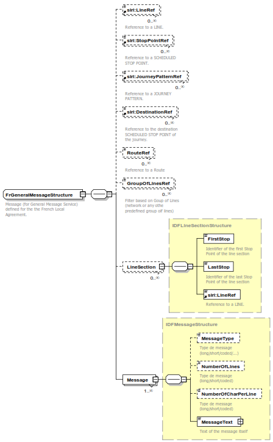

**Avant-propos**

Ce document présente de façon détaillée le profil SIRI National France
(également appelé « local agreement SIRI France »), soit la déclinaison
de la norme SIRI aux besoins métiers France. Il contient tous les
éléments nécessaires à sa compréhension, mais ne propose ni une
réécriture ni une traduction de l'ensemble des documents normatifs SIRI
:

-   Le lecteur devra donc se référer à la norme quand cela sera
    nécessaire, en particulier au niveau technique avant d'envisager
    toute implémentation de SIRI.

D'autre part, l'ensemble de la terminologie utilisée dans ce document
est celle de SIRI, et par voie de conséquence de TRANSMODEL version 6.0
.

-   Le lecteur est donc invité à se référer au document TRANSMODEL pour
    de plus amples précisions sur la terminologie, les concepts ou
    modèles de données sous-jacents.

Plus généralement, les notions manipulées dans ce document sont décrites
par l’ensemble de documents normatifs suivants :

-   SIRI : Service Interface for Real-time Information relating to
    public transport operations (EN 15531- 1 to 3 and CEN/TS 15531-4
    and 5)

    -   Part 1: Context and framework

    -   Part 2: Communications infrastructure

    -   Part 3: Functional service interfaces

    -   Part 4: Functional service interfaces - Facility Management

    -   Part 5: Functional service interfaces - Situation Exchange

-   TRANSMODEL : CEN EN 12896, Transmodel (version 6.0), Reference Data
    Model for Public Transport et Transmodel in UML (projet SITP
    2,version 0.1 04/09/2003)

-   NEPTUNE : Norme AFNOR - PR NF P99-506 Décembre 2009

Dans le document, les règles propres au profil sont présentées sur
<span class="hl">fond jaune</span>. Les autres règles ont plus un rôle
d'explication, d'accompagnement ou de recommandation.

**Structuration du document**

Ce document est structuré en trois parties :

-   Partie 1 : Contexte

Cette partie présente la démarche de construction du profil SIRIFrance,
les cas d’utilisation constatés ou présentés à titre d’exemple, et la
liste des services SIRI retenus, en se basant sur ces cas d’utilisation.

-   Partie 2 : Présentation des concepts fondamentaux du Profil

Cette partie présente les particularités et les options du profil SIRI
France : concepts fondamentaux, modélisation de cas spécifiques,
référentiels de données, modalités techniques d’échange.

-   Partie 3 : Description du profil d’échange

Cette partie décrit les conventions et les règles utilisées pour la
rédaction de ce profil.

-   Partie 4 : Description détaillée des messages

Cette partie présente le format des messages SIRI et les choix effectués
dans le contexte National France (utilisation ou non des champs,
cardinalités, …). Elle constitue à ce titre une description technique et
essentiellement un cadre fonctionnel à destination des développeurs et
intégrateurs.

Le lecteur dispose en annexe au présent document d’un glossaire composé
des définitions et autres acronymes.

*<u>A noter</u>* : les extraits de normes figurant dans cet ouvrage sont
reproduits avec l’accord de l’AFNOR. Seul le texte original et complet
de la norme telle que diffusée par l'AFNOR – accessible via le site
Internet www.afnor.fr – possède une valeur normative.

**Introduction**

La norme SIRI (Service Interface for Real time Information) définit le
protocole d’échange de l’information Temps Réel pour les transports
collectifs (format XML). SIRI se base sur le modèle de données de
référence du transport public : TRANSMODEL. SIRI a été élaborée avec la
participation initiale de la France, l’Allemagne ( Verband Deutscher
Verkehrsunternehmen ), en Scandinavie et au Royaume-Uni ( UK Real Time
Interest Group ).

Le groupe de travail français, CN03/GT7 (miroir du groupe européen CEN
TC278 / WG3 / SG7) a adopté le format d’échanges NEPTUNE (sous-ensemble,
ou profil, du format TRIDENT issu d'un projet Européen) comme base pour
les échanges de données de transport en commun. Le standard NEPTUNE,
aborde essentiellement les aspects référentiels des données échangées.
Il est normalisé à l’AFNOR sous le nom NEPTUNE, PR NF P99-506

Afin de fournir aux transporteurs et aux industriels un cadre normalisé
pour l’échange de données concernant l’information temps réel, le CEN
TC278 / WG3 / SG7 a décidé de lancer le projet **SIRI** (**S**ervice
**I**nterface for **R**ealtime **I**nformation) dès 2004.

Aujourd’hui, la norme SIRI version 2.1 peut servir de base à toute
implémentation des échanges de données temps réel, elle assure une
compatibilité ascendante avec la version 1.0 qu'elle précise et lui
ajoute quelques fonctions et attributs issus des retours d'expérience de
mise en œuvre de la version 1.0.

Le présent document contient le profil d’utilisation de cette
spécification technique dans un contexte national francais.

Il est complété par un ensemble de documents d’accompagnement : Se
reporter au paragraphe Documents d’accompagnement du présent document.

# Domaine d’application

Le profil objet du present document s’applique à la spécification
technique SIRI (documents \[R5\] à \[R9\] §2). Les objectifs de ce
profil sont rappelés dans la suite de ce paragraphe.

## Profils

La mise en place d’un profil normatif répond au constat suivant :

-   Les normes sont par nature et définition des documents consensuels,
    en particulier pour les documents de normalisations publiés par le
    CEN, définis dans un contexte international. Cela signifie que d'une
    part elles prennent en compte de très nombreux besoins car elles ont
    été établies à un niveau européen, et d'autre part elles n'imposent
    pas une implémentation exhaustive immédiate, mais permettent une
    implémentation progressive et qui peut être limitée à un besoin bien
    identifié.

Ces normes prennent en compte des besoins d’implémentation qui vont
au-delà des besoins nationaux.

-   La contrepartie de cette ouverture est que l'on peut facilement
    aboutir à des systèmes SIRI incompatibles alors même qu'ils
    respectent la norme : par exemple, pour peu qu'ils n'implémentent
    pas les mêmes services.

-   Les documents normatifs sont bien souvent très détaillés et
    volumineux, rendant leur consultation et lecture difficiles.

-   Des éléments proposés par la norme sont optionnels, lors de
    l’implémentation d’une application conforme à la norme il doit être
    décidé si ils sont ou non utilisés.

-   Les spécifications techniques SIRI sont issues de ces processus de
    normalisation internationaux et intègrent des mécanismes répondant à
    des besoins Allemands ou Suisse par exemple y sont aussi intégrés
    des mécanismes pour faciliter la compatibilité avec la norme
    française NEPTUNE, Britannique TransXChange, NOPTIS suédoise, …

La norme SIRI recommande donc l'établissement d'un « Local Agreement »
ou profil SIRI, qui permettra de contraindre et restreindre son
implémentation dans le cadre d'un échange donné – ici, dans le cas
présent, au niveau national France.

De plus, la norme SIRI fournit un guide pour l'établissement de ce
profil.

## Qualité & Cohérence des données

Un des objectifs du profil est de simplifier et améliorer
l’interopérabilité. L’interopérabilité ne peut être atteinte uniquement
sur la base de la conformité au profil sans s’assurer de la qualité des
données véhiculées : Cohérence des données, conforme au format et
decrivant la réalité.

En conséquence le profil doit être accompagné d’un ensemble de règles de
cohérence et de qualité spécifiquement concues pour la mise en œuvre du
profil SIRI. Le respect des règles ne garantie cependant pas à 100% la
qualité d’un jeu de données mais va permettre de minimiser les problèmes
de cohérence.

## Références Normatives

Les documents de référence suivants sont indispensables pour
l'application du présent document. Pour les références datées, seule
l'édition citée s'applique. Pour les références non datées, la dernière
édition du document de référence s'applique (y compris les éventuels
amendements).

**\[R1\]** EN12896 Public Transport Reference Data Model Part 1 à Part 4

-   Part 1 : Common Concepts (corresponds to
    [NeTEx](http://www.transmodel-cen.eu/standards/netex/) Part 1
    -Framework)

-   Part 2: Public Transport Network Topology (corresponds to
    [NeTEx](http://www.transmodel-cen.eu/standards/netex/) Part 1-
    Topology)

-   Part 3 : Timing Information and Vehicle Scheduling (corresponds to
    [NeTEx](http://www.transmodel-cen.eu/standards/netex/) Part 2)

**\[R2\]** CEN/TS 16614-1 Network and Timetable Exchange (NeTEx) -
Network description

**\[R3\]** CEN/TS 16614-2 Network and Timetable Exchange (NeTEx) -
Timing information

**\[R4\]** CEN/TS 16614-3 Network and Timetable Exchange (NeTEx) - Fare
description

**\[R5\]** EN 15531-1, Public transport - Service interface for
real-time information relating to public transport operations - Part 1:
Context and framework

**\[R6\]** EN 15531-2, Public transport - Service interface for
real-time information relating to public transport operations - Part 2:
Communications infrastructure

**\[R7\]** EN 15531-3, Public transport - Service interface for
real-time information relating to public transport operations - Part 3:
Functional service interfaces

**\[R8\]** CEN/TS 15531-4, Public transport - Service interface for
real-time information relating to public transport operations - Part 4:
Functional service interfaces: Facility Monitoring

**\[R9\]** CEN/TS 15531-5, Public transport - Service interface for
real-time information relating to public transport operations - Part 5:
Functional service interfaces - Situation Exchange

**\[R10\]** XSD SIRI 2.1

## Autres documents

**\[R11\]** T1 Éléments communs aux profils d'échange pour les
informations planifiées du transport en commun

\[R11.1\] T2 NeTEx - Profil Français de NETEx: éléments communs

\[R11.2\] T2 NeTEx - Profil Français pour les Arrêts

\[R11.3\] T2 NeTEx - Profil Français pour les horaires

\[R11.4\] T2 NeTEx - Profil Français pour les réseaux

# Termes et définitions

## Cas général

Dans le cadre de ce document, les termes et definitions applicables sont
ceux définis par les normes

-   EN 12896 (Transmodel V6) \[R1\]

-   CEN/TS 16614 (NeTEx) \[R2\]\[R3\]\[R4\]

-   CEN/TS 15531 (SIRI).\[R5\]\[R6\]\[R7\]\[R8\]\[R9\]

## Définition d’un point d’arrêt

La notion de point d’arrêt utilisée dans le cadre du présent profil fait
référence aux concepts Transmodel \[R1\] suivants :

-   Point d’arrêt logique

-   Point d’arrêt planifié (SCHEDULE STOP POINT) ;

-   Point d’arrêt physique

-   Zone d’embarquement (QUAY);

-   Lieu d’arrêt monomodal (STOP PLACE)

-   Pole Monomodal (STOP PLACE)

| DEF.1  | Chacun de ces points d’arrêt doit disposer d’un identifiant spécifique indépendamment de son type  |
|--|--|

Le point d’arrêt physique peut être ou non rattaché à un point d’arrêt
logique, selon les implémentations, par l’intermédiaire d’une
affectation (STOP ASSIGNMENT). La figure ci-après illustre ces relations
(Profil NeTEx France \[R11.4\]).


## Définition de la structure LEADER

La description des services SIRI fait référence à une structure LEADER.

| LEADER  | <span class="hl">:::</span>  | 1:1  | xxx­Delivery  | voir xxx**Delivery**.  |
|--|--|--|--|--|

Le Leader est (indirectement) défini dans la spécification SIRI \[R6\]
par les attributs suivants

<table cellpadding="7" cellspacing="0" >
    <tbody>
        <tr>
            <td colspan="3" >
                <p>xxxDelivery</p>
            </td>
            <td colspan="2" >
                <p><br></p>
            </td>
            <td colspan="2" >
                <p>+Structure</p>
            </td>
            <td colspan="4" >
                <p>Delivery for xxx Service</p>
            </td>
        </tr>
        <tr>
            <td >
                <p>Log</p>
            </td>
            <td colspan="2" >
                <p>ResponseTimestamp</p>
            </td>
            <td colspan="2" >
                <p>1:1</p>
            </td>
            <td colspan="2" >
                <p>xsd:dateTime</p>
            </td>
            <td colspan="4" >
                <p>Heure de creation de la response.</p>
            </td>
        </tr>
        <tr>
            <td rowspan="4" >
                <p>Endpoint properties</p>
            </td>
            <td colspan="2" >
                <p>RequestMessageRef</p>
            </td>
            <td colspan="2" >
                <p>0:1</p>
            </td>
            <td colspan="3" >
                <p>➜MessageQualifier</p>
            </td>
            <td colspan="3" >
                <p>For direct requests, Identifier of request that this Delivery satisfies.&nbsp;</p>
            </td>
        </tr>
        <tr>
            <td colspan="2" >
                <p>SubscriberRef</p>
            </td>
            <td colspan="2" >
                <p>0:1</p>
            </td>
            <td colspan="3" >
                <p>➜ParticipantCode</p>
            </td>
            <td colspan="3" >
                <p>Required if Delivery is for a Subscription, Participant Reference of Subscriber.</p>
            </td>
        </tr>
        <tr>
            <td colspan="2" >
                <p>SubscriptionFilterRef</p>
            </td>
            <td colspan="2" >
                <p>0:1</p>
            </td>
            <td colspan="3" >
                <p>➜SubcriptionFilterCode</p>
            </td>
            <td colspan="3" >
                <p>Unique identifier of Subscription filter to which this subscription is assigned. If there is only a single filter, then can be omitted.</p>
            </td>
        </tr>
        <tr>
            <td colspan="2" >
                <p>SubscriptionRef</p>
            </td>
            <td colspan="2" >
                <p>1:1</p>
            </td>
            <td colspan="3" >
                <p>➜SubscriptionQualifier</p>
            </td>
            <td colspan="3" >
                <p><span size="2">Required if Delivery is for a Subscription, Identifier of Subscription issued by Requestor. Unique within Subscriber (i.e. within&nbsp;</span><span size="2"><em><strong>ParticipantRef</strong></em></span> of Subscriber), and SIRI Functional Service type.&nbsp;</p>
            </td>
        </tr>
        <tr>
            <td rowspan="2" >
                <p>Delegation</p>
            </td>
            <td colspan="2" >
                <p>DelegatorAddress</p>
            </td>
            <td colspan="2" >
                <p>0:1</p>
            </td>
            <td colspan="2" >
                <p>Xsd:anyURI</p>
            </td>
            <td colspan="4" >
                <p>Address of original Consumer, i.e. requesting system to which delegating response is to be returned.&nbsp;</p>
            </td>
        </tr>
        <tr>
            <td colspan="2" >
                <p>DelegatorRef</p>
            </td>
            <td colspan="2" >
                <p>0:1</p>
            </td>
            <td colspan="3" >
                <p>➜ParticipantCode</p>
            </td>
            <td colspan="3" >
                <p>Identifier of delegating system that originated message.&nbsp;</p>
            </td>
        </tr>
        <tr>
            <td rowspan="11" >
                <p>Status</p>
            </td>
            <td colspan="2" >
                <p>Status</p>
            </td>
            <td colspan="2" >
                <p>0:1</p>
            </td>
            <td colspan="3" >
                <p>xsd:boolean</p>
            </td>
            <td colspan="3" >
                <p><span size="2">Whether the complete request could be processed successfully or not. Default is true. If any of the individual requests within the delivery failed, should be set to&nbsp;</span><span size="2"><em>false</em></span>.</p>
            </td>
        </tr>
        <tr>
            <td colspan="2" >
                <p>ErrorCondition</p>
            </td>
            <td colspan="2" >
                <p>0:1</p>
            </td>
            <td colspan="3" >
                <p>+Structure</p>
            </td>
            <td colspan="3" >
                <p>Description of any error or warning conditions that apply to the specific functional request or response.</p>
            </td>
        </tr>
        <tr>
            <td colspan="2" >
                <p><br></p>
            </td>
            <td colspan="2" >
                <p><br></p>
            </td>
            <td colspan="3" >
                <p>choice</p>
            </td>
            <td colspan="3" >
                <p>One of the following Error codes.</p>
            </td>
        </tr>
        <tr>
            <td >
                <p>a</p>
            </td>
            <td >
                <p>CapabilityNotSupportedError</p>
            </td>
            <td colspan="2" rowspan="5" >
                <p>-1:1</p>
            </td>
            <td colspan="3" >
                <p>+ Error</p>
            </td>
            <td colspan="3" >
                <p>Error: Capability not supported.</p>
            </td>
        </tr>
        <tr>
            <td >
                <p>b</p>
            </td>
            <td >
                <p>AccessNotAllowedError</p>
            </td>
            <td colspan="3" >
                <p>+Error</p>
            </td>
            <td colspan="3" >
                <p>Error: Requestor is not authorised to the service or data requested.</p>
            </td>
        </tr>
        <tr>
            <td >
                <p>c</p>
            </td>
            <td >
                <p>NoInfoForTopicError</p>
            </td>
            <td colspan="3" >
                <p>+Error</p>
            </td>
            <td colspan="3" >
                <p>Error: Valid request was made but service does not hold any data for the requested topic expression.</p>
            </td>
        </tr>
        <tr>
            <td >
                <p>d</p>
            </td>
            <td >
                <p>AllowedResourceUsageExceededError</p>
            </td>
            <td colspan="3" >
                <p>+Error</p>
            </td>
            <td colspan="3" >
                <p>Error: Valid request was made but request would exceed the permitted resource usage of the client.</p>
            </td>
        </tr>
        <tr>
            <td >
                <p>e</p>
            </td>
            <td >
                <p>OtherError</p>
            </td>
            <td colspan="3" >
                <p>+Error</p>
            </td>
            <td colspan="3" >
                <p>Error other than a well-defined category.</p>
            </td>
        </tr>
        <tr>
            <td >
                <p><br></p>
            </td>
            <td >
                <p>Description</p>
            </td>
            <td colspan="2" >
                <p>0:1</p>
            </td>
            <td colspan="3" >
                <p>➜ErrorDescription</p>
            </td>
            <td colspan="3" >
                <p>Description of Error.</p>
            </td>
        </tr>
        <tr>
            <td colspan="2" >
                <p>ValidUntil</p>
            </td>
            <td colspan="2" >
                <p>0:1</p>
            </td>
            <td colspan="3" >
                <p>xsd:dateTime</p>
            </td>
            <td colspan="3" >
                <p>End of data horizon of the data producer.</p>
            </td>
        </tr>
        <tr>
            <td colspan="2" >
                <p>ShortestPossibleCycle</p>
            </td>
            <td colspan="2" >
                <p>0:1</p>
            </td>
            <td colspan="3" >
                <p>PositiveDurationType</p>
            </td>
            <td colspan="3" >
                <p>Minimum interval at which updates can be sent.</p>
            </td>
        </tr>
        <tr>
            <td >
                <p><br></p>
            </td>
            <td colspan="2" >
                <p>DefaultLanguage</p>
            </td>
            <td colspan="2" >
                <p><br></p>
            </td>
            <td colspan="3" >
                <p>Xsd:language</p>
            </td>
            <td colspan=3" >
                <p>Default language for text elements.&nbsp;</p>
            </td>
        </tr>
    </tbody>
</table>

## Référentiel théorique

Le référentiel théorique est l’objet d’un accord entre les parties.

Il repose sur des échanges :

-   non définis par le présent profil (NeTEx par exemple)

-   ou à base de service Discovery (cf paragraphe 5.6).

# Description du profil d’échange

## Règles de gestion du profil

Le present profil contient un ensemble de règles de gestion applicables.
Ces règles de gestion sont présentées sous forme tabulaire et
numérotées.

| Numéro  | <span class="hl">Intitulé de la règle</span>  |
|--|--|

<span class="hl">Des textes explicatifs viennent compléter les règles
d’application du profil FR</span>

## Conventions & Représention des messages

Les messages constituant ce profil d'échange sont décrits en adoptant un
formalisme tabulaire. Les tableaux proposent ces colonnes:

<table>
<colgroup>
<col style="width: 15%" />
<col style="width: 15%" />
<col style="width: 17%" />
<col style="width: 11%" />
<col style="width: 39%" />
</colgroup>
<tbody>
<tr>
<td>Organisational Group</td>
<td>Name of Element</td>
<td>Min :<br />
Max</td>
<td>Data Type</td>
<td>Description</td>
</tr>
</tbody>
</table>

La structure des tableaux présentée ici est exactement la même que celle
des tableaux des documents SIRI de référence ceci afin de simplifier le
passage d'un document à l'autre.

Les tableaux sont simplement complétés et enrichis des informations
propres au profil SIRI France.

Une description détaillée de la structure de ces tableaux est présentée
dans le document « **SIRI-part 1**-**4.3-Notation for XML model
structures of SIRI messages »**.

Pour mémoire les principaux éléments présentés sont les suivants :

-   Dans la documentation SIRI, les structures sont présentées sous
    forme tabulaire. L'en-tête des colonnes est supposé connu et n'est
    donc pas systématiquement répété.

-   Les tableaux utilisent un ensemble de conventions pour les éléments
    XML et leurs contraintes.

Les éléments constitutifs de ces tableaux sont présentés ci-dessous.

### Classification (Organisational Group label)

Cette première colonne précise la catégorie de l'élément, par exemple
‘*Payload’* (qui se traduit littéralement par « charge utile », et
correspond à la description de l'objet lui-même indépendamment de toute
donnée d'accompagnement, et autres en-têtes).

Par exemple :

-   Attributes

-   Log

-   Endpoint

-   Status

-   Payload

### Nom de l'élément (*Element Name*)

Cet élément correspond naturellement au nom de l'élément présenté. Si
l'élément appartient à une structure complexe, le nom de l'élément père
(ou racine) est présenté en haut du tableau.

La notation « :: » fait référence à un groupe d'éléments défini à un
autre endroit du document (la colonne Type de Données permettra de
retrouver cette définition)

Dans les cas d'éléments composés, une indication « voir ci-dessous »
figure dans la colonne type et les sous-éléments sont présentés en
dessous avec une indentation (c'est le cas de ***ErrorCondition*** dans
l'exemple ci-dessous).

### Cardinalité et choix(Multiplicity & Choice (Min:Max))

Cette colonne précise la cardinalité de l'élément sous la forme :

-   \[nombre minimal d'occurrences\]:\[nombre maximal d'occurrences\]

-   Un nombre d'occurrence valant « \* » signifie « nombre non limité ».

Si cet indicateur est préfixé d'un tiret (par exemple « **–1:1** ») cela
signifie qu'il faut choisir un élément (ou plusieurs) parmi une liste
indiquée (***choice*** au niveau XSD).

Si la cardinalité SIRI est précisée pour le profil SIRI France, cela
sera aussi noté, en complément dans cette colonne et <span
class="hl">surligné en jaune.</span>

Les différentes possibilités d'exprimer la cardinalité sont donc les
suivantes :

-   En noir sur fond blanc : la cardinalité est celle spécifiée par le
    document normatif SIRI (en particulier, toutes les notations de type
    « 1:1 » ou « 1:\* » signifient que le champ est obligatoire). Ces
    champs font partie du profil SIRI France.

-   En noir <span class="hl">surligné en jaune</span>: la cardinalité
    du document normatif SIRI est précisée par le profil SIRI France
    (pour rendre un champ facultatif obligatoire par exemple). C'est
    alors la version <span class="hl">surlignée en jaune</span> qui
    s'applique.

-   En noir <span class="hl_france">surligné en vert</span> : la
    cardinalité du document normatif SIRI est précisée par le profil
    SIRI France pour la mise en place des concentrateurs. En effet, les
    concentrateurs ont des spécificités, en particulier en terme de
    volumétrie et de mise en cohérence de données multi-sources qui
    nécessitent certaines adaptations par rapport au cas général. Les
    commentaires y attenant seront aussi surlignés en vert.

-   Il n’y a pas de cardinalité, texte masqué : les champs en texte
    masqué <span class="hl_delete">surligné bleu</span> sont les
    champs non retenus par le profil SIRI France, leur cardinalité
    d'origine est « 0:1 » ou « 0:\* » mais ils ne sont pas utilisés en
    France (techniquement ils ne sont pas interdits, et leur présence ne
    doit pas poser de problème d'interopérabilité, mais s'ils sont
    présents ils seront à priori ignorés).

### Type de données (*Data Type*)

Cette colonne indique le type de l'élément:

-   soit un type simple (SIRI ou XSD) comme *Positive­DurationType* ou
    *xsd:dateTime*

-   soit un type structuré, signalé par +*Structure* (la définition de
    la structure porte alors le nom de l'élément suffixé par le terme
    **Structure**)

-   les références (par identifiant) sont signalées, sous la forme
    *OperatorCode* (référence à un opérateur, dont on fournit le code ou
    identifiant, dans ce cas)

-   dans le cas des énumérations, la liste des valeurs est indiquée
    (éléments séparés par une barre verticale : « **\|** »)

-   Pour les types les plus classiques, l'abréviation est autorisée
    quand le nom est long (*NLString* pour *NaturalLanguageString* ou
    *Error* pour *ErrorStructure*).

### Description (Description)

On trouve dans cette colonne la description textuelle de l'élément.

Le tableau ci-dessous est un exemple de tableau SIRI (non traduit pour
celui-ci, étant donné que son contenu n'a pas d'importance).

# Partie I - Description du cadre

## Définition des concepts fondamentaux

Le présent profil s’appuie sur les concepts définis dans Transmodel
\[R1\]

## Cas d’usage

Les principaux cas d’usage SIRI, dans un environnement national France,
sont synthétisés dans la suite de ce paragraphe. Ils sont détaillés dans
le document d’accompagnement \[A1\].

Cette liste des cas d’usage ne se veut **pas exhaustive** et peut être
complétée localement pour répondre à des besoins spécifiques

Pour chaque cas d’usage, une **préconisation** de services SIRI à
implémenter est présentée en conclusion du paragraphe. Les
préconisations s’appuient sur les ‘bonnes pratiques’ d’implémentation
SIRI \[A3\].

Dans ce cadre chaque service SIRI d’un cas d’Usage est qualifié
‘Indispensable’ ou ‘Facultatif’.

-   Indispensable : indique que, pour le cas d’usage identifié, le
    respect des bonnes pratiques d’implémentation tend à l’utilisation
    de ce service. Dans le cas ou un autre service SIRI serait retenu,
    l’implémentation sortirait du contexte d’utilisation et
    correspondrait alors un autre cas d’usage.

-   La non implémentation d’un service ‘Indispensable’ ne veut pas dire
    que cette implémentation n’est pas conforme au profil SIRI FR, seule
    la conformité aux règles de gestion et aux règles d’implémentation
    des services le sont.

-   Facultatif : indique que le service SIRI peut être utilisé en
    complément du ou des services SIRI obligatoires mais que le cas
    d’usage peut être respecté sans son implémnetation.

### Diffusion inter systemes

Ce cas d’usage doit permettre de communiquer à différents systèmes de
transport d’échanger des flux d’information relatifs à l’information
voyageur pour leur permettre de réaliser des traitements de cette
information independamment les uns des autres et en parfaite cohérence.

Dans ce cadre, SIRI permet l’échange d’informations multimodales et
multi opérateurs. Ces flux ne sont pas à destination directe des
usagers.

Les systèmes concernés peuvent être des SAE, des SIV, des Systèmes
d’affichage, …

Cet alignement repose sur un échange préalable de données théoriques
(Topologie et offre de transport) qui sont mises à jour entre les
différents systèmes interconnectés via SIRI.

Ces échanges s’appuient sur le protocole de communication SIRI définis
dans le partie 2 de la spécification [\[R6\]](#_Références_Normatives)

La description de ce cas d’usage est définie dans le document
d’accompagnement [\[A1\]](#_Ref26538176)

### Diffusion Terminaux legers

Il s'agit ici de permettre à un utilisateur d'accéder aux informations
horaires temps réel (prochains passages avec indications de ligne, de
direction, ainsi que les éventuels messages) pour n’importe quel point
d’arrêt, indépendamment du transporteur, et ce à partir d'un terminal
mobile de type téléphone portable.

Ce service pourra ainsi être utilisé sur le réseau (à l'arrêt dans le
cas où il n'y aurait pas d'afficheur, permettant ainsi à l'exploitant de
mettre le service à disposition sans que les coûts ne soient trop
importants, autorisant ainsi plus facilement la couverture de ligne ou
zones à faible fréquentation) ou hors réseau (pour synchroniser son
départ avec l'arrivée du train ou du bus par exemple).

SIRI est ici utilisé pour permettre au système de présentation qui gère
le dialogue avec les terminaux mobiles d'accéder aux informations
horaires temps réel de prochain passage.

Ce cas d'utilisation peut être généralisé à un accès avec tout autre
type de terminal, en particulier via un accès de type Web, pour diffuser
les informations horaires et les informations de perturbation.

A noter que pour ce cas d’usage les protocoles de communications SIRI
lite sont à privilégier.

La description de ce cas d’usage est définie dans le document
d’accompagnement \[A1\]

### Centrale de mobilité

Les centrales de mobilité prennent en compte les transports en commun
sur une échelle relativement large, impliquant ainsi quasi
systématiquement plusieurs transporteurs.

L'un des services clés de ce type de centrale de mobilité est souvent le
calcul d’itinéraires, qui de plus en plus ne se limite pas à la prise en
compte les horaires théoriques (pour cause d’indisponibilité des
données, et non pour des raisons techniques).

La prise en compte des informations temps réel est un besoin qui, dans
ce contexte, s'exprime à deux niveaux:

1.  la prise en compte des perturbations (prévues, c'est-à-dire connues
    plus ou moins longtemps avant le départ, ou inopinées) pour, d'une
    part, les signaler à l'usager et, d'autre part, lui proposer des
    solutions alternatives lui permettant de « sécuriser » son trajet,

2.  la prise en compte des informations horaires temps réel pour
    optimiser le déplacement (le train que l'on ne pensait pas pouvoir
    prendre à une correspondance devient disponible suite à un léger
    retard ou encore un retard trop important impliquant une
    modification de l'itinéraire, etc -).

L'apport de la norme SIRI est ici clairement de permettre aux SAE de
diffuser vers la centrale de mobilité l'ensemble des informations temps
réel nécessaires pour la mise en place des services.

La description de ce cas d’usage est définie dans le document
d’accompagnement [\[A1\]](#_Ref26538176)

### Gestion des perturbations

La prise en compte des perturbations telle qu'elle est souvent mise en
oeuvre dans les systèmes actuels se limite souvent à un message textuel
libre ou pré-formaté et associé à un arrêt, une ligne, un itinéraire ou
une mission. La norme SIRI permet de transmettre la perturbation de
manière codifiée ; Elle permet :

-   de décrire finement la cause de la perturbation,

-   de lister les conséquences liées à cette perturbation,

-   de permettre une prise en compte par un calculateur d’itinéraires,

-   de générer automatiquement des messages, avec prise en compte du
    type de périphérique (petits messages pour les SMS, longs messages
    pour le Web, etc.) ou de générer ces messages en plusieurs langues
    (il ne s’agit naturellement pas d’une fonction de SIRI mais d’une
    fonction qui pourra être mise en œuvre par l’émetteur ou par le
    récepteur sur la base des données structurées),


-   d'associer la perturbation à un tronçon de ligne,

-   de gérer des périodes de validité complexe (i.e. : du lundi au
    vendredi de 8 h à 18 h -.),

-   de mettre à jour le « fil de perturbation » en ayant la possibilité
    d’identifier les mises à jour d'une perturbation.

La description de ce cas d’usage est définie dans le document
d’accompagnement [\[A1\]](#_Ref26538176)

### Information PMR

Informer les PMR ou toute personne ayant des besoins particuliers (en
particulier les handicaps auditifs, visuels, moteurs, etc., mais aussi à
tous les besoins particuliers comme « utilisation d'une poussette »,
« lourdement chargé en bagage », « jambe dans le plâtre », etc.) est
aussi un besoin avéré.

Ce type de besoin comporte une composante temps réel afin de pouvoir
informer sur l'état des équipements et des services (i.e. :
disponibilité ou non d'un ascenseur, d'un escalier mécanique, d'une
palette, d'un dispositif visuel, etc.).

Sur la base des services SIRI, des systèmes d'acquisition et de
supervision ou des systèmes impliquant une saisie par un opérateur (la
vérification d'état des équipements est aujourd'hui réalisée de façon
manuelle dans de très nombreux cas) peuvent diffuser leurs informations
de perturbation.

La description de ce cas d’usage est définie dans le document
d’accompagnement [\[A1\]](#_Ref26538176)

### Concentrateur

Les concentrateurs permettent de rassembler au sein d’un même système un
ensemble d’informations voyageur d’origine et de formes diverses dans un
format pivot (en principe conforme aux concepts transmodel) pour les
mettre à disposition de systèmes Clients.

Le flux entrant et sortant du concentrateur peuvent s’appuyer sur SIRI.
En general les systèmes historiques peuvent fournir aux concentrateurs
les informations dans des formats autres, le concentrateur redistribuant
les données en utilisant SIRI.

-   les centrales de mobilité,

-   les systèmes pour les agents sur le terrain,

-   les afficheurs,

-   des terminaux dédiés (système prévu spécifiquement pour gérer un
    type de handicap),

-   etc.

### Conformité Directive EU

La LOI n° 2019-1428 du 24 décembre 2019 d'orientation des mobilités
(LOM :
<https://www.legifrance.gouv.fr/dossierlegislatif/JORFDOLE000037646678>)
et, au niveau Européen, le Règlement Délégué (UE) 2017/1926 de La
Commission du 31 mai 2017 (complétant la directive 2010/40/UE du
Parlement européen et du Conseil en ce qui concerne la mise à
disposition, dans l'ensemble de l'Union, de services d'informations sur
les déplacements multimodaux) rendent obligatoire la mise à disposition,
quand elles existent, de certains types de données.

Le tableau ci-dessous résulte de l’analyse de la LOM et du règlement
délégué et fournit la liste des concepts concernés dans le présent
profil. Il sera donc nécessaire de fournir ces données pour être
conforme à la législation (il s’agit bien de mettre à disposition toutes
les données existantes dans les SI transport, et non de créer des
données qui n’existeraient pas encore sous forme informatique).

Les concepts présents dans les tableaux sont ceux directement référencés
par l’annexe du règlement européen
(<https://eur-lex.europa.eu/legal-content/FR/TXT/HTML/?uri=CELEX:32017R1926&from=FR>)
qui impliquent d’autres concepts (soit par héritage soit par relation,
au sens UML des termes). Ces éléments d’héritage et de relations sont
présentés dans les profils, mais pas dans ce tableau.

De plus, les noms des catégories (colonnes Catégorie et Détail) ont été
conservés dans la langue originale du document (l’anglais) pour éviter
tout risque de confusion. Pour la même raison, les noms des concepts
concernés sont ceux de la version originale de Transmodel.

Pour certaines catégories de données, il peut arriver que les concepts
correspondants soient multiples, mais aussi qu’ils soient différents
suivant le niveau de précision porté par la donnée. La colonnes
« Services à minima » correspond alors au minimum à fournir pour
répondre à la catégorie en question et les colonnes « Autres services »
décrivent des informations complémentaires qui, si elles sont utiles, ne
sont pas indispensables pour répondre à cette catégorie.

Il faut toutefois garder à l’esprit que toute information existante est
supposée être mise à disposition (que cela relève de la première ou de
la seconde colonne).

La première colonne reprend la notion de *niveau* tel qu’il est décrit
et utilisé par le règlement européen et a notamment une incidence sur le
calendrier de mise à disposition de la donnée (voir le règlement pour
plus de détails).

Les différents concepts présentés ne sont bien sûr pas détaillés dans ce
tableau mais dans le profil lui-même. C’est aussi dans la description du
profil que l’on trouvera les détails concernant les attributs
(obligatoire/facultatif, règles de remplissage, codification, etc.).
Pour ce qui est des attributs facultatifs, la règle reste que, pour les
objets ci-dessous, toute information disponible est supposée être
fournie (mais on ne crée pas d’information si elle n’est pas
disponible).

<div class="table-title">Concepts relatifs à la LOM et à la Règlementation Européenne </div>

<table>
<colgroup>
<col style="width: 5%" />
<col style="width: 18%" />
<col style="width: 20%" />
<col style="width: 12%" />
<col style="width: 14%" />
<col style="width: 30%" />
</colgroup>
<thead>
<tr class="header">
<th><strong>Niveau</strong></th>
<th><strong>Catégorie</strong></th>
<th><strong>Détail</strong></th>
<th><strong>Service à minima</strong></th>
<th><p><strong>Autres</strong></p>
<p><strong>services</strong></p></th>
<th><strong>Commentaire</strong></th>
</tr>
</thead>
<tbody>
<tr>
<td>1</td>
<td><em><strong>Passing times, trip plans and auxiliary information</strong></em></td>
<td>Disruptions (all modes)</td>
<td>General Message</td>
<td>Situation Exchange</td>
<td>Note : tout ce qui peut être échangé avec General Message peut aussi l’être avec Situation Exchange: pour anticiper les évolutions à venir il peut donc être préférable de tout de suite porter son choix sur Situation Exchange.</td>
</tr>
<tr>
<td><strong>1</strong></td>
<td><em><strong>Passing times, trip plans and auxiliary information</strong></em></td>
<td>Real-time status information — delays, cancellations, guaranteed connections monitoring (all modes)</td>
<td>General Message</td>
<td>Situation Exchange</td>
<td>Note : tout ce qui peut être échangé avec General Message peut aussi l’être avec Situation Exchange: pour anticiper les évolutions à venir il peut donc être préférable de tout de suite porter son choix sur Situation Exchange.</td>
</tr>
<tr>
<td>1</td>
<td><em><strong>Passing times, trip plans and auxiliary information</strong></em></td>
<td>Status of access node features (including dynamic platform information, operational lifts/escalators, closed entrances and exit locations — all scheduled modes)</td>
<td>General Message</td>
<td>Situation Exchange<br />
Facility Monitoring</td>
<td>Note : tout ce qui peut être échangé avec General Message peut aussi l’être avec Situation Exchange: pour anticiper les évolutions à venir il peut donc être préférable de tout de suite porter son choix sur Situation Exchange.</td>
</tr>
<tr>
<td><strong>2</strong></td>
<td><em><strong>Passing times, trip plans and auxiliary information (all modes)</strong></em></td>
<td>Estimated departure and arrival times of services</td>
<td>Estimated Timetable</td>
<td></td>
<td><p>Stop Monitoring pour heure de départ ou de passage mais ne permet pas de savoir l’heure d’arrivée.</p>
<p>Estimated Timetable pour une vue complète départ/arrivée<br />
ATTENTION: la notion d'heure de départ/arrivée peut donner lieu à débat</p></td>
</tr>
<tr>
<td><strong>2</strong></td>
<td><em><strong>Information service</strong></em></td>
<td>Availability of publicly accessible charging stations for electric vehicles and refuelling points for CNG/LNG, hydrogen, petrol and diesel powered vehicles</td>
<td>Facility Monitoring</td>
<td></td>
<td></td>
</tr>
<tr>
<td>2</td>
<td><em><strong>Availability check</strong></em></td>
<td>Car-sharing availability, bike sharing availability</td>
<td>Facility Monitoring</td>
<td></td>
<td></td>
</tr>
<tr>
<td>2</td>
<td><em><strong>Availability check</strong></em></td>
<td>Car parking spaces available (on and off-street), parking tariffs, road toll tariffs</td>
<td>Facility Monitoring</td>
<td></td>
<td></td>
</tr>
</tbody>
</table>

### Services SIRI applicables

<table>
<colgroup>
<col style="width: 17%" />
<col style="width: 9%" />
<col style="width: 9%" />
<col style="width: 10%" />
<col style="width: 9%" />
<col style="width: 11%" />
<col style="width: 10%" />
<col style="width: 10%" />
<col style="width: 10%" />
</colgroup>
<thead>
<tr class="header">
<th>Service</th>
<th>Diffusion Inter Systèmes</th>
<th>Diffusion Terminaux Legers</th>
<th>Centrale de Mobilité</th>
<th>Diffusion dans les vehicules</th>
<th>Gestion des perturbations</th>
<th>Information PMR</th>
<th>Concentrateur</th>
<th>Directive EU</th>
</tr>
</thead>
<tbody>
<tr>
<td><p>Horaires planifiés</p>
<p>Production Timetable</p></td>
<td></td>
<td></td>
<td></td>
<td></td>
<td></td>
<td></td>
<td></td>
<td></td>
</tr>
<tr>
<td><p>Horaires calculés</p>
<p>Estimated Timetable</p></td>
<td>Indispensable</td>
<td></td>
<td>Indispensable</td>
<td></td>
<td></td>
<td></td>
<td>Indispensable</td>
<td>Indispensable <sup>1</sup></td>
</tr>
<tr>
<td><p>Horaires planifiés à l’arrêt</p>
<p>Stop Timetable</p></td>
<td></td>
<td></td>
<td></td>
<td></td>
<td></td>
<td></td>
<td></td>
<td></td>
</tr>
<tr>
<td>Discovery Line</td>
<td></td>
<td></td>
<td></td>
<td></td>
<td></td>
<td></td>
<td>Facultatif<a href="#fn1" class="footnote-ref" id="fnref1" role="doc-noteref"><sup>1</sup></a></td>
<td></td>
</tr>
<tr>
<td><p>Horaires calculés à l’arrêt</p>
<p>Stop Monitoring</p></td>
<td></td>
<td>Indispensable</td>
<td></td>
<td>Facultatif</td>
<td></td>
<td></td>
<td>Facultatif</td>
<td>Facultatif</td>
</tr>
<tr>
<td>Discovery Stop</td>
<td></td>
<td></td>
<td></td>
<td></td>
<td></td>
<td></td>
<td>Facultatif<a href="#fn2" class="footnote-ref" id="fnref2" role="doc-noteref"><sup>2</sup></a></td>
<td></td>
</tr>
<tr>
<td><p>Supervision des véhicules</p>
<p>Vehicle Monitoring</p></td>
<td></td>
<td></td>
<td></td>
<td>Indispensable</td>
<td></td>
<td></td>
<td>facultatif</td>
<td></td>
</tr>
<tr>
<td><p>Correspondances planifiées</p>
<p>Connection Timetable</p></td>
<td></td>
<td></td>
<td></td>
<td></td>
<td></td>
<td></td>
<td></td>
<td></td>
</tr>
<tr>
<td><p>Correspondances calculées</p>
<p>Connection Monitoring</p></td>
<td></td>
<td></td>
<td></td>
<td>Facultatif</td>
<td></td>
<td></td>
<td></td>
<td></td>
</tr>
<tr>
<td><p>Messagerie</p>
<p>General Messaging</p></td>
<td>Facultatif</td>
<td>Facultatif</td>
<td>Facultatif</td>
<td>Indispensable</td>
<td>Facultatif</td>
<td>Facultatif</td>
<td>Indispensable</td>
<td>Indispensable (uniquement si SX n’est par retenu)</td>
</tr>
<tr>
<td><p>Gestion des événements</p>
<p>Situation Exchange</p></td>
<td></td>
<td></td>
<td>Indispensable</td>
<td>Facultatif</td>
<td>Indispensable</td>
<td>Indispensable</td>
<td>facultatif</td>
<td>Facultatif</td>
</tr>
<tr>
<td><p>Etat des équipements</p>
<p>Facility Monitoring</p></td>
<td></td>
<td></td>
<td>Facultatif</td>
<td></td>
<td></td>
<td>Indispensable</td>
<td></td>
<td>Indispensable</td>
</tr>
</tbody>
</table>
<section class="footnotes" role="doc-endnotes">
<hr />
<ol>
<li id="fn1" role="doc-endnote"><p>En complément du Service ET<a href="#fnref1" class="footnote-back" role="doc-backlink">↩︎</a></p></li>
<li id="fn2" role="doc-endnote"><p>En complement du Service SM<a href="#fnref2" class="footnote-back" role="doc-backlink">↩︎</a></p></li>
</ol>
</section>

**Règles de gestion**

<table>
<colgroup>
<col style="width: 4%" />
<col style="width: 95%" />
</colgroup>
<thead>
<tr class="header">
<th>CU-1</th>
<th>Si le service SX est disponible, toute information diffusée via GM doit aussi l’être en SX</th>
</tr>
</thead>
<tbody>
<tr>
<td>CU-2</td>
<td><p>Si le service SIRI SX est implémenté, GM ne devient qu'un service pour compatibilité avec les systèmes ne sachant pas recevoir du SX.</p>
<p>SX devient la référence pour les informations circonstancielles et doit donc contenir toutes les informations.</p></td>
</tr>
</tbody>
</table>

### Protocoles d’échange des données SIRI

Les échanges de données SIRI entre Systèmes reposent l’echange de
fichiers XML via la mise en œuvre du protocole SOAP. A noter que la mise
en œuvre d’une interface SIRI Lite repose sur des échanges de fichiers
XML ou JSON via une API REST.

Dans le cadre d’autres usages type OPEN DATA, l’utilisation d’autres
mécanismes est possible : message broker type MQTT, XML sans SOAP, API
REST, ….

# Partie II - Application du Profil SIRI France

## Modalités d’application

Après avoir retenu les services SIRI pour les cas d’utilisation
identifiés (Partie 1), les principales actions à effectuer sont les
suivantes:

1.  Identifier les données de référence, objet de la partie 2 de ce
    document :

-   Participants,

-   Identifiants des Lignes, des itinéraires et des missions,

-   Identifiants des Points d’Arrêt (et type de point d’arrêt…),

-   Identifiants des Correspondances,

-   Préciser les listes de valeurs supportées (*ServiceCategory*, *ProductCategory*, *VehicleFeature*)

2.  Définir le profil technique lui-même :

-   Type d’abonnement (1 ou 2 phases),

-   Support de la segmentation des messages,

-   Confirmation ou non, des notifications,

-   Filtres simples ou multiples,

-   Supervision de la disponibilité des partenaires,

-   Signification des champs fonctionnels,

-   …

3.  Préciser l’utilisation des champs facultatifs dans les messages des
    services retenus (un champ facultatif dans la norme peut être
    supprimé, devenir obligatoire ou rester facultatif dans le profil…)

4.  Définir éventuellement des extensions (ajout de champs non
    normalisés) propres à l’implémentation locale.

## Implémentations locales: éléments à préciser dans les protocoles d’accord

Le paragraphe suivant présente les aspects techniques à traiter pour
l’implémentation, il est à noter que ces aspects ne font pas partie
intégrante du local agreement SIRI France et sont présentés ci-dessous à
titre indicatif.

Le profil ne peut en effet pas définir tous les aspects nécessaires à la
mise en place d’un échange. Ces éléments devront donc être définis dans
le cadre des protocoles locaux établis entre les différents acteurs des
échanges.

1.  L'identification des infrastructures d’alimentation (et processus
    correspondant) : à définir spécifiquement pour chaque implémentation
    (par exemple le mode de connexion de l’interface SIRI au SAE…)

2.  Le choix d’utilisation des champs laissés facultatifs par le profil
    France dans les messages et services retenus (un champ facultatif
    peut être supprimé, devenir obligatoire ou rester facultatif), sans
    que la WSDL SIRI France ne soit modifiée. 

3.  Des préconisations pour la gestion et l'organisation des
    systèmes (annexe recommandée par la norme SIRI, à traiter dans le
    contexte de chaque protocole d’accord local) :

-   Contacts et responsables opérationnels,

-   Surveillance des services,

-   Période d’interruption des services,

-   Identification/gestion des anomalies.

## Référentiels de données

### Présentation du besoin

La mise en place d'un échange de données implique que les systèmes mis
en relation puissent identifier de façon non ambiguë les objets auxquels
ils font référence.

Cela est particulièrement vrai pour SIRI qui, de par sa vocation à
échanger des informations temps réel, ne re-décrit pas le référentiel
sous-jacent et le suppose donc connu.

Il sera donc indispensable, pour demander les prochains horaires de
passage à un arrêt, de connaître l'identifiant de l'arrêt en question.
Cela concerne tout un ensemble d'objets listés ci-dessous.

Il faut rappeler que l'identification de l'objet est une chose, mais que
le concept sous-jacent en est une autre:

La cohérence doit porter sur ces deux aspects. Les principaux concepts
utiles ont été évoqués au chapitre précédent. Pour les autres,
TRANSMODEL fait référence.

<u>Note</u>: le nom des objets est donné en Français et en Anglais, de
façon à simplifier une éventuelle recherche complémentaire dans les
documents normatifs.

### Références utilisées dans le cadre du profil SIRI France

<table>
<colgroup>
<col style="width: 28%" />
<col style="width: 71%" />
</colgroup>
<thead>
<tr class="header">
<th><strong>Donnée de référence</strong></th>
<th><strong>Référence adoptée pour le profil SIRI France</strong></th>
</tr>
</thead>
<tbody>
<tr>
<td><p>Date et Heure</p>
<p>(Date &amp; Time)</p></td>
<td><span class="hl">ISO 8601</span></td>
</tr>
<tr>
<td><p>Langue</p>
<p>(Language)</p></td>
<td><span class="hl">ISO 639-1</span></td>
</tr>
<tr>
<td><p>Localisation géographique</p>
<p>(Location)</p></td>
<td><span class="hl">WGS84 / gml (GML permettra d'échanger les localisations géographiques dans des référentiels projetés comme Lambert 2 étendu -.)</span></td>
</tr>
<tr>
<td><p>Fournisseur d'information</p>
<p>(Information Provider)</p></td>
<td><p>Voir le paragraphe correspondant (5.4.4)</p>
<p>Notion à mettre en relation avec le groupement ou le transporteur qui délivre l’information.</p></td>
</tr>
<tr>
<td><p>Point d'arrêt</p>
<p>(Stop Point)</p></td>
<td><p>Voir le paragraphe correspondant (Error: Reference source not found)</p>
<p><span class="hl">Dans l'état actuel des choses, il n'existe aucun référentiel global des points d’arrêt en France.</span></p></td>
</tr>
<tr>
<td><p>Correspondance</p>
<p>(Connection)</p></td>
<td><p><span class="hl">Dans l'état actuel des choses, il n'existe aucun référentiel global des correspondances en France.</span></p>
<p><span class="hl">Dans un premier temps, l'identification des correspondances devra donc être réalisée au cas par cas, et définie entre les acteurs avant de débuter un échange. L'identification devra dans ce cas porter une indication signalant qu'elle est spécifique à un échange local.</span></p>
<p><span class="hl">Cela concernera uniquement les cas où l'on souhaite gérer une correspondance et où l'on souhaitera être informé du fait qu'elle n'est plus possible (le Bus signale qu'il décide de ne pas attendre le Train, par exemple).</span></p></td>
</tr>
<tr>
<td><p>Véhicule supervisé</p>
<p>(VehicleActivity)</p></td>
<td><p><span class="hl">Dans le cadre du profil SIRI France, cette donnée ne peut être utile que pour permettre d'identifier la position d’un véhicule.</span></p>
<p><span class="hl">Si l’on souhaite connaître l'état des services dans le véhicule (état de fonctionnement de la palette par exemple), il sera alors plus simple de passer par l'identification de la course que par celle du véhicule.</span></p></td>
</tr>
<tr>
<td><p>Course</p>
<p>(Vehicle Journey )</p></td>
<td><span class="hl">L'identification des courses devra donc être réalisée au cas par cas, et définie entre les acteurs avant de débuter un échange. L'identification devra dans ce cas porter une indication signalant qu'elle est spécifique à un échange local.</span></td>
</tr>
<tr>
<td><p>Numéro de passage à un Point d'arrêt sur une mission</p>
<p>(Stop Visit In Pattern)</p></td>
<td><span class="hl">Parmi les solutions proposées par SIRI, le profil SIRI France retient celle qui consiste à attribuer un numéro d'ordre dans la mission à chacun des arrêts.</span></td>
</tr>
<tr>
<td><p>Ligne</p>
<p>(Line )</p></td>
<td><span class="hl">L'identification des lignes devra donc être réalisée au cas par cas, et définie entre les acteurs avant de débuter un échange. L'identification devra dans ce cas porter une indication signalant qu'elle est spécifique à un échange local.</span></td>
</tr>
<tr>
<td><p>Itinéraire</p>
<p>(Route)</p></td>
<td><span class="hl">L'identification des itinéraires devra donc être réalisée au cas par cas, et définie entre les acteurs avant de débuter un échange. L'identification devra dans ce cas porter une indication signalant qu'elle est spécifique à un échange local.</span></td>
</tr>
<tr>
<td><p>Mission</p>
<p>(Journey pattern)</p></td>
<td><span class="hl">L'identification des Missions devra donc être réalisée au cas par cas, et définie entre les acteurs avant de débuter un échange. L'identification devra dans ce cas porter une indication signalant qu'elle est spécifique à un échange local.</span></td>
</tr>
<tr>
<td><p>Direction</p>
<p>(Direction)</p></td>
<td><span class="hl">Cette notion a été introduite par SIRI pour pallier les cas où la notion d’itinéraire n'est pas formalisée.</span></td>
</tr>
<tr>
<td><p>Destination</p>
<p>(Destination)</p></td>
<td><p><span class="hl">Cette notion a été introduite par SIRI pour pallier les cas ou la notion de mission n'est pas formalisée.</span></p>
<p><span class="hl">Dans le cadre du profil SIRI France, les Destinations seront systématiquement les extrémités des missions, et donc leur dernier point d'arrêt (dont on utilisera l'identifiant).</span></p></td>
</tr>
<tr>
<td><p>Version des horaires théoriques</p>
<p>(Schedule Version)</p></td>
<td><p><span class="hl">Cette notion permet de référencer la version des données horaires théoriques sous-jacente.</span></p>
<p><span class="hl">L'identification de version du référentiel devra donc être réalisée au cas par cas, et défini entre les acteurs avant de débuter un échange. L'identification devra dans ce cas porter une indication signalant qu'elle est spécifique à un échange local.</span></p>
<p><span class="hl">Pour mémoire, son principal usage est de permettre d'identifier une éventuelle désynchronisation entre les référentiels (horaires et réseaux) qui pourrait amener à ce que, par exemple, un point d'arrêt connu par l'une des parties de l'échange ne le soit pas de l'autre.</span></p></td>
</tr>
<tr>
<td><p>Mode et sous-mode de transport</p>
<p>(Product Category)</p></td>
<td><p><span class="hl">L'ensemble des valeurs proposées par SIRI est retenu pour le profil SIRI France.</span></p>
<p><span class="hl">Voir 3.3.11.3 dans le document SIRI-Part 1</span></p>
<p><span class="hl">Cette liste est très détaillée (issue de la norme TPEG) mais permet d'être certain de ne pas avoir à la compléter à l'avenir.</span></p></td>
</tr>
<tr>
<td><p>Identification du véhicule, type de véhicule</p>
<p>(Vehicle Feature)</p></td>
<td><p><span class="hl">L'ensemble des valeurs proposées par SIRI est retenu pour le profil SIRI France.</span></p>
<p><span class="hl">Voir 3.3.13 dans le document SIRI-Part 1 et sa mise à jour pour le service </span><em><span class="hl">Facility Monitoring</span></em></p>
<p><span class="hl">Cette liste est très détaillée (issue de la norme TPEG, entre autres) mais permet d'être certain de ne pas avoir à la compléter à l'avenir.</span></p></td>
</tr>
<tr>
<td><p>Type de service</p>
<p>(Service Feature)</p></td>
<td><p><span class="hl">L'ensemble des valeurs proposées par SIRI est retenu pour le profil SIRI France.</span></p>
<p><span class="hl">Voir 3.3.13 dans le document « SIRI-Part 1 » et sa mise à jour pour le service </span><em><span class="hl">Facility Monitoring</span></em></p>
<p><span class="hl">Cette liste est très détaillée (issue de la norme TPEG, entre autres) mais permet d'être certain de ne pas avoir à la compléter à l'avenir.</span></p></td>
</tr>
</tbody>
</table>

<u>Note</u> : Il faut rappeler que, d’une façon générale, pour des
échanges locaux, il n’est pas indispensable de disposer d’un référentiel
complet pour échanger les données temps réel (notamment mission, course,
…). Le sous-ensemble d’objets ci-dessus peut en effet suffir, tout
dépendra du cas d’utilisation mis en œuvre.

## Gestion des Identifiants

### Structure des identifiants

#### Codification des identifiants

<span class="hl">L’objectif d’une codification étant de s’assurer de
l’unicité (</span>**<span class="hl">au niveau
national</span>**<span class="hl">) et de la pérennité de
l’identifiant. </span>**<span class="hl">Toute solution autre,
permettant d’assurer une unicité et une pérennité de l’identifiant est
valable</span>**<span class="hl">. En particulier, si un réfentiel de
données (arrêts, lignes, etc.) propose des identifiants uiques et
pérennes mais avec une structure très différente, cela est tout à fait
acceptable ! </span>**<span class="hl">Il est par contre impératif que
l’identifiant d’un objet soit strictement le même quel que soit le flux
de données utilisé</span>**<span class="hl"> (SIRI, NeTEx, tous
profils confondus, et même GTFS ou tout autre format qui pourrait être
utilisé pour l’échange de données).</span>

**<span class="hl">NOTE IMPORTANTE</span>**<span class="hl"> : la
technique de construction proposée ici a pour vocation d’assurer
l’unicité de l’identifiant, mais en aucun cas l’identifiant ne peut être
considéré comme porteur de sémantique. En conséquence </span>**<span
class="hl">toute analyse (segmentation, parsing, extraction
d’information, etc.) de l’identifiant est à proscrire</span>**<span
class="hl"> ! </span>

<span class="hl">Le profil </span>**<span class="hl">SIRI
France</span>**<span class="hl"> propose la codification suivante pour
tous les identifiants :</span>

***<span class="hl">\[Fournisseur\]:\[type
d'objet\]:\[typeObjetDétaillé\]:\[identifiantTechnique\]:LOC</span>***

<span class="hl">Si un objet a déjà été identifié dans le cadre d’un
échange SIRI, son identifiant sera conservé.</span>

<span class="hl">Si l’objet n’a encore jamais été échangé, dans le
contexte du profil SIRI, en dehors des arrêt (présenté ci-dessous) la
codification suivante est proposée :</span>

-   ***<span class="hl">\[Fournisseur\] : </span>***<span
    class="hl">est remplacé par le CODESPACE (et peut être complété par
    le </span>***<span class="hl">DataSourceRef</span>***<span
    class="hl"> de </span>**<span
    class="hl">EntityInVersion</span>**<span class="hl">)</span>

-   ***<span class="hl">\[type d'objet\]:</span>**<span class="hl">
    </span>*<span class="hl">classe de l'objet sous la forme du nom du
    tag XML qui le porte</span>

-   <span class="hl"> </span>***<span
    class="hl">\[identifiantTechnique\]</span>***<span class="hl">:
    est naturellement conservé</span>

-   ***<span class="hl">LOC</span>***<span class="hl">: est conservé
    pour permettre de préciser que l'identifiant a été défini de façon
    locale entre les parties engagées dans l'échange, et qu'il ne fait
    donc pas partie du référentiel partagé (régional, national, etc.)
    </span>

    -   <span class="hl">L'utilisation de ce qualificatif est
        obligatoire quand l'identifiant est local. </span>

    -   <span class="hl">Pour les objets faisant partie de référentiels
        partagés on peut le remplacer par un </span>***<span
        class="hl">\[NomAttributaire\]</span>***<span class="hl"> qui
        est le nom (ou code) du système référentiel utilisé pour
        attribuer l’identifiant.</span>

<table>
<colgroup>
<col style="width: 16%" />
<col style="width: 83%" />
</colgroup>
<thead>
<tr class="header">
<th><span class="hl">RG_IDT-1</span></th>
<th><p><span class="hl">La codification retenue est donc: </span></p>
<p><em><strong><span class="hl">[CODESPACE]:[type d'objet]:[identifiantTechnique]:[LOC ou Nom attributaire]</span></strong></em></p></th>
</tr>
</thead>
<tbody>
</tbody>
</table>

<span class="hl">Exemple "</span>**<span
class="hl">RTM:JourneyPattern:2354345:LOC"</span>**<span class="hl">
ou </span><span class="hl">"</span>**<span
class="hl">IDFM:Line:345:CODIFLIGNE" </span>**<u><span
class="hl">ou</span></u>**<span class="hl"> "</span>*<span
class="hl">STIF-CODIFLIGNE:Line:C00001:</span>*<span
class="hl">"</span>**

<span class="hl">Note : par convention, les "</span>**<span
class="hl">:</span>**<span class="hl">" de fin sont conservés, même
s’il n’y a pas de valeur \[NomAttributaire\] ou LOC (même encore une
fois, l’analyse du contenu d’un identifiant est plus que fortement
déconseillée, et d’autres structures peuvent être utilisées, en fonction
des système attributaires, pour peu que l’unicité soit conservée au
niveau national.</span>

<span class="hl">Précisions sur la signification des différents champs
est la suivante :</span>

<table>
<colgroup>
<col style="width: 20%" />
<col style="width: 13%" />
<col style="width: 11%" />
<col style="width: 53%" />
</colgroup>
<tbody>
<tr>
<td><strong>Champ</strong></td>
<td><strong>Obligatoire</strong></td>
<td><strong>Type</strong></td>
<td><strong>Description</strong></td>
</tr>
<tr>
<td><span class="hl">[Fournisseur]</span></td>
<td><span class="hl">oui</span></td>
<td><p><span class="hl">Alpha-</span></p>
<p><span class="hl">numérique</span></p></td>
<td><p><span class="hl">Identifie le système fournisseur de la donnée : en l'occurrence, il s'agira soit :</span></p>
<ol type="1">
<li><p><span class="hl">Dans les leaders : le nom du système qui transmet la donnée, qui est soit le nom du relais, soit le nom du concentrateur, soit le nom du SAEIV</span></p></li>
<li><p><span class="hl">Dans les deliveries : le nom du système qui produit la donnée</span></p></li>
</ol></td>
</tr>
<tr>
<td><span class="hl">[type d'objet]</span></td>
<td><span class="hl">oui</span></td>
<td><p><span class="hl">Caractères</span></p>
<p><span class="hl">codés</span></p></td>
<td><p><span class="hl">Contient le nom du type d'objet identifié. Les valeurs possibles pour SIRI sont:</span></p>
<ul>
<li><p><span class="hl">StopPoint</span></p></li>
<li><p><span class="hl">StopArea</span></p></li>
<li><p><span class="hl">Line</span></p></li>
<li><p><span class="hl">Route</span></p></li>
<li><p><span class="hl">JourneyPattern</span></p></li>
<li><p><span class="hl">VehicleJourney</span></p></li>
<li><p><span class="hl">Stop Place</span></p></li>
</ul></td>
</tr>
<tr>
<td><span class="hl">[typeObjetDétaillé]</span></td>
<td><span class="hl">non</span></td>
<td><span class="hl">Caractères codés</span></td>
<td><p><span class="hl">Ce champ est facultatif et ne sert que pour les points d'arrêt. On pourra toutefois envisager de l'utiliser à terme aussi pour les lignes notamment pour gérer la notion de sous-lignes.</span></p>
<p><span class="hl">Le « typeObjetDétaillé » pourra être omis, mais un type détaillé par défaut sera alors associé (lieu d'arrêt pour les points d'arrêt).</span></p>
<p><span class="hl">Les valeurs possibles pour les arrêts sont les suivantes:</span></p>
<ul>
<li><p><span class="hl">SP (Stop Place) : correspond à une Zone de Lieu (ZDL), à un Lieu d'Arrêt (LDA) ou à un Groupe de Lieux (GDL) </span></p></li>
<li><p><span class="hl">BP (Boarding Point) : correspond à une Zone d'Embarquement (ZDE) </span></p></li>
<li><p><span class="hl">Q (Quay) : correspond à une Zone d'Embarquement (ZDE) </span></p></li>
</ul>
<p><span class="hl">Pour les autres objets il pourra être possibile depréciser le contexte d’utilisation par les valeurs suivantes :</span></p>
<ul>
<li><p><span class="hl">Monomodal </span></p></li>
<li><p><span class="hl">Multimodal</span></p></li>
</ul></td>
</tr>
<tr>
<td><span class="hl">[identifiantTechnique]</span></td>
<td><span class="hl">oui</span></td>
<td><p><span class="hl">Alpha-</span></p>
<p><span class="hl">numérique</span></p></td>
<td><p><span class="hl">C'est l'identifiant technique de l'objet. Il peut être constitué de lettres et de chiffres. L'objectif est que cet identifiant devienne pérenne dans le temps.</span></p>
<p><span class="hl">Pour les identifiants non pérennes, chaque producteur en précisera le format dans sa spécification technique.</span></p></td>
</tr>
<tr>
<td><span class="hl">LOC</span></td>
<td><span class="hl">oui si applicable</span></td>
<td><span class="hl">Fixe</span></td>
<td><span class="hl">Ce champ permet de préciser que l'identifiant a été défini de façon locale entre les parties engagées dans l'échange, et qu'il ne fait donc pas partie du référentiel régional. L'utilisation de ce champ est obligatoire quand l'identifiant est local.</span></td>
</tr>
<tr>
<td><span class="hl">Identifiant Attributaire</span></td>
<td><span class="hl">Non</span></td>
<td><span class="hl">Alpha numérique</span></td>
<td><span class="hl">Ce champ permet d’indiquer que l’identifiant est défini par « l’attributaire ».</span></td>
</tr>
</tbody>
</table>

#### Identifiants SIRI

Cette liste non exhaustive devra être complétée si nécessaire lors des
développements. Ces identifiants pourront aussi évoluer si nécessaire
(ex : cas de doublon pour deux identifiants). Des précisions sur ces
format d'identifiant pourront être apportées dans les spécifications
d'interface de chancun des systèmes.

<table>
<colgroup>
<col style="width: 29%" />
<col style="width: 70%" />
</colgroup>
<thead>
<tr class="header">
<th><strong>Champ SIRI</strong></th>
<th><strong>Identifiant SIRI</strong></th>
</tr>
</thead>
<tbody>
<tr>
<td>DataFrameRef</td>
<td>[CODESPACE]:DataFrame::<em>[identifiantTechnique]</em>:[LOC]</td>
</tr>
<tr>
<td>DatedVehicleJourneyRef</td>
<td><p>[CODESPACE]:VehicleJourney::<em>[identifiantTechnique]</em>:[LOC]</p>
<p>Note: <strong>DatedVehicleJourneyRef</strong> est le champ de la structure <strong>FramedVehicleJourneyRef</strong> contenant la référence à la course datée elle-même.</p></td>
</tr>
<tr>
<td>DestinationRef</td>
<td>Comme un identifiant d'arrêt</td>
</tr>
<tr>
<td>DirectionRef</td>
<td><em><strong>DirectionRef</strong></em> est un code (code ouvert, limité à "<em>aller</em>" ou "<em>retour</em>" ou vide, sans format particulier donc). Normalement non retenu par le profil SIRI France, mais parfois obligatoire dans SIRI</td>
</tr>
<tr>
<td>formatRef</td>
<td>Utilisé pour General Message ; le format est spécifique au contexte France et doit contenir la valeur fixe « <span class="hl">France</span> » (valeur sans format particulier)</td>
</tr>
<tr>
<td>FramedVehicleJourneyRef</td>
<td><strong>FramedVehicleJourneyRef</strong> est une structure, la référence elle-même est portée par contenant la référence à la course datée elle-même <strong>DatedVehicleJourneyRef</strong> décrit plus haut. La course étant spécifique d'un SAE, on complétera autant que possible le code Opérateur de [Fournisseur] par un code permettant d'identifier le SAE producteur.</td>
</tr>
<tr>
<td>InfoChannelRef</td>
<td>C'est un code technique seul qui est utilisé pour l'<em><strong>InfoChannelRef</strong>.</em> Il peut valoir "<em>Perturbation</em>", "<em>Information</em>" ou "<em>Commercial</em>" (valeur sans format particulier).</td>
</tr>
<tr>
<td>InfoMessageIdentifier</td>
<td>[CODESPACE]:InfoMessage::<em>[identifiantTechnique]</em>:[LOC]</td>
</tr>
<tr>
<td>ItemIdentifier</td>
<td><p>[CODESPACE]:Item::[identifiant Unique de l'Information]:[LOC]</p>
<p>La partie [identifiant Unique de l'Information] pourra etre construite en s'appuyant sur l'identifiant de véhicule pour Vehicle Monitoring, et sur le InfoMessageIdentifier pour General Message.</p>
<p>Pour les passages à l'arrêt (StopMonitoring en particulier), la forme est la suivante:</p>
<p>[CODESPACE]:Item::[identifiantTechnique du couple Arrêt – Course]:[LOC]</p></td>
</tr>
<tr>
<td>ItemRef</td>
<td>[CODESPACE]:Item::<em>[identifiantTechnique]</em>:[LOC]</td>
</tr>
<tr>
<td>JourneyPatternRef</td>
<td>[CODESPACE]:JourneyPattern::<em>[identifiantTechnique]</em>:[LOC]</td>
</tr>
<tr>
<td>LineRef</td>
<td>[CODESPACE]:Line::[identifiantTechnique]:</td>
</tr>
<tr>
<td>MessageIdentifier</td>
<td>[CODESPACE]:Message::<em>[identifiantTechnique]</em>:[LOC]</td>
</tr>
<tr>
<td>MonitoringRef</td>
<td>Comme pour les arrêts</td>
</tr>
<tr>
<td>OperatorRef</td>
<td>[CODESPACE]:Operator::<em>[identifiantTechnique]</em>:</td>
</tr>
<tr>
<td>OriginRef</td>
<td>Comme pour les arrêts</td>
</tr>
<tr>
<td>PlaceRef</td>
<td><p>Cet identifiant a la particularité de pouvoir identifier un lieu quelconque, pouvant en particulier être un arrêt (pour mémoire, dans Transmodel, le STOP PLACE hérite bien de PLACE).</p>
<p>La forme générale de l'identifiant de place est [CODESPACE]:Place::<em>[identifiantTechnique]</em>:LOC</p>
<p>Mais s'il s'agit d'un arrêt on utilisera la forme spécifique des identifiant d'arrêt (voir Error: Reference source not found)</p>
<p>Note: Si un référentiel national est mis en place, le LOC devrait être supprimé.</p></td>
</tr>
<tr>
<td>ProducerRef</td>
<td>[CODESPACE]</td>
</tr>
<tr>
<td>RequestMessageRef</td>
<td>[CODESPACE]:Message::<em>[identifiantTechnique]</em>:[LOC]</td>
</tr>
<tr>
<td>RequestorRef</td>
<td>[CODESPACE]</td>
</tr>
<tr>
<td>ResponseMessageIdentifier</td>
<td>[CODESPACE]:ResponseMessage::<em>[identifiantTechnique]</em>:[LOC]</td>
</tr>
<tr>
<td>RouteRef</td>
<td>[CODESPACE]:Route::<em>[identifiantTechnique]</em>:[LOC]</td>
</tr>
<tr>
<td>SituationSimpleRef</td>
<td>[CODESPACE]:Situation::<em>[identifiantTechnique]</em>:[LOC]</td>
</tr>
<tr>
<td>StopPointRef</td>
<td>Comme pour les arrêts</td>
</tr>
<tr>
<td>SubscriberRef</td>
<td>[CODESPACE]</td>
</tr>
<tr>
<td><p>SubscriptionRef</p>
<p>et</p>
<p>SubscriptionIdentifier </p></td>
<td>[CODESPACE]:Subscription::<em>[identifiantTechnique]</em>:[LOC]</td>
</tr>
</tbody>
</table>

### Ajout d’identifiants alternatifs

Un mécanisme permet optionnellement de typer les identifiants (KeyList).
L’implementation des KeyList s’appuie sur une nouvelle structure de la
table extensions de SIRI (Part2) présentée ci-dessous.

#### KeyList

Une Keylist est un ensemble de couples clé-valeur utilisé pour décrire
les identifiants secondaires de l'objet (LIGNE, LIEU D'ARRÊT, ZONE
D'EMBARQUEMENT, POINT D’ARRÊT PLANIFIÉ, COURSE, etc.): c’est-à-dire tel
qu'il peut être identifié dans des systèmes tiers: billettique,
information voyageur, etc. La clé permet de nommer l'identifiant (et
donc de faire référence au système tiers), la valeur étant l'identifiant
lui même.

Cette identification servira principalement d'identification croisée,
permettant au fournisseur de retrouver facilement, dans ses systèmes,
l'origine de l'objet.

La liste des identifiants secondaires est spécifique à chaque
fournisseur. Voir aussi PrivateCode du GroupOfEntities pour les
identifiants alternatifs:

| KL-1  | Les KeyList ne sont à utiliser que s'il y a plusieurs identifiants alternatifs, et si elles sont utilisées, le PrivateCode doit impérativement être aussi renseigné.  |
|--|--|
| KL-2  | Il est interdit, dans le profil, d’utiliser le système de clé/valeur pour décrire des informations qui pourraient être fournies avec des attributs SIRI existants (même s’ils ne sont pas retenus par le profil).  |

#### Structure Extension

| Extensions  |  |  | +Structure  | Placeholder for user extensions.  |
|--|--|--|--|--|
|  | KeyList  | 0:1  | +Structure  | Set of KEY VALUE pairs.  |
|  | …  | 0:\*  | xsd:any\*  | Any user defined content.  |

#### Structure KeyList

<table>
<colgroup>
<col style="width: 13%" />
<col style="width: 4%" />
<col style="width: 13%" />
<col style="width: 5%" />
<col style="width: 21%" />
<col style="width: 41%" />
</colgroup>
<thead>
<tr class="header">
<th colspan="4">KeyList</th>
<th>+Structure</th>
<th>Set of arbitrary key value pairs. Provides an extension mechanism. Each KEY VALUE pair must be unique.</th>
</tr>
</thead>
<tbody>
<tr>
<td rowspan="4"></td>
<td colspan="2">KeyValue</td>
<td>1:*</td>
<td>+Structure</td>
<td>An arbitrary key value pair.</td>
</tr>
<tr>
<td rowspan="3"></td>
<td>TypeOfKey</td>
<td>0:1</td>
<td>xsd:normalizedString</td>
<td><p><strong>Attribute</strong> that specifies the type / purpose of the KEY VALUE pair.</p>
<p><span class="hl">Type de clé</span></p>
<p><span class="hl">Seule la valeur "ALTERNATE_IDENTIFIER" est reconnue dans le cadre du profil. Tout autre type de type de clé devra être ignoré (sans toutefois générer d'erreur</span>).</p></td>
</tr>
<tr>
<td>Key</td>
<td>1:1</td>
<td>xsd:normalizedString</td>
<td>Key of KEY VALUE.</td>
</tr>
<tr>
<td>Value</td>
<td>1:1</td>
<td>xsd:normalizedString</td>
<td>Value of KEY VALUE.</td>
</tr>
</tbody>
</table>

### Identifiant des arrêts

Pour mémoire, dans SIRI les identifiants sont des NMTOKEN et doivent
donc en respecter la syntaxe (cf:
<https://www.w3.org/TR/xmlschema11-2/#NMTOKEN>), c’est-à-dire ne
contenir que des lettres, des chiffres, des points \[ . \] , des tirets
\[ - \], des soulignés \[ \_ \] et des deux-points \[ : \] (pas
d'espace).

<span class="hl_france">L'utlisation d’identifiants locaux est
toutefois interdite dans les échanges entre les concentrateurs et le
relais (sauf dans le cas ci-dessous).</span>

Le tableau ci-dessous présente la mise en correspondance des différents
types d'arrêt définis dans le profil NeTEx France des arrêts et la
formation des identifiants correspondants. Pour rappel les arrêts
respectent la structure suivante :


*Structure des arrêts*

#### Codification des identifiants d'arrêt

<span class="hl">Les arrêts sont un cas particulier et donneront lieu à
une codification spécifique. </span>

<span class="hl">La forme actuellement envisagéee étant
</span>**<span class="hl">\[Code PAYS\]:\[Code commune INSEE\]:\[Type
d’objet\]:\[Code arrêt spécifique\]:\[Code émetteur du code technique ou
LOC\]</span>**<span class="hl">, on aura donc :</span>

-   **<span class="hl">\[Code PAYS\]</span>**<span class="hl">:
    Identifiant du Pays en respectant la norme ISO 3166-1 (voir:
    </span>[<span
    class="hl">www.iso.org/iso/country_codes/iso_3166_code_lists.htm</span>](http://www.iso.org/iso/country_codes/iso_3166_code_lists.htm)<span
    class="hl">, FR pour la France ).</span>

-   **<span class="hl">\[Code commune INSEE\]</span>**<span
    class="hl">: 5 caractères (exemple : 78297 pour Guyancourt), 2
    caractères pour le département et 3 pour la commune elle-même en
    France métropolitaine et 3 caractères pour le département et 2 pour
    la commune elle-même pour l’outre-mer.</span>

    <span class="hl">Ce code commune pourra, de façon optionnelle, être
    complété par le numéro d’arrondissement de commune précédé d’un «-»
    (tiret, ASCII code 45) codé sur un ou deux caractères
    numériques.</span>

    <span class="hl">En cas de mise à jour du code commune par l’INSEE,
    par souci de pérennité de l’identifiant, on conservera le code
    attribué initialement (pas de suivi d’un éventuel changement de
    codification INSEE donc).</span>


-   **<span class="hl">\[Type d’objet\]: ZE</span>**<span class="hl">
    (ZONE D’EMBARQUEMENT), </span>**<span
    class="hl">LMO</span>**<span class="hl">(LIEU D’ARRÊT MONOMODAL),
    </span>**<span class="hl">PM</span>**<span class="hl"> (POLE
    MONOMODAL), </span>**<span class="hl">LMU</span>**<span
    class="hl">(LIEU D’ARRÊT MUTIMODAL), </span>**<span
    class="hl">AC</span>**<span class="hl"> (ACCES)</span>**<span
    class="hl"> </span>**

-   <span class="hl">\[Code arrêt spécifique\]: </span><span
    class="hl">code technique libre</span>**<span class="hl">
    </span>**

-   <span class="hl">\[Code émetteur du code technique ou LOC\] :
    Identifiant de l’attributeur de code technique centralisé s’il y en
    a un et LOC sinon. </span><span class="hl">Ci-dessous quelques
    pistes pour identifier l’attributaire</span>

    -   **<span class="hl">Si c’est une région : code NUTS</span>** 
    [<span
        class="hl">https://eur-lex.europa.eu/eli/reg/2003/1059/2018-01-18</span>](https://eur-lex.europa.eu/eli/reg/2003/1059/2018-01-18)<span
        class="hl">) sans le FR, précédé de NUTS (NUTS714 pour Isère
        par exemple)</span>

    -   <span class="hl">Si c’est une AOT : code NAO de la norme
        NF-9950 précédé de NAO (NAO17 pour Blefort par exemple)</span>

    -   <span class="hl">Si un attributeur national est créé, il prendra le code FR</span>

    -   <span class="hl">si le code technique est attribué par le système local : code LOC (comme pour le profil SIRI) .</span>

        -   <span class="hl">Note : un code LOC est à considérer comme
            à priori temporaire, en attente de la mise en place d’un
            système centralisé d’attribution des identifiants </span>

    -   <span class="hl">pour le mode ferré, le code sera ERA (pour
        European Rail Agency) pour les identifiants issus de la
        STI-TAP (à priori les codes UIC ne seront pas utilisés, mais
        si c’était le cas, le code serait UIC).</span>

<span class="hl">Examples : Gare ferré "PARIS MONTPARNASSE 1 2"
</span>

```
FR:75114:LMO:39100:ERA
```

<span class="hl">Arrêt de bus sur la commune de Guyancourt, attribué
par un système transporteur</span>

```
FR:78297:ZE:110E8400-E29B-11D4-A716-446655440000:LOC
```

<span class="hl">Station de métro parisienne, avec identifiant
IdFM</span>

```
FR:75105:LMO:43289:NUTS10 
```

<span class="hl">Rappel : si l’arrêt a déjà été identifié dans le cadre
d’un échange et que l’identifiant utilisé et unique au niveau national
et pérenne, on conservera naturellement son identifiant et la
codification ci-dessus ne s’applique plus.</span>

### Identifiant des systèmes en communication

Dans un échange informatique comme celui proposé par SIRI, il est
important que chaque système informatique puisse s'identifier vis-à-vis
des autres.

Cela permet de mettre en place des mécanismes de contrôle d'accès, mais
aussi de bien gérer les mécanismes d'abonnement ou encore d'identifier
la provenance d'une information.

<span class="hl">Dans le cadre du profil SIRI France, les systèmes
s'identifieront de la façon suivante:</span>

-   <span class="hl">\[Code Transporteur\]:\[Nom Transporteur\]</span>

-   <span class="hl">Où \[Code Transporteur\] </span>

<span class="hl">Dans le cas general, le code transporteur, est fourni
par l’AOT si ce n’est pas le cas le numéro SIRET peut être
envisagé.</span>

<span class="hl">Dans le cas où l’objet identifié est rattaché à
plusieurs transporteurs (un groupement), le code transporteur sera
remplacé par XXX, et le code du système portera l’ensemble de la
qualification du fournisseur. Le code complémentaire du code
transporteur sera précisé dans les protocoles d’accord engageant les
participants de l’échange.</span>

<span class="hl">Le nom du transporteur \[</span>*<span
class="hl">Nom Transporteur</span>*<span class="hl">\] se présente
sous la forme d'une chaîne de caractères (bien que cela ne soit pas une
contrainte - il est recommandé d'utiliser un nom court, 20 caractères
maximum et sans espace).</span>

## Gestion des abonnements

La spécification SIRI propose une couche de communication très complète
(décrite dans le document « part-2: Communications infrastructure »),
mais qui, comme le reste de la spécification, est ouverte et nécessite
un certain nombre de précisions dans le cadre du profil France.

Ainsi, la norme SIRI propose deux méthodes pour accéder à l'information
:

1.  Les **requêtes directes**, générant immédiatement une, et une seule,
    réponse portant les informations demandées ;

2.  Un mécanisme d'abonnement où la même requête est soumise, mais pour
    laquelle on recevra régulièrement des mises à jour des informations
    au fur et à mesure de leur évolution.

3.  Ce mécanisme d'abonnement propose lui-même deux variantes:


1.  un mécanisme de notification à deux phases (fetched delivery) : lors
    d'une évolution des données on reçoit une indication de « mise à
    jour disponible » et on peut alors aller chercher les données en
    question auprès du serveur, via une nouvelle requête ;

2.  un mécanisme de notification à une phase (direct delivery) : lors
    d'une évolution des données on reçoit directement les données mises
    à jour.

| R1  | <span class="hl">Dans le cadre du profil SIRI France, tout système implémentant SIRI devra impérativement implémenter l</span><span class="hl">e </span><u><span class="hl">mécanisme de requête directe</span></u><span class="hl">.</span>  |
|--|--|
| R2  | <span class="hl">De même, tout nouveau système (en particulier les concentrateurs) devra proposer un service d’abonnement </span>  |
| R3  | <span class="hl">Ce mécanisme d'abonnement sera mis en oeuvre en implémentant impérativement le mécanisme de notification à une phase (moins consommateur en bande passante réseau, et plus simple à mettre en oeuvre que le mécanisme à deux phases).</span>  |
| R4  | <span class="hl">De plus, dans le cadre des abonnements, SIRI propose une gestion des confirmations de réception (lorsque l'on reçoit une notification, on répond avec un acquittement pour confirmer au serveur que les données ont bien été reçues) : cette </span>**<span class="hl">possibilité n'est pas retenue</span>**<span class="hl"> dans le cadre du profil France</span>  |

<span class="hl">En effet les protocoles de transport permettent
aujourd’hui de s’assurer qu’une requête a bien été transmise, ce qui
supprime tout besoin d’acquittement (il suffit donc de tester le code
retour de l’appel fonctionnel SOAP).</span>

### Gestion de la segmentation des messages

<span class="hl">La spécification SIRI offre la possibilité de
segmenter les messages (découper un grand message en un ensemble de
messages plus petits, qu'il faudra ré-assembler). </span>

| R5  | <span class="hl">La segmentation des messages peut être intéressante si les échanges sont réalisés sur des réseaux de communication fortement contraints, mais ne présente pas d'intérêt dans le cadre du profil France, et n'est donc </span>**<span class="hl">pas retenue</span>**<span class="hl">.</span>  |
|--|--|

### Vérification de la disponibilité des partenaires

Lors d'un échange, il est important de savoir si le système avec lequel
on « dialogue » est disponible ou non. Cela est particulièrement
important si un mécanisme d'abonnement est mis en place de façon à
pouvoir faire la différence entre le fait de ne pas recevoir de mise à
jour parce qu'il n'y a pas d'évolution des données, et le fait de ne pas
recevoir de mises à jour parce que le système distant est « en panne »
(ou qu'il y a un problème réseau -. ou toute autre défaillance).

Pour ce faire, la spécification SIRI propose deux mécanismes afin
d’assurer cette surveillance :

1.  La requête de vérification d'état : une requête spécifique permet de
    demander au système distant, quand on le souhaite, s’il est bien
    disponible. On déclare le système distant indisponible si l'on ne
    reçoit pas de réponse ou si l'on reçoit une erreur en réponse (ce
    mécanisme est similaire au « ping » classiquement utilisé sur les
    réseaux IP).

<table>
<colgroup>
<col style="width: 6%" />
<col style="width: 93%" />
</colgroup>
<thead>
<tr class="header">
<th>R6</th>
<th><p><span class="hl">Dans le cadre du profil SIRI Franc</span><span class="hl">e, le </span><u><span class="hl">mécanisme de requête de vérification d'état</span></u><span class="hl"> (service</span><span class="hl"> CheckStatus) est retenu. Tout serveur SIRI devra donc implémenter ce mécanisme.</span></p>
<p><span class="hl">Par contre cela n’est pas une obligation pour les clients : cela pourra toutefois être envisagé dans la cadre de la gestion d’abonnement pour vérifier la disponibilité d’un abonné.</span></p></th>
</tr>
</thead>
<tbody>
<tr>
<td>R8</td>
<td><span class="hl">Les implémentations devront toutefois s'engager à appeler régulièrement la requête de vérification d'état, au moins dès qu'elles n'ont plus eu d’échange avec le système distant depuis un certain temps (fixé par défaut à cinq minutes).</span></td>
</tr>
</tbody>
</table>

### <span class="hl">Structure du CheckStatus</span>

<span class="hl">Dans le cadre du profil SIRI France :</span>

| R9  | <span class="hl">Le champ facultatif au niveau SIRI «Status» sera toujours présent, dans le profil France, et égal à « true » si le système est parfaitement opérationnel, et à « false » s’il est en mesure de recevoir les requêtes, mais dans l'impossibilité d'y apporter une réponse (contact avec le gestionnaire de données perdu, etc.)</span>  |
|--|--|
| R10  | <span class="hl">Le champ facultatif au niveau «ErrorCondition» reste facultatif, au niveau du profil France, si aucune erreur n’est détectée, mais devra obligatoirement être présent et instancié à chaque fois qu'une erreur sera détectée.</span>  |
| R11  | <span class="hl">Les champs facultatifs de «SuccessInfoGroup» restent facultatifs</span>  |
| R12  | <span class="hl">Le champ facultatif au niveau SIRI «ServiceStartedTime» sera toujours présent dans le profil France, et instancié avec l'heure du dernier démarrage du système</span>  |

### Utilisation des WSDL

Les WSDL introduites ci-dessus, permettent de décrire complètement
l'interface des services SIRI dans le contexte de Web Service de type
SOAP.

| R15  | <span class="hl">Dans le cadre du profil France, seuls les encodages </span>*<span class="hl">RPC-Literal</span>*<span class="hl"> et </span>*<span class="hl">Document-Literal-Wrapped</span>*<span class="hl"> sont supportés.</span>  |
|--|--|

### Gestion des filtres multiples

Lors de la constitution d'une requête, les différents paramètres
permettent, entre autres, de définir un filtre pour que le client puisse
ne recevoir que les données qui lui sont utiles (« les 3 prochains
passages à l'arrêt AAA dans la direction DDD», « le prochain passage à
l'arrêt BBB », « toutes les informations temps réel pour la ligne LLL »,
etc.).

La gestion d’abonnement utilise le même mécanisme.

Le cas des abonnements est un peu particulier car on peut, par exemple,
souhaiter être abonné avec plusieurs paramètres de filtrage:

« les 2 prochains passages à l'arrêt AAA dans la direction DDD»

et

« le prochain passage à l'arrêt BBB ».

Pour limiter les échanges sur le réseau ainsi que la surcharge de
traitement (overhead) pour la gestion de données, la norme SIRI propose
un mécanisme de filtres multiples permettant aux clients de recevoir,
dans une unique notification, les informations issues de l'ensemble des
abonnements : c'est le mécanisme de filtres multiples sur un abonnement.

| R16  | <span class="hl">En cohérence avec le choix des notifications à une phase, le profil SIRI France retient </span><span class="hl">ce </span><u><span class="hl">mécanisme de filtres multiples</span></u><span class="hl"> qui d</span><span class="hl">evra donc être mis en œuvre à chaque fois que les services d'abonnement seront retenus (cela permettra de recevoir plusieurs informations dans une même réponse ou notification, et donc limiter le nombre de messages).</span>  |
|--|--|

### Structuration XML

La spécification SIRI propose, la possibilité de « déstructurer »
l'arborescence XML pour la rendre « plate » (« flat XML »), et ce, afin
de simplifier la compatibilité avec certains systèmes existants.

| R17  | <span class="hl">Cette option de XML à plat (« flat XML ») n'est pas retenue dans le cadre du profil SIRI France.</span>  |
|--|--|

### Identification de la version de SIRI

| R18  | <span class="hl">La version de SIRI utilisée dans le cadre du profil SIRI France est la version 2.1. </span>  |
|--|--|

### Réseau et sécurité

<span class="hl">La gestion de la sécurité et du contrôle d'accès n'est
pas à proprement parler du ressort de SIRI, mais repose sur la couche de
transport réseau retenue.</span>

<span class="hl">SIRI étant un protocole inter-systèmes, la sécurité
est plus facile à maîtriser. </span>

| R19  | <span class="hl">A minima, la mise en place de filtres sur les adresses IP (ou des plages d'adresses IP), complétés par l'utilisation d'un canal crypté HTTPS, est recommandée.</span>  |
|--|--|

<span class="hl">Cette solution est peu coûteuse et simple à mettre en
oeuvre, car elle ne repose que sur une configuration du serveur
HTTP.</span>

<span class="hl">En complément de ces éléments, on retrouve tous les
éléments de sécurité classique du monde du Web : firewall, architecture
avec DMZ, etc. Cependant ces éléments n'ont pas d’impact sur les
échanges SIRI eux-mêmes et sont du ressort de chaque intervenant (points
sur lesquels ils auront une parfaite autonomie).</span>

| R20  | <span class="hl">Par contre, dans tous les cas, les services SIRI France seront accessibles à partir d'une liaison Web classique et ne nécessiteront donc pas la mise en place de liaisons spécialisées, d'abonnement à un gestionnaire de réseau spécifique, ni d'utilisation de réseaux point à point (RTC, etc.).</span>  |
|--|--|

Ces recommandations valent de façon générale pour tous les accès SIRI
indépendamment des cas d'utilisation : il est souhaitable que le mode
d'accès soit toujours le même, et sans lien avec l'usage qui sera fait
des données.

Si certains systèmes disposent déjà de mécanismes de gestion des accès
sécurisés et ne correspondent pas à la description ci-dessus (type VPN
par exemple), ils pourront être utilisés dans un premier temps de façon
à ne pas pénaliser les temps de développement (puisque cela n’entraîne
pas d’impact fonctionnel).

### Contrôle d'accès (niveau applicatif)

<span class="hl">La norme SIRI impose que tous les messages échangés
contiennent l'identifiant de celui qui l'a émis </span>

<span class="hl">Cet identifiant peut être utilisé pour réaliser un
contrôle d'accès pour, par exemple, ne permettre à un système distant de
n'accéder qu'à certaines lignes ou certains arrêts.</span>

<table>
<colgroup>
<col style="width: 6%" />
<col style="width: 93%" />
</colgroup>
<thead>
<tr class="header">
<th>R21</th>
<th><p><span class="hl">Dans le cadre du profil France, un tel contrôle sera possible, mais ne pourra porter que : </span></p>
<ul>
<li><p><span class="hl">sur des </span><strong><span class="hl">arrêts</span></strong><span class="hl"> identifiés, </span></p></li>
<li><p><span class="hl">des </span><strong><span class="hl">lignes</span></strong><span class="hl"> identifiées,</span></p></li>
<li><p><span class="hl">des </span><strong><span class="hl">exploitants</span></strong><span class="hl"> identifiés (accès à toutes les informations fournies par un exploitant donné pour les cas où le système SIRI propose des informations issues de plusieurs exploitants). </span></p></li>
</ul></th>
</tr>
</thead>
<tbody>
</tbody>
</table>

<span class="hl">Les éventuelles informations de restrictions devront
être communiquées aux personnes en charge de la gestion et de
l'exploitation du système client concerné. </span>

| R22  | <span class="hl">Toutefois, cet échange sera réalisé par courrier ou par mail, mais sans utiliser les structures d'autorisation (« </span>***<span class="hl">permission structures »</span>***<span class="hl">) proposées par SIRI et dont l'implémentation ne correspond pas à un besoin exprimé en France (pour mémoire les « </span>***<span class="hl">permission struc</span><span class="hl">tures »</span>**<span class="hl"> </span>*<span class="hl">perm</span><span class="hl">ettent à un client de demander </span>**<span class="hl">dynamiquement</span>**<span class="hl"> « quelles sont les informations auxquelles j'ai droit » -.).</span>  |
|--|--|

### Gestion des erreurs

La gestion des erreurs constitue un point important, auquel SIRI apporte
une réponse claire et précise.

<table>
<colgroup>
<col style="width: 6%" />
<col style="width: 93%" />
</colgroup>
<thead>
<tr class="header">
<th>R23</th>
<th><p><span class="hl">Toute anomalie détectée par le serveur devra donner lieu à la génération d'un message d’erreur précisant le problème (« service SIRI non implémenté », « accès non autorisé », « service temporairement indisponible », etc.). </span></p>
<p><span class="hl">De façon à être précise, toute réponse à une requête devra indiquer si elle a pu être traitée normalement ou si une quelconque erreur a été rencontrée</span></p></th>
</tr>
</thead>
<tbody>
</tbody>
</table>

Le tableau ci-dessous détaille chacun des codes d'erreur proposés par
SIRI :

<table>
<colgroup>
<col style="width: 27%" />
<col style="width: 72%" />
</colgroup>
<thead>
<tr class="header">
<th><strong>Erreur SIRI</strong></th>
<th><strong>Description</strong></th>
</tr>
</thead>
<tbody>
<tr>
<td><em><strong><span class="hl">AccessNotAllowedError</span></strong></em></td>
<td>Le demandeur n'a pas les droits lui permettant d'accéder à ce service ou à ces données.</td>
</tr>
<tr>
<td><em><strong><span class="hl">AllowedResourceUsage­ExceededError</span></strong></em></td>
<td>La requête est valide mais nécessite une charge trop importante pour pouvoir être traitée.</td>
</tr>
<tr>
<td><em><strong><span class="hl">BeyondDataHorizon</span></strong></em></td>
<td>Les données ne sont pas disponibles pour la période demandée.</td>
</tr>
<tr>
<td><em><strong><span class="hl">CapabilityNotSupportedError</span></strong></em></td>
<td><p>Le serveur ne supporte pas la fonctionnalité demandée.</p>
<p><span class="hl">Le champ « CapabilityNotSupportedError » signalera une erreur si un service optionnel non implémenté est sollicité.</span></p></td>
</tr>
<tr>
<td><em><strong><span class="hl">InvalidDataReferencesError</span></strong></em></td>
<td>La requête contient des identifiants qui sont inconnus.</td>
</tr>
<tr>
<td><em><strong><span class="hl">NoInfoForTopicError</span></strong></em></td>
<td>La requête est valide, mais aucune donnée correspondante n'est disponible sur le serveur.</td>
</tr>
<tr>
<td><em><strong><span class="hl">OtherError</span></strong></em></td>
<td>Erreur autre que celles qui sont prédéfinies.</td>
</tr>
<tr>
<td><em><strong><span class="hl">ParametersIgnoredError</span></strong></em></td>
<td>La requête contient des paramètres qui ne sont pas supportés par le serveur : une réponse a été fournie, mais les paramètres non supportés n'ont pas été pris en compte.</td>
</tr>
<tr>
<td><em><strong><span class="hl">ServiceNotAvailableError</span></strong></em></td>
<td>Le service est indisponible (mais toutefois capable de fournir cette réponse …).</td>
</tr>
<tr>
<td><em><strong><span class="hl">UnknownExtensionsError</span></strong></em></td>
<td>La requête contient des extensions qui ne sont pas supportées par le serveur : une réponse a bien été fournie mais sans tenir compte de ces extensions.</td>
</tr>
<tr>
<td><em><strong><span class="hl">UnknownParticipantError</span></strong></em></td>
<td><p>Le destinataire du message (requête) est inconnu.</p>
<p><em><u>Note</u></em>: cette erreur fait echo à la capacité de relais de requête introduite par SIRI 2.</p></td>
</tr>
</tbody>
</table>

<u>Note</u>: la liste des erreurs proposées par SIRI a été fortement
étendue lors du passage à la version SIRI 2.

<span class="hl">Dans le cadre du profil SIRI France :</span>

<table>
<colgroup>
<col style="width: 6%" />
<col style="width: 93%" />
</colgroup>
<thead>
<tr class="header">
<th>R24</th>
<th><p><span class="hl">Pour les services fonctionnels, le champ facultatif « </span><strong><span class="hl">Status </span></strong><span class="hl">» (dans le </span><em><strong><span class="hl">DeliveryStatusGroup </span></strong></em><span class="hl">défini par la structure </span><em><strong><span class="hl">AbstractServiceDeliveryStructure</span></strong></em><span class="hl"> utilisée pour les réponses de chacun des services) sera :</span></p>
<ul>
<li><p><span class="hl">toujours présent et égal à « </span><strong><span class="hl">true » </span></strong><span class="hl">(valeur par défaut)</span><strong><span class="hl"> </span></strong><span class="hl">si la requête a été traitée normalement </span></p></li>
<li><p><span class="hl">et à « </span><strong><span class="hl">false »</span></strong><span class="hl"> sinon (dans le cas des abonnements, un éventuel problème détecté, comme une indisponibilité temporaire, donnera lieu à l'émission d'une notification sans données, mais signalant le problème). </span></p></li>
</ul></th>
</tr>
</thead>
<tbody>
</tbody>
</table>

<span class="hl">Ce champ signale qu'un problème a été rencontré, et
non qu'il n'y a pas de réponse : il peut donc être positionné à
« </span>**<span class="hl">false » </span>**<span class="hl">alors
qu'une information est bien retournée.</span>

<span class="hl">Plus particulièrement dans le cas de la réponse à un
GetSiri, on obtient un « </span>**<span class="hl">Status
</span>**<span class="hl">» au niveau de l'entête global de la réponse
(dans le </span>***<span
class="hl">ServiceDeliveryRequestStatusGroup</span>***<span
class="hl">) et un autre pour chacune des réponses aux requêtes
élémentaires (typiquement quand on a utilisé GetSiri pour effectuer une
interrogation sur toute une liste d'arrêts. Dans ce cas aussi, un «
</span>**<span class="hl">Status </span>**<span class="hl">» à
« </span>**<span class="hl">false » </span>**<span class="hl">dans
l'entête signifie qu'il y a une des réponses portant une erreur, et non
qu'il n'y a pas de réponse.</span>

| R25  | <span class="hl">Le champ facultatif « </span>**<span class="hl">ErrorCondition </span>**<span class="hl">» reste facultatif, mais devra être présent et instancié à chaque fois qu'une erreur sera détectée</span>  |
|--|--|
| R26  | <span class="hl">La liste des codes erreur à supporter dans le cadre du profil France est détaillée dans le tableau ci-dessous </span>  |
| R27  | <span class="hl">s'il ne s'agit pas d'un service optionnel non implémenté, le champ « </span>**<span class="hl">OtherError </span>**<span class="hl">» précisera sous forme textuelle la nature de l'erreur rencontrée</span>  |

| R28  | <span class="hl">Le champ facultatif « Description » reste facultatif et permettra juste de préciser l'erreur (les éléments fondamentaux étant précisés dans l'un des deux champs précédents). Il devra contenir une description de l’erreur ainsi que le champ incriminé, par exemple : "Erreur \[nom du champ\] : \[Raison de l’erreur avec valorisation reçue\]"</span>  |
|--|--|
| R29  | <span class="hl">De façon à systématiser les messages d'erreur, le champ « </span>**<span class="hl">OtherError </span>**<span class="hl">» sera structuré en débutant par un code prédéfini entre crochets, suivi d'un texte explicatif. </span>  |

<span class="hl">La liste des codes prédéfinis est la suivante
:</span>

-   **<span class="hl">\[BAD_REQUEST\]</span>**<span class="hl"> :
    impossible de décoder la requête.</span>

-   **~~<span class="hl"> </span>~~****<span
    class="hl">\[BAD_PARAMETER\]</span>**<span class="hl"> : la
    requête contient un paramètre inutilisable (le texte devra alors
    préciser le paramètre posant problème).</span>

-   **~~<span class="hl"> </span>~~****<span
    class="hl">\[INTERNAL_ERROR\] : </span>**<span class="hl">erreur
    non identifiée, mais empêchant la fourniture d'un résultat.</span>

| R30  | <span class="hl">De façon à assurer une homogénéité de comportement dans le traitement des erreurs, il est convenu des comportements suivants :</span>  |
|--|--|

| **<span class="hl">Erreur</span>**  | **<span class="hl">Comportement</span>**  |
|--|--|
| *<span class="hl">\[BAD_REQUEST\]</span>*  | <span class="hl">rejet complet de la requête, réponse erreur uniquement</span>  |
| ***<span class="hl">InvalidDataReferencesError</span>***  | <span class="hl">rejet de la requête ; en cas de multiples requêtes, rejet de la seule requête en erreur</span>  |
| *<span class="hl">\[BAD_PARAMETER\]</span>*  | <span class="hl">rejet complet de la requête, réponse erreur uniquement</span>  |
| ***<span class="hl">ParametersIgnoredError</span>***  | <span class="hl">Réponse en ignorant le paramètre incriminé</span>  |
| ***<span class="hl">NoInfoForTopicError</span>***  | <span class="hl">Réponse uniquement sur la base des informations effectivement disponibles (pas de réponse autre que l'erreur si aucune donnée n'est disponible)</span>  |
| ***<span class="hl">ServiceNotAvailableError</span>***  | <span class="hl">rejet complet de la requête, réponse erreur uniquement</span>  |
| ***<span class="hl">AccessNotAllowedError</span>***  | <span class="hl">rejet complet de la requête, réponse erreur uniquement</span>  |
| *<span class="hl">\[INTERNAL_ERROR\]</span>*  | <span class="hl">réponse erreur uniquement</span>  |
| ***<span class="hl">AllowedResourceUsageExceededError</span>***  | <span class="hl">réponse erreur uniquement</span>  |
| ***<span class="hl">BeyondDataHorizon</span>***  | <span class="hl">réponse erreur uniquement</span>  |
| ***<span class="hl">UnknownExtensionsError</span>***  | <span class="hl">Réponse uniquement sur la base des paramètres effectivement reconnus</span>  |

<span class="hl">Il n'y a pas d'obligation pour un système d'être en
mesure de remonter chacune de ces erreurs. </span>

| R31  | <span class="hl">Toutefois, en cas d'anomalie, les systèmes devront s'astreindre à utiliser le code correspondant au problème rencontré pour le signaler (et ce en rapport avec leurs capacités et limitations de détection d'anomalie, ce qui signifie qu'ils ne sont pas tenus de remonter une erreur qu'ils ne savent pas identifier).</span>  |
|--|--|
| R32  | <span class="hl">Les erreurs rencontrées devront de plus être conservées dans des fichiers (fichier type « log ») tant au niveau des systèmes serveurs que des systèmes clients, de façon à permettre une analyse « post-mortem » et d’envisager d'éventuels correctifs ultérieurs. </span>  |
| R33  | <span class="hl">La durée minimale de conservation des fichiers « log » sera définie dans le cadre des projets ; on peut toutefois considérer que </span>**<span class="hl">3</span>**<span class="hl"> mois est une valeur acceptable et </span>**<span class="hl">1</span>**<span class="hl"> an une valeur maximale.</span>  |

<span class="hl">La remontée d'erreur n'a en effet d'intérêt que si on
l’utilise pour comprendre et corriger les causes des anomalies. Cela
implique que ces erreurs soient reçues et traitées par les équipes
d’exploitation puis dispatchées, après une première analyse, vers les
partenaires, les industriels ou tout intervenant susceptible d’y
apporter un remède.</span>

| R34  | <span class="hl">Dans le cas ou une requête ne reçoit pas de réponse, une erreur pourra être déclarée. Cette anomalie sera mentionnée dans le « log » d'erreur du client. Le délai d'attente (« timeout » avant identification d'une panne) est fixé par défaut à une minute (cette valeur « par défaut » pourra être ajustée localement, notamment au regard du délai « normal » de rafraîchissement des données). </span>  |
|--|--|
| R35  | *<span class="hl">ATTENTION</span>*<span class="hl"> : il est tout à fait possible que la réponse arrive finalement, mais après le délai imparti, le système client pourra alors décider de la prendre en compte ou de l'ignorer (à définir localement dans l'implémentation du système).</span>  |

### Identification des services disponibles

<span class="hl">La norme SIRI offre la possibilité de demander à un
système la liste des services qu'il implémente (ceux qu’ils doivent
normalement implémenter, indépendamment des éventuelles pannes), ce qui
peut s'avérer utile du fait du caractère facultif d'implémentation de
certains services (se référer à la partie 1 pour la liste des services à
caractère obligatoire ou facultatif).</span>

<span class="hl">Il peut être utile pour des systèmes concentrateurs de
pouvoir demander à un système distant les services qu'il implémente et
ainsi se configurer automatiquement pour la gestion de l'échange.
</span>

<span class="hl">Toutefois, cela peut aussi être réalisé au travers
d'un simple mécanisme de configuration du serveur, qui sera de toute
façon indispensable pour identifier la liste des serveurs SIRI à
contacter (il suffit alors, pour chaque serveur, de préciser la liste
des services disponibles). </span>

| R36  | <span class="hl">De façon à ne pas alourdir le développement des systèmes la possibilité de « </span>**<span class="hl">Capability Checking</span>**<span class="hl"> » proposée par SIRI n'est pas retenue, au profit d'un système non dynamique basé sur des fichiers de configuration (l'aspect dynamique et automatique ne présente pas d'intérêt particulier dans le cadre France).</span>  |
|--|--|

### Compression

<table>
<colgroup>
<col style="width: 6%" />
<col style="width: 93%" />
</colgroup>
<thead>
<tr class="header">
<th>R37</th>
<th><p><span class="hl">De façon à limiter la taille des messages, une compression de type Gzip (proposée par SIRI) sera utilisée. </span></p>
<p><span class="hl">Dans le contexte de l'utilisation de SOAP sur le protocole HTTP, elle sera mise en œuvre par les serveurs HTTP généralement par simple configuration.</span></p></th>
</tr>
</thead>
<tbody>
</tbody>
</table>

### Encodage des caractères

| R38  | <span class="hl">Les différentes chaines de caractères présentent dans les données XML seront encodées exclusivement en UTF-8 (abréviation de l’anglais Universal Character Set Transformation Format - 8 bits sans Bit-Order-Mark (BOM)). </span>  |
|--|--|

<span class="hl">Tehchniquement cela se traduira, si l'on souhaite être
explicite, par un " </span>**<span class="hl">\<</span><span
class="hl">?xml</span><span class="hl"> </span><span
class="hl">version=</span><span class="hl">"1.0"</span><span
class="hl"> </span><span class="hl">encoding=</span><span
class="hl">"UTF-8</span>**<span class="hl">"</span>**<span
class="hl">?</span><span class="hl">\></span>**<span class="hl">
</span><span class="hl">" en entête du document. Mais cela n'est pas
indispensable car l'UTF-8 est la valeur par défaut quand l'encodage
n'est pas précisé.</span>

<span class="hl">Voir </span>[<span
class="hl">https://fr.wikipedia.org/wiki/UTF-8</span>](https://fr.wikipedia.org/wiki/UTF-8)<span
class="hl"> pour plus de détail sur UTF-8.</span>

## Service SIRI Discovery

SIRI propose des services qui permettent d’effectuer l’échange de
données référentielles (Discovery Services). Le tableau ci-dessous
présente les services disponibles et ceux qui sont retenus pour le
profil SIRI France :

<table>
<colgroup>
<col style="width: 29%" />
<col style="width: 70%" />
</colgroup>
<thead>
<tr class="header">
<th><strong>Requête d'identification du référentiel</strong></th>
<th><strong>Commentaire</strong></th>
</tr>
</thead>
<tbody>
<tr>
<td><span class="hl">StopPointsRequest</span></td>
<td><p><span class="hl">Requête retenue pour le profil France. L'utilisation de ce service devra donc reposer sur des informations cohérentes d’identifiant des arrêts.</span></p>
<p><span class="hl">Cette requête permet d'obtenir la liste de tous les points d'arrêts connus du système (voir la structure retournée, ci-dessous)</span></p></td>
</tr>
<tr>
<td><span class="hl">LinesRequest</span></td>
<td><p><span class="hl">Requête retenue pour le profil France</span></p>
<p><span class="hl">Cette requête permet d'obtenir la liste de toutes les lignes connues du système (voir la structure retournée, ci-dessous)</span></p></td>
</tr>
<tr>
<td><span class="hl">InfoChannelRequest</span></td>
<td><p><span class="hl">Requête retenue pour le profil France</span></p>
<p><span class="hl">Cette requête permet d'obtenir la liste de tous les canaux de messagerie proposés (voir la structure retournée, ci-dessous)</span></p>
<p><span class="hl">Dans le cadre du profil France, seules les valeurs suivantes seront utilisées pour identifier les canaux:</span></p>
<p><span class="hl">1. « Perturbation »</span></p>
<p><span class="hl">2. « Information »</span></p>
<p><span class="hl">3. « Commercial »</span></p>
<p><span class="hl">NB : même il ne s'agit pas ici d'une donnée du référentiel cette information est traitée ici, car elle fait partie du « Discovery Service » proposé par SIRI.</span></p></td>
</tr>
<tr>
<td><span class="hl">FacilityRequest</span></td>
<td><p><span class="hl">Requête retenue pour le profil France</span></p>
<p><span class="hl">Cette requête permet d'obtenir la liste de tous les équipements et services connus du système (voir la structure retournée, ci-dessous)</span></p>
<p><span class="hl">Note: ce service n'est pas encore disponible dans la version actuelle de SIRI, mais fait partie des nouveaux services en cours de définition.</span></p></td>
</tr>
</tbody>
</table>

<span class="hl">Ces requêtes ne seront déployées que dans les cas où
un référentiel théorique n’aura pas pu être identifié : leur
implémentation est donc facultative et devra, autant que faire se peut,
être temporaire.</span>

<span class="hl">Les services retenus sont donc : </span>*<span
class="hl">StopPointsRequest</span>*<span class="hl">, </span>*<span
class="hl">LinesRequest</span>*<span class="hl">, </span>*<span
class="hl">InfoChannelRequest</span>*<span class="hl"> et
</span>*<span class="hl">FacilityRequest</span>*<span class="hl">.
Les identifiants ainsi obtenus pourront être utilisés avec tous les
Services SIRI disponibles sur le système les ayant fournis. On
utilisera, par exemple, un même identifiant d’arrêt pour consulter les
horaires à l’arrêt (avec le service « Stop Monitoring »), ou les
informations de perturbation (service « Situation Exchange » et/ou
« General Message »).</span>

<span class="hl">Les informations qu'ils procurent sont présentées
ci-dessous :</span>

<span class="hl">Note: les services de découvertes SIRI permettent de
connaître les noms des arrêts et lignes et l'appartenance des arrêts aux
lignes mais en aucun cas la structure (itinéraire-Route, mission-Journey
pattern et à fortiori course-vehicle Journey). Il conviendra donc de se
tourner vers les données de référence de l'offre et un référentiel
d'arrêt pour obtenir une information proprement structurée.</span>

### <span class="hl">Discovery StopPoint</span>

#### Requête StopPointsRequest

<u>Note</u>: Voir 3.2 pour les explications détaillées de lecture des
tableaux qui suivent (codes couleurs, etc.).

|  |  |  |  |  |  |
|--|--|--|--|--|--|
| ***<span class="hl">StopPointsDiscoveryRequest</span>***  |  |  |  | *+Structure*  | Requête d'accès à la liste des arrêts  |
| *log*  | ***<span class="hl">Request­Timestamp</span>***  |  | 1:1  | *xsd:dateTime*  | Date d’émission de la requête.  |
|  | ***<span class="hl_delete">AccountId</span>***  |  |  |  |  |
|  | ***<span class="hl_delete">AccountKey</span>***  |  |  |  |  |
| *Endpoint Properties*  | ***<span class="hl">Address</span>***  |  | 0:1  | *Endpoint­Address*  | Adresse réseau de destination de la réponse (ici une URL étant donné le choix d’implémentation SOAP).  |
|  | ***<span class="hl">RequestorRef</span>***  |  | 1:1  | *Participant­Code*  | Identifiant du demandeur (reprendre la structure \[*fournisseur*\] des identifiants).  |
|  | ***<span class="hl">Message­Identifier</span>***  |  | 0:1  | *Message­Qualifier*  | Identifiant unique de ce message.  |
| *Topic*  | ***<span class="hl">BoundingBox</span>***  |  | 0:1  |  | Filtre permettant de n'obtenir que les arrêts situés à l'intérieur d'un rectangle englobant  |
|  |  | ***<span class="hl">UpperLeft</span>***  | 0:1  | *LocationStructure*  | Coin supérieur gauche du rectangle englobant  |
|  |  | ***<span class="hl">LowerRight</span>***  | 0:1  | *LocationStructure*  | Coin inférieur droit du rectangle englobant  |
|  | ***<span class="hl_delete">Circle</span>***  |  |  |  |  |
|  | ***<span class="hl">OperatorRef</span>***  |  | 0:1  | *Operator­Code*  | <span class="hl">Filtre permettant de n'obtenir que les arrêts utilisés par un opérateur donné</span><span class="hl">.</span>  |
|  | ***<span class="hl">LineRef</span>***  |  | 0:1  | *LineCode*  | <span class="hl">Filtre permettant de n'obtenir que les arrêts utilisés par une ligne donné</span><span class="hl">e.</span>  |


#### Réponses aux StopPointsRequest

La structure ci-dessous présente la description d'un arrêt tel que
retourné par le sevice (mais sans les entêtes génériques de réponse
SIRI).

<table>
<colgroup>
<col style="width: 12%" />
<col style="width: 2%" />
<col style="width: 13%" />
<col style="width: 5%" />
<col style="width: 17%" />
<col style="width: 48%" />
</colgroup>
<tbody>
<tr>
<td colspan="4"><em><strong><span class="hl">AnnotatedStopPointStructure</span></strong></em></td>
<td><em><span class="hl">+Structure</span></em></td>
<td><span class="hl">Description simplifiée d'un arrêt</span></td>
</tr>
<tr>
<td rowspan="5"><em>Stop Identity</em></td>
<td colspan="2"><em><strong><span class="hl">Stop</span>­<span class="hl">Point</span>­<span class="hl">Ref</span></strong></em></td>
<td><em>1:1</em></td>
<td><em>StopPoint­Code</em></td>
<td><p>Identifiant du Point d'arrêt. Cf 5.4</p>
<p>Il convient d'utiliser ici un identifiant d'objet de référence</p></td>
</tr>
<tr>
<td colspan="2"><em><strong><span class="hl">StopName</span></strong></em></td>
<td><p><em>0:1</em></p>
<p><em><strong><span class="hl">1:1</span></strong></em></p></td>
<td><em>NaturalLanguageStringStructure</em></td>
<td><span class="hl">le champ«StopName» sera toujours présent et renseigné conformément au paragraphe </span><span class="hl">.</span></td>
</tr>
<tr>
<td colspan="2"><em><strong><span class="hl">Lines</span></strong></em></td>
<td><em>0:*</em></td>
<td></td>
<td>Liste des lignes passant à l'arrêt</td>
</tr>
<tr>
<td></td>
<td><em><strong><span class="hl">LineRef</span></strong></em></td>
<td><em>0:1</em></td>
<td><em>LineCode</em></td>
<td>Identifiant d'une ligne (issu du référentiel des lignes)</td>
</tr>
<tr>
<td colspan="2"><em><strong><span class="hl">Location</span></strong></em></td>
<td><em>0:1</em></td>
<td><em>LocationStructure</em></td>
<td>Localisation géographique de l'arrêt</td>
</tr>
</tbody>
</table>

### <span class="hl">Discovery Line</span>

#### <span class="hl">Requête LinesRequest</span>

|  |  |  |  |  |  |
|--|--|--|--|--|--|
| ***<span class="hl">LinesDiscoveryRequest</span>***  |  |  |  | *+Structure*  | Requête d'accès à la liste des lignes  |
| *log*  | ***<span class="hl">Request­Timestamp</span>***  |  | 1:1  | *xsd:dateTime*  | <span class="hl">Date d’émission de la requête.</span>  || *Endpoint Properties*  | ***<span class="hl">Address</span>***  |  | 0:1  | *Endpoint­Address*  | <span class="hl">Adresse réseau de destination de la réponse (ici une URL étant donné le choix d’implémentation SOAP).</span>  |
|  | ***<span class="hl">Requestor</span>­<span class="hl">Ref</span>***  |  | 1:1  | *Participant­Code*  | <span class="hl">Identifiant du demandeur (reprendre la structure \[</span>*<span class="hl">fournisseur</span>*<span class="hl">\] des identifiants).</span>  |
|  | ***<span class="hl">Message</span>­<span class="hl">Identifier</span>***  |  | 0:1  | *Message­Qualifier*  | <span class="hl">Identifiant unique de ce message.</span>  |
|  | ***<span class="hl">OperatorRef</span>***  |  | 0:1  | *Operator­Code*  | <span class="hl">Filtre permettant de n'obtenir que les lignes exploitées par un opérateur donné</span><span class="hl">.</span>  |

#### <span class="hl">Réponses aux LinesRequest</span>

|  |  |  |  |  |
|--|--|--|--|--|
| ***<span class="hl">AnnotatedLineStructure</span>***  |  |  | *+Structure*  | <span class="hl">Description simplifiée d'une ligne</span>  |
| *Line Identity*  | ***<span class="hl">LineRef</span>***  | 1:1  | *LineCode*  | <span class="hl">Identifiant de la ligne (issu du référentientiel des lignes) </span>  |
|  | ***<span class="hl">LineName</span>***  | 1:1  | *NaturalLanguageStringStructure*  | <span class="hl">Nom de la ligne (issu du référentientiel des lignes) </span>  |
|  | ***<span class="hl">Monitored</span>***  | 0:1  | *xsd:boolean*  | <span class="hl">le champ obligatoire « Monitored » sera toujours égal à « true » indiquant ainsi que l’on dispose bien d’information temps réel à ce point (inutile de traiter les arrêts et lignes pour lesquels on n’a pas d'information temps réel)</span>  |
|  | ***<span class="hl">Destinations</span>***  | 0:\*  | *AnnotatedDestinationStructure*  | <span class="hl">Le champ facultatif « Destinations » reste facultatif et permettra d’indiquer, en plus des extrémités de la ligne, si elle est composée de plus de deux itinéraires (aller et retour)</span>  |

### <span class="hl">Discovery InfoChannel & Facility</span>

#### <span class="hl">Requêtes</span>

<span class="hl">Les requêtes ont toutes la même forme (l'exemple de la
</span>*<span class="hl">StopPointsRequest</span>*<span class="hl">
est fourni ci-dessous).</span>

<span class="hl">Dans le cadre du profil France :</span>

-   <span class="hl">Le champ facultatif «</span>**<span
    class="hl">address</span>**<span class="hl">» ne sera jamais
    présent </span>

-   <span class="hl">Le champ facultatif «</span>**<span
    class="hl">MessageIdentifier</span>**<span class="hl">» sera
    toujours présent et instancié (utilisé en particulier pour la
    gestion des cas d'erreur).</span>

<u><span class="hl">Note</span></u><span class="hl">: l'attribut
« version » référence la version de SIRI utilisée (afin de permettre une
gestion « sereine » des futures versions, voir </span><span
class="hl"></span><span class="hl">).</span>

<span class="hl">La mise à jour des données de référence devra être
réalisée périodiquement de façon à garantir la synchronisation des
référentiels des différents systèmes. On pourra envisager différents
modes de synchronisation :</span>

-   <span class="hl">Des synchronisations à heures fixes
    (quotidiennement la nuit ou en milieu de journée pour les réseaux
    nocturnes),</span>

-   <span class="hl">Des synchronisations à dates fixes (hebdomadaires,
    mensuelles, etc.),</span>

-   <span class="hl">Des synchronisations manuelles.</span>

<span class="hl">Il est difficile d’envisager ici tous les cas et modes
de synchronisation, car l’objectif traité dans ces paragraphes n’est pas
de préconiser « comment faire » mais de s’adapter aux systèmes
existants. </span>

<span class="hl">Il faudra donc envisager des adaptations au cas par
cas, à formaliser dans le cadre de la contractualisation entre les
intervenants. Il est important de rappeler que ces accords particuliers
devront traiter de façon explicite et détaillée les différents cas
d’erreur qui pourront intervenir :</span>

-   <span class="hl">Impossibilité de consulter les référentiels à la
    date et/ou l’heure prévue</span>

-   <span class="hl">Identification d’une incohérence de référentiel en
    exploitation, alors que le système est utilisé,</span>

-   <span class="hl">Modification tardive du référentiel par
    l’exploitant,</span>

-   <span class="hl">Etc.</span>

<span class="hl">Un tel mécanisme peut sembler attrayant, et il peut
être tentant de le pérenniser. Il faut toutefois bien garder à l'esprit
que s'il est pertinent pour deux systèmes en communication, il est
beaucoup plus délicat à mettre en place pour un grand nombre de systèmes
du fait de la problématique de mise à jour et de synchronisation qu'il
implique: on a en effet un nombre d'échanges à prévoir égal à N\*(N-1)
où N est le nombre de systèmes (donc 20 synchronisations quotidiennes
pour 5 systèmes -.). </span>

<span class="hl">Et, même si l’on a qu’un fournisseur et N clients, il
est clair que la mise en place d’un référentiel spécifique à
l’information temps réel ne permettra pas la mise en place de systèmes
d’information complets permettant à l’utilisateur de passer sans
difficulté de l’information théorique à l’information temps
réel.</span>

<span class="hl">La convergence vers un référentiel commun reste donc
importante.</span>

#### <span class="hl">Réponses aux InfoChannelRequest</span>

<span class="hl">Tous les champs étant obligatoires, il n'y a pas
d'adaptation au cadre du profil France (on définit tout de même les
codes possibles : « Perturbation », « Information » ou « Commercial »).
</span>

<span class="hl">On peut toutefois noter que le champ «</span>**<span
class="hl"> icon </span>**<span class="hl">» pourra souvent rester
vide.</span>

*<u><span class="hl">Note</span></u>*<span class="hl">: voir la
description du service de messagerie pour plus de précisions.</span>

#### <span class="hl">Réponses aux FacilityRequest</span>

<span class="hl">Dans le cadre du profil France :</span>

-   <span class="hl">le champ facultatif « Monitored » sera toujours
    présent et égal à « true » (inutile de traiter les équipements pour
    lesquels on n’a pas d'information temps réel ou au moins mis à jour
    quotidiennement. </span>

-   <span class="hl">Le champ facultatif «Facility» sera toujours
    présent</span>

    -   <span class="hl">Le champ facultatif «</span>**<span
        class="hl">FacilityRef</span>**<span class="hl">» ne sera
        jamais présent (déjà disponible au niveau supérieur)</span>

    -   <span class="hl">Le champ facultatif «</span>**<span
        class="hl">Description</span>**<span class="hl">» reste
        facultatif</span>

    -   <span class="hl">Le champ facultatif «</span>**<span
        class="hl">FacilityClass</span>**<span class="hl">» reste
        facultatif</span>

    -   <span class="hl">Le champ facultatif «</span>**<span
        class="hl">Feature</span>**<span class="hl">» sera toujours
        présent et instancié</span>

    -   <span class="hl">Le champ facultatif «</span>**<span
        class="hl">FacilityLocation</span>**<span class="hl">» sera
        toujours présent et instancié</span>

    -   <span class="hl">Les champs facultatifs «</span>**<span
        class="hl">SuitableFor</span>**<span class="hl">» et
        «</span>**<span class="hl">NotSuitableFor</span>**<span
        class="hl">» restent facultatifs</span>

    -   <span class="hl">Le champ facultatif «</span>**<span
        class="hl">Extension</span>**<span class="hl">» ne sera jamais
        présent </span>

<span class="hl">Les valeurs possibles pour ces différents champs
seront celles proposées par SIRI, mais pourront être réduites aux
valeurs jugées pertinentes dans le contexte France lors de
l’implémentation du service , par exemple pour «</span>**<span
class="hl">SuitableFor</span>**<span class="hl">» et «</span>**<span
class="hl">NotSuitableFor</span>**<span class="hl">» on trouvera des
possibilités comme :</span>

-   <span class="hl">auditory,</span>

-   <span class="hl">wheelChair</span>

-   <span class="hl">motorizedWheelChair</span>

-   <span class="hl">mobility</span>

-   <span class="hl">visual</span>

-   <span class="hl">cognitive</span>

-   <span class="hl">psychiatric</span>

-   <span class="hl">incapacitingdisease</span>

-   <span class="hl">youngPassenger</span>

-   <span class="hl">luggageEncumbered</span>

-   <span class="hl">stroller</span>

-   <span class="hl">elderly</span>

-   <span class="hl">otherSpecificNeed</span>

## Gestion des versions du profil SIRI FR

<span class="hl">L’évolution des normes et du profil SIRI France dans
le temps necessite de définir les règles permettant d’identifier la
version d’un profil France SIRI. </span>

<span class="hl">A un instant t, il existera plusieurs versions du
profil qui s'appuieront sur différentes versions de SIRI.</span>

<span class="hl">Une compatibilité ascendante devra être assurée entre
les versions du profil. Il n'y a par contre aucune garantie de
compatibilité "descendante" : on peut assurer qu'un client de version
antérieure puisse toujours s'adresser à un serveur de version
postérieure, mais l'inverse ne peut être réalisé.</span>

<span class="hl">Le profil SIRI France intègre un mécanisme de gestion
de version qui a plusieurs objectifs:</span>

-   <span class="hl">Permettre à un serveur de savoir suivant quel
    profil il doit répondre à une requête client (en supportant
    plusieurs versions ou en redirigeant les requêtes et donc sans
    contraindre tout les clients à changer de version en même temps que
    lui) ;</span>

-   <span class="hl">Permettre à un serveur de signaler à un client
    qu'il ne supporte pas la version demandée (plutôt que de lui
    répondre avec une erreur) ;</span>

-   <span class="hl">Permettre à un client de gérer les réponses d'un
    serveur d'une version antérieure.</span>

<span class="hl">Le principe de gestion de version est simple : il
s'appuie sur les identifiants de version proposés par SIRI dans les
en-têtes de toutes les requêtes de service (ce champ est disponible pour
chacune des </span>***<span
class="hl">xxxxRequestStructure</span>***<span class="hl"> sous la
forme d'un attribut nommé </span>***<span
class="hl">Version</span>***<span class="hl">) ainsi que de chacune
des réponses correspondantes (ce champs est disponible pour chacune des
</span>***<span class="hl">xxxxDeliveryStructure, </span>***<span
class="hl">là aussi sous la forme d'un attribut nommé </span>***<span
class="hl">Version</span>***<span class="hl">). </span>

<u><span class="hl">Not</span><span class="hl">e</span>**<span
class="hl">:</span>**</u><span class="hl"> i</span><span
class="hl">l s'agit bien ici de l'attribut </span>**<span
class="hl">Version</span>**<span class="hl"> au niveau des services et
non de l'attribut que l'on trouve sur la racine </span>**<span
class="hl">Siri</span>**<span class="hl"> du schéma, cette dernière
n'étant pas accessible dans le cadre des échanges SOAP.</span>

La codification de version proposée par SIRI est de la forme x.y :

-   x constitue le numéro de version majeure, soit en l'occurrence la
    version de la norme (TS précédemment),

-   y constitue le numéro de version mineure: <span class="hl">il est
    potentiellement suivi d'une lettre (la lettre est facultative
    précise éventuellement la version de l'XSD utilisée, on aura par
    exemple une version </span>***<span
    class="hl">2.1n</span>***<span class="hl"> pour indiquer la
    version </span>***<span class="hl">21</span>***<span class="hl">
    de Siri et la version </span>***<span
    class="hl">n</span>***<span class="hl"> de l'XSD
    correspondant.</span>

Par exemple pour SIRI 1, les versions 1.0, 1.2, 1.3 et 1.4, et pour SIRI
2, la version 2.1 est actuellement disponible.

<span class="hl">La codification de la version de profil se fait de la
façon suivante : </span>***<span class="hl">x.y:FR-a.b-c-d
</span>***<span class="hl">(par exemple "</span>*<span
class="hl">2.1:FR-1.0</span>*<span class="hl">"). </span>

-   ***<span class="hl">x.y</span>***<span class="hl"> étant la
    version de SIRI (obligatoire): le </span>**<span
    class="hl">x</span>**<span class="hl"> est un entier et les
    </span>**<span class="hl">y</span>**<span class="hl"> est un
    entier potentiellement suivi d'une lettre.</span>

-   ***<span class="hl">: </span>***<span class="hl">est un
    délimiteur obligatoire</span>

-   ***<span class="hl">FR</span>***[<span class="hl"> le digramme de
    la France (ISO 3166-1 alpha-2)
    (obligatoire)</span>](http://fr.wikipedia.org/wiki/ISO_3166-1_alpha-2)

-   ***<span class="hl">- </span>***<span class="hl">est un
    délimiteur obligatoire</span>

-   ***<span class="hl">a.b</span>***<span class="hl"> est la version
    du profil (obligatoire). </span>***<span class="hl">a
    </span>***<span class="hl">et</span>***<span class="hl">
    b</span>***<span class="hl"> sont des chiffres entiers. </span>

-   ***<span class="hl">- </span>***<span class="hl">est un
    délimiteur facultatif (doit être omis si ni </span>**<span
    class="hl">c</span>**<span class="hl"> ni </span>**<span
    class="hl">d</span>**<span class="hl"> ne sont présents,
    obligatoire sinon)</span>

-   **<span class="hl">c </span>**<span class="hl">est le numéro de
    version du service concerné (facultatif). Il est constitué d'un ou
    deux caractères numériques. Il permettra d'identifier des possibles
    ajustements futurs spécifiques à ce service.</span>

-   ***<span class="hl">- </span>***<span class="hl">est un
    délimiteur facultatif (doit être omis si </span>**<span
    class="hl">d</span>**<span class="hl"> n'est pas présent, mais est
    impératif si </span>**<span class="hl">d</span>**<span
    class="hl"> est présent)</span>

-   **<span class="hl">d </span>**<span class="hl">est le numéro de
    version le l'implémentation locale (numéro de version logicielle du
    serveur SNCF, Transdev, RATP, Keolis, du relais, etc.).
    </span>**<span class="hl">d</span>**<span class="hl"> est
    constitué de chiffres et de "." uniquement.</span>

<span class="hl">Les exemples ci-dessous sont valides au titre de cette
codification :</span>

-   <span class="hl">2.1:FR-1.0</span>

-   <span class="hl">2.0:FR-1.0-1</span>

### Modalité d'utilisation des versions

<span class="hl">Les principales règles d'utilisation des versions sont
les suivantes. Soit deux versions de profil N et N+ (N+ étant une
version postérieure à N).</span>

-   <span class="hl">Un client N peut s'adresser à un serveur N+. Le
    serveur N+ peut alors :</span>

    -   <span class="hl">(</span>*<span class="hl">solution non
        > recommandée</span>*<span class="hl">) Indiquer qu'il ne
        > supporte pas cette version en utilisant le code d'erreur
        > </span>***<span
        > class="hl">CapabilityNotSupportedError</span>***<span
        > class="hl"> en précisant dans le champ </span>***<span
        > class="hl">CapabilityRef</span>***<span class="hl"> le
        > numéro de version qui a été demandé (donc N ici)</span>

    -   <span class="hl">adapter sa réponse pour la rendre conforme à
        > la version N</span>

    -   <span class="hl">Transférer la requête à un serveur en version
        > N (le "transfert" peut, techniquement, être réalisé de
        > différentes façons, comme l'</span>*<span class="hl">URL
        > Forwarding</span>*<span class="hl">, mais ceci relève du
        > choix d'implémentation technique).</span>

-   <span class="hl">Un client N+ ne peut pas s'adresser à un serveur N
    en demandant la version N+ (le serveur ne supportant pas cette
    version N+). Si toutefois cela se produisait et que le serveur soit
    en mesure de décoder la requête sans générer d'erreur, il est
    recommandé de répondre qu'il ne supporte pas cette version en
    utilisant le code d'erreur </span>***<span
    class="hl">CapabilityNotSupportedError</span>***<span class="hl">
    en précisant dans le champ </span>***<span
    class="hl">CapabilityRef</span>***<span class="hl"> le numéro de
    version qui a été demandé (donc N+ ici) </span>

-   <span class="hl">Un client N+ peut s'adresser à un serveur N en
    demandant la version N. La réponse lui est alors retournée en
    version N.</span>

*<u>Note</u>*: Cette gestion de version n'est en rien incompatible avec
l'insertion d'un numéro de version dans l'URL d'accès au service (avec
éventuellement plusieurs URL si plusieurs versions sont disponibles). Ce
type de gestion des versions à travers les URL est à négocier entre les
partenaires impliqués dans l'échange.

## Cas des MonitoredCall, OnwardCall et PreviousCall

<span class="hl">L'utilisation des « OnwardCall » et « PreviousCall »
mérite d'être précisée car elle est légèrement différente suivant qu'on
les utilise dans le service StopMonitoring ou le service
VehicleMonitoring.</span>

| SM-11  | <span class="hl">Le « PreviousCall » n'a pas été retenu par le profil France et ne doit donc pas être utilisé.</span>  |
|--|--|
| SM-12  | <span class="hl">Le « MonitoredCall» correspond à l'arrêt pour lequel on a fait l'interrogation (et n'est donc en aucun cas lié à la position du véhicule). Les « OnwardCall » correspondent alors à tous les arrêts suivant ce « MonitoredCall» dans le cadre des courses concernées.</span>  |

<span class="hl">Dans le cas du service VehicleMonitoring le
« MonitoredCall» correspond au dernier arrêt marqué ou à l'arrêt où se
trouve le véhicule s'il est à l'arrêt. Les « OnwardCall » correspondent
alors à tous les arrêts suivants pour ce véhicule dans le cadre de sa
course.</span>

# Partie III. Description détaillée des messages

Les paragraphes ci-dessous présentent les services retenus dans le cadre
du profil SIRI France d’un point de vue « description technique des
messages ».

Le principe de ces services a déjà été présenté en amont dans ce
document, ce qui est présenté ici correspond aux tableaux détaillés des
services que l'on trouve dans le document « SIRI-Part 3 », traduit en
Français (seules les descriptions sont traduites, les noms des éléments
et leurs types restent en anglais, car c'est ainsi qu'on les retrouvera
dans l'échange XML) et précisant l'utilisation des différents champs, le
maintien ou non de leur caractère facultatif, etc.

-   <span class="hl">Les éléments retenus pour le profil sont surlignés
    en jaune.</span>

-   Les éléments non retenus pour le profil sont en <span
    class="hl_delete">texte masqué surligné bleu</span>

-   Les éléments ne comportant aucune marque font partie du profil
    conformément aux spécifications de la norme SIRI.

L’ensemble des services présentés s’appuie sur la norme SIRI en version
2.1.

Des mises à jour de version de SIRI pourront être envisagées, au fur et
à mesure des évolutions et corrections de SIRI. Toutefois, la prise en
compte d’une nouvelle version de SIRI ne pourra être réalisée que si
elle a été validée par une mise à jour du présent document.

## Estimated Timetable

La norme SIRI ne pose aucune hypothèse ni aucune limite sur la durée
exacte des journées d’exploitation (possibilité de passer minuit), les
informations pourront donc être remontées indépendamment de la durée de
la journée d’exploitation.

*<u>Note</u>* : Les mécanismes de datation SIRI sont normalisés ISO. Un
changement de jour se traduit par un incrément du jour et
l’initialisation des heures, minutes et secondes.

Par contre si un système s’attend à recevoir des données après minuit et
que le fournisseur n’est pas en mesure de les produire, cela peut poser
problème : ce point sera donc à qualifier, si nécessaire, dans le cadre
des protocoles d’accord en tre AOT et OTP.

### Requête d’informations horaires calculées sur la ligne

<table>
<colgroup>
<col style="width: 13%" />
<col style="width: 2%" />
<col style="width: 10%" />
<col style="width: 5%" />
<col style="width: 16%" />
<col style="width: 50%" />
</colgroup>
<thead>
<tr class="header">
<th colspan="4"><strong><span class="hl">EstimatedTimetable­Request</span></strong></th>
<th><em>+Structure</em></th>
<th>Requête d’informations horaires calculées sur la ligne</th>
</tr>
</thead>
<tbody>
<tr>
<td><em>Attributes</em></td>
<td colspan="2"><em><strong><span class="hl">Version</span></strong></em></td>
<td>1:1</td>
<td><em>VersionString</em></td>
<td>Version du service “ Estimated Timetable”, intégrant le numéro de version de profil (voir 5.7) par exemple - ‘2.1:FR-1.0’</td>
</tr>
<tr>
<td rowspan="2"><em>Endpoint Properties</em></td>
<td colspan="2"><em><strong><span class="hl">Request­Timestamp</span></strong></em></td>
<td>1:1</td>
<td><em>xsd:dateTime</em></td>
<td>Date d'émission de la requête.</td>
</tr>
<tr>
<td colspan="2"><em><strong><span class="hl">Message­Identifier</span></strong></em></td>
<td><p>0:1</p>
<p><strong><span class="hl">1:1</span></strong></p></td>
<td><em>MessageQualifier</em></td>
<td>Numéro d'identification du message</td>
</tr>
<tr>
<td rowspan="5"><em>Topic</em></td>
<td colspan="2"><em><strong><span class="hl">Preview­Interval</span></strong></em></td>
<td>0:1</td>
<td><em>Positive­DurationType</em></td>
<td>Si ce paramètre est présent, il indique que l'on souhaite recevoir des informations sur toute course proposant au moins une arrivée ou un départ intervenant dans la durée indiquée (à partir de l’heure de réception de la requête). S’il n’est pas présent, toutes les informations disponibles sur la journée d'exploitation sont remontées.</td>
</tr>
<tr>
<td colspan="2"><em><strong><span class="hl">Timetable­VersionRef</span></strong></em></td>
<td>0:1</td>
<td><em>xsd:string</em></td>
<td>Version du référenciel théorique connue : seuls les écarts par rapport à ce référentiel seront transmis.</td>
</tr>
<tr>
<td colspan="2"><em><strong><span class="hl">Operator</span>­<span class="hl">Ref</span></strong></em></td>
<td>0:1</td>
<td><em>➜Operator­Code</em></td>
<td>Identifie l’exploitant pour lequel on souhaite obtenir des informations<em>.</em></td>
</tr>
<tr>
<td colspan="2"><em><strong><span class="hl">Lines</span></strong></em></td>
<td>0:*</td>
<td><em>LineDirection</em></td>
<td>Liste des lignes contenant les courses pour lesquelles on souhaite des informations.</td>
</tr>
<tr>
<td rowspan="1"></td>
<td><em><strong><span class="hl">LineRef</span></strong></em></td>
<td>0:1</td>
<td><em>➜Line­Code</em></td>
<td>Identifie la ligne pour laquelle on souhaite obtenir des informations.</td>
</tr>
<tr>
<td>any</td>
<td colspan="2"><span class="hl">Extensions</span></td>
<td>0:1</td>
<td>+Structure</td>
<td><span class="hl">Emplacement pour extension utilisateur (cf )</span></td>
</tr>
</tbody>
</table>

### Abonnement aux horaires calculés sur la ligne

Les notifications sont gérées de façons très légèrement différentes en
EstimatedTimetable et StopMonitoring (du fait des différences
structurelles des services).

Le tableau ci-dessous précise les conditions de notification pour
EstimatedTimetable.

| **N**  | **Commentaire**  |
|--|--|
| Changement (incluant une première inscription dans le champ) d'une des heures de passage d'une valeur supérieure ou égale à ***ChangeBeforeUpdate*** par rapport à la précédente notification.  | Notification différentielle (uniquement des ***Call*** concernés par ces changements) similaire à celle de StopMonitoring.  |
| Lorsque le véhicule quitte l'arrêt (sauf pour le dernier arrêt)  | Notification en positionnant le champ ***DepartureStatus*** à "*departed"*.  |
| A minima pour le dernier arrêt (et si possible pour tous les arrêts), lorsque le véhicule arrive à l'arrêt  | Notification en positionnant le champ ***VehicleAtStop*** à *VRAI*  |
| En cas de changement de quai  | Notification en positionnant les informations relatives au quai.  |

<table>
<colgroup>
<col style="width: 11%" />
<col style="width: 19%" />
<col style="width: 5%" />
<col style="width: 15%" />
<col style="width: 48%" />
</colgroup>
<thead>
<tr class="header">
<th colspan="3"><strong>EstimatedTimetable­SubscriptionRequest</strong></th>
<th><em>+Structure</em></th>
<th>Requête d’abonnement aux horaires calculés sur la ligne</th>
</tr>
</thead>
<tbody>
<tr>
<td rowspan="2"><em>Identity</em></td>
<td><em><strong><span class="hl">Subscriber­Ref</span></strong></em></td>
<td><p>0:1</p>
<p><span class="hl">1:1</span></p></td>
<td><em>➜Participant­Code</em></td>
<td>Identification du système demandeur (voir SIRI Part 2 Common <em><strong>SubscriptionRequest</strong></em> parameters.)</td>
</tr>
<tr>
<td><em><strong><span class="hl">Subscription­Identifier</span></strong></em></td>
<td>1:1</td>
<td><em>Subscription­Qualifier</em></td>
<td>Identifiant de l'abonnement pour le système demandeur.</td>
</tr>
<tr>
<td><em>Lease</em></td>
<td><em><strong><span class="hl">Initial­Termination­Time</span></strong></em></td>
<td>1:1</td>
<td><em>xsd:dateTIme</em></td>
<td>Date et heure de fin de l'abonnement : un abonnement a forcément une date et heure de fin (les partenaires pourront décider de limiter la durée maximale d’un abonnement).</td>
</tr>
<tr>
<td><em>Request</em></td>
<td><em><strong><span class="hl">Estimated­Timetable­Request </span></strong></em></td>
<td>1:1</td>
<td><em>+Structure</em></td>
<td>voir EstimatedTimetable­Request.</td>
</tr>
<tr>
<td><em>Policy</em></td>
<td><em><strong><span class="hl">Change­Before­Update</span></strong></em></td>
<td>1:1</td>
<td><em>Positive­Duration­Type</em></td>
<td><p>Permet d'indiquer un écart de temps en dessous duquel on ne souhaite pas être notifié (si l'on demande un seuil de 5mn et qu'un horaire de départ change de 2mn, on ne sera pas notifié, évitant ainsi des flux d'information inutiles).</p>
<p><span class="hl">Si ce champ n'est pas présent, une valeur de </span><strong><span class="hl">5mn</span></strong><span class="hl"> est prise par défaut.</span>C’est une valeur « par défaut », qui est volontairement haute pour ne pas surcharger les échanges : dans le cas nominal elle devra être précisée avec une valeur plus faible (mais tous les systèmes ne fonctionnent pas à la minute, surtout côté client).</p>
<p><span class="hl_france">Dans le cadre des échanges avec un concentrateur la valeur par défaut est de </span><strong><span class="hl_france">1mn</span></strong><span class="hl_france">.</span></p>
<p><span class="hl">De plus il est important de noter que l'abonnement à Estimated Timetable fonctionne exclusivement en mode </span><strong><span class="hl">incrémental</span></strong><span class="hl"> : ce service est en effet conçu pour les échanges en volume, et ne pas utiliser le mode incrémental serait complètement contreproductif par rapport à l'objectif de limiter les volumes d'échange.</span></p></td>
</tr>
</tbody>
</table>

### Réponse aux requêtes d’horaires calculés sur la ligne

| **<span class="hl">EstimatedTimetableDelivery</span>**  |  |  | *+Structure*  | Décrit une *Dated Timetables*. (horaire pour un jour d’application donné)  |
|--|--|--|--|--|
| *Attributes*  | ***<span class="hl">version</span>***  | 1:1  | *Version­String*  | Numéro de version du service *Estimated Timetable*, intégrant le numéro de version de profil (voir 5.7) (valeur fixe).  |
| *LEADER*  | ***::***  | 1:1  | *xxx­Delivery*  | voir xxx**Delivery**.  |
| *Payload*  | ***<span class="hl">EstimatedJourneyVersionFrame</span>***  | 0:\*  | *+Structure*  | voir EstimatedJourneyVersionFrame element.  |
| *any*  | ***Extensions***  | 0:1  | *+Structure*  | Emplacement pour extension utilisateur (cf 5.4.2.2)  |

### Structure EstimatedJourneyVersionFrame

<table>
<colgroup>
<col style="width: 10%" />
<col style="width: 16%" />
<col style="width: 5%" />
<col style="width: 16%" />
<col style="width: 50%" />
</colgroup>
<thead>
<tr class="header">
<th colspan="3"><strong>EstimatedJourneyVersionFrame</strong></th>
<th><em>+Structure</em></th>
<th>Fournit les horaires attendus pour un itinéraire (ligne+direction) donné</th>
</tr>
</thead>
<tbody>
<tr>
<td><em>Log</em></td>
<td><strong><span class="hl">Recorded­AtTime</span></strong></td>
<td>1:1</td>
<td><em>xsd:dateTime</em></td>
<td>Date et heure à laquelles ces données ont été produites.</td>
</tr>
<tr>
<td><em>Identity</em></td>
<td><strong><span class="hl">VersionRef</span></strong></td>
<td>0:1</td>
<td><em>➜VersionCode</em></td>
<td><p>Contexte d'identification de la course (SAE pour le jour d'exploitation, version du référentiel de données, etc.).</p>
<p>Ce champ permet de qualifier la version des données de référence ie version du référentiel théorique (voir 2.4).</p></td>
</tr>
<tr>
<td><em>Journeys</em></td>
<td><em><strong><span class="hl">EstimatedVehicleJourney</span></strong></em></td>
<td>1:*</td>
<td><em>+Structure</em></td>
<td><p>Description des courses sur l’itinéraire.</p>
<p>Voir EstimatedVehicleJourney element.</p></td>
</tr>
<tr>
<td>any</td>
<td><strong><span class="hl">Extensions</span></strong></td>
<td>0:1</td>
<td>any</td>
<td><span class="hl">Emplacement pour extension utilisateur (cf )</span></td>
</tr>
</tbody>
</table>

### Structure EstimatedVehicleJourney

<table>
<colgroup>
<col style="width: 10%" />
<col style="width: 2%" />
<col style="width: 0%" />
<col style="width: 1%" />
<col style="width: 0%" />
<col style="width: 1%" />
<col style="width: 12%" />
<col style="width: 0%" />
<col style="width: 6%" />
<col style="width: 0%" />
<col style="width: 14%" />
<col style="width: 0%" />
<col style="width: 0%" />
<col style="width: 49%" />
</colgroup>
<thead>
<tr class="header">
<th colspan="9"><em><strong><span class="hl">EstimatedVehicleJourney</span></strong></em></th>
<th colspan="2"><em>+Structure</em></th>
<th colspan="3">Description d’une course.</th>
</tr>
</thead>
<tbody>
<tr>
<td rowspan="9"><em>Vehicle Journey Identity</em></td>
<td colspan="6"><em><strong><span class="hl">LineRef</span></strong></em></td>
<td colspan="2">1:1</td>
<td colspan="2"><em>➜LineCode</em></td>
<td colspan="3">Identifiant de la ligne.</td>
</tr>
<tr>
<td colspan="6"><em><strong><span class="hl">DirectionRef</span></strong></em></td>
<td colspan="2">1:1</td>
<td colspan="2"><em>➜Direction­Code</em></td>
<td colspan="3"><p>Identifie la direction (typiquement Aller/Retour).</p>
<p><span class="hl">La sélection de ce champ n’est pas dans la logique du reste du profil (plutôt porté sur Destination, voir plus bas) mais est maintenu du fait de la cardinalité imposée par SIRI</span> (le champ est obligatoire dans la description XSD de SIRI et doit donc être maintenu, il pourra toutefois être laissé vide, sans que cela ne pose problème…)</p></td>
</tr>
<tr>
<td colspan="6"></td>
<td colspan="2"></td>
<td colspan="2"><em>choice</em></td>
<td colspan="3">Seul le choix <em>a, b</em> ou <em>c</em> est possible …</td>
</tr>
<tr>
<td colspan="2"><em><strong>a</strong></em></td>
<td colspan="4"><em><strong><span class="hl">Dated­Vehicle­Journey­Ref</span></strong></em></td>
<td colspan="2" rowspan="2">–1:1</td>
<td colspan="3"><em>➜DatedVehicle­Journey­Code</em></td>
<td colspan="2"><p>Identifie la course.</p>
<p><span class="hl_france">Cette information est obligatoire dans le cadre des échanges avec un concentrateur.</span></p></td>
</tr>
<tr>
<td colspan="2" rowspan="5"><em><strong>b</strong></em></td>
<td colspan="4"><em><strong><span class="hl">Dated­Vehicle­Journey­Indirect­Ref</span></strong></em></td>
<td colspan="3"><em>+Structure</em></td>
<td colspan="2"><span class="hl">Si les systèmes en communication n’ont pas de référentiel commun pour identifier les courses, la structure ci-dessous permet de la décrire succinctement.</span></td>
</tr>
<tr>
<td colspan="3" rowspan="4"></td>
<td><em><strong><span class="hl">Origin­Ref</span></strong></em></td>
<td colspan="2">1:1</td>
<td colspan="3"><em>➜StopPoint­Code</em></td>
<td colspan="2"><span class="hl">Identifiant du premier point d’arrêt de la course.</span></td>
</tr>
<tr>
<td><em><strong><span class="hl">Aimed­Departure­Time</span></strong></em></td>
<td colspan="2">1:1</td>
<td colspan="3"><em>xsd:dateTime</em></td>
<td colspan="2"><span class="hl">Heure de depart (théorique) au premier point d’arrêt.</span></td>
</tr>
<tr>
<td><em><strong><span class="hl">Destination­Ref</span></strong></em></td>
<td colspan="2">1:1</td>
<td colspan="3"><em>➜StopPoint­Code</em></td>
<td colspan="2"><span class="hl">Identifiant du dernier point d’arrêt de la course.</span></td>
</tr>
<tr>
<td><em><strong><span class="hl">Aimed­Arrival­Time</span></strong></em></td>
<td colspan="2">1:1</td>
<td colspan="3"><em>xsd:dateTime</em></td>
<td colspan="2"><span class="hl">Heure d’arrivée (théorique) au dernier point d’arrêt.</span></td>
</tr>
<tr>
<td></td>
<td colspan="2"><em><strong>c</strong></em></td>
<td colspan="4"><em><strong><span class="hl">Estimated</span>­<span class="hl">Vehicle­Journey</span>­<span class="hl">Code</span></strong></em></td>
<td colspan="2">1:1</td>
<td colspan="3"><em>Estimated­Vehicle­Journey­Code</em></td>
<td colspan="2"><p><span class="hl">Permet d’identifier une nouvelle course (course ajoutée par rapport aux horaires théoriques).</span></p>
<p><span class="hl">Si ce champ est présent,. </span><em><strong><span class="hl">ExtraJourney</span></strong></em><span class="hl"> doit être positionné à ‘true’ (et réciproquement…).</span></p>
<p><span class="hl_france">Cette information est obligatoire (si une course a été ajoutée) dans le cadre des échanges avec un concentrateur. Dans le cas ou l'adjonction de course ne peut être détectée, la structure </span><em><strong><span class="hl_france">Dated­Vehicle­Journey­Ref </span></strong></em><span class="hl_france">sera remplie comme pour les autres courses.</span></p></td>
</tr>
<tr>
<td rowspan="2"><em>Change</em></td>
<td colspan="6"><em><strong><span class="hl">ExtraJourney</span></strong></em></td>
<td colspan="2">0:1</td>
<td colspan="2"><em>xsd:boolean</em></td>
<td colspan="3"><p><span class="hl">Signale qu’il s’agit d’une nouvelle course, ajoutée par rapport aux horaires théoriques.</span></p>
<p><span class="hl">Valeur par défaut : « false »</span></p></td>
</tr>
<tr>
<td colspan="6"><em><strong><span class="hl">Cancellation</span></strong></em></td>
<td colspan="2">0:1</td>
<td colspan="2"><em>xsd:boolean</em></td>
<td colspan="3"><p><span class="hl">Signale la suppression de la course identifiée.</span></p>
<p><span class="hl">Valeur par défaut : « false »</span></p></td>
</tr>
<tr>
<td><em>Journey­Pattern Info</em></td>
<td colspan="6"><em><strong><span class="hl">:::</span></strong></em></td>
<td colspan="2">0:1</td>
<td colspan="2"><em>Journey­Pattern­Info­Group</em></td>
<td colspan="3">Voir Journey­Pattern­Info­Group.</td>
</tr>
<tr>
<td><em>JourneyEndNames</em></td>
<td colspan="6"><em><strong><span class="hl">:::</span></strong></em></td>
<td colspan="2">0:1</td>
<td colspan="2"><em>JourneyEndNamesGroup</em></td>
<td colspan="3">Voir JourneyEndNamesGroup</td>
</tr>
<tr>
<td><em>VehicleJourneyInfo</em></td>
<td colspan="6"><em><strong><span class="hl">:::</span></strong></em></td>
<td colspan="2">0:1</td>
<td colspan="2"><em>VehicleJourneyInfoGroup</em></td>
<td colspan="3">Voir VehicleJourneyInfoGroup</td>
</tr>
<tr>
<td><em>Service Info</em></td>
<td colspan="6"><em><strong><span class="hl">:::</span></strong></em></td>
<td colspan="2">0:1</td>
<td colspan="2"><em>Service­Info­Group</em></td>
<td colspan="3">Voir Service­Info­Group.</td>
</tr>
<tr>
<td rowspan="2"><em>Journey Info</em></td>
<td colspan="6"><em><strong><span class="hl">Vehicle­Journey­Name</span></strong></em></td>
<td colspan="2">0:1</td>
<td colspan="2"><em>NLString</em></td>
<td colspan="3"><span class="hl">Nom commercial de la course.</span></td>
</tr>
<tr>
<td colspan="6"><em><strong><span class="hl">JourneyNote</span></strong></em></td>
<td colspan="2">0:*</td>
<td colspan="2"><em>NLString</em></td>
<td colspan="3"><span class="hl">Texte complémentaire décrivant la course.</span></td>
</tr>
<tr>
<td rowspan="4"><em>Estimated­Info</em></td>
<td colspan="6"><em><strong><span class="hl">Headway­Service</span></strong></em></td>
<td colspan="2">0:1</td>
<td colspan="2"><em>xsd:boolean</em></td>
<td colspan="3"><p><span class="hl">Indique si la course est gérée dans un contexte d’exploitation (ou d’information seulement) en fréquence.</span></p>
<p><span class="hl">Valeur par défaut : « false »</span></p></td>
</tr>
<tr>
<td colspan="6"><em><strong><span class="hl">Origin­Aimed­Departure­Time</span></strong></em></td>
<td colspan="2">0:1</td>
<td colspan="2"><em>xsd:date­Time</em></td>
<td colspan="3"><span class="hl">Heure théorique de départ de la course à son point de départ.</span></td>
</tr>
<tr>
<td colspan="6"><em><strong><span class="hl">Destination</span>­<span class="hl">Aimed­Arrival</span>­<span class="hl">Time</span></strong></em></td>
<td colspan="2">0:1</td>
<td colspan="2"><em>xsd:date­Time</em></td>
<td colspan="3"><span class="hl">Heure théorique d'arrivée de la course à son point de d'arrivée.</span></td>
</tr>
<tr>
<td colspan="6"><em><strong><span class="hl">FirstOrLastJourney</span></strong></em></td>
<td colspan="2">0:1</td>
<td colspan="2"><em>FirstOrLastJourneyEnum</em></td>
<td colspan="3"><p><span class="hl">Indique s'il s'agit de la première ou de la dernière course de la journée d'exploitation sur la ligne, et pour une destination donnée. L'interprétation comme "première ou dernière course pour une mission donnée" est acceptable, mais devra être précisée dans les spécifications d'interface du serveur (et le JourneyPatterInfoGroup devra alors être renseigné).</span></p>
<p>(firstServiceOfDay  | lastServiceOfDay  | otherService  | unspecified).</p></td>
</tr>
<tr>
<td><em>Disruption­Group</em></td>
<td colspan="6"><em><strong>:::</strong></em></td>
<td colspan="2">0:1</td>
<td colspan="2"><em>Disrupt­ion­Group</em></td>
<td colspan="3">Voir Disruption­Group -</td>
</tr>
<tr>
<td><em>Journey­Progress­Info</em></td>
<td colspan="6"><em><strong>:::</strong></em></td>
<td colspan="2">0:1</td>
<td colspan="2"><em>Journey­Progresss­Info­Group</em></td>
<td colspan="3"><p>voir Journey­Progress­Info­Group.</p>
<p>DetailLevel: normal.</p></td>
</tr>
<tr>
<td rowspan="8"><em>Opera­tional­Info</em></td>
</tr>
<tr>
<td colspan="6"><em><strong><span class="hl">TrainNumber</span></strong></em></td>
<td colspan="2">0:*</td>
<td colspan="2"><em>sequence</em></td>
<td colspan="3"><span class="hl">Séquence de numéro de train (l'utilisation d'une sequence permet notament de gérer les trains couples)</span></td>
</tr>
<tr>
<td></td>
<td colspan="5"><em><strong><span class="hl">TrainNumberRef</span></strong></em></td>
<td colspan="2">1:1</td>
<td colspan="2"><em>➜TrainNumber</em></td>
<td colspan="3"><p><span class="hl">Numéro de train</span></p>
<p><span class="hl">On utilisera en priorité la codification de code primaire UE 454/2011 ou le numéro de train UIC </span></p></td>
</tr>
<tr>
<td colspan="6"><em><strong><span class="hl">JourneyParts</span></strong></em></td>
<td colspan="2">0:*</td>
<td colspan="2"><em>sequence</em></td>
<td colspan="3"><p>Liste des parties de course concernée par les Call ci-dessous.</p>
<p><span class="hl">Dans le cadre du profil France on utilisera ces sous-ensembles de courses exclusivement pour porter la parité des trains (avec possibilité de changer de parité en cours de course).</span></p></td>
</tr>
<tr>
<td rowspan="4"></td>
<td colspan="5"><em><strong><span class="hl">JourneyPart­Info</span></strong></em></td>
<td colspan="2">1:1</td>
<td colspan="2"><em>+Structure</em></td>
<td colspan="3">Information sur les parties de course</td>
</tr>
<tr>
<td colspan="3" rowspan="2"></td>
<td colspan="2"><em><strong><span class="hl">Journey­PartRef</span></strong></em></td>
<td colspan="2">0:1</td>
<td colspan="2"><em>➜JourneyPart­Code</em></td>
<td colspan="3"><p><span class="hl">Dans le cadre du profil France ce champ permettra d'identifier les portions de courses exploitées par des opérateurs différents : les valeurs d'identification des JourneyPart sont des données de référence qui devront être fixées en amont de l'échange.</span></p>
<p><span class="hl">Exemple de Ile de France : cas du RER, les portions de courses exploitées par la RATP et celles exploitées par la SNCF</span></p></td>
</tr>
<tr>
<td colspan="2"><em><strong><span class="hl">Train­NumberRef</span></strong></em></td>
<td colspan="2">0:1</td>
<td colspan="2"><em>➜TrainNumbere</em></td>
<td colspan="3"><p><span class="hl">Dans le cadre du profil France ce champ sera suffixé, pour la SNCF, des code suivants:</span></p>
<ul>
<li><p><span class="hl">:2 pour les trains de parité paire</span></p></li>
<li><p><span class="hl">:1 pour les trains de parité impaire</span></p></li>
</ul>
<p><span class="hl">L'association à une JourneyPart permet de gérer les changements de parité en cours de course. Si la parité est invariable, une seule JourneyPart sera définie.</span></p>
<p><span class="hl">Si le numéro de train n'est pas connu mais que la parité doit tout de même être échangée, ce champ contiendra "</span><em><strong><span class="hl">unknown:1</span></strong></em><span class="hl">" ou "</span><em><strong><span class="hl">unknown:2</span></strong></em><span class="hl">".</span></p>
<p><span class="hl">Si les identifiants de JourneyPart n'ont pas été échangés mais que la parité doit tout de même être échangée, le champ précédent (JourneyPartRef, qui est obligatoire) prendra la valeur arbitraire de "</span><em><strong><span class="hl">unknownss</span></strong></em><span class="hl">".</span></p></td>
</tr>
<tr>

</tr>
<tr>
<td rowspan="4"><em>Calls</em></td>
</tr>
<tr>
<td rowspan="2"><em><strong>a</strong></em></td>
<td colspan="6"><em><strong><span class="hl">Estimated­Calls</span></strong></em></td>
<td colspan="2"><em>0:1</em></td>
<td colspan="3"><em>+Structure</em></td>
<td>Description ordonnée des arrêts et heures de passage.</td>
</tr>
<tr>
<td colspan="2"></td>
<td colspan="4"><em><strong><span class="hl">Estimated­Call</span></strong></em></td>
<td colspan="2"><em>1:*</em></td>
<td colspan="3"><em>+Structure</em></td>
<td>Voir EstimatedCall.</td>
</tr>
<tr>
<td colspan="6"><em><strong><span class="hl">IsComplete­Stop­Sequence</span></strong></em></td>
<td colspan="2">0:1</td>
<td colspan="2"><em>xsd:boolean</em></td>
<td colspan="3"><p>Indique si la liste des arrêts est complète ou non.</p>
<p><span class="hl">Dans le cadre du profil France, en mode requête-réponse, elle sera toujours complète - le champ vaudra donc ‘true’ (on remonte l'ensemble des passages non encore échus).</span></p>
<p><span class="hl">En mode abonnement, le mode différentiel étant appliqué, la séquence d'arrêt sera régulièrement incomplète.</span></p>
<p>Il faut noter que cette indication ne concerne que les passages à échoir et non les passages déjà échus.</p></td>
</tr>
<tr>
<td><em>any</em></td>
<td colspan="6"><em><strong><span class="hl">Extensions</span></strong></em></td>
<td colspan="2">0:1</td>
<td colspan="2"><em>any</em></td>
<td colspan="3"><span class="hl">Emplacement pour extension utilisateur (cf )</span></td>
</tr>
</tbody>
</table>

### Structure EstimatedCall

<table>
<colgroup>
<col style="width: 12%" />
<col style="width: 2%" />
<col style="width: 12%" />
<col style="width: 6%" />
<col style="width: 14%" />
<col style="width: 51%" />
</colgroup>
<thead>
<tr class="header">
<th colspan="4"><em><strong><span class="hl">EstimatedCall</span></strong></em></th>
<th><em>+­Structure</em></th>
<th>Description d’un arrêt prévu, avec ses informations horaires</th>
</tr>
</thead>
<tbody>
<tr>
<td rowspan="3"><em>Stop Identity</em></td>
<td colspan="2"><em><strong><span class="hl">Stop</span>­<span class="hl">Point</span>­<span class="hl">Ref</span></strong></em></td>
<td><p>0:1</p>
<p><span class="hl">1:1</span></p></td>
<td><em>➜StopPoint­Code</em></td>
<td><span class="hl">Identifiant du Point d'arrêt (cet identifiant est à rapprocher de l’attribut </span><em><span class="hl">MonitoringRef</span></em><span class="hl"> de la structure </span><em><span class="hl">MonitoredStopVisit</span></em><span class="hl">, mais restreint à ce cas de point d’arrêt là ou le </span><em><span class="hl">MonitoringRef</span></em><span class="hl"> peut aussi, dans le contexte général de SIRI, </span><del><span class="hl">,</span></del><span class="hl"> référencer un afficheur, par exemple).</span></td>
</tr>

<tr>
<td colspan="2"><em><strong><span class="hl">Order</span></strong></em></td>
<td>0:1</td>
<td><em>xsd:positive­Integer</em></td>
<td>Numéro d'ordre de l'arrêt dans la mission.</td>
</tr>
<tr>
<td colspan="2"><em><strong><span class="hl">Stop</span>­<span class="hl">Point</span>­<span class="hl">Name</span></strong></em></td>
<td>0:1</td>
<td><em>NLString</em></td>
<td>Nom du point d'arrêt.</td>
</tr>
<tr>
<td rowspan="3"><em>Change</em></td>
<td colspan="2"><em><strong><span class="hl">ExtraCall</span></strong></em></td>
<td>0:1</td>
<td><em>xsd:boolean</em></td>
<td>Signale si cet arrêt a été ajouté sur la course (par rapport aux horaires théoriques).</td>
</tr>
<tr>
<td colspan="2"><em><strong><span class="hl">Cancellation</span></strong></em></td>
<td>0:1</td>
<td><em>xsd:boolean</em></td>
<td><p>La valeur « true » signale que, contrairement à ce que prévoyaient les horaires théoriques, cet arrêt n’est plus desservi.</p>
<p>Valeur par défaut : « false »</p></td>
</tr>
<tr>
<td colspan="2"><em><strong><span class="hl">Occupancy</span></strong></em></td>
<td>0:1</td>
<td><em>full  | seats­Available  | standing­Available  | unknown  | empty  | manySeatAvailable  | fewSeatAvailable  | standingRoomOnly  | crushStandingRoomOnly  | notAcceptingPassengers</em></td>
<td><p>How full the vehicle is at the stop. Enumeration. If omitted: <strong>Occupancy</strong> is as for journey. Enumeration.</p>
<p><span class="hl">Indique le niveau d’occupation du vehicule à l’arrêt. Ne permet pas de distinguer le taux d’occupation par voiture.</span></p>
<p><span class="hl">On utilisera les attributs au niveau de la course </span></p>
<p><span class="hl">Valeur par défaut « Unknown »</span></p>
<p><span class="hl">Valeurs issues du CR17.</span></p></td>
</tr>
<tr>
<td rowspan="1"><em>Call Realtime Group</em></td>
<td colspan="2"><em><strong><span class="hl">VehicleAt</span>­<span class="hl">Stop</span></strong></em></td>
<td>0:1</td>
<td><em>xsd:boolean</em></td>
<td><p><span class="hl">Indicateur “Véhicule à l’arrêt”.</span></p>
<p><span class="hl">Valeur par défaut : « false»</span></p></td>
</tr>
<tr>
<td rowspan="2"><em>Call Rail Group</em></td>
</tr>
<tr>
<td colspan="2"><em><strong><span class="hl">Platform­Traversal</span></strong></em></td>
<td>0:1</td>
<td><em>xsd:boolean</em></td>
<td><p><span class="hl">La valeur « true » permet de signaler le passage d'un train sans arrêt (et de demander au voyageur de s'écarter des voies)</span></p>
<p><span class="hl">Valeur par défaut : « false »</span></p></td>
</tr>
<tr>
<td><em>Call Property</em></td>
<td colspan="2"><em><strong><span class="hl">Destination­Display</span></strong></em></td>
<td>0:1</td>
<td><em>NLString</em></td>
<td><span class="hl">Destination telle qu'elle est affichée sur la girouette du véhicule à cet arrêt (ou sur l’afficheur local).</span></td>
</tr>
<tr>
<td><em>Disruption­Group</em></td>
<td colspan="2"><em><strong><span class="hl">:::</span></strong></em></td>
<td>0:1</td>
<td><em>Disrupt­ion­Group</em></td>
<td><span class="hl">Voir Disruption­Group.</span></td>
</tr>
<tr>
<td rowspan="7"><em>Arrival</em></td>
<td colspan="2"><em><strong><span class="hl">Aimed</span>­<span class="hl">Arrival­Time</span></strong></em></td>
<td>0:1</td>
<td><em>xsd:dateTime</em></td>
<td><span class="hl">Heure d'arrivée théorique (ou commandée).</span></td>
</tr>
<tr>
<td colspan="2"><em><strong><span class="hl">Expected</span>­<span class="hl">Arrival­Time</span></strong></em></td>
<td>0:1</td>
<td><em>xsd:dateTime</em></td>
<td><span class="hl">Heure d'arrivée estimée par le SAE.</span></td>
</tr>
<tr>
<td colspan="2"><em><strong><span class="hl">Arrival</span>­<span class="hl">Status</span></strong></em></td>
<td>0:1</td>
<td><em>onTime  | missed  | arrived  | notExpected  |  | delayed  | early  | cancelled  | noReport</em></td>
<td><p><span class="hl">Caractérisation de l'horaire d'arrivée attendu (ou mesuré si le véhicule est à quai).</span></p>
<p><span class="hl">Valeur par défaut : « onTime »</span></p></td>
</tr>
<tr>
<td colspan="2"><em><strong><span class="hl">ArrivalProximity­Text</span></strong></em></td>
<td>0:*</td>
<td><em>NLString</em></td>
<td><span class="hl">Texte libre à présenter quand le véhicule est proche, par exemple "à l'approche". </span></td>
</tr>
<tr>
<td colspan="2"><em><strong><span class="hl">Arrival­PlatformName</span></strong></em></td>
<td>0:1</td>
<td><em>NLString</em></td>
<td><span class="hl">Identification ou nom du quai d'arrivée.</span></td>
</tr>
<tr>
<td colspan="2"><em><strong><span class="hl">ArrivalStopAssignment</span></strong></em></td>
<td>0:1</td>
<td><em>+Structure</em></td>
<td><span class="hl">Affectation du point d'arrêt planifié à un quay</span></td>
</tr>
<tr>
<td></td>
<td><em><strong><span class="hl">Aimed­­QuayName</span></strong></em></td>
<td>0:1</td>
<td><em>NLString</em></td>
<td><span class="hl">Indication de la voie d'arrivée (en complément de Platform)</span><em><span class="hl">. </span></em></td>

</tr>
<tr>
<td rowspan="2"><em>Departure</em></td>
<td colspan="2"><em><strong><span class="hl">Aimed</span>­<span class="hl">Departure­Time</span></strong></em></td>
<td>0:1</td>
<td><em>xsd:dateTime</em></td>
<td><span class="hl">Heure de départ théorique (ou commandée).</span></td>
</tr>
<tr>
<td colspan="2"><em><strong><span class="hl">Expected­Departure­Time</span></strong></em></td>
<td>0:1</td>
<td><em>xsd:dateTime</em></td>
<td><span class="hl">Heure de départ estimée par le SAE.</span></td>
</tr>
<tr>
<td rowspan="7"><em>Departure Status</em></td>
<td colspan="2"><em><strong><span class="hl">Departure</span>­<span class="hl">Status</span></strong></em></td>
<td>0:1</td>
<td><em>onTime  | early  | delayed  | cancelled  | arrived  |departed  | notExpected  | noReport</em></td>
<td><p><span class="hl">Caractérisation de l'horaire de départ attendu (ou mesuré si le véhicule est à quai).</span></p>
<p><span class="hl">Valeur par défaut : « onTime »</span></p></td>
</tr>

<tr>
<td colspan="2"><em><strong><span class="hl">Departure­Platform</span>­<span class="hl">Name</span></strong></em></td>
<td>0:1</td>
<td><em>NLString</em></td>
<td><span class="hl">Identification ou nom du quai de départ.</span></td>
</tr>
<tr>
<td colspan="2"><em><strong><span class="hl">Departure­Boarding</span>­<span class="hl">Activity</span></strong></em></td>
<td>0:1</td>
<td><em>boarding  | noBoarding  | passThru</em></td>
<td><p><span class="hl">Caractérisation de l'horaire de départ attendu (ou mesuré si le véhicule est à quai).</span></p>
<p><span class="hl">Valeur par défaut : « boarding »</span></p></td>
</tr>

<tr>
<td colspan="2"><em><strong><span class="hl">ExpectedDepartureOccupancy</span></strong></em></td>
<td><span class="hl">0:1</span></td>
<td><em><span class="hl">+structure</span></em></td>
<td><span class="hl">Permet de décrire l’occupation d’un véhicule à un arrêt. Cf <a href="#expecteddepartureoccupancy">&</a> </span><span class="hl"></span></td>
</tr>
<tr>
<td colspan="2"><em><strong><span class="hl">ExpectedDepartureCapacity</span></strong></em></td>
<td>0:1</td>
<td><em><span class="hl">+structure</span></em></td>
<td><span class="hl">Permet de décrire les capacités d‘un véhicule selon le type de place cf <a href="#structure-expecteddeparturecapacity">&</a> </span></td>
</tr>

<tr>
<td colspan="2"><em><strong><span class="hl">Aimed­Headway­Interval</span></strong></em></td>
<td>0:1</td>
<td><em>Positive­Duration</em></td>
<td><span class="hl">Fréquence de passage théorique (ou commandée).</span></td>
</tr>
<tr>
<td colspan="2"><em><strong><span class="hl">Estimated­Headway­Interval</span></strong></em></td>
<td>0:1</td>
<td><em>Positive­Duration</em></td>
<td><span class="hl">Fréquence de passage estimée par le SAE.</span></td>
</tr>
<tr>
<td><em>any</em></td>
<td colspan="2"><em><strong><span class="hl">Extensions</span></strong></em></td>
<td>0:1</td>
<td><em>any</em></td>
<td><span class="hl">Emplacement pour extension utilisateur (cf )</span></td>
</tr>
</tbody>
</table>

Il faut noter que le document SIRI donne des indications nombreuses et
précises sur cette structure, en particulier en « part 3 : 6.6 Handling
of Predictions in the Estimated Timetable Service »

#### ExpectedDepartureOccupancy

<table>
<colgroup>
<col style="width: 2%" />
<col style="width: 2%" />
<col style="width: 10%" />
<col style="width: 4%" />
<col style="width: 15%" />
<col style="width: 64%" />
</colgroup>
<thead>
<tr class="header">
<th colspan="3"><em><strong>Expected-Departure-Occupancy</strong></em></th>
<th>0:*</th>
<th><em>+Structure</em></th>
<th><p>Occupations en temps réel d'un véhicule et réservations au départ d'un arrêt donné.</p>
<p>Il peut s'agir d'un retour d'information d'un système de comptage automatique des passagers (APC) ou de valeurs estimées à partir de statistiques.</p></th>
</tr>
</thead>
<tbody>
<tr>
<td rowspan="17"></td>
<td colspan="2"><em><strong><span class="hl_delete">:::</span></strong></em></td>
<td><span class="hl_delete">0:1</span></td>
<td><em><span class="hl_delete">TrainFormation-ReferenceGroup</span></em></td>
<td><span class="hl_delete">See SIRI Part 2 </span><em><strong><span class="hl_delete">TrainFormationReferenceGroup.</span></strong></em></td>
</tr>
<tr>
<td colspan="2"><em><strong><span class="hl_delete">FareClass</span></strong></em></td>
<td><span class="hl_delete">0:1</span></td>
<td><em><span class="hl_delete">FareClass-Enumeration</span></em></td>
<td><span class="hl_delete">Fare class in VEHICLE for which occupancy and capacities are specified.</span></td>
</tr>
<tr>
<td colspan="2"><em><strong><span class="hl">Passenger-Category</span></strong></em></td>
<td>0:1</td>
<td><em>NLString</em></td>
<td>Adulte, enfant, fauteuil roulant etc.</td>
</tr>
<tr>
<td colspan="2"><em><strong><span class="hl">Occupancy-Level</span></strong></em></td>
<td>0:1</td>
<td><em><span class="hl">Occupancy-Enumeration</span></em></td>
<td><p>Un chiffre approximatif de l'occupation ou du remplissage du VÉHICULE, par ex. ‘manySeatsAvailable’ ou ‘standingRoomOnly’.</p>
<p>Des données plus précises peuvent être fournies par les occupations ou capacités individuelles ci-dessous.<span class="hl">L’enum ‘occupancy est le suivant :</span></p>
<p><em><span class="hl">full  | seats­Available  | standing­Available  | unknown  | empty  | </span><span class="hl_delete">manySeatAvailable  | fewSeatAvailable </span><span class="hl">| standingRoomOnly  | crushStandingRoomOnly  | notAcceptingPassengers</span></em></p></td>
</tr>
<tr>
<td colspan="2"><em><strong><span class="hl">Occupancy-Percentage</span></strong></em></td>
<td>0:1</td>
<td><em>PercentageType</em></td>
<td>Pourcentage utilisé de la charge utile maximale après le départ du POINT D'ARRÊT PRÉVU.</td>
</tr>
<tr>
<td colspan="2"><em><strong><span class="hl">AlightingCount</span></strong></em></td>
<td>0:1</td>
<td><em>NumberOf-Passengers</em></td>
<td>Nombre total de passagers descendants pour cette course à ce POINT D'ARRÊT PLANIFIE.</td>
</tr>
<tr>
<td colspan="2"><em><strong><span class="hl">Boarding-Count</span></strong></em></td>
<td>0:1</td>
<td><em>NumberOf-Passengers</em></td>
<td>Nombre total de passagers embarquant pour cette course à ce POINT D'ARRÊT PLANIFIE.</td>
</tr>
<tr>
<td colspan="2"><em><strong><span class="hl">OnboardCount</span></strong></em></td>
<td>0:1</td>
<td><em>NumberOf-Passengers</em></td>
<td>Nombre total de passagers à bord après le départ du POINT D'ARRÊT planifié.</td>
</tr>
<tr>
<td colspan="2"><em><strong><span class="hl_delete">SpecialPlaces-Occupied</span></strong></em></td>
<td><span class="hl_delete">0:1</span></td>
<td><em><span class="hl_delete">NumberOf-Passengers</span></em></td>
<td><span class="hl_delete">Total number of special places, e.g. seats for the disabled or lounge seats, that are occupied after departing the SCHEDULED STOP POINT.</span></td>
</tr>
<tr>
<td colspan="2"><em><strong><span class="hl_delete">Pushchairs-OnboardCount</span></strong></em></td>
<td><span class="hl_delete">0:1</span></td>
<td><em><span class="hl_delete">NumberOf-Passengers</span></em></td>
<td><span class="hl_delete">Total number of pushchairs on-board after departing the SCHEDULED STOP POINT.</span></td>
</tr>
<tr>
<td colspan="2"><em><strong><span class="hl_delete">Wheelchairs-OnboardCount</span></strong></em></td>
<td><span class="hl_delete">0:1</span></td>
<td><em><span class="hl_delete">NumberOf-Passengers</span></em></td>
<td><span class="hl_delete">Total number of wheelchairs on-board after departing the SCHEDULED STOP POINT.</span></td>
</tr>
<tr>
<td colspan="2"><em><strong><span class="hl_delete">Prams-OnboardCount</span></strong></em></td>
<td><span class="hl_delete">0:1</span></td>
<td><em><span class="hl_delete">xsd:non-NegativeInteger</span></em></td>
<td><span class="hl_delete">Total number of prams on-board after departing the SCHEDULED STOP POINT.</span></td>
</tr>
<tr>
<td colspan="2"><em><strong><span class="hl_delete">Bicycle-OnboardCount</span></strong></em></td>
<td><span class="hl_delete">0:1</span></td>
<td><em><span class="hl_delete">xsd:non-NegativeInteger</span></em></td>
<td><span class="hl_delete">Total number of bicycles on-board, i.e., number of bicycle racks that are occupied after departing the SCHEDULED STOP POINT.</span></td>
</tr>
<tr>
<td colspan="2"><em><strong><span class="hl_delete">TotalNumber-OfReserved-Seats</span></strong></em></td>
<td><span class="hl_delete">0:1</span></td>
<td><em><span class="hl_delete">NumberOf-Passengers</span></em></td>
<td><span class="hl_delete">Total number of booked seats from individual and group reservations.</span></td>
</tr>
<tr>
<td colspan="2"><em><strong>Group-Reservation</strong></em></td>
<td>0:*</td>
<td><em>+Structure</em></td>
<td>Permet de préciser qu'un groupe de voyage a réservé une section du véhicule pour une partie du trajet, et si oui sous quel nom.</td>
</tr>
<tr>
<td rowspan="2"></td>
<td><em><strong>NameOf-Group</strong></em></td>
<td><strong>1:1</strong></td>
<td><em>NLString</em></td>
<td>Nom pour lequel le groupe de voyage a effectué la réservation.</td>
</tr>
<tr>
<td><em><strong>NumberOf-Seats</strong></em></td>
<td><strong>1:1</strong></td>
<td><em>NumberOfPassengers</em></td>
<td>Nombre de places réservées par le groupe.</td>
</tr>
</tbody>
</table>

#### Structure ExpectedDepartureCapacity

| ***Expected-Departure-Capacities***  |  | 0:\*  | *+Structure*  | Capacités en temps réel (nombre de places disponibles) d'un VEHICULE après le départ d'un arrêt donné. Autre moyen de communiquer les mesures d'occupation.  |
|--|--|--|--|--|
|  | ***:::***  | 0:1  | *TrainFormation-ReferenceGroup*  | See SIRI Part 2 ***TrainFormationReferenceGroup.***  |
|  | ***<span class="hl_delete">FareClass</span>***  | <span class="hl_delete">0:1</span>  | *<span class="hl_delete">FareClass-Enumeration</span>*  | <span class="hl_delete">Fare class in VEHICLE for which occupancy or capacities are specified.</span>  |
|  | ***Passenger-Category***  | 0:1  | *NLString*  | Adulte, enfant, fauteuil roulant etc.  |
|  | ***TotalCapacity***  | 0:1  | *NumberOf-Passengers*  | La capacité totale du véhicule en nombre de passagers.  |
|  | ***Seating-Capacity***  | 0:1  | *NumberOf-Passengers*  | Le nombre de places assises du véhicule en nombre de passagers.  |
|  | ***Standing-Capacity***  | 0:1  | *NumberOf-Passengers*  | La capacité debout du véhicule en nombre de passagers.  |
|  | ***<span class="hl_delete">SpecialPlace-Capacity</span>***  | <span class="hl_delete">0:1</span>  | *<span class="hl_delete">NumberOf-Passengers</span>*  | <span class="hl_delete">The number of special places on the vehicle, e.g. seats for the disabled or lounge seats.</span>  |
|  | ***Pushchair-Capacity***  | 0:1  | *NumberOf-Passengers*  | Le nombre de places de poussette sur le véhicule.  |
|  | ***Wheelchair-PlaceCapacity***  | 0:1  | *NumberOf-Passengers*  | Le nombre de places en fauteuil roulant sur le véhicule.  |
|  | ***PramPlace-Capacity***  | 0:1  | *xsd:nonnegative-Integer*  | Le nombre de places sur le véhicule adaptées aux poussettes.  |
|  | ***BicycleRack-Capacity***  | 0:1  | *xsd:nonnegative-Integer*  | Le nombre de porte-vélos sur le véhicule.  |

## Stop Monitoring

| SM-1  | <span class="hl">La notion de «niveau de détail » (Detail Level) proposée pour ce service par SIRI n'est pas retenue pour le profil SIRI France.</span>  |
|--|--|

### Matrice de capacité

| SM-2  | <span class="hl">Cette matrice n'est pas échangée dans le cadre du profil France :</span>  |
|--|--|

<span class="hl">Cette,matrice est présentée ici pour indiquer les
principales fonctions retenues pour le service (les explications ne sont
pas traduites dans ce tableau, mais on retrouve les traductions dans les
tableaux qui suivent).</span>

|  |  |  |
|--|--|--|
| ***TopicFiltering***  |  |  |
|  | ***<span class="hl">DefaultPreview­Interval</span>***  | <span class="hl">Oui</span>  |
|  | ***<span class="hl">FilterByMonitoring­Ref</span>***  | <span class="hl">Oui</span>  |
|  | ***<span class="hl">FilterByLineRef</span>***  | <span class="hl">Oui</span>  |
|  | ***<span class="hl">FilterByDestination</span>***  | <span class="hl">Oui</span>  |

|  |  |  |
|--|--|--|
| ***RequestPolicy***  |  |  |
| <span class="hl">a</span>  | ***<span class="hl">GmlCoordinateFormat</span>***  | <span class="hl">Oui</span>  |
|  | ***<span class="hl">UseReferences</span>***  | <span class="hl">Oui</span>  |
|  | ***<span class="hl">UseNames</span>***  | <span class="hl">Oui</span>  |
|  | ***<span class="hl">HasMinimum­StopVisits­PerLine</span>***  | <span class="hl">Oui</span>  |
|  | ***<span class="hl">HasNumberOf­OnwardsCalls</span>***  | <span class="hl">Oui</span>  |
| ***SubscriptionPolicy***  |  |  |
|  | ***<span class="hl">HasIncremental­Updates</span>***  | <span class="hl">Oui</span>  |
|  | ***<span class="hl">HasChangeSensitivity</span>***  | <span class="hl">Oui</span>  |


### Requête d'information temps réel au point d'arrêt

*<u>Note importante</u>* : Il est possible d’effectuer une requête sur
un ensemble de points d’arrêt. On constatera, ci-dessous, que le champ
« MonitoringRef », qui caractérise le point d’arrêt, a une cardinalité
1:1, cela vient du fait que c’est l’ensemble du bloc
« StopMonitoringRequest » qui doit être répété au sein de la structure
« ServiceRequest ». Cela se justifie par le fait que, dans un certain
nombre de cas, la désignation du simple « MonitoringRef » peut s’avérer
insuffisante (s‘il s’agit d’un ‘Lieu d’arrêt (multimodal), on pourra,
par exemple, être amené à préciser la ligne et la destination en plus du
« MonitoringRef »…).

Note concernant la granularité des objets interrogés :

<span class="hl">Le « MonitoringRef » peut aussi bien référencer
:</span>

-   Un Groupe de Lieux

-   <span class="hl">Un lieu d’arrêt multimodal</span>

-   <span class="hl">Un pole monomodal</span>

-   <span class="hl">Un lieu d’arrêt monomodal</span>

-   <span class="hl">un Lieu d'Arrêt</span>

-   une Zone de Lieu

-   <span class="hl">une Zone d'Embarquement</span>

| SM-3  | <span class="hl">Toutefois il n'y a pas d'obligation pour un serveur de supporter tous ces niveaux </span><span class="hl_france">(sauf pour les concentrateurs pour lesquels le Lieu d’arrêt est obligatoire)</span><span class="hl">: il conviendra donc de s'assurer que le serveur sollicité reconnait bien le niveau requis </span>  |
|--|--|

Note concernant les heures de passage :

<span class="hl">SIRI propose plusieurs niveaux d'information sur les
heures de passage:</span>

-   *<span class="hl">Aimed(Departure/Arrival)Time </span>*<span
    class="hl">: Heure d'arrivée ou de départ théorique. Il s'agit là de
    l'heure planifiée (figurant dans les fichiers horaires). Il peut
    aussi s'agir de l'horaire replanifié du matin s’il est disponible
    (horaire commandé).</span>

-   *<span class="hl">Actual(Departure/Arrival)Time </span>*<span
    class="hl">: Heure d'arrivée ou de départ effectivement mesurée (et
    donc disponible uniquement après le départ ou l’arrivée du
    véhicule).</span>

-   *<span class="hl">Expected(Departure/Arrival)Time </span>*<span
    class="hl">: Heure d'arrivée ou de départ calculée par le SAE sur la
    base de la progression du véhicule et du commandé (ou modifié en
    cours d'exploitation).</span>

| SM-4  | <span class="hl">Par contre il n'est pas obligatoire de diffuser avant le départ du véhicule l'horaire théorique modifié du jour même ou modifié en cours d'exploitation suite à une régulation. Cette information peut par contre être renseignée dans l' «Expected(Departure/Arrival)Time», le champ étant par la suite mis à jour en fonction de l'avancement du véhicule.</span>  |
|--|--|
| SM-4  | <span class="hl">En mode requête classique, les heures de passage à l'arrêt ne sont fournies que tant que le véhicule est en amont de l’arrêt ou à l’arrêt ; dès lors qu’il a quitté l’arrêt, aucune information concernant ce véhicule à cet arrêt n'est plus fournie (dans la limite ci-dessous).</span>  |
| SM-5  | <span class="hl">En mode abonnement, une notification est envoyée lorsque le véhicule a quitté l’arrêt, en utilisant la structure « MonitoredStopVisitCancellation ». Ceci permet de signaler aux diffuseurs que le prochain passage en question doit être retiré des medias de diffusion (on utilisera donc pas le champ "ActualDepartureTime" à cet effet). En complément, une notification est aussi réalisée lors de l'arrivée au dernier arrêt (il n'y aura en effet pas de notification de départ dans ce cas: on notifiera alors un « MonitoredStopVisitCancellation » au moment de l'arrivée du véhicule à l'arrêt).</span>  |
| SM-6  | <span class="hl">En situation perturbée il peut arriver qu'une information «Expected(Departure/Arrival)Time» soit antérieure à l’heure courante. Toutefois il est précisé qu'en tout état de cause, un temps d’attente inférieur ou égal à 0, induit par une telle information, doit être diffusé comme un temps d’attente égal à 0 (et probablement accompagné d'une indication de retard).</span>  |

Note concernant les statuts (avance, retard, etc.):

<span class="hl">SIRI propose des statuts de départ et d'arrivée pour
qualifier l'horaire calculé par rapport à l'horaire planifié. Le tableau
ci-dessous précise l'usage des différentes valeurs de statuts.</span>

| ***<span class="hl">Statuts</span>***  | ***<span class="hl">ArrivalStatus</span>***  | ***<span class="hl">DepartureStatus</span>***  |  |
|--|--|--|--|
| *<span class="hl">onTime</span>*  | <span class="hl">A l’heure ; la notion peut être précisée à la discrétion du producteur selon un seuil à préciser dans les spécifications d’interface à titre informatif.</span>  |  | <span class="hl">A l’heure ; la notion peut être précisée à la discrétion du producteur selon un seuil à préciser dans les spécifications d’interface à titre informatif.</span>  |
| *<span class="hl">Early</span>*  | <span class="hl">En avance par rapport à l’horaire théorique ; la notion peut être précisée à la discrétion du producteur selon un seuil à préciser dans les spécifications d’interface à titre informatif.</span>  |  | <span class="hl">En avance par rapport à l’horaire théorique ; la notion peut être précisée à la discrétion du producteur selon un seuil à préciser dans les spécifications d’interface à titre informatif.</span>  |
| *<span class="hl">Delayed</span>*  | <span class="hl">En retard par rapport à l’horaire théorique ; la notion peut être précisée à la discrétion du producteur selon un seuil à préciser dans les spécifications d’interface à titre informatif.</span>  |  | <span class="hl">En retard par rapport à l’horaire théorique ; la notion peut être précisée à la discrétion du producteur selon un seuil à préciser dans les spécifications d’interface à titre informatif.</span>  |
| *<span class="hl">Cancelled</span>*  | <span class="hl">Passage annulé</span>  |  | <span class="hl">Passage annulé (note: ce passage annulé reste comptabilisé dans le nombre de passages utilisé dans les filtres de requêtes).</span>  |
| *<span class="hl">noReport</span>*  | <span class="hl">Pas d’information « ExpectedArrivalTime » disponible (par contre le « AimededArrivalTime » peut être fourni)</span>  |  | <span class="hl">Pas d’information disponible</span>  |

Note concernant les derniers arrêts de course:

<span class="hl">Il existe plusieurs façons d'identifier le dernier
arrêt d'une course :</span>

-   <span class="hl">La plus fiable consiste à faire la distinction des
    terminus par constat d'égalité dans le VehicleJourneyInfoGroup entre
    l'arrêt courant et l'arrêt de destination de la course. </span>

-   <span class="hl">Toutefois, cela peut aussi être fait en constatant
    que l'on a un ArrivalTime mais pas de DepartureTime </span>

-   <span class="hl">ou encore, quand cela est possible, en demandant
    des informations sur les arrêts suivants (onwardCall, en demandant
    au moins un arrêt) et en constatant qu'il n'y en a pas.</span>

Note concernant les cas ou il n'y a pas ou plus d'information:

| SM-7  | <span class="hl">S'il n'y a de réponse à une requête « Stop monitoring » car elle intervient après le dernier passage de la journée, le producteur doit dans la mesure du possible fournir une information via le service « General message ». Il est donc recommandé que le client, s'il n'obtient pas de réponse au « Stop monitoring », fasse dans la foulée une requête au « General message ».</span>  |
|--|--|
| SM-8  | <span class="hl">Dans le cas des déviations : pour les arrêts non desservis, il conviendra aussi de fournir une information via le service « Situation Exchange » (SX) (la réponse à « Stop monitoring n'est toutefois pas forcément vide si la déviation est temporaire ») ou le service « General Message » si le SX n’est pas implémenté.</span>  |

Note concernant les annulations de passage :

<span class="hl">Concernant les informations permettant d'indiquer
l'annulation d'un passage il est précisé que:</span>

<table>
<colgroup>
<col style="width: 7%" />
<col style="width: 92%" />
</colgroup>
<thead>
<tr class="header">
<th>SM-9</th>
<th><p>Mode requête</p>
<ul>
<li><p>La réponse positionne à « Cancelled » le champ « ArrivalStatus » et/ou « DepartureStatus » dans « MonitoredCall » jusqu’à l’heure d’arrivée théorique</p></li>
<li><p>Puis aucune information n'est plus fournie pour cette course</p></li>
</ul></th>
</tr>
</thead>
<tbody>
<tr>
<td>SM-10</td>
<td><p><span class="hl">Mode abonnement</span></p>
<ul>
<li><p><span class="hl">Une (unique) notification est faite en positionnant à « Cancelled » le champ « ArrivalStatus » et/ou « DepartureStatus » dans « MonitoredCall »</span></p></li>
</ul></td>
</tr>
</tbody>
</table>

<table>
<colgroup>
<col style="width: 9%" />
<col style="width: 2%" />
<col style="width: 3%" />
<col style="width: 9%" />
<col style="width: 5%" />
<col style="width: 15%" />
<col style="width: 54%" />
</colgroup>
<tbody>
<tr>
<td colspan="5"><em><strong><span class="hl">StopMonitoringRequest</span></strong></em></td>
<td><em>+Structure</em></td>
<td>Requête pour obtenir des informations temps réel sur les heures d'arrivée et de départ à un point d'arrêt</td>
</tr>
<tr>
<td><em>Attributes</em></td>
<td colspan="3"><em><strong><span class="hl">Version</span></strong></em></td>
<td>1:1</td>
<td><em>Version­String</em></td>
<td>Version du service “Stop Monitoring”, , intégrant le numéro de version de profil par exemple. ‘2.1:FR-1.0’</td>
</tr>
<tr>
<td rowspan="2"><em>Endpoint Properties</em></td>
<td colspan="3"><em><strong><span class="hl">Request­Timestamp</span></strong></em></td>
<td>1:1</td>
<td><em>xsd:dateTime</em></td>
<td>Date d'émission de la requête</td>
</tr>
<tr>
<td colspan="3"><em><strong><span class="hl">Message­Identifier</span></strong></em></td>
<td><p>0:1</p>
<p><span class="hl">1:1</span></p></td>
<td><em>Message­Qualifier</em></td>
<td>Numéro d'identification du message</td>
</tr>
<tr>
<td rowspan="7"><em>Topic</em></td>
<td colspan="3"><em><strong><span class="hl">Preview­Interval</span></strong></em></td>
<td>0:1</td>
<td><em>Positive­Duration­Type</em></td>
<td>Si ce paramètre est présent, il indique que l'on souhaite recevoir des informations sur toute arrivée et tout départ intervenant dans la durée indiquée (comptée à partir de l'heure indiquée par le paramètre suivant: <em><strong>StartTime</strong></em> -. si le paramètre <em><strong>StartTime</strong></em> n'est pas présent, l'heure courante sera utilisée).</td>
</tr>
<tr>
<td colspan="3"><em><strong><span class="hl">StartTime</span></strong></em></td>
<td>0:1</td>
<td><em>xsd:dateTime</em></td>
<td>Heure à partir de laquelle doit être compté le <em><strong>Preview­Interval</strong></em></td>
</tr>
<tr>
<td colspan="3"><em><strong><span class="hl">Monitoring­Ref</span></strong></em></td>
<td>1:1</td>
<td><em>Monitoring­Code</em></td>
<td><p>Identifiant du point d'arrêt concerné par la requête.</p>
<p><span class="hl">Il convient d'utiliser ici un identifiant d'objets (arrêt) de référence (</span>Zone d'Embarquement, Lieu d’arrêt multi ou mono modal ou Groupe de Lieux),<span class="hl"> et non d'objet particulier.</span></p></td>
</tr>
<tr>
<td colspan="3"><em><strong><span class="hl">LineRef</span></strong></em></td>
<td><p>0:1</p>
<p><span class="hl_france">0:0</span></p></td>
<td><em>LineCode</em></td>
<td><p>Filtre permettant de n'obtenir que les départs et arrivées pour une ligne donnée (dont on fournit l'identifiant)</p>
<p><span class="hl_france">Filtre non utilisé entre le relai et ses concentrateurs alimentants (le relai s'informe sur toutes les lignes sans distinction).</span></p></td>
</tr>
<tr>
<td colspan="3"><em><strong><span class="hl">Destination­Ref</span></strong></em></td>
<td><p>0:1</p>
<p><span class="hl_france">0:0</span></p></td>
<td><em>StopPoint­Code</em></td>
<td><p>Filtre permettant de n'obtenir que les départs et arrivées ayant une destination donnée (dont on fournit l'identifiant de point d'arrêt)</p>
<p><span class="hl_france">Filtre non utilisé entre le relai et ses concentrateurs alimentant (le relai s'informe sur toutes les directions sans distinction).</span></p></td>
</tr>
<tr>
<td colspan="3"><em><strong><span class="hl">OperatorRef</span></strong></em></td>
<td><p>0:1</p>
<p><span class="hl_france">0:0</span></p></td>
<td><em>Operator­Code</em></td>
<td><p>Filtre permettant de n'obtenir que les départs et arrivées pour un exploitant donné (dont on fournit l'identifiant)</p>
<p>Filtre particulièrement utile pour les pôles d'échange</p>
<p><span class="hl_france">Filtre non utilisé entre le relai et ses concentrateurs alimentants (le concentrateur).</span></p></td>
</tr>
<tr>
<td colspan="3"><em><strong><span class="hl">StopVisit­Types</span></strong></em></td>
<td><p>0:1</p>
<p><span class="hl_france">0:0</span></p></td>
<td><em>all  | departures  | arrivals</em></td>
<td><p>Indique si l'on souhaite avoir les départs, les arrivées ou les deux.</p>
<p><span class="hl">Seule la valeur «</span><em><span class="hl"> </span><strong><span class="hl">departures</span></strong><span class="hl"> </span></em><span class="hl">» est obligatoire (pour tous les arrêts sauf, naturellement, le dernier de la mission) pour le profil FR, les autres sont optionnelles (à préciser pour chaque implémentation).</span></p>
<p><span class="hl">Si le champ n’est pas renseigné, la valeur par défaut est « </span><em><strong><span class="hl">all</span></strong></em><span class="hl"> ».</span></p>
<p><span class="hl">Quelques règles de gestion sont précisées:</span></p>
<ul>
<li><p><span class="hl">dans le cas du </span><strong><span class="hl">StopVisitTypes</span></strong><span class="hl"> =</span><strong><span class="hl"> </span><em><span class="hl">all</span></em></strong><span class="hl"> ou </span><em><strong><span class="hl">departures</span></strong></em><span class="hl">, si l’heure de départ n'est pas connue (pour les SAEIV bus notament) alors l'heure de départ sera renseignée égale à l'heure d’arrivée et les 2 champs sont renseignés</span></p></li>
<li><p><span class="hl">Inversement (pour la SNCF notament), dans le cas du </span><strong><span class="hl">StopVisitTypes</span></strong><span class="hl"> = </span><em><strong><span class="hl">all</span></strong></em><span class="hl"> ou </span><em><strong><span class="hl">arrivals</span></strong></em><span class="hl">, si l’heure d’arrivée n'est pas connue alors l'heure d’arrivée prend la valeur de l'heure de départ et les 2 champs sont renseignés</span></p></li>
</ul>
<p><span class="hl">Il faut noter que, pour la gestion des correspondances, l’heure d’arrivée sera particulièrement utile …</span></p>
<p><span class="hl">Ce champ est facultatif (sauf dans le cas des échanges avec les concentrateurs: </span><em><span class="hl">voir ci-dessous</span></em><span class="hl">), toutefois l'XSD lui définit une valeur par défaut qui est "</span><em><span class="hl">all</span></em><span class="hl">". S'il n'est pas présent il faut donc le gérer comme s'il était positionné à "</span><em><span class="hl">all</span></em><span class="hl">".</span></p>
<p><span class="hl_france">Dans le cas des échanges avec les concentrateurs, ce filtre ne sera jamais présent et c'est donc avec la valeur par défaut </span><em><strong><span class="hl_france">all</span></strong></em><span class="hl_france"> qu'il faudra l'interpréter.</span></p></td>
</tr>
<tr>
<td rowspan="5"><em>Request Policy</em></td>
<td colspan="3"><em><strong><span class="hl">Maximum­StopVisits</span></strong></em></td>
<td><p>0:1</p>
<p><span class="hl_france">0:0</span></p></td>
<td><em>xsd:nonNegativeInteger</em></td>
<td><p>Nombre maximal d'informations de départ ou d'arrivée que l'on souhaite recevoir sur l’arrêt requêté. Si aucune valeur n’est fournie, toutes les informations disponibles seront remontées.</p>
<p>De plus « 0 » est une valeur interdite pour ce champ (erreur).</p>
<p><span class="hl_france">Filtre non utilisé entre le relai et ses concentrateurs alimentants : pas de limitation du nombre d'informations remontées.</span></p></td>
</tr>

<tr>
<td colspan="2" rowspan="2"><em><span class="hl">choix</span></em></td>
<td><em><strong><span class="hl">Minimum­StopVisits­PerLine</span></strong></em></td>
<td><p>0:1</p>
<p><span class="hl_france">0:0</span></p></td>
<td><em>xsd:nonNegativeInteger</em></td>
<td><p>Ce paramètre permet de demander un nombre minimum de réponses par ligne passant à l'arrêt. Cela permet d'éviter que pour un arrêt où passent 2 lignes et pour lesquels on a demandé les quatre prochains passages, on ait bien quatre indications mais sur une seule des deux lignes (les passages sur la seconde ligne intervenant après).</p>
<p>Dans ce cas, si ce paramètre est fixé à 2 on obtiendra les deux prochains passages sur chacune des lignes.</p>
<p>Ces passages doivent toutefois rester dans le <em><strong>Preview­Interval</strong></em></p>
<p><span class="hl">Il est recommandé de ne pas utiliser simultanément </span><em><strong><span class="hl">Maximum­StopVisits</span></strong></em><span class="hl"> et</span><em><strong><span class="hl"> Minimum­StopVisits­PerLine </span></strong></em><span class="hl">: si toutefois cela arrivait, le </span><em><strong><span class="hl">Maximum­StopVisits</span></strong></em><span class="hl"> serait dominé par le </span><em><strong><span class="hl"> Minimum­StopVisits­PerLine</span></strong></em><span class="hl"> et la liste des informations disponibles pourrait être plus importante que stipulé par </span><em><strong><span class="hl">Maximum­StopVisits</span></strong></em><span class="hl">.</span></p>
<p><span class="hl_france">Filtre non utilisé entre le relai et ses concentrateurs alimentant</span>s</p></td>
</tr>
<tr>
<td><em><strong><span class="hl">MinimumStop­Visits­PerLine­Via</span></strong></em></td>
<td><p><span class="hl">0:1</span></p>
<p><span class="hl_france">0:0</span></p></td>
<td><em><span class="hl">xsd:nonNegative­Integer</span></em></td>
<td><p>Ce paramètre permet de demander un nombre minimum de réponses (de passage) par couple Ligne+Via (et donc pour chaque itinéraire identifiable).<span class="hl"> Ce paramètre est très similaire à MinimumStopVisitsPerLine mais propose une granularité plus fine (au niveau itinéraire). La notion d'itinéraire n'étant pas toujours explicitement présente dans les systèmes, on pourra interpréter ce paramètre comme une demande de nombre minimum de réponses par itinéraire possible (et par ligne).</span></p>
<p><u><span class="hl">Note</span></u><span class="hl">: ce filtre étant à comprendre comme "nombre de passage pour tous les VIA possibles", les VIA ne sont naturellement pas à préciser. </span></p>
<p><span class="hl_france">Filtre non utilisé entre le relai et ses concentrateurs alimentants</span></p></td>
</tr>

<tr>
<td colspan="3"><em><strong><span class="hl">Maximum­Number­Of­Calls</span></strong></em></td>
<td><p>0:1</p>
<p><span class="hl_france">0:0</span></p></td>
<td><em>+Structure</em></td>
<td><p>Structure permettant de préciser combien d’arrêts suivants ou précédents on souhaite obtenir au maximum (sous réserve de leur disponibilité). Si cette structure facultative n'est pas présente, aucun arrêt suivant ou précédent ne sera retourné.</p>
<p><span class="hl_france">Filtre non utilisé entre le relai et ses concentrateurs alimentants : aucune information de type OnwardCall n'est remontée par les concentrateurs.</span></p></td>
</tr>
<tr>
<td colspan="3"><em><strong><span class="hl">Onwards</span></strong></em></td>
<td><p>0:1</p>
<p><span class="hl_france">0:0</span></p></td>
<td><em>xsd:nonNegativeInteger</em></td>
<td><p>Nombre maximal d'arrêts suivants souhaités (pour une course donnée).</p>
<p><span class="hl">Si le paramètre est présent et vaut 0, tous les arrêts seront retournés.</span></p>
<p>S’il n’est pas fourni et que la balise <em><strong><MaximumNumberOfCalls></strong></em> est présente, tous les arrêts seront remontés.</p>
<p>S'il n'y a pas de balise <em><strong><MaximumNumberOfCalls></strong></em> aucune information relative aux OnwardCalls n'est remontée.</p>
<p><span class="hl">Précisions : ces informations ne sont pas comptabilisées pour le traitement des paramètres </span><em><strong><span class="hl">Maximum­StopVisits</span></strong></em><span class="hl"> et</span><em><strong><span class="hl"> Minimum­StopVisits­PerLine qui ne concernent que l'arrêt requêté.</span></strong></em></p>
<p><span class="hl_france">Filtre non utilisé entre le relai et ses concentrateurs alimentants: pas de limitation du nombre d'informations remontées.</span></p></td>
</tr>
<tr>
<td><em>any</em></td>
<td colspan="3"><em><strong><span class="hl">Extensions</span></strong></em></td>
<td><em>0:1</em></td>
<td><em>+Structure</em></td>
<td><em>Emplacement disponible pour extension utilisateur</em> <span class="hl">(cf )</span></td>
</tr>
</tbody>
</table>

### Requête multiple d'information temps réel au point d'arrêt en utilisant SOAP

| SM-13  | <span class="hl">Il existe plusieurs façons de réaliser des requêtes d'information temps réel pour plusieurs points d'arrêt. Toutefois seule la solution </span>***<span class="hl">GetSiri</span>***<span class="hl"> (voir ci-dessous) est recommandée par le profil FR, les autres solutions ne pouvant être maintenues que pour compatibilité ascendante.</span>  |
|--|--|

Le service SOAP ***GetSiri*** *(introduit par SIRI 2)* est celui qui
doit être utilisé pour les requêtes multiples d'information temps réel
au point d'arrêt. Ce point d'accès fonctionnel est générique et permet
de solliciter n'importe quel service SIRI avec une cardinalité de
requête illimitée.

### Abonnement aux informations temps réel au point d'arrêt

<table>
<colgroup>
<col style="width: 8%" />
<col style="width: 15%" />
<col style="width: 5%" />
<col style="width: 15%" />
<col style="width: 55%" />
</colgroup>
<tbody>
<tr>
<td colspan="3"><em><strong>StopMonitoringSubscription</strong></em></td>
<td><em>+Structure</em></td>
<td>Requête d'abonnement pour obtenir des informations temps réel sur les heures d'arrivée et de départ à un point d'arrêt</td>
</tr>
<tr>
<td rowspan="2"><em>Identity</em></td>
<td><em><strong><span class="hl">Subscriber­Ref</span></strong></em></td>
<td><p>0:1</p>
<p><span class="hl">1:1</span></p></td>
<td><em>Participant­Code</em></td>
<td>Identification du système demandeur (voir SIRI Part 2 Common <em><strong>SubscriptionRequest</strong></em> parameters.)</td>
</tr>
<tr>
<td><em><strong><span class="hl">Subscription</span>­<span class="hl">Identifier</span></strong></em></td>
<td>1:1</td>
<td><em>Subscription­Qualifier</em></td>
<td>Identifiant de l'abonnement pour le système demandeur.</td>
</tr>
<tr>
<td><em>Lease</em></td>
<td><em><strong><span class="hl">Initial­Termination­Time</span></strong></em></td>
<td>1:1</td>
<td><em>xsd:dateTIme</em></td>
<td><span class="hl">Date et heure de fin de l'abonnement : un abonnement a forcément une date et heure de fin (les partenaires pourront décider de limiter la durée maximale d’un abonnement)</span></td>
</tr>
<tr>
<td><em>Request</em></td>
<td><em><strong><span class="hl">Stop­Monitoring­Request</span></strong></em></td>
<td>1:1</td>
<td><em>+Structure</em></td>
<td>voir StopMonitoringRequest (ci-dessus)</td>
</tr>
<tr>
<td rowspan="2"><em>Policy</em></td>
<td><em><strong><span class="hl">Incremental­Updates</span></strong></em></td>
<td>0:1</td>
<td><em>xsd:boolean</em></td>
<td><p><span class="hl">Indique s’il faut notifier uniquement les changements d'information ou s’il faut systématiquement renvoyer toutes les informations si l'une d'elles change.</span></p>
<p><span class="hl">Valeur par défaut : « true » (mise à jour incrémentale)</span></p>
<p><span class="hl_france">Dans le cadre des échanges avec un concentrateur seul le mode incrémental est supporté.</span></p></td>
</tr>
<tr>
<td><em><strong><span class="hl">Change</span>­<span class="hl">Before­Updates</span></strong></em></td>
<td>0:1</td>
<td><em>Positive­DurationType</em></td>
<td><p><span class="hl">Permet d'indiquer un écart de temps en dessous duquel on ne souhaite pas être notifié (si l'on demande un seuil de 5mn et qu'un horaire de départ ou d'arrivée change de 2mn, on ne sera pas notifié, évitant ainsi des flux d'information inutiles).</span></p>
<p><span class="hl">Si ce champ n'est pas présent, une valeur de </span><strong><span class="hl">5mn</span></strong><span class="hl"> est prise par défaut.</span></p>
<p><span class="hl_france">Dans le cadre des échanges avec un concentrateur la valeur par défaut est de </span><strong><span class="hl_france">1mn</span></strong><span class="hl_france">.</span></p>
<p><span class="hl">C’est une valeur « par défaut », qui est volontairement haute pour ne pas surcharger les échanges : dans le cas nominal elle devra être précisée avec une valeur plus faible (mais tous les systèmes ne fonctionnent pas à la minute, surtout côté client).</span></p>
<p><span class="hl">Ce champ est facultatif car son implémentation peut s'avérer délicate pour certains systèmes : s'il n'est pas disponible, les spécifications d'interface du serveur SIRI devront préciser les valeurs et comportements implémentés.</span></p></td>
</tr>
</tbody>
</table>

Les données sont réputées avoir changé et doivent donc être notifiées
dès que :

-   La valeur d'une des heures de passage (planifiée, mesurée ou
    constatée) est modifiée d'une valeur supérieure ou égale au seuil
    demandé (***ChangeBeforeUpdates***) ;

-   Le véhicule quitte l'arrêt (ou arrive au dernier arrêt de la
    copurse);

-   Un changement de quai intervient.

### Résultat de la requête d'information temps réel au point d'arrêt

|  |  |  |  |  |
|--|--|--|--|--|
| ***ServiceDelivery***  |  |  | *+Structure*  | voir SIRI Part 7.2***ServiceDelivery***  |
| *<span class="hl">HEADER</span>*  | :::  | 1:1  | *Voir ServiceDelivery*  |  |
| *Payload*  | ***<span class="hl">Stop­Monitoring­Delivery</span>***  | 0:\*  | *+Structure*  | Voir StopMonitoringDelivery ci- dessous.  |

#### Attributs temps réel du point d'arrêt

<table>
<colgroup>
<col style="width: 15%" />
<col style="width: 16%" />
<col style="width: 5%" />
<col style="width: 14%" />
<col style="width: 47%" />
</colgroup>
<tbody>
<tr>
<td colspan="3"><em><strong>StopMonitoringDelivery</strong></em></td>
<td><em>+Structure</em></td>
<td>Delivery for Stop Monitoring Service.</td>
</tr>
<tr>
<td><em>Attributes</em></td>
<td><em><strong><span class="hl">version</span></strong></em></td>
<td>1:1</td>
<td><em>Version­String</em></td>
<td>Numéro de version du service <em>Stop Monitoring</em>, intégrant le numéro de version de profil (voir 5.7).</td>
</tr>
<tr>
<td>LEADER</td>
<td><em><strong><span class="hl">:::</span></strong></em></td>
<td>:::</td>
<td><em>xxx­Delivery</em></td>
<td>Voir paragraphe 2.3</td>
</tr>
<tr>
<td rowspan="3"><em>Pay­load</em></td>
<td><em><strong><span class="hl_france">MonitoringRef</span></strong></em></td>
<td><p>0:*</p>
<p><span class="hl">1:1</span></p></td>
<td><em>Monitoring­Code</em></td>
<td><p>Identifiant du point d'arrêt concerné par la requête.</p>
<p><span class="hl">Il convient d'utiliser ici un identifiant d'objets (arrêt) de référence (Zone d'Embarquement, , Lieu d'Arrêt ou Groupe de Lieux, Point d’), et non d'objet particulier.</span></p></td>
</tr>

<tr>
<td><em><strong><span class="hl">Monitored­Stop</span>­<span class="hl">Visit</span></strong></em></td>
<td>0:*</td>
<td><em>+Structure</em></td>
<td>Description des passages à l'arrêt</td>
</tr>
<tr>
<td><em><strong><span class="hl">Monitored­Stop­Visit­Cancellation</span></strong></em></td>
<td>0:*</td>
<td><em>+Structure</em></td>
<td><span class="hl">Indication qu'un passage précédemment signalé ne doit plus être affiché (indique généralement que le véhicule a franchi l'arrêt).</span></td>
</tr>

<tr>
<td><em>any</em></td>
<td><em><span class="hl">Extensions</span></em></td>
<td><em>0:1</em></td>
<td><em>+Structure</em></td>
<td><span class="hl">Emplacement pour extension utilisateur (cf )</span></td>
</tr>
</tbody>
</table>

##### Description d'un arrêt (ou point d'arrêt indiqué) sur une course

<table>
<colgroup>
<col style="width: 14%" />
<col style="width: 2%" />
<col style="width: 13%" />
<col style="width: 6%" />
<col style="width: 19%" />
<col style="width: 44%" />
</colgroup>
<tbody>
<tr>
<td colspan="4"><em><strong><span class="hl">MonitoredStopVisit</span></strong></em></td>
<td><em>+Structure</em></td>
<td>Description du passage d'un véhicule à un arrêt (dans le cadre d'une course)</td>
</tr>
<tr>
<td><em>Log</em></td>
<td colspan="2"><em><strong><span class="hl">Recorded­At</span>­<span class="hl">Time</span></strong></em></td>
<td>1:1</td>
<td><em>xsd:dateTime</em></td>
<td><span class="hl">Heure à laquelle la donnée a été mise à jour</span></td>
</tr>
<tr>
<td><em>Identity</em></td>
<td colspan="2"><em><strong><span class="hl">Item</span>­<span class="hl">Identifier </span></strong></em></td>
<td><p>0:1</p>
<p><span class="hl">1:1</span></p></td>
<td><em>ItemIdentifier</em></td>
<td><p><span class="hl">Identifie cette information : cela correspond en fait à une identification du couple arrêt-course, et permettra par la suite une éventuelle annulation (cas où l’arrêt n’est plus desservi).</span></p>
<p><span class="hl">Il doit être unique et pérenne et bien identifier le passage à l'arrêt.</span></p></td>
</tr>

<tr>
<td><em>Stop­Visit­Reference</em></td>
<td colspan="2"><em><strong><span class="hl">Monitoring­Ref</span></strong></em></td>
<td>1:1</td>
<td><em>Monitoring­Code</em></td>
<td>Référence du point d'arrêt</td>
</tr>
<tr>
<td><em>Journey­Info</em></td>
<td><em><strong>a</strong></em></td>
<td><em><strong><span class="hl">Monitored­Vehicle­Journey</span></strong></em></td>
<td>-1:1</td>
<td><em>Monitored­Vehicle­Journey­Structure</em></td>
<td>Description de la course</td>
</tr>
<tr>
<td><em>any</em></td>
<td colspan="2"><em><strong><span class="hl">Extensions</span></strong></em></td>
<td><em>0:1</em></td>
<td><em>any</em></td>
<td><span class="hl">Emplacement pour extension utilisateur (cf )</span></td>
</tr>
</tbody>
</table>

###### Attributs temps réel de la course : Monitored Vehicle Journey

<table>
<colgroup>
<col style="width: 11%" />
<col style="width: 2%" />
<col style="width: 2%" />
<col style="width: 11%" />
<col style="width: 5%" />
<col style="width: 16%" />
<col style="width: 49%" />
</colgroup>
<tbody>
<tr>
<td colspan="5"><em><strong><span class="hl">MonitoredVehicleJourney</span></strong></em></td>
<td><em>+Structure</em></td>
<td>Description de la course</td>
</tr>
<tr>
<td rowspan="2"><em>Vehicle Journey Identity</em></td>
<td colspan="3"><em><strong><span class="hl">LineRef</span></strong></em></td>
<td><p>0:1</p>
<p><span class="hl">1:1</span></p></td>
<td><em>LineCode</em></td>
<td>Identifiant de la ligne</td>
</tr>
<tr>
<td colspan="3"><em><strong><span class="hl">Framed</span>­<span class="hl">Vehicle­JourneyRef</span></strong></em></td>
<td><p>0:1</p>
<p><span class="hl_france">1:1</span></p></td>
<td><em>+Framed­Vehicle­JourneyRef­Structure</em></td>
<td><p>Identification de la course</p>
<p><span class="hl_france">Champ obligatoire pour les échanges avec les concentrateurs : ce champ n'est pas forcément le reflet d'une valeur d'identifiant planifié et peut être construit localement par l'émetteur, mais il sera important pour une bonne gestion des abonnements en mode différentiel (en particulier pour le service Estimated Timetable).</span></p></td>
</tr>
<tr>
<td><em>Journey­Pattern­Info</em></td>
<td colspan="3"><em><strong><span class="hl">:::</span></strong></em></td>
<td>0:1</td>
<td><em>Journey­Pattern­Info­Group</em></td>
<td>Voir Journey­Pattern­Info­Group.</td>
</tr>
<tr>
<td><em>Vehicle­Journey­Info</em></td>
<td colspan="3"><em><strong><span class="hl">:::</span></strong></em></td>
<td>0:1</td>
<td><em>Vehicle­JourneyInfo­Group</em></td>
<td>Voir Vehicle­JourneyInfo­Group</td>
</tr>
<tr>
<td><em>Disruption­Group</em></td>
<td colspan="3"><em><strong><span class="hl">:::</span></strong></em></td>
<td>0:1</td>
<td><em>Disruption­Group</em></td>
<td>Voir Disruption­Group.</td>
</tr>
<tr>
<td><em>Journey­Progress­Info</em></td>
<td colspan="3"><em><strong><span class="hl">:::</span></strong></em></td>
<td>0:1</td>
<td><em>Journey­Progresss­Info­Group</em></td>
<td><p>voir Journey­Progress­Info­Group.</p>
<p>DetailLevel: normal.</p></td>
</tr>
<tr>
<td rowspan="6"><em>Opera­tional­Info</em></td>
<td colspan="3"><em><strong><span class="hl">TrainNumber</span></strong></em></td>
<td>0:*</td>
<td><em>sequence</em></td>
<td>Séquence de numéro de train (l'utilisation d'une sequence permet notament de gérer les trains couples)</td>
</tr>
<tr>
<td></td>
<td colspan="2"><em><strong><span class="hl">TrainNumberRef</span></strong></em></td>
<td>1:1</td>
<td><em>➜TrainNumber</em></td>
<td><p>Numéro de train</p>
<p>On utilisera en priorité la codification de code primaire UE 454/2011 ou le numéro de train UIC</p></td>
</tr>
<tr>
<td colspan="3"><em><strong><span class="hl">JourneyParts</span></strong></em></td>
<td>0:*</td>
<td><em>sequence</em></td>
<td><p>Liste des parties de course concernées par les Call ci-dessous.</p>
<p><span class="hl">Dans le cadre du profil France on utilisera ces sous-ensembles de course exclusivement pour porter la parité des trains (avec possibilité de changer de parité en cours de course).</span></p></td>
</tr>
<tr>
<td rowspan="3"></td>
<td colspan="2"><em><strong><span class="hl">JourneyPart­Info</span></strong></em></td>
<td>1:1</td>
<td><em>+Structure</em></td>
<td>Information sur les parties de course</td>
</tr>
<tr>
<td rowspan="2"></td>
<td><em><strong><span class="hl">Journey­PartRef</span></strong></em></td>
<td>1:1</td>
<td><em>➜JourneyPart­Code</em></td>
<td><span class="hl">Dans le cadre du profil France ce champ permettra d'identifier, en particulier dans le contexte du RER, les portions de courses exploitées par la RATP et celles exploitées par la SNCF (les valeurs d'identification des JourneyPart sont des données de référence qui devront être fixes en amont de l'échange).</span></td>
</tr>
<tr>
<td><em><strong><span class="hl">Train­NumberRef</span></strong></em></td>
<td>0:1</td>
<td><em>➜TrainNumbere</em></td>
<td><p>Dans le cadre du profil France ce champ sera suffixé, pour la SNCF, des code suivants:</p>
<ul>
<li><p>:2 pour les trains de parité paire</p></li>
<li><p>:1 pour les trains de parité impaire</p></li>
</ul>
<p><span class="hl">L'association à une JourneyPart permet de gérer les changements de parité en cours de course. Si la parité est invariable, une seule JourneyPart sera définie.</span></p>
<p><span class="hl">Si le numéro de train n'est pas connu mais que la parité doit tout de même être échangée, ce champ contiendra "</span><em><strong><span class="hl">unknown:1</span></strong></em><span class="hl">" ou "</span><em><strong><span class="hl">unknown:2</span></strong></em><span class="hl">".</span></p>
<p><span class="hl">Si les identifiants de JourneyPart n'ont pas été échangés mais que la parité doit tout de même être échangée, le champ précédent (JourneyPartRef, qui est obligatoire) prendra la valeur arbitraire de "</span><em><strong><span class="hl">unknown</span></strong></em><span class="hl">".</span></p></td>
</tr>
<tr>
<td rowspan="3"><em>Calling Pattern</em></td>
<td colspan="3"><em><strong><span class="hl">Monitored</span>­<span class="hl">Call</span></strong></em></td>
<td>0:1</td>
<td><em>+Structure</em></td>
<td>Informations horaires concernant l'arrêt considéré</td>
</tr>
<tr>
<td colspan="3"><em><strong><span class="hl">Onward</span>­<span class="hl">Calls</span></strong></em></td>
<td>0:1</td>
<td><em>+Structure</em></td>
<td>Informations horaires concernant les arrêts suivants</td>
</tr>
<tr>
<td></td>
<td colspan="2"><em><strong><span class="hl">Onward</span>­<span class="hl">Call</span></strong></em></td>
<td>0:*</td>
<td><em>+Structure</em></td>
<td>Informations horaires pour l'un des arrêts suivants</td>
</tr>
</tbody>
</table>

<h7> L'arrêt </h7>

<table>
<colgroup>
<col style="width: 11%" />
<col style="width: 2%" />
<col style="width: 13%" />
<col style="width: 5%" />
<col style="width: 19%" />
<col style="width: 47%" />
</colgroup>
<tbody>
<tr>
<td colspan="4"><em><strong><span class="hl">MonitoredCall</span></strong></em></td>
<td><em>+Structure</em></td>
<td>Informations horaires pour l'arrêt.</td>
</tr>
<tr>
<td rowspan="3"><em>Stop Identity</em></td>
<td colspan="2"><em><strong><span class="hl">Stop</span>­<span class="hl">Point</span>­<span class="hl">Ref</span></strong></em></td>
<td><p>0:1</p>
<p><span class="hl_france">1:1</span></p></td>
<td><em>StopPoint­Code</em></td>
<td><p>Identifiant du Point d'arrêt (cet identifiant est à rapprocher de l’attribut <em>MonitoringRef</em> de la structure <em>MonitoredStopVisit</em>, mais restreint à ce cas de point d’arrêt, là ou le <em>MonitoringRef</em> peut aussi, dans le contexte général de SIRI, mais pas celui du profil France, référencer un afficheur, par exemple).</p>
<p><span class="hl">Il convient d'utiliser ici un identifiant d'objet du referentiel théorique. </span></p>
<p><span class="hl">- Si MonitoringRef est un lieu d’arrêt, ou un groupe de lieux, StopPointRef est une zone d'embarquement, si l'émetteur est capable de la fournir.</span></p>
<p><span class="hl">- Sinon, StopPointRef estun lieu d’arrêt (granularité la plus fine possible dans tous les cas)</span></p>
<p><span class="hl_france">Champ obligatoire pour les échanges avec les concentrateurs</span></p></td>
</tr>
<tr>
<td colspan="2"><em><strong><span class="hl">Order</span></strong></em></td>
<td>0:1</td>
<td><em>xsd:positive­Integer</em></td>
<td>Numéro d'ordre de l'arrêt dans la mission</td>
</tr>
<tr>
<td colspan="2"><em><strong><span class="hl">Stop</span>­<span class="hl">Point</span>­<span class="hl">Name</span></strong></em></td>
<td><p>0:1</p>
<p><span class="hl">1:1</span></p></td>
<td><em>NLString</em></td>
<td><p>Nom du point d'arrêt.</p>
<p><span class="hl">Si plusieurs noms sont disponibles chez le producteur, le nom le plus détaillé sera utilisé en priorité.</span></p></td>
</tr>
<tr>
<td><em>Call Real-time</em></td>
<td colspan="2"><em><strong><span class="hl">Vehicle</span>­<span class="hl">At­Stop</span></strong></em></td>
<td>0:1</td>
<td><em>xsd:boolean</em></td>
<td><p>La Valeur «true » indique que le véhicule est à l'arrêt</p>
<p>Valeur par défaut : « false »</p></td>
</tr>
<tr>
<td><em>Call Rail</em></td>
<td colspan="2"><em><strong><span class="hl">Platform­Traversal</span></strong></em></td>
<td>0:1</td>
<td><em>xsd:boolean</em></td>
<td><p>La valeur « true » permet de signaler le passage d'un train sans arrêt (et de demander au voyageur de s'écarter des voies)</p>
<p>Valeur par défaut : « false »</p></td>
<tr>
<td><em>Call Property</em></td>
<td colspan="2"><em><strong><span class="hl">Destination­Display</span></strong></em></td>
<td>0:1</td>
<td><em>NLString</em></td>
<td>Destination telle qu'elle est affichée sur la girouette du véhicule à cet arrêt (ou sur l’afficheur local).</td>
</tr>
<tr>
<td><em>Disruption­Group</em></td>
<td colspan="2"><em><strong><span class="hl">:::</span></strong></em></td>
<td>0:1</td>
<td><em>Disruption­Group</em></td>
<td>Voir Disruption­Group.</td>
</tr>
<tr>
<td rowspan="3"><em><span class="hl">Arrival</span></em></td>
<td colspan="2"><em><strong><span class="hl">Aimed­Arrival­Time</span></strong></em></td>
<td><span class="hl">0:1</span></td>
<td><em><span class="hl">xsd:date­Time</span></em></td>
<td><span class="hl">Heure d'arrivée théorique (ou commandée)</span></td>
</tr>
<tr>
<td colspan="2"><em><strong><span class="hl">Actual­Arrival­Time</span></strong></em></td>
<td>0:1</td>
<td><em>xsd:date­Time</em></td>
<td>Heure d'arrivée effectivement mesurée.</td>
</tr>
<tr>
<td colspan="2"><em><strong><span class="hl">Expected­Arrival­Time</span></strong></em></td>
<td>0:1</td>
<td><em>xsd:date­Time</em></td>
<td>Heure d'arrivée estimée par le SAE.</td>
</tr>
<tr>
<td rowspan="4"><em>Arrival Status</em></td>
<td colspan="2"><em><strong><span class="hl">Arrival­Status</span></strong></em></td>
<td>0:1</td>
<td><p><em>onTime  | early  | delayed  | cancelled  |</em></p>
<p><em>missed  | arrived  | notExpected  | noReport</em></p></td>
<td><p><span class="hl">Caractérisation de l'horaire d'arrivée attendu (ou mesuré si le véhicule est à quai)</span></p>
<p><span class="hl">Valeur par défaut : « onTime »</span></p>
<p><span class="hl">Note: SIRI 2 ajoute les codes: </span></p>
<ul>
<li><p><em><span class="hl">missed</span></em><span class="hl"> : le vehicule n'a pas marqué l'arrêt alors qu'il aurait du, mais la course continue.</span></p></li>
<li><p><em><span class="hl">notExpected</span></em><span class="hl"> : départ ou arrivée non planifié(e) (cas de TAD non encore déclenché)</span></p></li>
</ul></td>
</tr>
<tr>
<td colspan="2"><em><strong><span class="hl">ArrivalProximity­Text</span></strong></em></td>
<td>0:*</td>
<td><em>NLString</em></td>
<td><span class="hl">Texte libre à présenter quand le véhicule est proche, par exemple "à l'approche". Ce texte peut dépendre de règles propres à l'exploitant ou à l'AO, autant par son contenu que par les règles d'affichage qui le concernent (distance à partir de laquelle on l'affiche, etc.). Ces règles peuvent aussi être différentes suivant le lieu d'affichage de l'information (à quai, sur smartphone, dans un hall d'attente, etc.). Ces règles sont échangées en amont de façon contractuelle.</span></td>
</tr>
<tr>
<td colspan="2"><em><strong><span class="hl">Arrival­Platform</span>­<span class="hl">Name</span></strong></em></td>
<td>0:1</td>
<td><em>NLString</em></td>
<td><span class="hl">Identification ou nom du quai d'arrivée</span></td>
</tr>
<tr>
<td><em><strong><span class="hl">Aimed­­QuayName</span></strong></em></td>
<td>0:1</td>
<td><em>NLString</em></td>
<td><span class="hl">Indication de la voie d'arrivée (en complément de Platform)</span><em><span class="hl">. </span></em></td>
</tr>
<tr>
<td rowspan="3"><em>Departure</em></td>
<td colspan="2"><em><strong><span class="hl">Aimed­Departure­Time</span></strong></em></td>
<td>0:1</td>
<td><em>xsd:date­Time</em></td>
<td><span class="hl">Heure de départ théorique (ou commandée).</span></td>
</tr>
<tr>
<td colspan="2"><em><strong><span class="hl">Actual­Departure­Time</span></strong></em></td>
<td>0:1</td>
<td><em>xsd:date­Time</em></td>
<td><span class="hl">Heure de départ effectivement mesurée.</span></td>
</tr>
<tr>
<td colspan="2"><em><strong><span class="hl">Expected­Departure­Time</span></strong></em></td>
<td>0:1</td>
<td><em>xsd:date­Time</em></td>
<td><span class="hl">Heure de départ estimée par le SAE.</span></td>
</tr>
<tr>
<td rowspan="2"><em><span class="hl_delete">Passenger­Times</span></em></td>
<td colspan="2"></td>
<td></td>
<td></td>
<td></td>
</tr>
<tr>
<td colspan="2"></td>
<td></td>
<td></td>
<td></td>
</tr>
<tr>
<td rowspan="3"><em>Departure Status</em></td>
<td colspan="2"><em><strong><span class="hl">Departure­Status</span></strong></em></td>
<td>0:1</td>
<td><em>onTime  | early  | delayed  | cancelled  | arrived  |departed  | notExpected  | noReport</em></td>
<td><p><span class="hl">Caractérisation de l'horaire de départ attendu (ou mesuré si le véhicule est à quai).</span></p>
<p><span class="hl">Valeur par défaut : « onTime »</span></p></td>
</tr>
<tr>
<td colspan="2"><em><strong><span class="hl">Departure­Platform</span>­<span class="hl">Name</span></strong></em></td>
<td>0:1</td>
<td><em>NLString</em></td>
<td>Identification ou nom du quai de départ.</td>
</tr>
<tr>
<td colspan="2"><em><strong><span class="hl">Departure­Boarding­Activity</span></strong></em></td>
<td>0:1</td>
<td><em>boarding  | noBoarding  | passthru</em></td>
<td><p><span class="hl">Indique si l'on peut monter dans le véhicule ou si c'est un passage sans arrêt ou avec montée interdite.</span></p>
<p><span class="hl">Valeur par défaut : « boarding»</span></p></td>
</tr>

<tr>
<td><em>Occupancy</em></td>
<td colspan="2"><em><strong><span class="hl">ExpectedDepartureOccupancy</span></strong></em></td>
<td>0:*</td>
<td><em>+structure</em></td>
<td><span class="hl">Permet de décrire l’occupation d’un véhicule à un arrêt. Cf <a href="#expecteddepartureoccupancy">&</a> </span><span class="hl"></span></td>
</tr>
<tr>
<td><em>Capacity</em></td>
<td colspan="2"><em><strong><span class="hl">ExpectedDepartureCapacity</span></strong></em></td>
<td>0:*</td>
<td><em>+structure</em></td>
<td><span class="hl">Permet de décrire les capacités d‘un véhicule selon le type de place cf <a href="#structure-expecteddeparturecapacity">&</a></span></td>
</tr>
<tr>
<td><em>Operator</em></td>
<td colspan="2"><em><strong><span class="hl_delete">DepartureOperatorsRef</span></strong></em></td>
<td><span class="hl_delete">0:*</span></td>
<td><em><span class="hl_delete">OperatorCode</span></em></td>
<td></td>
</tr>
<tr>
<td rowspan="2"><em>Frequency</em></td>
<td colspan="2"><em><strong><span class="hl">Aimed­Headway­Interval</span></strong></em></td>
<td>0:1</td>
<td><em>Positive­DurationType</em></td>
<td><span class="hl">Fréquence de passage théorique (ou commandée).</span></td>
</tr>
<tr>
<td colspan="2"><em><strong><span class="hl">Expected­Headway­Interval</span></strong></em></td>
<td>0:1</td>
<td><em>Positive­DurationType</em></td>
<td><span class="hl">Fréquence de passage estimée par le SAE.</span></td>
</tr>
<tr>
<td rowspan="2"><em>Stop Proximity Group</em></td>
<td colspan="2"><em><strong><span class="hl">DistanceFrom­Stop</span></strong></em></td>
<td>0:1</td>
<td><em>DistanceType</em></td>
<td><span class="hl">Distance qui sépare le vehicule de l'arrêt. Une valeur positive indique que le véhicule est en amont de l'arrêt.</span></td>
</tr>
<tr>
<td colspan="2"><em><strong><span class="hl">NumberOf­StopsAway</span></strong></em></td>
<td>0:1</td>
<td><em>nonNegative­Integer</em></td>
<td><span class="hl">Indique le nombre d'arrêts à marquer entre la position courante du vehicule et l'arrêt considéré. </span></td>
</tr>
<tr>
<td><em>any</em></td>
<td colspan="2"><em><strong><span class="hl">Extensions</span></strong></em></td>
<td>0:1</td>
<td>+Structure</td>
<td><span class="hl">Emplacement pour extension utilisateur</span></td>
</tr>
</tbody>
</table>

<h7> Arrêts suivants</h7>

<table>
<colgroup>
<col style="width: 10%" />
<col style="width: 2%" />
<col style="width: 0%" />
<col style="width: 15%" />
<col style="width: 6%" />
<col style="width: 13%" />
<col style="width: 51%" />
</colgroup>
<tbody>
<tr>
<td colspan="5"><em><strong><span class="hl">OnwardCall</span></strong></em></td>
<td><em>+Structure</em></td>
<td>Information sur les arrêts suivants de la course.</td>
</tr>
<tr>
<td rowspan="3"><em>Stop Identity</em></td>
<td colspan="3"><em><strong><span class="hl">Stop­Point­Ref</span></strong></em></td>
<td><p>0:1</p>
<p><span class="hl">1:1</span></p></td>
<td><em>StopPoint­Code</em></td>
<td><p>Identifiant du point d'arrêt.</p>
<p><span class="hl">Il convient d'utiliser ici un identifiant d'objet de référence de (zone d'embarquement ou lieu d’arrêt : granularité la plus fine possible dans tous les cas).</span></p></td>
</tr>
<tr>
<td colspan="3"><em><strong><span class="hl">Order</span></strong></em></td>
<td>0:1</td>
<td><em>xsd:positive­Integer</em></td>
<td><span class="hl">Numéro d'ordre de l'arrêt dans la mission.</span></td>
</tr>
<tr>
<td colspan="3"><em><strong><span class="hl">Stop</span>­<span class="hl">Point­Name</span></strong></em></td>
<td><p>0:1</p>
<p><span class="hl">1:1</span></p></td>
<td><em>NLString</em></td>
<td><span class="hl">Nom du point d'arrêt.</span></td>
</tr>
<tr>
<td><em>Progress</em></td>
<td colspan="3"><em><strong><span class="hl">Vehicle­At­Stop</span></strong></em></td>
<td>0:1</td>
<td><em>xsd:boolean</em></td>
<td><p><span class="hl">La Valeur «true » indique que le véhicule est à l'arrêt.</span></p>
<p><span class="hl">Valeur par défaut : « false »</span></p></td>
</tr>
<tr>
<td rowspan="2"><em>Arrival</em></td>
<td colspan="3"><em><strong><span class="hl">Aimed­Arrival­Time</span></strong></em></td>
<td>0:1</td>
<td><em>xsd:dateTime</em></td>
<td>Heure d'arrivée théorique (ou commandée).</td>
</tr>
<tr>
<td colspan="3"><em><strong><span class="hl">Expected­Arrival­Time</span></strong></em></td>
<td>0:1</td>
<td><em>xsd:dateTime</em></td>
<td>Heure d'arrivée estimée par le SAE.</td>
</tr>
<tr>
<td rowspan="3"><em>Arrival Status</em></td>
<td colspan="3"><em><strong><span class="hl">Arrival­Status</span></strong></em></td>
<td>0:1</td>
<td><em>onTime  | early  | delayed  | cancelled  | missed  | arrived  | notExpected  |  | noReport</em></td>
<td><p><span class="hl">Caractérisation de l'horaire d'arrivée attendu.</span></p>
<p><span class="hl">Valeur par défaut : « onTime »</span></p></td>
</tr>
<tr>
<td colspan="3"><em><strong><span class="hl">ArrivalProximity­Text</span></strong></em></td>
<td>0:*</td>
<td><em>NLString</em></td>
<td><span class="hl">Texte libre à présenter quand le véhicule est proche, par exemple "à l'approche". Ce texte peut dépendre de règles propres à l'exploitant ou à l'AO, autant par son contenu que par les règles d'affichage qui le concernent (distance à partir de laquelle on l'affiche, etc.). Ces règles peuvent aussi être différentes suivant le lieu d'affichage de l'information (à quai, sur smartphone, dans un hall d'attente, etc.). </span><span class="hl">Ces règles sont échangées en amont de façon contractuelle.</span></td>
</tr>
<tr>
<td colspan="3"><em><strong><span class="hl">Arrival­Platform</span>­<span class="hl">Name</span></strong></em></td>
<td>0:1</td>
<td><em>NLString</em></td>
<td>Identification du quai d'arrivée.</td>
</tr>


<tr>
<td rowspan="2"><em>Depar­ture</em></td>
<td colspan="3"><em><strong><span class="hl">Aimed­Departure­Time</span></strong></em></td>
<td>0:1</td>
<td><em>xsd:dateTime</em></td>
<td>Heure de départ théorique (ou commandée).</td>
</tr>
<tr>
<td colspan="3"><em><strong><span class="hl">Expected­Departure­Time</span></strong></em></td>
<td>0:1</td>
<td><em>xsd:dateTime</em></td>
<td>Heure de départ estimée par le SAE.</td>
</tr>
<tr>
<td rowspan="3"><em>Departure Status</em></td>
<td colspan="3"><em><strong><span class="hl">Departure­Status</span></strong></em></td>
<td>0:1</td>
<td><em>onTime  | early  | delayed  | cancelled  | arrived  |departed  | notExpected  | noReport</em></td>
<td><p><span class="hl">Caractérisation de l'horaire de départ attendu.</span></p>
<p><span class="hl">Valeur par défaut : « onTime »</span></p></td>
</tr>
<tr>
<td colspan="3"><em><strong><span class="hl">Departure­Platform­Name</span></strong></em></td>
<td>0:1</td>
<td><em>NLString</em></td>
<td>Identification du quai de départ.</td>
</tr>
<tr>
<td colspan="3"><em><strong><span class="hl">Departure­Boarding­Activity</span></strong></em></td>
<td>0:1</td>
<td><em>boarding  | noBoarding  | passthru</em></td>
<td><p><span class="hl">Indique si l'on peut monter dans le véhicule ou si c'est un passage sans arrêt ou avec montée interdite.</span></p>
<p><span class="hl">Valeur par défaut : « boarding »</span></p></td>
</tr>
<tr>
<td rowspan="2"><em>Pro­gress Status</em></td>
<td colspan="3"><em><strong><span class="hl">Aimed­­Head­Way­Interval</span></strong></em></td>
<td>0:1</td>
<td><em>Positive­DurationType</em></td>
<td>Fréquence de passage théorique (ou commandée).</td>
</tr>
<tr>
<td colspan="3"><em><strong><span class="hl">Expected­Headway</span>­­<span class="hl">Interval</span></strong></em></td>
<td>0:1</td>
<td><em>Positive­DurationType</em></td>
<td>Fréquence de passage estimée par le SAE.</td>
</tr>
<tr>
<td rowspan="2"><em>Stop Proximity Group</em></td>
<td colspan="3"><em><strong><span class="hl">DistanceFrom­Stop</span></strong></em></td>
<td>0:1</td>
<td><em>DistanceType</em></td>
<td><span class="hl">Distance qui sépare le vehicule de l'arrêt. Une valeur positive indique que le véhicule est en amont de l'arrêt.</span></td>
</tr>
<tr>
<td colspan="3"><em><strong><span class="hl">NumberOf­StopsAway</span></strong></em></td>
<td>0:1</td>
<td><em>nonNegative­Integer</em></td>
<td><span class="hl">Indique le nombre d'arrêts à marquer entre la position courante du vehicule et l'arrêt considéré. </span></td>
</tr>
<tr>
<td><em>any</em></td>
<td colspan="3"><em><strong><span class="hl">Extensions</span></strong></em></td>
<td>0:1</td>
<td><em>+Structure</em></td>
<td><span class="hl">Emplacement pour extension utilisateur (cf )</span></td>
</tr>
</tbody>
</table>

##### Annulation d'arrêts

<table>
<colgroup>
<col style="width: 11%" />
<col style="width: 17%" />
<col style="width: 7%" />
<col style="width: 15%" />
<col style="width: 47%" />
</colgroup>
<tbody>
<tr>
<td colspan="3"><em><strong><span class="hl">MonitoredStopVisit</span>­<span class="hl">Cancellation</span></strong></em></td>
<td><em>+Structure</em></td>
<td><p>Indication qu'un passage précédemment signalé ne doit plus être affiché (indique généralement que le véhicule a franchi l'arrêt).</p>
<p><u>Note</u>: A ne pas confondre avec une annulation de course.</p></td>
</tr>
<tr>
<td><em>Log</em></td>
<td><em><strong><span class="hl">Recorded­At­Time</span></strong></em></td>
<td>1:1</td>
<td><em>xsd:dateTime</em></td>
<td>Heure à laquelle l'annulation de passage a été signalée/publiée.</td>
</tr>
<tr>
<td rowspan="4"><em>Event­Identity</em></td>
<td><em><strong><span class="hl">ItemRef</span></strong></em></td>
<td><p>0:1</p>
<p><span class="hl_france">1:1</span></p></td>
<td><em>ItemIdentifier</em></td>
<td><p>Identifiant de l'arrêt annulé (voir ItemRef plus haut).</p>
<p><span class="hl_france">Champ obligatoire pour les échanges avec les concentrateurs (il doit être unique et pérenne, dans le cadre d'une journée d'exploitation, et bien permettre une annulation de passage à l'arrêt).</span></p></td>
</tr>
<tr>
<td><em><strong><span class="hl">Monitoring­Ref</span></strong></em></td>
<td>1:1</td>
<td><em>Monitoring­Code</em></td>
<td>Identifiant du point d'arrêt.</td>
</tr>
<tr>
<td><em><strong><span class="hl">LineRef </span></strong></em></td>
<td>0:1</td>
<td><em>LineCode</em></td>
<td><span class="hl">Identifiant de la ligne (celle de la course pour laquelle le passage à l'arrêt est annulé, la course elle-même peut être identifiée par le paramètre </span><em><span class="hl">FramedVehicleJourneyRef</span></em><span class="hl"> ).</span></td>
</tr>
<tr>
<td><em><strong><span class="hl">Vehicle­JourneyRef</span></strong></em></td>
<td><p>0:1</p>
<p><span class="hl_france">1:1</span></p></td>
<td><em>+Structure (FramedVehicleJourneyRefStructure)</em></td>
<td><p>Identification de la course concernée<em>.</em></p>
<p><span class="hl_france">Champ obligatoire pour les échanges avec les concentrateurs</span></p></td>
</tr>
<tr>
<td><em>Journey­Pattern­Info</em></td>
<td><em><strong><span class="hl">:::</span></strong></em></td>
<td>0:1</td>
<td><em>Journey­Pattern­Info­Group</em></td>
<td>Voir Journey­Pattern­Info­Group.</td>
</tr>
<tr>
<td><em>Message</em></td>
<td><em><strong><span class="hl">Reason</span></strong></em></td>
<td>0:1</td>
<td><em>NLString</em></td>
<td>Message expliquant la cause de l'annulation.</td>
</tr>
<tr>
<td><em>any</em></td>
<td><em><strong>Extensions</strong></em></td>
<td><em>0:1</em></td>
<td><em>+Structure</em></td>
<td><span class="hl">Emplacement pour extension utilisateur (cf )</span></td>
</tr>
</tbody>
</table>

#### FramedVehicleJourneyRef

<table>
<colgroup>
<col style="width: 8%" />
<col style="width: 15%" />
<col style="width: 5%" />
<col style="width: 16%" />
<col style="width: 54%" />
</colgroup>
<tbody>
<tr>
<td colspan="2"><em><strong><span class="hl">Framed­Vehicle­JourneyRef</span></strong></em></td>
<td>0:1</td>
<td><em>+Structure</em></td>
<td>Identification d'une course.</td>
</tr>
<tr>
<td rowspan="2"></td>
<td><em><strong><span class="hl">Data</span>­<span class="hl">Frame</span>­<span class="hl">Ref</span></strong></em></td>
<td>1:1</td>
<td><em>DataFrame­Qualifier</em></td>
<td><p><span class="hl">Contexte d'identification de la course (SAE pour le jour d'exploitation, version du référentiel de données, etc.).</span></p>
<p><span class="hl">Ce champ permet de qualifier la version de donnée de référence, si cela est applicable </span></p>
<p><span class="hl">Utiliser la valeur "</span><em><strong><span class="hl">any</span></strong></em><span class="hl">" si ce champ n'est pas applicable.</span></p></td>
</tr>
<tr>
<td><em><strong><span class="hl">Dated­Vehicle­Journey</span>­<span class="hl">Ref</span></strong></em></td>
<td>1:1</td>
<td><em>Dated­Vehicle­Journey­Code</em></td>
<td>Identifiant de la course elle-même.</td>
</tr>
</tbody>
</table>

#### VehicleJourneyInfoGroup

<table>
<colgroup>
<col style="width: 13%" />
<col style="width: 2%" />
<col style="width: 15%" />
<col style="width: 5%" />
<col style="width: 16%" />
<col style="width: 45%" />
</colgroup>
<tbody>
<tr>
<td colspan="3"><em><strong><span class="hl">VehicleJourneyInfo</span>­<span class="hl">Group</span></strong></em></td>
<td></td>
<td></td>
<td>Description de la course</td>
</tr>
<tr>
<td><em>Service­Info</em></td>
<td colspan="2"><em><strong><span class="hl">:::</span></strong></em></td>
<td>0:1</td>
<td><em>Service­Info­Group</em></td>
<td>Voir Service­Info­Group.</td>
</tr>
<tr>
<td><em>JourneyEndNames</em></td>
<td colspan="2"><em><strong><span class="hl">:::</span></strong></em></td>
<td>0:1</td>
<td><em>JourneyEndNamesGroup</em></td>
<td>Voir JourneyEndNamesGroup.</td>
</tr>
<tr>
<td rowspan="2"><em>JourneyInfo</em></td>
<td colspan="2"><em><strong><span class="hl">Vehicle­Journey­Name</span></strong></em></td>
<td>0:1</td>
<td><em>NLString</em></td>
<td>Nom de la course.</td>
</tr>
<tr>
<td colspan="2"><em><strong><span class="hl">Journey</span>­<span class="hl">Note</span></strong></em></td>
<td>0:1</td>
<td><em>NLString</em></td>
<td>Texte complémentaire décrivant la course.</td>
</tr>
<tr>
<td rowspan="4"><em>End Times</em></td>
<td colspan="2"><em><strong>Headway­Service</strong></em></td>
<td>0:1</td>
<td><em>xsd:boolean</em></td>
<td><p><span class="hl">La valeur « true » permet de signaler que la course est gérée en fréquence (interval), et que les informations horaires seront fournies en conséquence… </span></p>
<p><span class="hl">Valeur par défaut : « false »</span></p></td>
</tr>
<tr>
<td colspan="2"><em><strong><span class="hl">Origin­Aimed­Departure­Time</span></strong></em></td>
<td>0:1</td>
<td><em>xsd:date­Time</em></td>
<td><span class="hl">Heure théorique de départ de la course à son point de départ.</span></td>
</tr>
<tr>
<td colspan="2"><em><strong><span class="hl">Destination</span>­<span class="hl">Aimed­Arrival</span>­<span class="hl">Time</span></strong></em></td>
<td>0:1</td>
<td><em>xsd:date­Time</em></td>
<td><span class="hl">Heure théorique d'arrivée de la course à son point d'arrivée.</span></td>
</tr>
<tr>
<td colspan="2"><em><strong><span class="hl">FirstOrLastJourney</span></strong></em></td>
<td>0:1</td>
<td><em>FirstOrLast­Journey­Enumeration</em></td>
<td><p><span class="hl">Indique s'il s'agit de la première ou de la dernière course de la journée d'exploitation sur la ligne, et pour une destination donnée. L'interprétation comme "première ou dernière course pour une mission donnée" est acceptable, mais devra être précisée dans les spécifications d'interface du serveur (et le JourneyPatterInfoGroup devra alors être renseigné).</span></p>
<p>(firstServiceOfDay  | lastServiceOfDay  | otherService  | unspecified).</p></td>
</tr>
</tbody>
</table>

#### ServiceInfoGroup

<table>
<colgroup>
<col style="width: 12%" />
<col style="width: 19%" />
<col style="width: 5%" />
<col style="width: 16%" />
<col style="width: 46%" />
</colgroup>
<tbody>
<tr>
<td rowspan="4">Service Info</td>
<td><em><strong><span class="hl">OperatorRef</span></strong></em></td>
<td>0:1</td>
<td><em>OperatorCode</em></td>
<td>Identifiant de l'exploitant.</td>
</tr>
<tr>
<td><em><strong><span class="hl">Product­Category­Ref</span></strong></em></td>
<td>0:1</td>
<td><em>Product­Category­Code</em></td>
<td>Mode de transport détaillé (voir l’énumération complète dans le XSD SIRI [R10]).</td>
</tr>
<tr>
<td><em><strong><span class="hl">Service­Feature­Ref</span></strong></em></td>
<td>0:*</td>
<td><em>Service­Feature­Code</em></td>
<td>Classification du type de service (“bus scolaire”, etc.).</td>
</tr>
<tr>
<td><em><strong><span class="hl">Vehicle­Feature­Ref</span></strong></em></td>
<td>0:*</td>
<td><em>Vehicle­Feature­Code</em></td>
<td><p>Service spécifique disponible dans le véhicule (plancher bas, etc.).</p>
<p><span class="hl">Dans le cadre du profil France deux valeurs sont ajoutées par rapport à la liste recommandée par la norme (</span><em><span class="hl">voir SIRI 2 Partie 1 paragraphe 3.3.14.1</span></em><span class="hl">) pour signaler les trains courts et les trains longs. Les codes retenus sont:</span></p>
<ul>
<li><p><em><strong><span class="hl">shortTrain</span></strong></em><span class="hl"> : Train court</span></p></li>
<li><p><em><strong><span class="hl">longTrain </span></strong></em><span class="hl">: Train long</span></p></li>
</ul></td>
</tr>
</tbody>
</table>

#### JourneyEndNamesGroup

<table>
<colgroup>
<col style="width: 13%" />
<col style="width: 2%" />
<col style="width: 15%" />
<col style="width: 5%" />
<col style="width: 16%" />
<col style="width: 45%" />
</colgroup>
<tbody>
<tr>
<td rowspan="7"><em>ServiceEnd Names</em></td>
<td colspan="2"><em><strong><span class="hl">OriginRef</span></strong></em></td>
<td>0:1</td>
<td><em>Journey­PlaceCode</em></td>
<td>Identifiant de l'arrêt de départ de la course.</td>
</tr>
<tr>
<td colspan="2"><em><strong><span class="hl">Origin­Name</span></strong></em></td>
<td>0:1</td>
<td><em>NLString</em></td>
<td>Nom de l'arrêt de départ <span class="hl">(si l'identifiant OriginRef est fourni, le nom doit l'être aussi).</span></td>
</tr>
<tr>
<td colspan="2"><em><strong><span class="hl">Via</span></strong></em></td>
<td><p>0:*</p>
<p><span class="hl">0:1</span></p></td>
<td><em>+Structure</em></td>
<td><p>Description d'un via sur la course.</p>
<p><span class="hl">La cardinalité est limitée à 1 dans le cadre du profil. Ceci permet notament de simplifer la gestion de compatibilité avec les versions antérieures de SIRI</span></p></td>
</tr>
<tr>
<td rowspan="2"></td>
<td><em><strong><span class="hl">PlaceRef</span></strong></em></td>
<td>0:1</td>
<td><em>Journey­PlaceCode</em></td>
<td>Identifiant de l'arrêt via (ou d'un lieu via).</td>
</tr>
<tr>
<td><em><strong><span class="hl">PlaceName</span></strong></em></td>
<td>0:1</td>
<td><em>NLString</em></td>
<td>Nom du via <span class="hl">(si l'identifiant PlaceRef est fourni, le nom doit l'être aussi, si c'est un arrêt le nom doit naturellement être celui de l'arrêt</span></td>
</tr>
<tr>
<td colspan="2"><em><strong><span class="hl">DestinationRef</span></strong></em></td>
<td><p>0:1</p>
<p><span class="hl">1:1</span></p></td>
<td><em>Journey­PlaceCode</em></td>
<td>Identifiant du dernier arrêt de la course.</td>
</tr>
<tr>
<td colspan="2"><em><strong><span class="hl">Destination­Name</span></strong></em></td>
<td><p>0:1</p>
<p><span class="hl">1:1</span></p></td>
<td><em>NLString</em></td>
<td>Nom de l'arrêt de destination <span class="hl">(si l'identifiant DestinationRef est fourni, le nom doit l'être aussi).</span></td>
</tr>
</tbody>
</table>

#### JourneyPatternInfoGroup

<table>
<colgroup>
<col style="width: 18%" />
<col style="width: 18%" />
<col style="width: 7%" />
<col style="width: 14%" />
<col style="width: 40%" />
</colgroup>
<tbody>
<tr>
<td colspan="2"><em><strong><span class="hl">JourneyPatternInfoGroup</span></strong></em></td>
<td></td>
<td></td>
<td>Groupe d'attributs pour la description des missions</td>
</tr>
<tr>
<td rowspan="6"><em>Journey Pattern Info</em></td>
<td><em><strong><span class="hl">Journey</span>­<span class="hl">PatternRef</span></strong></em></td>
<td>0:1</td>
<td><em>Journey­PatternCode</em></td>
<td>Identifiant de la mission.</td>
</tr>
<tr>
<td><em><strong><span class="hl">JourneyPatternName</span></strong></em></td>
<td>0:1</td>
<td><em>NLString</em></td>
<td><p>Nom ou numero de course présenté au public.</p>
<p><span class="hl">Exemple : Dans le cas de la SNCF et du RER, cet identifiant est le code à 4 lettres qui désigne la mission (RER et Transilien).</span></p></td>
</tr>
<tr>
<td><em><strong><span class="hl">Vehicle</span>­<span class="hl">Mode</span></strong></em></td>
<td>0:1</td>
<td><em>air  | bus  | coach  | ferry  | metro  | rail  | tram  | under­ground</em></td>
<td><p><span class="hl">Mode de transport pour cette mission (il s’agit ici d’un mode « générique », tous les avions par exemple seront air, et c’est le </span><em><span class="hl">ProductCategory</span></em><span class="hl">, dans </span><em><span class="hl">ServiceInfoGroup</span></em><span class="hl">, qui donnera plus de précisions, comme : </span><em><span class="hl">internationalFlight, intercontinentalFlight, domesticScheduledFlight, shuttleFlight …</span></em></p>
<p><span class="hl">Valeur par défaut : « bus »</span></p></td>
</tr>
<tr>
<td><em><strong><span class="hl">RouteRef</span></strong></em></td>
<td>0:1</td>
<td><em>RouteCode</em></td>
<td>Identifiant de l'itinéraire suivi.</td>
</tr>
<tr>
<td><em><strong><span class="hl">Published­LineName</span></strong></em></td>
<td><p>0:1</p>
<p><span class="hl">1:1</span></p></td>
<td><em>NLString</em></td>
<td>Nom de la ligne.</td>
</tr>
<tr>
<td><em><strong><span class="hl">Direction­Name</span></strong></em></td>
<td>0:1</td>
<td><em>NLString</em></td>
<td><p>Nom de la direction de la mission.</p>
<p><span class="hl">Ce nom peut par exemple contenir des informations comme "A" ou "R" (Aller ou Retour) pour les lignes qui utilisent ces informations.</span></p></td>
</tr>
</tbody>
</table>

#### DisruptionGroup

<span class="hl">Ce groupe de paramètres fait partie des éléments qui
vont être étendus dans le cadre des services « </span>*<span
class="hl">Facility Monitoring</span>*<span class="hl"> » et
« </span>*<span class="hl">Situation Exchange</span>*<span
class="hl"> ». </span>

| SM-14  | <span class="hl">Seule la référence à un événement sera retenue, les informations complémentaires pour l'état des équipements et les perturbations seront déterminées dans le cadre du service « </span>*<span class="hl">Situation Exchange</span>*<span class="hl"> ».</span>  |
|--|--|

|  |  |  |  |  |
|--|--|--|--|--|
| *Situation*  | ***<span class="hl">SituationRef</span>***  | 0:\*  | *SituationCode*  | Identifiant (externe) de l'événement qui est la cause des modifications horaires indiquées  |


#### JourneyProgressInfoGroup

<table>
<colgroup>
<col style="width: 15%" />
<col style="width: 13%" />
<col style="width: 7%" />
<col style="width: 20%" />
<col style="width: 42%" />
</colgroup>
<tbody>
<tr>
<td colspan="2"><em><strong><span class="hl">JourneyProgressInfoGroup</span></strong></em></td>
<td></td>
<td></td>
<td>Groupe d'attributs précisant l’avancement sur la mission</td>
</tr>
<tr>
<td rowspan="2"><em>Status</em></td>
<td><em><strong><span class="hl">Monitored</span></strong></em></td>
<td>0:1</td>
<td><em>xsd:boolean</em></td>
<td><p><span class="hl">Indique si le véhicule est toujours localisé (la valeur </span><em><span class="hl">false</span></em><span class="hl"> indique une délocalisation du bus).</span></p>
<p><span class="hl">Valeur par défaut : « true »</span></p></td>
</tr>
<tr>
<td><em><strong><span class="hl">Monitoring­Error</span></strong></em></td>
<td>0:1</td>
<td><em>GPS  | GPRS  | Radio</em></td>
<td><span class="hl">Si le bus est délocalisé, ce champ précise la cause de cette délocalisation.</span></td>
</tr>
<tr>
<td rowspan="2"><em>Progress Data Quality</em></td>
<td><em><strong>In­Congestion</strong></em></td>
<td>0:1</td>
<td><em>xsd:boolean</em></td>
<td><p><span class="hl">Ce champ vaut « true » si le vehicule est pris dans un embouteillage (ou plus généralement un incident d’exploitation).</span></p>
<p><span class="hl">Valeur par défaut : « false »</span></p></td>
</tr>
<tr>
<td><em><strong><span class="hl">InPanic</span></strong></em></td>
<td>0:1</td>
<td><em>xsd:boolean</em></td>
<td><p><span class="hl">Indique que l'alarme du véhicule est activée.</span></p>
<p><span class="hl">Valeur par défaut : « false »</span></p></td>
</tr>
<tr>
<td rowspan="4"><em>Progress Data</em></td>
<td><em><strong>Vehicle­Location</strong></em></td>
<td>0:1</td>
<td><em>Location­Structure</em></td>
<td><p>Indique la position du véhicule (voir <em>Location­Structure</em>).</p>
<p><span class="hl">Ce champ est obligatoire quand cette structure fait partie d’une réponse à une requête de type « vehicle monitoring »</span> (il reste facultatif dans les autres cas).</p></td>
</tr>
<tr>
<td><em><strong>Bearing</strong></em></td>
<td>0:1</td>
<td><em>Absolute­Bearing­Type</em></td>
<td><span class="hl">Indique l’orientation (cap) du véhicule.</span></td>
</tr>
<tr>
<td><em><strong><span class="hl">Occupancy</span></strong></em></td>
<td>0:1</td>
<td><em>full  | seatsAvailable  | standingAvailable  | unknown  | empty  | manySeatAvailable  | fewSeatAvailable  | standingRoomOnly  | crushStandingRoomOnly  | notAcceptingPassengers</em></td>
<td><p>Indique le niveau de remplissage du véhicule.</p>
<p><span class="hl">Dans l’état actuel des choses peu de systèmes disposent de cette information, mais le besoin d’en disposer a été remonté lors des interviews.</span></p>
<p><span class="hl">Valeur par défaut : « </span><em><span class="hl">unknown</span></em><span class="hl">»</span></p></td>
</tr>
<tr>
<td><em><strong><span class="hl">Delay</span></strong></em></td>
<td>0:1</td>
<td><em>DurationType</em></td>
<td><span class="hl">Indique le niveau de retard du véhicule (une valeur négative indique une avance).</span></td>
</tr>
</tbody>
</table>

## Connection Monitoring

### Requête d’information sur les correspondances

<table>
<colgroup>
<col style="width: 10%" />
<col style="width: 3%" />
<col style="width: 12%" />
<col style="width: 5%" />
<col style="width: 15%" />
<col style="width: 52%" />
</colgroup>
<thead>
<tr class="header">
<th colspan="4"><strong>Connection­Monitoring­Request</strong></th>
<th><em>+Structure</em></th>
<th>Requête d’information sur les correspondances</th>
</tr>
</thead>
<tbody>
<tr>
<td><em>Attributes</em></td>
<td colspan="2"><em><strong><span class="hl">version</span></strong></em></td>
<td>1:1</td>
<td><em>VersionString</em></td>
<td>Version du service “ Connection Monitoring”, intégrant le numéro de version de profil par exemple. ‘2.1:FR-FR-1.0’.</td>
</tr>
<tr>
<td rowspan="2"><em>End­point Properties</em></td>
<td colspan="2"><em><strong><span class="hl">Request­Timestamp</span></strong></em></td>
<td>1:1</td>
<td><em>xsd:dateTime</em></td>
<td rowspan="2">Date d'émission de la requête.</td>
</tr>
<tr>
<td colspan="2"><em><strong><span class="hl">Message­Identifier</span></strong></em></td>
<td>0:1</td>
<td><em>Message­Qualifier</em></td>
</tr>
<tr>
<td rowspan="5"><em>Topic</em></td>
<td colspan="2"><em><strong><span class="hl">PreviewInterval</span></strong></em></td>
<td>0:1</td>
<td><em>Positive­Duration­Type</em></td>
<td><span class="hl">Si ce paramètre est présent, il indique que l'on souhaite recevoir des informations sur toute arrivée et tout départ intervenant dans la durée indiquée.</span></td>
</tr>
<tr>
<td colspan="2"><em><strong><span class="hl">ConnectionLink­Ref</span></strong></em></td>
<td>1:1</td>
<td><em>➜Connec­tion­Link­Code</em></td>
<td><p><span class="hl">Identifiant de la correspondance interrogée (à déterminer entre les participants, ou à terme au niveau du référentiel francilien pour les correspondances structurantes et/ou garanties).</span></p>
<p><span class="hl">Pour mémoire, le « ConnectionLink » référence le cheminement physique, alors que l’objet « Interchange » référence une correspondance entre deux courses identifiées (généralement, un «Interchange » se réalise donc en empruntant un « ConnectionLink »).  </span></p></td>
</tr>
<tr>
<td colspan="2"></td>
<td></td>
<td><em>choice</em></td>
<td>Seul l’un des filtres peut être utilisé.</td>
</tr>
<tr>
<td><em><strong>a</strong></em></td>
<td><em><strong><span class="hl">Connecting­Time</span>­<span class="hl">Filter</span></strong></em></td>
<td>–1:1</td>
<td><em>+Structure</em></td>
<td>Filtre temporel, indépendant des courses.</td>
</tr>
<tr>
<td><em><strong>b</strong></em></td>
<td><em><strong><span class="hl">Connecting­Journey</span>­<span class="hl">Filter</span></strong></em></td>
<td>–1:*</td>
<td><em>+Structure</em></td>
<td>Filtre base sur les courses.</td>
</tr>
<tr>
<td><em>any</em></td>
<td colspan="2"><em><strong>Extensions</strong></em></td>
<td><em>0:1</em></td>
<td><em>+Structure</em></td>
<td><span class="hl">Emplacement pour extension utilisateur (cf )</span></td>
</tr>
</tbody>
</table>

#### Structure ConnectingTimeFilter

| *Filter*  | <span class="hl">Connecting­TimeFilter </span>  |  |  | *+Structure*  | Filtre temporel pour les requêtes  |
|--|--|--|--|--|--|
|  |  | ***<span class="hl">LineRef</span>***  | 1:1  | *➜LineCode*  | Identifiant de la ligne amenante.  |
|  |  | ***<span class="hl">DirectionRef</span>***  | 1:1  | *➜Direction­Code*  | Indication de direction (aller/retour).  |
|  |  | ***<span class="hl">Earliest­ArrivalTime</span>***  | 1:1  | *xsd:dateTime*  | <span class="hl">Début de la fenêtre temporelle d’interrogation (basé sur l’heure d’arrivée).</span>  |
|  |  | ***<span class="hl">Latest­ArrivalTime</span>***  | 1:1  | *xsd:dateTime*  | <span class="hl">Fin de la fenêtre temporelle d’interrogation (basé sur l’heure d’arrivée).</span>  |

#### Structure ConnectingJourneyFilter

| *Filter*  | ***<span class="hl">Connecting­JourneyFilter </span>***  |  |  | *+Structure*  | Filtre sur les courses  |
|--|--|--|--|--|--|
|  |  | ***<span class="hl">Dated</span>­<span class="hl">Vehicle­JourneyRef</span>***  | 1:1  | *➜Dated­Vehicle­Journey­Code*  | Identifiant de la course.  |
|  |  | ***<span class="hl">Aimed</span>­<span class="hl">Arrival­Time</span>***  | 0:1  | *xsd:dateTime*  | Date et heure d’arrivée prévue au point d’arrêt (départ de correspondance).  |

### Abonnement aux informations sur les correspondances

<table>
<colgroup>
<col style="width: 10%" />
<col style="width: 15%" />
<col style="width: 5%" />
<col style="width: 15%" />
<col style="width: 51%" />
</colgroup>
<thead>
<tr class="header">
<th colspan="3"><em><strong>Connection­Monitoring­Subscription­Request</strong></em></th>
<th><em>+Structure</em></th>
<th>Abonnement aux informations sur les correspondances</th>
</tr>
</thead>
<tbody>
<tr>
<td rowspan="2"><em>Identity</em></td>
<td><em><strong><span class="hl">Subscriber</span>­<span class="hl">Ref</span></strong></em></td>
<td><p>0:1</p>
<p><span class="hl">1:1</span></p></td>
<td><em>➜Participant­Code</em></td>
<td>Identification du système demandeur ( voir SIRI Part 2 Common <em><strong>SubscriptionRequest</strong></em> parameters.)</td>
</tr>
<tr>
<td><em><strong><span class="hl">Subscription­Identifier</span></strong></em></td>
<td>1:1</td>
<td><em>Subscription­Qualifier</em></td>
<td>Identifiant de l'abonnement pour le système demandeur.</td>
</tr>
<tr>
<td><em>Lease</em></td>
<td><em><strong><span class="hl">Initial­Termination­Time</span></strong></em></td>
<td>1:1</td>
<td><em>xsd:dateTIme</em></td>
<td><span class="hl">Date et heure de fin de l'abonnement : un abonnement a forcément une date et heure de fin (les partenaires pourront décider de limiter la durée maximale d’un abonnement).</span></td>
</tr>
<tr>
<td><em>Request</em></td>
<td><em><strong><span class="hl">Connection­Monitoring­Request</span></strong></em></td>
<td>1:1</td>
<td><em>+Structure</em></td>
<td>Voir ConnectionMonitoringRequest.</td>
</tr>
<tr>
<td><em>Policy</em></td>
<td><em><strong><span class="hl">Change</span>­<span class="hl">Before­Updates</span></strong></em></td>
<td>0:1</td>
<td><em>Positive­DurationType</em></td>
<td><p><span class="hl">Permet d'indiquer un écart de temps en dessous duquel on ne souhaite pas être notifié (si l'on demande un seuil de 5mn et qu'un horaire de départ change de 2mn, on ne sera pas notifié, évitant ainsi des flux d'information inutiles).</span></p>
<p><span class="hl">Si ce champ n'est pas présent, une valeur de </span><strong><span class="hl">5mn</span></strong><span class="hl"> est prise par défaut.</span></p>
<p><span class="hl">C’est une valeur « par défaut », qui est volontairement haute pour ne pas surcharger les échanges : dans le cas nominal, elle devra être précisée avec une valeur plus faible (mais tous les systèmes ne fonctionnent pas à la minute, surtout côté client).</span></p></td>
</tr>
<tr>
<td><em>any</em></td>
<td><em><strong>Extensions</strong></em></td>
<td><em>0:1</em></td>
<td><em>+Structure</em></td>
<td><span class="hl">Emplacement pour extension utilisateur (cf )</span></td>
</tr>
</tbody>
</table>

### Réponse aux requêts d’information sur les correspondances

| ***ServiceDelivery***  |  |  | *+Structure*  | Réponse aux requêtes d’information sur les correspondances  |
|--|--|--|--|--|
| HEADER  | :::  | 1:1  | *See ServiceDelivery*  |  |
| *Payload*  | ***<span class="hl">ConnectionMonitoring­FeederDelivery</span>***  | 1:\*  | *+Structure*  | voir ConnectionMonitoring­Feeder­Delivery.  |
|  | ***<span class="hl">ConnectionMonitoring­DistributorDelivery</span>***  |  | *+Structure*  | voir ConnectionMonitoringDistributor­Delivery.  |

#### *Connection MonitoringFeeder Delivery*

<table>
<colgroup>
<col style="width: 11%" />
<col style="width: 16%" />
<col style="width: 5%" />
<col style="width: 15%" />
<col style="width: 50%" />
</colgroup>
<thead>
<tr class="header">
<th colspan="3"><em><strong>Connection­MonitoringFeeder­Delivery</strong></em></th>
<th><em>+Structure</em></th>
<th>Réponse aux requêtes d’information sur les correspondances : description des alimentants</th>
</tr>
</thead>
<tbody>
<tr>
<td><em>Attributes</em></td>
<td><em><strong><span class="hl">version</span></strong></em></td>
<td>1:1</td>
<td><em>VersionString</em></td>
<td>Numéro de version du service <em>Connection Monitoring</em>, intégrant le numéro de version de profil (voir 5.7) (valeur fixe).</td>
</tr>
<tr>
<td>LEADER</td>
<td><em><strong><span class="hl">:::</span></strong></em></td>
<td>1:1</td>
<td><em>xxx­Delivery</em></td>
<td>voir xxx<strong>Delivery</strong>.</td>
</tr>
<tr>
<td rowspan="2"><em>Payload</em></td>
<td><em><strong><span class="hl">Monitored­Feeder­Arrival</span></strong></em></td>
<td>0:*</td>
<td><em>+Structure</em></td>
<td><p>Changement d’heure d’arrivée à la correspondance.</p>
<p>Voir MonitoredFeederArrival.</p></td>
</tr>
<tr>
<td><em><strong><span class="hl">Monitored­Feeder­Arrival­Cancellation</span></strong></em></td>
<td>0:*</td>
<td><em>+Structure</em></td>
<td><p>Annulation de passage à la correspondance.</p>
<p>Voir MonitoredFeederArrival.</p></td>
</tr>
<tr>
<td><em>Any</em></td>
<td><em><strong><span class="hl">Extensions</span></strong></em></td>
<td>0:1</td>
<td><em>+Structure</em></td>
<td><span class="hl">Emplacement pour extension utilisateur (cf )</span></td>
</tr>
</tbody>
</table>

##### Structure MonitoredFeederArrival

<table>
<colgroup>
<col style="width: 8%" />
<col style="width: 16%" />
<col style="width: 6%" />
<col style="width: 15%" />
<col style="width: 52%" />
</colgroup>
<thead>
<tr class="header">
<th colspan="3"><em><strong><span class="hl">MonitoredFeederArrival</span></strong></em></th>
<th><em>+Structure</em></th>
<th>Information sur l’amenant</th>
</tr>
</thead>
<tbody>
<tr>
<td><em>Log</em></td>
<td><em><strong><span class="hl">Recorded­AtTime</span></strong></em></td>
<td>1:1</td>
<td><em>xsd:dateTime</em></td>
<td>Date et heure à laquelles ces données ont été produites.</td>
</tr>
<tr>
<td><em>Identity</em></td>
<td><em><strong><span class="hl">Item</span>­<span class="hl">Identifier </span></strong></em></td>
<td>0:1</td>
<td><em>ItemIdentifier</em></td>
<td>Référence le message d’information.</td>
</tr>
<tr>
<td rowspan="2"><em>Feeder Inter­change Identity</em></td>
<td><em><strong><span class="hl">Interchange</span>­<span class="hl">Ref</span></strong></em></td>
<td>0:1</td>
<td><em>➜Interchange­Code</em></td>
<td><p>Identifiant de la correspondance entre course</p>
<p><span class="hl">Dans le cadre du profil France, si ce paramètre est présent, il sera constitué de la concaténation de l’identifiant de la course arrivant et de celui de la course au départ (séparés par le caractère ‘</span><strong><span class="hl">:</span></strong><span class="hl">’).</span></p></td>
</tr>
<tr>
<td><em><strong><span class="hl">Connection</span>­<span class="hl">Link­Ref</span></strong></em></td>
<td>1:1</td>
<td><em>➜Connection­Link­Code</em></td>
<td>Identifiant de la correspondance physique.</td>
</tr>
<tr>
<td rowspan="4"></td>
<td><em><strong><span class="hl">Stop</span>­<span class="hl">Point­Ref</span></strong></em></td>
<td>0:1</td>
<td><em>➜StopPoint­Code</em></td>
<td><p>Identifiant du point d’arrêt de l’amenant (généralement porté par le ConnectionLink).</p>
<p><span class="hl">Il convient d'utiliser ici un identifiant d'objet de référence : zone d'embarquement ou zone de lieu : granularité la plus fine possible dans tous les cas.</span></p></td>
</tr>
<td><em><strong><span class="hl">Order</span></strong></em></td>
<td>0:1</td>
<td><em>xsd:positive­Integer</em></td>
<td>Numéro d'ordre de l'arrêt dans la mission.</td>
</tr>
<tr>
<td><em><strong><span class="hl">Stop­Point­Name</span></strong></em></td>
<td>0:1</td>
<td><em>NLString</em></td>
<td>Nom du point d'arrêt.</td>
</tr>
<tr>
<td><em><strong><span class="hl">ClearDownRef</span></strong></em></td>
<td>0:1</td>
<td><em>➜Cleardown­Code</em></td>
<td><em>Cleardown</em> : indicateur « véhicule à l’arrêt » ou « à l’approche ».</td>
</tr>
<tr>
<td><em>Journey Info</em></td>
<td><em><strong><span class="hl">Feeder­Journey</span></strong></em></td>
<td>1:1</td>
<td><em>Connecting­Journey­Structure</em></td>
<td>Description de la course de l’amenant.</td>
</tr>
<tr>
<td><em>Real-time call</em></td>
<td><em><strong><span class="hl">VehicleAt</span>­<span class="hl">Stop</span></strong></em></td>
<td>0:1</td>
<td><em>xsd:boolean</em></td>
<td><p>Indicateur “Véhicule à l’arrêt”.</p>
<p>Valeur par défaut : « false»</p></td>
</tr>
<tr>
<td></td>
<td><em><strong><span class="hl">AimedArrivalTime</span></strong></em></td>
<td>0:1</td>
<td><em>xsd:dateTime</em></td>
<td>Heure d'arrivée planifiée.</td>
</tr>
<tr>
<td rowspan="2"><em>Call time</em></td>
<td><em><strong><span class="hl">Expected­Arrival­Time</span></strong></em></td>
<td>1:1</td>
<td><em>xsd:dateTime</em></td>
<td>Heure d’arrivée prévue à l’arrêt.</td>
</tr>
<tr>
<td><em><strong><span class="hl">ArrivalPlatformName</span></strong></em></td>
<td>0:1</td>
<td><em>NLString</em></td>
<td>Nom du quai d'arrivée.</td>
</tr>
<tr>
<td><em>any</em></td>
<td><em><strong>Extensions</strong></em></td>
<td><em>0:1</em></td>
<td><em>any</em></td>
<td><span class="hl">Emplacement pour extension utilisateur (cf )</span></td>
</tr>
</tbody>
</table>

##### Structure FeederJourney

| ***<span class="hl">FeederJourney</span>***  |  |  | *+Structure*  | Description de la course de l’amenant  |
|--|--|--|--|--|
| *VehicleJourney­Identity*  | ***<span class="hl">LineRef</span>***  | 1:1  | *➜LineCode*  | Identifiant de la ligne.  |
|  | ***<span class="hl">DirectionRef</span>***  | 1:1  | *➜Direction­Code*  | Indication de direction (aller/retour).  |
|  | ***<span class="hl">Framed</span>­<span class="hl">Vehicle­JourneyRef</span>***  | 0:1  | *+Structure*  | Identification de la course.  |
| *JourneyPattern­Info*  | ***<span class="hl">:::</span>***  | 0:1  | *Journey­Pattern­Info­Group*  | Voir Journey­Pattern­Info­Group.  |
| *VehicleJourney­Info*  | ***<span class="hl">:::</span>***  | 0:1  | *Vehicle­JourneyInfo­Group*  | Voir Vehicle­JourneyInfo­Group.  |
| *DisruptionGroup*  | ***:::***  | 0:1  | *Disruption­Group*  | Voir DisruptiomInfo­Group  |
| *Progress*  | ***<span class="hl">Monitored</span>***  | 0:1  | *xsd:boolean*  | Signale si l’information temps réel est disponible (oui par défaut).  |
| *Call Times*  | ***<span class="hl">Aimed</span>­<span class="hl">Arrival</span>­<span class="hl">Time</span>***  | 0:1  | *xsd:dateTime*  | Heure d’arrivée prévue à l’arrêt.  |
| *any*  | ***<span class="hl">Extensions</span>***  | *0:1*  | *any*  | <span class="hl">Emplacement pour extension utilisateur (cf )</span>  |

##### Structure MonitoredFeederArrivalCancellation

<table>
<colgroup>
<col style="width: 8%" />
<col style="width: 17%" />
<col style="width: 5%" />
<col style="width: 17%" />
<col style="width: 52%" />
</colgroup>
<thead>
<tr class="header">
<th colspan="3"><em><strong><span class="hl">MonitoredFeederArrival­Cancellation</span></strong></em></th>
<th><em>+Structure</em></th>
<th>Information d’annulation de course</th>
</tr>
</thead>
<tbody>
<tr>
<td><em>Log</em></td>
<td><em><strong><span class="hl">Recorded­AtTime</span></strong></em></td>
<td>1:1</td>
<td><em>xsd:dateTime</em></td>
<td>Date et heure auxquelles ces données ont été produites/enregistrées.</td>
</tr>
<tr>
<td><em>Identity</em></td>
<td><em><strong><span class="hl">ItemRef</span></strong></em></td>
<td>0:1</td>
<td><em>ItemIdentifier</em></td>
<td>Identifie l’objet qui est annulé (voir le <em><strong>ItemRef</strong></em> correspondant dans les précédentes notifications d’information de correspondance).</td>
</tr>
<tr>
<td rowspan="5"><em>Feeder<br />
Inter­change<br />
Identity</em></td>
<td><em><strong><span class="hl">Interchange­Ref</span></strong></em></td>
<td>0:1</td>
<td><em>➜Interchange<strong>­</strong>Code</em></td>
<td><p>Identifiant de la correspondance entre courses.</p>
<p><span class="hl">Dans le cadre du profil France, si ce paramètre est présent, il sera constitué de la concaténation de l’identifiant de la course arrivant et de celui de la course au départ (séparés par le caractère ‘</span><strong><span class="hl">:</span></strong><span class="hl">’).</span></p></td>
</tr>
<tr>
<td><em><strong><span class="hl">ConnectionLink­Ref</span></strong></em></td>
<td>1:1</td>
<td><em>➜Connection­Link­Code</em></td>
<td>Identifiant de la correspondance physique.</td>
</tr>
<tr>
<td><em><strong><span class="hl">StopPoint­Ref</span></strong></em></td>
<td>0:1</td>
<td><em>➜StopPoint­Code</em></td>
<td><p>Identifiant du point d’arrêt de l’amenant (généralement porté par le <em>ConnectionLink</em>).</p>
<p><span class="hl">Il convient d'utiliser ici un identifiant d'objet de référence :zone d'embarquement ou zone de lieu : granularité la plus fine possible dans tous les cas.</span></p></td>
</tr>
<tr>
<td><em><strong><span class="hl">Order</span></strong></em></td>
<td>0:1</td>
<td><em>xsd:positive­Integer</em></td>
<td>Numéro d'ordre de l'arrêt dans la mission.</td>
</tr>
<tr>
<td><em><strong><span class="hl">Stop­Point~Name</span></strong></em></td>
<td>0:1</td>
<td><em>NLString</em></td>
<td>Nom du point d'arrêt.</td>
</tr>
<tr>
<td rowspan="10"><em>Journey Info</em></td>
<td><em><strong><span class="hl">LineRef</span></strong></em></td>
<td>1:1</td>
<td><em>➜LineCode</em></td>
<td>Identifiant de la ligne.</td>
</tr>
<tr>
<td><em><strong><span class="hl">DirectionRef</span></strong></em></td>
<td>1:1</td>
<td><em>➜Destination­Code</em></td>
<td>Identifiant de la direction (aller/retour).</td>
</tr>
<tr>
<td><em><strong><span class="hl">Vehicle­JourneyRef</span></strong></em></td>
<td>1:1</td>
<td><em>+Framed­Vehicle­JourneyRef­Structure</em></td>
<td>Identification de la course.</td>
</tr>
<tr>
<td><em><strong><span class="hl">JourneyPatternRef</span></strong></em></td>
<td>0:1</td>
<td><em>➜Journey­PatternCode</em></td>
<td>Identifiant de la mission.</td>
</tr>
<tr>
<td><em><strong><span class="hl">JourneyPatternName</span></strong></em></td>
<td>0:1</td>
<td><em>NLString</em></td>
<td><p>Nom ou numero de course présenté au public.</p>
<p><span class="hl">Dans le cas de la SNCF et du RER, cet identifiant est le code à 4 lettres qui désigne la mission (RER et Transilien).</span></p></td>
</tr>
<tr>
<td><em><strong><span class="hl">VehicleMode</span></strong></em></td>
<td>0:1</td>
<td><em>air  | bus  | coach  | ferry  | metro  | rail  | tram  | under­ground</em></td>
<td><p><span class="hl">Mode de transport pour cette mission (il s’agit ici d’un mode « générique », tous les avions par exemple seront air, et c’est le </span><em><span class="hl">ProductCategory</span></em><span class="hl">, dans </span><em><span class="hl">ServiceInfoGroup</span></em><span class="hl">, qui donnera plus de précisions, comme : </span><em><span class="hl">internationalFlight, intercontinentalFlight, domesticScheduledFlight, shuttleFlight …</span></em></p>
<p><span class="hl">Valeur par défaut : « bus »</span></p></td>
</tr>
<tr>
<td><em><strong><span class="hl">RouteRef</span></strong></em></td>
<td>0:1</td>
<td><em>➜RouteCode</em></td>
<td><span class="hl">Identifiant de l'itinéraire suivi.</span></td>
</tr>
<tr>
<td><em><strong><span class="hl">Published­LineName</span></strong></em></td>
<td>0:1</td>
<td><em>NLString</em></td>
<td><span class="hl">Nom commercial de la ligne.</span></td>
</tr>
<tr>
<td><em><strong><span class="hl">GroupOfLinesRef</span></strong></em></td>
<td>0:1</td>
<td><em>➜GroupOfLinesCode</em></td>
<td><span class="hl">Identifiant du Goupe de Lignes (réseau ou tout autre groupe de ligne auquel la course est rattachée</span><del><span class="hl">)</span></del></td>
</tr>
<tr>
<td><em><strong><span class="hl">DirectionName</span></strong></em></td>
<td>0:1</td>
<td><em>NLString</em></td>
<td><p><span class="hl">Nom de la destination.</span></p>
<p><span class="hl">Ce nom peut par exemple contenir des informations comme "A" ou "R" (Aller ou Retour) pour les lignes qui utilisent ces informations.</span></p></td>
</tr>
<tr>
<td><em>Info</em></td>
<td><em><strong><span class="hl">Reason</span></strong></em></td>
<td>0:1</td>
<td><em>NLString</em></td>
<td>Cause de l’annulation.</td>
</tr>
<tr>
<td><em>any</em></td>
<td><em><strong>Extensions</strong></em></td>
<td><em>0:1</em></td>
<td><em>any</em></td>
<td><span class="hl">Emplacement pour extension utilisateur (cf )</span></td>
</tr>
</tbody>
</table>

#### Structure ConnectionMonitoringDistributorDelivery

| ***<span class="hl">ConnectionMonitoringDistributor­Delivery</span>***  |  |  | *+Structure*  | Information concernant le “partant”.  |
|--|--|--|--|--|
| *Attributes*  | ***<span class="hl">version</span>***  | 1:1  | *VersionString*  | Version du service intégrant le numéro de version de profil (voir 5.7) par exemple. ‘2.1:FR-IDF-2.4’.  |
| LEADER  | ***<span class="hl">:::</span>***  | 1:1  | *xxx­Delivery*  | See SIRI Part 2-7.2.1.1 xxx***Delivery**.*  |
| *Payload*  | ***<span class="hl">WaitProlonged­Departure</span>***  | 0:\*  | *+Structure*  | Description d’une prolongation d’attente*.*  |
|  | ***<span class="hl">Stopping­Position­Changed­Departure</span>***  | 0:\*  | *+Structure*  | Déplacement du point de départ (et donc du trajet de correspondance).  |
|  | ***<span class="hl">Distributor­Departure­Cancellation</span>***  | 0:\*  | *+Structure*  | Annulation de départ.  |
| *any*  | ***Extensions***  | *0:1*  | *+Structure*  | <span class="hl">Emplacement pour extension utilisateur (cf )</span>  |

##### Structure WaitProlongedDeparture

| ***<span class="hl">WaitProlongedDeparture</span>***  |  |  | *+Structure*  | Description d’une prologation d’arrêt pour attente de l’amenant  |
|--|--|--|--|--|
| *Log*  | ***<span class="hl">Recorded­AtTime</span>***  | 1:1  | *xsd:dateTime*  | Date et heure auxquelles ces données ont été produites.  |
| *DistributorInfo*  | ***<span class="hl">:::</span>***  | 1:1  | *Distributor­Info­Group*  | Voir DistributorInfoGroup (6.3.3.2.4.  |
| *Change*  | ***<span class="hl">Expected­Departure</span>­<span class="hl">Time</span>***  | 1:1  | *xsd:dateTime*  | Nouvelle heure de départ prévue.  |
| *any*  | ***<span class="hl">Extensions</span>***  | *0:1*  | *any*  | <span class="hl">Emplacement pour extension utilisateur (cf )</span>  |

##### Structure StoppingPositionChangedDeparture

| ***<span class="hl">StoppingPosition­ChangedDeparture</span>***  |  |  | *+Structure*  | Description d’un déplacement (temporaire) de point d’arrêt  |
|--|--|--|--|--|
| *Log*  | ***<span class="hl">Recorded­AtTime</span>***  | 1:1  | *xsd:dateTime*  | Date et heure auxquelles ces données ont été produites.  |
| *Distributor­Info*  | ***<span class="hl">:::</span>***  | 1:1  | *Distributor­Info­Group*  | Voir DistributorInfoGroup (6.3.3.2.4)**.**  |
| *Change*  | ***<span class="hl">ChangeNote</span>***  | 1:1  | *NLString*  | Description de la nouvelle position (textuelle).  |
|  | ***<span class="hl">NewLocation</span>***  | 0:1  | *➜Location*  | Nouvelle position de l’arrêt.  |
|  |  |  |  | <span class="hl">Emplacement pour extension utilisateur (cf )</span>  |

###### Structure Location

<table>
<colgroup>
<col style="width: 16%" />
<col style="width: 3%" />
<col style="width: 11%" />
<col style="width: 6%" />
<col style="width: 14%" />
<col style="width: 46%" />
</colgroup>
<thead>
<tr class="header">
<th colspan="3"><em><strong><span class="hl">LocationStructure</span></strong></em></th>
<th>0:1</th>
<th><em>+Structure</em></th>
<th>Geospatial Location</th>
</tr>
</thead>
<tbody>
<tr>
<td rowspan="2"><em>Attributes</em></td>
<td colspan="2"><em><strong><span class="hl">id</span></strong></em></td>
<td>0:1</td>
<td><em>xsd:NMTOKEN</em></td>
<td>Identifiant du point (pour un éventuel lien avec une base Géospatiale ou un SIG)</td>
</tr>
<tr>
<td colspan="2"><em><strong><span class="hl">srsName</span></strong></em></td>
<td>0:1</td>
<td><em>xsd:string</em></td>
<td>Idenfitiant du référentiel de projection (conforme EPSG, définit par l’OGC, et tel qu’utilisé par GML).</td>
</tr>
<tr>
<td rowspan="5"><em>Coordinates</em></td>
<td colspan="2"></td>
<td></td>
<td><em>choice</em></td>
<td><p>La localisation peut être fournie soit en WGS 84 soit dans un référentiel projeté (Lambert 2 étendu, par exemple).</p>
<p><span class="hl">Ces deux possibilités sont conservées dans le profil SIRI France.</span></p></td>
</tr>
<tr>
<td rowspan="2"><span class="hl">a</span></td>
<td><em><strong><span class="hl">Longitude</span></strong></em></td>
<td>–1:1</td>
<td><em>Longitude­Type</em></td>
<td><span class="hl">Longitude à partir du meridien de Greenwich :.180° (East) à +180° (West). </span><span class="hl">Degrés décimaux.</span></td>
</tr>
<tr>
<td><em><strong><span class="hl">Latitude</span></strong></em></td>
<td>–1:1</td>
<td><em>Latitude­Type</em></td>
<td><span class="hl">Latitude à partir de l’équateur. -90° (South) à +90° (North). </span><span class="hl">Degrés décimaux</span></td>
</tr>
<tr>
<td><span class="hl">b</span></td>
<td><em><strong><span class="hl">Coordi</span>­<span class="hl">nates</span></strong></em></td>
<td>–1:1</td>
<td><em>xsd:string</em></td>
<td>Coordonnées au format GML en cohérence avec l’attribut <em><strong>srsName</strong></em>.</td>
</tr>
<tr>
<td colspan="2"><em><strong><span class="hl">Precision</span></strong></em></td>
<td>0:1</td>
<td><em>Distance</em></td>
<td>Précision du positionnement (en mètres).</td>
</tr>
</tbody>
</table>

##### Structure DistributorDepartureCancellation

| ***DistributorDeparture­­Cancellation***  |  |  | *+Structure*  | Indication d’annulation de départ  |
|--|--|--|--|--|
| *Log*  | ***<span class="hl">Recorded­AtTime</span>***  | 1:1  | *xsd:dateTime*  | Date et heure auxquelles ces données ont été produites.  |
| *DistributorInfo*  | ***:::***  | 1:1  | *Distributor­Info­Group*  | Voir DistributorInfoGroup. Voir 6.3.3.2.4  |
| *Call time*  | ***<span class="hl">Reason</span>***  | 1:1  | *NLString*  | Raison de l’annulation.  |
| *any*  | ***<span class="hl">Extension</span>***  | *0:1*  | *any*  | <span class="hl">Emplacement pour extension utilisateur (cf )</span>  |

##### Structure DistributorInfoGroup

<table>
<colgroup>
<col style="width: 11%" />
<col style="width: 17%" />
<col style="width: 5%" />
<col style="width: 16%" />
<col style="width: 49%" />
</colgroup>
<thead>
<tr class="header">
<th rowspan="3"><em>Distributor Inter­change_ Identity</em></th>
<th><em><strong><span class="hl">Interchange</span>­<span class="hl">Ref</span></strong></em></th>
<th>0:1</th>
<th><em>àInterchangeCode</em></th>
<th><p>Identifiant de la correspondance entre courses</p>
<p><span class="hl">Dans le cadre du profil France, si ce paramètre est présent, il sera constitué de la concaténation de l’identifiant de la course arrivant et de celui de la course au départ (séparés par le caractère ‘</span><strong><span class="hl">:</span></strong><span class="hl">’).</span></p></th>
</tr>
<tr>
<th><em><strong><span class="hl">Connection</span>­<span class="hl">Link­Ref</span></strong></em></th>
<th><strong>1:1</strong></th>
<th><em>àConnection­Link­Code</em></th>
<th>Identifiant de la correspondance physique.</th>
</tr>
<tr class="header">
<th><em><strong><span class="hl">StopPoint­Ref</span></strong></em></th>
<th>0:1</th>
<th><em>àStopPoint­Code</em></th>
<th><p>Identifiant du point d’arrêt du partant (généralement porté par le <em>ConnectionLink</em>).</p>
<p><span class="hl">Il convient d'utiliser ici un identifiant d'objet de référence zone d'embarquement ou lieu d’arrêt : granularité la plus fine possible dans tous les cas.</span></p></th>
</tr>
</thead>
<tbody>
<tr>
<td></td>
<td><em><strong><span class="hl">Distributor</span>­<span class="hl">Order</span></strong></em></td>
<td>0:1</td>
<td><em>xsd:positive­Integer</em></td>
<td>Numéro d'ordre de l'arrêt dans la mission.</td>
</tr>
<tr>
<td><em>Journey Info</em></td>
<td><em><strong><span class="hl">Distributor­Journey</span></strong></em></td>
<td>1:1</td>
<td><em>Connecting­Journey­Structure</em></td>
<td>Description de la course du véhicule au départ.</td>
</tr>
<tr>
<td><em>Feeder Info</em></td>
<td><em><strong><span class="hl">Feeder­Vehicle­JourneyRef</span></strong></em></td>
<td>0:*</td>
<td><em>Framed­Vehicle­Journey­Ref­Structure</em></td>
<td>Information sur la course de l’amenant (identifiant de la ou des courses).</td>
</tr>
</tbody>
</table>

##### Structure ConnectingJourney

<table>
<colgroup>
<col style="width: 13%" />
<col style="width: 14%" />
<col style="width: 5%" />
<col style="width: 15%" />
<col style="width: 50%" />
</colgroup>
<thead>
<tr class="header">
<th colspan="3"><em><strong>ConnectingJourney</strong></em></th>
<th><em>Connecting­JourneyStructure</em></th>
<th>Correspondance planifiée : description des courses impliquées : alimentant (“feeder”) ou partant (« distributor”) suivant les cas.</th>
</tr>
</thead>
<tbody>
<tr>
<td rowspan="2"><em>Vehicle­Journey­Identity</em></td>
<td><em><strong><span class="hl">LineRef</span></strong></em></td>
<td>0:1</td>
<td><em>➜LineCode</em></td>
<td>Identifiant de la ligne.</td>
</tr>
<tr>
<td><em><strong><span class="hl">Framed­Vehicle­JourneyRef</span></strong></em></td>
<td>0:1</td>
<td><em>+Structure</em></td>
<td>Identifiant de la course.</td>
</tr>
<tr>
<td><em>Journey­PatternInfo</em></td>
<td><em><strong><span class="hl">:::</span></strong></em></td>
<td>0:1</td>
<td><em>JourneyPattern­InfoGroup</em></td>
<td>Voir Journey­Pattern­Info­Group.</td>
</tr>
<tr>
<td><em>Vehicle­Journey­Info</em></td>
<td><em><strong><span class="hl">:::</span></strong></em></td>
<td>0:1</td>
<td><em>VehicleJourney­InfoGroup</em></td>
<td>Voir Vehicle­JourneyInfo­Group.</td>
</tr>
<tr>
<td><em>Disruption­Group</em></td>
<td><em><strong><span class="hl">:::</span></strong></em></td>
<td>0:1</td>
<td><em>DisruptionGroup</em></td>
<td>Voir Disruption­Group.</td>
</tr>
<tr>
<td rowspan="2"><em>Progress</em></td>
<td><em><strong><span class="hl">Monitored</span></strong></em></td>
<td>0:1</td>
<td><em>xsd:boolean</em></td>
<td><p><span class="hl">Signale si les données temps réel sont disponibles pour cette course (« false » permet de signaler une délocalisation).</span></p>
<p><span class="hl">Valeur par défaut : « true»</span></p></td>
</tr>
<tr>
<td><em><strong><span class="hl">Aimed</span>­<span class="hl">Arrival</span>­<span class="hl">Time</span></strong></em></td>
<td>0:1</td>
<td>xsd:dateTime</td>
<td>Heure d’arrivée prévue à la correspondance.</td>
</tr>
<tr>
<td><em>any</em></td>
<td><em><strong><span class="hl">Extensions</span></strong></em></td>
<td><em>0:1</em></td>
<td><em>any</em></td>
<td><span class="hl">Emplacement pour extension utilisateur (cf )</span></td>
</tr>
</tbody>
</table>

## Vehicle Monitoring

*<u>Note</u>*: l'utilisation des MonitoredCall, OnwardCall et
PreviousCall est précisée en 5.8.

### Requête d’information sur les véhicules

| ***VehicleMonitoringRequest***  |  |  |  | *+Structure*  | Requête d’information sur les véhicules  |
|--|--|--|--|--|--|
| *Attrib­utes*  | ***<span class="hl">version</span>***  |  | 1:1  | *VersionString*  | Version du service “Vehicle Monitoring”, intégrant le numéro de version de profil par exemple. ‘2.1:FR-1.0’.  |
| *End­point Properties*  | ***<span class="hl">Request­Timestamp</span>***  |  | 1:1  | *xsd:dateTime*  | Date d'émission de la requête.  |
|  | ***<span class="hl">Message­Identifier</span>***  |  | 0:1  | *Message­Qualifier*  | Numéro d'identification du message.  |
| *Topic* | ***a***  | ***<span class="hl">Vehicle</span>­<span class="hl">Ref</span>***  | 0:1  | *➜VehicleCode*  | Identifiant du véhicule.  |
|  | ***b***  | ***<span class="hl">LineRef</span>***  | 0:1 | *➜LineCode* | Identifiant de la ligne (tous les véhicules de la ligne seront remontés).  |
| *any*  | ***<span class="hl">Extensions</span>***  |  | *0:1*  | *+Structure*  | <span class="hl">Emplacement pour extension utilisateur (cf )</span>  |

### Abonnement aux informations sur les véhicules

<table>
<colgroup>
<col style="width: 9%" />
<col style="width: 2%" />
<col style="width: 17%" />
<col style="width: 5%" />
<col style="width: 15%" />
<col style="width: 49%" />
</colgroup>
<thead>
<tr class="header">
<th colspan="4"><em><strong><span class="hl">VehicleMonitoring­SubscriptionRequest</span></strong></em></th>
<th><em>+Structure</em></th>
<th>Abonnement aux informations sur les véhicules</th>
</tr>
</thead>
<tbody>
<tr>
<td rowspan="2"><em>Identity</em></td>
<td colspan="2"><em><strong><span class="hl">SubscriberRef</span></strong></em></td>
<td>0:1</td>
<td><em>➜Participant­Code</em></td>
<td>Identification du système demandeur ( voir SIRI Part 2 Common <em><strong>SubscriptionRequest</strong></em> parameters.)</td>
</tr>
<tr>
<td colspan="2"><em><strong><span class="hl">Subscription­Identifier</span></strong></em></td>
<td>1:1</td>
<td><em>Subscription­Qualifier</em></td>
<td>Identifiant de l'abonnement pour le système demandeur.</td>
</tr>
<tr>
<td><em>Lease</em></td>
<td colspan="2"><em><strong><span class="hl">Initial­Termination­Time</span></strong></em></td>
<td>1:1</td>
<td><em>xsd:dateTIme</em></td>
<td><span class="hl">Date et heure de fin de l'abonnement : un abonnement a forcément une date et heure de fin (les partenaires pourront décider de limiter la durée maximale d’un abonnement).</span></td>
</tr>
<tr>
<td><em>Request</em></td>
<td colspan="2"><em><strong><span class="hl">Vehicle­Monitoring­Request</span></strong></em></td>
<td>1:1</td>
<td><em>+Structure</em></td>
<td>Voir VehicleMonitoringRequest.</td>
</tr>
<tr>
<td><em>Policy</em></td>
<td colspan="2"><em><strong><span class="hl">Incremental­Updates</span></strong></em></td>
<td>0:1</td>
<td><em>xsd:boolean</em></td>
<td><p><span class="hl">Indique s’il faut notifier uniquement les changements d'information, ou s’il faut systématiquement renvoyer toutes les informations si l'une d'elles change.</span></p>
<p><span class="hl">Voir la documentation SIRI: </span><em><span class="hl">IncrementalUpdates.</span></em></p></td>
</tr>
<tr>
<td rowspan="3"></td>
<td colspan="2"></td>
<td></td>
<td><em>choice</em></td>
<td>Choix</td>
</tr>
<tr>
<td><em><strong><span class="hl">a</span></strong></em></td>
<td><em><strong><span class="hl">Change</span>­<span class="hl">Before­Updates</span></strong></em></td>
<td>0:1</td>
<td><em>Positive­DurationType</em></td>
<td><span class="hl">Permet d'indiquer un écart de temps en dessous duquel on ne souhaite pas être notifié (si l'on demande un seuil de 5mn et qu'un horaire de départ change de 2mn, on ne sera pas notifié, évitant ainsi des flux d'information inutiles).</span></td>
</tr>
<tr>
<td><em><strong><span class="hl">b</span></strong></em></td>
<td><em><strong><span class="hl">Update­Interval</span></strong></em></td>
<td>0:1</td>
<td><em>Positive­DurationType</em></td>
<td><span class="hl">Permet d’obtenir les positions (ou mise à jour des positions) à intervalle régulier et prédéterminé</span><em><span class="hl">.</span></em></td>
</tr>
</tbody>
</table>

### Réponse aux requêtes d’information sur les véhicules

| ***<span class="hl">VehicleMonitoringDelivery</span>***  |  |  | *+Structure*  | Réponse aux requêtes d’information sur les véhicules  |
|--|--|--|--|--|
| *Attributes*  | ***<span class="hl">version</span>***  | 1:1  | *VersionString*  | Numéro de version du service *Vehicle Monitoring*, intégrant le numéro de version de profil (voir 5.7) (valeur fixe).  |
| *LEADER*  | ***<span class="hl">:::</span>***  | 1:1  | *xxx­Delivery*  | Voir xxx***Delivery**.*  |
| *Payload*  | ***<span class="hl">VehicleActivity</span>***  | 0:\*  | *+Structure*  | Fournit les informations concernant le véhicule.  |
|  | ***<span class="hl">VehicleActivity­Cancellation</span>***  | 0:\*  | *+Structure*  | Signale l’annulation du service du véhicule.  |
| *any*  | ***<span class="hl">Extensions</span>***  | *0:1*  | *+Structure*  | <span class="hl">Emplacement pour extension utilisateur (cf )</span>  |

#### Structure VehicleActivity

<table>
<colgroup>
<col style="width: 10%" />
<col style="width: 2%" />
<col style="width: 14%" />
<col style="width: 5%" />
<col style="width: 15%" />
<col style="width: 52%" />
</colgroup>
<thead>
<tr class="header">
<th colspan="4"><em><strong>VehicleActivity</strong></em></th>
<th><em>+Structure</em></th>
<th>Informations sur le véhicule</th>
</tr>
</thead>
<tbody>
<tr>
<td><em>Log</em></td>
<td colspan="2"><em><strong><span class="hl">Recorded­At­Time</span></strong></em></td>
<td>1:1</td>
<td><em>xsd:dateTime</em></td>
<td>Heure à laquelle la position du véhicule a été mise à jour.</td>
</tr>
<tr>
<td><em>Currency</em></td>
<td colspan="2"><em><strong><span class="hl">Valid­Until­Time</span></strong></em></td>
<td>1:1</td>
<td><em>xsd:dateTime</em></td>
<td><p>Heure jusqu'à laquelle l'information est réputée valide.</p>
<p><span class="hl">Cette information obligatoire dans l'XSD SIRI n'est pas considerée indispensable par le profil. Par convention on la remplira avec la même valeur que </span><em><strong><span class="hl">Recorded­At</span></strong>­<strong><span class="hl">Time</span></strong></em><span class="hl"> pour signifier que l'information n'est pas à prendre en compte (on ne peut en efffet pas laisser le champ vide).</span></p></td>
</tr>
<tr>
<td rowspan="2"><em>Identity</em></td>
<td colspan="2"><em><strong><span class="hl">Item</span>­<span class="hl">Identifier </span></strong></em></td>
<td>0:1</td>
<td><em>ItemIdentifier</em></td>
<td>Identifiant, qui permettra par la suite une annulation (par exemple, particulièrement utile si l’on ne dispose pas d’identifant de véhicule).</td>
</tr>
<tr>
<td colspan="2"><em><strong><span class="hl">Vehicle­Monitoring­Ref</span></strong></em></td>
<td>0:1</td>
<td><em>Vehicle­Monitoring­Identifier</em></td>
<td>Identifiant du véhicule.</td>
</tr>
<tr>
<td rowspan="3"><em>StopProgressInfo</em></td>
<td colspan="2"><em><strong><span class="hl">Progress­Between­Stops</span></strong></em></td>
<td>0:1</td>
<td><em>Location­Structure</em></td>
<td>Position du véhicule entre l’arrêt précédent et l’arrêt suivant.</td>
</tr>
<tr>
<td rowspan="2"></td>
<td><em><strong><span class="hl">Link</span>­<span class="hl">Distance</span></strong></em></td>
<td>0:1</td>
<td><em>xsd:decimal</em></td>
<td><span class="hl">Distance totale entre les deux arrêts (distance réelle sur le réseau routier).</span></td>
</tr>
<tr>
<td><em><strong><span class="hl">Percentage</span></strong></em></td>
<td>0.1</td>
<td><em>xsd:decimal</em></td>
<td><span class="hl">Pourcentage de cette distance déjà couverte par le véhicule.</span></td>
</tr>
<tr>
<td><em>Journey­Info</em></td>
<td colspan="2"><em><strong><span class="hl">Monitored­Vehicle­Journey</span></strong></em></td>
<td>1:1</td>
<td><em>Monitored­Vehicle­Journey Structure</em></td>
<td><p><span class="hl">Décrit la course effectuée par le véhicule </span></p>
<p><span class="hl">C’est au sein de cette structure que l’on trouvera la position du véhicule (vehicleLocation).Cf paragraphe </span></p></td>
</tr>
<tr>
<td><em>Message</em></td>
<td colspan="2"><em><strong><span class="hl">Vehicle­Activity­Note</span></strong></em></td>
<td>0:*</td>
<td><em>NLString</em></td>
<td>Information textuelle concernant le véhicule et son état courant (positionnement, etc.).</td>
</tr>
<tr>
<td><em>any</em></td>
<td colspan="2"><em><strong>Extensions</strong></em></td>
<td>0:1</td>
<td><em>any</em></td>
<td><span class="hl">Emplacement pour extension utilisateur (cf )</span></td>
</tr>
</tbody>
</table>

#### Structure VehicleActivityCancellation

| ***<span class="hl">VehicleActivityCancellation</span>***  |  |  | *+Structure*  | Annulation de l’affectation d’un véhicule à une course  |
|--|--|--|--|--|
| *End­point*  | ***<span class="hl">Recorded­AtTime</span>***  | 1:1  | *xsd:dateTime*  | Heure à laquelle l'annulation a été signalée/publiée.  |
| *Event­Identity*  | ***<span class="hl">ItemRef</span>***  | 0:1  | *ItemIdentifier*  | Identifiant de l’objet annulé (voir ***ItemRef*** plus haut).  |
|  | ***<span class="hl">Vehicle­Monitoring­Ref</span>***  | 0:1  | *➜Vehicle­Monitoring­Code*  | Identifiant du véhicule.  |
|  | ***<span class="hl">Framed</span>­<span class="hl">Vehicle­Journey</span>­<span class="hl">Ref</span>***  | 0:1  | *+Structure*  | Description de la course annulée.  |
|  | ***<span class="hl">LineRef</span>***  | 0:1  | *➜LineCode*  | Identifiant de la ligne.  |
| *Journey­Pattern­Info*  | ***:::***  | 0:1  | *JourneyPattern­InfoGroup*  | See SIRI Part 2 JourneyPatternInfoGroup.  |
| *Message*  | ***<span class="hl">Reason</span>***  | 0:\*  | *NLString*  | Description textuelle de la cause de l’annulation.  |
| *any*  | ***<span class="hl">Extensions</span>***  | 0:1  | *Any*  | <span class="hl">Emplacement pour extension utilisateur (cf )</span>  |

## General Message

Les lignes qui suivent présentent l’implémentation du service SIRI
*General Message* dans le cadre du profil France.

Ce service est particulier, car la norme SIRI ne détaille pas la
structure du message lui-même : ce qui est précisé par la norme SIRI
sont les modalités de requête et de réponse pour accéder aux messages,
ainsi que quelques informations de base comme les canaux de message
(Info Channel).

Le message lui-même, présenté ci-dessous sous forme de schéma XSD, est
donc complètement spécifique au profil France : il est en effet
indispensable de le définir précisément pour assurer la compatibilité
des différents systèmes.

Les messages peuvent être rattachés à n’importe quel objet du réseau
(ligne, mission, itinéraire, section de ligne et bien sur arrêt). SIRI
ne prévoit toutefois pas la possibilité de rattacher un tel message au
service *Stop Monitoring* (pour avoir les deux informations en une seule
requête), ce qui se justifie facilement par le fait que, comme cela
vient d’être indiqué, le message n’est pas forcément rattaché à un
arrêt.

Enfin, il faut rappeler que ce service n’est pas le service de gestion
de perturbation : il était conçu pour pouvoir diffuser les informations
non structurées de perturbation, dans un premier temps, en attendant la
définition finale du service SIRI *Situation Exchange* et surtout en
attendant que les alimentants soient en mesure de diffuser des
informations structurées et non simplement textuelles.

Dans un second temps, l’usage du service *General Message* se restreint
donc aux messages généraux de type communication (i.e.: Pensez à acheter
votre coupon mensuel, modification de politique tarifaire ; etc.) ou
information ne concernant pas les réseaux (i.e.: match, concert, etc.).

### Matrice de capacité

<span class="hl">Cette matrice n'est pas échangée dans le cadre du
profil France: elle présente les principales fonctions retenues pour le
service (les explications ne sont pas traduites dans ce tableau, mais on
retrouve les traductions dans les tableaux qui suivent).</span>

<table>
<colgroup>
<col style="width: 11%" />
<col style="width: 2%" />
<col style="width: 25%" />
<col style="width: 60%" />
</colgroup>
<tbody>
<tr>
<td><em>Topic</em></td>
<td colspan="2"><em><strong>TopicFiltering</strong></em></td>
<td></td>
</tr>
<tr>
<td></td>
<td></td>
<td><em><strong>DefaultPreview­Interval</strong></em></td>
<td>Non</td>
</tr>
<tr>
<td></td>
<td></td>
<td><em><strong><span class="hl_france">FilterByInfo­Channel</span></strong></em></td>
<td><span class="hl_france">Oui</span></td>
</tr>
<tr>
<td rowspan="2"><em>Request Policy</em></td>
<td colspan="2"><em><strong>RequestPolicy</strong></em></td>
<td></td>
</tr>
<tr>
<td></td>
<td><em><strong>Language</strong></em></td>
<td><p>Non</p>
<p>(si le message est disponible en plusieurs langues, toutes les langues sont systèmatiquement diffusées)</p></td>
</tr>
<tr>
<td rowspan="3"><em>Access Control</em></td>
<td colspan="2"><em><strong>AccessControl</strong></em></td>
<td></td>
</tr>
<tr>
<td rowspan="2"></td>
<td><em><strong>Request­Checking</strong></em></td>
<td>Non</td>
</tr>
<tr>
<td><em><strong>CheckInfo­Channel</strong></em></td>
<td>Oui</td>
</tr>
<tr>
<td><em>any</em></td>
<td colspan="2"><em><strong>Extensions</strong></em></td>
<td>Non</td>
</tr>
</tbody>
</table>

### Requête au service « General Message »

<table>
<colgroup>
<col style="width: 12%" />
<col style="width: 15%" />
<col style="width: 5%" />
<col style="width: 17%" />
<col style="width: 49%" />
</colgroup>
<tbody>
<tr>
<td colspan="3"><em><strong><span class="hl">GeneralMessageRequest</span></strong></em></td>
<td><em>+Structure</em></td>
<td>Requête d'accès aux messages</td>
</tr>
<tr>
<td><em>Attributes</em></td>
<td><em><strong><span class="hl">version</span></strong></em></td>
<td>1:1</td>
<td><em>VersionString</em></td>
<td>Version du service « General Message », intégrant le numéro de version de profil (voir 4.2.9) (valeur fixe).</td>
</tr>
<tr>
<td rowspan="2"><em>Endpoint Properties</em></td>
<td><em><strong><span class="hl">Request­Timestamp</span></strong></em></td>
<td>1:1</td>
<td><em>xsd:dateTime</em></td>
<td>Date d'émission de la requête (voir SIRI Part 2 Common properties of SIRI Functional Service Requests).</td>
</tr>
<tr>
<td><em><strong><span class="hl">Message­Identifier</span></strong></em></td>
<td><p>0:1</p>
<p><span class="hl">1:1</span></p></td>
<td><em>Message­Qualifier</em></td>
<td>Numéro d'identification du message</td>
</tr>
<tr>
<td><em>Topic</em></td>
<td><em><strong><span class="hl">Info</span>­<span class="hl">Channel­Ref</span></strong></em></td>
<td>0:*</td>
<td><em>InfoChannel­Code</em></td>
<td><p>Identifie le canal pour lequel on souhaite obtenir les messages. Si ce champ n'est pas présent, la requête concerne tous les canaux.</p>
<p><span class="hl">Dans le cadre du profil FR, seules les valeurs suivantes seront utilisées pour identifier les canaux:</span></p>
<ul>
<li><p><span class="hl">«Perturbation»</span></p></li>
<li><p><span class="hl">«Information»</span></p></li>
<li><p><span class="hl">«Commercial»</span></p></li>
</ul>
<p><u><span class="hl">Note</span></u><span class="hl">: ce sont bien ces libellés texte précis, qui sont utilisés pour instancier l'attribut </span><strong><span class="hl">InfoChannelRef</span></strong><span class="hl"> (et non une codification équivalente).</span></p>
<p><span class="hl">Les travaux prévus et non prévus sont transmis en messages de type « Perturbation ». Si le service SX est présent, seuls les canaux ‘Information ‘et ‘Commencial ‘sont valides. Les messages de type ‘perturbation sont véhiculés par le service SX (cf <a href="#messages-iv-associés-aux-évènements">&</a>).</span></p></td>
</tr>
<tr>
<td><em>Request Policy</em></td>
<td><em><strong><span class="hl">Language</span></strong></em></td>
<td>0:1</td>
<td><em>xml:lang</em></td>
<td><p><span class="hl">Langue dans laquelle le message est demandé.</span></p>
<p><span class="hl">Dans le cadre du profil FR, seul le français est obligatoire, mais un système pourra optionnellement proposer d'autres langues.</span></p></td>
</tr>
<tr>
<td><em>any</em></td>
<td><em><strong>Extensions</strong></em></td>
<td>0:1</td>
<td><em>+Structure</em></td>
<td><span class="hl">Emplacement pour extension utilisateur (cf )</span></td>
</tr>
</tbody>
</table>

### Requête d'abonnement au service « General Message »

<table>
<colgroup>
<col style="width: 13%" />
<col style="width: 18%" />
<col style="width: 7%" />
<col style="width: 20%" />
<col style="width: 40%" />
</colgroup>
<tbody>
<tr>
<td colspan="3"><em><strong><span class="hl">GeneralMessage­SubscriptionRequest</span></strong></em></td>
<td><em>+Structure</em></td>
<td>Requête d’abonnement au service SIRI <em>GeneralMessage</em>.</td>
</tr>
<tr>
<td rowspan="2"><em>Identity</em></td>
<td><em><strong><span class="hl">SubscriberRef</span></strong></em></td>
<td><p>0:1</p>
<p><span class="hl">1:1</span></p></td>
<td><em>Participant­Code</em></td>
<td>Identifiant du système demandeur (voir SIRI Part 2 Common <em>SubscriptionRequest</em> parameter.</td>
</tr>
<tr>
<td><em><strong><span class="hl">Subscription­Identifier</span></strong></em></td>
<td>1:1</td>
<td><em>Subscription­Qualifier</em></td>
<td>Identifiant (externe) du canal d'abonnement.</td>
</tr>
<tr>
<td><em>Lease</em></td>
<td><em><strong><span class="hl">Initial­Termination­Time</span></strong></em></td>
<td>1:1</td>
<td><em>xsd:dateTIme</em></td>
<td>Date et heure prévues pour la fin de l'abonnement.</td>
</tr>
<tr>
<td><em>Request</em></td>
<td><em><strong><span class="hl">General­Message­Request</span></strong></em></td>
<td>1:1</td>
<td><em>+Structure</em></td>
<td>Voir GeneralMessageRequest.</td>
</tr>
</tbody>
</table>

### Réponse du service « General Message » (structure générale)

|  |  |  |  |  |
|--|--|--|--|--|
| ***ServiceDelivery***  |  |  | *+Structure*  | See SIRI Part 2-7.2.1 ***ServiceDelivery***  |
| HEADER  | ***<span class="hl">::</span>***  | 1:1  | *See ServiceDelivery*  | En-tête générique des réponses.  |
| *Payload*  | ***<span class="hl">General</span>­<span class="hl">Message</span>­<span class="hl">Delivery</span>***  | 1:\*  | *+Structure*  | Voir GeneralMessageDelivery.  |

### Réponse du service « General Message » (structure détaillée)

|  |  |  |  |  |
|--|--|--|--|--|
| ***GeneralMessageDelivery***  |  |  | *+Structure*  | Contenu et modification des messages.  |
| *Attributes*  | ***<span class="hl">version</span>***  | *1:1*  | *Version­String*  | Version du service, intégrant le numéro de version de profil (voir 5.7) (valeur fixe)  |
| LEADER  | ***<span class="hl">:::</span>***  | 1:1  | *xxx­Delivery*  | En-tête (voir paragraphe 2.3*.)*  |
| *Payload*  | ***<span class="hl">Info</span>­<span class="hl">Message</span>***  | 0:\*  | *+Structure*  | Le message lui-même (voir ***InfoMessage** ci dessous)*.  |
|  | ***<span class="hl">Info­Message­Cancellation</span>***  | 0:\*  | *+Structure*  | Structure d'annulation d'un message précédent (voir ci dessous).  |

<span class="hl">Note: GeneralMessageDelivery doit contenir au moins un
InfoMessage ou un InfoMessage­Cancellation (il peut bien sur en contenir
plusieurs de chaque)</span>

#### Description du « General Message »

<table>
<colgroup>
<col style="width: 11%" />
<col style="width: 16%" />
<col style="width: 5%" />
<col style="width: 13%" />
<col style="width: 52%" />
</colgroup>
<tbody>
<tr>
<td colspan="3"><em><strong><span class="hl">InfoMessage</span></strong></em></td>
<td><em>+Structure</em></td>
<td>Message d'information.</td>
</tr>
<tr>
<td><em>attribute</em></td>
<td><em><strong><span class="hl">format­Ref</span></strong></em></td>
<td><p>0:1</p>
<p><span class="hl">1:1</span></p></td>
<td><em>FormatCode</em></td>
<td><p><span class="hl">Identifie le format du contenu (ouvert pour ce service).</span></p>
<p><span class="hl">Dans le cadre du profil FR, ce champ sera toujours présent et aura une valeur fixe « </span><strong><span class="hl">France </span></strong><span class="hl">» et correspond au transport de la structure spécifique de message décrite plus bas.</span></p></td>
</tr>
<tr>
<td><em>log</em></td>
<td><em><strong><span class="hl">RecordedAtTime</span></strong></em></td>
<td>1:1</td>
<td><em>xsd:dateTime</em></td>
<td>Heure d'enregistrement du message.</td>
</tr>
<tr>
<td><em>Identity</em></td>
<td><em><strong><span class="hl">ItemIdentifier </span></strong></em></td>
<td><p>0:1</p>
<p><span class="hl">1:1</span></p></td>
<td><em>ItemIdentifier</em></td>
<td><p><span class="hl">Identifiant unique du message SIRI, fourni par son émetteur (deux réceptions différentes ne peuvent avoir le même identifiant). </span></p>
<p><span class="hl">Il doit être unique et pérenne et bien identifier le message.</span></p></td>
</tr>
<tr>
<td><em>Identity</em></td>
<td><em><strong><span class="hl">InfoMessage­Identifier</span></strong></em></td>
<td>1:1</td>
<td><em>Identifier</em></td>
<td><span class="hl">Identifiant </span><em><strong><span class="hl">InfoMessage</span></strong></em><span class="hl"> (sera utilisé pour les mises à jour et les abandons de message: toutes les mises à jour du message porteront le même </span><em><strong><span class="hl">InfoMessage­Identifier</span></strong></em><span class="hl">).</span></td>
</tr>
<tr>
<td></td>
<td><em><strong><span class="hl">InfoMessage­Version</span></strong></em></td>
<td>0:1</td>
<td><em>xsd:positive­Integer</em></td>
<td>Version du <em><strong>InfoMessage</strong></em>.(considéré comme valant 1 si le champ n'est pas présent)</td>
</tr>
<tr>
<td></td>
<td><em><strong><span class="hl">InfoChannelRef</span></strong></em></td>
<td><p>0:1</p>
<p><span class="hl">1:1</span></p></td>
<td><em>InfoChannel</em></td>
<td><p>Canal auquel appartient le message.</p>
<p><span class="hl">Dans le cadre du profil FR, seules les valeurs suivantes seront utilisées pour identifier les canaux :</span></p>
<ul>
<li><p><span class="hl">« Perturbation »</span><span class="hl"></span></p></li>
<li><p><span class="hl">« Information »</span></p></li>
<li><p><span class="hl">« Commercial »</span></p></li>
</ul>
<p><u><span class="hl">Note</span></u><span class="hl">: ce sont bien ces libellés texte précis, qui sont utilisés pour instancier l'attribut </span><strong><span class="hl">InfoChannelRef</span></strong><span class="hl"> (et non une codification équivalente).</span></p>
<p><span class="hl">Les travaux prévus et non prévus sont transmis en messages de type « Perturbation ».</span></p></td>
</tr>
<tr>
<td><em>Currency</em></td>
<td><em><strong><span class="hl">ValidUntilTime</span></strong></em></td>
<td><p>0:1</p>
<p><span class="hl">1:1</span></p></td>
<td><em>xsd:dateTime</em></td>
<td><p>Date et heure jusqu'à laquelle le message est valide.</p>
<p><span class="hl">Si toutefois l'heure de fin d'incident n'est pas connue, cette heure sera fixée en fin de journée d'exploitation (ou une heure fixe de fin de journée).</span></p>
<p><span class="hl">Cette heure pourra naturellement être modifiée par une mise à jour ultérieure (pour le même </span><em><strong><span class="hl">Info­Message­Identifier</span></strong></em><span class="hl">).</span></p>
<p><span class="hl">L'annulation du message est implicite lorsque que l'on atteint cette heure, mais peut aussi être anticipée en utilisant une </span><em><strong><span class="hl">InfoMessageCancellation </span></strong></em><span class="hl">(recommandé en mode abonnement)</span><em><strong><span class="hl">.</span></strong></em></p></td>
</tr>
<tr>
<td><em>Situation</em></td>
<td><em><strong><span class="hl">Situation­Ref</span></strong></em></td>
<td>0:*</td>
<td><em>SituationCode</em></td>
<td>Référence à un événement externe auquel est rattaché le message.</td>
</tr>
<tr>
<td><em>Message</em></td>
<td><em><strong><span class="hl">Content</span></strong></em></td>
<td>1:1</td>
<td><em>anyType</em></td>
<td><p>Le message lui-même (voir ci-dessous)</p>
<p><em><u>Note</u></em>: il convient de bien noter que le type utilisé ici par SIRI est "<em>anyType</em>" (et non "<em>any</em>"). Ceci a pour conséquence l'obligation d'encoder (en attribut) le type de la structure utilisé dans pour décrire le message, <span class="hl">en l'occurrence sous la forme : </span></p>
<p><span class="hl"><Content xsi:type="siri:</span><del><span class="hl"> </span></del><span class="hl">FRGeneralMessageStructure"> </span></p>
<p><span class="hl">dans le cadre du profil France.</span></p></td>
</tr>
<tr>
<td><em>any</em></td>
<td><em><strong><span class="hl">Extensions</span></strong></em></td>
<td>0:1</td>
<td><em>Any</em></td>
<td><span class="hl">Emplacement pour extension utilisateur (cf )</span></td>
</tr>
</tbody>
</table>

#### Annulation d'un « General Message »

<table>
<colgroup>
<col style="width: 10%" />
<col style="width: 20%" />
<col style="width: 5%" />
<col style="width: 15%" />
<col style="width: 47%" />
</colgroup>
<tbody>
<tr>
<td colspan="3"><strong><span class="hl">InfoMessageCancellation</span></strong></td>
<td><em>+Structure</em></td>
<td>Annulation d'un message émis précédemment.</td>
</tr>
<tr>
<td><em>log</em></td>
<td><em><strong><span class="hl">Recorded­At</span>­<span class="hl">Time</span></strong></em></td>
<td>1:1</td>
<td><em>xsd:dateTime</em></td>
<td>Heure à laquelle le message a été annulé.</td>
</tr>
<tr>
<td><em>Identity</em></td>
<td><em><strong><span class="hl">ItemRef</span></strong></em></td>
<td><p>0:1</p>
<p><span class="hl">1:1</span></p></td>
<td><em>ItemIdentifier</em></td>
<td><span class="hl">Identifiant unique du message SIRI (deux réceptions différentes ne peuvent avoir le même identifiant). Sa valeur doit naturellement être unique et pérenne pour un message.</span></td>
</tr>
<tr>
<td><em>Identity</em></td>
<td><em><strong><span class="hl">Info­Message­Identifier</span></strong></em></td>
<td>1:1</td>
<td><em>Identifier</em></td>
<td>Référence <em><strong>InfoMessage</strong></em> du message à annuler.</td>
</tr>
<tr>
<td></td>
<td><em><strong><span class="hl">Info­Channel­Ref</span></strong></em></td>
<td>0:1</td>
<td><em>Info­ChannelCode</em></td>
<td><p>Canal auquel appartient le message.</p>
<p><span class="hl">Dans le cadre du profil IDF, seules les valeurs suivantes seront utilisées pour identifier les canaux:</span></p>
<ul>
<li><p><span class="hl">« Perturbation »</span></p></li>
<li><p><span class="hl">« Information »</span></p></li>
<li><p><span class="hl">« Commercial »</span></p></li>
</ul>
<p><u><span class="hl">Note</span></u><span class="hl">: ce sont bien ces libellés texte précis qui sont utilisés pour instancier l'attribut </span><strong><span class="hl">InfoChannelRef</span></strong><span class="hl"> (et non une codification équivalente).</span></p>
<p><span class="hl">Les travaux prévus et non prévus sont transmis en messages de type « Perturbation ».</span></p></td>
</tr>
<tr>
<td><em>any</em></td>
<td><em><strong>Extensions</strong></em></td>
<td>0:1</td>
<td><em>Any</em></td>
<td><span class="hl">Emplacement pour extension utilisateur (cf )</span></td>
</tr>
</tbody>
</table>

### Structure spécifique des requêtes « General Message » pour le profil FR

Cette structure spécifique constitue le mécanisme de filtrage du service
« General Message » et s'insère au sein de l'élément **extension** de la
requête.


<table>
<colgroup>
<col style="width: 11%" />
<col style="width: 88%" />
</colgroup>
<thead>
<tr class="header">
<th><span class="hl">GM-1</span></th>
<th><p><span class="hl">Les champs de la structure sont les suivants:</span></p>
<ul>
<li><p><span class="hl">Le champ «LineRef» permet de n'obtenir que les messages relatifs à la ligne indiquée ;</span></p></li>
<li><p><span class="hl">Le champ «StopPointRef» permet de n'obtenir que les messages relatifs à l'arrêt indiqué (Il convient d'utiliser ici un identifiant d'objet de référence de zone d'embarquement ou zone de lieu : granularité la plus fine possible dans tous les cas) ;</span></p></li>
<li><p><span class="hl">Le champ «JourneyPatternRef» permet de n'obtenir que les messages relatifs à la mission commerciale indiquée ;</span></p></li>
<li><p><span class="hl">Le champ «DestinationRef» permet de n'obtenir que les messages relatifs à la destination indiquée ;</span></p></li>
<li><p><span class="hl">Le champ «RouteRef» permet de n'obtenir que les messages relatifs à l'itinéraire indiqué ;</span></p></li>
<li><p><span class="hl">Le champ «GroupOfLinesRef» permet de n'obtenir que les messages relatifs au groupe de lignes indiqué (réseau ou tout groupe de lignes dont le code a été préalablement échangé comme donnée de référence : Noctilien, lignes attachées à un dépôt, etc.)</span></p></li>
</ul></th>
</tr>
</thead>
<tbody>
<tr>
<td><span class="hl">GM-2</span></td>
<td><span class="hl">Les champs de filtres sont insérés au sein d'une structure "choice" et ne peuvent donc être utilisés simultanément.</span></td>
</tr>
</tbody>
</table>

### Structure spécifique des messages pour le profil FR



<span class="hl">Cette structure correspond au champ </span>*<span
class="hl">Content</span>*<span class="hl"> de la structure
</span>*<span class="hl">Infomessage</span>*<span
class="hl">.</span>

<span class="hl">Cette structure est définie de façon spécifique pour
le profil FR car la norme SIRI n'impose pas de structure de message (et
n'en propose pas non plus) : il revient donc à chaque profil de décrire
ces messages. </span>

<table>
<colgroup>
<col style="width: 7%" />
<col style="width: 92%" />
</colgroup>
<thead>
<tr class="header">
<th><span class="hl">GM-3</span></th>
<th><p><span class="hl">Les champs de la structure sont les suivants :</span></p>
<ul>
<li><p><span class="hl">Le champ «LineRef» identifie la ou les lignes concernées par le message. </span></p></li>
</ul>
<p><span class="hl">Si une ligne est indiquée, le message porte sur toute la ligne sans restriction.</span></p>
<p><span class="hl">Les choix de comportement pour générer la liste des messages concernant la ligne (messages spécifiques à la ligne, messages concernant tous les arrêts desservis par la ligne, etc.) restent à l'appréciation du producteur et seront précisés par les spécifications.</span></p>
<ul>
<li><p><span class="hl">Le champ «StopPointRef» identifie le ou les points d'arrêt concernés par le message. </span></p></li>
</ul>
<p><span class="hl">Il convient d'utiliser ici un identifiant d'objet de référence . Zone dembarquement, Lieu d’arrêt monomodal, Lieu d’arrêt multimodal.</span></p>
<p><span class="hl">Les choix de comportement pour générer la liste des messages concernant l’arrêt (messages spécifiques à l’arrêt, messages concernant toutes les lignes de l’opérateur desservant l’arrêt, etc.) restent à l'appréciation du producteur et seront précisés par les spécifications.</span></p>
<ul>
<li><p><span class="hl">Le champ «JourneyPatternRef» identifie la ou les missions concernées par le message. </span></p></li>
</ul>
<p><span class="hl">Si une mission est indiquée, le message porte sur toute la mission sans restriction.</span></p>
<ul>
<li><p><span class="hl">Le champ «DestinationRef» identifie la ou les destinations concernées par le message</span></p></li>
</ul>
<p><span class="hl">Si une destination est indiquée, le message porte sur toutes les courses ayant cette destination sans restriction.</span></p>
<ul>
<li><p><span class="hl">Le champ «RouteRef» identifie le ou les itinéraires concernés par le message. </span></p></li>
</ul>
<p><span class="hl">Si un itinéraire est indiqué, le message porte sur tout l'itinéraire sans restriction.</span></p>
<ul>
<li><p><span class="hl">Le champ «GroupOfLinesRef» permet d'indiquer que le message est relatifs au groupe de lignes indiqué (réseau ou tout groupe de lignes dont le code a été préalablement échangé comme donnée de référence : Noctilien, lignes attachées à un dépôt, etc.). Toutes les lignes du groupe de lignes sont alors concernées par le message.</span></p></li>
<li><p><span class="hl">Le champ «LineSection» identifie la ou les sections de lignes (premier et dernier arrêt ainsi que leur ligne d'appartenance) concernée(s) par le message. </span></p></li>
</ul>
<p><span class="hl">Si une section de ligne est indiquée, le message porte sur tous les arrêts de cette section, sans restriction. </span></p>
<p><u><span class="hl">Note</span></u><span class="hl">: pour être exact il vaudrait mieux parler de section d’itinéraires, mais beaucoup de systèmes ne disposant pas de la notion d’itinéraires, le choix a été de faire porter la section sur la ligne.</span></p>
<ul>
<li><p><span class="hl">Le champ « </span><strong><span class="hl">Message </span></strong><span class="hl">» contient le message lui-même :</span></p></li>
<li><p><span class="hl">« NumberOfLines » est une information facultative de formatage précisant le nombre de lignes du message ;</span></p></li>
<li><p><span class="hl"> « NumberOfCharPerLine » est une information facultative de formatage précisant le nombre maximum de caractères par ligne d’affichage dans le message ;</span></p></li>
<li><p><span class="hl"> « </span><strong><span class="hl">MessageType</span></strong><span class="hl"> » permet de donner un type au contenu du message. </span><span class="hl">Les valeurs possibles pour ce type sont :</span></p>
<ul>
<li><blockquote>
<p><em><strong><span class="hl">shortMessage</span></strong></em><span class="hl"> : Message texte court, par opposition au </span><em><strong><span class="hl">longMessage </span></strong></em><span class="hl">; l'utilisation de ce code suppose que l'on disposera aussi d'une version longue du même message.</span></p>
</blockquote></li>
<li><blockquote>
<p><em><strong><span class="hl">longMessage</span></strong></em><span class="hl"> : Message texte long, par opposition au </span><em><strong><span class="hl">shortMessage </span></strong></em><span class="hl">; l'utilisation de ce code suppose que l'on disposera aussi d'une version courte du même message.</span></p>
</blockquote></li>
<li><blockquote>
<p><em><strong><span class="hl">textOnly</span></strong></em><span class="hl"> : texte libre sans restriction ni formatage particulier, mais n'utilisant que des caractères textes imprimables sans saut de ligne. Le profil établit depuis sa vesion 2.3 que la fourniture du message sous cette version est </span><strong><span class="hl">obligatoire</span></strong><span class="hl">. Un </span><em><strong><span class="hl">messageText</span></strong></em><span class="hl"> est évidemment obligatoire dans quand on positionne </span><strong><span class="hl">MessageType</span></strong><span class="hl"> à </span><em><strong><span class="hl">textOnly</span></strong></em><span class="hl">.</span></p>
</blockquote></li>
<li><blockquote>
<p><em><strong><span class="hl">formattedText</span></strong></em><span class="hl"> : texte formaté en nombre de lignes et de caractères (voir les champs précédents). Dans ce cas le retour chariot est <LF> seul (code ascii 10 en décimal) ;</span></p>
</blockquote></li>
<li><blockquote>
<p><em><strong><span class="hl">HTML</span></strong></em><span class="hl"> : format compatible HTML 4 ;</span></p>
</blockquote></li>
<li><blockquote>
<p><em><strong><span class="hl">RTF</span></strong></em><span class="hl"> : Rich Text Format ;</span></p>
</blockquote></li>
<li><blockquote>
<p><em><strong><span class="hl">codedMessage </span></strong></em><span class="hl">: Ce type permettra par exemple de définir une bibliothèque de messages de n’en communiquer que le type (en laissant alors vide le champ texte). </span></p>
</blockquote></li>
</ul></li>
</ul>
<p><span class="hl">Si une telle bibliothèque est utilisée, elle devra être définie dans le protocole d’accord établi entre les différents intervenants dans l’échange. On pourra aussi éventuellement en envisager une définition globale au niveau du SDIV. </span></p>
<ul>
<li><p><span class="hl">« MessageText » est une chaîne de caractères contenant un libellé de message (la langue du message peut être précisée et plusieurs « Message » peuvent être diffusés en une seule fois ce qui permet de diffuser un message en plusieurs langues ou sous plusieurs formes).</span></p></li>
</ul>
<p><span class="hl">Chaque producteur fournit une information sans mise en page (sans retour chariot) : la charge de la mise en page revient aux diffuseurs en fonction de ses capacités d’affichage.</span></p></th>
</tr>
</thead>
<tbody>
</tbody>
</table>

*<u><span class="hl">Note</span></u>*<span class="hl">: Un
GeneralMessage peut contenir plusieurs messages (voir la cardinalité sur
la figure ci-dessus) formatés différemment ; charge au diffuseur de
prendre le format le plus adapté à son usage et ses contraintes.</span>

<span class="hl">La fin de validitié d'un message, en particulier d'une
perturbation, est gérée de la façon suivante :</span>

| <span class="hl">GM-4</span>  | <span class="hl">En mode requête, le diffuseur doit considérer une information reçue précédemment comme obsolète quand la réponse qu'il reçoit est vide (ou tout du moins quand elle ne retourne plus l'information précédemment reçue) ou quand l’heure de fin d’évènement est expirée (champ Valid­Until­Time) ; le producteur n’envoie en effet que les messages actifs au moment de la requête.</span>  |
|--|--|
| <span class="hl">GM-5</span>  | <span class="hl">En mode abonnement, le diffuseur doit considérer une information reçue précédemment comme obsolète quand il reçoit une information de type "InfoMessageCancellation" ou quand l’heure de fin d’évènement est expirée (champ Valid­Until­Time).</span>  |

### Précision sur l'encodage de la structure spécifique France et exemple de message

Contrairement aux champs d'extension de SIRI, le type utilisé pour
décrire le contenu du message de General Message est "*anyType*" (et non
"*any*"). Ce choix correspond à une volonté de contraindre à partager,
entre les acteurs impliqués dans l’échange, une structure pour ce
contenu qui correspond au coeur du message, plutôt que de laisser les
acteurs le remplir à leur guise (ce qui est en final une contrainte de
base d'interopérabilité, à laquelle le profil France répond d'ailleurs
bien avec les structures ***FrGeneralMessageStructure***).

En conséquence, il convient donc d'encoder (en attribut) le type de la
structure utilisée pour décrire le message, en l'occurrence sous la
forme :

```
<Content xsi:type="siri:~~IDF~~FrGeneralMessageStructure">
```

Les lignes ci-dessous proposent un exemple de *Delivery* d'un *General
Message* dans le cadre du profil France.

```
<siri:GeneralMessageDelivery version="1.3">
<siri:ResponseTimestamp>2013-12-19T11:26:59.677+01:00</siri:ResponseTimestamp>
<siri:RequestMessageRef>SOAP-REQ-12345</siri:RequestMessageRef>
<siri:Status>true</siri:Status>
<siri:ValidUntil>2013-12-19T11:28:59.677+01:00</siri:ValidUntil>
<siri:DefaultLanguage>FR</siri:DefaultLanguage>
<siri:GeneralMessage formatRef="France">
<siri:RecordedAtTime>2013-12-19T11:26:59.767+01:00</siri:RecordedAtTime>
<siri:ItemIdentifier>ITEM-ID-1234567</siri:ItemIdentifier>
<siri:InfoMessageIdentifier>INFMSG-ID-12345678</siri:InfoMessageIdentifier>
<siri:InfoChannelRef>Information</siri:InfoChannelRef>
<siri:ValidUntilTime>2013-13-19T11:32:59.767+01:00</siri:ValidUntilTime>
<siri:Content xsi:type="siri:<span
class="hl">FrGeneralMessageStructure</span>">
<siri:Message>
<siri:MessageType>textOnly</siri:MessageType>
<siri:MessageText xml:lang="FR">Trafic normal sur l'ensemble du
réseau.</siri:MessageText>
</siri:Message>
</siri:Content>
</siri:GeneralMessage>
</siri:GeneralMessageDelivery>
```

## Facility Monitoring

Dans le cadre du profil SIRI France le terme ‘Facility’ ne sera pas
traduit en français. Aucun terme équivalent pertinent n’ayant été
trouvé. Une facility désigne à la fois

-   Equipement

-   Services (Banquaires, Commerces, …)

-   Véhicule

-   Emplacement de parking

-   Zones

-   …

A chaque Facility peut etre associé un mécanisme de comptage et une
localisation.

Ce service permet d’échanger :

-   La définition d’un Facility (vs un identifiant), y compris sa
    localisation. **Dans le cadre du profil France** **l’utilisation de
    l’identifiant sera privilégiée**. La définition de la Facility étant
    connu au travers d’échanges NetEx (cf Profil NetEx France)

-   L’état d’une ou plusieurs facilities (disponibilité) et des actions
    possibles pour traiter une indisponibilité.

-   Et/ou des informations de comptage (le type, l’unité et la valuer).

-   Et/ou des informations de localisation (identifiants de point
    d’arrêt, lieu d’arrêt, vehicule, course, exploitant, …)

-   Des impacts des états du facility sur l’accessibilité

### Requête d’information sur l’état des équipements Facility’ pour lequel les informations seront retournées

<table>
<colgroup>
<col style="width: 7%" />
<col style="width: 0%" />
<col style="width: 6%" />
<col style="width: 9%" />
<col style="width: 5%" />
<col style="width: 12%" />
<col style="width: 58%" />
</colgroup>
<tbody>
<tr>
<td colspan="5"><em><strong><span class="hl">FacilityMonitoringRequest</span></strong></em></td>
<td><em>+Structure</em></td>
<td>Requête pour obtenir des informations temps reel sur un ‘Service’</td>
</tr>
<tr>
<td>Attrib­utes</td>
<td colspan="3"><em><strong><span class="hl">Version</span></strong></em></td>
<td><strong>1:1</strong></td>
<td><em>Version­String</em></td>
<td>Version du service ‘Facility Monitoring’ integrant le numéro de version du profil France ‘2.1:FR-1.0’</td>
</tr>
<tr>
<td rowspan="2">End­point<br />
Properties</td>
<td colspan="3"><em><strong><span class="hl">Request­Timestamp</span></strong></em></td>
<td><strong>1:1</strong></td>
<td><em>xsd:dateTime</em></td>
<td>Date d’émission de la requête</td>
</tr>
<tr>
<td colspan="3"><em><strong><span class="hl">Message­Identifier</span></strong></em></td>
<td><p>0:1</p>
<p><span class="hl">1:1</span></p></td>
<td><em>Message­Qualifier</em></td>
<td>Numéro d’identification du message</td>
</tr>
<tr>
<td colspan="2" rowspan="9">Topic</td>
<td colspan="2"><em><strong><span class="hl_delete">Preview­Interval</span></strong></em></td>
<td><span class="hl_delete">0:1</span></td>
<td><em><span class="hl_delete">Positive­Duration­Type</span></em></td>
<td><span class="hl_delete">Forward duration for which Facility information should be included, that is,only Facilities or Facility conditions with a validity period that falls within the specified interval will be included. </span></td>
</tr>
<tr>
<td colspan="2"><em><strong><span class="hl_delete">StartTime</span></strong></em></td>
<td><span class="hl_delete">0:1</span></td>
<td><em><span class="hl_delete">xsd:dateTime</span></em></td>
<td><span class="hl_delete">Initial start time for </span><em><strong><span class="hl_delete">PreviewInterval</span></strong></em><span class="hl_delete">. If absent, then current time is assumed. Must be within data Horizon. </span></td>
</tr>
<tr>
<td colspan="2"><em><strong><span class="hl">FacilityRef</span></strong></em></td>
<td>0:1</td>
<td><em>FacilityCode</em></td>
<td><span class="hl">Il convient d’utiliser ici un identifiant d’objet de type ‘Facility’ pour lequel les informations seront retournées</span></td>
</tr>
<tr>
<td colspan="2"><em><strong><span class="hl">LineRef</span></strong></em></td>
<td>0:1</td>
<td><em>LineCode</em></td>
<td><span class="hl">Filtre permettant d’obtenir les informations temps reel de tous les facility d’une ligne</span></td>
</tr>
<tr>
<td colspan="2"><em><strong><span class="hl">StopPoint­Ref</span></strong></em></td>
<td>0:1</td>
<td><em>StopPoint­Code</em></td>
<td><span class="hl">Filtre permettant d’obtenir les informations temps reel de tous les Facility d’un point d’arrêt</span></td>
</tr>
<tr>
<td colspan="2"><em><strong><span class="hl">VehicleRef</span></strong></em></td>
<td>0:1</td>
<td><em>Vehicle­Code</em></td>
<td><span class="hl">Filtre permettant d’obtenir les informations temps reel de tous les services d’un véhicule</span></td>
</tr>
<tr>
<td colspan="2"><em><strong><span class="hl">StopPlaceRef</span></strong></em></td>
<td>0:1</td>
<td><em>StopPlace­Code</em></td>
<td><span class="hl">Filtre permettant d’obtenir les informations temps reel de tous les services d’un lieu d’arrêt</span></td>
</tr>
<tr>
<td colspan="2"><em><strong><span class="hl">StopPlaceComponentRef</span></strong></em></td>
<td>0:1</td>
<td><em>StopPlaceComponent­Code</em></td>
<td><span class="hl">Filtre permettant d’obtenir les informations temps reel de tous les services d’un composant de lieu d’arrêt</span></td>
</tr>
<tr>
<td colspan="2"><em><strong><span class="hl">SiteRef</span></strong></em></td>
<td>0:1</td>
<td><em>Site­Code</em></td>
<td><p>Reference to a Site.</p>
<p><span class="hl">Utilisé pour les nouveaux modes et les parkings</span></p></td>
</tr>
<tr>
<td colspan="2">Request Policy</td>
<td colspan="2"><em><strong><span class="hl">Maximum­FacilityStatus</span></strong></em></td>
<td>0:1</td>
<td><em>xsd:positive­Integer</em></td>
<td><span class="hl">Nombre maximum de Facility à prendre en compte dans la réponse. Si aucune valeur n’est spécifiée, tous les services disponibles et rentrant dans les filtres spécifiés sont retournés. </span></td>
</tr>
</tbody>
</table>

### Requête d’abonnement sur l’état des Services

<table>
<colgroup>
<col style="width: 7%" />
<col style="width: 16%" />
<col style="width: 5%" />
<col style="width: 13%" />
<col style="width: 56%" />
</colgroup>
<tbody>
<tr>
<td colspan="3"><em><strong>VehicleMonitoring­SubscriptionRequest</strong></em></td>
<td><em>+Structure</em></td>
<td><span class="hl">Requête d’abonnement pour obtenir les informations temps réels sur l’état des services.</span></td>
</tr>
<tr>
<td rowspan="2"><em>Identity</em></td>
<td><em><strong><span class="hl">SubscriberRef</span></strong></em></td>
<td>0:1</td>
<td><em>➜Participant­Code</em></td>
<td><span class="hl">Identification du système demandeur (See SIRI Part 2 Common SubscriptionRequest parameters).</span></td>
</tr>
<tr>
<td><em><strong><span class="hl">Subscription­Identifier</span></strong></em></td>
<td><strong>1:1</strong></td>
<td><em>Subscription­Qualifier</em></td>
<td><span class="hl">Identifiant de l’abonnement pour le système demandeur</span></td>
</tr>
<tr>
<td><em>Lease</em></td>
<td><em><strong><span class="hl">Initial­Termination­Time</span></strong></em></td>
<td><strong>1:1</strong></td>
<td><em>xsd:dateTIme</em></td>
<td><span class="hl">Date et heure de fin de l'abonnement : un abonnement a forcément une date et heure de fin (les partenaires pourront décider de limiter la durée maximale d’un abonnement)</span></td>
</tr>
<tr>
<td><em>Request</em></td>
<td><em><strong><span class="hl">Facility­Monitoring­Request</span></strong></em></td>
<td><strong>1:1</strong></td>
<td><em>+Structure</em></td>
<td><span class="hl">Cf </span></td>
</tr>
<tr>
<td><em>Policy</em></td>
<td><em><strong><span class="hl">Incremental­Updates</span></strong></em></td>
<td>0:1</td>
<td><em>xsd:boolean</em></td>
<td><p>Indique s’il faut notifier uniquement les changements d'information ou s’il faut systématiquement renvoyer toutes les informations si l'une d'elles change.</p>
<p><span class="hl">Valeur par défaut : « true » (mise à jour incrémentale)</span><em>.</em></p></td>
</tr>
</tbody>
</table>

### Structure FacilityMonitoringDelivery

La réponse à la requête contient les informations d’état d’un ou
plusieurs équipements/services

|  |  |  |  |  |
|--|--|--|--|--|
| ***FacilityMonitoringDelivery***  |  |  | *+Structure*  | Description de l’état des services  |
| *Attributes*  | ***<span class="hl">version</span>***  | **1:1**  | *VersionString*  | Numéro de version du service Facility Monitoring  |
| LEADER  | ***:::***  | **1:1**  | xxx*Service­Delivery*  |  |
| *Pay­oad*  | ***<span class="hl">FacilityCondition</span>***  | 0:\*  | *+Structure*  | <span class="hl">Description de l’état d’un service</span>  |
| any  | ***<span class="hl">Extensions</span>***  | 0:1  | any  | Emplacement pour extension utilisateur (cf 5.4.2.2)  |

La structure facilityCondition porte les informations de définition de
la facility, son état, les eventuelles informations de comptage
associées, les informations de localisation et des informations
complémentaires (lien vers perturbation ou action corrective identifiée,
…)

Le profil France permet de remonter les informations d’état, de comptage
et de localisation.

#### Description de la strcuture ‘FacilityCondition’

<table>
<colgroup>
<col style="width: 10%" />
<col style="width: 17%" />
<col style="width: 5%" />
<col style="width: 11%" />
<col style="width: 54%" />
</colgroup>
<thead>
<tr class="header">
<th colspan="3"><em><strong>FacilityCondition</strong></em></th>
<th><em>+Structure</em></th>
<th>Describes the status of a facility</th>
</tr>
</thead>
<tbody>
<tr>
<td rowspan="2"><p><em>Facility</em></p>
<p><em>(choice)</em></p></td>
<td><em><strong><span class="hl">Facility </span></strong></em></td>
<td>1:1</td>
<td><em>+Structure</em></td>
<td><p>Description Générale d’une facility (cf <strong>Facility</strong>).</p>
<p><span class="hl">La definition du FACILITY sera lorsque possibie faite au travers des échanges NeTEx. L’utilisation du service SIRI à cette fin sera à limiter au maximum. </span><span class="hl">Voir FM-1</span></p></td>
</tr>
<tr>
<td><em><strong><span class="hl">FacilityRef</span></strong></em></td>
<td>1:1</td>
<td><em>➜FacilityCode</em></td>
<td><p>identifiant d’une Facility.</p>
<p><span class="hl">L’utilisation de references aux facility sera privilégiée</span> <span class="hl">Voir FM-1</span></p></td>
</tr>
<tr>
<td><em>Status</em></td>
<td><em><strong><span class="hl">FacilityStatus</span></strong></em></td>
<td>1:1</td>
<td><em>+Structure</em></td>
<td><span class="hl">Description de l’état d’un Facility (cf <a href="#description-de-létat-dune-facility">&</a>)</span></td>
</tr>
<tr>
<td><em>Counting</em></td>
<td><em><strong><span class="hl">MonitoredCounting</span></strong></em></td>
<td>0:1</td>
<td><em>+Structure</em></td>
<td><span class="hl">Mise à jour du compteur associé au Facility (cf <a href="#description-de-comptage-associé-à-une-facility">&</a>)</span></td>
</tr>
<tr>
<td><em>Position</em></td>
<td><em><strong><span class="hl">FacilityUpdatedPosition</span></strong></em></td>
<td>0:1</td>
<td><em>+Structure</em></td>
<td><span class="hl">Mise à jour de la position du Facility (cf <a href="#description-de-la-structure-facility">&</a>)</span></td>
</tr>
<tr>
<td><em>Situation</em></td>
<td><em><strong><span class="hl">SituationRef</span></strong></em></td>
<td>0:1</td>
<td><em>➜SituationCode</em></td>
<td>Identifiant d’une SITUATION associée à l'état de l'installation.</td>
</tr>
<tr>
<td><em>Remedy</em></td>
<td><em><strong><span class="hl_delete">Remedy</span></strong></em></td>
<td>0:1</td>
<td><em>+Structure</em></td>
<td>Describes the remedy associated with the facility status (see <strong>Remedy</strong>).</td>
</tr>
<tr>
<td><em>Timing<br />
information</em></td>
<td><em><strong><span class="hl">ValidityPeriod</span></strong></em></td>
<td>0:*1</td>
<td><em>+Structure</em></td>
<td>Validity period (start &amp; duration) of the condition and day type on which it applies. See <em><strong>ValidityCondition</strong>.</em></td>
</tr>
</tbody>
</table>

| <span class="hl">FM-1</span>  | La définition de la facility sera récupérée via un flux NeTEx. Le service SIRI FM privilégiera l’utilisation du champ FacilityRef.  |
|--|--|

##### Description de la structure ‘Facility’

| <span class="hl">FM-2</span>  | A renseigner uniquement si non inclue dans les exchanges NeTEx  |
|--|--|

<table>
<colgroup>
<col style="width: 10%" />
<col style="width: 2%" />
<col style="width: 20%" />
<col style="width: 5%" />
<col style="width: 15%" />
<col style="width: 44%" />
</colgroup>
<tbody>
<tr>
<td colspan="4"><em><strong>Facility</strong></em></td>
<td><em>+Structure</em></td>
<td>Describes the status of a facility</td>
</tr>
<tr>
<td><em>Identify</em></td>
<td colspan="2"><em><strong><span class="hl">FacilityCode</span></strong></em></td>
<td><p><strong>0:1</strong></p>
<p><strong><span class="hl">1:1</span></strong></p></td>
<td><em>FacilityCode</em></td>
<td>Identifiant du Facility</td>
</tr>
<tr>
<td><em>Description</em></td>
<td colspan="2"><em><strong>Description</strong></em></td>
<td>0:1</td>
<td><em>nLString</em></td>
<td>Description du facility.</td>
</tr>
<tr>
<td><em>Class</em></td>
<td colspan="2"><em><strong><span class="hl">FacilityClass</span></strong></em></td>
<td>0:1</td>
<td><p><em><span class="hl">fixedEquipment</span></em></p>
<p><em><span class="hl">mobileEquipment</span></em></p>
<p><em><span class="hl">siteComponent</span></em></p>
<p><em><span class="hl">site</span></em></p>
<p><em><span class="hl">parkingBay</span></em></p>
<p><em><span class="hl">vehicle</span></em></p></td>
<td><p>Définition de la catégorie du Facility</p>
<p>(cf 6.6.3.1.1.1)</p></td>
</tr>
<tr>
<td></td>
<td colspan="2"><em><strong><span class="hl">Feature</span></strong></em></td>
<td>0:*</td>
<td><em>enumeration</em></td>
<td><p><span class="hl">Fonctionalités du service.</span></p>
<p><span class="hl">Cf profil Accessiblité” NeTEx [R1]</span></p></td>
</tr>
<tr>
<td rowspan="2"><em>Owner</em></td>
<td colspan="2"></td>
<td></td>
<td></td>
<td></td>
</tr>
<tr>
<td colspan="2"></td>
<td></td>
<td></td>
<td></td>
</tr>
<tr>
<td>Temporal</td>
<td colspan="2"><em><strong>ValidityCondition</strong></em></td>
<td>0:*1</td>
<td><em>+Structure</em></td>
<td>Validity period (start &amp; duration) of the facility.</td>
</tr>
<tr>
<td rowspan="7"><em>Location</em></td>
<td colspan="2"><em><strong><span class="hl">FacilityLocation</span></strong></em></td>
<td>0:1</td>
<td><em>+Structure</em></td>
<td><span class="hl">Localisation du service exprimée sous la forme d’un identifiant d’objet parmi les types identifies ci-dessous.</span></td>
</tr>
<tr>
<td></td>
<td><em><strong><span class="hl">LineRef</span></strong></em></td>
<td>0:1</td>
<td><em>LineCode</em></td>
<td><span class="hl">Identifant d’une ligne (au sens Transmodel) sur laquelle le service est localisé</span></td>
</tr>
<tr>
<td></td>
<td><em><strong><span class="hl">StopPointRef</span></strong></em></td>
<td>0:1</td>
<td><em>StopPoint­Code</em></td>
<td><span class="hl">Identifiant d’un point d’arrêt (au sens Transmodel) sur lequel le service est localisé</span></td>
</tr>
<tr>
<td></td>
<td><em><strong><span class="hl">VehicleRef</span></strong></em></td>
<td>0:1</td>
<td><em>Vehicle­Code</em></td>
<td><span class="hl">Identifiant d’un véhicule (au sens Transmodel) sur lequel le service est localisé</span></td>
</tr>
<tr>
<td></td>
<td><em><strong><span class="hl">StopPlaceRef</span></strong></em></td>
<td>0:1</td>
<td><em>Stop­Place­Code</em></td>
<td><span class="hl">Identifiant d’un lieu d’arrêt (au sens Transmodel) sur lequel le service est localisé</span></td>
</tr>
<tr>
<td></td>
<td><em><strong><span class="hl">StopPlaceComponentId</span></strong></em></td>
<td>0:1</td>
<td><em>➜ComponentId</em></td>
<td><span class="hl">Identifiant d’un composant de lieu d’arrêt (au sens Transmodel) sur lequel le service est localisé</span></td>
</tr>
<tr>
<td></td>
<td><em><strong><span class="hl">OperatorRef</span></strong></em></td>
<td>0:1</td>
<td><em>OperatorRef</em></td>
<td><p>OPERATOR of a VEHICLE JOURNEY. Note : L’opérateur peut changer au cours d'un voyage. Cela permet indiquer l'opérateur au point actuel du trajet.</p>
<p>Journey Parts pour enregistrer tous les opérateurs de l'ensemble du trajet.</p></td>
</tr>
<tr>
<td></td>
<td colspan="2"><em><strong><span class="hl">AccessibilityAssessment</span></strong></em></td>
<td>0:1</td>
<td><em>+Structure</em></td>
<td><span class="hl">Description des informations d’accessibilité liées à l’état du service. (cf )</span></td>
</tr>
<tr>
<td></td>
<td colspan="2"></td>
<td></td>
<td></td>
<td><span class="hl">Emplacement pour extension utilisateur (cf )</span></td>
</tr>
</tbody>
</table>

###### Description de l’enum FacilityClass

<table>
<colgroup>
<col style="width: 15%" />
<col style="width: 84%" />
</colgroup>
<thead>
<tr class="header">
<th><strong>SIRI-FM</strong></th>
<th><strong>Description</strong></th>
</tr>
</thead>
<tbody>
<tr>
<td rowspan="5"><p><em><span class="hl">fixedEquipment</span></em></p>
<p><em><span class="hl">mobileEquipment</span></em></p>
<p><em><span class="hl">siteComponent</span></em></p>
<p><em><span class="hl">site</span></em></p>
<p><em><span class="hl">parkingBay</span></em></p>
<p><em><span class="hl">vehicle</span></em></p></td>
<td>Facility est un équipement fixe</td>
</tr>
<tr>
<td>Facility est un équipement mobile (embarqué)</td>
</tr>
<tr>
<td>Facility est un site</td>
</tr>
<tr>
<td>Facility est un emplacement de parking</td>
</tr>
<tr>
<td>Facility est un véhicule</td>
</tr>
</tbody>
</table>

###### Description de l’enum ‘Feature’

Se reporter au profil NeTex France Accessibilité \[R1\]

###### Description de la structure ‘AccessibilityAssessment’

Se reporter au profil NeTex France Accessibilité \[R1\]

#### Description de l’état d’une facility

|  |  |  |  |  |
|--|--|--|--|--|
| ***FacilityStatus***  |  |  | *+Structure*  | Describes the status of a Facility  |
| *Status*  | ***<span class="hl">Status</span>***  | **1:1**  | *unknown \| available \| notAvailable \| partiallyAvailable \| added \| removed*  | Etat du Facility (cf 6.6.3.2.1)  |
| *Description*  | ***<span class="hl">Description</span>***  | 0:1  | *nlString*  | Description associée à l’état du Facility  |
| *Special Needs*  | ***<span class="hl">Accessibility­Assessment</span>***  | 0:n  | *+Structure*  | Décrit l'état de l'accessibilité pour différents types de besoins spéciaux.  |

##### Description de l’enum ‘Status’

<table>
<colgroup>
<col style="width: 21%" />
<col style="width: 78%" />
</colgroup>
<thead>
<tr class="header">
<th><strong>SIRI-FM</strong></th>
<th><strong>Description</strong></th>
</tr>
</thead>
<tbody>
<tr>
<td><em><span class="hl">unknown</span></em></td>
<td><p>Facility status is unknown.</p>
<p>Le champ description doit être renseigné si valorisé avec unknowm (RG)</p></td>
</tr>
<tr>
<td><em><span class="hl">available</span></em></td>
<td>Facility disponible.</td>
</tr>
<tr>
<td><em><span class="hl">notAvailable</span></em></td>
<td>Facility non disponible.</td>
</tr>
<tr>
<td><em><span class="hl">partiallyAvailable</span></em></td>
<td>Facility partiellement disponible</td>
</tr>
<tr>
<td><em><span class="hl">added</span></em></td>
<td>Facility ajoutée définitivement</td>
</tr>
<tr>
<td><em><span class="hl">removed</span></em></td>
<td>Facility supprimée définitivement</td>
</tr>
</tbody>
</table>

#### Description de comptage associé à une facility

Cette structure permet d’associer un compteur à un Facility,
l’utilisation de cette structure est à convenir entre les partenaires de
l’échange. Il pourra s’agir par exemple du nombre de personnes dans un
vehicule, sur un quai, nombre de place de parking, nombre de bormes
libres / occupées pour les aires de staionnement de vehicules partagés,
…

<table>
<colgroup>
<col style="width: 12%" />
<col style="width: 4%" />
<col style="width: 12%" />
<col style="width: 6%" />
<col style="width: 23%" />
<col style="width: 41%" />
</colgroup>
<tbody>
<tr>
<td rowspan="3"><em>Counting<br />
Type</em></td>
<td colspan="2"><em><strong><span class="hl">CountingType</span></strong></em></td>
<td>1:1</td>
<td><em>CountingTypeEnumeration</em></td>
<td>Nature de ce qui est compté (cf 6.6.3.3.1)</td>
</tr>
<tr>
<td colspan="2"><em><strong><span class="hl">CountedFeatureUnit</span></strong></em></td>
<td>0:1</td>
<td><em>CountedFeatureUnitEnumeration</em></td>
<td>Unité de comptage (cf Error: Reference source not found)</td>
</tr>
<tr>
<td colspan="2"><em><strong><span class="hl">TypeOfCountedFeature</span></strong></em></td>
<td>0:1</td>
<td><em>TypeOfValueStructure</em></td>
<td><p>Type ouvert ou classification affinée de ce qui est compté (complément aux informations provenant du type de facility lui-même)<span class="hl">Exemples : </span></p>
<ul>
<li><p><span class="hl">Nb de km restant pour les vélo en libre service ;</span></p></li>
<li><p><span class="hl">Charge batterie disponible ;</span></p></li>
<li><p><span class="hl">A prédéfinir</span></p></li>
</ul></td>
</tr>
<tr>
<td rowspan="2"><em>Count</em></td>
<td rowspan="2"><blockquote>
<p><em>choice</em></p>
</blockquote></td>
<td><em><strong><span class="hl">Count</span></strong></em></td>
<td>1:1</td>
<td><em>xsd:integer</em></td>
<td>Valeur comptée</td>
</tr>
<tr>
<td><em><strong><span class="hl">Percentage</span></strong></em></td>
<td>1:1</td>
<td><em>PrecentageType</em></td>
<td>Valeur exprimée en pourcentage (0.0 to 100.0) de la valeur maximum possible</td>
</tr>
<tr>
<td rowspan="2"><em>Counting<br />
description</em></td>
<td colspan="2"><em><strong><span class="hl">Trend</span></strong></em></td>
<td>0:1</td>
<td><em>CountingTrendEnumeration</em></td>
<td><span class="hl">Tendance du comptage (cf )</span></td>
</tr>
<tr>
<td colspan="2"><em><strong><span class="hl">Description</span></strong></em></td>
<td>0:1</td>
<td><em>NaturalLanguageStringStructure</em></td>
<td>Description de ce qui est compté</td>
</tr>
</tbody>
</table>

##### Description de l’enum ‘CountingType’

<table>
<colgroup>
<col style="width: 19%" />
<col style="width: 80%" />
</colgroup>
<thead>
<tr class="header">
<th><strong>Value</strong></th>
<th><strong>Description</strong></th>
</tr>
</thead>
<tbody>
<tr>
<td><em><span class="hl"> availabilityCount </span></em></td>
<td>Comptage des véhicules disponibles, des appareils, de l'espace, etc.</td>
</tr>
<tr>
<td><em><span class="hl"> </span><span class="hl">reservedCount </span></em></td>
<td>Comptage du véhicule réservé, des appareils, de l'espace, etc.</td>
</tr>
<tr>
<td></td>
<td></td>
</tr>
<tr>
<td><em><span class="hl"> outOfOrderCount </span></em></td>
<td>Comptage des véhicules, appareils, espaces hors service, etc.</td>
</tr>
<tr>
<td><em><span class="hl"> </span><span class="hl">presentCount </span></em></td>
<td>Comptage des personnes pésentes</td>
</tr>
<tr>
<td><em><span class="hl"> </span><span class="hl">currentStateCount </span></em></td>
<td><p>Niveau de ressource ou statut de la mesure (carburant, etc.)</p>
<p>Associé à un TypeofCOuntedFeature</p></td>
</tr>
</tbody>
</table>

| FM-1  | L’utilisation de la valeur ‘currentStateCount’ nécessite que le champ ‘TypeOfCountedFeature’ soit présent  |
|--|--|

##### Description de l’enum ‘CountedFeatureUnit’

| **Value**  | **Description**  |
|--|--|
| *<span class="hl">bays </span>*  | Emplacement pour garer un véhicule  |
| *<span class="hl"> </span><span class="hl">seats </span>*  | Place assise  |
| *<span class="hl"> devices </span>*  | Les appareils divers (comme les casiers, les guides audio, etc.)  |
| *<span class="hl"> </span><span class="hl">vehicles </span>*  | Tout type de véhicule  |
| *<span class="hl"> persons </span>*  | Personne physique  |

##### Description de l’enum ‘Trend'

| **Value**  | **Description**  |
|--|--|
| *<span class="hl">decreasing </span>*  | La valeur est actuellement en baisse  |
| *<span class="hl"> </span><span class="hl">increasing </span>*  | La valeur est actuellement en hausse  |
| *<span class="hl"> </span><span class="hl">stable </span>*  | La valeur est actuellement stable  |
| *<span class="hl"> </span><span class="hl">unstable </span>*  | La valeur est actuellement instable sans tendance claire  |
| *<span class="hl">unknown</span>*  | Unknown trend  |

#### <span class="hl_delete">Remedy</span>

Description des actions à entreprendre pour remedier à la non
disponibilité d’une ‘facility’.

Non retenu dans le profil SIRI FRANCE

## Situation Exchange

Ce service permet de définir les perturbations et leurs consequences.
Dans le cadre de cette version du profil il a pour objectif de pouvoir
définir une perturbation, ses zones de conséquence et les messages
associés à diffuser.

| <span class="hl">SX-1</span>  | Si ce service est implémenté, le service GM ne doit plus etre utilisé pour la diffusion de message de perturbation.  |
|--|--|

Pour la mise à jour des systèmes utilisant le service GM pour le
transfert de message de perturbation les règles de traduction sont
rappelées dans la suite de ce paragraphe dans le paragraphe suivant

### Messages IV associés aux évènements

#### Cas de la compatibilité avec le service General Message du profil SIRI ‘Ile de France’

*<span class="hl">Le service Situation Exchange peut être utilisé en
lieu et place du service General Message tel qu'il a été particularisé
dans le cadre du profil Île-de-France 2.4. Cela permettra d'éviter une
utilisation combinée des deux services, tout en permettant aux acteurs
qui le souhaitent d'utiliser le service en restant sur le périmètre
fonctionnel retenu pour General Message.</span>*

*<span class="hl">Seule la compatibilité concernant les filtres de
requête n'est pas totale. Ainsi, les filtres </span>**<span
class="hl">DestinationRef</span>**<span class="hl">, </span>**<span
class="hl">RouteRef</span>**<span class="hl"> et </span>**<span
class="hl">JourneyPatternRef</span>**<span class="hl"> ne sont pas
disponibles au niveau de Situation Exchange. Mais l'information est
disponible dans les réponses.</span>*

*<span class="hl">On notera aussi certaines différences de mode de
fonctionnement. Ainsi le service Situation Exchange ne dispose pas
d'</span>**<span class="hl">InfoMessageCancellation</span>**<span
class="hl">, mais effectue cette notification en positionnant l'attribut
</span>**<span class="hl">Progress</span>**<span class="hl"> à
</span>**<span class="hl">Closed</span>**<span class="hl">
(</span>**<span class="hl">PtSituationElement</span>**<span
class="hl">).</span>*

*<span class="hl">Notons aussi que, par nature, le champ
</span>**<span class="hl">SituationRef</span>**<span class="hl"> de
General Message n'a pas de correspondance car il a pour vocation de
permettre de faire le lien avec une Situation de Situation Exchange, ce
qui n'a guère d'intérêt ici….</span>*

*<span class="hl">On notera enfin que le champ ValidUntil utilisé dans
Situation exchange est celui de l'entête du message (</span>**<span
class="hl">AbstractServiceDeliveryStructure</span>**<span
class="hl">).</span>*

*<span class="hl">Les messages textuels eux même seront traités de la
façon suivante :</span>*

-   ***<span class="hl">shortMessage</span>**<span class="hl"> :
    Message dans Summary (dans </span>**<span
    class="hl">PtSituationElement</span>**<span class="hl">) </span>*

-   ***<span class="hl">longMessage</span>**<span class="hl"> :
    Message dans Description (dans </span>**<span
    class="hl">PtSituationElement</span>**<span class="hl">)</span>*

-   ***<span class="hl">textOnly</span>**<span class="hl"> : Type
    MIME </span>**<span class="hl">text/plain</span>**<span
    class="hl"> (dans Summary ou Description suivant que le message est
    court ou long) avec un champ additionnel " </span><span
    class="hl">Content-Description: SIRI-FR-IDF no line break
    message</span><span class="hl">". </span>  
    <span class="hl">Note: il n'y a pas de type MIME générique excluant
    les sauts de ligne, d’où cet usage du champ MIME </span><span
    class="hl">Content-Description.</span>*

-   ***<span class="hl">formattedText</span>**<span class="hl"> :
    Type MIME </span>**<span class="hl">text/plain</span>**<span
    class="hl"> (dans Summary ou Description suivant que le message est
    court ou long). </span>  
    <span class="hl">Note: les champs </span>**<span
    class="hl">NumberOfLines</span>**<span class="hl"> et
    </span>**<span class="hl">NumberOfCharPerLine</span>**<span
    class="hl"> n'ont pas d'équivalent dans Situation Exchange, mais
    peuvent aisément être recalculés à partir du message lui-même.
    </span>*

-   ***<span class="hl">HTML</span>**<span class="hl"> : Type MIME
    </span>**<span class="hl">text/html </span>**<span
    class="hl">(dans Summary ou Description suivant que le message est
    court ou long)</span>*

-   ***<span class="hl">RTF</span>**<span class="hl"> : Type MIME
    </span>**<span class="hl">text/rtf </span>**<span
    class="hl">(dans Summary ou Description suivant que le message est
    court ou long)</span>*

-   ***<span class="hl">codedMessage </span>**<span class="hl">:
    Message dans </span>**<span class="hl">ReasonName</span>**<span
    class="hl"> (dans </span>**<span
    class="hl">PtSituationElement</span>**<span class="hl">)</span>*

*<span class="hl">Exemple de message :</span>*

```
MIME-Version: 1.0
Content-Type: text/plain
Content-Description: SIRI-FR-IDF no line break message
Ceci est un Message
```
#### Messages avec Zones de diffusion

Les champs ‘summary’ et ‘description’ tels que définis au paragraphe
6.7.1.1 permettent de définir un message général associé à l’évènement
et ses conséquences.

En complément, le profil SIRI France permet de définir des messages
spécifiques à des zones de diffusion (Error: Reference source not
found). La structure PublishingAction permet de definir pour différents
canaux de communication un message (prompt) et sa zone de diffusion
(Affect).

Les tableaux de définition du service Situation Exchange, ci-dessous,
intègrent les éléments necessaires pour assurer la compatibilité avec
l’implémentation du Service GM

### Requête pour l’obtention d’information relatives à des évènements et leurs conséquences

<table>
<colgroup>
<col style="width: 10%" />
<col style="width: 4%" />
<col style="width: 4%" />
<col style="width: 5%" />
<col style="width: 16%" />
<col style="width: 57%" />
</colgroup>
<tbody>
<tr>
<td colspan="4"><em><strong>SituationExchangeRequest</strong></em></td>
<td><em>+Structure</em></td>
<td>Request for information about facilities status</td>
</tr>
<tr>
<td>Attributes</td>
<td colspan="2"><em><strong><span class="hl">version</span></strong></em></td>
<td>0:1</td>
<td><em>VersionString</em></td>
<td><span class="hl">Version du service ‘Situation Exchange’ integrant le numéro de version du profil France ‘2.1:FR-1.0’</span></td>
</tr>
<tr>
<td>Timestamp</td>
<td colspan="2"><em><strong><span class="hl">RequestTimestamp</span></strong></em></td>
<td><strong>1:1</strong></td>
<td><em>xsd:dateTime</em></td>
<td><span class="hl">Date d’émission de la requête</span></td>
</tr>
<tr>
<td>Contextualised<br />
Request<br />
EndpointGroup</td>
<td colspan="2"><em><strong><span class="hl">MessageIdentifier</span></strong></em></td>
<td>0:1</td>
<td><em>MessageQualifier</em></td>
<td><span class="hl">Numéro d’identification du message</span></td>
</tr>
<tr>
<td rowspan="2">TemporalSubscriptionGroup</td>
<td colspan="2"><em><strong><span class="hl">PreviewInterval</span></strong></em></td>
<td>0:1</td>
<td><em>PositiveDurationType</em></td>
<td>Durée avant pendant laquelle les SITUATIONS doivent être incluses, c'est-à-dire que seules les SITUATIONS qui commencent avant la fin de cette fenêtre seront incluses. Normalement utilisé pour les abonnements afin de conserver une fenêtre glissante d'intérêt.</td>
</tr>
<tr>
<td colspan="2"><em><strong><span class="hl">StartTime</span></strong></em></td>
<td>0:1</td>
<td><em>xsd:dateTime</em></td>
<td>Heure de début initiale pour PreviewInterval. Si absente, l'heure actuelle est prise par défaut. Seules les SITUATIONS ou les mises à jour créées après cette heure seront envoyées. Cela permet un redémarrage sans tout renvoyer.</td>
</tr>
<tr>
<td rowspan="4">Temporal<br />
Content<br />
FilterGroup</td>
<td colspan="2"><em><strong><span class="hl">ValidityPeriod</span></strong></em></td>
<td>0:1</td>
<td><em>→structure</em></td>
<td>Plage temporelle pour les incidents à inclure tous les incidents actuels seront inclus (. .</td>
</tr>
<tr>
<td></td>
<td>
<em><strong><span class="hl">StartTime</span></strong></em>
</td>
<td>1:1</td>
<td><em>xsd:dateTime</em></td>
<td>Heure de début des incidents. Les incidents avec une heure de début après cette heure seront inclus.</td>
</tr>
<tr>
<td></td>
<td>
<p><em><strong><span class="hl">EndTime</span></strong></em></p>
</td>
<td>0:1</td>
<td><em>xsd:dateTime</em></td>
<td>Heure de fin des incidents. Les incidents avec une heure de fin avant cette heure ou sans heure de fin à cette heure seront inclus</td>
</tr>
<tr>
<td></td>
<td>
<p><em><strong><span class="hl">EndTimePrecision</span></strong></em></p>
</td>
<td>0:1</td>
<td><em>Enum: day  | hour| second  | millisecond</em></td>
<td>Précision avec laquelle interpréter l'heure de fin. La valeur par défaut est à la seconde.</td>
</tr>
<tr>
<td rowspan="4"><em>AffectedModeGroup</em></td>
<td colspan="2"></td>
<td></td>
<td><em>→Group</em></td>
<td>Les éléments du groupe MODE.</td>
</tr>
<tr>
<td colspan="2"><em><span class="hl">VehicleMode</span></em></td>
<td>0:1</td>
<td><em>→VehicleModesOfTransportation Enum</em></td>
<td>Mode du véhicule : voir l’énumération complète dans le XSD SIRI [R10]</td>
</tr>
<tr>
<td colspan="2"><em><span class="hl">AccessMode</span></em></td>
<td>0:1</td>
<td><em>Enum {foot|bicycle|car|taxi|shuttle}</em></td>
<td><span class="hl">Les catégories d'accès autorisées au lieu d'arrêt pour lesquelles les situations seront renvoyées. </span><span class="hl">Par défaut “foot”</span></td>
</tr>
<tr>
<td colspan="2"><em><strong><span class="hl">Severity</span></strong></em></td>
<td>0:1</td>
<td><em>enum</em></td>
<td><p><span class="hl">Valeur du filtre de gravité à appliquer : seules les SITUATIONS dont la gravité est supérieure ou égale à la valeur spécifiée seront renvoyées. . Par Defaut « undefined ».</span></p>
<p><span class="hl">Filtre à appliquer sur la sévérité d’une Situation (cf <a href="#desription-de-lenum-severity">&</a>)</span></p></td>
</tr>
<tr>
<td><em>SituationClassifierFilterGroup</em></td>
<td colspan="2"><em><strong><span class="hl">Keywords</span></strong></em></td>
<td>0:1</td>
<td><em>xsd:NMTOKENS</em></td>
<td><p>Any arbitrary filter keywords to use. Only incidents containing these words in their texts all be returned.</p>
<p><span class="hl">Dans le cas de l'utilisation en lieu et place de General Message, seules les valeurs suivantes seront utilisées et permettent de gérer la mise en cohérence avec les canaux General Message : «Perturbation</span><span class="hl">»</span></p></td>
</tr>
<tr>
<td rowspan="2"><em>Groups</em></td>
<td colspan="2"><em><strong><span class="hl">SituationNetworkFilterGroup</span></strong></em></td>
<td>0:1</td>
<td><em>Group</em></td>
<td><p>Filter the results to include only SITUATIONs relating to the NETWORK filter elements.</p>
<p><span class="hl">Note : Regroupe les filtres operator, Line, StopPoint</span></p></td>
</tr>
<tr>
<td colspan="2"><em><strong><span class="hl_delete">SituationPlaceFilterGroup</span></strong></em></td>
<td><span class="hl_delete">0:1</span></td>
<td><em><span class="hl_delete">Group</span></em></td>
<td><span class="hl_delete">Filter the results to include only SITUATIONs relating to the given Place filter elements. </span></td>
</tr>
<td><em>Request Policy</em></td>
<td colspan="2"><em><strong><span class="hl">MaximumNumberOfSituationElements</span></strong></em></td>
<td>0:1</td>
<td><em>xsd:positiveInteger</em></td>
<td><span class="hl">Le nombre maximal de </span><strong><span class="hl">SituationElements</span></strong><span class="hl"> à inclure dans une diffusion donnée. Les n événements les plus récents dans la fenêtre d'anticipation sont inclus.</span></td>
</tr>
</tbody>
</table>

#### Situation Network filter

<table>
<colgroup>
<col style="width: 10%" />
<col style="width: 3%" />
<col style="width: 2%" />
<col style="width: 7%" />
<col style="width: 5%" />
<col style="width: 12%" />
<col style="width: 57%" />
<col style="width: 0%" />
</colgroup>
<tbody>
<tr>
<td rowspan="8"><em>SituationNetworkFilterGroup</em></td>
<td colspan="3"><em><strong><span class="hl">OperatorRef</span></strong></em></td>
<td>0:1</td>
<td><p><em>→OperatorCode</em></p>
<p><em>(xsd:NMToken)</em></p></td>
<td>Filtre les résultats pour n'inclure que les SITUATIONS relatives à l'Opérateur.</td>
<td></td>
</tr>
<tr>
<td colspan="3"><em><strong><span class="hl">NetworkRef</span></strong></em></td>
<td>0:1</td>
<td><em>→NetworkCode</em></td>
<td colspan="2"><span class="hl">Filtre les résultats pour n'inclure que les SITUATIONS relatives au réseau</span></td>
</tr>
<tr>
<td colspan="3"> </td>
<td>0:*</td>
<td><em>choice</em></td>
<td colspan="2"><span class="hl">Filtre les résultats pour n'inclure que les SITUATIONS relatives LIGNES données</span></td>
</tr>
<tr>
<td><em><strong>a</strong></em></td>
<td colspan="2"><em><strong><span class="hl">LineRef</span></strong></em></td>
<td>0:*</td>
<td><p><em>→LineCode</em></p>
<p><em>(xsd:NMToken)</em></p></td>
<td colspan="2"><span class="hl">Filtre les résultats pour n'inclure que les résultats de la LIGNE donnée. Si aucune LineRef n'est spécifiée comme filtre d'abonnement, cela implique implicitement la transmission de données pour toutes les LIGNES dans le SAE.</span></td>
</tr>
<tr>
<td rowspan="2"><em><strong>b</strong></em></td>
<td colspan="2"><em><strong><span class="hl">Lines</span></strong></em></td>
<td>0:1</td>
<td><em>→LineDirection</em></td>
<td colspan="2"></td>
</tr>
<tr>
<td></td>
<td><em><strong><span class="hl">LineDirection</span></strong></em></td>
<td>1:*</td>
<td><em>+Structure</em></td>
<td colspan="2"><span class="hl">Filtre les résultats pour n'inclure que les SITUATIONS relatives aux Lignes/Direction spécifiées </span></td>
</tr>
<tr>
<td colspan="3"><em><strong><span class="hl">StopPointRef</span></strong></em></td>
<td>0:*</td>
<td><p><em>→StopPointCode</em></p>
<p><em>(xsd:NMToken)</em></p></td>
<td colspan="2"><span class="hl">Filtre les résultats pour n'inclure que les SITUATIONS relatives points d’arrêt spécifiés </span></td>
</tr>
<tr>
<td colspan="3"><em><strong><span class="hl">FacilityRef</span></strong></em></td>
<td>0:*</td>
<td><em>→FacilityCode</em></td>
<td colspan="2"><span class="hl">Filtre les résultats pour n'inclure que les SITUATIONS relatives points situation.</span></td>
</tr>
</tbody>
</table>

### Abonnement pour l’obtention et la mise à jour d’évènements et leurs conséquences

<table>
<colgroup>
<col style="width: 7%" />
<col style="width: 16%" />
<col style="width: 5%" />
<col style="width: 13%" />
<col style="width: 56%" />
</colgroup>
<tbody>
<tr>
<td colspan="3"><em><strong>Situation ExchangeSubscriptionRequest</strong></em></td>
<td><em>+Structure</em></td>
<td>Demande d'abonnement au Service d'échange de situation.</td>
</tr>
<tr>
<td rowspan="2"><em>SubscriptionIdentityGroup</em></td>
<td><em><strong><span class="hl">SubscriberRef</span></strong></em></td>
<td>0:1</td>
<td><em>→ParticipantCode</em></td>
<td rowspan="3">Voir SIRI Part 2 “Common <em><strong>SubscriptionRequest</strong></em> parameters.”</td>
</tr>
<tr>
<td><em><strong><span class="hl">SubscriptionIdentifier</span></strong></em></td>
<td><strong>1:1</strong></td>
<td><em>SubscriptionQualifierStructure</em></td>
</tr>
<tr>
<td><em>Lease</em></td>
<td><em><strong><span class="hl">InitialTerminationTime</span></strong></em></td>
<td><strong>1:1</strong></td>
<td><em>xsd:dateTime</em></td>
</tr>
<tr>
<td><em>Request</em></td>
<td><em><strong><span class="hl">SituationExchangeRequest</span></strong></em></td>
<td><strong>1:1</strong></td>
<td><em>+Structure</em></td>
<td></td>
</tr>
<tr>
<td><em>Situation ExchangeSubscriptionPolicy</em></td>
<td><em><strong><span class="hl">IncrementalUpdates</span></strong></em></td>
<td>0:1</td>
<td><em>xsd:boolean</em></td>
<td><p>Indique s’il faut notifier uniquement les changements d'information ou s’il faut systématiquement renvoyer toutes les informations si l'une d'elles change.</p>
<p><span class="hl">Valeur par défaut : « true » (mise à jour incrémentale).</span></p></td>
</tr>
</tbody>
</table>

### Réponses aux demandes d’évènements

La delivery du service ‘Situation Exchange’ permet de distribuer des
informations relatives à la definition et la mise à jour d’un ou
plusieurs évènements.

Ce service distingue la definition de la perturbation
(PTSituationElement) des messages d’information Voyageur associée
(Description + Publishing Actions).

Ces messages ne pas distribués par le service GM si le Service SX est
implémenté dans un échange.

<table>
<colgroup>
<col style="width: 9%" />
<col style="width: 2%" />
<col style="width: 13%" />
<col style="width: 5%" />
<col style="width: 16%" />
<col style="width: 53%" />
</colgroup>
<tbody>
<tr>
<td colspan="4"><em><strong>SituationExchangeDelivery</strong></em></td>
<td><em>+Structure</em></td>
<td>Définition et mise à jour des informations de perturbation et messages IV associés.</td>
</tr>
<tr>
<td><em>Attributes</em></td>
<td colspan="2"><em><strong><span class="hl">version</span></strong></em></td>
<td><p>0:1</p>
<p><strong><span class="hl">1</span></strong></p></td>
<td><em>VersionString</em></td>
<td>Version Identifier of Situation Exchange Service. Fixed, e.g. ‘1.1a’.</td>
</tr>
<tr>
<td>HEADER</td>
<td colspan="2"><em><strong><span class="hl">:::</span></strong></em></td>
<td><strong>1:1</strong></td>
<td>xxx<em>ServiceDelivery</em></td>
<td>Voir SIRI Part 2 xxx<em><strong>ServiceDelivery</strong></em>.</td>
</tr>
<tr>
<td rowspan="3"><em>SituationExchangePayloadGroup</em></td>
<td colspan="2"><em><strong><span class="hl">PtSituationContext</span></strong></em></td>
<td>0:1</td>
<td><em>+Structure</em></td>
<td><span class="hl">Décrit les valeurs communes à toutes les SITUATIONS de la diffusion</span>.</td>
</tr>
<tr>
<td colspan="2"><em><strong><span class="hl">Situations</span></strong></em></td>
<td>0:1</td>
<td><em>+Structure</em></td>
<td></td>
</tr>
<tr>
<td><span class="hl"> </span></td>
<td><em><strong><span class="hl">PtSituationElement</span></strong></em></td>
<td>0:*</td>
<td><em>+Structure</em></td>
<td><span class="hl">Définition des pertrubations et messages IV associés (cf )</span></td>
</tr>
</tbody>
</table>

#### PtSituationElement

<table>
<colgroup>
<col style="width: 7%" />
<col style="width: 2%" />
<col style="width: 3%" />
<col style="width: 2%" />
<col style="width: 2%" />
<col style="width: 6%" />
<col style="width: 10%" />
<col style="width: 8%" />
<col style="width: 2%" />
<col style="width: 10%" />
<col style="width: 43%" />
</colgroup>
<tbody>
<tr>
<td colspan="7"><em><strong>PtSituationElement</strong></em></td>
<td colspan="3"><em>+Structure</em></td>
<td>Descriptin d’une perturbation</td>
</tr>
<tr>
<td><em>Log</em></td>
<td colspan="5"><em><strong><span class="hl">CreationTime</span></strong></em></td>
<td>1:1</td>
<td colspan="3"><em>xsd:dateTime</em></td>
<td>Heure de creation de SITUATION</td>
</tr>
<tr>
<td rowspan="6"><em>SituationSharedIdentityGroup</em></td>
<td colspan="5"></td>
<td></td>
<td colspan="3"><em>→Group</em></td>
<td>Éléments Référence à une SITUATION ou mise à jour d'une SITUATION. ParticipantRef est facultatif et peut être fourni à partir du contexte.</td>
</tr>
<tr>
<td colspan="2" rowspan="3"></td>
<td colspan="3"><em><strong><span class="hl">CountryRef</span></strong></em></td>
<td>0:1</td>
<td colspan="3"><em>→CountryCode</em></td>
<td>Code Pays du participant</td>
</tr>
<tr>
<td colspan="3"><em><strong><span class="hl">ParticipantRef</span></strong></em></td>
<td><p>0:1</p>
<p><strong><span class="hl">1:1</span></strong></p></td>
<td colspan="3"><em>→ParticipantCode</em></td>
<td>Identifiant du système participant qui crée la SITUATION. Voir la partie 2.. Identifiant Unique par Pays</td>
</tr>
<tr>
<td colspan="3"><em><strong><span class="hl">SituationNumber</span></strong></em></td>
<td><strong>1:1</strong></td>
<td colspan="3"><em>→SituationNumber</em></td>
<td><p>Identifiant unique d’une SITUATION pour un Participant.</p>
<p><span class="hl">Dans le cas de l'utilisation en lieu et place de General Message, correspond au </span><em><strong><span class="hl">InfoMessageIdentifier.</span></strong></em></p></td>
</tr>
<tr>
<td colspan="2" rowspan="2"><em>SituationUpdateIdentityGroup</em></td>
<td colspan="3"></td>
<td></td>
<td colspan="3"><em>→Group</em></td>
<td>Type de référence pour une mise à jour d’une SITUATION. ParticipantRef est facultatif et peut être fourni à partir du contexte.</td>
</tr>
<tr>
<td colspan="3"><em><strong><span class="hl">Version</span></strong></em></td>
<td>0:1</td>
<td colspan="3"><em>→Situation Version</em></td>
<td><p>Version d’une mise à jour d’un SITUATION element</p>
<p><span class="hl">Dans le cas de l'utilisation en lieu et place de General Message, correspond au </span><em><strong><span class="hl">InfoMessageVersion.</span></strong></em></p></td>
</tr>
<tr>
<td rowspan="3"><em>SituationInfoGroup</em></td>
<td colspan="5"></td>
<td></td>
<td colspan="3"></td>
<td>SITUATION information.</td>
</tr>
<tr>
<td colspan="5"><em><strong><span class="hl">Source</span></strong></em></td>
<td>0:1</td>
<td colspan="3"><em>+SituationSourceStructure</em></td>
<td>Source d’une SITUATION</td>
</tr>
<tr>
<td colspan="3"></td>
<td colspan="2"><em><strong><span class="hl">SourceType</span></strong></em></td>
<td>1:1</td>
<td colspan="3"><em>Enum</em></td>
<td><p><span class="hl">Dans le cas de l'utilisation en lieu et place de General Message, seul le champ </span><strong><span class="hl">SourceType</span></strong><span class="hl"> de la structure sera utilisé, et positionné à </span><strong><span class="hl">directReport.</span></strong></p>
<p>Définition Enum : <span class="hl"></span></p></td>
</tr>
<tr>
<td>Log</td>
<td colspan="5"><em><strong><span class="hl">VersionedAtTime</span></strong></em></td>
<td>0:1</td>
<td colspan="3"><em>xsd:dateTime</em></td>
<td></td>
</tr>
<tr>
<td><em>PtSituationBodyGroup</em></td>
<td colspan="5"></td>
<td></td>
<td colspan="3"><em>→Group</em></td>
<td>Corps de SITUATION</td>
</tr>
<tr>
<td rowspan="4"><em>PtSituationBodyGroup\StatusGroup</em></td>
<td colspan="5"><em><strong><span class="hl">Verification</span></strong></em></td>
<td>0:1</td>
<td colspan="3"><em>Enum {unknown | unverified | verified}</em></td>
<td><p>Si la SITUATION a été vérifiée. Valeurs d'énumération</p>
<p>Valeur par défaut : unknown</p></td>
</tr>
<tr>
<td colspan="5"><em><strong><span class="hl">Progress</span></strong></em></td>
<td>0:1</td>
<td colspan="3"><em>Enum</em></td>
<td><p>Etat de SITUATION. Valeurs d'énumération</p>
<p><span class="hl">Dans le cas de l'utilisation en lieu et place de General Message, seuls les codes </span><em><strong><span class="hl">Open</span></strong></em><span class="hl"> et </span><em><strong><span class="hl">Closed</span></strong></em><span class="hl"> sont utilisés. Le </span><em><strong><span class="hl">Closed</span></strong></em><span class="hl"> équivaut alors à un </span><strong><span class="hl">InfoMessageCancellation</span></strong></p>
<p>Définition Enum : 6.7.4.1.2</p></td>
</tr>
<tr>
<td colspan="5"><em><strong><span class="hl">QualityIndex</span></strong></em></td>
<td>0:1</td>
<td colspan="3"><em>Enum {certain | veryReliable | reliable | unreliable | unconfirmed}</em></td>
<td><p>Évaluation de l'exactitude probable des données. Valeurs d'énumération</p>
<p>Valeur par défaut : unconfirmed</p></td>
</tr>
<tr>
<td colspan="5"><em><strong><span class="hl">Publication</span></strong></em></td>
<td>0:*</td>
<td colspan="3"><em>PublicationStatus</em></td>
<td>Statut de publication. L'un d'un ensemble spécifié de sous-états auxquels une SITUATION peut être attribuée.</td>
</tr>
<tr>
<td rowspan="10"><em>PtSituationBodyGroup\TemporalGroup</em></td>
<td colspan="5"><em><strong><span class="hl">ValidityPeriod</span></strong></em></td>
<td><strong>1:*</strong></td>
<td colspan="3"><em>range</em></td>
<td>Une ou plusieurs Période d'application globale inclusive de la SITUATION</td>
</tr>
<tr>
<td rowspan="3"></td>
<td colspan="4"><em><strong><span class="hl">StartTime</span></strong></em></td>
<td><strong>1:1</strong></td>
<td colspan="3"><em>xsd:dateTime</em></td>
<td>L'horodatage de début (inclusif)</td>
</tr>
<tr>
<td colspan="4"><em><strong><span class="hl">EndTime</span></strong></em></td>
<td>0:1</td>
<td colspan="3"><em>xsd:dateTime</em></td>
<td><span class="hl">L'horodatage de fin (inclusif). Si elle est omise, la fin de la plage est ouverte, c'est-à-dire qu'elle doit être interprétée comme "pour toujours".</span></td>
</tr>
<tr>
<td colspan="4"><em><strong><span class="hl">EndTimeStatus</span></strong></em></td>
<td>0:1</td>
<td colspan="3"><em>Enum: {undefined  | longTerm  | shortTerm}</em></td>
<td><span class="hl">Si l'heure de fin n'est pas fournie, s'il faut l'interpréter comme une SITUATION à long terme, à court terme ou d'une durée inconnue. </span><span class="hl">La valeur par défaut est indéfinie</span></td>
</tr>
<tr>
<td colspan="5"><em><strong><span class="hl">Repetitions</span></strong></em></td>
<td>0:1</td>
<td colspan="3"><em>DayType</em></td>
<td><span class="hl">La situation s'applique uniquement aux types de jours répétés au cours de la ou des périodes de validité globales. </span><span class="hl">Par exemple dimanche.</span></td>
</tr>
<tr>
<td></td>
<td colspan="4"><em><strong><span class="hl">DayType</span></strong></em></td>
<td>1:*</td>
<td colspan="3"><em>enum</em></td>
<td>DayType</td>
</tr>
<tr>
<td colspan="5"><em><strong><span class="hl">PublicationWindow</span></strong></em></td>
<td>0:*</td>
<td colspan="3"><em>range</em></td>
<td>Fenêtre de publication pour SITUATION si différente de la période de validité. La période pendant laquelle le public est informé de SITUATION peut commencer avant ou après SITUATION.</td>
</tr>
<tr>
<td rowspan="3"></td>
<td colspan="4"><em><strong><span class="hl">StartTime</span></strong></em></td>
<td><strong>1:1</strong></td>
<td colspan="3"><em>xsd:dateTime</em></td>
<td>L'horodatage de début (inclusif)</td>
</tr>
<tr>
<td colspan="4"><em><strong><span class="hl">EndTime</span></strong></em></td>
<td>0:1</td>
<td colspan="3"><em>xsd:dateTime</em></td>
<td><span class="hl">L'horodatage de fin (inclusif). Si elle est omise, la fin de la plage est ouverte, c'est-à-dire qu'elle doit être interprétée comme "pour toujours".</span></td>
</tr>
<tr>
<td colspan="4"><em><strong><span class="hl">EndTimeStatus</span></strong></em></td>
<td>0:1</td>
<td colspan="3"><em>Enum: {undefined  | longTerm  | shortTerm}</em></td>
<td><p><span class="hl">Si l'heure de fin n'est pas fournie, s'il faut l'interpréter comme une SITUATION à long terme, à court terme ou d'une durée inconnue.</span></p>
<p><span class="hl">La valeur par défaut est undefined </span></p></td>
</tr>
<tr>
<td rowspan="10"><em>ClassifierGroup</em></td>
<td colspan="5"><em><strong><span class="hl">ReasonGroup</span></strong></em></td>
<td></td>
<td colspan="3"></td>
<td>Éléments de classification structurés. Correspond à la raison de l'événement TPEG.</td>
</tr>
<tr>
<td colspan="2" rowspan="2"></td>
<td colspan="3"><em><strong>ReasonGroup</strong></em></td>
<td><strong>1:1</strong></td>
<td colspan="3"><em>enum</em></td>
<td></td>
</tr>
<tr>
<td colspan="3"><em><strong><span class="hl">ReasonName</span></strong></em></td>
<td>0:1</td>
<td colspan="3"><em>string</em></td>
<td></td>
</tr>
<tr>
<td colspan="5"><em><strong><span class="hl">Severity</span></strong></em></td>
<td>0:1</td>
<td colspan="3"><em>enum</em></td>
<td><p>Sévérité de SITUATION, Corresponds to TPEG severities,</p>
<p>Valeur par Defaut : is « normal »</p>
<p>Définition de l’enum : 6.7.4.1.4)</p>
<p><span class="hl">Dans le cas de l'utilisation en lieu et place de General Message, ce champ sera utilisé pour les messages de type </span><em><strong><span class="hl">codedMessage</span></strong></em><span class="hl"> (le champ porte alors valeur du </span><strong><span class="hl">MessageText</span></strong><span class="hl"> pour les messages de type </span><em><strong><span class="hl">codedMessage).</span></strong></em></p></td>
</tr>
<tr>
<td colspan="5"><em><strong><span class="hl">Priority</span></strong></em></td>
<td>0:1</td>
<td colspan="3"><em>nonNegativeInteger</em></td>
<td><p><span class="hl">Classement arbitraire de la priorité du message si différent de la gravité 1-Élevée.</span></p>
<p><span class="hl">A noter que cela peut être utilisé pour les niveaux d'urgence Datex2.</span></p>
<p><span class="hl">1 = extremelyUrgent.</span></p>
<p><span class="hl">2 = urgent.</span></p>
<p><span class="hl">3 = normal.</span></p></td>
</tr>
<tr>
<td colspan="5"><em><strong><span class="hl">Sensitivity</span></strong></em></td>
<td>0:1</td>
<td colspan="3"><em>Enum {high|medium|low}</em></td>
<td><p>Confidentialité de SITUATION.</p>
<p>Valeurpar défaut : medium</p></td>
</tr>
<tr>
<td colspan="5"><em><strong><span class="hl">Audience</span></strong></em></td>
<td>0:1</td>
<td colspan="3"><em>Enum {public | emergencyService | authorities | transportOperators}</em></td>
<td>Audience de SITUATION.</td>
</tr>
<tr>
<td colspan="5"><em><strong><span class="hl">ScopeType</span></strong></em></td>
<td>0:1</td>
<td colspan="3"><em>enum</em></td>
<td><p>Type de périmètre de SITUATION.</p>
<p>Définition de l’enum : 6.7.4.1.5</p></td>
</tr>
<tr>
<td colspan="5"><em><strong><span class="hl">Planned</span></strong></em></td>
<td>0:1</td>
<td colspan="3"><em>boolean</em></td>
<td><p>Si la SITUATION était planifiée (par exemple, travaux d'ingénierie) ou non planifiée (par exemple, modification du service).</p>
<p>La valeur par défaut est false, c'est-à-dire non planifiée.</p></td>
</tr>
<tr>
<td colspan="5"><em><strong><span class="hl">Keywords</span></strong></em></td>
<td>0:1</td>
<td colspan="3"><em>xsd:NMTOKENS</em></td>
<td><p>Arbitrary application specific classifiers.</p>
<p><span class="hl">Dans le cas de l'utilisation en lieu et place de General </span><span class="hl">Message, seules les valeurs suivantes seront utilisées et permettent de gérer la mise en cohérence avec les canaux General Message :</span></p>
<p><span class="hl">«</span><strong><span class="hl">Perturbation</span></strong><span class="hl">»</span></p>
<p><span class="hl">“Information”</span></p>
<p><span class="hl">“Commercial”</span></p></td>
</tr>
<tr>
<td rowspan="10"><em>DescriptionGroup</em></td>
<td colspan="5"><em><strong><span class="hl">Summary</span></strong></em></td>
<td>0:*</td>
<td colspan="3"><em>DefaultedText</em></td>
<td><p>Résumé de la SITUATION. S'il est absent, il doit être généré à partir des éléments de structure et/ou en condensant la Description. Pour l'utilisation du texte par défaut</p>
<p><span class="hl">Dans le cas de l'utilisation en lieu et place de General Message, cf </span></p></td>
</tr>
<tr>
<td colspan="5"><em><strong><span class="hl">Description</span></strong></em></td>
<td>0:*</td>
<td colspan="3"><em>DefaultedText</em></td>
<td><p>Description de la SITUATION. Ne doit répéter aucune LIGNE incluse dans le résumé..</p>
<p><span class="hl">Dans le cas de l'utilisation en lieu et place de General Message, </span>cf <span class="hl"></span></p></td>
</tr>
<tr>
<td colspan="5"><em><strong><span class="hl">Detail</span></strong></em></td>
<td>0:*</td>
<td colspan="3"><em>DefaultedText</em></td>
<td><span class="hl">Détails descriptifs supplémentaires sur la SITUATION. Pour l'utilisation du texte par défaut</span></td>
</tr>
<tr>
<td colspan="5"><em><strong><span class="hl">Advice</span></strong></em></td>
<td>0:*</td>
<td colspan="3"><em>DefaultedText</em></td>
<td><span class="hl">Autres conseils aux passagers. Pour l'utilisation du texte par défaut</span></td>
</tr>
<tr>
<td colspan="5"><em><strong><span class="hl">Internal</span></strong></em></td>
<td>0:1</td>
<td colspan="3"><em>DefaultedText</em></td>
<td><span class="hl">Description de la SITUATION à usage (interne) de l'entreprise. Pour l'utilisation du texte par défaut</span></td>
</tr>
<tr>
<td colspan="5"><em><strong><span class="hl">Images</span></strong></em></td>
<td>0:1</td>
<td colspan="3"><em>Image</em></td>
<td><span class="hl">Ajout d’une ou plusieurs Images.</span></td>
</tr>
<tr>
<td colspan="5"><span class="hl"> </span></td>
<td><em><strong>Image</strong></em></td>
<td><strong>1:*</strong></td>
<td colspan="2"><em>+Structure</em></td>
<td></td>
</tr>
<tr>
<td colspan="5"><em><strong><span class="hl">InfoLinks</span></strong></em></td>
<td>0:1</td>
<td colspan="3"><em>InfoLink</em></td>
<td>Un ou plusieurs InfoLinks pour description.</td>
</tr>
<tr>
<td colspan="5"></td>
<td><em><strong><span class="hl">InfoLink</span></strong></em></td>
<td><strong>1:*</strong></td>
<td colspan="2"><em>+Structure</em></td>
<td></td>
</tr>
<tr>
<td colspan="5"></td>
<td></td>
<td colspan="3"></td>
<td>Identification des parties du réseau de transport affectées par la SITUATION. Autres liens internet.</td>
</tr>
<tr>
<td rowspan="3"><em>PtBodyGroup</em></td>
<td colspan="5"><em><strong><span class="hl">Consequences</span></strong></em></td>
<td>0:1</td>
<td colspan="3"><em>many</em></td>
<td><p>One or more consequences.</p>
<p><span class="hl">Description des consequences de l’évènement</span></p></td>
</tr>
<tr>
<td colspan="5"> </td>
<td><em><strong><span class="hl">Consequence</span></strong></em></td>
<td colspan="2"><strong>1:*</strong></td>
<td><em>+Structure</em></td>
<td>Voir 6.7.4.1.6</td>
</tr>
<tr>
<td colspan="4"><em><strong><span class="hl">PublishingActions</span></strong></em></td>
<td>0:1</td>
<td><em>→ActionsStructure</em></td>
<td colspan="3">Distribution actions to disseminate SITUATION.</td>
<td><p>Consequence of the SITUATION.</p>
<p><span class="hl">Description d’une consequence de l’évènement cf <a href="#description-de-la-structure-consequences">&</a></span></p></td>
</tr>
</tbody>
</table>

##### Description de la structure ‘Source’

<table>
<colgroup>
<col style="width: 7%" />
<col style="width: 17%" />
<col style="width: 5%" />
<col style="width: 13%" />
<col style="width: 55%" />
</colgroup>
<tbody>
<tr>
<td colspan="3"><em><strong>SituationSource</strong></em></td>
<td><em>+Structure</em></td>
<td>Information relative à la source des données de la SITUATION</td>
</tr>
<tr>
<td> </td>
<td><em><strong><span class="hl">Country</span></strong></em></td>
<td>0:1</td>
<td><em>→CountryCode</em></td>
<td>Pays d’origine de la Source. IANA code</td>
</tr>
<tr>
<td> </td>
<td><em><strong><span class="hl">SourceType</span></strong></em></td>
<td><strong>1:1</strong></td>
<td><em>enum</em></td>
<td><p>Nature de la source ayant initialisée l’évènement</p>
<p><span class="hl">Dans le cas de l'utilisation en lieu et place de General Message, seul le champ SourceType de la structure sera utilisé, et positionné à </span><strong><span class="hl">directReport</span></strong><span class="hl">.</span></p>
<p>Définition Enum : 6.7.4.1.1.1</p></td>
</tr>
<tr>
<td rowspan="4"><em>SituationSourceDetailsGroup</em></td>
<td><em><strong><span class="hl">Email</span></strong></em></td>
<td>0:1</td>
<td><em>string</em></td>
<td>Email du fournisseur</td>
</tr>
<tr>
<td><em><strong><span class="hl">Phone</span></strong></em></td>
<td>0:1</td>
<td><em>phoneNumber</em></td>
<td>Numéro téléphone fournisseur.</td>
</tr>
<tr>
<td><em><strong><span class="hl_delete">Fax</span></strong></em></td>
<td><span class="hl_delete">0:1</span></td>
<td><em><span class="hl_delete">phoneNumber</span></em></td>
<td><span class="hl_delete">Numéro fax fournisseur.</span></td>
</tr>
<tr>
<td><em><strong><span class="hl">Web</span></strong></em></td>
<td>0:1</td>
<td><em>anyURL</em></td>
<td>URL du fournisseur.</td>
</tr>
</tbody>
</table>

###### Description de l’enum SourceType

| ***SIRI-SX***  | Description  |
|--|--|
| *directReport*  | Rapport remis en direct  |
| *email*  | Rapport reçu via email  |
| *phone*  | Rapport reçu via téléphone  |
| *post*  | Rapport reçu via courrier postal  |
| *feed*  | Rapport reçu via alimentation automatique  |
| *radio*  | Rapport reçu via radio  |
| *tv*  | Rapport reçu via TV  |
| *web*  | Rapport reçu via website  |
| *text*  | Rapport reçu via message  |
| *other*  | Rapport reçu via autres moyens  |

##### Decription de l’enum ‘Progress’

| ***SIRI SX***  | **Description**  |
|--|--|
| *open*  | Situation en cours  |
| *published*  | Situation en cours et publiée  |
| *closed*  | Situation terminée  |

| <span class="hl">SX-2</span>  | Une situation ‘open’ n’est pas communiquée à l’extérieur du système. Dès lors que la situation est échangée avec l’extérieur le status doit passer à ‘published’.  |
|--|--|

##### Description de l’enum ‘Reason’

###### Miscellaneous reasons

| ***Group***  | ***SIRI-SX***  |
|--|--|
| Miscell­aneous  | *unknown*  |
|  | *incident*  |
|  | *bombExplosion*  |
|  | *securityAlert*  |
|  | *fire*  |
|  | *vandalism*  |
|  | *accident*  |
|  | *overcrowded*  |
|  | *insufficientDemand*  |
|  | *lightingFailure*  |
|  | *leaderBoardFailure*  |
|  | *serviceIndicatorFailure*  |
|  | *serviceFailure*  |
|  | *operatorCeasedTrading*  |
|  | *operatorSuspended*  |
|  | *congestion*  |
|  | *routeBlockage*  |
|  | *personOnTheLine*  |
|  | *vehicleOnTheLine*  |
|  | *objectOnTheLine*  |
|  | *animalOnTheLine*  |
|  | *routeDiversion*  |
|  | *roadClosed*  |
|  | *roadworks*  |
|  | *specialEvent*  |
|  | *bridgeStrike*  |
|  | *overheadObstruction*  |
|  | *undefinedProblem*  |

###### Personnel reasons

| ***Group***  | ***SIRI-SX***  |
|--|--|
| ***Personnel Reason***  | *unknown*  |
|  | *staffSickness*  |
|  | *staffAbsence*  |
|  | *staffInWrongPlace*  |
|  | *staffShortage*  |
|  | *industrialAction*  |
|  | *workToRule*  |
|  | *undefinedPersonnelProblem*  |

| ***Personne sub lReason***  | *staffInjury*  | staff sickness  |
|--|--|--|
|  | *contractorStaffInjury*  | staff sickness  |
|  | *unofficialIndustrialAction*  | industrial action  |

###### Equipment reasons

|  | ***SIRI-SX***  |
|--|--|
| ***Equipment Reason***  | *unknown*  |
|  | *pointsProblem*  |
|  | *pointsFailure*  |
|  | *signalProblem*  |
|  | *signalFailure*  |
|  | *derailment*  |
|  | *engineFailure*  |
|  | *breakDown*  |
|  | *technicalProblem*  |
|  | *repairWork*  |
|  | *constructionWork*  |
|  | *maintenanceWork*  |
|  | *powerProblem*  |
|  | *fuelProblem*  |
|  | *swingBridgeFailure*  |
|  | *escalatorFailure*  |
|  | *liftFailure*  |
|  | *gangwayProblem*  |
|  | *closedForMaintenance*  |
|  | *fuelShortage*  |
|  | *deicingWork*  |
|  | *wheelProblem*  |
|  | *luggageCarouselProblem*  |
|  | *undefinedEquipmentProblem*  |

|  | ***SIRI-SX***  |
|--|--|
| ***Equipment Subreason***  | *tractionFailure*  |
|  | *defectiveTrain*  |
|  | *slipperyTrack*  |
|  | *trainWarningSystemProblem*  |
|  | *trackCircuitProblem*  |
|  | *Signal and Switch Failure*  |
|  | *brokenRail*  |
|  | *poorRailConditions*  |
|  | *wheelImpactLoad*  |
|  | *lackOfOperationalStock*  |
|  | *defectiveFireAlarmEquipment*  |
|  | *defectivePlatformEdgeDoors*  |
|  | *defectiveCctv*  |
|  | *defectivePublicAnnouncementSystem*  |
|  | *ticketingSystemNotAvailable*  |
|  | *levelCrossingFailure*  |
|  | *trafficManagementSystemFailure*  |
|  | *emergencyEngineeringWork*  |
|  | *lateFinishToEngineeringWork*  |
|  | *overheadWireFailure*  |

###### Environment reason

| ***Group***  | ***SIRI-SX***  |
|--|--|
| ***Environment Reason***  | *unknown*  |
|  | *fog*  |
|  | *roughSea*  |
|  | *heavySnowFall*  |
|  | *heavyRain*  |
|  | *strongWinds*  |
|  | *tidalRestrictions*  |
|  | *highTide*  |
|  | *lowTide*  |
|  | *ice*  |
|  | *frozen*  |
|  | *hail*  |
|  | *highTemperatures*  |
|  | *flooding*  |
|  | *waterlogged*  |
|  | *lowWaterLevel*  |
|  | *highWaterLevel*  |
|  | *fallenLeaves*  |
|  | *fallenTree*  |
|  | *landslide*  |
|  | *undefinedEnvironmentalProblem*  |

| ***Group***  | ***SIRI-SX***  |
|--|--|
| ***Environment Weather Subreason***  | *driftingSnow*  |
|  | *blizzardConditions*  |
|  | *stormDamage*  |
|  | *stormConditions*  |
|  | *slipperiness*  |
|  | *iceDrift*  |
|  | *glazedFrost*  |
|  | *lightningStrike*  |
|  | *avalanches*  |
|  | *flashFloods*  |
| ***Environment ground Subreason***  | *mudslide*  |
|  | *rockfalls*  |
|  | *subsidence*  |
|  | *earthquake­Damage*  |
|  | *sewerOverflow*  |
|  | *grassFire*  |

###### Autres raisons

*Unknown / UndefinedReasons*

##### Desription de l’enum ‘Severity’

| ***SIRI-SX***  | **Description**  |
|--|--|
| *unknown*  | unknown  |
|  |  |
| *slight*  | slight  |
| *normal*  | normal  |
| *severe*  | severe  |
|  |  |
| *noImpact*  | no impact  |
| *undefined*  | *undefined*  |

##### Description de l’enum ‘ScopeType’

| **SIRI-SX**  | **Description**  |
|--|--|
| *<span class="hl">general</span>*  | Situation has a general scope.  |
| *<span class="hl">operator</span>*  | Situation scope is a specific OPERATOR.  |
| *<span class="hl">network</span>*  | Situation scope is whole NETWORK.  |
| *<span class="hl">route</span>*  | Situation scope is a specific ROUTE.  |
| *<span class="hl">line</span>*  | Situation scope is a specific LINE.  |
| *<span class="hl">place</span>*  | Situation scope is a specific PLACE.  |
| *<span class="hl">StopPlace</span>*  | Situation scope is a specific STOP PLACE.  |
|  |  |
| *<span class="hl">stopPoint</span>*  | Situation scope is a specific STOP POINT.  |
| *<span class="hl">vehicleJourney</span>*  | Situation scope is a specific VEHICLE JOURNEY.  |

##### Description de la structure ‘Consequences’

<table>
<colgroup>
<col style="width: 6%" />
<col style="width: 2%" />
<col style="width: 14%" />
<col style="width: 8%" />
<col style="width: 16%" />
<col style="width: 52%" />
</colgroup>
<tbody>
<tr>
<td colspan="4"><em><strong><span class="hl_delete">PtConsequence</span></strong></em></td>
<td><em>+Structure</em></td>
<td>Effet d’une SITUATION sur le service</td>
</tr>
<tr>
<td rowspan="2"><p><em>Classifiers</em></p>
<p><span class="hl"> </span></p></td>
<td colspan="2"><em><strong><span class="hl">Condition</span></strong></em></td>
<td>0:*</td>
<td><em>enum</em></td>
<td><p>Classification de l'effet sur le service.</p>
<p>Il peut être remplacé par JourneyCondition dans AffectedVehicleJourney</p>
<p><em><span class="hl">Qualification de l’évènement sur l’offre de transport (cf <a href="#description-de-lenum-conditions">&</a>)</span></em></p></td>
</tr>
<tr>
<td colspan="2"><em><strong><span class="hl">Severity</span></strong></em></td>
<td><strong>1:1</strong></td>
<td><em>enum</em></td>
<td>Gravité de la SITUATION. La valeur par défaut est normale.<span class="hl">cf </span><span class="hl"></span><span class="hl">.</span></td>
</tr>
<tr>
<td rowspan="3"><em>Advice</em></td>
<td colspan="2"><em><strong><span class="hl">Advice</span></strong></em></td>
<td>0:1</td>
<td><em>+PtAdviceStructure</em></td>
<td>Conseils aux passangers (cf ci-dessous)</td>
</tr>
<tr>
<td rowspan="2"></td>
<td><em><strong><span class="hl">AdviceRef</span></strong></em></td>
<td>0:1</td>
<td><em>id</em></td>
<td><p>Identifiant de la norme.</p>
<p>Message d'information complémentaire aux passagers</p></td>
</tr>
<tr>
<td><em><strong><span class="hl">Details</span></strong></em></td>
<td>0:*</td>
<td><em>nlString</em></td>
<td>Conseils textuels supplémentaires aux passagers.</td>
</tr>
<tr>
<td rowspan="2"><em>Blocking</em></td>
<td colspan="2"><em><strong><span class="hl">Blocking</span></strong></em></td>
<td>0:1</td>
<td><em>+Structure</em></td>
<td>Comment la perturbation doit être gérée dans les systèmes d'information. Cf ci-après</td>
</tr>
<tr>
<td></td>
<td><em><strong><span class="hl">JourneyPlanner</span></strong></em></td>
<td>0:1</td>
<td><em>boolean</em></td>
<td><p>Indique si les informations sur les parties du NETWORK identifiées par AffectsScope doivent être bloquées de la recherche d’itinéraire. La valeur par défaut est false ; ne pas supprimer.</p>
<p><span class="hl">Indique si les données de l’évènement doivent être ou non prises en compte par un calculateur d’itinéraire</span></p></td>
</tr>
<tr>
<td rowspan="3"><em>Activity</em></td>
<td colspan="2"><em><strong><span class="hl">Boarding</span></strong></em></td>
<td>0:1</td>
<td><em>+Structure</em></td>
<td>Public visé par SITUATION. Voir les lignes suivantes.</td>
</tr>
<tr>
<td rowspan="2"></td>
<td><em><strong><span class="hl">ArrivalBoardingActivity</span></strong></em></td>
<td>0:1</td>
<td><em>enum</em></td>
<td>Type d'embarquement et de débarquement autorisé à l'arrêt à l’arrivée. La valeur par défaut est Embarquement.</td>
</tr>
<tr>
<td><em><strong><span class="hl">DepartureBoardingActivity</span></strong></em></td>
<td>0:1</td>
<td><em>enum</em></td>
<td>Type d'embarquement et de débarquement autorisé à l'arrêt au départ. La valeur par défaut est Embarquement.</td>
</tr>
<tr>
<td rowspan="2"><em>Delay</em></td>
<td colspan="2"><em><strong><span class="hl">Delays</span></strong></em></td>
<td>0:1</td>
<td><em>+Structure</em></td>
<td>Retards prévus .</td>
</tr>
<tr>
<td></td>
<td><em><strong><span class="hl">Delay</span></strong></em></td>
<td>0:1</td>
<td><em>dPositiveDuration</em></td>
<td>Temps de trajet supplémentaire nécessaire pour surmonter les perturbations.</td>
</tr>
</tbody>
</table>

| SX-3  | Les délais sont exprimés uniquement sous la forme d’une durée  |
|--|--|

###### Description de l’enum ‘Conditions’

| **SIRI-SX**  | **Description**  |
|--|--|
| *<span class="hl">unknown</span>*  | unknown  |
| *<span class="hl">altered</span>*  | altered  |
| *<span class="hl">cancelled</span>*  | cancelled  |
| *<span class="hl">delayed</span>*  | delayed  |
| *<span class="hl">diverted</span>*  | diverted  |
| *<span class="hl">noService</span>*  | no service  |
| *<span class="hl">disrupted</span>*  | disrupted  |
| *<span class="hl">additionalService</span>*  | additional service  |
| *<span class="hl">specialService</span>*  | special service  |
| *<span class="hl">onTime</span>*  | on time  |
| *<span class="hl">normalService</span>*  | normal service  |
| *<span class="hl">intermittentService</span>*  | intermittent service  |
| *<span class="hl">shortFormedService</span>*  | short formed service  |
| *<span class="hl">fullLengthService</span>*  | full length service  |
| *<span class="hl">extendedService</span>*  | extended service  |
| *<span class="hl">splittingTrain</span>*  | splitting train  |
| *<span class="hl">replacementTransport</span>*  | replacement transport  |
| *<span class="hl">arrivesEarly</span>*  | arrives early  |
| *<span class="hl">shuttleService</span>*  | shuttle service  |
| *<span class="hl">replacementService</span>*  | replacement service  |
| *<span class="hl">undefinedServiceInformation</span>*  | undefined service information  |

##### Description de la structure ‘Publishing Actions’

<table>
<colgroup>
<col style="width: 7%" />
<col style="width: 2%" />
<col style="width: 2%" />
<col style="width: 22%" />
<col style="width: 8%" />
<col style="width: 13%" />
<col style="width: 42%" />
</colgroup>
<tbody>
<tr>
<td colspan="5"><strong>PublishingActions</strong></td>
<td><em>+Structure</em></td>
<td><p>List of actions to be carried out.</p>
<p>Indication par type de canal de communication d’actions à realiser. Permet la diffusion des messages IV complémentaires sur des localisations particulières.</p></td>
</tr>
<tr>
<td rowspan="6"><em>ActionsGroup</em></td>
<td colspan="3"><em><strong><span class="hl">PublishToWebAction</span></strong></em></td>
<td>0:*</td>
<td><em>+Structure</em></td>
<td>Publish to web. <span class="hl">Cf </span></td>
</tr>
<tr>
<td colspan="3"><em><strong><span class="hl">PublishToMobileAction</span></strong></em></td>
<td>0:*</td>
<td><em>+Structure</em></td>
<td>Publish to mobile device. <span class="hl">Cf </span></td>
</tr>
<tr>
<td colspan="3"><em><strong><span class="hl">PublishToDisplayAction</span></strong></em></td>
<td>0:*</td>
<td><em>+Structure</em></td>
<td><span class="hl">Diffusion sur des afficheurs Embarqués / Sol</span></td>
</tr>
<tr>
<td colspan="3"><em><strong><span class="hl_delete">ManualAction</span></strong></em></td>
<td><span class="hl_delete">0:*</span></td>
<td><em><span class="hl_delete">+Structure</span></em></td>
<td><span class="hl_delete">Publish to manual notifcation channel. </span></td>
</tr>
<tr>
<td colspan="3"><em><strong><span class="hl">NotifyByEmailAction</span></strong></em></td>
<td>0:*</td>
<td><em>+Structure</em></td>
<td>Publish to email channel. <span class="hl">Cf </span></td>
</tr>
<tr>
<td colspan="3"><em><strong><span class="hl">NotifyBySmsAction</span></strong></em></td>
<td>0:*</td>
<td><em>+Structure</em></td>
<td>Publish to SMS channel.<span class="hl">Cf </span></td>
</tr>
</tbody>
</table>

###### Description de la structure *PublishToWebAction*

<table>
<colgroup>
<col style="width: 7%" />
<col style="width: 17%" />
<col style="width: 5%" />
<col style="width: 11%" />
<col style="width: 58%" />
</colgroup>
<tbody>
<tr>
<td colspan="3"><em><strong>PublishToWebAction</strong></em></td>
<td><em>+Structure</em></td>
<td>Paramètres de publication sur le canal Web.</td>
</tr>
<tr>
<td><em>ParameterisedAction</em></td>
<td><em><strong><span class="hl">ParameterisedAction</span></strong></em></td>
<td>0:1</td>
<td><em>+Structure</em></td>
<td><p>Hérité de <em><strong>ParameterisedAction</strong></em>.</p>
<p><em><strong><span class="hl">ParameterisedAction</span></strong></em><span class="hl"> : Utilisé pour permettre de définir un message à publier sur le web cf </span><span class="hl"></span></p></td>
</tr>
<tr>
<td> </td>
<td><em><strong><span class="hl">Incidents</span></strong></em></td>
<td>0:1</td>
<td><em>boolean</em></td>
<td>Inclure dans les listes de SITUATION sur le site Web. La valeur par défaut est 'vrai'.</td>
</tr>
<tr>
<td> </td>
<td><em><strong><span class="hl">HomePage</span></strong></em></td>
<td>0:1</td>
<td><em>boolean</em></td>
<td>Inclure sur la page d'accueil du site Web. La valeur par défaut est 'faux'.</td>
</tr>
<tr>
<td> </td>
<td><em><strong><span class="hl">Ticker</span></strong></em></td>
<td>0:1</td>
<td><em>boolean</em></td>
<td>Inclure dans la bande de défilement mobile. La valeur par défaut est 'faux'</td>
</tr>
<tr>
<td> </td>
<td><em><strong><span class="hl">SocialNetwork</span></strong></em></td>
<td>0:*</td>
<td><em>string</em></td>
<td>Inclue dans le RÉSEAU social indiqué par ce nom. La valeur possible pourrait être "twitter.com", "facebook.com", "vk.com" et ainsi de suite</td>
</tr>
</tbody>
</table>

###### Description de la structure *PublishToMobileAction*

<table>
<colgroup>
<col style="width: 7%" />
<col style="width: 17%" />
<col style="width: 5%" />
<col style="width: 12%" />
<col style="width: 56%" />
</colgroup>
<tbody>
<tr>
<td colspan="3"><em><strong>PublishToMobileAction</strong></em></td>
<td><em>+Structure</em></td>
<td>Paramètres de publication sur le canal Téléphone Mobile.</td>
</tr>
<tr>
<td><em>ParameterisedAction</em></td>
<td><em><strong><span class="hl">ParameterisedAction</span></strong></em></td>
<td>0:1</td>
<td><em>+Structure</em></td>
<td><p>Hérité de <em><strong>ParameterisedAction</strong></em>.</p>
<p><em><strong><span class="hl">ParameterisedAction</span></strong></em><span class="hl"> : Utilisé pour permettre de définir un message à publier sur telephone portable cf </span><span class="hl"></span></p></td>
</tr>
<tr>
<td> </td>
<td><em><strong><span class="hl">Incidents</span></strong></em></td>
<td>0:1</td>
<td><em>boolean</em></td>
<td>Inclure dans les listes de SITUATION sur le site Web mobile. La valeur par défaut est 'vrai'.</td>
</tr>
<tr>
<td> </td>
<td><em><strong><span class="hl">HomePage</span></strong></em></td>
<td>0:1</td>
<td><em>boolean</em></td>
<td>Inclure sur la page d'accueil du site Web mobile. La valeur par défaut est 'faux'.</td>
</tr>
</tbody>
</table>

###### Description de la structure PublishToDisplayAction

<table>
<colgroup>
<col style="width: 7%" />
<col style="width: 17%" />
<col style="width: 5%" />
<col style="width: 14%" />
<col style="width: 54%" />
</colgroup>
<tbody>
<tr>
<td colspan="3"><em><strong>PublishToDisplayAction</strong></em></td>
<td><em>+Structure</em></td>
<td><span class="hl">Paramètres pour diffuser sur un afficheur</span></td>
</tr>
<tr>
<td><em>ParameterisedAction</em></td>
<td><em><strong><span class="hl">ParameterisedAction</span></strong></em></td>
<td>0:1</td>
<td><em>+Structure</em></td>
<td><p>Hérité de <em><strong>ParameterisedAction</strong></em>.</p>
<p><em><strong>ParameterisedAction</strong></em> : <span class="hl">Utilisé pour permettre de définir un message à publier sur telephone portable cf </span><span class="hl"></span></p></td>
</tr>
<tr>
<td> </td>
<td><em><strong><span class="hl">OnPlace</span></strong></em></td>
<td>0:1</td>
<td><em>boolean</em></td>
<td><span class="hl">Indique si il s’agit d’un afficheur Sol</span> : Par Defaut 'true'.</td>
</tr>
<tr>
<td> </td>
<td><em><strong><span class="hl">Onboard</span></strong></em></td>
<td>0:1</td>
<td><em>boolean</em></td>
<td><span class="hl">Indique si il s’agit d’un afficheur Embarqué</span> :. Par Defaut 'false'.</td>
</tr>
</tbody>
</table>

###### Description de la structure *NotifyByEmailAction*

<table>
<colgroup>
<col style="width: 7%" />
<col style="width: 2%" />
<col style="width: 16%" />
<col style="width: 5%" />
<col style="width: 17%" />
<col style="width: 50%" />
</colgroup>
<tbody>
<tr>
<td colspan="4"><em><strong>NotifyByEmailAction</strong></em></td>
<td><em>+Structure</em></td>
<td><span class="hl">Paramètres pour diffuser sur </span> le canal Email</td>
</tr>
<tr>
<td><em>ParameterisedAction</em></td>
<td colspan="2"><em><strong><span class="hl">ParameterisedAction</span></strong></em></td>
<td>0:1</td>
<td><em>+Structure</em></td>
<td><p>Hérité de <em><strong>ParameterisedAction</strong></em>.</p>
<p><em><strong><span class="hl">ParameterisedAction</span></strong></em><span class="hl"> : Utilisé pour permettre de définir un message à publier via email cf </span><span class="hl"></span></p></td>
</tr>
<tr>
<td rowspan="3"><em>PushedActionStructure</em></td>
<td colspan="2"><em><strong><span class="hl">BeforeNotices</span></strong></em></td>
<td>0:1</td>
<td><em>+Structure</em></td>
<td>Indique si un rappel doit être envoyé, cf lignes ci-dessous.</td>
</tr>
<tr>
<td><span class="hl"> </span></td>
<td><em><strong><span class="hl">Interval</span></strong></em></td>
<td>0:*</td>
<td><em>→DurationType</em></td>
<td>Interval avant la date de début auquel envoyer le rappel.</td>
</tr>
<tr>
<td colspan="2"><em><strong><span class="hl">ClearNotice</span></strong></em></td>
<td>0:1</td>
<td><em>Boolean</em></td>
<td>Indique si un avertissement de fin doit être envoyé</td>
</tr>
<tr>
<td> </td>
<td colspan="2"><em><strong><span class="hl">email</span></strong></em></td>
<td>0:1</td>
<td><em>→EmailAddressType</em></td>
<td>Adresse email à laquelle le rappel doit être envoyé</td>
</tr>
</tbody>
</table>

###### Description de la structure *NotifyBySmsAction*

<table>
<colgroup>
<col style="width: 7%" />
<col style="width: 2%" />
<col style="width: 14%" />
<col style="width: 5%" />
<col style="width: 13%" />
<col style="width: 55%" />
</colgroup>
<tbody>
<tr>
<td colspan="4"><em><strong>NotifyBySmsAction</strong></em></td>
<td><em>+Structure</em></td>
<td>Paramètres de publication sur le canal SMS</td>
</tr>
<tr>
<td><em>ParameterisedAction</em></td>
<td colspan="2"><em><strong><span class="hl">ParameterisedAction</span></strong></em></td>
<td>0:1</td>
<td><em>+Structure</em></td>
<td><p>Hérité de <em><strong>ParameterisedAction</strong></em>.</p>
<p><em><strong><span class="hl">ParameterisedAction</span></strong></em><span class="hl"> : Utilisé pour permettre de définir un message sms cf </span><span class="hl"></span></p></td>
</tr>
<tr>
<td rowspan="3"><em>PushedActionStructure</em></td>
<td colspan="2"><em><strong><span class="hl">BeforeNotices</span></strong></em></td>
<td>0:1</td>
<td><em>+Structure</em></td>
<td>Indique si un rappel doit être envoyé, cf lignes ci-dessous.</td>
</tr>
<tr>
<td><span class="hl"> </span></td>
<td><em><strong><span class="hl">Interval</span></strong></em></td>
<td>0:*</td>
<td><em>→DurationType</em></td>
<td>Interval avant la date de début auquel envoyer le rappel.</td>
</tr>
<tr>
<td colspan="2"><em><strong><span class="hl">ClearNotice</span></strong></em></td>
<td>0:1</td>
<td><em>Boolean</em></td>
<td>Indique si un avertissement de fin doit être envoyé</td>
</tr>
<tr>
<td> </td>
<td colspan="2"><em><strong><span class="hl">Phone</span></strong></em></td>
<td>0:1</td>
<td><em>→PhoneType</em></td>
<td>Numéro de téléphone auquel envoyer le rappel</td>
</tr>
<tr>
<td> </td>
<td colspan="2"><em><strong><span class="hl">Premium</span></strong></em></td>
<td>0:1</td>
<td><em>boolean</em></td>
<td><p>Indique si le contenu est signalé comme soumis à des frais supplémentaires.</p>
<p>Par défaut 'false'.</p></td>
</tr>
</tbody>
</table>

###### Description de la structure ‘Affect’

<table>
<colgroup>
<col style="width: 7%" />
<col style="width: 2%" />
<col style="width: 19%" />
<col style="width: 5%" />
<col style="width: 10%" />
<col style="width: 54%" />
</colgroup>
<tbody>
<tr>
<td colspan="4"><em><strong>AffectsScope</strong></em></td>
<td><em>+Structure</em></td>
<td>Périmètre de la SITUATION et de ses consequences</td>
</tr>
<tr>
<td>Level</td>
<td colspan="2"><em><strong><span class="hl">AreaOfInterest</span></strong></em></td>
<td>0:1</td>
<td><em>enum</em></td>
<td>Périmètre géographique Haut niveau – TOPOGRAPHIC PLACE REF</td>
</tr>
<tr>
<td rowspan="3"><em>Operators</em></td>
<td colspan="2"><em><strong><span class="hl">Operators</span></strong></em></td>
<td>0:1</td>
<td><em>choice</em></td>
<td>Périmètre niveau OPERATOR</td>
</tr>
<tr>
<td><em><strong>a</strong></em></td>
<td><em><strong><span class="hl">AllOperators</span></strong></em></td>
<td>1:1</td>
<td><em>empty</em></td>
<td>Tous les OPERATORs sont concernés</td>
</tr>
<tr>
<td><em><strong>b</strong></em></td>
<td><em><strong><span class="hl">AffectedOperator</span></strong></em></td>
<td>1:*</td>
<td><em>+Structure</em></td>
<td>Annotation pour les opérateurs impactés par la SITUATION (cf 6.7.4.1.7.6.5)</td>
</tr>
<tr>
<td rowspan="2"><em>network</em></td>
<td colspan="2"><em><strong><span class="hl">Networks</span></strong></em></td>
<td>0:1</td>
<td><em>+Structure</em></td>
<td><span class="hl">Identification des réseaux impactés</span></td>
</tr>
<tr>
<td></td>
<td><em><strong><span class="hl">AffectedNetwork</span></strong></em></td>
<td>1:*</td>
<td><em>+Structure</em></td>
<td><p>Annotation pour les réseaux impactés par la SITUATION.</p>
<p><span class="hl">Liste des réseaux cibles de l’action de publication</span> (cf 6.7.4.1.7.6.1)</p></td>
</tr>
<tr>
<td rowspan="2"><em>Stop</em></td>
<td colspan="2"><em><strong><span class="hl">StopPoints</span></strong></em></td>
<td>0:1</td>
<td><em>+Structure</em></td>
<td><p>SCHEDULED STOP POINT (Point d’arrêt planifié) impactés par SITUATION.</p>
<p><span class="hl">Points d’arrêt cible de la publication</span></p></td>
</tr>
<tr>
<td></td>
<td><em><strong><span class="hl">AffectedStopPoint</span></strong></em></td>
<td>1:*</td>
<td><em>+Structure</em></td>
<td><p>Périmètre des SCHEDULED STOP POINT (Point d’arrêt planifié)</p>
<p><span class="hl">Liste des points d’arrêt cibles de l’action de publication</span></p>
<p>cf 6.7.4.1.7.6.2</p></td>
</tr>
<tr>
<td rowspan="2"><em>StopPlace</em></td>
<td colspan="2"><em><strong><span class="hl">StopPlaces</span></strong></em></td>
<td>0:1</td>
<td><em>+Structure</em></td>
<td>STOP PLACEs impactés par SITUATION. Cf lignes ci-dessous</td>
</tr>
<tr>
<td> </td>
<td><em><strong><span class="hl">AffectedStopPlace</span></strong></em></td>
<td>1:*</td>
<td><em>+Structure</em></td>
<td>Annotation pour les STOP PLACE impactés</td>
</tr>
<tr>
<td rowspan="2"><em>Place</em></td>
<td colspan="2"><em><strong><span class="hl">Places</span></strong></em></td>
<td>0:1</td>
<td><em>+Structure</em></td>
<td>PLACEs impactés par SITUATION. Cf lignes ci-dessous</td>
</tr>
<tr>
<td> </td>
<td><em><strong><span class="hl">AffectedPlace</span></strong></em></td>
<td>1:*</td>
<td><em>+Structure</em></td>
<td>Annotation pour les PLACE.</td>
</tr>
<tr>
<td rowspan="2"><em>Journey</em></td>
<td colspan="2"><em><strong><span class="hl">VehicleJourneys</span></strong></em></td>
<td>0:1</td>
<td><em>+Structure</em></td>
<td><p>VEHICLE JOURNEYs impactés par SITUATION. Cf lignes ci-dessous</p>
<p><span class="hl">Liste des Courses cibles de la publication</span></p></td>
</tr>
<tr>
<td></td>
<td><em><strong><span class="hl">AffectedVehicleJourney</span></strong></em></td>
<td>1:*</td>
<td><em>+Structure</em></td>
<td><p>VEHICLE JOURNEY impacté par SITUATION.</p>
<p><span class="hl">Course cible de la publication cf </span></p></td>
</tr>
<tr>
<td rowspan="2"><em>Vehicles</em></td>
<td colspan="2"><em><strong><span class="hl">Vehicles</span></strong></em></td>
<td>0:1</td>
<td><em>+Structure</em></td>
<td>VEHICLEs impactés SITUATION. Cf lignes ci-dessous</td>
</tr>
<tr>
<td><span class="hl"> </span></td>
<td><em><strong><span class="hl">AffectedVehicle</span></strong></em></td>
<td>1:*</td>
<td><em>+Structure</em></td>
<td>Annotation pour les VEHICLE impactés</td>
</tr>
</tbody>
</table>

<h7> Description de la structure AffectedNetwork</h7>

<table>
<colgroup>
<col style="width: 7%" />
<col style="width: 3%" />
<col style="width: 17%" />
<col style="width: 5%" />
<col style="width: 10%" />
<col style="width: 54%" />
</colgroup>
<tbody>
<tr>
<td colspan="4"><em><strong>AffectedNetwork</strong></em></td>
<td><em>+Structure</em></td>
<td><p>Périmètre de la perturbation et ses conséquences sur le réseau</p>
<p><span class="hl">Identification du/des réseaux sur lesquels publier l’action</span>.</p></td>
</tr>
<tr>
<td><em>Operators</em></td>
<td colspan="2"><em><strong>AffectedOperator</strong></em></td>
<td>0:*</td>
<td><em>+Structure</em></td>
<td>Annotation à l’ Operator de services impacté par SITUATION.</td>
</tr>
<tr>
<td rowspan="2"><em>Network</em></td>
<td colspan="2"><em><strong><span class="hl">NetworkRef</span></strong></em></td>
<td>0:1</td>
<td><p><em>→OperatorCode</em></p>
<p><em>(xsd:NMToken)</em></p></td>
<td><p>RÉSEAU de la LIGNE concernée. S'il est absent, peut être extrait du contexte</p>
<p><span class="hl">Identifiant du réseau (au sens transmodel)</span></p></td>
</tr>
<tr>
<td colspan="2"><em><strong>NetworkName</strong></em></td>
<td>0:*</td>
<td><em>nlString</em></td>
<td>Nom du NETWORK.</td>
</tr>
<tr>
<td></td>
<td colspan="2"><em><strong>RoutesAffected</strong></em></td>
<td>0:*</td>
<td><em>nlString</em></td>
<td>Description textuelle de l'ensemble des ROUTE affectées.</td>
</tr>
<tr>
<td><em>Mode</em></td>
<td colspan="2"><em>AffectedModeGroup</em></td>
<td>0:1</td>
<td><em>→Group</em></td>
<td>Identification des modes impactés</td>
</tr>
<tr>
<td rowspan="4"><em>Lines</em></td>
<td colspan="2"></td>
<td></td>
<td><em>choice</em></td>
<td>Périmètre de la LINE</td>
</tr>
<tr>
<td><em>a</em></td>
<td><em><strong><span class="hl">AllLines</span></strong></em></td>
<td>1:1</td>
<td><em>emptyType</em></td>
<td>Toutes les LINEs du NETWORK sont impactées.</td>
</tr>
<tr>
<td><em>b</em></td>
<td><em><strong><span class="hl">SelectedRoutes</span></strong></em></td>
<td>1:1</td>
<td><em>emptyType</em></td>
<td><p>Seules certaines ROUTE sont affectées, les informations de niveau LIGNE ne sont pas disponibles.</p>
<p>Cf L'élément RoutesAffected pour la description textuelle.</p></td>
</tr>
<tr>
<td><em>c</em></td>
<td><em><strong><span class="hl">AffectedLine</span></strong></em></td>
<td>1:*</td>
<td><em>+Structure</em></td>
<td><span class="hl">Lignes du réseau impactées (cf )</span></td>
</tr>
</tbody>
</table>

<h7> Description de la structure AffectedStopPoint</h7>

<table>
<colgroup>
<col style="width: 7%" />
<col style="width: 2%" />
<col style="width: 0%" />
<col style="width: 14%" />
<col style="width: 5%" />
<col style="width: 14%" />
<col style="width: 54%" />
</colgroup>
<tbody>
<tr>
<td colspan="5"><em><strong>AffectedStopPoint</strong></em></td>
<td><em>+Structure</em></td>
<td><p>Anotation au point d’arrêt topologique impacté par la SITUATION</p>
<p><span class="hl">Points d’arrêt concernés par la publication</span></p></td>
</tr>
<tr>
<td><em>Stop</em></td>
<td colspan="3"><em><strong><span class="hl">StopPointRef</span></strong></em></td>
<td>0:1</td>
<td><p><em>→StopPointCode</em></p>
<p><em>(xsd:NMTOKEN)</em></p></td>
<td><p>Identifiant de SCHEDULED STOP POINT (Point d’arrêt planifié).</p>
<p><span class="hl">Identifiant de Point d’arrêt</span></p></td>
</tr>
<tr>
<td rowspan="3"><em>Modes</em></td>
<td colspan="3"><em><strong><span class="hl">AffectedModes</span></strong></em></td>
<td>0:1</td>
<td><em>choice</em></td>
<td>MODE impactés</td>
</tr>
<tr>
<td><em><strong>a</strong></em></td>
<td colspan="2"><em><strong><span class="hl">AllModes</span></strong></em></td>
<td>0:1</td>
<td><em>emptyType</em></td>
<td>Tous les modes du SCHEDULED STOP POINT (Point d’arrêt planifié) sont impactés</td>
</tr>
<tr>
<td><em><strong>b</strong></em></td>
<td colspan="2"><em><strong><span class="hl">Mode</span></strong></em></td>
<td>0:*</td>
<td><em>→AffectedModeGroup</em></td>
<td>Modes impactés par la SITUATION.</td>
</tr>
<tr>
<td rowspan="2"><em>Zone</em></td>
<td colspan="3"><em><strong><span class="hl">PlaceRef</span></strong></em></td>
<td>0:1</td>
<td><p><em>→ZoneRefStructure</em></p>
<p><em>(xsd:NMTOKEN)</em></p></td>
<td>Identifiant du Lieu où se situe le SCHEDULED STOP STOP (Point d’arrêt planifié)</td>
</tr>
<tr>
<td colspan="3"><em><strong><span class="hl">PlaceName</span></strong></em></td>
<td>0:*</td>
<td><em>nlString</em></td>
<td>Nom du SCHEDULED STOP POINT (Point d’arrêt planifié).</td>
</tr>
<tr>
<td> </td>
<td colspan="3"><em><strong><span class="hl">AccessibilityAssessment</span></strong></em></td>
<td>0:1</td>
<td><em>+Structure</em></td>
<td>ACCESSIBILITY ACCESSMENT pour le SCHEDULED STOP POINT (Point d’arrêt planifié).</td>
</tr>
<tr>
<td> </td>
<td colspan="3"><em><strong><span class="hl">StopCondition</span></strong></em></td>
<td>0:*</td>
<td><em>RoutePointTypeEnumeration</em></td>
<td><p>Etat du SCHEDULED STOP POINT (Point d’arrêt planifié).</p>
<p>Plusieurs Condtions peuvent être valident en même temps.</p></td>
</tr>
<tr>
<td rowspan="2"> </td>
<td colspan="3"><em><strong><span class="hl">ConnectionLinks</span></strong></em></td>
<td>0:1</td>
<td><em>many</em></td>
<td>CONNECTION links du SCHEDULED STOP POINT (Point d’arrêt planifié) impactés par SITUATION</td>
</tr>
<tr>
<td colspan="2"></td>
<td><em><strong><span class="hl">AffectedConnectionLink</span></strong></em></td>
<td>0:*</td>
<td><em>+Structure</em></td>
<td>Annotation au CONNECTION link impactée SITUATION.</td>
</tr>
</tbody>
</table>

<h7> Description de la structure AffectedVehicleJourney</h7>

<table>
<colgroup>
<col style="width: 7%" />
<col style="width: 2%" />
<col style="width: 0%" />
<col style="width: 6%" />
<col style="width: 8%" />
<col style="width: 5%" />
<col style="width: 17%" />
<col style="width: 51%" />
</colgroup>
<tbody>
<tr>
<td colspan="6"><em><strong>AffectedVehicleJourney</strong></em></td>
<td><em>+Structure</em></td>
<td><p>Annotation à la course référencée impactée par la SITUATION. Annotated</p>
<p><span class="hl">Courses cibles de l’action de publication.</span></p></td>
</tr>
<tr>
<td></td>
<td colspan="2"><em><strong>b</strong></em></td>
<td colspan="2"><em><strong><span class="hl">VehicleJourneyRef</span></strong></em></td>
<td>1:*</td>
<td><em>→VehicleJourneyCode<br />
(xsd:NMTOKEN)</em></td>
<td><p>Simple identifier of VEHICLE JOURNEY. Deprecated. See \siri_model\siri_journey_support-v2.1.xsd.</p>
<p><span class="hl">Identifiant de course (au sens transmodel)</span></p></td>
</tr>
</tbody>
</table>

<h7> Description de la structure AffectedLine</h7>

<table>
<colgroup>
<col style="width: 7%" />
<col style="width: 2%" />
<col style="width: 14%" />
<col style="width: 5%" />
<col style="width: 15%" />
<col style="width: 53%" />
</colgroup>
<tbody>
<tr>
<td colspan="4"><em><strong>AffectedLine</strong></em></td>
<td><em>+Structure</em></td>
<td>Annotation à la LINE impactée par la SITUATION</td>
</tr>
<tr>
<td><em>Line</em></td>
<td colspan="2"><em><strong><span class="hl">LineRef</span></strong></em></td>
<td>1:1</td>
<td><p><em>→LineCode</em></p>
<p><em>(xsd:NMTOKEN)</em></p></td>
<td>Identifiant de LINE.</td>
</tr>
<tr>
<td rowspan="2"><em>Destination</em></td>
<td colspan="2"><em><strong><span class="hl">Destinations</span></strong></em></td>
<td>0:*</td>
<td></td>
<td>DESTINATIONs impactée.</td>
</tr>
<tr>
<td></td>
<td><em><strong><span class="hl">AffectedStopPoint</span></strong></em></td>
<td>0:1</td>
<td><em>+Structure</em></td>
<td>STOP POINT impacté par SITUATION.</td>
</tr>
<tr>
<td rowspan="3"><em>Direction</em></td>
<td colspan="2"><em><strong><span class="hl">Direction</span></strong></em></td>
<td>0:*</td>
<td><em>+Structure</em></td>
<td>DIRECTIONs impactées.</td>
</tr>
<tr>
<td rowspan="2"></td>
<td><em><strong><span class="hl">DirectionRef</span></strong></em></td>
<td>0:1</td>
<td><p><em>→DirectionCode</em></p>
<p><em>(xsd:NMTOKEN)</em></p></td>
<td>Identifiant de DIRECTION.</td>
</tr>
<tr>
<td><em><strong><span class="hl">DirectionName</span></strong></em></td>
<td>0:*</td>
<td><em>nlString</em></td>
<td>Nom de DIRECTION.</td>
</tr>
</tbody>
</table>

<h7> Description de la structure AffectedOperator</h7>

<table>
<colgroup>
<col style="width: 7%" />
<col style="width: 21%" />
<col style="width: 5%" />
<col style="width: 10%" />
<col style="width: 54%" />
</colgroup>
<tbody>
<tr>
<td colspan="3"><em><strong>AffectedOperator</strong></em></td>
<td><em>+Structure</em></td>
<td><p>Périmètre de la perturbation et ses conséquences sur le réseau</p>
<p><span class="hl">Identification du/des opérateurs sur lesquels publier l’action</span>.</p></td>
</tr>
<tr>
<td><em>Operator</em></td>
<td><em><strong><span class="hl">OperatorRef</span></strong></em></td>
<td>0:1</td>
<td><em>→OperatorCode</em></td>
<td><span class="hl">Identifiant de l’operateur (au sens transmodel)</span></td>
</tr>
</tbody>
</table>

###### Description de la structure ParameterisedAction

<table>
<colgroup>
<col style="width: 7%" />
<col style="width: 2%" />
<col style="width: 2%" />
<col style="width: 13%" />
<col style="width: 5%" />
<col style="width: 0%" />
<col style="width: 14%" />
<col style="width: 54%" />
</colgroup>
<tbody>
<tr>
<td colspan="6"><em><strong>ParameterisedAction</strong></em></td>
<td><em>+Structure</em></td>
<td> </td>
</tr>
<tr>
<td rowspan="10"><em>SimpleActionStructure</em></td>
<td colspan="3"><em><strong><span class="hl">ActionStatus</span></strong></em></td>
<td colspan="2">0:1</td>
<td><em>enum</em></td>
<td>Status de l’Action. cf 6.7.4.1.7.7.1</td>
</tr>
<tr>
<td colspan="3"><em><strong><span class="hl">Description</span></strong></em></td>
<td colspan="2">0:1</td>
<td><em>nlString</em></td>
<td>Description de l’action.</td>
</tr>
<tr>
<td colspan="3"><em><strong><span class="hl">ActionData</span></strong></em></td>
<td colspan="2">0:*</td>
<td><em>+Structure</em></td>
<td>Information associée à l’action, cf lignes ci-dessous</td>
</tr>
<tr>
<td rowspan="5"></td>
<td colspan="2"><em><strong><span class="hl">Name</span></strong></em></td>
<td>1:1</td>
<td colspan="2"><em>xsd:NMTOKEN</em></td>
<td>Nom de l’action</td>
</tr>
<tr>
<td colspan="2"><em><strong><span class="hl">Prompt</span></strong></em></td>
<td>0:*</td>
<td colspan="2"><em>nlString</em></td>
<td><p>Display prompt(s) for presenting action to user.</p>
<p><span class="hl">Libéllé du message associé au publishingAction.</span></p></td>
</tr>
<tr>
<td colspan="2"><em><strong><span class="hl">PublishAtScope</span></strong></em></td>
<td>0:1</td>
<td colspan="2"><em>+Structure</em></td>
<td><span class="hl">Zone de diffusion du message ‘Prompt’</span></td>
</tr>
<tr>
<td rowspan="2"></td>
<td><span class="hl">ScopeType</span></td>
<td>0:1</td>
<td colspan="2"><em>enum</em></td>
<td><span class="hl">Type de l’action (cf )</span></td>
</tr>
<tr>
<td><span class="hl">Affects</span></td>
<td>0:1</td>
<td colspan="2"><em>+Structure</em></td>
<td><p><span class="hl">Zone de diffusion du message ‘</span><em><span class="hl">prompt’</span></em></p>
<p><span class="hl">Cf </span></p></td>
</tr>
</tbody>
</table>

<h7> Description de l’enum ‘ActionStatus’</h7>

| **Value**  | **Description**  |
|--|--|
| *<span class="hl">open</span>*  | Action is open but not yet published.  |
| *<span class="hl">published</span>*  | Action is already published.  |
| *<span class="hl">closed</span>*  | Action is closed.  |

# Eléments techniques des messages

## En-têtes des requêtes

### Structure générale des requêtes

<table>
<colgroup>
<col style="width: 14%" />
<col style="width: 2%" />
<col style="width: 21%" />
<col style="width: 6%" />
<col style="width: 11%" />
<col style="width: 43%" />
</colgroup>
<tbody>
<tr>
<td colspan="4"><em><strong><span class="hl">ServiceRequest</span></strong></em></td>
<td><em>+Structure</em></td>
<td>Structure générale des requêtes</td>
</tr>
<tr>
<td><em>log</em></td>
<td colspan="2"><em><strong><span class="hl">Request­Timestamp</span></strong></em></td>
<td>1:1</td>
<td><em>xsd:dateTime</em></td>
<td>Date d’émission de la requête.</td>
</tr>
<tr>
<td rowspan="3"><em>Endpoint Properties</em></td>
<td colspan="2"><em><strong><span class="hl">Address</span></strong></em></td>
<td>0:1</td>
<td><em>Endpoint­Address</em></td>
<td>Adresse réseau de destination de la réponse (ici une URL étant donné le choix d’implémentation SOAP).</td>
</tr>
<tr>
<td colspan="2"><em><strong><span class="hl">Requestor</span>­<span class="hl">Ref</span></strong></em></td>
<td>1:1</td>
<td><em>Participant­Code</em></td>
<td>Identifiant du demandeur (reprendre la structure [<em>fournisseur</em>] des identifiants).</td>
</tr>
<tr>
<td colspan="2"><em><strong><span class="hl">Message</span>­<span class="hl">Identifier</span></strong></em></td>
<td><p>0:1</p>
<p><strong><span class="hl">1:1</span></strong></p></td>
<td><em>Message­Qualifier</em></td>
<td>Identifiant unique de ce message.</td>
</tr>
<tr>
<td></td>
<td colspan="2"><em><strong><span class="hl">Concrete service subscription</span></strong></em></td>
<td></td>
<td></td>
<td><span class="hl">Si la suite contient plusieurs réponses, elles doivent toutes être du même type.</span></td>
</tr>
<tr>
<td rowspan="8"><em>Payload</em></td>
<td><em><strong>a</strong></em></td>
<td><em><strong><span class="hl">Production</span>­<span class="hl">Timetable­Request</span></strong></em></td>
<td rowspan="11">-1:*</td>
<td><em>+Structure</em></td>
<td>See SIRI Part 3 – Production Timetable.</td>
</tr>
<tr>
<td><em><strong>b</strong></em></td>
<td><em><strong><span class="hl">Estimated</span>­<span class="hl">Timetable­Request</span></strong></em></td>
<td><em>+Structure</em></td>
<td>See SIRI Part 3 – Estimated Timetable.</td>
</tr>
<tr>
<td><em><strong>d</strong></em></td>
<td><em><strong><span class="hl">StopMonitoring­Request</span></strong></em></td>
<td><em>+Structure</em></td>
<td>See SIRI Part 3 – Stop Monitoring.</td>
</tr>
<tr>
<td><em><strong>f</strong></em></td>
<td><em><strong><span class="hl">Vehicle</span>­<span class="hl">Monitoring­Request</span></strong></em></td>
<td><em>+Structure</em></td>
<td>See SIRI Part 3 – Vehicle Monitoring.</td>
</tr>
<tr>
<td><em><strong>h</strong></em></td>
<td><em><strong><span class="hl">Connection</span>­<span class="hl">Monitoring­Request</span></strong></em></td>
<td><em>+Structure</em></td>
<td>See SIRI Part 3 – Connection Monitoring.</td>
</tr>
<tr>
<td><em><strong>i</strong></em></td>
<td><em><strong><span class="hl">General</span>­<span class="hl">Message­Request</span></strong></em></td>
<td><em>+Structure</em></td>
<td>See SIRI Part 3 – General Message.</td>
</tr>
<tr>
<td><em><strong>j</strong></em></td>
<td><em><strong><span class="hl">FacilityMonitoring­Request</span></strong></em></td>
<td><em>+Structure</em></td>
<td>See SIRI Part 4 – Facility Monitoring. SIRI .</td>
</tr>
<tr>
<td><em><strong>k</strong></em></td>
<td><em><strong><span class="hl">SituationExchange­Request</span></strong></em></td>
<td><em>+Structure</em></td>
<td>See SIRI Part 5 – Situation Exchange. SIRI .</td>
</tr>
</tbody>
</table>

### *Contexte générique des requêtes*

La structure ci-dessous n’est pas échangée, mais son contenu doit être
connu des différents protagonistes (définition par le profil et dans le
cadre du protocole d’accord). Cette structure propose une séparation
très fine des différentes notions, mais sera généralement utilisée de
façon très simplifiée.

<table>
<colgroup>
<col style="width: 12%" />
<col style="width: 2%" />
<col style="width: 22%" />
<col style="width: 5%" />
<col style="width: 15%" />
<col style="width: 40%" />
<col style="width: 0%" />
</colgroup>
<tbody>
<tr>
<td colspan="4"><em><strong><span class="hl">ServiceRequestContext</span></strong></em></td>
<td><em>+Structure</em></td>
<td colspan="2">Propriétés générales des requêtes.</td>
</tr>
<tr>
<td rowspan="4"><em>Server Endpoint Address</em></td>
<td colspan="2"><em><strong><span class="hl">Check</span>­<span class="hl">Status</span>­<span class="hl">Address </span></strong></em></td>
<td>0:1</td>
<td><em>Endpoint­Address</em></td>
<td colspan="2">Adresse (URL) de destination du <em><strong>CheckStatus.</strong></em></td>
</tr>
<tr>
<td colspan="2"><em><strong><span class="hl">Subscribe</span>­<span class="hl">Address</span></strong></em></td>
<td>0:1</td>
<td><em>Endpoint­Address</em></td>
<td colspan="2">Adresse (URL) de destination des demandes d’abonnement.</td>
</tr>
<tr>
<td colspan="2"><em><strong><span class="hl">Manage­Subscription­Address</span></strong></em></td>
<td>0:1</td>
<td><em>Endpoint­Address</em></td>
<td colspan="2">Adresse (URL) de destination pour la gestion des abonnements déjà établis (interruption, …).</td>
</tr>
<tr>
<td colspan="2"><em><strong><span class="hl">Get</span>­<span class="hl">Data</span>­<span class="hl">Address</span></strong></em></td>
<td>0:1</td>
<td><em>Endpoint­Address</em></td>
<td colspan="2">Adresse (URL) de destination des réponses aux requêtes.</td>
</tr>
<tr>
<td rowspan="4"><em>Client End­point Address</em></td>
<td colspan="2"><em><strong><span class="hl">Status</span>­<span class="hl">Response</span>­<span class="hl">Address</span></strong></em></td>
<td>0:1</td>
<td><em>Endpoint­Address</em></td>
<td colspan="2">Adresse (URL) de destination des réponses aux <em><strong>CheckStatus.</strong></em></td>
</tr>
<tr>
<td colspan="2"><em><strong><span class="hl">Subscriber</span>­<span class="hl">Address</span></strong></em></td>
<td>0:1</td>
<td><em>Endpoint­Address</em></td>
<td colspan="2">Adresse (URL) de destination des réponses aux demandes de notification.</td>
</tr>
<tr>
<td colspan="2"><em><strong><span class="hl">Notify</span>­<span class="hl">Address</span></strong></em></td>
<td>0:1</td>
<td><em>Endpoint­Address</em></td>
<td colspan="2">Adresse (URL) de destination des notifications.</td>
</tr>
<tr>
<td colspan="2"><em><strong><span class="hl">Consumer</span>­<span class="hl">Address</span></strong></em></td>
<td>0:1</td>
<td><em>Endpoint­Address</em></td>
<td colspan="2">Adresse (URL) de destination des données.</td>
</tr>

<tr>
<td rowspan="2"><em>Location</em></td>
<td><em><strong>a</strong></em></td>
<td><em><strong><span class="hl">Wgs</span>­<span class="hl">Decimal</span>­<span class="hl">Degrees</span></strong></em></td>
<td>0:1</td>
<td><em>EmptyType</em></td>
<td colspan="2">Geospatial coordinates are given as WGS84 latitude and longitude, decimal degrees of arc.</td>
</tr>
<tr>
<td><em><strong>b</strong></em></td>
<td><em><strong><span class="hl">Gml</span>­<span class="hl">Coordinate</span>­<span class="hl">Format</span></strong></em></td>
<td></td>
<td><em>srsName­Type</em></td>
<td colspan="2"><p>Name of GML Coordinate format used for Geospatial points in responses.</p>
<p><span class="hl">Les deux formats sont autorisés en France (</span><em><u><span class="hl">note</span></u></em><span class="hl"> : il existe de nombreux outils libres permettant de convertir les coordonnées d’un référentiel à l’autre).</span></p></td>
</tr>
<tr>
<td rowspan="2"><em>Temporal Span</em></td>
<td colspan="2"><em><strong><span class="hl">Data</span>­<span class="hl">Horizon</span></strong></em></td>
<td>0:1</td>
<td><em>Positive­Duration­Type</em></td>
<td colspan="2"><span class="hl">Durée maximale de l’horizon de données des requêtes.</span></td>
</tr>
<tr>
<td colspan="2"><em><strong><span class="hl">Request</span>­<span class="hl">Timeout</span></strong></em></td>
<td>0:1</td>
<td><em>Positive­Duration­Type</em></td>
<td><span class="hl">Délai à partir duquel on peut considérer qu’une requête ne sera plus traitée (par défaut 1 minute).</span></td>
<td></td>
</tr>
<tr>
<td rowspan="3"><em>Delivery Method</em></td>
<td colspan="2"><em><strong><span class="hl">Delivery</span>­<span class="hl">Method</span></strong></em></td>
<td>0:1</td>
<td><em>fetch  | direct</em></td>
<td colspan="2"><p>Delivery pattern</p>
<p><span class="hl">Abonnement à une phase (voir en début de document) uniquement : donc </span><em><span class="hl">direct.</span></em></p></td>
</tr>
<tr>
<td colspan="2"><em><strong><span class="hl">Multipart</span>­<span class="hl">Despatch</span></strong></em></td>
<td>0:1</td>
<td><em>xsd:boolean</em></td>
<td><span class="hl">Autorisation de segmentation des messages : </span><strong><span class="hl">Non</span></strong><span class="hl"> dans le profil francilien.</span></td>
<td></td>
</tr>
<tr>
<td colspan="2"><em><strong><span class="hl">Confirm</span>­<span class="hl">Receipt</span></strong></em></td>
<td>0:1</td>
<td><em>xsd:boolean</em></td>
<td><span class="hl">Confirmation des réceptions: </span><strong><span class="hl">Non</span></strong><span class="hl"> dans le profil francilien.</span></td>
<td></td>
</tr>
<tr>
<td><em>Resource Use</em></td>
<td colspan="2"><em><strong><span class="hl">Maximum­Number</span>­<span class="hl">Of­Subscriptions</span></strong></em></td>
<td>0:1</td>
<td><em>xsd:positive­Integer</em></td>
<td colspan="2"><span class="hl">Nombre maximal d’abonnements pour un unique abonné (par défaut non limité).</span></td>
</tr>
<tr>
<td><em>any</em></td>
<td colspan="2"><em><strong><span class="hl">Extensions</span></strong></em></td>
<td>0:1</td>
<td><em>any</em></td>
<td colspan="2"><span class="hl">Emplacement pour extension utilisateur (cf )</span></td>
</tr>
</tbody>
</table>

## En-têtes des réponses

### Structure générique des réponses

<u>Note</u> : Cette structure n'est pas utilisée dans le cadre des
échanges SOAP (point de départ avec ***xxxDelivery***).

<table>
<colgroup>
<col style="width: 12%" />
<col style="width: 3%" />
<col style="width: 2%" />
<col style="width: 16%" />
<col style="width: 5%" />
<col style="width: 0%" />
<col style="width: 14%" />
<col style="width: 45%" />
</colgroup>
<tbody>
<tr>
<td colspan="4"><em><strong><span class="hl">ServiceDelivery</span></strong></em></td>
<td></td>
<td colspan="2"><em>+Structure</em></td>
<td>Structure générique de réponse aux requêtes.</td>
</tr>
<tr>
<td><em>Attrib­utes</em></td>
<td colspan="3"><em><strong><span class="hl">srsName</span></strong></em></td>
<td>0:1</td>
<td colspan="2"><em>xsd:string</em></td>
<td>Identifiant du système de projection (pour la localisation spatiale) : probablement Lambert 2 étendu (soit EPSG:27582 -NTF(Paris)/Lambert II étendu).</td>
</tr>
<tr>
<td><em>Log</em></td>
<td colspan="3"><em><strong><span class="hl">Response­Timestamp</span></strong></em></td>
<td>1:1</td>
<td colspan="2"><em>xsd:dateTime</em></td>
<td>Heure de production de la réponse.</td>
</tr>
<tr>
<td rowspan="3"><em>End­­poi­nt proper­ties</em></td>
<td colspan="3"><em><strong><span class="hl">ProducerRef</span></strong></em></td>
<td>0:1</td>
<td colspan="2"><em>Participant­Code</em></td>
<td>Identifiant du producteur de la réponse (reprendre le code [<em>fournisseur</em>] des identifiants du profil FR)</td>
</tr>
<tr>
<td colspan="3"><em><strong><span class="hl">Response</span>­<span class="hl">Message­Identifier</span></strong></em></td>
<td><p>0:1</p>
<p><span class="hl">1:1</span></p></td>
<td colspan="2"><em>Message­Qualifier</em></td>
<td>Identifiant unique du message de réponse.</td>
</tr>
<tr>
<td colspan="3"><em><strong><span class="hl">Request</span>­<span class="hl">Message</span>­<span class="hl">Ref</span></strong></em></td>
<td><p>0:1</p>
<p><span class="hl">1:1</span></p></td>
<td colspan="2"><em>Message­Qualifier</em></td>
<td>Identifiant de la requête à laquelle on répond.</td>
</tr>
<tr>
<td><em>Status</em></td>
<td colspan="3"><em><strong><span class="hl">Status</span></strong></em></td>
<td><p>0:1</p>
<p><span class="hl">1:1</span></p></td>
<td colspan="2"><em>xsd:boolean</em></td>
<td>Indique si la requête a pu être traitée avec succès ou non.</td>
</tr>
<tr>
<td rowspan="4"></td>
<td colspan="3"><em><strong><span class="hl">Error­Condition</span></strong></em></td>
<td>0:1</td>
<td colspan="2"><em>See below</em></td>
<td>Signalement d’erreur (voir le paragraphe sur la gestion des erreurs).</td>
</tr>
<tr>
<td><em><strong>a</strong></em></td>
<td colspan="2"><em><strong><span class="hl">Capability­Not­Supported­Error</span></strong></em></td>
<td>1:1</td>
<td colspan="2"><em>+Error</em></td>
<td>Requête non supportée.</td>
</tr>
<tr>
<td><em><strong>b</strong></em></td>
<td colspan="2"><em><strong><span class="hl">OtherError</span></strong></em></td>
<td colspan="2"></td>
<td><em>+Error</em></td>
<td>Autre erreur.</td>
</tr>
<tr>
<td></td>
<td colspan="2"><em><strong><span class="hl">Description</span></strong></em></td>
<td>0:1</td>
<td colspan="2"><em>ErrorDescription</em></td>
<td>Description de l’erreur .</td>
</tr>
<tr>
<td rowspan="10"><em>Payload</em></td>
<td colspan="3"><em><strong>Concrete SIRI Service:</strong></em></td>
<td></td>
<td colspan="2"></td>
<td><span class="hl">Plusieurs des structures suivantes peuvent se succéder, mais elles doivent être toutes du même type.</span></td>
</tr>
<tr>
<td colspan="2"><em><strong>a</strong></em></td>
<td><em><strong><span class="hl">Production­Timetable­Delivery</span></strong></em></td>
<td>0:*</td>
<td colspan="2"><em>+Structure</em></td>
<td>See SIRI Part 3 – Production Timetable.</td>
</tr>
<tr>
<td colspan="2"><em><strong>b</strong></em></td>
<td><em><strong><span class="hl">Estimated</span>­<span class="hl">Timetable­Delivery</span></strong></em></td>
<td></td>
<td colspan="2"><em>+Structure</em></td>
<td>See SIRI Part 3 – Estimated Timetable.</td>
</tr>
<tr>
<td colspan="2"><em><strong>d</strong></em></td>
<td><em><strong><span class="hl">Stop</span>­<span class="hl">Monitoring­Delivery</span></strong></em></td>
<td></td>
<td colspan="2"><em>+Structure</em></td>
<td>See SIRI Part 3 – Stop Monitoring.</td>
</tr>
<tr>
<td colspan="2"><em><strong>e</strong></em></td>
<td><em><strong><span class="hl">Vehicle</span>­<span class="hl">Monitoring</span>­<span class="hl">Delivery</span></strong></em></td>
<td></td>
<td colspan="2"><em>+Structure</em></td>
<td>See SIRI Part 3 – Vehicle Monitoring.</td>
</tr>
<tr>
<td colspan="2"><em><strong>g</strong></em></td>
<td><em><strong><span class="hl">Connection­Monitoring­Feeder­Delivery</span></strong></em></td>
<td></td>
<td colspan="2"><em>+Structure</em></td>
<td>See SIRI Part 3 – Connection Monitoring.</td>
</tr>
<tr>
<td colspan="2"><em><strong>h</strong></em></td>
<td><em><strong><span class="hl">Connection­Monitoring­Distributor­Delivery</span></strong></em></td>
<td></td>
<td colspan="2"><em>+Structure</em></td>
<td>See SIRI Part 3 – Connection Monitoring.</td>
</tr>
<tr>
<td colspan="2"><em><strong>i</strong></em></td>
<td><em><strong><span class="hl">General</span>­<span class="hl">Message­Delivery</span></strong></em></td>
<td></td>
<td colspan="2"><em>+Structure</em></td>
<td>See SIRI Part 3 – General Message.</td>
</tr>
<tr>
<td colspan="2"><em><strong>j</strong></em></td>
<td><em><strong><span class="hl">FacilityMonitoring­Delivery</span></strong></em></td>
<td></td>
<td colspan="2"><em>+Structure</em></td>
<td>See SIRI Part 4 – Facility Monitoring.</td>
</tr>
<tr>
<td colspan="2"><em><strong>k</strong></em></td>
<td><em><strong><span class="hl">SituationExchange­ Delivery</span></strong></em></td>
<td></td>
<td colspan="2"><em>+Structure</em></td>
<td>See SIRI Part 5 – Situation Exchange.</td>
</tr>
</tbody>
</table>

### Structure des réponses aux services

<table style="width:100%;">
<colgroup>
<col style="width: 0%" />
<col style="width: 13%" />
<col style="width: 0%" />
<col style="width: 2%" />
<col style="width: 0%" />
<col style="width: 15%" />
<col style="width: 0%" />
<col style="width: 6%" />
<col style="width: 12%" />
<col style="width: 0%" />
<col style="width: 49%" />
</colgroup>
<tbody>
<tr>
<td colspan="6"><em><strong><span class="hl">xxxDelivery</span></strong></em></td>
<td colspan="2"></td>
<td><em>+Structure</em></td>
<td colspan="2">Structure générique des réponses aux services</td>
</tr>
<tr>
<td colspan="2"><em>Log</em></td>
<td colspan="4"><em><strong><span class="hl">Response­Timestamp</span></strong></em></td>
<td colspan="2">1:1</td>
<td><em>xsd:dateTime</em></td>
<td colspan="2">Date et heure de production de la réponse.</td>
</tr>
<tr>
<td colspan="2" rowspan="3"><em>Endpoint properties</em></td>
<td colspan="4"><em><strong><span class="hl">Request­Message­Ref</span></strong></em></td>
<td colspan="2"><p>0:1</p>
<p><span class="hl">1:1</span></p></td>
<td><em>Message­Qualifier</em></td>
<td colspan="2">Référence de la requête.</td>
</tr>
<tr>
<td colspan="4"><em><strong><span class="hl">SubscriberRef</span></strong></em></td>
<td colspan="2">0:1</td>
<td><em>Participant­Code</em></td>
<td colspan="2"><p>Identification du souscripteur.</p>
<p><span class="hl">Obligatoire en cas d’abonnement.</span></p></td>
</tr>
<tr>
<td colspan="4"><em><strong><span class="hl">Subscription­Ref</span></strong></em></td>
<td colspan="2">0:1</td>
<td><em>Subscription­Qualifier</em></td>
<td colspan="2"><p>Identification de la souscription.</p>
<p><span class="hl">Obligatoire en cas d’abonnement.</span></p></td>
</tr>
<tr>
<td colspan="2"><em>Status</em></td>
<td colspan="4"><em><strong><span class="hl">Status</span></strong></em></td>
<td colspan="2"><p>0:1</p>
<p><span class="hl">1:1</span></p></td>
<td><em>xsd:boolean</em></td>
<td colspan="2">Indique si la requête a pu être traitée avec succès ou non.</td>
</tr>
<tr>
<td colspan="2" rowspan="3"></td>
<td colspan="4"><em><strong><span class="hl">ErrorCondition</span></strong></em></td>
<td colspan="2">0:1</td>
<td><em>+Structure</em></td>
<td colspan="2">Signalement d’erreur (voir le paragraphe sur la gestion des erreurs).</td>
</tr>
<tr>
<td colspan="4"></td>
<td colspan="2"></td>
<td><em>choice</em></td>
<td colspan="2">Choix parmi les codes d’erreur</td>
</tr>
<tr>
<td colspan="2"><em><strong><span class="hl">a</span></strong></em></td>
<td colspan="2"><em><strong><span class="hl">ServiceNotAvailableError</span></strong></em></td>
<td colspan="2">-1:1</td>
<td></td>
<td colspan="2">Error : Functional service is not available to use (but it is still capable of giving this response).</td>
</tr>
<tr>
<td></td>
<td colspan="2" rowspan="9"></td>
<td colspan="2"><em><strong><span class="hl">b</span></strong></em></td>
<td colspan="2"><em><strong><span class="hl">Capability­Not­Supported­Error</span></strong></em></td>
<td rowspan="9"></td>
<td colspan="2"><em>+ Error</em></td>
<td>Fonction non supportée.</td>
</tr>
<tr>
<td></td>
<td colspan="2"><em><strong><span class="hl">c</span></strong></em></td>
<td colspan="2"><em><strong><span class="hl">Access</span>­<span class="hl">Not­Allowed­Error</span></strong></em></td>
<td colspan="2"><em>+Error</em></td>
<td>Accès refusé.</td>
</tr>
<tr>
<td></td>
<td colspan="2"><em><strong><span class="hl">d</span></strong></em></td>
<td colspan="2"><em><strong><span class="hl">InvalidDataReferencesError</span></strong></em></td>
<td colspan="2"><em>+Error</em></td>
<td>Error: Request contains references to identifiers that are not known.</td>
</tr>
<tr>
<td></td>
<td colspan="2"><em><strong><span class="hl">e</span></strong></em></td>
<td colspan="2"><em><strong><span class="hl">BeyondDataHorizon</span></strong></em></td>
<td colspan="2"><em>+Error</em></td>
<td>Error: Data period or subscription period is outside of period covered by service.</td>
</tr>
<tr>
<td></td>
<td colspan="2"><em><strong><span class="hl">f</span></strong></em></td>
<td colspan="2"><em><strong><span class="hl">No</span>­<span class="hl">Info</span>­<span class="hl">For­Topic</span>­<span class="hl">Error</span></strong></em></td>
<td colspan="2"><em>+Error</em></td>
<td>Pas d’information pour cette requête.</td>
</tr>
<tr>
<td></td>
<td colspan="2"><em><strong><span class="hl">g</span></strong></em></td>
<td colspan="2"><em><strong><span class="hl">ParametersIgnoredError</span></strong></em></td>
<td colspan="2"><em>+Error</em></td>
<td>Error: Request contained parameters that were not supported by the producer. A response has been provided but some parameters have been ignored.</td>
</tr>
<tr>
<td></td>
<td colspan="2"><em><strong><span class="hl">h</span></strong></em></td>
<td colspan="2"><em><strong><span class="hl">UnknownExtensionsError</span></strong></em></td>
<td colspan="2"><em>+Error</em></td>
<td>Error: Request contained extensions that were not supported by the producer. A response has been provided but some or all extensions have been ignored.</td>
</tr>
<tr>
<td></td>
<td colspan="2"><em><strong>i</strong></em></td>
<td colspan="2"><em><strong><span class="hl">Allowed­Resource­Usage­Exceeded­Error</span></strong></em></td>
<td colspan="2"><em>+Error</em></td>
<td>Réponse trop volumineuse.</td>
</tr>
<tr>
<td></td>
<td colspan="2"><em><strong>j</strong></em></td>
<td colspan="2"><em><strong><span class="hl">OtherError</span></strong></em></td>
<td colspan="2"><em>+Error</em></td>
<td>Autre erreur.</td>
</tr>
<tr>
<td colspan="2"></td>
<td colspan="2"></td>
<td colspan="2"><em><strong><span class="hl">Description</span></strong></em></td>
<td colspan="2">0:1</td>
<td><em>Error­Description</em></td>
<td colspan="2">Description de l’erreur.</td>
</tr>
<tr>
<td colspan="2"></td>
<td colspan="4"><em><strong><span class="hl">ValidUntil</span></strong></em></td>
<td colspan="2">0:1</td>
<td><em>xsd:dateTime</em></td>
<td colspan="2">Date de validité maximale de la réponse.</td>
</tr>
<tr>
<td colspan="2"></td>
<td colspan="4"><em><strong><span class="hl">Shortest­Possible­Cycle</span></strong></em></td>
<td colspan="2">0:1</td>
<td><em>Positive­Duration­Type</em></td>
<td colspan="2">Intervalle minimal de mise à jour de la donnée.</td>
</tr>
<tr>
<td colspan="2"><em>Pay­load</em></td>
<td colspan="9"><em><strong>{Content Specific to SIRI Functional Service type. See Part 3.}</strong></em></td>
</tr>
<tr>
<td colspan="2"><em>any</em></td>
<td colspan="4"><em><strong>Extensions</strong></em></td>
<td colspan="2">0:1</td>
<td><em>any</em></td>
<td colspan="2"><span class="hl">Emplacement pour extension utilisateur (cf )</span></td>
</tr>
</tbody>
</table>

## Abonnement

### Structure générale des abonnements

<table>
<colgroup>
<col style="width: 15%" />
<col style="width: 2%" />
<col style="width: 18%" />
<col style="width: 6%" />
<col style="width: 17%" />
<col style="width: 39%" />
</colgroup>
<tbody>
<tr>
<td colspan="4"><em><strong><span class="hl">SubscriptionRequest</span></strong></em></td>
<td><em>+Structure</em></td>
<td><span class="hl">Structure générale de requêtes d’abonnement</span></td>
</tr>
<tr>
<td><em>Log</em></td>
<td colspan="2"><em><strong><span class="hl">Request­Timestamp</span></strong></em></td>
<td>1:1</td>
<td><em>xsd:dateTime</em></td>
<td><span class="hl">Date de la requête d’abonnement.</span></td>
</tr>
<tr>
<td rowspan="5"><em>End­point properties</em></td>
<td colspan="2"><em><strong><span class="hl">Address</span></strong></em></td>
<td>0:1</td>
<td><em>Endpoint­Address</em></td>
<td><span class="hl">Adresse de destination de la réponse à la demande d’abonnement (accepté ou non).</span></td>
</tr>
<tr>
<td colspan="2"><em><strong><span class="hl">RequestorRef</span></strong></em></td>
<td>1:1</td>
<td><em>Participant­Code</em></td>
<td><span class="hl">Identifiant du demandeur de la réponse (reprendre le code [</span><em><span class="hl">fournisseur</span></em><span class="hl">] des identifiants du profil FR</span>).</td>
</tr>
<tr>
<td colspan="2"><em><strong><span class="hl">Message</span>­<span class="hl">Identifier</span></strong></em></td>
<td><p>0:1</p>
<p><span class="hl">1:1</span></p></td>
<td><em>Message­Qualifier</em></td>
<td><span class="hl">Identifiant unique de la requête de souscription (utilisé dans la réponse).</span></td>
</tr>
<tr>
<td colspan="2"><em><strong><span class="hl">Consumer</span>­<span class="hl">Address</span></strong></em></td>
<td>0:1</td>
<td><em>Endpoint­Address</em></td>
<td><span class="hl">Adresse (URL) de destination des notifications.</span></td>
</tr>
<tr>
<td colspan="2"><em><strong><span class="hl">Subscription­Filter­Identifier</span></strong></em></td>
<td>0:1</td>
<td><em>xsd:NMTOKEN</em></td>
<td><span class="hl">Identification d’un canal d’abonnement qui permettra de grouper plusieurs requêtes d’abonnement (canal par défaut, non nommé si le champ n’est pas présent).</span></td>
</tr>
<tr>
<td rowspan="11"><em>Pay­load</em></td>
<td colspan="2"><em><strong>Concrete service subscription:</strong></em></td>
<td></td>
<td><em>choice</em></td>
<td>Plusieurs des structures suivantes peuvent se succéder, mais elles doivent être toutes du même type.</td>
</tr>
<tr>
<td><em><strong>a</strong></em></td>
<td><em><strong><span class="hl">Production­Timetable­Subscription­Request</span></strong></em></td>
<td>–1:*</td>
<td><em>+Structure</em></td>
<td>voir SIRI Part 3 - Production Timetable.</td>
</tr>
<tr>
<td><em><strong>b</strong></em></td>
<td><em><strong><span class="hl">Estimated­Timetable­Subscription­Request</span></strong></em></td>
<td></td>
<td><em>+Structure</em></td>
<td>voir SIRI Part 3- Estimated Timetable.</td>
</tr>
<tr>
<td></td>
<td></td>
<td></td>
<td></td>
<td></td>
</tr>
<tr>
<td><em><strong>d</strong></em></td>
<td><em><strong><span class="hl">Stop</span>­<span class="hl">Monitoring­Subscription</span>­<span class="hl">Request</span></strong></em></td>
<td></td>
<td><em>+Structure</em></td>
<td>voir SIRI Part 3 - Stop Monitoring.</td>
</tr>
<tr>
<td><em><strong>e</strong></em></td>
<td><em><strong><span class="hl">Vehicle</span>­<span class="hl">Monitoring­Subscription</span>­<span class="hl">Request</span></strong></em></td>
<td></td>
<td><em>+Structure</em></td>
<td>voir SIRI Part 3 - Vehicle Monitoring.</td>
</tr>
<tr>
<td></td>
<td></td>
<td></td>
<td></td>
<td></td>
</tr>
<tr>
<td><em><strong>g</strong></em></td>
<td><em><strong><span class="hl">Connection</span>­<span class="hl">Monitoring­Subscription­Request</span></strong></em></td>
<td></td>
<td><em>+Structure</em></td>
<td>voir SIRI Part 3 - Connection Monitoring.</td>
</tr>
<tr>
<td><em><strong>h</strong></em></td>
<td><em><strong><span class="hl">General­Message­Subscription­Request</span></strong></em></td>
<td></td>
<td><em>+Structure</em></td>
<td>voir SIRI Part 3 – General Message.</td>
</tr>
<tr>
<td><em><strong>i</strong></em></td>
<td><em><strong><span class="hl">FacilityMonitoring­ Subscription­­Request</span></strong></em></td>
<td></td>
<td><em>+Structure</em></td>
<td>voir SIRI Part 4 - Facility Monitoring.</td>
</tr>
<tr>
<td><em><strong>j</strong></em></td>
<td><em><strong><span class="hl">SituationExchange­ Subscription­­Request</span></strong></em></td>
<td></td>
<td><em>+Structure</em></td>
<td>voir SIRI Part 5 – Situation Exchange.</td>
</tr>
</tbody>
</table>

## Réponse aux requêtes d’abonnement

<table>
<colgroup>
<col style="width: 13%" />
<col style="width: 16%" />
<col style="width: 5%" />
<col style="width: 15%" />
<col style="width: 48%" />
</colgroup>
<tbody>
<tr>
<td colspan="3"><em><strong><span class="hl">SubscriptionResponse</span></strong></em></td>
<td><em>+Structure</em></td>
<td>Réponse à une demande d’abonnement.</td>
</tr>
<tr>
<td><em>Log</em></td>
<td><em><strong><span class="hl">Response­Timestamp</span></strong></em></td>
<td>1:1</td>
<td><em>xsd:dateTime</em></td>
<td>Date et heure de production de la réponse.</td>
</tr>
<tr>
<td rowspan="3"><em>End­point prop­erties</em></td>
<td><em><strong><span class="hl">Address</span></strong></em></td>
<td>0:1</td>
<td><em>Endpoint­Address</em></td>
<td>Adresse pour la gestion ultérieure de l’abonnement.</td>
</tr>
<tr>
<td><em><strong><span class="hl">Responder</span>­<span class="hl">Ref</span></strong></em></td>
<td><p>0:1</p>
<p><span class="hl">1:1</span></p></td>
<td><em>Participant­Code</em></td>
<td>Identifiant du système répondant (reprendre le code [<em>fournisseur</em>] des identifiants du profil FR).</td>
</tr>
<tr>
<td><em><strong><span class="hl">Request­Message</span>­<span class="hl">Ref</span></strong></em></td>
<td><p>0:1</p>
<p><span class="hl">1:1</span></p></td>
<td><em>Message­Qualifier</em></td>
<td>Identifiant unique du message (de cette réponse).</td>
</tr>
<tr>
<td rowspan="3"><em>Pay­load</em></td>
<td><em><strong><span class="hl">Response­Status</span></strong></em></td>
<td>1:*</td>
<td><em>+Structure</em></td>
<td>Statut de la réponse (en erreur et donc refusée, ou Ok).</td>
</tr>
<tr>
<td><em><strong><span class="hl">SubscriptionManagerAddress</span></strong></em></td>
<td>0:1</td>
<td><em>Endpoint­Address</em></td>
<td>Endpoint address of subscription manager if different from that of the Producer or known default.</td>
</tr>
<tr>
<td><em><strong><span class="hl_france">Service­Started­Time</span></strong></em></td>
<td>0:1</td>
<td><em>xsd:dateTime</em></td>
<td><p>Time at which service providing the subscription was last started. Can be used to detect restarts. If absent, unknown.</p>
<p><span class="hl">Dans le cas du profil France, le responsable des abonnements devra les mémoriser et les réactiver automatiquement au redémarrage, ce champ n’est donc pas utile dans le cas classique.</span></p>
<p><span class="hl_france">Ce champ sera utilisé dans le cas des échanges avec les concentrateurs pour superviser les connexions d'abonnement.</span></p></td>
</tr>
<tr>
<td><em>any</em></td>
<td><em><strong><span class="hl">Extensions</span></strong></em></td>
<td>0:1</td>
<td><em>any</em></td>
<td><span class="hl">Emplacement pour extension utilisateur (cf )</span></td>
</tr>
</tbody>
</table>

### Qualificateur (état) de réponse

<table>
<colgroup>
<col style="width: 11%" />
<col style="width: 2%" />
<col style="width: 19%" />
<col style="width: 8%" />
<col style="width: 15%" />
<col style="width: 42%" />
</colgroup>
<tbody>
<tr>
<td colspan="4"><em><strong><span class="hl">Response­Status</span></strong></em></td>
<td><em>+Structure</em></td>
<td>Qualificateur des réponses.</td>
</tr>
<tr>
<td><em>Log</em></td>
<td colspan="2"><em><strong><span class="hl">Response­Timestamp</span></strong></em></td>
<td>0:1</td>
<td><em>xsd:dateTime</em></td>
<td>Date de création de ce statut de réponse.</td>
</tr>
<tr>
<td rowspan="4"><em>End­point</em></td>
<td colspan="2"><em><strong><span class="hl">Request­Message</span>­<span class="hl">Ref</span></strong></em></td>
<td><p>0:1</p>
<p><span class="hl">1:1</span></p></td>
<td><em>Message­Qualifier</em></td>
<td>Référence de la requête.</td>
</tr>
<tr>
<td colspan="2"><em><strong><span class="hl">Subscriber</span>­<span class="hl">Ref</span></strong></em></td>
<td><p>0:1</p>
<p><span class="hl">1:1</span></p></td>
<td><em>Participant­Code</em></td>
<td>Identification du souscripteur.</td>
</tr>
<tr>
<td colspan="2"><em><strong><span class="hl">Subscription FilterRef</span></strong></em></td>
<td>0:1</td>
<td><em>SubscriptionFilterRef</em></td>
<td><p>Référence au filtre utilisé dans l'abonnement et auquel la réponse correspond.</p>
<p>Peut être omis si un seul filtre est associé à l'abonnement.</p></td>
</tr>
<tr>
<td colspan="2"><em><strong><span class="hl">Subscription­Ref</span></strong></em></td>
<td>1:1</td>
<td><em>Subscription­Qualifier</em></td>
<td>Identification de la souscription.</td>
</tr>
<tr>
<td rowspan="8"><em>Pay­load</em></td>
<td colspan="2"><em><strong><span class="hl">Status</span></strong></em></td>
<td><p>0:1</p>
<p><span class="hl">1:1</span></p></td>
<td><em>xsd:boolean</em></td>
<td>Indique si la requête a été traitée normalement ou pas.</td>
</tr>
<tr>
<td colspan="2"><em><strong><span class="hl">Error</span>­<span class="hl">Condition</span></strong></em></td>
<td>0:1</td>
<td><em>+Structure</em></td>
<td>Signalement d’erreur (voir le paragraphe sur la gestion des erreurs).</td>
</tr>
<tr>
<td><em><strong><span class="hl">a</span></strong></em></td>
<td><em><strong><span class="hl">Capability­Not­Suppor</span><span class="hl">ted</span>­<span class="hl">Error</span></strong></em></td>
<td>–1:1</td>
<td><em>+Error</em></td>
<td>Fonction non supportée.</td>
</tr>
<tr>
<td><em><strong><span class="hl">b</span></strong></em></td>
<td><em><strong><span class="hl">AccessNot­AllowedError</span></strong></em></td>
<td></td>
<td><em>+Error</em></td>
<td>Accès refusé.</td>
</tr>
<tr>
<td><em><strong><span class="hl">c</span></strong></em></td>
<td><em><strong><span class="hl">No</span>­<span class="hl">Info</span>­<span class="hl">For­TopicError</span></strong></em></td>
<td></td>
<td><em>+Error</em></td>
<td>Pas d’information pour cette requête.</td>
</tr>
<tr>
<td><em><strong><span class="hl">d</span></strong></em></td>
<td><em><strong><span class="hl">Allowed</span>­<span class="hl">Resource­Usage</span>­<span class="hl">Exceeded­Error</span></strong></em></td>
<td></td>
<td><em>+Error</em></td>
<td>Réponse trop volumineuse.</td>
</tr>
<tr>
<td><em><strong><span class="hl">e</span></strong></em></td>
<td><em><strong><span class="hl">OtherError</span></strong></em></td>
<td></td>
<td><em>+Error</em></td>
<td>Autre erreur.</td>
</tr>
<tr>
<td></td>
<td><em><strong><span class="hl">Description</span></strong></em></td>
<td>0:1</td>
<td><em>Error­Description</em></td>
<td>Description de l’erreur.</td>
</tr>
<tr>
<td rowspan="2"><em>Info</em></td>
<td colspan="2"><em><strong><span class="hl">ValidUntil</span></strong></em></td>
<td>0:1</td>
<td><em>xsd:dateTime</em></td>
<td>Date de validité maximale de la réponse.</td>
</tr>
<tr>
<td colspan="2"><em><strong><span class="hl">Shortest­Possible</span>­<span class="hl">Cycle</span></strong></em></td>
<td>0:1</td>
<td><em>Positive­Duration­Type</em></td>
<td>Intervalle minimal de mise à jour de la donnée.</td>
</tr>
</tbody>
</table>

### Requête de cloture d’abonnement

<table>
<colgroup>
<col style="width: 12%" />
<col style="width: 2%" />
<col style="width: 17%" />
<col style="width: 7%" />
<col style="width: 18%" />
<col style="width: 41%" />
</colgroup>
<tbody>
<tr>
<td colspan="4"><em><strong><span class="hl">TerminateSubscriptionRequest</span></strong></em></td>
<td><em>+Structure</em></td>
<td>Demande de fin d’abonnement</td>
</tr>
<tr>
<td><em>Endpoint properties</em></td>
<td colspan="2"><em><strong><span class="hl">Request­Timestamp</span></strong></em></td>
<td>1:1</td>
<td><em>xsd:dateTime</em></td>
<td>Date de la demande.</td>
</tr>
<tr>
<td rowspan="3"><em>End­point prop­erties</em></td>
<td colspan="2"><em><strong><span class="hl">Address</span></strong></em></td>
<td>0:1</td>
<td><em>EndpointAddress</em></td>
<td>Adresse du souscripteur.</td>
</tr>
<tr>
<td colspan="2"><em><strong><span class="hl">Requestor</span>­<span class="hl">Ref</span></strong></em></td>
<td>1:1</td>
<td><em>Participant­Code</em></td>
<td>Identifiant du souscripteur de la réponse (reprendre le code [fournisseur] des identifiants du profil FR).</td>
</tr>
<tr>
<td colspan="2"><em><strong><span class="hl">MessageIdentifier</span></strong></em></td>
<td><p>0:1</p>
<p><span class="hl">1:1</span></p></td>
<td><em>Message­Qualifier</em></td>
<td>Identifiant unique du message.</td>
</tr>
<tr>
<td rowspan="3"><em>Topic</em></td>
<td colspan="2"></td>
<td></td>
<td><em>choice</em></td>
<td>Au choix:</td>
</tr>
<tr>
<td><em><strong><span class="hl">a</span></strong></em></td>
<td><em><strong><span class="hl">All</span></strong></em></td>
<td>–1:1</td>
<td><em>EmptyType</em></td>
<td>Demande de clôture de tous les abonnements.</td>
</tr>
<tr>
<td><em><strong><span class="hl">b</span></strong></em></td>
<td><em><strong><span class="hl">Subscription­Ref</span></strong></em></td>
<td></td>
<td><em>Subscription­Qualifier</em></td>
<td>Identifiant de l’abonnement à clôturer.</td>
</tr>
<tr>
<td><em>any</em></td>
<td colspan="2"><em><strong>Extensions</strong></em></td>
<td>0:1</td>
<td><em>any</em></td>
<td><span class="hl">Emplacement pour extension utilisateur (cf )</span></td>
</tr>
</tbody>
</table>

### Réponse aux demandes de clôture de souscription

<table>
<colgroup>
<col style="width: 14%" />
<col style="width: 2%" />
<col style="width: 2%" />
<col style="width: 15%" />
<col style="width: 6%" />
<col style="width: 12%" />
<col style="width: 45%" />
</colgroup>
<tbody>
<tr>
<td colspan="5"><em><strong><span class="hl">TerminateSubscriptionResponse</span></strong></em></td>
<td><em>+Structure</em></td>
<td><span class="hl">Réponse aux demandes de fin de souscription</span></td>
</tr>
<tr>
<td rowspan="3"><em>Endpoint properties</em></td>
<td colspan="3"><em><strong><span class="hl">Response­Timestamp</span></strong></em></td>
<td>1:1</td>
<td><em>xsd:dateTime</em></td>
<td><span class="hl">Datation de la réponse.</span></td>
</tr>
<tr>
<td colspan="3"><em><strong><span class="hl">Responder</span>­<span class="hl">Ref</span></strong></em></td>
<td><p>0:1</p>
<p><span class="hl">1:1</span></p></td>
<td><em>Participant­Code</em></td>
<td><span class="hl">Identification du système répondant.</span></td>
</tr>
<tr>
<td colspan="3"><em><strong><span class="hl">Request­Message</span>­<span class="hl">Ref</span></strong></em></td>
<td><p>0:1</p>
<p><span class="hl">1:1</span></p></td>
<td><em>Message­Qualifier</em></td>
<td><span class="hl">Identification de la requête.</span></td>
</tr>
<tr>
<td rowspan="12"><em>Payload</em></td>
<td colspan="3"><em><strong><span class="hl">Termination­Response­Status</span></strong></em></td>
<td>1:*</td>
<td><em>+Structure</em></td>
<td><span class="hl">Statut de la demande de clôture d’abonnement.</span></td>
</tr>
<tr>
<td></td>
<td colspan="2"><em><strong><span class="hl">Response­Timestamp</span></strong></em></td>
<td>0:1</td>
<td><em>xsd:dateTime</em></td>
<td><span class="hl">Heure de réponse (pour l’abonnement ci-dessous).</span></td>
</tr>
<tr>
<td></td>
<td colspan="2"><em><strong><span class="hl">Subscriber­Ref</span></strong></em></td>
<td>0:1</td>
<td><em>Participant­Code</em></td>
<td><span class="hl">Identifiant du souscripteur.</span></td>
</tr>
<tr>
<td></td>
<td colspan="2"><em><strong><span class="hl">Subscription­Ref</span></strong></em></td>
<td>1:1</td>
<td><em>Subscription­Qualifier</em></td>
<td><span class="hl">Identifiant de la souscription.</span></td>
</tr>
<tr>
<td></td>
<td colspan="2"><em><strong><span class="hl">Status</span></strong></em></td>
<td><p>0:1</p>
<p><span class="hl">1:1</span></p></td>
<td><em>xsd:boolean</em></td>
<td><span class="hl">Indique si la souscription a bien pu être clôturée.</span></td>
</tr>
<tr>
<td></td>
<td colspan="2"><em><strong><span class="hl">Error­Condition</span></strong></em></td>
<td>0:1</td>
<td><em>+Structure</em></td>
<td><span class="hl">Signale une éventuelle erreur.</span></td>
</tr>
<tr>
<td></td>
<td colspan="2"></td>
<td></td>
<td><em>choice</em></td>
<td><span class="hl">Au choix :</span></td>
</tr>
<tr>
<td></td>
<td><em><strong>a</strong></em></td>
<td><em><strong><span class="hl">Capability</span>­<span class="hl">Not­Supported</span>­<span class="hl">Error</span></strong></em></td>
<td rowspan="4">–1:1</td>
<td><em>+Error</em></td>
<td><span class="hl">Fonction non supportée.</span></td>
</tr>
<tr>
<td></td>
<td><em><strong>b</strong></em></td>
<td><em><strong><span class="hl">Unknown­Subscriber</span>­<span class="hl">Error</span></strong></em></td>
<td><em>+Error</em></td>
<td><span class="hl">Souscripteur inconnu.</span></td>
</tr>
<tr>
<td></td>
<td><em><strong>c</strong></em></td>
<td><em><strong><span class="hl">Unknown­Subscription­Error</span></strong></em></td>
<td><em>+Error</em></td>
<td><span class="hl">Souscription inconnue.</span></td>
</tr>
<tr>
<td></td>
<td><em><strong>d</strong></em></td>
<td><em><strong><span class="hl">OtherError</span></strong></em></td>
<td><em>+Error</em></td>
<td><span class="hl">Autre erreur.</span></td>
</tr>
<tr>
<td></td>
<td></td>
<td><em><strong><span class="hl">Description</span></strong></em></td>
<td>0:1</td>
<td><em>Error­Description</em></td>
<td><span class="hl">Description de l’erreur.</span></td>
</tr>
<tr>
<td><em>any</em></td>
<td colspan="3"><em><strong><span class="hl">Extensions</span></strong></em></td>
<td>0:1</td>
<td><em>any</em></td>
<td><span class="hl">Emplacement pour extension utilisateur (cf )</span></td>
</tr>
</tbody>
</table>

### Notification de clôture de souscription

<table>
<colgroup>
<col style="width: 8%" />
<col style="width: 7%" />
<col style="width: 15%" />
<col style="width: 5%" />
<col style="width: 9%" />
<col style="width: 54%" />
</colgroup>
<thead>
<tr class="header">
<th colspan="3"><em><strong><span class="hl">SubscriptionTerminatedNotification</span></strong></em></th>
<th colspan="2"><em>+Structure</em></th>
<th>Notification permettant au producteur de données de signaller l'interruption d'un ou plusieurs abonnement en cours</th>
</tr>
</thead>
<tbody>
<tr>
<td><em>Log</em></td>
<td colspan="2"><em><strong><span class="hl">Response­Timestamp</span></strong></em></td>
<td>1:1</td>
<td><em>xsd:dateTime</em></td>
<td>Heure de production de la réponse.</td>
</tr>
<tr>
<td rowspan="3"><em>End­point</em></td>
<td colspan="2"><em><strong><span class="hl">ProducerRef</span></strong></em></td>
<td>0:1</td>
<td><em>Participant­Code</em></td>
<td><span class="hl">Identifiant du producteur de la réponse (reprendre le code [</span><em><span class="hl">fournisseur</span></em><span class="hl">] des identifiants du profil).</span></td>
</tr>
<tr>
<td colspan="2"><em><strong><span class="hl">Response</span>­<span class="hl">Message­Identifier</span></strong></em></td>
<td><p>0:1</p>
<p><span class="hl">1:1</span></p></td>
<td><em>Message­Qualifier</em></td>
<td>Identifiant unique du message de réponse.</td>
</tr>
<tr>
<td colspan="2"><em><strong><span class="hl">Request</span>­<span class="hl">Message</span>­<span class="hl">Ref</span></strong></em></td>
<td><p>0:1</p>
<p><span class="hl">1:1</span></p></td>
<td><em>Message­Qualifier</em></td>
<td>Identifiant de la requête à laquelle on répond.</td>
</tr>
<tr>
<td rowspan="6"><em>Sub­scription</em></td>
<td colspan="2"><em><strong><span class="hl">Subscriber</span>­<span class="hl">Ref</span></strong></em></td>
<td>0:1</td>
<td><em>Participant­Code</em></td>
<td>Identification du souscripteur.</td>
</tr>
<tr>
<td colspan="2"><em><strong><span class="hl">SubscriptionFilterRef</span></strong></em></td>
<td>0:1</td>
<td><em>SubscriptionFilterRef</em></td>
<td><p>Référence au filtre utilisé dans l'abonnement et auquel la réponse correspond.</p>
<p>Peut être omis si un seul filtre est associé à l'abonnement.</p></td>
</tr>
<tr>
<td colspan="2"><em><strong><span class="hl">Subscription­Ref</span></strong></em></td>
<td>1:1</td>
<td><em>Subscription­Qualifier</em></td>
<td>Identification de la souscription.</td>
</tr>
<tr>
<td colspan="2"><em><strong><span class="hl">Error­Condition</span></strong></em></td>
<td>0:1</td>
<td><em>See below</em></td>
<td>Signalement d’erreur (voir le paragraphe sur la gestion des erreurs).</td>
</tr>
<tr>
<td rowspan="2">Choice</td>
<td><em><strong><span class="hl">OtherError</span></strong></em></td>
<td></td>
<td><em>+Error</em></td>
<td>Autre erreur.</td>
</tr>
<tr>
<td><em><strong><span class="hl">Description</span></strong></em></td>
<td>0:1</td>
<td><em>Error­Description</em></td>
<td>Description de l’erreur.</td>
</tr>
<tr>
<td><em>any</em></td>
<td colspan="2"><em><strong><span class="hl">Extensions</span></strong></em></td>
<td>0:1</td>
<td><em>xsd:any</em></td>
<td><span class="hl">Emplacement pour extension utilisateur (cf )</span></td>
</tr>
</tbody>
</table>

## Vérification de l’état des partenaires (service Check Status)

### Requête de vérification d'état

<table>
<colgroup>
<col style="width: 13%" />
<col style="width: 17%" />
<col style="width: 7%" />
<col style="width: 17%" />
<col style="width: 43%" />
</colgroup>
<tbody>
<tr>
<td colspan="3"><em><strong><span class="hl">CheckStatusRequest</span></strong></em></td>
<td><em>+Structure</em></td>
<td><span class="hl">Requête de vérification d’état</span></td>
</tr>
<tr>
<td><em>Log</em></td>
<td><em><strong><span class="hl">Request­Timestamp</span></strong></em></td>
<td>1:1</td>
<td><em>xsd:dateTime</em></td>
<td><span class="hl">Datation de la requête.</span></td>
</tr>
<tr>
<td rowspan="2"><em>Endpoint</em></td>
<td><em><strong><span class="hl">Address</span></strong></em></td>
<td>0:1</td>
<td><em>Endpoint­Address</em></td>
<td><span class="hl">Adresse (URL) de destination de la requête.</span></td>
</tr>
<tr>
<td><em><strong><span class="hl">RequestorRef</span></strong></em></td>
<td>1:1</td>
<td><em>Participant­Code.</em></td>
<td><span class="hl">Identifiant du demandeur.</span></td>
</tr>
<tr>
<td><em>Identity</em></td>
<td><em><strong><span class="hl">MessageIdentifier</span></strong></em></td>
<td><p>0:1</p>
<p><span class="hl">1:1</span></p></td>
<td><em>Message­Qualifier</em></td>
<td><span class="hl">Identifiant de la requête.</span></td>
</tr>
<tr>
<td><em>any</em></td>
<td><em><strong><span class="hl">Extensions</span></strong></em></td>
<td>0:1</td>
<td><em>any</em></td>
<td><span class="hl">Emplacement pour extension utilisateur (cf )</span></td>
</tr>
</tbody>
</table>

### Réponse aux requêtes de vérification d'état

<table>
<colgroup>
<col style="width: 11%" />
<col style="width: 2%" />
<col style="width: 18%" />
<col style="width: 7%" />
<col style="width: 11%" />
<col style="width: 47%" />
<col style="width: 0%" />
</colgroup>
<tbody>
<tr>
<td colspan="4"><em><strong><span class="hl">CheckStatusResponse</span></strong></em></td>
<td><em>+Structure</em></td>
<td>Réponses aux requêtes de vérification d’état.</td>
<td></td>
</tr>
<tr>
<td><em>Log</em></td>
<td colspan="2"><em><strong><span class="hl">Response­Timestamp</span></strong></em></td>
<td>1:1</td>
<td><em>xsd:dateTime:</em></td>
<td><span class="hl">Datation de la réponse.</span></td>
<td></td>
</tr>
<tr>
<td rowspan="3"><em>End­point</em></td>
<td colspan="2"><em><strong><span class="hl">ProducerRef</span></strong></em></td>
<td><p>0:1</p>
<p><span class="hl">1:1</span></p></td>
<td><em>Participant­Code</em></td>
<td><span class="hl">Identification du répondant.</span></td>
<td></td>
</tr>
<tr>
<td colspan="2"><em><strong><span class="hl">Response</span>­<span class="hl">Message­Identifier</span></strong></em></td>
<td><p>0:1</p>
<p><span class="hl">1:1</span></p></td>
<td><em>Message­Qualifier</em></td>
<td>Identifiant unique du message de réponse.</td>
<td></td>
</tr>
<tr>
<td colspan="2"><em><strong><span class="hl">Request­Message</span>­<span class="hl">Ref</span></strong></em></td>
<td><p>0:1</p>
<p><span class="hl">1:1</span></p></td>
<td><em>MessageQualifier</em></td>
<td>Identifiant de la requête à laquelle on répond.</td>
<td></td>
</tr>
<tr>
<td rowspan="7"><em>Payload</em></td>
<td colspan="2"><em><strong><span class="hl">Status</span></strong></em></td>
<td><p>0:1</p>
<p><span class="hl">1:1</span></p></td>
<td><em>xsd boolean</em></td>
<td>Signale si le système est bien disponible.</td>
<td></td>
</tr>
<tr>
<td colspan="2"><em><strong><span class="hl">Error</span>­<span class="hl">Condition</span></strong></em></td>
<td>0:1</td>
<td><em>+Structure</em></td>
<td>Signalement d’erreur.</td>
<td></td>
</tr>
<tr>
<td colspan="2"></td>
<td></td>
<td><em>Choice</em></td>
<td>Au choix :</td>
<td></td>
</tr>
<tr>
<td><em><strong><span class="hl">a</span></strong></em></td>
<td><em><strong><span class="hl">Service</span>­<span class="hl">Not­Available</span>­<span class="hl">Error</span></strong></em></td>
<td rowspan="2">–1:1</td>
<td><em>+Error</em></td>
<td colspan="2">Service indisponible.</td>
</tr>
<tr>
<td><em><strong><span class="hl">c</span></strong></em></td>
<td><em><strong><span class="hl">OtherError</span></strong></em></td>
<td><em>+Error</em></td>
<td colspan="2">Autre erreur.</td>
</tr>
<tr>
<td></td>
<td><em><strong><span class="hl">Description</span></strong></em></td>
<td>0:1</td>
<td><em>Error­Description</em></td>
<td colspan="2">Description de l’erreur.</td>
</tr>
<tr>
<td colspan="2"><em><strong><span class="hl">ServiceStarted­Time</span></strong></em></td>
<td>0:1</td>
<td><em>xsd:date­Time:</em></td>
<td colspan="2">Dernière date et heure de mise en marche du système.</td>
</tr>
<tr>
<td><em>any</em></td>
<td colspan="2"><em><strong><span class="hl">Extensions</span></strong></em></td>
<td>0:1</td>
<td><em>any</em></td>
<td colspan="2"><span class="hl">Emplacement pour extension utilisateur (cf )</span></td>
</tr>
</tbody>
</table>

# Annexes      
## Termes et définitions

<table>
<colgroup>
<col style="width: 23%" />
<col style="width: 76%" />
</colgroup>
<tbody>
<tr>
<td>AVMS</td>
<td>Automated Vehicle Management System</td>
</tr>
<tr>
<td>DMZ</td>
<td><em><strong>D</strong>e<strong>M</strong>ilitarised <strong>Z</strong>one</em> - Zone tampon d'un réseau d'entreprise, située entre le réseau local et Internet, derrière le coupe-feu, qui correspond à un réseau intermédiaire regroupant des serveurs publics (HTTP, SMTP, FTP, DNS, etc.), et dont le but est d'éviter toute connexion directe avec le réseau interne et de prévenir celui-ci de toute attaque extérieure depuis le Web.</td>
</tr>
<tr>
<td>FIREWALL</td>
<td>Porte coupe-feu. Système de sécurité anti-intrusion permettant une protection des réseaux informatiques internes de l’entreprise contre les intrusions du monde extérieur, en particulier les piratages informatiques.</td>
</tr>
<tr>
<td>HTML</td>
<td><em><strong>H</strong>yper <strong>T</strong>ext <strong>M</strong>arkup <strong>L</strong>anguage</em> - langage de programmation utilisé pour créer des documents hypertexte.</td>
</tr>
<tr>
<td>HTTP</td>
<td><em><strong>H</strong>yperText <strong>T</strong>ransfer <strong>P</strong>rotocol</em> - Le protocole technique utilisé sur le *Web pour transférer des fichiers au cours d'une séance entre le serveur et l'utilisateur.</td>
</tr>
<tr>
<td>HTTPS</td>
<td>HyperText Transfer Protocol Secured – Protocole Web sécurisé</td>
</tr>
<tr>
<td>PMR</td>
<td>Personne à Mobilité Réduite</td>
</tr>
<tr>
<td>QUAY</td>
<td>Zone d’embarquement. Peut etre constituée de positions d’embarquement</td>
</tr>
<tr>
<td>RER</td>
<td>Réseau Express Régional. Le RER est un réseau de transport en commun urbain propre à la région parisienne.</td>
</tr>
<tr>
<td>RTC</td>
<td><em><strong>R</strong>éseau <strong>T</strong>éléphonique <strong>C</strong>ommuté</em>. Désigne le réseau téléphonique actuellement en place, utilisant des autocommutateurs pendant l’établissement des communications.</td>
</tr>
<tr>
<td>SERVEUR</td>
<td>Processus ayant un ou plusieurs threads et qui reçoit des demandes de processus. Il implémente un ensemble de services et les met à la disposition de clients tournant sur le même ordinateur, ou sur divers ordinateurs dans un réseau distribué.</td>
</tr>
<tr>
<td>SAE</td>
<td>Système d’Aide à l’Exploitation</td>
</tr>
<tr>
<td>SAEIV</td>
<td>Système d'Aide à l'Exploitation et d’Information Voyageurs<br />
pour véhicules de transport en commun</td>
</tr>
<tr>
<td>SIRI</td>
<td><em><strong>S</strong>ervice <strong>I</strong>nterface for <strong>R</strong>ealtime <strong>I</strong>nformation</em> – norme de diffusion des données temps reel dans le domaine du transport.</td>
</tr>
<tr>
<td>SIV</td>
<td>Système d’Information Voyageurs</td>
</tr>
<tr>
<td>SMS</td>
<td><em><strong>S</strong>hort <strong>M</strong>essage <strong>S</strong>ystem</em>- Message de 130 caractères au maximum qui transite entre les <a href="http://www.bonweb.com/glo_P.php#650">pagers</a> ou les téléphones portables.</td>
</tr>
<tr>
<td>SOAP</td>
<td><p><em><strong>S</strong>imple <strong>O</strong>bject <strong>A</strong>ccess <strong>P</strong>rotocol -</em> Protocole fondé sur XML pour l'échange d'informations en environnement décentralisé.</p>
<p>Ce protocole qui fait l'objet d'une recommandation de la part du W3C, est couramment utilisé pour établir un canal de communication entre services web (invocation à distance via Internet de traitements informatiques). Il détaille 3 parties :<br />
- l'enveloppe qui dessine les contours du message et en décrit le contenu,</p>
<p>- les règles d'encodage des données et types de données,</p>
<p>- les conventions du protocole d’échange qui permettent de définir les procédures d'invocation et de réponse à distance.</p>
<p>SOAP peut être utilisé au-dessus de nombreux protocoles de transport dont HTTP.</p></td>
</tr>
<tr>
<td>TRANSMODEL</td>
<td>Norme européenne - modélisation conceptuelle de l’ensemble des notions utiles au transport en commun (définition des concepts, des objets et de leurs relations)</td>
</tr>
<tr>
<td>TRIDENT</td>
<td><p><em><strong>TR</strong>ansport <strong>I</strong>ntermodality <strong>D</strong>ata sharing and <strong>E</strong>xchange. <strong>N</strong>e<strong>T</strong>work</em> – Norme européenne d’échanges de données au format XML dans le domaine du transport</p>
<p>Dans le cadre du profil, elle est utilisée essentiellement pour la partie qui concerne l’échange de la description des réseaux, des correspondances et des horaires théoriques.</p></td>
</tr>
<tr>
<td>UML</td>
<td><em><strong>U</strong>nify <strong>M</strong>odel <strong>L</strong>anguage</em> - Langage d'analyse et de conception orienté objet défini par l'OMG (Object Management Group). UML homogénéise les représentations graphiques des objets issues des travaux de Grady Booch chez Rational Software, de Rumbaugh et d'Ivar Jacobson.</td>
</tr>
<tr>
<td>URL</td>
<td><em><strong>U</strong>niform <strong>R</strong>esource <strong>L</strong>ocation</em> - adresse Internet reconnue par les navigateurs, qui leur permet d’appeler n’importe quelle page ou document.</td>
</tr>
<tr>
<td>VPN</td>
<td><em><strong>V</strong>irtual <strong>P</strong>rivate <strong>N</strong>etwork</em>. Réseau privé virtuel composé d'ordinateurs qui ne constituent pas un seul et même réseau à la base, mais qui peuvent être distants géographiquement.</td>
</tr>
<tr>
<td>WEB</td>
<td>"toile d'araignée" composée des pages HTML reliées entre elles par un réseau complexe de liens *hypertexte.</td>
</tr>
<tr>
<td>WSDL</td>
<td><p><em><strong>W</strong>eb <strong>S</strong>ervices <strong>D</strong>efinition <strong>L</strong>anguage -</em> WSDL est une tentative de normalisation du W3C suite à une proposition d'IBM, Microsoft et Ariba.</p>
<p>WSDL met en oeuvre XML pour décrire, de manière indépendante de la plate-forme et du langage, la façon dont les applications peuvent accéder à un service web.</p></td>
</tr>
<tr>
<td>XML</td>
<td><em>e<strong>X</strong>tended <strong>M</strong>arkup <strong>L</strong>anguage</em> - Langage de description des documents qui utilise des balises, permet l'utilisation de balises personnalisées et permet l'échange des données.</td>
</tr>
</tbody>
</table>

##  (informative) Production TimeTable

###  Requête d’information sur les horaires commandés/théoriques

<table>
<colgroup>
<col style="width: 12%" />
<col style="width: 3%" />
<col style="width: 11%" />
<col style="width: 5%" />
<col style="width: 16%" />
<col style="width: 51%" />
</colgroup>
<thead>
<tr class="header">
<th colspan="3"><em><strong><span class="hl">ProductionTimetable­Request </span></strong></em></th>
<th></th>
<th><em>+Structure</em></th>
<th>Requête d’information sur les horaires commandés/théoriques</th>
</tr>
</thead>
<tbody>
<tr>
<td><em>Attributes</em></td>
<td colspan="2"><em><strong><span class="hl">Version</span></strong></em></td>
<td>1:1</td>
<td><em>VersionString</em></td>
<td>Version du service “ <em><strong>ProductionTimetable</strong></em> ”, intégrant le numéro de version de profil (voir 5.7)</td>
</tr>
<tr>
<td rowspan="2"><em>Endpoint Properties</em></td>
<td colspan="2"><em><strong><span class="hl">Request­Timestamp</span></strong></em></td>
<td>1:1</td>
<td><em>xsd:dateTime</em></td>
<td>Date d'émission de la requête.</td>
</tr>
<tr>
<td colspan="2"><em><strong><span class="hl">Message­Identifier</span></strong></em></td>
<td><p>0:1</p>
<p><span class="hl">1:1</span></p></td>
<td><em>Message­Qualifier</em></td>
<td>Numéro d'identification du message.</td>
</tr>
<tr>
<td rowspan="6"><em>Line Topic</em></td>
<td colspan="2"><em><strong><span class="hl">Validity</span>­<span class="hl">Period</span></strong></em></td>
<td><p>0:1</p>
<p><span class="hl">1:1</span></p></td>
<td><em>ClosedDate­Range­Structure</em></td>
<td>Période pour laquelle on souhaite avoir des informations horaires.</td>
</tr>
<tr>
<td></td>
<td><em><strong><span class="hl">Start</span></strong></em></td>
<td>1:1</td>
<td><em>xsd:dateTime</em></td>
<td>Date et heure de début de période.</td>
</tr>
<tr>
<td></td>
<td><em><strong><span class="hl">End</span></strong></em></td>
<td>1:1</td>
<td><em>xsd:dateTime</em></td>
<td>Date et heure de fin de période.</td>
</tr>
<tr>
<td colspan="2"><em><strong><span class="hl">Timetable</span>­<span class="hl">Version</span>­<span class="hl">Ref</span></strong></em></td>
<td>0:1</td>
<td><em>xsd:string</em></td>
<td>Version du référentiel théorique connue : seuls les écarts par rapport à ce référentiel seront <span class="hl">transmis (ce champ ne sera utilisable qu’à partir de la mise en œuvre du référentiel régional)</span></td>
</tr>
<tr>
<td colspan="2"><em><strong><span class="hl">Operator</span>­<span class="hl">Ref</span></strong></em></td>
<td>0:*</td>
<td><em>➜Operator­Code</em></td>
<td>Identifie le ou les exploitants pour lesquel on souhaite obtenir des informations<em>.</em></td>
</tr>
<tr>
<td></td>
<td><em><strong><span class="hl">LineRef</span></strong></em></td>
<td>0:1</td>
<td><em>➜LineCode</em></td>
<td>Identifie la ligne pour laquelle on souhaite obtenir des informations.</td>
</tr>
<tr>
<td><em>Policy</em></td>
<td colspan="2"></td>
<td></td>
<td></td>
<td></td>
</tr>
<tr>
<td></td>
<td colspan="2"><em><strong><span class="hl">Incremental­Updates</span></strong></em></td>
<td>0:1</td>
<td><em>xsd:boolean</em></td>
<td>Indique si l’on souhaite ne disposer que des écarts par rapport aux données théoriques, ou de l’ensemble des informations sur la période.</td>
</tr>
<tr>
<td></td>
<td colspan="2"></td>
<td></td>
<td></td>
<td><span class="hl">Emplacement pour extension utilisateur (cf )</span></td>
</tr>
</tbody>
</table>

<u>Note</u> : En fournissant des dates de début et de fin de période, on
pourra obtenir en réponse des modifications horaires sur toute la
période ; en retour SIRI fournira des « DatedVehicleJourney »,
c'est-à-dire des descriptions de courses valables pour un jour
d’application donné (on n’a pas, dans ce cas, de description d’une part
des courses et d’autre part des jours d’application). En d’autres
termes, si la période demandée couvre deux jours, et qu’une course est
active sur ces deux jours, la réponse comportera ces deux courses. La
différence s’établit au niveau des heures de départ et d’arrivée
indiquées par les éléments « Call » : ces heures sont en effet de type
« DateTime » et comportent donc à la fois le jour et l’heure.

## Abonnement aux informations sur les horaires commandés/théoriques

<table>
<colgroup>
<col style="width: 9%" />
<col style="width: 22%" />
<col style="width: 5%" />
<col style="width: 17%" />
<col style="width: 44%" />
</colgroup>
<thead>
<tr class="header">
<th colspan="3"><em><strong>ProductionTimetable­SubscriptionRequest</strong></em></th>
<th><em>+Structure</em></th>
<th>Requête pour un abonnement au service SIRI <em>Production Timetable Service</em>.</th>
</tr>
</thead>
<tbody>
<tr>
<td rowspan="2"><em>Identity</em></td>
<td><em><strong><span class="hl">SubscriberRef</span></strong></em></td>
<td><p>0:1</p>
<p><span class="hl">1:1</span></p></td>
<td><em>➜Participant­Code</em></td>
<td>Identification du système demandeur (voir SIRI Part 2 Common <em><strong>SubscriptionRequest</strong></em> parameters.)</td>
</tr>
<tr>
<td><em><strong><span class="hl">Subscription­Identifier</span></strong></em></td>
<td>1:1</td>
<td><em>Subscription­Qualifier</em></td>
<td>Identifiant de l'abonnement pour le système demandeur.</td>
</tr>
<tr>
<td><em>Lease</em></td>
<td><em><strong><span class="hl">Initial­Termination­Time</span></strong></em></td>
<td>1:1</td>
<td><em>xsd:dateTIme</em></td>
<td>Date et heure de fin de l'abonnement : un abonnement a forcément une date et heure de fin (les partenaires pourront décider de limiter la durée maximale d’un abonnement).</td>
</tr>
<tr>
<td><em>Request</em></td>
<td><em><strong><span class="hl">Production­Timetable­Request</span></strong></em></td>
<td>1:1</td>
<td><em>+Structure</em></td>
<td>Voir ProductionTimetable­Request.</td>
</tr>
</tbody>
</table>

## Réponse aux requêtes d’informations sur les horaires commandés/théoriques

| ***<span class="hl">Production­Timetable­Delivery</span>***  |  |  | *+Structure*  | Description des horaires sur la période  |
|--|--|--|--|--|
| *Attributes*  | ***<span class="hl">version</span>***  | 1:1  | *VersionString*  | Numéro de version du service *Production Timetable*, intégrant le numéro de version de profil (voir Error: Reference source not found) (valeur fixe).  |
| *LEADER*  | ***<span class="hl">::</span>***  | 1:1  | *xxx­Delivery*  | voir paragraphe 2.3  |
| *Payload*  | ***<span class="hl">Dated</span>­<span class="hl">Timetable­Version</span>­<span class="hl">Frame</span>***  | 0:\*  | *+Structure*  | Voir DatedTimetableVersionFrame element.  |

## Structure DatedTimetableVersionFrame

<table>
<colgroup>
<col style="width: 12%" />
<col style="width: 19%" />
<col style="width: 5%" />
<col style="width: 17%" />
<col style="width: 45%" />
</colgroup>
<thead>
<tr class="header">
<th colspan="3"><em><strong>DatedTimetableVersionFrame</strong></em></th>
<th><em>+Structure</em></th>
<th>Fournit les courses applicables pour un itinéraire</th>
</tr>
</thead>
<tbody>
<tr>
<td><em>Log</em></td>
<td><em><strong><span class="hl">Recorded­AtTime</span></strong></em></td>
<td>1:1</td>
<td><em>xsd:dateTime</em></td>
<td>Date et heure auxquelles ces données ont été produites.</td>
</tr>
<tr>
<td rowspan="2"><em>Line</em></td>
<td><em><strong><span class="hl">LineRef</span></strong></em></td>
<td>1:1</td>
<td><em>➜LineCode</em></td>
<td>Identifiant de la ligne.</td>
</tr>
<tr>
<td><em><strong><span class="hl">DirectionRef</span></strong></em></td>
<td>1:1</td>
<td><em>➜Direction­Code</em></td>
<td><p>Identifie la direction (typiquement Aller/Retour).</p>
<p><span class="hl">La sélection de ce champ n’est pas dans la logique du reste du profil (plutôt porté sur Destination, voir plus bas) mais est maintenue du fait de la cardinalité imposée par SIRI.</span></p></td>
</tr>
<tr>
<td><em>Journ­eys</em></td>
<td><em><strong><span class="hl">Dated</span>­<span class="hl">Vehicle</span>­<span class="hl">Journey</span></strong></em></td>
<td>0:*</td>
<td><em>+Structure</em></td>
<td>Description des horaires de la course.</td>
</tr>
</tbody>
</table>

## Structure DatedVehicleJourney

<table>
<colgroup>
<col style="width: 13%" />
<col style="width: 2%" />
<col style="width: 2%" />
<col style="width: 2%" />
<col style="width: 8%" />
<col style="width: 5%" />
<col style="width: 13%" />
<col style="width: 51%" />
</colgroup>
<thead>
<tr class="header">
<th colspan="6"><em><strong><span class="hl">DatedVehicleJourney</span></strong></em></th>
<th><em>+Structure</em></th>
<th>Description de la course</th>
</tr>
</thead>
<tbody>
<tr>
<td rowspan="2"><em>Vehicle Journey Identity</em></td>
<td rowspan="2">choice</td>
<td colspan="3"><em><strong><span class="hl">Dated</span>­<span class="hl">Vehicle­Journey</span>­<span class="hl">Code</span></strong></em></td>
<td>1:1</td>
<td><em>➜Vehicle­Journey­Code</em></td>
<td>Identifie la course datée.</td>
</tr>
<tr>
<td colspan="3"><em><strong><span class="hl">Framed-Vehicle-JourneyRef</span></strong></em></td>
<td>1:1</td>
<td><em>+Structure</em></td>
<td><p>Identifie la course datée.</p>
<p>Cette version permet de préciser la version de jeu de données associé et est recommandée à partir de SIRI 2 (et doc du profil 2.4). Le mécanisme de choix placé ici permet d'assurer la compatibilité ascendante.</p></td>
</tr>
<tr>
<td></td>
<td colspan="4"><em><strong><span class="hl">ExtraJourney</span></strong></em></td>
<td>0:1</td>
<td><em>xsd:boolean</em></td>
<td><p>Signale qu’il s’agit d’une nouvelle course, ajoutée par rapport aux horaires théoriques.</p>
<p>Valeur par défaut : « false»</p></td>
</tr>
<tr>
<td></td>
<td colspan="4"><em><strong><span class="hl">Cancellation</span></strong></em></td>
<td>0:1</td>
<td><em>xsd:boolean</em></td>
<td><p>Signale la suppression de la course identifiée.</p>
<p>Valeur par défaut : « false»</p></td>
</tr>
<tr>
<td><em>Journey Pattern Info</em></td>
<td colspan="4"><em><strong><span class="hl">:::</span></strong></em></td>
<td>0:1</td>
<td><em>Journey­Pattern­Info­Group</em></td>
<td>Voir Journey­Pattern­Info­Group.</td>
</tr>
<tr>
<td><em>Service Info</em></td>
<td colspan="4"><em><strong><span class="hl">:::</span></strong></em></td>
<td>0:1</td>
<td><em>Service­Info­Group</em></td>
<td>Voir ServiceInfo­Group.</td>
</tr>
<tr>
<td><em>Journey Info</em></td>
<td colspan="4"><em><strong><span class="hl">Vehicle</span>­<span class="hl">Journey­Name</span></strong></em></td>
<td>0:1</td>
<td><em>NLString</em></td>
<td>Nom commercial de la course.</td>
</tr>
<tr>
<td><em>Notes</em></td>
<td colspan="4"><em><strong><span class="hl">Destination­Display</span></strong></em></td>
<td>0:1</td>
<td><em>NLString</em></td>
<td>Destination telle qu'elle est affichée sur la girouette du véhicule à cet arrêt (ou sur l’afficheur local).</td>
</tr>
<tr>
<td><em>Timetable­info</em></td>
<td colspan="4"><em><strong><span class="hl">Headway</span>­<span class="hl">Service</span></strong></em></td>
<td>0:1</td>
<td><em>xsd:boolean</em></td>
<td><p>Indique si la course est gérée dans un contexte d’exploitation (ou d’information seulement) en fréquence.</p>
<p>Valeur par défaut : « false»</p></td>
</tr>
<tr>
<td><em>Real-time Info</em></td>
<td colspan="4"><em><strong><span class="hl">Monitored</span></strong></em></td>
<td>0:1</td>
<td><em>xsd:boolean</em></td>
<td><p>Signale si les données temps réel sont disponibles pour cette course (« false » permet de signaler une délocalisation).</p>
<p>Valeur par défaut : « true»</p></td>
</tr>
<tr>
<td rowspan="2"><em>Children</em></td>
<td rowspan="2"><em><strong>a</strong></em></td>
<td colspan="3"><em><strong><span class="hl">Dated</span>­<span class="hl">Calls</span></strong></em></td>
<td>1:1</td>
<td><em>+Structure</em></td>
<td>Description ordonnée des points d’arrêts et heures de passage.</td>
</tr>
<tr>
<td></td>
<td colspan="2"><em><strong><span class="hl">Dated</span>­<span class="hl">Call</span></strong></em></td>
<td>2:*</td>
<td><em>+Structure</em></td>
<td>Voir DatedCall</td>
</tr>
</tbody>
</table>

## Structure DatedCall

<table>
<colgroup>
<col style="width: 13%" />
<col style="width: 2%" />
<col style="width: 12%" />
<col style="width: 5%" />
<col style="width: 16%" />
<col style="width: 49%" />
</colgroup>
<thead>
<tr class="header">
<th colspan="4"><em><strong>DatedCall</strong></em></th>
<th><em>+Structure</em></th>
<th>Information et heures de passage à l’arrêt</th>
</tr>
</thead>
<tbody>
<tr>
<td rowspan="3"><em>Stop Identity</em></td>
<td colspan="2"><em><strong><span class="hl">StopPoint</span>­<span class="hl">Ref</span></strong></em></td>
<td>1:1</td>
<td><em>➜StopPoint­Code</em></td>
<td><p>Identifiant du Point d'arrêt (cet identifiant est à rapprocher de l’attribut <em>MonitoringRef</em> de la structure <em>MonitoredStopVisit</em>, mais restreint à ce cas de point d’arrêt là, ou le <em>MonitoringRef</em> peut aussi, dans le contexte général de SIRI, mais pas celui du profil francilien, référencer un afficheur, par exemple).</p>
<p><span class="hl">Il convient d'utiliser ici un identifiant d'objet issu du profil NeTex Fr (Lieu d’arrêt mono ou multimodaux, zone d'embarquement): granularité la plus fine possible dans tous les cas.</span></p></td>
</tr>
<tr>
<td colspan="2"><em><strong><span class="hl">Order</span></strong></em></td>
<td>0:1</td>
<td><em>xsd:positive­Integer</em></td>
<td>Numéro d'ordre de l'arrêt dans la mission.</td>
</tr>
<tr>
<td colspan="2"><em><strong><span class="hl">StopPoint</span>­<span class="hl">Name</span></strong></em></td>
<td>0:1</td>
<td><em>NLString</em></td>
<td><p>Nom du point d'arrêt.</p>
<p><span class="hl">Si plusieurs noms sont disponibles chez le producteur, le nom le plus détaillé sera utilisé en priorité.</span></p></td>
</tr>
<tr>
<td><em>Service Info</em></td>
<td colspan="2"><em><strong><span class="hl">Destination</span>­<span class="hl">Display</span></strong></em></td>
<td>0:1</td>
<td><em>NLString</em></td>
<td>Destination telle qu'elle est affichée sur la girouette du véhicule à cet arrêt (ou sur l’afficheur local).</td>
</tr>
<tr>
<td rowspan="3"><em>Arrival</em></td>
<td colspan="2"><em><strong><span class="hl">Aimed­Arrival</span>­<span class="hl">Time</span></strong></em></td>
<td>0:1</td>
<td><em>xsd:dateTime</em></td>
<td>Date et Heure d'arrivée théorique (ou commandée)</td>
</tr>
<tr>
<td colspan="2"><em><strong><span class="hl">Arrival­Platform</span>­<span class="hl">Name</span></strong></em></td>
<td>0:1</td>
<td><em>NLString</em></td>
<td>Identification ou nom du quai d'arrivée.</td>
</tr>
<tr>
<td></td>
<td><em><strong><span class="hl">Aimed­­QuayName</span></strong></em></td>
<td>0:1</td>
<td><em>NLString</em></td>
<td><span class="hl">Indication de la voie d'arrivée (en complément de Platform)</span><em><span class="hl">. </span></em></td>
</tr>
<tr>
<td rowspan="3"><em>Departure</em></td>
<td colspan="2"><em><strong><span class="hl">Aimed­Departure</span>­<span class="hl">Time</span></strong></em></td>
<td>0:1</td>
<td><em>xsd:dateTime</em></td>
<td>Date et Heure de départ théorique (ou commandée).</td>
</tr>
<tr>
<td colspan="2"><em><strong><span class="hl">Departure­Platform</span>­<span class="hl">Name</span></strong></em></td>
<td>0:1</td>
<td><em>NLString</em></td>
<td>Identification ou nom du quai de départ.</td>
</tr>
<tr>
<td colspan="2"><em><strong><span class="hl">Departure­Boarding</span>­<span class="hl">Activity</span></strong></em></td>
<td>0:1</td>
<td><em>boarding  | noBoarding| passthru</em></td>
<td>Caractérisation de l'horaire de départ attendu (ou mesuré si le véhicule est à quai).</td>
</tr>
<tr>
<td><em>Headway</em></td>
<td colspan="2"><em><strong><span class="hl">Aimed</span>­<span class="hl">Headway­Interval</span></strong></em></td>
<td>0:1</td>
<td><em>Positive­DurationType</em></td>
<td>Fréquence de passage théorique (ou commandée).</td>
</tr>
<tr>
<td ><em>Interchange</em></td>
<td colspan="2"><em><strong><span class="hl">Targeted­Interchange</span></strong></em></td>
<td>0:*</td>
<td><em>+Structure</em></td>
<td><p>Permet de signaler une correspondance programmée à ce point arrêt (possibilité d’attendre une course arrivant).</p>
<p>voir. Targeted­Interchange.</p></td>
</tr>


</tbody>
</table>

## Structure TargetedInterchange

<table>
<colgroup>
<col style="width: 14%" />
<col style="width: 2%" />
<col style="width: 15%" />
<col style="width: 5%" />
<col style="width: 13%" />
<col style="width: 48%" />
</colgroup>
<thead>
<tr class="header">
<th colspan="4"><em><strong><span class="hl">Targeted­Interchange</span></strong></em></th>
<th><em>+Structure</em></th>
<th>Description d’une correspondance programmée (description de l’arrivant)</th>
</tr>
</thead>
<tbody>
<tr>
<td rowspan="2"><em>Identity</em></td>
<td colspan="2"><em><strong><span class="hl">Interchange</span>­<span class="hl">Code</span></strong></em></td>
<td>0:1</td>
<td><em>➜Inter­change­Code</em></td>
<td><p>Identification de la correspondance.</p>
<p><span class="hl">Dans le cadre du profil France, si ce paramètre est présent, il sera constitué de la concaténation de l’identifiant de la course de l’arrivant et de celui de la course au départ (séparés par le caractère ‘</span><strong><span class="hl">:</span></strong><span class="hl">’)</span></p></td>
</tr>
<tr>
<td colspan="2"><em><strong><span class="hl">Distributor­Vehicle­Journey­Ref</span></strong></em></td>
<td>1:1</td>
<td><em>➜Dated­Vehicle­Journey­Code</em></td>
<td>Identifie la course de l’arrivant</td>
</tr>
<tr>
<td rowspan="7"><em>Connection</em></td>
<td colspan="2"><em><strong><span class="hl">Distributor­Connection­Link</span></strong></em></td>
<td>1:1</td>
<td><em>+Structure</em></td>
<td>Description du cheminement physique de correspondance.</td>
</tr>
<tr>
<td rowspan="2"></td>
<td><em><strong><span class="hl">Connection</span>­<span class="hl">Code</span></strong></em></td>
<td>1:1</td>
<td><em>Connection­Code</em></td>
<td><p>Identifiant du cheminement physique de correspondance.</p>
<p><span class="hl">Ce champ est obligatoire dans le XSD SIRI, et l’est donc aussi dans le profil France : toutefois s’il n’était pas disponible au niveau du système alimentant, le champ sera fourni, mais laissé vide.</span></p></td>
</tr>
<tr>
<td><em><strong><span class="hl">Stop</span>­<span class="hl">Point</span>­<span class="hl">Ref</span></strong></em></td>
<td>0:1</td>
<td><em>➜StopPoint­Code</em></td>
<td><p>Identifant du point d’arrêt de départ de la correspondance.</p>
<p><span class="hl">Il convient d'utiliser ici un identifiant d'objet de référence partagé entre les systèmes communiquants (cf ) </span></p></td>
</tr>
<tr>
<td rowspan="4"></td>
<td><em><strong><span class="hl">Interchange­Duration</span></strong></em></td>
<td>0:1</td>
<td><em>Positive­Duration­Type</em></td>
<td>Durée de la correspondance (temps « normal » de marche à pied).</td>
</tr>
<tr>
<td><em><strong><span class="hl">Frequent­Traveller­Duration</span></strong></em></td>
<td>0:1</td>
<td><em>Positive­Duration­Type</em></td>
<td>Durée de la correspondance pour un voyageur habitué.</td>
</tr>
<tr>
<td><em><strong><span class="hl">Occasional­Traveller­Duration</span></strong></em></td>
<td>0:1</td>
<td><em>Positive­Duration­Type</em></td>
<td>Durée de la correspondance pour un voyageur lent ou ne connaissant pas la correspondance.</td>
</tr>
<tr>
<td><em><strong><span class="hl">Impaired­Access­Duration</span></strong></em></td>
<td>0:1</td>
<td><em>Positive­Duration­Type</em></td>
<td>Durée de la correspondance pour une personne à mobilité réduite.</td>
</tr>
<tr>
<td rowspan="2"><em>Interchange Properties</em></td>
<td colspan="2"><em><strong><span class="hl">StaySeated</span></strong></em></td>
<td>0:1</td>
<td><em>xsd:boolean</em></td>
<td><p>« true » signale que la correspondance s’effectue en restant dans le même véhicule.</p>
<p>Valeur par défaut : « false»</p></td>
</tr>
<tr>
<td colspan="2"><em><strong><span class="hl">Guaranteed</span></strong></em></td>
<td>0:1</td>
<td><em>xsd:boolean</em></td>
<td><p>« true » signale que la correspondance est garantie ou non.</p>
<p>Valeur par défaut : « false»</p></td>
</tr>
<tr>
<td><em>Interchange Times</em></td>
<td colspan="2"><em><strong><span class="hl">Maximum</span>­<span class="hl">Wait</span>­<span class="hl">Time</span></strong></em></td>
<td>0:1</td>
<td><em>Positive­Duration­Type</em></td>
<td>Temps maximum qu’attendra le véhicule au depart si l’amenant est en retard.</td>
</tr>
</tbody>
</table>

Bibliographie

1.  ISO 8601, Data elements and interchange formats – Information
    interchange – Representation of dates and times

2.  ISO 639/IETF 1766, Tags for the Identification of Languages

3.  ISO/IEC 19501-1:2002, Unified Modelling Language (UML) – Part 1:
    Specification

4.  National standards, in particular profile NEPTUNE, TransXChange,
    BISON and VDV 452, and other standards like NOPTIS

5.  ERA TAP-TSI: Commission Regulation (EU) No 454/2011 of 5 May 2011 on
    the technical specification for interoperability relating to the
    subsystem ‘telematics applications for passenger services’ of the
    trans-European rail system.

6.  UIC recommendations and leaflets

7.  XML, Extensible Mark-up Language (XML) 1.0 W3C Recommendation 04
    February 2004, available at
    http://www.w3.org/TR/2004/REC-xml-20040204.

8.  Europe on the Move: Commission takes action for clean, competitive
    and connected mobility

<https://ec.europa.eu/transport/modes/road/news/2017-05-31-europe-on-the-move_en>

9.  Commission Delegated Regulation on the provision of EU-wide
    multimodal travel information service

<http://ec.europa.eu/info/law/better-regulation/initiatives/c-2017-3574_en>

10. Github SIRI disponible sur le lien <http://github.com/siri-cen/siri>

Accès aux xsd et wsdl SIRI

<span id="_Ref26538176" class="anchor"></span>***Documents
d’accompagnement***

\[A1\] Description des Cas d’usage du profil SIRI France

\[A2\] Règles de gestion dynamique

\[A3\] Bonnes Pratiques Implémentation SIRI
